cola Report for GDS5027
==================

**Date**: 2019-12-25 21:57:07 CET, **cola version**: 1.3.2

----------------------------------------------------------------

<style type='text/css'>

body, td, th {
   font-family: Arial,Helvetica,sans-serif;
   background-color: white;
   font-size: 13px;
  max-width: 800px;
  margin: auto;
  margin-left:210px;
  padding: 0px 10px 0px 10px;
  border-left: 1px solid #EEEEEE;
  line-height: 150%;
}

tt, code, pre {
   font-family: 'DejaVu Sans Mono', 'Droid Sans Mono', 'Lucida Console', Consolas, Monaco, 

monospace;
}

h1 {
   font-size:2.2em;
}

h2 {
   font-size:1.8em;
}

h3 {
   font-size:1.4em;
}

h4 {
   font-size:1.0em;
}

h5 {
   font-size:0.9em;
}

h6 {
   font-size:0.8em;
}

a {
  text-decoration: none;
  color: #0366d6;
}

a:hover {
  text-decoration: underline;
}

a:visited {
   color: #0366d6;
}

pre, img {
  max-width: 100%;
}
pre {
  overflow-x: auto;
}
pre code {
   display: block; padding: 0.5em;
}

code {
  font-size: 92%;
  border: 1px solid #ccc;
}

code[class] {
  background-color: #F8F8F8;
}

table, td, th {
  border: 1px solid #ccc;
}

blockquote {
   color:#666666;
   margin:0;
   padding-left: 1em;
   border-left: 0.5em #EEE solid;
}

hr {
   height: 0px;
   border-bottom: none;
   border-top-width: thin;
   border-top-style: dotted;
   border-top-color: #999999;
}

@media print {
   * {
      background: transparent !important;
      color: black !important;
      filter:none !important;
      -ms-filter: none !important;
   }

   body {
      font-size:12pt;
      max-width:100%;
   }

   a, a:visited {
      text-decoration: underline;
   }

   hr {
      visibility: hidden;
      page-break-before: always;
   }

   pre, blockquote {
      padding-right: 1em;
      page-break-inside: avoid;
   }

   tr, img {
      page-break-inside: avoid;
   }

   img {
      max-width: 100% !important;
   }

   @page :left {
      margin: 15mm 20mm 15mm 10mm;
   }

   @page :right {
      margin: 15mm 10mm 15mm 20mm;
   }

   p, h2, h3 {
      orphans: 3; widows: 3;
   }

   h2, h3 {
      page-break-after: avoid;
   }
}
</style>


## Summary


All available functions which can be applied to this `res_list` object:


```r
res_list
```

```
#> A 'ConsensusPartitionList' object with 24 methods.
#>   On a matrix with 51941 rows and 156 columns.
#>   Top rows are extracted by 'SD, CV, MAD, ATC' methods.
#>   Subgroups are detected by 'hclust, kmeans, skmeans, pam, mclust, NMF' method.
#>   Number of partitions are tried for k = 2, 3, 4, 5, 6.
#>   Performed in total 30000 partitions by row resampling.
#> 
#> Following methods can be applied to this 'ConsensusPartitionList' object:
#>  [1] "cola_report"           "collect_classes"       "collect_plots"         "collect_stats"        
#>  [5] "colnames"              "functional_enrichment" "get_anno_col"          "get_anno"             
#>  [9] "get_classes"           "get_matrix"            "get_membership"        "get_stats"            
#> [13] "is_best_k"             "is_stable_k"           "ncol"                  "nrow"                 
#> [17] "rownames"              "show"                  "suggest_best_k"        "test_to_known_factors"
#> [21] "top_rows_heatmap"      "top_rows_overlap"     
#> 
#> You can get result for a single method by, e.g. object["SD", "hclust"] or object["SD:hclust"]
#> or a subset of methods by object[c("SD", "CV")], c("hclust", "kmeans")]
```

The call of `run_all_consensus_partition_methods()` was:


```
#> run_all_consensus_partition_methods(data = mat, mc.cores = 4, anno = anno)
```

Dimension of the input matrix:


```r
mat = get_matrix(res_list)
dim(mat)
```

```
#> [1] 51941   156
```

### Density distribution

The density distribution for each sample is visualized as in one column in the
following heatmap. The clustering is based on the distance which is the
Kolmogorov-Smirnov statistic between two distributions.


```r
library(ComplexHeatmap)
densityHeatmap(mat, top_annotation = HeatmapAnnotation(df = get_anno(res_list), 
    col = get_anno_col(res_list)), ylab = "value", cluster_columns = TRUE, show_column_names = FALSE,
    mc.cores = 4)
```

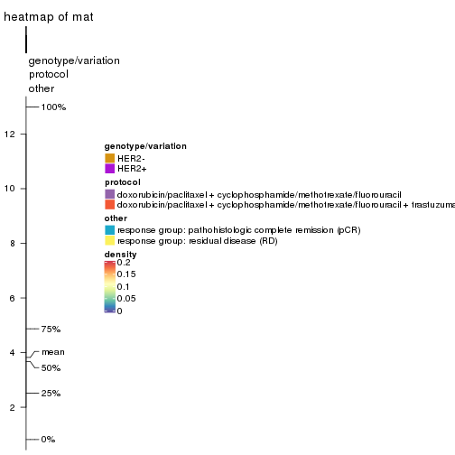


### Suggest the best k


Folowing table shows the best `k` (number of partitions) for each combination
of top-value methods and partition methods. Clicking on the method name in
the table goes to the section for a single combination of methods.

[The cola vignette](http://bioconductor.org/packages/devel/bioc/vignettes/cola/inst/doc/cola.html#toc_13)
explains the definition of the metrics used for determining the best
number of partitions.


```r
suggest_best_k(res_list)
```


|                            | The best k| 1-PAC| Mean silhouette| Concordance|   |Optional k |
|:---------------------------|----------:|-----:|---------------:|-----------:|:--|:----------|
|[CV:skmeans](#CV-skmeans)   |          2| 1.000|           0.961|       0.984|** |           |
|[ATC:kmeans](#ATC-kmeans)   |          3| 1.000|           0.954|       0.984|** |2          |
|[CV:kmeans](#CV-kmeans)     |          2| 0.999|           0.958|       0.982|** |           |
|[MAD:mclust](#MAD-mclust)   |          2| 0.990|           0.958|       0.957|** |           |
|[SD:skmeans](#SD-skmeans)   |          2| 0.972|           0.952|       0.980|** |           |
|[MAD:skmeans](#MAD-skmeans) |          2| 0.960|           0.950|       0.980|** |           |
|[ATC:skmeans](#ATC-skmeans) |          3| 0.957|           0.936|       0.971|** |2          |
|[SD:kmeans](#SD-kmeans)     |          2| 0.946|           0.928|       0.972|*  |           |
|[MAD:kmeans](#MAD-kmeans)   |          2| 0.933|           0.931|       0.972|*  |           |
|[CV:pam](#CV-pam)           |          2| 0.929|           0.937|       0.971|*  |           |
|[CV:NMF](#CV-NMF)           |          2| 0.919|           0.932|       0.971|*  |           |
|[ATC:pam](#ATC-pam)         |          5| 0.911|           0.840|       0.940|*  |2,3        |
|[ATC:hclust](#ATC-hclust)   |          2| 0.708|           0.873|       0.935|   |           |
|[CV:mclust](#CV-mclust)     |          6| 0.697|           0.677|       0.783|   |           |
|[SD:NMF](#SD-NMF)           |          2| 0.683|           0.851|       0.936|   |           |
|[ATC:mclust](#ATC-mclust)   |          2| 0.594|           0.863|       0.932|   |           |
|[MAD:NMF](#MAD-NMF)         |          2| 0.545|           0.783|       0.908|   |           |
|[SD:mclust](#SD-mclust)     |          2| 0.410|           0.822|       0.864|   |           |
|[ATC:NMF](#ATC-NMF)         |          3| 0.387|           0.617|       0.797|   |           |
|[MAD:hclust](#MAD-hclust)   |          2| 0.339|           0.785|       0.881|   |           |
|[SD:pam](#SD-pam)           |          3| 0.308|           0.590|       0.760|   |           |
|[MAD:pam](#MAD-pam)         |          3| 0.305|           0.581|       0.789|   |           |
|[CV:hclust](#CV-hclust)     |          2| 0.299|           0.689|       0.841|   |           |
|[SD:hclust](#SD-hclust)     |          3| 0.272|           0.606|       0.773|   |           |

\*\*: 1-PAC > 0.95, \*: 1-PAC > 0.9


### CDF of consensus matrices

Cumulative distribution function curves of consensus matrix for all methods.


```r
collect_plots(res_list, fun = plot_ecdf)
```

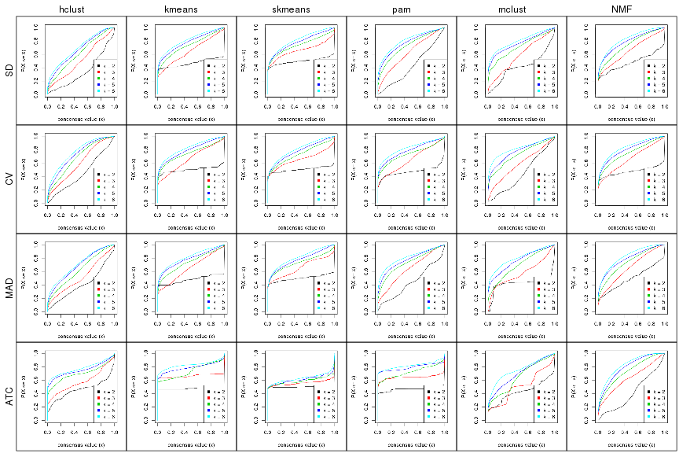


### Consensus heatmap

Consensus heatmaps for all methods. ([What is a consensus heatmap?](http://bioconductor.org/packages/devel/bioc/vignettes/cola/inst/doc/cola.html#toc_9))


<style type='text/css'>


.ui-helper-hidden {
	display: none;
}
.ui-helper-hidden-accessible {
	border: 0;
	clip: rect(0 0 0 0);
	height: 1px;
	margin: -1px;
	overflow: hidden;
	padding: 0;
	position: absolute;
	width: 1px;
}
.ui-helper-reset {
	margin: 0;
	padding: 0;
	border: 0;
	outline: 0;
	line-height: 1.3;
	text-decoration: none;
	font-size: 100%;
	list-style: none;
}
.ui-helper-clearfix:before,
.ui-helper-clearfix:after {
	content: "";
	display: table;
	border-collapse: collapse;
}
.ui-helper-clearfix:after {
	clear: both;
}
.ui-helper-zfix {
	width: 100%;
	height: 100%;
	top: 0;
	left: 0;
	position: absolute;
	opacity: 0;
	filter:Alpha(Opacity=0); 
}

.ui-front {
	z-index: 100;
}


.ui-state-disabled {
	cursor: default !important;
	pointer-events: none;
}


.ui-icon {
	display: inline-block;
	vertical-align: middle;
	margin-top: -.25em;
	position: relative;
	text-indent: -99999px;
	overflow: hidden;
	background-repeat: no-repeat;
}

.ui-widget-icon-block {
	left: 50%;
	margin-left: -8px;
	display: block;
}


.ui-widget-overlay {
	position: fixed;
	top: 0;
	left: 0;
	width: 100%;
	height: 100%;
}
.ui-accordion .ui-accordion-header {
	display: block;
	cursor: pointer;
	position: relative;
	margin: 2px 0 0 0;
	padding: .5em .5em .5em .7em;
	font-size: 100%;
}
.ui-accordion .ui-accordion-content {
	padding: 1em 2.2em;
	border-top: 0;
	overflow: auto;
}
.ui-autocomplete {
	position: absolute;
	top: 0;
	left: 0;
	cursor: default;
}
.ui-menu {
	list-style: none;
	padding: 0;
	margin: 0;
	display: block;
	outline: 0;
}
.ui-menu .ui-menu {
	position: absolute;
}
.ui-menu .ui-menu-item {
	margin: 0;
	cursor: pointer;
	
	list-style-image: url("data:image/gif;base64,R0lGODlhAQABAIAAAAAAAP///yH5BAEAAAAALAAAAAABAAEAAAIBRAA7");
}
.ui-menu .ui-menu-item-wrapper {
	position: relative;
	padding: 3px 1em 3px .4em;
}
.ui-menu .ui-menu-divider {
	margin: 5px 0;
	height: 0;
	font-size: 0;
	line-height: 0;
	border-width: 1px 0 0 0;
}
.ui-menu .ui-state-focus,
.ui-menu .ui-state-active {
	margin: -1px;
}


.ui-menu-icons {
	position: relative;
}
.ui-menu-icons .ui-menu-item-wrapper {
	padding-left: 2em;
}


.ui-menu .ui-icon {
	position: absolute;
	top: 0;
	bottom: 0;
	left: .2em;
	margin: auto 0;
}


.ui-menu .ui-menu-icon {
	left: auto;
	right: 0;
}
.ui-button {
	padding: .4em 1em;
	display: inline-block;
	position: relative;
	line-height: normal;
	margin-right: .1em;
	cursor: pointer;
	vertical-align: middle;
	text-align: center;
	-webkit-user-select: none;
	-moz-user-select: none;
	-ms-user-select: none;
	user-select: none;

	
	overflow: visible;
}

.ui-button,
.ui-button:link,
.ui-button:visited,
.ui-button:hover,
.ui-button:active {
	text-decoration: none;
}


.ui-button-icon-only {
	width: 2em;
	box-sizing: border-box;
	text-indent: -9999px;
	white-space: nowrap;
}


input.ui-button.ui-button-icon-only {
	text-indent: 0;
}


.ui-button-icon-only .ui-icon {
	position: absolute;
	top: 50%;
	left: 50%;
	margin-top: -8px;
	margin-left: -8px;
}

.ui-button.ui-icon-notext .ui-icon {
	padding: 0;
	width: 2.1em;
	height: 2.1em;
	text-indent: -9999px;
	white-space: nowrap;

}

input.ui-button.ui-icon-notext .ui-icon {
	width: auto;
	height: auto;
	text-indent: 0;
	white-space: normal;
	padding: .4em 1em;
}


input.ui-button::-moz-focus-inner,
button.ui-button::-moz-focus-inner {
	border: 0;
	padding: 0;
}
.ui-controlgroup {
	vertical-align: middle;
	display: inline-block;
}
.ui-controlgroup > .ui-controlgroup-item {
	float: left;
	margin-left: 0;
	margin-right: 0;
}
.ui-controlgroup > .ui-controlgroup-item:focus,
.ui-controlgroup > .ui-controlgroup-item.ui-visual-focus {
	z-index: 9999;
}
.ui-controlgroup-vertical > .ui-controlgroup-item {
	display: block;
	float: none;
	width: 100%;
	margin-top: 0;
	margin-bottom: 0;
	text-align: left;
}
.ui-controlgroup-vertical .ui-controlgroup-item {
	box-sizing: border-box;
}
.ui-controlgroup .ui-controlgroup-label {
	padding: .4em 1em;
}
.ui-controlgroup .ui-controlgroup-label span {
	font-size: 80%;
}
.ui-controlgroup-horizontal .ui-controlgroup-label + .ui-controlgroup-item {
	border-left: none;
}
.ui-controlgroup-vertical .ui-controlgroup-label + .ui-controlgroup-item {
	border-top: none;
}
.ui-controlgroup-horizontal .ui-controlgroup-label.ui-widget-content {
	border-right: none;
}
.ui-controlgroup-vertical .ui-controlgroup-label.ui-widget-content {
	border-bottom: none;
}


.ui-controlgroup-vertical .ui-spinner-input {

	
	width: 75%;
	width: calc( 100% - 2.4em );
}
.ui-controlgroup-vertical .ui-spinner .ui-spinner-up {
	border-top-style: solid;
}

.ui-checkboxradio-label .ui-icon-background {
	box-shadow: inset 1px 1px 1px #ccc;
	border-radius: .12em;
	border: none;
}
.ui-checkboxradio-radio-label .ui-icon-background {
	width: 16px;
	height: 16px;
	border-radius: 1em;
	overflow: visible;
	border: none;
}
.ui-checkboxradio-radio-label.ui-checkboxradio-checked .ui-icon,
.ui-checkboxradio-radio-label.ui-checkboxradio-checked:hover .ui-icon {
	background-image: none;
	width: 8px;
	height: 8px;
	border-width: 4px;
	border-style: solid;
}
.ui-checkboxradio-disabled {
	pointer-events: none;
}
.ui-datepicker {
	width: 17em;
	padding: .2em .2em 0;
	display: none;
}
.ui-datepicker .ui-datepicker-header {
	position: relative;
	padding: .2em 0;
}
.ui-datepicker .ui-datepicker-prev,
.ui-datepicker .ui-datepicker-next {
	position: absolute;
	top: 2px;
	width: 1.8em;
	height: 1.8em;
}
.ui-datepicker .ui-datepicker-prev-hover,
.ui-datepicker .ui-datepicker-next-hover {
	top: 1px;
}
.ui-datepicker .ui-datepicker-prev {
	left: 2px;
}
.ui-datepicker .ui-datepicker-next {
	right: 2px;
}
.ui-datepicker .ui-datepicker-prev-hover {
	left: 1px;
}
.ui-datepicker .ui-datepicker-next-hover {
	right: 1px;
}
.ui-datepicker .ui-datepicker-prev span,
.ui-datepicker .ui-datepicker-next span {
	display: block;
	position: absolute;
	left: 50%;
	margin-left: -8px;
	top: 50%;
	margin-top: -8px;
}
.ui-datepicker .ui-datepicker-title {
	margin: 0 2.3em;
	line-height: 1.8em;
	text-align: center;
}
.ui-datepicker .ui-datepicker-title select {
	font-size: 1em;
	margin: 1px 0;
}
.ui-datepicker select.ui-datepicker-month,
.ui-datepicker select.ui-datepicker-year {
	width: 45%;
}
.ui-datepicker table {
	width: 100%;
	font-size: .9em;
	border-collapse: collapse;
	margin: 0 0 .4em;
}
.ui-datepicker th {
	padding: .7em .3em;
	text-align: center;
	font-weight: bold;
	border: 0;
}
.ui-datepicker td {
	border: 0;
	padding: 1px;
}
.ui-datepicker td span,
.ui-datepicker td a {
	display: block;
	padding: .2em;
	text-align: right;
	text-decoration: none;
}
.ui-datepicker .ui-datepicker-buttonpane {
	background-image: none;
	margin: .7em 0 0 0;
	padding: 0 .2em;
	border-left: 0;
	border-right: 0;
	border-bottom: 0;
}
.ui-datepicker .ui-datepicker-buttonpane button {
	float: right;
	margin: .5em .2em .4em;
	cursor: pointer;
	padding: .2em .6em .3em .6em;
	width: auto;
	overflow: visible;
}
.ui-datepicker .ui-datepicker-buttonpane button.ui-datepicker-current {
	float: left;
}


.ui-datepicker.ui-datepicker-multi {
	width: auto;
}
.ui-datepicker-multi .ui-datepicker-group {
	float: left;
}
.ui-datepicker-multi .ui-datepicker-group table {
	width: 95%;
	margin: 0 auto .4em;
}
.ui-datepicker-multi-2 .ui-datepicker-group {
	width: 50%;
}
.ui-datepicker-multi-3 .ui-datepicker-group {
	width: 33.3%;
}
.ui-datepicker-multi-4 .ui-datepicker-group {
	width: 25%;
}
.ui-datepicker-multi .ui-datepicker-group-last .ui-datepicker-header,
.ui-datepicker-multi .ui-datepicker-group-middle .ui-datepicker-header {
	border-left-width: 0;
}
.ui-datepicker-multi .ui-datepicker-buttonpane {
	clear: left;
}
.ui-datepicker-row-break {
	clear: both;
	width: 100%;
	font-size: 0;
}


.ui-datepicker-rtl {
	direction: rtl;
}
.ui-datepicker-rtl .ui-datepicker-prev {
	right: 2px;
	left: auto;
}
.ui-datepicker-rtl .ui-datepicker-next {
	left: 2px;
	right: auto;
}
.ui-datepicker-rtl .ui-datepicker-prev:hover {
	right: 1px;
	left: auto;
}
.ui-datepicker-rtl .ui-datepicker-next:hover {
	left: 1px;
	right: auto;
}
.ui-datepicker-rtl .ui-datepicker-buttonpane {
	clear: right;
}
.ui-datepicker-rtl .ui-datepicker-buttonpane button {
	float: left;
}
.ui-datepicker-rtl .ui-datepicker-buttonpane button.ui-datepicker-current,
.ui-datepicker-rtl .ui-datepicker-group {
	float: right;
}
.ui-datepicker-rtl .ui-datepicker-group-last .ui-datepicker-header,
.ui-datepicker-rtl .ui-datepicker-group-middle .ui-datepicker-header {
	border-right-width: 0;
	border-left-width: 1px;
}


.ui-datepicker .ui-icon {
	display: block;
	text-indent: -99999px;
	overflow: hidden;
	background-repeat: no-repeat;
	left: .5em;
	top: .3em;
}
.ui-dialog {
	position: absolute;
	top: 0;
	left: 0;
	padding: .2em;
	outline: 0;
}
.ui-dialog .ui-dialog-titlebar {
	padding: .4em 1em;
	position: relative;
}
.ui-dialog .ui-dialog-title {
	float: left;
	margin: .1em 0;
	white-space: nowrap;
	width: 90%;
	overflow: hidden;
	text-overflow: ellipsis;
}
.ui-dialog .ui-dialog-titlebar-close {
	position: absolute;
	right: .3em;
	top: 50%;
	width: 20px;
	margin: -10px 0 0 0;
	padding: 1px;
	height: 20px;
}
.ui-dialog .ui-dialog-content {
	position: relative;
	border: 0;
	padding: .5em 1em;
	background: none;
	overflow: auto;
}
.ui-dialog .ui-dialog-buttonpane {
	text-align: left;
	border-width: 1px 0 0 0;
	background-image: none;
	margin-top: .5em;
	padding: .3em 1em .5em .4em;
}
.ui-dialog .ui-dialog-buttonpane .ui-dialog-buttonset {
	float: right;
}
.ui-dialog .ui-dialog-buttonpane button {
	margin: .5em .4em .5em 0;
	cursor: pointer;
}
.ui-dialog .ui-resizable-n {
	height: 2px;
	top: 0;
}
.ui-dialog .ui-resizable-e {
	width: 2px;
	right: 0;
}
.ui-dialog .ui-resizable-s {
	height: 2px;
	bottom: 0;
}
.ui-dialog .ui-resizable-w {
	width: 2px;
	left: 0;
}
.ui-dialog .ui-resizable-se,
.ui-dialog .ui-resizable-sw,
.ui-dialog .ui-resizable-ne,
.ui-dialog .ui-resizable-nw {
	width: 7px;
	height: 7px;
}
.ui-dialog .ui-resizable-se {
	right: 0;
	bottom: 0;
}
.ui-dialog .ui-resizable-sw {
	left: 0;
	bottom: 0;
}
.ui-dialog .ui-resizable-ne {
	right: 0;
	top: 0;
}
.ui-dialog .ui-resizable-nw {
	left: 0;
	top: 0;
}
.ui-draggable .ui-dialog-titlebar {
	cursor: move;
}
.ui-draggable-handle {
	-ms-touch-action: none;
	touch-action: none;
}
.ui-resizable {
	position: relative;
}
.ui-resizable-handle {
	position: absolute;
	font-size: 0.1px;
	display: block;
	-ms-touch-action: none;
	touch-action: none;
}
.ui-resizable-disabled .ui-resizable-handle,
.ui-resizable-autohide .ui-resizable-handle {
	display: none;
}
.ui-resizable-n {
	cursor: n-resize;
	height: 7px;
	width: 100%;
	top: -5px;
	left: 0;
}
.ui-resizable-s {
	cursor: s-resize;
	height: 7px;
	width: 100%;
	bottom: -5px;
	left: 0;
}
.ui-resizable-e {
	cursor: e-resize;
	width: 7px;
	right: -5px;
	top: 0;
	height: 100%;
}
.ui-resizable-w {
	cursor: w-resize;
	width: 7px;
	left: -5px;
	top: 0;
	height: 100%;
}
.ui-resizable-se {
	cursor: se-resize;
	width: 12px;
	height: 12px;
	right: 1px;
	bottom: 1px;
}
.ui-resizable-sw {
	cursor: sw-resize;
	width: 9px;
	height: 9px;
	left: -5px;
	bottom: -5px;
}
.ui-resizable-nw {
	cursor: nw-resize;
	width: 9px;
	height: 9px;
	left: -5px;
	top: -5px;
}
.ui-resizable-ne {
	cursor: ne-resize;
	width: 9px;
	height: 9px;
	right: -5px;
	top: -5px;
}
.ui-progressbar {
	height: 2em;
	text-align: left;
	overflow: hidden;
}
.ui-progressbar .ui-progressbar-value {
	margin: -1px;
	height: 100%;
}
.ui-progressbar .ui-progressbar-overlay {
	background: url("");
	height: 100%;
	filter: alpha(opacity=25); 
	opacity: 0.25;
}
.ui-progressbar-indeterminate .ui-progressbar-value {
	background-image: none;
}
.ui-selectable {
	-ms-touch-action: none;
	touch-action: none;
}
.ui-selectable-helper {
	position: absolute;
	z-index: 100;
	border: 1px dotted black;
}
.ui-selectmenu-menu {
	padding: 0;
	margin: 0;
	position: absolute;
	top: 0;
	left: 0;
	display: none;
}
.ui-selectmenu-menu .ui-menu {
	overflow: auto;
	overflow-x: hidden;
	padding-bottom: 1px;
}
.ui-selectmenu-menu .ui-menu .ui-selectmenu-optgroup {
	font-size: 1em;
	font-weight: bold;
	line-height: 1.5;
	padding: 2px 0.4em;
	margin: 0.5em 0 0 0;
	height: auto;
	border: 0;
}
.ui-selectmenu-open {
	display: block;
}
.ui-selectmenu-text {
	display: block;
	margin-right: 20px;
	overflow: hidden;
	text-overflow: ellipsis;
}
.ui-selectmenu-button.ui-button {
	text-align: left;
	white-space: nowrap;
	width: 14em;
}
.ui-selectmenu-icon.ui-icon {
	float: right;
	margin-top: 0;
}
.ui-slider {
	position: relative;
	text-align: left;
}
.ui-slider .ui-slider-handle {
	position: absolute;
	z-index: 2;
	width: 1.2em;
	height: 1.2em;
	cursor: default;
	-ms-touch-action: none;
	touch-action: none;
}
.ui-slider .ui-slider-range {
	position: absolute;
	z-index: 1;
	font-size: .7em;
	display: block;
	border: 0;
	background-position: 0 0;
}


.ui-slider.ui-state-disabled .ui-slider-handle,
.ui-slider.ui-state-disabled .ui-slider-range {
	filter: inherit;
}

.ui-slider-horizontal {
	height: .8em;
}
.ui-slider-horizontal .ui-slider-handle {
	top: -.3em;
	margin-left: -.6em;
}
.ui-slider-horizontal .ui-slider-range {
	top: 0;
	height: 100%;
}
.ui-slider-horizontal .ui-slider-range-min {
	left: 0;
}
.ui-slider-horizontal .ui-slider-range-max {
	right: 0;
}

.ui-slider-vertical {
	width: .8em;
	height: 100px;
}
.ui-slider-vertical .ui-slider-handle {
	left: -.3em;
	margin-left: 0;
	margin-bottom: -.6em;
}
.ui-slider-vertical .ui-slider-range {
	left: 0;
	width: 100%;
}
.ui-slider-vertical .ui-slider-range-min {
	bottom: 0;
}
.ui-slider-vertical .ui-slider-range-max {
	top: 0;
}
.ui-sortable-handle {
	-ms-touch-action: none;
	touch-action: none;
}
.ui-spinner {
	position: relative;
	display: inline-block;
	overflow: hidden;
	padding: 0;
	vertical-align: middle;
}
.ui-spinner-input {
	border: none;
	background: none;
	color: inherit;
	padding: .222em 0;
	margin: .2em 0;
	vertical-align: middle;
	margin-left: .4em;
	margin-right: 2em;
}
.ui-spinner-button {
	width: 1.6em;
	height: 50%;
	font-size: .5em;
	padding: 0;
	margin: 0;
	text-align: center;
	position: absolute;
	cursor: default;
	display: block;
	overflow: hidden;
	right: 0;
}

.ui-spinner a.ui-spinner-button {
	border-top-style: none;
	border-bottom-style: none;
	border-right-style: none;
}
.ui-spinner-up {
	top: 0;
}
.ui-spinner-down {
	bottom: 0;
}
.ui-tabs {
	position: relative;
	padding: .2em;
}
.ui-tabs .ui-tabs-nav {
	margin: 0;
	padding: .2em .2em 0;
}
.ui-tabs .ui-tabs-nav li {
	list-style: none;
	float: left;
	position: relative;
	top: 0;
	margin: 1px .2em 0 0;
	border-bottom-width: 0;
	padding: 0;
	white-space: nowrap;
}
.ui-tabs .ui-tabs-nav .ui-tabs-anchor {
	float: left;
	padding: .5em 1em;
	text-decoration: none;
}
.ui-tabs .ui-tabs-nav li.ui-tabs-active {
	margin-bottom: -1px;
	padding-bottom: 1px;
}
.ui-tabs .ui-tabs-nav li.ui-tabs-active .ui-tabs-anchor,
.ui-tabs .ui-tabs-nav li.ui-state-disabled .ui-tabs-anchor,
.ui-tabs .ui-tabs-nav li.ui-tabs-loading .ui-tabs-anchor {
	cursor: text;
}
.ui-tabs-collapsible .ui-tabs-nav li.ui-tabs-active .ui-tabs-anchor {
	cursor: pointer;
}
.ui-tabs .ui-tabs-panel {
	display: block;
	border-width: 0;
	padding: 1em 1.4em;
	background: none;
}
.ui-tooltip {
	padding: 8px;
	position: absolute;
	z-index: 9999;
	max-width: 300px;
}
body .ui-tooltip {
	border-width: 2px;
}

.ui-widget {
	font-family: Arial,Helvetica,sans-serif;
	font-size: 1em;
}
.ui-widget .ui-widget {
	font-size: 1em;
}
.ui-widget input,
.ui-widget select,
.ui-widget textarea,
.ui-widget button {
	font-family: Arial,Helvetica,sans-serif;
	font-size: 1em;
}
.ui-widget.ui-widget-content {
	border: 1px solid #c5c5c5;
}
.ui-widget-content {
	border: 1px solid #dddddd;
	background: #ffffff;
	color: #333333;
}
.ui-widget-content a {
	color: #333333;
}
.ui-widget-header {
	border: 1px solid #dddddd;
	background: #e9e9e9;
	color: #333333;
	font-weight: bold;
}
.ui-widget-header a {
	color: #333333;
}


.ui-state-default,
.ui-widget-content .ui-state-default,
.ui-widget-header .ui-state-default,
.ui-button,


html .ui-button.ui-state-disabled:hover,
html .ui-button.ui-state-disabled:active {
	border: 1px solid #c5c5c5;
	background: #f6f6f6;
	font-weight: normal;
	color: #454545;
}
.ui-state-default a,
.ui-state-default a:link,
.ui-state-default a:visited,
a.ui-button,
a:link.ui-button,
a:visited.ui-button,
.ui-button {
	color: #454545;
	text-decoration: none;
}
.ui-state-hover,
.ui-widget-content .ui-state-hover,
.ui-widget-header .ui-state-hover,
.ui-state-focus,
.ui-widget-content .ui-state-focus,
.ui-widget-header .ui-state-focus,
.ui-button:hover,
.ui-button:focus {
	border: 1px solid #cccccc;
	background: #ededed;
	font-weight: normal;
	color: #2b2b2b;
}
.ui-state-hover a,
.ui-state-hover a:hover,
.ui-state-hover a:link,
.ui-state-hover a:visited,
.ui-state-focus a,
.ui-state-focus a:hover,
.ui-state-focus a:link,
.ui-state-focus a:visited,
a.ui-button:hover,
a.ui-button:focus {
	color: #2b2b2b;
	text-decoration: none;
}

.ui-visual-focus {
	box-shadow: 0 0 3px 1px rgb(94, 158, 214);
}
.ui-state-active,
.ui-widget-content .ui-state-active,
.ui-widget-header .ui-state-active,
a.ui-button:active,
.ui-button:active,
.ui-button.ui-state-active:hover {
	border: 1px solid #003eff;
	background: #007fff;
	font-weight: normal;
	color: #ffffff;
}
.ui-icon-background,
.ui-state-active .ui-icon-background {
	border: #003eff;
	background-color: #ffffff;
}
.ui-state-active a,
.ui-state-active a:link,
.ui-state-active a:visited {
	color: #ffffff;
	text-decoration: none;
}


.ui-state-highlight,
.ui-widget-content .ui-state-highlight,
.ui-widget-header .ui-state-highlight {
	border: 1px solid #dad55e;
	background: #fffa90;
	color: #777620;
}
.ui-state-checked {
	border: 1px solid #dad55e;
	background: #fffa90;
}
.ui-state-highlight a,
.ui-widget-content .ui-state-highlight a,
.ui-widget-header .ui-state-highlight a {
	color: #777620;
}
.ui-state-error,
.ui-widget-content .ui-state-error,
.ui-widget-header .ui-state-error {
	border: 1px solid #f1a899;
	background: #fddfdf;
	color: #5f3f3f;
}
.ui-state-error a,
.ui-widget-content .ui-state-error a,
.ui-widget-header .ui-state-error a {
	color: #5f3f3f;
}
.ui-state-error-text,
.ui-widget-content .ui-state-error-text,
.ui-widget-header .ui-state-error-text {
	color: #5f3f3f;
}
.ui-priority-primary,
.ui-widget-content .ui-priority-primary,
.ui-widget-header .ui-priority-primary {
	font-weight: bold;
}
.ui-priority-secondary,
.ui-widget-content .ui-priority-secondary,
.ui-widget-header .ui-priority-secondary {
	opacity: .7;
	filter:Alpha(Opacity=70); 
	font-weight: normal;
}
.ui-state-disabled,
.ui-widget-content .ui-state-disabled,
.ui-widget-header .ui-state-disabled {
	opacity: .35;
	filter:Alpha(Opacity=35); 
	background-image: none;
}
.ui-state-disabled .ui-icon {
	filter:Alpha(Opacity=35); 
}


.ui-icon {
	width: 16px;
	height: 16px;
}
.ui-icon,
.ui-widget-content .ui-icon {
	background-image: url("images/ui-icons_444444_256x240.png");
}
.ui-widget-header .ui-icon {
	background-image: url("images/ui-icons_444444_256x240.png");
}
.ui-state-hover .ui-icon,
.ui-state-focus .ui-icon,
.ui-button:hover .ui-icon,
.ui-button:focus .ui-icon {
	background-image: url("images/ui-icons_555555_256x240.png");
}
.ui-state-active .ui-icon,
.ui-button:active .ui-icon {
	background-image: url("images/ui-icons_ffffff_256x240.png");
}
.ui-state-highlight .ui-icon,
.ui-button .ui-state-highlight.ui-icon {
	background-image: url("images/ui-icons_777620_256x240.png");
}
.ui-state-error .ui-icon,
.ui-state-error-text .ui-icon {
	background-image: url("images/ui-icons_cc0000_256x240.png");
}
.ui-button .ui-icon {
	background-image: url("images/ui-icons_777777_256x240.png");
}


.ui-icon-blank { background-position: 16px 16px; }
.ui-icon-caret-1-n { background-position: 0 0; }
.ui-icon-caret-1-ne { background-position: -16px 0; }
.ui-icon-caret-1-e { background-position: -32px 0; }
.ui-icon-caret-1-se { background-position: -48px 0; }
.ui-icon-caret-1-s { background-position: -65px 0; }
.ui-icon-caret-1-sw { background-position: -80px 0; }
.ui-icon-caret-1-w { background-position: -96px 0; }
.ui-icon-caret-1-nw { background-position: -112px 0; }
.ui-icon-caret-2-n-s { background-position: -128px 0; }
.ui-icon-caret-2-e-w { background-position: -144px 0; }
.ui-icon-triangle-1-n { background-position: 0 -16px; }
.ui-icon-triangle-1-ne { background-position: -16px -16px; }
.ui-icon-triangle-1-e { background-position: -32px -16px; }
.ui-icon-triangle-1-se { background-position: -48px -16px; }
.ui-icon-triangle-1-s { background-position: -65px -16px; }
.ui-icon-triangle-1-sw { background-position: -80px -16px; }
.ui-icon-triangle-1-w { background-position: -96px -16px; }
.ui-icon-triangle-1-nw { background-position: -112px -16px; }
.ui-icon-triangle-2-n-s { background-position: -128px -16px; }
.ui-icon-triangle-2-e-w { background-position: -144px -16px; }
.ui-icon-arrow-1-n { background-position: 0 -32px; }
.ui-icon-arrow-1-ne { background-position: -16px -32px; }
.ui-icon-arrow-1-e { background-position: -32px -32px; }
.ui-icon-arrow-1-se { background-position: -48px -32px; }
.ui-icon-arrow-1-s { background-position: -65px -32px; }
.ui-icon-arrow-1-sw { background-position: -80px -32px; }
.ui-icon-arrow-1-w { background-position: -96px -32px; }
.ui-icon-arrow-1-nw { background-position: -112px -32px; }
.ui-icon-arrow-2-n-s { background-position: -128px -32px; }
.ui-icon-arrow-2-ne-sw { background-position: -144px -32px; }
.ui-icon-arrow-2-e-w { background-position: -160px -32px; }
.ui-icon-arrow-2-se-nw { background-position: -176px -32px; }
.ui-icon-arrowstop-1-n { background-position: -192px -32px; }
.ui-icon-arrowstop-1-e { background-position: -208px -32px; }
.ui-icon-arrowstop-1-s { background-position: -224px -32px; }
.ui-icon-arrowstop-1-w { background-position: -240px -32px; }
.ui-icon-arrowthick-1-n { background-position: 1px -48px; }
.ui-icon-arrowthick-1-ne { background-position: -16px -48px; }
.ui-icon-arrowthick-1-e { background-position: -32px -48px; }
.ui-icon-arrowthick-1-se { background-position: -48px -48px; }
.ui-icon-arrowthick-1-s { background-position: -64px -48px; }
.ui-icon-arrowthick-1-sw { background-position: -80px -48px; }
.ui-icon-arrowthick-1-w { background-position: -96px -48px; }
.ui-icon-arrowthick-1-nw { background-position: -112px -48px; }
.ui-icon-arrowthick-2-n-s { background-position: -128px -48px; }
.ui-icon-arrowthick-2-ne-sw { background-position: -144px -48px; }
.ui-icon-arrowthick-2-e-w { background-position: -160px -48px; }
.ui-icon-arrowthick-2-se-nw { background-position: -176px -48px; }
.ui-icon-arrowthickstop-1-n { background-position: -192px -48px; }
.ui-icon-arrowthickstop-1-e { background-position: -208px -48px; }
.ui-icon-arrowthickstop-1-s { background-position: -224px -48px; }
.ui-icon-arrowthickstop-1-w { background-position: -240px -48px; }
.ui-icon-arrowreturnthick-1-w { background-position: 0 -64px; }
.ui-icon-arrowreturnthick-1-n { background-position: -16px -64px; }
.ui-icon-arrowreturnthick-1-e { background-position: -32px -64px; }
.ui-icon-arrowreturnthick-1-s { background-position: -48px -64px; }
.ui-icon-arrowreturn-1-w { background-position: -64px -64px; }
.ui-icon-arrowreturn-1-n { background-position: -80px -64px; }
.ui-icon-arrowreturn-1-e { background-position: -96px -64px; }
.ui-icon-arrowreturn-1-s { background-position: -112px -64px; }
.ui-icon-arrowrefresh-1-w { background-position: -128px -64px; }
.ui-icon-arrowrefresh-1-n { background-position: -144px -64px; }
.ui-icon-arrowrefresh-1-e { background-position: -160px -64px; }
.ui-icon-arrowrefresh-1-s { background-position: -176px -64px; }
.ui-icon-arrow-4 { background-position: 0 -80px; }
.ui-icon-arrow-4-diag { background-position: -16px -80px; }
.ui-icon-extlink { background-position: -32px -80px; }
.ui-icon-newwin { background-position: -48px -80px; }
.ui-icon-refresh { background-position: -64px -80px; }
.ui-icon-shuffle { background-position: -80px -80px; }
.ui-icon-transfer-e-w { background-position: -96px -80px; }
.ui-icon-transferthick-e-w { background-position: -112px -80px; }
.ui-icon-folder-collapsed { background-position: 0 -96px; }
.ui-icon-folder-open { background-position: -16px -96px; }
.ui-icon-document { background-position: -32px -96px; }
.ui-icon-document-b { background-position: -48px -96px; }
.ui-icon-note { background-position: -64px -96px; }
.ui-icon-mail-closed { background-position: -80px -96px; }
.ui-icon-mail-open { background-position: -96px -96px; }
.ui-icon-suitcase { background-position: -112px -96px; }
.ui-icon-comment { background-position: -128px -96px; }
.ui-icon-person { background-position: -144px -96px; }
.ui-icon-print { background-position: -160px -96px; }
.ui-icon-trash { background-position: -176px -96px; }
.ui-icon-locked { background-position: -192px -96px; }
.ui-icon-unlocked { background-position: -208px -96px; }
.ui-icon-bookmark { background-position: -224px -96px; }
.ui-icon-tag { background-position: -240px -96px; }
.ui-icon-home { background-position: 0 -112px; }
.ui-icon-flag { background-position: -16px -112px; }
.ui-icon-calendar { background-position: -32px -112px; }
.ui-icon-cart { background-position: -48px -112px; }
.ui-icon-pencil { background-position: -64px -112px; }
.ui-icon-clock { background-position: -80px -112px; }
.ui-icon-disk { background-position: -96px -112px; }
.ui-icon-calculator { background-position: -112px -112px; }
.ui-icon-zoomin { background-position: -128px -112px; }
.ui-icon-zoomout { background-position: -144px -112px; }
.ui-icon-search { background-position: -160px -112px; }
.ui-icon-wrench { background-position: -176px -112px; }
.ui-icon-gear { background-position: -192px -112px; }
.ui-icon-heart { background-position: -208px -112px; }
.ui-icon-star { background-position: -224px -112px; }
.ui-icon-link { background-position: -240px -112px; }
.ui-icon-cancel { background-position: 0 -128px; }
.ui-icon-plus { background-position: -16px -128px; }
.ui-icon-plusthick { background-position: -32px -128px; }
.ui-icon-minus { background-position: -48px -128px; }
.ui-icon-minusthick { background-position: -64px -128px; }
.ui-icon-close { background-position: -80px -128px; }
.ui-icon-closethick { background-position: -96px -128px; }
.ui-icon-key { background-position: -112px -128px; }
.ui-icon-lightbulb { background-position: -128px -128px; }
.ui-icon-scissors { background-position: -144px -128px; }
.ui-icon-clipboard { background-position: -160px -128px; }
.ui-icon-copy { background-position: -176px -128px; }
.ui-icon-contact { background-position: -192px -128px; }
.ui-icon-image { background-position: -208px -128px; }
.ui-icon-video { background-position: -224px -128px; }
.ui-icon-script { background-position: -240px -128px; }
.ui-icon-alert { background-position: 0 -144px; }
.ui-icon-info { background-position: -16px -144px; }
.ui-icon-notice { background-position: -32px -144px; }
.ui-icon-help { background-position: -48px -144px; }
.ui-icon-check { background-position: -64px -144px; }
.ui-icon-bullet { background-position: -80px -144px; }
.ui-icon-radio-on { background-position: -96px -144px; }
.ui-icon-radio-off { background-position: -112px -144px; }
.ui-icon-pin-w { background-position: -128px -144px; }
.ui-icon-pin-s { background-position: -144px -144px; }
.ui-icon-play { background-position: 0 -160px; }
.ui-icon-pause { background-position: -16px -160px; }
.ui-icon-seek-next { background-position: -32px -160px; }
.ui-icon-seek-prev { background-position: -48px -160px; }
.ui-icon-seek-end { background-position: -64px -160px; }
.ui-icon-seek-start { background-position: -80px -160px; }

.ui-icon-seek-first { background-position: -80px -160px; }
.ui-icon-stop { background-position: -96px -160px; }
.ui-icon-eject { background-position: -112px -160px; }
.ui-icon-volume-off { background-position: -128px -160px; }
.ui-icon-volume-on { background-position: -144px -160px; }
.ui-icon-power { background-position: 0 -176px; }
.ui-icon-signal-diag { background-position: -16px -176px; }
.ui-icon-signal { background-position: -32px -176px; }
.ui-icon-battery-0 { background-position: -48px -176px; }
.ui-icon-battery-1 { background-position: -64px -176px; }
.ui-icon-battery-2 { background-position: -80px -176px; }
.ui-icon-battery-3 { background-position: -96px -176px; }
.ui-icon-circle-plus { background-position: 0 -192px; }
.ui-icon-circle-minus { background-position: -16px -192px; }
.ui-icon-circle-close { background-position: -32px -192px; }
.ui-icon-circle-triangle-e { background-position: -48px -192px; }
.ui-icon-circle-triangle-s { background-position: -64px -192px; }
.ui-icon-circle-triangle-w { background-position: -80px -192px; }
.ui-icon-circle-triangle-n { background-position: -96px -192px; }
.ui-icon-circle-arrow-e { background-position: -112px -192px; }
.ui-icon-circle-arrow-s { background-position: -128px -192px; }
.ui-icon-circle-arrow-w { background-position: -144px -192px; }
.ui-icon-circle-arrow-n { background-position: -160px -192px; }
.ui-icon-circle-zoomin { background-position: -176px -192px; }
.ui-icon-circle-zoomout { background-position: -192px -192px; }
.ui-icon-circle-check { background-position: -208px -192px; }
.ui-icon-circlesmall-plus { background-position: 0 -208px; }
.ui-icon-circlesmall-minus { background-position: -16px -208px; }
.ui-icon-circlesmall-close { background-position: -32px -208px; }
.ui-icon-squaresmall-plus { background-position: -48px -208px; }
.ui-icon-squaresmall-minus { background-position: -64px -208px; }
.ui-icon-squaresmall-close { background-position: -80px -208px; }
.ui-icon-grip-dotted-vertical { background-position: 0 -224px; }
.ui-icon-grip-dotted-horizontal { background-position: -16px -224px; }
.ui-icon-grip-solid-vertical { background-position: -32px -224px; }
.ui-icon-grip-solid-horizontal { background-position: -48px -224px; }
.ui-icon-gripsmall-diagonal-se { background-position: -64px -224px; }
.ui-icon-grip-diagonal-se { background-position: -80px -224px; }


.ui-corner-all,
.ui-corner-top,
.ui-corner-left,
.ui-corner-tl {
	border-top-left-radius: 3px;
}
.ui-corner-all,
.ui-corner-top,
.ui-corner-right,
.ui-corner-tr {
	border-top-right-radius: 3px;
}
.ui-corner-all,
.ui-corner-bottom,
.ui-corner-left,
.ui-corner-bl {
	border-bottom-left-radius: 3px;
}
.ui-corner-all,
.ui-corner-bottom,
.ui-corner-right,
.ui-corner-br {
	border-bottom-right-radius: 3px;
}


.ui-widget-overlay {
	background: #aaaaaa;
	opacity: .3;
	filter: Alpha(Opacity=30); 
}
.ui-widget-shadow {
	-webkit-box-shadow: 0px 0px 5px #666666;
	box-shadow: 0px 0px 5px #666666;
} 
</style>
<script src='js/jquery-1.12.4.js'></script>
<script src='js/jquery-ui.js'></script>

<script>
$( function() {
	$( '#tabs-collect-consensus-heatmap' ).tabs();
} );
</script>
<div id='tabs-collect-consensus-heatmap'>
<ul>
<li><a href='#tab-collect-consensus-heatmap-1'>k = 2</a></li>
<li><a href='#tab-collect-consensus-heatmap-2'>k = 3</a></li>
<li><a href='#tab-collect-consensus-heatmap-3'>k = 4</a></li>
<li><a href='#tab-collect-consensus-heatmap-4'>k = 5</a></li>
<li><a href='#tab-collect-consensus-heatmap-5'>k = 6</a></li>
</ul>
<div id='tab-collect-consensus-heatmap-1'>
<pre><code class="r">collect_plots(res_list, k = 2, fun = consensus_heatmap, mc.cores = 4)
</code></pre>

<p>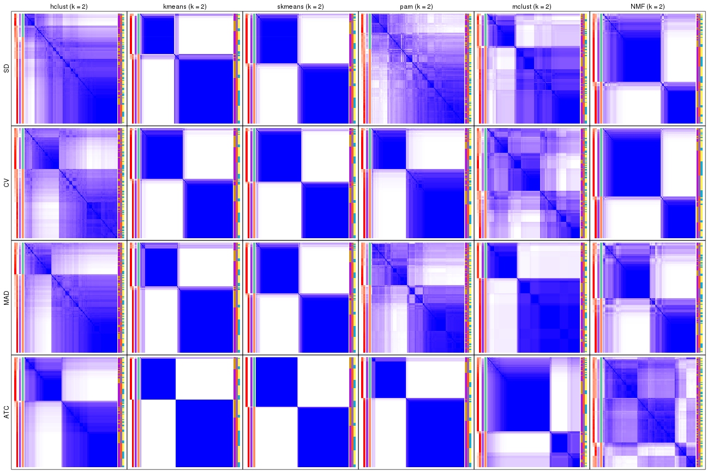</p>

</div>
<div id='tab-collect-consensus-heatmap-2'>
<pre><code class="r">collect_plots(res_list, k = 3, fun = consensus_heatmap, mc.cores = 4)
</code></pre>

<p>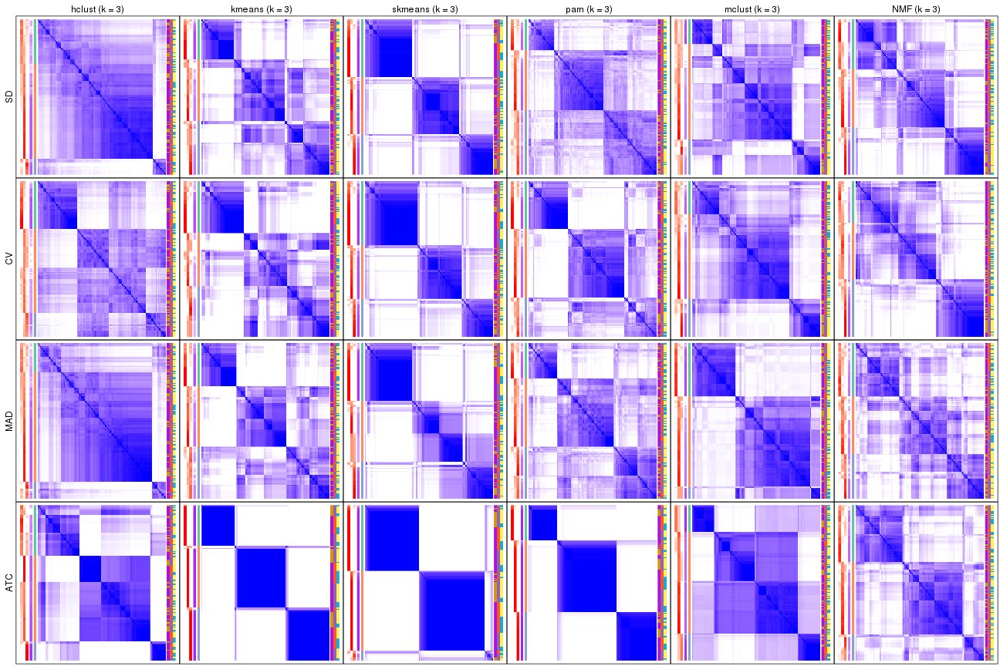</p>

</div>
<div id='tab-collect-consensus-heatmap-3'>
<pre><code class="r">collect_plots(res_list, k = 4, fun = consensus_heatmap, mc.cores = 4)
</code></pre>

<p>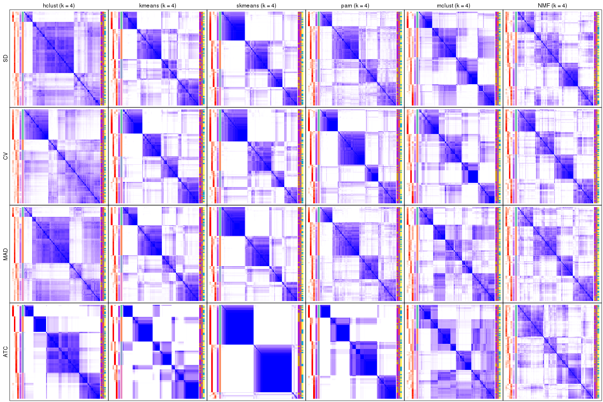</p>

</div>
<div id='tab-collect-consensus-heatmap-4'>
<pre><code class="r">collect_plots(res_list, k = 5, fun = consensus_heatmap, mc.cores = 4)
</code></pre>

<p>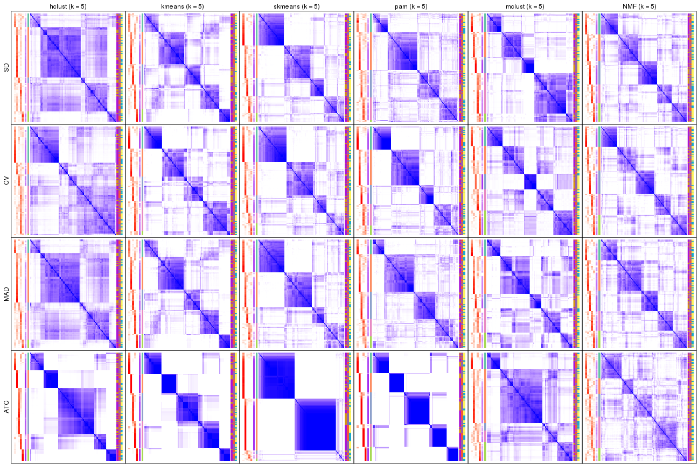</p>

</div>
<div id='tab-collect-consensus-heatmap-5'>
<pre><code class="r">collect_plots(res_list, k = 6, fun = consensus_heatmap, mc.cores = 4)
</code></pre>

<p>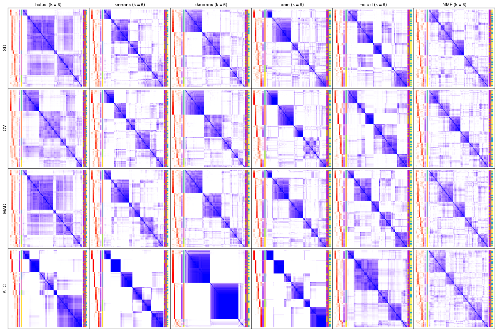</p>

</div>
</div>


### Membership heatmap

Membership heatmaps for all methods. ([What is a membership heatmap?](http://bioconductor.org/packages/devel/bioc/vignettes/cola/inst/doc/cola.html#toc_12))


<script>
$( function() {
	$( '#tabs-collect-membership-heatmap' ).tabs();
} );
</script>
<div id='tabs-collect-membership-heatmap'>
<ul>
<li><a href='#tab-collect-membership-heatmap-1'>k = 2</a></li>
<li><a href='#tab-collect-membership-heatmap-2'>k = 3</a></li>
<li><a href='#tab-collect-membership-heatmap-3'>k = 4</a></li>
<li><a href='#tab-collect-membership-heatmap-4'>k = 5</a></li>
<li><a href='#tab-collect-membership-heatmap-5'>k = 6</a></li>
</ul>
<div id='tab-collect-membership-heatmap-1'>
<pre><code class="r">collect_plots(res_list, k = 2, fun = membership_heatmap, mc.cores = 4)
</code></pre>

<p>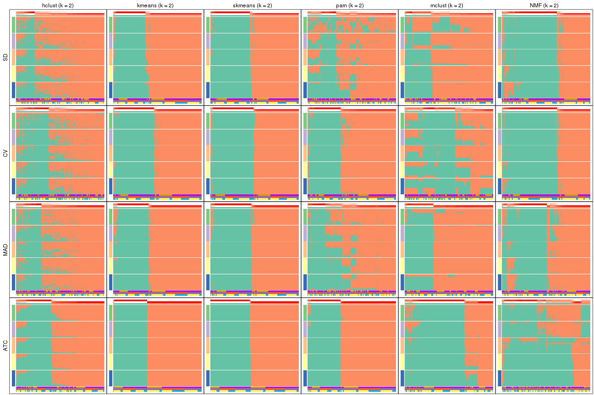</p>

</div>
<div id='tab-collect-membership-heatmap-2'>
<pre><code class="r">collect_plots(res_list, k = 3, fun = membership_heatmap, mc.cores = 4)
</code></pre>

<p>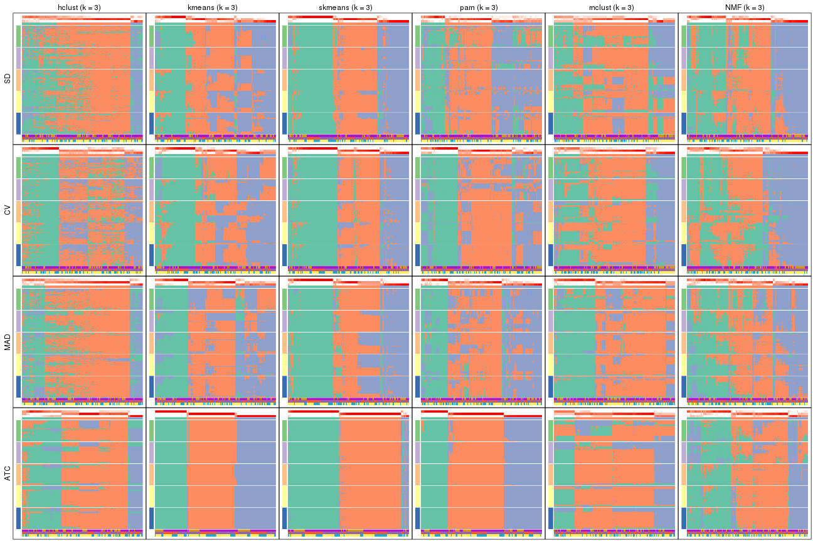</p>

</div>
<div id='tab-collect-membership-heatmap-3'>
<pre><code class="r">collect_plots(res_list, k = 4, fun = membership_heatmap, mc.cores = 4)
</code></pre>

<p>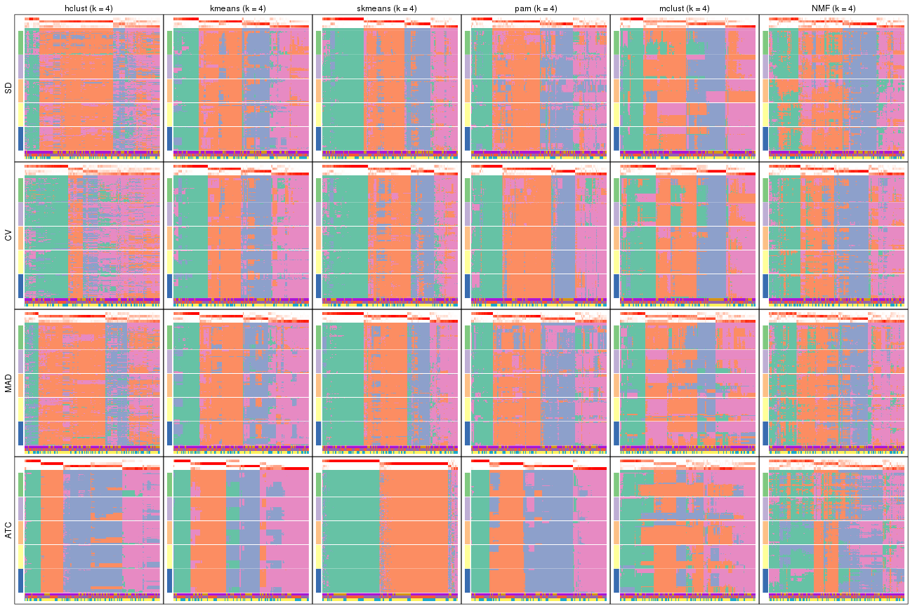</p>

</div>
<div id='tab-collect-membership-heatmap-4'>
<pre><code class="r">collect_plots(res_list, k = 5, fun = membership_heatmap, mc.cores = 4)
</code></pre>

<p>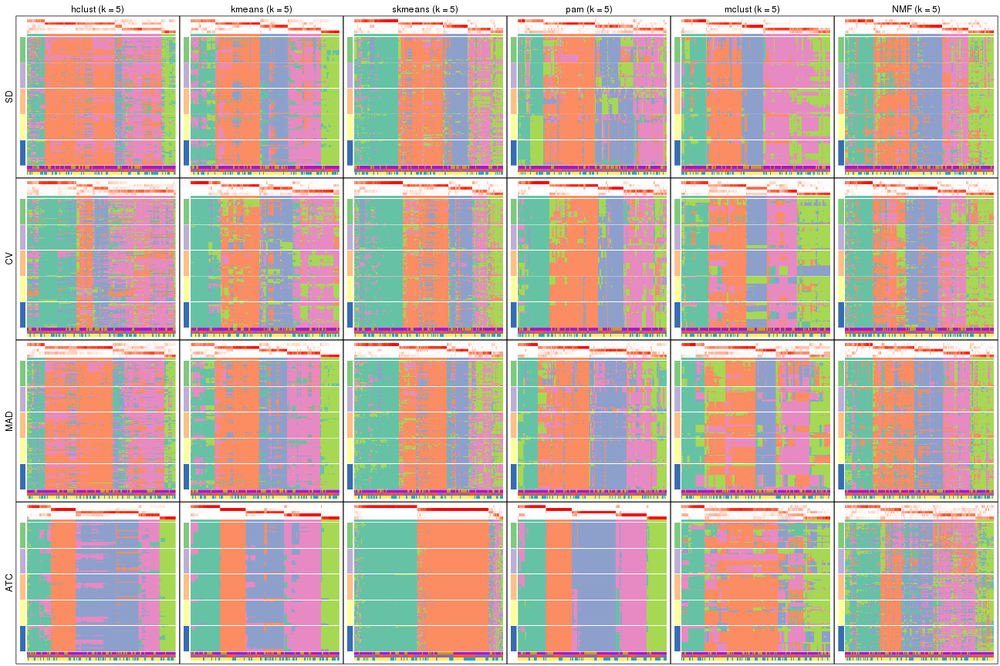</p>

</div>
<div id='tab-collect-membership-heatmap-5'>
<pre><code class="r">collect_plots(res_list, k = 6, fun = membership_heatmap, mc.cores = 4)
</code></pre>

<p>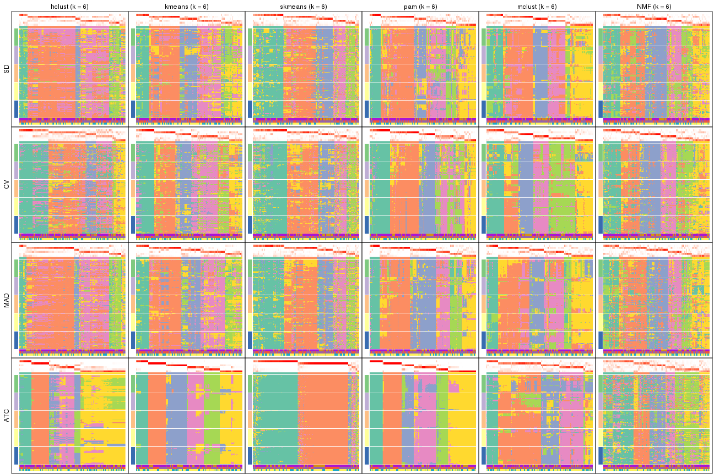</p>

</div>
</div>


### Signature heatmap

Signature heatmaps for all methods. ([What is a signature heatmap?](http://bioconductor.org/packages/devel/bioc/vignettes/cola/inst/doc/cola.html#toc_22))


Note in following heatmaps, rows are scaled.


<script>
$( function() {
	$( '#tabs-collect-get-signatures' ).tabs();
} );
</script>
<div id='tabs-collect-get-signatures'>
<ul>
<li><a href='#tab-collect-get-signatures-1'>k = 2</a></li>
<li><a href='#tab-collect-get-signatures-2'>k = 3</a></li>
<li><a href='#tab-collect-get-signatures-3'>k = 4</a></li>
<li><a href='#tab-collect-get-signatures-4'>k = 5</a></li>
<li><a href='#tab-collect-get-signatures-5'>k = 6</a></li>
</ul>
<div id='tab-collect-get-signatures-1'>
<pre><code class="r">collect_plots(res_list, k = 2, fun = get_signatures, mc.cores = 4)
</code></pre>

<p>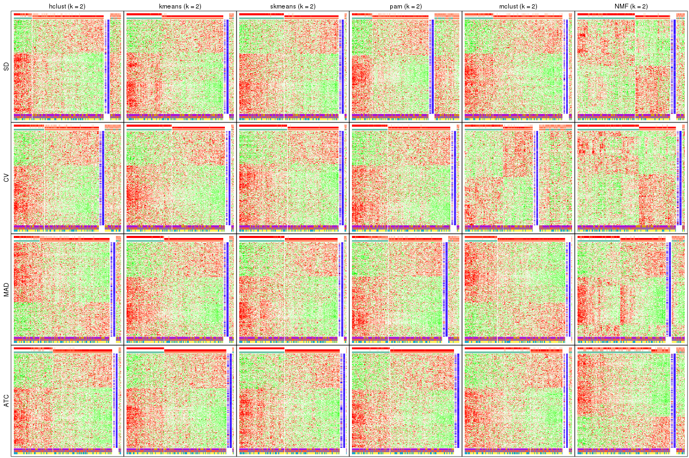</p>

</div>
<div id='tab-collect-get-signatures-2'>
<pre><code class="r">collect_plots(res_list, k = 3, fun = get_signatures, mc.cores = 4)
</code></pre>

<p>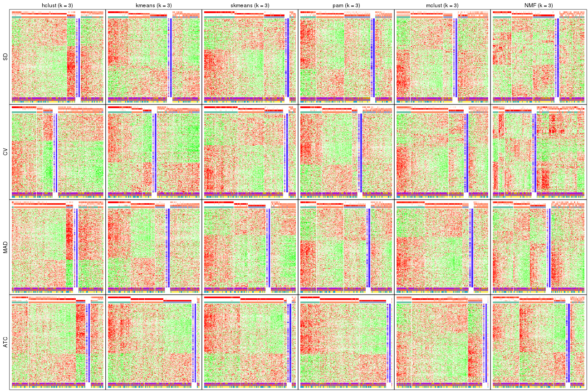</p>

</div>
<div id='tab-collect-get-signatures-3'>
<pre><code class="r">collect_plots(res_list, k = 4, fun = get_signatures, mc.cores = 4)
</code></pre>

<p>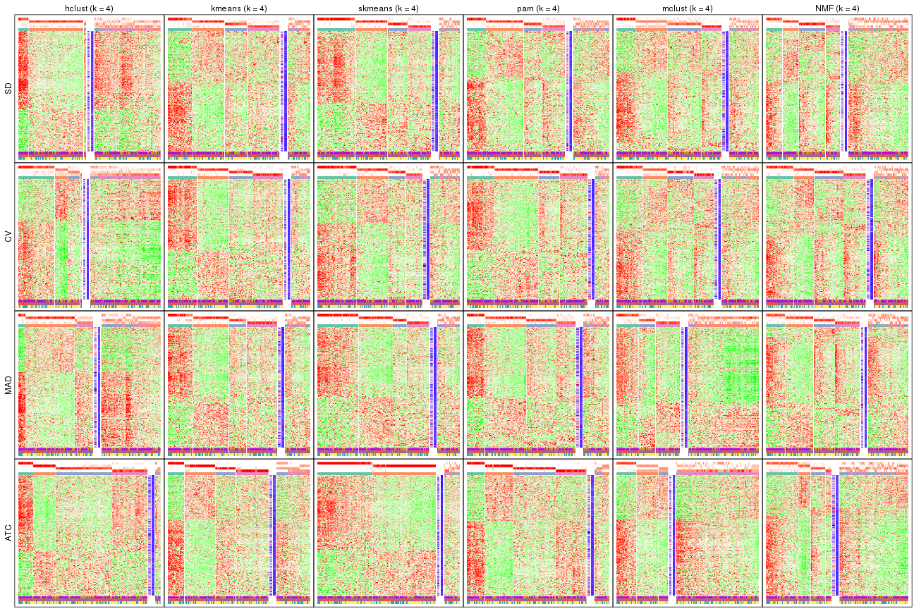</p>

</div>
<div id='tab-collect-get-signatures-4'>
<pre><code class="r">collect_plots(res_list, k = 5, fun = get_signatures, mc.cores = 4)
</code></pre>

<p>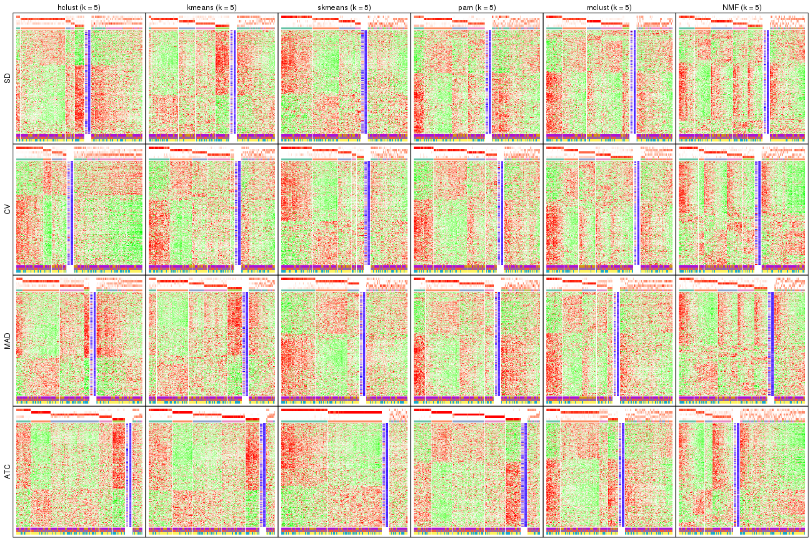</p>

</div>
<div id='tab-collect-get-signatures-5'>
<pre><code class="r">collect_plots(res_list, k = 6, fun = get_signatures, mc.cores = 4)
</code></pre>

<p>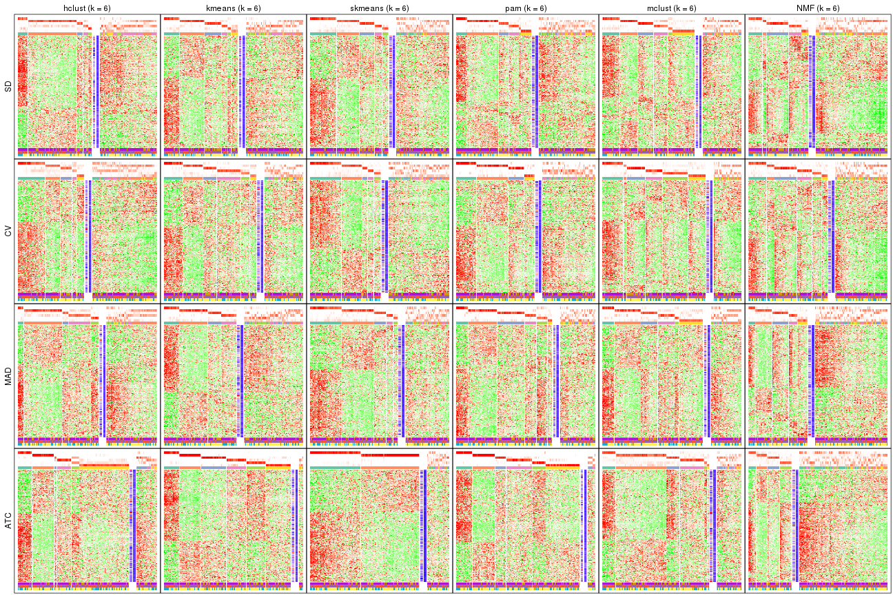</p>

</div>
</div>


### Statistics table

The statistics used for measuring the stability of consensus partitioning.
([How are they
defined?](http://bioconductor.org/packages/devel/bioc/vignettes/cola/inst/doc/cola.html#toc_13))


<script>
$( function() {
	$( '#tabs-get-stats-from-consensus-partition-list' ).tabs();
} );
</script>
<div id='tabs-get-stats-from-consensus-partition-list'>
<ul>
<li><a href='#tab-get-stats-from-consensus-partition-list-1'>k = 2</a></li>
<li><a href='#tab-get-stats-from-consensus-partition-list-2'>k = 3</a></li>
<li><a href='#tab-get-stats-from-consensus-partition-list-3'>k = 4</a></li>
<li><a href='#tab-get-stats-from-consensus-partition-list-4'>k = 5</a></li>
<li><a href='#tab-get-stats-from-consensus-partition-list-5'>k = 6</a></li>
</ul>
<div id='tab-get-stats-from-consensus-partition-list-1'>
<pre><code class="r">get_stats(res_list, k = 2)
</code></pre>

<pre><code>#&gt;             k 1-PAC mean_silhouette concordance area_increased  Rand Jaccard
#&gt; SD:NMF      2 0.683           0.851       0.936          0.480 0.527   0.527
#&gt; CV:NMF      2 0.919           0.932       0.971          0.475 0.527   0.527
#&gt; MAD:NMF     2 0.545           0.783       0.908          0.497 0.497   0.497
#&gt; ATC:NMF     2 0.337           0.567       0.778          0.413 0.650   0.650
#&gt; SD:skmeans  2 0.972           0.952       0.980          0.499 0.502   0.502
#&gt; CV:skmeans  2 1.000           0.961       0.984          0.503 0.497   0.497
#&gt; MAD:skmeans 2 0.960           0.950       0.980          0.500 0.500   0.500
#&gt; ATC:skmeans 2 1.000           0.991       0.997          0.499 0.502   0.502
#&gt; SD:mclust   2 0.410           0.822       0.864          0.415 0.581   0.581
#&gt; CV:mclust   2 0.200           0.560       0.787          0.442 0.507   0.507
#&gt; MAD:mclust  2 0.990           0.958       0.957          0.423 0.562   0.562
#&gt; ATC:mclust  2 0.594           0.863       0.932          0.428 0.557   0.557
#&gt; SD:kmeans   2 0.946           0.928       0.972          0.469 0.533   0.533
#&gt; CV:kmeans   2 0.999           0.958       0.982          0.500 0.500   0.500
#&gt; MAD:kmeans  2 0.933           0.931       0.972          0.479 0.518   0.518
#&gt; ATC:kmeans  2 1.000           0.985       0.994          0.474 0.524   0.524
#&gt; SD:pam      2 0.245           0.634       0.825          0.429 0.562   0.562
#&gt; CV:pam      2 0.929           0.937       0.971          0.471 0.530   0.530
#&gt; MAD:pam     2 0.403           0.713       0.863          0.444 0.524   0.524
#&gt; ATC:pam     2 1.000           0.978       0.990          0.468 0.530   0.530
#&gt; SD:hclust   2 0.303           0.716       0.862          0.346 0.664   0.664
#&gt; CV:hclust   2 0.299           0.689       0.841          0.447 0.530   0.530
#&gt; MAD:hclust  2 0.339           0.785       0.881          0.410 0.587   0.587
#&gt; ATC:hclust  2 0.708           0.873       0.935          0.462 0.518   0.518
</code></pre>

</div>
<div id='tab-get-stats-from-consensus-partition-list-2'>
<pre><code class="r">get_stats(res_list, k = 3)
</code></pre>

<pre><code>#&gt;             k 1-PAC mean_silhouette concordance area_increased  Rand Jaccard
#&gt; SD:NMF      3 0.463           0.598       0.817          0.369 0.706   0.489
#&gt; CV:NMF      3 0.437           0.461       0.731          0.391 0.768   0.576
#&gt; MAD:NMF     3 0.330           0.483       0.742          0.315 0.682   0.445
#&gt; ATC:NMF     3 0.387           0.617       0.797          0.526 0.619   0.458
#&gt; SD:skmeans  3 0.705           0.830       0.916          0.328 0.752   0.544
#&gt; CV:skmeans  3 0.695           0.811       0.908          0.304 0.773   0.575
#&gt; MAD:skmeans 3 0.681           0.678       0.847          0.316 0.737   0.525
#&gt; ATC:skmeans 3 0.957           0.936       0.971          0.113 0.936   0.874
#&gt; SD:mclust   3 0.299           0.472       0.705          0.409 0.718   0.571
#&gt; CV:mclust   3 0.373           0.592       0.783          0.327 0.657   0.450
#&gt; MAD:mclust  3 0.496           0.626       0.811          0.359 0.872   0.777
#&gt; ATC:mclust  3 0.392           0.815       0.774          0.186 0.497   0.348
#&gt; SD:kmeans   3 0.460           0.544       0.799          0.389 0.668   0.448
#&gt; CV:kmeans   3 0.450           0.454       0.750          0.321 0.714   0.487
#&gt; MAD:kmeans  3 0.448           0.560       0.758          0.364 0.714   0.498
#&gt; ATC:kmeans  3 1.000           0.954       0.984          0.396 0.679   0.458
#&gt; SD:pam      3 0.308           0.590       0.760          0.469 0.636   0.432
#&gt; CV:pam      3 0.485           0.560       0.789          0.379 0.771   0.586
#&gt; MAD:pam     3 0.305           0.581       0.789          0.445 0.648   0.427
#&gt; ATC:pam     3 0.999           0.967       0.985          0.373 0.642   0.425
#&gt; SD:hclust   3 0.272           0.606       0.773          0.502 0.718   0.599
#&gt; CV:hclust   3 0.231           0.474       0.723          0.352 0.752   0.581
#&gt; MAD:hclust  3 0.300           0.628       0.777          0.278 0.949   0.914
#&gt; ATC:hclust  3 0.540           0.680       0.825          0.257 0.847   0.720
</code></pre>

</div>
<div id='tab-get-stats-from-consensus-partition-list-3'>
<pre><code class="r">get_stats(res_list, k = 4)
</code></pre>

<pre><code>#&gt;             k 1-PAC mean_silhouette concordance area_increased  Rand Jaccard
#&gt; SD:NMF      4 0.476           0.481       0.711         0.1257 0.751   0.403
#&gt; CV:NMF      4 0.544           0.607       0.795         0.1336 0.757   0.410
#&gt; MAD:NMF     4 0.427           0.542       0.741         0.1284 0.813   0.515
#&gt; ATC:NMF     4 0.403           0.435       0.644         0.1613 0.769   0.474
#&gt; SD:skmeans  4 0.655           0.712       0.860         0.1206 0.820   0.535
#&gt; CV:skmeans  4 0.616           0.651       0.827         0.1174 0.820   0.546
#&gt; MAD:skmeans 4 0.694           0.725       0.866         0.1181 0.790   0.485
#&gt; ATC:skmeans 4 0.883           0.844       0.939         0.0596 0.991   0.980
#&gt; SD:mclust   4 0.524           0.599       0.748         0.2148 0.714   0.425
#&gt; CV:mclust   4 0.521           0.567       0.769         0.2358 0.775   0.485
#&gt; MAD:mclust  4 0.398           0.422       0.683         0.2096 0.684   0.402
#&gt; ATC:mclust  4 0.388           0.384       0.639         0.2768 0.549   0.300
#&gt; SD:kmeans   4 0.556           0.647       0.809         0.1303 0.750   0.411
#&gt; CV:kmeans   4 0.655           0.716       0.850         0.1306 0.778   0.443
#&gt; MAD:kmeans  4 0.593           0.631       0.810         0.1306 0.831   0.558
#&gt; ATC:kmeans  4 0.731           0.653       0.853         0.1134 0.784   0.477
#&gt; SD:pam      4 0.465           0.595       0.758         0.1571 0.748   0.423
#&gt; CV:pam      4 0.653           0.739       0.866         0.1316 0.813   0.532
#&gt; MAD:pam     4 0.505           0.652       0.776         0.1458 0.807   0.524
#&gt; ATC:pam     4 0.806           0.815       0.919         0.1279 0.778   0.480
#&gt; SD:hclust   4 0.244           0.486       0.678         0.1916 0.865   0.723
#&gt; CV:hclust   4 0.299           0.468       0.679         0.1291 0.847   0.657
#&gt; MAD:hclust  4 0.321           0.494       0.678         0.1992 0.763   0.574
#&gt; ATC:hclust  4 0.661           0.809       0.888         0.2030 0.803   0.573
</code></pre>

</div>
<div id='tab-get-stats-from-consensus-partition-list-4'>
<pre><code class="r">get_stats(res_list, k = 5)
</code></pre>

<pre><code>#&gt;             k 1-PAC mean_silhouette concordance area_increased  Rand Jaccard
#&gt; SD:NMF      5 0.582           0.566       0.760         0.0714 0.852   0.507
#&gt; CV:NMF      5 0.594           0.544       0.744         0.0684 0.854   0.502
#&gt; MAD:NMF     5 0.544           0.572       0.758         0.0706 0.888   0.606
#&gt; ATC:NMF     5 0.440           0.410       0.617         0.0750 0.825   0.471
#&gt; SD:skmeans  5 0.634           0.584       0.767         0.0581 0.936   0.768
#&gt; CV:skmeans  5 0.595           0.555       0.762         0.0604 0.955   0.838
#&gt; MAD:skmeans 5 0.616           0.561       0.753         0.0592 0.953   0.829
#&gt; ATC:skmeans 5 0.863           0.816       0.915         0.0405 0.973   0.937
#&gt; SD:mclust   5 0.628           0.564       0.789         0.0789 0.794   0.418
#&gt; CV:mclust   5 0.565           0.607       0.742         0.0654 0.841   0.480
#&gt; MAD:mclust  5 0.548           0.451       0.667         0.0992 0.789   0.415
#&gt; ATC:mclust  5 0.447           0.466       0.653         0.0759 0.631   0.287
#&gt; SD:kmeans   5 0.604           0.581       0.763         0.0652 0.894   0.634
#&gt; CV:kmeans   5 0.633           0.521       0.724         0.0607 0.918   0.706
#&gt; MAD:kmeans  5 0.648           0.651       0.794         0.0654 0.910   0.680
#&gt; ATC:kmeans  5 0.863           0.840       0.921         0.0695 0.825   0.466
#&gt; SD:pam      5 0.547           0.455       0.693         0.0628 0.936   0.781
#&gt; CV:pam      5 0.656           0.577       0.784         0.0677 0.945   0.798
#&gt; MAD:pam     5 0.577           0.556       0.753         0.0583 0.954   0.832
#&gt; ATC:pam     5 0.911           0.840       0.940         0.0917 0.837   0.493
#&gt; SD:hclust   5 0.323           0.497       0.682         0.0846 0.858   0.658
#&gt; CV:hclust   5 0.379           0.403       0.652         0.0745 0.959   0.884
#&gt; MAD:hclust  5 0.354           0.484       0.684         0.1010 0.918   0.772
#&gt; ATC:hclust  5 0.724           0.776       0.868         0.0743 0.941   0.811
</code></pre>

</div>
<div id='tab-get-stats-from-consensus-partition-list-5'>
<pre><code class="r">get_stats(res_list, k = 6)
</code></pre>

<pre><code>#&gt;             k 1-PAC mean_silhouette concordance area_increased  Rand Jaccard
#&gt; SD:NMF      6 0.581           0.434       0.660         0.0419 0.923   0.655
#&gt; CV:NMF      6 0.625           0.528       0.720         0.0407 0.888   0.526
#&gt; MAD:NMF     6 0.553           0.414       0.640         0.0418 0.891   0.557
#&gt; ATC:NMF     6 0.514           0.376       0.593         0.0454 0.882   0.549
#&gt; SD:skmeans  6 0.622           0.501       0.712         0.0421 0.961   0.841
#&gt; CV:skmeans  6 0.604           0.442       0.696         0.0388 0.958   0.838
#&gt; MAD:skmeans 6 0.630           0.528       0.711         0.0411 0.952   0.813
#&gt; ATC:skmeans 6 0.866           0.779       0.897         0.0312 0.992   0.981
#&gt; SD:mclust   6 0.648           0.553       0.753         0.0472 0.917   0.682
#&gt; CV:mclust   6 0.697           0.677       0.783         0.0596 0.896   0.565
#&gt; MAD:mclust  6 0.610           0.580       0.729         0.0518 0.908   0.640
#&gt; ATC:mclust  6 0.551           0.621       0.739         0.0823 0.870   0.626
#&gt; SD:kmeans   6 0.626           0.497       0.693         0.0399 0.951   0.782
#&gt; CV:kmeans   6 0.657           0.536       0.720         0.0409 0.890   0.572
#&gt; MAD:kmeans  6 0.648           0.482       0.717         0.0396 0.994   0.974
#&gt; ATC:kmeans  6 0.871           0.862       0.918         0.0502 0.889   0.545
#&gt; SD:pam      6 0.589           0.483       0.704         0.0433 0.897   0.626
#&gt; CV:pam      6 0.693           0.502       0.741         0.0461 0.901   0.607
#&gt; MAD:pam     6 0.663           0.604       0.770         0.0444 0.911   0.654
#&gt; ATC:pam     6 0.859           0.831       0.912         0.0359 0.935   0.712
#&gt; SD:hclust   6 0.357           0.488       0.645         0.0448 0.968   0.898
#&gt; CV:hclust   6 0.436           0.452       0.624         0.0497 0.883   0.655
#&gt; MAD:hclust  6 0.400           0.487       0.694         0.0308 0.975   0.920
#&gt; ATC:hclust  6 0.716           0.713       0.773         0.0370 0.985   0.944
</code></pre>

</div>
</div>

Following heatmap plots the partition for each combination of methods and the
lightness correspond to the silhouette scores for samples in each method. On
top the consensus subgroup is inferred from all methods by taking the mean
silhouette scores as weight.


<script>
$( function() {
	$( '#tabs-collect-stats-from-consensus-partition-list' ).tabs();
} );
</script>
<div id='tabs-collect-stats-from-consensus-partition-list'>
<ul>
<li><a href='#tab-collect-stats-from-consensus-partition-list-1'>k = 2</a></li>
<li><a href='#tab-collect-stats-from-consensus-partition-list-2'>k = 3</a></li>
<li><a href='#tab-collect-stats-from-consensus-partition-list-3'>k = 4</a></li>
<li><a href='#tab-collect-stats-from-consensus-partition-list-4'>k = 5</a></li>
<li><a href='#tab-collect-stats-from-consensus-partition-list-5'>k = 6</a></li>
</ul>
<div id='tab-collect-stats-from-consensus-partition-list-1'>
<pre><code class="r">collect_stats(res_list, k = 2)
</code></pre>

<p>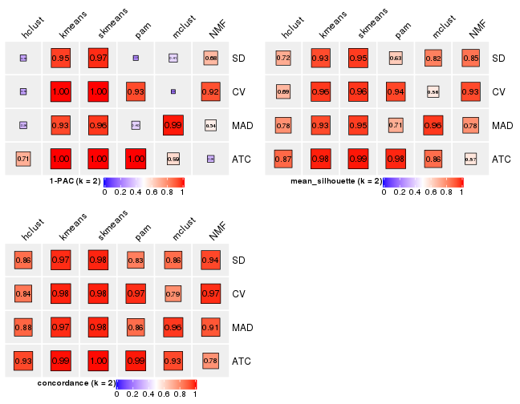</p>

</div>
<div id='tab-collect-stats-from-consensus-partition-list-2'>
<pre><code class="r">collect_stats(res_list, k = 3)
</code></pre>

<p>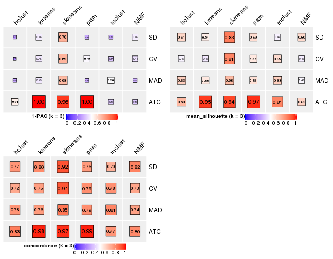</p>

</div>
<div id='tab-collect-stats-from-consensus-partition-list-3'>
<pre><code class="r">collect_stats(res_list, k = 4)
</code></pre>

<p>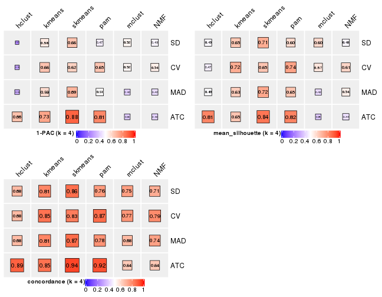</p>

</div>
<div id='tab-collect-stats-from-consensus-partition-list-4'>
<pre><code class="r">collect_stats(res_list, k = 5)
</code></pre>

<p>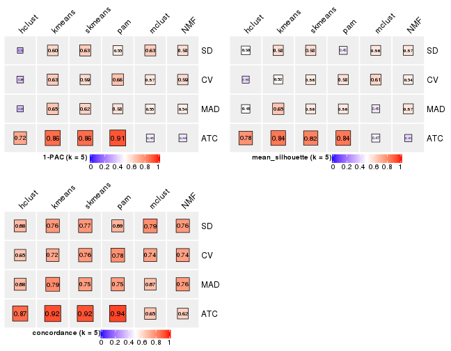</p>

</div>
<div id='tab-collect-stats-from-consensus-partition-list-5'>
<pre><code class="r">collect_stats(res_list, k = 6)
</code></pre>

<p>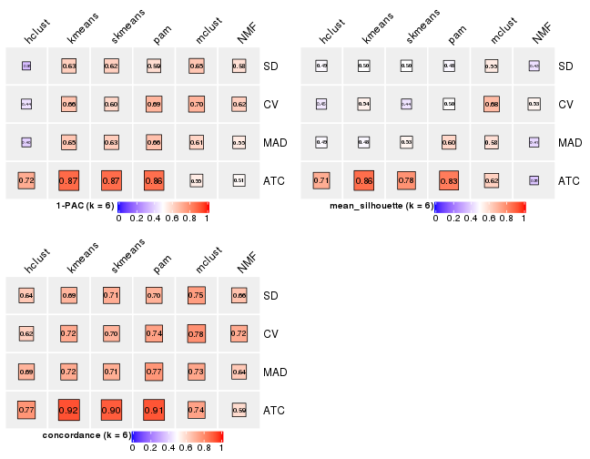</p>

</div>
</div>

### Partition from all methods


Collect partitions from all methods:


<script>
$( function() {
	$( '#tabs-collect-classes-from-consensus-partition-list' ).tabs();
} );
</script>
<div id='tabs-collect-classes-from-consensus-partition-list'>
<ul>
<li><a href='#tab-collect-classes-from-consensus-partition-list-1'>k = 2</a></li>
<li><a href='#tab-collect-classes-from-consensus-partition-list-2'>k = 3</a></li>
<li><a href='#tab-collect-classes-from-consensus-partition-list-3'>k = 4</a></li>
<li><a href='#tab-collect-classes-from-consensus-partition-list-4'>k = 5</a></li>
<li><a href='#tab-collect-classes-from-consensus-partition-list-5'>k = 6</a></li>
</ul>
<div id='tab-collect-classes-from-consensus-partition-list-1'>
<pre><code class="r">collect_classes(res_list, k = 2)
</code></pre>

<p>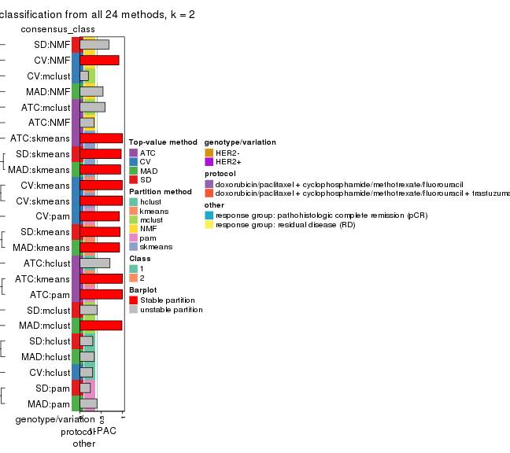</p>

</div>
<div id='tab-collect-classes-from-consensus-partition-list-2'>
<pre><code class="r">collect_classes(res_list, k = 3)
</code></pre>

<p>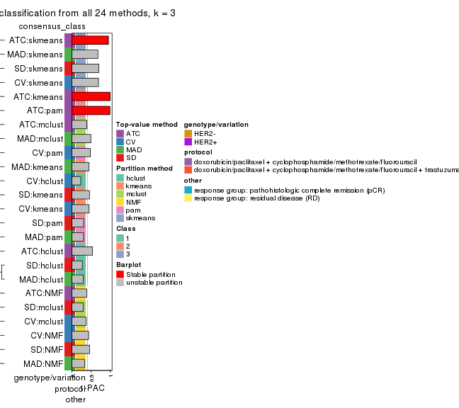</p>

</div>
<div id='tab-collect-classes-from-consensus-partition-list-3'>
<pre><code class="r">collect_classes(res_list, k = 4)
</code></pre>

<p>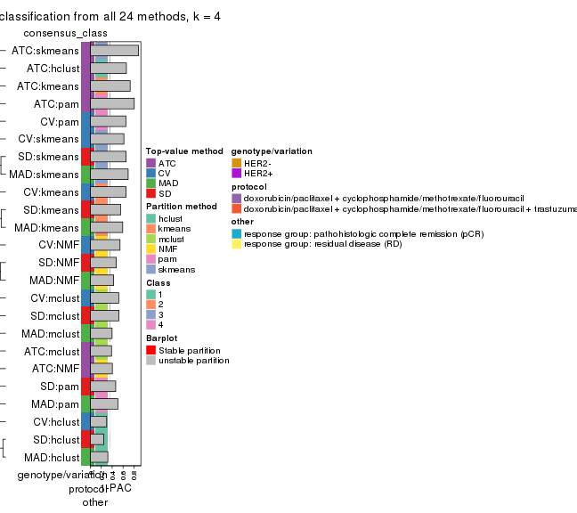</p>

</div>
<div id='tab-collect-classes-from-consensus-partition-list-4'>
<pre><code class="r">collect_classes(res_list, k = 5)
</code></pre>

<p>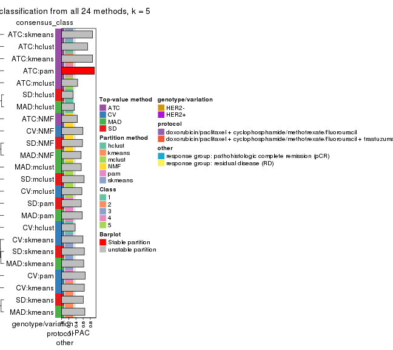</p>

</div>
<div id='tab-collect-classes-from-consensus-partition-list-5'>
<pre><code class="r">collect_classes(res_list, k = 6)
</code></pre>

<p>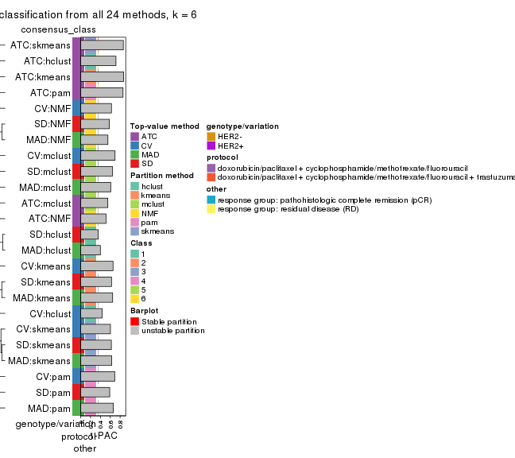</p>

</div>
</div>


### Top rows overlap


Overlap of top rows from different top-row methods:


<script>
$( function() {
	$( '#tabs-top-rows-overlap-by-euler' ).tabs();
} );
</script>
<div id='tabs-top-rows-overlap-by-euler'>
<ul>
<li><a href='#tab-top-rows-overlap-by-euler-1'>top_n = 1000</a></li>
<li><a href='#tab-top-rows-overlap-by-euler-2'>top_n = 2000</a></li>
<li><a href='#tab-top-rows-overlap-by-euler-3'>top_n = 3000</a></li>
<li><a href='#tab-top-rows-overlap-by-euler-4'>top_n = 4000</a></li>
<li><a href='#tab-top-rows-overlap-by-euler-5'>top_n = 5000</a></li>
</ul>
<div id='tab-top-rows-overlap-by-euler-1'>
<pre><code class="r">top_rows_overlap(res_list, top_n = 1000, method = &quot;euler&quot;)
</code></pre>

<p>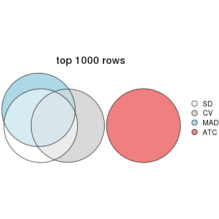</p>

</div>
<div id='tab-top-rows-overlap-by-euler-2'>
<pre><code class="r">top_rows_overlap(res_list, top_n = 2000, method = &quot;euler&quot;)
</code></pre>

<p>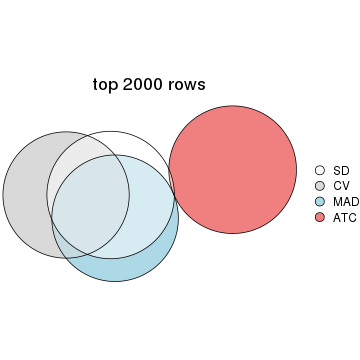</p>

</div>
<div id='tab-top-rows-overlap-by-euler-3'>
<pre><code class="r">top_rows_overlap(res_list, top_n = 3000, method = &quot;euler&quot;)
</code></pre>

<p>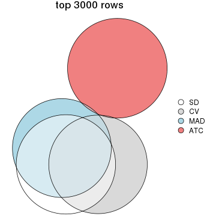</p>

</div>
<div id='tab-top-rows-overlap-by-euler-4'>
<pre><code class="r">top_rows_overlap(res_list, top_n = 4000, method = &quot;euler&quot;)
</code></pre>

<p>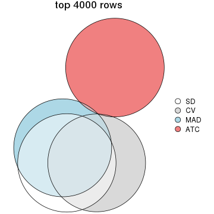</p>

</div>
<div id='tab-top-rows-overlap-by-euler-5'>
<pre><code class="r">top_rows_overlap(res_list, top_n = 5000, method = &quot;euler&quot;)
</code></pre>

<p>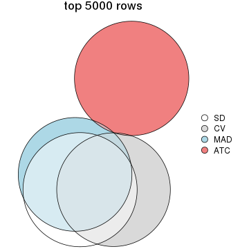</p>

</div>
</div>

Also visualize the correspondance of rankings between different top-row methods:


<script>
$( function() {
	$( '#tabs-top-rows-overlap-by-correspondance' ).tabs();
} );
</script>
<div id='tabs-top-rows-overlap-by-correspondance'>
<ul>
<li><a href='#tab-top-rows-overlap-by-correspondance-1'>top_n = 1000</a></li>
<li><a href='#tab-top-rows-overlap-by-correspondance-2'>top_n = 2000</a></li>
<li><a href='#tab-top-rows-overlap-by-correspondance-3'>top_n = 3000</a></li>
<li><a href='#tab-top-rows-overlap-by-correspondance-4'>top_n = 4000</a></li>
<li><a href='#tab-top-rows-overlap-by-correspondance-5'>top_n = 5000</a></li>
</ul>
<div id='tab-top-rows-overlap-by-correspondance-1'>
<pre><code class="r">top_rows_overlap(res_list, top_n = 1000, method = &quot;correspondance&quot;)
</code></pre>

<p>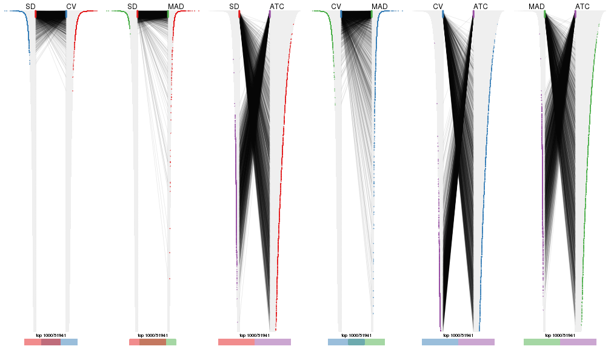</p>

</div>
<div id='tab-top-rows-overlap-by-correspondance-2'>
<pre><code class="r">top_rows_overlap(res_list, top_n = 2000, method = &quot;correspondance&quot;)
</code></pre>

<p>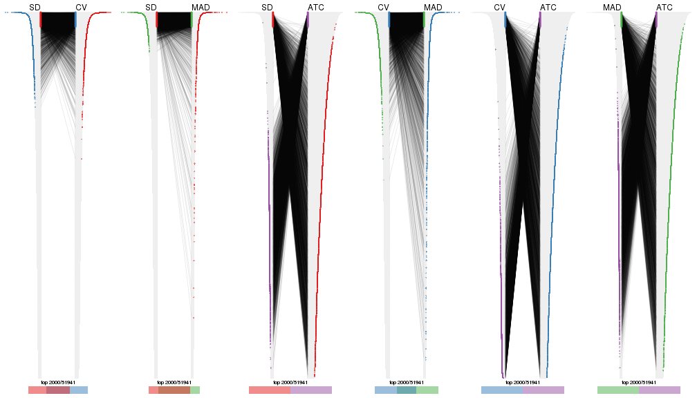</p>

</div>
<div id='tab-top-rows-overlap-by-correspondance-3'>
<pre><code class="r">top_rows_overlap(res_list, top_n = 3000, method = &quot;correspondance&quot;)
</code></pre>

<p>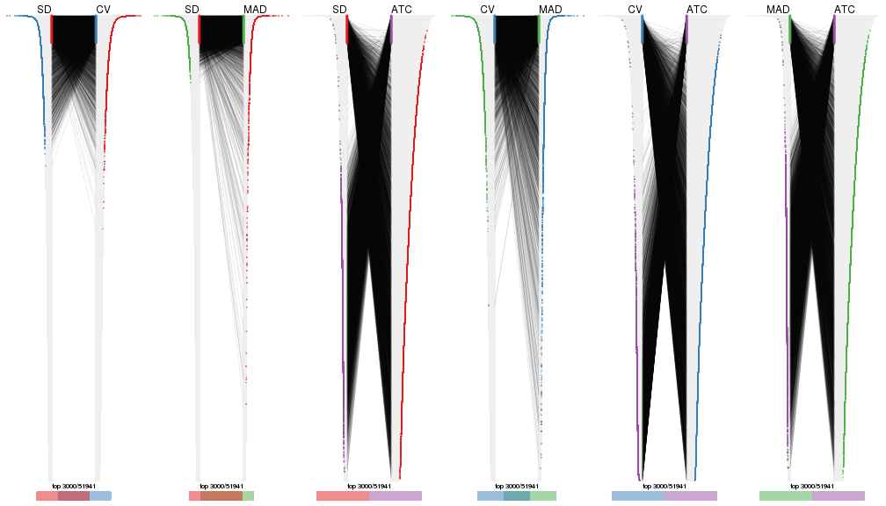</p>

</div>
<div id='tab-top-rows-overlap-by-correspondance-4'>
<pre><code class="r">top_rows_overlap(res_list, top_n = 4000, method = &quot;correspondance&quot;)
</code></pre>

<p>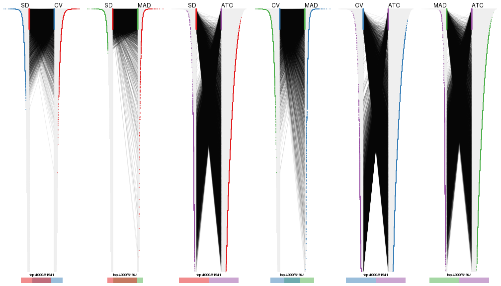</p>

</div>
<div id='tab-top-rows-overlap-by-correspondance-5'>
<pre><code class="r">top_rows_overlap(res_list, top_n = 5000, method = &quot;correspondance&quot;)
</code></pre>

<p>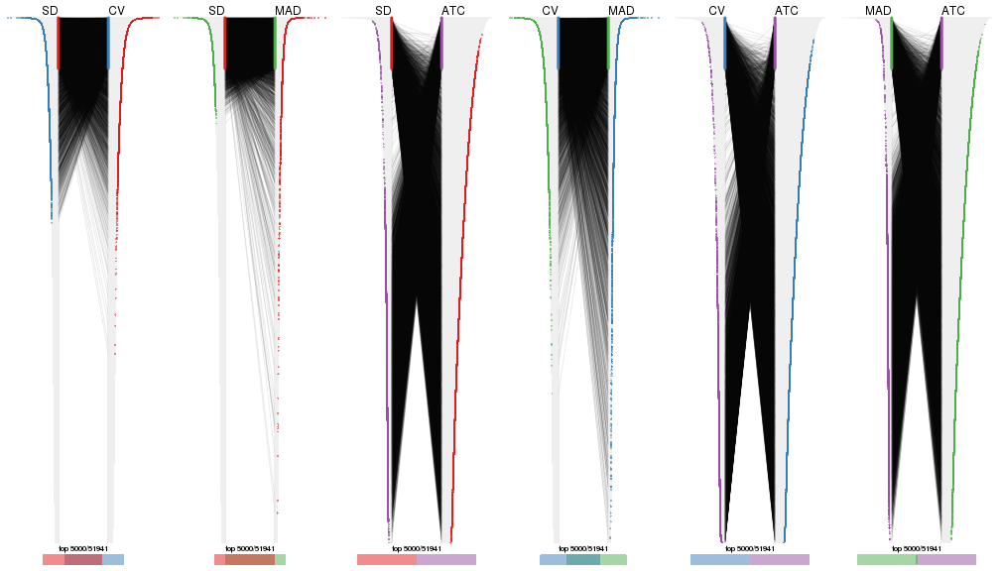</p>

</div>
</div>


Heatmaps of the top rows:


<script>
$( function() {
	$( '#tabs-top-rows-heatmap' ).tabs();
} );
</script>
<div id='tabs-top-rows-heatmap'>
<ul>
<li><a href='#tab-top-rows-heatmap-1'>top_n = 1000</a></li>
<li><a href='#tab-top-rows-heatmap-2'>top_n = 2000</a></li>
<li><a href='#tab-top-rows-heatmap-3'>top_n = 3000</a></li>
<li><a href='#tab-top-rows-heatmap-4'>top_n = 4000</a></li>
<li><a href='#tab-top-rows-heatmap-5'>top_n = 5000</a></li>
</ul>
<div id='tab-top-rows-heatmap-1'>
<pre><code class="r">top_rows_heatmap(res_list, top_n = 1000)
</code></pre>

<p>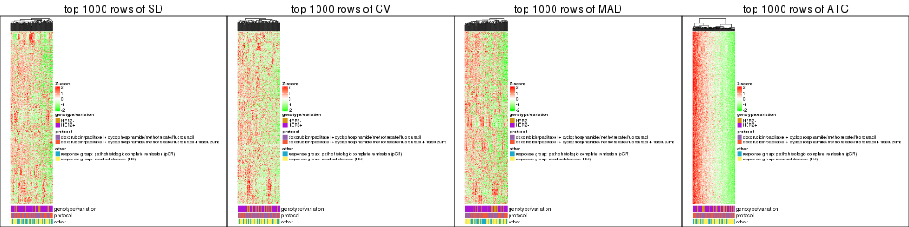</p>

</div>
<div id='tab-top-rows-heatmap-2'>
<pre><code class="r">top_rows_heatmap(res_list, top_n = 2000)
</code></pre>

<p>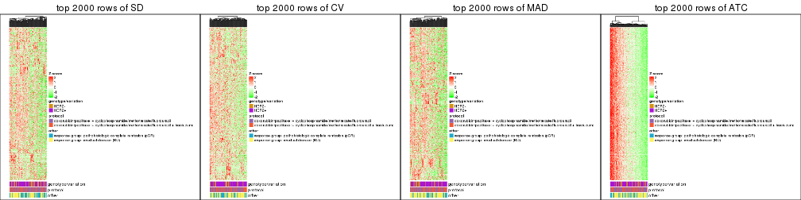</p>

</div>
<div id='tab-top-rows-heatmap-3'>
<pre><code class="r">top_rows_heatmap(res_list, top_n = 3000)
</code></pre>

<p>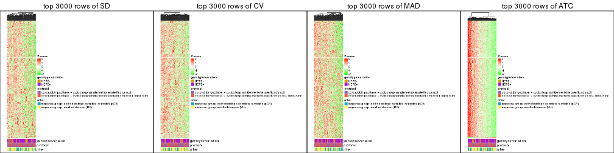</p>

</div>
<div id='tab-top-rows-heatmap-4'>
<pre><code class="r">top_rows_heatmap(res_list, top_n = 4000)
</code></pre>

<p>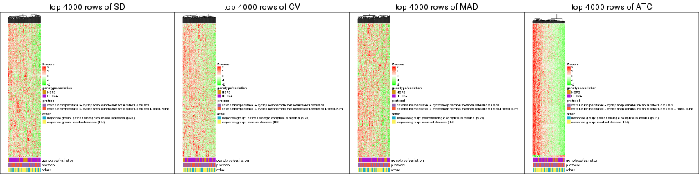</p>

</div>
<div id='tab-top-rows-heatmap-5'>
<pre><code class="r">top_rows_heatmap(res_list, top_n = 5000)
</code></pre>

<p>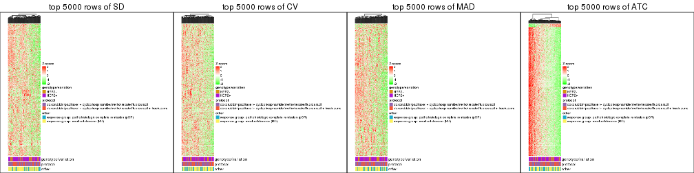</p>

</div>
</div>


### Test to known annotations


Test correlation between subgroups and known annotations. If the known
annotation is numeric, one-way ANOVA test is applied, and if the known
annotation is discrete, chi-squared contingency table test is applied.


<script>
$( function() {
	$( '#tabs-test-to-known-factors-from-consensus-partition-list' ).tabs();
} );
</script>
<div id='tabs-test-to-known-factors-from-consensus-partition-list'>
<ul>
<li><a href='#tab-test-to-known-factors-from-consensus-partition-list-1'>k = 2</a></li>
<li><a href='#tab-test-to-known-factors-from-consensus-partition-list-2'>k = 3</a></li>
<li><a href='#tab-test-to-known-factors-from-consensus-partition-list-3'>k = 4</a></li>
<li><a href='#tab-test-to-known-factors-from-consensus-partition-list-4'>k = 5</a></li>
<li><a href='#tab-test-to-known-factors-from-consensus-partition-list-5'>k = 6</a></li>
</ul>
<div id='tab-test-to-known-factors-from-consensus-partition-list-1'>
<pre><code class="r">test_to_known_factors(res_list, k = 2)
</code></pre>

<pre><code>#&gt;               n genotype/variation(p) protocol(p) other(p) k
#&gt; SD:NMF      143               0.00146       0.622   0.0291 2
#&gt; CV:NMF      152               0.00122       0.417   0.0187 2
#&gt; MAD:NMF     136               0.01281       0.245   0.1836 2
#&gt; ATC:NMF     143               0.57006       0.951   0.3684 2
#&gt; SD:skmeans  153               0.87239       0.318   0.8632 2
#&gt; CV:skmeans  153               0.39472       0.740   0.5292 2
#&gt; MAD:skmeans 152               0.75926       0.389   0.8497 2
#&gt; ATC:skmeans 155               0.37018       1.000   0.7283 2
#&gt; SD:mclust   151               0.73184       1.000   1.0000 2
#&gt; CV:mclust   105               0.00530       0.379   0.0184 2
#&gt; MAD:mclust  155               0.71296       1.000   1.0000 2
#&gt; ATC:mclust  151               0.20214       0.992   0.3225 2
#&gt; SD:kmeans   149               1.00000       0.737   0.7240 2
#&gt; CV:kmeans   152               0.50263       0.597   0.8697 2
#&gt; MAD:kmeans  149               0.97868       0.577   0.7318 2
#&gt; ATC:kmeans  154               1.00000       0.939   0.9763 2
#&gt; SD:pam      118               0.91932       0.946   1.0000 2
#&gt; CV:pam      152               1.00000       1.000   0.6397 2
#&gt; MAD:pam     139               0.37016       0.559   1.0000 2
#&gt; ATC:pam     156               0.96563       1.000   0.9428 2
#&gt; SD:hclust   139               0.05854       0.386   0.4707 2
#&gt; CV:hclust   131               0.32622       0.777   1.0000 2
#&gt; MAD:hclust  148               0.24049       0.513   0.8627 2
#&gt; ATC:hclust  152               0.79809       0.901   0.8243 2
</code></pre>

</div>
<div id='tab-test-to-known-factors-from-consensus-partition-list-2'>
<pre><code class="r">test_to_known_factors(res_list, k = 3)
</code></pre>

<pre><code>#&gt;               n genotype/variation(p) protocol(p) other(p) k
#&gt; SD:NMF      111              1.25e-05      0.2910  0.00503 3
#&gt; CV:NMF       70              5.13e-03      0.0261  0.00104 3
#&gt; MAD:NMF      96              8.47e-04      0.3145  0.03595 3
#&gt; ATC:NMF     131              2.77e-01      0.6441  0.44879 3
#&gt; SD:skmeans  145              1.54e-03      0.3157  0.03474 3
#&gt; CV:skmeans  143              2.87e-03      0.7388  0.09616 3
#&gt; MAD:skmeans 111              1.16e-02      0.2765  0.20452 3
#&gt; ATC:skmeans 149              7.82e-01      0.6083  0.42097 3
#&gt; SD:mclust   101              1.06e-05      0.0796  0.01529 3
#&gt; CV:mclust   121              2.31e-07      0.0444  0.02262 3
#&gt; MAD:mclust  130              3.15e-01      0.7976  0.03656 3
#&gt; ATC:mclust  155              5.09e-01      0.1854  0.72414 3
#&gt; SD:kmeans   107              2.59e-03      0.6572  0.03205 3
#&gt; CV:kmeans    79              2.36e-02      0.6322  0.08619 3
#&gt; MAD:kmeans  103              4.76e-01      0.9086  0.39974 3
#&gt; ATC:kmeans  151              6.67e-01      0.6270  0.87076 3
#&gt; SD:pam      126              8.68e-07      0.3338  0.06300 3
#&gt; CV:pam      103              9.57e-01      0.9211  0.27807 3
#&gt; MAD:pam     118              2.47e-04      0.1127  0.11668 3
#&gt; ATC:pam     155              4.36e-01      0.5165  0.90856 3
#&gt; SD:hclust   115              2.24e-01      0.5896  0.55150 3
#&gt; CV:hclust    74              1.66e-02      0.1349  0.13623 3
#&gt; MAD:hclust  111              2.59e-02      0.7132  0.76165 3
#&gt; ATC:hclust  133              1.09e-01      0.2287  0.11492 3
</code></pre>

</div>
<div id='tab-test-to-known-factors-from-consensus-partition-list-3'>
<pre><code class="r">test_to_known_factors(res_list, k = 4)
</code></pre>

<pre><code>#&gt;               n genotype/variation(p) protocol(p) other(p) k
#&gt; SD:NMF       86              2.80e-05     0.03877  0.02155 4
#&gt; CV:NMF      116              4.34e-06     0.09780  0.03117 4
#&gt; MAD:NMF     109              4.41e-05     0.04471  0.04316 4
#&gt; ATC:NMF      76              4.29e-02     0.49059  0.67041 4
#&gt; SD:skmeans  132              2.75e-06     0.07570  0.00210 4
#&gt; CV:skmeans  122              3.08e-06     0.24569  0.01930 4
#&gt; MAD:skmeans 130              3.64e-04     0.45006  0.06112 4
#&gt; ATC:skmeans 138              7.99e-01     0.74588  1.00000 4
#&gt; SD:mclust   122              5.01e-04     0.20221  0.01343 4
#&gt; CV:mclust   113              3.13e-06     0.11565  0.04576 4
#&gt; MAD:mclust   74              1.42e-06     0.00567  0.00667 4
#&gt; ATC:mclust   60              7.32e-02     0.47782  0.19703 4
#&gt; SD:kmeans   130              5.35e-06     0.10234  0.02829 4
#&gt; CV:kmeans   134              5.48e-04     0.16501  0.05450 4
#&gt; MAD:kmeans  127              4.57e-03     0.53196  0.25566 4
#&gt; ATC:kmeans  117              3.74e-01     0.63103  0.32499 4
#&gt; SD:pam      114              5.61e-06     0.23705  0.04334 4
#&gt; CV:pam      140              5.14e-06     0.28903  0.03094 4
#&gt; MAD:pam     126              1.51e-03     0.28106  0.40889 4
#&gt; ATC:pam     139              4.27e-01     0.75461  0.40035 4
#&gt; SD:hclust    79              3.02e-02     0.59017  0.51925 4
#&gt; CV:hclust    74              8.91e-04     0.04033  0.02837 4
#&gt; MAD:hclust   87              2.27e-02     0.07700  0.41864 4
#&gt; ATC:hclust  150              1.79e-01     0.35483  0.02484 4
</code></pre>

</div>
<div id='tab-test-to-known-factors-from-consensus-partition-list-4'>
<pre><code class="r">test_to_known_factors(res_list, k = 5)
</code></pre>

<pre><code>#&gt;               n genotype/variation(p) protocol(p) other(p) k
#&gt; SD:NMF      110              1.64e-05     0.01626  0.00159 5
#&gt; CV:NMF       99              6.29e-06     0.02148  0.00195 5
#&gt; MAD:NMF     116              3.24e-06     0.00866  0.00761 5
#&gt; ATC:NMF      71              1.10e-02     0.51296  0.74223 5
#&gt; SD:skmeans  104              4.75e-06     0.14489  0.02310 5
#&gt; CV:skmeans  108              1.13e-05     0.26720  0.04297 5
#&gt; MAD:skmeans 102              2.62e-04     0.25566  0.05483 5
#&gt; ATC:skmeans 132              8.16e-01     0.49732  1.00000 5
#&gt; SD:mclust   109              1.18e-07     0.01218  0.05416 5
#&gt; CV:mclust   114              7.10e-09     0.00868  0.03413 5
#&gt; MAD:mclust   87              3.40e-06     0.04095  0.16562 5
#&gt; ATC:mclust   94              1.11e-02     0.04989  0.26307 5
#&gt; SD:kmeans   106              1.26e-05     0.34602  0.02454 5
#&gt; CV:kmeans   112              4.50e-05     0.19711  0.04510 5
#&gt; MAD:kmeans  122              1.21e-03     0.23652  0.00886 5
#&gt; ATC:kmeans  145              1.52e-01     0.35790  0.03317 5
#&gt; SD:pam       93              1.62e-07     0.07342  0.02753 5
#&gt; CV:pam      109              1.94e-06     0.20293  0.01432 5
#&gt; MAD:pam     105              3.12e-03     0.24644  0.33958 5
#&gt; ATC:pam     140              4.79e-01     0.46280  0.16644 5
#&gt; SD:hclust    89              1.36e-02     0.19055  0.37488 5
#&gt; CV:hclust    66              2.82e-04     0.08767  0.17049 5
#&gt; MAD:hclust   96              3.99e-01     0.60380  0.18180 5
#&gt; ATC:hclust  143              2.31e-01     0.62122  0.08175 5
</code></pre>

</div>
<div id='tab-test-to-known-factors-from-consensus-partition-list-5'>
<pre><code class="r">test_to_known_factors(res_list, k = 6)
</code></pre>

<pre><code>#&gt;               n genotype/variation(p) protocol(p) other(p) k
#&gt; SD:NMF       71              8.97e-05     0.00959  0.00293 6
#&gt; CV:NMF       94              5.52e-06     0.05236  0.02997 6
#&gt; MAD:NMF      70              2.48e-03     0.06671  0.06669 6
#&gt; ATC:NMF      52              2.46e-01     0.77863  0.89640 6
#&gt; SD:skmeans   93              1.78e-06     0.07847  0.01127 6
#&gt; CV:skmeans   85              2.02e-02     0.26962  0.79670 6
#&gt; MAD:skmeans 104              2.42e-03     0.23069  0.12474 6
#&gt; ATC:skmeans 130              8.22e-01     0.61141  1.00000 6
#&gt; SD:mclust   110              5.76e-06     0.05054  0.02630 6
#&gt; CV:mclust   123              3.80e-09     0.00910  0.03383 6
#&gt; MAD:mclust  120              3.37e-05     0.08218  0.13668 6
#&gt; ATC:mclust  127              7.50e-02     0.03633  0.43731 6
#&gt; SD:kmeans    88              1.21e-05     0.13276  0.03866 6
#&gt; CV:kmeans   110              3.78e-03     0.65782  0.37819 6
#&gt; MAD:kmeans   86              1.87e-03     0.11604  0.00119 6
#&gt; ATC:kmeans  151              2.98e-01     0.46153  0.07529 6
#&gt; SD:pam       89              2.96e-06     0.16737  0.05386 6
#&gt; CV:pam       93              1.68e-04     0.36795  0.14235 6
#&gt; MAD:pam     114              7.47e-03     0.35543  0.72229 6
#&gt; ATC:pam     147              4.00e-01     0.32609  0.20379 6
#&gt; SD:hclust    88              2.44e-02     0.17226  0.23868 6
#&gt; CV:hclust    79              1.24e-05     0.05758  0.28314 6
#&gt; MAD:hclust   97              2.39e-01     0.81706  0.17475 6
#&gt; ATC:hclust  132              1.83e-01     0.63353  0.20771 6
</code></pre>

</div>
</div>


 
## Results for each method


---------------------------------------------------


### SD:hclust


The object with results only for a single top-value method and a single partition method 
can be extracted as:

```r
res = res_list["SD", "hclust"]
# you can also extract it by
# res = res_list["SD:hclust"]
```

A summary of `res` and all the functions that can be applied to it:

```r
res
```

```
#> A 'ConsensusPartition' object with k = 2, 3, 4, 5, 6.
#>   On a matrix with 51941 rows and 156 columns.
#>   Top rows (1000, 2000, 3000, 4000, 5000) are extracted by 'SD' method.
#>   Subgroups are detected by 'hclust' method.
#>   Performed in total 1250 partitions by row resampling.
#>   Best k for subgroups seems to be 3.
#> 
#> Following methods can be applied to this 'ConsensusPartition' object:
#>  [1] "cola_report"             "collect_classes"         "collect_plots"          
#>  [4] "collect_stats"           "colnames"                "compare_signatures"     
#>  [7] "consensus_heatmap"       "dimension_reduction"     "functional_enrichment"  
#> [10] "get_anno_col"            "get_anno"                "get_classes"            
#> [13] "get_consensus"           "get_matrix"              "get_membership"         
#> [16] "get_param"               "get_signatures"          "get_stats"              
#> [19] "is_best_k"               "is_stable_k"             "membership_heatmap"     
#> [22] "ncol"                    "nrow"                    "plot_ecdf"              
#> [25] "rownames"                "select_partition_number" "show"                   
#> [28] "suggest_best_k"          "test_to_known_factors"
```

`collect_plots()` function collects all the plots made from `res` for all `k` (number of partitions)
into one single page to provide an easy and fast comparison between different `k`.

```r
collect_plots(res)
```

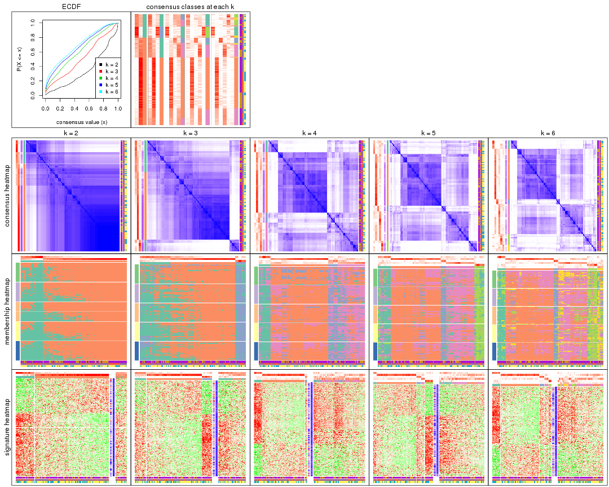

The plots are:

- The first row: a plot of the ECDF (empirical cumulative distribution
  function) curves of the consensus matrix for each `k` and the heatmap of
  predicted classes for each `k`.
- The second row: heatmaps of the consensus matrix for each `k`.
- The third row: heatmaps of the membership matrix for each `k`.
- The fouth row: heatmaps of the signatures for each `k`.

All the plots in panels can be made by individual functions and they are
plotted later in this section.

`select_partition_number()` produces several plots showing different
statistics for choosing "optimized" `k`. There are following statistics:

- ECDF curves of the consensus matrix for each `k`;
- 1-PAC. [The PAC
  score](https://en.wikipedia.org/wiki/Consensus_clustering#Over-interpretation_potential_of_consensus_clustering)
  measures the proportion of the ambiguous subgrouping.
- Mean silhouette score.
- Concordance. The mean probability of fiting the consensus class ids in all
  partitions.
- Area increased. Denote $A_k$ as the area under the ECDF curve for current
  `k`, the area increased is defined as $A_k - A_{k-1}$.
- Rand index. The percent of pairs of samples that are both in a same cluster
  or both are not in a same cluster in the partition of k and k-1.
- Jaccard index. The ratio of pairs of samples are both in a same cluster in
  the partition of k and k-1 and the pairs of samples are both in a same
  cluster in the partition k or k-1.

The detailed explanations of these statistics can be found in [the _cola_
vignette](http://bioconductor.org/packages/devel/bioc/vignettes/cola/inst/doc/cola.html#toc_13).

Generally speaking, lower PAC score, higher mean silhouette score or higher
concordance corresponds to better partition. Rand index and Jaccard index
measure how similar the current partition is compared to partition with `k-1`.
If they are too similar, we won't accept `k` is better than `k-1`.

```r
select_partition_number(res)
```

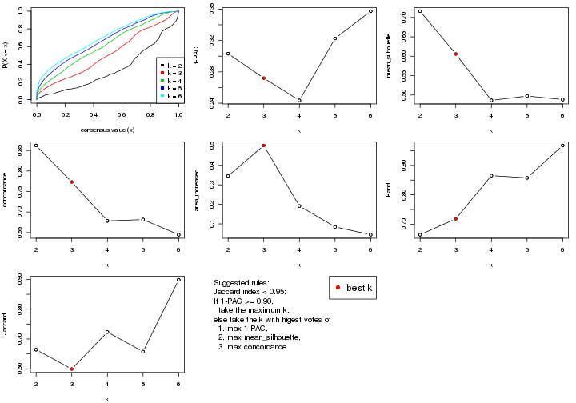

The numeric values for all these statistics can be obtained by `get_stats()`.

```r
get_stats(res)
```

```
#>   k 1-PAC mean_silhouette concordance area_increased  Rand Jaccard
#> 2 2 0.303           0.716       0.862         0.3455 0.664   0.664
#> 3 3 0.272           0.606       0.773         0.5016 0.718   0.599
#> 4 4 0.244           0.486       0.678         0.1916 0.865   0.723
#> 5 5 0.323           0.497       0.682         0.0846 0.858   0.658
#> 6 6 0.357           0.488       0.645         0.0448 0.968   0.898
```

`suggest_best_k()` suggests the best $k$ based on these statistics. The rules are as follows:

- All $k$ with Jaccard index larger than 0.95 are removed because increasing
  $k$ does not provide enough extra information. If all $k$ are removed, it is
  marked as no subgroup is detected.
- For all $k$ with 1-PAC score larger than 0.9, the maximal $k$ is taken as
  the best $k$, and other $k$ are marked as optional $k$.
- If it does not fit the second rule. The $k$ with the maximal vote of the
  highest 1-PAC score, highest mean silhouette, and highest concordance is
  taken as the best $k$.

```r
suggest_best_k(res)
```

```
#> [1] 3
```


Following shows the table of the partitions (You need to click the **show/hide
code output** link to see it). The membership matrix (columns with name `p*`)
is inferred by
[`clue::cl_consensus()`](https://www.rdocumentation.org/link/cl_consensus?package=clue)
function with the `SE` method. Basically the value in the membership matrix
represents the probability to belong to a certain group. The finall class
label for an item is determined with the group with highest probability it
belongs to.

In `get_classes()` function, the entropy is calculated from the membership
matrix and the silhouette score is calculated from the consensus matrix.


<script>
$( function() {
	$( '#tabs-SD-hclust-get-classes' ).tabs();
} );
</script>
<div id='tabs-SD-hclust-get-classes'>
<ul>
<li><a href='#tab-SD-hclust-get-classes-1'>k = 2</a></li>
<li><a href='#tab-SD-hclust-get-classes-2'>k = 3</a></li>
<li><a href='#tab-SD-hclust-get-classes-3'>k = 4</a></li>
<li><a href='#tab-SD-hclust-get-classes-4'>k = 5</a></li>
<li><a href='#tab-SD-hclust-get-classes-5'>k = 6</a></li>
</ul>

<div id='tab-SD-hclust-get-classes-1'>
<p><a id='tab-SD-hclust-get-classes-1-a' style='color:#0366d6' href='#'>show/hide code output</a></p>
<pre><code class="r">cbind(get_classes(res, k = 2), get_membership(res, k = 2))
</code></pre>

<pre><code>#&gt;            class entropy silhouette    p1    p2
#&gt; GSM1232995     2  0.0000     0.8466 0.000 1.000
#&gt; GSM1233002     2  0.5737     0.8029 0.136 0.864
#&gt; GSM1233003     1  0.8813     0.6630 0.700 0.300
#&gt; GSM1233014     2  0.2236     0.8461 0.036 0.964
#&gt; GSM1233015     1  0.9552     0.5602 0.624 0.376
#&gt; GSM1233016     2  0.9427     0.4172 0.360 0.640
#&gt; GSM1233024     2  0.0938     0.8483 0.012 0.988
#&gt; GSM1233049     1  0.0000     0.7172 1.000 0.000
#&gt; GSM1233064     2  0.0672     0.8477 0.008 0.992
#&gt; GSM1233068     2  0.7674     0.7132 0.224 0.776
#&gt; GSM1233073     2  0.6973     0.7542 0.188 0.812
#&gt; GSM1233093     1  0.0000     0.7172 1.000 0.000
#&gt; GSM1233115     2  1.0000    -0.1834 0.500 0.500
#&gt; GSM1232992     2  0.0000     0.8466 0.000 1.000
#&gt; GSM1232993     2  0.2043     0.8470 0.032 0.968
#&gt; GSM1233005     2  0.0000     0.8466 0.000 1.000
#&gt; GSM1233007     2  0.1414     0.8483 0.020 0.980
#&gt; GSM1233010     2  0.6438     0.7785 0.164 0.836
#&gt; GSM1233013     2  0.0000     0.8466 0.000 1.000
#&gt; GSM1233018     2  0.0000     0.8466 0.000 1.000
#&gt; GSM1233019     2  0.0376     0.8472 0.004 0.996
#&gt; GSM1233021     2  0.0000     0.8466 0.000 1.000
#&gt; GSM1233025     2  0.9552     0.3868 0.376 0.624
#&gt; GSM1233029     2  0.0672     0.8481 0.008 0.992
#&gt; GSM1233030     2  0.0000     0.8466 0.000 1.000
#&gt; GSM1233031     2  0.5519     0.8106 0.128 0.872
#&gt; GSM1233032     1  0.9710     0.5165 0.600 0.400
#&gt; GSM1233035     2  0.6531     0.7758 0.168 0.832
#&gt; GSM1233038     1  0.0938     0.7246 0.988 0.012
#&gt; GSM1233039     2  0.0938     0.8480 0.012 0.988
#&gt; GSM1233042     2  0.5519     0.8073 0.128 0.872
#&gt; GSM1233043     2  0.5519     0.8073 0.128 0.872
#&gt; GSM1233044     2  0.6531     0.7775 0.168 0.832
#&gt; GSM1233046     2  0.8661     0.6050 0.288 0.712
#&gt; GSM1233051     1  0.9983     0.2531 0.524 0.476
#&gt; GSM1233054     2  0.9881     0.1028 0.436 0.564
#&gt; GSM1233057     2  0.1414     0.8483 0.020 0.980
#&gt; GSM1233060     2  0.5519     0.8073 0.128 0.872
#&gt; GSM1233062     2  0.0938     0.8483 0.012 0.988
#&gt; GSM1233075     2  0.0000     0.8466 0.000 1.000
#&gt; GSM1233078     2  0.5629     0.8031 0.132 0.868
#&gt; GSM1233079     1  0.9608     0.5371 0.616 0.384
#&gt; GSM1233082     2  0.9087     0.5211 0.324 0.676
#&gt; GSM1233083     1  0.5519     0.7431 0.872 0.128
#&gt; GSM1233091     2  0.5842     0.8027 0.140 0.860
#&gt; GSM1233095     1  0.2236     0.7362 0.964 0.036
#&gt; GSM1233096     1  0.9522     0.5679 0.628 0.372
#&gt; GSM1233101     1  0.4022     0.7445 0.920 0.080
#&gt; GSM1233105     2  0.9933     0.0738 0.452 0.548
#&gt; GSM1233117     2  0.0000     0.8466 0.000 1.000
#&gt; GSM1233118     2  0.0000     0.8466 0.000 1.000
#&gt; GSM1233001     2  0.0000     0.8466 0.000 1.000
#&gt; GSM1233006     2  0.0376     0.8472 0.004 0.996
#&gt; GSM1233008     2  0.0000     0.8466 0.000 1.000
#&gt; GSM1233009     2  0.0000     0.8466 0.000 1.000
#&gt; GSM1233017     2  0.0000     0.8466 0.000 1.000
#&gt; GSM1233020     2  0.0000     0.8466 0.000 1.000
#&gt; GSM1233022     2  0.2948     0.8431 0.052 0.948
#&gt; GSM1233026     2  0.6531     0.7747 0.168 0.832
#&gt; GSM1233028     2  0.5629     0.8050 0.132 0.868
#&gt; GSM1233034     2  0.0672     0.8473 0.008 0.992
#&gt; GSM1233040     1  0.9129     0.6333 0.672 0.328
#&gt; GSM1233048     1  0.7139     0.7300 0.804 0.196
#&gt; GSM1233056     1  0.0000     0.7172 1.000 0.000
#&gt; GSM1233058     2  0.6343     0.7825 0.160 0.840
#&gt; GSM1233059     1  0.2948     0.7409 0.948 0.052
#&gt; GSM1233066     2  0.1184     0.8485 0.016 0.984
#&gt; GSM1233071     2  0.3431     0.8388 0.064 0.936
#&gt; GSM1233074     2  0.0000     0.8466 0.000 1.000
#&gt; GSM1233076     2  0.2778     0.8442 0.048 0.952
#&gt; GSM1233080     1  0.0938     0.7246 0.988 0.012
#&gt; GSM1233088     2  0.1414     0.8484 0.020 0.980
#&gt; GSM1233090     1  0.1633     0.7313 0.976 0.024
#&gt; GSM1233092     2  0.7602     0.7029 0.220 0.780
#&gt; GSM1233094     2  0.3431     0.8397 0.064 0.936
#&gt; GSM1233097     2  0.5059     0.8173 0.112 0.888
#&gt; GSM1233100     2  0.4562     0.8263 0.096 0.904
#&gt; GSM1233104     2  0.4939     0.8194 0.108 0.892
#&gt; GSM1233106     2  0.9996    -0.1448 0.488 0.512
#&gt; GSM1233111     1  0.9129     0.6333 0.672 0.328
#&gt; GSM1233122     2  0.0000     0.8466 0.000 1.000
#&gt; GSM1233146     2  0.5737     0.8047 0.136 0.864
#&gt; GSM1232994     2  0.0000     0.8466 0.000 1.000
#&gt; GSM1232996     2  0.0000     0.8466 0.000 1.000
#&gt; GSM1232997     2  0.0000     0.8466 0.000 1.000
#&gt; GSM1232998     2  0.1843     0.8467 0.028 0.972
#&gt; GSM1232999     2  0.0000     0.8466 0.000 1.000
#&gt; GSM1233000     2  0.0000     0.8466 0.000 1.000
#&gt; GSM1233004     2  0.9710     0.2970 0.400 0.600
#&gt; GSM1233011     2  0.4298     0.8305 0.088 0.912
#&gt; GSM1233012     2  0.0000     0.8466 0.000 1.000
#&gt; GSM1233023     2  0.0000     0.8466 0.000 1.000
#&gt; GSM1233027     2  0.0000     0.8466 0.000 1.000
#&gt; GSM1233033     1  0.8713     0.6708 0.708 0.292
#&gt; GSM1233036     2  0.1633     0.8482 0.024 0.976
#&gt; GSM1233037     2  0.2778     0.8445 0.048 0.952
#&gt; GSM1233041     1  0.2603     0.7392 0.956 0.044
#&gt; GSM1233045     2  0.6343     0.7825 0.160 0.840
#&gt; GSM1233047     2  0.9286     0.4482 0.344 0.656
#&gt; GSM1233050     1  0.6148     0.7422 0.848 0.152
#&gt; GSM1233052     2  0.9170     0.5093 0.332 0.668
#&gt; GSM1233053     2  0.9881     0.1028 0.436 0.564
#&gt; GSM1233055     1  0.0000     0.7172 1.000 0.000
#&gt; GSM1233061     2  0.2423     0.8462 0.040 0.960
#&gt; GSM1233063     1  0.9427     0.5895 0.640 0.360
#&gt; GSM1233065     2  0.0000     0.8466 0.000 1.000
#&gt; GSM1233070     2  0.1633     0.8480 0.024 0.976
#&gt; GSM1233077     2  0.5629     0.8032 0.132 0.868
#&gt; GSM1233081     1  0.9896     0.3815 0.560 0.440
#&gt; GSM1233084     1  0.2603     0.7393 0.956 0.044
#&gt; GSM1233087     1  0.9993     0.2228 0.516 0.484
#&gt; GSM1233089     2  0.0000     0.8466 0.000 1.000
#&gt; GSM1233099     2  0.9087     0.5358 0.324 0.676
#&gt; GSM1233112     1  0.6887     0.7314 0.816 0.184
#&gt; GSM1233085     2  0.9209     0.4739 0.336 0.664
#&gt; GSM1233098     2  0.0376     0.8471 0.004 0.996
#&gt; GSM1233114     2  0.8327     0.6494 0.264 0.736
#&gt; GSM1233119     2  0.9044     0.5408 0.320 0.680
#&gt; GSM1233129     2  0.0000     0.8466 0.000 1.000
#&gt; GSM1233132     2  0.9044     0.5440 0.320 0.680
#&gt; GSM1233139     2  0.0376     0.8474 0.004 0.996
#&gt; GSM1233143     2  0.0000     0.8466 0.000 1.000
#&gt; GSM1233145     1  0.5408     0.7442 0.876 0.124
#&gt; GSM1233067     2  0.0000     0.8466 0.000 1.000
#&gt; GSM1233069     2  0.5294     0.8119 0.120 0.880
#&gt; GSM1233072     2  0.0376     0.8472 0.004 0.996
#&gt; GSM1233086     2  0.2043     0.8478 0.032 0.968
#&gt; GSM1233102     2  0.9209     0.5073 0.336 0.664
#&gt; GSM1233103     2  0.8443     0.6360 0.272 0.728
#&gt; GSM1233107     2  0.7376     0.7264 0.208 0.792
#&gt; GSM1233108     1  0.9754     0.4752 0.592 0.408
#&gt; GSM1233109     2  0.9754     0.2677 0.408 0.592
#&gt; GSM1233110     2  0.5408     0.8058 0.124 0.876
#&gt; GSM1233113     2  0.0000     0.8466 0.000 1.000
#&gt; GSM1233116     2  0.0000     0.8466 0.000 1.000
#&gt; GSM1233120     2  0.9087     0.5358 0.324 0.676
#&gt; GSM1233121     2  0.5629     0.8032 0.132 0.868
#&gt; GSM1233123     2  0.4431     0.8246 0.092 0.908
#&gt; GSM1233124     2  0.0938     0.8484 0.012 0.988
#&gt; GSM1233125     1  0.9754     0.4925 0.592 0.408
#&gt; GSM1233126     2  0.9170     0.4948 0.332 0.668
#&gt; GSM1233127     2  0.0000     0.8466 0.000 1.000
#&gt; GSM1233128     1  0.8207     0.6994 0.744 0.256
#&gt; GSM1233130     2  0.5629     0.8039 0.132 0.868
#&gt; GSM1233131     2  0.8327     0.6496 0.264 0.736
#&gt; GSM1233133     2  0.8713     0.5777 0.292 0.708
#&gt; GSM1233134     2  0.0672     0.8477 0.008 0.992
#&gt; GSM1233135     2  0.0000     0.8466 0.000 1.000
#&gt; GSM1233136     2  0.5408     0.8111 0.124 0.876
#&gt; GSM1233137     2  0.8909     0.5421 0.308 0.692
#&gt; GSM1233138     2  0.9000     0.5354 0.316 0.684
#&gt; GSM1233140     1  0.9686     0.5242 0.604 0.396
#&gt; GSM1233141     2  0.0000     0.8466 0.000 1.000
#&gt; GSM1233142     2  0.0000     0.8466 0.000 1.000
#&gt; GSM1233144     2  0.8608     0.5925 0.284 0.716
#&gt; GSM1233147     2  0.2948     0.8437 0.052 0.948
</code></pre>

<script>
$('#tab-SD-hclust-get-classes-1-a').parent().next().next().hide();
$('#tab-SD-hclust-get-classes-1-a').click(function(){
  $('#tab-SD-hclust-get-classes-1-a').parent().next().next().toggle();
  return(false);
});
</script>
</div>

<div id='tab-SD-hclust-get-classes-2'>
<p><a id='tab-SD-hclust-get-classes-2-a' style='color:#0366d6' href='#'>show/hide code output</a></p>
<pre><code class="r">cbind(get_classes(res, k = 3), get_membership(res, k = 3))
</code></pre>

<pre><code>#&gt;            class entropy silhouette    p1    p2    p3
#&gt; GSM1232995     2  0.1129     0.7973 0.020 0.976 0.004
#&gt; GSM1233002     2  0.6129     0.5044 0.324 0.668 0.008
#&gt; GSM1233003     1  0.8202     0.1363 0.580 0.092 0.328
#&gt; GSM1233014     2  0.4555     0.7142 0.200 0.800 0.000
#&gt; GSM1233015     1  0.5634     0.2951 0.800 0.056 0.144
#&gt; GSM1233016     1  0.7328     0.5494 0.612 0.344 0.044
#&gt; GSM1233024     2  0.2066     0.8059 0.060 0.940 0.000
#&gt; GSM1233049     3  0.1289     0.7702 0.032 0.000 0.968
#&gt; GSM1233064     2  0.1643     0.8084 0.044 0.956 0.000
#&gt; GSM1233068     2  0.7030     0.2023 0.396 0.580 0.024
#&gt; GSM1233073     2  0.6769     0.2850 0.392 0.592 0.016
#&gt; GSM1233093     3  0.1643     0.7736 0.044 0.000 0.956
#&gt; GSM1233115     1  0.7756     0.5577 0.672 0.200 0.128
#&gt; GSM1232992     2  0.1289     0.8063 0.032 0.968 0.000
#&gt; GSM1232993     2  0.3686     0.7655 0.140 0.860 0.000
#&gt; GSM1233005     2  0.1289     0.8063 0.032 0.968 0.000
#&gt; GSM1233007     2  0.3192     0.7892 0.112 0.888 0.000
#&gt; GSM1233010     2  0.6244     0.1869 0.440 0.560 0.000
#&gt; GSM1233013     2  0.1129     0.8033 0.020 0.976 0.004
#&gt; GSM1233018     2  0.0747     0.8030 0.016 0.984 0.000
#&gt; GSM1233019     2  0.1964     0.8057 0.056 0.944 0.000
#&gt; GSM1233021     2  0.1163     0.8062 0.028 0.972 0.000
#&gt; GSM1233025     1  0.7284     0.5544 0.620 0.336 0.044
#&gt; GSM1233029     2  0.1860     0.8062 0.052 0.948 0.000
#&gt; GSM1233030     2  0.1267     0.7994 0.024 0.972 0.004
#&gt; GSM1233031     2  0.6247     0.3968 0.376 0.620 0.004
#&gt; GSM1233032     1  0.7216     0.3974 0.712 0.112 0.176
#&gt; GSM1233035     2  0.6753     0.2614 0.388 0.596 0.016
#&gt; GSM1233038     3  0.4346     0.7903 0.184 0.000 0.816
#&gt; GSM1233039     2  0.1753     0.8085 0.048 0.952 0.000
#&gt; GSM1233042     2  0.5815     0.5485 0.304 0.692 0.004
#&gt; GSM1233043     2  0.5815     0.5485 0.304 0.692 0.004
#&gt; GSM1233044     2  0.6811     0.2831 0.404 0.580 0.016
#&gt; GSM1233046     1  0.7069     0.4453 0.568 0.408 0.024
#&gt; GSM1233051     1  0.6975     0.5314 0.732 0.144 0.124
#&gt; GSM1233054     1  0.8483     0.5195 0.600 0.260 0.140
#&gt; GSM1233057     2  0.2772     0.7976 0.080 0.916 0.004
#&gt; GSM1233060     2  0.5815     0.5485 0.304 0.692 0.004
#&gt; GSM1233062     2  0.2066     0.8043 0.060 0.940 0.000
#&gt; GSM1233075     2  0.1525     0.7942 0.032 0.964 0.004
#&gt; GSM1233078     2  0.6018     0.5323 0.308 0.684 0.008
#&gt; GSM1233079     1  0.5988     0.3452 0.776 0.056 0.168
#&gt; GSM1233082     1  0.7767     0.4297 0.536 0.412 0.052
#&gt; GSM1233083     3  0.6548     0.5399 0.372 0.012 0.616
#&gt; GSM1233091     2  0.5835     0.4726 0.340 0.660 0.000
#&gt; GSM1233095     3  0.4931     0.8018 0.232 0.000 0.768
#&gt; GSM1233096     1  0.5696     0.2902 0.796 0.056 0.148
#&gt; GSM1233101     3  0.5775     0.7866 0.260 0.012 0.728
#&gt; GSM1233105     1  0.7058     0.6023 0.708 0.212 0.080
#&gt; GSM1233117     2  0.1525     0.8051 0.032 0.964 0.004
#&gt; GSM1233118     2  0.1411     0.8069 0.036 0.964 0.000
#&gt; GSM1233001     2  0.1129     0.7938 0.020 0.976 0.004
#&gt; GSM1233006     2  0.1964     0.8056 0.056 0.944 0.000
#&gt; GSM1233008     2  0.1163     0.8067 0.028 0.972 0.000
#&gt; GSM1233009     2  0.1267     0.7979 0.024 0.972 0.004
#&gt; GSM1233017     2  0.1878     0.8073 0.044 0.952 0.004
#&gt; GSM1233020     2  0.0747     0.8027 0.016 0.984 0.000
#&gt; GSM1233022     2  0.4842     0.6846 0.224 0.776 0.000
#&gt; GSM1233026     2  0.6260     0.1504 0.448 0.552 0.000
#&gt; GSM1233028     2  0.6008     0.4153 0.372 0.628 0.000
#&gt; GSM1233034     2  0.1031     0.8043 0.024 0.976 0.000
#&gt; GSM1233040     1  0.5508     0.1756 0.784 0.028 0.188
#&gt; GSM1233048     1  0.7360    -0.4323 0.528 0.032 0.440
#&gt; GSM1233056     3  0.1031     0.7687 0.024 0.000 0.976
#&gt; GSM1233058     2  0.6235     0.2047 0.436 0.564 0.000
#&gt; GSM1233059     3  0.6082     0.7633 0.296 0.012 0.692
#&gt; GSM1233066     2  0.2796     0.8005 0.092 0.908 0.000
#&gt; GSM1233071     2  0.3983     0.7551 0.144 0.852 0.004
#&gt; GSM1233074     2  0.1525     0.7942 0.032 0.964 0.004
#&gt; GSM1233076     2  0.3851     0.7747 0.136 0.860 0.004
#&gt; GSM1233080     3  0.4062     0.7989 0.164 0.000 0.836
#&gt; GSM1233088     2  0.2066     0.8071 0.060 0.940 0.000
#&gt; GSM1233090     3  0.4702     0.8018 0.212 0.000 0.788
#&gt; GSM1233092     2  0.7091     0.1406 0.416 0.560 0.024
#&gt; GSM1233094     2  0.5138     0.6526 0.252 0.748 0.000
#&gt; GSM1233097     2  0.5678     0.5501 0.316 0.684 0.000
#&gt; GSM1233100     2  0.5397     0.6016 0.280 0.720 0.000
#&gt; GSM1233104     2  0.5621     0.5638 0.308 0.692 0.000
#&gt; GSM1233106     1  0.7457     0.5648 0.688 0.208 0.104
#&gt; GSM1233111     1  0.5508     0.1756 0.784 0.028 0.188
#&gt; GSM1233122     2  0.1860     0.8066 0.052 0.948 0.000
#&gt; GSM1233146     2  0.6180     0.5017 0.332 0.660 0.008
#&gt; GSM1232994     2  0.1399     0.8021 0.028 0.968 0.004
#&gt; GSM1232996     2  0.0747     0.8030 0.016 0.984 0.000
#&gt; GSM1232997     2  0.1163     0.8003 0.028 0.972 0.000
#&gt; GSM1232998     2  0.4178     0.7406 0.172 0.828 0.000
#&gt; GSM1232999     2  0.1964     0.8055 0.056 0.944 0.000
#&gt; GSM1233000     2  0.1267     0.8013 0.024 0.972 0.004
#&gt; GSM1233004     1  0.7788     0.6134 0.632 0.284 0.084
#&gt; GSM1233011     2  0.5291     0.6340 0.268 0.732 0.000
#&gt; GSM1233012     2  0.1765     0.7986 0.040 0.956 0.004
#&gt; GSM1233023     2  0.1267     0.7998 0.024 0.972 0.004
#&gt; GSM1233027     2  0.1289     0.8063 0.032 0.968 0.000
#&gt; GSM1233033     1  0.8242     0.1120 0.572 0.092 0.336
#&gt; GSM1233036     2  0.3412     0.7855 0.124 0.876 0.000
#&gt; GSM1233037     2  0.3784     0.7730 0.132 0.864 0.004
#&gt; GSM1233041     3  0.5656     0.7857 0.264 0.008 0.728
#&gt; GSM1233045     2  0.6235     0.2047 0.436 0.564 0.000
#&gt; GSM1233047     1  0.7644     0.5323 0.604 0.336 0.060
#&gt; GSM1233050     3  0.7067     0.5708 0.468 0.020 0.512
#&gt; GSM1233052     1  0.7712     0.4661 0.556 0.392 0.052
#&gt; GSM1233053     1  0.8483     0.5195 0.600 0.260 0.140
#&gt; GSM1233055     3  0.1163     0.7697 0.028 0.000 0.972
#&gt; GSM1233061     2  0.4002     0.7567 0.160 0.840 0.000
#&gt; GSM1233063     1  0.6254     0.2854 0.756 0.056 0.188
#&gt; GSM1233065     2  0.0892     0.8003 0.020 0.980 0.000
#&gt; GSM1233070     2  0.2772     0.8007 0.080 0.916 0.004
#&gt; GSM1233077     2  0.5929     0.5185 0.320 0.676 0.004
#&gt; GSM1233081     1  0.7147     0.4731 0.720 0.124 0.156
#&gt; GSM1233084     3  0.5728     0.7853 0.272 0.008 0.720
#&gt; GSM1233087     1  0.9385     0.5366 0.512 0.248 0.240
#&gt; GSM1233089     2  0.1643     0.8081 0.044 0.956 0.000
#&gt; GSM1233099     1  0.7492     0.5465 0.608 0.340 0.052
#&gt; GSM1233112     3  0.6822     0.3885 0.480 0.012 0.508
#&gt; GSM1233085     1  0.7620     0.5181 0.596 0.348 0.056
#&gt; GSM1233098     2  0.1964     0.8091 0.056 0.944 0.000
#&gt; GSM1233114     1  0.7299     0.4188 0.556 0.412 0.032
#&gt; GSM1233119     1  0.6969     0.4754 0.596 0.380 0.024
#&gt; GSM1233129     2  0.1289     0.8057 0.032 0.968 0.000
#&gt; GSM1233132     1  0.7513     0.5412 0.604 0.344 0.052
#&gt; GSM1233139     2  0.1647     0.8046 0.036 0.960 0.004
#&gt; GSM1233143     2  0.1878     0.7934 0.044 0.952 0.004
#&gt; GSM1233145     3  0.6244     0.5393 0.440 0.000 0.560
#&gt; GSM1233067     2  0.1525     0.7978 0.032 0.964 0.004
#&gt; GSM1233069     2  0.5958     0.5489 0.300 0.692 0.008
#&gt; GSM1233072     2  0.1860     0.8072 0.052 0.948 0.000
#&gt; GSM1233086     2  0.3752     0.7773 0.144 0.856 0.000
#&gt; GSM1233102     1  0.7514     0.5628 0.616 0.328 0.056
#&gt; GSM1233103     1  0.7138     0.3637 0.540 0.436 0.024
#&gt; GSM1233107     1  0.6291     0.2419 0.532 0.468 0.000
#&gt; GSM1233108     1  0.6622     0.4093 0.748 0.088 0.164
#&gt; GSM1233109     1  0.7433     0.6271 0.660 0.268 0.072
#&gt; GSM1233110     2  0.6018     0.5231 0.308 0.684 0.008
#&gt; GSM1233113     2  0.1399     0.7943 0.028 0.968 0.004
#&gt; GSM1233116     2  0.1525     0.7954 0.032 0.964 0.004
#&gt; GSM1233120     1  0.7492     0.5465 0.608 0.340 0.052
#&gt; GSM1233121     2  0.5929     0.5185 0.320 0.676 0.004
#&gt; GSM1233123     2  0.5541     0.6235 0.252 0.740 0.008
#&gt; GSM1233124     2  0.3349     0.7930 0.108 0.888 0.004
#&gt; GSM1233125     1  0.8311     0.4533 0.628 0.156 0.216
#&gt; GSM1233126     1  0.7099     0.4741 0.588 0.384 0.028
#&gt; GSM1233127     2  0.2496     0.7981 0.068 0.928 0.004
#&gt; GSM1233128     1  0.6113    -0.0557 0.688 0.012 0.300
#&gt; GSM1233130     2  0.6047     0.5291 0.312 0.680 0.008
#&gt; GSM1233131     1  0.6897     0.3550 0.548 0.436 0.016
#&gt; GSM1233133     1  0.7464     0.4229 0.560 0.400 0.040
#&gt; GSM1233134     2  0.2866     0.7845 0.076 0.916 0.008
#&gt; GSM1233135     2  0.1585     0.7960 0.028 0.964 0.008
#&gt; GSM1233136     2  0.5797     0.5931 0.280 0.712 0.008
#&gt; GSM1233137     1  0.7610     0.4503 0.564 0.388 0.048
#&gt; GSM1233138     1  0.7156     0.4409 0.572 0.400 0.028
#&gt; GSM1233140     1  0.6699     0.3888 0.744 0.092 0.164
#&gt; GSM1233141     2  0.2400     0.8004 0.064 0.932 0.004
#&gt; GSM1233142     2  0.2496     0.7981 0.068 0.928 0.004
#&gt; GSM1233144     1  0.7389     0.4068 0.556 0.408 0.036
#&gt; GSM1233147     2  0.4172     0.7616 0.156 0.840 0.004
</code></pre>

<script>
$('#tab-SD-hclust-get-classes-2-a').parent().next().next().hide();
$('#tab-SD-hclust-get-classes-2-a').click(function(){
  $('#tab-SD-hclust-get-classes-2-a').parent().next().next().toggle();
  return(false);
});
</script>
</div>

<div id='tab-SD-hclust-get-classes-3'>
<p><a id='tab-SD-hclust-get-classes-3-a' style='color:#0366d6' href='#'>show/hide code output</a></p>
<pre><code class="r">cbind(get_classes(res, k = 4), get_membership(res, k = 4))
</code></pre>

<pre><code>#&gt;            class entropy silhouette    p1    p2    p3    p4
#&gt; GSM1232995     2   0.152    0.73599 0.000 0.956 0.020 0.024
#&gt; GSM1233002     2   0.546    0.15833 0.004 0.508 0.008 0.480
#&gt; GSM1233003     4   0.881   -0.20630 0.296 0.056 0.224 0.424
#&gt; GSM1233014     2   0.527    0.53762 0.000 0.640 0.020 0.340
#&gt; GSM1233015     4   0.737   -0.41886 0.112 0.012 0.432 0.444
#&gt; GSM1233016     4   0.633    0.45987 0.016 0.200 0.100 0.684
#&gt; GSM1233024     2   0.336    0.73075 0.000 0.824 0.000 0.176
#&gt; GSM1233049     1   0.172    0.68597 0.936 0.000 0.064 0.000
#&gt; GSM1233064     2   0.284    0.75707 0.000 0.892 0.020 0.088
#&gt; GSM1233068     4   0.689    0.16993 0.016 0.440 0.064 0.480
#&gt; GSM1233073     4   0.645    0.12842 0.012 0.424 0.044 0.520
#&gt; GSM1233093     1   0.104    0.70564 0.972 0.000 0.008 0.020
#&gt; GSM1233115     4   0.858   -0.00614 0.092 0.124 0.296 0.488
#&gt; GSM1232992     2   0.292    0.74344 0.000 0.860 0.000 0.140
#&gt; GSM1232993     2   0.443    0.64340 0.000 0.720 0.004 0.276
#&gt; GSM1233005     2   0.292    0.74344 0.000 0.860 0.000 0.140
#&gt; GSM1233007     2   0.424    0.71484 0.000 0.784 0.020 0.196
#&gt; GSM1233010     4   0.677    0.19989 0.000 0.408 0.096 0.496
#&gt; GSM1233013     2   0.247    0.75592 0.000 0.900 0.004 0.096
#&gt; GSM1233018     2   0.213    0.75584 0.000 0.920 0.004 0.076
#&gt; GSM1233019     2   0.349    0.72530 0.000 0.812 0.000 0.188
#&gt; GSM1233021     2   0.276    0.74759 0.000 0.872 0.000 0.128
#&gt; GSM1233025     4   0.650    0.45090 0.024 0.184 0.108 0.684
#&gt; GSM1233029     2   0.327    0.73191 0.000 0.832 0.000 0.168
#&gt; GSM1233030     2   0.241    0.74841 0.000 0.908 0.008 0.084
#&gt; GSM1233031     4   0.594   -0.04219 0.004 0.464 0.028 0.504
#&gt; GSM1233032     3   0.833    0.39791 0.140 0.052 0.456 0.352
#&gt; GSM1233035     4   0.614    0.13568 0.008 0.444 0.032 0.516
#&gt; GSM1233038     1   0.491    0.70662 0.776 0.000 0.084 0.140
#&gt; GSM1233039     2   0.284    0.75749 0.000 0.892 0.020 0.088
#&gt; GSM1233042     2   0.499    0.23633 0.000 0.528 0.000 0.472
#&gt; GSM1233043     2   0.499    0.23633 0.000 0.528 0.000 0.472
#&gt; GSM1233044     4   0.672    0.15847 0.012 0.428 0.060 0.500
#&gt; GSM1233046     4   0.571    0.48989 0.008 0.212 0.068 0.712
#&gt; GSM1233051     4   0.834   -0.19338 0.108 0.084 0.304 0.504
#&gt; GSM1233054     3   0.653    0.47488 0.076 0.096 0.716 0.112
#&gt; GSM1233057     2   0.347    0.70472 0.000 0.868 0.072 0.060
#&gt; GSM1233060     2   0.499    0.23633 0.000 0.528 0.000 0.472
#&gt; GSM1233062     2   0.354    0.72669 0.000 0.820 0.004 0.176
#&gt; GSM1233075     2   0.182    0.72841 0.000 0.944 0.020 0.036
#&gt; GSM1233078     2   0.688    0.36142 0.000 0.596 0.192 0.212
#&gt; GSM1233079     3   0.774    0.40239 0.132 0.020 0.432 0.416
#&gt; GSM1233082     4   0.842    0.38500 0.048 0.304 0.176 0.472
#&gt; GSM1233083     1   0.668    0.48601 0.576 0.000 0.112 0.312
#&gt; GSM1233091     2   0.637    0.19470 0.000 0.540 0.068 0.392
#&gt; GSM1233095     1   0.523    0.71626 0.752 0.000 0.152 0.096
#&gt; GSM1233096     4   0.741   -0.41847 0.116 0.012 0.432 0.440
#&gt; GSM1233101     1   0.591    0.69664 0.700 0.004 0.200 0.096
#&gt; GSM1233105     4   0.658    0.20863 0.044 0.076 0.196 0.684
#&gt; GSM1233117     2   0.182    0.74173 0.000 0.944 0.020 0.036
#&gt; GSM1233118     2   0.177    0.75670 0.000 0.944 0.012 0.044
#&gt; GSM1233001     2   0.104    0.73253 0.000 0.972 0.008 0.020
#&gt; GSM1233006     2   0.361    0.72302 0.000 0.800 0.000 0.200
#&gt; GSM1233008     2   0.220    0.76055 0.000 0.916 0.004 0.080
#&gt; GSM1233009     2   0.198    0.74413 0.000 0.928 0.004 0.068
#&gt; GSM1233017     2   0.310    0.74843 0.000 0.856 0.004 0.140
#&gt; GSM1233020     2   0.220    0.75700 0.000 0.916 0.004 0.080
#&gt; GSM1233022     2   0.527    0.48488 0.000 0.620 0.016 0.364
#&gt; GSM1233026     4   0.689    0.23785 0.000 0.400 0.108 0.492
#&gt; GSM1233028     2   0.621    0.03960 0.000 0.480 0.052 0.468
#&gt; GSM1233034     2   0.202    0.75640 0.000 0.932 0.012 0.056
#&gt; GSM1233040     3   0.763    0.25989 0.156 0.008 0.428 0.408
#&gt; GSM1233048     1   0.808    0.22077 0.412 0.008 0.312 0.268
#&gt; GSM1233056     1   0.106    0.69707 0.972 0.000 0.012 0.016
#&gt; GSM1233058     4   0.673    0.18212 0.000 0.416 0.092 0.492
#&gt; GSM1233059     1   0.595    0.67126 0.696 0.000 0.152 0.152
#&gt; GSM1233066     2   0.390    0.72927 0.000 0.840 0.052 0.108
#&gt; GSM1233071     2   0.453    0.66181 0.000 0.744 0.016 0.240
#&gt; GSM1233074     2   0.182    0.72841 0.000 0.944 0.020 0.036
#&gt; GSM1233076     2   0.504    0.69309 0.004 0.764 0.060 0.172
#&gt; GSM1233080     1   0.408    0.72352 0.832 0.000 0.100 0.068
#&gt; GSM1233088     2   0.321    0.75492 0.000 0.872 0.024 0.104
#&gt; GSM1233090     1   0.485    0.71617 0.776 0.000 0.152 0.072
#&gt; GSM1233092     4   0.651    0.20765 0.008 0.408 0.056 0.528
#&gt; GSM1233094     2   0.542    0.40410 0.000 0.572 0.016 0.412
#&gt; GSM1233097     2   0.584    0.22839 0.000 0.520 0.032 0.448
#&gt; GSM1233100     2   0.548    0.30205 0.000 0.536 0.016 0.448
#&gt; GSM1233104     2   0.584    0.24732 0.000 0.520 0.032 0.448
#&gt; GSM1233106     4   0.877   -0.17425 0.100 0.128 0.316 0.456
#&gt; GSM1233111     3   0.763    0.25989 0.156 0.008 0.428 0.408
#&gt; GSM1233122     2   0.349    0.72881 0.000 0.812 0.000 0.188
#&gt; GSM1233146     2   0.557    0.16095 0.004 0.504 0.012 0.480
#&gt; GSM1232994     2   0.259    0.75363 0.000 0.892 0.004 0.104
#&gt; GSM1232996     2   0.205    0.75597 0.000 0.924 0.004 0.072
#&gt; GSM1232997     2   0.194    0.75093 0.000 0.936 0.012 0.052
#&gt; GSM1232998     2   0.507    0.58049 0.000 0.664 0.016 0.320
#&gt; GSM1232999     2   0.336    0.73230 0.000 0.824 0.000 0.176
#&gt; GSM1233000     2   0.247    0.75407 0.000 0.900 0.004 0.096
#&gt; GSM1233004     4   0.859    0.24532 0.072 0.192 0.232 0.504
#&gt; GSM1233011     2   0.606    0.42735 0.000 0.604 0.060 0.336
#&gt; GSM1233012     2   0.255    0.73659 0.000 0.912 0.028 0.060
#&gt; GSM1233023     2   0.130    0.74535 0.000 0.956 0.000 0.044
#&gt; GSM1233027     2   0.292    0.74344 0.000 0.860 0.000 0.140
#&gt; GSM1233033     4   0.876   -0.20962 0.300 0.052 0.224 0.424
#&gt; GSM1233036     2   0.439    0.70411 0.000 0.776 0.024 0.200
#&gt; GSM1233037     2   0.436    0.66343 0.000 0.816 0.096 0.088
#&gt; GSM1233041     1   0.568    0.69442 0.720 0.000 0.136 0.144
#&gt; GSM1233045     4   0.673    0.18212 0.000 0.416 0.092 0.492
#&gt; GSM1233047     3   0.698    0.53964 0.016 0.172 0.632 0.180
#&gt; GSM1233050     1   0.770    0.45814 0.512 0.012 0.292 0.184
#&gt; GSM1233052     4   0.765    0.45529 0.044 0.260 0.120 0.576
#&gt; GSM1233053     3   0.653    0.47488 0.076 0.096 0.716 0.112
#&gt; GSM1233055     1   0.118    0.69831 0.968 0.000 0.016 0.016
#&gt; GSM1233061     2   0.512    0.66232 0.000 0.764 0.108 0.128
#&gt; GSM1233063     4   0.798   -0.34550 0.172 0.020 0.352 0.456
#&gt; GSM1233065     2   0.100    0.74768 0.000 0.972 0.004 0.024
#&gt; GSM1233070     2   0.393    0.72102 0.000 0.792 0.008 0.200
#&gt; GSM1233077     2   0.698    0.34012 0.000 0.584 0.204 0.212
#&gt; GSM1233081     3   0.795    0.46066 0.116 0.040 0.468 0.376
#&gt; GSM1233084     1   0.567    0.70020 0.720 0.000 0.148 0.132
#&gt; GSM1233087     4   0.875    0.28042 0.212 0.164 0.112 0.512
#&gt; GSM1233089     2   0.277    0.75662 0.000 0.880 0.004 0.116
#&gt; GSM1233099     4   0.522    0.45149 0.040 0.132 0.044 0.784
#&gt; GSM1233112     1   0.765    0.38881 0.456 0.000 0.232 0.312
#&gt; GSM1233085     3   0.682    0.53214 0.008 0.172 0.632 0.188
#&gt; GSM1233098     2   0.265    0.75896 0.000 0.880 0.000 0.120
#&gt; GSM1233114     4   0.576    0.48138 0.024 0.200 0.052 0.724
#&gt; GSM1233119     4   0.640    0.48742 0.012 0.228 0.096 0.664
#&gt; GSM1233129     2   0.166    0.75677 0.000 0.944 0.004 0.052
#&gt; GSM1233132     4   0.544    0.45027 0.040 0.136 0.052 0.772
#&gt; GSM1233139     2   0.212    0.75104 0.000 0.924 0.008 0.068
#&gt; GSM1233143     2   0.267    0.72594 0.000 0.908 0.044 0.048
#&gt; GSM1233145     1   0.695    0.47381 0.516 0.000 0.120 0.364
#&gt; GSM1233067     2   0.238    0.73048 0.000 0.920 0.028 0.052
#&gt; GSM1233069     2   0.679    0.38064 0.000 0.608 0.200 0.192
#&gt; GSM1233072     2   0.331    0.74574 0.000 0.840 0.004 0.156
#&gt; GSM1233086     2   0.514    0.68396 0.000 0.744 0.064 0.192
#&gt; GSM1233102     4   0.534    0.44334 0.044 0.128 0.048 0.780
#&gt; GSM1233103     4   0.584    0.49782 0.012 0.248 0.052 0.688
#&gt; GSM1233107     4   0.546    0.49319 0.000 0.256 0.052 0.692
#&gt; GSM1233108     3   0.794    0.42609 0.128 0.032 0.436 0.404
#&gt; GSM1233109     4   0.864   -0.19656 0.056 0.172 0.368 0.404
#&gt; GSM1233110     2   0.702    0.31454 0.000 0.572 0.252 0.176
#&gt; GSM1233113     2   0.172    0.72839 0.000 0.948 0.020 0.032
#&gt; GSM1233116     2   0.191    0.73300 0.000 0.940 0.020 0.040
#&gt; GSM1233120     4   0.522    0.45149 0.040 0.132 0.044 0.784
#&gt; GSM1233121     2   0.698    0.34012 0.000 0.584 0.204 0.212
#&gt; GSM1233123     2   0.639    0.47164 0.000 0.652 0.188 0.160
#&gt; GSM1233124     2   0.533    0.66251 0.000 0.748 0.116 0.136
#&gt; GSM1233125     4   0.914   -0.43328 0.176 0.096 0.360 0.368
#&gt; GSM1233126     4   0.625    0.47632 0.008 0.232 0.092 0.668
#&gt; GSM1233127     2   0.314    0.72817 0.000 0.860 0.008 0.132
#&gt; GSM1233128     4   0.785   -0.37320 0.272 0.000 0.344 0.384
#&gt; GSM1233130     2   0.709    0.35767 0.004 0.588 0.200 0.208
#&gt; GSM1233131     4   0.580    0.49946 0.012 0.252 0.048 0.688
#&gt; GSM1233133     3   0.737    0.42201 0.004 0.232 0.548 0.216
#&gt; GSM1233134     2   0.430    0.65560 0.000 0.816 0.120 0.064
#&gt; GSM1233135     2   0.211    0.73050 0.000 0.932 0.024 0.044
#&gt; GSM1233136     2   0.675    0.43625 0.004 0.628 0.172 0.196
#&gt; GSM1233137     3   0.600    0.50650 0.000 0.184 0.688 0.128
#&gt; GSM1233138     4   0.622    0.48309 0.008 0.244 0.084 0.664
#&gt; GSM1233140     3   0.835    0.36013 0.136 0.052 0.408 0.404
#&gt; GSM1233141     2   0.314    0.72980 0.000 0.860 0.008 0.132
#&gt; GSM1233142     2   0.314    0.72817 0.000 0.860 0.008 0.132
#&gt; GSM1233144     3   0.739    0.41216 0.004 0.240 0.544 0.212
#&gt; GSM1233147     2   0.532    0.66596 0.004 0.728 0.052 0.216
</code></pre>

<script>
$('#tab-SD-hclust-get-classes-3-a').parent().next().next().hide();
$('#tab-SD-hclust-get-classes-3-a').click(function(){
  $('#tab-SD-hclust-get-classes-3-a').parent().next().next().toggle();
  return(false);
});
</script>
</div>

<div id='tab-SD-hclust-get-classes-4'>
<p><a id='tab-SD-hclust-get-classes-4-a' style='color:#0366d6' href='#'>show/hide code output</a></p>
<pre><code class="r">cbind(get_classes(res, k = 5), get_membership(res, k = 5))
</code></pre>

<pre><code>#&gt;            class entropy silhouette    p1    p2    p3    p4    p5
#&gt; GSM1232995     2  0.1403    0.70896 0.000 0.952 0.024 0.024 0.000
#&gt; GSM1233002     4  0.5439    0.40229 0.040 0.392 0.012 0.556 0.000
#&gt; GSM1233003     1  0.7320    0.35397 0.476 0.020 0.016 0.288 0.200
#&gt; GSM1233014     4  0.4706   -0.03905 0.004 0.492 0.008 0.496 0.000
#&gt; GSM1233015     1  0.5769    0.51400 0.684 0.004 0.096 0.184 0.032
#&gt; GSM1233016     4  0.6631    0.39838 0.208 0.132 0.036 0.612 0.012
#&gt; GSM1233024     2  0.3766    0.59906 0.000 0.728 0.004 0.268 0.000
#&gt; GSM1233049     5  0.2270    0.66171 0.020 0.000 0.076 0.000 0.904
#&gt; GSM1233064     2  0.2833    0.71501 0.004 0.864 0.012 0.120 0.000
#&gt; GSM1233068     4  0.6422    0.50747 0.116 0.340 0.020 0.524 0.000
#&gt; GSM1233073     4  0.5684    0.54394 0.064 0.288 0.016 0.628 0.004
#&gt; GSM1233093     5  0.1569    0.68082 0.044 0.000 0.008 0.004 0.944
#&gt; GSM1233115     1  0.8175    0.24216 0.388 0.072 0.136 0.368 0.036
#&gt; GSM1232992     2  0.3395    0.64425 0.000 0.764 0.000 0.236 0.000
#&gt; GSM1232993     2  0.4210    0.31523 0.000 0.588 0.000 0.412 0.000
#&gt; GSM1233005     2  0.3366    0.64910 0.000 0.768 0.000 0.232 0.000
#&gt; GSM1233007     2  0.4394    0.62015 0.016 0.716 0.012 0.256 0.000
#&gt; GSM1233010     4  0.7083    0.47968 0.128 0.308 0.060 0.504 0.000
#&gt; GSM1233013     2  0.2813    0.68989 0.000 0.832 0.000 0.168 0.000
#&gt; GSM1233018     2  0.2806    0.70456 0.000 0.844 0.004 0.152 0.000
#&gt; GSM1233019     2  0.3684    0.60355 0.000 0.720 0.000 0.280 0.000
#&gt; GSM1233021     2  0.3274    0.66330 0.000 0.780 0.000 0.220 0.000
#&gt; GSM1233025     4  0.6904    0.35883 0.216 0.108 0.048 0.604 0.024
#&gt; GSM1233029     2  0.3534    0.62381 0.000 0.744 0.000 0.256 0.000
#&gt; GSM1233030     2  0.2597    0.70074 0.004 0.872 0.004 0.120 0.000
#&gt; GSM1233031     4  0.5982    0.43987 0.052 0.372 0.024 0.548 0.004
#&gt; GSM1233032     1  0.7277    0.41196 0.588 0.032 0.192 0.128 0.060
#&gt; GSM1233035     4  0.5967    0.47512 0.056 0.364 0.016 0.556 0.008
#&gt; GSM1233038     5  0.5158    0.62832 0.148 0.000 0.036 0.080 0.736
#&gt; GSM1233039     2  0.2833    0.71540 0.004 0.864 0.012 0.120 0.000
#&gt; GSM1233042     4  0.5049    0.35689 0.028 0.408 0.004 0.560 0.000
#&gt; GSM1233043     4  0.5049    0.35689 0.028 0.408 0.004 0.560 0.000
#&gt; GSM1233044     4  0.6884    0.48311 0.092 0.348 0.052 0.504 0.004
#&gt; GSM1233046     4  0.5086    0.49058 0.104 0.120 0.024 0.748 0.004
#&gt; GSM1233051     1  0.7208    0.42103 0.524 0.056 0.076 0.316 0.028
#&gt; GSM1233054     3  0.6045    0.55037 0.176 0.044 0.692 0.044 0.044
#&gt; GSM1233057     2  0.3189    0.66125 0.020 0.868 0.080 0.032 0.000
#&gt; GSM1233060     4  0.5049    0.35689 0.028 0.408 0.004 0.560 0.000
#&gt; GSM1233062     2  0.3968    0.59154 0.004 0.716 0.004 0.276 0.000
#&gt; GSM1233075     2  0.1469    0.69780 0.000 0.948 0.036 0.016 0.000
#&gt; GSM1233078     2  0.7056    0.27833 0.064 0.552 0.172 0.212 0.000
#&gt; GSM1233079     1  0.7828    0.24235 0.440 0.008 0.276 0.212 0.064
#&gt; GSM1233082     4  0.7718    0.36989 0.280 0.232 0.056 0.428 0.004
#&gt; GSM1233083     5  0.7200    0.35698 0.204 0.000 0.056 0.220 0.520
#&gt; GSM1233091     2  0.6618   -0.24865 0.088 0.460 0.040 0.412 0.000
#&gt; GSM1233095     5  0.5355    0.63898 0.216 0.000 0.064 0.028 0.692
#&gt; GSM1233096     1  0.5801    0.51346 0.680 0.004 0.096 0.188 0.032
#&gt; GSM1233101     5  0.5825    0.59397 0.272 0.004 0.052 0.036 0.636
#&gt; GSM1233105     4  0.5746   -0.15486 0.348 0.024 0.024 0.588 0.016
#&gt; GSM1233117     2  0.1661    0.71287 0.000 0.940 0.024 0.036 0.000
#&gt; GSM1233118     2  0.2305    0.72630 0.000 0.896 0.012 0.092 0.000
#&gt; GSM1233001     2  0.0451    0.70277 0.000 0.988 0.004 0.008 0.000
#&gt; GSM1233006     2  0.3730    0.59909 0.000 0.712 0.000 0.288 0.000
#&gt; GSM1233008     2  0.2674    0.72348 0.000 0.868 0.012 0.120 0.000
#&gt; GSM1233009     2  0.2068    0.70380 0.000 0.904 0.004 0.092 0.000
#&gt; GSM1233017     2  0.3398    0.65428 0.004 0.780 0.000 0.216 0.000
#&gt; GSM1233020     2  0.2773    0.69746 0.000 0.836 0.000 0.164 0.000
#&gt; GSM1233022     4  0.4702    0.06964 0.008 0.476 0.004 0.512 0.000
#&gt; GSM1233026     4  0.7289    0.48177 0.144 0.300 0.068 0.488 0.000
#&gt; GSM1233028     4  0.6553    0.42263 0.084 0.356 0.044 0.516 0.000
#&gt; GSM1233034     2  0.2054    0.72359 0.004 0.916 0.008 0.072 0.000
#&gt; GSM1233040     1  0.5490    0.51691 0.716 0.000 0.092 0.144 0.048
#&gt; GSM1233048     1  0.7095    0.10434 0.512 0.004 0.068 0.100 0.316
#&gt; GSM1233056     5  0.1179    0.67436 0.016 0.000 0.016 0.004 0.964
#&gt; GSM1233058     4  0.7019    0.47636 0.124 0.316 0.056 0.504 0.000
#&gt; GSM1233059     5  0.5735    0.52301 0.312 0.000 0.036 0.044 0.608
#&gt; GSM1233066     2  0.4208    0.66936 0.008 0.784 0.056 0.152 0.000
#&gt; GSM1233071     2  0.4579    0.49215 0.016 0.668 0.008 0.308 0.000
#&gt; GSM1233074     2  0.1469    0.69780 0.000 0.948 0.036 0.016 0.000
#&gt; GSM1233076     2  0.5165    0.60017 0.024 0.704 0.044 0.224 0.004
#&gt; GSM1233080     5  0.4195    0.67240 0.140 0.000 0.040 0.024 0.796
#&gt; GSM1233088     2  0.3124    0.70991 0.004 0.844 0.016 0.136 0.000
#&gt; GSM1233090     5  0.4937    0.65109 0.172 0.000 0.060 0.028 0.740
#&gt; GSM1233092     4  0.6787    0.45949 0.116 0.316 0.024 0.532 0.012
#&gt; GSM1233094     4  0.4604    0.22026 0.012 0.428 0.000 0.560 0.000
#&gt; GSM1233097     4  0.5826    0.36799 0.040 0.384 0.032 0.544 0.000
#&gt; GSM1233100     4  0.4620    0.34103 0.016 0.392 0.000 0.592 0.000
#&gt; GSM1233104     4  0.5826    0.35240 0.040 0.384 0.032 0.544 0.000
#&gt; GSM1233106     1  0.7619    0.38798 0.496 0.096 0.080 0.304 0.024
#&gt; GSM1233111     1  0.5490    0.51691 0.716 0.000 0.092 0.144 0.048
#&gt; GSM1233122     2  0.3661    0.61206 0.000 0.724 0.000 0.276 0.000
#&gt; GSM1233146     4  0.5338    0.39603 0.040 0.392 0.008 0.560 0.000
#&gt; GSM1232994     2  0.2852    0.68561 0.000 0.828 0.000 0.172 0.000
#&gt; GSM1232996     2  0.2806    0.70599 0.000 0.844 0.004 0.152 0.000
#&gt; GSM1232997     2  0.2012    0.71910 0.000 0.920 0.020 0.060 0.000
#&gt; GSM1232998     2  0.4700    0.12285 0.004 0.516 0.008 0.472 0.000
#&gt; GSM1232999     2  0.3814    0.60271 0.000 0.720 0.004 0.276 0.000
#&gt; GSM1233000     2  0.2732    0.69139 0.000 0.840 0.000 0.160 0.000
#&gt; GSM1233004     4  0.8243    0.00347 0.284 0.116 0.144 0.436 0.020
#&gt; GSM1233011     2  0.6316    0.16031 0.072 0.544 0.040 0.344 0.000
#&gt; GSM1233012     2  0.2592    0.70525 0.000 0.892 0.052 0.056 0.000
#&gt; GSM1233023     2  0.1484    0.71798 0.000 0.944 0.008 0.048 0.000
#&gt; GSM1233027     2  0.3395    0.64425 0.000 0.764 0.000 0.236 0.000
#&gt; GSM1233033     1  0.7273    0.34931 0.492 0.020 0.016 0.268 0.204
#&gt; GSM1233036     2  0.4631    0.62554 0.024 0.728 0.024 0.224 0.000
#&gt; GSM1233037     2  0.4154    0.61359 0.048 0.816 0.092 0.044 0.000
#&gt; GSM1233041     5  0.4974    0.56196 0.316 0.000 0.004 0.040 0.640
#&gt; GSM1233045     4  0.7019    0.47636 0.124 0.316 0.056 0.504 0.000
#&gt; GSM1233047     3  0.6256    0.67598 0.144 0.108 0.668 0.076 0.004
#&gt; GSM1233050     1  0.7089   -0.21589 0.440 0.004 0.080 0.072 0.404
#&gt; GSM1233052     4  0.6469    0.44943 0.208 0.164 0.024 0.600 0.004
#&gt; GSM1233053     3  0.6045    0.55037 0.176 0.044 0.692 0.044 0.044
#&gt; GSM1233055     5  0.1787    0.67844 0.032 0.000 0.016 0.012 0.940
#&gt; GSM1233061     2  0.5164    0.60170 0.020 0.728 0.120 0.132 0.000
#&gt; GSM1233063     1  0.6510    0.54090 0.616 0.016 0.056 0.248 0.064
#&gt; GSM1233065     2  0.1557    0.72017 0.000 0.940 0.008 0.052 0.000
#&gt; GSM1233070     2  0.4088    0.60495 0.008 0.712 0.004 0.276 0.000
#&gt; GSM1233077     2  0.7112    0.26522 0.064 0.544 0.180 0.212 0.000
#&gt; GSM1233081     3  0.8186   -0.07673 0.336 0.028 0.380 0.200 0.056
#&gt; GSM1233084     5  0.5106    0.59321 0.292 0.000 0.016 0.036 0.656
#&gt; GSM1233087     4  0.8232    0.03046 0.208 0.084 0.052 0.500 0.156
#&gt; GSM1233089     2  0.2813    0.70825 0.000 0.832 0.000 0.168 0.000
#&gt; GSM1233099     4  0.2207    0.38416 0.044 0.012 0.012 0.924 0.008
#&gt; GSM1233112     5  0.8408    0.21449 0.252 0.000 0.160 0.248 0.340
#&gt; GSM1233085     3  0.5958    0.68691 0.120 0.112 0.688 0.080 0.000
#&gt; GSM1233098     2  0.2970    0.70902 0.000 0.828 0.004 0.168 0.000
#&gt; GSM1233114     4  0.3383    0.48009 0.028 0.076 0.028 0.864 0.004
#&gt; GSM1233119     4  0.6653    0.45187 0.180 0.128 0.052 0.628 0.012
#&gt; GSM1233129     2  0.2077    0.72378 0.000 0.908 0.008 0.084 0.000
#&gt; GSM1233132     4  0.2253    0.38313 0.036 0.012 0.020 0.924 0.008
#&gt; GSM1233139     2  0.2177    0.71537 0.004 0.908 0.008 0.080 0.000
#&gt; GSM1233143     2  0.2673    0.69166 0.004 0.892 0.060 0.044 0.000
#&gt; GSM1233145     5  0.7665    0.30554 0.236 0.000 0.068 0.256 0.440
#&gt; GSM1233067     2  0.2536    0.69236 0.004 0.900 0.052 0.044 0.000
#&gt; GSM1233069     2  0.6902    0.30954 0.056 0.568 0.180 0.196 0.000
#&gt; GSM1233072     2  0.3366    0.66885 0.000 0.768 0.000 0.232 0.000
#&gt; GSM1233086     2  0.5330    0.58448 0.024 0.688 0.064 0.224 0.000
#&gt; GSM1233102     4  0.2498    0.36754 0.048 0.012 0.016 0.912 0.012
#&gt; GSM1233103     4  0.4721    0.54273 0.072 0.140 0.024 0.764 0.000
#&gt; GSM1233107     4  0.3734    0.55300 0.020 0.128 0.028 0.824 0.000
#&gt; GSM1233108     1  0.8269    0.14089 0.376 0.020 0.300 0.236 0.068
#&gt; GSM1233109     1  0.8748   -0.08450 0.296 0.136 0.264 0.288 0.016
#&gt; GSM1233110     2  0.6993    0.21789 0.040 0.508 0.292 0.160 0.000
#&gt; GSM1233113     2  0.1648    0.69318 0.000 0.940 0.040 0.020 0.000
#&gt; GSM1233116     2  0.1911    0.69857 0.004 0.932 0.028 0.036 0.000
#&gt; GSM1233120     4  0.2207    0.38416 0.044 0.012 0.012 0.924 0.008
#&gt; GSM1233121     2  0.7112    0.26522 0.064 0.544 0.180 0.212 0.000
#&gt; GSM1233123     2  0.6424    0.39812 0.036 0.608 0.200 0.156 0.000
#&gt; GSM1233124     2  0.5185    0.56491 0.004 0.700 0.168 0.128 0.000
#&gt; GSM1233125     1  0.7933    0.39713 0.552 0.076 0.132 0.172 0.068
#&gt; GSM1233126     4  0.6619    0.45564 0.172 0.152 0.040 0.624 0.012
#&gt; GSM1233127     2  0.3474    0.65682 0.004 0.796 0.008 0.192 0.000
#&gt; GSM1233128     1  0.5652    0.44967 0.680 0.000 0.020 0.152 0.148
#&gt; GSM1233130     2  0.7288    0.27186 0.068 0.540 0.180 0.208 0.004
#&gt; GSM1233131     4  0.4746    0.54770 0.068 0.140 0.028 0.764 0.000
#&gt; GSM1233133     3  0.6637    0.61588 0.084 0.164 0.620 0.132 0.000
#&gt; GSM1233134     2  0.4271    0.57754 0.008 0.768 0.180 0.044 0.000
#&gt; GSM1233135     2  0.2234    0.69173 0.004 0.916 0.044 0.036 0.000
#&gt; GSM1233136     2  0.6894    0.33935 0.056 0.580 0.144 0.216 0.004
#&gt; GSM1233137     3  0.4926    0.66819 0.064 0.116 0.764 0.056 0.000
#&gt; GSM1233138     4  0.6518    0.47437 0.164 0.156 0.036 0.632 0.012
#&gt; GSM1233140     1  0.6433    0.49764 0.664 0.036 0.108 0.160 0.032
#&gt; GSM1233141     2  0.3544    0.65442 0.004 0.788 0.008 0.200 0.000
#&gt; GSM1233142     2  0.3474    0.65682 0.004 0.796 0.008 0.192 0.000
#&gt; GSM1233144     3  0.6663    0.60914 0.084 0.172 0.616 0.128 0.000
#&gt; GSM1233147     2  0.5375    0.54605 0.024 0.664 0.040 0.268 0.004
</code></pre>

<script>
$('#tab-SD-hclust-get-classes-4-a').parent().next().next().hide();
$('#tab-SD-hclust-get-classes-4-a').click(function(){
  $('#tab-SD-hclust-get-classes-4-a').parent().next().next().toggle();
  return(false);
});
</script>
</div>

<div id='tab-SD-hclust-get-classes-5'>
<p><a id='tab-SD-hclust-get-classes-5-a' style='color:#0366d6' href='#'>show/hide code output</a></p>
<pre><code class="r">cbind(get_classes(res, k = 6), get_membership(res, k = 6))
</code></pre>

<pre><code>#&gt;            class entropy silhouette    p1    p2    p3    p4    p5    p6
#&gt; GSM1232995     2  0.1819    0.69218 0.000 0.932 0.032 0.024 0.004 0.008
#&gt; GSM1233002     4  0.5404    0.44799 0.000 0.356 0.008 0.564 0.040 0.032
#&gt; GSM1233003     5  0.8059    0.26694 0.168 0.020 0.008 0.208 0.376 0.220
#&gt; GSM1233014     4  0.4442    0.10639 0.000 0.440 0.004 0.536 0.000 0.020
#&gt; GSM1233015     5  0.2651    0.56601 0.000 0.004 0.016 0.084 0.880 0.016
#&gt; GSM1233016     4  0.6166    0.30859 0.004 0.112 0.004 0.580 0.052 0.248
#&gt; GSM1233024     2  0.3693    0.56837 0.000 0.708 0.004 0.280 0.000 0.008
#&gt; GSM1233049     1  0.2322    0.70194 0.896 0.000 0.072 0.000 0.008 0.024
#&gt; GSM1233064     2  0.3184    0.68724 0.000 0.828 0.008 0.140 0.004 0.020
#&gt; GSM1233068     4  0.6411    0.52084 0.000 0.308 0.008 0.512 0.124 0.048
#&gt; GSM1233073     4  0.5600    0.56077 0.000 0.256 0.008 0.624 0.064 0.048
#&gt; GSM1233093     1  0.1523    0.72734 0.940 0.000 0.008 0.000 0.044 0.008
#&gt; GSM1233115     6  0.6995    0.26461 0.016 0.024 0.016 0.304 0.184 0.456
#&gt; GSM1232992     2  0.3337    0.61019 0.000 0.736 0.000 0.260 0.000 0.004
#&gt; GSM1232993     2  0.4262    0.25604 0.000 0.560 0.004 0.424 0.000 0.012
#&gt; GSM1233005     2  0.3314    0.61554 0.000 0.740 0.000 0.256 0.000 0.004
#&gt; GSM1233007     2  0.4436    0.57378 0.000 0.676 0.008 0.272 0.000 0.044
#&gt; GSM1233010     4  0.6840    0.49836 0.000 0.248 0.016 0.516 0.072 0.148
#&gt; GSM1233013     2  0.2879    0.66513 0.000 0.816 0.000 0.176 0.004 0.004
#&gt; GSM1233018     2  0.2805    0.67898 0.000 0.812 0.000 0.184 0.000 0.004
#&gt; GSM1233019     2  0.3684    0.56981 0.000 0.692 0.004 0.300 0.000 0.004
#&gt; GSM1233021     2  0.3126    0.62954 0.000 0.752 0.000 0.248 0.000 0.000
#&gt; GSM1233025     4  0.6620    0.26254 0.012 0.096 0.008 0.556 0.076 0.252
#&gt; GSM1233029     2  0.3405    0.59448 0.000 0.724 0.000 0.272 0.000 0.004
#&gt; GSM1233030     2  0.2512    0.68097 0.000 0.868 0.008 0.116 0.000 0.008
#&gt; GSM1233031     4  0.6066    0.48453 0.000 0.328 0.004 0.532 0.056 0.080
#&gt; GSM1233032     5  0.6401    0.47561 0.036 0.016 0.152 0.052 0.640 0.104
#&gt; GSM1233035     4  0.6121    0.46829 0.004 0.348 0.012 0.524 0.076 0.036
#&gt; GSM1233038     1  0.5388    0.56867 0.664 0.000 0.004 0.064 0.060 0.208
#&gt; GSM1233039     2  0.3144    0.68874 0.000 0.832 0.008 0.136 0.004 0.020
#&gt; GSM1233042     4  0.5176    0.40657 0.000 0.372 0.008 0.564 0.036 0.020
#&gt; GSM1233043     4  0.5176    0.40657 0.000 0.372 0.008 0.564 0.036 0.020
#&gt; GSM1233044     4  0.6794    0.50511 0.004 0.300 0.036 0.504 0.032 0.124
#&gt; GSM1233046     4  0.5726    0.47079 0.004 0.112 0.024 0.692 0.096 0.072
#&gt; GSM1233051     5  0.7262    0.02665 0.004 0.040 0.024 0.220 0.408 0.304
#&gt; GSM1233054     3  0.4257    0.59742 0.040 0.004 0.756 0.008 0.180 0.012
#&gt; GSM1233057     2  0.3201    0.64012 0.000 0.856 0.084 0.016 0.028 0.016
#&gt; GSM1233060     4  0.5176    0.40657 0.000 0.372 0.008 0.564 0.036 0.020
#&gt; GSM1233062     2  0.3753    0.55974 0.000 0.696 0.004 0.292 0.000 0.008
#&gt; GSM1233075     2  0.1793    0.68220 0.000 0.932 0.040 0.008 0.004 0.016
#&gt; GSM1233078     2  0.7124    0.26111 0.000 0.508 0.156 0.168 0.012 0.156
#&gt; GSM1233079     6  0.7662    0.19053 0.020 0.004 0.192 0.100 0.288 0.396
#&gt; GSM1233082     4  0.7231    0.32332 0.000 0.196 0.004 0.412 0.288 0.100
#&gt; GSM1233083     6  0.6466   -0.03937 0.396 0.000 0.000 0.164 0.040 0.400
#&gt; GSM1233091     4  0.6576    0.29783 0.000 0.412 0.012 0.420 0.064 0.092
#&gt; GSM1233095     1  0.5450    0.67730 0.632 0.000 0.012 0.004 0.180 0.172
#&gt; GSM1233096     5  0.2753    0.56382 0.000 0.004 0.016 0.092 0.872 0.016
#&gt; GSM1233101     1  0.5941    0.63283 0.588 0.004 0.016 0.008 0.232 0.152
#&gt; GSM1233105     4  0.6383   -0.09806 0.008 0.020 0.008 0.516 0.296 0.152
#&gt; GSM1233117     2  0.2010    0.69485 0.000 0.920 0.036 0.036 0.004 0.004
#&gt; GSM1233118     2  0.2492    0.70906 0.000 0.876 0.004 0.100 0.000 0.020
#&gt; GSM1233001     2  0.0582    0.68746 0.000 0.984 0.004 0.004 0.004 0.004
#&gt; GSM1233006     2  0.3738    0.55590 0.000 0.680 0.004 0.312 0.000 0.004
#&gt; GSM1233008     2  0.2976    0.70644 0.000 0.844 0.008 0.128 0.004 0.016
#&gt; GSM1233009     2  0.2205    0.68281 0.000 0.896 0.008 0.088 0.004 0.004
#&gt; GSM1233017     2  0.3426    0.62659 0.000 0.764 0.004 0.220 0.012 0.000
#&gt; GSM1233020     2  0.2920    0.67831 0.000 0.820 0.000 0.168 0.004 0.008
#&gt; GSM1233022     4  0.4538    0.17170 0.000 0.436 0.000 0.536 0.008 0.020
#&gt; GSM1233026     4  0.7055    0.49067 0.000 0.240 0.020 0.496 0.076 0.168
#&gt; GSM1233028     4  0.6185    0.47017 0.000 0.300 0.008 0.536 0.036 0.120
#&gt; GSM1233034     2  0.2202    0.70780 0.000 0.904 0.004 0.072 0.008 0.012
#&gt; GSM1233040     5  0.1426    0.56120 0.008 0.000 0.016 0.028 0.948 0.000
#&gt; GSM1233048     5  0.5201    0.16462 0.284 0.004 0.020 0.032 0.640 0.020
#&gt; GSM1233056     1  0.1225    0.71136 0.956 0.000 0.004 0.004 0.004 0.032
#&gt; GSM1233058     4  0.6799    0.49707 0.000 0.256 0.016 0.516 0.068 0.144
#&gt; GSM1233059     1  0.4454    0.51595 0.576 0.000 0.008 0.012 0.400 0.004
#&gt; GSM1233066     2  0.4714    0.62767 0.000 0.728 0.068 0.160 0.000 0.044
#&gt; GSM1233071     2  0.4424    0.47318 0.000 0.656 0.012 0.308 0.020 0.004
#&gt; GSM1233074     2  0.1793    0.68220 0.000 0.932 0.040 0.008 0.004 0.016
#&gt; GSM1233076     2  0.5299    0.55369 0.000 0.656 0.024 0.216 0.004 0.100
#&gt; GSM1233080     1  0.4481    0.72369 0.736 0.000 0.008 0.004 0.152 0.100
#&gt; GSM1233088     2  0.3300    0.68290 0.000 0.816 0.008 0.152 0.004 0.020
#&gt; GSM1233090     1  0.5092    0.70043 0.684 0.000 0.020 0.008 0.200 0.088
#&gt; GSM1233092     4  0.6197    0.45817 0.004 0.284 0.004 0.528 0.020 0.160
#&gt; GSM1233094     4  0.4417    0.30597 0.000 0.384 0.000 0.588 0.004 0.024
#&gt; GSM1233097     4  0.5283    0.42821 0.000 0.336 0.004 0.580 0.016 0.064
#&gt; GSM1233100     4  0.4278    0.40059 0.000 0.352 0.000 0.624 0.008 0.016
#&gt; GSM1233104     4  0.5319    0.42085 0.000 0.332 0.004 0.580 0.016 0.068
#&gt; GSM1233106     5  0.6359    0.30346 0.000 0.096 0.028 0.224 0.592 0.060
#&gt; GSM1233111     5  0.1426    0.56120 0.008 0.000 0.016 0.028 0.948 0.000
#&gt; GSM1233122     2  0.3665    0.57378 0.000 0.696 0.004 0.296 0.000 0.004
#&gt; GSM1233146     4  0.5247    0.43650 0.000 0.360 0.012 0.572 0.024 0.032
#&gt; GSM1232994     2  0.3020    0.66055 0.000 0.812 0.004 0.176 0.004 0.004
#&gt; GSM1232996     2  0.2805    0.68067 0.000 0.812 0.000 0.184 0.000 0.004
#&gt; GSM1232997     2  0.2543    0.70323 0.000 0.892 0.024 0.064 0.004 0.016
#&gt; GSM1232998     4  0.4532   -0.00511 0.000 0.464 0.004 0.508 0.000 0.024
#&gt; GSM1232999     2  0.3802    0.54501 0.000 0.676 0.000 0.312 0.000 0.012
#&gt; GSM1233000     2  0.2915    0.66684 0.000 0.824 0.004 0.164 0.004 0.004
#&gt; GSM1233004     6  0.6722    0.23911 0.008 0.056 0.020 0.372 0.080 0.464
#&gt; GSM1233011     2  0.6398    0.06035 0.000 0.492 0.024 0.348 0.028 0.108
#&gt; GSM1233012     2  0.2788    0.68686 0.000 0.876 0.056 0.056 0.004 0.008
#&gt; GSM1233023     2  0.2030    0.70181 0.000 0.920 0.016 0.048 0.004 0.012
#&gt; GSM1233027     2  0.3337    0.61019 0.000 0.736 0.000 0.260 0.000 0.004
#&gt; GSM1233033     5  0.8009    0.28934 0.172 0.020 0.008 0.196 0.392 0.212
#&gt; GSM1233036     2  0.4947    0.58465 0.000 0.688 0.032 0.228 0.012 0.040
#&gt; GSM1233037     2  0.4082    0.59124 0.000 0.804 0.092 0.024 0.060 0.020
#&gt; GSM1233041     1  0.5058    0.55929 0.604 0.000 0.004 0.012 0.324 0.056
#&gt; GSM1233045     4  0.6799    0.49707 0.000 0.256 0.016 0.516 0.068 0.144
#&gt; GSM1233047     3  0.4684    0.70478 0.000 0.060 0.760 0.016 0.116 0.048
#&gt; GSM1233050     5  0.5905   -0.16477 0.356 0.000 0.036 0.016 0.532 0.060
#&gt; GSM1233052     4  0.6648    0.41036 0.000 0.140 0.008 0.552 0.204 0.096
#&gt; GSM1233053     3  0.4257    0.59742 0.040 0.004 0.756 0.008 0.180 0.012
#&gt; GSM1233055     1  0.2404    0.70274 0.880 0.000 0.004 0.004 0.008 0.104
#&gt; GSM1233061     2  0.5465    0.56528 0.000 0.676 0.132 0.136 0.004 0.052
#&gt; GSM1233063     5  0.6240    0.45877 0.040 0.016 0.008 0.152 0.616 0.168
#&gt; GSM1233065     2  0.2338    0.70604 0.000 0.900 0.012 0.068 0.004 0.016
#&gt; GSM1233070     2  0.3909    0.56912 0.000 0.688 0.004 0.296 0.004 0.008
#&gt; GSM1233077     2  0.7174    0.24857 0.000 0.500 0.156 0.172 0.012 0.160
#&gt; GSM1233081     6  0.8005    0.20779 0.020 0.020 0.304 0.112 0.172 0.372
#&gt; GSM1233084     1  0.5434    0.61632 0.584 0.000 0.008 0.008 0.308 0.092
#&gt; GSM1233087     4  0.6747   -0.12638 0.056 0.068 0.000 0.448 0.044 0.384
#&gt; GSM1233089     2  0.3104    0.68178 0.000 0.800 0.000 0.184 0.000 0.016
#&gt; GSM1233099     4  0.2788    0.35270 0.000 0.004 0.008 0.876 0.056 0.056
#&gt; GSM1233112     6  0.5523    0.15371 0.128 0.000 0.044 0.128 0.016 0.684
#&gt; GSM1233085     3  0.4145    0.71154 0.000 0.052 0.804 0.024 0.088 0.032
#&gt; GSM1233098     2  0.3198    0.68469 0.000 0.796 0.008 0.188 0.000 0.008
#&gt; GSM1233114     4  0.3696    0.43814 0.000 0.060 0.020 0.836 0.048 0.036
#&gt; GSM1233119     4  0.5999    0.35123 0.004 0.096 0.004 0.620 0.068 0.208
#&gt; GSM1233129     2  0.2619    0.70629 0.000 0.876 0.012 0.096 0.004 0.012
#&gt; GSM1233132     4  0.2826    0.35270 0.000 0.004 0.012 0.876 0.052 0.056
#&gt; GSM1233139     2  0.2257    0.69465 0.000 0.904 0.008 0.068 0.008 0.012
#&gt; GSM1233143     2  0.2689    0.67224 0.000 0.876 0.080 0.036 0.004 0.004
#&gt; GSM1233145     6  0.6679    0.01802 0.300 0.000 0.004 0.184 0.048 0.464
#&gt; GSM1233067     2  0.2593    0.67615 0.000 0.884 0.068 0.036 0.000 0.012
#&gt; GSM1233069     2  0.6992    0.29566 0.000 0.528 0.156 0.156 0.012 0.148
#&gt; GSM1233072     2  0.3314    0.63501 0.000 0.740 0.000 0.256 0.000 0.004
#&gt; GSM1233086     2  0.5396    0.53464 0.000 0.648 0.040 0.232 0.004 0.076
#&gt; GSM1233102     4  0.2968    0.33621 0.000 0.004 0.008 0.864 0.060 0.064
#&gt; GSM1233103     4  0.5203    0.51823 0.000 0.128 0.012 0.716 0.084 0.060
#&gt; GSM1233107     4  0.4164    0.51184 0.000 0.108 0.020 0.796 0.048 0.028
#&gt; GSM1233108     6  0.7896    0.30075 0.020 0.012 0.220 0.124 0.208 0.416
#&gt; GSM1233109     6  0.8453    0.21747 0.000 0.100 0.224 0.188 0.132 0.356
#&gt; GSM1233110     2  0.7057    0.19341 0.000 0.452 0.312 0.124 0.012 0.100
#&gt; GSM1233113     2  0.1881    0.67522 0.000 0.924 0.052 0.016 0.004 0.004
#&gt; GSM1233116     2  0.2313    0.68515 0.000 0.904 0.044 0.036 0.000 0.016
#&gt; GSM1233120     4  0.2788    0.35270 0.000 0.004 0.008 0.876 0.056 0.056
#&gt; GSM1233121     2  0.7174    0.24857 0.000 0.500 0.156 0.172 0.012 0.160
#&gt; GSM1233123     2  0.6607    0.37131 0.000 0.560 0.200 0.128 0.008 0.104
#&gt; GSM1233124     2  0.5360    0.52127 0.000 0.644 0.204 0.128 0.000 0.024
#&gt; GSM1233125     5  0.7737    0.31750 0.024 0.044 0.164 0.080 0.500 0.188
#&gt; GSM1233126     4  0.5996    0.36919 0.004 0.128 0.004 0.596 0.036 0.232
#&gt; GSM1233127     2  0.3433    0.62535 0.000 0.780 0.008 0.200 0.004 0.008
#&gt; GSM1233128     5  0.6116    0.46921 0.104 0.000 0.012 0.064 0.608 0.212
#&gt; GSM1233130     2  0.7249    0.24594 0.000 0.488 0.160 0.168 0.012 0.172
#&gt; GSM1233131     4  0.5184    0.51586 0.000 0.120 0.012 0.720 0.080 0.068
#&gt; GSM1233133     3  0.6040    0.57448 0.000 0.108 0.672 0.072 0.072 0.076
#&gt; GSM1233134     2  0.3910    0.55420 0.000 0.740 0.224 0.024 0.000 0.012
#&gt; GSM1233135     2  0.2361    0.67727 0.000 0.896 0.064 0.032 0.000 0.008
#&gt; GSM1233136     2  0.6909    0.29745 0.000 0.524 0.116 0.188 0.008 0.164
#&gt; GSM1233137     3  0.1649    0.68784 0.000 0.040 0.936 0.008 0.016 0.000
#&gt; GSM1233138     4  0.5908    0.38969 0.004 0.128 0.004 0.612 0.036 0.216
#&gt; GSM1233140     5  0.6188    0.47287 0.008 0.020 0.092 0.064 0.636 0.180
#&gt; GSM1233141     2  0.3492    0.62433 0.000 0.772 0.008 0.208 0.004 0.008
#&gt; GSM1233142     2  0.3433    0.62535 0.000 0.780 0.008 0.200 0.004 0.008
#&gt; GSM1233144     3  0.6069    0.56687 0.000 0.116 0.668 0.068 0.072 0.076
#&gt; GSM1233147     2  0.5360    0.48719 0.000 0.616 0.024 0.268 0.000 0.092
</code></pre>

<script>
$('#tab-SD-hclust-get-classes-5-a').parent().next().next().hide();
$('#tab-SD-hclust-get-classes-5-a').click(function(){
  $('#tab-SD-hclust-get-classes-5-a').parent().next().next().toggle();
  return(false);
});
</script>
</div>
</div>

Heatmaps for the consensus matrix. It visualizes the probability of two
samples to be in a same group.


<script>
$( function() {
	$( '#tabs-SD-hclust-consensus-heatmap' ).tabs();
} );
</script>
<div id='tabs-SD-hclust-consensus-heatmap'>
<ul>
<li><a href='#tab-SD-hclust-consensus-heatmap-1'>k = 2</a></li>
<li><a href='#tab-SD-hclust-consensus-heatmap-2'>k = 3</a></li>
<li><a href='#tab-SD-hclust-consensus-heatmap-3'>k = 4</a></li>
<li><a href='#tab-SD-hclust-consensus-heatmap-4'>k = 5</a></li>
<li><a href='#tab-SD-hclust-consensus-heatmap-5'>k = 6</a></li>
</ul>
<div id='tab-SD-hclust-consensus-heatmap-1'>
<pre><code class="r">consensus_heatmap(res, k = 2)
</code></pre>

<p>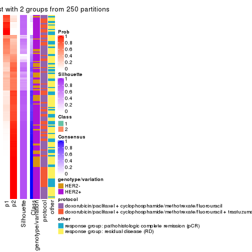</p>

</div>
<div id='tab-SD-hclust-consensus-heatmap-2'>
<pre><code class="r">consensus_heatmap(res, k = 3)
</code></pre>

<p>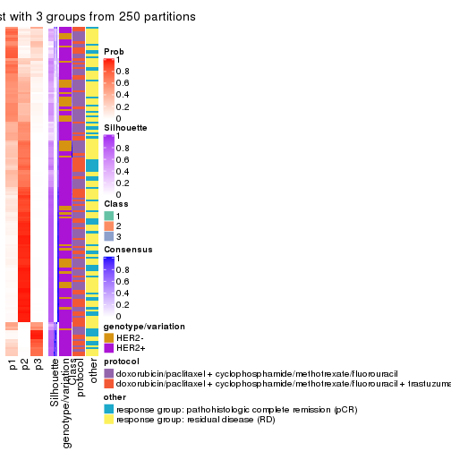</p>

</div>
<div id='tab-SD-hclust-consensus-heatmap-3'>
<pre><code class="r">consensus_heatmap(res, k = 4)
</code></pre>

<p>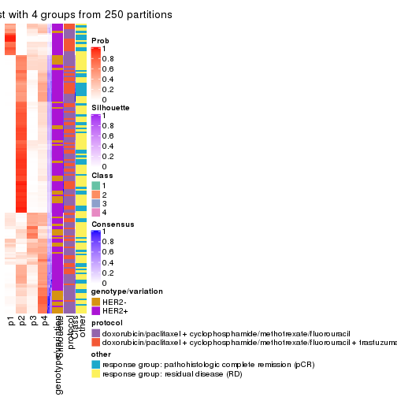</p>

</div>
<div id='tab-SD-hclust-consensus-heatmap-4'>
<pre><code class="r">consensus_heatmap(res, k = 5)
</code></pre>

<p>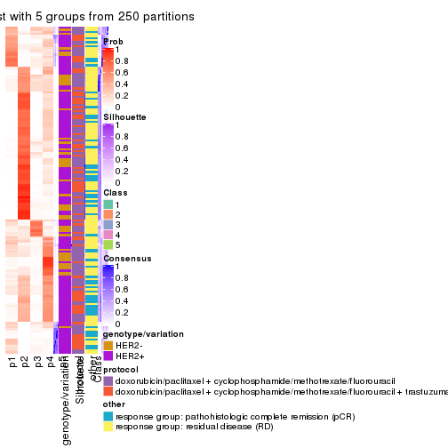</p>

</div>
<div id='tab-SD-hclust-consensus-heatmap-5'>
<pre><code class="r">consensus_heatmap(res, k = 6)
</code></pre>

<p>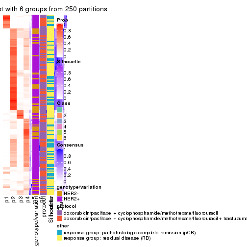</p>

</div>
</div>

Heatmaps for the membership of samples in all partitions to see how consistent they are:


<script>
$( function() {
	$( '#tabs-SD-hclust-membership-heatmap' ).tabs();
} );
</script>
<div id='tabs-SD-hclust-membership-heatmap'>
<ul>
<li><a href='#tab-SD-hclust-membership-heatmap-1'>k = 2</a></li>
<li><a href='#tab-SD-hclust-membership-heatmap-2'>k = 3</a></li>
<li><a href='#tab-SD-hclust-membership-heatmap-3'>k = 4</a></li>
<li><a href='#tab-SD-hclust-membership-heatmap-4'>k = 5</a></li>
<li><a href='#tab-SD-hclust-membership-heatmap-5'>k = 6</a></li>
</ul>
<div id='tab-SD-hclust-membership-heatmap-1'>
<pre><code class="r">membership_heatmap(res, k = 2)
</code></pre>

<p>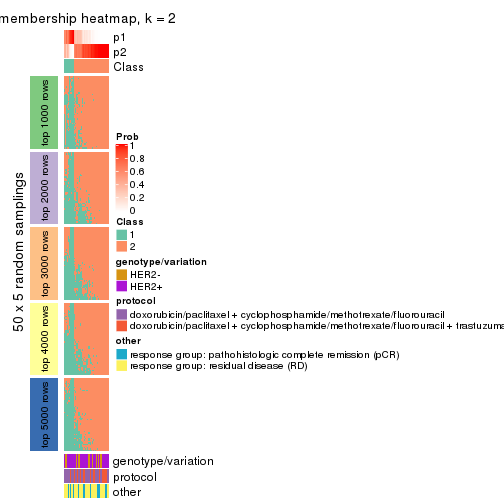</p>

</div>
<div id='tab-SD-hclust-membership-heatmap-2'>
<pre><code class="r">membership_heatmap(res, k = 3)
</code></pre>

<p>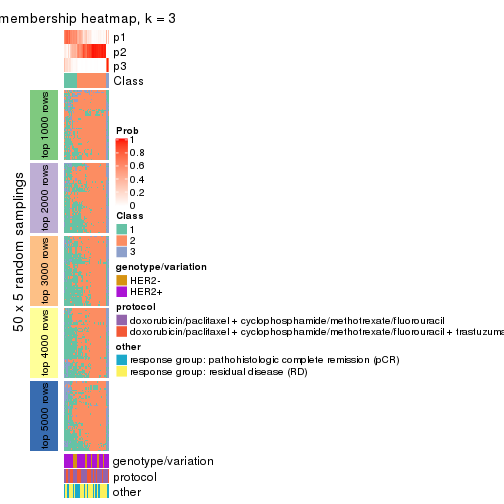</p>

</div>
<div id='tab-SD-hclust-membership-heatmap-3'>
<pre><code class="r">membership_heatmap(res, k = 4)
</code></pre>

<p>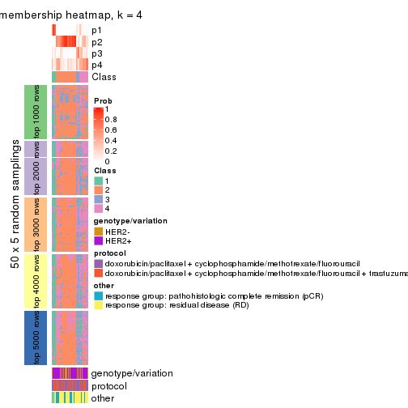</p>

</div>
<div id='tab-SD-hclust-membership-heatmap-4'>
<pre><code class="r">membership_heatmap(res, k = 5)
</code></pre>

<p>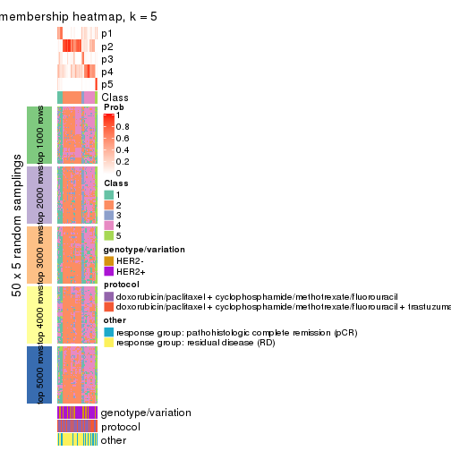</p>

</div>
<div id='tab-SD-hclust-membership-heatmap-5'>
<pre><code class="r">membership_heatmap(res, k = 6)
</code></pre>

<p>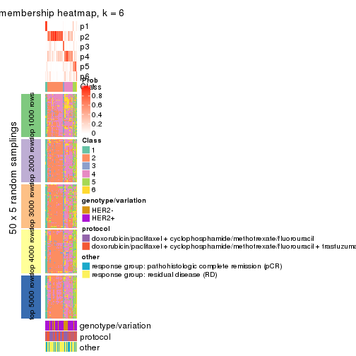</p>

</div>
</div>

As soon as we have had the classes for columns, we can look for signatures
which are significantly different between classes which can be candidate marks
for certain classes. Following are the heatmaps for signatures.


Signature heatmaps where rows are scaled:


<script>
$( function() {
	$( '#tabs-SD-hclust-get-signatures' ).tabs();
} );
</script>
<div id='tabs-SD-hclust-get-signatures'>
<ul>
<li><a href='#tab-SD-hclust-get-signatures-1'>k = 2</a></li>
<li><a href='#tab-SD-hclust-get-signatures-2'>k = 3</a></li>
<li><a href='#tab-SD-hclust-get-signatures-3'>k = 4</a></li>
<li><a href='#tab-SD-hclust-get-signatures-4'>k = 5</a></li>
<li><a href='#tab-SD-hclust-get-signatures-5'>k = 6</a></li>
</ul>
<div id='tab-SD-hclust-get-signatures-1'>
<pre><code class="r">get_signatures(res, k = 2)
</code></pre>

<pre><code>#&gt; Error: The width or height of the raster image is zero, maybe you forget to turn off the
#&gt; previous graphic device or it was corrupted. Run `dev.off()` to close it.
</code></pre>

<p></p>

</div>
<div id='tab-SD-hclust-get-signatures-2'>
<pre><code class="r">get_signatures(res, k = 3)
</code></pre>

<pre><code>#&gt; Error: The width or height of the raster image is zero, maybe you forget to turn off the
#&gt; previous graphic device or it was corrupted. Run `dev.off()` to close it.
</code></pre>

<p></p>

</div>
<div id='tab-SD-hclust-get-signatures-3'>
<pre><code class="r">get_signatures(res, k = 4)
</code></pre>

<pre><code>#&gt; Error: The width or height of the raster image is zero, maybe you forget to turn off the
#&gt; previous graphic device or it was corrupted. Run `dev.off()` to close it.
</code></pre>

<p></p>

</div>
<div id='tab-SD-hclust-get-signatures-4'>
<pre><code class="r">get_signatures(res, k = 5)
</code></pre>

<pre><code>#&gt; Error: The width or height of the raster image is zero, maybe you forget to turn off the
#&gt; previous graphic device or it was corrupted. Run `dev.off()` to close it.
</code></pre>

<p></p>

</div>
<div id='tab-SD-hclust-get-signatures-5'>
<pre><code class="r">get_signatures(res, k = 6)
</code></pre>

<pre><code>#&gt; Error: The width or height of the raster image is zero, maybe you forget to turn off the
#&gt; previous graphic device or it was corrupted. Run `dev.off()` to close it.
</code></pre>

<p></p>

</div>
</div>


Signature heatmaps where rows are not scaled:


<script>
$( function() {
	$( '#tabs-SD-hclust-get-signatures-no-scale' ).tabs();
} );
</script>
<div id='tabs-SD-hclust-get-signatures-no-scale'>
<ul>
<li><a href='#tab-SD-hclust-get-signatures-no-scale-1'>k = 2</a></li>
<li><a href='#tab-SD-hclust-get-signatures-no-scale-2'>k = 3</a></li>
<li><a href='#tab-SD-hclust-get-signatures-no-scale-3'>k = 4</a></li>
<li><a href='#tab-SD-hclust-get-signatures-no-scale-4'>k = 5</a></li>
<li><a href='#tab-SD-hclust-get-signatures-no-scale-5'>k = 6</a></li>
</ul>
<div id='tab-SD-hclust-get-signatures-no-scale-1'>
<pre><code class="r">get_signatures(res, k = 2, scale_rows = FALSE)
</code></pre>

<pre><code>#&gt; Error: The width or height of the raster image is zero, maybe you forget to turn off the
#&gt; previous graphic device or it was corrupted. Run `dev.off()` to close it.
</code></pre>

<p></p>

</div>
<div id='tab-SD-hclust-get-signatures-no-scale-2'>
<pre><code class="r">get_signatures(res, k = 3, scale_rows = FALSE)
</code></pre>

<pre><code>#&gt; Error: The width or height of the raster image is zero, maybe you forget to turn off the
#&gt; previous graphic device or it was corrupted. Run `dev.off()` to close it.
</code></pre>

<p></p>

</div>
<div id='tab-SD-hclust-get-signatures-no-scale-3'>
<pre><code class="r">get_signatures(res, k = 4, scale_rows = FALSE)
</code></pre>

<pre><code>#&gt; Error: The width or height of the raster image is zero, maybe you forget to turn off the
#&gt; previous graphic device or it was corrupted. Run `dev.off()` to close it.
</code></pre>

<p></p>

</div>
<div id='tab-SD-hclust-get-signatures-no-scale-4'>
<pre><code class="r">get_signatures(res, k = 5, scale_rows = FALSE)
</code></pre>

<pre><code>#&gt; Error: The width or height of the raster image is zero, maybe you forget to turn off the
#&gt; previous graphic device or it was corrupted. Run `dev.off()` to close it.
</code></pre>

<p></p>

</div>
<div id='tab-SD-hclust-get-signatures-no-scale-5'>
<pre><code class="r">get_signatures(res, k = 6, scale_rows = FALSE)
</code></pre>

<pre><code>#&gt; Error: The width or height of the raster image is zero, maybe you forget to turn off the
#&gt; previous graphic device or it was corrupted. Run `dev.off()` to close it.
</code></pre>

<p></p>

</div>
</div>


Compare the overlap of signatures from different k:

```r
compare_signatures(res)
```

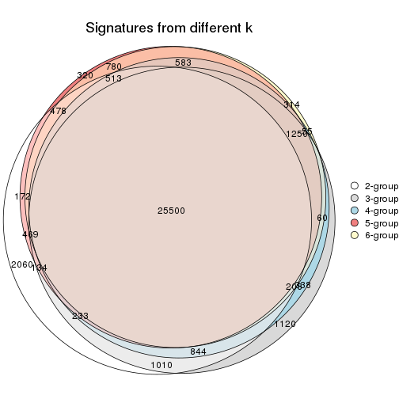

`get_signature()` returns a data frame invisibly. TO get the list of signatures, the function
call should be assigned to a variable explicitly. In following code, if `plot` argument is set
to `FALSE`, no heatmap is plotted while only the differential analysis is performed.

```r
# code only for demonstration
tb = get_signature(res, k = ..., plot = FALSE)
```

An example of the output of `tb` is:

```
#>   which_row         fdr    mean_1    mean_2 scaled_mean_1 scaled_mean_2 km
#> 1        38 0.042760348  8.373488  9.131774    -0.5533452     0.5164555  1
#> 2        40 0.018707592  7.106213  8.469186    -0.6173731     0.5762149  1
#> 3        55 0.019134737 10.221463 11.207825    -0.6159697     0.5749050  1
#> 4        59 0.006059896  5.921854  7.869574    -0.6899429     0.6439467  1
#> 5        60 0.018055526  8.928898 10.211722    -0.6204761     0.5791110  1
#> 6        98 0.009384629 15.714769 14.887706     0.6635654    -0.6193277  2
...
```

The columns in `tb` are:

1. `which_row`: row indices corresponding to the input matrix.
2. `fdr`: FDR for the differential test. 
3. `mean_x`: The mean value in group x.
4. `scaled_mean_x`: The mean value in group x after rows are scaled.
5. `km`: Row groups if k-means clustering is applied to rows.


UMAP plot which shows how samples are separated.


<script>
$( function() {
	$( '#tabs-SD-hclust-dimension-reduction' ).tabs();
} );
</script>
<div id='tabs-SD-hclust-dimension-reduction'>
<ul>
<li><a href='#tab-SD-hclust-dimension-reduction-1'>k = 2</a></li>
<li><a href='#tab-SD-hclust-dimension-reduction-2'>k = 3</a></li>
<li><a href='#tab-SD-hclust-dimension-reduction-3'>k = 4</a></li>
<li><a href='#tab-SD-hclust-dimension-reduction-4'>k = 5</a></li>
<li><a href='#tab-SD-hclust-dimension-reduction-5'>k = 6</a></li>
</ul>
<div id='tab-SD-hclust-dimension-reduction-1'>
<pre><code class="r">dimension_reduction(res, k = 2, method = &quot;UMAP&quot;)
</code></pre>

<p>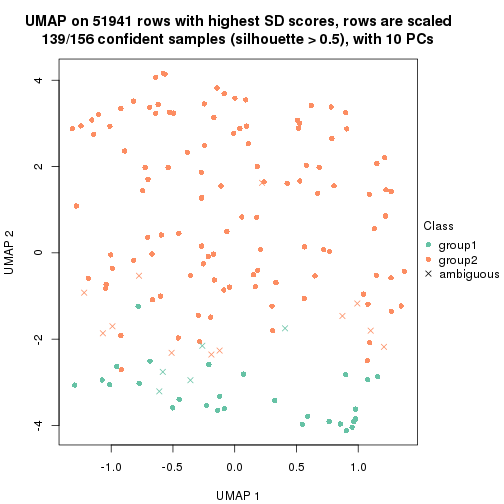</p>

</div>
<div id='tab-SD-hclust-dimension-reduction-2'>
<pre><code class="r">dimension_reduction(res, k = 3, method = &quot;UMAP&quot;)
</code></pre>

<p>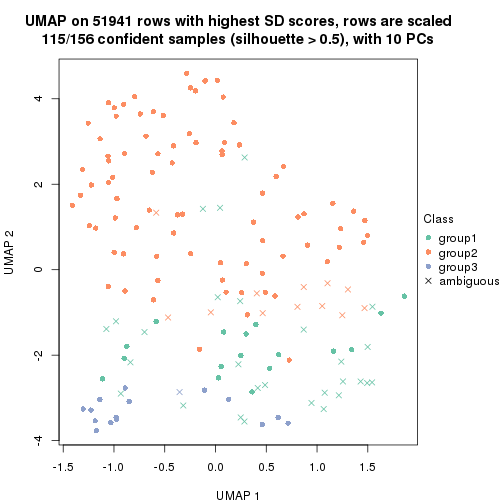</p>

</div>
<div id='tab-SD-hclust-dimension-reduction-3'>
<pre><code class="r">dimension_reduction(res, k = 4, method = &quot;UMAP&quot;)
</code></pre>

<p>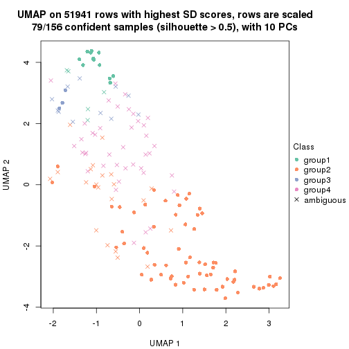</p>

</div>
<div id='tab-SD-hclust-dimension-reduction-4'>
<pre><code class="r">dimension_reduction(res, k = 5, method = &quot;UMAP&quot;)
</code></pre>

<p>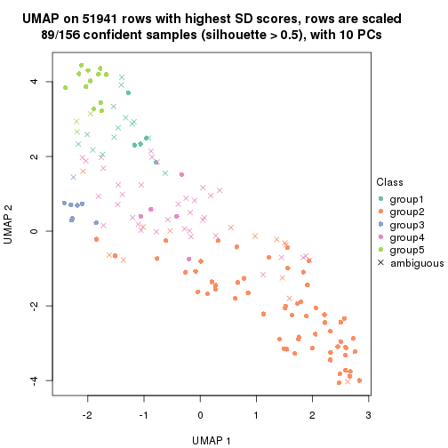</p>

</div>
<div id='tab-SD-hclust-dimension-reduction-5'>
<pre><code class="r">dimension_reduction(res, k = 6, method = &quot;UMAP&quot;)
</code></pre>

<p>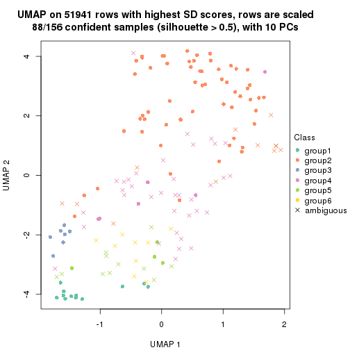</p>

</div>
</div>


Following heatmap shows how subgroups are split when increasing `k`:

```r
collect_classes(res)
```

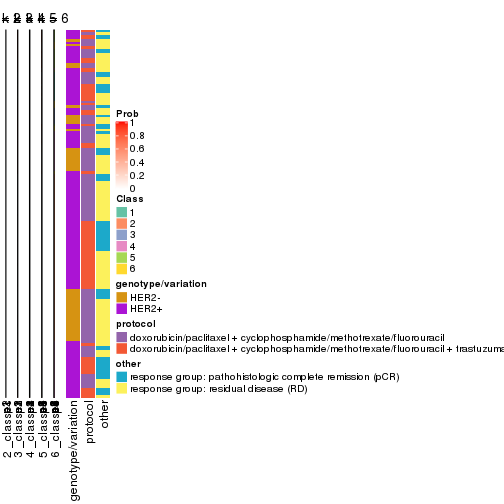


Test correlation between subgroups and known annotations. If the known
annotation is numeric, one-way ANOVA test is applied, and if the known
annotation is discrete, chi-squared contingency table test is applied.

```r
test_to_known_factors(res)
```

```
#>             n genotype/variation(p) protocol(p) other(p) k
#> SD:hclust 139                0.0585       0.386    0.471 2
#> SD:hclust 115                0.2240       0.590    0.552 3
#> SD:hclust  79                0.0302       0.590    0.519 4
#> SD:hclust  89                0.0136       0.191    0.375 5
#> SD:hclust  88                0.0244       0.172    0.239 6
```


If matrix rows can be associated to genes, consider to use `functional_enrichment(res,
...)` to perform function enrichment for the signature genes. See [this vignette](http://bioconductor.org/packages/devel/bioc/vignettes/cola/inst/doc/functional_enrichment.html) for more detailed explanations.


 

---------------------------------------------------


### SD:kmeans*


The object with results only for a single top-value method and a single partition method 
can be extracted as:

```r
res = res_list["SD", "kmeans"]
# you can also extract it by
# res = res_list["SD:kmeans"]
```

A summary of `res` and all the functions that can be applied to it:

```r
res
```

```
#> A 'ConsensusPartition' object with k = 2, 3, 4, 5, 6.
#>   On a matrix with 51941 rows and 156 columns.
#>   Top rows (1000, 2000, 3000, 4000, 5000) are extracted by 'SD' method.
#>   Subgroups are detected by 'kmeans' method.
#>   Performed in total 1250 partitions by row resampling.
#>   Best k for subgroups seems to be 2.
#> 
#> Following methods can be applied to this 'ConsensusPartition' object:
#>  [1] "cola_report"             "collect_classes"         "collect_plots"          
#>  [4] "collect_stats"           "colnames"                "compare_signatures"     
#>  [7] "consensus_heatmap"       "dimension_reduction"     "functional_enrichment"  
#> [10] "get_anno_col"            "get_anno"                "get_classes"            
#> [13] "get_consensus"           "get_matrix"              "get_membership"         
#> [16] "get_param"               "get_signatures"          "get_stats"              
#> [19] "is_best_k"               "is_stable_k"             "membership_heatmap"     
#> [22] "ncol"                    "nrow"                    "plot_ecdf"              
#> [25] "rownames"                "select_partition_number" "show"                   
#> [28] "suggest_best_k"          "test_to_known_factors"
```

`collect_plots()` function collects all the plots made from `res` for all `k` (number of partitions)
into one single page to provide an easy and fast comparison between different `k`.

```r
collect_plots(res)
```

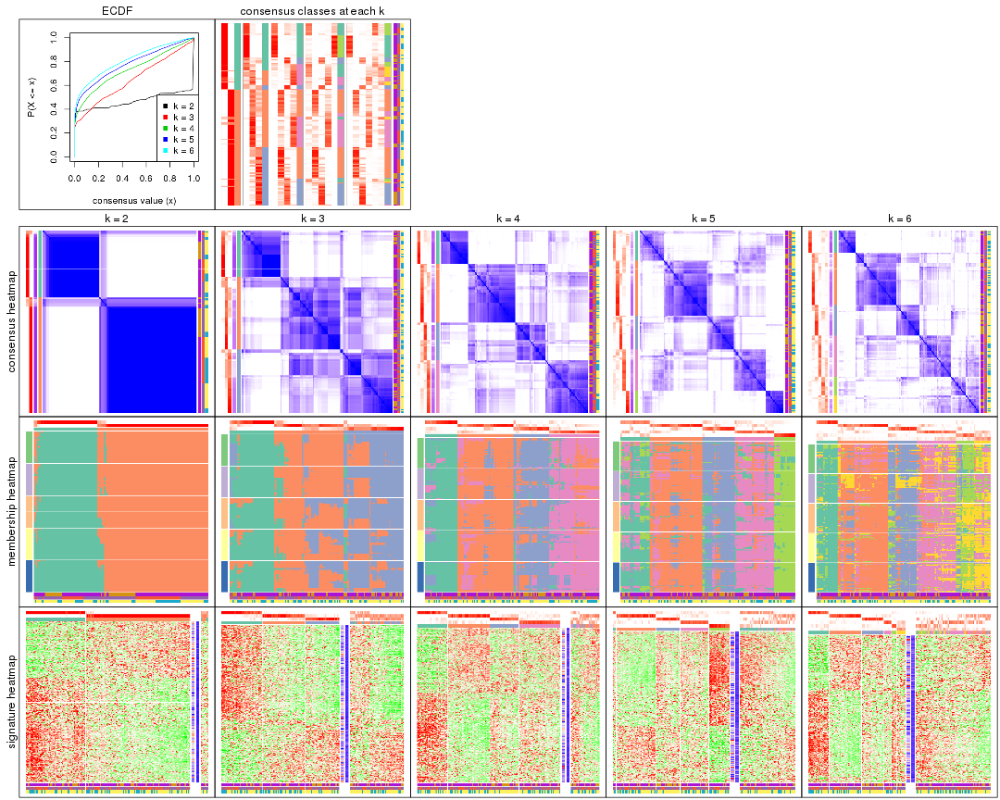

The plots are:

- The first row: a plot of the ECDF (empirical cumulative distribution
  function) curves of the consensus matrix for each `k` and the heatmap of
  predicted classes for each `k`.
- The second row: heatmaps of the consensus matrix for each `k`.
- The third row: heatmaps of the membership matrix for each `k`.
- The fouth row: heatmaps of the signatures for each `k`.

All the plots in panels can be made by individual functions and they are
plotted later in this section.

`select_partition_number()` produces several plots showing different
statistics for choosing "optimized" `k`. There are following statistics:

- ECDF curves of the consensus matrix for each `k`;
- 1-PAC. [The PAC
  score](https://en.wikipedia.org/wiki/Consensus_clustering#Over-interpretation_potential_of_consensus_clustering)
  measures the proportion of the ambiguous subgrouping.
- Mean silhouette score.
- Concordance. The mean probability of fiting the consensus class ids in all
  partitions.
- Area increased. Denote $A_k$ as the area under the ECDF curve for current
  `k`, the area increased is defined as $A_k - A_{k-1}$.
- Rand index. The percent of pairs of samples that are both in a same cluster
  or both are not in a same cluster in the partition of k and k-1.
- Jaccard index. The ratio of pairs of samples are both in a same cluster in
  the partition of k and k-1 and the pairs of samples are both in a same
  cluster in the partition k or k-1.

The detailed explanations of these statistics can be found in [the _cola_
vignette](http://bioconductor.org/packages/devel/bioc/vignettes/cola/inst/doc/cola.html#toc_13).

Generally speaking, lower PAC score, higher mean silhouette score or higher
concordance corresponds to better partition. Rand index and Jaccard index
measure how similar the current partition is compared to partition with `k-1`.
If they are too similar, we won't accept `k` is better than `k-1`.

```r
select_partition_number(res)
```

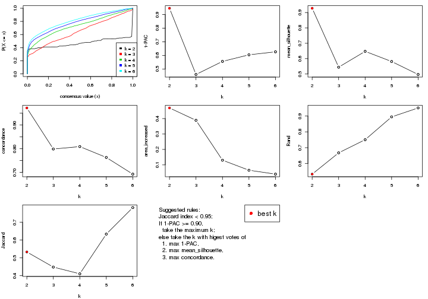

The numeric values for all these statistics can be obtained by `get_stats()`.

```r
get_stats(res)
```

```
#>   k 1-PAC mean_silhouette concordance area_increased  Rand Jaccard
#> 2 2 0.946           0.928       0.972         0.4689 0.533   0.533
#> 3 3 0.460           0.544       0.799         0.3888 0.668   0.448
#> 4 4 0.556           0.647       0.809         0.1303 0.750   0.411
#> 5 5 0.604           0.581       0.763         0.0652 0.894   0.634
#> 6 6 0.626           0.497       0.693         0.0399 0.951   0.782
```

`suggest_best_k()` suggests the best $k$ based on these statistics. The rules are as follows:

- All $k$ with Jaccard index larger than 0.95 are removed because increasing
  $k$ does not provide enough extra information. If all $k$ are removed, it is
  marked as no subgroup is detected.
- For all $k$ with 1-PAC score larger than 0.9, the maximal $k$ is taken as
  the best $k$, and other $k$ are marked as optional $k$.
- If it does not fit the second rule. The $k$ with the maximal vote of the
  highest 1-PAC score, highest mean silhouette, and highest concordance is
  taken as the best $k$.

```r
suggest_best_k(res)
```

```
#> [1] 2
```


Following shows the table of the partitions (You need to click the **show/hide
code output** link to see it). The membership matrix (columns with name `p*`)
is inferred by
[`clue::cl_consensus()`](https://www.rdocumentation.org/link/cl_consensus?package=clue)
function with the `SE` method. Basically the value in the membership matrix
represents the probability to belong to a certain group. The finall class
label for an item is determined with the group with highest probability it
belongs to.

In `get_classes()` function, the entropy is calculated from the membership
matrix and the silhouette score is calculated from the consensus matrix.


<script>
$( function() {
	$( '#tabs-SD-kmeans-get-classes' ).tabs();
} );
</script>
<div id='tabs-SD-kmeans-get-classes'>
<ul>
<li><a href='#tab-SD-kmeans-get-classes-1'>k = 2</a></li>
<li><a href='#tab-SD-kmeans-get-classes-2'>k = 3</a></li>
<li><a href='#tab-SD-kmeans-get-classes-3'>k = 4</a></li>
<li><a href='#tab-SD-kmeans-get-classes-4'>k = 5</a></li>
<li><a href='#tab-SD-kmeans-get-classes-5'>k = 6</a></li>
</ul>

<div id='tab-SD-kmeans-get-classes-1'>
<p><a id='tab-SD-kmeans-get-classes-1-a' style='color:#0366d6' href='#'>show/hide code output</a></p>
<pre><code class="r">cbind(get_classes(res, k = 2), get_membership(res, k = 2))
</code></pre>

<pre><code>#&gt;            class entropy silhouette    p1    p2
#&gt; GSM1232995     2  0.0000     0.9723 0.000 1.000
#&gt; GSM1233002     2  0.1184     0.9577 0.016 0.984
#&gt; GSM1233003     1  0.0000     0.9673 1.000 0.000
#&gt; GSM1233014     2  0.0000     0.9723 0.000 1.000
#&gt; GSM1233015     1  0.0672     0.9610 0.992 0.008
#&gt; GSM1233016     2  0.1633     0.9503 0.024 0.976
#&gt; GSM1233024     2  0.0000     0.9723 0.000 1.000
#&gt; GSM1233049     1  0.0000     0.9673 1.000 0.000
#&gt; GSM1233064     2  0.0000     0.9723 0.000 1.000
#&gt; GSM1233068     1  0.9944     0.1528 0.544 0.456
#&gt; GSM1233073     2  0.9732     0.3206 0.404 0.596
#&gt; GSM1233093     1  0.0000     0.9673 1.000 0.000
#&gt; GSM1233115     1  0.0000     0.9673 1.000 0.000
#&gt; GSM1232992     2  0.0000     0.9723 0.000 1.000
#&gt; GSM1232993     2  0.0000     0.9723 0.000 1.000
#&gt; GSM1233005     2  0.0000     0.9723 0.000 1.000
#&gt; GSM1233007     2  0.0000     0.9723 0.000 1.000
#&gt; GSM1233010     2  0.8763     0.5742 0.296 0.704
#&gt; GSM1233013     2  0.0000     0.9723 0.000 1.000
#&gt; GSM1233018     2  0.0000     0.9723 0.000 1.000
#&gt; GSM1233019     2  0.0000     0.9723 0.000 1.000
#&gt; GSM1233021     2  0.0000     0.9723 0.000 1.000
#&gt; GSM1233025     1  0.3879     0.8955 0.924 0.076
#&gt; GSM1233029     2  0.0000     0.9723 0.000 1.000
#&gt; GSM1233030     2  0.0000     0.9723 0.000 1.000
#&gt; GSM1233031     2  0.0000     0.9723 0.000 1.000
#&gt; GSM1233032     1  0.0000     0.9673 1.000 0.000
#&gt; GSM1233035     1  0.9998     0.0172 0.508 0.492
#&gt; GSM1233038     1  0.0000     0.9673 1.000 0.000
#&gt; GSM1233039     2  0.0000     0.9723 0.000 1.000
#&gt; GSM1233042     2  0.0000     0.9723 0.000 1.000
#&gt; GSM1233043     2  0.0000     0.9723 0.000 1.000
#&gt; GSM1233044     1  0.4431     0.8784 0.908 0.092
#&gt; GSM1233046     1  0.0376     0.9642 0.996 0.004
#&gt; GSM1233051     1  0.0000     0.9673 1.000 0.000
#&gt; GSM1233054     2  0.9522     0.4055 0.372 0.628
#&gt; GSM1233057     2  0.0000     0.9723 0.000 1.000
#&gt; GSM1233060     2  0.0000     0.9723 0.000 1.000
#&gt; GSM1233062     2  0.0000     0.9723 0.000 1.000
#&gt; GSM1233075     2  0.0000     0.9723 0.000 1.000
#&gt; GSM1233078     2  0.9661     0.3532 0.392 0.608
#&gt; GSM1233079     1  0.0000     0.9673 1.000 0.000
#&gt; GSM1233082     1  0.0376     0.9643 0.996 0.004
#&gt; GSM1233083     1  0.0000     0.9673 1.000 0.000
#&gt; GSM1233091     2  0.0000     0.9723 0.000 1.000
#&gt; GSM1233095     1  0.0000     0.9673 1.000 0.000
#&gt; GSM1233096     1  0.0000     0.9673 1.000 0.000
#&gt; GSM1233101     1  0.0000     0.9673 1.000 0.000
#&gt; GSM1233105     1  0.0000     0.9673 1.000 0.000
#&gt; GSM1233117     2  0.0000     0.9723 0.000 1.000
#&gt; GSM1233118     2  0.0000     0.9723 0.000 1.000
#&gt; GSM1233001     2  0.0000     0.9723 0.000 1.000
#&gt; GSM1233006     2  0.0000     0.9723 0.000 1.000
#&gt; GSM1233008     2  0.0000     0.9723 0.000 1.000
#&gt; GSM1233009     2  0.0000     0.9723 0.000 1.000
#&gt; GSM1233017     2  0.0000     0.9723 0.000 1.000
#&gt; GSM1233020     2  0.0000     0.9723 0.000 1.000
#&gt; GSM1233022     2  0.0000     0.9723 0.000 1.000
#&gt; GSM1233026     2  0.0000     0.9723 0.000 1.000
#&gt; GSM1233028     2  0.0000     0.9723 0.000 1.000
#&gt; GSM1233034     2  0.0000     0.9723 0.000 1.000
#&gt; GSM1233040     1  0.0000     0.9673 1.000 0.000
#&gt; GSM1233048     1  0.0000     0.9673 1.000 0.000
#&gt; GSM1233056     1  0.0000     0.9673 1.000 0.000
#&gt; GSM1233058     2  0.0000     0.9723 0.000 1.000
#&gt; GSM1233059     1  0.0000     0.9673 1.000 0.000
#&gt; GSM1233066     2  0.0000     0.9723 0.000 1.000
#&gt; GSM1233071     2  0.0000     0.9723 0.000 1.000
#&gt; GSM1233074     2  0.0000     0.9723 0.000 1.000
#&gt; GSM1233076     2  0.0000     0.9723 0.000 1.000
#&gt; GSM1233080     1  0.0000     0.9673 1.000 0.000
#&gt; GSM1233088     2  0.0000     0.9723 0.000 1.000
#&gt; GSM1233090     1  0.0000     0.9673 1.000 0.000
#&gt; GSM1233092     2  0.0000     0.9723 0.000 1.000
#&gt; GSM1233094     2  0.0000     0.9723 0.000 1.000
#&gt; GSM1233097     2  0.0000     0.9723 0.000 1.000
#&gt; GSM1233100     2  0.8608     0.5972 0.284 0.716
#&gt; GSM1233104     2  0.0000     0.9723 0.000 1.000
#&gt; GSM1233106     1  0.0672     0.9610 0.992 0.008
#&gt; GSM1233111     1  0.0000     0.9673 1.000 0.000
#&gt; GSM1233122     2  0.0000     0.9723 0.000 1.000
#&gt; GSM1233146     2  0.0000     0.9723 0.000 1.000
#&gt; GSM1232994     2  0.0000     0.9723 0.000 1.000
#&gt; GSM1232996     2  0.0000     0.9723 0.000 1.000
#&gt; GSM1232997     2  0.0000     0.9723 0.000 1.000
#&gt; GSM1232998     2  0.0000     0.9723 0.000 1.000
#&gt; GSM1232999     2  0.0000     0.9723 0.000 1.000
#&gt; GSM1233000     2  0.0000     0.9723 0.000 1.000
#&gt; GSM1233004     1  0.9983     0.0849 0.524 0.476
#&gt; GSM1233011     2  0.0000     0.9723 0.000 1.000
#&gt; GSM1233012     2  0.0000     0.9723 0.000 1.000
#&gt; GSM1233023     2  0.0000     0.9723 0.000 1.000
#&gt; GSM1233027     2  0.0000     0.9723 0.000 1.000
#&gt; GSM1233033     1  0.0000     0.9673 1.000 0.000
#&gt; GSM1233036     2  0.0000     0.9723 0.000 1.000
#&gt; GSM1233037     2  0.0000     0.9723 0.000 1.000
#&gt; GSM1233041     1  0.0000     0.9673 1.000 0.000
#&gt; GSM1233045     2  0.0000     0.9723 0.000 1.000
#&gt; GSM1233047     1  0.0000     0.9673 1.000 0.000
#&gt; GSM1233050     1  0.0000     0.9673 1.000 0.000
#&gt; GSM1233052     1  0.0000     0.9673 1.000 0.000
#&gt; GSM1233053     1  0.0000     0.9673 1.000 0.000
#&gt; GSM1233055     1  0.0000     0.9673 1.000 0.000
#&gt; GSM1233061     2  0.0000     0.9723 0.000 1.000
#&gt; GSM1233063     1  0.0000     0.9673 1.000 0.000
#&gt; GSM1233065     2  0.0000     0.9723 0.000 1.000
#&gt; GSM1233070     2  0.0000     0.9723 0.000 1.000
#&gt; GSM1233077     2  0.0000     0.9723 0.000 1.000
#&gt; GSM1233081     1  0.0000     0.9673 1.000 0.000
#&gt; GSM1233084     1  0.0000     0.9673 1.000 0.000
#&gt; GSM1233087     1  0.5842     0.8204 0.860 0.140
#&gt; GSM1233089     2  0.0000     0.9723 0.000 1.000
#&gt; GSM1233099     1  0.0000     0.9673 1.000 0.000
#&gt; GSM1233112     1  0.0000     0.9673 1.000 0.000
#&gt; GSM1233085     1  0.0000     0.9673 1.000 0.000
#&gt; GSM1233098     2  0.0000     0.9723 0.000 1.000
#&gt; GSM1233114     1  0.0000     0.9673 1.000 0.000
#&gt; GSM1233119     2  0.6148     0.8061 0.152 0.848
#&gt; GSM1233129     2  0.0000     0.9723 0.000 1.000
#&gt; GSM1233132     1  0.0000     0.9673 1.000 0.000
#&gt; GSM1233139     2  0.0000     0.9723 0.000 1.000
#&gt; GSM1233143     2  0.0000     0.9723 0.000 1.000
#&gt; GSM1233145     1  0.0000     0.9673 1.000 0.000
#&gt; GSM1233067     2  0.0000     0.9723 0.000 1.000
#&gt; GSM1233069     2  0.0000     0.9723 0.000 1.000
#&gt; GSM1233072     2  0.0000     0.9723 0.000 1.000
#&gt; GSM1233086     2  0.0000     0.9723 0.000 1.000
#&gt; GSM1233102     1  0.0000     0.9673 1.000 0.000
#&gt; GSM1233103     2  0.9209     0.4923 0.336 0.664
#&gt; GSM1233107     2  0.8813     0.5658 0.300 0.700
#&gt; GSM1233108     1  0.0000     0.9673 1.000 0.000
#&gt; GSM1233109     1  0.0000     0.9673 1.000 0.000
#&gt; GSM1233110     2  0.0000     0.9723 0.000 1.000
#&gt; GSM1233113     2  0.0000     0.9723 0.000 1.000
#&gt; GSM1233116     2  0.0000     0.9723 0.000 1.000
#&gt; GSM1233120     1  0.0000     0.9673 1.000 0.000
#&gt; GSM1233121     2  0.0000     0.9723 0.000 1.000
#&gt; GSM1233123     2  0.0000     0.9723 0.000 1.000
#&gt; GSM1233124     2  0.0000     0.9723 0.000 1.000
#&gt; GSM1233125     1  0.0000     0.9673 1.000 0.000
#&gt; GSM1233126     2  0.0000     0.9723 0.000 1.000
#&gt; GSM1233127     2  0.0000     0.9723 0.000 1.000
#&gt; GSM1233128     1  0.0000     0.9673 1.000 0.000
#&gt; GSM1233130     2  0.0000     0.9723 0.000 1.000
#&gt; GSM1233131     1  0.0000     0.9673 1.000 0.000
#&gt; GSM1233133     1  0.0000     0.9673 1.000 0.000
#&gt; GSM1233134     2  0.0000     0.9723 0.000 1.000
#&gt; GSM1233135     2  0.0000     0.9723 0.000 1.000
#&gt; GSM1233136     2  0.0000     0.9723 0.000 1.000
#&gt; GSM1233137     1  0.0000     0.9673 1.000 0.000
#&gt; GSM1233138     2  0.0000     0.9723 0.000 1.000
#&gt; GSM1233140     1  0.0000     0.9673 1.000 0.000
#&gt; GSM1233141     2  0.0000     0.9723 0.000 1.000
#&gt; GSM1233142     2  0.0000     0.9723 0.000 1.000
#&gt; GSM1233144     1  0.0000     0.9673 1.000 0.000
#&gt; GSM1233147     2  0.0000     0.9723 0.000 1.000
</code></pre>

<script>
$('#tab-SD-kmeans-get-classes-1-a').parent().next().next().hide();
$('#tab-SD-kmeans-get-classes-1-a').click(function(){
  $('#tab-SD-kmeans-get-classes-1-a').parent().next().next().toggle();
  return(false);
});
</script>
</div>

<div id='tab-SD-kmeans-get-classes-2'>
<p><a id='tab-SD-kmeans-get-classes-2-a' style='color:#0366d6' href='#'>show/hide code output</a></p>
<pre><code class="r">cbind(get_classes(res, k = 3), get_membership(res, k = 3))
</code></pre>

<pre><code>#&gt;            class entropy silhouette    p1    p2    p3
#&gt; GSM1232995     3  0.4452     0.5513 0.000 0.192 0.808
#&gt; GSM1233002     2  0.0237     0.6579 0.000 0.996 0.004
#&gt; GSM1233003     1  0.0000     0.8927 1.000 0.000 0.000
#&gt; GSM1233014     2  0.4178     0.6358 0.000 0.828 0.172
#&gt; GSM1233015     1  0.5926     0.5754 0.644 0.356 0.000
#&gt; GSM1233016     2  0.0000     0.6588 0.000 1.000 0.000
#&gt; GSM1233024     2  0.5431     0.5456 0.000 0.716 0.284
#&gt; GSM1233049     1  0.0000     0.8927 1.000 0.000 0.000
#&gt; GSM1233064     3  0.5988     0.3759 0.000 0.368 0.632
#&gt; GSM1233068     2  0.3375     0.5951 0.100 0.892 0.008
#&gt; GSM1233073     2  0.0475     0.6569 0.004 0.992 0.004
#&gt; GSM1233093     1  0.0000     0.8927 1.000 0.000 0.000
#&gt; GSM1233115     1  0.4931     0.7543 0.768 0.232 0.000
#&gt; GSM1232992     3  0.6225     0.1810 0.000 0.432 0.568
#&gt; GSM1232993     2  0.4974     0.5945 0.000 0.764 0.236
#&gt; GSM1233005     3  0.6235     0.1689 0.000 0.436 0.564
#&gt; GSM1233007     2  0.5882     0.3949 0.000 0.652 0.348
#&gt; GSM1233010     2  0.0661     0.6554 0.008 0.988 0.004
#&gt; GSM1233013     3  0.6225     0.1810 0.000 0.432 0.568
#&gt; GSM1233018     3  0.6215     0.1912 0.000 0.428 0.572
#&gt; GSM1233019     2  0.6215     0.2741 0.000 0.572 0.428
#&gt; GSM1233021     3  0.6267     0.1164 0.000 0.452 0.548
#&gt; GSM1233025     2  0.2772     0.6145 0.080 0.916 0.004
#&gt; GSM1233029     2  0.5650     0.5072 0.000 0.688 0.312
#&gt; GSM1233030     3  0.6302     0.0127 0.000 0.480 0.520
#&gt; GSM1233031     2  0.0000     0.6588 0.000 1.000 0.000
#&gt; GSM1233032     1  0.2066     0.8836 0.940 0.060 0.000
#&gt; GSM1233035     2  0.0237     0.6582 0.004 0.996 0.000
#&gt; GSM1233038     1  0.0000     0.8927 1.000 0.000 0.000
#&gt; GSM1233039     2  0.6204     0.0771 0.000 0.576 0.424
#&gt; GSM1233042     2  0.3267     0.6590 0.000 0.884 0.116
#&gt; GSM1233043     2  0.3412     0.6571 0.000 0.876 0.124
#&gt; GSM1233044     2  0.8845     0.1993 0.184 0.576 0.240
#&gt; GSM1233046     2  0.5905     0.1948 0.352 0.648 0.000
#&gt; GSM1233051     1  0.3038     0.8638 0.896 0.104 0.000
#&gt; GSM1233054     3  0.5220     0.5538 0.012 0.208 0.780
#&gt; GSM1233057     3  0.3116     0.6240 0.000 0.108 0.892
#&gt; GSM1233060     2  0.0237     0.6598 0.000 0.996 0.004
#&gt; GSM1233062     2  0.4796     0.6065 0.000 0.780 0.220
#&gt; GSM1233075     3  0.0000     0.6604 0.000 0.000 1.000
#&gt; GSM1233078     3  0.5363     0.4963 0.000 0.276 0.724
#&gt; GSM1233079     1  0.1964     0.8844 0.944 0.056 0.000
#&gt; GSM1233082     2  0.6295    -0.1783 0.472 0.528 0.000
#&gt; GSM1233083     1  0.0000     0.8927 1.000 0.000 0.000
#&gt; GSM1233091     2  0.4605     0.4581 0.000 0.796 0.204
#&gt; GSM1233095     1  0.0000     0.8927 1.000 0.000 0.000
#&gt; GSM1233096     1  0.2537     0.8770 0.920 0.080 0.000
#&gt; GSM1233101     1  0.0000     0.8927 1.000 0.000 0.000
#&gt; GSM1233105     2  0.6235    -0.0572 0.436 0.564 0.000
#&gt; GSM1233117     3  0.5016     0.4987 0.000 0.240 0.760
#&gt; GSM1233118     3  0.0747     0.6604 0.000 0.016 0.984
#&gt; GSM1233001     3  0.4654     0.5328 0.000 0.208 0.792
#&gt; GSM1233006     2  0.5254     0.5667 0.000 0.736 0.264
#&gt; GSM1233008     3  0.6225     0.1810 0.000 0.432 0.568
#&gt; GSM1233009     2  0.6215     0.2741 0.000 0.572 0.428
#&gt; GSM1233017     2  0.6180     0.3042 0.000 0.584 0.416
#&gt; GSM1233020     3  0.6192     0.2099 0.000 0.420 0.580
#&gt; GSM1233022     2  0.4750     0.6093 0.000 0.784 0.216
#&gt; GSM1233026     2  0.0237     0.6579 0.000 0.996 0.004
#&gt; GSM1233028     2  0.0237     0.6579 0.000 0.996 0.004
#&gt; GSM1233034     3  0.6192     0.2099 0.000 0.420 0.580
#&gt; GSM1233040     1  0.2066     0.8836 0.940 0.060 0.000
#&gt; GSM1233048     1  0.0000     0.8927 1.000 0.000 0.000
#&gt; GSM1233056     1  0.0000     0.8927 1.000 0.000 0.000
#&gt; GSM1233058     2  0.0237     0.6579 0.000 0.996 0.004
#&gt; GSM1233059     1  0.0000     0.8927 1.000 0.000 0.000
#&gt; GSM1233066     3  0.4702     0.5671 0.000 0.212 0.788
#&gt; GSM1233071     2  0.4291     0.6336 0.000 0.820 0.180
#&gt; GSM1233074     3  0.0000     0.6604 0.000 0.000 1.000
#&gt; GSM1233076     2  0.5678     0.4064 0.000 0.684 0.316
#&gt; GSM1233080     1  0.0000     0.8927 1.000 0.000 0.000
#&gt; GSM1233088     3  0.6307     0.2788 0.000 0.488 0.512
#&gt; GSM1233090     1  0.0000     0.8927 1.000 0.000 0.000
#&gt; GSM1233092     2  0.3551     0.6543 0.000 0.868 0.132
#&gt; GSM1233094     2  0.3116     0.6604 0.000 0.892 0.108
#&gt; GSM1233097     2  0.2066     0.6631 0.000 0.940 0.060
#&gt; GSM1233100     2  0.0475     0.6569 0.004 0.992 0.004
#&gt; GSM1233104     2  0.3412     0.6571 0.000 0.876 0.124
#&gt; GSM1233106     1  0.6154     0.4733 0.592 0.408 0.000
#&gt; GSM1233111     1  0.2537     0.8770 0.920 0.080 0.000
#&gt; GSM1233122     3  0.6225     0.1810 0.000 0.432 0.568
#&gt; GSM1233146     2  0.2066     0.6634 0.000 0.940 0.060
#&gt; GSM1232994     2  0.5905     0.4416 0.000 0.648 0.352
#&gt; GSM1232996     3  0.6192     0.2099 0.000 0.420 0.580
#&gt; GSM1232997     3  0.0237     0.6607 0.000 0.004 0.996
#&gt; GSM1232998     2  0.5363     0.5535 0.000 0.724 0.276
#&gt; GSM1232999     2  0.5327     0.5580 0.000 0.728 0.272
#&gt; GSM1233000     2  0.6215     0.2741 0.000 0.572 0.428
#&gt; GSM1233004     3  0.7905     0.1863 0.056 0.444 0.500
#&gt; GSM1233011     3  0.5810     0.4192 0.000 0.336 0.664
#&gt; GSM1233012     3  0.1643     0.6523 0.000 0.044 0.956
#&gt; GSM1233023     3  0.3038     0.6201 0.000 0.104 0.896
#&gt; GSM1233027     2  0.5363     0.5535 0.000 0.724 0.276
#&gt; GSM1233033     1  0.2261     0.8815 0.932 0.068 0.000
#&gt; GSM1233036     3  0.2165     0.6510 0.000 0.064 0.936
#&gt; GSM1233037     3  0.4291     0.6188 0.000 0.180 0.820
#&gt; GSM1233041     1  0.0000     0.8927 1.000 0.000 0.000
#&gt; GSM1233045     2  0.2625     0.6613 0.000 0.916 0.084
#&gt; GSM1233047     1  0.9001     0.4283 0.512 0.144 0.344
#&gt; GSM1233050     1  0.0000     0.8927 1.000 0.000 0.000
#&gt; GSM1233052     2  0.6309    -0.2579 0.500 0.500 0.000
#&gt; GSM1233053     1  0.2448     0.8788 0.924 0.076 0.000
#&gt; GSM1233055     1  0.0000     0.8927 1.000 0.000 0.000
#&gt; GSM1233061     3  0.4555     0.5715 0.000 0.200 0.800
#&gt; GSM1233063     1  0.2537     0.8770 0.920 0.080 0.000
#&gt; GSM1233065     3  0.0592     0.6607 0.000 0.012 0.988
#&gt; GSM1233070     2  0.4750     0.6028 0.000 0.784 0.216
#&gt; GSM1233077     3  0.2537     0.6452 0.000 0.080 0.920
#&gt; GSM1233081     1  0.7759     0.6979 0.676 0.144 0.180
#&gt; GSM1233084     1  0.0000     0.8927 1.000 0.000 0.000
#&gt; GSM1233087     2  0.4110     0.5555 0.152 0.844 0.004
#&gt; GSM1233089     3  0.6126     0.2466 0.000 0.400 0.600
#&gt; GSM1233099     2  0.5016     0.4524 0.240 0.760 0.000
#&gt; GSM1233112     1  0.0000     0.8927 1.000 0.000 0.000
#&gt; GSM1233085     1  0.7944     0.6669 0.656 0.132 0.212
#&gt; GSM1233098     3  0.6225     0.1810 0.000 0.432 0.568
#&gt; GSM1233114     1  0.4121     0.8198 0.832 0.168 0.000
#&gt; GSM1233119     2  0.1129     0.6506 0.020 0.976 0.004
#&gt; GSM1233129     3  0.0000     0.6604 0.000 0.000 1.000
#&gt; GSM1233132     1  0.4121     0.8152 0.832 0.168 0.000
#&gt; GSM1233139     2  0.6280     0.1792 0.000 0.540 0.460
#&gt; GSM1233143     3  0.1529     0.6532 0.000 0.040 0.960
#&gt; GSM1233145     1  0.0000     0.8927 1.000 0.000 0.000
#&gt; GSM1233067     3  0.0237     0.6599 0.000 0.004 0.996
#&gt; GSM1233069     3  0.0592     0.6601 0.000 0.012 0.988
#&gt; GSM1233072     3  0.6204     0.2007 0.000 0.424 0.576
#&gt; GSM1233086     3  0.4842     0.5640 0.000 0.224 0.776
#&gt; GSM1233102     2  0.6299    -0.0626 0.476 0.524 0.000
#&gt; GSM1233103     2  0.0661     0.6550 0.004 0.988 0.008
#&gt; GSM1233107     2  0.3340     0.5862 0.120 0.880 0.000
#&gt; GSM1233108     1  0.5618     0.7827 0.796 0.048 0.156
#&gt; GSM1233109     1  0.9462     0.2476 0.420 0.180 0.400
#&gt; GSM1233110     3  0.4121     0.5965 0.000 0.168 0.832
#&gt; GSM1233113     3  0.0747     0.6594 0.000 0.016 0.984
#&gt; GSM1233116     3  0.0747     0.6594 0.000 0.016 0.984
#&gt; GSM1233120     2  0.6291    -0.1171 0.468 0.532 0.000
#&gt; GSM1233121     3  0.3267     0.6302 0.000 0.116 0.884
#&gt; GSM1233123     3  0.4121     0.5965 0.000 0.168 0.832
#&gt; GSM1233124     3  0.2959     0.6375 0.000 0.100 0.900
#&gt; GSM1233125     1  0.5719     0.7819 0.792 0.052 0.156
#&gt; GSM1233126     2  0.3482     0.6557 0.000 0.872 0.128
#&gt; GSM1233127     2  0.5760     0.4828 0.000 0.672 0.328
#&gt; GSM1233128     1  0.0000     0.8927 1.000 0.000 0.000
#&gt; GSM1233130     3  0.4291     0.5901 0.000 0.180 0.820
#&gt; GSM1233131     2  0.6252    -0.0961 0.444 0.556 0.000
#&gt; GSM1233133     3  0.9152    -0.2746 0.428 0.144 0.428
#&gt; GSM1233134     3  0.0424     0.6605 0.000 0.008 0.992
#&gt; GSM1233135     3  0.0000     0.6604 0.000 0.000 1.000
#&gt; GSM1233136     3  0.2537     0.6452 0.000 0.080 0.920
#&gt; GSM1233137     3  0.9152    -0.2644 0.424 0.144 0.432
#&gt; GSM1233138     2  0.3551     0.6543 0.000 0.868 0.132
#&gt; GSM1233140     1  0.6109     0.7894 0.780 0.080 0.140
#&gt; GSM1233141     2  0.6280     0.1791 0.000 0.540 0.460
#&gt; GSM1233142     2  0.6244     0.2399 0.000 0.560 0.440
#&gt; GSM1233144     3  0.9140    -0.2149 0.404 0.144 0.452
#&gt; GSM1233147     2  0.6008     0.3316 0.000 0.628 0.372
</code></pre>

<script>
$('#tab-SD-kmeans-get-classes-2-a').parent().next().next().hide();
$('#tab-SD-kmeans-get-classes-2-a').click(function(){
  $('#tab-SD-kmeans-get-classes-2-a').parent().next().next().toggle();
  return(false);
});
</script>
</div>

<div id='tab-SD-kmeans-get-classes-3'>
<p><a id='tab-SD-kmeans-get-classes-3-a' style='color:#0366d6' href='#'>show/hide code output</a></p>
<pre><code class="r">cbind(get_classes(res, k = 4), get_membership(res, k = 4))
</code></pre>

<pre><code>#&gt;            class entropy silhouette    p1    p2    p3    p4
#&gt; GSM1232995     2  0.1211     0.7404 0.000 0.960 0.040 0.000
#&gt; GSM1233002     4  0.2773     0.7652 0.000 0.116 0.004 0.880
#&gt; GSM1233003     1  0.2521     0.8504 0.912 0.000 0.024 0.064
#&gt; GSM1233014     4  0.5409    -0.0496 0.000 0.492 0.012 0.496
#&gt; GSM1233015     4  0.7957     0.2869 0.260 0.024 0.200 0.516
#&gt; GSM1233016     4  0.3542     0.7539 0.000 0.120 0.028 0.852
#&gt; GSM1233024     2  0.3306     0.7209 0.000 0.840 0.004 0.156
#&gt; GSM1233049     1  0.0779     0.8717 0.980 0.000 0.016 0.004
#&gt; GSM1233064     2  0.5160     0.6076 0.000 0.760 0.136 0.104
#&gt; GSM1233068     4  0.6017     0.6737 0.020 0.084 0.180 0.716
#&gt; GSM1233073     4  0.2266     0.7725 0.000 0.084 0.004 0.912
#&gt; GSM1233093     1  0.0336     0.8734 0.992 0.000 0.008 0.000
#&gt; GSM1233115     4  0.7114     0.3413 0.252 0.000 0.188 0.560
#&gt; GSM1232992     2  0.0707     0.7715 0.000 0.980 0.000 0.020
#&gt; GSM1232993     2  0.3172     0.7205 0.000 0.840 0.000 0.160
#&gt; GSM1233005     2  0.0707     0.7715 0.000 0.980 0.000 0.020
#&gt; GSM1233007     2  0.4690     0.5436 0.000 0.712 0.012 0.276
#&gt; GSM1233010     4  0.1867     0.7761 0.000 0.072 0.000 0.928
#&gt; GSM1233013     2  0.0707     0.7715 0.000 0.980 0.000 0.020
#&gt; GSM1233018     2  0.0469     0.7694 0.000 0.988 0.000 0.012
#&gt; GSM1233019     2  0.2011     0.7667 0.000 0.920 0.000 0.080
#&gt; GSM1233021     2  0.0817     0.7718 0.000 0.976 0.000 0.024
#&gt; GSM1233025     4  0.2400     0.7761 0.012 0.032 0.028 0.928
#&gt; GSM1233029     2  0.2530     0.7584 0.000 0.888 0.000 0.112
#&gt; GSM1233030     2  0.0921     0.7721 0.000 0.972 0.000 0.028
#&gt; GSM1233031     4  0.2053     0.7763 0.000 0.072 0.004 0.924
#&gt; GSM1233032     1  0.5325     0.7527 0.728 0.000 0.204 0.068
#&gt; GSM1233035     4  0.3980     0.7599 0.008 0.052 0.092 0.848
#&gt; GSM1233038     1  0.2222     0.8522 0.924 0.000 0.016 0.060
#&gt; GSM1233039     2  0.6483     0.3674 0.000 0.584 0.092 0.324
#&gt; GSM1233042     4  0.4744     0.5938 0.000 0.284 0.012 0.704
#&gt; GSM1233043     4  0.4744     0.5938 0.000 0.284 0.012 0.704
#&gt; GSM1233044     4  0.3801     0.6612 0.000 0.000 0.220 0.780
#&gt; GSM1233046     4  0.4001     0.7230 0.036 0.008 0.116 0.840
#&gt; GSM1233051     1  0.6262     0.7050 0.660 0.000 0.208 0.132
#&gt; GSM1233054     3  0.2222     0.7218 0.004 0.032 0.932 0.032
#&gt; GSM1233057     3  0.5306     0.5529 0.000 0.348 0.632 0.020
#&gt; GSM1233060     4  0.3791     0.7127 0.000 0.200 0.004 0.796
#&gt; GSM1233062     2  0.4720     0.5026 0.000 0.672 0.004 0.324
#&gt; GSM1233075     3  0.4643     0.6015 0.000 0.344 0.656 0.000
#&gt; GSM1233078     3  0.1256     0.7283 0.000 0.028 0.964 0.008
#&gt; GSM1233079     1  0.5361     0.7509 0.724 0.000 0.208 0.068
#&gt; GSM1233082     4  0.5504     0.6412 0.076 0.008 0.176 0.740
#&gt; GSM1233083     1  0.2032     0.8633 0.936 0.000 0.028 0.036
#&gt; GSM1233091     4  0.6262     0.6078 0.000 0.208 0.132 0.660
#&gt; GSM1233095     1  0.0469     0.8731 0.988 0.000 0.012 0.000
#&gt; GSM1233096     1  0.6149     0.7147 0.676 0.000 0.180 0.144
#&gt; GSM1233101     1  0.0592     0.8725 0.984 0.000 0.016 0.000
#&gt; GSM1233105     4  0.3840     0.7195 0.052 0.000 0.104 0.844
#&gt; GSM1233117     2  0.1118     0.7443 0.000 0.964 0.036 0.000
#&gt; GSM1233118     2  0.4500     0.3056 0.000 0.684 0.316 0.000
#&gt; GSM1233001     2  0.1356     0.7419 0.000 0.960 0.032 0.008
#&gt; GSM1233006     2  0.4546     0.6039 0.000 0.732 0.012 0.256
#&gt; GSM1233008     2  0.0592     0.7707 0.000 0.984 0.000 0.016
#&gt; GSM1233009     2  0.2149     0.7661 0.000 0.912 0.000 0.088
#&gt; GSM1233017     2  0.2216     0.7646 0.000 0.908 0.000 0.092
#&gt; GSM1233020     2  0.0188     0.7624 0.000 0.996 0.004 0.000
#&gt; GSM1233022     2  0.5273     0.1737 0.000 0.536 0.008 0.456
#&gt; GSM1233026     4  0.2402     0.7768 0.000 0.076 0.012 0.912
#&gt; GSM1233028     4  0.2342     0.7750 0.000 0.080 0.008 0.912
#&gt; GSM1233034     2  0.0817     0.7605 0.000 0.976 0.000 0.024
#&gt; GSM1233040     1  0.5172     0.7580 0.744 0.000 0.188 0.068
#&gt; GSM1233048     1  0.0524     0.8738 0.988 0.000 0.004 0.008
#&gt; GSM1233056     1  0.1406     0.8685 0.960 0.000 0.016 0.024
#&gt; GSM1233058     4  0.2480     0.7714 0.000 0.088 0.008 0.904
#&gt; GSM1233059     1  0.0000     0.8733 1.000 0.000 0.000 0.000
#&gt; GSM1233066     3  0.4568     0.7240 0.000 0.124 0.800 0.076
#&gt; GSM1233071     2  0.4655     0.5259 0.000 0.684 0.004 0.312
#&gt; GSM1233074     2  0.5000    -0.2978 0.000 0.504 0.496 0.000
#&gt; GSM1233076     4  0.6696     0.1759 0.000 0.428 0.088 0.484
#&gt; GSM1233080     1  0.0336     0.8734 0.992 0.000 0.008 0.000
#&gt; GSM1233088     3  0.7661     0.2324 0.000 0.272 0.464 0.264
#&gt; GSM1233090     1  0.0336     0.8734 0.992 0.000 0.008 0.000
#&gt; GSM1233092     4  0.4516     0.6275 0.000 0.252 0.012 0.736
#&gt; GSM1233094     4  0.4284     0.6654 0.000 0.224 0.012 0.764
#&gt; GSM1233097     4  0.2988     0.7614 0.000 0.112 0.012 0.876
#&gt; GSM1233100     4  0.2831     0.7647 0.000 0.120 0.004 0.876
#&gt; GSM1233104     4  0.3718     0.7226 0.000 0.168 0.012 0.820
#&gt; GSM1233106     4  0.6714     0.5673 0.108 0.024 0.208 0.660
#&gt; GSM1233111     1  0.6075     0.7178 0.680 0.000 0.192 0.128
#&gt; GSM1233122     2  0.0469     0.7697 0.000 0.988 0.000 0.012
#&gt; GSM1233146     4  0.3377     0.7452 0.000 0.140 0.012 0.848
#&gt; GSM1232994     2  0.2469     0.7583 0.000 0.892 0.000 0.108
#&gt; GSM1232996     2  0.0336     0.7681 0.000 0.992 0.000 0.008
#&gt; GSM1232997     2  0.4697     0.1890 0.000 0.644 0.356 0.000
#&gt; GSM1232998     2  0.5300     0.3223 0.000 0.580 0.012 0.408
#&gt; GSM1232999     2  0.4453     0.6201 0.000 0.744 0.012 0.244
#&gt; GSM1233000     2  0.1940     0.7674 0.000 0.924 0.000 0.076
#&gt; GSM1233004     4  0.6130     0.1085 0.000 0.048 0.440 0.512
#&gt; GSM1233011     3  0.7905     0.0900 0.000 0.332 0.364 0.304
#&gt; GSM1233012     2  0.3311     0.5831 0.000 0.828 0.172 0.000
#&gt; GSM1233023     2  0.2412     0.6984 0.000 0.908 0.084 0.008
#&gt; GSM1233027     2  0.4137     0.6661 0.000 0.780 0.012 0.208
#&gt; GSM1233033     1  0.4673     0.8051 0.792 0.000 0.076 0.132
#&gt; GSM1233036     3  0.4661     0.5900 0.000 0.348 0.652 0.000
#&gt; GSM1233037     3  0.6493     0.4436 0.008 0.336 0.588 0.068
#&gt; GSM1233041     1  0.0000     0.8733 1.000 0.000 0.000 0.000
#&gt; GSM1233045     4  0.3636     0.7285 0.000 0.172 0.008 0.820
#&gt; GSM1233047     3  0.2021     0.6913 0.040 0.000 0.936 0.024
#&gt; GSM1233050     1  0.1059     0.8715 0.972 0.000 0.012 0.016
#&gt; GSM1233052     4  0.5075     0.6696 0.100 0.004 0.120 0.776
#&gt; GSM1233053     1  0.5203     0.7477 0.720 0.000 0.232 0.048
#&gt; GSM1233055     1  0.1297     0.8696 0.964 0.000 0.016 0.020
#&gt; GSM1233061     3  0.1716     0.7419 0.000 0.064 0.936 0.000
#&gt; GSM1233063     1  0.5624     0.7518 0.720 0.000 0.172 0.108
#&gt; GSM1233065     2  0.4624     0.2470 0.000 0.660 0.340 0.000
#&gt; GSM1233070     2  0.4936     0.5049 0.000 0.672 0.012 0.316
#&gt; GSM1233077     3  0.5070     0.7059 0.000 0.192 0.748 0.060
#&gt; GSM1233081     3  0.3266     0.6170 0.108 0.000 0.868 0.024
#&gt; GSM1233084     1  0.0188     0.8735 0.996 0.000 0.004 0.000
#&gt; GSM1233087     4  0.2497     0.7762 0.016 0.040 0.020 0.924
#&gt; GSM1233089     2  0.0469     0.7579 0.000 0.988 0.012 0.000
#&gt; GSM1233099     4  0.2170     0.7705 0.036 0.012 0.016 0.936
#&gt; GSM1233112     1  0.2124     0.8617 0.932 0.000 0.028 0.040
#&gt; GSM1233085     3  0.2742     0.6583 0.076 0.000 0.900 0.024
#&gt; GSM1233098     2  0.0524     0.7689 0.000 0.988 0.004 0.008
#&gt; GSM1233114     4  0.6808     0.3856 0.236 0.000 0.164 0.600
#&gt; GSM1233119     4  0.2261     0.7756 0.008 0.036 0.024 0.932
#&gt; GSM1233129     3  0.5000     0.2814 0.000 0.496 0.504 0.000
#&gt; GSM1233132     4  0.6457     0.3858 0.296 0.000 0.100 0.604
#&gt; GSM1233139     2  0.1637     0.7702 0.000 0.940 0.000 0.060
#&gt; GSM1233143     2  0.4222     0.4300 0.000 0.728 0.272 0.000
#&gt; GSM1233145     1  0.3307     0.8130 0.868 0.000 0.028 0.104
#&gt; GSM1233067     3  0.4585     0.6129 0.000 0.332 0.668 0.000
#&gt; GSM1233069     3  0.4134     0.6875 0.000 0.260 0.740 0.000
#&gt; GSM1233072     2  0.0376     0.7646 0.000 0.992 0.004 0.004
#&gt; GSM1233086     3  0.6119     0.6399 0.000 0.152 0.680 0.168
#&gt; GSM1233102     4  0.3523     0.7349 0.112 0.000 0.032 0.856
#&gt; GSM1233103     4  0.3706     0.7489 0.000 0.040 0.112 0.848
#&gt; GSM1233107     4  0.3333     0.7462 0.032 0.004 0.088 0.876
#&gt; GSM1233108     3  0.5535    -0.1303 0.420 0.000 0.560 0.020
#&gt; GSM1233109     3  0.1796     0.7021 0.032 0.004 0.948 0.016
#&gt; GSM1233110     3  0.2530     0.7515 0.000 0.112 0.888 0.000
#&gt; GSM1233113     2  0.4040     0.4545 0.000 0.752 0.248 0.000
#&gt; GSM1233116     2  0.4761     0.1583 0.000 0.628 0.372 0.000
#&gt; GSM1233120     4  0.3542     0.7258 0.120 0.000 0.028 0.852
#&gt; GSM1233121     3  0.5070     0.7059 0.000 0.192 0.748 0.060
#&gt; GSM1233123     3  0.2530     0.7515 0.000 0.112 0.888 0.000
#&gt; GSM1233124     3  0.3975     0.6997 0.000 0.240 0.760 0.000
#&gt; GSM1233125     3  0.5558    -0.1793 0.432 0.000 0.548 0.020
#&gt; GSM1233126     4  0.4095     0.6822 0.000 0.192 0.016 0.792
#&gt; GSM1233127     2  0.5055     0.4425 0.000 0.624 0.008 0.368
#&gt; GSM1233128     1  0.1406     0.8678 0.960 0.000 0.016 0.024
#&gt; GSM1233130     3  0.2773     0.7509 0.000 0.116 0.880 0.004
#&gt; GSM1233131     4  0.4100     0.6972 0.048 0.000 0.128 0.824
#&gt; GSM1233133     3  0.1584     0.7015 0.036 0.000 0.952 0.012
#&gt; GSM1233134     3  0.3975     0.7009 0.000 0.240 0.760 0.000
#&gt; GSM1233135     3  0.4103     0.6897 0.000 0.256 0.744 0.000
#&gt; GSM1233136     3  0.5070     0.7059 0.000 0.192 0.748 0.060
#&gt; GSM1233137     3  0.1677     0.7011 0.040 0.000 0.948 0.012
#&gt; GSM1233138     4  0.4214     0.6725 0.000 0.204 0.016 0.780
#&gt; GSM1233140     1  0.6491     0.4738 0.528 0.000 0.396 0.076
#&gt; GSM1233141     2  0.4163     0.6960 0.000 0.792 0.020 0.188
#&gt; GSM1233142     2  0.3681     0.7053 0.000 0.816 0.008 0.176
#&gt; GSM1233144     3  0.1488     0.7044 0.032 0.000 0.956 0.012
#&gt; GSM1233147     2  0.6995     0.1214 0.000 0.496 0.120 0.384
</code></pre>

<script>
$('#tab-SD-kmeans-get-classes-3-a').parent().next().next().hide();
$('#tab-SD-kmeans-get-classes-3-a').click(function(){
  $('#tab-SD-kmeans-get-classes-3-a').parent().next().next().toggle();
  return(false);
});
</script>
</div>

<div id='tab-SD-kmeans-get-classes-4'>
<p><a id='tab-SD-kmeans-get-classes-4-a' style='color:#0366d6' href='#'>show/hide code output</a></p>
<pre><code class="r">cbind(get_classes(res, k = 5), get_membership(res, k = 5))
</code></pre>

<pre><code>#&gt;            class entropy silhouette    p1    p2    p3    p4    p5
#&gt; GSM1232995     2  0.2046     0.7593 0.016 0.916 0.068 0.000 0.000
#&gt; GSM1233002     4  0.3911     0.6852 0.084 0.100 0.004 0.812 0.000
#&gt; GSM1233003     5  0.4599     0.7679 0.180 0.000 0.004 0.072 0.744
#&gt; GSM1233014     4  0.4060     0.4580 0.000 0.360 0.000 0.640 0.000
#&gt; GSM1233015     1  0.5204     0.5796 0.728 0.012 0.008 0.156 0.096
#&gt; GSM1233016     4  0.3601     0.6272 0.128 0.052 0.000 0.820 0.000
#&gt; GSM1233024     2  0.2966     0.7121 0.016 0.848 0.000 0.136 0.000
#&gt; GSM1233049     5  0.0162     0.8988 0.004 0.000 0.000 0.000 0.996
#&gt; GSM1233064     2  0.6143     0.5350 0.044 0.636 0.220 0.100 0.000
#&gt; GSM1233068     1  0.5308     0.4353 0.620 0.028 0.008 0.332 0.012
#&gt; GSM1233073     4  0.2378     0.6765 0.048 0.048 0.000 0.904 0.000
#&gt; GSM1233093     5  0.0290     0.8997 0.008 0.000 0.000 0.000 0.992
#&gt; GSM1233115     1  0.5726     0.4942 0.604 0.000 0.012 0.304 0.080
#&gt; GSM1232992     2  0.0566     0.7752 0.000 0.984 0.004 0.012 0.000
#&gt; GSM1232993     2  0.2249     0.7448 0.008 0.896 0.000 0.096 0.000
#&gt; GSM1233005     2  0.0798     0.7750 0.000 0.976 0.008 0.016 0.000
#&gt; GSM1233007     2  0.5554     0.0849 0.016 0.540 0.040 0.404 0.000
#&gt; GSM1233010     4  0.4288     0.6242 0.180 0.052 0.004 0.764 0.000
#&gt; GSM1233013     2  0.0451     0.7756 0.000 0.988 0.004 0.008 0.000
#&gt; GSM1233018     2  0.0798     0.7767 0.000 0.976 0.016 0.008 0.000
#&gt; GSM1233019     2  0.1908     0.7470 0.000 0.908 0.000 0.092 0.000
#&gt; GSM1233021     2  0.0798     0.7750 0.000 0.976 0.008 0.016 0.000
#&gt; GSM1233025     4  0.3511     0.5935 0.184 0.012 0.004 0.800 0.000
#&gt; GSM1233029     2  0.2006     0.7554 0.012 0.916 0.000 0.072 0.000
#&gt; GSM1233030     2  0.0609     0.7734 0.000 0.980 0.000 0.020 0.000
#&gt; GSM1233031     4  0.4677     0.6192 0.196 0.068 0.004 0.732 0.000
#&gt; GSM1233032     1  0.4733     0.3452 0.624 0.000 0.028 0.000 0.348
#&gt; GSM1233035     4  0.5430    -0.2641 0.468 0.040 0.008 0.484 0.000
#&gt; GSM1233038     5  0.3090     0.8480 0.104 0.000 0.000 0.040 0.856
#&gt; GSM1233039     2  0.7881     0.1317 0.100 0.424 0.192 0.284 0.000
#&gt; GSM1233042     4  0.3366     0.6575 0.000 0.232 0.000 0.768 0.000
#&gt; GSM1233043     4  0.3366     0.6575 0.000 0.232 0.000 0.768 0.000
#&gt; GSM1233044     4  0.5444     0.4528 0.160 0.000 0.180 0.660 0.000
#&gt; GSM1233046     1  0.5097     0.2826 0.496 0.016 0.012 0.476 0.000
#&gt; GSM1233051     1  0.4372     0.5102 0.752 0.000 0.008 0.040 0.200
#&gt; GSM1233054     1  0.4891    -0.2157 0.500 0.016 0.480 0.000 0.004
#&gt; GSM1233057     3  0.6448     0.2379 0.188 0.348 0.464 0.000 0.000
#&gt; GSM1233060     4  0.5177     0.6295 0.132 0.180 0.000 0.688 0.000
#&gt; GSM1233062     2  0.4014     0.5663 0.016 0.728 0.000 0.256 0.000
#&gt; GSM1233075     3  0.4603     0.4670 0.032 0.300 0.668 0.000 0.000
#&gt; GSM1233078     3  0.1557     0.7473 0.052 0.000 0.940 0.008 0.000
#&gt; GSM1233079     1  0.4774     0.3331 0.612 0.000 0.028 0.000 0.360
#&gt; GSM1233082     1  0.4787     0.4794 0.652 0.004 0.008 0.320 0.016
#&gt; GSM1233083     5  0.3732     0.8172 0.120 0.000 0.004 0.056 0.820
#&gt; GSM1233091     4  0.7162     0.2770 0.292 0.144 0.060 0.504 0.000
#&gt; GSM1233095     5  0.0290     0.8997 0.008 0.000 0.000 0.000 0.992
#&gt; GSM1233096     1  0.4900     0.4744 0.656 0.000 0.004 0.040 0.300
#&gt; GSM1233101     5  0.0290     0.8997 0.008 0.000 0.000 0.000 0.992
#&gt; GSM1233105     1  0.4702     0.2838 0.512 0.008 0.004 0.476 0.000
#&gt; GSM1233117     2  0.2141     0.7622 0.016 0.916 0.064 0.004 0.000
#&gt; GSM1233118     2  0.4731     0.4541 0.032 0.640 0.328 0.000 0.000
#&gt; GSM1233001     2  0.3170     0.7257 0.036 0.856 0.104 0.004 0.000
#&gt; GSM1233006     2  0.4166     0.3835 0.004 0.648 0.000 0.348 0.000
#&gt; GSM1233008     2  0.0451     0.7756 0.000 0.988 0.004 0.008 0.000
#&gt; GSM1233009     2  0.2390     0.7454 0.020 0.896 0.000 0.084 0.000
#&gt; GSM1233017     2  0.2677     0.7297 0.016 0.872 0.000 0.112 0.000
#&gt; GSM1233020     2  0.1041     0.7743 0.004 0.964 0.032 0.000 0.000
#&gt; GSM1233022     4  0.4610     0.2666 0.012 0.432 0.000 0.556 0.000
#&gt; GSM1233026     4  0.4692     0.5877 0.228 0.044 0.004 0.720 0.004
#&gt; GSM1233028     4  0.4308     0.6429 0.168 0.060 0.004 0.768 0.000
#&gt; GSM1233034     2  0.1750     0.7705 0.036 0.936 0.028 0.000 0.000
#&gt; GSM1233040     1  0.4457     0.3508 0.620 0.000 0.012 0.000 0.368
#&gt; GSM1233048     5  0.2424     0.7910 0.132 0.000 0.000 0.000 0.868
#&gt; GSM1233056     5  0.1168     0.8921 0.032 0.000 0.000 0.008 0.960
#&gt; GSM1233058     4  0.3971     0.6666 0.124 0.068 0.004 0.804 0.000
#&gt; GSM1233059     5  0.0963     0.8905 0.036 0.000 0.000 0.000 0.964
#&gt; GSM1233066     3  0.1596     0.7549 0.012 0.012 0.948 0.028 0.000
#&gt; GSM1233071     2  0.4065     0.6582 0.048 0.772 0.000 0.180 0.000
#&gt; GSM1233074     2  0.5003     0.2219 0.032 0.544 0.424 0.000 0.000
#&gt; GSM1233076     4  0.7297     0.3560 0.052 0.252 0.204 0.492 0.000
#&gt; GSM1233080     5  0.0290     0.8997 0.008 0.000 0.000 0.000 0.992
#&gt; GSM1233088     1  0.7512     0.3021 0.504 0.168 0.232 0.096 0.000
#&gt; GSM1233090     5  0.0609     0.8964 0.020 0.000 0.000 0.000 0.980
#&gt; GSM1233092     4  0.3779     0.6455 0.012 0.236 0.000 0.752 0.000
#&gt; GSM1233094     4  0.3333     0.6669 0.004 0.208 0.000 0.788 0.000
#&gt; GSM1233097     4  0.3520     0.6845 0.080 0.076 0.004 0.840 0.000
#&gt; GSM1233100     4  0.3731     0.6896 0.072 0.112 0.000 0.816 0.000
#&gt; GSM1233104     4  0.3098     0.6889 0.016 0.148 0.000 0.836 0.000
#&gt; GSM1233106     1  0.4647     0.5615 0.744 0.008 0.008 0.200 0.040
#&gt; GSM1233111     1  0.4674     0.4389 0.656 0.000 0.004 0.024 0.316
#&gt; GSM1233122     2  0.0960     0.7765 0.004 0.972 0.016 0.008 0.000
#&gt; GSM1233146     4  0.2439     0.6934 0.004 0.120 0.000 0.876 0.000
#&gt; GSM1232994     2  0.2727     0.7269 0.016 0.868 0.000 0.116 0.000
#&gt; GSM1232996     2  0.0898     0.7769 0.000 0.972 0.020 0.008 0.000
#&gt; GSM1232997     2  0.4620     0.4658 0.028 0.652 0.320 0.000 0.000
#&gt; GSM1232998     4  0.4359     0.3344 0.000 0.412 0.004 0.584 0.000
#&gt; GSM1232999     2  0.4359     0.1708 0.000 0.584 0.004 0.412 0.000
#&gt; GSM1233000     2  0.1670     0.7604 0.012 0.936 0.000 0.052 0.000
#&gt; GSM1233004     4  0.5809     0.2660 0.068 0.012 0.376 0.544 0.000
#&gt; GSM1233011     3  0.6891    -0.0449 0.028 0.144 0.424 0.404 0.000
#&gt; GSM1233012     2  0.3197     0.6994 0.024 0.836 0.140 0.000 0.000
#&gt; GSM1233023     2  0.4218     0.6368 0.040 0.760 0.196 0.004 0.000
#&gt; GSM1233027     2  0.3838     0.5050 0.000 0.716 0.004 0.280 0.000
#&gt; GSM1233033     1  0.5793     0.2565 0.548 0.000 0.000 0.104 0.348
#&gt; GSM1233036     3  0.4806     0.5267 0.060 0.252 0.688 0.000 0.000
#&gt; GSM1233037     1  0.6225     0.1449 0.548 0.224 0.228 0.000 0.000
#&gt; GSM1233041     5  0.1732     0.8750 0.080 0.000 0.000 0.000 0.920
#&gt; GSM1233045     4  0.4658     0.6749 0.124 0.120 0.004 0.752 0.000
#&gt; GSM1233047     3  0.4375     0.3722 0.420 0.000 0.576 0.000 0.004
#&gt; GSM1233050     5  0.2020     0.8340 0.100 0.000 0.000 0.000 0.900
#&gt; GSM1233052     1  0.5080     0.4243 0.596 0.004 0.012 0.372 0.016
#&gt; GSM1233053     1  0.5351     0.3000 0.560 0.000 0.060 0.000 0.380
#&gt; GSM1233055     5  0.1168     0.8928 0.032 0.000 0.000 0.008 0.960
#&gt; GSM1233061     3  0.1357     0.7499 0.048 0.000 0.948 0.004 0.000
#&gt; GSM1233063     1  0.4878     0.4703 0.676 0.000 0.000 0.060 0.264
#&gt; GSM1233065     2  0.4854     0.4212 0.028 0.628 0.340 0.004 0.000
#&gt; GSM1233070     2  0.4837     0.3485 0.016 0.628 0.012 0.344 0.000
#&gt; GSM1233077     3  0.1954     0.7504 0.008 0.032 0.932 0.028 0.000
#&gt; GSM1233081     3  0.4336     0.5687 0.280 0.000 0.700 0.008 0.012
#&gt; GSM1233084     5  0.1043     0.8958 0.040 0.000 0.000 0.000 0.960
#&gt; GSM1233087     4  0.2899     0.6520 0.100 0.020 0.008 0.872 0.000
#&gt; GSM1233089     2  0.1788     0.7691 0.008 0.932 0.056 0.004 0.000
#&gt; GSM1233099     4  0.3751     0.5255 0.212 0.000 0.012 0.772 0.004
#&gt; GSM1233112     5  0.3985     0.8058 0.120 0.000 0.004 0.072 0.804
#&gt; GSM1233085     3  0.4130     0.5621 0.292 0.000 0.696 0.000 0.012
#&gt; GSM1233098     2  0.2165     0.7719 0.016 0.924 0.036 0.024 0.000
#&gt; GSM1233114     1  0.5310     0.4611 0.616 0.000 0.012 0.328 0.044
#&gt; GSM1233119     4  0.3202     0.6034 0.148 0.004 0.008 0.836 0.004
#&gt; GSM1233129     2  0.4968     0.1309 0.028 0.516 0.456 0.000 0.000
#&gt; GSM1233132     1  0.5828     0.3578 0.508 0.000 0.012 0.416 0.064
#&gt; GSM1233139     2  0.2434     0.7706 0.048 0.908 0.008 0.036 0.000
#&gt; GSM1233143     2  0.4775     0.5909 0.036 0.712 0.236 0.016 0.000
#&gt; GSM1233145     5  0.4478     0.7627 0.144 0.000 0.004 0.088 0.764
#&gt; GSM1233067     3  0.3882     0.5926 0.020 0.224 0.756 0.000 0.000
#&gt; GSM1233069     3  0.1591     0.7513 0.004 0.052 0.940 0.004 0.000
#&gt; GSM1233072     2  0.1281     0.7759 0.000 0.956 0.032 0.012 0.000
#&gt; GSM1233086     3  0.4421     0.5899 0.020 0.024 0.748 0.208 0.000
#&gt; GSM1233102     4  0.3961     0.5452 0.168 0.000 0.012 0.792 0.028
#&gt; GSM1233103     1  0.5225     0.2266 0.508 0.028 0.008 0.456 0.000
#&gt; GSM1233107     1  0.5058     0.2111 0.492 0.008 0.012 0.484 0.004
#&gt; GSM1233108     3  0.6530     0.3714 0.280 0.000 0.532 0.012 0.176
#&gt; GSM1233109     3  0.3461     0.6920 0.168 0.000 0.812 0.016 0.004
#&gt; GSM1233110     3  0.1356     0.7560 0.028 0.012 0.956 0.004 0.000
#&gt; GSM1233113     2  0.4243     0.5584 0.024 0.712 0.264 0.000 0.000
#&gt; GSM1233116     3  0.4829    -0.0605 0.020 0.480 0.500 0.000 0.000
#&gt; GSM1233120     4  0.4229     0.5177 0.208 0.000 0.012 0.756 0.024
#&gt; GSM1233121     3  0.1954     0.7504 0.008 0.032 0.932 0.028 0.000
#&gt; GSM1233123     3  0.1356     0.7560 0.028 0.012 0.956 0.004 0.000
#&gt; GSM1233124     3  0.1990     0.7571 0.040 0.028 0.928 0.004 0.000
#&gt; GSM1233125     3  0.6544     0.3780 0.264 0.000 0.536 0.012 0.188
#&gt; GSM1233126     4  0.4300     0.6348 0.096 0.132 0.000 0.772 0.000
#&gt; GSM1233127     2  0.5863     0.3893 0.096 0.580 0.008 0.316 0.000
#&gt; GSM1233128     5  0.2621     0.8720 0.112 0.000 0.004 0.008 0.876
#&gt; GSM1233130     3  0.1413     0.7555 0.012 0.020 0.956 0.012 0.000
#&gt; GSM1233131     1  0.4504     0.3380 0.564 0.000 0.008 0.428 0.000
#&gt; GSM1233133     3  0.3048     0.6864 0.176 0.000 0.820 0.000 0.004
#&gt; GSM1233134     3  0.2074     0.7544 0.044 0.036 0.920 0.000 0.000
#&gt; GSM1233135     3  0.1701     0.7494 0.016 0.048 0.936 0.000 0.000
#&gt; GSM1233136     3  0.2234     0.7468 0.012 0.032 0.920 0.036 0.000
#&gt; GSM1233137     3  0.3123     0.6834 0.184 0.000 0.812 0.000 0.004
#&gt; GSM1233138     4  0.3904     0.6554 0.052 0.156 0.000 0.792 0.000
#&gt; GSM1233140     1  0.5303     0.4438 0.688 0.000 0.172 0.004 0.136
#&gt; GSM1233141     2  0.5538     0.5821 0.092 0.676 0.020 0.212 0.000
#&gt; GSM1233142     2  0.5025     0.6236 0.092 0.716 0.008 0.184 0.000
#&gt; GSM1233144     3  0.3048     0.6864 0.176 0.000 0.820 0.000 0.004
#&gt; GSM1233147     4  0.6866     0.3256 0.016 0.252 0.240 0.492 0.000
</code></pre>

<script>
$('#tab-SD-kmeans-get-classes-4-a').parent().next().next().hide();
$('#tab-SD-kmeans-get-classes-4-a').click(function(){
  $('#tab-SD-kmeans-get-classes-4-a').parent().next().next().toggle();
  return(false);
});
</script>
</div>

<div id='tab-SD-kmeans-get-classes-5'>
<p><a id='tab-SD-kmeans-get-classes-5-a' style='color:#0366d6' href='#'>show/hide code output</a></p>
<pre><code class="r">cbind(get_classes(res, k = 6), get_membership(res, k = 6))
</code></pre>

<pre><code>#&gt;            class entropy silhouette    p1    p2    p3    p4    p5    p6
#&gt; GSM1232995     2  0.2044     0.7337 0.000 0.920 0.028 0.004 0.008 0.040
#&gt; GSM1233002     4  0.4629     0.4246 0.000 0.044 0.008 0.724 0.028 0.196
#&gt; GSM1233003     1  0.6437     0.5060 0.536 0.000 0.000 0.076 0.244 0.144
#&gt; GSM1233014     4  0.3329     0.4998 0.000 0.220 0.000 0.768 0.004 0.008
#&gt; GSM1233015     5  0.5334     0.1003 0.024 0.000 0.000 0.076 0.596 0.304
#&gt; GSM1233016     4  0.4602     0.3753 0.004 0.036 0.000 0.728 0.044 0.188
#&gt; GSM1233024     2  0.3771     0.6454 0.000 0.776 0.000 0.172 0.008 0.044
#&gt; GSM1233049     1  0.0547     0.8274 0.980 0.000 0.000 0.000 0.020 0.000
#&gt; GSM1233064     2  0.6471     0.4235 0.000 0.576 0.236 0.096 0.028 0.064
#&gt; GSM1233068     6  0.6570     0.4453 0.000 0.032 0.000 0.220 0.348 0.400
#&gt; GSM1233073     4  0.3042     0.4531 0.000 0.032 0.000 0.836 0.004 0.128
#&gt; GSM1233093     1  0.1075     0.8283 0.952 0.000 0.000 0.000 0.048 0.000
#&gt; GSM1233115     6  0.6347     0.4881 0.012 0.000 0.008 0.204 0.316 0.460
#&gt; GSM1232992     2  0.0547     0.7435 0.000 0.980 0.000 0.020 0.000 0.000
#&gt; GSM1232993     2  0.3122     0.6739 0.000 0.816 0.000 0.160 0.004 0.020
#&gt; GSM1233005     2  0.1003     0.7445 0.000 0.964 0.004 0.028 0.000 0.004
#&gt; GSM1233007     4  0.5606     0.1357 0.000 0.452 0.040 0.460 0.004 0.044
#&gt; GSM1233010     4  0.4738     0.2309 0.000 0.004 0.008 0.624 0.040 0.324
#&gt; GSM1233013     2  0.0603     0.7441 0.000 0.980 0.000 0.016 0.000 0.004
#&gt; GSM1233018     2  0.1096     0.7445 0.000 0.964 0.004 0.020 0.004 0.008
#&gt; GSM1233019     2  0.2618     0.7042 0.000 0.860 0.000 0.116 0.000 0.024
#&gt; GSM1233021     2  0.0858     0.7442 0.000 0.968 0.000 0.028 0.000 0.004
#&gt; GSM1233025     4  0.4598     0.3155 0.012 0.000 0.008 0.696 0.044 0.240
#&gt; GSM1233029     2  0.2563     0.7255 0.000 0.880 0.000 0.084 0.008 0.028
#&gt; GSM1233030     2  0.1152     0.7402 0.000 0.952 0.000 0.044 0.000 0.004
#&gt; GSM1233031     4  0.4868     0.0180 0.000 0.008 0.000 0.548 0.044 0.400
#&gt; GSM1233032     5  0.2730     0.5333 0.124 0.000 0.004 0.004 0.856 0.012
#&gt; GSM1233035     6  0.6329     0.5152 0.000 0.016 0.000 0.368 0.220 0.396
#&gt; GSM1233038     1  0.3336     0.7844 0.840 0.000 0.000 0.024 0.052 0.084
#&gt; GSM1233039     2  0.8080    -0.0264 0.000 0.372 0.184 0.264 0.052 0.128
#&gt; GSM1233042     4  0.3014     0.5249 0.000 0.184 0.000 0.804 0.000 0.012
#&gt; GSM1233043     4  0.3014     0.5249 0.000 0.184 0.000 0.804 0.000 0.012
#&gt; GSM1233044     4  0.5809     0.2756 0.000 0.000 0.104 0.616 0.064 0.216
#&gt; GSM1233046     6  0.6359     0.5003 0.008 0.008 0.000 0.324 0.224 0.436
#&gt; GSM1233051     5  0.4560     0.4414 0.040 0.000 0.000 0.048 0.728 0.184
#&gt; GSM1233054     5  0.6050     0.1376 0.000 0.032 0.348 0.004 0.508 0.108
#&gt; GSM1233057     3  0.6994     0.3219 0.000 0.276 0.468 0.004 0.140 0.112
#&gt; GSM1233060     4  0.5899     0.2048 0.000 0.160 0.000 0.528 0.016 0.296
#&gt; GSM1233062     2  0.4628     0.5130 0.000 0.668 0.000 0.268 0.012 0.052
#&gt; GSM1233075     3  0.5017     0.3973 0.000 0.312 0.612 0.000 0.016 0.060
#&gt; GSM1233078     3  0.2412     0.6856 0.000 0.000 0.880 0.000 0.092 0.028
#&gt; GSM1233079     5  0.2812     0.5356 0.108 0.000 0.004 0.004 0.860 0.024
#&gt; GSM1233082     6  0.5818     0.4273 0.000 0.000 0.000 0.184 0.392 0.424
#&gt; GSM1233083     1  0.4309     0.7377 0.768 0.000 0.000 0.044 0.060 0.128
#&gt; GSM1233091     4  0.8080    -0.1337 0.000 0.092 0.068 0.348 0.192 0.300
#&gt; GSM1233095     1  0.1075     0.8283 0.952 0.000 0.000 0.000 0.048 0.000
#&gt; GSM1233096     5  0.5517     0.3403 0.088 0.000 0.000 0.048 0.632 0.232
#&gt; GSM1233101     1  0.1007     0.8284 0.956 0.000 0.000 0.000 0.044 0.000
#&gt; GSM1233105     6  0.6410     0.4438 0.016 0.004 0.000 0.324 0.220 0.436
#&gt; GSM1233117     2  0.2339     0.7418 0.000 0.908 0.024 0.028 0.004 0.036
#&gt; GSM1233118     2  0.5187     0.3557 0.000 0.588 0.332 0.004 0.012 0.064
#&gt; GSM1233001     2  0.2908     0.7098 0.000 0.872 0.064 0.004 0.016 0.044
#&gt; GSM1233006     2  0.4459     0.1138 0.000 0.516 0.000 0.460 0.004 0.020
#&gt; GSM1233008     2  0.1262     0.7456 0.000 0.956 0.000 0.020 0.008 0.016
#&gt; GSM1233009     2  0.3176     0.7018 0.000 0.840 0.000 0.100 0.008 0.052
#&gt; GSM1233017     2  0.3505     0.6754 0.000 0.808 0.000 0.136 0.008 0.048
#&gt; GSM1233020     2  0.0665     0.7445 0.000 0.980 0.008 0.000 0.004 0.008
#&gt; GSM1233022     4  0.4743     0.2891 0.000 0.348 0.000 0.600 0.008 0.044
#&gt; GSM1233026     4  0.5604     0.1775 0.000 0.008 0.008 0.556 0.104 0.324
#&gt; GSM1233028     4  0.4718     0.2766 0.000 0.008 0.008 0.640 0.036 0.308
#&gt; GSM1233034     2  0.2427     0.7323 0.000 0.904 0.012 0.012 0.028 0.044
#&gt; GSM1233040     5  0.4468     0.5096 0.148 0.000 0.004 0.004 0.732 0.112
#&gt; GSM1233048     1  0.3398     0.6369 0.740 0.000 0.000 0.000 0.252 0.008
#&gt; GSM1233056     1  0.0692     0.8226 0.976 0.000 0.000 0.000 0.004 0.020
#&gt; GSM1233058     4  0.4649     0.3351 0.000 0.008 0.008 0.656 0.036 0.292
#&gt; GSM1233059     1  0.2048     0.7957 0.880 0.000 0.000 0.000 0.120 0.000
#&gt; GSM1233066     3  0.1321     0.7247 0.000 0.004 0.952 0.000 0.024 0.020
#&gt; GSM1233071     2  0.5340     0.4855 0.000 0.628 0.000 0.212 0.012 0.148
#&gt; GSM1233074     2  0.5276     0.1225 0.000 0.500 0.424 0.000 0.016 0.060
#&gt; GSM1233076     4  0.6731     0.3924 0.000 0.176 0.168 0.552 0.012 0.092
#&gt; GSM1233080     1  0.1075     0.8283 0.952 0.000 0.000 0.000 0.048 0.000
#&gt; GSM1233088     6  0.8369     0.0288 0.000 0.132 0.188 0.076 0.284 0.320
#&gt; GSM1233090     1  0.1387     0.8226 0.932 0.000 0.000 0.000 0.068 0.000
#&gt; GSM1233092     4  0.2810     0.5260 0.000 0.156 0.000 0.832 0.004 0.008
#&gt; GSM1233094     4  0.2655     0.5283 0.000 0.140 0.000 0.848 0.004 0.008
#&gt; GSM1233097     4  0.4292     0.4044 0.000 0.020 0.008 0.712 0.016 0.244
#&gt; GSM1233100     4  0.4330     0.3865 0.000 0.052 0.000 0.708 0.008 0.232
#&gt; GSM1233104     4  0.3370     0.5147 0.000 0.064 0.000 0.812 0.000 0.124
#&gt; GSM1233106     5  0.5023     0.0449 0.000 0.004 0.000 0.084 0.600 0.312
#&gt; GSM1233111     5  0.4914     0.4639 0.092 0.000 0.004 0.036 0.720 0.148
#&gt; GSM1233122     2  0.0951     0.7447 0.000 0.968 0.004 0.020 0.000 0.008
#&gt; GSM1233146     4  0.1989     0.5233 0.000 0.052 0.000 0.916 0.004 0.028
#&gt; GSM1232994     2  0.3306     0.6799 0.000 0.820 0.000 0.136 0.008 0.036
#&gt; GSM1232996     2  0.1198     0.7435 0.000 0.960 0.004 0.012 0.004 0.020
#&gt; GSM1232997     2  0.5043     0.3908 0.000 0.612 0.312 0.000 0.020 0.056
#&gt; GSM1232998     4  0.3888     0.4384 0.000 0.312 0.000 0.672 0.000 0.016
#&gt; GSM1232999     4  0.4264     0.0476 0.000 0.484 0.000 0.500 0.000 0.016
#&gt; GSM1233000     2  0.2065     0.7307 0.000 0.912 0.000 0.052 0.004 0.032
#&gt; GSM1233004     4  0.6645     0.2443 0.000 0.016 0.264 0.480 0.024 0.216
#&gt; GSM1233011     4  0.7226     0.1519 0.000 0.140 0.348 0.408 0.020 0.084
#&gt; GSM1233012     2  0.3718     0.6708 0.000 0.808 0.116 0.004 0.012 0.060
#&gt; GSM1233023     2  0.4603     0.5536 0.000 0.712 0.212 0.004 0.020 0.052
#&gt; GSM1233027     2  0.3847     0.3719 0.000 0.644 0.000 0.348 0.000 0.008
#&gt; GSM1233033     5  0.6892     0.2234 0.196 0.000 0.000 0.084 0.460 0.260
#&gt; GSM1233036     3  0.5277     0.5337 0.000 0.236 0.656 0.008 0.028 0.072
#&gt; GSM1233037     5  0.7385     0.2400 0.000 0.164 0.208 0.012 0.460 0.156
#&gt; GSM1233041     1  0.3518     0.7093 0.732 0.000 0.000 0.000 0.256 0.012
#&gt; GSM1233045     4  0.5408     0.3761 0.000 0.052 0.008 0.616 0.036 0.288
#&gt; GSM1233047     5  0.5449    -0.0941 0.008 0.000 0.436 0.000 0.464 0.092
#&gt; GSM1233050     1  0.2941     0.6949 0.780 0.000 0.000 0.000 0.220 0.000
#&gt; GSM1233052     6  0.5871     0.5251 0.000 0.000 0.000 0.220 0.312 0.468
#&gt; GSM1233053     5  0.5822     0.4394 0.248 0.000 0.068 0.000 0.600 0.084
#&gt; GSM1233055     1  0.0692     0.8226 0.976 0.000 0.000 0.000 0.004 0.020
#&gt; GSM1233061     3  0.1720     0.7199 0.000 0.000 0.928 0.000 0.040 0.032
#&gt; GSM1233063     5  0.5302     0.4181 0.084 0.000 0.000 0.048 0.664 0.204
#&gt; GSM1233065     2  0.5534     0.2656 0.000 0.548 0.356 0.008 0.016 0.072
#&gt; GSM1233070     2  0.4608     0.1303 0.000 0.552 0.004 0.412 0.000 0.032
#&gt; GSM1233077     3  0.2256     0.7121 0.000 0.032 0.908 0.004 0.008 0.048
#&gt; GSM1233081     3  0.4937     0.3807 0.008 0.000 0.592 0.000 0.340 0.060
#&gt; GSM1233084     1  0.2821     0.7941 0.832 0.000 0.000 0.000 0.152 0.016
#&gt; GSM1233087     4  0.3855     0.3950 0.012 0.000 0.008 0.760 0.016 0.204
#&gt; GSM1233089     2  0.1565     0.7405 0.000 0.940 0.028 0.004 0.000 0.028
#&gt; GSM1233099     6  0.4220     0.1237 0.004 0.000 0.000 0.468 0.008 0.520
#&gt; GSM1233112     1  0.4411     0.7316 0.760 0.000 0.000 0.048 0.060 0.132
#&gt; GSM1233085     3  0.4972     0.3502 0.008 0.000 0.580 0.000 0.352 0.060
#&gt; GSM1233098     2  0.2043     0.7333 0.000 0.912 0.012 0.064 0.000 0.012
#&gt; GSM1233114     6  0.5365     0.5042 0.024 0.000 0.000 0.144 0.184 0.648
#&gt; GSM1233119     4  0.4132     0.3050 0.004 0.000 0.008 0.632 0.004 0.352
#&gt; GSM1233129     2  0.5415     0.0700 0.000 0.484 0.436 0.004 0.016 0.060
#&gt; GSM1233132     6  0.5654     0.5702 0.040 0.000 0.000 0.192 0.140 0.628
#&gt; GSM1233139     2  0.2867     0.7342 0.000 0.868 0.000 0.040 0.016 0.076
#&gt; GSM1233143     2  0.5770     0.5987 0.000 0.656 0.184 0.052 0.020 0.088
#&gt; GSM1233145     1  0.4847     0.6980 0.716 0.000 0.000 0.052 0.064 0.168
#&gt; GSM1233067     3  0.3741     0.5985 0.000 0.208 0.756 0.000 0.004 0.032
#&gt; GSM1233069     3  0.2078     0.7159 0.000 0.040 0.912 0.000 0.004 0.044
#&gt; GSM1233072     2  0.1168     0.7465 0.000 0.956 0.000 0.016 0.000 0.028
#&gt; GSM1233086     3  0.5326     0.5177 0.000 0.028 0.684 0.180 0.016 0.092
#&gt; GSM1233102     4  0.5010     0.1556 0.032 0.000 0.000 0.592 0.032 0.344
#&gt; GSM1233103     6  0.5848     0.5943 0.000 0.004 0.000 0.272 0.212 0.512
#&gt; GSM1233107     6  0.4698     0.5325 0.008 0.000 0.000 0.240 0.076 0.676
#&gt; GSM1233108     3  0.6042     0.0703 0.056 0.000 0.444 0.004 0.432 0.064
#&gt; GSM1233109     3  0.4418     0.5703 0.000 0.000 0.716 0.008 0.204 0.072
#&gt; GSM1233110     3  0.1245     0.7174 0.000 0.000 0.952 0.000 0.032 0.016
#&gt; GSM1233113     2  0.4718     0.4815 0.000 0.664 0.264 0.000 0.012 0.060
#&gt; GSM1233116     3  0.4862     0.1049 0.000 0.428 0.520 0.000 0.004 0.048
#&gt; GSM1233120     6  0.4778     0.1169 0.028 0.000 0.000 0.452 0.012 0.508
#&gt; GSM1233121     3  0.2180     0.7132 0.000 0.028 0.912 0.004 0.008 0.048
#&gt; GSM1233123     3  0.0806     0.7214 0.000 0.000 0.972 0.000 0.020 0.008
#&gt; GSM1233124     3  0.1777     0.7224 0.000 0.012 0.932 0.000 0.024 0.032
#&gt; GSM1233125     5  0.6168    -0.1104 0.072 0.000 0.420 0.004 0.444 0.060
#&gt; GSM1233126     4  0.4280     0.4519 0.004 0.080 0.000 0.752 0.008 0.156
#&gt; GSM1233127     2  0.6034     0.3000 0.000 0.476 0.000 0.180 0.012 0.332
#&gt; GSM1233128     1  0.4631     0.6858 0.700 0.000 0.000 0.008 0.200 0.092
#&gt; GSM1233130     3  0.2057     0.7164 0.000 0.016 0.920 0.004 0.016 0.044
#&gt; GSM1233131     6  0.5681     0.5968 0.004 0.000 0.000 0.232 0.212 0.552
#&gt; GSM1233133     3  0.4039     0.5579 0.004 0.000 0.724 0.000 0.232 0.040
#&gt; GSM1233134     3  0.1787     0.7219 0.000 0.016 0.932 0.000 0.020 0.032
#&gt; GSM1233135     3  0.1261     0.7236 0.000 0.024 0.952 0.000 0.000 0.024
#&gt; GSM1233136     3  0.2321     0.7107 0.000 0.032 0.904 0.004 0.008 0.052
#&gt; GSM1233137     3  0.4188     0.5479 0.004 0.000 0.712 0.000 0.236 0.048
#&gt; GSM1233138     4  0.3590     0.5027 0.000 0.116 0.000 0.804 0.004 0.076
#&gt; GSM1233140     5  0.3707     0.5018 0.024 0.000 0.088 0.004 0.820 0.064
#&gt; GSM1233141     2  0.5848     0.4258 0.000 0.544 0.008 0.144 0.008 0.296
#&gt; GSM1233142     2  0.5676     0.4425 0.000 0.556 0.000 0.144 0.012 0.288
#&gt; GSM1233144     3  0.3900     0.5610 0.000 0.000 0.728 0.000 0.232 0.040
#&gt; GSM1233147     4  0.6554     0.3912 0.000 0.184 0.204 0.544 0.008 0.060
</code></pre>

<script>
$('#tab-SD-kmeans-get-classes-5-a').parent().next().next().hide();
$('#tab-SD-kmeans-get-classes-5-a').click(function(){
  $('#tab-SD-kmeans-get-classes-5-a').parent().next().next().toggle();
  return(false);
});
</script>
</div>
</div>

Heatmaps for the consensus matrix. It visualizes the probability of two
samples to be in a same group.


<script>
$( function() {
	$( '#tabs-SD-kmeans-consensus-heatmap' ).tabs();
} );
</script>
<div id='tabs-SD-kmeans-consensus-heatmap'>
<ul>
<li><a href='#tab-SD-kmeans-consensus-heatmap-1'>k = 2</a></li>
<li><a href='#tab-SD-kmeans-consensus-heatmap-2'>k = 3</a></li>
<li><a href='#tab-SD-kmeans-consensus-heatmap-3'>k = 4</a></li>
<li><a href='#tab-SD-kmeans-consensus-heatmap-4'>k = 5</a></li>
<li><a href='#tab-SD-kmeans-consensus-heatmap-5'>k = 6</a></li>
</ul>
<div id='tab-SD-kmeans-consensus-heatmap-1'>
<pre><code class="r">consensus_heatmap(res, k = 2)
</code></pre>

<p>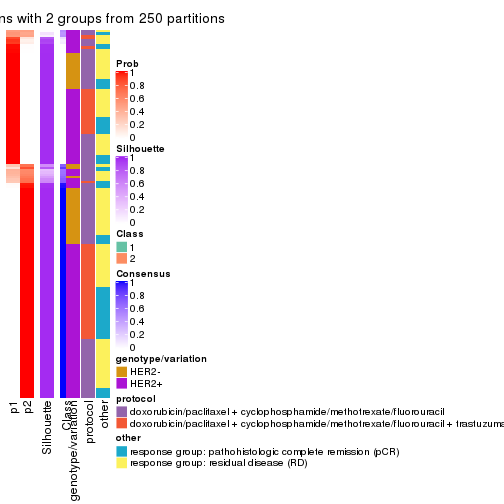</p>

</div>
<div id='tab-SD-kmeans-consensus-heatmap-2'>
<pre><code class="r">consensus_heatmap(res, k = 3)
</code></pre>

<p>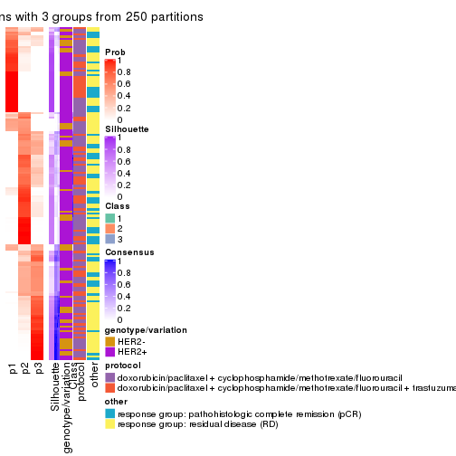</p>

</div>
<div id='tab-SD-kmeans-consensus-heatmap-3'>
<pre><code class="r">consensus_heatmap(res, k = 4)
</code></pre>

<p>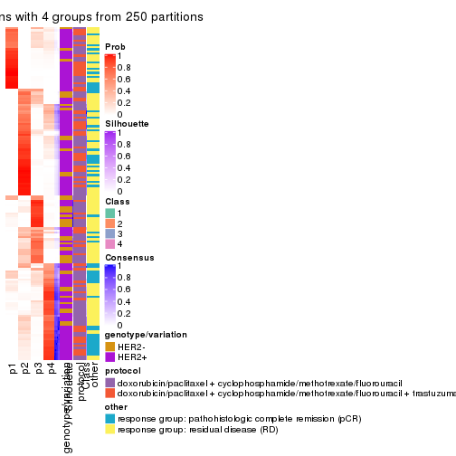</p>

</div>
<div id='tab-SD-kmeans-consensus-heatmap-4'>
<pre><code class="r">consensus_heatmap(res, k = 5)
</code></pre>

<p>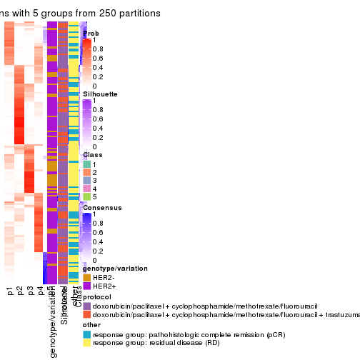</p>

</div>
<div id='tab-SD-kmeans-consensus-heatmap-5'>
<pre><code class="r">consensus_heatmap(res, k = 6)
</code></pre>

<p>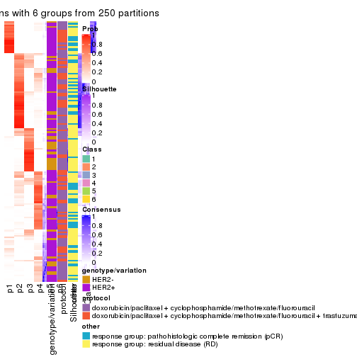</p>

</div>
</div>

Heatmaps for the membership of samples in all partitions to see how consistent they are:


<script>
$( function() {
	$( '#tabs-SD-kmeans-membership-heatmap' ).tabs();
} );
</script>
<div id='tabs-SD-kmeans-membership-heatmap'>
<ul>
<li><a href='#tab-SD-kmeans-membership-heatmap-1'>k = 2</a></li>
<li><a href='#tab-SD-kmeans-membership-heatmap-2'>k = 3</a></li>
<li><a href='#tab-SD-kmeans-membership-heatmap-3'>k = 4</a></li>
<li><a href='#tab-SD-kmeans-membership-heatmap-4'>k = 5</a></li>
<li><a href='#tab-SD-kmeans-membership-heatmap-5'>k = 6</a></li>
</ul>
<div id='tab-SD-kmeans-membership-heatmap-1'>
<pre><code class="r">membership_heatmap(res, k = 2)
</code></pre>

<p>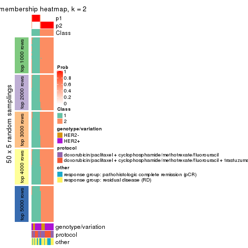</p>

</div>
<div id='tab-SD-kmeans-membership-heatmap-2'>
<pre><code class="r">membership_heatmap(res, k = 3)
</code></pre>

<p>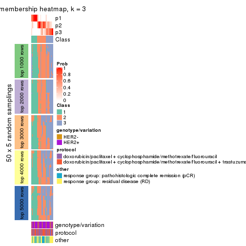</p>

</div>
<div id='tab-SD-kmeans-membership-heatmap-3'>
<pre><code class="r">membership_heatmap(res, k = 4)
</code></pre>

<p>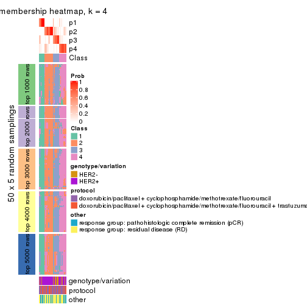</p>

</div>
<div id='tab-SD-kmeans-membership-heatmap-4'>
<pre><code class="r">membership_heatmap(res, k = 5)
</code></pre>

<p>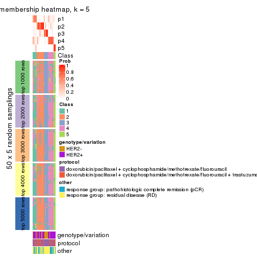</p>

</div>
<div id='tab-SD-kmeans-membership-heatmap-5'>
<pre><code class="r">membership_heatmap(res, k = 6)
</code></pre>

<p>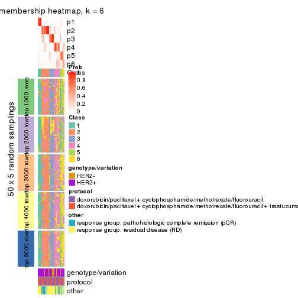</p>

</div>
</div>

As soon as we have had the classes for columns, we can look for signatures
which are significantly different between classes which can be candidate marks
for certain classes. Following are the heatmaps for signatures.


Signature heatmaps where rows are scaled:


<script>
$( function() {
	$( '#tabs-SD-kmeans-get-signatures' ).tabs();
} );
</script>
<div id='tabs-SD-kmeans-get-signatures'>
<ul>
<li><a href='#tab-SD-kmeans-get-signatures-1'>k = 2</a></li>
<li><a href='#tab-SD-kmeans-get-signatures-2'>k = 3</a></li>
<li><a href='#tab-SD-kmeans-get-signatures-3'>k = 4</a></li>
<li><a href='#tab-SD-kmeans-get-signatures-4'>k = 5</a></li>
<li><a href='#tab-SD-kmeans-get-signatures-5'>k = 6</a></li>
</ul>
<div id='tab-SD-kmeans-get-signatures-1'>
<pre><code class="r">get_signatures(res, k = 2)
</code></pre>

<pre><code>#&gt; Error: The width or height of the raster image is zero, maybe you forget to turn off the
#&gt; previous graphic device or it was corrupted. Run `dev.off()` to close it.
</code></pre>

<p></p>

</div>
<div id='tab-SD-kmeans-get-signatures-2'>
<pre><code class="r">get_signatures(res, k = 3)
</code></pre>

<pre><code>#&gt; Error: The width or height of the raster image is zero, maybe you forget to turn off the
#&gt; previous graphic device or it was corrupted. Run `dev.off()` to close it.
</code></pre>

<p></p>

</div>
<div id='tab-SD-kmeans-get-signatures-3'>
<pre><code class="r">get_signatures(res, k = 4)
</code></pre>

<pre><code>#&gt; Error: The width or height of the raster image is zero, maybe you forget to turn off the
#&gt; previous graphic device or it was corrupted. Run `dev.off()` to close it.
</code></pre>

<p></p>

</div>
<div id='tab-SD-kmeans-get-signatures-4'>
<pre><code class="r">get_signatures(res, k = 5)
</code></pre>

<pre><code>#&gt; Error: The width or height of the raster image is zero, maybe you forget to turn off the
#&gt; previous graphic device or it was corrupted. Run `dev.off()` to close it.
</code></pre>

<p></p>

</div>
<div id='tab-SD-kmeans-get-signatures-5'>
<pre><code class="r">get_signatures(res, k = 6)
</code></pre>

<pre><code>#&gt; Error: The width or height of the raster image is zero, maybe you forget to turn off the
#&gt; previous graphic device or it was corrupted. Run `dev.off()` to close it.
</code></pre>

<p></p>

</div>
</div>


Signature heatmaps where rows are not scaled:


<script>
$( function() {
	$( '#tabs-SD-kmeans-get-signatures-no-scale' ).tabs();
} );
</script>
<div id='tabs-SD-kmeans-get-signatures-no-scale'>
<ul>
<li><a href='#tab-SD-kmeans-get-signatures-no-scale-1'>k = 2</a></li>
<li><a href='#tab-SD-kmeans-get-signatures-no-scale-2'>k = 3</a></li>
<li><a href='#tab-SD-kmeans-get-signatures-no-scale-3'>k = 4</a></li>
<li><a href='#tab-SD-kmeans-get-signatures-no-scale-4'>k = 5</a></li>
<li><a href='#tab-SD-kmeans-get-signatures-no-scale-5'>k = 6</a></li>
</ul>
<div id='tab-SD-kmeans-get-signatures-no-scale-1'>
<pre><code class="r">get_signatures(res, k = 2, scale_rows = FALSE)
</code></pre>

<pre><code>#&gt; Error: The width or height of the raster image is zero, maybe you forget to turn off the
#&gt; previous graphic device or it was corrupted. Run `dev.off()` to close it.
</code></pre>

<p></p>

</div>
<div id='tab-SD-kmeans-get-signatures-no-scale-2'>
<pre><code class="r">get_signatures(res, k = 3, scale_rows = FALSE)
</code></pre>

<pre><code>#&gt; Error: The width or height of the raster image is zero, maybe you forget to turn off the
#&gt; previous graphic device or it was corrupted. Run `dev.off()` to close it.
</code></pre>

<p></p>

</div>
<div id='tab-SD-kmeans-get-signatures-no-scale-3'>
<pre><code class="r">get_signatures(res, k = 4, scale_rows = FALSE)
</code></pre>

<pre><code>#&gt; Error: The width or height of the raster image is zero, maybe you forget to turn off the
#&gt; previous graphic device or it was corrupted. Run `dev.off()` to close it.
</code></pre>

<p></p>

</div>
<div id='tab-SD-kmeans-get-signatures-no-scale-4'>
<pre><code class="r">get_signatures(res, k = 5, scale_rows = FALSE)
</code></pre>

<pre><code>#&gt; Error: The width or height of the raster image is zero, maybe you forget to turn off the
#&gt; previous graphic device or it was corrupted. Run `dev.off()` to close it.
</code></pre>

<p></p>

</div>
<div id='tab-SD-kmeans-get-signatures-no-scale-5'>
<pre><code class="r">get_signatures(res, k = 6, scale_rows = FALSE)
</code></pre>

<pre><code>#&gt; Error: The width or height of the raster image is zero, maybe you forget to turn off the
#&gt; previous graphic device or it was corrupted. Run `dev.off()` to close it.
</code></pre>

<p></p>

</div>
</div>


Compare the overlap of signatures from different k:

```r
compare_signatures(res)
```

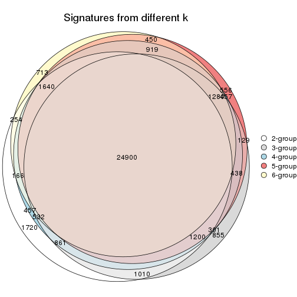

`get_signature()` returns a data frame invisibly. TO get the list of signatures, the function
call should be assigned to a variable explicitly. In following code, if `plot` argument is set
to `FALSE`, no heatmap is plotted while only the differential analysis is performed.

```r
# code only for demonstration
tb = get_signature(res, k = ..., plot = FALSE)
```

An example of the output of `tb` is:

```
#>   which_row         fdr    mean_1    mean_2 scaled_mean_1 scaled_mean_2 km
#> 1        38 0.042760348  8.373488  9.131774    -0.5533452     0.5164555  1
#> 2        40 0.018707592  7.106213  8.469186    -0.6173731     0.5762149  1
#> 3        55 0.019134737 10.221463 11.207825    -0.6159697     0.5749050  1
#> 4        59 0.006059896  5.921854  7.869574    -0.6899429     0.6439467  1
#> 5        60 0.018055526  8.928898 10.211722    -0.6204761     0.5791110  1
#> 6        98 0.009384629 15.714769 14.887706     0.6635654    -0.6193277  2
...
```

The columns in `tb` are:

1. `which_row`: row indices corresponding to the input matrix.
2. `fdr`: FDR for the differential test. 
3. `mean_x`: The mean value in group x.
4. `scaled_mean_x`: The mean value in group x after rows are scaled.
5. `km`: Row groups if k-means clustering is applied to rows.


UMAP plot which shows how samples are separated.


<script>
$( function() {
	$( '#tabs-SD-kmeans-dimension-reduction' ).tabs();
} );
</script>
<div id='tabs-SD-kmeans-dimension-reduction'>
<ul>
<li><a href='#tab-SD-kmeans-dimension-reduction-1'>k = 2</a></li>
<li><a href='#tab-SD-kmeans-dimension-reduction-2'>k = 3</a></li>
<li><a href='#tab-SD-kmeans-dimension-reduction-3'>k = 4</a></li>
<li><a href='#tab-SD-kmeans-dimension-reduction-4'>k = 5</a></li>
<li><a href='#tab-SD-kmeans-dimension-reduction-5'>k = 6</a></li>
</ul>
<div id='tab-SD-kmeans-dimension-reduction-1'>
<pre><code class="r">dimension_reduction(res, k = 2, method = &quot;UMAP&quot;)
</code></pre>

<p>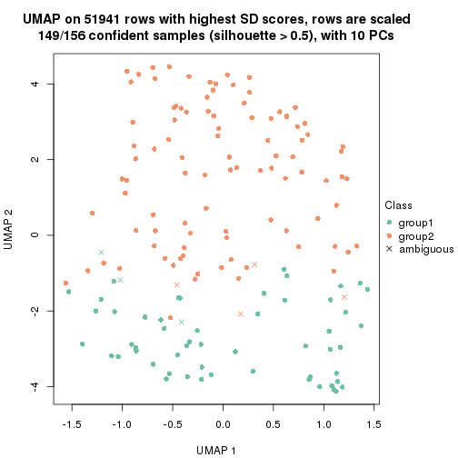</p>

</div>
<div id='tab-SD-kmeans-dimension-reduction-2'>
<pre><code class="r">dimension_reduction(res, k = 3, method = &quot;UMAP&quot;)
</code></pre>

<p>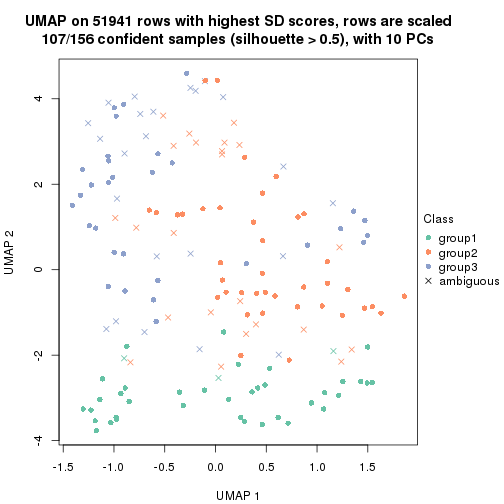</p>

</div>
<div id='tab-SD-kmeans-dimension-reduction-3'>
<pre><code class="r">dimension_reduction(res, k = 4, method = &quot;UMAP&quot;)
</code></pre>

<p>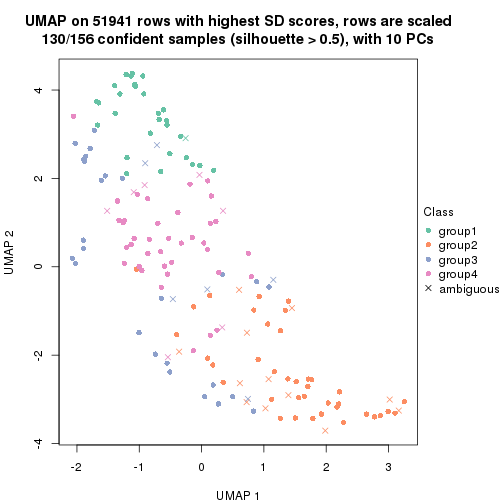</p>

</div>
<div id='tab-SD-kmeans-dimension-reduction-4'>
<pre><code class="r">dimension_reduction(res, k = 5, method = &quot;UMAP&quot;)
</code></pre>

<p></p>

</div>
<div id='tab-SD-kmeans-dimension-reduction-5'>
<pre><code class="r">dimension_reduction(res, k = 6, method = &quot;UMAP&quot;)
</code></pre>

<p>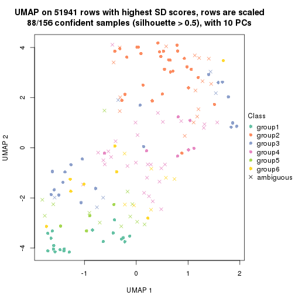</p>

</div>
</div>


Following heatmap shows how subgroups are split when increasing `k`:

```r
collect_classes(res)
```

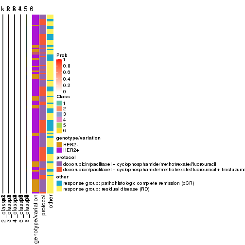


Test correlation between subgroups and known annotations. If the known
annotation is numeric, one-way ANOVA test is applied, and if the known
annotation is discrete, chi-squared contingency table test is applied.

```r
test_to_known_factors(res)
```

```
#>             n genotype/variation(p) protocol(p) other(p) k
#> SD:kmeans 149              1.00e+00       0.737   0.7240 2
#> SD:kmeans 107              2.59e-03       0.657   0.0320 3
#> SD:kmeans 130              5.35e-06       0.102   0.0283 4
#> SD:kmeans 106              1.26e-05       0.346   0.0245 5
#> SD:kmeans  88              1.21e-05       0.133   0.0387 6
```


If matrix rows can be associated to genes, consider to use `functional_enrichment(res,
...)` to perform function enrichment for the signature genes. See [this vignette](http://bioconductor.org/packages/devel/bioc/vignettes/cola/inst/doc/functional_enrichment.html) for more detailed explanations.


 

---------------------------------------------------


### SD:skmeans**


The object with results only for a single top-value method and a single partition method 
can be extracted as:

```r
res = res_list["SD", "skmeans"]
# you can also extract it by
# res = res_list["SD:skmeans"]
```

A summary of `res` and all the functions that can be applied to it:

```r
res
```

```
#> A 'ConsensusPartition' object with k = 2, 3, 4, 5, 6.
#>   On a matrix with 51941 rows and 156 columns.
#>   Top rows (1000, 2000, 3000, 4000, 5000) are extracted by 'SD' method.
#>   Subgroups are detected by 'skmeans' method.
#>   Performed in total 1250 partitions by row resampling.
#>   Best k for subgroups seems to be 2.
#> 
#> Following methods can be applied to this 'ConsensusPartition' object:
#>  [1] "cola_report"             "collect_classes"         "collect_plots"          
#>  [4] "collect_stats"           "colnames"                "compare_signatures"     
#>  [7] "consensus_heatmap"       "dimension_reduction"     "functional_enrichment"  
#> [10] "get_anno_col"            "get_anno"                "get_classes"            
#> [13] "get_consensus"           "get_matrix"              "get_membership"         
#> [16] "get_param"               "get_signatures"          "get_stats"              
#> [19] "is_best_k"               "is_stable_k"             "membership_heatmap"     
#> [22] "ncol"                    "nrow"                    "plot_ecdf"              
#> [25] "rownames"                "select_partition_number" "show"                   
#> [28] "suggest_best_k"          "test_to_known_factors"
```

`collect_plots()` function collects all the plots made from `res` for all `k` (number of partitions)
into one single page to provide an easy and fast comparison between different `k`.

```r
collect_plots(res)
```

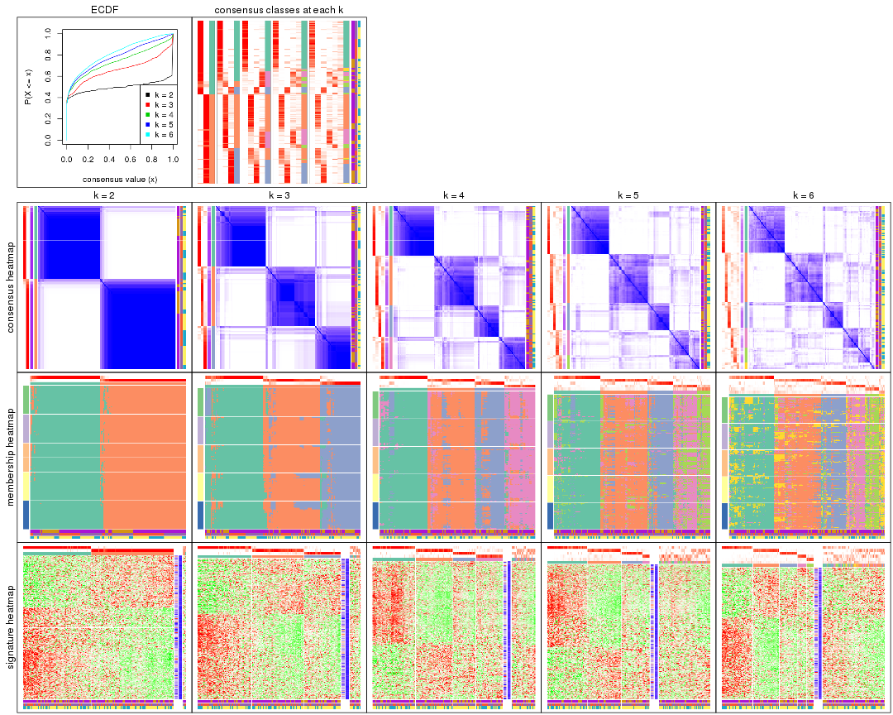

The plots are:

- The first row: a plot of the ECDF (empirical cumulative distribution
  function) curves of the consensus matrix for each `k` and the heatmap of
  predicted classes for each `k`.
- The second row: heatmaps of the consensus matrix for each `k`.
- The third row: heatmaps of the membership matrix for each `k`.
- The fouth row: heatmaps of the signatures for each `k`.

All the plots in panels can be made by individual functions and they are
plotted later in this section.

`select_partition_number()` produces several plots showing different
statistics for choosing "optimized" `k`. There are following statistics:

- ECDF curves of the consensus matrix for each `k`;
- 1-PAC. [The PAC
  score](https://en.wikipedia.org/wiki/Consensus_clustering#Over-interpretation_potential_of_consensus_clustering)
  measures the proportion of the ambiguous subgrouping.
- Mean silhouette score.
- Concordance. The mean probability of fiting the consensus class ids in all
  partitions.
- Area increased. Denote $A_k$ as the area under the ECDF curve for current
  `k`, the area increased is defined as $A_k - A_{k-1}$.
- Rand index. The percent of pairs of samples that are both in a same cluster
  or both are not in a same cluster in the partition of k and k-1.
- Jaccard index. The ratio of pairs of samples are both in a same cluster in
  the partition of k and k-1 and the pairs of samples are both in a same
  cluster in the partition k or k-1.

The detailed explanations of these statistics can be found in [the _cola_
vignette](http://bioconductor.org/packages/devel/bioc/vignettes/cola/inst/doc/cola.html#toc_13).

Generally speaking, lower PAC score, higher mean silhouette score or higher
concordance corresponds to better partition. Rand index and Jaccard index
measure how similar the current partition is compared to partition with `k-1`.
If they are too similar, we won't accept `k` is better than `k-1`.

```r
select_partition_number(res)
```

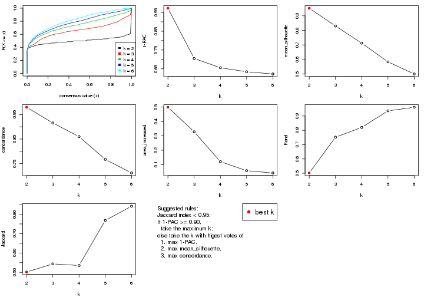

The numeric values for all these statistics can be obtained by `get_stats()`.

```r
get_stats(res)
```

```
#>   k 1-PAC mean_silhouette concordance area_increased  Rand Jaccard
#> 2 2 0.972           0.952       0.980         0.4990 0.502   0.502
#> 3 3 0.705           0.830       0.916         0.3284 0.752   0.544
#> 4 4 0.655           0.712       0.860         0.1206 0.820   0.535
#> 5 5 0.634           0.584       0.767         0.0581 0.936   0.768
#> 6 6 0.622           0.501       0.712         0.0421 0.961   0.841
```

`suggest_best_k()` suggests the best $k$ based on these statistics. The rules are as follows:

- All $k$ with Jaccard index larger than 0.95 are removed because increasing
  $k$ does not provide enough extra information. If all $k$ are removed, it is
  marked as no subgroup is detected.
- For all $k$ with 1-PAC score larger than 0.9, the maximal $k$ is taken as
  the best $k$, and other $k$ are marked as optional $k$.
- If it does not fit the second rule. The $k$ with the maximal vote of the
  highest 1-PAC score, highest mean silhouette, and highest concordance is
  taken as the best $k$.

```r
suggest_best_k(res)
```

```
#> [1] 2
```


Following shows the table of the partitions (You need to click the **show/hide
code output** link to see it). The membership matrix (columns with name `p*`)
is inferred by
[`clue::cl_consensus()`](https://www.rdocumentation.org/link/cl_consensus?package=clue)
function with the `SE` method. Basically the value in the membership matrix
represents the probability to belong to a certain group. The finall class
label for an item is determined with the group with highest probability it
belongs to.

In `get_classes()` function, the entropy is calculated from the membership
matrix and the silhouette score is calculated from the consensus matrix.


<script>
$( function() {
	$( '#tabs-SD-skmeans-get-classes' ).tabs();
} );
</script>
<div id='tabs-SD-skmeans-get-classes'>
<ul>
<li><a href='#tab-SD-skmeans-get-classes-1'>k = 2</a></li>
<li><a href='#tab-SD-skmeans-get-classes-2'>k = 3</a></li>
<li><a href='#tab-SD-skmeans-get-classes-3'>k = 4</a></li>
<li><a href='#tab-SD-skmeans-get-classes-4'>k = 5</a></li>
<li><a href='#tab-SD-skmeans-get-classes-5'>k = 6</a></li>
</ul>

<div id='tab-SD-skmeans-get-classes-1'>
<p><a id='tab-SD-skmeans-get-classes-1-a' style='color:#0366d6' href='#'>show/hide code output</a></p>
<pre><code class="r">cbind(get_classes(res, k = 2), get_membership(res, k = 2))
</code></pre>

<pre><code>#&gt;            class entropy silhouette    p1    p2
#&gt; GSM1232995     2  0.0000      0.977 0.000 1.000
#&gt; GSM1233002     1  0.6438      0.806 0.836 0.164
#&gt; GSM1233003     1  0.0000      0.981 1.000 0.000
#&gt; GSM1233014     2  0.0000      0.977 0.000 1.000
#&gt; GSM1233015     1  0.0000      0.981 1.000 0.000
#&gt; GSM1233016     1  0.0938      0.972 0.988 0.012
#&gt; GSM1233024     2  0.0000      0.977 0.000 1.000
#&gt; GSM1233049     1  0.0000      0.981 1.000 0.000
#&gt; GSM1233064     2  0.0000      0.977 0.000 1.000
#&gt; GSM1233068     1  0.0000      0.981 1.000 0.000
#&gt; GSM1233073     1  0.1633      0.962 0.976 0.024
#&gt; GSM1233093     1  0.0000      0.981 1.000 0.000
#&gt; GSM1233115     1  0.0000      0.981 1.000 0.000
#&gt; GSM1232992     2  0.0000      0.977 0.000 1.000
#&gt; GSM1232993     2  0.0000      0.977 0.000 1.000
#&gt; GSM1233005     2  0.0000      0.977 0.000 1.000
#&gt; GSM1233007     2  0.0000      0.977 0.000 1.000
#&gt; GSM1233010     1  0.0672      0.975 0.992 0.008
#&gt; GSM1233013     2  0.0000      0.977 0.000 1.000
#&gt; GSM1233018     2  0.0000      0.977 0.000 1.000
#&gt; GSM1233019     2  0.0000      0.977 0.000 1.000
#&gt; GSM1233021     2  0.0000      0.977 0.000 1.000
#&gt; GSM1233025     1  0.0000      0.981 1.000 0.000
#&gt; GSM1233029     2  0.0000      0.977 0.000 1.000
#&gt; GSM1233030     2  0.0000      0.977 0.000 1.000
#&gt; GSM1233031     1  0.4939      0.875 0.892 0.108
#&gt; GSM1233032     1  0.0000      0.981 1.000 0.000
#&gt; GSM1233035     1  0.0000      0.981 1.000 0.000
#&gt; GSM1233038     1  0.0000      0.981 1.000 0.000
#&gt; GSM1233039     2  0.0000      0.977 0.000 1.000
#&gt; GSM1233042     2  0.0000      0.977 0.000 1.000
#&gt; GSM1233043     2  0.0000      0.977 0.000 1.000
#&gt; GSM1233044     1  0.0000      0.981 1.000 0.000
#&gt; GSM1233046     1  0.0000      0.981 1.000 0.000
#&gt; GSM1233051     1  0.0000      0.981 1.000 0.000
#&gt; GSM1233054     1  0.4298      0.899 0.912 0.088
#&gt; GSM1233057     2  0.0000      0.977 0.000 1.000
#&gt; GSM1233060     2  0.8499      0.613 0.276 0.724
#&gt; GSM1233062     2  0.0000      0.977 0.000 1.000
#&gt; GSM1233075     2  0.0000      0.977 0.000 1.000
#&gt; GSM1233078     1  0.2236      0.950 0.964 0.036
#&gt; GSM1233079     1  0.0000      0.981 1.000 0.000
#&gt; GSM1233082     1  0.0000      0.981 1.000 0.000
#&gt; GSM1233083     1  0.0000      0.981 1.000 0.000
#&gt; GSM1233091     2  0.9881      0.216 0.436 0.564
#&gt; GSM1233095     1  0.0000      0.981 1.000 0.000
#&gt; GSM1233096     1  0.0000      0.981 1.000 0.000
#&gt; GSM1233101     1  0.0000      0.981 1.000 0.000
#&gt; GSM1233105     1  0.0000      0.981 1.000 0.000
#&gt; GSM1233117     2  0.0000      0.977 0.000 1.000
#&gt; GSM1233118     2  0.0000      0.977 0.000 1.000
#&gt; GSM1233001     2  0.0000      0.977 0.000 1.000
#&gt; GSM1233006     2  0.0000      0.977 0.000 1.000
#&gt; GSM1233008     2  0.0000      0.977 0.000 1.000
#&gt; GSM1233009     2  0.0000      0.977 0.000 1.000
#&gt; GSM1233017     2  0.0000      0.977 0.000 1.000
#&gt; GSM1233020     2  0.0000      0.977 0.000 1.000
#&gt; GSM1233022     2  0.0000      0.977 0.000 1.000
#&gt; GSM1233026     1  0.9580      0.378 0.620 0.380
#&gt; GSM1233028     2  0.7815      0.701 0.232 0.768
#&gt; GSM1233034     2  0.0000      0.977 0.000 1.000
#&gt; GSM1233040     1  0.0000      0.981 1.000 0.000
#&gt; GSM1233048     1  0.0000      0.981 1.000 0.000
#&gt; GSM1233056     1  0.0000      0.981 1.000 0.000
#&gt; GSM1233058     1  0.8608      0.611 0.716 0.284
#&gt; GSM1233059     1  0.0000      0.981 1.000 0.000
#&gt; GSM1233066     2  0.0672      0.971 0.008 0.992
#&gt; GSM1233071     2  0.0000      0.977 0.000 1.000
#&gt; GSM1233074     2  0.0000      0.977 0.000 1.000
#&gt; GSM1233076     2  0.0000      0.977 0.000 1.000
#&gt; GSM1233080     1  0.0000      0.981 1.000 0.000
#&gt; GSM1233088     2  0.9866      0.231 0.432 0.568
#&gt; GSM1233090     1  0.0000      0.981 1.000 0.000
#&gt; GSM1233092     2  0.0000      0.977 0.000 1.000
#&gt; GSM1233094     2  0.0000      0.977 0.000 1.000
#&gt; GSM1233097     2  0.3274      0.923 0.060 0.940
#&gt; GSM1233100     1  0.5737      0.843 0.864 0.136
#&gt; GSM1233104     2  0.0000      0.977 0.000 1.000
#&gt; GSM1233106     1  0.0000      0.981 1.000 0.000
#&gt; GSM1233111     1  0.0000      0.981 1.000 0.000
#&gt; GSM1233122     2  0.0000      0.977 0.000 1.000
#&gt; GSM1233146     2  0.0672      0.971 0.008 0.992
#&gt; GSM1232994     2  0.0000      0.977 0.000 1.000
#&gt; GSM1232996     2  0.0000      0.977 0.000 1.000
#&gt; GSM1232997     2  0.0000      0.977 0.000 1.000
#&gt; GSM1232998     2  0.0000      0.977 0.000 1.000
#&gt; GSM1232999     2  0.0000      0.977 0.000 1.000
#&gt; GSM1233000     2  0.0000      0.977 0.000 1.000
#&gt; GSM1233004     1  0.0376      0.978 0.996 0.004
#&gt; GSM1233011     2  0.0000      0.977 0.000 1.000
#&gt; GSM1233012     2  0.0000      0.977 0.000 1.000
#&gt; GSM1233023     2  0.0000      0.977 0.000 1.000
#&gt; GSM1233027     2  0.0000      0.977 0.000 1.000
#&gt; GSM1233033     1  0.0000      0.981 1.000 0.000
#&gt; GSM1233036     2  0.0000      0.977 0.000 1.000
#&gt; GSM1233037     2  0.0672      0.971 0.008 0.992
#&gt; GSM1233041     1  0.0000      0.981 1.000 0.000
#&gt; GSM1233045     2  0.0000      0.977 0.000 1.000
#&gt; GSM1233047     1  0.0000      0.981 1.000 0.000
#&gt; GSM1233050     1  0.0000      0.981 1.000 0.000
#&gt; GSM1233052     1  0.0000      0.981 1.000 0.000
#&gt; GSM1233053     1  0.0000      0.981 1.000 0.000
#&gt; GSM1233055     1  0.0000      0.981 1.000 0.000
#&gt; GSM1233061     2  0.7528      0.730 0.216 0.784
#&gt; GSM1233063     1  0.0000      0.981 1.000 0.000
#&gt; GSM1233065     2  0.0000      0.977 0.000 1.000
#&gt; GSM1233070     2  0.0000      0.977 0.000 1.000
#&gt; GSM1233077     2  0.0000      0.977 0.000 1.000
#&gt; GSM1233081     1  0.0000      0.981 1.000 0.000
#&gt; GSM1233084     1  0.0000      0.981 1.000 0.000
#&gt; GSM1233087     1  0.0000      0.981 1.000 0.000
#&gt; GSM1233089     2  0.0000      0.977 0.000 1.000
#&gt; GSM1233099     1  0.0000      0.981 1.000 0.000
#&gt; GSM1233112     1  0.0000      0.981 1.000 0.000
#&gt; GSM1233085     1  0.0000      0.981 1.000 0.000
#&gt; GSM1233098     2  0.0000      0.977 0.000 1.000
#&gt; GSM1233114     1  0.0000      0.981 1.000 0.000
#&gt; GSM1233119     1  0.0000      0.981 1.000 0.000
#&gt; GSM1233129     2  0.0000      0.977 0.000 1.000
#&gt; GSM1233132     1  0.0000      0.981 1.000 0.000
#&gt; GSM1233139     2  0.0000      0.977 0.000 1.000
#&gt; GSM1233143     2  0.0000      0.977 0.000 1.000
#&gt; GSM1233145     1  0.0000      0.981 1.000 0.000
#&gt; GSM1233067     2  0.0000      0.977 0.000 1.000
#&gt; GSM1233069     2  0.0000      0.977 0.000 1.000
#&gt; GSM1233072     2  0.0000      0.977 0.000 1.000
#&gt; GSM1233086     2  0.0000      0.977 0.000 1.000
#&gt; GSM1233102     1  0.0000      0.981 1.000 0.000
#&gt; GSM1233103     1  0.0000      0.981 1.000 0.000
#&gt; GSM1233107     1  0.0376      0.978 0.996 0.004
#&gt; GSM1233108     1  0.0000      0.981 1.000 0.000
#&gt; GSM1233109     1  0.0000      0.981 1.000 0.000
#&gt; GSM1233110     2  0.4161      0.898 0.084 0.916
#&gt; GSM1233113     2  0.0000      0.977 0.000 1.000
#&gt; GSM1233116     2  0.0000      0.977 0.000 1.000
#&gt; GSM1233120     1  0.0000      0.981 1.000 0.000
#&gt; GSM1233121     2  0.0000      0.977 0.000 1.000
#&gt; GSM1233123     2  0.2948      0.931 0.052 0.948
#&gt; GSM1233124     2  0.0376      0.974 0.004 0.996
#&gt; GSM1233125     1  0.0000      0.981 1.000 0.000
#&gt; GSM1233126     2  0.3584      0.916 0.068 0.932
#&gt; GSM1233127     2  0.0000      0.977 0.000 1.000
#&gt; GSM1233128     1  0.0000      0.981 1.000 0.000
#&gt; GSM1233130     2  0.0376      0.974 0.004 0.996
#&gt; GSM1233131     1  0.0000      0.981 1.000 0.000
#&gt; GSM1233133     1  0.0000      0.981 1.000 0.000
#&gt; GSM1233134     2  0.0000      0.977 0.000 1.000
#&gt; GSM1233135     2  0.0000      0.977 0.000 1.000
#&gt; GSM1233136     2  0.0000      0.977 0.000 1.000
#&gt; GSM1233137     1  0.0000      0.981 1.000 0.000
#&gt; GSM1233138     2  0.0000      0.977 0.000 1.000
#&gt; GSM1233140     1  0.0000      0.981 1.000 0.000
#&gt; GSM1233141     2  0.0000      0.977 0.000 1.000
#&gt; GSM1233142     2  0.0000      0.977 0.000 1.000
#&gt; GSM1233144     1  0.0000      0.981 1.000 0.000
#&gt; GSM1233147     2  0.0000      0.977 0.000 1.000
</code></pre>

<script>
$('#tab-SD-skmeans-get-classes-1-a').parent().next().next().hide();
$('#tab-SD-skmeans-get-classes-1-a').click(function(){
  $('#tab-SD-skmeans-get-classes-1-a').parent().next().next().toggle();
  return(false);
});
</script>
</div>

<div id='tab-SD-skmeans-get-classes-2'>
<p><a id='tab-SD-skmeans-get-classes-2-a' style='color:#0366d6' href='#'>show/hide code output</a></p>
<pre><code class="r">cbind(get_classes(res, k = 3), get_membership(res, k = 3))
</code></pre>

<pre><code>#&gt;            class entropy silhouette    p1    p2    p3
#&gt; GSM1232995     2  0.5397     0.7016 0.000 0.720 0.280
#&gt; GSM1233002     2  0.5254     0.5805 0.264 0.736 0.000
#&gt; GSM1233003     1  0.0000     0.9324 1.000 0.000 0.000
#&gt; GSM1233014     2  0.0000     0.8796 0.000 1.000 0.000
#&gt; GSM1233015     1  0.0000     0.9324 1.000 0.000 0.000
#&gt; GSM1233016     1  0.5760     0.5776 0.672 0.328 0.000
#&gt; GSM1233024     2  0.2261     0.8873 0.000 0.932 0.068
#&gt; GSM1233049     1  0.0000     0.9324 1.000 0.000 0.000
#&gt; GSM1233064     3  0.4702     0.6684 0.000 0.212 0.788
#&gt; GSM1233068     1  0.0000     0.9324 1.000 0.000 0.000
#&gt; GSM1233073     1  0.6180     0.3855 0.584 0.416 0.000
#&gt; GSM1233093     1  0.0000     0.9324 1.000 0.000 0.000
#&gt; GSM1233115     1  0.0000     0.9324 1.000 0.000 0.000
#&gt; GSM1232992     2  0.3192     0.8773 0.000 0.888 0.112
#&gt; GSM1232993     2  0.2165     0.8875 0.000 0.936 0.064
#&gt; GSM1233005     2  0.3192     0.8773 0.000 0.888 0.112
#&gt; GSM1233007     2  0.1860     0.8727 0.000 0.948 0.052
#&gt; GSM1233010     1  0.4931     0.7314 0.768 0.232 0.000
#&gt; GSM1233013     2  0.3192     0.8773 0.000 0.888 0.112
#&gt; GSM1233018     2  0.3192     0.8773 0.000 0.888 0.112
#&gt; GSM1233019     2  0.2625     0.8854 0.000 0.916 0.084
#&gt; GSM1233021     2  0.3192     0.8773 0.000 0.888 0.112
#&gt; GSM1233025     1  0.3116     0.8581 0.892 0.108 0.000
#&gt; GSM1233029     2  0.2356     0.8871 0.000 0.928 0.072
#&gt; GSM1233030     2  0.3116     0.8788 0.000 0.892 0.108
#&gt; GSM1233031     2  0.4002     0.7489 0.160 0.840 0.000
#&gt; GSM1233032     1  0.0000     0.9324 1.000 0.000 0.000
#&gt; GSM1233035     1  0.3619     0.8284 0.864 0.136 0.000
#&gt; GSM1233038     1  0.0000     0.9324 1.000 0.000 0.000
#&gt; GSM1233039     3  0.5678     0.4799 0.000 0.316 0.684
#&gt; GSM1233042     2  0.0000     0.8796 0.000 1.000 0.000
#&gt; GSM1233043     2  0.0000     0.8796 0.000 1.000 0.000
#&gt; GSM1233044     1  0.3349     0.8420 0.888 0.004 0.108
#&gt; GSM1233046     1  0.0000     0.9324 1.000 0.000 0.000
#&gt; GSM1233051     1  0.0000     0.9324 1.000 0.000 0.000
#&gt; GSM1233054     3  0.3412     0.8095 0.124 0.000 0.876
#&gt; GSM1233057     3  0.0000     0.8991 0.000 0.000 1.000
#&gt; GSM1233060     2  0.0592     0.8749 0.012 0.988 0.000
#&gt; GSM1233062     2  0.1753     0.8870 0.000 0.952 0.048
#&gt; GSM1233075     3  0.0000     0.8991 0.000 0.000 1.000
#&gt; GSM1233078     3  0.2878     0.8337 0.096 0.000 0.904
#&gt; GSM1233079     1  0.0000     0.9324 1.000 0.000 0.000
#&gt; GSM1233082     1  0.0000     0.9324 1.000 0.000 0.000
#&gt; GSM1233083     1  0.0000     0.9324 1.000 0.000 0.000
#&gt; GSM1233091     3  0.6677     0.7227 0.088 0.168 0.744
#&gt; GSM1233095     1  0.0000     0.9324 1.000 0.000 0.000
#&gt; GSM1233096     1  0.0000     0.9324 1.000 0.000 0.000
#&gt; GSM1233101     1  0.0000     0.9324 1.000 0.000 0.000
#&gt; GSM1233105     1  0.0000     0.9324 1.000 0.000 0.000
#&gt; GSM1233117     2  0.4750     0.7890 0.000 0.784 0.216
#&gt; GSM1233118     3  0.0237     0.8981 0.000 0.004 0.996
#&gt; GSM1233001     3  0.5760     0.4371 0.000 0.328 0.672
#&gt; GSM1233006     2  0.0237     0.8805 0.000 0.996 0.004
#&gt; GSM1233008     2  0.3192     0.8773 0.000 0.888 0.112
#&gt; GSM1233009     2  0.2796     0.8835 0.000 0.908 0.092
#&gt; GSM1233017     2  0.2625     0.8854 0.000 0.916 0.084
#&gt; GSM1233020     2  0.3752     0.8566 0.000 0.856 0.144
#&gt; GSM1233022     2  0.0000     0.8796 0.000 1.000 0.000
#&gt; GSM1233026     2  0.6081     0.4296 0.344 0.652 0.004
#&gt; GSM1233028     2  0.2066     0.8459 0.060 0.940 0.000
#&gt; GSM1233034     2  0.5178     0.7371 0.000 0.744 0.256
#&gt; GSM1233040     1  0.0000     0.9324 1.000 0.000 0.000
#&gt; GSM1233048     1  0.0000     0.9324 1.000 0.000 0.000
#&gt; GSM1233056     1  0.0000     0.9324 1.000 0.000 0.000
#&gt; GSM1233058     2  0.4291     0.7171 0.180 0.820 0.000
#&gt; GSM1233059     1  0.0000     0.9324 1.000 0.000 0.000
#&gt; GSM1233066     3  0.0000     0.8991 0.000 0.000 1.000
#&gt; GSM1233071     2  0.2537     0.8861 0.000 0.920 0.080
#&gt; GSM1233074     3  0.0000     0.8991 0.000 0.000 1.000
#&gt; GSM1233076     2  0.6308    -0.0548 0.000 0.508 0.492
#&gt; GSM1233080     1  0.0000     0.9324 1.000 0.000 0.000
#&gt; GSM1233088     3  0.3272     0.8400 0.016 0.080 0.904
#&gt; GSM1233090     1  0.0000     0.9324 1.000 0.000 0.000
#&gt; GSM1233092     2  0.0000     0.8796 0.000 1.000 0.000
#&gt; GSM1233094     2  0.0000     0.8796 0.000 1.000 0.000
#&gt; GSM1233097     2  0.0000     0.8796 0.000 1.000 0.000
#&gt; GSM1233100     2  0.5968     0.3487 0.364 0.636 0.000
#&gt; GSM1233104     2  0.0000     0.8796 0.000 1.000 0.000
#&gt; GSM1233106     1  0.0000     0.9324 1.000 0.000 0.000
#&gt; GSM1233111     1  0.0000     0.9324 1.000 0.000 0.000
#&gt; GSM1233122     2  0.3619     0.8624 0.000 0.864 0.136
#&gt; GSM1233146     2  0.0000     0.8796 0.000 1.000 0.000
#&gt; GSM1232994     2  0.2356     0.8871 0.000 0.928 0.072
#&gt; GSM1232996     2  0.3192     0.8773 0.000 0.888 0.112
#&gt; GSM1232997     3  0.0237     0.8981 0.000 0.004 0.996
#&gt; GSM1232998     2  0.0000     0.8796 0.000 1.000 0.000
#&gt; GSM1232999     2  0.0000     0.8796 0.000 1.000 0.000
#&gt; GSM1233000     2  0.2878     0.8825 0.000 0.904 0.096
#&gt; GSM1233004     3  0.8322     0.0998 0.428 0.080 0.492
#&gt; GSM1233011     3  0.5216     0.6703 0.000 0.260 0.740
#&gt; GSM1233012     3  0.2448     0.8459 0.000 0.076 0.924
#&gt; GSM1233023     3  0.0747     0.8922 0.000 0.016 0.984
#&gt; GSM1233027     2  0.0000     0.8796 0.000 1.000 0.000
#&gt; GSM1233033     1  0.0000     0.9324 1.000 0.000 0.000
#&gt; GSM1233036     3  0.0237     0.8981 0.000 0.004 0.996
#&gt; GSM1233037     3  0.0000     0.8991 0.000 0.000 1.000
#&gt; GSM1233041     1  0.0000     0.9324 1.000 0.000 0.000
#&gt; GSM1233045     2  0.0000     0.8796 0.000 1.000 0.000
#&gt; GSM1233047     1  0.6095     0.3387 0.608 0.000 0.392
#&gt; GSM1233050     1  0.0000     0.9324 1.000 0.000 0.000
#&gt; GSM1233052     1  0.0000     0.9324 1.000 0.000 0.000
#&gt; GSM1233053     1  0.0000     0.9324 1.000 0.000 0.000
#&gt; GSM1233055     1  0.0000     0.9324 1.000 0.000 0.000
#&gt; GSM1233061     3  0.0237     0.8973 0.004 0.000 0.996
#&gt; GSM1233063     1  0.0000     0.9324 1.000 0.000 0.000
#&gt; GSM1233065     3  0.0424     0.8967 0.000 0.008 0.992
#&gt; GSM1233070     2  0.1289     0.8854 0.000 0.968 0.032
#&gt; GSM1233077     3  0.0000     0.8991 0.000 0.000 1.000
#&gt; GSM1233081     1  0.4555     0.7330 0.800 0.000 0.200
#&gt; GSM1233084     1  0.0000     0.9324 1.000 0.000 0.000
#&gt; GSM1233087     1  0.2796     0.8710 0.908 0.092 0.000
#&gt; GSM1233089     2  0.5016     0.7568 0.000 0.760 0.240
#&gt; GSM1233099     1  0.2356     0.8874 0.928 0.072 0.000
#&gt; GSM1233112     1  0.0000     0.9324 1.000 0.000 0.000
#&gt; GSM1233085     1  0.5016     0.6726 0.760 0.000 0.240
#&gt; GSM1233098     2  0.3816     0.8537 0.000 0.852 0.148
#&gt; GSM1233114     1  0.0000     0.9324 1.000 0.000 0.000
#&gt; GSM1233119     1  0.5465     0.6394 0.712 0.288 0.000
#&gt; GSM1233129     3  0.0237     0.8981 0.000 0.004 0.996
#&gt; GSM1233132     1  0.0000     0.9324 1.000 0.000 0.000
#&gt; GSM1233139     2  0.3412     0.8717 0.000 0.876 0.124
#&gt; GSM1233143     3  0.4654     0.6835 0.000 0.208 0.792
#&gt; GSM1233145     1  0.0000     0.9324 1.000 0.000 0.000
#&gt; GSM1233067     3  0.0000     0.8991 0.000 0.000 1.000
#&gt; GSM1233069     3  0.0000     0.8991 0.000 0.000 1.000
#&gt; GSM1233072     2  0.3619     0.8624 0.000 0.864 0.136
#&gt; GSM1233086     3  0.0892     0.8916 0.000 0.020 0.980
#&gt; GSM1233102     1  0.2066     0.8955 0.940 0.060 0.000
#&gt; GSM1233103     1  0.1031     0.9189 0.976 0.024 0.000
#&gt; GSM1233107     1  0.7104     0.3787 0.608 0.360 0.032
#&gt; GSM1233108     1  0.4452     0.7433 0.808 0.000 0.192
#&gt; GSM1233109     3  0.6299     0.0946 0.476 0.000 0.524
#&gt; GSM1233110     3  0.0000     0.8991 0.000 0.000 1.000
#&gt; GSM1233113     3  0.0424     0.8965 0.000 0.008 0.992
#&gt; GSM1233116     3  0.0592     0.8945 0.000 0.012 0.988
#&gt; GSM1233120     1  0.1163     0.9162 0.972 0.028 0.000
#&gt; GSM1233121     3  0.0000     0.8991 0.000 0.000 1.000
#&gt; GSM1233123     3  0.0000     0.8991 0.000 0.000 1.000
#&gt; GSM1233124     3  0.0000     0.8991 0.000 0.000 1.000
#&gt; GSM1233125     1  0.4504     0.7380 0.804 0.000 0.196
#&gt; GSM1233126     2  0.0000     0.8796 0.000 1.000 0.000
#&gt; GSM1233127     2  0.2625     0.8854 0.000 0.916 0.084
#&gt; GSM1233128     1  0.0000     0.9324 1.000 0.000 0.000
#&gt; GSM1233130     3  0.0000     0.8991 0.000 0.000 1.000
#&gt; GSM1233131     1  0.0000     0.9324 1.000 0.000 0.000
#&gt; GSM1233133     3  0.4974     0.6723 0.236 0.000 0.764
#&gt; GSM1233134     3  0.0000     0.8991 0.000 0.000 1.000
#&gt; GSM1233135     3  0.0000     0.8991 0.000 0.000 1.000
#&gt; GSM1233136     3  0.0000     0.8991 0.000 0.000 1.000
#&gt; GSM1233137     3  0.3752     0.7893 0.144 0.000 0.856
#&gt; GSM1233138     2  0.0000     0.8796 0.000 1.000 0.000
#&gt; GSM1233140     1  0.1860     0.8949 0.948 0.000 0.052
#&gt; GSM1233141     2  0.4504     0.8048 0.000 0.804 0.196
#&gt; GSM1233142     2  0.2878     0.8825 0.000 0.904 0.096
#&gt; GSM1233144     3  0.3752     0.7893 0.144 0.000 0.856
#&gt; GSM1233147     2  0.5948     0.4011 0.000 0.640 0.360
</code></pre>

<script>
$('#tab-SD-skmeans-get-classes-2-a').parent().next().next().hide();
$('#tab-SD-skmeans-get-classes-2-a').click(function(){
  $('#tab-SD-skmeans-get-classes-2-a').parent().next().next().toggle();
  return(false);
});
</script>
</div>

<div id='tab-SD-skmeans-get-classes-3'>
<p><a id='tab-SD-skmeans-get-classes-3-a' style='color:#0366d6' href='#'>show/hide code output</a></p>
<pre><code class="r">cbind(get_classes(res, k = 4), get_membership(res, k = 4))
</code></pre>

<pre><code>#&gt;            class entropy silhouette    p1    p2    p3    p4
#&gt; GSM1232995     2  0.2149     0.7754 0.000 0.912 0.088 0.000
#&gt; GSM1233002     4  0.3149     0.8078 0.032 0.088 0.000 0.880
#&gt; GSM1233003     1  0.0188     0.9057 0.996 0.000 0.000 0.004
#&gt; GSM1233014     4  0.3219     0.7800 0.000 0.164 0.000 0.836
#&gt; GSM1233015     1  0.0524     0.9043 0.988 0.000 0.004 0.008
#&gt; GSM1233016     4  0.3885     0.8053 0.064 0.092 0.000 0.844
#&gt; GSM1233024     2  0.2530     0.7634 0.000 0.888 0.000 0.112
#&gt; GSM1233049     1  0.0000     0.9068 1.000 0.000 0.000 0.000
#&gt; GSM1233064     2  0.4524     0.6521 0.000 0.768 0.204 0.028
#&gt; GSM1233068     1  0.1617     0.8914 0.956 0.012 0.008 0.024
#&gt; GSM1233073     4  0.2489     0.8093 0.068 0.020 0.000 0.912
#&gt; GSM1233093     1  0.0000     0.9068 1.000 0.000 0.000 0.000
#&gt; GSM1233115     1  0.1637     0.8791 0.940 0.000 0.000 0.060
#&gt; GSM1232992     2  0.0000     0.8156 0.000 1.000 0.000 0.000
#&gt; GSM1232993     2  0.0707     0.8152 0.000 0.980 0.000 0.020
#&gt; GSM1233005     2  0.0469     0.8158 0.000 0.988 0.012 0.000
#&gt; GSM1233007     2  0.4426     0.6608 0.000 0.772 0.024 0.204
#&gt; GSM1233010     4  0.1675     0.8068 0.044 0.004 0.004 0.948
#&gt; GSM1233013     2  0.0000     0.8156 0.000 1.000 0.000 0.000
#&gt; GSM1233018     2  0.0469     0.8158 0.000 0.988 0.012 0.000
#&gt; GSM1233019     2  0.0921     0.8123 0.000 0.972 0.000 0.028
#&gt; GSM1233021     2  0.0336     0.8159 0.000 0.992 0.008 0.000
#&gt; GSM1233025     4  0.2408     0.7879 0.104 0.000 0.000 0.896
#&gt; GSM1233029     2  0.0524     0.8156 0.000 0.988 0.004 0.008
#&gt; GSM1233030     2  0.0336     0.8155 0.000 0.992 0.000 0.008
#&gt; GSM1233031     4  0.1637     0.8131 0.000 0.060 0.000 0.940
#&gt; GSM1233032     1  0.0188     0.9059 0.996 0.000 0.004 0.000
#&gt; GSM1233035     1  0.5746     0.4312 0.612 0.040 0.000 0.348
#&gt; GSM1233038     1  0.1716     0.8737 0.936 0.000 0.000 0.064
#&gt; GSM1233039     2  0.5184     0.6361 0.000 0.736 0.204 0.060
#&gt; GSM1233042     4  0.3801     0.7219 0.000 0.220 0.000 0.780
#&gt; GSM1233043     4  0.3837     0.7188 0.000 0.224 0.000 0.776
#&gt; GSM1233044     1  0.5339     0.7130 0.744 0.000 0.156 0.100
#&gt; GSM1233046     1  0.3105     0.8125 0.856 0.004 0.000 0.140
#&gt; GSM1233051     1  0.0000     0.9068 1.000 0.000 0.000 0.000
#&gt; GSM1233054     3  0.3852     0.6793 0.192 0.008 0.800 0.000
#&gt; GSM1233057     3  0.4713     0.4340 0.000 0.360 0.640 0.000
#&gt; GSM1233060     2  0.5404    -0.0551 0.012 0.512 0.000 0.476
#&gt; GSM1233062     2  0.3486     0.6855 0.000 0.812 0.000 0.188
#&gt; GSM1233075     3  0.3610     0.6890 0.000 0.200 0.800 0.000
#&gt; GSM1233078     3  0.0376     0.8114 0.004 0.000 0.992 0.004
#&gt; GSM1233079     1  0.0188     0.9059 0.996 0.000 0.004 0.000
#&gt; GSM1233082     1  0.1211     0.8917 0.960 0.000 0.000 0.040
#&gt; GSM1233083     1  0.0188     0.9057 0.996 0.000 0.000 0.004
#&gt; GSM1233091     2  0.8817    -0.0435 0.064 0.392 0.360 0.184
#&gt; GSM1233095     1  0.0000     0.9068 1.000 0.000 0.000 0.000
#&gt; GSM1233096     1  0.0000     0.9068 1.000 0.000 0.000 0.000
#&gt; GSM1233101     1  0.0000     0.9068 1.000 0.000 0.000 0.000
#&gt; GSM1233105     1  0.3764     0.7242 0.784 0.000 0.000 0.216
#&gt; GSM1233117     2  0.1867     0.7862 0.000 0.928 0.072 0.000
#&gt; GSM1233118     3  0.4999     0.0653 0.000 0.492 0.508 0.000
#&gt; GSM1233001     2  0.2149     0.7745 0.000 0.912 0.088 0.000
#&gt; GSM1233006     2  0.3764     0.6503 0.000 0.784 0.000 0.216
#&gt; GSM1233008     2  0.0000     0.8156 0.000 1.000 0.000 0.000
#&gt; GSM1233009     2  0.1389     0.8083 0.000 0.952 0.000 0.048
#&gt; GSM1233017     2  0.1867     0.7915 0.000 0.928 0.000 0.072
#&gt; GSM1233020     2  0.0469     0.8144 0.000 0.988 0.012 0.000
#&gt; GSM1233022     4  0.4454     0.5995 0.000 0.308 0.000 0.692
#&gt; GSM1233026     4  0.4304     0.7641 0.108 0.056 0.008 0.828
#&gt; GSM1233028     4  0.1743     0.8146 0.000 0.056 0.004 0.940
#&gt; GSM1233034     2  0.0592     0.8139 0.000 0.984 0.016 0.000
#&gt; GSM1233040     1  0.0188     0.9059 0.996 0.000 0.004 0.000
#&gt; GSM1233048     1  0.0000     0.9068 1.000 0.000 0.000 0.000
#&gt; GSM1233056     1  0.0000     0.9068 1.000 0.000 0.000 0.000
#&gt; GSM1233058     4  0.1139     0.8095 0.008 0.012 0.008 0.972
#&gt; GSM1233059     1  0.0000     0.9068 1.000 0.000 0.000 0.000
#&gt; GSM1233066     3  0.0188     0.8130 0.000 0.004 0.996 0.000
#&gt; GSM1233071     2  0.1557     0.8022 0.000 0.944 0.000 0.056
#&gt; GSM1233074     3  0.4907     0.2942 0.000 0.420 0.580 0.000
#&gt; GSM1233076     4  0.7398     0.2347 0.000 0.184 0.324 0.492
#&gt; GSM1233080     1  0.0000     0.9068 1.000 0.000 0.000 0.000
#&gt; GSM1233088     3  0.6090     0.0979 0.012 0.452 0.512 0.024
#&gt; GSM1233090     1  0.0000     0.9068 1.000 0.000 0.000 0.000
#&gt; GSM1233092     4  0.2589     0.8058 0.000 0.116 0.000 0.884
#&gt; GSM1233094     4  0.3024     0.7919 0.000 0.148 0.000 0.852
#&gt; GSM1233097     4  0.1109     0.8126 0.000 0.028 0.004 0.968
#&gt; GSM1233100     4  0.3398     0.8116 0.068 0.060 0.000 0.872
#&gt; GSM1233104     4  0.1389     0.8152 0.000 0.048 0.000 0.952
#&gt; GSM1233106     1  0.0376     0.9055 0.992 0.000 0.004 0.004
#&gt; GSM1233111     1  0.0188     0.9059 0.996 0.000 0.004 0.000
#&gt; GSM1233122     2  0.0188     0.8154 0.000 0.996 0.004 0.000
#&gt; GSM1233146     4  0.2704     0.8047 0.000 0.124 0.000 0.876
#&gt; GSM1232994     2  0.2081     0.7840 0.000 0.916 0.000 0.084
#&gt; GSM1232996     2  0.0469     0.8158 0.000 0.988 0.012 0.000
#&gt; GSM1232997     2  0.4877     0.2503 0.000 0.592 0.408 0.000
#&gt; GSM1232998     4  0.3710     0.7602 0.000 0.192 0.004 0.804
#&gt; GSM1232999     2  0.5016     0.2236 0.000 0.600 0.004 0.396
#&gt; GSM1233000     2  0.0469     0.8157 0.000 0.988 0.000 0.012
#&gt; GSM1233004     3  0.6247     0.1592 0.056 0.000 0.516 0.428
#&gt; GSM1233011     3  0.6391     0.3882 0.000 0.084 0.588 0.328
#&gt; GSM1233012     2  0.4134     0.5718 0.000 0.740 0.260 0.000
#&gt; GSM1233023     2  0.4018     0.6309 0.000 0.772 0.224 0.004
#&gt; GSM1233027     2  0.4343     0.5530 0.000 0.732 0.004 0.264
#&gt; GSM1233033     1  0.0336     0.9042 0.992 0.000 0.000 0.008
#&gt; GSM1233036     3  0.3791     0.6935 0.000 0.200 0.796 0.004
#&gt; GSM1233037     2  0.5732     0.3414 0.028 0.604 0.364 0.004
#&gt; GSM1233041     1  0.0000     0.9068 1.000 0.000 0.000 0.000
#&gt; GSM1233045     4  0.3668     0.7150 0.000 0.188 0.004 0.808
#&gt; GSM1233047     1  0.4888     0.3639 0.588 0.000 0.412 0.000
#&gt; GSM1233050     1  0.0000     0.9068 1.000 0.000 0.000 0.000
#&gt; GSM1233052     1  0.1716     0.8785 0.936 0.000 0.000 0.064
#&gt; GSM1233053     1  0.0336     0.9045 0.992 0.000 0.008 0.000
#&gt; GSM1233055     1  0.0000     0.9068 1.000 0.000 0.000 0.000
#&gt; GSM1233061     3  0.0376     0.8125 0.004 0.004 0.992 0.000
#&gt; GSM1233063     1  0.0000     0.9068 1.000 0.000 0.000 0.000
#&gt; GSM1233065     2  0.5167    -0.0373 0.000 0.508 0.488 0.004
#&gt; GSM1233070     2  0.2805     0.7715 0.000 0.888 0.012 0.100
#&gt; GSM1233077     3  0.0927     0.8110 0.000 0.008 0.976 0.016
#&gt; GSM1233081     1  0.4889     0.4832 0.636 0.000 0.360 0.004
#&gt; GSM1233084     1  0.0000     0.9068 1.000 0.000 0.000 0.000
#&gt; GSM1233087     4  0.2149     0.7919 0.088 0.000 0.000 0.912
#&gt; GSM1233089     2  0.1389     0.8016 0.000 0.952 0.048 0.000
#&gt; GSM1233099     4  0.4304     0.5356 0.284 0.000 0.000 0.716
#&gt; GSM1233112     1  0.0000     0.9068 1.000 0.000 0.000 0.000
#&gt; GSM1233085     1  0.5097     0.3231 0.568 0.000 0.428 0.004
#&gt; GSM1233098     2  0.1004     0.8123 0.000 0.972 0.024 0.004
#&gt; GSM1233114     1  0.2704     0.8331 0.876 0.000 0.000 0.124
#&gt; GSM1233119     4  0.0188     0.8058 0.004 0.000 0.000 0.996
#&gt; GSM1233129     3  0.4817     0.3809 0.000 0.388 0.612 0.000
#&gt; GSM1233132     1  0.3266     0.7933 0.832 0.000 0.000 0.168
#&gt; GSM1233139     2  0.1284     0.8141 0.000 0.964 0.012 0.024
#&gt; GSM1233143     2  0.4814     0.4602 0.000 0.676 0.316 0.008
#&gt; GSM1233145     1  0.2760     0.8266 0.872 0.000 0.000 0.128
#&gt; GSM1233067     3  0.2973     0.7436 0.000 0.144 0.856 0.000
#&gt; GSM1233069     3  0.0804     0.8132 0.000 0.012 0.980 0.008
#&gt; GSM1233072     2  0.0188     0.8154 0.000 0.996 0.004 0.000
#&gt; GSM1233086     3  0.3088     0.7839 0.000 0.060 0.888 0.052
#&gt; GSM1233102     4  0.3873     0.6528 0.228 0.000 0.000 0.772
#&gt; GSM1233103     1  0.5047     0.5696 0.668 0.016 0.000 0.316
#&gt; GSM1233107     4  0.7271     0.4526 0.216 0.244 0.000 0.540
#&gt; GSM1233108     1  0.4699     0.5593 0.676 0.000 0.320 0.004
#&gt; GSM1233109     3  0.4137     0.6332 0.208 0.000 0.780 0.012
#&gt; GSM1233110     3  0.0376     0.8124 0.000 0.004 0.992 0.004
#&gt; GSM1233113     2  0.4790     0.3254 0.000 0.620 0.380 0.000
#&gt; GSM1233116     3  0.4331     0.5744 0.000 0.288 0.712 0.000
#&gt; GSM1233120     4  0.5000    -0.0705 0.496 0.000 0.000 0.504
#&gt; GSM1233121     3  0.0804     0.8120 0.000 0.008 0.980 0.012
#&gt; GSM1233123     3  0.0188     0.8127 0.000 0.004 0.996 0.000
#&gt; GSM1233124     3  0.0336     0.8133 0.000 0.008 0.992 0.000
#&gt; GSM1233125     1  0.4522     0.5652 0.680 0.000 0.320 0.000
#&gt; GSM1233126     4  0.2704     0.8008 0.000 0.124 0.000 0.876
#&gt; GSM1233127     2  0.4843     0.3362 0.000 0.604 0.000 0.396
#&gt; GSM1233128     1  0.0000     0.9068 1.000 0.000 0.000 0.000
#&gt; GSM1233130     3  0.0927     0.8118 0.000 0.008 0.976 0.016
#&gt; GSM1233131     1  0.3311     0.7902 0.828 0.000 0.000 0.172
#&gt; GSM1233133     3  0.2888     0.7333 0.124 0.000 0.872 0.004
#&gt; GSM1233134     3  0.0469     0.8133 0.000 0.012 0.988 0.000
#&gt; GSM1233135     3  0.0336     0.8133 0.000 0.008 0.992 0.000
#&gt; GSM1233136     3  0.0927     0.8110 0.000 0.008 0.976 0.016
#&gt; GSM1233137     3  0.1716     0.7828 0.064 0.000 0.936 0.000
#&gt; GSM1233138     4  0.2760     0.7992 0.000 0.128 0.000 0.872
#&gt; GSM1233140     1  0.0707     0.8996 0.980 0.000 0.020 0.000
#&gt; GSM1233141     2  0.4567     0.5885 0.000 0.716 0.008 0.276
#&gt; GSM1233142     2  0.4103     0.6209 0.000 0.744 0.000 0.256
#&gt; GSM1233144     3  0.2053     0.7762 0.072 0.000 0.924 0.004
#&gt; GSM1233147     4  0.7165     0.2405 0.000 0.144 0.356 0.500
</code></pre>

<script>
$('#tab-SD-skmeans-get-classes-3-a').parent().next().next().hide();
$('#tab-SD-skmeans-get-classes-3-a').click(function(){
  $('#tab-SD-skmeans-get-classes-3-a').parent().next().next().toggle();
  return(false);
});
</script>
</div>

<div id='tab-SD-skmeans-get-classes-4'>
<p><a id='tab-SD-skmeans-get-classes-4-a' style='color:#0366d6' href='#'>show/hide code output</a></p>
<pre><code class="r">cbind(get_classes(res, k = 5), get_membership(res, k = 5))
</code></pre>

<pre><code>#&gt;            class entropy silhouette    p1    p2    p3    p4    p5
#&gt; GSM1232995     2  0.2208     0.7406 0.000 0.908 0.072 0.000 0.020
#&gt; GSM1233002     4  0.5442     0.1683 0.020 0.036 0.000 0.592 0.352
#&gt; GSM1233003     1  0.2124     0.8290 0.916 0.000 0.000 0.056 0.028
#&gt; GSM1233014     4  0.2067     0.5155 0.000 0.048 0.000 0.920 0.032
#&gt; GSM1233015     1  0.3544     0.7521 0.788 0.008 0.000 0.004 0.200
#&gt; GSM1233016     4  0.2635     0.4877 0.016 0.008 0.000 0.888 0.088
#&gt; GSM1233024     2  0.4998     0.6236 0.000 0.700 0.000 0.196 0.104
#&gt; GSM1233049     1  0.0000     0.8524 1.000 0.000 0.000 0.000 0.000
#&gt; GSM1233064     2  0.5294     0.6158 0.000 0.712 0.164 0.020 0.104
#&gt; GSM1233068     1  0.2976     0.8007 0.852 0.012 0.000 0.004 0.132
#&gt; GSM1233073     4  0.3210     0.4793 0.012 0.012 0.000 0.844 0.132
#&gt; GSM1233093     1  0.0000     0.8524 1.000 0.000 0.000 0.000 0.000
#&gt; GSM1233115     1  0.2970     0.7714 0.828 0.000 0.004 0.000 0.168
#&gt; GSM1232992     2  0.1117     0.7482 0.000 0.964 0.000 0.016 0.020
#&gt; GSM1232993     2  0.3992     0.7006 0.000 0.796 0.000 0.124 0.080
#&gt; GSM1233005     2  0.2291     0.7455 0.000 0.908 0.000 0.036 0.056
#&gt; GSM1233007     2  0.5857     0.4459 0.000 0.620 0.020 0.272 0.088
#&gt; GSM1233010     5  0.4398     0.4922 0.008 0.008 0.000 0.312 0.672
#&gt; GSM1233013     2  0.0807     0.7495 0.000 0.976 0.000 0.012 0.012
#&gt; GSM1233018     2  0.1364     0.7502 0.000 0.952 0.000 0.012 0.036
#&gt; GSM1233019     2  0.3595     0.7023 0.000 0.816 0.000 0.140 0.044
#&gt; GSM1233021     2  0.2054     0.7473 0.000 0.920 0.000 0.028 0.052
#&gt; GSM1233025     4  0.4832     0.3051 0.104 0.000 0.000 0.720 0.176
#&gt; GSM1233029     2  0.3359     0.7341 0.000 0.840 0.000 0.052 0.108
#&gt; GSM1233030     2  0.2209     0.7420 0.000 0.912 0.000 0.056 0.032
#&gt; GSM1233031     5  0.4527     0.4127 0.000 0.036 0.000 0.272 0.692
#&gt; GSM1233032     1  0.1412     0.8471 0.952 0.000 0.008 0.004 0.036
#&gt; GSM1233035     4  0.7269     0.0216 0.196 0.036 0.000 0.424 0.344
#&gt; GSM1233038     1  0.2291     0.8241 0.908 0.000 0.000 0.056 0.036
#&gt; GSM1233039     2  0.6633     0.5224 0.000 0.616 0.104 0.092 0.188
#&gt; GSM1233042     4  0.3410     0.5106 0.000 0.068 0.000 0.840 0.092
#&gt; GSM1233043     4  0.3464     0.5092 0.000 0.068 0.000 0.836 0.096
#&gt; GSM1233044     1  0.6905     0.4945 0.592 0.000 0.180 0.096 0.132
#&gt; GSM1233046     1  0.6479     0.3580 0.540 0.008 0.000 0.240 0.212
#&gt; GSM1233051     1  0.0794     0.8531 0.972 0.000 0.000 0.000 0.028
#&gt; GSM1233054     3  0.6151     0.5362 0.200 0.036 0.648 0.004 0.112
#&gt; GSM1233057     3  0.5958     0.0348 0.000 0.436 0.468 0.004 0.092
#&gt; GSM1233060     4  0.6710     0.1408 0.000 0.264 0.000 0.420 0.316
#&gt; GSM1233062     2  0.5580     0.5444 0.000 0.632 0.000 0.236 0.132
#&gt; GSM1233075     3  0.4949     0.4950 0.000 0.296 0.656 0.004 0.044
#&gt; GSM1233078     3  0.0963     0.7920 0.000 0.000 0.964 0.000 0.036
#&gt; GSM1233079     1  0.0703     0.8503 0.976 0.000 0.000 0.000 0.024
#&gt; GSM1233082     1  0.3300     0.7567 0.792 0.000 0.000 0.004 0.204
#&gt; GSM1233083     1  0.1648     0.8394 0.940 0.000 0.000 0.040 0.020
#&gt; GSM1233091     5  0.7879     0.1785 0.104 0.272 0.076 0.044 0.504
#&gt; GSM1233095     1  0.0162     0.8524 0.996 0.000 0.000 0.000 0.004
#&gt; GSM1233096     1  0.1831     0.8376 0.920 0.000 0.000 0.004 0.076
#&gt; GSM1233101     1  0.0000     0.8524 1.000 0.000 0.000 0.000 0.000
#&gt; GSM1233105     1  0.6020     0.3302 0.536 0.004 0.000 0.348 0.112
#&gt; GSM1233117     2  0.3763     0.7451 0.000 0.840 0.080 0.044 0.036
#&gt; GSM1233118     2  0.5185     0.3036 0.000 0.580 0.376 0.004 0.040
#&gt; GSM1233001     2  0.2313     0.7392 0.000 0.912 0.044 0.004 0.040
#&gt; GSM1233006     4  0.4942     0.0380 0.000 0.432 0.000 0.540 0.028
#&gt; GSM1233008     2  0.1836     0.7548 0.000 0.936 0.008 0.016 0.040
#&gt; GSM1233009     2  0.4648     0.6757 0.000 0.740 0.000 0.104 0.156
#&gt; GSM1233017     2  0.4521     0.6599 0.000 0.748 0.000 0.164 0.088
#&gt; GSM1233020     2  0.0960     0.7492 0.000 0.972 0.004 0.008 0.016
#&gt; GSM1233022     4  0.4944     0.3530 0.000 0.208 0.000 0.700 0.092
#&gt; GSM1233026     5  0.5127     0.4803 0.012 0.044 0.004 0.260 0.680
#&gt; GSM1233028     5  0.4297     0.4917 0.000 0.020 0.000 0.288 0.692
#&gt; GSM1233034     2  0.1518     0.7499 0.000 0.944 0.004 0.004 0.048
#&gt; GSM1233040     1  0.1357     0.8477 0.948 0.000 0.000 0.004 0.048
#&gt; GSM1233048     1  0.0451     0.8523 0.988 0.000 0.000 0.004 0.008
#&gt; GSM1233056     1  0.0162     0.8525 0.996 0.000 0.000 0.000 0.004
#&gt; GSM1233058     5  0.4298     0.4506 0.000 0.008 0.000 0.352 0.640
#&gt; GSM1233059     1  0.0162     0.8524 0.996 0.000 0.000 0.000 0.004
#&gt; GSM1233066     3  0.0566     0.7970 0.000 0.004 0.984 0.000 0.012
#&gt; GSM1233071     2  0.5405     0.5812 0.000 0.660 0.000 0.204 0.136
#&gt; GSM1233074     2  0.5365     0.1169 0.000 0.512 0.440 0.004 0.044
#&gt; GSM1233076     4  0.8029     0.0542 0.000 0.140 0.236 0.436 0.188
#&gt; GSM1233080     1  0.0000     0.8524 1.000 0.000 0.000 0.000 0.000
#&gt; GSM1233088     3  0.7838     0.0949 0.040 0.356 0.372 0.016 0.216
#&gt; GSM1233090     1  0.0162     0.8524 0.996 0.000 0.000 0.000 0.004
#&gt; GSM1233092     4  0.1582     0.5177 0.000 0.028 0.000 0.944 0.028
#&gt; GSM1233094     4  0.2754     0.5136 0.000 0.040 0.000 0.880 0.080
#&gt; GSM1233097     5  0.4723     0.2995 0.000 0.016 0.000 0.448 0.536
#&gt; GSM1233100     4  0.5461     0.3046 0.048 0.028 0.000 0.652 0.272
#&gt; GSM1233104     4  0.4876    -0.0722 0.000 0.028 0.000 0.576 0.396
#&gt; GSM1233106     1  0.2286     0.8250 0.888 0.000 0.000 0.004 0.108
#&gt; GSM1233111     1  0.1638     0.8439 0.932 0.000 0.000 0.004 0.064
#&gt; GSM1233122     2  0.1041     0.7499 0.000 0.964 0.000 0.032 0.004
#&gt; GSM1233146     4  0.3731     0.4474 0.000 0.040 0.000 0.800 0.160
#&gt; GSM1232994     2  0.4609     0.6578 0.000 0.744 0.000 0.152 0.104
#&gt; GSM1232996     2  0.2032     0.7507 0.000 0.924 0.004 0.020 0.052
#&gt; GSM1232997     2  0.4585     0.5841 0.000 0.728 0.216 0.004 0.052
#&gt; GSM1232998     4  0.5008     0.3610 0.000 0.152 0.000 0.708 0.140
#&gt; GSM1232999     2  0.6047     0.2674 0.000 0.532 0.000 0.332 0.136
#&gt; GSM1233000     2  0.2708     0.7403 0.000 0.884 0.000 0.044 0.072
#&gt; GSM1233004     5  0.7580     0.1559 0.048 0.004 0.368 0.192 0.388
#&gt; GSM1233011     3  0.8024     0.2330 0.000 0.164 0.448 0.180 0.208
#&gt; GSM1233012     2  0.4589     0.6831 0.000 0.764 0.160 0.020 0.056
#&gt; GSM1233023     2  0.3916     0.6697 0.000 0.804 0.136 0.004 0.056
#&gt; GSM1233027     2  0.5304     0.4837 0.000 0.628 0.000 0.292 0.080
#&gt; GSM1233033     1  0.1701     0.8409 0.936 0.000 0.000 0.016 0.048
#&gt; GSM1233036     3  0.5204     0.5727 0.000 0.228 0.684 0.008 0.080
#&gt; GSM1233037     2  0.6631     0.3870 0.016 0.548 0.268 0.004 0.164
#&gt; GSM1233041     1  0.0404     0.8517 0.988 0.000 0.000 0.000 0.012
#&gt; GSM1233045     5  0.4748     0.4565 0.000 0.040 0.000 0.300 0.660
#&gt; GSM1233047     1  0.4890     0.5009 0.628 0.000 0.332 0.000 0.040
#&gt; GSM1233050     1  0.0451     0.8522 0.988 0.000 0.000 0.004 0.008
#&gt; GSM1233052     1  0.3910     0.6634 0.720 0.000 0.000 0.008 0.272
#&gt; GSM1233053     1  0.1934     0.8411 0.928 0.000 0.016 0.004 0.052
#&gt; GSM1233055     1  0.0000     0.8524 1.000 0.000 0.000 0.000 0.000
#&gt; GSM1233061     3  0.0992     0.7950 0.000 0.008 0.968 0.000 0.024
#&gt; GSM1233063     1  0.0510     0.8519 0.984 0.000 0.000 0.000 0.016
#&gt; GSM1233065     2  0.5503     0.4645 0.000 0.632 0.272 0.004 0.092
#&gt; GSM1233070     2  0.4834     0.5790 0.000 0.692 0.004 0.252 0.052
#&gt; GSM1233077     3  0.1787     0.7899 0.000 0.016 0.936 0.004 0.044
#&gt; GSM1233081     1  0.4473     0.5445 0.656 0.000 0.324 0.000 0.020
#&gt; GSM1233084     1  0.0000     0.8524 1.000 0.000 0.000 0.000 0.000
#&gt; GSM1233087     4  0.5470     0.1102 0.092 0.000 0.000 0.612 0.296
#&gt; GSM1233089     2  0.2581     0.7449 0.000 0.904 0.020 0.048 0.028
#&gt; GSM1233099     5  0.5917     0.3326 0.132 0.000 0.000 0.304 0.564
#&gt; GSM1233112     1  0.1195     0.8463 0.960 0.000 0.000 0.028 0.012
#&gt; GSM1233085     1  0.4898     0.4231 0.592 0.000 0.376 0.000 0.032
#&gt; GSM1233098     2  0.2713     0.7376 0.000 0.888 0.004 0.072 0.036
#&gt; GSM1233114     1  0.4527     0.6189 0.692 0.000 0.000 0.036 0.272
#&gt; GSM1233119     5  0.4555     0.2749 0.008 0.000 0.000 0.472 0.520
#&gt; GSM1233129     2  0.5238     0.1319 0.000 0.520 0.440 0.004 0.036
#&gt; GSM1233132     1  0.4907     0.5618 0.656 0.000 0.000 0.052 0.292
#&gt; GSM1233139     2  0.3595     0.7241 0.000 0.816 0.000 0.044 0.140
#&gt; GSM1233143     2  0.6855     0.4672 0.000 0.548 0.284 0.084 0.084
#&gt; GSM1233145     1  0.4548     0.6870 0.748 0.000 0.000 0.156 0.096
#&gt; GSM1233067     3  0.3538     0.6902 0.000 0.176 0.804 0.004 0.016
#&gt; GSM1233069     3  0.1646     0.7925 0.000 0.020 0.944 0.004 0.032
#&gt; GSM1233072     2  0.2312     0.7527 0.000 0.912 0.012 0.060 0.016
#&gt; GSM1233086     3  0.5005     0.6646 0.000 0.072 0.740 0.028 0.160
#&gt; GSM1233102     4  0.5435     0.2394 0.152 0.000 0.000 0.660 0.188
#&gt; GSM1233103     5  0.5821     0.2336 0.276 0.008 0.000 0.108 0.608
#&gt; GSM1233107     5  0.6833     0.1421 0.044 0.120 0.000 0.324 0.512
#&gt; GSM1233108     1  0.4227     0.5987 0.692 0.000 0.292 0.000 0.016
#&gt; GSM1233109     3  0.4400     0.5741 0.212 0.000 0.736 0.000 0.052
#&gt; GSM1233110     3  0.0162     0.7950 0.000 0.000 0.996 0.000 0.004
#&gt; GSM1233113     2  0.4552     0.5684 0.000 0.716 0.240 0.004 0.040
#&gt; GSM1233116     3  0.4706     0.4221 0.000 0.344 0.632 0.004 0.020
#&gt; GSM1233120     4  0.6821    -0.1392 0.324 0.000 0.000 0.352 0.324
#&gt; GSM1233121     3  0.1787     0.7899 0.000 0.016 0.936 0.004 0.044
#&gt; GSM1233123     3  0.0290     0.7951 0.000 0.000 0.992 0.000 0.008
#&gt; GSM1233124     3  0.1012     0.7942 0.000 0.012 0.968 0.000 0.020
#&gt; GSM1233125     1  0.4360     0.6140 0.692 0.000 0.284 0.000 0.024
#&gt; GSM1233126     4  0.1740     0.5063 0.000 0.012 0.000 0.932 0.056
#&gt; GSM1233127     2  0.6553     0.1460 0.000 0.432 0.000 0.204 0.364
#&gt; GSM1233128     1  0.0404     0.8517 0.988 0.000 0.000 0.000 0.012
#&gt; GSM1233130     3  0.1443     0.7904 0.000 0.004 0.948 0.004 0.044
#&gt; GSM1233131     1  0.5185     0.4186 0.568 0.000 0.000 0.048 0.384
#&gt; GSM1233133     3  0.2390     0.7385 0.084 0.000 0.896 0.000 0.020
#&gt; GSM1233134     3  0.1106     0.7934 0.000 0.012 0.964 0.000 0.024
#&gt; GSM1233135     3  0.0854     0.7967 0.000 0.012 0.976 0.004 0.008
#&gt; GSM1233136     3  0.2467     0.7817 0.000 0.024 0.908 0.016 0.052
#&gt; GSM1233137     3  0.2139     0.7653 0.052 0.000 0.916 0.000 0.032
#&gt; GSM1233138     4  0.1522     0.5113 0.000 0.012 0.000 0.944 0.044
#&gt; GSM1233140     1  0.1597     0.8486 0.940 0.000 0.012 0.000 0.048
#&gt; GSM1233141     2  0.6244     0.4286 0.004 0.556 0.008 0.120 0.312
#&gt; GSM1233142     2  0.5769     0.4205 0.000 0.556 0.000 0.104 0.340
#&gt; GSM1233144     3  0.1943     0.7636 0.056 0.000 0.924 0.000 0.020
#&gt; GSM1233147     4  0.7321     0.1230 0.000 0.100 0.284 0.504 0.112
</code></pre>

<script>
$('#tab-SD-skmeans-get-classes-4-a').parent().next().next().hide();
$('#tab-SD-skmeans-get-classes-4-a').click(function(){
  $('#tab-SD-skmeans-get-classes-4-a').parent().next().next().toggle();
  return(false);
});
</script>
</div>

<div id='tab-SD-skmeans-get-classes-5'>
<p><a id='tab-SD-skmeans-get-classes-5-a' style='color:#0366d6' href='#'>show/hide code output</a></p>
<pre><code class="r">cbind(get_classes(res, k = 6), get_membership(res, k = 6))
</code></pre>

<pre><code>#&gt;            class entropy silhouette    p1    p2    p3    p4    p5    p6
#&gt; GSM1232995     2  0.2555    0.62697 0.000 0.888 0.064 0.016 0.000 0.032
#&gt; GSM1233002     5  0.6308    0.14773 0.032 0.040 0.000 0.404 0.464 0.060
#&gt; GSM1233003     1  0.3498    0.70714 0.828 0.000 0.000 0.056 0.024 0.092
#&gt; GSM1233014     4  0.2220    0.61144 0.000 0.036 0.000 0.908 0.044 0.012
#&gt; GSM1233015     1  0.5583    0.31675 0.480 0.000 0.004 0.000 0.124 0.392
#&gt; GSM1233016     4  0.3436    0.56216 0.016 0.008 0.000 0.828 0.028 0.120
#&gt; GSM1233024     2  0.6121    0.42105 0.000 0.520 0.000 0.268 0.024 0.188
#&gt; GSM1233049     1  0.0405    0.73645 0.988 0.000 0.000 0.000 0.004 0.008
#&gt; GSM1233064     2  0.5376    0.51172 0.000 0.720 0.084 0.036 0.060 0.100
#&gt; GSM1233068     1  0.5517    0.49344 0.580 0.004 0.000 0.000 0.184 0.232
#&gt; GSM1233073     4  0.4964    0.47430 0.060 0.004 0.000 0.724 0.140 0.072
#&gt; GSM1233093     1  0.0146    0.73667 0.996 0.000 0.000 0.000 0.000 0.004
#&gt; GSM1233115     1  0.3884    0.58545 0.724 0.000 0.000 0.000 0.240 0.036
#&gt; GSM1232992     2  0.2408    0.64190 0.000 0.892 0.000 0.052 0.004 0.052
#&gt; GSM1232993     2  0.5218    0.54038 0.000 0.648 0.000 0.212 0.016 0.124
#&gt; GSM1233005     2  0.2961    0.64010 0.000 0.868 0.000 0.052 0.052 0.028
#&gt; GSM1233007     2  0.6427    0.17694 0.000 0.500 0.016 0.344 0.076 0.064
#&gt; GSM1233010     5  0.2653    0.61627 0.004 0.000 0.000 0.056 0.876 0.064
#&gt; GSM1233013     2  0.2066    0.64104 0.000 0.908 0.000 0.040 0.000 0.052
#&gt; GSM1233018     2  0.1666    0.64190 0.000 0.936 0.000 0.020 0.036 0.008
#&gt; GSM1233019     2  0.4732    0.57988 0.000 0.700 0.000 0.164 0.008 0.128
#&gt; GSM1233021     2  0.3203    0.63641 0.000 0.852 0.000 0.056 0.064 0.028
#&gt; GSM1233025     4  0.6645    0.20124 0.096 0.000 0.000 0.528 0.188 0.188
#&gt; GSM1233029     2  0.4968    0.59444 0.000 0.724 0.000 0.088 0.080 0.108
#&gt; GSM1233030     2  0.3517    0.62331 0.000 0.812 0.000 0.092 0.004 0.092
#&gt; GSM1233031     5  0.5542    0.35398 0.004 0.008 0.000 0.124 0.580 0.284
#&gt; GSM1233032     1  0.3601    0.69480 0.792 0.000 0.008 0.000 0.040 0.160
#&gt; GSM1233035     6  0.5895    0.21564 0.064 0.020 0.000 0.328 0.032 0.556
#&gt; GSM1233038     1  0.3470    0.69659 0.828 0.000 0.000 0.048 0.024 0.100
#&gt; GSM1233039     2  0.7091    0.31987 0.000 0.556 0.056 0.088 0.144 0.156
#&gt; GSM1233042     4  0.3453    0.58905 0.000 0.024 0.000 0.828 0.104 0.044
#&gt; GSM1233043     4  0.3483    0.58949 0.000 0.028 0.000 0.828 0.100 0.044
#&gt; GSM1233044     1  0.7367    0.37105 0.532 0.000 0.168 0.072 0.116 0.112
#&gt; GSM1233046     6  0.6398    0.27910 0.240 0.004 0.004 0.212 0.024 0.516
#&gt; GSM1233051     1  0.2504    0.73804 0.880 0.000 0.000 0.004 0.028 0.088
#&gt; GSM1233054     3  0.7045    0.15732 0.164 0.036 0.440 0.000 0.036 0.324
#&gt; GSM1233057     2  0.6801    0.00653 0.004 0.388 0.348 0.000 0.040 0.220
#&gt; GSM1233060     4  0.6676    0.03494 0.000 0.132 0.000 0.412 0.076 0.380
#&gt; GSM1233062     2  0.6695    0.31985 0.000 0.448 0.000 0.292 0.052 0.208
#&gt; GSM1233075     3  0.5299    0.24984 0.000 0.372 0.540 0.000 0.012 0.076
#&gt; GSM1233078     3  0.1801    0.74151 0.004 0.000 0.924 0.000 0.016 0.056
#&gt; GSM1233079     1  0.2311    0.72642 0.880 0.000 0.000 0.000 0.016 0.104
#&gt; GSM1233082     1  0.5388    0.52799 0.584 0.000 0.000 0.000 0.228 0.188
#&gt; GSM1233083     1  0.3011    0.70357 0.852 0.000 0.000 0.036 0.012 0.100
#&gt; GSM1233091     5  0.6175    0.31651 0.036 0.152 0.036 0.000 0.624 0.152
#&gt; GSM1233095     1  0.0146    0.73629 0.996 0.000 0.000 0.000 0.004 0.000
#&gt; GSM1233096     1  0.4339    0.62238 0.684 0.000 0.000 0.000 0.060 0.256
#&gt; GSM1233101     1  0.0520    0.73760 0.984 0.000 0.000 0.000 0.008 0.008
#&gt; GSM1233105     1  0.6653    0.22074 0.448 0.000 0.000 0.272 0.044 0.236
#&gt; GSM1233117     2  0.3928    0.62653 0.000 0.808 0.088 0.064 0.004 0.036
#&gt; GSM1233118     2  0.4634    0.42252 0.000 0.640 0.300 0.000 0.004 0.056
#&gt; GSM1233001     2  0.2015    0.62275 0.000 0.916 0.016 0.000 0.012 0.056
#&gt; GSM1233006     4  0.3934    0.43713 0.000 0.260 0.000 0.708 0.000 0.032
#&gt; GSM1233008     2  0.2867    0.64584 0.000 0.868 0.000 0.040 0.016 0.076
#&gt; GSM1233009     2  0.5767    0.48179 0.000 0.584 0.000 0.124 0.032 0.260
#&gt; GSM1233017     2  0.5868    0.45113 0.000 0.556 0.000 0.228 0.016 0.200
#&gt; GSM1233020     2  0.0665    0.63579 0.000 0.980 0.000 0.008 0.004 0.008
#&gt; GSM1233022     4  0.4618    0.42935 0.000 0.124 0.000 0.720 0.012 0.144
#&gt; GSM1233026     5  0.3239    0.59894 0.004 0.012 0.000 0.064 0.848 0.072
#&gt; GSM1233028     5  0.3252    0.59481 0.000 0.008 0.000 0.048 0.832 0.112
#&gt; GSM1233034     2  0.1956    0.63100 0.000 0.908 0.000 0.004 0.008 0.080
#&gt; GSM1233040     1  0.3683    0.68692 0.768 0.000 0.000 0.000 0.048 0.184
#&gt; GSM1233048     1  0.1806    0.73132 0.908 0.000 0.000 0.000 0.004 0.088
#&gt; GSM1233056     1  0.1477    0.73073 0.940 0.000 0.000 0.004 0.008 0.048
#&gt; GSM1233058     5  0.2467    0.64195 0.004 0.008 0.000 0.100 0.880 0.008
#&gt; GSM1233059     1  0.1219    0.73740 0.948 0.000 0.000 0.000 0.004 0.048
#&gt; GSM1233066     3  0.1680    0.74610 0.000 0.004 0.936 0.004 0.016 0.040
#&gt; GSM1233071     2  0.6594    0.14224 0.000 0.360 0.000 0.288 0.024 0.328
#&gt; GSM1233074     2  0.5127    0.31892 0.000 0.580 0.340 0.000 0.012 0.068
#&gt; GSM1233076     4  0.8215    0.10828 0.000 0.136 0.128 0.400 0.236 0.100
#&gt; GSM1233080     1  0.0000    0.73653 1.000 0.000 0.000 0.000 0.000 0.000
#&gt; GSM1233088     6  0.8011    0.17777 0.032 0.260 0.220 0.008 0.104 0.376
#&gt; GSM1233090     1  0.0632    0.73720 0.976 0.000 0.000 0.000 0.000 0.024
#&gt; GSM1233092     4  0.2015    0.60723 0.000 0.016 0.000 0.916 0.056 0.012
#&gt; GSM1233094     4  0.2706    0.60749 0.000 0.028 0.000 0.880 0.068 0.024
#&gt; GSM1233097     5  0.3376    0.58937 0.000 0.000 0.000 0.220 0.764 0.016
#&gt; GSM1233100     4  0.6303    0.09883 0.056 0.000 0.000 0.496 0.328 0.120
#&gt; GSM1233104     5  0.4467    0.17781 0.000 0.000 0.000 0.464 0.508 0.028
#&gt; GSM1233106     1  0.4687    0.56694 0.632 0.000 0.000 0.000 0.072 0.296
#&gt; GSM1233111     1  0.4059    0.65629 0.720 0.000 0.000 0.000 0.052 0.228
#&gt; GSM1233122     2  0.2179    0.64305 0.000 0.900 0.000 0.064 0.000 0.036
#&gt; GSM1233146     4  0.4708    0.51849 0.000 0.032 0.000 0.716 0.184 0.068
#&gt; GSM1232994     2  0.5659    0.51693 0.000 0.620 0.000 0.160 0.032 0.188
#&gt; GSM1232996     2  0.2036    0.64033 0.000 0.916 0.000 0.008 0.048 0.028
#&gt; GSM1232997     2  0.4761    0.48521 0.000 0.688 0.212 0.000 0.012 0.088
#&gt; GSM1232998     4  0.5337    0.40636 0.000 0.140 0.000 0.644 0.196 0.020
#&gt; GSM1232999     2  0.6475    0.19563 0.000 0.468 0.000 0.288 0.208 0.036
#&gt; GSM1233000     2  0.4438    0.59715 0.000 0.744 0.000 0.076 0.024 0.156
#&gt; GSM1233004     5  0.6185    0.40585 0.052 0.004 0.216 0.048 0.624 0.056
#&gt; GSM1233011     3  0.8061    0.07512 0.000 0.196 0.372 0.104 0.268 0.060
#&gt; GSM1233012     2  0.4702    0.56907 0.000 0.732 0.156 0.028 0.004 0.080
#&gt; GSM1233023     2  0.3516    0.58064 0.000 0.824 0.088 0.004 0.008 0.076
#&gt; GSM1233027     2  0.6033    0.25418 0.000 0.496 0.000 0.364 0.092 0.048
#&gt; GSM1233033     1  0.3590    0.71358 0.800 0.000 0.000 0.020 0.028 0.152
#&gt; GSM1233036     3  0.5695    0.47770 0.000 0.220 0.620 0.000 0.048 0.112
#&gt; GSM1233037     6  0.7317    0.05329 0.052 0.364 0.160 0.000 0.040 0.384
#&gt; GSM1233041     1  0.1616    0.73812 0.932 0.000 0.000 0.000 0.020 0.048
#&gt; GSM1233045     5  0.2986    0.63231 0.000 0.032 0.000 0.104 0.852 0.012
#&gt; GSM1233047     1  0.6290    0.15395 0.440 0.000 0.356 0.000 0.024 0.180
#&gt; GSM1233050     1  0.1204    0.73547 0.944 0.000 0.000 0.000 0.000 0.056
#&gt; GSM1233052     1  0.5520    0.34985 0.532 0.000 0.000 0.000 0.312 0.156
#&gt; GSM1233053     1  0.4158    0.64545 0.740 0.000 0.036 0.000 0.020 0.204
#&gt; GSM1233055     1  0.1563    0.72992 0.932 0.000 0.000 0.000 0.012 0.056
#&gt; GSM1233061     3  0.2301    0.72790 0.000 0.000 0.884 0.000 0.020 0.096
#&gt; GSM1233063     1  0.2882    0.73030 0.848 0.000 0.000 0.004 0.028 0.120
#&gt; GSM1233065     2  0.5082    0.47582 0.000 0.668 0.224 0.000 0.032 0.076
#&gt; GSM1233070     2  0.5623    0.30655 0.000 0.540 0.000 0.356 0.048 0.056
#&gt; GSM1233077     3  0.2965    0.72170 0.000 0.036 0.864 0.000 0.024 0.076
#&gt; GSM1233081     1  0.5389    0.32603 0.548 0.000 0.356 0.000 0.016 0.080
#&gt; GSM1233084     1  0.1138    0.73864 0.960 0.000 0.000 0.004 0.012 0.024
#&gt; GSM1233087     5  0.7019    0.13437 0.172 0.000 0.000 0.356 0.380 0.092
#&gt; GSM1233089     2  0.3441    0.61191 0.000 0.844 0.040 0.076 0.008 0.032
#&gt; GSM1233099     5  0.6382    0.39946 0.132 0.000 0.000 0.124 0.576 0.168
#&gt; GSM1233112     1  0.2790    0.70838 0.868 0.000 0.000 0.032 0.012 0.088
#&gt; GSM1233085     3  0.5967   -0.06345 0.408 0.000 0.436 0.000 0.016 0.140
#&gt; GSM1233098     2  0.3291    0.61328 0.000 0.832 0.016 0.124 0.004 0.024
#&gt; GSM1233114     1  0.6030    0.46927 0.556 0.000 0.000 0.032 0.168 0.244
#&gt; GSM1233119     5  0.5050    0.51487 0.004 0.000 0.000 0.260 0.628 0.108
#&gt; GSM1233129     2  0.5091    0.26664 0.000 0.564 0.360 0.000 0.008 0.068
#&gt; GSM1233132     1  0.6051    0.41167 0.556 0.000 0.000 0.032 0.180 0.232
#&gt; GSM1233139     2  0.5152    0.51423 0.000 0.632 0.000 0.080 0.020 0.268
#&gt; GSM1233143     2  0.7043    0.28992 0.000 0.456 0.284 0.112 0.004 0.144
#&gt; GSM1233145     1  0.4276    0.64387 0.760 0.000 0.000 0.084 0.020 0.136
#&gt; GSM1233067     3  0.3569    0.63362 0.000 0.164 0.792 0.000 0.008 0.036
#&gt; GSM1233069     3  0.2613    0.72892 0.000 0.032 0.884 0.000 0.016 0.068
#&gt; GSM1233072     2  0.3618    0.63838 0.000 0.820 0.024 0.112 0.004 0.040
#&gt; GSM1233086     3  0.5580    0.56581 0.000 0.072 0.660 0.016 0.204 0.048
#&gt; GSM1233102     4  0.6845    0.15487 0.232 0.000 0.000 0.496 0.116 0.156
#&gt; GSM1233103     6  0.6282    0.11371 0.092 0.008 0.004 0.044 0.336 0.516
#&gt; GSM1233107     6  0.6807    0.14876 0.016 0.044 0.000 0.224 0.220 0.496
#&gt; GSM1233108     1  0.5036    0.44145 0.612 0.000 0.300 0.000 0.008 0.080
#&gt; GSM1233109     3  0.5245    0.47304 0.232 0.000 0.648 0.000 0.028 0.092
#&gt; GSM1233110     3  0.0632    0.74489 0.000 0.000 0.976 0.000 0.000 0.024
#&gt; GSM1233113     2  0.4203    0.50784 0.000 0.720 0.220 0.000 0.004 0.056
#&gt; GSM1233116     3  0.4658    0.32459 0.000 0.360 0.596 0.000 0.008 0.036
#&gt; GSM1233120     1  0.7400   -0.04544 0.392 0.000 0.000 0.192 0.256 0.160
#&gt; GSM1233121     3  0.2838    0.72728 0.000 0.032 0.872 0.000 0.024 0.072
#&gt; GSM1233123     3  0.1010    0.74536 0.000 0.000 0.960 0.000 0.004 0.036
#&gt; GSM1233124     3  0.1679    0.74330 0.000 0.016 0.936 0.000 0.012 0.036
#&gt; GSM1233125     1  0.5269    0.44320 0.596 0.000 0.312 0.000 0.024 0.068
#&gt; GSM1233126     4  0.1719    0.59981 0.000 0.008 0.000 0.928 0.008 0.056
#&gt; GSM1233127     2  0.7753   -0.03369 0.000 0.336 0.008 0.176 0.200 0.280
#&gt; GSM1233128     1  0.2666    0.72398 0.872 0.000 0.000 0.008 0.028 0.092
#&gt; GSM1233130     3  0.2488    0.73174 0.000 0.016 0.888 0.000 0.020 0.076
#&gt; GSM1233131     1  0.6441    0.19346 0.412 0.000 0.000 0.020 0.320 0.248
#&gt; GSM1233133     3  0.3095    0.69640 0.052 0.000 0.856 0.000 0.020 0.072
#&gt; GSM1233134     3  0.1726    0.73885 0.000 0.012 0.932 0.000 0.012 0.044
#&gt; GSM1233135     3  0.1173    0.74514 0.000 0.016 0.960 0.000 0.008 0.016
#&gt; GSM1233136     3  0.3858    0.69873 0.000 0.052 0.820 0.012 0.036 0.080
#&gt; GSM1233137     3  0.3236    0.69466 0.036 0.000 0.840 0.000 0.020 0.104
#&gt; GSM1233138     4  0.1773    0.61004 0.000 0.016 0.000 0.932 0.016 0.036
#&gt; GSM1233140     1  0.4593    0.68611 0.728 0.000 0.044 0.000 0.048 0.180
#&gt; GSM1233141     2  0.7449    0.23854 0.000 0.460 0.024 0.112 0.176 0.228
#&gt; GSM1233142     2  0.6736    0.29037 0.000 0.488 0.000 0.076 0.192 0.244
#&gt; GSM1233144     3  0.2725    0.70854 0.040 0.000 0.880 0.000 0.020 0.060
#&gt; GSM1233147     4  0.7567    0.25196 0.000 0.116 0.200 0.500 0.104 0.080
</code></pre>

<script>
$('#tab-SD-skmeans-get-classes-5-a').parent().next().next().hide();
$('#tab-SD-skmeans-get-classes-5-a').click(function(){
  $('#tab-SD-skmeans-get-classes-5-a').parent().next().next().toggle();
  return(false);
});
</script>
</div>
</div>

Heatmaps for the consensus matrix. It visualizes the probability of two
samples to be in a same group.


<script>
$( function() {
	$( '#tabs-SD-skmeans-consensus-heatmap' ).tabs();
} );
</script>
<div id='tabs-SD-skmeans-consensus-heatmap'>
<ul>
<li><a href='#tab-SD-skmeans-consensus-heatmap-1'>k = 2</a></li>
<li><a href='#tab-SD-skmeans-consensus-heatmap-2'>k = 3</a></li>
<li><a href='#tab-SD-skmeans-consensus-heatmap-3'>k = 4</a></li>
<li><a href='#tab-SD-skmeans-consensus-heatmap-4'>k = 5</a></li>
<li><a href='#tab-SD-skmeans-consensus-heatmap-5'>k = 6</a></li>
</ul>
<div id='tab-SD-skmeans-consensus-heatmap-1'>
<pre><code class="r">consensus_heatmap(res, k = 2)
</code></pre>

<p>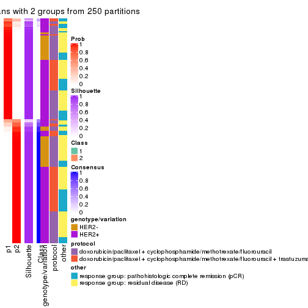</p>

</div>
<div id='tab-SD-skmeans-consensus-heatmap-2'>
<pre><code class="r">consensus_heatmap(res, k = 3)
</code></pre>

<p>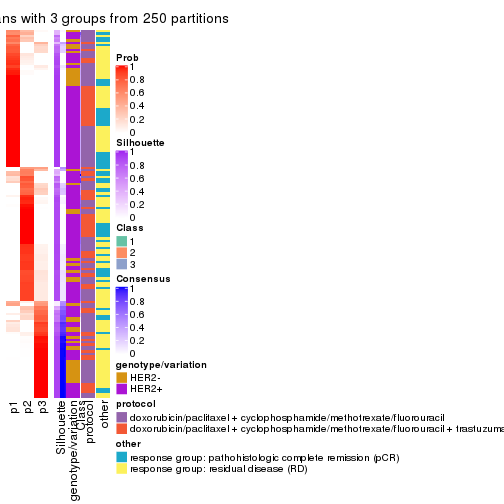</p>

</div>
<div id='tab-SD-skmeans-consensus-heatmap-3'>
<pre><code class="r">consensus_heatmap(res, k = 4)
</code></pre>

<p>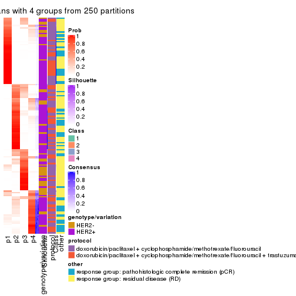</p>

</div>
<div id='tab-SD-skmeans-consensus-heatmap-4'>
<pre><code class="r">consensus_heatmap(res, k = 5)
</code></pre>

<p>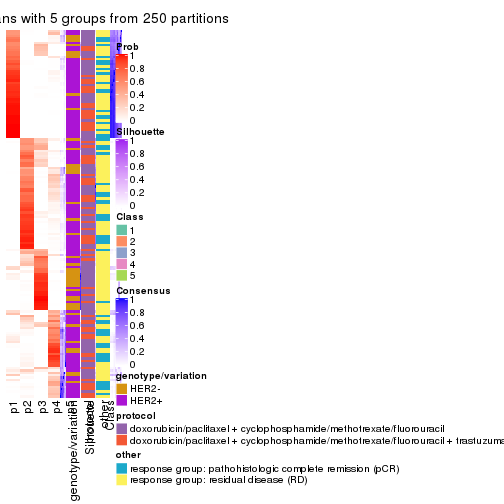</p>

</div>
<div id='tab-SD-skmeans-consensus-heatmap-5'>
<pre><code class="r">consensus_heatmap(res, k = 6)
</code></pre>

<p>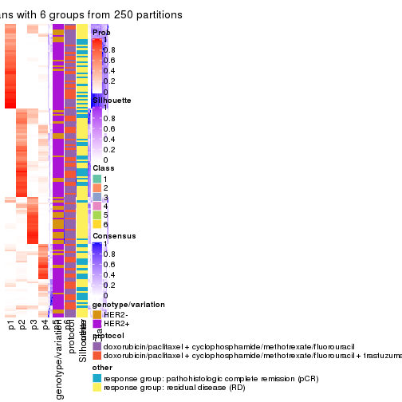</p>

</div>
</div>

Heatmaps for the membership of samples in all partitions to see how consistent they are:


<script>
$( function() {
	$( '#tabs-SD-skmeans-membership-heatmap' ).tabs();
} );
</script>
<div id='tabs-SD-skmeans-membership-heatmap'>
<ul>
<li><a href='#tab-SD-skmeans-membership-heatmap-1'>k = 2</a></li>
<li><a href='#tab-SD-skmeans-membership-heatmap-2'>k = 3</a></li>
<li><a href='#tab-SD-skmeans-membership-heatmap-3'>k = 4</a></li>
<li><a href='#tab-SD-skmeans-membership-heatmap-4'>k = 5</a></li>
<li><a href='#tab-SD-skmeans-membership-heatmap-5'>k = 6</a></li>
</ul>
<div id='tab-SD-skmeans-membership-heatmap-1'>
<pre><code class="r">membership_heatmap(res, k = 2)
</code></pre>

<p>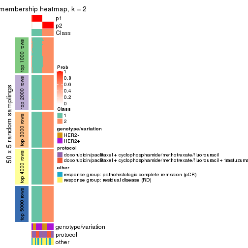</p>

</div>
<div id='tab-SD-skmeans-membership-heatmap-2'>
<pre><code class="r">membership_heatmap(res, k = 3)
</code></pre>

<p>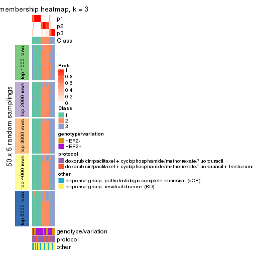</p>

</div>
<div id='tab-SD-skmeans-membership-heatmap-3'>
<pre><code class="r">membership_heatmap(res, k = 4)
</code></pre>

<p>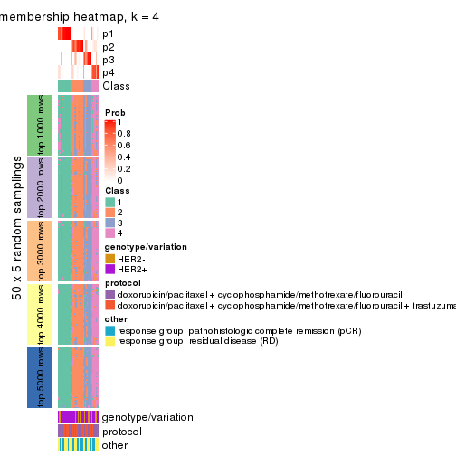</p>

</div>
<div id='tab-SD-skmeans-membership-heatmap-4'>
<pre><code class="r">membership_heatmap(res, k = 5)
</code></pre>

<p>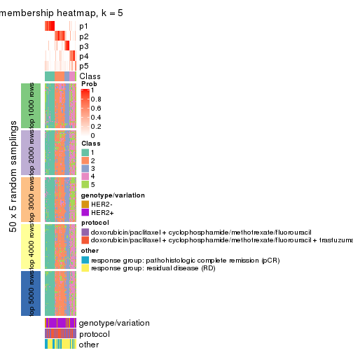</p>

</div>
<div id='tab-SD-skmeans-membership-heatmap-5'>
<pre><code class="r">membership_heatmap(res, k = 6)
</code></pre>

<p>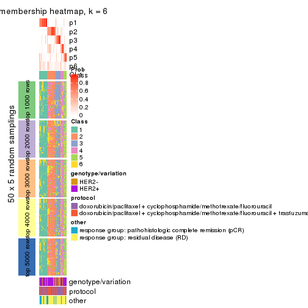</p>

</div>
</div>

As soon as we have had the classes for columns, we can look for signatures
which are significantly different between classes which can be candidate marks
for certain classes. Following are the heatmaps for signatures.


Signature heatmaps where rows are scaled:


<script>
$( function() {
	$( '#tabs-SD-skmeans-get-signatures' ).tabs();
} );
</script>
<div id='tabs-SD-skmeans-get-signatures'>
<ul>
<li><a href='#tab-SD-skmeans-get-signatures-1'>k = 2</a></li>
<li><a href='#tab-SD-skmeans-get-signatures-2'>k = 3</a></li>
<li><a href='#tab-SD-skmeans-get-signatures-3'>k = 4</a></li>
<li><a href='#tab-SD-skmeans-get-signatures-4'>k = 5</a></li>
<li><a href='#tab-SD-skmeans-get-signatures-5'>k = 6</a></li>
</ul>
<div id='tab-SD-skmeans-get-signatures-1'>
<pre><code class="r">get_signatures(res, k = 2)
</code></pre>

<pre><code>#&gt; Error: The width or height of the raster image is zero, maybe you forget to turn off the
#&gt; previous graphic device or it was corrupted. Run `dev.off()` to close it.
</code></pre>

<p></p>

</div>
<div id='tab-SD-skmeans-get-signatures-2'>
<pre><code class="r">get_signatures(res, k = 3)
</code></pre>

<pre><code>#&gt; Error: The width or height of the raster image is zero, maybe you forget to turn off the
#&gt; previous graphic device or it was corrupted. Run `dev.off()` to close it.
</code></pre>

<p></p>

</div>
<div id='tab-SD-skmeans-get-signatures-3'>
<pre><code class="r">get_signatures(res, k = 4)
</code></pre>

<pre><code>#&gt; Error: The width or height of the raster image is zero, maybe you forget to turn off the
#&gt; previous graphic device or it was corrupted. Run `dev.off()` to close it.
</code></pre>

<p></p>

</div>
<div id='tab-SD-skmeans-get-signatures-4'>
<pre><code class="r">get_signatures(res, k = 5)
</code></pre>

<pre><code>#&gt; Error: The width or height of the raster image is zero, maybe you forget to turn off the
#&gt; previous graphic device or it was corrupted. Run `dev.off()` to close it.
</code></pre>

<p></p>

</div>
<div id='tab-SD-skmeans-get-signatures-5'>
<pre><code class="r">get_signatures(res, k = 6)
</code></pre>

<pre><code>#&gt; Error: The width or height of the raster image is zero, maybe you forget to turn off the
#&gt; previous graphic device or it was corrupted. Run `dev.off()` to close it.
</code></pre>

<p></p>

</div>
</div>


Signature heatmaps where rows are not scaled:


<script>
$( function() {
	$( '#tabs-SD-skmeans-get-signatures-no-scale' ).tabs();
} );
</script>
<div id='tabs-SD-skmeans-get-signatures-no-scale'>
<ul>
<li><a href='#tab-SD-skmeans-get-signatures-no-scale-1'>k = 2</a></li>
<li><a href='#tab-SD-skmeans-get-signatures-no-scale-2'>k = 3</a></li>
<li><a href='#tab-SD-skmeans-get-signatures-no-scale-3'>k = 4</a></li>
<li><a href='#tab-SD-skmeans-get-signatures-no-scale-4'>k = 5</a></li>
<li><a href='#tab-SD-skmeans-get-signatures-no-scale-5'>k = 6</a></li>
</ul>
<div id='tab-SD-skmeans-get-signatures-no-scale-1'>
<pre><code class="r">get_signatures(res, k = 2, scale_rows = FALSE)
</code></pre>

<pre><code>#&gt; Error: The width or height of the raster image is zero, maybe you forget to turn off the
#&gt; previous graphic device or it was corrupted. Run `dev.off()` to close it.
</code></pre>

<p></p>

</div>
<div id='tab-SD-skmeans-get-signatures-no-scale-2'>
<pre><code class="r">get_signatures(res, k = 3, scale_rows = FALSE)
</code></pre>

<pre><code>#&gt; Error: The width or height of the raster image is zero, maybe you forget to turn off the
#&gt; previous graphic device or it was corrupted. Run `dev.off()` to close it.
</code></pre>

<p></p>

</div>
<div id='tab-SD-skmeans-get-signatures-no-scale-3'>
<pre><code class="r">get_signatures(res, k = 4, scale_rows = FALSE)
</code></pre>

<pre><code>#&gt; Error: The width or height of the raster image is zero, maybe you forget to turn off the
#&gt; previous graphic device or it was corrupted. Run `dev.off()` to close it.
</code></pre>

<p></p>

</div>
<div id='tab-SD-skmeans-get-signatures-no-scale-4'>
<pre><code class="r">get_signatures(res, k = 5, scale_rows = FALSE)
</code></pre>

<pre><code>#&gt; Error: The width or height of the raster image is zero, maybe you forget to turn off the
#&gt; previous graphic device or it was corrupted. Run `dev.off()` to close it.
</code></pre>

<p></p>

</div>
<div id='tab-SD-skmeans-get-signatures-no-scale-5'>
<pre><code class="r">get_signatures(res, k = 6, scale_rows = FALSE)
</code></pre>

<pre><code>#&gt; Error: The width or height of the raster image is zero, maybe you forget to turn off the
#&gt; previous graphic device or it was corrupted. Run `dev.off()` to close it.
</code></pre>

<p></p>

</div>
</div>


Compare the overlap of signatures from different k:

```r
compare_signatures(res)
```

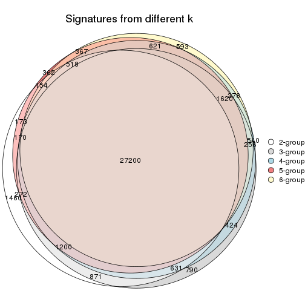

`get_signature()` returns a data frame invisibly. TO get the list of signatures, the function
call should be assigned to a variable explicitly. In following code, if `plot` argument is set
to `FALSE`, no heatmap is plotted while only the differential analysis is performed.

```r
# code only for demonstration
tb = get_signature(res, k = ..., plot = FALSE)
```

An example of the output of `tb` is:

```
#>   which_row         fdr    mean_1    mean_2 scaled_mean_1 scaled_mean_2 km
#> 1        38 0.042760348  8.373488  9.131774    -0.5533452     0.5164555  1
#> 2        40 0.018707592  7.106213  8.469186    -0.6173731     0.5762149  1
#> 3        55 0.019134737 10.221463 11.207825    -0.6159697     0.5749050  1
#> 4        59 0.006059896  5.921854  7.869574    -0.6899429     0.6439467  1
#> 5        60 0.018055526  8.928898 10.211722    -0.6204761     0.5791110  1
#> 6        98 0.009384629 15.714769 14.887706     0.6635654    -0.6193277  2
...
```

The columns in `tb` are:

1. `which_row`: row indices corresponding to the input matrix.
2. `fdr`: FDR for the differential test. 
3. `mean_x`: The mean value in group x.
4. `scaled_mean_x`: The mean value in group x after rows are scaled.
5. `km`: Row groups if k-means clustering is applied to rows.


UMAP plot which shows how samples are separated.


<script>
$( function() {
	$( '#tabs-SD-skmeans-dimension-reduction' ).tabs();
} );
</script>
<div id='tabs-SD-skmeans-dimension-reduction'>
<ul>
<li><a href='#tab-SD-skmeans-dimension-reduction-1'>k = 2</a></li>
<li><a href='#tab-SD-skmeans-dimension-reduction-2'>k = 3</a></li>
<li><a href='#tab-SD-skmeans-dimension-reduction-3'>k = 4</a></li>
<li><a href='#tab-SD-skmeans-dimension-reduction-4'>k = 5</a></li>
<li><a href='#tab-SD-skmeans-dimension-reduction-5'>k = 6</a></li>
</ul>
<div id='tab-SD-skmeans-dimension-reduction-1'>
<pre><code class="r">dimension_reduction(res, k = 2, method = &quot;UMAP&quot;)
</code></pre>

<p>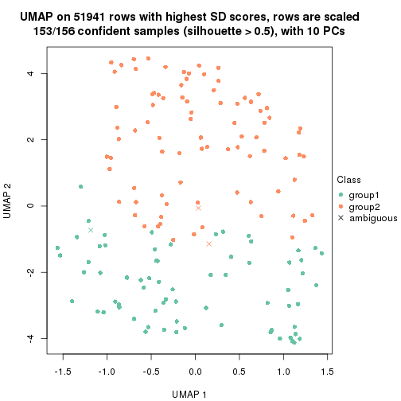</p>

</div>
<div id='tab-SD-skmeans-dimension-reduction-2'>
<pre><code class="r">dimension_reduction(res, k = 3, method = &quot;UMAP&quot;)
</code></pre>

<p>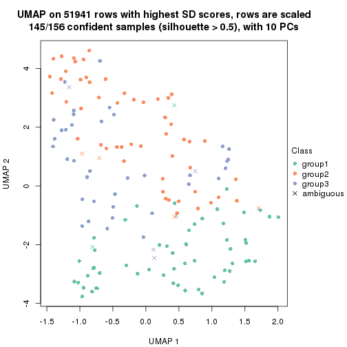</p>

</div>
<div id='tab-SD-skmeans-dimension-reduction-3'>
<pre><code class="r">dimension_reduction(res, k = 4, method = &quot;UMAP&quot;)
</code></pre>

<p>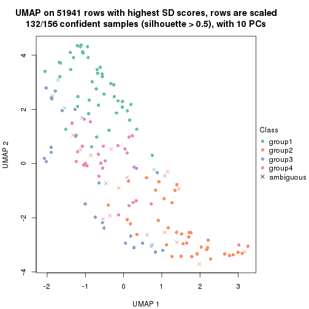</p>

</div>
<div id='tab-SD-skmeans-dimension-reduction-4'>
<pre><code class="r">dimension_reduction(res, k = 5, method = &quot;UMAP&quot;)
</code></pre>

<p>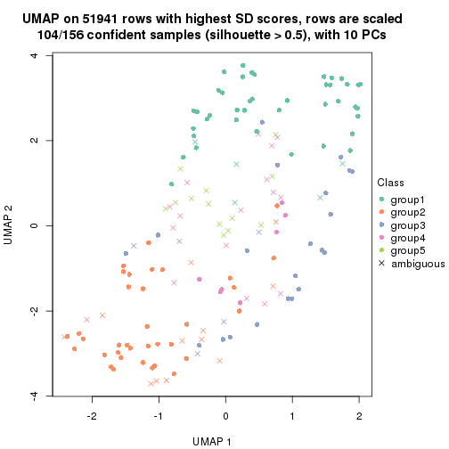</p>

</div>
<div id='tab-SD-skmeans-dimension-reduction-5'>
<pre><code class="r">dimension_reduction(res, k = 6, method = &quot;UMAP&quot;)
</code></pre>

<p>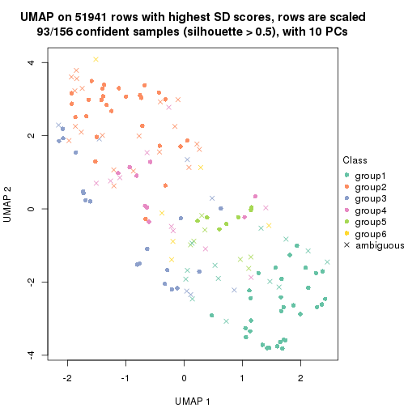</p>

</div>
</div>


Following heatmap shows how subgroups are split when increasing `k`:

```r
collect_classes(res)
```

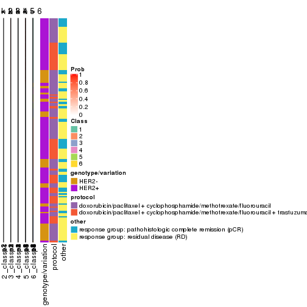


Test correlation between subgroups and known annotations. If the known
annotation is numeric, one-way ANOVA test is applied, and if the known
annotation is discrete, chi-squared contingency table test is applied.

```r
test_to_known_factors(res)
```

```
#>              n genotype/variation(p) protocol(p) other(p) k
#> SD:skmeans 153              8.72e-01      0.3179   0.8632 2
#> SD:skmeans 145              1.54e-03      0.3157   0.0347 3
#> SD:skmeans 132              2.75e-06      0.0757   0.0021 4
#> SD:skmeans 104              4.75e-06      0.1449   0.0231 5
#> SD:skmeans  93              1.78e-06      0.0785   0.0113 6
```


If matrix rows can be associated to genes, consider to use `functional_enrichment(res,
...)` to perform function enrichment for the signature genes. See [this vignette](http://bioconductor.org/packages/devel/bioc/vignettes/cola/inst/doc/functional_enrichment.html) for more detailed explanations.


 

---------------------------------------------------


### SD:pam


The object with results only for a single top-value method and a single partition method 
can be extracted as:

```r
res = res_list["SD", "pam"]
# you can also extract it by
# res = res_list["SD:pam"]
```

A summary of `res` and all the functions that can be applied to it:

```r
res
```

```
#> A 'ConsensusPartition' object with k = 2, 3, 4, 5, 6.
#>   On a matrix with 51941 rows and 156 columns.
#>   Top rows (1000, 2000, 3000, 4000, 5000) are extracted by 'SD' method.
#>   Subgroups are detected by 'pam' method.
#>   Performed in total 1250 partitions by row resampling.
#>   Best k for subgroups seems to be 3.
#> 
#> Following methods can be applied to this 'ConsensusPartition' object:
#>  [1] "cola_report"             "collect_classes"         "collect_plots"          
#>  [4] "collect_stats"           "colnames"                "compare_signatures"     
#>  [7] "consensus_heatmap"       "dimension_reduction"     "functional_enrichment"  
#> [10] "get_anno_col"            "get_anno"                "get_classes"            
#> [13] "get_consensus"           "get_matrix"              "get_membership"         
#> [16] "get_param"               "get_signatures"          "get_stats"              
#> [19] "is_best_k"               "is_stable_k"             "membership_heatmap"     
#> [22] "ncol"                    "nrow"                    "plot_ecdf"              
#> [25] "rownames"                "select_partition_number" "show"                   
#> [28] "suggest_best_k"          "test_to_known_factors"
```

`collect_plots()` function collects all the plots made from `res` for all `k` (number of partitions)
into one single page to provide an easy and fast comparison between different `k`.

```r
collect_plots(res)
```

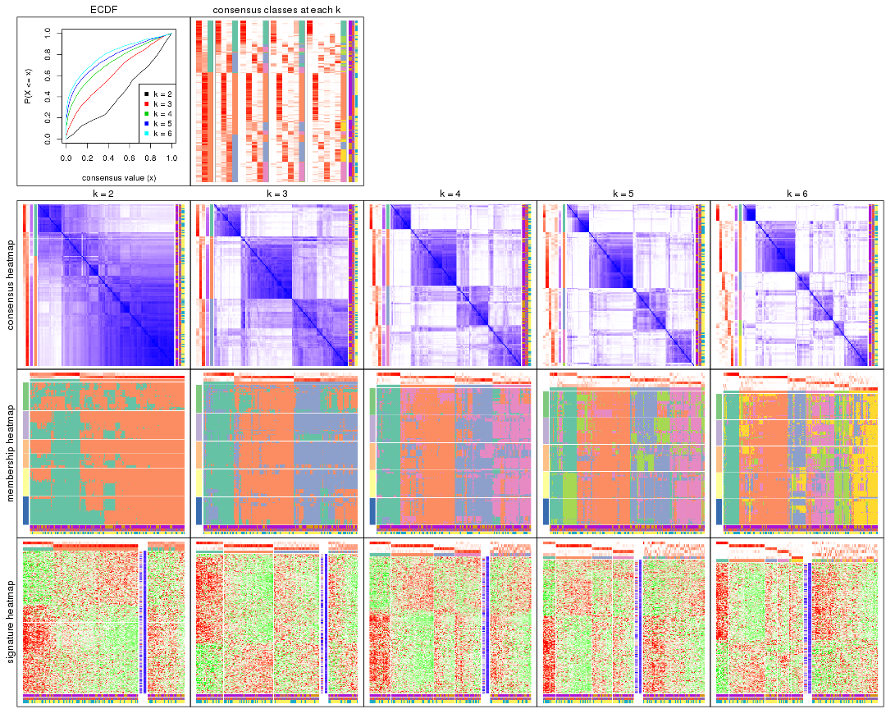

The plots are:

- The first row: a plot of the ECDF (empirical cumulative distribution
  function) curves of the consensus matrix for each `k` and the heatmap of
  predicted classes for each `k`.
- The second row: heatmaps of the consensus matrix for each `k`.
- The third row: heatmaps of the membership matrix for each `k`.
- The fouth row: heatmaps of the signatures for each `k`.

All the plots in panels can be made by individual functions and they are
plotted later in this section.

`select_partition_number()` produces several plots showing different
statistics for choosing "optimized" `k`. There are following statistics:

- ECDF curves of the consensus matrix for each `k`;
- 1-PAC. [The PAC
  score](https://en.wikipedia.org/wiki/Consensus_clustering#Over-interpretation_potential_of_consensus_clustering)
  measures the proportion of the ambiguous subgrouping.
- Mean silhouette score.
- Concordance. The mean probability of fiting the consensus class ids in all
  partitions.
- Area increased. Denote $A_k$ as the area under the ECDF curve for current
  `k`, the area increased is defined as $A_k - A_{k-1}$.
- Rand index. The percent of pairs of samples that are both in a same cluster
  or both are not in a same cluster in the partition of k and k-1.
- Jaccard index. The ratio of pairs of samples are both in a same cluster in
  the partition of k and k-1 and the pairs of samples are both in a same
  cluster in the partition k or k-1.

The detailed explanations of these statistics can be found in [the _cola_
vignette](http://bioconductor.org/packages/devel/bioc/vignettes/cola/inst/doc/cola.html#toc_13).

Generally speaking, lower PAC score, higher mean silhouette score or higher
concordance corresponds to better partition. Rand index and Jaccard index
measure how similar the current partition is compared to partition with `k-1`.
If they are too similar, we won't accept `k` is better than `k-1`.

```r
select_partition_number(res)
```

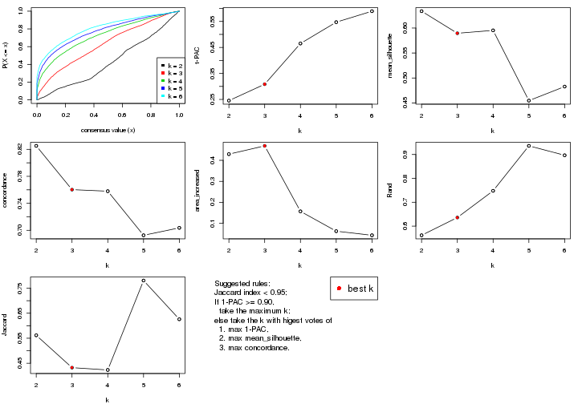

The numeric values for all these statistics can be obtained by `get_stats()`.

```r
get_stats(res)
```

```
#>   k 1-PAC mean_silhouette concordance area_increased  Rand Jaccard
#> 2 2 0.245           0.634       0.825         0.4294 0.562   0.562
#> 3 3 0.308           0.590       0.760         0.4687 0.636   0.432
#> 4 4 0.465           0.595       0.758         0.1571 0.748   0.423
#> 5 5 0.547           0.455       0.693         0.0628 0.936   0.781
#> 6 6 0.589           0.483       0.704         0.0433 0.897   0.626
```

`suggest_best_k()` suggests the best $k$ based on these statistics. The rules are as follows:

- All $k$ with Jaccard index larger than 0.95 are removed because increasing
  $k$ does not provide enough extra information. If all $k$ are removed, it is
  marked as no subgroup is detected.
- For all $k$ with 1-PAC score larger than 0.9, the maximal $k$ is taken as
  the best $k$, and other $k$ are marked as optional $k$.
- If it does not fit the second rule. The $k$ with the maximal vote of the
  highest 1-PAC score, highest mean silhouette, and highest concordance is
  taken as the best $k$.

```r
suggest_best_k(res)
```

```
#> [1] 3
```


Following shows the table of the partitions (You need to click the **show/hide
code output** link to see it). The membership matrix (columns with name `p*`)
is inferred by
[`clue::cl_consensus()`](https://www.rdocumentation.org/link/cl_consensus?package=clue)
function with the `SE` method. Basically the value in the membership matrix
represents the probability to belong to a certain group. The finall class
label for an item is determined with the group with highest probability it
belongs to.

In `get_classes()` function, the entropy is calculated from the membership
matrix and the silhouette score is calculated from the consensus matrix.


<script>
$( function() {
	$( '#tabs-SD-pam-get-classes' ).tabs();
} );
</script>
<div id='tabs-SD-pam-get-classes'>
<ul>
<li><a href='#tab-SD-pam-get-classes-1'>k = 2</a></li>
<li><a href='#tab-SD-pam-get-classes-2'>k = 3</a></li>
<li><a href='#tab-SD-pam-get-classes-3'>k = 4</a></li>
<li><a href='#tab-SD-pam-get-classes-4'>k = 5</a></li>
<li><a href='#tab-SD-pam-get-classes-5'>k = 6</a></li>
</ul>

<div id='tab-SD-pam-get-classes-1'>
<p><a id='tab-SD-pam-get-classes-1-a' style='color:#0366d6' href='#'>show/hide code output</a></p>
<pre><code class="r">cbind(get_classes(res, k = 2), get_membership(res, k = 2))
</code></pre>

<pre><code>#&gt;            class entropy silhouette    p1    p2
#&gt; GSM1232995     2  0.1843     0.8069 0.028 0.972
#&gt; GSM1233002     2  0.8499     0.6163 0.276 0.724
#&gt; GSM1233003     1  0.8327     0.6207 0.736 0.264
#&gt; GSM1233014     2  0.2603     0.8080 0.044 0.956
#&gt; GSM1233015     2  0.9993    -0.0557 0.484 0.516
#&gt; GSM1233016     2  0.7950     0.6406 0.240 0.760
#&gt; GSM1233024     2  0.2603     0.8053 0.044 0.956
#&gt; GSM1233049     1  0.4022     0.7190 0.920 0.080
#&gt; GSM1233064     2  0.3584     0.7836 0.068 0.932
#&gt; GSM1233068     2  0.9963    -0.1264 0.464 0.536
#&gt; GSM1233073     2  0.9866     0.0711 0.432 0.568
#&gt; GSM1233093     1  0.1414     0.7031 0.980 0.020
#&gt; GSM1233115     1  0.5519     0.6976 0.872 0.128
#&gt; GSM1232992     2  0.0000     0.8072 0.000 1.000
#&gt; GSM1232993     2  0.0000     0.8072 0.000 1.000
#&gt; GSM1233005     2  0.1184     0.8056 0.016 0.984
#&gt; GSM1233007     2  0.4298     0.7757 0.088 0.912
#&gt; GSM1233010     2  0.9087     0.5032 0.324 0.676
#&gt; GSM1233013     2  0.0672     0.8076 0.008 0.992
#&gt; GSM1233018     2  0.0938     0.8085 0.012 0.988
#&gt; GSM1233019     2  0.1633     0.8031 0.024 0.976
#&gt; GSM1233021     2  0.0938     0.8084 0.012 0.988
#&gt; GSM1233025     2  0.8499     0.5999 0.276 0.724
#&gt; GSM1233029     2  0.1184     0.8082 0.016 0.984
#&gt; GSM1233030     2  0.0000     0.8072 0.000 1.000
#&gt; GSM1233031     2  0.7299     0.6984 0.204 0.796
#&gt; GSM1233032     1  0.5059     0.7164 0.888 0.112
#&gt; GSM1233035     2  0.7453     0.6739 0.212 0.788
#&gt; GSM1233038     1  0.3431     0.7186 0.936 0.064
#&gt; GSM1233039     2  0.3733     0.7892 0.072 0.928
#&gt; GSM1233042     2  0.5946     0.7406 0.144 0.856
#&gt; GSM1233043     2  0.3114     0.8009 0.056 0.944
#&gt; GSM1233044     1  0.9833     0.4330 0.576 0.424
#&gt; GSM1233046     2  0.5946     0.7367 0.144 0.856
#&gt; GSM1233051     1  0.9732     0.4564 0.596 0.404
#&gt; GSM1233054     2  0.9087     0.4066 0.324 0.676
#&gt; GSM1233057     2  0.3584     0.8005 0.068 0.932
#&gt; GSM1233060     2  0.6712     0.7167 0.176 0.824
#&gt; GSM1233062     2  0.1633     0.8073 0.024 0.976
#&gt; GSM1233075     2  0.2043     0.8068 0.032 0.968
#&gt; GSM1233078     1  0.9970     0.2491 0.532 0.468
#&gt; GSM1233079     1  0.4431     0.7080 0.908 0.092
#&gt; GSM1233082     2  1.0000    -0.2607 0.500 0.500
#&gt; GSM1233083     1  0.5178     0.7064 0.884 0.116
#&gt; GSM1233091     2  0.5842     0.7460 0.140 0.860
#&gt; GSM1233095     1  0.0376     0.7086 0.996 0.004
#&gt; GSM1233096     1  0.7950     0.6293 0.760 0.240
#&gt; GSM1233101     1  0.4431     0.7165 0.908 0.092
#&gt; GSM1233105     2  0.9795     0.1672 0.416 0.584
#&gt; GSM1233117     2  0.1633     0.8073 0.024 0.976
#&gt; GSM1233118     2  0.1184     0.8093 0.016 0.984
#&gt; GSM1233001     2  0.2778     0.7957 0.048 0.952
#&gt; GSM1233006     2  0.4161     0.7768 0.084 0.916
#&gt; GSM1233008     2  0.1843     0.8069 0.028 0.972
#&gt; GSM1233009     2  0.3584     0.7971 0.068 0.932
#&gt; GSM1233017     2  0.0938     0.8087 0.012 0.988
#&gt; GSM1233020     2  0.0672     0.8076 0.008 0.992
#&gt; GSM1233022     2  0.3584     0.8008 0.068 0.932
#&gt; GSM1233026     2  0.7528     0.6616 0.216 0.784
#&gt; GSM1233028     2  0.4431     0.7869 0.092 0.908
#&gt; GSM1233034     2  0.0000     0.8072 0.000 1.000
#&gt; GSM1233040     1  0.5059     0.7149 0.888 0.112
#&gt; GSM1233048     1  0.5842     0.7112 0.860 0.140
#&gt; GSM1233056     1  0.0376     0.7067 0.996 0.004
#&gt; GSM1233058     2  0.9248     0.5314 0.340 0.660
#&gt; GSM1233059     1  0.3879     0.7196 0.924 0.076
#&gt; GSM1233066     2  0.9922    -0.0814 0.448 0.552
#&gt; GSM1233071     2  0.5059     0.7523 0.112 0.888
#&gt; GSM1233074     2  0.0672     0.8076 0.008 0.992
#&gt; GSM1233076     2  0.5178     0.7627 0.116 0.884
#&gt; GSM1233080     1  0.1184     0.7045 0.984 0.016
#&gt; GSM1233088     2  0.7745     0.6619 0.228 0.772
#&gt; GSM1233090     1  0.2043     0.7146 0.968 0.032
#&gt; GSM1233092     2  0.4431     0.7750 0.092 0.908
#&gt; GSM1233094     2  0.6801     0.7245 0.180 0.820
#&gt; GSM1233097     2  0.7376     0.6979 0.208 0.792
#&gt; GSM1233100     2  0.6048     0.7360 0.148 0.852
#&gt; GSM1233104     2  0.5059     0.7880 0.112 0.888
#&gt; GSM1233106     1  0.9983     0.3326 0.524 0.476
#&gt; GSM1233111     1  0.9896     0.2828 0.560 0.440
#&gt; GSM1233122     2  0.4161     0.7768 0.084 0.916
#&gt; GSM1233146     2  0.4298     0.7946 0.088 0.912
#&gt; GSM1232994     2  0.3584     0.7964 0.068 0.932
#&gt; GSM1232996     2  0.1414     0.8078 0.020 0.980
#&gt; GSM1232997     2  0.1843     0.8074 0.028 0.972
#&gt; GSM1232998     2  0.2778     0.8085 0.048 0.952
#&gt; GSM1232999     2  0.1184     0.8085 0.016 0.984
#&gt; GSM1233000     2  0.2603     0.8047 0.044 0.956
#&gt; GSM1233004     1  0.9552     0.4703 0.624 0.376
#&gt; GSM1233011     2  0.4022     0.8021 0.080 0.920
#&gt; GSM1233012     2  0.1414     0.8081 0.020 0.980
#&gt; GSM1233023     2  0.0672     0.8076 0.008 0.992
#&gt; GSM1233027     2  0.4161     0.7768 0.084 0.916
#&gt; GSM1233033     1  0.9775     0.3858 0.588 0.412
#&gt; GSM1233036     2  0.3584     0.8016 0.068 0.932
#&gt; GSM1233037     2  0.5178     0.7546 0.116 0.884
#&gt; GSM1233041     1  0.3114     0.7205 0.944 0.056
#&gt; GSM1233045     2  0.6247     0.7408 0.156 0.844
#&gt; GSM1233047     1  0.9954     0.3662 0.540 0.460
#&gt; GSM1233050     1  0.4690     0.7164 0.900 0.100
#&gt; GSM1233052     1  0.9522     0.4958 0.628 0.372
#&gt; GSM1233053     1  0.4815     0.7170 0.896 0.104
#&gt; GSM1233055     1  0.0938     0.7092 0.988 0.012
#&gt; GSM1233061     2  0.4562     0.7848 0.096 0.904
#&gt; GSM1233063     1  0.8207     0.6314 0.744 0.256
#&gt; GSM1233065     2  0.2603     0.8056 0.044 0.956
#&gt; GSM1233070     2  0.2423     0.8047 0.040 0.960
#&gt; GSM1233077     2  0.9661     0.2452 0.392 0.608
#&gt; GSM1233081     1  0.9427     0.5038 0.640 0.360
#&gt; GSM1233084     1  0.1633     0.7041 0.976 0.024
#&gt; GSM1233087     2  0.9922     0.1465 0.448 0.552
#&gt; GSM1233089     2  0.4431     0.7727 0.092 0.908
#&gt; GSM1233099     1  0.9795     0.4007 0.584 0.416
#&gt; GSM1233112     1  0.9815     0.3703 0.580 0.420
#&gt; GSM1233085     1  0.9944     0.3713 0.544 0.456
#&gt; GSM1233098     2  0.0938     0.8083 0.012 0.988
#&gt; GSM1233114     1  0.9850     0.4425 0.572 0.428
#&gt; GSM1233119     2  0.9833     0.2896 0.424 0.576
#&gt; GSM1233129     2  0.2236     0.8081 0.036 0.964
#&gt; GSM1233132     1  0.5294     0.7148 0.880 0.120
#&gt; GSM1233139     2  0.1843     0.8094 0.028 0.972
#&gt; GSM1233143     2  0.3431     0.7900 0.064 0.936
#&gt; GSM1233145     1  0.3274     0.7185 0.940 0.060
#&gt; GSM1233067     2  0.5519     0.7453 0.128 0.872
#&gt; GSM1233069     2  0.9552     0.2601 0.376 0.624
#&gt; GSM1233072     2  0.3114     0.7975 0.056 0.944
#&gt; GSM1233086     2  0.6712     0.6913 0.176 0.824
#&gt; GSM1233102     1  0.9661     0.4075 0.608 0.392
#&gt; GSM1233103     2  0.7674     0.6513 0.224 0.776
#&gt; GSM1233107     2  0.5178     0.7713 0.116 0.884
#&gt; GSM1233108     1  0.4022     0.7162 0.920 0.080
#&gt; GSM1233109     1  0.9977     0.2649 0.528 0.472
#&gt; GSM1233110     2  0.9580     0.2689 0.380 0.620
#&gt; GSM1233113     2  0.0938     0.8073 0.012 0.988
#&gt; GSM1233116     2  0.2236     0.8069 0.036 0.964
#&gt; GSM1233120     1  0.9170     0.5360 0.668 0.332
#&gt; GSM1233121     2  0.9635     0.2554 0.388 0.612
#&gt; GSM1233123     2  0.9170     0.3491 0.332 0.668
#&gt; GSM1233124     2  0.9323     0.3054 0.348 0.652
#&gt; GSM1233125     1  0.3274     0.7127 0.940 0.060
#&gt; GSM1233126     2  0.7139     0.7050 0.196 0.804
#&gt; GSM1233127     2  0.1184     0.8102 0.016 0.984
#&gt; GSM1233128     1  0.0672     0.7080 0.992 0.008
#&gt; GSM1233130     2  0.9686     0.2424 0.396 0.604
#&gt; GSM1233131     1  0.9963     0.3159 0.536 0.464
#&gt; GSM1233133     1  0.9963     0.3422 0.536 0.464
#&gt; GSM1233134     2  0.6048     0.7265 0.148 0.852
#&gt; GSM1233135     2  0.9552     0.2601 0.376 0.624
#&gt; GSM1233136     2  0.9552     0.3018 0.376 0.624
#&gt; GSM1233137     1  0.6973     0.6930 0.812 0.188
#&gt; GSM1233138     2  0.4161     0.7790 0.084 0.916
#&gt; GSM1233140     1  0.9661     0.4967 0.608 0.392
#&gt; GSM1233141     2  0.2778     0.8064 0.048 0.952
#&gt; GSM1233142     2  0.1184     0.8087 0.016 0.984
#&gt; GSM1233144     1  0.9922     0.3896 0.552 0.448
#&gt; GSM1233147     2  0.9522     0.3098 0.372 0.628
</code></pre>

<script>
$('#tab-SD-pam-get-classes-1-a').parent().next().next().hide();
$('#tab-SD-pam-get-classes-1-a').click(function(){
  $('#tab-SD-pam-get-classes-1-a').parent().next().next().toggle();
  return(false);
});
</script>
</div>

<div id='tab-SD-pam-get-classes-2'>
<p><a id='tab-SD-pam-get-classes-2-a' style='color:#0366d6' href='#'>show/hide code output</a></p>
<pre><code class="r">cbind(get_classes(res, k = 3), get_membership(res, k = 3))
</code></pre>

<pre><code>#&gt;            class entropy silhouette    p1    p2    p3
#&gt; GSM1232995     2  0.2066     0.7887 0.000 0.940 0.060
#&gt; GSM1233002     2  0.4565     0.7349 0.064 0.860 0.076
#&gt; GSM1233003     1  0.7591    -0.0313 0.544 0.044 0.412
#&gt; GSM1233014     3  0.6793     0.4147 0.012 0.452 0.536
#&gt; GSM1233015     2  0.4921     0.7017 0.164 0.816 0.020
#&gt; GSM1233016     3  0.8405     0.5306 0.264 0.132 0.604
#&gt; GSM1233024     2  0.2414     0.7944 0.020 0.940 0.040
#&gt; GSM1233049     1  0.4291     0.7473 0.840 0.008 0.152
#&gt; GSM1233064     2  0.1711     0.7884 0.008 0.960 0.032
#&gt; GSM1233068     3  0.7222     0.6370 0.084 0.220 0.696
#&gt; GSM1233073     3  0.7698     0.5665 0.072 0.304 0.624
#&gt; GSM1233093     1  0.0747     0.7728 0.984 0.000 0.016
#&gt; GSM1233115     1  0.8464     0.5605 0.592 0.128 0.280
#&gt; GSM1232992     2  0.1031     0.7869 0.000 0.976 0.024
#&gt; GSM1232993     2  0.0592     0.7920 0.000 0.988 0.012
#&gt; GSM1233005     2  0.1453     0.7851 0.008 0.968 0.024
#&gt; GSM1233007     2  0.4782     0.6594 0.016 0.820 0.164
#&gt; GSM1233010     2  0.6192     0.6614 0.176 0.764 0.060
#&gt; GSM1233013     2  0.0592     0.7923 0.000 0.988 0.012
#&gt; GSM1233018     2  0.0592     0.7924 0.000 0.988 0.012
#&gt; GSM1233019     2  0.2584     0.7717 0.008 0.928 0.064
#&gt; GSM1233021     2  0.0592     0.7924 0.000 0.988 0.012
#&gt; GSM1233025     3  0.7379     0.4477 0.336 0.048 0.616
#&gt; GSM1233029     2  0.0592     0.7927 0.000 0.988 0.012
#&gt; GSM1233030     2  0.2165     0.7737 0.000 0.936 0.064
#&gt; GSM1233031     2  0.9290    -0.0564 0.164 0.464 0.372
#&gt; GSM1233032     1  0.3587     0.7635 0.892 0.020 0.088
#&gt; GSM1233035     3  0.9790     0.4241 0.308 0.260 0.432
#&gt; GSM1233038     1  0.2625     0.7490 0.916 0.000 0.084
#&gt; GSM1233039     2  0.2116     0.7931 0.012 0.948 0.040
#&gt; GSM1233042     2  0.3791     0.7735 0.048 0.892 0.060
#&gt; GSM1233043     2  0.1620     0.7866 0.012 0.964 0.024
#&gt; GSM1233044     3  0.7923     0.5385 0.228 0.120 0.652
#&gt; GSM1233046     3  0.8470     0.5228 0.104 0.344 0.552
#&gt; GSM1233051     3  0.8544     0.5726 0.248 0.152 0.600
#&gt; GSM1233054     2  0.8649     0.2427 0.112 0.528 0.360
#&gt; GSM1233057     2  0.6374     0.7069 0.100 0.768 0.132
#&gt; GSM1233060     2  0.5913     0.7178 0.144 0.788 0.068
#&gt; GSM1233062     2  0.2878     0.7835 0.000 0.904 0.096
#&gt; GSM1233075     2  0.4883     0.6872 0.004 0.788 0.208
#&gt; GSM1233078     3  0.2796     0.5802 0.092 0.000 0.908
#&gt; GSM1233079     1  0.7562     0.5784 0.628 0.064 0.308
#&gt; GSM1233082     2  0.9626    -0.0367 0.204 0.404 0.392
#&gt; GSM1233083     1  0.6659     0.5070 0.532 0.008 0.460
#&gt; GSM1233091     2  0.3755     0.7692 0.008 0.872 0.120
#&gt; GSM1233095     1  0.3784     0.7497 0.864 0.004 0.132
#&gt; GSM1233096     1  0.3325     0.7387 0.904 0.076 0.020
#&gt; GSM1233101     1  0.5378     0.6992 0.756 0.008 0.236
#&gt; GSM1233105     1  0.9741    -0.1143 0.412 0.228 0.360
#&gt; GSM1233117     2  0.5058     0.5774 0.000 0.756 0.244
#&gt; GSM1233118     3  0.6295     0.3404 0.000 0.472 0.528
#&gt; GSM1233001     2  0.2796     0.7713 0.000 0.908 0.092
#&gt; GSM1233006     3  0.6654     0.4166 0.008 0.456 0.536
#&gt; GSM1233008     2  0.2878     0.7786 0.000 0.904 0.096
#&gt; GSM1233009     2  0.3690     0.7489 0.100 0.884 0.016
#&gt; GSM1233017     2  0.2959     0.7681 0.000 0.900 0.100
#&gt; GSM1233020     2  0.0424     0.7925 0.000 0.992 0.008
#&gt; GSM1233022     2  0.4689     0.7766 0.052 0.852 0.096
#&gt; GSM1233026     2  0.6783     0.6600 0.140 0.744 0.116
#&gt; GSM1233028     2  0.6393     0.6831 0.112 0.768 0.120
#&gt; GSM1233034     2  0.0000     0.7911 0.000 1.000 0.000
#&gt; GSM1233040     1  0.2176     0.7700 0.948 0.020 0.032
#&gt; GSM1233048     1  0.2806     0.7679 0.928 0.032 0.040
#&gt; GSM1233056     1  0.0424     0.7754 0.992 0.000 0.008
#&gt; GSM1233058     2  0.8265     0.5218 0.180 0.636 0.184
#&gt; GSM1233059     1  0.1015     0.7758 0.980 0.008 0.012
#&gt; GSM1233066     3  0.3791     0.5995 0.060 0.048 0.892
#&gt; GSM1233071     3  0.7410     0.4850 0.040 0.384 0.576
#&gt; GSM1233074     2  0.6252    -0.0360 0.000 0.556 0.444
#&gt; GSM1233076     3  0.6696     0.5595 0.020 0.348 0.632
#&gt; GSM1233080     1  0.3482     0.7535 0.872 0.000 0.128
#&gt; GSM1233088     2  0.4994     0.7463 0.052 0.836 0.112
#&gt; GSM1233090     1  0.0661     0.7761 0.988 0.008 0.004
#&gt; GSM1233092     3  0.7287     0.4838 0.032 0.408 0.560
#&gt; GSM1233094     3  0.7712     0.4902 0.052 0.392 0.556
#&gt; GSM1233097     3  0.9217     0.3110 0.152 0.400 0.448
#&gt; GSM1233100     2  0.4206     0.7658 0.040 0.872 0.088
#&gt; GSM1233104     3  0.8742     0.5141 0.136 0.308 0.556
#&gt; GSM1233106     3  0.6960     0.6366 0.116 0.152 0.732
#&gt; GSM1233111     1  0.5639     0.5984 0.752 0.232 0.016
#&gt; GSM1233122     3  0.6683     0.3058 0.008 0.492 0.500
#&gt; GSM1233146     2  0.5060     0.7397 0.100 0.836 0.064
#&gt; GSM1232994     2  0.2878     0.7624 0.096 0.904 0.000
#&gt; GSM1232996     2  0.1289     0.7921 0.000 0.968 0.032
#&gt; GSM1232997     2  0.3038     0.7808 0.000 0.896 0.104
#&gt; GSM1232998     2  0.7278    -0.2082 0.028 0.516 0.456
#&gt; GSM1232999     2  0.0747     0.7922 0.000 0.984 0.016
#&gt; GSM1233000     2  0.0237     0.7911 0.004 0.996 0.000
#&gt; GSM1233004     3  0.4821     0.5976 0.040 0.120 0.840
#&gt; GSM1233011     3  0.6322     0.6084 0.024 0.276 0.700
#&gt; GSM1233012     3  0.6204     0.4196 0.000 0.424 0.576
#&gt; GSM1233023     2  0.3038     0.7705 0.000 0.896 0.104
#&gt; GSM1233027     2  0.1453     0.7851 0.008 0.968 0.024
#&gt; GSM1233033     3  0.6489     0.2650 0.456 0.004 0.540
#&gt; GSM1233036     3  0.8395     0.5010 0.104 0.328 0.568
#&gt; GSM1233037     2  0.6625     0.4263 0.024 0.660 0.316
#&gt; GSM1233041     1  0.0661     0.7762 0.988 0.008 0.004
#&gt; GSM1233045     2  0.5449     0.7206 0.116 0.816 0.068
#&gt; GSM1233047     3  0.5028     0.5858 0.132 0.040 0.828
#&gt; GSM1233050     1  0.4589     0.7435 0.820 0.008 0.172
#&gt; GSM1233052     2  0.9485     0.1621 0.304 0.484 0.212
#&gt; GSM1233053     1  0.5726     0.6994 0.760 0.024 0.216
#&gt; GSM1233055     1  0.2165     0.7515 0.936 0.000 0.064
#&gt; GSM1233061     3  0.6079     0.6300 0.036 0.216 0.748
#&gt; GSM1233063     1  0.6540     0.1652 0.584 0.008 0.408
#&gt; GSM1233065     2  0.4702     0.6908 0.000 0.788 0.212
#&gt; GSM1233070     3  0.6598     0.4493 0.008 0.428 0.564
#&gt; GSM1233077     3  0.4995     0.5940 0.092 0.068 0.840
#&gt; GSM1233081     3  0.3686     0.5572 0.140 0.000 0.860
#&gt; GSM1233084     1  0.1289     0.7715 0.968 0.000 0.032
#&gt; GSM1233087     3  0.7297     0.5752 0.172 0.120 0.708
#&gt; GSM1233089     2  0.6819    -0.3425 0.012 0.512 0.476
#&gt; GSM1233099     3  0.7558     0.5551 0.188 0.124 0.688
#&gt; GSM1233112     3  0.7757     0.5787 0.224 0.112 0.664
#&gt; GSM1233085     3  0.4121     0.5729 0.108 0.024 0.868
#&gt; GSM1233098     2  0.2860     0.7758 0.004 0.912 0.084
#&gt; GSM1233114     3  0.6952     0.3172 0.480 0.016 0.504
#&gt; GSM1233119     3  0.7504     0.5015 0.312 0.060 0.628
#&gt; GSM1233129     2  0.3482     0.7632 0.000 0.872 0.128
#&gt; GSM1233132     1  0.3832     0.7429 0.880 0.020 0.100
#&gt; GSM1233139     2  0.3192     0.7669 0.000 0.888 0.112
#&gt; GSM1233143     3  0.7462     0.5295 0.048 0.352 0.600
#&gt; GSM1233145     1  0.3879     0.7058 0.848 0.000 0.152
#&gt; GSM1233067     3  0.6887     0.6291 0.076 0.204 0.720
#&gt; GSM1233069     3  0.4709     0.5886 0.092 0.056 0.852
#&gt; GSM1233072     2  0.6680    -0.3514 0.008 0.508 0.484
#&gt; GSM1233086     3  0.6723     0.6486 0.064 0.212 0.724
#&gt; GSM1233102     3  0.5881     0.5187 0.256 0.016 0.728
#&gt; GSM1233103     3  0.8869     0.5659 0.160 0.280 0.560
#&gt; GSM1233107     3  0.8069     0.5882 0.120 0.244 0.636
#&gt; GSM1233108     1  0.6215     0.5171 0.572 0.000 0.428
#&gt; GSM1233109     3  0.3030     0.5799 0.092 0.004 0.904
#&gt; GSM1233110     3  0.2945     0.5817 0.088 0.004 0.908
#&gt; GSM1233113     2  0.3482     0.7489 0.000 0.872 0.128
#&gt; GSM1233116     3  0.5650     0.5545 0.000 0.312 0.688
#&gt; GSM1233120     3  0.7318     0.5147 0.264 0.068 0.668
#&gt; GSM1233121     3  0.5093     0.5918 0.088 0.076 0.836
#&gt; GSM1233123     3  0.4253     0.5938 0.080 0.048 0.872
#&gt; GSM1233124     3  0.5625     0.6001 0.076 0.116 0.808
#&gt; GSM1233125     1  0.4974     0.6763 0.764 0.000 0.236
#&gt; GSM1233126     3  0.7824     0.5326 0.064 0.356 0.580
#&gt; GSM1233127     3  0.6688     0.4761 0.012 0.408 0.580
#&gt; GSM1233128     1  0.2625     0.7576 0.916 0.000 0.084
#&gt; GSM1233130     3  0.2796     0.5802 0.092 0.000 0.908
#&gt; GSM1233131     3  0.7325     0.3667 0.388 0.036 0.576
#&gt; GSM1233133     3  0.3765     0.5828 0.084 0.028 0.888
#&gt; GSM1233134     3  0.6336     0.6444 0.064 0.180 0.756
#&gt; GSM1233135     3  0.4505     0.5902 0.092 0.048 0.860
#&gt; GSM1233136     3  0.5004     0.5994 0.088 0.072 0.840
#&gt; GSM1233137     1  0.6754     0.5066 0.556 0.012 0.432
#&gt; GSM1233138     3  0.7158     0.5170 0.032 0.372 0.596
#&gt; GSM1233140     3  0.7346     0.3207 0.432 0.032 0.536
#&gt; GSM1233141     3  0.6696     0.5275 0.020 0.348 0.632
#&gt; GSM1233142     3  0.7043     0.4109 0.020 0.448 0.532
#&gt; GSM1233144     3  0.4045     0.5681 0.104 0.024 0.872
#&gt; GSM1233147     3  0.5407     0.6392 0.040 0.156 0.804
</code></pre>

<script>
$('#tab-SD-pam-get-classes-2-a').parent().next().next().hide();
$('#tab-SD-pam-get-classes-2-a').click(function(){
  $('#tab-SD-pam-get-classes-2-a').parent().next().next().toggle();
  return(false);
});
</script>
</div>

<div id='tab-SD-pam-get-classes-3'>
<p><a id='tab-SD-pam-get-classes-3-a' style='color:#0366d6' href='#'>show/hide code output</a></p>
<pre><code class="r">cbind(get_classes(res, k = 4), get_membership(res, k = 4))
</code></pre>

<pre><code>#&gt;            class entropy silhouette    p1    p2    p3    p4
#&gt; GSM1232995     2  0.2751     0.7777 0.000 0.904 0.040 0.056
#&gt; GSM1233002     2  0.4998     0.0135 0.000 0.512 0.000 0.488
#&gt; GSM1233003     4  0.7022     0.5581 0.228 0.012 0.148 0.612
#&gt; GSM1233014     4  0.4728     0.6403 0.000 0.104 0.104 0.792
#&gt; GSM1233015     2  0.2300     0.7772 0.016 0.920 0.000 0.064
#&gt; GSM1233016     4  0.5063     0.6542 0.156 0.024 0.040 0.780
#&gt; GSM1233024     2  0.1661     0.7899 0.000 0.944 0.004 0.052
#&gt; GSM1233049     1  0.2281     0.8392 0.904 0.000 0.096 0.000
#&gt; GSM1233064     2  0.1302     0.7845 0.000 0.956 0.000 0.044
#&gt; GSM1233068     3  0.7150     0.4307 0.004 0.132 0.532 0.332
#&gt; GSM1233073     4  0.4292     0.6456 0.000 0.080 0.100 0.820
#&gt; GSM1233093     1  0.0000     0.8582 1.000 0.000 0.000 0.000
#&gt; GSM1233115     4  0.8014     0.5109 0.184 0.064 0.176 0.576
#&gt; GSM1232992     2  0.0817     0.7862 0.000 0.976 0.000 0.024
#&gt; GSM1232993     2  0.0592     0.7890 0.000 0.984 0.000 0.016
#&gt; GSM1233005     2  0.1118     0.7865 0.000 0.964 0.000 0.036
#&gt; GSM1233007     2  0.3351     0.7535 0.000 0.844 0.008 0.148
#&gt; GSM1233010     2  0.5584     0.6241 0.020 0.692 0.024 0.264
#&gt; GSM1233013     2  0.1722     0.7836 0.000 0.944 0.008 0.048
#&gt; GSM1233018     2  0.1118     0.7885 0.000 0.964 0.000 0.036
#&gt; GSM1233019     2  0.1824     0.7799 0.000 0.936 0.004 0.060
#&gt; GSM1233021     2  0.1211     0.7863 0.000 0.960 0.000 0.040
#&gt; GSM1233025     4  0.4485     0.6502 0.176 0.012 0.020 0.792
#&gt; GSM1233029     2  0.1118     0.7863 0.000 0.964 0.000 0.036
#&gt; GSM1233030     2  0.1576     0.7825 0.000 0.948 0.004 0.048
#&gt; GSM1233031     4  0.6039     0.5838 0.016 0.200 0.080 0.704
#&gt; GSM1233032     1  0.4023     0.7821 0.840 0.004 0.104 0.052
#&gt; GSM1233035     2  0.8387     0.4474 0.132 0.532 0.088 0.248
#&gt; GSM1233038     1  0.2647     0.7878 0.880 0.000 0.000 0.120
#&gt; GSM1233039     2  0.2714     0.7793 0.000 0.884 0.004 0.112
#&gt; GSM1233042     2  0.4193     0.5772 0.000 0.732 0.000 0.268
#&gt; GSM1233043     2  0.1792     0.7835 0.000 0.932 0.000 0.068
#&gt; GSM1233044     4  0.6448     0.4611 0.012 0.056 0.344 0.588
#&gt; GSM1233046     2  0.7272     0.4963 0.024 0.568 0.104 0.304
#&gt; GSM1233051     4  0.7715     0.2517 0.064 0.064 0.384 0.488
#&gt; GSM1233054     3  0.6708     0.5027 0.000 0.272 0.596 0.132
#&gt; GSM1233057     3  0.7241     0.3479 0.004 0.364 0.500 0.132
#&gt; GSM1233060     2  0.2839     0.7835 0.004 0.884 0.004 0.108
#&gt; GSM1233062     2  0.5122     0.7086 0.000 0.756 0.080 0.164
#&gt; GSM1233075     3  0.6233     0.3853 0.000 0.388 0.552 0.060
#&gt; GSM1233078     3  0.2345     0.6206 0.000 0.000 0.900 0.100
#&gt; GSM1233079     1  0.5689     0.6059 0.660 0.012 0.300 0.028
#&gt; GSM1233082     4  0.7800    -0.0494 0.028 0.120 0.416 0.436
#&gt; GSM1233083     4  0.6735     0.5346 0.132 0.004 0.248 0.616
#&gt; GSM1233091     2  0.6868     0.3848 0.000 0.584 0.264 0.152
#&gt; GSM1233095     1  0.2984     0.8349 0.888 0.000 0.084 0.028
#&gt; GSM1233096     1  0.1888     0.8435 0.940 0.016 0.000 0.044
#&gt; GSM1233101     1  0.4356     0.7900 0.804 0.000 0.148 0.048
#&gt; GSM1233105     4  0.6266     0.6263 0.192 0.080 0.028 0.700
#&gt; GSM1233117     2  0.2654     0.7711 0.000 0.888 0.004 0.108
#&gt; GSM1233118     2  0.7329     0.1090 0.000 0.516 0.296 0.188
#&gt; GSM1233001     2  0.2197     0.7802 0.000 0.928 0.024 0.048
#&gt; GSM1233006     4  0.5858     0.0739 0.000 0.468 0.032 0.500
#&gt; GSM1233008     2  0.4775     0.7035 0.000 0.784 0.076 0.140
#&gt; GSM1233009     2  0.2142     0.7787 0.016 0.928 0.000 0.056
#&gt; GSM1233017     2  0.2125     0.7852 0.000 0.920 0.004 0.076
#&gt; GSM1233020     2  0.1389     0.7846 0.000 0.952 0.000 0.048
#&gt; GSM1233022     2  0.5047     0.7141 0.004 0.744 0.040 0.212
#&gt; GSM1233026     2  0.6353     0.6300 0.016 0.684 0.104 0.196
#&gt; GSM1233028     2  0.7059     0.0979 0.016 0.468 0.076 0.440
#&gt; GSM1233034     2  0.1118     0.7850 0.000 0.964 0.000 0.036
#&gt; GSM1233040     1  0.0927     0.8567 0.976 0.000 0.008 0.016
#&gt; GSM1233048     1  0.0707     0.8585 0.980 0.000 0.000 0.020
#&gt; GSM1233056     1  0.0469     0.8584 0.988 0.000 0.012 0.000
#&gt; GSM1233058     4  0.4739     0.6065 0.012 0.164 0.036 0.788
#&gt; GSM1233059     1  0.0000     0.8582 1.000 0.000 0.000 0.000
#&gt; GSM1233066     3  0.4214     0.6010 0.000 0.016 0.780 0.204
#&gt; GSM1233071     3  0.7790     0.3553 0.000 0.316 0.420 0.264
#&gt; GSM1233074     3  0.7464     0.4405 0.000 0.296 0.496 0.208
#&gt; GSM1233076     4  0.4740     0.6360 0.000 0.132 0.080 0.788
#&gt; GSM1233080     1  0.1792     0.8509 0.932 0.000 0.068 0.000
#&gt; GSM1233088     2  0.6111     0.4391 0.000 0.652 0.256 0.092
#&gt; GSM1233090     1  0.0524     0.8605 0.988 0.000 0.008 0.004
#&gt; GSM1233092     4  0.4057     0.6344 0.000 0.152 0.032 0.816
#&gt; GSM1233094     4  0.4274     0.6363 0.000 0.072 0.108 0.820
#&gt; GSM1233097     4  0.4683     0.6369 0.012 0.096 0.080 0.812
#&gt; GSM1233100     2  0.6396     0.3428 0.000 0.548 0.072 0.380
#&gt; GSM1233104     4  0.4006     0.6553 0.008 0.084 0.060 0.848
#&gt; GSM1233106     3  0.6512     0.4076 0.004 0.076 0.576 0.344
#&gt; GSM1233111     1  0.5770     0.5787 0.708 0.228 0.024 0.040
#&gt; GSM1233122     2  0.4707     0.6576 0.000 0.760 0.036 0.204
#&gt; GSM1233146     2  0.4218     0.7156 0.008 0.796 0.012 0.184
#&gt; GSM1232994     2  0.1302     0.7841 0.000 0.956 0.000 0.044
#&gt; GSM1232996     2  0.1637     0.7858 0.000 0.940 0.000 0.060
#&gt; GSM1232997     2  0.3088     0.7780 0.000 0.888 0.060 0.052
#&gt; GSM1232998     4  0.5383     0.6295 0.000 0.160 0.100 0.740
#&gt; GSM1232999     2  0.1474     0.7844 0.000 0.948 0.000 0.052
#&gt; GSM1233000     2  0.1389     0.7840 0.000 0.952 0.000 0.048
#&gt; GSM1233004     4  0.5746     0.3868 0.000 0.032 0.396 0.572
#&gt; GSM1233011     4  0.6391     0.4634 0.004 0.084 0.292 0.620
#&gt; GSM1233012     2  0.7696    -0.0610 0.000 0.436 0.332 0.232
#&gt; GSM1233023     3  0.7113     0.3180 0.000 0.384 0.484 0.132
#&gt; GSM1233027     2  0.1118     0.7856 0.000 0.964 0.000 0.036
#&gt; GSM1233033     4  0.5219     0.6024 0.244 0.000 0.044 0.712
#&gt; GSM1233036     3  0.7422     0.4809 0.012 0.180 0.564 0.244
#&gt; GSM1233037     3  0.7341     0.4392 0.000 0.292 0.516 0.192
#&gt; GSM1233041     1  0.0592     0.8561 0.984 0.000 0.000 0.016
#&gt; GSM1233045     2  0.5283     0.6895 0.012 0.744 0.044 0.200
#&gt; GSM1233047     3  0.2053     0.6412 0.000 0.004 0.924 0.072
#&gt; GSM1233050     1  0.3266     0.8303 0.876 0.000 0.084 0.040
#&gt; GSM1233052     2  0.9056     0.2584 0.256 0.444 0.092 0.208
#&gt; GSM1233053     1  0.4072     0.8128 0.828 0.000 0.120 0.052
#&gt; GSM1233055     1  0.0921     0.8572 0.972 0.000 0.000 0.028
#&gt; GSM1233061     3  0.4538     0.5946 0.000 0.024 0.760 0.216
#&gt; GSM1233063     4  0.6890     0.2818 0.392 0.008 0.084 0.516
#&gt; GSM1233065     3  0.6741     0.1168 0.000 0.424 0.484 0.092
#&gt; GSM1233070     4  0.5894     0.2252 0.000 0.392 0.040 0.568
#&gt; GSM1233077     3  0.3157     0.6125 0.000 0.004 0.852 0.144
#&gt; GSM1233081     3  0.2197     0.6210 0.004 0.000 0.916 0.080
#&gt; GSM1233084     1  0.0592     0.8561 0.984 0.000 0.000 0.016
#&gt; GSM1233087     4  0.3665     0.6713 0.016 0.060 0.052 0.872
#&gt; GSM1233089     2  0.4617     0.6549 0.000 0.764 0.032 0.204
#&gt; GSM1233099     4  0.3240     0.6677 0.016 0.056 0.036 0.892
#&gt; GSM1233112     4  0.5714     0.5693 0.004 0.056 0.256 0.684
#&gt; GSM1233085     3  0.3801     0.6261 0.076 0.004 0.856 0.064
#&gt; GSM1233098     2  0.5213     0.5467 0.000 0.724 0.224 0.052
#&gt; GSM1233114     1  0.6203     0.2282 0.580 0.008 0.044 0.368
#&gt; GSM1233119     4  0.2837     0.6722 0.028 0.024 0.036 0.912
#&gt; GSM1233129     3  0.6988     0.3389 0.000 0.380 0.500 0.120
#&gt; GSM1233132     1  0.2238     0.8417 0.920 0.004 0.004 0.072
#&gt; GSM1233139     2  0.2363     0.7848 0.000 0.920 0.024 0.056
#&gt; GSM1233143     3  0.7145     0.4271 0.000 0.144 0.508 0.348
#&gt; GSM1233145     4  0.5614     0.4439 0.336 0.000 0.036 0.628
#&gt; GSM1233067     3  0.5267     0.6046 0.000 0.076 0.740 0.184
#&gt; GSM1233069     3  0.2714     0.6307 0.000 0.004 0.884 0.112
#&gt; GSM1233072     2  0.4692     0.6469 0.000 0.756 0.032 0.212
#&gt; GSM1233086     3  0.4453     0.5930 0.000 0.012 0.744 0.244
#&gt; GSM1233102     4  0.4353     0.6592 0.060 0.004 0.116 0.820
#&gt; GSM1233103     2  0.7218     0.4897 0.020 0.576 0.112 0.292
#&gt; GSM1233107     4  0.6776     0.3576 0.016 0.308 0.080 0.596
#&gt; GSM1233108     3  0.5663     0.2818 0.264 0.000 0.676 0.060
#&gt; GSM1233109     3  0.2281     0.6160 0.000 0.000 0.904 0.096
#&gt; GSM1233110     3  0.1940     0.6238 0.000 0.000 0.924 0.076
#&gt; GSM1233113     2  0.2214     0.7804 0.000 0.928 0.028 0.044
#&gt; GSM1233116     3  0.7687     0.1753 0.000 0.348 0.428 0.224
#&gt; GSM1233120     4  0.5191     0.6542 0.072 0.032 0.104 0.792
#&gt; GSM1233121     3  0.2706     0.6265 0.000 0.020 0.900 0.080
#&gt; GSM1233123     3  0.0817     0.6440 0.000 0.000 0.976 0.024
#&gt; GSM1233124     3  0.3695     0.6192 0.000 0.016 0.828 0.156
#&gt; GSM1233125     1  0.6451     0.2893 0.476 0.000 0.456 0.068
#&gt; GSM1233126     4  0.4093     0.6478 0.012 0.120 0.032 0.836
#&gt; GSM1233127     4  0.6393    -0.0307 0.000 0.456 0.064 0.480
#&gt; GSM1233128     1  0.3166     0.8140 0.868 0.000 0.116 0.016
#&gt; GSM1233130     3  0.2530     0.6129 0.000 0.000 0.888 0.112
#&gt; GSM1233131     4  0.6363     0.6126 0.200 0.008 0.120 0.672
#&gt; GSM1233133     3  0.0336     0.6419 0.000 0.000 0.992 0.008
#&gt; GSM1233134     3  0.2861     0.6422 0.000 0.016 0.888 0.096
#&gt; GSM1233135     3  0.3523     0.6349 0.000 0.032 0.856 0.112
#&gt; GSM1233136     3  0.5220     0.2250 0.000 0.016 0.632 0.352
#&gt; GSM1233137     3  0.4220     0.4730 0.248 0.000 0.748 0.004
#&gt; GSM1233138     4  0.2797     0.6542 0.000 0.068 0.032 0.900
#&gt; GSM1233140     3  0.6752     0.4311 0.180 0.012 0.648 0.160
#&gt; GSM1233141     4  0.7437     0.0945 0.004 0.172 0.312 0.512
#&gt; GSM1233142     2  0.6326     0.5310 0.008 0.624 0.068 0.300
#&gt; GSM1233144     3  0.0000     0.6403 0.000 0.000 1.000 0.000
#&gt; GSM1233147     4  0.5417     0.5166 0.000 0.040 0.284 0.676
</code></pre>

<script>
$('#tab-SD-pam-get-classes-3-a').parent().next().next().hide();
$('#tab-SD-pam-get-classes-3-a').click(function(){
  $('#tab-SD-pam-get-classes-3-a').parent().next().next().toggle();
  return(false);
});
</script>
</div>

<div id='tab-SD-pam-get-classes-4'>
<p><a id='tab-SD-pam-get-classes-4-a' style='color:#0366d6' href='#'>show/hide code output</a></p>
<pre><code class="r">cbind(get_classes(res, k = 5), get_membership(res, k = 5))
</code></pre>

<pre><code>#&gt;            class entropy silhouette    p1    p2    p3    p4    p5
#&gt; GSM1232995     2  0.3398     0.5732 0.000 0.780 0.000 0.004 0.216
#&gt; GSM1233002     4  0.5087     0.3624 0.000 0.292 0.000 0.644 0.064
#&gt; GSM1233003     4  0.5820     0.2888 0.424 0.012 0.020 0.516 0.028
#&gt; GSM1233014     4  0.4622     0.6476 0.000 0.092 0.036 0.784 0.088
#&gt; GSM1233015     2  0.1893     0.6994 0.000 0.928 0.000 0.024 0.048
#&gt; GSM1233016     4  0.6298     0.5375 0.236 0.016 0.024 0.628 0.096
#&gt; GSM1233024     2  0.1082     0.7153 0.000 0.964 0.000 0.028 0.008
#&gt; GSM1233049     1  0.4401     0.5516 0.656 0.000 0.016 0.000 0.328
#&gt; GSM1233064     2  0.1282     0.7155 0.000 0.952 0.000 0.044 0.004
#&gt; GSM1233068     3  0.6367     0.4309 0.000 0.020 0.492 0.100 0.388
#&gt; GSM1233073     4  0.3241     0.6609 0.000 0.052 0.036 0.872 0.040
#&gt; GSM1233093     1  0.3913     0.5572 0.676 0.000 0.000 0.000 0.324
#&gt; GSM1233115     4  0.7794     0.4672 0.156 0.064 0.068 0.564 0.148
#&gt; GSM1232992     2  0.0510     0.7132 0.000 0.984 0.000 0.016 0.000
#&gt; GSM1232993     2  0.0290     0.7171 0.000 0.992 0.000 0.008 0.000
#&gt; GSM1233005     2  0.0510     0.7132 0.000 0.984 0.000 0.016 0.000
#&gt; GSM1233007     2  0.3146     0.6937 0.000 0.856 0.000 0.092 0.052
#&gt; GSM1233010     2  0.5652     0.4717 0.004 0.684 0.016 0.124 0.172
#&gt; GSM1233013     2  0.1569     0.7146 0.000 0.944 0.004 0.044 0.008
#&gt; GSM1233018     2  0.0324     0.7159 0.000 0.992 0.000 0.004 0.004
#&gt; GSM1233019     2  0.1557     0.7116 0.000 0.940 0.000 0.052 0.008
#&gt; GSM1233021     2  0.0671     0.7128 0.000 0.980 0.000 0.016 0.004
#&gt; GSM1233025     4  0.4690     0.6459 0.128 0.012 0.004 0.768 0.088
#&gt; GSM1233029     2  0.0671     0.7128 0.000 0.980 0.000 0.016 0.004
#&gt; GSM1233030     2  0.1484     0.7120 0.000 0.944 0.000 0.048 0.008
#&gt; GSM1233031     4  0.5979     0.5504 0.000 0.168 0.016 0.636 0.180
#&gt; GSM1233032     5  0.5378    -0.4058 0.392 0.000 0.060 0.000 0.548
#&gt; GSM1233035     2  0.8354    -0.2469 0.276 0.332 0.016 0.076 0.300
#&gt; GSM1233038     1  0.3779     0.3641 0.776 0.000 0.000 0.200 0.024
#&gt; GSM1233039     2  0.2448     0.7044 0.000 0.892 0.000 0.088 0.020
#&gt; GSM1233042     2  0.4327     0.3182 0.000 0.632 0.000 0.360 0.008
#&gt; GSM1233043     2  0.1965     0.6871 0.000 0.904 0.000 0.096 0.000
#&gt; GSM1233044     4  0.7709     0.1458 0.004 0.064 0.180 0.400 0.352
#&gt; GSM1233046     2  0.7479     0.1755 0.016 0.476 0.044 0.148 0.316
#&gt; GSM1233051     1  0.8770    -0.1627 0.316 0.028 0.108 0.300 0.248
#&gt; GSM1233054     3  0.6400     0.4465 0.000 0.124 0.524 0.016 0.336
#&gt; GSM1233057     3  0.6629     0.4130 0.000 0.176 0.504 0.012 0.308
#&gt; GSM1233060     2  0.2777     0.6874 0.000 0.864 0.000 0.120 0.016
#&gt; GSM1233062     2  0.5077     0.5082 0.000 0.692 0.016 0.052 0.240
#&gt; GSM1233075     3  0.6108     0.4573 0.000 0.212 0.644 0.048 0.096
#&gt; GSM1233078     3  0.4010     0.5435 0.000 0.000 0.784 0.056 0.160
#&gt; GSM1233079     1  0.6741     0.3867 0.464 0.000 0.136 0.024 0.376
#&gt; GSM1233082     3  0.7870     0.1934 0.016 0.036 0.368 0.252 0.328
#&gt; GSM1233083     4  0.4900     0.6204 0.060 0.004 0.096 0.776 0.064
#&gt; GSM1233091     2  0.7493    -0.0838 0.000 0.416 0.240 0.044 0.300
#&gt; GSM1233095     1  0.4618     0.5438 0.636 0.000 0.016 0.004 0.344
#&gt; GSM1233096     1  0.2173     0.4586 0.920 0.016 0.000 0.012 0.052
#&gt; GSM1233101     1  0.5396     0.5090 0.588 0.000 0.032 0.020 0.360
#&gt; GSM1233105     4  0.4078     0.6113 0.160 0.028 0.000 0.792 0.020
#&gt; GSM1233117     2  0.2754     0.6977 0.000 0.884 0.004 0.032 0.080
#&gt; GSM1233118     2  0.7584     0.1053 0.000 0.472 0.288 0.108 0.132
#&gt; GSM1233001     2  0.2217     0.7067 0.000 0.920 0.024 0.044 0.012
#&gt; GSM1233006     4  0.6010     0.1045 0.000 0.404 0.024 0.512 0.060
#&gt; GSM1233008     2  0.4644     0.4892 0.000 0.708 0.016 0.024 0.252
#&gt; GSM1233009     2  0.0898     0.7117 0.000 0.972 0.000 0.020 0.008
#&gt; GSM1233017     2  0.1774     0.7132 0.000 0.932 0.000 0.052 0.016
#&gt; GSM1233020     2  0.1408     0.7152 0.000 0.948 0.000 0.044 0.008
#&gt; GSM1233022     2  0.4527     0.6128 0.000 0.752 0.004 0.172 0.072
#&gt; GSM1233026     2  0.6266     0.2449 0.000 0.560 0.040 0.072 0.328
#&gt; GSM1233028     2  0.6968    -0.0863 0.000 0.448 0.016 0.216 0.320
#&gt; GSM1233034     2  0.1043     0.7155 0.000 0.960 0.000 0.040 0.000
#&gt; GSM1233040     1  0.0162     0.4958 0.996 0.000 0.000 0.000 0.004
#&gt; GSM1233048     1  0.4101     0.5565 0.664 0.000 0.000 0.004 0.332
#&gt; GSM1233056     1  0.3913     0.5572 0.676 0.000 0.000 0.000 0.324
#&gt; GSM1233058     4  0.5389     0.5679 0.000 0.100 0.012 0.684 0.204
#&gt; GSM1233059     1  0.3913     0.5572 0.676 0.000 0.000 0.000 0.324
#&gt; GSM1233066     3  0.4873     0.5307 0.000 0.000 0.644 0.044 0.312
#&gt; GSM1233071     3  0.8119     0.2836 0.000 0.228 0.424 0.152 0.196
#&gt; GSM1233074     3  0.7311     0.4353 0.000 0.148 0.520 0.084 0.248
#&gt; GSM1233076     4  0.3942     0.6486 0.000 0.028 0.064 0.828 0.080
#&gt; GSM1233080     1  0.4066     0.5568 0.672 0.000 0.004 0.000 0.324
#&gt; GSM1233088     2  0.5806     0.3192 0.000 0.600 0.316 0.052 0.032
#&gt; GSM1233090     1  0.3949     0.5557 0.668 0.000 0.000 0.000 0.332
#&gt; GSM1233092     4  0.3732     0.6447 0.000 0.060 0.024 0.840 0.076
#&gt; GSM1233094     4  0.3949     0.6395 0.000 0.048 0.036 0.828 0.088
#&gt; GSM1233097     4  0.4696     0.6033 0.000 0.080 0.016 0.760 0.144
#&gt; GSM1233100     2  0.6986    -0.0560 0.000 0.444 0.016 0.320 0.220
#&gt; GSM1233104     4  0.4497     0.6521 0.000 0.092 0.012 0.776 0.120
#&gt; GSM1233106     3  0.6405     0.4497 0.000 0.016 0.512 0.120 0.352
#&gt; GSM1233111     1  0.5219     0.1334 0.672 0.268 0.020 0.004 0.036
#&gt; GSM1233122     2  0.4660     0.6035 0.000 0.772 0.028 0.132 0.068
#&gt; GSM1233146     2  0.4705     0.5690 0.000 0.744 0.008 0.172 0.076
#&gt; GSM1232994     2  0.0609     0.7123 0.000 0.980 0.000 0.020 0.000
#&gt; GSM1232996     2  0.1386     0.7107 0.000 0.952 0.000 0.016 0.032
#&gt; GSM1232997     2  0.3592     0.6292 0.000 0.808 0.012 0.012 0.168
#&gt; GSM1232998     4  0.4868     0.6293 0.000 0.136 0.020 0.752 0.092
#&gt; GSM1232999     2  0.0671     0.7128 0.000 0.980 0.000 0.016 0.004
#&gt; GSM1233000     2  0.1121     0.7153 0.000 0.956 0.000 0.044 0.000
#&gt; GSM1233004     3  0.7049    -0.1326 0.000 0.024 0.404 0.388 0.184
#&gt; GSM1233011     4  0.7396     0.3109 0.000 0.060 0.180 0.472 0.288
#&gt; GSM1233012     2  0.8277    -0.2015 0.000 0.316 0.312 0.124 0.248
#&gt; GSM1233023     3  0.7209     0.3924 0.000 0.208 0.504 0.048 0.240
#&gt; GSM1233027     2  0.0510     0.7132 0.000 0.984 0.000 0.016 0.000
#&gt; GSM1233033     1  0.6247    -0.2869 0.432 0.000 0.000 0.424 0.144
#&gt; GSM1233036     3  0.6394     0.4589 0.000 0.060 0.524 0.052 0.364
#&gt; GSM1233037     3  0.6991     0.4462 0.000 0.088 0.508 0.080 0.324
#&gt; GSM1233041     1  0.0000     0.4970 1.000 0.000 0.000 0.000 0.000
#&gt; GSM1233045     2  0.5634     0.4564 0.000 0.656 0.008 0.132 0.204
#&gt; GSM1233047     3  0.4288     0.5332 0.000 0.000 0.664 0.012 0.324
#&gt; GSM1233050     1  0.4505     0.5283 0.620 0.000 0.008 0.004 0.368
#&gt; GSM1233052     5  0.7313     0.2301 0.036 0.292 0.016 0.152 0.504
#&gt; GSM1233053     1  0.5044     0.5317 0.608 0.000 0.036 0.004 0.352
#&gt; GSM1233055     1  0.4235     0.5526 0.656 0.000 0.000 0.008 0.336
#&gt; GSM1233061     3  0.4965     0.5274 0.000 0.000 0.644 0.052 0.304
#&gt; GSM1233063     1  0.7450     0.0261 0.496 0.004 0.060 0.256 0.184
#&gt; GSM1233065     3  0.6717     0.0615 0.000 0.340 0.440 0.004 0.216
#&gt; GSM1233070     4  0.6573     0.1225 0.000 0.340 0.024 0.512 0.124
#&gt; GSM1233077     3  0.4902     0.5115 0.000 0.004 0.724 0.100 0.172
#&gt; GSM1233081     3  0.1493     0.5870 0.000 0.000 0.948 0.028 0.024
#&gt; GSM1233084     1  0.1410     0.5140 0.940 0.000 0.000 0.000 0.060
#&gt; GSM1233087     4  0.3627     0.6431 0.000 0.064 0.008 0.836 0.092
#&gt; GSM1233089     2  0.4451     0.6087 0.000 0.784 0.024 0.132 0.060
#&gt; GSM1233099     4  0.3521     0.6259 0.000 0.012 0.008 0.808 0.172
#&gt; GSM1233112     4  0.5023     0.5807 0.008 0.020 0.100 0.756 0.116
#&gt; GSM1233085     3  0.5190     0.5271 0.024 0.000 0.612 0.020 0.344
#&gt; GSM1233098     2  0.5566     0.3806 0.000 0.644 0.276 0.044 0.036
#&gt; GSM1233114     1  0.6279     0.1129 0.532 0.000 0.000 0.200 0.268
#&gt; GSM1233119     4  0.3430     0.6436 0.000 0.004 0.000 0.776 0.220
#&gt; GSM1233129     3  0.6599     0.4146 0.000 0.168 0.504 0.012 0.316
#&gt; GSM1233132     1  0.5458     0.4216 0.476 0.000 0.000 0.060 0.464
#&gt; GSM1233139     2  0.2444     0.7085 0.000 0.912 0.024 0.036 0.028
#&gt; GSM1233143     3  0.6744     0.4179 0.000 0.020 0.440 0.144 0.396
#&gt; GSM1233145     4  0.5489     0.2949 0.420 0.000 0.012 0.528 0.040
#&gt; GSM1233067     3  0.5252     0.5645 0.000 0.024 0.716 0.088 0.172
#&gt; GSM1233069     3  0.1267     0.5910 0.000 0.004 0.960 0.024 0.012
#&gt; GSM1233072     2  0.4702     0.5894 0.000 0.760 0.024 0.156 0.060
#&gt; GSM1233086     3  0.5027     0.5535 0.000 0.012 0.720 0.084 0.184
#&gt; GSM1233102     4  0.2713     0.6566 0.004 0.000 0.036 0.888 0.072
#&gt; GSM1233103     2  0.6699     0.0996 0.000 0.464 0.036 0.104 0.396
#&gt; GSM1233107     5  0.7460    -0.0402 0.000 0.284 0.032 0.324 0.360
#&gt; GSM1233108     3  0.5490     0.2452 0.020 0.000 0.576 0.036 0.368
#&gt; GSM1233109     3  0.3779     0.5363 0.000 0.000 0.804 0.052 0.144
#&gt; GSM1233110     3  0.2625     0.5610 0.000 0.000 0.876 0.016 0.108
#&gt; GSM1233113     2  0.2355     0.7063 0.000 0.916 0.024 0.036 0.024
#&gt; GSM1233116     3  0.7693     0.0124 0.000 0.308 0.436 0.088 0.168
#&gt; GSM1233120     4  0.2648     0.6313 0.000 0.000 0.000 0.848 0.152
#&gt; GSM1233121     3  0.3870     0.5485 0.000 0.024 0.816 0.028 0.132
#&gt; GSM1233123     3  0.2179     0.5644 0.000 0.000 0.888 0.000 0.112
#&gt; GSM1233124     3  0.4964     0.5566 0.000 0.020 0.712 0.048 0.220
#&gt; GSM1233125     3  0.6454     0.0678 0.392 0.000 0.468 0.012 0.128
#&gt; GSM1233126     4  0.3033     0.6512 0.000 0.032 0.024 0.880 0.064
#&gt; GSM1233127     2  0.7192    -0.0877 0.000 0.408 0.024 0.344 0.224
#&gt; GSM1233128     1  0.4135     0.4069 0.808 0.000 0.080 0.016 0.096
#&gt; GSM1233130     3  0.4466     0.5136 0.000 0.000 0.748 0.076 0.176
#&gt; GSM1233131     1  0.7139    -0.0392 0.412 0.000 0.032 0.176 0.380
#&gt; GSM1233133     3  0.2773     0.5788 0.000 0.000 0.836 0.000 0.164
#&gt; GSM1233134     3  0.3409     0.5903 0.000 0.000 0.824 0.032 0.144
#&gt; GSM1233135     3  0.1978     0.5934 0.000 0.004 0.928 0.024 0.044
#&gt; GSM1233136     3  0.6259     0.2618 0.000 0.004 0.556 0.260 0.180
#&gt; GSM1233137     3  0.4679     0.5083 0.136 0.000 0.740 0.000 0.124
#&gt; GSM1233138     4  0.3110     0.6516 0.000 0.024 0.024 0.872 0.080
#&gt; GSM1233140     1  0.7890    -0.1482 0.392 0.016 0.248 0.040 0.304
#&gt; GSM1233141     4  0.8291    -0.0406 0.000 0.132 0.292 0.340 0.236
#&gt; GSM1233142     2  0.6665     0.2052 0.000 0.504 0.024 0.136 0.336
#&gt; GSM1233144     3  0.2605     0.5762 0.000 0.000 0.852 0.000 0.148
#&gt; GSM1233147     4  0.5673     0.4989 0.000 0.020 0.276 0.632 0.072
</code></pre>

<script>
$('#tab-SD-pam-get-classes-4-a').parent().next().next().hide();
$('#tab-SD-pam-get-classes-4-a').click(function(){
  $('#tab-SD-pam-get-classes-4-a').parent().next().next().toggle();
  return(false);
});
</script>
</div>

<div id='tab-SD-pam-get-classes-5'>
<p><a id='tab-SD-pam-get-classes-5-a' style='color:#0366d6' href='#'>show/hide code output</a></p>
<pre><code class="r">cbind(get_classes(res, k = 6), get_membership(res, k = 6))
</code></pre>

<pre><code>#&gt;            class entropy silhouette    p1    p2    p3    p4    p5    p6
#&gt; GSM1232995     2  0.3843    0.63673 0.000 0.740 0.008 0.016 0.004 0.232
#&gt; GSM1233002     4  0.7265    0.38752 0.000 0.252 0.156 0.484 0.064 0.044
#&gt; GSM1233003     5  0.4228    0.44557 0.032 0.000 0.000 0.252 0.704 0.012
#&gt; GSM1233014     4  0.3593    0.56850 0.000 0.048 0.008 0.828 0.020 0.096
#&gt; GSM1233015     2  0.2209    0.73029 0.000 0.900 0.000 0.004 0.072 0.024
#&gt; GSM1233016     4  0.4301    0.28922 0.024 0.000 0.008 0.696 0.264 0.008
#&gt; GSM1233024     2  0.0260    0.75719 0.000 0.992 0.000 0.008 0.000 0.000
#&gt; GSM1233049     1  0.0000    0.85117 1.000 0.000 0.000 0.000 0.000 0.000
#&gt; GSM1233064     2  0.1492    0.75764 0.000 0.940 0.000 0.036 0.000 0.024
#&gt; GSM1233068     6  0.1442    0.58687 0.000 0.000 0.004 0.040 0.012 0.944
#&gt; GSM1233073     4  0.4164    0.54984 0.000 0.020 0.004 0.780 0.116 0.080
#&gt; GSM1233093     1  0.0000    0.85117 1.000 0.000 0.000 0.000 0.000 0.000
#&gt; GSM1233115     3  0.8005   -0.31199 0.184 0.020 0.376 0.312 0.044 0.064
#&gt; GSM1232992     2  0.0000    0.75649 0.000 1.000 0.000 0.000 0.000 0.000
#&gt; GSM1232993     2  0.1010    0.75908 0.000 0.960 0.000 0.036 0.000 0.004
#&gt; GSM1233005     2  0.0725    0.75594 0.000 0.976 0.012 0.012 0.000 0.000
#&gt; GSM1233007     2  0.3766    0.71008 0.000 0.796 0.020 0.148 0.004 0.032
#&gt; GSM1233010     2  0.7407    0.26692 0.000 0.500 0.232 0.076 0.076 0.116
#&gt; GSM1233013     2  0.1572    0.75716 0.000 0.936 0.000 0.036 0.000 0.028
#&gt; GSM1233018     2  0.1053    0.75923 0.000 0.964 0.012 0.020 0.000 0.004
#&gt; GSM1233019     2  0.1549    0.75615 0.000 0.936 0.000 0.044 0.000 0.020
#&gt; GSM1233021     2  0.0725    0.75594 0.000 0.976 0.012 0.012 0.000 0.000
#&gt; GSM1233025     4  0.4770    0.51432 0.012 0.036 0.092 0.748 0.112 0.000
#&gt; GSM1233029     2  0.0547    0.75606 0.000 0.980 0.000 0.020 0.000 0.000
#&gt; GSM1233030     2  0.1367    0.75686 0.000 0.944 0.000 0.044 0.000 0.012
#&gt; GSM1233031     4  0.7181    0.45033 0.000 0.156 0.084 0.552 0.072 0.136
#&gt; GSM1233032     1  0.3874    0.42627 0.636 0.000 0.000 0.000 0.008 0.356
#&gt; GSM1233035     5  0.7857    0.13435 0.024 0.240 0.000 0.168 0.388 0.180
#&gt; GSM1233038     5  0.4086    0.56186 0.124 0.000 0.000 0.124 0.752 0.000
#&gt; GSM1233039     2  0.2681    0.73410 0.000 0.880 0.072 0.028 0.000 0.020
#&gt; GSM1233042     2  0.4961    0.26734 0.000 0.584 0.008 0.348 0.060 0.000
#&gt; GSM1233043     2  0.3176    0.68998 0.000 0.840 0.008 0.100 0.052 0.000
#&gt; GSM1233044     6  0.6952    0.14911 0.004 0.024 0.096 0.296 0.080 0.500
#&gt; GSM1233046     2  0.7504    0.14084 0.004 0.360 0.004 0.304 0.104 0.224
#&gt; GSM1233051     3  0.7269    0.03118 0.004 0.004 0.428 0.260 0.216 0.088
#&gt; GSM1233054     6  0.1965    0.59420 0.000 0.024 0.008 0.040 0.004 0.924
#&gt; GSM1233057     6  0.1615    0.59088 0.000 0.064 0.000 0.004 0.004 0.928
#&gt; GSM1233060     2  0.3235    0.70161 0.000 0.848 0.004 0.076 0.060 0.012
#&gt; GSM1233062     2  0.4139    0.60764 0.000 0.732 0.000 0.048 0.008 0.212
#&gt; GSM1233075     6  0.4556    0.46966 0.000 0.120 0.096 0.036 0.000 0.748
#&gt; GSM1233078     3  0.4580    0.60442 0.000 0.000 0.708 0.120 0.004 0.168
#&gt; GSM1233079     1  0.4233    0.60596 0.736 0.000 0.080 0.004 0.000 0.180
#&gt; GSM1233082     6  0.6834    0.13864 0.000 0.004 0.176 0.212 0.096 0.512
#&gt; GSM1233083     4  0.6198    0.42623 0.080 0.000 0.168 0.588 0.164 0.000
#&gt; GSM1233091     6  0.6561    0.09032 0.000 0.344 0.136 0.040 0.012 0.468
#&gt; GSM1233095     1  0.0146    0.85055 0.996 0.000 0.000 0.004 0.000 0.000
#&gt; GSM1233096     5  0.4803    0.37825 0.360 0.020 0.000 0.012 0.596 0.012
#&gt; GSM1233101     1  0.2176    0.77059 0.896 0.000 0.080 0.000 0.000 0.024
#&gt; GSM1233105     4  0.4507    0.26866 0.020 0.012 0.000 0.596 0.372 0.000
#&gt; GSM1233117     2  0.3324    0.71329 0.000 0.824 0.000 0.112 0.004 0.060
#&gt; GSM1233118     6  0.5951    0.24700 0.000 0.332 0.000 0.200 0.004 0.464
#&gt; GSM1233001     2  0.1863    0.75512 0.000 0.920 0.000 0.036 0.000 0.044
#&gt; GSM1233006     4  0.4302    0.18524 0.000 0.368 0.000 0.608 0.004 0.020
#&gt; GSM1233008     2  0.4362    0.56293 0.000 0.688 0.000 0.036 0.012 0.264
#&gt; GSM1233009     2  0.0458    0.75794 0.000 0.984 0.000 0.000 0.016 0.000
#&gt; GSM1233017     2  0.1719    0.75642 0.000 0.924 0.000 0.060 0.000 0.016
#&gt; GSM1233020     2  0.1564    0.75741 0.000 0.936 0.000 0.040 0.000 0.024
#&gt; GSM1233022     2  0.4361    0.61337 0.000 0.724 0.000 0.196 0.008 0.072
#&gt; GSM1233026     2  0.7948    0.05643 0.000 0.352 0.272 0.060 0.072 0.244
#&gt; GSM1233028     2  0.8576   -0.17718 0.000 0.292 0.140 0.224 0.092 0.252
#&gt; GSM1233034     2  0.1320    0.75759 0.000 0.948 0.000 0.036 0.000 0.016
#&gt; GSM1233040     5  0.3868    0.14258 0.496 0.000 0.000 0.000 0.504 0.000
#&gt; GSM1233048     1  0.0260    0.84730 0.992 0.000 0.000 0.000 0.008 0.000
#&gt; GSM1233056     1  0.0000    0.85117 1.000 0.000 0.000 0.000 0.000 0.000
#&gt; GSM1233058     4  0.8065    0.39256 0.000 0.092 0.220 0.424 0.104 0.160
#&gt; GSM1233059     1  0.0000    0.85117 1.000 0.000 0.000 0.000 0.000 0.000
#&gt; GSM1233066     6  0.3189    0.55776 0.000 0.000 0.096 0.056 0.008 0.840
#&gt; GSM1233071     6  0.5898    0.35714 0.000 0.200 0.000 0.308 0.004 0.488
#&gt; GSM1233074     6  0.3020    0.56554 0.000 0.076 0.000 0.080 0.000 0.844
#&gt; GSM1233076     4  0.3068    0.56681 0.000 0.016 0.124 0.840 0.000 0.020
#&gt; GSM1233080     1  0.0000    0.85117 1.000 0.000 0.000 0.000 0.000 0.000
#&gt; GSM1233088     2  0.6121    0.27464 0.000 0.548 0.088 0.044 0.012 0.308
#&gt; GSM1233090     1  0.0146    0.85055 0.996 0.000 0.000 0.004 0.000 0.000
#&gt; GSM1233092     4  0.2443    0.56414 0.000 0.004 0.096 0.880 0.000 0.020
#&gt; GSM1233094     4  0.3536    0.55759 0.000 0.004 0.004 0.812 0.056 0.124
#&gt; GSM1233097     4  0.6984    0.43381 0.000 0.060 0.144 0.568 0.076 0.152
#&gt; GSM1233100     2  0.8319   -0.10062 0.000 0.340 0.136 0.260 0.068 0.196
#&gt; GSM1233104     4  0.3219    0.57536 0.000 0.056 0.060 0.852 0.000 0.032
#&gt; GSM1233106     6  0.1926    0.59321 0.000 0.000 0.000 0.068 0.020 0.912
#&gt; GSM1233111     5  0.5737    0.46828 0.196 0.164 0.024 0.004 0.612 0.000
#&gt; GSM1233122     2  0.4224    0.56454 0.000 0.684 0.000 0.276 0.004 0.036
#&gt; GSM1233146     2  0.5225    0.56562 0.000 0.696 0.016 0.184 0.044 0.060
#&gt; GSM1232994     2  0.0000    0.75649 0.000 1.000 0.000 0.000 0.000 0.000
#&gt; GSM1232996     2  0.1180    0.75631 0.000 0.960 0.012 0.016 0.000 0.012
#&gt; GSM1232997     2  0.3373    0.63266 0.000 0.744 0.000 0.008 0.000 0.248
#&gt; GSM1232998     4  0.4411    0.54928 0.000 0.160 0.016 0.740 0.000 0.084
#&gt; GSM1232999     2  0.1151    0.75138 0.000 0.956 0.012 0.032 0.000 0.000
#&gt; GSM1233000     2  0.1480    0.75719 0.000 0.940 0.000 0.040 0.000 0.020
#&gt; GSM1233004     3  0.1933    0.55847 0.000 0.000 0.920 0.032 0.004 0.044
#&gt; GSM1233011     4  0.6722    0.27994 0.000 0.036 0.244 0.496 0.016 0.208
#&gt; GSM1233012     6  0.6132    0.23569 0.000 0.316 0.000 0.256 0.004 0.424
#&gt; GSM1233023     6  0.2263    0.57095 0.000 0.100 0.000 0.016 0.000 0.884
#&gt; GSM1233027     2  0.0632    0.75572 0.000 0.976 0.000 0.024 0.000 0.000
#&gt; GSM1233033     5  0.4717    0.47388 0.032 0.012 0.004 0.272 0.672 0.008
#&gt; GSM1233036     6  0.2958    0.58644 0.000 0.012 0.004 0.096 0.028 0.860
#&gt; GSM1233037     6  0.1297    0.59467 0.000 0.012 0.000 0.040 0.000 0.948
#&gt; GSM1233041     5  0.3847    0.23100 0.456 0.000 0.000 0.000 0.544 0.000
#&gt; GSM1233045     2  0.7800    0.28540 0.000 0.484 0.140 0.132 0.088 0.156
#&gt; GSM1233047     6  0.1549    0.57901 0.000 0.000 0.044 0.020 0.000 0.936
#&gt; GSM1233050     1  0.0405    0.84642 0.988 0.000 0.000 0.008 0.000 0.004
#&gt; GSM1233052     6  0.9824   -0.10338 0.128 0.200 0.140 0.136 0.148 0.248
#&gt; GSM1233053     1  0.0837    0.83800 0.972 0.000 0.020 0.004 0.004 0.000
#&gt; GSM1233055     1  0.0146    0.85021 0.996 0.000 0.000 0.000 0.004 0.000
#&gt; GSM1233061     6  0.4038    0.50350 0.000 0.000 0.156 0.072 0.008 0.764
#&gt; GSM1233063     5  0.6045    0.55032 0.088 0.004 0.088 0.192 0.624 0.004
#&gt; GSM1233065     6  0.6875    0.18975 0.000 0.272 0.272 0.036 0.008 0.412
#&gt; GSM1233070     4  0.5742    0.40407 0.000 0.252 0.092 0.608 0.004 0.044
#&gt; GSM1233077     3  0.2962    0.64783 0.000 0.000 0.848 0.084 0.000 0.068
#&gt; GSM1233081     3  0.3868    0.08144 0.000 0.000 0.508 0.000 0.000 0.492
#&gt; GSM1233084     1  0.3862   -0.16179 0.524 0.000 0.000 0.000 0.476 0.000
#&gt; GSM1233087     4  0.5535    0.54203 0.000 0.060 0.132 0.700 0.076 0.032
#&gt; GSM1233089     2  0.3977    0.56397 0.000 0.692 0.000 0.284 0.004 0.020
#&gt; GSM1233099     5  0.6366   -0.29505 0.000 0.000 0.148 0.372 0.440 0.040
#&gt; GSM1233112     4  0.5901    0.36339 0.000 0.000 0.268 0.548 0.164 0.020
#&gt; GSM1233085     3  0.7017    0.38852 0.032 0.000 0.484 0.072 0.112 0.300
#&gt; GSM1233098     2  0.4667    0.31599 0.000 0.576 0.004 0.040 0.000 0.380
#&gt; GSM1233114     5  0.1663    0.48165 0.000 0.000 0.000 0.088 0.912 0.000
#&gt; GSM1233119     4  0.6562    0.40439 0.000 0.004 0.180 0.488 0.284 0.044
#&gt; GSM1233129     6  0.1141    0.59002 0.000 0.052 0.000 0.000 0.000 0.948
#&gt; GSM1233132     1  0.4682    0.30531 0.540 0.000 0.000 0.036 0.420 0.004
#&gt; GSM1233139     2  0.1765    0.75779 0.000 0.924 0.000 0.024 0.000 0.052
#&gt; GSM1233143     6  0.3555    0.48933 0.000 0.000 0.000 0.280 0.008 0.712
#&gt; GSM1233145     5  0.3986    0.32733 0.020 0.000 0.000 0.316 0.664 0.000
#&gt; GSM1233067     6  0.5983    0.35394 0.000 0.020 0.172 0.244 0.004 0.560
#&gt; GSM1233069     6  0.4089   -0.07773 0.000 0.000 0.468 0.008 0.000 0.524
#&gt; GSM1233072     2  0.4106    0.53176 0.000 0.664 0.000 0.312 0.004 0.020
#&gt; GSM1233086     6  0.6418    0.16739 0.000 0.000 0.300 0.280 0.016 0.404
#&gt; GSM1233102     4  0.3883    0.51382 0.000 0.000 0.044 0.752 0.200 0.004
#&gt; GSM1233103     2  0.7850   -0.00796 0.000 0.316 0.008 0.220 0.256 0.200
#&gt; GSM1233107     4  0.7209    0.14114 0.000 0.272 0.000 0.332 0.312 0.084
#&gt; GSM1233108     3  0.2852    0.63773 0.080 0.000 0.856 0.000 0.000 0.064
#&gt; GSM1233109     3  0.2581    0.65539 0.000 0.000 0.856 0.016 0.000 0.128
#&gt; GSM1233110     3  0.3050    0.60925 0.000 0.000 0.764 0.000 0.000 0.236
#&gt; GSM1233113     2  0.1908    0.75445 0.000 0.916 0.000 0.028 0.000 0.056
#&gt; GSM1233116     3  0.7452    0.01330 0.000 0.276 0.348 0.284 0.012 0.080
#&gt; GSM1233120     4  0.6135    0.38114 0.000 0.000 0.128 0.512 0.320 0.040
#&gt; GSM1233121     3  0.3728    0.64607 0.000 0.004 0.784 0.060 0.000 0.152
#&gt; GSM1233123     3  0.3050    0.60925 0.000 0.000 0.764 0.000 0.000 0.236
#&gt; GSM1233124     6  0.5947    0.29505 0.000 0.004 0.280 0.168 0.012 0.536
#&gt; GSM1233125     3  0.3215    0.48606 0.004 0.000 0.756 0.000 0.240 0.000
#&gt; GSM1233126     4  0.1969    0.56680 0.000 0.004 0.052 0.920 0.004 0.020
#&gt; GSM1233127     4  0.6365    0.02617 0.000 0.368 0.000 0.384 0.232 0.016
#&gt; GSM1233128     5  0.5336    0.44468 0.244 0.000 0.168 0.000 0.588 0.000
#&gt; GSM1233130     3  0.2912    0.65496 0.000 0.000 0.852 0.072 0.000 0.076
#&gt; GSM1233131     5  0.6462    0.44408 0.028 0.000 0.152 0.104 0.612 0.104
#&gt; GSM1233133     3  0.3592    0.50234 0.000 0.000 0.656 0.000 0.000 0.344
#&gt; GSM1233134     6  0.3284    0.45218 0.000 0.000 0.196 0.020 0.000 0.784
#&gt; GSM1233135     6  0.4491    0.10984 0.000 0.000 0.388 0.036 0.000 0.576
#&gt; GSM1233136     3  0.2667    0.62756 0.000 0.000 0.852 0.128 0.000 0.020
#&gt; GSM1233137     6  0.4308    0.39619 0.120 0.000 0.152 0.000 0.000 0.728
#&gt; GSM1233138     4  0.2698    0.56693 0.000 0.016 0.092 0.872 0.000 0.020
#&gt; GSM1233140     5  0.4308    0.23874 0.008 0.000 0.008 0.000 0.532 0.452
#&gt; GSM1233141     4  0.7426   -0.04043 0.000 0.132 0.000 0.360 0.240 0.268
#&gt; GSM1233142     2  0.7247    0.06233 0.000 0.372 0.008 0.296 0.256 0.068
#&gt; GSM1233144     3  0.3288    0.58768 0.000 0.000 0.724 0.000 0.000 0.276
#&gt; GSM1233147     4  0.4178    0.32914 0.000 0.000 0.372 0.608 0.000 0.020
</code></pre>

<script>
$('#tab-SD-pam-get-classes-5-a').parent().next().next().hide();
$('#tab-SD-pam-get-classes-5-a').click(function(){
  $('#tab-SD-pam-get-classes-5-a').parent().next().next().toggle();
  return(false);
});
</script>
</div>
</div>

Heatmaps for the consensus matrix. It visualizes the probability of two
samples to be in a same group.


<script>
$( function() {
	$( '#tabs-SD-pam-consensus-heatmap' ).tabs();
} );
</script>
<div id='tabs-SD-pam-consensus-heatmap'>
<ul>
<li><a href='#tab-SD-pam-consensus-heatmap-1'>k = 2</a></li>
<li><a href='#tab-SD-pam-consensus-heatmap-2'>k = 3</a></li>
<li><a href='#tab-SD-pam-consensus-heatmap-3'>k = 4</a></li>
<li><a href='#tab-SD-pam-consensus-heatmap-4'>k = 5</a></li>
<li><a href='#tab-SD-pam-consensus-heatmap-5'>k = 6</a></li>
</ul>
<div id='tab-SD-pam-consensus-heatmap-1'>
<pre><code class="r">consensus_heatmap(res, k = 2)
</code></pre>

<p>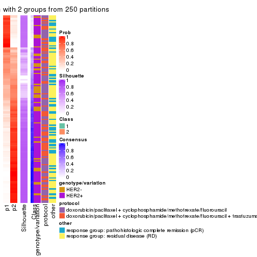</p>

</div>
<div id='tab-SD-pam-consensus-heatmap-2'>
<pre><code class="r">consensus_heatmap(res, k = 3)
</code></pre>

<p>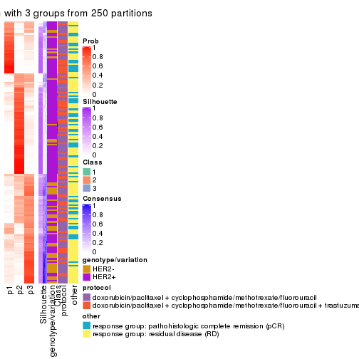</p>

</div>
<div id='tab-SD-pam-consensus-heatmap-3'>
<pre><code class="r">consensus_heatmap(res, k = 4)
</code></pre>

<p>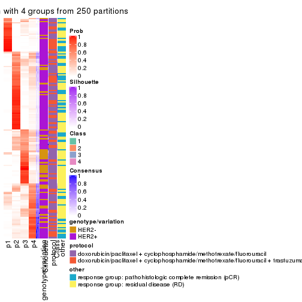</p>

</div>
<div id='tab-SD-pam-consensus-heatmap-4'>
<pre><code class="r">consensus_heatmap(res, k = 5)
</code></pre>

<p>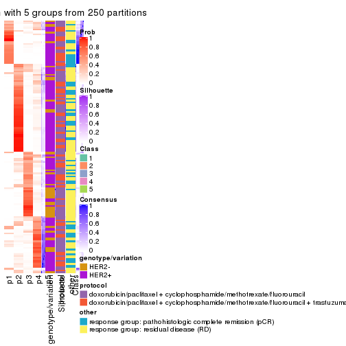</p>

</div>
<div id='tab-SD-pam-consensus-heatmap-5'>
<pre><code class="r">consensus_heatmap(res, k = 6)
</code></pre>

<p>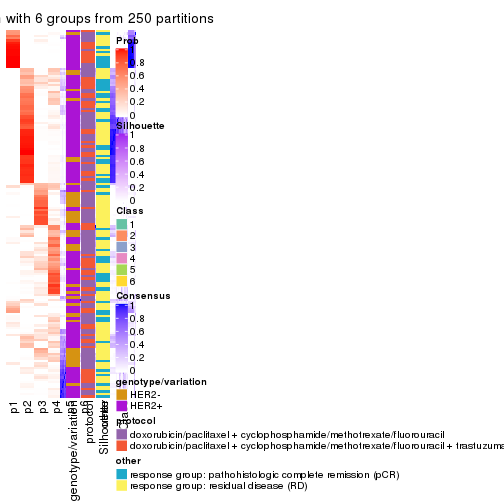</p>

</div>
</div>

Heatmaps for the membership of samples in all partitions to see how consistent they are:


<script>
$( function() {
	$( '#tabs-SD-pam-membership-heatmap' ).tabs();
} );
</script>
<div id='tabs-SD-pam-membership-heatmap'>
<ul>
<li><a href='#tab-SD-pam-membership-heatmap-1'>k = 2</a></li>
<li><a href='#tab-SD-pam-membership-heatmap-2'>k = 3</a></li>
<li><a href='#tab-SD-pam-membership-heatmap-3'>k = 4</a></li>
<li><a href='#tab-SD-pam-membership-heatmap-4'>k = 5</a></li>
<li><a href='#tab-SD-pam-membership-heatmap-5'>k = 6</a></li>
</ul>
<div id='tab-SD-pam-membership-heatmap-1'>
<pre><code class="r">membership_heatmap(res, k = 2)
</code></pre>

<p>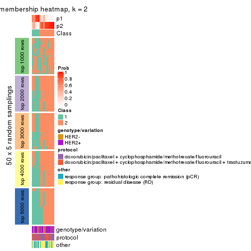</p>

</div>
<div id='tab-SD-pam-membership-heatmap-2'>
<pre><code class="r">membership_heatmap(res, k = 3)
</code></pre>

<p>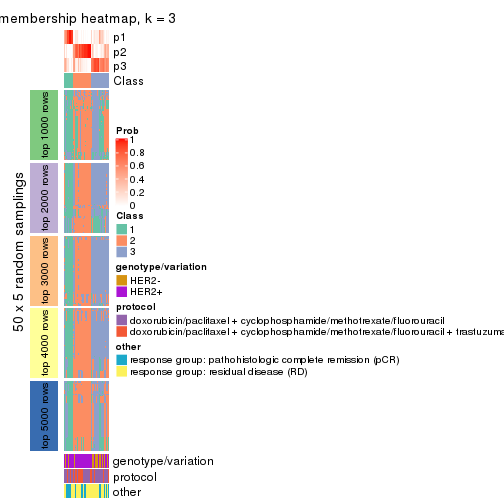</p>

</div>
<div id='tab-SD-pam-membership-heatmap-3'>
<pre><code class="r">membership_heatmap(res, k = 4)
</code></pre>

<p>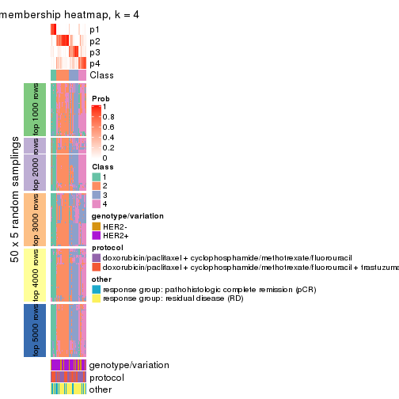</p>

</div>
<div id='tab-SD-pam-membership-heatmap-4'>
<pre><code class="r">membership_heatmap(res, k = 5)
</code></pre>

<p>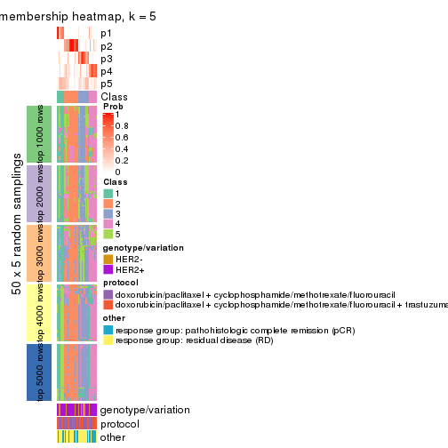</p>

</div>
<div id='tab-SD-pam-membership-heatmap-5'>
<pre><code class="r">membership_heatmap(res, k = 6)
</code></pre>

<p>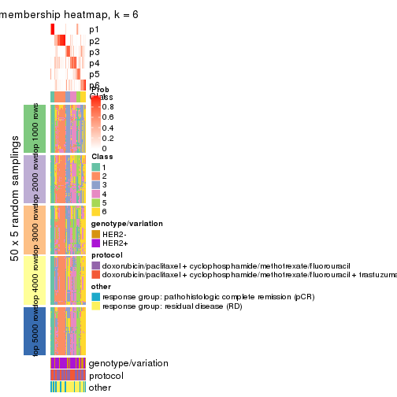</p>

</div>
</div>

As soon as we have had the classes for columns, we can look for signatures
which are significantly different between classes which can be candidate marks
for certain classes. Following are the heatmaps for signatures.


Signature heatmaps where rows are scaled:


<script>
$( function() {
	$( '#tabs-SD-pam-get-signatures' ).tabs();
} );
</script>
<div id='tabs-SD-pam-get-signatures'>
<ul>
<li><a href='#tab-SD-pam-get-signatures-1'>k = 2</a></li>
<li><a href='#tab-SD-pam-get-signatures-2'>k = 3</a></li>
<li><a href='#tab-SD-pam-get-signatures-3'>k = 4</a></li>
<li><a href='#tab-SD-pam-get-signatures-4'>k = 5</a></li>
<li><a href='#tab-SD-pam-get-signatures-5'>k = 6</a></li>
</ul>
<div id='tab-SD-pam-get-signatures-1'>
<pre><code class="r">get_signatures(res, k = 2)
</code></pre>

<pre><code>#&gt; Error: The width or height of the raster image is zero, maybe you forget to turn off the
#&gt; previous graphic device or it was corrupted. Run `dev.off()` to close it.
</code></pre>

<p></p>

</div>
<div id='tab-SD-pam-get-signatures-2'>
<pre><code class="r">get_signatures(res, k = 3)
</code></pre>

<pre><code>#&gt; Error: The width or height of the raster image is zero, maybe you forget to turn off the
#&gt; previous graphic device or it was corrupted. Run `dev.off()` to close it.
</code></pre>

<p></p>

</div>
<div id='tab-SD-pam-get-signatures-3'>
<pre><code class="r">get_signatures(res, k = 4)
</code></pre>

<pre><code>#&gt; Error: The width or height of the raster image is zero, maybe you forget to turn off the
#&gt; previous graphic device or it was corrupted. Run `dev.off()` to close it.
</code></pre>

<p></p>

</div>
<div id='tab-SD-pam-get-signatures-4'>
<pre><code class="r">get_signatures(res, k = 5)
</code></pre>

<pre><code>#&gt; Error: The width or height of the raster image is zero, maybe you forget to turn off the
#&gt; previous graphic device or it was corrupted. Run `dev.off()` to close it.
</code></pre>

<p></p>

</div>
<div id='tab-SD-pam-get-signatures-5'>
<pre><code class="r">get_signatures(res, k = 6)
</code></pre>

<pre><code>#&gt; Error: The width or height of the raster image is zero, maybe you forget to turn off the
#&gt; previous graphic device or it was corrupted. Run `dev.off()` to close it.
</code></pre>

<p></p>

</div>
</div>


Signature heatmaps where rows are not scaled:


<script>
$( function() {
	$( '#tabs-SD-pam-get-signatures-no-scale' ).tabs();
} );
</script>
<div id='tabs-SD-pam-get-signatures-no-scale'>
<ul>
<li><a href='#tab-SD-pam-get-signatures-no-scale-1'>k = 2</a></li>
<li><a href='#tab-SD-pam-get-signatures-no-scale-2'>k = 3</a></li>
<li><a href='#tab-SD-pam-get-signatures-no-scale-3'>k = 4</a></li>
<li><a href='#tab-SD-pam-get-signatures-no-scale-4'>k = 5</a></li>
<li><a href='#tab-SD-pam-get-signatures-no-scale-5'>k = 6</a></li>
</ul>
<div id='tab-SD-pam-get-signatures-no-scale-1'>
<pre><code class="r">get_signatures(res, k = 2, scale_rows = FALSE)
</code></pre>

<pre><code>#&gt; Error: The width or height of the raster image is zero, maybe you forget to turn off the
#&gt; previous graphic device or it was corrupted. Run `dev.off()` to close it.
</code></pre>

<p></p>

</div>
<div id='tab-SD-pam-get-signatures-no-scale-2'>
<pre><code class="r">get_signatures(res, k = 3, scale_rows = FALSE)
</code></pre>

<pre><code>#&gt; Error: The width or height of the raster image is zero, maybe you forget to turn off the
#&gt; previous graphic device or it was corrupted. Run `dev.off()` to close it.
</code></pre>

<p></p>

</div>
<div id='tab-SD-pam-get-signatures-no-scale-3'>
<pre><code class="r">get_signatures(res, k = 4, scale_rows = FALSE)
</code></pre>

<pre><code>#&gt; Error: The width or height of the raster image is zero, maybe you forget to turn off the
#&gt; previous graphic device or it was corrupted. Run `dev.off()` to close it.
</code></pre>

<p></p>

</div>
<div id='tab-SD-pam-get-signatures-no-scale-4'>
<pre><code class="r">get_signatures(res, k = 5, scale_rows = FALSE)
</code></pre>

<pre><code>#&gt; Error: The width or height of the raster image is zero, maybe you forget to turn off the
#&gt; previous graphic device or it was corrupted. Run `dev.off()` to close it.
</code></pre>

<p></p>

</div>
<div id='tab-SD-pam-get-signatures-no-scale-5'>
<pre><code class="r">get_signatures(res, k = 6, scale_rows = FALSE)
</code></pre>

<pre><code>#&gt; Error: The width or height of the raster image is zero, maybe you forget to turn off the
#&gt; previous graphic device or it was corrupted. Run `dev.off()` to close it.
</code></pre>

<p></p>

</div>
</div>


Compare the overlap of signatures from different k:

```r
compare_signatures(res)
```

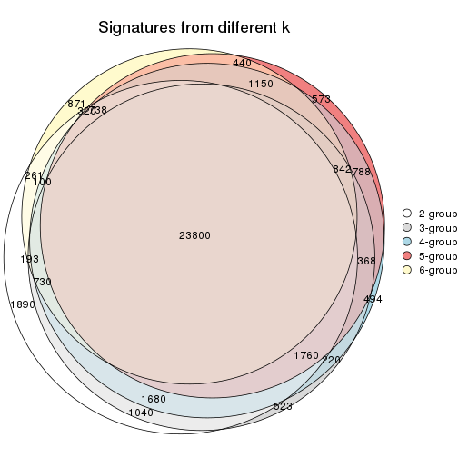

`get_signature()` returns a data frame invisibly. TO get the list of signatures, the function
call should be assigned to a variable explicitly. In following code, if `plot` argument is set
to `FALSE`, no heatmap is plotted while only the differential analysis is performed.

```r
# code only for demonstration
tb = get_signature(res, k = ..., plot = FALSE)
```

An example of the output of `tb` is:

```
#>   which_row         fdr    mean_1    mean_2 scaled_mean_1 scaled_mean_2 km
#> 1        38 0.042760348  8.373488  9.131774    -0.5533452     0.5164555  1
#> 2        40 0.018707592  7.106213  8.469186    -0.6173731     0.5762149  1
#> 3        55 0.019134737 10.221463 11.207825    -0.6159697     0.5749050  1
#> 4        59 0.006059896  5.921854  7.869574    -0.6899429     0.6439467  1
#> 5        60 0.018055526  8.928898 10.211722    -0.6204761     0.5791110  1
#> 6        98 0.009384629 15.714769 14.887706     0.6635654    -0.6193277  2
...
```

The columns in `tb` are:

1. `which_row`: row indices corresponding to the input matrix.
2. `fdr`: FDR for the differential test. 
3. `mean_x`: The mean value in group x.
4. `scaled_mean_x`: The mean value in group x after rows are scaled.
5. `km`: Row groups if k-means clustering is applied to rows.


UMAP plot which shows how samples are separated.


<script>
$( function() {
	$( '#tabs-SD-pam-dimension-reduction' ).tabs();
} );
</script>
<div id='tabs-SD-pam-dimension-reduction'>
<ul>
<li><a href='#tab-SD-pam-dimension-reduction-1'>k = 2</a></li>
<li><a href='#tab-SD-pam-dimension-reduction-2'>k = 3</a></li>
<li><a href='#tab-SD-pam-dimension-reduction-3'>k = 4</a></li>
<li><a href='#tab-SD-pam-dimension-reduction-4'>k = 5</a></li>
<li><a href='#tab-SD-pam-dimension-reduction-5'>k = 6</a></li>
</ul>
<div id='tab-SD-pam-dimension-reduction-1'>
<pre><code class="r">dimension_reduction(res, k = 2, method = &quot;UMAP&quot;)
</code></pre>

<p>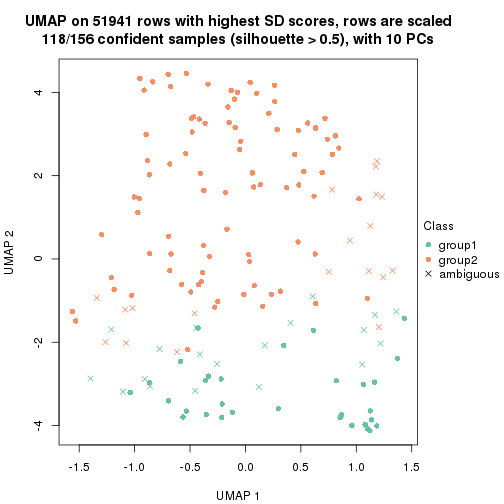</p>

</div>
<div id='tab-SD-pam-dimension-reduction-2'>
<pre><code class="r">dimension_reduction(res, k = 3, method = &quot;UMAP&quot;)
</code></pre>

<p>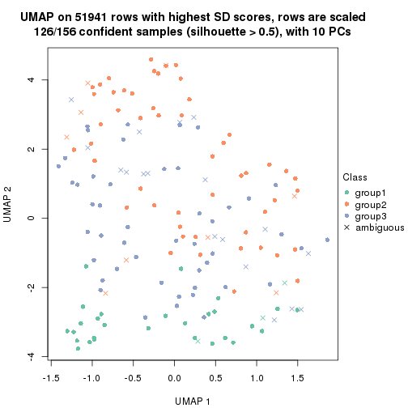</p>

</div>
<div id='tab-SD-pam-dimension-reduction-3'>
<pre><code class="r">dimension_reduction(res, k = 4, method = &quot;UMAP&quot;)
</code></pre>

<p>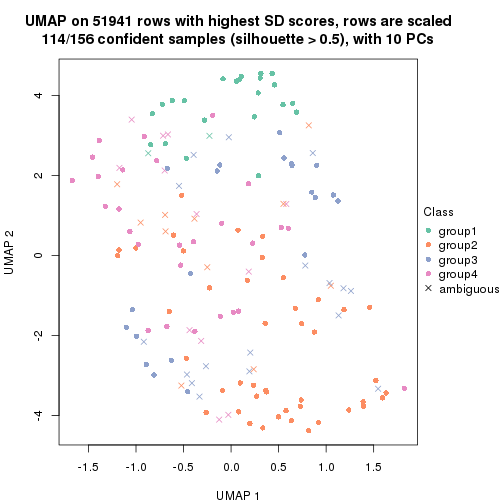</p>

</div>
<div id='tab-SD-pam-dimension-reduction-4'>
<pre><code class="r">dimension_reduction(res, k = 5, method = &quot;UMAP&quot;)
</code></pre>

<p>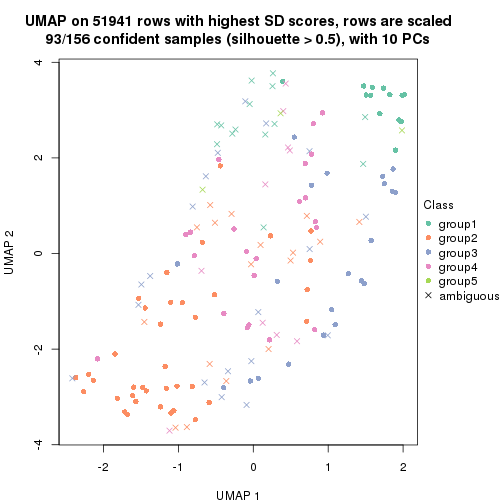</p>

</div>
<div id='tab-SD-pam-dimension-reduction-5'>
<pre><code class="r">dimension_reduction(res, k = 6, method = &quot;UMAP&quot;)
</code></pre>

<p>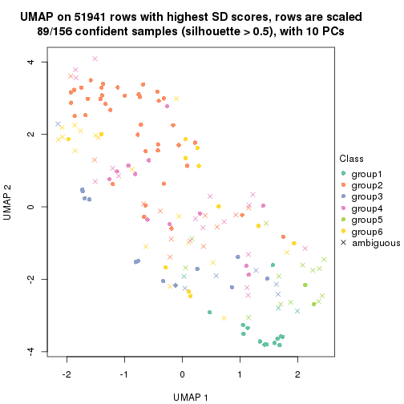</p>

</div>
</div>


Following heatmap shows how subgroups are split when increasing `k`:

```r
collect_classes(res)
```

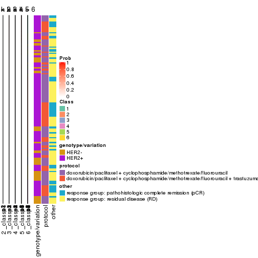


Test correlation between subgroups and known annotations. If the known
annotation is numeric, one-way ANOVA test is applied, and if the known
annotation is discrete, chi-squared contingency table test is applied.

```r
test_to_known_factors(res)
```

```
#>          n genotype/variation(p) protocol(p) other(p) k
#> SD:pam 118              9.19e-01      0.9459   1.0000 2
#> SD:pam 126              8.68e-07      0.3338   0.0630 3
#> SD:pam 114              5.61e-06      0.2370   0.0433 4
#> SD:pam  93              1.62e-07      0.0734   0.0275 5
#> SD:pam  89              2.96e-06      0.1674   0.0539 6
```


If matrix rows can be associated to genes, consider to use `functional_enrichment(res,
...)` to perform function enrichment for the signature genes. See [this vignette](http://bioconductor.org/packages/devel/bioc/vignettes/cola/inst/doc/functional_enrichment.html) for more detailed explanations.


 

---------------------------------------------------


### SD:mclust


The object with results only for a single top-value method and a single partition method 
can be extracted as:

```r
res = res_list["SD", "mclust"]
# you can also extract it by
# res = res_list["SD:mclust"]
```

A summary of `res` and all the functions that can be applied to it:

```r
res
```

```
#> A 'ConsensusPartition' object with k = 2, 3, 4, 5, 6.
#>   On a matrix with 51941 rows and 156 columns.
#>   Top rows (1000, 2000, 3000, 4000, 5000) are extracted by 'SD' method.
#>   Subgroups are detected by 'mclust' method.
#>   Performed in total 1250 partitions by row resampling.
#>   Best k for subgroups seems to be 2.
#> 
#> Following methods can be applied to this 'ConsensusPartition' object:
#>  [1] "cola_report"             "collect_classes"         "collect_plots"          
#>  [4] "collect_stats"           "colnames"                "compare_signatures"     
#>  [7] "consensus_heatmap"       "dimension_reduction"     "functional_enrichment"  
#> [10] "get_anno_col"            "get_anno"                "get_classes"            
#> [13] "get_consensus"           "get_matrix"              "get_membership"         
#> [16] "get_param"               "get_signatures"          "get_stats"              
#> [19] "is_best_k"               "is_stable_k"             "membership_heatmap"     
#> [22] "ncol"                    "nrow"                    "plot_ecdf"              
#> [25] "rownames"                "select_partition_number" "show"                   
#> [28] "suggest_best_k"          "test_to_known_factors"
```

`collect_plots()` function collects all the plots made from `res` for all `k` (number of partitions)
into one single page to provide an easy and fast comparison between different `k`.

```r
collect_plots(res)
```

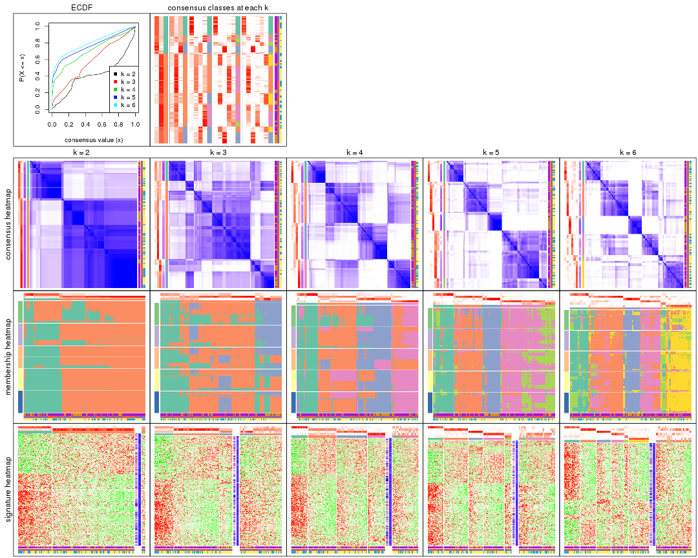

The plots are:

- The first row: a plot of the ECDF (empirical cumulative distribution
  function) curves of the consensus matrix for each `k` and the heatmap of
  predicted classes for each `k`.
- The second row: heatmaps of the consensus matrix for each `k`.
- The third row: heatmaps of the membership matrix for each `k`.
- The fouth row: heatmaps of the signatures for each `k`.

All the plots in panels can be made by individual functions and they are
plotted later in this section.

`select_partition_number()` produces several plots showing different
statistics for choosing "optimized" `k`. There are following statistics:

- ECDF curves of the consensus matrix for each `k`;
- 1-PAC. [The PAC
  score](https://en.wikipedia.org/wiki/Consensus_clustering#Over-interpretation_potential_of_consensus_clustering)
  measures the proportion of the ambiguous subgrouping.
- Mean silhouette score.
- Concordance. The mean probability of fiting the consensus class ids in all
  partitions.
- Area increased. Denote $A_k$ as the area under the ECDF curve for current
  `k`, the area increased is defined as $A_k - A_{k-1}$.
- Rand index. The percent of pairs of samples that are both in a same cluster
  or both are not in a same cluster in the partition of k and k-1.
- Jaccard index. The ratio of pairs of samples are both in a same cluster in
  the partition of k and k-1 and the pairs of samples are both in a same
  cluster in the partition k or k-1.

The detailed explanations of these statistics can be found in [the _cola_
vignette](http://bioconductor.org/packages/devel/bioc/vignettes/cola/inst/doc/cola.html#toc_13).

Generally speaking, lower PAC score, higher mean silhouette score or higher
concordance corresponds to better partition. Rand index and Jaccard index
measure how similar the current partition is compared to partition with `k-1`.
If they are too similar, we won't accept `k` is better than `k-1`.

```r
select_partition_number(res)
```

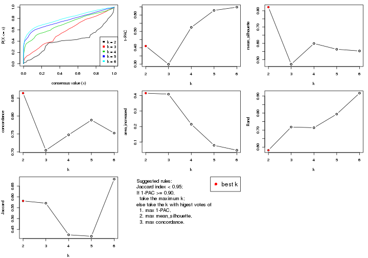

The numeric values for all these statistics can be obtained by `get_stats()`.

```r
get_stats(res)
```

```
#>   k 1-PAC mean_silhouette concordance area_increased  Rand Jaccard
#> 2 2 0.410           0.822       0.864         0.4152 0.581   0.581
#> 3 3 0.299           0.472       0.705         0.4087 0.718   0.571
#> 4 4 0.524           0.599       0.748         0.2148 0.714   0.425
#> 5 5 0.628           0.564       0.789         0.0789 0.794   0.418
#> 6 6 0.648           0.553       0.753         0.0472 0.917   0.682
```

`suggest_best_k()` suggests the best $k$ based on these statistics. The rules are as follows:

- All $k$ with Jaccard index larger than 0.95 are removed because increasing
  $k$ does not provide enough extra information. If all $k$ are removed, it is
  marked as no subgroup is detected.
- For all $k$ with 1-PAC score larger than 0.9, the maximal $k$ is taken as
  the best $k$, and other $k$ are marked as optional $k$.
- If it does not fit the second rule. The $k$ with the maximal vote of the
  highest 1-PAC score, highest mean silhouette, and highest concordance is
  taken as the best $k$.

```r
suggest_best_k(res)
```

```
#> [1] 2
```


Following shows the table of the partitions (You need to click the **show/hide
code output** link to see it). The membership matrix (columns with name `p*`)
is inferred by
[`clue::cl_consensus()`](https://www.rdocumentation.org/link/cl_consensus?package=clue)
function with the `SE` method. Basically the value in the membership matrix
represents the probability to belong to a certain group. The finall class
label for an item is determined with the group with highest probability it
belongs to.

In `get_classes()` function, the entropy is calculated from the membership
matrix and the silhouette score is calculated from the consensus matrix.


<script>
$( function() {
	$( '#tabs-SD-mclust-get-classes' ).tabs();
} );
</script>
<div id='tabs-SD-mclust-get-classes'>
<ul>
<li><a href='#tab-SD-mclust-get-classes-1'>k = 2</a></li>
<li><a href='#tab-SD-mclust-get-classes-2'>k = 3</a></li>
<li><a href='#tab-SD-mclust-get-classes-3'>k = 4</a></li>
<li><a href='#tab-SD-mclust-get-classes-4'>k = 5</a></li>
<li><a href='#tab-SD-mclust-get-classes-5'>k = 6</a></li>
</ul>

<div id='tab-SD-mclust-get-classes-1'>
<p><a id='tab-SD-mclust-get-classes-1-a' style='color:#0366d6' href='#'>show/hide code output</a></p>
<pre><code class="r">cbind(get_classes(res, k = 2), get_membership(res, k = 2))
</code></pre>

<pre><code>#&gt;            class entropy silhouette    p1    p2
#&gt; GSM1232995     2  0.5294     0.8626 0.120 0.880
#&gt; GSM1233002     2  0.1414     0.8727 0.020 0.980
#&gt; GSM1233003     1  0.7602     0.8919 0.780 0.220
#&gt; GSM1233014     2  0.1414     0.8727 0.020 0.980
#&gt; GSM1233015     2  0.9635    -0.0276 0.388 0.612
#&gt; GSM1233016     2  0.2778     0.8717 0.048 0.952
#&gt; GSM1233024     2  0.1414     0.8727 0.020 0.980
#&gt; GSM1233049     1  0.6148     0.8624 0.848 0.152
#&gt; GSM1233064     2  0.4690     0.8694 0.100 0.900
#&gt; GSM1233068     2  0.2948     0.8708 0.052 0.948
#&gt; GSM1233073     2  0.1414     0.8727 0.020 0.980
#&gt; GSM1233093     1  0.7528     0.8939 0.784 0.216
#&gt; GSM1233115     1  0.7602     0.8919 0.780 0.220
#&gt; GSM1232992     2  0.1633     0.8784 0.024 0.976
#&gt; GSM1232993     2  0.1414     0.8727 0.020 0.980
#&gt; GSM1233005     2  0.3584     0.8769 0.068 0.932
#&gt; GSM1233007     2  0.3584     0.8759 0.068 0.932
#&gt; GSM1233010     2  0.1414     0.8727 0.020 0.980
#&gt; GSM1233013     2  0.2778     0.8774 0.048 0.952
#&gt; GSM1233018     2  0.3733     0.8754 0.072 0.928
#&gt; GSM1233019     2  0.1414     0.8727 0.020 0.980
#&gt; GSM1233021     2  0.1633     0.8784 0.024 0.976
#&gt; GSM1233025     2  0.1843     0.8734 0.028 0.972
#&gt; GSM1233029     2  0.0938     0.8762 0.012 0.988
#&gt; GSM1233030     2  0.1414     0.8784 0.020 0.980
#&gt; GSM1233031     2  0.1414     0.8727 0.020 0.980
#&gt; GSM1233032     1  0.4939     0.8291 0.892 0.108
#&gt; GSM1233035     2  0.1414     0.8727 0.020 0.980
#&gt; GSM1233038     1  0.7745     0.8874 0.772 0.228
#&gt; GSM1233039     2  0.4431     0.8717 0.092 0.908
#&gt; GSM1233042     2  0.1414     0.8727 0.020 0.980
#&gt; GSM1233043     2  0.1414     0.8727 0.020 0.980
#&gt; GSM1233044     2  0.4690     0.8754 0.100 0.900
#&gt; GSM1233046     2  0.2043     0.8732 0.032 0.968
#&gt; GSM1233051     1  0.7745     0.8835 0.772 0.228
#&gt; GSM1233054     2  0.6712     0.8334 0.176 0.824
#&gt; GSM1233057     2  0.6531     0.8376 0.168 0.832
#&gt; GSM1233060     2  0.1414     0.8727 0.020 0.980
#&gt; GSM1233062     2  0.1414     0.8727 0.020 0.980
#&gt; GSM1233075     2  0.7883     0.7901 0.236 0.764
#&gt; GSM1233078     2  0.8081     0.7801 0.248 0.752
#&gt; GSM1233079     1  0.4562     0.8095 0.904 0.096
#&gt; GSM1233082     2  0.9833    -0.0742 0.424 0.576
#&gt; GSM1233083     1  0.7528     0.8939 0.784 0.216
#&gt; GSM1233091     2  0.3114     0.8766 0.056 0.944
#&gt; GSM1233095     1  0.7528     0.8939 0.784 0.216
#&gt; GSM1233096     1  0.7950     0.8790 0.760 0.240
#&gt; GSM1233101     1  0.7453     0.8928 0.788 0.212
#&gt; GSM1233105     1  0.8267     0.8699 0.740 0.260
#&gt; GSM1233117     2  0.5059     0.8656 0.112 0.888
#&gt; GSM1233118     2  0.6712     0.8334 0.176 0.824
#&gt; GSM1233001     2  0.6623     0.8355 0.172 0.828
#&gt; GSM1233006     2  0.1414     0.8727 0.020 0.980
#&gt; GSM1233008     2  0.4815     0.8682 0.104 0.896
#&gt; GSM1233009     2  0.0672     0.8758 0.008 0.992
#&gt; GSM1233017     2  0.1414     0.8727 0.020 0.980
#&gt; GSM1233020     2  0.4815     0.8682 0.104 0.896
#&gt; GSM1233022     2  0.1414     0.8727 0.020 0.980
#&gt; GSM1233026     2  0.2778     0.8719 0.048 0.952
#&gt; GSM1233028     2  0.1633     0.8726 0.024 0.976
#&gt; GSM1233034     2  0.3114     0.8766 0.056 0.944
#&gt; GSM1233040     1  0.6343     0.8671 0.840 0.160
#&gt; GSM1233048     1  0.7528     0.8939 0.784 0.216
#&gt; GSM1233056     1  0.7528     0.8939 0.784 0.216
#&gt; GSM1233058     2  0.1414     0.8727 0.020 0.980
#&gt; GSM1233059     1  0.7528     0.8939 0.784 0.216
#&gt; GSM1233066     2  0.8081     0.7801 0.248 0.752
#&gt; GSM1233071     2  0.1414     0.8727 0.020 0.980
#&gt; GSM1233074     2  0.7056     0.8231 0.192 0.808
#&gt; GSM1233076     2  0.4562     0.8708 0.096 0.904
#&gt; GSM1233080     1  0.7528     0.8939 0.784 0.216
#&gt; GSM1233088     2  0.5294     0.8636 0.120 0.880
#&gt; GSM1233090     1  0.7528     0.8939 0.784 0.216
#&gt; GSM1233092     2  0.1414     0.8727 0.020 0.980
#&gt; GSM1233094     2  0.1414     0.8727 0.020 0.980
#&gt; GSM1233097     2  0.1414     0.8727 0.020 0.980
#&gt; GSM1233100     2  0.1414     0.8727 0.020 0.980
#&gt; GSM1233104     2  0.1414     0.8727 0.020 0.980
#&gt; GSM1233106     2  0.9850    -0.0925 0.428 0.572
#&gt; GSM1233111     1  0.7528     0.8939 0.784 0.216
#&gt; GSM1233122     2  0.3114     0.8771 0.056 0.944
#&gt; GSM1233146     2  0.1414     0.8727 0.020 0.980
#&gt; GSM1232994     2  0.2778     0.8719 0.048 0.952
#&gt; GSM1232996     2  0.4815     0.8682 0.104 0.896
#&gt; GSM1232997     2  0.6973     0.8259 0.188 0.812
#&gt; GSM1232998     2  0.1414     0.8727 0.020 0.980
#&gt; GSM1232999     2  0.1414     0.8727 0.020 0.980
#&gt; GSM1233000     2  0.1414     0.8727 0.020 0.980
#&gt; GSM1233004     2  0.5842     0.8541 0.140 0.860
#&gt; GSM1233011     2  0.5408     0.8609 0.124 0.876
#&gt; GSM1233012     2  0.6623     0.8355 0.172 0.828
#&gt; GSM1233023     2  0.6623     0.8355 0.172 0.828
#&gt; GSM1233027     2  0.1414     0.8727 0.020 0.980
#&gt; GSM1233033     1  0.8016     0.8758 0.756 0.244
#&gt; GSM1233036     2  0.6531     0.8376 0.168 0.832
#&gt; GSM1233037     2  0.5178     0.8638 0.116 0.884
#&gt; GSM1233041     1  0.7528     0.8939 0.784 0.216
#&gt; GSM1233045     2  0.1414     0.8727 0.020 0.980
#&gt; GSM1233047     1  0.7528     0.6452 0.784 0.216
#&gt; GSM1233050     1  0.7528     0.8939 0.784 0.216
#&gt; GSM1233052     1  0.9635     0.7001 0.612 0.388
#&gt; GSM1233053     1  0.4562     0.8095 0.904 0.096
#&gt; GSM1233055     1  0.7528     0.8939 0.784 0.216
#&gt; GSM1233061     2  0.8081     0.7801 0.248 0.752
#&gt; GSM1233063     1  0.7528     0.8939 0.784 0.216
#&gt; GSM1233065     2  0.7376     0.8119 0.208 0.792
#&gt; GSM1233070     2  0.1843     0.8735 0.028 0.972
#&gt; GSM1233077     2  0.8081     0.7801 0.248 0.752
#&gt; GSM1233081     1  0.1414     0.7534 0.980 0.020
#&gt; GSM1233084     1  0.7528     0.8939 0.784 0.216
#&gt; GSM1233087     2  0.5059     0.8022 0.112 0.888
#&gt; GSM1233089     2  0.4815     0.8682 0.104 0.896
#&gt; GSM1233099     2  0.1414     0.8727 0.020 0.980
#&gt; GSM1233112     1  0.7528     0.8939 0.784 0.216
#&gt; GSM1233085     1  0.1414     0.7534 0.980 0.020
#&gt; GSM1233098     2  0.4431     0.8718 0.092 0.908
#&gt; GSM1233114     1  0.7528     0.8939 0.784 0.216
#&gt; GSM1233119     2  0.1414     0.8727 0.020 0.980
#&gt; GSM1233129     2  0.6712     0.8333 0.176 0.824
#&gt; GSM1233132     1  0.8016     0.8758 0.756 0.244
#&gt; GSM1233139     2  0.3274     0.8766 0.060 0.940
#&gt; GSM1233143     2  0.6887     0.8286 0.184 0.816
#&gt; GSM1233145     1  0.7745     0.8874 0.772 0.228
#&gt; GSM1233067     2  0.8081     0.7801 0.248 0.752
#&gt; GSM1233069     2  0.8081     0.7801 0.248 0.752
#&gt; GSM1233072     2  0.4815     0.8682 0.104 0.896
#&gt; GSM1233086     2  0.7674     0.8001 0.224 0.776
#&gt; GSM1233102     1  0.8081     0.8752 0.752 0.248
#&gt; GSM1233103     2  0.2603     0.8723 0.044 0.956
#&gt; GSM1233107     2  0.1414     0.8727 0.020 0.980
#&gt; GSM1233108     1  0.1414     0.7534 0.980 0.020
#&gt; GSM1233109     1  0.6247     0.6613 0.844 0.156
#&gt; GSM1233110     2  0.8081     0.7801 0.248 0.752
#&gt; GSM1233113     2  0.8016     0.7835 0.244 0.756
#&gt; GSM1233116     2  0.8081     0.7801 0.248 0.752
#&gt; GSM1233120     1  0.8016     0.8758 0.756 0.244
#&gt; GSM1233121     2  0.8081     0.7801 0.248 0.752
#&gt; GSM1233123     2  0.8081     0.7801 0.248 0.752
#&gt; GSM1233124     2  0.8081     0.7801 0.248 0.752
#&gt; GSM1233125     1  0.1414     0.7534 0.980 0.020
#&gt; GSM1233126     2  0.1414     0.8727 0.020 0.980
#&gt; GSM1233127     2  0.1633     0.8726 0.024 0.976
#&gt; GSM1233128     1  0.7528     0.8939 0.784 0.216
#&gt; GSM1233130     2  0.8081     0.7801 0.248 0.752
#&gt; GSM1233131     1  0.8861     0.8277 0.696 0.304
#&gt; GSM1233133     1  0.2236     0.7508 0.964 0.036
#&gt; GSM1233134     2  0.8081     0.7801 0.248 0.752
#&gt; GSM1233135     2  0.8081     0.7801 0.248 0.752
#&gt; GSM1233136     2  0.8081     0.7801 0.248 0.752
#&gt; GSM1233137     1  0.9710     0.0284 0.600 0.400
#&gt; GSM1233138     2  0.1414     0.8727 0.020 0.980
#&gt; GSM1233140     1  0.5059     0.8038 0.888 0.112
#&gt; GSM1233141     2  0.4431     0.8749 0.092 0.908
#&gt; GSM1233142     2  0.1843     0.8765 0.028 0.972
#&gt; GSM1233144     1  0.9881    -0.1169 0.564 0.436
#&gt; GSM1233147     2  0.4690     0.8739 0.100 0.900
</code></pre>

<script>
$('#tab-SD-mclust-get-classes-1-a').parent().next().next().hide();
$('#tab-SD-mclust-get-classes-1-a').click(function(){
  $('#tab-SD-mclust-get-classes-1-a').parent().next().next().toggle();
  return(false);
});
</script>
</div>

<div id='tab-SD-mclust-get-classes-2'>
<p><a id='tab-SD-mclust-get-classes-2-a' style='color:#0366d6' href='#'>show/hide code output</a></p>
<pre><code class="r">cbind(get_classes(res, k = 3), get_membership(res, k = 3))
</code></pre>

<pre><code>#&gt;            class entropy silhouette    p1    p2    p3
#&gt; GSM1232995     2  0.6174   0.524142 0.168 0.768 0.064
#&gt; GSM1233002     2  0.5926   0.484508 0.356 0.644 0.000
#&gt; GSM1233003     1  0.9812   0.772680 0.412 0.248 0.340
#&gt; GSM1233014     2  0.3192   0.642253 0.112 0.888 0.000
#&gt; GSM1233015     2  0.9329  -0.241006 0.180 0.488 0.332
#&gt; GSM1233016     2  0.6126   0.468568 0.400 0.600 0.000
#&gt; GSM1233024     2  0.0892   0.665559 0.020 0.980 0.000
#&gt; GSM1233049     1  0.7169   0.765431 0.568 0.028 0.404
#&gt; GSM1233064     2  0.5688   0.547241 0.168 0.788 0.044
#&gt; GSM1233068     2  0.3966   0.644190 0.100 0.876 0.024
#&gt; GSM1233073     2  0.6215   0.450872 0.428 0.572 0.000
#&gt; GSM1233093     1  0.9243   0.892853 0.492 0.168 0.340
#&gt; GSM1233115     1  0.9281   0.828774 0.488 0.172 0.340
#&gt; GSM1232992     2  0.1964   0.658865 0.056 0.944 0.000
#&gt; GSM1232993     2  0.0424   0.667044 0.008 0.992 0.000
#&gt; GSM1233005     2  0.1964   0.659665 0.056 0.944 0.000
#&gt; GSM1233007     2  0.4110   0.619637 0.152 0.844 0.004
#&gt; GSM1233010     2  0.6008   0.479330 0.372 0.628 0.000
#&gt; GSM1233013     2  0.1964   0.658891 0.056 0.944 0.000
#&gt; GSM1233018     2  0.2356   0.654081 0.072 0.928 0.000
#&gt; GSM1233019     2  0.1031   0.665954 0.024 0.976 0.000
#&gt; GSM1233021     2  0.1163   0.667175 0.028 0.972 0.000
#&gt; GSM1233025     2  0.6442   0.452159 0.432 0.564 0.004
#&gt; GSM1233029     2  0.1031   0.665433 0.024 0.976 0.000
#&gt; GSM1233030     2  0.0747   0.666996 0.016 0.984 0.000
#&gt; GSM1233031     2  0.0747   0.668042 0.016 0.984 0.000
#&gt; GSM1233032     3  0.6906  -0.251056 0.324 0.032 0.644
#&gt; GSM1233035     2  0.1453   0.667795 0.008 0.968 0.024
#&gt; GSM1233038     1  0.9579   0.706428 0.452 0.208 0.340
#&gt; GSM1233039     2  0.4465   0.596892 0.176 0.820 0.004
#&gt; GSM1233042     2  0.6215   0.450872 0.428 0.572 0.000
#&gt; GSM1233043     2  0.6126   0.481526 0.400 0.600 0.000
#&gt; GSM1233044     2  0.7759   0.508298 0.180 0.676 0.144
#&gt; GSM1233046     2  0.6601   0.278277 0.028 0.676 0.296
#&gt; GSM1233051     1  0.9162   0.829042 0.500 0.160 0.340
#&gt; GSM1233054     3  0.9734   0.404100 0.224 0.376 0.400
#&gt; GSM1233057     2  0.9425  -0.346489 0.176 0.432 0.392
#&gt; GSM1233060     2  0.0592   0.667456 0.012 0.988 0.000
#&gt; GSM1233062     2  0.0592   0.667012 0.012 0.988 0.000
#&gt; GSM1233075     3  0.6510   0.587417 0.012 0.364 0.624
#&gt; GSM1233078     3  0.6129   0.610140 0.008 0.324 0.668
#&gt; GSM1233079     3  0.6541  -0.186197 0.304 0.024 0.672
#&gt; GSM1233082     2  0.8288   0.047145 0.096 0.572 0.332
#&gt; GSM1233083     1  0.8173   0.820279 0.552 0.080 0.368
#&gt; GSM1233091     2  0.4465   0.596892 0.176 0.820 0.004
#&gt; GSM1233095     1  0.8683   0.882789 0.540 0.120 0.340
#&gt; GSM1233096     1  0.9550   0.863396 0.456 0.204 0.340
#&gt; GSM1233101     1  0.8261   0.850592 0.568 0.092 0.340
#&gt; GSM1233105     2  0.8288   0.020178 0.096 0.572 0.332
#&gt; GSM1233117     2  0.4749   0.589849 0.172 0.816 0.012
#&gt; GSM1233118     2  0.9317  -0.315275 0.164 0.448 0.388
#&gt; GSM1233001     2  0.9243  -0.198771 0.168 0.492 0.340
#&gt; GSM1233006     2  0.2959   0.643177 0.100 0.900 0.000
#&gt; GSM1233008     2  0.2711   0.646819 0.088 0.912 0.000
#&gt; GSM1233009     2  0.0829   0.666538 0.012 0.984 0.004
#&gt; GSM1233017     2  0.0237   0.666690 0.004 0.996 0.000
#&gt; GSM1233020     2  0.4062   0.596537 0.164 0.836 0.000
#&gt; GSM1233022     2  0.2537   0.649896 0.080 0.920 0.000
#&gt; GSM1233026     2  0.5902   0.555942 0.316 0.680 0.004
#&gt; GSM1233028     2  0.2066   0.666428 0.060 0.940 0.000
#&gt; GSM1233034     2  0.3752   0.614112 0.144 0.856 0.000
#&gt; GSM1233040     1  0.8043   0.834150 0.556 0.072 0.372
#&gt; GSM1233048     1  0.9457   0.871607 0.468 0.192 0.340
#&gt; GSM1233056     1  0.8261   0.874528 0.568 0.092 0.340
#&gt; GSM1233058     2  0.6079   0.475041 0.388 0.612 0.000
#&gt; GSM1233059     1  0.9243   0.892853 0.492 0.168 0.340
#&gt; GSM1233066     3  0.8716   0.534678 0.120 0.348 0.532
#&gt; GSM1233071     2  0.0237   0.666376 0.000 0.996 0.004
#&gt; GSM1233074     3  0.8754   0.497157 0.116 0.376 0.508
#&gt; GSM1233076     2  0.4521   0.601789 0.180 0.816 0.004
#&gt; GSM1233080     1  0.9032   0.894353 0.512 0.148 0.340
#&gt; GSM1233088     2  0.8792   0.092293 0.176 0.580 0.244
#&gt; GSM1233090     1  0.8683   0.882508 0.540 0.120 0.340
#&gt; GSM1233092     2  0.3267   0.641717 0.116 0.884 0.000
#&gt; GSM1233094     2  0.6215   0.450872 0.428 0.572 0.000
#&gt; GSM1233097     2  0.6225   0.451216 0.432 0.568 0.000
#&gt; GSM1233100     2  0.5882   0.493338 0.348 0.652 0.000
#&gt; GSM1233104     2  0.5016   0.595622 0.240 0.760 0.000
#&gt; GSM1233106     2  0.9306  -0.221071 0.176 0.488 0.336
#&gt; GSM1233111     1  0.9203   0.894578 0.496 0.164 0.340
#&gt; GSM1233122     2  0.2261   0.653017 0.068 0.932 0.000
#&gt; GSM1233146     2  0.6026   0.476828 0.376 0.624 0.000
#&gt; GSM1232994     2  0.0892   0.665098 0.020 0.980 0.000
#&gt; GSM1232996     2  0.2959   0.643345 0.100 0.900 0.000
#&gt; GSM1232997     2  0.9302  -0.381213 0.160 0.424 0.416
#&gt; GSM1232998     2  0.3116   0.642237 0.108 0.892 0.000
#&gt; GSM1232999     2  0.2261   0.652397 0.068 0.932 0.000
#&gt; GSM1233000     2  0.0237   0.666690 0.004 0.996 0.000
#&gt; GSM1233004     3  0.8638  -0.172714 0.184 0.216 0.600
#&gt; GSM1233011     2  0.6318   0.528684 0.172 0.760 0.068
#&gt; GSM1233012     2  0.9167  -0.144433 0.168 0.512 0.320
#&gt; GSM1233023     2  0.9256  -0.210075 0.168 0.488 0.344
#&gt; GSM1233027     2  0.2356   0.651405 0.072 0.928 0.000
#&gt; GSM1233033     2  0.9967  -0.662267 0.296 0.364 0.340
#&gt; GSM1233036     2  0.8907  -0.000332 0.168 0.560 0.272
#&gt; GSM1233037     2  0.9702  -0.287895 0.232 0.440 0.328
#&gt; GSM1233041     1  0.9243   0.892853 0.492 0.168 0.340
#&gt; GSM1233045     2  0.5621   0.544855 0.308 0.692 0.000
#&gt; GSM1233047     3  0.5803   0.075957 0.212 0.028 0.760
#&gt; GSM1233050     1  0.8790   0.887879 0.532 0.128 0.340
#&gt; GSM1233052     2  0.7001   0.101807 0.032 0.628 0.340
#&gt; GSM1233053     3  0.6819  -0.253341 0.328 0.028 0.644
#&gt; GSM1233055     1  0.9077   0.856049 0.508 0.152 0.340
#&gt; GSM1233061     3  0.8836   0.523533 0.128 0.352 0.520
#&gt; GSM1233063     1  0.9203   0.894578 0.496 0.164 0.340
#&gt; GSM1233065     3  0.9149   0.397957 0.144 0.416 0.440
#&gt; GSM1233070     2  0.0237   0.666904 0.004 0.996 0.000
#&gt; GSM1233077     3  0.5810   0.611360 0.000 0.336 0.664
#&gt; GSM1233081     3  0.2448   0.281966 0.076 0.000 0.924
#&gt; GSM1233084     1  0.9203   0.895188 0.496 0.164 0.340
#&gt; GSM1233087     2  0.8994   0.263330 0.184 0.556 0.260
#&gt; GSM1233089     2  0.4062   0.596537 0.164 0.836 0.000
#&gt; GSM1233099     2  0.7203   0.435763 0.416 0.556 0.028
#&gt; GSM1233112     1  0.8213   0.855530 0.568 0.088 0.344
#&gt; GSM1233085     3  0.2165   0.291444 0.064 0.000 0.936
#&gt; GSM1233098     2  0.4062   0.596537 0.164 0.836 0.000
#&gt; GSM1233114     1  0.9579   0.830367 0.452 0.208 0.340
#&gt; GSM1233119     2  0.5835   0.545447 0.340 0.660 0.000
#&gt; GSM1233129     2  0.9282  -0.263790 0.164 0.468 0.368
#&gt; GSM1233132     2  0.9752  -0.456299 0.236 0.424 0.340
#&gt; GSM1233139     2  0.2400   0.654126 0.064 0.932 0.004
#&gt; GSM1233143     2  0.9331  -0.210958 0.176 0.480 0.344
#&gt; GSM1233145     3  0.9999  -0.582200 0.332 0.328 0.340
#&gt; GSM1233067     3  0.6404   0.605320 0.012 0.344 0.644
#&gt; GSM1233069     3  0.5810   0.611360 0.000 0.336 0.664
#&gt; GSM1233072     2  0.4062   0.596537 0.164 0.836 0.000
#&gt; GSM1233086     2  0.9046  -0.137123 0.152 0.516 0.332
#&gt; GSM1233102     2  0.9268  -0.049915 0.172 0.492 0.336
#&gt; GSM1233103     2  0.1878   0.665506 0.044 0.952 0.004
#&gt; GSM1233107     2  0.2400   0.663877 0.064 0.932 0.004
#&gt; GSM1233108     3  0.1643   0.291600 0.044 0.000 0.956
#&gt; GSM1233109     3  0.1129   0.330895 0.020 0.004 0.976
#&gt; GSM1233110     3  0.5810   0.611360 0.000 0.336 0.664
#&gt; GSM1233113     3  0.6651   0.606130 0.020 0.340 0.640
#&gt; GSM1233116     3  0.6566   0.598749 0.016 0.348 0.636
#&gt; GSM1233120     2  0.9399  -0.085928 0.188 0.480 0.332
#&gt; GSM1233121     3  0.5810   0.611360 0.000 0.336 0.664
#&gt; GSM1233123     3  0.5810   0.611360 0.000 0.336 0.664
#&gt; GSM1233124     3  0.7724   0.573002 0.060 0.352 0.588
#&gt; GSM1233125     3  0.1643   0.291600 0.044 0.000 0.956
#&gt; GSM1233126     2  0.5058   0.597439 0.244 0.756 0.000
#&gt; GSM1233127     2  0.1529   0.663555 0.040 0.960 0.000
#&gt; GSM1233128     1  0.8261   0.855113 0.568 0.092 0.340
#&gt; GSM1233130     3  0.6008   0.610402 0.004 0.332 0.664
#&gt; GSM1233131     2  0.8013   0.004341 0.080 0.588 0.332
#&gt; GSM1233133     3  0.0983   0.335184 0.016 0.004 0.980
#&gt; GSM1233134     3  0.5810   0.611360 0.000 0.336 0.664
#&gt; GSM1233135     3  0.5810   0.611360 0.000 0.336 0.664
#&gt; GSM1233136     3  0.5810   0.611360 0.000 0.336 0.664
#&gt; GSM1233137     3  0.0661   0.342703 0.008 0.004 0.988
#&gt; GSM1233138     2  0.4121   0.628029 0.168 0.832 0.000
#&gt; GSM1233140     3  0.6539  -0.138507 0.288 0.028 0.684
#&gt; GSM1233141     2  0.4178   0.616482 0.172 0.828 0.000
#&gt; GSM1233142     2  0.1031   0.668203 0.024 0.976 0.000
#&gt; GSM1233144     3  0.0237   0.350116 0.000 0.004 0.996
#&gt; GSM1233147     2  0.4978   0.602710 0.216 0.780 0.004
</code></pre>

<script>
$('#tab-SD-mclust-get-classes-2-a').parent().next().next().hide();
$('#tab-SD-mclust-get-classes-2-a').click(function(){
  $('#tab-SD-mclust-get-classes-2-a').parent().next().next().toggle();
  return(false);
});
</script>
</div>

<div id='tab-SD-mclust-get-classes-3'>
<p><a id='tab-SD-mclust-get-classes-3-a' style='color:#0366d6' href='#'>show/hide code output</a></p>
<pre><code class="r">cbind(get_classes(res, k = 4), get_membership(res, k = 4))
</code></pre>

<pre><code>#&gt;            class entropy silhouette    p1    p2    p3    p4
#&gt; GSM1232995     2  0.7024     0.4292 0.128 0.512 0.360 0.000
#&gt; GSM1233002     4  0.4713     0.4292 0.000 0.360 0.000 0.640
#&gt; GSM1233003     1  0.4134     0.6745 0.740 0.000 0.000 0.260
#&gt; GSM1233014     4  0.0895     0.7592 0.000 0.020 0.004 0.976
#&gt; GSM1233015     2  0.7968     0.4907 0.280 0.416 0.004 0.300
#&gt; GSM1233016     4  0.2101     0.7469 0.012 0.060 0.000 0.928
#&gt; GSM1233024     2  0.4564     0.5893 0.000 0.672 0.000 0.328
#&gt; GSM1233049     1  0.1022     0.8162 0.968 0.000 0.032 0.000
#&gt; GSM1233064     2  0.6951     0.4904 0.132 0.544 0.324 0.000
#&gt; GSM1233068     2  0.8048     0.6205 0.148 0.536 0.048 0.268
#&gt; GSM1233073     4  0.1389     0.7584 0.000 0.048 0.000 0.952
#&gt; GSM1233093     1  0.0000     0.8332 1.000 0.000 0.000 0.000
#&gt; GSM1233115     1  0.0707     0.8259 0.980 0.020 0.000 0.000
#&gt; GSM1232992     2  0.5668     0.6492 0.048 0.652 0.000 0.300
#&gt; GSM1232993     2  0.4608     0.6231 0.000 0.692 0.004 0.304
#&gt; GSM1233005     2  0.5157     0.6373 0.016 0.676 0.004 0.304
#&gt; GSM1233007     2  0.8068     0.5277 0.088 0.552 0.264 0.096
#&gt; GSM1233010     4  0.4643     0.4640 0.000 0.344 0.000 0.656
#&gt; GSM1233013     2  0.5883     0.6500 0.060 0.640 0.000 0.300
#&gt; GSM1233018     2  0.6937     0.6361 0.124 0.572 0.004 0.300
#&gt; GSM1233019     2  0.4454     0.6165 0.000 0.692 0.000 0.308
#&gt; GSM1233021     2  0.4584     0.6290 0.004 0.696 0.000 0.300
#&gt; GSM1233025     4  0.0188     0.7540 0.000 0.004 0.000 0.996
#&gt; GSM1233029     2  0.4406     0.6249 0.000 0.700 0.000 0.300
#&gt; GSM1233030     2  0.4406     0.6249 0.000 0.700 0.000 0.300
#&gt; GSM1233031     2  0.5661     0.3185 0.008 0.544 0.012 0.436
#&gt; GSM1233032     1  0.4730     0.1914 0.636 0.000 0.364 0.000
#&gt; GSM1233035     2  0.5304     0.6247 0.012 0.672 0.012 0.304
#&gt; GSM1233038     4  0.0817     0.7490 0.024 0.000 0.000 0.976
#&gt; GSM1233039     2  0.7164     0.4727 0.156 0.524 0.320 0.000
#&gt; GSM1233042     4  0.2469     0.7366 0.000 0.108 0.000 0.892
#&gt; GSM1233043     4  0.3311     0.6840 0.000 0.172 0.000 0.828
#&gt; GSM1233044     2  0.7129     0.4340 0.140 0.504 0.356 0.000
#&gt; GSM1233046     2  0.5774     0.6286 0.040 0.640 0.004 0.316
#&gt; GSM1233051     1  0.0895     0.8247 0.976 0.020 0.004 0.000
#&gt; GSM1233054     3  0.3356     0.6065 0.176 0.000 0.824 0.000
#&gt; GSM1233057     3  0.3688     0.5808 0.208 0.000 0.792 0.000
#&gt; GSM1233060     2  0.5068     0.6219 0.004 0.676 0.012 0.308
#&gt; GSM1233062     2  0.4431     0.6210 0.000 0.696 0.000 0.304
#&gt; GSM1233075     3  0.6141     0.6928 0.076 0.300 0.624 0.000
#&gt; GSM1233078     3  0.4584     0.7037 0.004 0.300 0.696 0.000
#&gt; GSM1233079     3  0.7474     0.5421 0.280 0.220 0.500 0.000
#&gt; GSM1233082     2  0.7521     0.5580 0.220 0.488 0.000 0.292
#&gt; GSM1233083     1  0.5165     0.3007 0.512 0.000 0.004 0.484
#&gt; GSM1233091     2  0.7164     0.4727 0.156 0.524 0.320 0.000
#&gt; GSM1233095     1  0.0000     0.8332 1.000 0.000 0.000 0.000
#&gt; GSM1233096     1  0.4584     0.3772 0.696 0.004 0.000 0.300
#&gt; GSM1233101     1  0.0000     0.8332 1.000 0.000 0.000 0.000
#&gt; GSM1233105     4  0.2596     0.7530 0.024 0.068 0.000 0.908
#&gt; GSM1233117     2  0.7538     0.4501 0.112 0.512 0.352 0.024
#&gt; GSM1233118     3  0.3088     0.6289 0.128 0.008 0.864 0.000
#&gt; GSM1233001     3  0.5003     0.5664 0.148 0.084 0.768 0.000
#&gt; GSM1233006     4  0.4855     0.4422 0.000 0.352 0.004 0.644
#&gt; GSM1233008     2  0.6892     0.6377 0.120 0.576 0.004 0.300
#&gt; GSM1233009     2  0.5657     0.6456 0.032 0.660 0.008 0.300
#&gt; GSM1233017     2  0.4406     0.6249 0.000 0.700 0.000 0.300
#&gt; GSM1233020     2  0.6955     0.5155 0.124 0.568 0.304 0.004
#&gt; GSM1233022     4  0.3208     0.7017 0.004 0.148 0.000 0.848
#&gt; GSM1233026     2  0.6876     0.6037 0.116 0.532 0.000 0.352
#&gt; GSM1233028     2  0.4819     0.5824 0.004 0.652 0.000 0.344
#&gt; GSM1233034     2  0.8172     0.5372 0.156 0.536 0.252 0.056
#&gt; GSM1233040     1  0.0000     0.8332 1.000 0.000 0.000 0.000
#&gt; GSM1233048     1  0.4008     0.5270 0.756 0.000 0.000 0.244
#&gt; GSM1233056     1  0.2760     0.7834 0.872 0.000 0.000 0.128
#&gt; GSM1233058     4  0.4679     0.4477 0.000 0.352 0.000 0.648
#&gt; GSM1233059     1  0.0000     0.8332 1.000 0.000 0.000 0.000
#&gt; GSM1233066     3  0.1557     0.6659 0.056 0.000 0.944 0.000
#&gt; GSM1233071     2  0.5022     0.6294 0.004 0.684 0.012 0.300
#&gt; GSM1233074     3  0.4458     0.6646 0.116 0.076 0.808 0.000
#&gt; GSM1233076     3  0.9516    -0.3288 0.120 0.324 0.336 0.220
#&gt; GSM1233080     1  0.0000     0.8332 1.000 0.000 0.000 0.000
#&gt; GSM1233088     3  0.5657     0.5185 0.160 0.120 0.720 0.000
#&gt; GSM1233090     1  0.0000     0.8332 1.000 0.000 0.000 0.000
#&gt; GSM1233092     4  0.0937     0.7556 0.000 0.012 0.012 0.976
#&gt; GSM1233094     4  0.1867     0.7522 0.000 0.072 0.000 0.928
#&gt; GSM1233097     4  0.2589     0.7281 0.000 0.116 0.000 0.884
#&gt; GSM1233100     4  0.4872     0.4416 0.004 0.356 0.000 0.640
#&gt; GSM1233104     4  0.0817     0.7595 0.000 0.024 0.000 0.976
#&gt; GSM1233106     1  0.6939    -0.0498 0.540 0.332 0.000 0.128
#&gt; GSM1233111     1  0.0336     0.8318 0.992 0.000 0.000 0.008
#&gt; GSM1233122     2  0.6737     0.6135 0.024 0.668 0.140 0.168
#&gt; GSM1233146     4  0.4713     0.4029 0.000 0.360 0.000 0.640
#&gt; GSM1232994     2  0.4624     0.5683 0.000 0.660 0.000 0.340
#&gt; GSM1232996     2  0.7069     0.6360 0.124 0.568 0.008 0.300
#&gt; GSM1232997     3  0.2944     0.6302 0.128 0.004 0.868 0.000
#&gt; GSM1232998     4  0.1593     0.7558 0.004 0.024 0.016 0.956
#&gt; GSM1232999     4  0.4866     0.3355 0.000 0.404 0.000 0.596
#&gt; GSM1233000     2  0.4406     0.6249 0.000 0.700 0.000 0.300
#&gt; GSM1233004     3  0.8227     0.3102 0.128 0.088 0.556 0.228
#&gt; GSM1233011     2  0.7143     0.3359 0.132 0.460 0.408 0.000
#&gt; GSM1233012     3  0.5624     0.5186 0.128 0.148 0.724 0.000
#&gt; GSM1233023     3  0.5280     0.5520 0.128 0.120 0.752 0.000
#&gt; GSM1233027     4  0.4804     0.3971 0.000 0.384 0.000 0.616
#&gt; GSM1233033     4  0.6309     0.4009 0.336 0.076 0.000 0.588
#&gt; GSM1233036     3  0.6685     0.2695 0.132 0.268 0.600 0.000
#&gt; GSM1233037     3  0.3873     0.5609 0.228 0.000 0.772 0.000
#&gt; GSM1233041     1  0.0000     0.8332 1.000 0.000 0.000 0.000
#&gt; GSM1233045     4  0.4830     0.3347 0.000 0.392 0.000 0.608
#&gt; GSM1233047     3  0.3311     0.6191 0.172 0.000 0.828 0.000
#&gt; GSM1233050     1  0.0000     0.8332 1.000 0.000 0.000 0.000
#&gt; GSM1233052     2  0.7249     0.4221 0.156 0.496 0.000 0.348
#&gt; GSM1233053     1  0.4961    -0.0747 0.552 0.000 0.448 0.000
#&gt; GSM1233055     1  0.3024     0.7703 0.852 0.000 0.000 0.148
#&gt; GSM1233061     3  0.2345     0.6500 0.100 0.000 0.900 0.000
#&gt; GSM1233063     1  0.0188     0.8328 0.996 0.000 0.000 0.004
#&gt; GSM1233065     3  0.4100     0.6085 0.128 0.048 0.824 0.000
#&gt; GSM1233070     2  0.4891     0.6267 0.000 0.680 0.012 0.308
#&gt; GSM1233077     3  0.4584     0.7037 0.004 0.300 0.696 0.000
#&gt; GSM1233081     3  0.5161     0.6926 0.024 0.300 0.676 0.000
#&gt; GSM1233084     1  0.0000     0.8332 1.000 0.000 0.000 0.000
#&gt; GSM1233087     4  0.1174     0.7593 0.012 0.020 0.000 0.968
#&gt; GSM1233089     2  0.7138     0.5045 0.124 0.552 0.316 0.008
#&gt; GSM1233099     4  0.1209     0.7597 0.004 0.032 0.000 0.964
#&gt; GSM1233112     1  0.3443     0.7781 0.848 0.000 0.016 0.136
#&gt; GSM1233085     3  0.5161     0.6926 0.024 0.300 0.676 0.000
#&gt; GSM1233098     2  0.6807     0.5242 0.108 0.576 0.312 0.004
#&gt; GSM1233114     1  0.4008     0.6643 0.756 0.000 0.000 0.244
#&gt; GSM1233119     4  0.0000     0.7518 0.000 0.000 0.000 1.000
#&gt; GSM1233129     3  0.2814     0.6306 0.132 0.000 0.868 0.000
#&gt; GSM1233132     4  0.4284     0.5894 0.200 0.020 0.000 0.780
#&gt; GSM1233139     2  0.7185     0.6349 0.124 0.564 0.012 0.300
#&gt; GSM1233143     3  0.5104     0.5791 0.116 0.088 0.784 0.012
#&gt; GSM1233145     4  0.0817     0.7490 0.024 0.000 0.000 0.976
#&gt; GSM1233067     3  0.4194     0.7072 0.008 0.228 0.764 0.000
#&gt; GSM1233069     3  0.4584     0.7037 0.004 0.300 0.696 0.000
#&gt; GSM1233072     2  0.7203     0.5234 0.116 0.568 0.300 0.016
#&gt; GSM1233086     3  0.6558     0.2069 0.108 0.296 0.596 0.000
#&gt; GSM1233102     4  0.0817     0.7490 0.024 0.000 0.000 0.976
#&gt; GSM1233103     2  0.6490     0.6466 0.064 0.620 0.016 0.300
#&gt; GSM1233107     4  0.5683    -0.2587 0.008 0.452 0.012 0.528
#&gt; GSM1233108     3  0.5161     0.6926 0.024 0.300 0.676 0.000
#&gt; GSM1233109     3  0.4957     0.6975 0.016 0.300 0.684 0.000
#&gt; GSM1233110     3  0.4584     0.7037 0.004 0.300 0.696 0.000
#&gt; GSM1233113     3  0.4353     0.7075 0.012 0.232 0.756 0.000
#&gt; GSM1233116     3  0.3032     0.6975 0.008 0.124 0.868 0.000
#&gt; GSM1233120     4  0.0817     0.7490 0.024 0.000 0.000 0.976
#&gt; GSM1233121     3  0.4584     0.7037 0.004 0.300 0.696 0.000
#&gt; GSM1233123     3  0.4584     0.7037 0.004 0.300 0.696 0.000
#&gt; GSM1233124     3  0.1545     0.6858 0.008 0.040 0.952 0.000
#&gt; GSM1233125     3  0.5161     0.6926 0.024 0.300 0.676 0.000
#&gt; GSM1233126     4  0.0000     0.7518 0.000 0.000 0.000 1.000
#&gt; GSM1233127     2  0.5168     0.3435 0.004 0.504 0.000 0.492
#&gt; GSM1233128     1  0.2408     0.7973 0.896 0.000 0.000 0.104
#&gt; GSM1233130     3  0.4584     0.7037 0.004 0.300 0.696 0.000
#&gt; GSM1233131     2  0.6799     0.3533 0.096 0.464 0.000 0.440
#&gt; GSM1233133     3  0.4957     0.6975 0.016 0.300 0.684 0.000
#&gt; GSM1233134     3  0.4584     0.7037 0.004 0.300 0.696 0.000
#&gt; GSM1233135     3  0.4584     0.7037 0.004 0.300 0.696 0.000
#&gt; GSM1233136     3  0.4584     0.7037 0.004 0.300 0.696 0.000
#&gt; GSM1233137     3  0.4722     0.7020 0.008 0.300 0.692 0.000
#&gt; GSM1233138     4  0.0336     0.7551 0.000 0.008 0.000 0.992
#&gt; GSM1233140     3  0.4679     0.4526 0.352 0.000 0.648 0.000
#&gt; GSM1233141     2  0.8644     0.5410 0.104 0.504 0.132 0.260
#&gt; GSM1233142     2  0.5793     0.6354 0.048 0.628 0.000 0.324
#&gt; GSM1233144     3  0.4584     0.7037 0.004 0.300 0.696 0.000
#&gt; GSM1233147     4  0.9347    -0.0701 0.100 0.220 0.320 0.360
</code></pre>

<script>
$('#tab-SD-mclust-get-classes-3-a').parent().next().next().hide();
$('#tab-SD-mclust-get-classes-3-a').click(function(){
  $('#tab-SD-mclust-get-classes-3-a').parent().next().next().toggle();
  return(false);
});
</script>
</div>

<div id='tab-SD-mclust-get-classes-4'>
<p><a id='tab-SD-mclust-get-classes-4-a' style='color:#0366d6' href='#'>show/hide code output</a></p>
<pre><code class="r">cbind(get_classes(res, k = 5), get_membership(res, k = 5))
</code></pre>

<pre><code>#&gt;            class entropy silhouette    p1    p2    p3    p4    p5
#&gt; GSM1232995     2  0.2719    0.79784 0.000 0.884 0.048 0.068 0.000
#&gt; GSM1233002     4  0.4201   -0.04040 0.000 0.000 0.000 0.592 0.408
#&gt; GSM1233003     1  0.3855    0.69992 0.748 0.004 0.000 0.008 0.240
#&gt; GSM1233014     4  0.4242   -0.04377 0.000 0.000 0.000 0.572 0.428
#&gt; GSM1233015     4  0.7096   -0.11581 0.212 0.024 0.000 0.448 0.316
#&gt; GSM1233016     5  0.4201    0.57316 0.000 0.000 0.000 0.408 0.592
#&gt; GSM1233024     4  0.2104    0.61716 0.000 0.060 0.000 0.916 0.024
#&gt; GSM1233049     1  0.2897    0.80202 0.884 0.024 0.020 0.000 0.072
#&gt; GSM1233064     2  0.2230    0.79579 0.000 0.884 0.000 0.116 0.000
#&gt; GSM1233068     4  0.6863    0.10234 0.044 0.132 0.000 0.524 0.300
#&gt; GSM1233073     4  0.4307   -0.33231 0.000 0.000 0.000 0.504 0.496
#&gt; GSM1233093     1  0.0290    0.82240 0.992 0.008 0.000 0.000 0.000
#&gt; GSM1233115     1  0.2899    0.80526 0.888 0.032 0.000 0.024 0.056
#&gt; GSM1232992     4  0.1952    0.60860 0.000 0.084 0.000 0.912 0.004
#&gt; GSM1232993     4  0.1544    0.61666 0.000 0.068 0.000 0.932 0.000
#&gt; GSM1233005     4  0.2676    0.61597 0.000 0.080 0.000 0.884 0.036
#&gt; GSM1233007     2  0.4390    0.38314 0.000 0.568 0.000 0.428 0.004
#&gt; GSM1233010     4  0.4192   -0.02618 0.000 0.000 0.000 0.596 0.404
#&gt; GSM1233013     4  0.2389    0.59104 0.000 0.116 0.000 0.880 0.004
#&gt; GSM1233018     4  0.3132    0.54780 0.000 0.172 0.000 0.820 0.008
#&gt; GSM1233019     4  0.2104    0.61747 0.000 0.060 0.000 0.916 0.024
#&gt; GSM1233021     4  0.2046    0.61772 0.000 0.068 0.000 0.916 0.016
#&gt; GSM1233025     5  0.3857    0.68300 0.000 0.000 0.000 0.312 0.688
#&gt; GSM1233029     4  0.1544    0.61666 0.000 0.068 0.000 0.932 0.000
#&gt; GSM1233030     4  0.1704    0.61524 0.000 0.068 0.000 0.928 0.004
#&gt; GSM1233031     4  0.2068    0.56935 0.004 0.000 0.000 0.904 0.092
#&gt; GSM1233032     1  0.7025    0.45088 0.552 0.236 0.068 0.000 0.144
#&gt; GSM1233035     4  0.3333    0.46282 0.004 0.000 0.000 0.788 0.208
#&gt; GSM1233038     5  0.3960    0.63468 0.060 0.024 0.000 0.092 0.824
#&gt; GSM1233039     2  0.1965    0.79814 0.000 0.904 0.000 0.096 0.000
#&gt; GSM1233042     4  0.3906    0.32053 0.004 0.000 0.000 0.704 0.292
#&gt; GSM1233043     4  0.3884    0.33108 0.004 0.000 0.000 0.708 0.288
#&gt; GSM1233044     2  0.4246    0.78740 0.008 0.800 0.040 0.136 0.016
#&gt; GSM1233046     4  0.4182    0.17660 0.000 0.004 0.000 0.644 0.352
#&gt; GSM1233051     1  0.3455    0.79326 0.860 0.040 0.000 0.040 0.060
#&gt; GSM1233054     2  0.4630    0.66662 0.000 0.744 0.116 0.000 0.140
#&gt; GSM1233057     2  0.2925    0.77636 0.000 0.884 0.064 0.016 0.036
#&gt; GSM1233060     4  0.1478    0.58818 0.000 0.000 0.000 0.936 0.064
#&gt; GSM1233062     4  0.1809    0.61771 0.000 0.060 0.000 0.928 0.012
#&gt; GSM1233075     3  0.1478    0.85507 0.000 0.064 0.936 0.000 0.000
#&gt; GSM1233078     3  0.0162    0.89501 0.000 0.004 0.996 0.000 0.000
#&gt; GSM1233079     3  0.8340   -0.08646 0.316 0.224 0.316 0.000 0.144
#&gt; GSM1233082     4  0.5965    0.00593 0.080 0.012 0.000 0.528 0.380
#&gt; GSM1233083     1  0.4558    0.72195 0.740 0.080 0.000 0.000 0.180
#&gt; GSM1233091     2  0.2674    0.79094 0.000 0.856 0.000 0.140 0.004
#&gt; GSM1233095     1  0.0290    0.82240 0.992 0.008 0.000 0.000 0.000
#&gt; GSM1233096     4  0.7192   -0.20840 0.220 0.024 0.000 0.392 0.364
#&gt; GSM1233101     1  0.0451    0.82205 0.988 0.008 0.000 0.000 0.004
#&gt; GSM1233105     5  0.4219    0.48839 0.000 0.000 0.000 0.416 0.584
#&gt; GSM1233117     2  0.3727    0.78469 0.000 0.824 0.068 0.104 0.004
#&gt; GSM1233118     2  0.1965    0.78521 0.000 0.904 0.096 0.000 0.000
#&gt; GSM1233001     2  0.1386    0.79883 0.000 0.952 0.016 0.032 0.000
#&gt; GSM1233006     4  0.3086    0.50030 0.000 0.004 0.000 0.816 0.180
#&gt; GSM1233008     4  0.3814    0.43403 0.000 0.276 0.000 0.720 0.004
#&gt; GSM1233009     4  0.1544    0.61666 0.000 0.068 0.000 0.932 0.000
#&gt; GSM1233017     4  0.1478    0.61698 0.000 0.064 0.000 0.936 0.000
#&gt; GSM1233020     2  0.3266    0.72771 0.000 0.796 0.000 0.200 0.004
#&gt; GSM1233022     4  0.4242    0.48175 0.004 0.036 0.000 0.752 0.208
#&gt; GSM1233026     4  0.4644    0.28332 0.000 0.040 0.000 0.680 0.280
#&gt; GSM1233028     4  0.1851    0.57264 0.000 0.000 0.000 0.912 0.088
#&gt; GSM1233034     2  0.2930    0.74577 0.000 0.832 0.000 0.164 0.004
#&gt; GSM1233040     1  0.2645    0.80203 0.888 0.044 0.000 0.000 0.068
#&gt; GSM1233048     1  0.6901   -0.10132 0.404 0.016 0.000 0.184 0.396
#&gt; GSM1233056     1  0.3495    0.75250 0.812 0.028 0.000 0.000 0.160
#&gt; GSM1233058     4  0.4045    0.13883 0.000 0.000 0.000 0.644 0.356
#&gt; GSM1233059     1  0.0290    0.82240 0.992 0.008 0.000 0.000 0.000
#&gt; GSM1233066     2  0.3707    0.63101 0.000 0.716 0.284 0.000 0.000
#&gt; GSM1233071     4  0.1544    0.61666 0.000 0.068 0.000 0.932 0.000
#&gt; GSM1233074     2  0.3730    0.56583 0.000 0.712 0.288 0.000 0.000
#&gt; GSM1233076     2  0.3318    0.78005 0.000 0.808 0.012 0.180 0.000
#&gt; GSM1233080     1  0.0290    0.82240 0.992 0.008 0.000 0.000 0.000
#&gt; GSM1233088     2  0.2308    0.78758 0.000 0.912 0.004 0.036 0.048
#&gt; GSM1233090     1  0.0290    0.82240 0.992 0.008 0.000 0.000 0.000
#&gt; GSM1233092     4  0.4410   -0.08285 0.004 0.000 0.000 0.556 0.440
#&gt; GSM1233094     4  0.4009    0.26820 0.004 0.000 0.000 0.684 0.312
#&gt; GSM1233097     4  0.3774    0.31898 0.000 0.000 0.000 0.704 0.296
#&gt; GSM1233100     4  0.3966    0.20129 0.000 0.000 0.000 0.664 0.336
#&gt; GSM1233104     4  0.4350    0.00857 0.004 0.000 0.000 0.588 0.408
#&gt; GSM1233106     1  0.7761   -0.06333 0.352 0.056 0.000 0.308 0.284
#&gt; GSM1233111     1  0.4093    0.74212 0.816 0.024 0.000 0.072 0.088
#&gt; GSM1233122     4  0.4127    0.40822 0.000 0.312 0.000 0.680 0.008
#&gt; GSM1233146     4  0.2852    0.50369 0.000 0.000 0.000 0.828 0.172
#&gt; GSM1232994     4  0.2012    0.61717 0.000 0.060 0.000 0.920 0.020
#&gt; GSM1232996     4  0.4141    0.48433 0.000 0.236 0.000 0.736 0.028
#&gt; GSM1232997     2  0.1965    0.77738 0.000 0.904 0.096 0.000 0.000
#&gt; GSM1232998     4  0.4367    0.00400 0.000 0.004 0.000 0.580 0.416
#&gt; GSM1232999     4  0.3146    0.60124 0.000 0.052 0.000 0.856 0.092
#&gt; GSM1233000     4  0.1544    0.61666 0.000 0.068 0.000 0.932 0.000
#&gt; GSM1233004     2  0.4381    0.74021 0.012 0.776 0.152 0.060 0.000
#&gt; GSM1233011     2  0.3535    0.78988 0.000 0.832 0.088 0.080 0.000
#&gt; GSM1233012     2  0.1981    0.80179 0.000 0.924 0.028 0.048 0.000
#&gt; GSM1233023     2  0.1195    0.79793 0.000 0.960 0.012 0.028 0.000
#&gt; GSM1233027     4  0.3911    0.57535 0.000 0.060 0.000 0.796 0.144
#&gt; GSM1233033     5  0.5253    0.40832 0.036 0.008 0.000 0.384 0.572
#&gt; GSM1233036     2  0.1444    0.79720 0.000 0.948 0.040 0.012 0.000
#&gt; GSM1233037     2  0.4428    0.71981 0.012 0.792 0.044 0.016 0.136
#&gt; GSM1233041     1  0.0290    0.82240 0.992 0.008 0.000 0.000 0.000
#&gt; GSM1233045     4  0.2848    0.51942 0.000 0.004 0.000 0.840 0.156
#&gt; GSM1233047     2  0.8315    0.13694 0.256 0.360 0.240 0.000 0.144
#&gt; GSM1233050     1  0.1845    0.80923 0.928 0.016 0.000 0.000 0.056
#&gt; GSM1233052     4  0.4420   -0.01833 0.000 0.004 0.000 0.548 0.448
#&gt; GSM1233053     1  0.7166    0.42384 0.536 0.244 0.076 0.000 0.144
#&gt; GSM1233055     1  0.3495    0.75087 0.812 0.028 0.000 0.000 0.160
#&gt; GSM1233061     2  0.4608    0.53449 0.000 0.640 0.336 0.000 0.024
#&gt; GSM1233063     1  0.2241    0.80486 0.908 0.008 0.000 0.008 0.076
#&gt; GSM1233065     2  0.2127    0.77310 0.000 0.892 0.108 0.000 0.000
#&gt; GSM1233070     4  0.2171    0.60372 0.000 0.024 0.000 0.912 0.064
#&gt; GSM1233077     3  0.0000    0.89693 0.000 0.000 1.000 0.000 0.000
#&gt; GSM1233081     3  0.2079    0.85077 0.000 0.020 0.916 0.000 0.064
#&gt; GSM1233084     1  0.0290    0.82240 0.992 0.008 0.000 0.000 0.000
#&gt; GSM1233087     5  0.3966    0.67191 0.000 0.000 0.000 0.336 0.664
#&gt; GSM1233089     2  0.2377    0.77669 0.000 0.872 0.000 0.128 0.000
#&gt; GSM1233099     5  0.4074    0.64398 0.000 0.000 0.000 0.364 0.636
#&gt; GSM1233112     1  0.4748    0.71786 0.728 0.100 0.000 0.000 0.172
#&gt; GSM1233085     3  0.1908    0.84316 0.000 0.000 0.908 0.000 0.092
#&gt; GSM1233098     2  0.3300    0.72517 0.000 0.792 0.000 0.204 0.004
#&gt; GSM1233114     1  0.5330    0.38375 0.484 0.028 0.000 0.012 0.476
#&gt; GSM1233119     5  0.4273    0.30928 0.000 0.000 0.000 0.448 0.552
#&gt; GSM1233129     2  0.1628    0.79281 0.000 0.936 0.056 0.008 0.000
#&gt; GSM1233132     5  0.3607    0.66281 0.000 0.004 0.000 0.244 0.752
#&gt; GSM1233139     4  0.2970    0.55417 0.000 0.168 0.000 0.828 0.004
#&gt; GSM1233143     2  0.2389    0.77936 0.000 0.880 0.116 0.004 0.000
#&gt; GSM1233145     5  0.3969    0.63043 0.064 0.024 0.000 0.088 0.824
#&gt; GSM1233067     3  0.3932    0.45590 0.000 0.328 0.672 0.000 0.000
#&gt; GSM1233069     3  0.0000    0.89693 0.000 0.000 1.000 0.000 0.000
#&gt; GSM1233072     2  0.3196    0.73856 0.000 0.804 0.000 0.192 0.004
#&gt; GSM1233086     2  0.3608    0.75514 0.000 0.812 0.148 0.040 0.000
#&gt; GSM1233102     5  0.2848    0.67376 0.000 0.004 0.000 0.156 0.840
#&gt; GSM1233103     4  0.4108    0.24431 0.000 0.008 0.000 0.684 0.308
#&gt; GSM1233107     4  0.3210    0.41546 0.000 0.000 0.000 0.788 0.212
#&gt; GSM1233108     3  0.1197    0.87128 0.048 0.000 0.952 0.000 0.000
#&gt; GSM1233109     3  0.0000    0.89693 0.000 0.000 1.000 0.000 0.000
#&gt; GSM1233110     3  0.0000    0.89693 0.000 0.000 1.000 0.000 0.000
#&gt; GSM1233113     3  0.3895    0.47037 0.000 0.320 0.680 0.000 0.000
#&gt; GSM1233116     3  0.4227    0.19582 0.000 0.420 0.580 0.000 0.000
#&gt; GSM1233120     5  0.3123    0.68899 0.000 0.004 0.000 0.184 0.812
#&gt; GSM1233121     3  0.0000    0.89693 0.000 0.000 1.000 0.000 0.000
#&gt; GSM1233123     3  0.0000    0.89693 0.000 0.000 1.000 0.000 0.000
#&gt; GSM1233124     2  0.4273    0.29594 0.000 0.552 0.448 0.000 0.000
#&gt; GSM1233125     3  0.1341    0.86550 0.056 0.000 0.944 0.000 0.000
#&gt; GSM1233126     4  0.4300   -0.17020 0.000 0.000 0.000 0.524 0.476
#&gt; GSM1233127     4  0.3825    0.53470 0.000 0.060 0.000 0.804 0.136
#&gt; GSM1233128     1  0.2879    0.78570 0.868 0.032 0.000 0.000 0.100
#&gt; GSM1233130     3  0.0000    0.89693 0.000 0.000 1.000 0.000 0.000
#&gt; GSM1233131     4  0.4549   -0.07254 0.000 0.008 0.000 0.528 0.464
#&gt; GSM1233133     3  0.0000    0.89693 0.000 0.000 1.000 0.000 0.000
#&gt; GSM1233134     3  0.0000    0.89693 0.000 0.000 1.000 0.000 0.000
#&gt; GSM1233135     3  0.0000    0.89693 0.000 0.000 1.000 0.000 0.000
#&gt; GSM1233136     3  0.0000    0.89693 0.000 0.000 1.000 0.000 0.000
#&gt; GSM1233137     3  0.0000    0.89693 0.000 0.000 1.000 0.000 0.000
#&gt; GSM1233138     4  0.4278   -0.10773 0.000 0.000 0.000 0.548 0.452
#&gt; GSM1233140     2  0.7884    0.02664 0.324 0.408 0.124 0.000 0.144
#&gt; GSM1233141     2  0.5956    0.06720 0.000 0.476 0.000 0.416 0.108
#&gt; GSM1233142     4  0.1768    0.61699 0.000 0.072 0.000 0.924 0.004
#&gt; GSM1233144     3  0.0000    0.89693 0.000 0.000 1.000 0.000 0.000
#&gt; GSM1233147     2  0.4269    0.73090 0.000 0.776 0.000 0.108 0.116
</code></pre>

<script>
$('#tab-SD-mclust-get-classes-4-a').parent().next().next().hide();
$('#tab-SD-mclust-get-classes-4-a').click(function(){
  $('#tab-SD-mclust-get-classes-4-a').parent().next().next().toggle();
  return(false);
});
</script>
</div>

<div id='tab-SD-mclust-get-classes-5'>
<p><a id='tab-SD-mclust-get-classes-5-a' style='color:#0366d6' href='#'>show/hide code output</a></p>
<pre><code class="r">cbind(get_classes(res, k = 6), get_membership(res, k = 6))
</code></pre>

<pre><code>#&gt;            class entropy silhouette    p1    p2    p3    p4    p5    p6
#&gt; GSM1232995     6  0.2443    0.69954 0.000 0.096 0.020 0.000 0.004 0.880
#&gt; GSM1233002     2  0.4175    0.01986 0.000 0.524 0.000 0.464 0.012 0.000
#&gt; GSM1233003     1  0.3835    0.64663 0.768 0.004 0.000 0.184 0.040 0.004
#&gt; GSM1233014     4  0.3965    0.52950 0.000 0.388 0.000 0.604 0.008 0.000
#&gt; GSM1233015     2  0.7696    0.11366 0.196 0.380 0.000 0.212 0.204 0.008
#&gt; GSM1233016     4  0.3244    0.54670 0.000 0.268 0.000 0.732 0.000 0.000
#&gt; GSM1233024     2  0.2178    0.54228 0.000 0.868 0.000 0.132 0.000 0.000
#&gt; GSM1233049     1  0.4100    0.50462 0.600 0.000 0.004 0.000 0.388 0.008
#&gt; GSM1233064     6  0.3768    0.69248 0.004 0.112 0.004 0.028 0.036 0.816
#&gt; GSM1233068     2  0.8271    0.21498 0.144 0.416 0.000 0.168 0.160 0.112
#&gt; GSM1233073     4  0.2912    0.62054 0.000 0.216 0.000 0.784 0.000 0.000
#&gt; GSM1233093     1  0.0000    0.73740 1.000 0.000 0.000 0.000 0.000 0.000
#&gt; GSM1233115     1  0.3810    0.71956 0.780 0.016 0.000 0.008 0.176 0.020
#&gt; GSM1232992     2  0.1720    0.62221 0.000 0.928 0.000 0.000 0.032 0.040
#&gt; GSM1232993     2  0.0405    0.63736 0.000 0.988 0.000 0.008 0.000 0.004
#&gt; GSM1233005     2  0.1864    0.62306 0.000 0.924 0.000 0.004 0.032 0.040
#&gt; GSM1233007     6  0.5321    0.35022 0.000 0.372 0.000 0.048 0.032 0.548
#&gt; GSM1233010     4  0.4179    0.10242 0.000 0.472 0.000 0.516 0.012 0.000
#&gt; GSM1233013     2  0.1984    0.61387 0.000 0.912 0.000 0.000 0.032 0.056
#&gt; GSM1233018     2  0.2815    0.57382 0.000 0.848 0.000 0.000 0.032 0.120
#&gt; GSM1233019     2  0.1007    0.62155 0.000 0.956 0.000 0.044 0.000 0.000
#&gt; GSM1233021     2  0.1168    0.63205 0.000 0.956 0.000 0.000 0.028 0.016
#&gt; GSM1233025     4  0.1910    0.62798 0.000 0.108 0.000 0.892 0.000 0.000
#&gt; GSM1233029     2  0.0405    0.63736 0.000 0.988 0.000 0.008 0.000 0.004
#&gt; GSM1233030     2  0.0964    0.63675 0.000 0.968 0.000 0.004 0.016 0.012
#&gt; GSM1233031     2  0.3141    0.47239 0.000 0.788 0.000 0.200 0.012 0.000
#&gt; GSM1233032     5  0.4618    0.58492 0.236 0.000 0.020 0.000 0.692 0.052
#&gt; GSM1233035     2  0.3777    0.53605 0.004 0.776 0.000 0.164 0.056 0.000
#&gt; GSM1233038     4  0.3525    0.47200 0.068 0.004 0.000 0.808 0.120 0.000
#&gt; GSM1233039     6  0.3682    0.68878 0.000 0.080 0.004 0.028 0.064 0.824
#&gt; GSM1233042     4  0.3872    0.52578 0.000 0.392 0.000 0.604 0.004 0.000
#&gt; GSM1233043     4  0.3975    0.43854 0.000 0.452 0.000 0.544 0.004 0.000
#&gt; GSM1233044     6  0.4742    0.65106 0.060 0.080 0.028 0.064 0.000 0.768
#&gt; GSM1233046     2  0.5669    0.33782 0.020 0.600 0.000 0.248 0.128 0.004
#&gt; GSM1233051     1  0.2913    0.71664 0.812 0.004 0.000 0.000 0.180 0.004
#&gt; GSM1233054     5  0.4684    0.19023 0.000 0.008 0.028 0.000 0.520 0.444
#&gt; GSM1233057     6  0.4617   -0.06298 0.000 0.016 0.016 0.000 0.424 0.544
#&gt; GSM1233060     2  0.2933    0.52728 0.000 0.796 0.000 0.200 0.004 0.000
#&gt; GSM1233062     2  0.0692    0.63191 0.000 0.976 0.000 0.020 0.004 0.000
#&gt; GSM1233075     3  0.2830    0.80752 0.000 0.000 0.836 0.000 0.020 0.144
#&gt; GSM1233078     3  0.0632    0.87109 0.000 0.000 0.976 0.000 0.000 0.024
#&gt; GSM1233079     5  0.5549    0.62049 0.172 0.000 0.124 0.000 0.652 0.052
#&gt; GSM1233082     2  0.7511    0.19559 0.184 0.440 0.000 0.188 0.176 0.012
#&gt; GSM1233083     1  0.6227    0.57481 0.584 0.004 0.000 0.092 0.224 0.096
#&gt; GSM1233091     6  0.4581    0.66405 0.016 0.100 0.000 0.036 0.080 0.768
#&gt; GSM1233095     1  0.2300    0.73185 0.856 0.000 0.000 0.000 0.144 0.000
#&gt; GSM1233096     2  0.7463    0.10862 0.196 0.392 0.000 0.212 0.200 0.000
#&gt; GSM1233101     1  0.2703    0.72605 0.824 0.000 0.000 0.000 0.172 0.004
#&gt; GSM1233105     4  0.4020    0.56917 0.008 0.204 0.000 0.744 0.044 0.000
#&gt; GSM1233117     6  0.3415    0.67885 0.000 0.152 0.028 0.000 0.012 0.808
#&gt; GSM1233118     6  0.2911    0.67262 0.000 0.024 0.036 0.000 0.072 0.868
#&gt; GSM1233001     6  0.3756    0.63583 0.000 0.052 0.008 0.000 0.156 0.784
#&gt; GSM1233006     2  0.3659    0.06312 0.000 0.636 0.000 0.364 0.000 0.000
#&gt; GSM1233008     2  0.4216    0.40208 0.000 0.676 0.000 0.004 0.032 0.288
#&gt; GSM1233009     2  0.0436    0.63799 0.000 0.988 0.000 0.004 0.004 0.004
#&gt; GSM1233017     2  0.0146    0.63694 0.000 0.996 0.000 0.004 0.000 0.000
#&gt; GSM1233020     6  0.3348    0.63341 0.000 0.216 0.000 0.000 0.016 0.768
#&gt; GSM1233022     2  0.3857   -0.33308 0.000 0.532 0.000 0.468 0.000 0.000
#&gt; GSM1233026     2  0.4693    0.41502 0.008 0.656 0.000 0.292 0.016 0.028
#&gt; GSM1233028     2  0.3012    0.52523 0.000 0.796 0.000 0.196 0.008 0.000
#&gt; GSM1233034     6  0.4132    0.64281 0.008 0.180 0.000 0.000 0.064 0.748
#&gt; GSM1233040     1  0.3835    0.32472 0.656 0.000 0.004 0.000 0.336 0.004
#&gt; GSM1233048     1  0.5995    0.44142 0.608 0.100 0.000 0.092 0.200 0.000
#&gt; GSM1233056     1  0.4525    0.68285 0.700 0.000 0.000 0.072 0.220 0.008
#&gt; GSM1233058     4  0.3997    0.09582 0.000 0.488 0.000 0.508 0.004 0.000
#&gt; GSM1233059     1  0.0547    0.73494 0.980 0.000 0.000 0.000 0.020 0.000
#&gt; GSM1233066     6  0.4153    0.58430 0.000 0.000 0.148 0.004 0.096 0.752
#&gt; GSM1233071     2  0.0748    0.63763 0.000 0.976 0.000 0.016 0.004 0.004
#&gt; GSM1233074     6  0.5552    0.13841 0.000 0.004 0.328 0.000 0.136 0.532
#&gt; GSM1233076     6  0.3204    0.67662 0.004 0.112 0.000 0.052 0.000 0.832
#&gt; GSM1233080     1  0.1814    0.74250 0.900 0.000 0.000 0.000 0.100 0.000
#&gt; GSM1233088     6  0.4017    0.59069 0.004 0.032 0.008 0.000 0.212 0.744
#&gt; GSM1233090     1  0.2300    0.73397 0.856 0.000 0.000 0.000 0.144 0.000
#&gt; GSM1233092     4  0.3911    0.54852 0.000 0.368 0.000 0.624 0.008 0.000
#&gt; GSM1233094     4  0.3789    0.50696 0.000 0.416 0.000 0.584 0.000 0.000
#&gt; GSM1233097     4  0.3915    0.48178 0.000 0.412 0.000 0.584 0.004 0.000
#&gt; GSM1233100     4  0.4183    0.11599 0.000 0.480 0.000 0.508 0.012 0.000
#&gt; GSM1233104     4  0.3727    0.53153 0.000 0.388 0.000 0.612 0.000 0.000
#&gt; GSM1233106     1  0.7005    0.34319 0.536 0.148 0.000 0.040 0.208 0.068
#&gt; GSM1233111     1  0.3301    0.62736 0.772 0.008 0.000 0.004 0.216 0.000
#&gt; GSM1233122     2  0.4454    0.29501 0.000 0.616 0.000 0.004 0.032 0.348
#&gt; GSM1233146     2  0.3405    0.41613 0.000 0.724 0.000 0.272 0.004 0.000
#&gt; GSM1232994     2  0.2631    0.47390 0.000 0.820 0.000 0.180 0.000 0.000
#&gt; GSM1232996     2  0.3713    0.47910 0.000 0.744 0.000 0.000 0.032 0.224
#&gt; GSM1232997     6  0.2806    0.61893 0.000 0.008 0.008 0.000 0.144 0.840
#&gt; GSM1232998     4  0.3975    0.52509 0.000 0.392 0.000 0.600 0.008 0.000
#&gt; GSM1232999     2  0.2933    0.45237 0.000 0.796 0.000 0.200 0.000 0.004
#&gt; GSM1233000     2  0.0291    0.63755 0.000 0.992 0.000 0.004 0.000 0.004
#&gt; GSM1233004     6  0.4893    0.61363 0.024 0.008 0.104 0.040 0.064 0.760
#&gt; GSM1233011     6  0.2713    0.69583 0.000 0.040 0.040 0.036 0.000 0.884
#&gt; GSM1233012     6  0.3133    0.68923 0.000 0.064 0.016 0.000 0.068 0.852
#&gt; GSM1233023     6  0.3395    0.65051 0.000 0.048 0.004 0.000 0.136 0.812
#&gt; GSM1233027     2  0.3446    0.18583 0.000 0.692 0.000 0.308 0.000 0.000
#&gt; GSM1233033     4  0.6469    0.00502 0.068 0.408 0.000 0.412 0.112 0.000
#&gt; GSM1233036     6  0.3172    0.67124 0.000 0.040 0.016 0.000 0.100 0.844
#&gt; GSM1233037     5  0.4876    0.20646 0.016 0.012 0.012 0.000 0.520 0.440
#&gt; GSM1233041     1  0.0260    0.73657 0.992 0.000 0.000 0.000 0.008 0.000
#&gt; GSM1233045     2  0.3398    0.40638 0.000 0.740 0.000 0.252 0.008 0.000
#&gt; GSM1233047     5  0.5766    0.64353 0.120 0.000 0.132 0.000 0.648 0.100
#&gt; GSM1233050     1  0.2762    0.71809 0.804 0.000 0.000 0.000 0.196 0.000
#&gt; GSM1233052     2  0.5972    0.28752 0.032 0.560 0.000 0.256 0.152 0.000
#&gt; GSM1233053     5  0.4752    0.60211 0.236 0.000 0.024 0.000 0.684 0.056
#&gt; GSM1233055     1  0.3225    0.69249 0.828 0.000 0.000 0.092 0.080 0.000
#&gt; GSM1233061     6  0.5550    0.26784 0.000 0.000 0.228 0.000 0.216 0.556
#&gt; GSM1233063     1  0.2501    0.70258 0.872 0.016 0.000 0.004 0.108 0.000
#&gt; GSM1233065     6  0.3313    0.63050 0.000 0.024 0.016 0.000 0.140 0.820
#&gt; GSM1233070     2  0.1918    0.60800 0.000 0.904 0.000 0.088 0.008 0.000
#&gt; GSM1233077     3  0.1444    0.87463 0.000 0.000 0.928 0.000 0.000 0.072
#&gt; GSM1233081     3  0.2609    0.76986 0.000 0.000 0.868 0.000 0.096 0.036
#&gt; GSM1233084     1  0.2234    0.73754 0.872 0.004 0.000 0.000 0.124 0.000
#&gt; GSM1233087     4  0.2389    0.62726 0.000 0.128 0.000 0.864 0.008 0.000
#&gt; GSM1233089     6  0.2632    0.67874 0.000 0.164 0.000 0.000 0.004 0.832
#&gt; GSM1233099     4  0.2346    0.63111 0.008 0.124 0.000 0.868 0.000 0.000
#&gt; GSM1233112     1  0.6247    0.54891 0.572 0.000 0.000 0.092 0.224 0.112
#&gt; GSM1233085     3  0.2402    0.76144 0.000 0.000 0.856 0.000 0.140 0.004
#&gt; GSM1233098     6  0.4040    0.57092 0.000 0.280 0.000 0.000 0.032 0.688
#&gt; GSM1233114     1  0.5479    0.55489 0.612 0.012 0.000 0.180 0.196 0.000
#&gt; GSM1233119     4  0.2402    0.63519 0.000 0.140 0.000 0.856 0.004 0.000
#&gt; GSM1233129     6  0.2615    0.62896 0.000 0.008 0.004 0.000 0.136 0.852
#&gt; GSM1233132     4  0.5631    0.41870 0.028 0.232 0.000 0.608 0.132 0.000
#&gt; GSM1233139     2  0.2726    0.57986 0.000 0.856 0.000 0.000 0.032 0.112
#&gt; GSM1233143     6  0.3603    0.67817 0.000 0.044 0.064 0.000 0.064 0.828
#&gt; GSM1233145     4  0.4015    0.48987 0.076 0.020 0.000 0.784 0.120 0.000
#&gt; GSM1233067     3  0.4161    0.44084 0.000 0.008 0.612 0.000 0.008 0.372
#&gt; GSM1233069     3  0.1501    0.87343 0.000 0.000 0.924 0.000 0.000 0.076
#&gt; GSM1233072     6  0.3454    0.63896 0.000 0.208 0.000 0.000 0.024 0.768
#&gt; GSM1233086     6  0.3893    0.66109 0.004 0.008 0.096 0.028 0.048 0.816
#&gt; GSM1233102     4  0.1767    0.57633 0.012 0.020 0.000 0.932 0.036 0.000
#&gt; GSM1233103     2  0.5555    0.38249 0.008 0.628 0.000 0.216 0.132 0.016
#&gt; GSM1233107     2  0.3918    0.21315 0.004 0.632 0.000 0.360 0.004 0.000
#&gt; GSM1233108     3  0.0260    0.86387 0.000 0.000 0.992 0.000 0.008 0.000
#&gt; GSM1233109     3  0.0260    0.86387 0.000 0.000 0.992 0.000 0.008 0.000
#&gt; GSM1233110     3  0.0937    0.87421 0.000 0.000 0.960 0.000 0.000 0.040
#&gt; GSM1233113     3  0.3965    0.41334 0.000 0.008 0.604 0.000 0.000 0.388
#&gt; GSM1233116     3  0.4684    0.19554 0.000 0.008 0.520 0.000 0.028 0.444
#&gt; GSM1233120     4  0.2833    0.61175 0.008 0.088 0.000 0.864 0.040 0.000
#&gt; GSM1233121     3  0.1501    0.87359 0.000 0.000 0.924 0.000 0.000 0.076
#&gt; GSM1233123     3  0.1387    0.87446 0.000 0.000 0.932 0.000 0.000 0.068
#&gt; GSM1233124     6  0.4767    0.37409 0.000 0.000 0.304 0.000 0.076 0.620
#&gt; GSM1233125     3  0.0622    0.86106 0.012 0.000 0.980 0.000 0.008 0.000
#&gt; GSM1233126     4  0.3528    0.59457 0.000 0.296 0.000 0.700 0.004 0.000
#&gt; GSM1233127     2  0.2697    0.46324 0.000 0.812 0.000 0.188 0.000 0.000
#&gt; GSM1233128     1  0.4120    0.69250 0.724 0.000 0.000 0.040 0.228 0.008
#&gt; GSM1233130     3  0.1444    0.87463 0.000 0.000 0.928 0.000 0.000 0.072
#&gt; GSM1233131     2  0.5598    0.27711 0.024 0.576 0.000 0.296 0.104 0.000
#&gt; GSM1233133     3  0.0146    0.86453 0.000 0.000 0.996 0.000 0.004 0.000
#&gt; GSM1233134     3  0.1556    0.87237 0.000 0.000 0.920 0.000 0.000 0.080
#&gt; GSM1233135     3  0.1556    0.87237 0.000 0.000 0.920 0.000 0.000 0.080
#&gt; GSM1233136     3  0.1556    0.87229 0.000 0.000 0.920 0.000 0.000 0.080
#&gt; GSM1233137     3  0.0146    0.86537 0.000 0.000 0.996 0.000 0.000 0.004
#&gt; GSM1233138     4  0.3934    0.54078 0.000 0.376 0.000 0.616 0.008 0.000
#&gt; GSM1233140     5  0.5045    0.66140 0.148 0.000 0.032 0.000 0.696 0.124
#&gt; GSM1233141     6  0.5727    0.03538 0.000 0.444 0.000 0.076 0.032 0.448
#&gt; GSM1233142     2  0.1180    0.63766 0.000 0.960 0.000 0.016 0.012 0.012
#&gt; GSM1233144     3  0.0146    0.86453 0.000 0.000 0.996 0.000 0.004 0.000
#&gt; GSM1233147     6  0.3248    0.65907 0.004 0.052 0.000 0.116 0.000 0.828
</code></pre>

<script>
$('#tab-SD-mclust-get-classes-5-a').parent().next().next().hide();
$('#tab-SD-mclust-get-classes-5-a').click(function(){
  $('#tab-SD-mclust-get-classes-5-a').parent().next().next().toggle();
  return(false);
});
</script>
</div>
</div>

Heatmaps for the consensus matrix. It visualizes the probability of two
samples to be in a same group.


<script>
$( function() {
	$( '#tabs-SD-mclust-consensus-heatmap' ).tabs();
} );
</script>
<div id='tabs-SD-mclust-consensus-heatmap'>
<ul>
<li><a href='#tab-SD-mclust-consensus-heatmap-1'>k = 2</a></li>
<li><a href='#tab-SD-mclust-consensus-heatmap-2'>k = 3</a></li>
<li><a href='#tab-SD-mclust-consensus-heatmap-3'>k = 4</a></li>
<li><a href='#tab-SD-mclust-consensus-heatmap-4'>k = 5</a></li>
<li><a href='#tab-SD-mclust-consensus-heatmap-5'>k = 6</a></li>
</ul>
<div id='tab-SD-mclust-consensus-heatmap-1'>
<pre><code class="r">consensus_heatmap(res, k = 2)
</code></pre>

<p>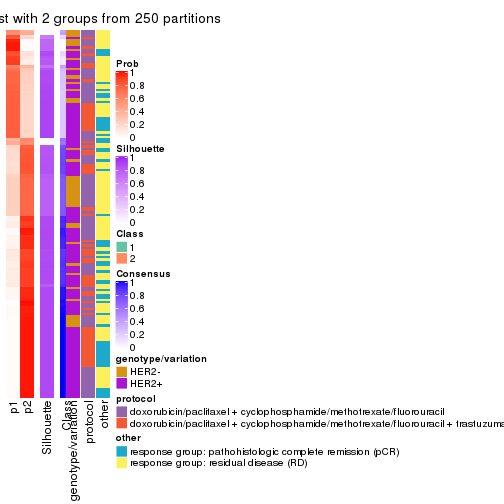</p>

</div>
<div id='tab-SD-mclust-consensus-heatmap-2'>
<pre><code class="r">consensus_heatmap(res, k = 3)
</code></pre>

<p>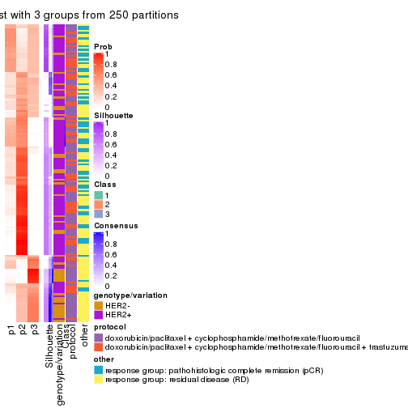</p>

</div>
<div id='tab-SD-mclust-consensus-heatmap-3'>
<pre><code class="r">consensus_heatmap(res, k = 4)
</code></pre>

<p>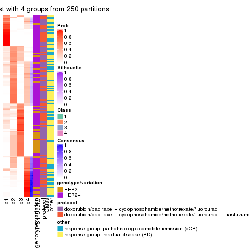</p>

</div>
<div id='tab-SD-mclust-consensus-heatmap-4'>
<pre><code class="r">consensus_heatmap(res, k = 5)
</code></pre>

<p>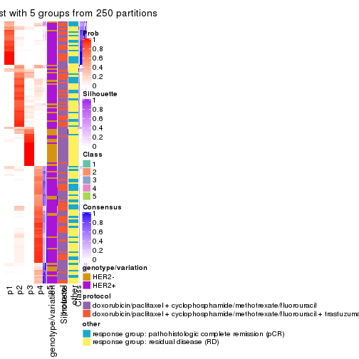</p>

</div>
<div id='tab-SD-mclust-consensus-heatmap-5'>
<pre><code class="r">consensus_heatmap(res, k = 6)
</code></pre>

<p>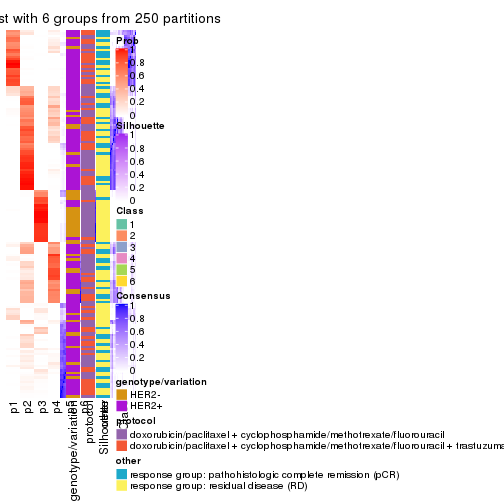</p>

</div>
</div>

Heatmaps for the membership of samples in all partitions to see how consistent they are:


<script>
$( function() {
	$( '#tabs-SD-mclust-membership-heatmap' ).tabs();
} );
</script>
<div id='tabs-SD-mclust-membership-heatmap'>
<ul>
<li><a href='#tab-SD-mclust-membership-heatmap-1'>k = 2</a></li>
<li><a href='#tab-SD-mclust-membership-heatmap-2'>k = 3</a></li>
<li><a href='#tab-SD-mclust-membership-heatmap-3'>k = 4</a></li>
<li><a href='#tab-SD-mclust-membership-heatmap-4'>k = 5</a></li>
<li><a href='#tab-SD-mclust-membership-heatmap-5'>k = 6</a></li>
</ul>
<div id='tab-SD-mclust-membership-heatmap-1'>
<pre><code class="r">membership_heatmap(res, k = 2)
</code></pre>

<p>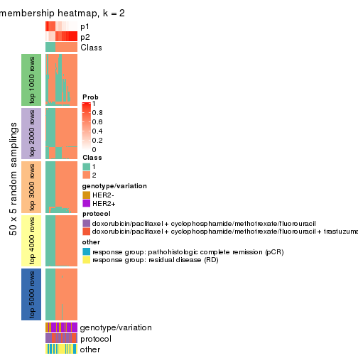</p>

</div>
<div id='tab-SD-mclust-membership-heatmap-2'>
<pre><code class="r">membership_heatmap(res, k = 3)
</code></pre>

<p>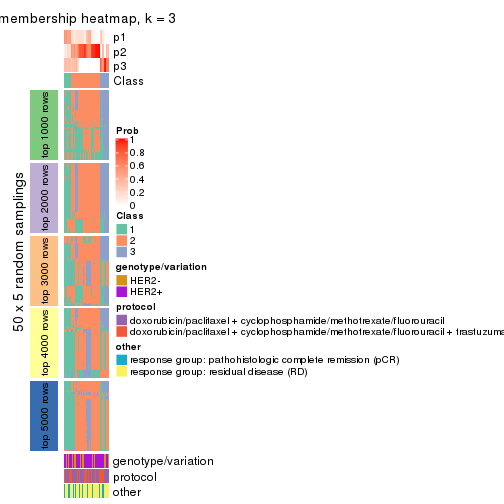</p>

</div>
<div id='tab-SD-mclust-membership-heatmap-3'>
<pre><code class="r">membership_heatmap(res, k = 4)
</code></pre>

<p>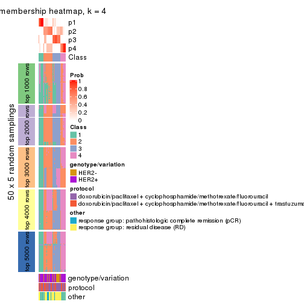</p>

</div>
<div id='tab-SD-mclust-membership-heatmap-4'>
<pre><code class="r">membership_heatmap(res, k = 5)
</code></pre>

<p>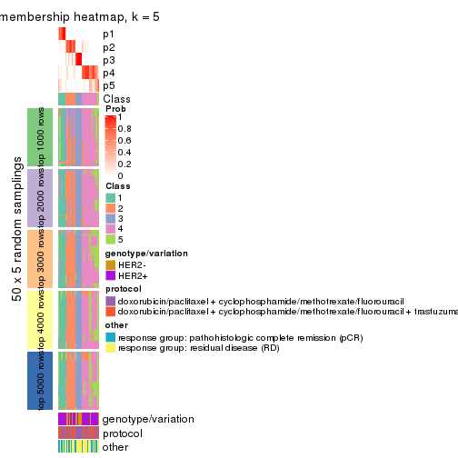</p>

</div>
<div id='tab-SD-mclust-membership-heatmap-5'>
<pre><code class="r">membership_heatmap(res, k = 6)
</code></pre>

<p>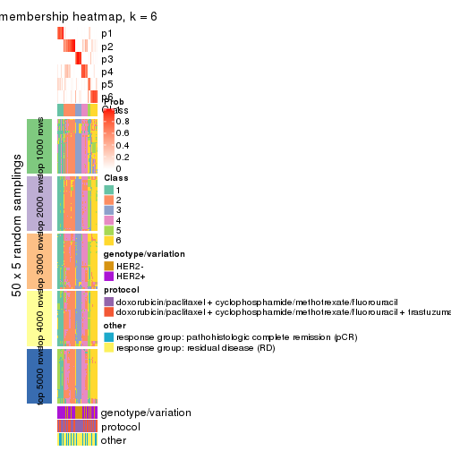</p>

</div>
</div>

As soon as we have had the classes for columns, we can look for signatures
which are significantly different between classes which can be candidate marks
for certain classes. Following are the heatmaps for signatures.


Signature heatmaps where rows are scaled:


<script>
$( function() {
	$( '#tabs-SD-mclust-get-signatures' ).tabs();
} );
</script>
<div id='tabs-SD-mclust-get-signatures'>
<ul>
<li><a href='#tab-SD-mclust-get-signatures-1'>k = 2</a></li>
<li><a href='#tab-SD-mclust-get-signatures-2'>k = 3</a></li>
<li><a href='#tab-SD-mclust-get-signatures-3'>k = 4</a></li>
<li><a href='#tab-SD-mclust-get-signatures-4'>k = 5</a></li>
<li><a href='#tab-SD-mclust-get-signatures-5'>k = 6</a></li>
</ul>
<div id='tab-SD-mclust-get-signatures-1'>
<pre><code class="r">get_signatures(res, k = 2)
</code></pre>

<pre><code>#&gt; Error: The width or height of the raster image is zero, maybe you forget to turn off the
#&gt; previous graphic device or it was corrupted. Run `dev.off()` to close it.
</code></pre>

<p></p>

</div>
<div id='tab-SD-mclust-get-signatures-2'>
<pre><code class="r">get_signatures(res, k = 3)
</code></pre>

<pre><code>#&gt; Error: The width or height of the raster image is zero, maybe you forget to turn off the
#&gt; previous graphic device or it was corrupted. Run `dev.off()` to close it.
</code></pre>

<p></p>

</div>
<div id='tab-SD-mclust-get-signatures-3'>
<pre><code class="r">get_signatures(res, k = 4)
</code></pre>

<pre><code>#&gt; Error: The width or height of the raster image is zero, maybe you forget to turn off the
#&gt; previous graphic device or it was corrupted. Run `dev.off()` to close it.
</code></pre>

<p></p>

</div>
<div id='tab-SD-mclust-get-signatures-4'>
<pre><code class="r">get_signatures(res, k = 5)
</code></pre>

<pre><code>#&gt; Error: The width or height of the raster image is zero, maybe you forget to turn off the
#&gt; previous graphic device or it was corrupted. Run `dev.off()` to close it.
</code></pre>

<p></p>

</div>
<div id='tab-SD-mclust-get-signatures-5'>
<pre><code class="r">get_signatures(res, k = 6)
</code></pre>

<pre><code>#&gt; Error: The width or height of the raster image is zero, maybe you forget to turn off the
#&gt; previous graphic device or it was corrupted. Run `dev.off()` to close it.
</code></pre>

<p></p>

</div>
</div>


Signature heatmaps where rows are not scaled:


<script>
$( function() {
	$( '#tabs-SD-mclust-get-signatures-no-scale' ).tabs();
} );
</script>
<div id='tabs-SD-mclust-get-signatures-no-scale'>
<ul>
<li><a href='#tab-SD-mclust-get-signatures-no-scale-1'>k = 2</a></li>
<li><a href='#tab-SD-mclust-get-signatures-no-scale-2'>k = 3</a></li>
<li><a href='#tab-SD-mclust-get-signatures-no-scale-3'>k = 4</a></li>
<li><a href='#tab-SD-mclust-get-signatures-no-scale-4'>k = 5</a></li>
<li><a href='#tab-SD-mclust-get-signatures-no-scale-5'>k = 6</a></li>
</ul>
<div id='tab-SD-mclust-get-signatures-no-scale-1'>
<pre><code class="r">get_signatures(res, k = 2, scale_rows = FALSE)
</code></pre>

<pre><code>#&gt; Error: The width or height of the raster image is zero, maybe you forget to turn off the
#&gt; previous graphic device or it was corrupted. Run `dev.off()` to close it.
</code></pre>

<p></p>

</div>
<div id='tab-SD-mclust-get-signatures-no-scale-2'>
<pre><code class="r">get_signatures(res, k = 3, scale_rows = FALSE)
</code></pre>

<pre><code>#&gt; Error: The width or height of the raster image is zero, maybe you forget to turn off the
#&gt; previous graphic device or it was corrupted. Run `dev.off()` to close it.
</code></pre>

<p></p>

</div>
<div id='tab-SD-mclust-get-signatures-no-scale-3'>
<pre><code class="r">get_signatures(res, k = 4, scale_rows = FALSE)
</code></pre>

<pre><code>#&gt; Error: The width or height of the raster image is zero, maybe you forget to turn off the
#&gt; previous graphic device or it was corrupted. Run `dev.off()` to close it.
</code></pre>

<p></p>

</div>
<div id='tab-SD-mclust-get-signatures-no-scale-4'>
<pre><code class="r">get_signatures(res, k = 5, scale_rows = FALSE)
</code></pre>

<pre><code>#&gt; Error: The width or height of the raster image is zero, maybe you forget to turn off the
#&gt; previous graphic device or it was corrupted. Run `dev.off()` to close it.
</code></pre>

<p></p>

</div>
<div id='tab-SD-mclust-get-signatures-no-scale-5'>
<pre><code class="r">get_signatures(res, k = 6, scale_rows = FALSE)
</code></pre>

<pre><code>#&gt; Error: The width or height of the raster image is zero, maybe you forget to turn off the
#&gt; previous graphic device or it was corrupted. Run `dev.off()` to close it.
</code></pre>

<p></p>

</div>
</div>


Compare the overlap of signatures from different k:

```r
compare_signatures(res)
```

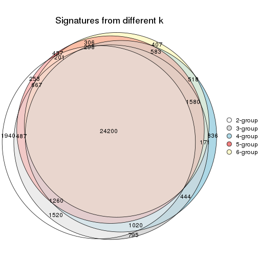

`get_signature()` returns a data frame invisibly. TO get the list of signatures, the function
call should be assigned to a variable explicitly. In following code, if `plot` argument is set
to `FALSE`, no heatmap is plotted while only the differential analysis is performed.

```r
# code only for demonstration
tb = get_signature(res, k = ..., plot = FALSE)
```

An example of the output of `tb` is:

```
#>   which_row         fdr    mean_1    mean_2 scaled_mean_1 scaled_mean_2 km
#> 1        38 0.042760348  8.373488  9.131774    -0.5533452     0.5164555  1
#> 2        40 0.018707592  7.106213  8.469186    -0.6173731     0.5762149  1
#> 3        55 0.019134737 10.221463 11.207825    -0.6159697     0.5749050  1
#> 4        59 0.006059896  5.921854  7.869574    -0.6899429     0.6439467  1
#> 5        60 0.018055526  8.928898 10.211722    -0.6204761     0.5791110  1
#> 6        98 0.009384629 15.714769 14.887706     0.6635654    -0.6193277  2
...
```

The columns in `tb` are:

1. `which_row`: row indices corresponding to the input matrix.
2. `fdr`: FDR for the differential test. 
3. `mean_x`: The mean value in group x.
4. `scaled_mean_x`: The mean value in group x after rows are scaled.
5. `km`: Row groups if k-means clustering is applied to rows.


UMAP plot which shows how samples are separated.


<script>
$( function() {
	$( '#tabs-SD-mclust-dimension-reduction' ).tabs();
} );
</script>
<div id='tabs-SD-mclust-dimension-reduction'>
<ul>
<li><a href='#tab-SD-mclust-dimension-reduction-1'>k = 2</a></li>
<li><a href='#tab-SD-mclust-dimension-reduction-2'>k = 3</a></li>
<li><a href='#tab-SD-mclust-dimension-reduction-3'>k = 4</a></li>
<li><a href='#tab-SD-mclust-dimension-reduction-4'>k = 5</a></li>
<li><a href='#tab-SD-mclust-dimension-reduction-5'>k = 6</a></li>
</ul>
<div id='tab-SD-mclust-dimension-reduction-1'>
<pre><code class="r">dimension_reduction(res, k = 2, method = &quot;UMAP&quot;)
</code></pre>

<p>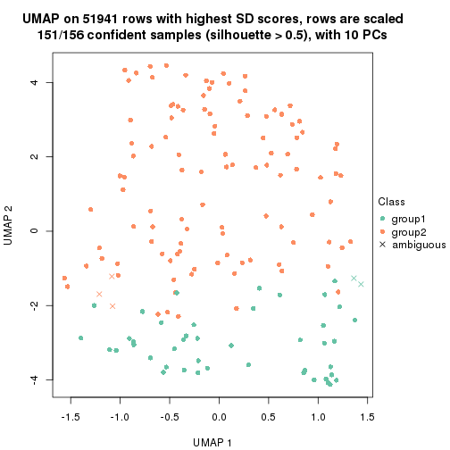</p>

</div>
<div id='tab-SD-mclust-dimension-reduction-2'>
<pre><code class="r">dimension_reduction(res, k = 3, method = &quot;UMAP&quot;)
</code></pre>

<p>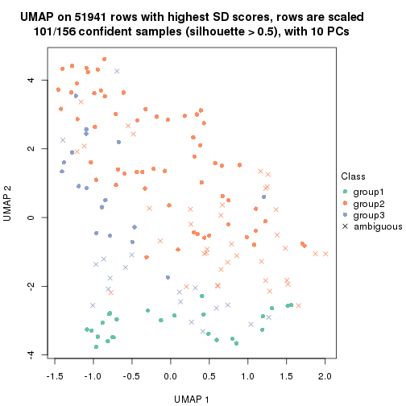</p>

</div>
<div id='tab-SD-mclust-dimension-reduction-3'>
<pre><code class="r">dimension_reduction(res, k = 4, method = &quot;UMAP&quot;)
</code></pre>

<p>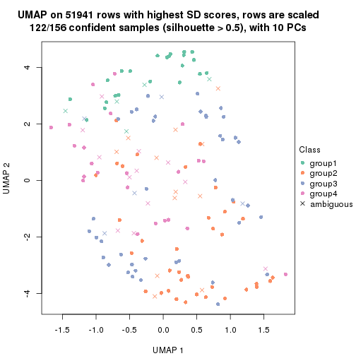</p>

</div>
<div id='tab-SD-mclust-dimension-reduction-4'>
<pre><code class="r">dimension_reduction(res, k = 5, method = &quot;UMAP&quot;)
</code></pre>

<p>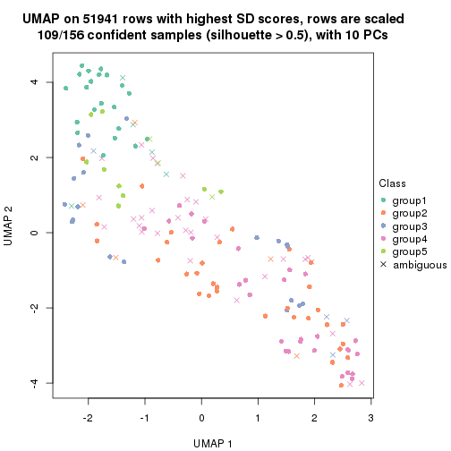</p>

</div>
<div id='tab-SD-mclust-dimension-reduction-5'>
<pre><code class="r">dimension_reduction(res, k = 6, method = &quot;UMAP&quot;)
</code></pre>

<p>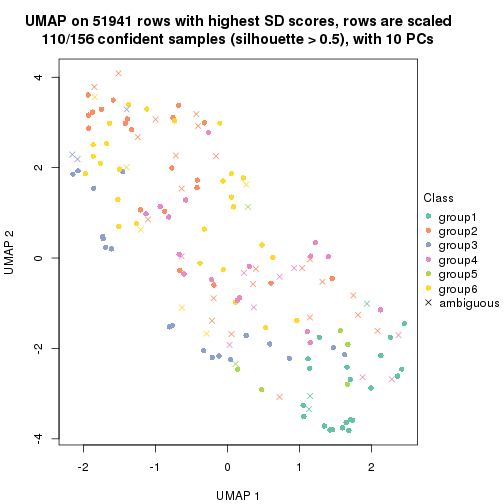</p>

</div>
</div>


Following heatmap shows how subgroups are split when increasing `k`:

```r
collect_classes(res)
```

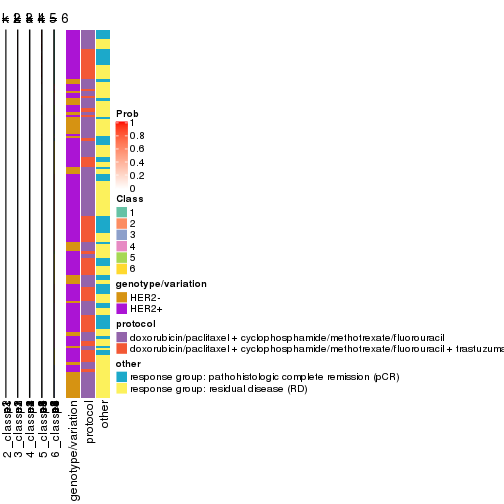


Test correlation between subgroups and known annotations. If the known
annotation is numeric, one-way ANOVA test is applied, and if the known
annotation is discrete, chi-squared contingency table test is applied.

```r
test_to_known_factors(res)
```

```
#>             n genotype/variation(p) protocol(p) other(p) k
#> SD:mclust 151              7.32e-01      1.0000   1.0000 2
#> SD:mclust 101              1.06e-05      0.0796   0.0153 3
#> SD:mclust 122              5.01e-04      0.2022   0.0134 4
#> SD:mclust 109              1.18e-07      0.0122   0.0542 5
#> SD:mclust 110              5.76e-06      0.0505   0.0263 6
```


If matrix rows can be associated to genes, consider to use `functional_enrichment(res,
...)` to perform function enrichment for the signature genes. See [this vignette](http://bioconductor.org/packages/devel/bioc/vignettes/cola/inst/doc/functional_enrichment.html) for more detailed explanations.


 

---------------------------------------------------


### SD:NMF


The object with results only for a single top-value method and a single partition method 
can be extracted as:

```r
res = res_list["SD", "NMF"]
# you can also extract it by
# res = res_list["SD:NMF"]
```

A summary of `res` and all the functions that can be applied to it:

```r
res
```

```
#> A 'ConsensusPartition' object with k = 2, 3, 4, 5, 6.
#>   On a matrix with 51941 rows and 156 columns.
#>   Top rows (1000, 2000, 3000, 4000, 5000) are extracted by 'SD' method.
#>   Subgroups are detected by 'NMF' method.
#>   Performed in total 1250 partitions by row resampling.
#>   Best k for subgroups seems to be 2.
#> 
#> Following methods can be applied to this 'ConsensusPartition' object:
#>  [1] "cola_report"             "collect_classes"         "collect_plots"          
#>  [4] "collect_stats"           "colnames"                "compare_signatures"     
#>  [7] "consensus_heatmap"       "dimension_reduction"     "functional_enrichment"  
#> [10] "get_anno_col"            "get_anno"                "get_classes"            
#> [13] "get_consensus"           "get_matrix"              "get_membership"         
#> [16] "get_param"               "get_signatures"          "get_stats"              
#> [19] "is_best_k"               "is_stable_k"             "membership_heatmap"     
#> [22] "ncol"                    "nrow"                    "plot_ecdf"              
#> [25] "rownames"                "select_partition_number" "show"                   
#> [28] "suggest_best_k"          "test_to_known_factors"
```

`collect_plots()` function collects all the plots made from `res` for all `k` (number of partitions)
into one single page to provide an easy and fast comparison between different `k`.

```r
collect_plots(res)
```

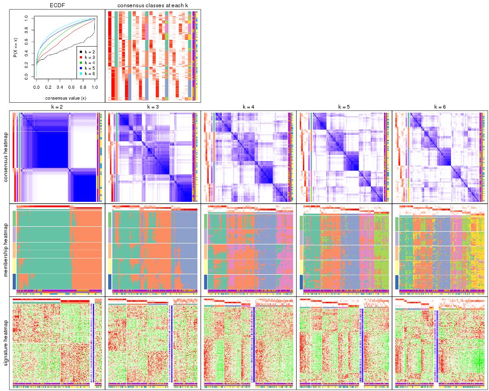

The plots are:

- The first row: a plot of the ECDF (empirical cumulative distribution
  function) curves of the consensus matrix for each `k` and the heatmap of
  predicted classes for each `k`.
- The second row: heatmaps of the consensus matrix for each `k`.
- The third row: heatmaps of the membership matrix for each `k`.
- The fouth row: heatmaps of the signatures for each `k`.

All the plots in panels can be made by individual functions and they are
plotted later in this section.

`select_partition_number()` produces several plots showing different
statistics for choosing "optimized" `k`. There are following statistics:

- ECDF curves of the consensus matrix for each `k`;
- 1-PAC. [The PAC
  score](https://en.wikipedia.org/wiki/Consensus_clustering#Over-interpretation_potential_of_consensus_clustering)
  measures the proportion of the ambiguous subgrouping.
- Mean silhouette score.
- Concordance. The mean probability of fiting the consensus class ids in all
  partitions.
- Area increased. Denote $A_k$ as the area under the ECDF curve for current
  `k`, the area increased is defined as $A_k - A_{k-1}$.
- Rand index. The percent of pairs of samples that are both in a same cluster
  or both are not in a same cluster in the partition of k and k-1.
- Jaccard index. The ratio of pairs of samples are both in a same cluster in
  the partition of k and k-1 and the pairs of samples are both in a same
  cluster in the partition k or k-1.

The detailed explanations of these statistics can be found in [the _cola_
vignette](http://bioconductor.org/packages/devel/bioc/vignettes/cola/inst/doc/cola.html#toc_13).

Generally speaking, lower PAC score, higher mean silhouette score or higher
concordance corresponds to better partition. Rand index and Jaccard index
measure how similar the current partition is compared to partition with `k-1`.
If they are too similar, we won't accept `k` is better than `k-1`.

```r
select_partition_number(res)
```

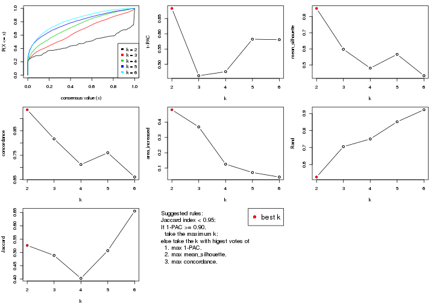

The numeric values for all these statistics can be obtained by `get_stats()`.

```r
get_stats(res)
```

```
#>   k 1-PAC mean_silhouette concordance area_increased  Rand Jaccard
#> 2 2 0.683           0.851       0.936         0.4805 0.527   0.527
#> 3 3 0.463           0.598       0.817         0.3686 0.706   0.489
#> 4 4 0.476           0.481       0.711         0.1257 0.751   0.403
#> 5 5 0.582           0.566       0.760         0.0714 0.852   0.507
#> 6 6 0.581           0.434       0.660         0.0419 0.923   0.655
```

`suggest_best_k()` suggests the best $k$ based on these statistics. The rules are as follows:

- All $k$ with Jaccard index larger than 0.95 are removed because increasing
  $k$ does not provide enough extra information. If all $k$ are removed, it is
  marked as no subgroup is detected.
- For all $k$ with 1-PAC score larger than 0.9, the maximal $k$ is taken as
  the best $k$, and other $k$ are marked as optional $k$.
- If it does not fit the second rule. The $k$ with the maximal vote of the
  highest 1-PAC score, highest mean silhouette, and highest concordance is
  taken as the best $k$.

```r
suggest_best_k(res)
```

```
#> [1] 2
```


Following shows the table of the partitions (You need to click the **show/hide
code output** link to see it). The membership matrix (columns with name `p*`)
is inferred by
[`clue::cl_consensus()`](https://www.rdocumentation.org/link/cl_consensus?package=clue)
function with the `SE` method. Basically the value in the membership matrix
represents the probability to belong to a certain group. The finall class
label for an item is determined with the group with highest probability it
belongs to.

In `get_classes()` function, the entropy is calculated from the membership
matrix and the silhouette score is calculated from the consensus matrix.


<script>
$( function() {
	$( '#tabs-SD-NMF-get-classes' ).tabs();
} );
</script>
<div id='tabs-SD-NMF-get-classes'>
<ul>
<li><a href='#tab-SD-NMF-get-classes-1'>k = 2</a></li>
<li><a href='#tab-SD-NMF-get-classes-2'>k = 3</a></li>
<li><a href='#tab-SD-NMF-get-classes-3'>k = 4</a></li>
<li><a href='#tab-SD-NMF-get-classes-4'>k = 5</a></li>
<li><a href='#tab-SD-NMF-get-classes-5'>k = 6</a></li>
</ul>

<div id='tab-SD-NMF-get-classes-1'>
<p><a id='tab-SD-NMF-get-classes-1-a' style='color:#0366d6' href='#'>show/hide code output</a></p>
<pre><code class="r">cbind(get_classes(res, k = 2), get_membership(res, k = 2))
</code></pre>

<pre><code>#&gt;            class entropy silhouette    p1    p2
#&gt; GSM1232995     2  0.0000     0.9388 0.000 1.000
#&gt; GSM1233002     1  0.0000     0.9237 1.000 0.000
#&gt; GSM1233003     1  0.0000     0.9237 1.000 0.000
#&gt; GSM1233014     1  0.0000     0.9237 1.000 0.000
#&gt; GSM1233015     1  0.5294     0.8420 0.880 0.120
#&gt; GSM1233016     1  0.0000     0.9237 1.000 0.000
#&gt; GSM1233024     1  0.0000     0.9237 1.000 0.000
#&gt; GSM1233049     2  0.0000     0.9388 0.000 1.000
#&gt; GSM1233064     2  0.5629     0.8157 0.132 0.868
#&gt; GSM1233068     1  0.3879     0.8784 0.924 0.076
#&gt; GSM1233073     1  0.0000     0.9237 1.000 0.000
#&gt; GSM1233093     1  0.0000     0.9237 1.000 0.000
#&gt; GSM1233115     1  0.0000     0.9237 1.000 0.000
#&gt; GSM1232992     1  0.6887     0.7766 0.816 0.184
#&gt; GSM1232993     1  0.0376     0.9221 0.996 0.004
#&gt; GSM1233005     1  0.2603     0.9007 0.956 0.044
#&gt; GSM1233007     1  0.0000     0.9237 1.000 0.000
#&gt; GSM1233010     1  0.0000     0.9237 1.000 0.000
#&gt; GSM1233013     1  0.8661     0.6260 0.712 0.288
#&gt; GSM1233018     1  0.8386     0.6591 0.732 0.268
#&gt; GSM1233019     1  0.0376     0.9221 0.996 0.004
#&gt; GSM1233021     1  0.3584     0.8841 0.932 0.068
#&gt; GSM1233025     1  0.0000     0.9237 1.000 0.000
#&gt; GSM1233029     1  0.0000     0.9237 1.000 0.000
#&gt; GSM1233030     1  0.6438     0.7993 0.836 0.164
#&gt; GSM1233031     1  0.0000     0.9237 1.000 0.000
#&gt; GSM1233032     2  0.0000     0.9388 0.000 1.000
#&gt; GSM1233035     1  0.0000     0.9237 1.000 0.000
#&gt; GSM1233038     1  0.0000     0.9237 1.000 0.000
#&gt; GSM1233039     2  0.9970     0.0512 0.468 0.532
#&gt; GSM1233042     1  0.0000     0.9237 1.000 0.000
#&gt; GSM1233043     1  0.0000     0.9237 1.000 0.000
#&gt; GSM1233044     1  0.9522     0.3996 0.628 0.372
#&gt; GSM1233046     1  0.0672     0.9203 0.992 0.008
#&gt; GSM1233051     1  0.6048     0.8067 0.852 0.148
#&gt; GSM1233054     2  0.0000     0.9388 0.000 1.000
#&gt; GSM1233057     2  0.0000     0.9388 0.000 1.000
#&gt; GSM1233060     1  0.0000     0.9237 1.000 0.000
#&gt; GSM1233062     1  0.0000     0.9237 1.000 0.000
#&gt; GSM1233075     2  0.0000     0.9388 0.000 1.000
#&gt; GSM1233078     2  0.0000     0.9388 0.000 1.000
#&gt; GSM1233079     2  0.0000     0.9388 0.000 1.000
#&gt; GSM1233082     1  0.0000     0.9237 1.000 0.000
#&gt; GSM1233083     1  0.2236     0.9023 0.964 0.036
#&gt; GSM1233091     1  0.9970     0.1870 0.532 0.468
#&gt; GSM1233095     1  0.2423     0.8999 0.960 0.040
#&gt; GSM1233096     1  0.0000     0.9237 1.000 0.000
#&gt; GSM1233101     2  0.9635     0.3821 0.388 0.612
#&gt; GSM1233105     1  0.0000     0.9237 1.000 0.000
#&gt; GSM1233117     2  0.0000     0.9388 0.000 1.000
#&gt; GSM1233118     2  0.0000     0.9388 0.000 1.000
#&gt; GSM1233001     2  0.0000     0.9388 0.000 1.000
#&gt; GSM1233006     1  0.0000     0.9237 1.000 0.000
#&gt; GSM1233008     1  0.9491     0.4746 0.632 0.368
#&gt; GSM1233009     1  0.5946     0.8198 0.856 0.144
#&gt; GSM1233017     1  0.1633     0.9124 0.976 0.024
#&gt; GSM1233020     2  0.5946     0.8026 0.144 0.856
#&gt; GSM1233022     1  0.0000     0.9237 1.000 0.000
#&gt; GSM1233026     1  0.0000     0.9237 1.000 0.000
#&gt; GSM1233028     1  0.0000     0.9237 1.000 0.000
#&gt; GSM1233034     2  0.9970     0.0343 0.468 0.532
#&gt; GSM1233040     2  0.3431     0.8862 0.064 0.936
#&gt; GSM1233048     1  0.0000     0.9237 1.000 0.000
#&gt; GSM1233056     1  0.2603     0.8964 0.956 0.044
#&gt; GSM1233058     1  0.0000     0.9237 1.000 0.000
#&gt; GSM1233059     1  0.0000     0.9237 1.000 0.000
#&gt; GSM1233066     2  0.0000     0.9388 0.000 1.000
#&gt; GSM1233071     1  0.2236     0.9057 0.964 0.036
#&gt; GSM1233074     2  0.0000     0.9388 0.000 1.000
#&gt; GSM1233076     1  0.8144     0.6466 0.748 0.252
#&gt; GSM1233080     1  0.0000     0.9237 1.000 0.000
#&gt; GSM1233088     2  0.6623     0.7633 0.172 0.828
#&gt; GSM1233090     1  0.9954     0.1995 0.540 0.460
#&gt; GSM1233092     1  0.0000     0.9237 1.000 0.000
#&gt; GSM1233094     1  0.0000     0.9237 1.000 0.000
#&gt; GSM1233097     1  0.0000     0.9237 1.000 0.000
#&gt; GSM1233100     1  0.0000     0.9237 1.000 0.000
#&gt; GSM1233104     1  0.0000     0.9237 1.000 0.000
#&gt; GSM1233106     1  0.6801     0.7835 0.820 0.180
#&gt; GSM1233111     1  0.3431     0.8882 0.936 0.064
#&gt; GSM1233122     1  0.6712     0.7868 0.824 0.176
#&gt; GSM1233146     1  0.0000     0.9237 1.000 0.000
#&gt; GSM1232994     1  0.0000     0.9237 1.000 0.000
#&gt; GSM1232996     1  0.6531     0.7990 0.832 0.168
#&gt; GSM1232997     2  0.0000     0.9388 0.000 1.000
#&gt; GSM1232998     1  0.0000     0.9237 1.000 0.000
#&gt; GSM1232999     1  0.0000     0.9237 1.000 0.000
#&gt; GSM1233000     1  0.5408     0.8384 0.876 0.124
#&gt; GSM1233004     2  0.9608     0.3929 0.384 0.616
#&gt; GSM1233011     2  0.9427     0.4462 0.360 0.640
#&gt; GSM1233012     2  0.0000     0.9388 0.000 1.000
#&gt; GSM1233023     2  0.0000     0.9388 0.000 1.000
#&gt; GSM1233027     1  0.0000     0.9237 1.000 0.000
#&gt; GSM1233033     1  0.0000     0.9237 1.000 0.000
#&gt; GSM1233036     2  0.0000     0.9388 0.000 1.000
#&gt; GSM1233037     2  0.1633     0.9206 0.024 0.976
#&gt; GSM1233041     1  0.0000     0.9237 1.000 0.000
#&gt; GSM1233045     1  0.0000     0.9237 1.000 0.000
#&gt; GSM1233047     2  0.0000     0.9388 0.000 1.000
#&gt; GSM1233050     2  0.5629     0.8163 0.132 0.868
#&gt; GSM1233052     1  0.0000     0.9237 1.000 0.000
#&gt; GSM1233053     2  0.0000     0.9388 0.000 1.000
#&gt; GSM1233055     1  0.0000     0.9237 1.000 0.000
#&gt; GSM1233061     2  0.0000     0.9388 0.000 1.000
#&gt; GSM1233063     1  0.0000     0.9237 1.000 0.000
#&gt; GSM1233065     2  0.0000     0.9388 0.000 1.000
#&gt; GSM1233070     1  0.0000     0.9237 1.000 0.000
#&gt; GSM1233077     2  0.0000     0.9388 0.000 1.000
#&gt; GSM1233081     2  0.0000     0.9388 0.000 1.000
#&gt; GSM1233084     1  0.0000     0.9237 1.000 0.000
#&gt; GSM1233087     1  0.0000     0.9237 1.000 0.000
#&gt; GSM1233089     2  0.5629     0.8196 0.132 0.868
#&gt; GSM1233099     1  0.0000     0.9237 1.000 0.000
#&gt; GSM1233112     2  0.9170     0.5141 0.332 0.668
#&gt; GSM1233085     2  0.0000     0.9388 0.000 1.000
#&gt; GSM1233098     1  0.6887     0.7803 0.816 0.184
#&gt; GSM1233114     1  0.0000     0.9237 1.000 0.000
#&gt; GSM1233119     1  0.0000     0.9237 1.000 0.000
#&gt; GSM1233129     2  0.0000     0.9388 0.000 1.000
#&gt; GSM1233132     1  0.0000     0.9237 1.000 0.000
#&gt; GSM1233139     1  0.9710     0.3906 0.600 0.400
#&gt; GSM1233143     2  0.0000     0.9388 0.000 1.000
#&gt; GSM1233145     1  0.0000     0.9237 1.000 0.000
#&gt; GSM1233067     2  0.0000     0.9388 0.000 1.000
#&gt; GSM1233069     2  0.0000     0.9388 0.000 1.000
#&gt; GSM1233072     1  0.8909     0.6013 0.692 0.308
#&gt; GSM1233086     2  0.0376     0.9359 0.004 0.996
#&gt; GSM1233102     1  0.0000     0.9237 1.000 0.000
#&gt; GSM1233103     1  0.0376     0.9221 0.996 0.004
#&gt; GSM1233107     1  0.1414     0.9145 0.980 0.020
#&gt; GSM1233108     2  0.0000     0.9388 0.000 1.000
#&gt; GSM1233109     2  0.0000     0.9388 0.000 1.000
#&gt; GSM1233110     2  0.0000     0.9388 0.000 1.000
#&gt; GSM1233113     2  0.0000     0.9388 0.000 1.000
#&gt; GSM1233116     2  0.0000     0.9388 0.000 1.000
#&gt; GSM1233120     1  0.0000     0.9237 1.000 0.000
#&gt; GSM1233121     2  0.0000     0.9388 0.000 1.000
#&gt; GSM1233123     2  0.0000     0.9388 0.000 1.000
#&gt; GSM1233124     2  0.0000     0.9388 0.000 1.000
#&gt; GSM1233125     2  0.0000     0.9388 0.000 1.000
#&gt; GSM1233126     1  0.0000     0.9237 1.000 0.000
#&gt; GSM1233127     1  0.1843     0.9102 0.972 0.028
#&gt; GSM1233128     1  0.9866     0.2126 0.568 0.432
#&gt; GSM1233130     2  0.0000     0.9388 0.000 1.000
#&gt; GSM1233131     1  0.0000     0.9237 1.000 0.000
#&gt; GSM1233133     2  0.0000     0.9388 0.000 1.000
#&gt; GSM1233134     2  0.0000     0.9388 0.000 1.000
#&gt; GSM1233135     2  0.0000     0.9388 0.000 1.000
#&gt; GSM1233136     2  0.0000     0.9388 0.000 1.000
#&gt; GSM1233137     2  0.0000     0.9388 0.000 1.000
#&gt; GSM1233138     1  0.0000     0.9237 1.000 0.000
#&gt; GSM1233140     2  0.0000     0.9388 0.000 1.000
#&gt; GSM1233141     1  0.9552     0.4552 0.624 0.376
#&gt; GSM1233142     1  0.6623     0.7906 0.828 0.172
#&gt; GSM1233144     2  0.0000     0.9388 0.000 1.000
#&gt; GSM1233147     1  0.9963     0.1015 0.536 0.464
</code></pre>

<script>
$('#tab-SD-NMF-get-classes-1-a').parent().next().next().hide();
$('#tab-SD-NMF-get-classes-1-a').click(function(){
  $('#tab-SD-NMF-get-classes-1-a').parent().next().next().toggle();
  return(false);
});
</script>
</div>

<div id='tab-SD-NMF-get-classes-2'>
<p><a id='tab-SD-NMF-get-classes-2-a' style='color:#0366d6' href='#'>show/hide code output</a></p>
<pre><code class="r">cbind(get_classes(res, k = 3), get_membership(res, k = 3))
</code></pre>

<pre><code>#&gt;            class entropy silhouette    p1    p2    p3
#&gt; GSM1232995     2  0.6192     0.1331 0.000 0.580 0.420
#&gt; GSM1233002     1  0.6215     0.3449 0.572 0.428 0.000
#&gt; GSM1233003     1  0.0747     0.7204 0.984 0.000 0.016
#&gt; GSM1233014     1  0.2356     0.7276 0.928 0.072 0.000
#&gt; GSM1233015     2  0.0237     0.7216 0.004 0.996 0.000
#&gt; GSM1233016     1  0.0237     0.7245 0.996 0.000 0.004
#&gt; GSM1233024     2  0.5835     0.4585 0.340 0.660 0.000
#&gt; GSM1233049     3  0.0000     0.8396 0.000 0.000 1.000
#&gt; GSM1233064     2  0.5968     0.2608 0.000 0.636 0.364
#&gt; GSM1233068     2  0.0747     0.7212 0.016 0.984 0.000
#&gt; GSM1233073     1  0.2261     0.7289 0.932 0.068 0.000
#&gt; GSM1233093     1  0.6192     0.3174 0.580 0.420 0.000
#&gt; GSM1233115     1  0.6180     0.3170 0.584 0.416 0.000
#&gt; GSM1232992     2  0.0424     0.7226 0.008 0.992 0.000
#&gt; GSM1232993     2  0.0592     0.7225 0.012 0.988 0.000
#&gt; GSM1233005     2  0.4346     0.6448 0.184 0.816 0.000
#&gt; GSM1233007     1  0.3551     0.7186 0.868 0.132 0.000
#&gt; GSM1233010     1  0.5529     0.5534 0.704 0.296 0.000
#&gt; GSM1233013     2  0.0892     0.7243 0.020 0.980 0.000
#&gt; GSM1233018     2  0.0424     0.7231 0.008 0.992 0.000
#&gt; GSM1233019     2  0.6095     0.3558 0.392 0.608 0.000
#&gt; GSM1233021     2  0.1643     0.7209 0.044 0.956 0.000
#&gt; GSM1233025     1  0.0237     0.7245 0.996 0.000 0.004
#&gt; GSM1233029     2  0.0892     0.7204 0.020 0.980 0.000
#&gt; GSM1233030     2  0.0000     0.7212 0.000 1.000 0.000
#&gt; GSM1233031     2  0.5785     0.4047 0.332 0.668 0.000
#&gt; GSM1233032     3  0.6308     0.0308 0.000 0.492 0.508
#&gt; GSM1233035     2  0.3816     0.6780 0.148 0.852 0.000
#&gt; GSM1233038     1  0.0000     0.7259 1.000 0.000 0.000
#&gt; GSM1233039     2  0.1529     0.7114 0.000 0.960 0.040
#&gt; GSM1233042     1  0.3879     0.7006 0.848 0.152 0.000
#&gt; GSM1233043     1  0.3816     0.7022 0.852 0.148 0.000
#&gt; GSM1233044     1  0.8202     0.2405 0.544 0.080 0.376
#&gt; GSM1233046     2  0.5254     0.5617 0.264 0.736 0.000
#&gt; GSM1233051     2  0.9596     0.0171 0.200 0.416 0.384
#&gt; GSM1233054     3  0.6260     0.2939 0.000 0.448 0.552
#&gt; GSM1233057     2  0.5465     0.4623 0.000 0.712 0.288
#&gt; GSM1233060     2  0.3116     0.6731 0.108 0.892 0.000
#&gt; GSM1233062     2  0.4346     0.6518 0.184 0.816 0.000
#&gt; GSM1233075     3  0.1964     0.8278 0.000 0.056 0.944
#&gt; GSM1233078     3  0.0000     0.8396 0.000 0.000 1.000
#&gt; GSM1233079     3  0.1753     0.8156 0.000 0.048 0.952
#&gt; GSM1233082     2  0.4702     0.5326 0.212 0.788 0.000
#&gt; GSM1233083     1  0.2625     0.6863 0.916 0.000 0.084
#&gt; GSM1233091     2  0.0000     0.7212 0.000 1.000 0.000
#&gt; GSM1233095     1  0.7890     0.3295 0.564 0.372 0.064
#&gt; GSM1233096     2  0.2356     0.6972 0.072 0.928 0.000
#&gt; GSM1233101     3  0.4605     0.6925 0.204 0.000 0.796
#&gt; GSM1233105     1  0.4887     0.6426 0.772 0.228 0.000
#&gt; GSM1233117     3  0.6307     0.1714 0.000 0.488 0.512
#&gt; GSM1233118     3  0.3551     0.7816 0.000 0.132 0.868
#&gt; GSM1233001     2  0.5760     0.3783 0.000 0.672 0.328
#&gt; GSM1233006     1  0.4750     0.6464 0.784 0.216 0.000
#&gt; GSM1233008     2  0.6488     0.6198 0.160 0.756 0.084
#&gt; GSM1233009     2  0.0237     0.7216 0.004 0.996 0.000
#&gt; GSM1233017     2  0.5397     0.5420 0.280 0.720 0.000
#&gt; GSM1233020     2  0.7310     0.2823 0.040 0.600 0.360
#&gt; GSM1233022     1  0.5835     0.4353 0.660 0.340 0.000
#&gt; GSM1233026     2  0.6111     0.1016 0.396 0.604 0.000
#&gt; GSM1233028     2  0.5178     0.5812 0.256 0.744 0.000
#&gt; GSM1233034     2  0.0000     0.7212 0.000 1.000 0.000
#&gt; GSM1233040     2  0.2625     0.6934 0.000 0.916 0.084
#&gt; GSM1233048     2  0.1860     0.7077 0.052 0.948 0.000
#&gt; GSM1233056     1  0.1753     0.7072 0.952 0.000 0.048
#&gt; GSM1233058     1  0.2959     0.7249 0.900 0.100 0.000
#&gt; GSM1233059     2  0.4750     0.5401 0.216 0.784 0.000
#&gt; GSM1233066     3  0.0237     0.8402 0.000 0.004 0.996
#&gt; GSM1233071     2  0.1643     0.7209 0.044 0.956 0.000
#&gt; GSM1233074     3  0.3192     0.7959 0.000 0.112 0.888
#&gt; GSM1233076     1  0.5926     0.3095 0.644 0.000 0.356
#&gt; GSM1233080     1  0.7030     0.3298 0.580 0.396 0.024
#&gt; GSM1233088     2  0.3879     0.6357 0.000 0.848 0.152
#&gt; GSM1233090     2  0.6814     0.3069 0.020 0.608 0.372
#&gt; GSM1233092     1  0.1163     0.7301 0.972 0.028 0.000
#&gt; GSM1233094     1  0.4399     0.6756 0.812 0.188 0.000
#&gt; GSM1233097     1  0.4062     0.6931 0.836 0.164 0.000
#&gt; GSM1233100     2  0.6302    -0.0269 0.480 0.520 0.000
#&gt; GSM1233104     1  0.4235     0.6848 0.824 0.176 0.000
#&gt; GSM1233106     2  0.1182     0.7206 0.012 0.976 0.012
#&gt; GSM1233111     2  0.2703     0.7006 0.056 0.928 0.016
#&gt; GSM1233122     2  0.6111     0.3476 0.396 0.604 0.000
#&gt; GSM1233146     1  0.4504     0.6695 0.804 0.196 0.000
#&gt; GSM1232994     2  0.5650     0.4989 0.312 0.688 0.000
#&gt; GSM1232996     2  0.5573     0.6534 0.160 0.796 0.044
#&gt; GSM1232997     3  0.5216     0.6518 0.000 0.260 0.740
#&gt; GSM1232998     1  0.4178     0.6859 0.828 0.172 0.000
#&gt; GSM1232999     1  0.5733     0.4816 0.676 0.324 0.000
#&gt; GSM1233000     2  0.0892     0.7231 0.020 0.980 0.000
#&gt; GSM1233004     3  0.5138     0.6345 0.252 0.000 0.748
#&gt; GSM1233011     3  0.4887     0.6663 0.228 0.000 0.772
#&gt; GSM1233012     3  0.5948     0.4925 0.000 0.360 0.640
#&gt; GSM1233023     3  0.6154     0.3936 0.000 0.408 0.592
#&gt; GSM1233027     1  0.4654     0.6652 0.792 0.208 0.000
#&gt; GSM1233033     1  0.5244     0.5903 0.756 0.240 0.004
#&gt; GSM1233036     3  0.6260     0.2874 0.000 0.448 0.552
#&gt; GSM1233037     2  0.2356     0.6925 0.000 0.928 0.072
#&gt; GSM1233041     1  0.7067     0.2007 0.512 0.468 0.020
#&gt; GSM1233045     2  0.5988     0.2911 0.368 0.632 0.000
#&gt; GSM1233047     3  0.2448     0.8181 0.000 0.076 0.924
#&gt; GSM1233050     2  0.3340     0.6658 0.000 0.880 0.120
#&gt; GSM1233052     2  0.3482     0.6427 0.128 0.872 0.000
#&gt; GSM1233053     2  0.6286    -0.0403 0.000 0.536 0.464
#&gt; GSM1233055     1  0.0000     0.7259 1.000 0.000 0.000
#&gt; GSM1233061     3  0.1163     0.8378 0.000 0.028 0.972
#&gt; GSM1233063     1  0.6654     0.2424 0.536 0.456 0.008
#&gt; GSM1233065     3  0.5591     0.5908 0.000 0.304 0.696
#&gt; GSM1233070     1  0.6126     0.3327 0.600 0.400 0.000
#&gt; GSM1233077     3  0.0000     0.8396 0.000 0.000 1.000
#&gt; GSM1233081     3  0.0000     0.8396 0.000 0.000 1.000
#&gt; GSM1233084     1  0.7820     0.4092 0.604 0.324 0.072
#&gt; GSM1233087     1  0.0237     0.7271 0.996 0.004 0.000
#&gt; GSM1233089     3  0.7770     0.5494 0.088 0.272 0.640
#&gt; GSM1233099     1  0.4931     0.6281 0.768 0.232 0.000
#&gt; GSM1233112     3  0.5835     0.4589 0.340 0.000 0.660
#&gt; GSM1233085     3  0.0237     0.8402 0.000 0.004 0.996
#&gt; GSM1233098     2  0.6482     0.5416 0.244 0.716 0.040
#&gt; GSM1233114     1  0.4654     0.6577 0.792 0.208 0.000
#&gt; GSM1233119     1  0.0424     0.7280 0.992 0.008 0.000
#&gt; GSM1233129     3  0.5397     0.6246 0.000 0.280 0.720
#&gt; GSM1233132     1  0.5785     0.4533 0.668 0.332 0.000
#&gt; GSM1233139     2  0.0237     0.7216 0.000 0.996 0.004
#&gt; GSM1233143     3  0.6244     0.3138 0.000 0.440 0.560
#&gt; GSM1233145     1  0.0000     0.7259 1.000 0.000 0.000
#&gt; GSM1233067     3  0.2165     0.8245 0.000 0.064 0.936
#&gt; GSM1233069     3  0.0424     0.8401 0.000 0.008 0.992
#&gt; GSM1233072     1  0.8398     0.0193 0.476 0.440 0.084
#&gt; GSM1233086     3  0.0747     0.8401 0.000 0.016 0.984
#&gt; GSM1233102     1  0.0000     0.7259 1.000 0.000 0.000
#&gt; GSM1233103     2  0.2878     0.7051 0.096 0.904 0.000
#&gt; GSM1233107     2  0.6168     0.3113 0.412 0.588 0.000
#&gt; GSM1233108     3  0.0424     0.8373 0.008 0.000 0.992
#&gt; GSM1233109     3  0.0424     0.8373 0.008 0.000 0.992
#&gt; GSM1233110     3  0.0237     0.8402 0.000 0.004 0.996
#&gt; GSM1233113     3  0.4291     0.7396 0.000 0.180 0.820
#&gt; GSM1233116     3  0.1411     0.8356 0.000 0.036 0.964
#&gt; GSM1233120     1  0.0424     0.7280 0.992 0.008 0.000
#&gt; GSM1233121     3  0.0237     0.8402 0.000 0.004 0.996
#&gt; GSM1233123     3  0.0424     0.8401 0.000 0.008 0.992
#&gt; GSM1233124     3  0.0892     0.8391 0.000 0.020 0.980
#&gt; GSM1233125     3  0.0592     0.8357 0.012 0.000 0.988
#&gt; GSM1233126     1  0.0747     0.7292 0.984 0.016 0.000
#&gt; GSM1233127     2  0.6267     0.2020 0.452 0.548 0.000
#&gt; GSM1233128     3  0.6460     0.2618 0.440 0.004 0.556
#&gt; GSM1233130     3  0.0000     0.8396 0.000 0.000 1.000
#&gt; GSM1233131     1  0.4931     0.6467 0.768 0.232 0.000
#&gt; GSM1233133     3  0.0000     0.8396 0.000 0.000 1.000
#&gt; GSM1233134     3  0.1860     0.8295 0.000 0.052 0.948
#&gt; GSM1233135     3  0.0237     0.8402 0.000 0.004 0.996
#&gt; GSM1233136     3  0.0237     0.8387 0.004 0.000 0.996
#&gt; GSM1233137     3  0.1031     0.8386 0.000 0.024 0.976
#&gt; GSM1233138     1  0.1289     0.7304 0.968 0.032 0.000
#&gt; GSM1233140     3  0.0237     0.8394 0.000 0.004 0.996
#&gt; GSM1233141     2  0.6079     0.3553 0.388 0.612 0.000
#&gt; GSM1233142     2  0.6095     0.3521 0.392 0.608 0.000
#&gt; GSM1233144     3  0.0237     0.8402 0.000 0.004 0.996
#&gt; GSM1233147     1  0.6180     0.1438 0.584 0.000 0.416
</code></pre>

<script>
$('#tab-SD-NMF-get-classes-2-a').parent().next().next().hide();
$('#tab-SD-NMF-get-classes-2-a').click(function(){
  $('#tab-SD-NMF-get-classes-2-a').parent().next().next().toggle();
  return(false);
});
</script>
</div>

<div id='tab-SD-NMF-get-classes-3'>
<p><a id='tab-SD-NMF-get-classes-3-a' style='color:#0366d6' href='#'>show/hide code output</a></p>
<pre><code class="r">cbind(get_classes(res, k = 4), get_membership(res, k = 4))
</code></pre>

<pre><code>#&gt;            class entropy silhouette    p1    p2    p3    p4
#&gt; GSM1232995     2  0.3577     0.5573 0.000 0.832 0.156 0.012
#&gt; GSM1233002     2  0.6840     0.0356 0.100 0.468 0.000 0.432
#&gt; GSM1233003     4  0.6922     0.3499 0.308 0.060 0.036 0.596
#&gt; GSM1233014     4  0.4605     0.4978 0.000 0.336 0.000 0.664
#&gt; GSM1233015     1  0.3801     0.6349 0.780 0.220 0.000 0.000
#&gt; GSM1233016     4  0.5982     0.5479 0.204 0.112 0.000 0.684
#&gt; GSM1233024     2  0.4669     0.5590 0.104 0.796 0.000 0.100
#&gt; GSM1233049     3  0.1398     0.8076 0.004 0.000 0.956 0.040
#&gt; GSM1233064     2  0.9209     0.2570 0.224 0.440 0.224 0.112
#&gt; GSM1233068     1  0.4304     0.5771 0.716 0.284 0.000 0.000
#&gt; GSM1233073     4  0.6050     0.5854 0.112 0.212 0.000 0.676
#&gt; GSM1233093     1  0.2973     0.5995 0.856 0.000 0.000 0.144
#&gt; GSM1233115     4  0.6692     0.1724 0.376 0.052 0.020 0.552
#&gt; GSM1232992     2  0.3942     0.4350 0.236 0.764 0.000 0.000
#&gt; GSM1232993     2  0.4897     0.2735 0.332 0.660 0.000 0.008
#&gt; GSM1233005     2  0.4485     0.5164 0.028 0.772 0.000 0.200
#&gt; GSM1233007     4  0.5047     0.4171 0.016 0.316 0.000 0.668
#&gt; GSM1233010     1  0.4678     0.4919 0.744 0.024 0.000 0.232
#&gt; GSM1233013     2  0.2662     0.5704 0.084 0.900 0.016 0.000
#&gt; GSM1233018     2  0.2981     0.5692 0.092 0.888 0.016 0.004
#&gt; GSM1233019     2  0.2329     0.5841 0.012 0.916 0.000 0.072
#&gt; GSM1233021     2  0.3229     0.6023 0.072 0.880 0.000 0.048
#&gt; GSM1233025     4  0.4399     0.5204 0.212 0.020 0.000 0.768
#&gt; GSM1233029     1  0.5165     0.1893 0.512 0.484 0.000 0.004
#&gt; GSM1233030     2  0.4713     0.2008 0.360 0.640 0.000 0.000
#&gt; GSM1233031     1  0.5271     0.4865 0.656 0.320 0.000 0.024
#&gt; GSM1233032     1  0.6242     0.4437 0.612 0.080 0.308 0.000
#&gt; GSM1233035     1  0.5742     0.5909 0.664 0.276 0.000 0.060
#&gt; GSM1233038     4  0.5716     0.4802 0.252 0.068 0.000 0.680
#&gt; GSM1233039     1  0.6556     0.4700 0.604 0.320 0.020 0.056
#&gt; GSM1233042     4  0.4564     0.5063 0.000 0.328 0.000 0.672
#&gt; GSM1233043     4  0.4500     0.5125 0.000 0.316 0.000 0.684
#&gt; GSM1233044     2  0.7500    -0.0584 0.000 0.416 0.180 0.404
#&gt; GSM1233046     2  0.5979     0.4250 0.136 0.692 0.000 0.172
#&gt; GSM1233051     1  0.3958     0.5889 0.824 0.000 0.032 0.144
#&gt; GSM1233054     3  0.6615     0.2593 0.084 0.404 0.512 0.000
#&gt; GSM1233057     2  0.6429     0.3652 0.160 0.648 0.192 0.000
#&gt; GSM1233060     1  0.4382     0.5743 0.704 0.296 0.000 0.000
#&gt; GSM1233062     2  0.4939     0.4594 0.220 0.740 0.000 0.040
#&gt; GSM1233075     3  0.2081     0.8068 0.000 0.084 0.916 0.000
#&gt; GSM1233078     3  0.0188     0.8212 0.000 0.000 0.996 0.004
#&gt; GSM1233079     3  0.3117     0.7644 0.092 0.000 0.880 0.028
#&gt; GSM1233082     1  0.1557     0.6922 0.944 0.056 0.000 0.000
#&gt; GSM1233083     4  0.2670     0.6037 0.024 0.000 0.072 0.904
#&gt; GSM1233091     1  0.6011     0.4004 0.588 0.372 0.012 0.028
#&gt; GSM1233095     4  0.6878     0.1767 0.348 0.008 0.092 0.552
#&gt; GSM1233096     1  0.2081     0.6912 0.916 0.084 0.000 0.000
#&gt; GSM1233101     3  0.5838     0.2938 0.016 0.012 0.560 0.412
#&gt; GSM1233105     1  0.6016     0.2878 0.632 0.068 0.000 0.300
#&gt; GSM1233117     2  0.5106     0.4945 0.000 0.720 0.240 0.040
#&gt; GSM1233118     3  0.4454     0.5827 0.000 0.308 0.692 0.000
#&gt; GSM1233001     2  0.6724     0.3092 0.224 0.612 0.164 0.000
#&gt; GSM1233006     4  0.4843     0.3907 0.000 0.396 0.000 0.604
#&gt; GSM1233008     2  0.2207     0.5907 0.040 0.932 0.024 0.004
#&gt; GSM1233009     2  0.4720     0.2682 0.324 0.672 0.004 0.000
#&gt; GSM1233017     2  0.2021     0.5948 0.040 0.936 0.000 0.024
#&gt; GSM1233020     2  0.3984     0.5623 0.000 0.828 0.040 0.132
#&gt; GSM1233022     2  0.6561     0.1125 0.092 0.564 0.000 0.344
#&gt; GSM1233026     1  0.4008     0.6305 0.820 0.148 0.000 0.032
#&gt; GSM1233028     2  0.3959     0.5934 0.092 0.840 0.000 0.068
#&gt; GSM1233034     1  0.5168     0.1936 0.504 0.492 0.004 0.000
#&gt; GSM1233040     1  0.1940     0.6921 0.924 0.076 0.000 0.000
#&gt; GSM1233048     1  0.2530     0.6856 0.888 0.112 0.000 0.000
#&gt; GSM1233056     4  0.5485     0.5888 0.096 0.048 0.076 0.780
#&gt; GSM1233058     4  0.4866     0.3066 0.000 0.404 0.000 0.596
#&gt; GSM1233059     1  0.0817     0.6874 0.976 0.024 0.000 0.000
#&gt; GSM1233066     3  0.0707     0.8239 0.000 0.020 0.980 0.000
#&gt; GSM1233071     1  0.5080     0.4086 0.576 0.420 0.000 0.004
#&gt; GSM1233074     3  0.3539     0.7339 0.004 0.176 0.820 0.000
#&gt; GSM1233076     4  0.4919     0.5166 0.000 0.048 0.200 0.752
#&gt; GSM1233080     1  0.4678     0.4986 0.744 0.000 0.024 0.232
#&gt; GSM1233088     1  0.6307     0.4939 0.620 0.288 0.092 0.000
#&gt; GSM1233090     1  0.1631     0.6853 0.956 0.020 0.016 0.008
#&gt; GSM1233092     4  0.3942     0.5889 0.000 0.236 0.000 0.764
#&gt; GSM1233094     4  0.5626     0.4162 0.028 0.384 0.000 0.588
#&gt; GSM1233097     2  0.4999    -0.1508 0.000 0.508 0.000 0.492
#&gt; GSM1233100     2  0.7883     0.1248 0.300 0.384 0.000 0.316
#&gt; GSM1233104     2  0.4994    -0.1729 0.000 0.520 0.000 0.480
#&gt; GSM1233106     1  0.2469     0.6869 0.892 0.108 0.000 0.000
#&gt; GSM1233111     1  0.1637     0.6922 0.940 0.060 0.000 0.000
#&gt; GSM1233122     2  0.2081     0.5714 0.000 0.916 0.000 0.084
#&gt; GSM1233146     4  0.6498     0.3239 0.072 0.440 0.000 0.488
#&gt; GSM1232994     2  0.2759     0.5970 0.044 0.904 0.000 0.052
#&gt; GSM1232996     2  0.3789     0.5630 0.020 0.836 0.004 0.140
#&gt; GSM1232997     3  0.5088     0.3539 0.004 0.424 0.572 0.000
#&gt; GSM1232998     2  0.4994    -0.1322 0.000 0.520 0.000 0.480
#&gt; GSM1232999     2  0.5339     0.1819 0.016 0.600 0.000 0.384
#&gt; GSM1233000     2  0.3636     0.5077 0.172 0.820 0.000 0.008
#&gt; GSM1233004     4  0.7067     0.3517 0.000 0.160 0.288 0.552
#&gt; GSM1233011     3  0.6299     0.1988 0.000 0.060 0.520 0.420
#&gt; GSM1233012     3  0.5143     0.2656 0.004 0.456 0.540 0.000
#&gt; GSM1233023     2  0.6126     0.3177 0.064 0.632 0.300 0.004
#&gt; GSM1233027     4  0.5693     0.0972 0.024 0.472 0.000 0.504
#&gt; GSM1233033     1  0.5630     0.2528 0.608 0.032 0.000 0.360
#&gt; GSM1233036     2  0.5407    -0.1535 0.012 0.504 0.484 0.000
#&gt; GSM1233037     2  0.6079    -0.1660 0.464 0.492 0.044 0.000
#&gt; GSM1233041     1  0.2466     0.6275 0.900 0.000 0.004 0.096
#&gt; GSM1233045     2  0.5997     0.2216 0.048 0.576 0.000 0.376
#&gt; GSM1233047     3  0.2530     0.7906 0.000 0.112 0.888 0.000
#&gt; GSM1233050     1  0.4883     0.5723 0.696 0.288 0.016 0.000
#&gt; GSM1233052     1  0.4328     0.6161 0.748 0.244 0.000 0.008
#&gt; GSM1233053     3  0.6857     0.2240 0.104 0.404 0.492 0.000
#&gt; GSM1233055     4  0.2088     0.6177 0.064 0.004 0.004 0.928
#&gt; GSM1233061     3  0.1302     0.8222 0.000 0.044 0.956 0.000
#&gt; GSM1233063     1  0.2530     0.6257 0.896 0.000 0.004 0.100
#&gt; GSM1233065     2  0.6337     0.1778 0.000 0.568 0.360 0.072
#&gt; GSM1233070     2  0.6737     0.0891 0.092 0.488 0.000 0.420
#&gt; GSM1233077     3  0.1970     0.8047 0.000 0.008 0.932 0.060
#&gt; GSM1233081     3  0.0469     0.8186 0.000 0.000 0.988 0.012
#&gt; GSM1233084     1  0.6120     0.1643 0.540 0.004 0.040 0.416
#&gt; GSM1233087     4  0.1716     0.6248 0.000 0.064 0.000 0.936
#&gt; GSM1233089     2  0.6762     0.2142 0.000 0.536 0.104 0.360
#&gt; GSM1233099     2  0.4955    -0.0771 0.000 0.556 0.000 0.444
#&gt; GSM1233112     4  0.5837     0.2234 0.000 0.036 0.400 0.564
#&gt; GSM1233085     3  0.0188     0.8229 0.000 0.004 0.996 0.000
#&gt; GSM1233098     2  0.8065     0.3576 0.208 0.496 0.024 0.272
#&gt; GSM1233114     2  0.7901    -0.2712 0.316 0.372 0.000 0.312
#&gt; GSM1233119     4  0.5113     0.5389 0.024 0.292 0.000 0.684
#&gt; GSM1233129     3  0.5167     0.1956 0.004 0.488 0.508 0.000
#&gt; GSM1233132     2  0.7661    -0.0286 0.272 0.464 0.000 0.264
#&gt; GSM1233139     2  0.4267     0.4647 0.188 0.788 0.024 0.000
#&gt; GSM1233143     2  0.4898     0.1023 0.000 0.584 0.416 0.000
#&gt; GSM1233145     4  0.3679     0.6293 0.060 0.084 0.000 0.856
#&gt; GSM1233067     3  0.2216     0.8036 0.000 0.092 0.908 0.000
#&gt; GSM1233069     3  0.0469     0.8241 0.000 0.012 0.988 0.000
#&gt; GSM1233072     2  0.3895     0.4919 0.000 0.804 0.012 0.184
#&gt; GSM1233086     3  0.6037     0.5782 0.000 0.160 0.688 0.152
#&gt; GSM1233102     4  0.3707     0.6320 0.028 0.132 0.000 0.840
#&gt; GSM1233103     1  0.5125     0.4759 0.604 0.388 0.000 0.008
#&gt; GSM1233107     2  0.3108     0.5593 0.016 0.872 0.000 0.112
#&gt; GSM1233108     3  0.1302     0.8085 0.000 0.000 0.956 0.044
#&gt; GSM1233109     3  0.1557     0.8031 0.000 0.000 0.944 0.056
#&gt; GSM1233110     3  0.0336     0.8239 0.000 0.008 0.992 0.000
#&gt; GSM1233113     3  0.4679     0.4976 0.000 0.352 0.648 0.000
#&gt; GSM1233116     3  0.1890     0.8205 0.000 0.056 0.936 0.008
#&gt; GSM1233120     4  0.3636     0.6236 0.008 0.172 0.000 0.820
#&gt; GSM1233121     3  0.1545     0.8144 0.000 0.008 0.952 0.040
#&gt; GSM1233123     3  0.0469     0.8238 0.000 0.012 0.988 0.000
#&gt; GSM1233124     3  0.1557     0.8203 0.000 0.056 0.944 0.000
#&gt; GSM1233125     3  0.1807     0.7990 0.008 0.000 0.940 0.052
#&gt; GSM1233126     4  0.4281     0.6215 0.028 0.180 0.000 0.792
#&gt; GSM1233127     2  0.3024     0.5301 0.000 0.852 0.000 0.148
#&gt; GSM1233128     4  0.7638     0.1693 0.308 0.000 0.232 0.460
#&gt; GSM1233130     3  0.1211     0.8107 0.000 0.000 0.960 0.040
#&gt; GSM1233131     1  0.6964     0.2296 0.584 0.188 0.000 0.228
#&gt; GSM1233133     3  0.0000     0.8221 0.000 0.000 1.000 0.000
#&gt; GSM1233134     3  0.2216     0.8030 0.000 0.092 0.908 0.000
#&gt; GSM1233135     3  0.0469     0.8238 0.000 0.012 0.988 0.000
#&gt; GSM1233136     3  0.4035     0.7023 0.000 0.020 0.804 0.176
#&gt; GSM1233137     3  0.1474     0.8202 0.000 0.052 0.948 0.000
#&gt; GSM1233138     4  0.5111     0.6116 0.056 0.204 0.000 0.740
#&gt; GSM1233140     3  0.4418     0.6708 0.184 0.000 0.784 0.032
#&gt; GSM1233141     2  0.2048     0.5850 0.000 0.928 0.008 0.064
#&gt; GSM1233142     2  0.1356     0.5962 0.008 0.960 0.000 0.032
#&gt; GSM1233144     3  0.0188     0.8229 0.000 0.004 0.996 0.000
#&gt; GSM1233147     4  0.5466     0.4964 0.000 0.068 0.220 0.712
</code></pre>

<script>
$('#tab-SD-NMF-get-classes-3-a').parent().next().next().hide();
$('#tab-SD-NMF-get-classes-3-a').click(function(){
  $('#tab-SD-NMF-get-classes-3-a').parent().next().next().toggle();
  return(false);
});
</script>
</div>

<div id='tab-SD-NMF-get-classes-4'>
<p><a id='tab-SD-NMF-get-classes-4-a' style='color:#0366d6' href='#'>show/hide code output</a></p>
<pre><code class="r">cbind(get_classes(res, k = 5), get_membership(res, k = 5))
</code></pre>

<pre><code>#&gt;            class entropy silhouette    p1    p2    p3    p4    p5
#&gt; GSM1232995     2  0.3003    0.64597 0.000 0.872 0.092 0.016 0.020
#&gt; GSM1233002     5  0.5341    0.63129 0.124 0.212 0.000 0.000 0.664
#&gt; GSM1233003     4  0.3012    0.64397 0.072 0.000 0.004 0.872 0.052
#&gt; GSM1233014     4  0.3876    0.66380 0.000 0.192 0.000 0.776 0.032
#&gt; GSM1233015     1  0.1851    0.75420 0.912 0.088 0.000 0.000 0.000
#&gt; GSM1233016     4  0.1331    0.69765 0.008 0.040 0.000 0.952 0.000
#&gt; GSM1233024     2  0.4080    0.45742 0.020 0.728 0.000 0.252 0.000
#&gt; GSM1233049     3  0.0727    0.83531 0.004 0.000 0.980 0.012 0.004
#&gt; GSM1233064     5  0.5955    0.57612 0.172 0.216 0.004 0.000 0.608
#&gt; GSM1233068     1  0.2674    0.73848 0.868 0.120 0.000 0.000 0.012
#&gt; GSM1233073     4  0.3346    0.69696 0.000 0.092 0.000 0.844 0.064
#&gt; GSM1233093     1  0.3752    0.68702 0.812 0.004 0.000 0.044 0.140
#&gt; GSM1233115     5  0.1818    0.69523 0.044 0.024 0.000 0.000 0.932
#&gt; GSM1232992     2  0.4104    0.55903 0.220 0.748 0.000 0.000 0.032
#&gt; GSM1232993     2  0.4201    0.41279 0.328 0.664 0.000 0.000 0.008
#&gt; GSM1233005     5  0.4798    0.28248 0.012 0.472 0.000 0.004 0.512
#&gt; GSM1233007     5  0.2068    0.70689 0.000 0.092 0.000 0.004 0.904
#&gt; GSM1233010     1  0.3812    0.70191 0.828 0.012 0.000 0.080 0.080
#&gt; GSM1233013     2  0.1644    0.66469 0.048 0.940 0.004 0.000 0.008
#&gt; GSM1233018     2  0.3991    0.53984 0.048 0.780 0.000 0.000 0.172
#&gt; GSM1233019     2  0.2612    0.60811 0.000 0.868 0.000 0.124 0.008
#&gt; GSM1233021     2  0.4498    0.37790 0.032 0.688 0.000 0.000 0.280
#&gt; GSM1233025     4  0.4161    0.58020 0.040 0.000 0.000 0.752 0.208
#&gt; GSM1233029     1  0.4288    0.36366 0.612 0.384 0.000 0.000 0.004
#&gt; GSM1233030     2  0.3123    0.62858 0.160 0.828 0.000 0.012 0.000
#&gt; GSM1233031     1  0.6170    0.23840 0.492 0.384 0.000 0.120 0.004
#&gt; GSM1233032     1  0.4591    0.41215 0.648 0.008 0.332 0.012 0.000
#&gt; GSM1233035     4  0.5809    0.34364 0.084 0.384 0.004 0.528 0.000
#&gt; GSM1233038     4  0.3255    0.62908 0.052 0.000 0.000 0.848 0.100
#&gt; GSM1233039     1  0.5996    0.20559 0.512 0.120 0.000 0.000 0.368
#&gt; GSM1233042     5  0.6096    0.33569 0.000 0.148 0.000 0.316 0.536
#&gt; GSM1233043     5  0.6218    0.22714 0.000 0.148 0.000 0.364 0.488
#&gt; GSM1233044     2  0.7877   -0.10450 0.000 0.332 0.268 0.332 0.068
#&gt; GSM1233046     4  0.4306    0.12214 0.000 0.492 0.000 0.508 0.000
#&gt; GSM1233051     1  0.4242    0.66099 0.796 0.000 0.032 0.136 0.036
#&gt; GSM1233054     3  0.6273    0.02778 0.128 0.428 0.440 0.000 0.004
#&gt; GSM1233057     2  0.4740    0.55833 0.204 0.728 0.060 0.000 0.008
#&gt; GSM1233060     1  0.2605    0.72735 0.852 0.148 0.000 0.000 0.000
#&gt; GSM1233062     2  0.4075    0.61960 0.096 0.800 0.000 0.100 0.004
#&gt; GSM1233075     3  0.1671    0.82794 0.000 0.076 0.924 0.000 0.000
#&gt; GSM1233078     3  0.0451    0.83969 0.000 0.004 0.988 0.000 0.008
#&gt; GSM1233079     3  0.4552    0.65674 0.176 0.000 0.760 0.024 0.040
#&gt; GSM1233082     1  0.1484    0.76358 0.944 0.048 0.000 0.008 0.000
#&gt; GSM1233083     5  0.4455    0.45282 0.012 0.000 0.032 0.216 0.740
#&gt; GSM1233091     1  0.5449    0.48092 0.636 0.108 0.000 0.000 0.256
#&gt; GSM1233095     5  0.3222    0.63835 0.108 0.000 0.004 0.036 0.852
#&gt; GSM1233096     1  0.1469    0.76165 0.948 0.036 0.000 0.016 0.000
#&gt; GSM1233101     5  0.4082    0.61862 0.036 0.000 0.164 0.012 0.788
#&gt; GSM1233105     4  0.2426    0.68622 0.064 0.036 0.000 0.900 0.000
#&gt; GSM1233117     2  0.4915    0.52272 0.000 0.696 0.236 0.064 0.004
#&gt; GSM1233118     3  0.4323    0.51128 0.000 0.332 0.656 0.000 0.012
#&gt; GSM1233001     2  0.5496    0.46496 0.256 0.660 0.028 0.000 0.056
#&gt; GSM1233006     4  0.4883    0.53600 0.000 0.300 0.000 0.652 0.048
#&gt; GSM1233008     2  0.1405    0.66024 0.016 0.956 0.008 0.000 0.020
#&gt; GSM1233009     2  0.2806    0.63373 0.152 0.844 0.000 0.004 0.000
#&gt; GSM1233017     2  0.2929    0.58816 0.008 0.840 0.000 0.152 0.000
#&gt; GSM1233020     2  0.3491    0.49089 0.000 0.768 0.000 0.004 0.228
#&gt; GSM1233022     4  0.3715    0.61419 0.004 0.260 0.000 0.736 0.000
#&gt; GSM1233026     1  0.5411    0.59946 0.692 0.072 0.000 0.028 0.208
#&gt; GSM1233028     2  0.3437    0.60553 0.048 0.832 0.000 0.000 0.120
#&gt; GSM1233034     1  0.4674    0.25310 0.568 0.416 0.000 0.000 0.016
#&gt; GSM1233040     1  0.1461    0.75291 0.952 0.016 0.004 0.028 0.000
#&gt; GSM1233048     1  0.1732    0.75664 0.920 0.080 0.000 0.000 0.000
#&gt; GSM1233056     4  0.5601    0.37471 0.028 0.000 0.040 0.600 0.332
#&gt; GSM1233058     5  0.2513    0.70816 0.008 0.116 0.000 0.000 0.876
#&gt; GSM1233059     1  0.0566    0.75919 0.984 0.012 0.000 0.004 0.000
#&gt; GSM1233066     3  0.0404    0.84228 0.000 0.012 0.988 0.000 0.000
#&gt; GSM1233071     2  0.4822    0.46745 0.288 0.664 0.000 0.048 0.000
#&gt; GSM1233074     3  0.3109    0.72082 0.000 0.200 0.800 0.000 0.000
#&gt; GSM1233076     5  0.0932    0.67974 0.000 0.004 0.004 0.020 0.972
#&gt; GSM1233080     1  0.4210    0.65380 0.780 0.000 0.000 0.096 0.124
#&gt; GSM1233088     1  0.3326    0.71126 0.824 0.152 0.000 0.000 0.024
#&gt; GSM1233090     1  0.0451    0.75532 0.988 0.000 0.000 0.008 0.004
#&gt; GSM1233092     4  0.5254    0.51695 0.000 0.084 0.000 0.644 0.272
#&gt; GSM1233094     4  0.4221    0.62779 0.000 0.236 0.000 0.732 0.032
#&gt; GSM1233097     5  0.3366    0.66800 0.000 0.232 0.000 0.000 0.768
#&gt; GSM1233100     1  0.6298    0.52631 0.608 0.200 0.000 0.024 0.168
#&gt; GSM1233104     2  0.6191   -0.20866 0.000 0.440 0.000 0.136 0.424
#&gt; GSM1233106     1  0.1195    0.76125 0.960 0.028 0.000 0.012 0.000
#&gt; GSM1233111     1  0.1485    0.76065 0.948 0.032 0.000 0.020 0.000
#&gt; GSM1233122     2  0.2270    0.63668 0.000 0.904 0.000 0.076 0.020
#&gt; GSM1233146     4  0.6631    0.32934 0.000 0.324 0.000 0.440 0.236
#&gt; GSM1232994     2  0.2032    0.64958 0.004 0.924 0.000 0.052 0.020
#&gt; GSM1232996     2  0.4457    0.28561 0.012 0.656 0.000 0.004 0.328
#&gt; GSM1232997     2  0.6082    0.26326 0.024 0.556 0.344 0.000 0.076
#&gt; GSM1232998     5  0.5252    0.56232 0.000 0.292 0.000 0.076 0.632
#&gt; GSM1232999     5  0.4627    0.36439 0.000 0.444 0.000 0.012 0.544
#&gt; GSM1233000     2  0.2519    0.65816 0.100 0.884 0.000 0.000 0.016
#&gt; GSM1233004     5  0.1443    0.69843 0.004 0.044 0.004 0.000 0.948
#&gt; GSM1233011     5  0.4371    0.61084 0.000 0.028 0.164 0.032 0.776
#&gt; GSM1233012     3  0.4420    0.24503 0.000 0.448 0.548 0.004 0.000
#&gt; GSM1233023     2  0.5475    0.54074 0.092 0.720 0.052 0.000 0.136
#&gt; GSM1233027     5  0.4758    0.61610 0.012 0.288 0.000 0.024 0.676
#&gt; GSM1233033     4  0.3355    0.59568 0.184 0.000 0.000 0.804 0.012
#&gt; GSM1233036     3  0.4448    0.14861 0.000 0.480 0.516 0.000 0.004
#&gt; GSM1233037     2  0.4538    0.36321 0.348 0.636 0.012 0.000 0.004
#&gt; GSM1233041     1  0.4184    0.58906 0.740 0.000 0.004 0.232 0.024
#&gt; GSM1233045     5  0.4024    0.67262 0.028 0.220 0.000 0.000 0.752
#&gt; GSM1233047     3  0.1851    0.82231 0.000 0.088 0.912 0.000 0.000
#&gt; GSM1233050     1  0.2305    0.75401 0.896 0.092 0.000 0.000 0.012
#&gt; GSM1233052     1  0.2727    0.74051 0.868 0.116 0.000 0.000 0.016
#&gt; GSM1233053     3  0.5928    0.35266 0.124 0.328 0.548 0.000 0.000
#&gt; GSM1233055     5  0.3484    0.56045 0.024 0.000 0.004 0.152 0.820
#&gt; GSM1233061     3  0.1043    0.84081 0.000 0.040 0.960 0.000 0.000
#&gt; GSM1233063     1  0.5050    0.49929 0.664 0.000 0.008 0.280 0.048
#&gt; GSM1233065     2  0.5499   -0.22890 0.020 0.480 0.028 0.000 0.472
#&gt; GSM1233070     5  0.6338    0.43535 0.140 0.332 0.000 0.008 0.520
#&gt; GSM1233077     3  0.3333    0.67915 0.000 0.004 0.788 0.000 0.208
#&gt; GSM1233081     3  0.0404    0.83754 0.000 0.000 0.988 0.000 0.012
#&gt; GSM1233084     1  0.6400    0.39891 0.580 0.000 0.032 0.272 0.116
#&gt; GSM1233087     5  0.1862    0.66991 0.004 0.016 0.000 0.048 0.932
#&gt; GSM1233089     5  0.4879    0.60076 0.000 0.276 0.024 0.020 0.680
#&gt; GSM1233099     2  0.6081   -0.00969 0.000 0.496 0.000 0.128 0.376
#&gt; GSM1233112     4  0.6509    0.31972 0.000 0.008 0.340 0.492 0.160
#&gt; GSM1233085     3  0.0290    0.84181 0.000 0.008 0.992 0.000 0.000
#&gt; GSM1233098     5  0.6106    0.56296 0.176 0.236 0.000 0.004 0.584
#&gt; GSM1233114     4  0.4318    0.57022 0.008 0.296 0.000 0.688 0.008
#&gt; GSM1233119     4  0.5325    0.54567 0.000 0.088 0.000 0.636 0.276
#&gt; GSM1233129     2  0.4648   -0.01875 0.000 0.524 0.464 0.000 0.012
#&gt; GSM1233132     4  0.4253    0.52955 0.004 0.332 0.000 0.660 0.004
#&gt; GSM1233139     2  0.2520    0.66183 0.096 0.888 0.004 0.012 0.000
#&gt; GSM1233143     2  0.5865    0.23754 0.000 0.532 0.360 0.108 0.000
#&gt; GSM1233145     4  0.3106    0.66688 0.000 0.020 0.000 0.840 0.140
#&gt; GSM1233067     3  0.2377    0.79253 0.000 0.128 0.872 0.000 0.000
#&gt; GSM1233069     3  0.0579    0.84092 0.000 0.008 0.984 0.000 0.008
#&gt; GSM1233072     2  0.3879    0.54342 0.000 0.784 0.012 0.188 0.016
#&gt; GSM1233086     5  0.6086    0.49427 0.000 0.152 0.304 0.000 0.544
#&gt; GSM1233102     4  0.2592    0.69306 0.000 0.052 0.000 0.892 0.056
#&gt; GSM1233103     1  0.5199    0.28369 0.548 0.412 0.000 0.036 0.004
#&gt; GSM1233107     2  0.4593   -0.17373 0.004 0.512 0.000 0.480 0.004
#&gt; GSM1233108     3  0.2162    0.80720 0.008 0.000 0.916 0.012 0.064
#&gt; GSM1233109     3  0.2193    0.79441 0.000 0.000 0.900 0.008 0.092
#&gt; GSM1233110     3  0.0290    0.84177 0.000 0.008 0.992 0.000 0.000
#&gt; GSM1233113     3  0.4415    0.39266 0.000 0.388 0.604 0.000 0.008
#&gt; GSM1233116     3  0.1211    0.84171 0.000 0.024 0.960 0.000 0.016
#&gt; GSM1233120     4  0.5181    0.38305 0.000 0.052 0.000 0.588 0.360
#&gt; GSM1233121     3  0.3318    0.70074 0.000 0.012 0.808 0.000 0.180
#&gt; GSM1233123     3  0.0290    0.84177 0.000 0.008 0.992 0.000 0.000
#&gt; GSM1233124     3  0.1197    0.83987 0.000 0.048 0.952 0.000 0.000
#&gt; GSM1233125     3  0.2765    0.79155 0.024 0.000 0.896 0.036 0.044
#&gt; GSM1233126     4  0.2248    0.70213 0.000 0.088 0.000 0.900 0.012
#&gt; GSM1233127     2  0.4046    0.37272 0.000 0.696 0.000 0.296 0.008
#&gt; GSM1233128     4  0.7817    0.31264 0.116 0.000 0.200 0.468 0.216
#&gt; GSM1233130     3  0.1502    0.82163 0.000 0.004 0.940 0.000 0.056
#&gt; GSM1233131     4  0.6546    0.49510 0.240 0.192 0.000 0.552 0.016
#&gt; GSM1233133     3  0.0162    0.84114 0.000 0.004 0.996 0.000 0.000
#&gt; GSM1233134     3  0.1792    0.82379 0.000 0.084 0.916 0.000 0.000
#&gt; GSM1233135     3  0.0404    0.84194 0.000 0.012 0.988 0.000 0.000
#&gt; GSM1233136     5  0.4455    0.54568 0.000 0.036 0.260 0.000 0.704
#&gt; GSM1233137     3  0.1410    0.83565 0.000 0.060 0.940 0.000 0.000
#&gt; GSM1233138     4  0.2824    0.70405 0.000 0.096 0.000 0.872 0.032
#&gt; GSM1233140     3  0.3919    0.72330 0.100 0.000 0.816 0.076 0.008
#&gt; GSM1233141     2  0.3060    0.60507 0.000 0.848 0.000 0.128 0.024
#&gt; GSM1233142     2  0.2488    0.60883 0.000 0.872 0.000 0.124 0.004
#&gt; GSM1233144     3  0.0000    0.84004 0.000 0.000 1.000 0.000 0.000
#&gt; GSM1233147     5  0.1904    0.68596 0.000 0.020 0.016 0.028 0.936
</code></pre>

<script>
$('#tab-SD-NMF-get-classes-4-a').parent().next().next().hide();
$('#tab-SD-NMF-get-classes-4-a').click(function(){
  $('#tab-SD-NMF-get-classes-4-a').parent().next().next().toggle();
  return(false);
});
</script>
</div>

<div id='tab-SD-NMF-get-classes-5'>
<p><a id='tab-SD-NMF-get-classes-5-a' style='color:#0366d6' href='#'>show/hide code output</a></p>
<pre><code class="r">cbind(get_classes(res, k = 6), get_membership(res, k = 6))
</code></pre>

<pre><code>#&gt;            class entropy silhouette    p1    p2    p3    p4    p5    p6
#&gt; GSM1232995     2  0.2898    0.50857 0.000 0.868 0.060 0.000 0.056 0.016
#&gt; GSM1233002     6  0.5819    0.38202 0.112 0.344 0.000 0.008 0.012 0.524
#&gt; GSM1233003     4  0.3373    0.57325 0.032 0.000 0.000 0.816 0.140 0.012
#&gt; GSM1233014     4  0.3007    0.60941 0.000 0.080 0.000 0.860 0.040 0.020
#&gt; GSM1233015     1  0.1908    0.67875 0.916 0.056 0.000 0.000 0.028 0.000
#&gt; GSM1233016     4  0.2914    0.58572 0.008 0.004 0.000 0.832 0.152 0.004
#&gt; GSM1233024     2  0.6101    0.04107 0.028 0.536 0.000 0.184 0.252 0.000
#&gt; GSM1233049     3  0.3090    0.74669 0.008 0.000 0.864 0.060 0.052 0.016
#&gt; GSM1233064     6  0.5874    0.21679 0.120 0.400 0.012 0.000 0.004 0.464
#&gt; GSM1233068     1  0.2783    0.64511 0.836 0.148 0.000 0.000 0.000 0.016
#&gt; GSM1233073     4  0.2307    0.61881 0.012 0.020 0.000 0.904 0.060 0.004
#&gt; GSM1233093     1  0.4448    0.61191 0.756 0.000 0.000 0.032 0.112 0.100
#&gt; GSM1233115     6  0.3323    0.55308 0.020 0.028 0.000 0.004 0.112 0.836
#&gt; GSM1232992     2  0.4244    0.47037 0.188 0.732 0.004 0.000 0.000 0.076
#&gt; GSM1232993     2  0.4982    0.25678 0.368 0.580 0.000 0.012 0.024 0.016
#&gt; GSM1233005     6  0.5717    0.28827 0.024 0.440 0.000 0.000 0.088 0.448
#&gt; GSM1233007     6  0.4650    0.46433 0.044 0.288 0.004 0.008 0.000 0.656
#&gt; GSM1233010     5  0.5176    0.25373 0.236 0.004 0.000 0.016 0.652 0.092
#&gt; GSM1233013     2  0.1972    0.53784 0.056 0.916 0.004 0.000 0.000 0.024
#&gt; GSM1233018     2  0.4117    0.43484 0.096 0.756 0.000 0.000 0.004 0.144
#&gt; GSM1233019     2  0.3315    0.48742 0.008 0.836 0.000 0.116 0.024 0.016
#&gt; GSM1233021     2  0.4867    0.17767 0.044 0.640 0.000 0.000 0.024 0.292
#&gt; GSM1233025     5  0.6791   -0.07905 0.032 0.000 0.004 0.316 0.380 0.268
#&gt; GSM1233029     1  0.4582    0.46171 0.652 0.296 0.000 0.000 0.040 0.012
#&gt; GSM1233030     2  0.3641    0.47835 0.224 0.748 0.000 0.000 0.028 0.000
#&gt; GSM1233031     5  0.5652    0.45501 0.120 0.220 0.000 0.040 0.620 0.000
#&gt; GSM1233032     1  0.5067    0.39650 0.596 0.000 0.312 0.004 0.088 0.000
#&gt; GSM1233035     5  0.6867    0.26898 0.048 0.308 0.000 0.272 0.372 0.000
#&gt; GSM1233038     4  0.4492    0.49129 0.032 0.000 0.000 0.712 0.220 0.036
#&gt; GSM1233039     6  0.6361    0.21225 0.324 0.208 0.004 0.000 0.016 0.448
#&gt; GSM1233042     4  0.6199    0.50134 0.024 0.108 0.000 0.636 0.088 0.144
#&gt; GSM1233043     4  0.5801    0.52860 0.016 0.100 0.000 0.668 0.080 0.136
#&gt; GSM1233044     5  0.8127    0.24002 0.000 0.208 0.264 0.080 0.364 0.084
#&gt; GSM1233046     4  0.5666    0.00887 0.000 0.388 0.000 0.456 0.156 0.000
#&gt; GSM1233051     1  0.6732    0.50057 0.568 0.028 0.004 0.060 0.208 0.132
#&gt; GSM1233054     3  0.6392    0.23266 0.220 0.284 0.472 0.000 0.020 0.004
#&gt; GSM1233057     2  0.4335    0.52393 0.176 0.752 0.044 0.000 0.016 0.012
#&gt; GSM1233060     1  0.2993    0.66297 0.844 0.120 0.000 0.008 0.028 0.000
#&gt; GSM1233062     2  0.6256   -0.01901 0.112 0.496 0.000 0.056 0.336 0.000
#&gt; GSM1233075     3  0.3904    0.64130 0.000 0.232 0.732 0.000 0.004 0.032
#&gt; GSM1233078     3  0.1010    0.78847 0.000 0.004 0.960 0.000 0.000 0.036
#&gt; GSM1233079     3  0.5173    0.55982 0.220 0.000 0.668 0.004 0.028 0.080
#&gt; GSM1233082     1  0.3037    0.63995 0.808 0.016 0.000 0.000 0.176 0.000
#&gt; GSM1233083     6  0.5210    0.29644 0.004 0.000 0.020 0.228 0.092 0.656
#&gt; GSM1233091     1  0.5802    0.45088 0.624 0.140 0.000 0.000 0.056 0.180
#&gt; GSM1233095     6  0.6147    0.41642 0.136 0.004 0.012 0.028 0.236 0.584
#&gt; GSM1233096     1  0.1657    0.67865 0.928 0.016 0.000 0.000 0.056 0.000
#&gt; GSM1233101     6  0.7672    0.48394 0.064 0.080 0.112 0.024 0.200 0.520
#&gt; GSM1233105     4  0.3843    0.55011 0.104 0.004 0.000 0.784 0.108 0.000
#&gt; GSM1233117     2  0.4617    0.43586 0.000 0.732 0.164 0.036 0.068 0.000
#&gt; GSM1233118     3  0.3991    0.62974 0.000 0.240 0.724 0.000 0.028 0.008
#&gt; GSM1233001     2  0.4862    0.43925 0.128 0.704 0.020 0.000 0.000 0.148
#&gt; GSM1233006     4  0.5438    0.37003 0.000 0.284 0.000 0.572 0.004 0.140
#&gt; GSM1233008     2  0.2902    0.48708 0.016 0.864 0.004 0.004 0.100 0.012
#&gt; GSM1233009     2  0.4881    0.15051 0.076 0.588 0.000 0.000 0.336 0.000
#&gt; GSM1233017     2  0.4632    0.24419 0.004 0.668 0.000 0.072 0.256 0.000
#&gt; GSM1233020     2  0.4085    0.35246 0.016 0.712 0.012 0.004 0.000 0.256
#&gt; GSM1233022     4  0.5569    0.13858 0.000 0.280 0.000 0.540 0.180 0.000
#&gt; GSM1233026     5  0.5572    0.23653 0.236 0.020 0.000 0.004 0.616 0.124
#&gt; GSM1233028     5  0.5512    0.13870 0.020 0.408 0.000 0.000 0.496 0.076
#&gt; GSM1233034     2  0.4651    0.04481 0.476 0.484 0.000 0.000 0.000 0.040
#&gt; GSM1233040     1  0.3290    0.57261 0.744 0.000 0.000 0.004 0.252 0.000
#&gt; GSM1233048     1  0.2885    0.67220 0.872 0.068 0.000 0.008 0.044 0.008
#&gt; GSM1233056     4  0.4636    0.55305 0.024 0.000 0.008 0.748 0.104 0.116
#&gt; GSM1233058     6  0.4572    0.45970 0.000 0.040 0.000 0.008 0.316 0.636
#&gt; GSM1233059     1  0.1863    0.66804 0.896 0.000 0.000 0.000 0.104 0.000
#&gt; GSM1233066     3  0.1974    0.79157 0.000 0.048 0.920 0.000 0.012 0.020
#&gt; GSM1233071     1  0.5459    0.09748 0.496 0.416 0.000 0.024 0.064 0.000
#&gt; GSM1233074     3  0.4397    0.38223 0.000 0.376 0.596 0.000 0.004 0.024
#&gt; GSM1233076     6  0.2316    0.55529 0.000 0.024 0.012 0.020 0.032 0.912
#&gt; GSM1233080     1  0.5315    0.57574 0.696 0.000 0.008 0.052 0.148 0.096
#&gt; GSM1233088     1  0.4930    0.51822 0.676 0.136 0.008 0.000 0.000 0.180
#&gt; GSM1233090     1  0.3627    0.65052 0.816 0.000 0.024 0.020 0.128 0.012
#&gt; GSM1233092     4  0.4214    0.56936 0.000 0.036 0.000 0.732 0.020 0.212
#&gt; GSM1233094     4  0.3296    0.60130 0.004 0.068 0.000 0.836 0.088 0.004
#&gt; GSM1233097     6  0.5751    0.37533 0.008 0.088 0.000 0.016 0.380 0.508
#&gt; GSM1233100     1  0.7842    0.31450 0.468 0.152 0.000 0.116 0.184 0.080
#&gt; GSM1233104     5  0.6485    0.16813 0.000 0.172 0.000 0.048 0.480 0.300
#&gt; GSM1233106     1  0.2009    0.67791 0.908 0.024 0.000 0.000 0.068 0.000
#&gt; GSM1233111     1  0.2859    0.64813 0.828 0.016 0.000 0.000 0.156 0.000
#&gt; GSM1233122     2  0.4484    0.44350 0.004 0.748 0.008 0.064 0.012 0.164
#&gt; GSM1233146     4  0.7589   -0.02185 0.004 0.244 0.000 0.312 0.132 0.308
#&gt; GSM1232994     2  0.4581    0.22711 0.020 0.656 0.000 0.016 0.300 0.008
#&gt; GSM1232996     2  0.5728   -0.07320 0.016 0.532 0.000 0.000 0.124 0.328
#&gt; GSM1232997     2  0.6042    0.34615 0.080 0.608 0.140 0.000 0.000 0.172
#&gt; GSM1232998     6  0.5829    0.50120 0.000 0.224 0.000 0.020 0.184 0.572
#&gt; GSM1232999     6  0.5809    0.46110 0.000 0.324 0.000 0.004 0.176 0.496
#&gt; GSM1233000     2  0.2975    0.53287 0.132 0.840 0.000 0.000 0.012 0.016
#&gt; GSM1233004     6  0.3594    0.55323 0.000 0.040 0.008 0.004 0.144 0.804
#&gt; GSM1233011     6  0.5584    0.40333 0.000 0.020 0.096 0.008 0.272 0.604
#&gt; GSM1233012     2  0.4753   -0.03395 0.000 0.496 0.456 0.000 0.048 0.000
#&gt; GSM1233023     2  0.5041    0.39499 0.112 0.684 0.024 0.000 0.000 0.180
#&gt; GSM1233027     6  0.4933    0.50716 0.004 0.308 0.000 0.020 0.040 0.628
#&gt; GSM1233033     4  0.6317    0.03911 0.308 0.000 0.000 0.376 0.308 0.008
#&gt; GSM1233036     3  0.5989   -0.01666 0.004 0.376 0.424 0.000 0.196 0.000
#&gt; GSM1233037     2  0.4337    0.27297 0.388 0.592 0.008 0.000 0.004 0.008
#&gt; GSM1233041     1  0.4871    0.45038 0.616 0.000 0.000 0.072 0.308 0.004
#&gt; GSM1233045     6  0.5495    0.51175 0.016 0.128 0.000 0.000 0.256 0.600
#&gt; GSM1233047     3  0.1719    0.78613 0.000 0.060 0.924 0.000 0.016 0.000
#&gt; GSM1233050     1  0.3321    0.61257 0.796 0.180 0.000 0.000 0.008 0.016
#&gt; GSM1233052     1  0.4385    0.64049 0.772 0.068 0.000 0.008 0.120 0.032
#&gt; GSM1233053     3  0.5923    0.55048 0.136 0.168 0.628 0.004 0.064 0.000
#&gt; GSM1233055     6  0.5465    0.42091 0.028 0.000 0.004 0.088 0.256 0.624
#&gt; GSM1233061     3  0.1225    0.79226 0.000 0.036 0.952 0.000 0.000 0.012
#&gt; GSM1233063     1  0.5670    0.20323 0.460 0.000 0.000 0.060 0.440 0.040
#&gt; GSM1233065     2  0.5448   -0.26945 0.020 0.464 0.004 0.000 0.056 0.456
#&gt; GSM1233070     6  0.5889    0.17943 0.128 0.412 0.000 0.016 0.000 0.444
#&gt; GSM1233077     3  0.4624    0.49680 0.000 0.032 0.616 0.000 0.012 0.340
#&gt; GSM1233081     3  0.0458    0.78692 0.000 0.000 0.984 0.000 0.000 0.016
#&gt; GSM1233084     1  0.7463    0.29688 0.456 0.000 0.028 0.124 0.256 0.136
#&gt; GSM1233087     6  0.3724    0.53550 0.008 0.012 0.000 0.040 0.136 0.804
#&gt; GSM1233089     6  0.5310    0.24094 0.004 0.416 0.036 0.016 0.008 0.520
#&gt; GSM1233099     5  0.6672    0.33255 0.008 0.192 0.000 0.076 0.540 0.184
#&gt; GSM1233112     4  0.4414    0.54978 0.000 0.008 0.032 0.732 0.024 0.204
#&gt; GSM1233085     3  0.0260    0.78696 0.000 0.000 0.992 0.000 0.008 0.000
#&gt; GSM1233098     2  0.6344   -0.19105 0.120 0.432 0.016 0.016 0.004 0.412
#&gt; GSM1233114     5  0.5436    0.35977 0.004 0.148 0.000 0.240 0.604 0.004
#&gt; GSM1233119     5  0.5886    0.24699 0.000 0.016 0.000 0.160 0.532 0.292
#&gt; GSM1233129     2  0.4581    0.23319 0.000 0.592 0.372 0.000 0.012 0.024
#&gt; GSM1233132     5  0.5701    0.34678 0.004 0.196 0.000 0.256 0.544 0.000
#&gt; GSM1233139     2  0.4094    0.29667 0.032 0.700 0.004 0.000 0.264 0.000
#&gt; GSM1233143     2  0.5834    0.22959 0.000 0.552 0.304 0.032 0.112 0.000
#&gt; GSM1233145     4  0.3509    0.58828 0.000 0.000 0.000 0.804 0.084 0.112
#&gt; GSM1233067     3  0.2909    0.74049 0.000 0.136 0.836 0.000 0.028 0.000
#&gt; GSM1233069     3  0.3370    0.73383 0.000 0.044 0.812 0.000 0.004 0.140
#&gt; GSM1233072     2  0.5534    0.44257 0.000 0.676 0.008 0.128 0.052 0.136
#&gt; GSM1233086     6  0.6034    0.21954 0.000 0.044 0.092 0.000 0.412 0.452
#&gt; GSM1233102     4  0.1448    0.62684 0.000 0.016 0.000 0.948 0.024 0.012
#&gt; GSM1233103     5  0.6071    0.36336 0.236 0.252 0.000 0.012 0.500 0.000
#&gt; GSM1233107     5  0.5854    0.21925 0.000 0.392 0.000 0.192 0.416 0.000
#&gt; GSM1233108     3  0.2536    0.75222 0.000 0.000 0.864 0.000 0.020 0.116
#&gt; GSM1233109     3  0.3541    0.67574 0.000 0.000 0.748 0.000 0.020 0.232
#&gt; GSM1233110     3  0.0692    0.78964 0.000 0.004 0.976 0.000 0.000 0.020
#&gt; GSM1233113     2  0.5264    0.31376 0.000 0.588 0.304 0.000 0.008 0.100
#&gt; GSM1233116     3  0.4418    0.73195 0.000 0.080 0.772 0.004 0.044 0.100
#&gt; GSM1233120     4  0.6430    0.04951 0.008 0.016 0.000 0.412 0.376 0.188
#&gt; GSM1233121     3  0.3686    0.66972 0.000 0.032 0.748 0.000 0.000 0.220
#&gt; GSM1233123     3  0.0603    0.78919 0.000 0.004 0.980 0.000 0.000 0.016
#&gt; GSM1233124     3  0.2888    0.75001 0.000 0.092 0.852 0.000 0.056 0.000
#&gt; GSM1233125     3  0.4911    0.56041 0.008 0.000 0.676 0.012 0.236 0.068
#&gt; GSM1233126     4  0.1794    0.62609 0.000 0.028 0.000 0.932 0.024 0.016
#&gt; GSM1233127     2  0.5503   -0.11408 0.000 0.484 0.000 0.132 0.384 0.000
#&gt; GSM1233128     5  0.8169    0.09976 0.068 0.000 0.184 0.128 0.388 0.232
#&gt; GSM1233130     3  0.3761    0.67294 0.000 0.008 0.744 0.000 0.020 0.228
#&gt; GSM1233131     5  0.5217    0.37460 0.152 0.032 0.000 0.124 0.688 0.004
#&gt; GSM1233133     3  0.0405    0.78733 0.000 0.004 0.988 0.000 0.008 0.000
#&gt; GSM1233134     3  0.2383    0.76759 0.000 0.096 0.880 0.000 0.024 0.000
#&gt; GSM1233135     3  0.0870    0.79073 0.000 0.012 0.972 0.000 0.004 0.012
#&gt; GSM1233136     6  0.4654    0.47201 0.000 0.080 0.176 0.000 0.024 0.720
#&gt; GSM1233137     3  0.1779    0.78289 0.000 0.064 0.920 0.000 0.016 0.000
#&gt; GSM1233138     4  0.4183    0.58836 0.000 0.040 0.000 0.772 0.140 0.048
#&gt; GSM1233140     3  0.5569    0.44236 0.096 0.000 0.612 0.028 0.260 0.004
#&gt; GSM1233141     2  0.4910    0.08260 0.000 0.584 0.004 0.052 0.356 0.004
#&gt; GSM1233142     2  0.4868   -0.00682 0.000 0.548 0.004 0.052 0.396 0.000
#&gt; GSM1233144     3  0.0291    0.78703 0.000 0.004 0.992 0.000 0.004 0.000
#&gt; GSM1233147     6  0.3229    0.55438 0.000 0.060 0.012 0.044 0.024 0.860
</code></pre>

<script>
$('#tab-SD-NMF-get-classes-5-a').parent().next().next().hide();
$('#tab-SD-NMF-get-classes-5-a').click(function(){
  $('#tab-SD-NMF-get-classes-5-a').parent().next().next().toggle();
  return(false);
});
</script>
</div>
</div>

Heatmaps for the consensus matrix. It visualizes the probability of two
samples to be in a same group.


<script>
$( function() {
	$( '#tabs-SD-NMF-consensus-heatmap' ).tabs();
} );
</script>
<div id='tabs-SD-NMF-consensus-heatmap'>
<ul>
<li><a href='#tab-SD-NMF-consensus-heatmap-1'>k = 2</a></li>
<li><a href='#tab-SD-NMF-consensus-heatmap-2'>k = 3</a></li>
<li><a href='#tab-SD-NMF-consensus-heatmap-3'>k = 4</a></li>
<li><a href='#tab-SD-NMF-consensus-heatmap-4'>k = 5</a></li>
<li><a href='#tab-SD-NMF-consensus-heatmap-5'>k = 6</a></li>
</ul>
<div id='tab-SD-NMF-consensus-heatmap-1'>
<pre><code class="r">consensus_heatmap(res, k = 2)
</code></pre>

<p>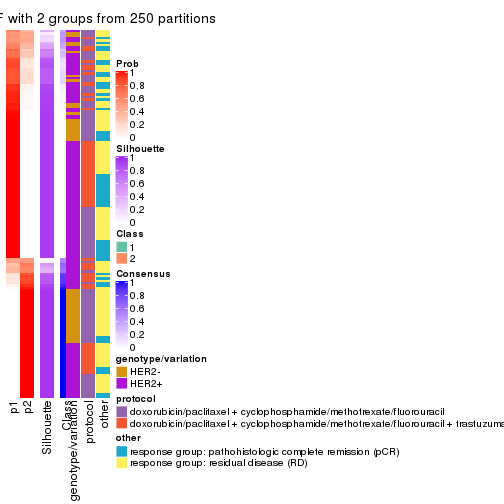</p>

</div>
<div id='tab-SD-NMF-consensus-heatmap-2'>
<pre><code class="r">consensus_heatmap(res, k = 3)
</code></pre>

<p>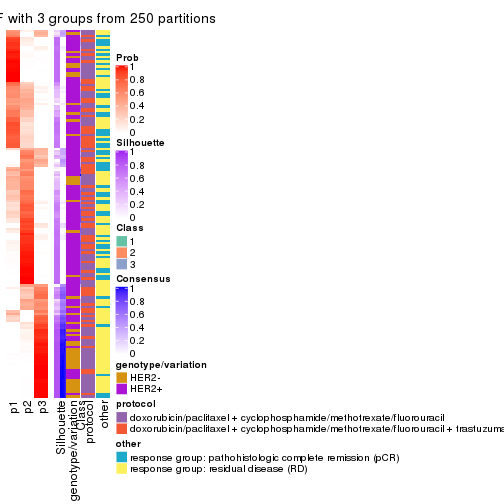</p>

</div>
<div id='tab-SD-NMF-consensus-heatmap-3'>
<pre><code class="r">consensus_heatmap(res, k = 4)
</code></pre>

<p>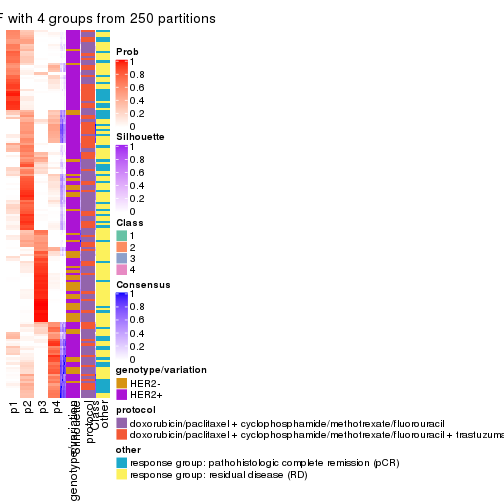</p>

</div>
<div id='tab-SD-NMF-consensus-heatmap-4'>
<pre><code class="r">consensus_heatmap(res, k = 5)
</code></pre>

<p>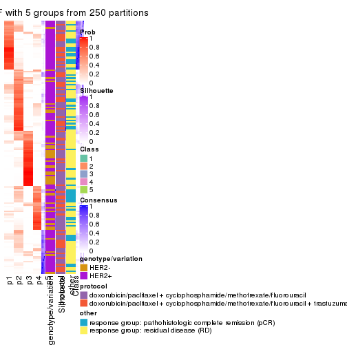</p>

</div>
<div id='tab-SD-NMF-consensus-heatmap-5'>
<pre><code class="r">consensus_heatmap(res, k = 6)
</code></pre>

<p>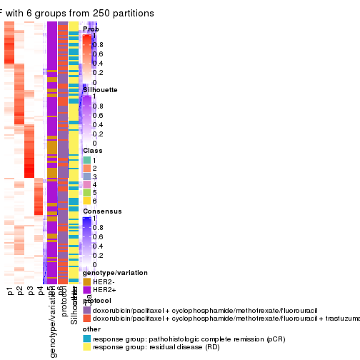</p>

</div>
</div>

Heatmaps for the membership of samples in all partitions to see how consistent they are:


<script>
$( function() {
	$( '#tabs-SD-NMF-membership-heatmap' ).tabs();
} );
</script>
<div id='tabs-SD-NMF-membership-heatmap'>
<ul>
<li><a href='#tab-SD-NMF-membership-heatmap-1'>k = 2</a></li>
<li><a href='#tab-SD-NMF-membership-heatmap-2'>k = 3</a></li>
<li><a href='#tab-SD-NMF-membership-heatmap-3'>k = 4</a></li>
<li><a href='#tab-SD-NMF-membership-heatmap-4'>k = 5</a></li>
<li><a href='#tab-SD-NMF-membership-heatmap-5'>k = 6</a></li>
</ul>
<div id='tab-SD-NMF-membership-heatmap-1'>
<pre><code class="r">membership_heatmap(res, k = 2)
</code></pre>

<p>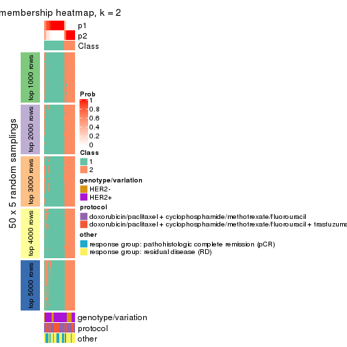</p>

</div>
<div id='tab-SD-NMF-membership-heatmap-2'>
<pre><code class="r">membership_heatmap(res, k = 3)
</code></pre>

<p>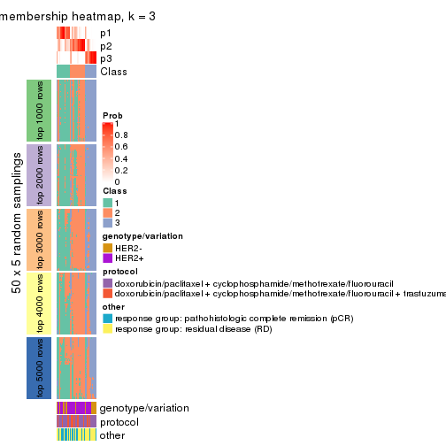</p>

</div>
<div id='tab-SD-NMF-membership-heatmap-3'>
<pre><code class="r">membership_heatmap(res, k = 4)
</code></pre>

<p>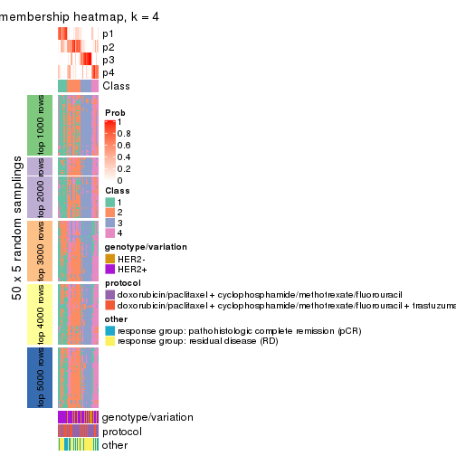</p>

</div>
<div id='tab-SD-NMF-membership-heatmap-4'>
<pre><code class="r">membership_heatmap(res, k = 5)
</code></pre>

<p>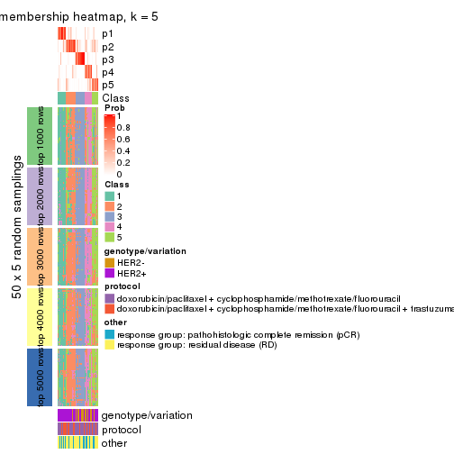</p>

</div>
<div id='tab-SD-NMF-membership-heatmap-5'>
<pre><code class="r">membership_heatmap(res, k = 6)
</code></pre>

<p>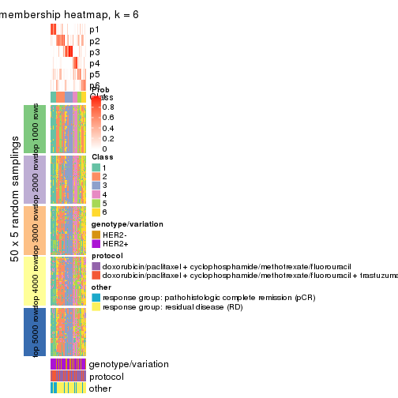</p>

</div>
</div>

As soon as we have had the classes for columns, we can look for signatures
which are significantly different between classes which can be candidate marks
for certain classes. Following are the heatmaps for signatures.


Signature heatmaps where rows are scaled:


<script>
$( function() {
	$( '#tabs-SD-NMF-get-signatures' ).tabs();
} );
</script>
<div id='tabs-SD-NMF-get-signatures'>
<ul>
<li><a href='#tab-SD-NMF-get-signatures-1'>k = 2</a></li>
<li><a href='#tab-SD-NMF-get-signatures-2'>k = 3</a></li>
<li><a href='#tab-SD-NMF-get-signatures-3'>k = 4</a></li>
<li><a href='#tab-SD-NMF-get-signatures-4'>k = 5</a></li>
<li><a href='#tab-SD-NMF-get-signatures-5'>k = 6</a></li>
</ul>
<div id='tab-SD-NMF-get-signatures-1'>
<pre><code class="r">get_signatures(res, k = 2)
</code></pre>

<pre><code>#&gt; Error: The width or height of the raster image is zero, maybe you forget to turn off the
#&gt; previous graphic device or it was corrupted. Run `dev.off()` to close it.
</code></pre>

<p></p>

</div>
<div id='tab-SD-NMF-get-signatures-2'>
<pre><code class="r">get_signatures(res, k = 3)
</code></pre>

<pre><code>#&gt; Error: The width or height of the raster image is zero, maybe you forget to turn off the
#&gt; previous graphic device or it was corrupted. Run `dev.off()` to close it.
</code></pre>

<p></p>

</div>
<div id='tab-SD-NMF-get-signatures-3'>
<pre><code class="r">get_signatures(res, k = 4)
</code></pre>

<pre><code>#&gt; Error: The width or height of the raster image is zero, maybe you forget to turn off the
#&gt; previous graphic device or it was corrupted. Run `dev.off()` to close it.
</code></pre>

<p></p>

</div>
<div id='tab-SD-NMF-get-signatures-4'>
<pre><code class="r">get_signatures(res, k = 5)
</code></pre>

<pre><code>#&gt; Error: The width or height of the raster image is zero, maybe you forget to turn off the
#&gt; previous graphic device or it was corrupted. Run `dev.off()` to close it.
</code></pre>

<p></p>

</div>
<div id='tab-SD-NMF-get-signatures-5'>
<pre><code class="r">get_signatures(res, k = 6)
</code></pre>

<pre><code>#&gt; Error: The width or height of the raster image is zero, maybe you forget to turn off the
#&gt; previous graphic device or it was corrupted. Run `dev.off()` to close it.
</code></pre>

<p></p>

</div>
</div>


Signature heatmaps where rows are not scaled:


<script>
$( function() {
	$( '#tabs-SD-NMF-get-signatures-no-scale' ).tabs();
} );
</script>
<div id='tabs-SD-NMF-get-signatures-no-scale'>
<ul>
<li><a href='#tab-SD-NMF-get-signatures-no-scale-1'>k = 2</a></li>
<li><a href='#tab-SD-NMF-get-signatures-no-scale-2'>k = 3</a></li>
<li><a href='#tab-SD-NMF-get-signatures-no-scale-3'>k = 4</a></li>
<li><a href='#tab-SD-NMF-get-signatures-no-scale-4'>k = 5</a></li>
<li><a href='#tab-SD-NMF-get-signatures-no-scale-5'>k = 6</a></li>
</ul>
<div id='tab-SD-NMF-get-signatures-no-scale-1'>
<pre><code class="r">get_signatures(res, k = 2, scale_rows = FALSE)
</code></pre>

<pre><code>#&gt; Error: The width or height of the raster image is zero, maybe you forget to turn off the
#&gt; previous graphic device or it was corrupted. Run `dev.off()` to close it.
</code></pre>

<p></p>

</div>
<div id='tab-SD-NMF-get-signatures-no-scale-2'>
<pre><code class="r">get_signatures(res, k = 3, scale_rows = FALSE)
</code></pre>

<pre><code>#&gt; Error: The width or height of the raster image is zero, maybe you forget to turn off the
#&gt; previous graphic device or it was corrupted. Run `dev.off()` to close it.
</code></pre>

<p></p>

</div>
<div id='tab-SD-NMF-get-signatures-no-scale-3'>
<pre><code class="r">get_signatures(res, k = 4, scale_rows = FALSE)
</code></pre>

<pre><code>#&gt; Error: The width or height of the raster image is zero, maybe you forget to turn off the
#&gt; previous graphic device or it was corrupted. Run `dev.off()` to close it.
</code></pre>

<p></p>

</div>
<div id='tab-SD-NMF-get-signatures-no-scale-4'>
<pre><code class="r">get_signatures(res, k = 5, scale_rows = FALSE)
</code></pre>

<pre><code>#&gt; Error: The width or height of the raster image is zero, maybe you forget to turn off the
#&gt; previous graphic device or it was corrupted. Run `dev.off()` to close it.
</code></pre>

<p></p>

</div>
<div id='tab-SD-NMF-get-signatures-no-scale-5'>
<pre><code class="r">get_signatures(res, k = 6, scale_rows = FALSE)
</code></pre>

<pre><code>#&gt; Error: The width or height of the raster image is zero, maybe you forget to turn off the
#&gt; previous graphic device or it was corrupted. Run `dev.off()` to close it.
</code></pre>

<p></p>

</div>
</div>


Compare the overlap of signatures from different k:

```r
compare_signatures(res)
```

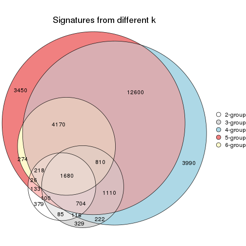

`get_signature()` returns a data frame invisibly. TO get the list of signatures, the function
call should be assigned to a variable explicitly. In following code, if `plot` argument is set
to `FALSE`, no heatmap is plotted while only the differential analysis is performed.

```r
# code only for demonstration
tb = get_signature(res, k = ..., plot = FALSE)
```

An example of the output of `tb` is:

```
#>   which_row         fdr    mean_1    mean_2 scaled_mean_1 scaled_mean_2 km
#> 1        38 0.042760348  8.373488  9.131774    -0.5533452     0.5164555  1
#> 2        40 0.018707592  7.106213  8.469186    -0.6173731     0.5762149  1
#> 3        55 0.019134737 10.221463 11.207825    -0.6159697     0.5749050  1
#> 4        59 0.006059896  5.921854  7.869574    -0.6899429     0.6439467  1
#> 5        60 0.018055526  8.928898 10.211722    -0.6204761     0.5791110  1
#> 6        98 0.009384629 15.714769 14.887706     0.6635654    -0.6193277  2
...
```

The columns in `tb` are:

1. `which_row`: row indices corresponding to the input matrix.
2. `fdr`: FDR for the differential test. 
3. `mean_x`: The mean value in group x.
4. `scaled_mean_x`: The mean value in group x after rows are scaled.
5. `km`: Row groups if k-means clustering is applied to rows.


UMAP plot which shows how samples are separated.


<script>
$( function() {
	$( '#tabs-SD-NMF-dimension-reduction' ).tabs();
} );
</script>
<div id='tabs-SD-NMF-dimension-reduction'>
<ul>
<li><a href='#tab-SD-NMF-dimension-reduction-1'>k = 2</a></li>
<li><a href='#tab-SD-NMF-dimension-reduction-2'>k = 3</a></li>
<li><a href='#tab-SD-NMF-dimension-reduction-3'>k = 4</a></li>
<li><a href='#tab-SD-NMF-dimension-reduction-4'>k = 5</a></li>
<li><a href='#tab-SD-NMF-dimension-reduction-5'>k = 6</a></li>
</ul>
<div id='tab-SD-NMF-dimension-reduction-1'>
<pre><code class="r">dimension_reduction(res, k = 2, method = &quot;UMAP&quot;)
</code></pre>

<p>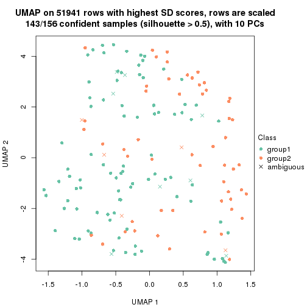</p>

</div>
<div id='tab-SD-NMF-dimension-reduction-2'>
<pre><code class="r">dimension_reduction(res, k = 3, method = &quot;UMAP&quot;)
</code></pre>

<p>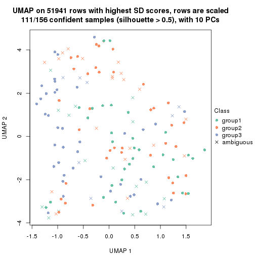</p>

</div>
<div id='tab-SD-NMF-dimension-reduction-3'>
<pre><code class="r">dimension_reduction(res, k = 4, method = &quot;UMAP&quot;)
</code></pre>

<p>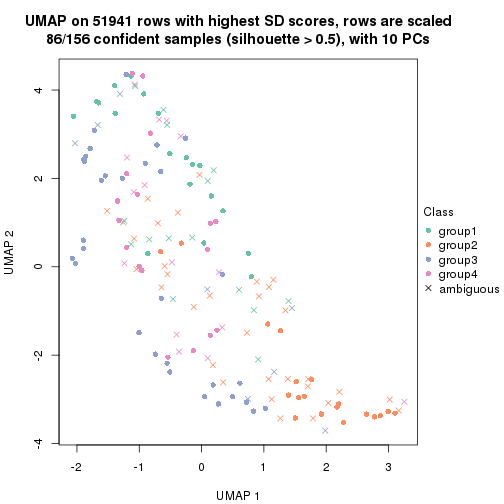</p>

</div>
<div id='tab-SD-NMF-dimension-reduction-4'>
<pre><code class="r">dimension_reduction(res, k = 5, method = &quot;UMAP&quot;)
</code></pre>

<p>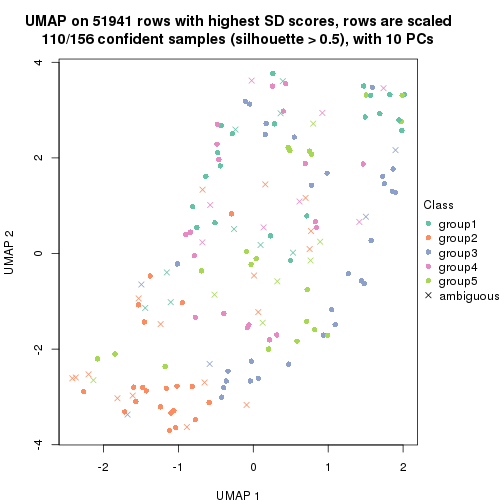</p>

</div>
<div id='tab-SD-NMF-dimension-reduction-5'>
<pre><code class="r">dimension_reduction(res, k = 6, method = &quot;UMAP&quot;)
</code></pre>

<p>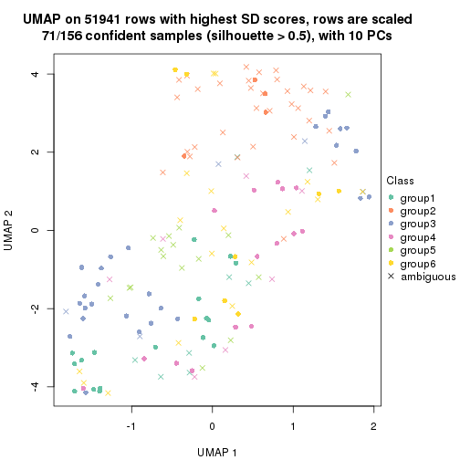</p>

</div>
</div>


Following heatmap shows how subgroups are split when increasing `k`:

```r
collect_classes(res)
```

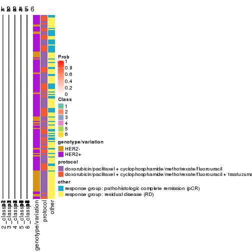


Test correlation between subgroups and known annotations. If the known
annotation is numeric, one-way ANOVA test is applied, and if the known
annotation is discrete, chi-squared contingency table test is applied.

```r
test_to_known_factors(res)
```

```
#>          n genotype/variation(p) protocol(p) other(p) k
#> SD:NMF 143              1.46e-03     0.62232  0.02911 2
#> SD:NMF 111              1.25e-05     0.29103  0.00503 3
#> SD:NMF  86              2.80e-05     0.03877  0.02155 4
#> SD:NMF 110              1.64e-05     0.01626  0.00159 5
#> SD:NMF  71              8.97e-05     0.00959  0.00293 6
```


If matrix rows can be associated to genes, consider to use `functional_enrichment(res,
...)` to perform function enrichment for the signature genes. See [this vignette](http://bioconductor.org/packages/devel/bioc/vignettes/cola/inst/doc/functional_enrichment.html) for more detailed explanations.


 

---------------------------------------------------


### CV:hclust


The object with results only for a single top-value method and a single partition method 
can be extracted as:

```r
res = res_list["CV", "hclust"]
# you can also extract it by
# res = res_list["CV:hclust"]
```

A summary of `res` and all the functions that can be applied to it:

```r
res
```

```
#> A 'ConsensusPartition' object with k = 2, 3, 4, 5, 6.
#>   On a matrix with 51941 rows and 156 columns.
#>   Top rows (1000, 2000, 3000, 4000, 5000) are extracted by 'CV' method.
#>   Subgroups are detected by 'hclust' method.
#>   Performed in total 1250 partitions by row resampling.
#>   Best k for subgroups seems to be 2.
#> 
#> Following methods can be applied to this 'ConsensusPartition' object:
#>  [1] "cola_report"             "collect_classes"         "collect_plots"          
#>  [4] "collect_stats"           "colnames"                "compare_signatures"     
#>  [7] "consensus_heatmap"       "dimension_reduction"     "functional_enrichment"  
#> [10] "get_anno_col"            "get_anno"                "get_classes"            
#> [13] "get_consensus"           "get_matrix"              "get_membership"         
#> [16] "get_param"               "get_signatures"          "get_stats"              
#> [19] "is_best_k"               "is_stable_k"             "membership_heatmap"     
#> [22] "ncol"                    "nrow"                    "plot_ecdf"              
#> [25] "rownames"                "select_partition_number" "show"                   
#> [28] "suggest_best_k"          "test_to_known_factors"
```

`collect_plots()` function collects all the plots made from `res` for all `k` (number of partitions)
into one single page to provide an easy and fast comparison between different `k`.

```r
collect_plots(res)
```

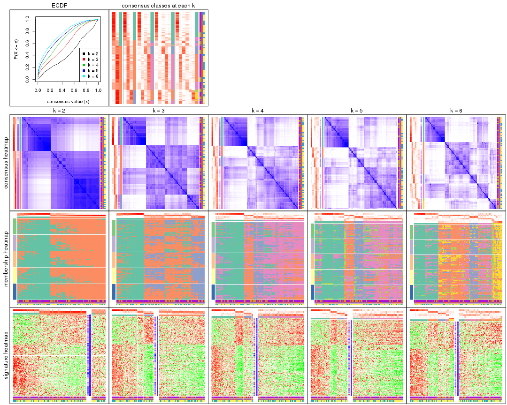

The plots are:

- The first row: a plot of the ECDF (empirical cumulative distribution
  function) curves of the consensus matrix for each `k` and the heatmap of
  predicted classes for each `k`.
- The second row: heatmaps of the consensus matrix for each `k`.
- The third row: heatmaps of the membership matrix for each `k`.
- The fouth row: heatmaps of the signatures for each `k`.

All the plots in panels can be made by individual functions and they are
plotted later in this section.

`select_partition_number()` produces several plots showing different
statistics for choosing "optimized" `k`. There are following statistics:

- ECDF curves of the consensus matrix for each `k`;
- 1-PAC. [The PAC
  score](https://en.wikipedia.org/wiki/Consensus_clustering#Over-interpretation_potential_of_consensus_clustering)
  measures the proportion of the ambiguous subgrouping.
- Mean silhouette score.
- Concordance. The mean probability of fiting the consensus class ids in all
  partitions.
- Area increased. Denote $A_k$ as the area under the ECDF curve for current
  `k`, the area increased is defined as $A_k - A_{k-1}$.
- Rand index. The percent of pairs of samples that are both in a same cluster
  or both are not in a same cluster in the partition of k and k-1.
- Jaccard index. The ratio of pairs of samples are both in a same cluster in
  the partition of k and k-1 and the pairs of samples are both in a same
  cluster in the partition k or k-1.

The detailed explanations of these statistics can be found in [the _cola_
vignette](http://bioconductor.org/packages/devel/bioc/vignettes/cola/inst/doc/cola.html#toc_13).

Generally speaking, lower PAC score, higher mean silhouette score or higher
concordance corresponds to better partition. Rand index and Jaccard index
measure how similar the current partition is compared to partition with `k-1`.
If they are too similar, we won't accept `k` is better than `k-1`.

```r
select_partition_number(res)
```

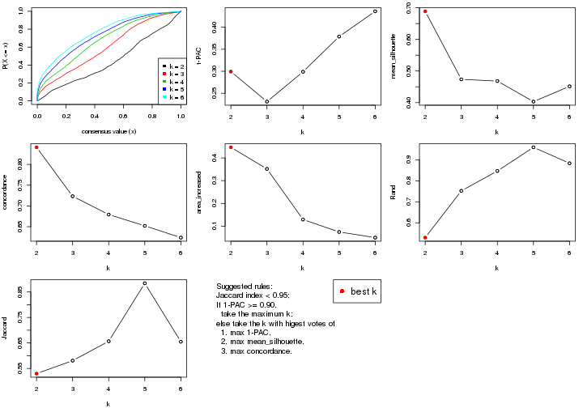

The numeric values for all these statistics can be obtained by `get_stats()`.

```r
get_stats(res)
```

```
#>   k 1-PAC mean_silhouette concordance area_increased  Rand Jaccard
#> 2 2 0.299           0.689       0.841         0.4467 0.530   0.530
#> 3 3 0.231           0.474       0.723         0.3517 0.752   0.581
#> 4 4 0.299           0.468       0.679         0.1291 0.847   0.657
#> 5 5 0.379           0.403       0.652         0.0745 0.959   0.884
#> 6 6 0.436           0.452       0.624         0.0497 0.883   0.655
```

`suggest_best_k()` suggests the best $k$ based on these statistics. The rules are as follows:

- All $k$ with Jaccard index larger than 0.95 are removed because increasing
  $k$ does not provide enough extra information. If all $k$ are removed, it is
  marked as no subgroup is detected.
- For all $k$ with 1-PAC score larger than 0.9, the maximal $k$ is taken as
  the best $k$, and other $k$ are marked as optional $k$.
- If it does not fit the second rule. The $k$ with the maximal vote of the
  highest 1-PAC score, highest mean silhouette, and highest concordance is
  taken as the best $k$.

```r
suggest_best_k(res)
```

```
#> [1] 2
```


Following shows the table of the partitions (You need to click the **show/hide
code output** link to see it). The membership matrix (columns with name `p*`)
is inferred by
[`clue::cl_consensus()`](https://www.rdocumentation.org/link/cl_consensus?package=clue)
function with the `SE` method. Basically the value in the membership matrix
represents the probability to belong to a certain group. The finall class
label for an item is determined with the group with highest probability it
belongs to.

In `get_classes()` function, the entropy is calculated from the membership
matrix and the silhouette score is calculated from the consensus matrix.


<script>
$( function() {
	$( '#tabs-CV-hclust-get-classes' ).tabs();
} );
</script>
<div id='tabs-CV-hclust-get-classes'>
<ul>
<li><a href='#tab-CV-hclust-get-classes-1'>k = 2</a></li>
<li><a href='#tab-CV-hclust-get-classes-2'>k = 3</a></li>
<li><a href='#tab-CV-hclust-get-classes-3'>k = 4</a></li>
<li><a href='#tab-CV-hclust-get-classes-4'>k = 5</a></li>
<li><a href='#tab-CV-hclust-get-classes-5'>k = 6</a></li>
</ul>

<div id='tab-CV-hclust-get-classes-1'>
<p><a id='tab-CV-hclust-get-classes-1-a' style='color:#0366d6' href='#'>show/hide code output</a></p>
<pre><code class="r">cbind(get_classes(res, k = 2), get_membership(res, k = 2))
</code></pre>

<pre><code>#&gt;            class entropy silhouette    p1    p2
#&gt; GSM1232995     2  0.0938    0.80331 0.012 0.988
#&gt; GSM1233002     2  0.9393    0.54099 0.356 0.644
#&gt; GSM1233003     1  0.2043    0.82535 0.968 0.032
#&gt; GSM1233014     2  0.4939    0.80911 0.108 0.892
#&gt; GSM1233015     1  0.2423    0.82386 0.960 0.040
#&gt; GSM1233016     2  0.8955    0.63402 0.312 0.688
#&gt; GSM1233024     2  0.3114    0.81884 0.056 0.944
#&gt; GSM1233049     1  0.0938    0.81946 0.988 0.012
#&gt; GSM1233064     2  0.4022    0.81741 0.080 0.920
#&gt; GSM1233068     1  0.9393    0.45669 0.644 0.356
#&gt; GSM1233073     1  0.9866    0.20980 0.568 0.432
#&gt; GSM1233093     1  0.0938    0.81946 0.988 0.012
#&gt; GSM1233115     1  0.5737    0.78619 0.864 0.136
#&gt; GSM1232992     2  0.0938    0.80686 0.012 0.988
#&gt; GSM1232993     2  0.6531    0.77744 0.168 0.832
#&gt; GSM1233005     2  0.0938    0.80686 0.012 0.988
#&gt; GSM1233007     2  0.3733    0.81818 0.072 0.928
#&gt; GSM1233010     2  0.9963    0.24497 0.464 0.536
#&gt; GSM1233013     2  0.0938    0.79819 0.012 0.988
#&gt; GSM1233018     2  0.0376    0.80260 0.004 0.996
#&gt; GSM1233019     2  0.2778    0.81858 0.048 0.952
#&gt; GSM1233021     2  0.0938    0.80686 0.012 0.988
#&gt; GSM1233025     2  0.9977    0.21590 0.472 0.528
#&gt; GSM1233029     2  0.2948    0.81902 0.052 0.948
#&gt; GSM1233030     2  0.0938    0.79227 0.012 0.988
#&gt; GSM1233031     2  0.9909    0.29619 0.444 0.556
#&gt; GSM1233032     1  0.3733    0.82007 0.928 0.072
#&gt; GSM1233035     2  0.9909    0.29141 0.444 0.556
#&gt; GSM1233038     1  0.1184    0.82138 0.984 0.016
#&gt; GSM1233039     2  0.3879    0.81830 0.076 0.924
#&gt; GSM1233042     2  0.9170    0.58214 0.332 0.668
#&gt; GSM1233043     2  0.9170    0.58214 0.332 0.668
#&gt; GSM1233044     1  0.9732    0.29749 0.596 0.404
#&gt; GSM1233046     1  0.8813    0.57299 0.700 0.300
#&gt; GSM1233051     1  0.3114    0.82323 0.944 0.056
#&gt; GSM1233054     1  0.2948    0.82334 0.948 0.052
#&gt; GSM1233057     2  0.6973    0.76657 0.188 0.812
#&gt; GSM1233060     2  0.9170    0.58052 0.332 0.668
#&gt; GSM1233062     2  0.3879    0.81704 0.076 0.924
#&gt; GSM1233075     2  0.1843    0.81020 0.028 0.972
#&gt; GSM1233078     2  0.9427    0.54407 0.360 0.640
#&gt; GSM1233079     1  0.3879    0.81779 0.924 0.076
#&gt; GSM1233082     1  0.6712    0.75256 0.824 0.176
#&gt; GSM1233083     1  0.1633    0.82400 0.976 0.024
#&gt; GSM1233091     1  0.9983    0.00992 0.524 0.476
#&gt; GSM1233095     1  0.1184    0.82071 0.984 0.016
#&gt; GSM1233096     1  0.1843    0.82374 0.972 0.028
#&gt; GSM1233101     1  0.1414    0.82249 0.980 0.020
#&gt; GSM1233105     1  0.8661    0.59235 0.712 0.288
#&gt; GSM1233117     2  0.0938    0.79227 0.012 0.988
#&gt; GSM1233118     2  0.2778    0.81845 0.048 0.952
#&gt; GSM1233001     2  0.0938    0.79227 0.012 0.988
#&gt; GSM1233006     2  0.3431    0.81861 0.064 0.936
#&gt; GSM1233008     2  0.3584    0.81989 0.068 0.932
#&gt; GSM1233009     2  0.0376    0.80288 0.004 0.996
#&gt; GSM1233017     2  0.2423    0.81695 0.040 0.960
#&gt; GSM1233020     2  0.0376    0.80260 0.004 0.996
#&gt; GSM1233022     2  0.5294    0.80434 0.120 0.880
#&gt; GSM1233026     2  0.9795    0.39965 0.416 0.584
#&gt; GSM1233028     2  0.9944    0.26097 0.456 0.544
#&gt; GSM1233034     2  0.3584    0.81986 0.068 0.932
#&gt; GSM1233040     1  0.1843    0.82374 0.972 0.028
#&gt; GSM1233048     1  0.1184    0.82138 0.984 0.016
#&gt; GSM1233056     1  0.0938    0.81946 0.988 0.012
#&gt; GSM1233058     2  0.9977    0.22212 0.472 0.528
#&gt; GSM1233059     1  0.0938    0.81946 0.988 0.012
#&gt; GSM1233066     2  0.9000    0.61938 0.316 0.684
#&gt; GSM1233071     2  0.5946    0.79448 0.144 0.856
#&gt; GSM1233074     2  0.1843    0.81020 0.028 0.972
#&gt; GSM1233076     2  0.3274    0.81922 0.060 0.940
#&gt; GSM1233080     1  0.0938    0.81946 0.988 0.012
#&gt; GSM1233088     2  0.6623    0.77939 0.172 0.828
#&gt; GSM1233090     1  0.0938    0.81946 0.988 0.012
#&gt; GSM1233092     2  0.5737    0.79961 0.136 0.864
#&gt; GSM1233094     2  0.7745    0.73402 0.228 0.772
#&gt; GSM1233097     2  0.9909    0.30515 0.444 0.556
#&gt; GSM1233100     2  0.9850    0.35008 0.428 0.572
#&gt; GSM1233104     2  0.8267    0.69449 0.260 0.740
#&gt; GSM1233106     1  0.5408    0.79527 0.876 0.124
#&gt; GSM1233111     1  0.1843    0.82374 0.972 0.028
#&gt; GSM1233122     2  0.3274    0.81800 0.060 0.940
#&gt; GSM1233146     2  0.9286    0.56404 0.344 0.656
#&gt; GSM1232994     2  0.1184    0.80846 0.016 0.984
#&gt; GSM1232996     2  0.0938    0.80681 0.012 0.988
#&gt; GSM1232997     2  0.3114    0.81916 0.056 0.944
#&gt; GSM1232998     2  0.4022    0.81586 0.080 0.920
#&gt; GSM1232999     2  0.2423    0.81813 0.040 0.960
#&gt; GSM1233000     2  0.1414    0.81084 0.020 0.980
#&gt; GSM1233004     1  0.9286    0.48844 0.656 0.344
#&gt; GSM1233011     2  0.8016    0.71360 0.244 0.756
#&gt; GSM1233012     2  0.2236    0.81633 0.036 0.964
#&gt; GSM1233023     2  0.2948    0.81879 0.052 0.948
#&gt; GSM1233027     2  0.2236    0.81478 0.036 0.964
#&gt; GSM1233033     1  0.1633    0.82409 0.976 0.024
#&gt; GSM1233036     2  0.6048    0.79230 0.148 0.852
#&gt; GSM1233037     2  0.7056    0.76363 0.192 0.808
#&gt; GSM1233041     1  0.0938    0.81946 0.988 0.012
#&gt; GSM1233045     2  0.9970    0.23800 0.468 0.532
#&gt; GSM1233047     1  0.4562    0.81108 0.904 0.096
#&gt; GSM1233050     1  0.1184    0.82071 0.984 0.016
#&gt; GSM1233052     1  0.6801    0.75223 0.820 0.180
#&gt; GSM1233053     1  0.2948    0.82334 0.948 0.052
#&gt; GSM1233055     1  0.0938    0.81946 0.988 0.012
#&gt; GSM1233061     2  0.9795    0.41459 0.416 0.584
#&gt; GSM1233063     1  0.2236    0.82502 0.964 0.036
#&gt; GSM1233065     2  0.2948    0.81909 0.052 0.948
#&gt; GSM1233070     2  0.4022    0.81672 0.080 0.920
#&gt; GSM1233077     2  0.9087    0.60568 0.324 0.676
#&gt; GSM1233081     1  0.6438    0.76818 0.836 0.164
#&gt; GSM1233084     1  0.0938    0.81946 0.988 0.012
#&gt; GSM1233087     1  0.4431    0.81241 0.908 0.092
#&gt; GSM1233089     2  0.2423    0.81628 0.040 0.960
#&gt; GSM1233099     1  0.7883    0.68174 0.764 0.236
#&gt; GSM1233112     1  0.0938    0.81946 0.988 0.012
#&gt; GSM1233085     1  0.6887    0.74701 0.816 0.184
#&gt; GSM1233098     2  0.2778    0.81856 0.048 0.952
#&gt; GSM1233114     1  0.9996   -0.06112 0.512 0.488
#&gt; GSM1233119     2  0.9944    0.27174 0.456 0.544
#&gt; GSM1233129     2  0.2948    0.81903 0.052 0.948
#&gt; GSM1233132     1  0.7376    0.71746 0.792 0.208
#&gt; GSM1233139     2  0.2778    0.82008 0.048 0.952
#&gt; GSM1233143     2  0.1414    0.79509 0.020 0.980
#&gt; GSM1233145     1  0.2423    0.82481 0.960 0.040
#&gt; GSM1233067     2  0.0938    0.80206 0.012 0.988
#&gt; GSM1233069     2  0.8813    0.63322 0.300 0.700
#&gt; GSM1233072     2  0.3431    0.81793 0.064 0.936
#&gt; GSM1233086     2  0.7528    0.74094 0.216 0.784
#&gt; GSM1233102     1  0.7745    0.68991 0.772 0.228
#&gt; GSM1233103     1  0.9795    0.27067 0.584 0.416
#&gt; GSM1233107     2  0.5946    0.78912 0.144 0.856
#&gt; GSM1233108     1  0.6148    0.77697 0.848 0.152
#&gt; GSM1233109     1  0.9881    0.16240 0.564 0.436
#&gt; GSM1233110     2  0.9580    0.49896 0.380 0.620
#&gt; GSM1233113     2  0.0938    0.79227 0.012 0.988
#&gt; GSM1233116     2  0.0938    0.79227 0.012 0.988
#&gt; GSM1233120     1  0.7815    0.68788 0.768 0.232
#&gt; GSM1233121     2  0.9170    0.59178 0.332 0.668
#&gt; GSM1233123     2  0.9552    0.50810 0.376 0.624
#&gt; GSM1233124     2  0.9552    0.50382 0.376 0.624
#&gt; GSM1233125     1  0.5737    0.78758 0.864 0.136
#&gt; GSM1233126     2  0.7883    0.72865 0.236 0.764
#&gt; GSM1233127     2  0.2043    0.81191 0.032 0.968
#&gt; GSM1233128     1  0.1633    0.82372 0.976 0.024
#&gt; GSM1233130     2  0.9044    0.61419 0.320 0.680
#&gt; GSM1233131     1  0.9754    0.29868 0.592 0.408
#&gt; GSM1233133     1  0.9983   -0.02237 0.524 0.476
#&gt; GSM1233134     2  0.5294    0.80585 0.120 0.880
#&gt; GSM1233135     2  0.1184    0.79943 0.016 0.984
#&gt; GSM1233136     2  0.7602    0.73867 0.220 0.780
#&gt; GSM1233137     1  0.9983   -0.01723 0.524 0.476
#&gt; GSM1233138     2  0.7815    0.73256 0.232 0.768
#&gt; GSM1233140     1  0.4562    0.81119 0.904 0.096
#&gt; GSM1233141     2  0.0938    0.80613 0.012 0.988
#&gt; GSM1233142     2  0.2043    0.81191 0.032 0.968
#&gt; GSM1233144     2  1.0000    0.12751 0.496 0.504
#&gt; GSM1233147     2  0.4690    0.81152 0.100 0.900
</code></pre>

<script>
$('#tab-CV-hclust-get-classes-1-a').parent().next().next().hide();
$('#tab-CV-hclust-get-classes-1-a').click(function(){
  $('#tab-CV-hclust-get-classes-1-a').parent().next().next().toggle();
  return(false);
});
</script>
</div>

<div id='tab-CV-hclust-get-classes-2'>
<p><a id='tab-CV-hclust-get-classes-2-a' style='color:#0366d6' href='#'>show/hide code output</a></p>
<pre><code class="r">cbind(get_classes(res, k = 3), get_membership(res, k = 3))
</code></pre>

<pre><code>#&gt;            class entropy silhouette    p1    p2    p3
#&gt; GSM1232995     3  0.5397    0.70898 0.000 0.280 0.720
#&gt; GSM1233002     2  0.6696    0.51427 0.188 0.736 0.076
#&gt; GSM1233003     1  0.1529    0.84073 0.960 0.040 0.000
#&gt; GSM1233014     2  0.7124    0.25148 0.048 0.656 0.296
#&gt; GSM1233015     1  0.3295    0.83684 0.896 0.096 0.008
#&gt; GSM1233016     2  0.6902    0.50837 0.168 0.732 0.100
#&gt; GSM1233024     2  0.6264    0.02039 0.004 0.616 0.380
#&gt; GSM1233049     1  0.0000    0.83601 1.000 0.000 0.000
#&gt; GSM1233064     2  0.6507    0.29707 0.028 0.688 0.284
#&gt; GSM1233068     1  0.7493    0.10993 0.484 0.480 0.036
#&gt; GSM1233073     2  0.6896    0.19914 0.392 0.588 0.020
#&gt; GSM1233093     1  0.0000    0.83601 1.000 0.000 0.000
#&gt; GSM1233115     1  0.5803    0.72236 0.736 0.248 0.016
#&gt; GSM1232992     3  0.6299    0.41517 0.000 0.476 0.524
#&gt; GSM1232993     2  0.5355    0.43619 0.032 0.800 0.168
#&gt; GSM1233005     3  0.6299    0.41429 0.000 0.476 0.524
#&gt; GSM1233007     2  0.6019    0.27157 0.012 0.700 0.288
#&gt; GSM1233010     2  0.7124    0.49775 0.272 0.672 0.056
#&gt; GSM1233013     3  0.5529    0.66550 0.000 0.296 0.704
#&gt; GSM1233018     3  0.6154    0.52774 0.000 0.408 0.592
#&gt; GSM1233019     2  0.6180   -0.12961 0.000 0.584 0.416
#&gt; GSM1233021     3  0.6280    0.44544 0.000 0.460 0.540
#&gt; GSM1233025     2  0.7453    0.46063 0.292 0.644 0.064
#&gt; GSM1233029     2  0.6228    0.03725 0.004 0.624 0.372
#&gt; GSM1233030     3  0.4062    0.67593 0.000 0.164 0.836
#&gt; GSM1233031     2  0.8238    0.45732 0.300 0.596 0.104
#&gt; GSM1233032     1  0.4261    0.82177 0.848 0.140 0.012
#&gt; GSM1233035     2  0.8625    0.42837 0.316 0.560 0.124
#&gt; GSM1233038     1  0.1031    0.83954 0.976 0.024 0.000
#&gt; GSM1233039     2  0.6441    0.30702 0.028 0.696 0.276
#&gt; GSM1233042     2  0.6829    0.50968 0.168 0.736 0.096
#&gt; GSM1233043     2  0.6829    0.50968 0.168 0.736 0.096
#&gt; GSM1233044     2  0.6763    0.06421 0.436 0.552 0.012
#&gt; GSM1233046     1  0.6793    0.32109 0.536 0.452 0.012
#&gt; GSM1233051     1  0.3826    0.82811 0.868 0.124 0.008
#&gt; GSM1233054     1  0.3966    0.82710 0.876 0.100 0.024
#&gt; GSM1233057     2  0.6559    0.38615 0.040 0.708 0.252
#&gt; GSM1233060     2  0.7027    0.50844 0.172 0.724 0.104
#&gt; GSM1233062     2  0.6357    0.16479 0.012 0.652 0.336
#&gt; GSM1233075     3  0.5882    0.62348 0.000 0.348 0.652
#&gt; GSM1233078     2  0.6865    0.49548 0.160 0.736 0.104
#&gt; GSM1233079     1  0.4862    0.80785 0.820 0.160 0.020
#&gt; GSM1233082     1  0.6113    0.64465 0.688 0.300 0.012
#&gt; GSM1233083     1  0.1753    0.84218 0.952 0.048 0.000
#&gt; GSM1233091     2  0.8034    0.27731 0.392 0.540 0.068
#&gt; GSM1233095     1  0.0237    0.83635 0.996 0.004 0.000
#&gt; GSM1233096     1  0.2860    0.83864 0.912 0.084 0.004
#&gt; GSM1233101     1  0.0747    0.83939 0.984 0.016 0.000
#&gt; GSM1233105     1  0.6724    0.41753 0.568 0.420 0.012
#&gt; GSM1233117     3  0.4002    0.69100 0.000 0.160 0.840
#&gt; GSM1233118     2  0.6495   -0.27709 0.004 0.536 0.460
#&gt; GSM1233001     3  0.3619    0.67306 0.000 0.136 0.864
#&gt; GSM1233006     2  0.5982    0.19156 0.004 0.668 0.328
#&gt; GSM1233008     2  0.6849    0.05586 0.020 0.600 0.380
#&gt; GSM1233009     3  0.6244    0.42083 0.000 0.440 0.560
#&gt; GSM1233017     2  0.6274   -0.28479 0.000 0.544 0.456
#&gt; GSM1233020     3  0.5560    0.68250 0.000 0.300 0.700
#&gt; GSM1233022     2  0.6839    0.29009 0.044 0.684 0.272
#&gt; GSM1233026     2  0.6981    0.51930 0.228 0.704 0.068
#&gt; GSM1233028     2  0.7112    0.49638 0.260 0.680 0.060
#&gt; GSM1233034     2  0.6627    0.19804 0.020 0.644 0.336
#&gt; GSM1233040     1  0.2860    0.83864 0.912 0.084 0.004
#&gt; GSM1233048     1  0.0424    0.83824 0.992 0.008 0.000
#&gt; GSM1233056     1  0.0000    0.83601 1.000 0.000 0.000
#&gt; GSM1233058     2  0.7277    0.48350 0.280 0.660 0.060
#&gt; GSM1233059     1  0.0000    0.83601 1.000 0.000 0.000
#&gt; GSM1233066     2  0.6856    0.50020 0.132 0.740 0.128
#&gt; GSM1233071     2  0.6633    0.34162 0.040 0.700 0.260
#&gt; GSM1233074     3  0.5882    0.62348 0.000 0.348 0.652
#&gt; GSM1233076     2  0.6597    0.24390 0.024 0.664 0.312
#&gt; GSM1233080     1  0.0000    0.83601 1.000 0.000 0.000
#&gt; GSM1233088     2  0.7677    0.39195 0.092 0.656 0.252
#&gt; GSM1233090     1  0.0000    0.83601 1.000 0.000 0.000
#&gt; GSM1233092     2  0.6124    0.38940 0.036 0.744 0.220
#&gt; GSM1233094     2  0.5243    0.49345 0.072 0.828 0.100
#&gt; GSM1233097     2  0.6913    0.50199 0.248 0.696 0.056
#&gt; GSM1233100     2  0.6950    0.50391 0.252 0.692 0.056
#&gt; GSM1233104     2  0.7361    0.49313 0.124 0.704 0.172
#&gt; GSM1233106     1  0.5115    0.74908 0.768 0.228 0.004
#&gt; GSM1233111     1  0.2860    0.83864 0.912 0.084 0.004
#&gt; GSM1233122     2  0.5988    0.09460 0.000 0.632 0.368
#&gt; GSM1233146     2  0.6757    0.51403 0.180 0.736 0.084
#&gt; GSM1232994     2  0.6307   -0.31127 0.000 0.512 0.488
#&gt; GSM1232996     3  0.6432    0.48966 0.004 0.428 0.568
#&gt; GSM1232997     2  0.6359    0.10111 0.008 0.628 0.364
#&gt; GSM1232998     2  0.7271    0.11267 0.040 0.608 0.352
#&gt; GSM1232999     2  0.6140   -0.03831 0.000 0.596 0.404
#&gt; GSM1233000     2  0.6302   -0.28862 0.000 0.520 0.480
#&gt; GSM1233004     2  0.7997   -0.18284 0.468 0.472 0.060
#&gt; GSM1233011     2  0.7283    0.49317 0.116 0.708 0.176
#&gt; GSM1233012     3  0.6079    0.58505 0.000 0.388 0.612
#&gt; GSM1233023     2  0.6298    0.00887 0.004 0.608 0.388
#&gt; GSM1233027     2  0.6386   -0.10699 0.004 0.584 0.412
#&gt; GSM1233033     1  0.1289    0.84083 0.968 0.032 0.000
#&gt; GSM1233036     2  0.7308    0.26974 0.056 0.648 0.296
#&gt; GSM1233037     2  0.7157    0.36464 0.056 0.668 0.276
#&gt; GSM1233041     1  0.0000    0.83601 1.000 0.000 0.000
#&gt; GSM1233045     2  0.7246    0.49120 0.276 0.664 0.060
#&gt; GSM1233047     1  0.5178    0.79693 0.808 0.164 0.028
#&gt; GSM1233050     1  0.0829    0.83863 0.984 0.012 0.004
#&gt; GSM1233052     1  0.6018    0.63791 0.684 0.308 0.008
#&gt; GSM1233053     1  0.3966    0.82710 0.876 0.100 0.024
#&gt; GSM1233055     1  0.0000    0.83601 1.000 0.000 0.000
#&gt; GSM1233061     2  0.6527    0.50135 0.188 0.744 0.068
#&gt; GSM1233063     1  0.3573    0.83025 0.876 0.120 0.004
#&gt; GSM1233065     2  0.6398   -0.05160 0.004 0.580 0.416
#&gt; GSM1233070     2  0.5956    0.31452 0.016 0.720 0.264
#&gt; GSM1233077     2  0.6111    0.48927 0.112 0.784 0.104
#&gt; GSM1233081     1  0.6099    0.73384 0.740 0.228 0.032
#&gt; GSM1233084     1  0.0000    0.83601 1.000 0.000 0.000
#&gt; GSM1233087     1  0.3851    0.81284 0.860 0.136 0.004
#&gt; GSM1233089     2  0.6008    0.17381 0.004 0.664 0.332
#&gt; GSM1233099     1  0.6584    0.50385 0.608 0.380 0.012
#&gt; GSM1233112     1  0.0000    0.83601 1.000 0.000 0.000
#&gt; GSM1233085     1  0.6703    0.67214 0.692 0.268 0.040
#&gt; GSM1233098     2  0.6345   -0.05699 0.004 0.596 0.400
#&gt; GSM1233114     2  0.7961    0.33984 0.336 0.588 0.076
#&gt; GSM1233119     2  0.7416    0.48482 0.276 0.656 0.068
#&gt; GSM1233129     2  0.6468   -0.24651 0.004 0.552 0.444
#&gt; GSM1233132     1  0.6470    0.55842 0.632 0.356 0.012
#&gt; GSM1233139     2  0.6608   -0.15311 0.008 0.560 0.432
#&gt; GSM1233143     3  0.4062    0.69504 0.000 0.164 0.836
#&gt; GSM1233145     1  0.2200    0.83806 0.940 0.056 0.004
#&gt; GSM1233067     3  0.4796    0.70852 0.000 0.220 0.780
#&gt; GSM1233069     2  0.6590    0.47496 0.112 0.756 0.132
#&gt; GSM1233072     2  0.5835    0.16182 0.000 0.660 0.340
#&gt; GSM1233086     2  0.6543    0.47373 0.076 0.748 0.176
#&gt; GSM1233102     1  0.6448    0.54264 0.636 0.352 0.012
#&gt; GSM1233103     2  0.7250    0.14907 0.396 0.572 0.032
#&gt; GSM1233107     2  0.6155    0.26717 0.008 0.664 0.328
#&gt; GSM1233108     1  0.6148    0.72265 0.728 0.244 0.028
#&gt; GSM1233109     2  0.7768    0.23599 0.344 0.592 0.064
#&gt; GSM1233110     2  0.6975    0.48263 0.144 0.732 0.124
#&gt; GSM1233113     3  0.4002    0.69642 0.000 0.160 0.840
#&gt; GSM1233116     3  0.3752    0.68382 0.000 0.144 0.856
#&gt; GSM1233120     1  0.6566    0.51392 0.612 0.376 0.012
#&gt; GSM1233121     2  0.6100    0.49125 0.120 0.784 0.096
#&gt; GSM1233123     2  0.6752    0.48796 0.152 0.744 0.104
#&gt; GSM1233124     2  0.8125    0.46222 0.176 0.648 0.176
#&gt; GSM1233125     1  0.5551    0.75852 0.768 0.212 0.020
#&gt; GSM1233126     2  0.5863    0.48795 0.084 0.796 0.120
#&gt; GSM1233127     3  0.5365    0.67532 0.004 0.252 0.744
#&gt; GSM1233128     1  0.2173    0.84344 0.944 0.048 0.008
#&gt; GSM1233130     2  0.6039    0.49227 0.108 0.788 0.104
#&gt; GSM1233131     2  0.7263    0.12979 0.400 0.568 0.032
#&gt; GSM1233133     2  0.7925    0.32244 0.316 0.604 0.080
#&gt; GSM1233134     3  0.6518    0.17550 0.004 0.484 0.512
#&gt; GSM1233135     3  0.4842    0.70657 0.000 0.224 0.776
#&gt; GSM1233136     2  0.6264    0.46219 0.068 0.764 0.168
#&gt; GSM1233137     2  0.7916    0.35361 0.292 0.620 0.088
#&gt; GSM1233138     2  0.5780    0.48531 0.080 0.800 0.120
#&gt; GSM1233140     1  0.4634    0.80449 0.824 0.164 0.012
#&gt; GSM1233141     3  0.5178    0.68917 0.000 0.256 0.744
#&gt; GSM1233142     3  0.5365    0.67532 0.004 0.252 0.744
#&gt; GSM1233144     2  0.7770    0.39497 0.272 0.640 0.088
#&gt; GSM1233147     2  0.6839    0.32516 0.044 0.684 0.272
</code></pre>

<script>
$('#tab-CV-hclust-get-classes-2-a').parent().next().next().hide();
$('#tab-CV-hclust-get-classes-2-a').click(function(){
  $('#tab-CV-hclust-get-classes-2-a').parent().next().next().toggle();
  return(false);
});
</script>
</div>

<div id='tab-CV-hclust-get-classes-3'>
<p><a id='tab-CV-hclust-get-classes-3-a' style='color:#0366d6' href='#'>show/hide code output</a></p>
<pre><code class="r">cbind(get_classes(res, k = 4), get_membership(res, k = 4))
</code></pre>

<pre><code>#&gt;            class entropy silhouette    p1    p2    p3    p4
#&gt; GSM1232995     2  0.6275    0.65558 0.000 0.596 0.076 0.328
#&gt; GSM1233002     4  0.7393    0.30523 0.184 0.032 0.172 0.612
#&gt; GSM1233003     1  0.1721    0.78867 0.952 0.008 0.012 0.028
#&gt; GSM1233014     4  0.5128    0.48140 0.032 0.132 0.048 0.788
#&gt; GSM1233015     1  0.3093    0.78032 0.892 0.004 0.064 0.040
#&gt; GSM1233016     4  0.7093    0.34380 0.148 0.056 0.132 0.664
#&gt; GSM1233024     4  0.4544    0.41628 0.000 0.164 0.048 0.788
#&gt; GSM1233049     1  0.1151    0.78092 0.968 0.008 0.024 0.000
#&gt; GSM1233064     4  0.6546    0.40289 0.012 0.128 0.196 0.664
#&gt; GSM1233068     1  0.7571    0.18902 0.476 0.012 0.140 0.372
#&gt; GSM1233073     4  0.8031    0.03657 0.388 0.024 0.160 0.428
#&gt; GSM1233093     1  0.1151    0.78092 0.968 0.008 0.024 0.000
#&gt; GSM1233115     1  0.5857    0.65496 0.712 0.004 0.172 0.112
#&gt; GSM1232992     4  0.5466    0.18521 0.000 0.292 0.040 0.668
#&gt; GSM1232993     4  0.4447    0.47320 0.028 0.036 0.108 0.828
#&gt; GSM1233005     4  0.5466    0.18530 0.000 0.292 0.040 0.668
#&gt; GSM1233007     4  0.5232    0.48001 0.016 0.096 0.108 0.780
#&gt; GSM1233010     4  0.8107    0.13521 0.260 0.024 0.224 0.492
#&gt; GSM1233013     2  0.5933    0.39664 0.000 0.500 0.036 0.464
#&gt; GSM1233018     4  0.5558    0.01491 0.000 0.364 0.028 0.608
#&gt; GSM1233019     4  0.4348    0.37691 0.000 0.196 0.024 0.780
#&gt; GSM1233021     4  0.5475    0.16411 0.000 0.308 0.036 0.656
#&gt; GSM1233025     4  0.8417    0.12892 0.264 0.040 0.220 0.476
#&gt; GSM1233029     4  0.4485    0.42568 0.000 0.152 0.052 0.796
#&gt; GSM1233030     2  0.5497    0.68461 0.000 0.672 0.044 0.284
#&gt; GSM1233031     4  0.7783    0.23262 0.284 0.040 0.128 0.548
#&gt; GSM1233032     1  0.4173    0.75835 0.828 0.004 0.120 0.048
#&gt; GSM1233035     4  0.7698    0.23794 0.304 0.040 0.112 0.544
#&gt; GSM1233038     1  0.1394    0.78663 0.964 0.008 0.016 0.012
#&gt; GSM1233039     4  0.6413    0.41152 0.016 0.120 0.180 0.684
#&gt; GSM1233042     4  0.6911    0.34948 0.164 0.024 0.160 0.652
#&gt; GSM1233043     4  0.6911    0.34948 0.164 0.024 0.160 0.652
#&gt; GSM1233044     1  0.8239    0.00352 0.408 0.016 0.244 0.332
#&gt; GSM1233046     1  0.7680    0.34448 0.528 0.024 0.140 0.308
#&gt; GSM1233051     1  0.3687    0.76861 0.856 0.000 0.080 0.064
#&gt; GSM1233054     1  0.3712    0.74488 0.832 0.004 0.152 0.012
#&gt; GSM1233057     3  0.7372    0.15943 0.024 0.092 0.504 0.380
#&gt; GSM1233060     4  0.6809    0.34818 0.172 0.020 0.152 0.656
#&gt; GSM1233062     4  0.4371    0.46557 0.008 0.124 0.048 0.820
#&gt; GSM1233075     2  0.7035    0.59786 0.000 0.572 0.244 0.184
#&gt; GSM1233078     3  0.7500    0.66585 0.100 0.040 0.568 0.292
#&gt; GSM1233079     1  0.4462    0.73207 0.792 0.000 0.164 0.044
#&gt; GSM1233082     1  0.6241    0.60324 0.684 0.008 0.116 0.192
#&gt; GSM1233083     1  0.1994    0.78884 0.936 0.004 0.052 0.008
#&gt; GSM1233091     4  0.8284   -0.00387 0.384 0.028 0.188 0.400
#&gt; GSM1233095     1  0.1339    0.78190 0.964 0.008 0.024 0.004
#&gt; GSM1233096     1  0.2731    0.78222 0.908 0.004 0.060 0.028
#&gt; GSM1233101     1  0.1639    0.78569 0.952 0.004 0.036 0.008
#&gt; GSM1233105     1  0.7669    0.40288 0.556 0.032 0.136 0.276
#&gt; GSM1233117     2  0.5070    0.74160 0.000 0.748 0.060 0.192
#&gt; GSM1233118     4  0.7517   -0.02087 0.000 0.304 0.212 0.484
#&gt; GSM1233001     2  0.5156    0.71025 0.000 0.720 0.044 0.236
#&gt; GSM1233006     4  0.3612    0.47160 0.000 0.100 0.044 0.856
#&gt; GSM1233008     4  0.7225    0.32204 0.016 0.196 0.184 0.604
#&gt; GSM1233009     4  0.7170    0.00274 0.000 0.288 0.172 0.540
#&gt; GSM1233017     4  0.4706    0.31239 0.000 0.224 0.028 0.748
#&gt; GSM1233020     2  0.6206    0.49541 0.000 0.540 0.056 0.404
#&gt; GSM1233022     4  0.4741    0.50080 0.032 0.104 0.048 0.816
#&gt; GSM1233026     4  0.7885    0.17887 0.212 0.024 0.232 0.532
#&gt; GSM1233028     4  0.8021    0.17225 0.252 0.024 0.216 0.508
#&gt; GSM1233034     4  0.6223    0.43724 0.016 0.128 0.152 0.704
#&gt; GSM1233040     1  0.2731    0.78222 0.908 0.004 0.060 0.028
#&gt; GSM1233048     1  0.1191    0.78372 0.968 0.004 0.024 0.004
#&gt; GSM1233056     1  0.1151    0.78092 0.968 0.008 0.024 0.000
#&gt; GSM1233058     4  0.8292    0.10715 0.264 0.028 0.240 0.468
#&gt; GSM1233059     1  0.1151    0.78092 0.968 0.008 0.024 0.000
#&gt; GSM1233066     3  0.7458    0.54787 0.080 0.040 0.532 0.348
#&gt; GSM1233071     4  0.5197    0.50760 0.040 0.080 0.084 0.796
#&gt; GSM1233074     2  0.7035    0.59786 0.000 0.572 0.244 0.184
#&gt; GSM1233076     4  0.6415    0.41769 0.020 0.128 0.160 0.692
#&gt; GSM1233080     1  0.1151    0.78092 0.968 0.008 0.024 0.000
#&gt; GSM1233088     4  0.7596    0.37628 0.080 0.112 0.184 0.624
#&gt; GSM1233090     1  0.1151    0.78092 0.968 0.008 0.024 0.000
#&gt; GSM1233092     4  0.4620    0.49794 0.024 0.080 0.072 0.824
#&gt; GSM1233094     4  0.5437    0.42912 0.068 0.036 0.120 0.776
#&gt; GSM1233097     4  0.7953    0.18987 0.244 0.024 0.212 0.520
#&gt; GSM1233100     4  0.7548    0.22028 0.248 0.028 0.148 0.576
#&gt; GSM1233104     4  0.6926    0.41569 0.120 0.068 0.128 0.684
#&gt; GSM1233106     1  0.5379    0.69469 0.760 0.008 0.104 0.128
#&gt; GSM1233111     1  0.2731    0.78222 0.908 0.004 0.060 0.028
#&gt; GSM1233122     4  0.3895    0.44304 0.000 0.132 0.036 0.832
#&gt; GSM1233146     4  0.7406    0.32197 0.176 0.036 0.172 0.616
#&gt; GSM1232994     4  0.5727    0.26506 0.000 0.228 0.080 0.692
#&gt; GSM1232996     4  0.5806    0.08918 0.004 0.340 0.036 0.620
#&gt; GSM1232997     4  0.6908    0.31065 0.000 0.188 0.220 0.592
#&gt; GSM1232998     4  0.5464    0.44302 0.028 0.184 0.040 0.748
#&gt; GSM1232999     4  0.4348    0.40636 0.000 0.196 0.024 0.780
#&gt; GSM1233000     4  0.5967    0.26230 0.004 0.236 0.080 0.680
#&gt; GSM1233004     1  0.8039   -0.03671 0.428 0.012 0.344 0.216
#&gt; GSM1233011     4  0.8243    0.09674 0.088 0.092 0.316 0.504
#&gt; GSM1233012     2  0.7260    0.50773 0.000 0.464 0.148 0.388
#&gt; GSM1233023     4  0.7036    0.25581 0.000 0.208 0.216 0.576
#&gt; GSM1233027     4  0.4281    0.38774 0.000 0.180 0.028 0.792
#&gt; GSM1233033     1  0.1509    0.78786 0.960 0.008 0.012 0.020
#&gt; GSM1233036     4  0.8241    0.20172 0.052 0.160 0.272 0.516
#&gt; GSM1233037     3  0.7690    0.11976 0.040 0.092 0.488 0.380
#&gt; GSM1233041     1  0.0672    0.78372 0.984 0.008 0.008 0.000
#&gt; GSM1233045     4  0.8276    0.11216 0.260 0.028 0.240 0.472
#&gt; GSM1233047     1  0.4742    0.69611 0.760 0.004 0.208 0.028
#&gt; GSM1233050     1  0.1396    0.78413 0.960 0.004 0.032 0.004
#&gt; GSM1233052     1  0.6257    0.59908 0.684 0.012 0.100 0.204
#&gt; GSM1233053     1  0.3712    0.74488 0.832 0.004 0.152 0.012
#&gt; GSM1233055     1  0.1151    0.78092 0.968 0.008 0.024 0.000
#&gt; GSM1233061     3  0.6961    0.67062 0.132 0.012 0.612 0.244
#&gt; GSM1233063     1  0.3705    0.77296 0.868 0.012 0.060 0.060
#&gt; GSM1233065     4  0.6826    0.27193 0.000 0.228 0.172 0.600
#&gt; GSM1233070     4  0.4784    0.49081 0.016 0.072 0.104 0.808
#&gt; GSM1233077     3  0.6546    0.66674 0.048 0.032 0.628 0.292
#&gt; GSM1233081     1  0.5517    0.61286 0.684 0.004 0.272 0.040
#&gt; GSM1233084     1  0.0927    0.78226 0.976 0.008 0.016 0.000
#&gt; GSM1233087     1  0.4265    0.75692 0.840 0.016 0.076 0.068
#&gt; GSM1233089     4  0.5812    0.40881 0.000 0.156 0.136 0.708
#&gt; GSM1233099     1  0.7358    0.47948 0.596 0.028 0.132 0.244
#&gt; GSM1233112     1  0.1452    0.78083 0.956 0.008 0.036 0.000
#&gt; GSM1233085     1  0.5677    0.51316 0.628 0.000 0.332 0.040
#&gt; GSM1233098     4  0.6646    0.29506 0.000 0.224 0.156 0.620
#&gt; GSM1233114     4  0.8686    0.05255 0.324 0.072 0.156 0.448
#&gt; GSM1233119     4  0.8343    0.15319 0.248 0.040 0.220 0.492
#&gt; GSM1233129     4  0.7412    0.03416 0.000 0.296 0.200 0.504
#&gt; GSM1233132     1  0.7130    0.52777 0.624 0.028 0.124 0.224
#&gt; GSM1233139     4  0.6519    0.31294 0.012 0.204 0.120 0.664
#&gt; GSM1233143     2  0.5410    0.73881 0.000 0.728 0.080 0.192
#&gt; GSM1233145     1  0.2616    0.78175 0.920 0.028 0.036 0.016
#&gt; GSM1233067     2  0.5897    0.71305 0.000 0.700 0.136 0.164
#&gt; GSM1233069     3  0.7069    0.65882 0.048 0.068 0.616 0.268
#&gt; GSM1233072     4  0.3427    0.46271 0.000 0.112 0.028 0.860
#&gt; GSM1233086     4  0.7796   -0.06808 0.052 0.084 0.380 0.484
#&gt; GSM1233102     1  0.6971    0.52056 0.628 0.020 0.124 0.228
#&gt; GSM1233103     4  0.8189    0.04104 0.384 0.028 0.172 0.416
#&gt; GSM1233107     4  0.7421    0.20933 0.004 0.220 0.236 0.540
#&gt; GSM1233108     1  0.5546    0.60061 0.680 0.000 0.268 0.052
#&gt; GSM1233109     3  0.7309    0.56211 0.268 0.004 0.548 0.180
#&gt; GSM1233110     3  0.6381    0.69754 0.076 0.036 0.696 0.192
#&gt; GSM1233113     2  0.4839    0.74385 0.000 0.764 0.052 0.184
#&gt; GSM1233116     2  0.4756    0.73188 0.000 0.772 0.052 0.176
#&gt; GSM1233120     1  0.7332    0.48738 0.600 0.028 0.132 0.240
#&gt; GSM1233121     3  0.6557    0.67703 0.056 0.028 0.632 0.284
#&gt; GSM1233123     3  0.6687    0.70479 0.092 0.028 0.660 0.220
#&gt; GSM1233124     3  0.7820    0.67126 0.112 0.084 0.600 0.204
#&gt; GSM1233125     1  0.5188    0.65823 0.716 0.000 0.240 0.044
#&gt; GSM1233126     4  0.6002    0.41464 0.064 0.060 0.132 0.744
#&gt; GSM1233127     2  0.6705    0.58576 0.000 0.608 0.148 0.244
#&gt; GSM1233128     1  0.2652    0.78580 0.912 0.004 0.056 0.028
#&gt; GSM1233130     3  0.6766    0.64664 0.052 0.036 0.608 0.304
#&gt; GSM1233131     4  0.8191    0.02014 0.388 0.028 0.172 0.412
#&gt; GSM1233133     3  0.7044    0.59319 0.240 0.016 0.612 0.132
#&gt; GSM1233134     3  0.7568   -0.19235 0.000 0.404 0.404 0.192
#&gt; GSM1233135     2  0.5938    0.71059 0.000 0.696 0.136 0.168
#&gt; GSM1233136     4  0.7397   -0.17471 0.036 0.072 0.404 0.488
#&gt; GSM1233137     3  0.6680    0.62097 0.204 0.024 0.664 0.108
#&gt; GSM1233138     4  0.5930    0.41926 0.060 0.060 0.132 0.748
#&gt; GSM1233140     1  0.4770    0.72277 0.780 0.004 0.168 0.048
#&gt; GSM1233141     2  0.6578    0.60138 0.000 0.620 0.136 0.244
#&gt; GSM1233142     2  0.6705    0.58576 0.000 0.608 0.148 0.244
#&gt; GSM1233144     3  0.6898    0.64074 0.196 0.020 0.644 0.140
#&gt; GSM1233147     4  0.6772    0.35936 0.028 0.116 0.192 0.664
</code></pre>

<script>
$('#tab-CV-hclust-get-classes-3-a').parent().next().next().hide();
$('#tab-CV-hclust-get-classes-3-a').click(function(){
  $('#tab-CV-hclust-get-classes-3-a').parent().next().next().toggle();
  return(false);
});
</script>
</div>

<div id='tab-CV-hclust-get-classes-4'>
<p><a id='tab-CV-hclust-get-classes-4-a' style='color:#0366d6' href='#'>show/hide code output</a></p>
<pre><code class="r">cbind(get_classes(res, k = 5), get_membership(res, k = 5))
</code></pre>

<pre><code>#&gt;            class entropy silhouette    p1    p2    p3    p4    p5
#&gt; GSM1232995     2   0.572    0.56454 0.000 0.612 0.044 0.308 0.036
#&gt; GSM1233002     4   0.767    0.17689 0.140 0.016 0.132 0.548 0.164
#&gt; GSM1233003     1   0.258    0.68786 0.904 0.000 0.024 0.024 0.048
#&gt; GSM1233014     4   0.489    0.47668 0.004 0.100 0.012 0.752 0.132
#&gt; GSM1233015     1   0.388    0.67616 0.832 0.000 0.064 0.028 0.076
#&gt; GSM1233016     4   0.708    0.04558 0.104 0.012 0.052 0.532 0.300
#&gt; GSM1233024     4   0.459    0.46453 0.000 0.100 0.004 0.756 0.140
#&gt; GSM1233049     1   0.167    0.67653 0.944 0.008 0.032 0.000 0.016
#&gt; GSM1233064     4   0.591    0.45068 0.004 0.120 0.160 0.680 0.036
#&gt; GSM1233068     1   0.778   -0.05008 0.420 0.000 0.120 0.328 0.132
#&gt; GSM1233073     4   0.825   -0.25294 0.328 0.004 0.108 0.340 0.220
#&gt; GSM1233093     1   0.150    0.67692 0.952 0.008 0.024 0.000 0.016
#&gt; GSM1233115     1   0.641    0.52607 0.648 0.000 0.140 0.096 0.116
#&gt; GSM1232992     4   0.517    0.32754 0.000 0.248 0.008 0.676 0.068
#&gt; GSM1232993     4   0.474    0.41262 0.016 0.008 0.052 0.760 0.164
#&gt; GSM1233005     4   0.517    0.33312 0.000 0.240 0.008 0.680 0.072
#&gt; GSM1233007     4   0.471    0.52008 0.008 0.080 0.092 0.788 0.032
#&gt; GSM1233010     4   0.814    0.00316 0.200 0.004 0.152 0.448 0.196
#&gt; GSM1233013     4   0.577   -0.19906 0.000 0.432 0.000 0.480 0.088
#&gt; GSM1233018     4   0.555    0.22056 0.000 0.292 0.004 0.616 0.088
#&gt; GSM1233019     4   0.429    0.46679 0.000 0.152 0.000 0.768 0.080
#&gt; GSM1233021     4   0.525    0.32251 0.000 0.252 0.008 0.668 0.072
#&gt; GSM1233025     4   0.810   -0.17501 0.200 0.000 0.124 0.396 0.280
#&gt; GSM1233029     4   0.427    0.47607 0.000 0.092 0.004 0.784 0.120
#&gt; GSM1233030     2   0.523    0.60121 0.000 0.648 0.000 0.268 0.084
#&gt; GSM1233031     4   0.779   -0.07797 0.232 0.012 0.060 0.468 0.228
#&gt; GSM1233032     1   0.440    0.66128 0.780 0.000 0.148 0.020 0.052
#&gt; GSM1233035     4   0.781   -0.06899 0.252 0.016 0.056 0.468 0.208
#&gt; GSM1233038     1   0.228    0.68842 0.920 0.004 0.020 0.012 0.044
#&gt; GSM1233039     4   0.579    0.45235 0.008 0.112 0.152 0.696 0.032
#&gt; GSM1233042     4   0.716    0.22188 0.124 0.008 0.120 0.592 0.156
#&gt; GSM1233043     4   0.716    0.22188 0.124 0.008 0.120 0.592 0.156
#&gt; GSM1233044     1   0.838   -0.23182 0.340 0.000 0.224 0.280 0.156
#&gt; GSM1233046     1   0.765    0.03401 0.456 0.000 0.076 0.212 0.256
#&gt; GSM1233051     1   0.455    0.66076 0.792 0.000 0.076 0.044 0.088
#&gt; GSM1233054     1   0.448    0.63319 0.748 0.004 0.200 0.004 0.044
#&gt; GSM1233057     3   0.795    0.24553 0.012 0.064 0.420 0.296 0.208
#&gt; GSM1233060     4   0.735    0.20429 0.128 0.016 0.116 0.584 0.156
#&gt; GSM1233062     4   0.438    0.46778 0.004 0.076 0.004 0.780 0.136
#&gt; GSM1233075     2   0.675    0.56153 0.000 0.600 0.184 0.144 0.072
#&gt; GSM1233078     3   0.615    0.66358 0.048 0.052 0.656 0.224 0.020
#&gt; GSM1233079     1   0.459    0.63066 0.732 0.000 0.208 0.004 0.056
#&gt; GSM1233082     1   0.661    0.45458 0.624 0.000 0.092 0.168 0.116
#&gt; GSM1233083     1   0.230    0.69239 0.908 0.000 0.044 0.000 0.048
#&gt; GSM1233091     4   0.827   -0.15769 0.340 0.008 0.140 0.364 0.148
#&gt; GSM1233095     1   0.166    0.67878 0.948 0.008 0.024 0.004 0.016
#&gt; GSM1233096     1   0.348    0.68023 0.852 0.000 0.056 0.016 0.076
#&gt; GSM1233101     1   0.232    0.68867 0.916 0.004 0.052 0.008 0.020
#&gt; GSM1233105     1   0.736    0.11856 0.504 0.000 0.076 0.160 0.260
#&gt; GSM1233117     2   0.389    0.69885 0.000 0.804 0.040 0.148 0.008
#&gt; GSM1233118     4   0.738    0.08619 0.000 0.284 0.172 0.480 0.064
#&gt; GSM1233001     2   0.481    0.65539 0.000 0.712 0.000 0.204 0.084
#&gt; GSM1233006     4   0.366    0.51548 0.000 0.080 0.024 0.844 0.052
#&gt; GSM1233008     4   0.677    0.39355 0.008 0.152 0.140 0.624 0.076
#&gt; GSM1233009     4   0.674    0.02331 0.000 0.172 0.012 0.444 0.372
#&gt; GSM1233017     4   0.476    0.42530 0.000 0.168 0.000 0.728 0.104
#&gt; GSM1233020     2   0.603    0.29395 0.000 0.500 0.024 0.416 0.060
#&gt; GSM1233022     4   0.442    0.45610 0.004 0.048 0.008 0.768 0.172
#&gt; GSM1233026     4   0.790    0.10152 0.148 0.004 0.164 0.488 0.196
#&gt; GSM1233028     4   0.800   -0.01543 0.184 0.000 0.144 0.444 0.228
#&gt; GSM1233034     4   0.591    0.48922 0.012 0.108 0.112 0.708 0.060
#&gt; GSM1233040     1   0.348    0.68023 0.852 0.000 0.056 0.016 0.076
#&gt; GSM1233048     1   0.181    0.68780 0.940 0.004 0.024 0.004 0.028
#&gt; GSM1233056     1   0.167    0.67653 0.944 0.008 0.032 0.000 0.016
#&gt; GSM1233058     4   0.822    0.00799 0.196 0.004 0.172 0.436 0.192
#&gt; GSM1233059     1   0.150    0.67692 0.952 0.008 0.024 0.000 0.016
#&gt; GSM1233066     3   0.678    0.56459 0.028 0.056 0.576 0.288 0.052
#&gt; GSM1233071     4   0.521    0.44003 0.028 0.044 0.020 0.740 0.168
#&gt; GSM1233074     2   0.675    0.56153 0.000 0.600 0.184 0.144 0.072
#&gt; GSM1233076     4   0.552    0.46027 0.008 0.124 0.136 0.712 0.020
#&gt; GSM1233080     1   0.150    0.67692 0.952 0.008 0.024 0.000 0.016
#&gt; GSM1233088     4   0.736    0.43817 0.056 0.104 0.156 0.608 0.076
#&gt; GSM1233090     1   0.159    0.67660 0.948 0.008 0.028 0.000 0.016
#&gt; GSM1233092     4   0.532    0.43656 0.012 0.040 0.040 0.724 0.184
#&gt; GSM1233094     4   0.551    0.33621 0.036 0.004 0.064 0.700 0.196
#&gt; GSM1233097     4   0.788    0.00128 0.172 0.000 0.136 0.464 0.228
#&gt; GSM1233100     4   0.764   -0.02285 0.204 0.004 0.076 0.488 0.228
#&gt; GSM1233104     4   0.671    0.32326 0.076 0.032 0.072 0.648 0.172
#&gt; GSM1233106     1   0.595    0.56327 0.688 0.000 0.080 0.104 0.128
#&gt; GSM1233111     1   0.348    0.68023 0.852 0.000 0.056 0.016 0.076
#&gt; GSM1233122     4   0.387    0.50689 0.000 0.104 0.016 0.824 0.056
#&gt; GSM1233146     4   0.757    0.20711 0.132 0.016 0.132 0.560 0.160
#&gt; GSM1232994     4   0.553    0.36000 0.000 0.160 0.004 0.664 0.172
#&gt; GSM1232996     4   0.545    0.27127 0.000 0.272 0.004 0.636 0.088
#&gt; GSM1232997     4   0.678    0.36665 0.000 0.152 0.172 0.600 0.076
#&gt; GSM1232998     4   0.502    0.49283 0.000 0.132 0.012 0.732 0.124
#&gt; GSM1232999     4   0.445    0.48431 0.000 0.140 0.008 0.772 0.080
#&gt; GSM1233000     4   0.575    0.35372 0.000 0.168 0.008 0.648 0.176
#&gt; GSM1233004     1   0.843   -0.05951 0.368 0.016 0.312 0.196 0.108
#&gt; GSM1233011     4   0.787    0.22774 0.036 0.084 0.280 0.496 0.104
#&gt; GSM1233012     2   0.716    0.43586 0.000 0.476 0.104 0.344 0.076
#&gt; GSM1233023     4   0.700    0.31489 0.000 0.184 0.168 0.572 0.076
#&gt; GSM1233027     4   0.398    0.46852 0.000 0.128 0.000 0.796 0.076
#&gt; GSM1233033     1   0.230    0.68750 0.916 0.000 0.016 0.020 0.048
#&gt; GSM1233036     4   0.800    0.27352 0.028 0.140 0.220 0.508 0.104
#&gt; GSM1233037     3   0.827    0.17574 0.028 0.056 0.372 0.312 0.232
#&gt; GSM1233041     1   0.125    0.68581 0.964 0.008 0.008 0.004 0.016
#&gt; GSM1233045     4   0.820    0.01387 0.196 0.004 0.172 0.440 0.188
#&gt; GSM1233047     1   0.491    0.57067 0.664 0.000 0.288 0.004 0.044
#&gt; GSM1233050     1   0.172    0.68688 0.944 0.004 0.028 0.004 0.020
#&gt; GSM1233052     1   0.654    0.42499 0.624 0.000 0.072 0.128 0.176
#&gt; GSM1233053     1   0.448    0.63319 0.748 0.004 0.200 0.004 0.044
#&gt; GSM1233055     1   0.167    0.67653 0.944 0.008 0.032 0.000 0.016
#&gt; GSM1233061     3   0.535    0.66695 0.056 0.016 0.728 0.172 0.028
#&gt; GSM1233063     1   0.418    0.66695 0.816 0.000 0.056 0.044 0.084
#&gt; GSM1233065     4   0.668    0.34564 0.000 0.184 0.136 0.608 0.072
#&gt; GSM1233070     4   0.459    0.51304 0.012 0.060 0.076 0.804 0.048
#&gt; GSM1233077     3   0.496    0.67407 0.004 0.048 0.712 0.224 0.012
#&gt; GSM1233081     1   0.527    0.48307 0.588 0.000 0.360 0.004 0.048
#&gt; GSM1233084     1   0.150    0.67934 0.952 0.008 0.020 0.000 0.020
#&gt; GSM1233087     1   0.475    0.63454 0.776 0.000 0.056 0.056 0.112
#&gt; GSM1233089     4   0.523    0.46482 0.000 0.152 0.116 0.716 0.016
#&gt; GSM1233099     1   0.697    0.23250 0.552 0.000 0.068 0.128 0.252
#&gt; GSM1233112     1   0.218    0.67535 0.920 0.008 0.048 0.000 0.024
#&gt; GSM1233085     1   0.562    0.33954 0.512 0.004 0.428 0.004 0.052
#&gt; GSM1233098     4   0.647    0.37299 0.000 0.200 0.132 0.616 0.052
#&gt; GSM1233114     5   0.802    0.31103 0.292 0.008 0.072 0.228 0.400
#&gt; GSM1233119     4   0.806   -0.16503 0.180 0.000 0.128 0.404 0.288
#&gt; GSM1233129     4   0.720    0.15920 0.000 0.276 0.164 0.504 0.056
#&gt; GSM1233132     1   0.670    0.30080 0.576 0.000 0.060 0.112 0.252
#&gt; GSM1233139     4   0.691    0.36787 0.008 0.172 0.068 0.604 0.148
#&gt; GSM1233143     2   0.423    0.69751 0.000 0.788 0.056 0.144 0.012
#&gt; GSM1233145     1   0.316    0.67657 0.864 0.000 0.032 0.012 0.092
#&gt; GSM1233067     2   0.484    0.67421 0.000 0.748 0.116 0.124 0.012
#&gt; GSM1233069     3   0.541    0.66913 0.004 0.084 0.696 0.200 0.016
#&gt; GSM1233072     4   0.338    0.51417 0.000 0.084 0.016 0.856 0.044
#&gt; GSM1233086     4   0.734    0.06192 0.020 0.072 0.348 0.484 0.076
#&gt; GSM1233102     1   0.686    0.28494 0.572 0.000 0.064 0.136 0.228
#&gt; GSM1233103     1   0.801   -0.29384 0.324 0.000 0.080 0.308 0.288
#&gt; GSM1233107     5   0.691    0.28446 0.000 0.128 0.064 0.252 0.556
#&gt; GSM1233108     1   0.543    0.45365 0.568 0.000 0.376 0.008 0.048
#&gt; GSM1233109     3   0.580    0.52413 0.164 0.012 0.700 0.088 0.036
#&gt; GSM1233110     3   0.422    0.65936 0.008 0.052 0.820 0.088 0.032
#&gt; GSM1233113     2   0.392    0.69970 0.000 0.804 0.044 0.144 0.008
#&gt; GSM1233116     2   0.396    0.68489 0.000 0.820 0.036 0.112 0.032
#&gt; GSM1233120     1   0.693    0.24539 0.556 0.000 0.068 0.124 0.252
#&gt; GSM1233121     3   0.481    0.68188 0.004 0.048 0.732 0.204 0.012
#&gt; GSM1233123     3   0.462    0.69402 0.028 0.040 0.784 0.136 0.012
#&gt; GSM1233124     3   0.647    0.63340 0.044 0.096 0.680 0.128 0.052
#&gt; GSM1233125     1   0.536    0.52660 0.616 0.000 0.320 0.008 0.056
#&gt; GSM1233126     4   0.597    0.20962 0.028 0.012 0.048 0.612 0.300
#&gt; GSM1233127     2   0.636    0.37205 0.000 0.528 0.020 0.108 0.344
#&gt; GSM1233128     1   0.338    0.68701 0.852 0.000 0.096 0.012 0.040
#&gt; GSM1233130     3   0.533    0.65230 0.008 0.048 0.680 0.248 0.016
#&gt; GSM1233131     1   0.800   -0.27446 0.328 0.000 0.080 0.308 0.284
#&gt; GSM1233133     3   0.553    0.54668 0.156 0.020 0.728 0.056 0.040
#&gt; GSM1233134     2   0.662    0.16768 0.000 0.444 0.424 0.100 0.032
#&gt; GSM1233135     2   0.489    0.67119 0.000 0.744 0.124 0.120 0.012
#&gt; GSM1233136     4   0.636   -0.12586 0.008 0.072 0.432 0.468 0.020
#&gt; GSM1233137     3   0.418    0.52263 0.092 0.024 0.816 0.004 0.064
#&gt; GSM1233138     4   0.589    0.21830 0.024 0.012 0.048 0.616 0.300
#&gt; GSM1233140     1   0.500    0.61649 0.708 0.000 0.220 0.016 0.056
#&gt; GSM1233141     2   0.624    0.39209 0.000 0.544 0.016 0.108 0.332
#&gt; GSM1233142     2   0.636    0.37205 0.000 0.528 0.020 0.108 0.344
#&gt; GSM1233144     3   0.512    0.58628 0.116 0.024 0.768 0.052 0.040
#&gt; GSM1233147     4   0.589    0.39639 0.008 0.112 0.204 0.660 0.016
</code></pre>

<script>
$('#tab-CV-hclust-get-classes-4-a').parent().next().next().hide();
$('#tab-CV-hclust-get-classes-4-a').click(function(){
  $('#tab-CV-hclust-get-classes-4-a').parent().next().next().toggle();
  return(false);
});
</script>
</div>

<div id='tab-CV-hclust-get-classes-5'>
<p><a id='tab-CV-hclust-get-classes-5-a' style='color:#0366d6' href='#'>show/hide code output</a></p>
<pre><code class="r">cbind(get_classes(res, k = 6), get_membership(res, k = 6))
</code></pre>

<pre><code>#&gt;            class entropy silhouette    p1    p2    p3    p4    p5    p6
#&gt; GSM1232995     6  0.5184    0.49907 0.000 0.300 0.032 0.012 0.032 0.624
#&gt; GSM1233002     2  0.6640   -0.20997 0.084 0.428 0.056 0.412 0.008 0.012
#&gt; GSM1233003     1  0.3318    0.69421 0.828 0.016 0.008 0.132 0.016 0.000
#&gt; GSM1233014     2  0.5140    0.51110 0.000 0.680 0.004 0.192 0.024 0.100
#&gt; GSM1233015     1  0.4927    0.62617 0.680 0.004 0.020 0.244 0.044 0.008
#&gt; GSM1233016     4  0.7078    0.09715 0.064 0.384 0.016 0.432 0.076 0.028
#&gt; GSM1233024     2  0.5348    0.50074 0.000 0.696 0.004 0.096 0.128 0.076
#&gt; GSM1233049     1  0.0508    0.70524 0.984 0.000 0.004 0.000 0.012 0.000
#&gt; GSM1233064     2  0.6044    0.50642 0.004 0.652 0.148 0.084 0.016 0.096
#&gt; GSM1233068     4  0.7081    0.42934 0.324 0.220 0.040 0.400 0.012 0.004
#&gt; GSM1233073     4  0.7001    0.57282 0.244 0.240 0.032 0.460 0.020 0.004
#&gt; GSM1233093     1  0.0260    0.70596 0.992 0.000 0.000 0.000 0.008 0.000
#&gt; GSM1233115     1  0.6388    0.35784 0.544 0.048 0.068 0.308 0.028 0.004
#&gt; GSM1232992     2  0.4605    0.42715 0.000 0.704 0.000 0.020 0.060 0.216
#&gt; GSM1232993     2  0.4469    0.36179 0.000 0.648 0.008 0.316 0.020 0.008
#&gt; GSM1233005     2  0.4600    0.42840 0.000 0.708 0.000 0.024 0.056 0.212
#&gt; GSM1233007     2  0.5014    0.56630 0.004 0.740 0.088 0.096 0.008 0.064
#&gt; GSM1233010     4  0.7305    0.47959 0.120 0.308 0.076 0.460 0.028 0.008
#&gt; GSM1233013     2  0.5977   -0.13095 0.000 0.468 0.004 0.036 0.084 0.408
#&gt; GSM1233018     2  0.5296    0.32268 0.000 0.624 0.004 0.028 0.064 0.280
#&gt; GSM1233019     2  0.4622    0.53862 0.000 0.756 0.004 0.064 0.060 0.116
#&gt; GSM1233021     2  0.4752    0.41457 0.000 0.692 0.000 0.028 0.056 0.224
#&gt; GSM1233025     4  0.7111    0.50600 0.112 0.260 0.052 0.516 0.056 0.004
#&gt; GSM1233029     2  0.4923    0.52101 0.000 0.732 0.004 0.096 0.112 0.056
#&gt; GSM1233030     6  0.5254    0.44199 0.000 0.236 0.000 0.048 0.064 0.652
#&gt; GSM1233031     4  0.7387    0.40785 0.164 0.324 0.020 0.424 0.052 0.016
#&gt; GSM1233032     1  0.5647    0.62847 0.648 0.004 0.116 0.192 0.036 0.004
#&gt; GSM1233035     4  0.7526    0.37023 0.192 0.332 0.020 0.388 0.052 0.016
#&gt; GSM1233038     1  0.2734    0.70125 0.860 0.004 0.004 0.116 0.016 0.000
#&gt; GSM1233039     2  0.5898    0.50494 0.004 0.668 0.148 0.080 0.020 0.080
#&gt; GSM1233042     2  0.6060   -0.12397 0.068 0.464 0.040 0.416 0.012 0.000
#&gt; GSM1233043     2  0.6060   -0.12397 0.068 0.464 0.040 0.416 0.012 0.000
#&gt; GSM1233044     4  0.7943    0.49787 0.268 0.180 0.176 0.356 0.016 0.004
#&gt; GSM1233046     4  0.6069    0.31633 0.360 0.104 0.008 0.504 0.020 0.004
#&gt; GSM1233051     1  0.4983    0.61006 0.668 0.012 0.020 0.260 0.036 0.004
#&gt; GSM1233054     1  0.5778    0.60850 0.660 0.004 0.140 0.124 0.068 0.004
#&gt; GSM1233057     3  0.7770    0.24975 0.008 0.260 0.460 0.096 0.112 0.064
#&gt; GSM1233060     2  0.6404   -0.13100 0.068 0.452 0.040 0.412 0.024 0.004
#&gt; GSM1233062     2  0.5390    0.51655 0.004 0.692 0.004 0.148 0.100 0.052
#&gt; GSM1233075     6  0.6106    0.52145 0.000 0.124 0.192 0.016 0.052 0.616
#&gt; GSM1233078     3  0.6052    0.67707 0.032 0.176 0.648 0.092 0.004 0.048
#&gt; GSM1233079     1  0.5892    0.59404 0.608 0.004 0.172 0.180 0.036 0.000
#&gt; GSM1233082     1  0.6558    0.18676 0.496 0.084 0.036 0.348 0.032 0.004
#&gt; GSM1233083     1  0.3260    0.69875 0.824 0.000 0.012 0.136 0.028 0.000
#&gt; GSM1233091     4  0.7796    0.51963 0.256 0.268 0.084 0.364 0.016 0.012
#&gt; GSM1233095     1  0.0551    0.70818 0.984 0.004 0.000 0.004 0.008 0.000
#&gt; GSM1233096     1  0.4775    0.63752 0.696 0.004 0.016 0.232 0.044 0.008
#&gt; GSM1233101     1  0.1957    0.71626 0.928 0.008 0.028 0.024 0.012 0.000
#&gt; GSM1233105     4  0.6637    0.17310 0.384 0.060 0.012 0.460 0.072 0.012
#&gt; GSM1233117     6  0.3354    0.60045 0.000 0.128 0.028 0.000 0.020 0.824
#&gt; GSM1233118     2  0.7013    0.13802 0.000 0.476 0.176 0.024 0.052 0.272
#&gt; GSM1233001     6  0.4741    0.51488 0.000 0.184 0.000 0.044 0.056 0.716
#&gt; GSM1233006     2  0.4334    0.57340 0.000 0.776 0.024 0.120 0.012 0.068
#&gt; GSM1233008     2  0.6236    0.45427 0.004 0.632 0.152 0.032 0.044 0.136
#&gt; GSM1233009     5  0.7150    0.02201 0.000 0.384 0.036 0.088 0.404 0.088
#&gt; GSM1233017     2  0.5252    0.49209 0.000 0.704 0.004 0.068 0.100 0.124
#&gt; GSM1233020     6  0.5626    0.19734 0.000 0.436 0.020 0.012 0.056 0.476
#&gt; GSM1233022     2  0.5433    0.47931 0.000 0.652 0.004 0.224 0.064 0.056
#&gt; GSM1233026     4  0.7055    0.37596 0.076 0.360 0.080 0.448 0.028 0.008
#&gt; GSM1233028     4  0.6643    0.48839 0.092 0.292 0.048 0.536 0.020 0.012
#&gt; GSM1233034     2  0.5676    0.54584 0.004 0.696 0.116 0.072 0.024 0.088
#&gt; GSM1233040     1  0.4750    0.64034 0.700 0.004 0.016 0.228 0.044 0.008
#&gt; GSM1233048     1  0.1410    0.71571 0.944 0.000 0.004 0.044 0.008 0.000
#&gt; GSM1233056     1  0.0508    0.70524 0.984 0.000 0.004 0.000 0.012 0.000
#&gt; GSM1233058     4  0.7435    0.48500 0.120 0.304 0.084 0.452 0.032 0.008
#&gt; GSM1233059     1  0.0405    0.70554 0.988 0.000 0.000 0.004 0.008 0.000
#&gt; GSM1233066     3  0.6870    0.55806 0.004 0.228 0.548 0.128 0.032 0.060
#&gt; GSM1233071     2  0.5858    0.45719 0.008 0.628 0.012 0.216 0.112 0.024
#&gt; GSM1233074     6  0.6106    0.52145 0.000 0.124 0.192 0.016 0.052 0.616
#&gt; GSM1233076     2  0.5707    0.51478 0.004 0.684 0.128 0.064 0.016 0.104
#&gt; GSM1233080     1  0.0260    0.70596 0.992 0.000 0.000 0.000 0.008 0.000
#&gt; GSM1233088     2  0.7503    0.43515 0.028 0.532 0.132 0.184 0.032 0.092
#&gt; GSM1233090     1  0.0405    0.70580 0.988 0.000 0.004 0.000 0.008 0.000
#&gt; GSM1233092     2  0.5593    0.43803 0.004 0.640 0.016 0.248 0.052 0.040
#&gt; GSM1233094     2  0.5149    0.22131 0.008 0.568 0.004 0.372 0.036 0.012
#&gt; GSM1233097     4  0.6523    0.46834 0.088 0.312 0.044 0.528 0.020 0.008
#&gt; GSM1233100     4  0.6443    0.39098 0.120 0.352 0.012 0.484 0.024 0.008
#&gt; GSM1233104     2  0.5846    0.11117 0.028 0.528 0.016 0.380 0.016 0.032
#&gt; GSM1233106     1  0.6195    0.39392 0.544 0.052 0.032 0.332 0.032 0.008
#&gt; GSM1233111     1  0.4750    0.64034 0.700 0.004 0.016 0.228 0.044 0.008
#&gt; GSM1233122     2  0.4396    0.57806 0.000 0.780 0.016 0.092 0.028 0.084
#&gt; GSM1233146     2  0.6605   -0.15232 0.076 0.444 0.060 0.400 0.008 0.012
#&gt; GSM1232994     2  0.5794    0.42140 0.000 0.660 0.020 0.052 0.164 0.104
#&gt; GSM1232996     2  0.5427    0.37666 0.000 0.632 0.004 0.040 0.068 0.256
#&gt; GSM1232997     2  0.6376    0.41852 0.000 0.612 0.168 0.044 0.044 0.132
#&gt; GSM1232998     2  0.5271    0.54725 0.000 0.692 0.004 0.136 0.044 0.124
#&gt; GSM1232999     2  0.4802    0.55671 0.000 0.736 0.004 0.084 0.044 0.132
#&gt; GSM1233000     2  0.6003    0.40155 0.000 0.640 0.028 0.048 0.180 0.104
#&gt; GSM1233004     4  0.8467    0.30321 0.280 0.136 0.216 0.312 0.040 0.016
#&gt; GSM1233011     2  0.7564    0.20168 0.000 0.404 0.236 0.256 0.032 0.072
#&gt; GSM1233012     6  0.6840    0.39290 0.000 0.324 0.100 0.032 0.060 0.484
#&gt; GSM1233023     2  0.6445    0.38041 0.000 0.592 0.160 0.040 0.036 0.172
#&gt; GSM1233027     2  0.4463    0.53848 0.000 0.772 0.004 0.060 0.072 0.092
#&gt; GSM1233033     1  0.2851    0.69773 0.844 0.004 0.000 0.132 0.020 0.000
#&gt; GSM1233036     2  0.8038    0.31750 0.020 0.460 0.212 0.124 0.048 0.136
#&gt; GSM1233037     3  0.8211    0.20570 0.016 0.268 0.408 0.128 0.120 0.060
#&gt; GSM1233041     1  0.0935    0.71362 0.964 0.000 0.000 0.032 0.004 0.000
#&gt; GSM1233045     4  0.7444    0.48231 0.120 0.308 0.084 0.448 0.032 0.008
#&gt; GSM1233047     1  0.6287    0.52900 0.572 0.004 0.240 0.124 0.056 0.004
#&gt; GSM1233050     1  0.1375    0.71467 0.952 0.004 0.008 0.028 0.008 0.000
#&gt; GSM1233052     1  0.5890    0.16433 0.516 0.068 0.012 0.372 0.032 0.000
#&gt; GSM1233053     1  0.5778    0.60850 0.660 0.004 0.140 0.124 0.068 0.004
#&gt; GSM1233055     1  0.0508    0.70524 0.984 0.000 0.004 0.000 0.012 0.000
#&gt; GSM1233061     3  0.5433    0.69222 0.024 0.140 0.704 0.100 0.012 0.020
#&gt; GSM1233063     1  0.4860    0.62747 0.704 0.016 0.016 0.220 0.036 0.008
#&gt; GSM1233065     2  0.6308    0.40934 0.000 0.604 0.140 0.032 0.040 0.184
#&gt; GSM1233070     2  0.4942    0.54756 0.004 0.740 0.068 0.132 0.012 0.044
#&gt; GSM1233077     3  0.5338    0.66603 0.000 0.180 0.688 0.064 0.012 0.056
#&gt; GSM1233081     1  0.6445    0.42984 0.488 0.004 0.328 0.128 0.052 0.000
#&gt; GSM1233084     1  0.0363    0.71086 0.988 0.000 0.000 0.012 0.000 0.000
#&gt; GSM1233087     1  0.5213    0.59466 0.688 0.032 0.020 0.212 0.044 0.004
#&gt; GSM1233089     2  0.5489    0.51436 0.000 0.696 0.108 0.052 0.020 0.124
#&gt; GSM1233099     4  0.5310   -0.04279 0.456 0.040 0.000 0.472 0.032 0.000
#&gt; GSM1233112     1  0.1931    0.69725 0.924 0.000 0.004 0.040 0.028 0.004
#&gt; GSM1233085     1  0.6715    0.28866 0.424 0.004 0.384 0.124 0.060 0.004
#&gt; GSM1233098     2  0.6146    0.43521 0.000 0.620 0.132 0.040 0.028 0.180
#&gt; GSM1233114     4  0.6956    0.31188 0.252 0.068 0.004 0.452 0.224 0.000
#&gt; GSM1233119     4  0.6800    0.49560 0.100 0.268 0.052 0.532 0.048 0.000
#&gt; GSM1233129     2  0.6864    0.21245 0.000 0.500 0.164 0.024 0.048 0.264
#&gt; GSM1233132     1  0.5132    0.06661 0.484 0.032 0.000 0.456 0.028 0.000
#&gt; GSM1233139     2  0.6899    0.43258 0.004 0.588 0.088 0.048 0.128 0.144
#&gt; GSM1233143     6  0.3683    0.60432 0.000 0.124 0.040 0.000 0.028 0.808
#&gt; GSM1233145     1  0.3734    0.67344 0.776 0.004 0.008 0.184 0.028 0.000
#&gt; GSM1233067     6  0.3957    0.59334 0.000 0.100 0.100 0.004 0.008 0.788
#&gt; GSM1233069     3  0.5571    0.65368 0.000 0.168 0.676 0.052 0.016 0.088
#&gt; GSM1233072     2  0.4125    0.57967 0.000 0.796 0.016 0.100 0.020 0.068
#&gt; GSM1233086     2  0.7337    0.09159 0.000 0.420 0.308 0.180 0.032 0.060
#&gt; GSM1233102     1  0.5531   -0.00638 0.468 0.052 0.004 0.448 0.028 0.000
#&gt; GSM1233103     4  0.6209    0.56132 0.224 0.172 0.012 0.568 0.020 0.004
#&gt; GSM1233107     5  0.5344    0.33703 0.000 0.088 0.004 0.324 0.576 0.008
#&gt; GSM1233108     1  0.6539    0.40793 0.464 0.004 0.332 0.156 0.044 0.000
#&gt; GSM1233109     3  0.6248    0.57172 0.116 0.044 0.656 0.132 0.032 0.020
#&gt; GSM1233110     3  0.3527    0.64805 0.000 0.060 0.844 0.016 0.028 0.052
#&gt; GSM1233113     6  0.3058    0.60577 0.000 0.124 0.024 0.000 0.012 0.840
#&gt; GSM1233116     6  0.2763    0.54661 0.000 0.072 0.024 0.000 0.028 0.876
#&gt; GSM1233120     4  0.5254   -0.06199 0.460 0.036 0.000 0.472 0.032 0.000
#&gt; GSM1233121     3  0.5208    0.67596 0.000 0.164 0.704 0.068 0.012 0.052
#&gt; GSM1233123     3  0.5006    0.69403 0.020 0.096 0.760 0.064 0.024 0.036
#&gt; GSM1233124     3  0.6034    0.62138 0.024 0.088 0.692 0.072 0.036 0.088
#&gt; GSM1233125     1  0.6634    0.46604 0.496 0.004 0.280 0.172 0.044 0.004
#&gt; GSM1233126     2  0.6379    0.09626 0.012 0.448 0.016 0.420 0.072 0.032
#&gt; GSM1233127     5  0.5764    0.49888 0.000 0.056 0.000 0.052 0.480 0.412
#&gt; GSM1233128     1  0.4702    0.68858 0.744 0.004 0.064 0.148 0.036 0.004
#&gt; GSM1233130     3  0.5737    0.64545 0.004 0.204 0.652 0.076 0.012 0.052
#&gt; GSM1233131     4  0.6320    0.56740 0.224 0.176 0.008 0.560 0.024 0.008
#&gt; GSM1233133     3  0.5263    0.58321 0.112 0.028 0.736 0.076 0.032 0.016
#&gt; GSM1233134     6  0.6310    0.20792 0.000 0.092 0.416 0.008 0.048 0.436
#&gt; GSM1233135     6  0.4002    0.58886 0.000 0.100 0.104 0.004 0.008 0.784
#&gt; GSM1233136     2  0.6753   -0.14576 0.004 0.416 0.412 0.080 0.016 0.072
#&gt; GSM1233137     3  0.4792    0.51413 0.060 0.000 0.764 0.064 0.084 0.028
#&gt; GSM1233138     2  0.6293    0.10817 0.008 0.452 0.016 0.420 0.072 0.032
#&gt; GSM1233140     1  0.6279    0.56480 0.576 0.004 0.184 0.188 0.044 0.004
#&gt; GSM1233141     5  0.5609    0.46850 0.000 0.060 0.000 0.036 0.476 0.428
#&gt; GSM1233142     5  0.5764    0.49888 0.000 0.056 0.000 0.052 0.480 0.412
#&gt; GSM1233144     3  0.4745    0.61353 0.080 0.028 0.780 0.064 0.028 0.020
#&gt; GSM1233147     2  0.6157    0.45481 0.004 0.628 0.184 0.064 0.016 0.104
</code></pre>

<script>
$('#tab-CV-hclust-get-classes-5-a').parent().next().next().hide();
$('#tab-CV-hclust-get-classes-5-a').click(function(){
  $('#tab-CV-hclust-get-classes-5-a').parent().next().next().toggle();
  return(false);
});
</script>
</div>
</div>

Heatmaps for the consensus matrix. It visualizes the probability of two
samples to be in a same group.


<script>
$( function() {
	$( '#tabs-CV-hclust-consensus-heatmap' ).tabs();
} );
</script>
<div id='tabs-CV-hclust-consensus-heatmap'>
<ul>
<li><a href='#tab-CV-hclust-consensus-heatmap-1'>k = 2</a></li>
<li><a href='#tab-CV-hclust-consensus-heatmap-2'>k = 3</a></li>
<li><a href='#tab-CV-hclust-consensus-heatmap-3'>k = 4</a></li>
<li><a href='#tab-CV-hclust-consensus-heatmap-4'>k = 5</a></li>
<li><a href='#tab-CV-hclust-consensus-heatmap-5'>k = 6</a></li>
</ul>
<div id='tab-CV-hclust-consensus-heatmap-1'>
<pre><code class="r">consensus_heatmap(res, k = 2)
</code></pre>

<p>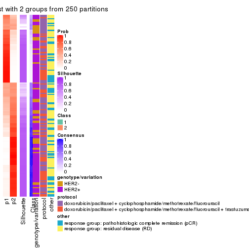</p>

</div>
<div id='tab-CV-hclust-consensus-heatmap-2'>
<pre><code class="r">consensus_heatmap(res, k = 3)
</code></pre>

<p>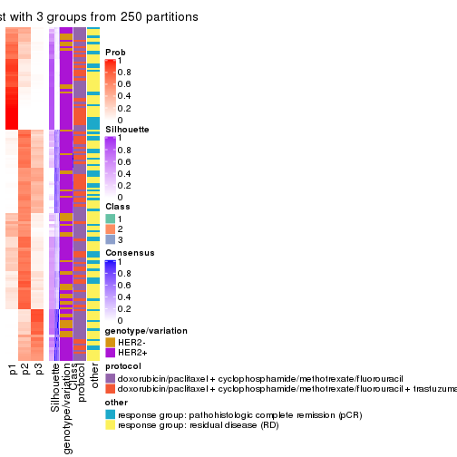</p>

</div>
<div id='tab-CV-hclust-consensus-heatmap-3'>
<pre><code class="r">consensus_heatmap(res, k = 4)
</code></pre>

<p>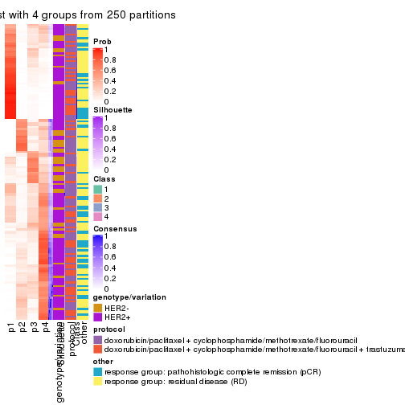</p>

</div>
<div id='tab-CV-hclust-consensus-heatmap-4'>
<pre><code class="r">consensus_heatmap(res, k = 5)
</code></pre>

<p>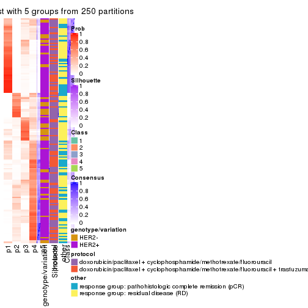</p>

</div>
<div id='tab-CV-hclust-consensus-heatmap-5'>
<pre><code class="r">consensus_heatmap(res, k = 6)
</code></pre>

<p>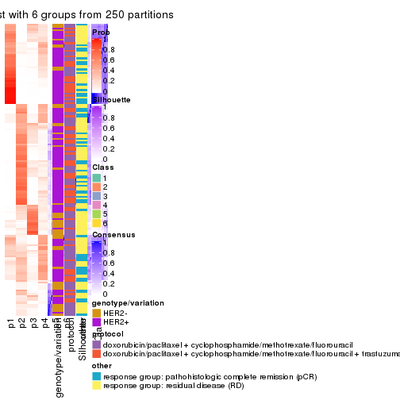</p>

</div>
</div>

Heatmaps for the membership of samples in all partitions to see how consistent they are:


<script>
$( function() {
	$( '#tabs-CV-hclust-membership-heatmap' ).tabs();
} );
</script>
<div id='tabs-CV-hclust-membership-heatmap'>
<ul>
<li><a href='#tab-CV-hclust-membership-heatmap-1'>k = 2</a></li>
<li><a href='#tab-CV-hclust-membership-heatmap-2'>k = 3</a></li>
<li><a href='#tab-CV-hclust-membership-heatmap-3'>k = 4</a></li>
<li><a href='#tab-CV-hclust-membership-heatmap-4'>k = 5</a></li>
<li><a href='#tab-CV-hclust-membership-heatmap-5'>k = 6</a></li>
</ul>
<div id='tab-CV-hclust-membership-heatmap-1'>
<pre><code class="r">membership_heatmap(res, k = 2)
</code></pre>

<p>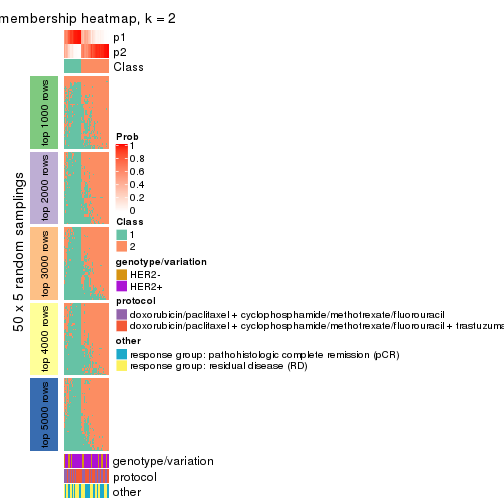</p>

</div>
<div id='tab-CV-hclust-membership-heatmap-2'>
<pre><code class="r">membership_heatmap(res, k = 3)
</code></pre>

<p>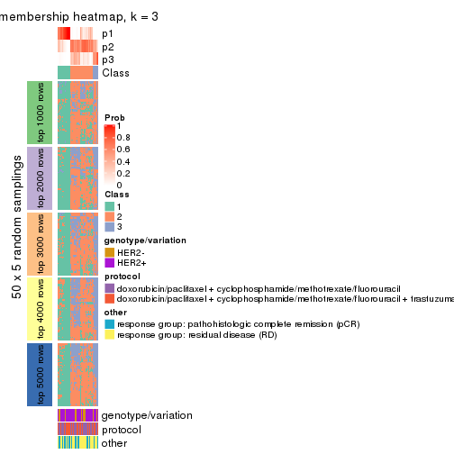</p>

</div>
<div id='tab-CV-hclust-membership-heatmap-3'>
<pre><code class="r">membership_heatmap(res, k = 4)
</code></pre>

<p>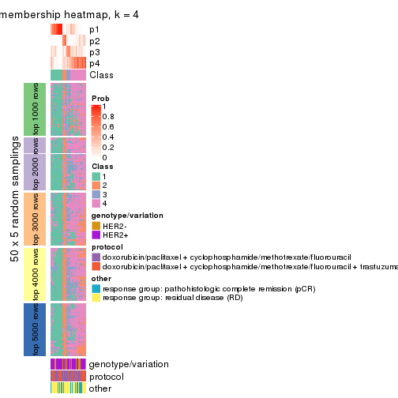</p>

</div>
<div id='tab-CV-hclust-membership-heatmap-4'>
<pre><code class="r">membership_heatmap(res, k = 5)
</code></pre>

<p>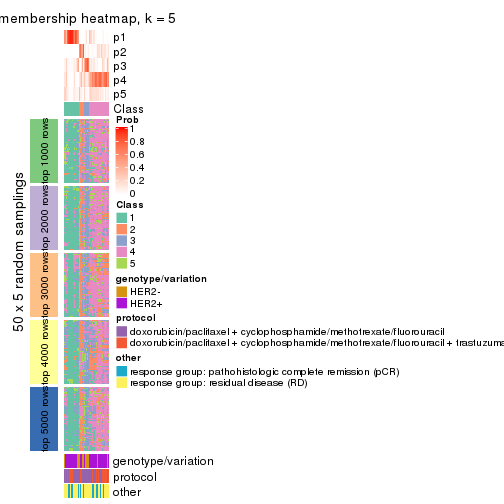</p>

</div>
<div id='tab-CV-hclust-membership-heatmap-5'>
<pre><code class="r">membership_heatmap(res, k = 6)
</code></pre>

<p>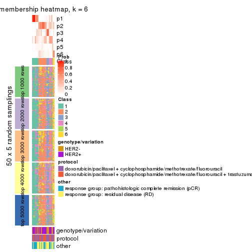</p>

</div>
</div>

As soon as we have had the classes for columns, we can look for signatures
which are significantly different between classes which can be candidate marks
for certain classes. Following are the heatmaps for signatures.


Signature heatmaps where rows are scaled:


<script>
$( function() {
	$( '#tabs-CV-hclust-get-signatures' ).tabs();
} );
</script>
<div id='tabs-CV-hclust-get-signatures'>
<ul>
<li><a href='#tab-CV-hclust-get-signatures-1'>k = 2</a></li>
<li><a href='#tab-CV-hclust-get-signatures-2'>k = 3</a></li>
<li><a href='#tab-CV-hclust-get-signatures-3'>k = 4</a></li>
<li><a href='#tab-CV-hclust-get-signatures-4'>k = 5</a></li>
<li><a href='#tab-CV-hclust-get-signatures-5'>k = 6</a></li>
</ul>
<div id='tab-CV-hclust-get-signatures-1'>
<pre><code class="r">get_signatures(res, k = 2)
</code></pre>

<pre><code>#&gt; Error: The width or height of the raster image is zero, maybe you forget to turn off the
#&gt; previous graphic device or it was corrupted. Run `dev.off()` to close it.
</code></pre>

<p></p>

</div>
<div id='tab-CV-hclust-get-signatures-2'>
<pre><code class="r">get_signatures(res, k = 3)
</code></pre>

<pre><code>#&gt; Error: The width or height of the raster image is zero, maybe you forget to turn off the
#&gt; previous graphic device or it was corrupted. Run `dev.off()` to close it.
</code></pre>

<p></p>

</div>
<div id='tab-CV-hclust-get-signatures-3'>
<pre><code class="r">get_signatures(res, k = 4)
</code></pre>

<pre><code>#&gt; Error: The width or height of the raster image is zero, maybe you forget to turn off the
#&gt; previous graphic device or it was corrupted. Run `dev.off()` to close it.
</code></pre>

<p></p>

</div>
<div id='tab-CV-hclust-get-signatures-4'>
<pre><code class="r">get_signatures(res, k = 5)
</code></pre>

<pre><code>#&gt; Error: The width or height of the raster image is zero, maybe you forget to turn off the
#&gt; previous graphic device or it was corrupted. Run `dev.off()` to close it.
</code></pre>

<p></p>

</div>
<div id='tab-CV-hclust-get-signatures-5'>
<pre><code class="r">get_signatures(res, k = 6)
</code></pre>

<pre><code>#&gt; Error: The width or height of the raster image is zero, maybe you forget to turn off the
#&gt; previous graphic device or it was corrupted. Run `dev.off()` to close it.
</code></pre>

<p></p>

</div>
</div>


Signature heatmaps where rows are not scaled:


<script>
$( function() {
	$( '#tabs-CV-hclust-get-signatures-no-scale' ).tabs();
} );
</script>
<div id='tabs-CV-hclust-get-signatures-no-scale'>
<ul>
<li><a href='#tab-CV-hclust-get-signatures-no-scale-1'>k = 2</a></li>
<li><a href='#tab-CV-hclust-get-signatures-no-scale-2'>k = 3</a></li>
<li><a href='#tab-CV-hclust-get-signatures-no-scale-3'>k = 4</a></li>
<li><a href='#tab-CV-hclust-get-signatures-no-scale-4'>k = 5</a></li>
<li><a href='#tab-CV-hclust-get-signatures-no-scale-5'>k = 6</a></li>
</ul>
<div id='tab-CV-hclust-get-signatures-no-scale-1'>
<pre><code class="r">get_signatures(res, k = 2, scale_rows = FALSE)
</code></pre>

<pre><code>#&gt; Error: The width or height of the raster image is zero, maybe you forget to turn off the
#&gt; previous graphic device or it was corrupted. Run `dev.off()` to close it.
</code></pre>

<p></p>

</div>
<div id='tab-CV-hclust-get-signatures-no-scale-2'>
<pre><code class="r">get_signatures(res, k = 3, scale_rows = FALSE)
</code></pre>

<pre><code>#&gt; Error: The width or height of the raster image is zero, maybe you forget to turn off the
#&gt; previous graphic device or it was corrupted. Run `dev.off()` to close it.
</code></pre>

<p></p>

</div>
<div id='tab-CV-hclust-get-signatures-no-scale-3'>
<pre><code class="r">get_signatures(res, k = 4, scale_rows = FALSE)
</code></pre>

<pre><code>#&gt; Error: The width or height of the raster image is zero, maybe you forget to turn off the
#&gt; previous graphic device or it was corrupted. Run `dev.off()` to close it.
</code></pre>

<p></p>

</div>
<div id='tab-CV-hclust-get-signatures-no-scale-4'>
<pre><code class="r">get_signatures(res, k = 5, scale_rows = FALSE)
</code></pre>

<pre><code>#&gt; Error: The width or height of the raster image is zero, maybe you forget to turn off the
#&gt; previous graphic device or it was corrupted. Run `dev.off()` to close it.
</code></pre>

<p></p>

</div>
<div id='tab-CV-hclust-get-signatures-no-scale-5'>
<pre><code class="r">get_signatures(res, k = 6, scale_rows = FALSE)
</code></pre>

<pre><code>#&gt; Error: The width or height of the raster image is zero, maybe you forget to turn off the
#&gt; previous graphic device or it was corrupted. Run `dev.off()` to close it.
</code></pre>

<p></p>

</div>
</div>


Compare the overlap of signatures from different k:

```r
compare_signatures(res)
```

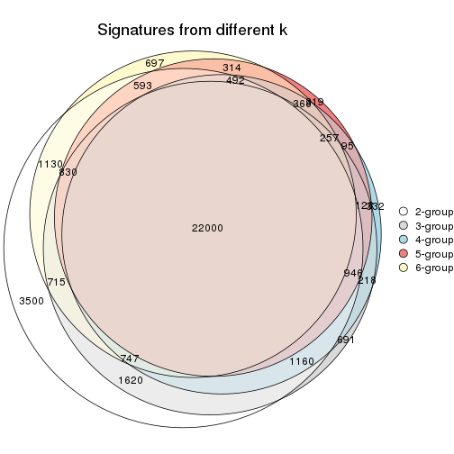

`get_signature()` returns a data frame invisibly. TO get the list of signatures, the function
call should be assigned to a variable explicitly. In following code, if `plot` argument is set
to `FALSE`, no heatmap is plotted while only the differential analysis is performed.

```r
# code only for demonstration
tb = get_signature(res, k = ..., plot = FALSE)
```

An example of the output of `tb` is:

```
#>   which_row         fdr    mean_1    mean_2 scaled_mean_1 scaled_mean_2 km
#> 1        38 0.042760348  8.373488  9.131774    -0.5533452     0.5164555  1
#> 2        40 0.018707592  7.106213  8.469186    -0.6173731     0.5762149  1
#> 3        55 0.019134737 10.221463 11.207825    -0.6159697     0.5749050  1
#> 4        59 0.006059896  5.921854  7.869574    -0.6899429     0.6439467  1
#> 5        60 0.018055526  8.928898 10.211722    -0.6204761     0.5791110  1
#> 6        98 0.009384629 15.714769 14.887706     0.6635654    -0.6193277  2
...
```

The columns in `tb` are:

1. `which_row`: row indices corresponding to the input matrix.
2. `fdr`: FDR for the differential test. 
3. `mean_x`: The mean value in group x.
4. `scaled_mean_x`: The mean value in group x after rows are scaled.
5. `km`: Row groups if k-means clustering is applied to rows.


UMAP plot which shows how samples are separated.


<script>
$( function() {
	$( '#tabs-CV-hclust-dimension-reduction' ).tabs();
} );
</script>
<div id='tabs-CV-hclust-dimension-reduction'>
<ul>
<li><a href='#tab-CV-hclust-dimension-reduction-1'>k = 2</a></li>
<li><a href='#tab-CV-hclust-dimension-reduction-2'>k = 3</a></li>
<li><a href='#tab-CV-hclust-dimension-reduction-3'>k = 4</a></li>
<li><a href='#tab-CV-hclust-dimension-reduction-4'>k = 5</a></li>
<li><a href='#tab-CV-hclust-dimension-reduction-5'>k = 6</a></li>
</ul>
<div id='tab-CV-hclust-dimension-reduction-1'>
<pre><code class="r">dimension_reduction(res, k = 2, method = &quot;UMAP&quot;)
</code></pre>

<p>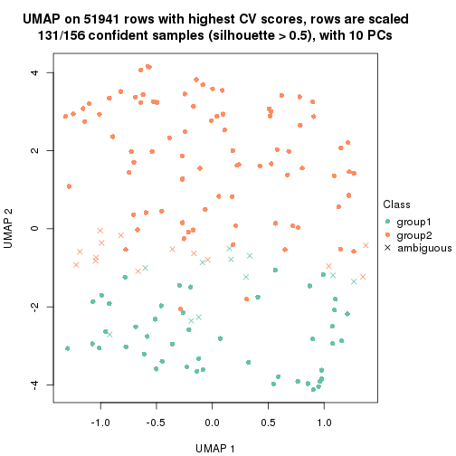</p>

</div>
<div id='tab-CV-hclust-dimension-reduction-2'>
<pre><code class="r">dimension_reduction(res, k = 3, method = &quot;UMAP&quot;)
</code></pre>

<p>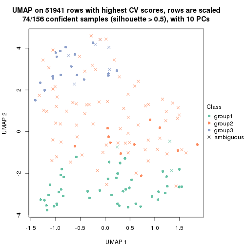</p>

</div>
<div id='tab-CV-hclust-dimension-reduction-3'>
<pre><code class="r">dimension_reduction(res, k = 4, method = &quot;UMAP&quot;)
</code></pre>

<p>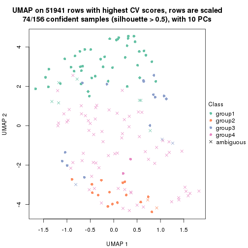</p>

</div>
<div id='tab-CV-hclust-dimension-reduction-4'>
<pre><code class="r">dimension_reduction(res, k = 5, method = &quot;UMAP&quot;)
</code></pre>

<p>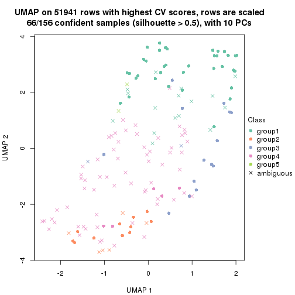</p>

</div>
<div id='tab-CV-hclust-dimension-reduction-5'>
<pre><code class="r">dimension_reduction(res, k = 6, method = &quot;UMAP&quot;)
</code></pre>

<p>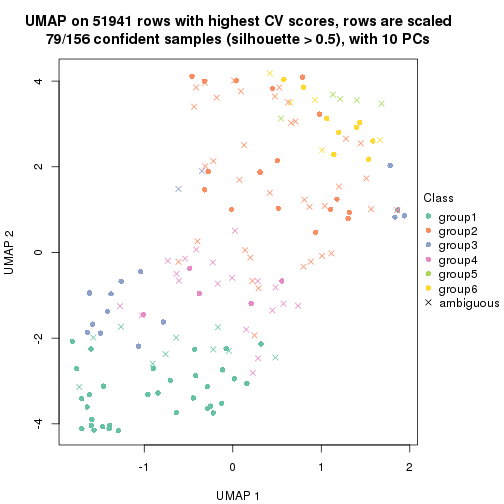</p>

</div>
</div>


Following heatmap shows how subgroups are split when increasing `k`:

```r
collect_classes(res)
```

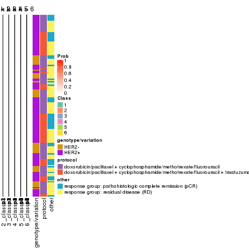


Test correlation between subgroups and known annotations. If the known
annotation is numeric, one-way ANOVA test is applied, and if the known
annotation is discrete, chi-squared contingency table test is applied.

```r
test_to_known_factors(res)
```

```
#>             n genotype/variation(p) protocol(p) other(p) k
#> CV:hclust 131              3.26e-01      0.7771   1.0000 2
#> CV:hclust  74              1.66e-02      0.1349   0.1362 3
#> CV:hclust  74              8.91e-04      0.0403   0.0284 4
#> CV:hclust  66              2.82e-04      0.0877   0.1705 5
#> CV:hclust  79              1.24e-05      0.0576   0.2831 6
```


If matrix rows can be associated to genes, consider to use `functional_enrichment(res,
...)` to perform function enrichment for the signature genes. See [this vignette](http://bioconductor.org/packages/devel/bioc/vignettes/cola/inst/doc/functional_enrichment.html) for more detailed explanations.


 

---------------------------------------------------


### CV:kmeans**


The object with results only for a single top-value method and a single partition method 
can be extracted as:

```r
res = res_list["CV", "kmeans"]
# you can also extract it by
# res = res_list["CV:kmeans"]
```

A summary of `res` and all the functions that can be applied to it:

```r
res
```

```
#> A 'ConsensusPartition' object with k = 2, 3, 4, 5, 6.
#>   On a matrix with 51941 rows and 156 columns.
#>   Top rows (1000, 2000, 3000, 4000, 5000) are extracted by 'CV' method.
#>   Subgroups are detected by 'kmeans' method.
#>   Performed in total 1250 partitions by row resampling.
#>   Best k for subgroups seems to be 2.
#> 
#> Following methods can be applied to this 'ConsensusPartition' object:
#>  [1] "cola_report"             "collect_classes"         "collect_plots"          
#>  [4] "collect_stats"           "colnames"                "compare_signatures"     
#>  [7] "consensus_heatmap"       "dimension_reduction"     "functional_enrichment"  
#> [10] "get_anno_col"            "get_anno"                "get_classes"            
#> [13] "get_consensus"           "get_matrix"              "get_membership"         
#> [16] "get_param"               "get_signatures"          "get_stats"              
#> [19] "is_best_k"               "is_stable_k"             "membership_heatmap"     
#> [22] "ncol"                    "nrow"                    "plot_ecdf"              
#> [25] "rownames"                "select_partition_number" "show"                   
#> [28] "suggest_best_k"          "test_to_known_factors"
```

`collect_plots()` function collects all the plots made from `res` for all `k` (number of partitions)
into one single page to provide an easy and fast comparison between different `k`.

```r
collect_plots(res)
```

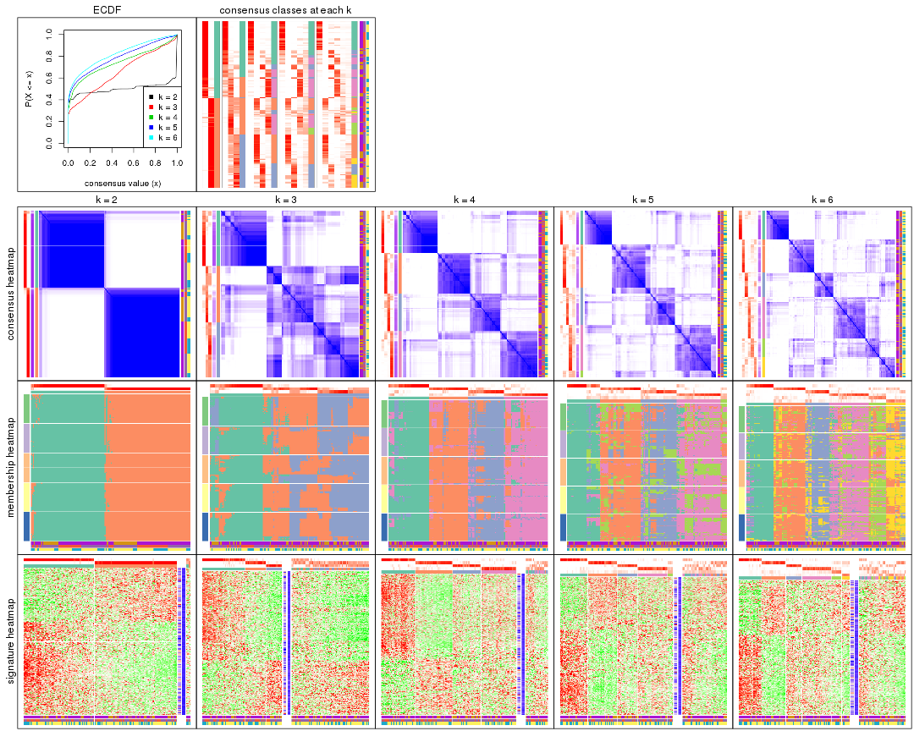

The plots are:

- The first row: a plot of the ECDF (empirical cumulative distribution
  function) curves of the consensus matrix for each `k` and the heatmap of
  predicted classes for each `k`.
- The second row: heatmaps of the consensus matrix for each `k`.
- The third row: heatmaps of the membership matrix for each `k`.
- The fouth row: heatmaps of the signatures for each `k`.

All the plots in panels can be made by individual functions and they are
plotted later in this section.

`select_partition_number()` produces several plots showing different
statistics for choosing "optimized" `k`. There are following statistics:

- ECDF curves of the consensus matrix for each `k`;
- 1-PAC. [The PAC
  score](https://en.wikipedia.org/wiki/Consensus_clustering#Over-interpretation_potential_of_consensus_clustering)
  measures the proportion of the ambiguous subgrouping.
- Mean silhouette score.
- Concordance. The mean probability of fiting the consensus class ids in all
  partitions.
- Area increased. Denote $A_k$ as the area under the ECDF curve for current
  `k`, the area increased is defined as $A_k - A_{k-1}$.
- Rand index. The percent of pairs of samples that are both in a same cluster
  or both are not in a same cluster in the partition of k and k-1.
- Jaccard index. The ratio of pairs of samples are both in a same cluster in
  the partition of k and k-1 and the pairs of samples are both in a same
  cluster in the partition k or k-1.

The detailed explanations of these statistics can be found in [the _cola_
vignette](http://bioconductor.org/packages/devel/bioc/vignettes/cola/inst/doc/cola.html#toc_13).

Generally speaking, lower PAC score, higher mean silhouette score or higher
concordance corresponds to better partition. Rand index and Jaccard index
measure how similar the current partition is compared to partition with `k-1`.
If they are too similar, we won't accept `k` is better than `k-1`.

```r
select_partition_number(res)
```

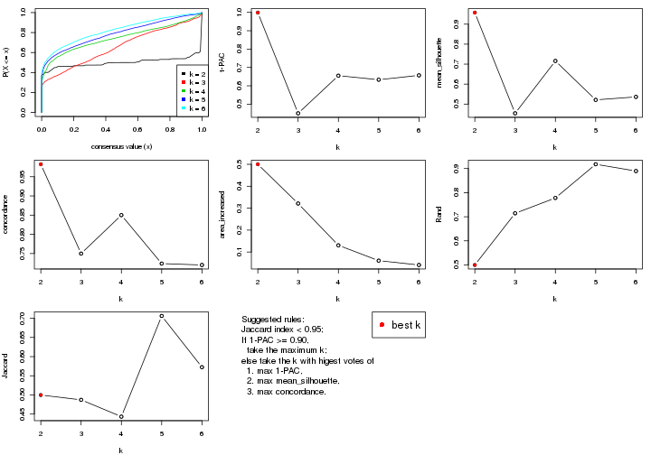

The numeric values for all these statistics can be obtained by `get_stats()`.

```r
get_stats(res)
```

```
#>   k 1-PAC mean_silhouette concordance area_increased  Rand Jaccard
#> 2 2 0.999           0.958       0.982         0.5001 0.500   0.500
#> 3 3 0.450           0.454       0.750         0.3212 0.714   0.487
#> 4 4 0.655           0.716       0.850         0.1306 0.778   0.443
#> 5 5 0.633           0.521       0.724         0.0607 0.918   0.706
#> 6 6 0.657           0.536       0.720         0.0409 0.890   0.572
```

`suggest_best_k()` suggests the best $k$ based on these statistics. The rules are as follows:

- All $k$ with Jaccard index larger than 0.95 are removed because increasing
  $k$ does not provide enough extra information. If all $k$ are removed, it is
  marked as no subgroup is detected.
- For all $k$ with 1-PAC score larger than 0.9, the maximal $k$ is taken as
  the best $k$, and other $k$ are marked as optional $k$.
- If it does not fit the second rule. The $k$ with the maximal vote of the
  highest 1-PAC score, highest mean silhouette, and highest concordance is
  taken as the best $k$.

```r
suggest_best_k(res)
```

```
#> [1] 2
```


Following shows the table of the partitions (You need to click the **show/hide
code output** link to see it). The membership matrix (columns with name `p*`)
is inferred by
[`clue::cl_consensus()`](https://www.rdocumentation.org/link/cl_consensus?package=clue)
function with the `SE` method. Basically the value in the membership matrix
represents the probability to belong to a certain group. The finall class
label for an item is determined with the group with highest probability it
belongs to.

In `get_classes()` function, the entropy is calculated from the membership
matrix and the silhouette score is calculated from the consensus matrix.


<script>
$( function() {
	$( '#tabs-CV-kmeans-get-classes' ).tabs();
} );
</script>
<div id='tabs-CV-kmeans-get-classes'>
<ul>
<li><a href='#tab-CV-kmeans-get-classes-1'>k = 2</a></li>
<li><a href='#tab-CV-kmeans-get-classes-2'>k = 3</a></li>
<li><a href='#tab-CV-kmeans-get-classes-3'>k = 4</a></li>
<li><a href='#tab-CV-kmeans-get-classes-4'>k = 5</a></li>
<li><a href='#tab-CV-kmeans-get-classes-5'>k = 6</a></li>
</ul>

<div id='tab-CV-kmeans-get-classes-1'>
<p><a id='tab-CV-kmeans-get-classes-1-a' style='color:#0366d6' href='#'>show/hide code output</a></p>
<pre><code class="r">cbind(get_classes(res, k = 2), get_membership(res, k = 2))
</code></pre>

<pre><code>#&gt;            class entropy silhouette    p1    p2
#&gt; GSM1232995     2  0.0000      0.984 0.000 1.000
#&gt; GSM1233002     1  0.3431      0.924 0.936 0.064
#&gt; GSM1233003     1  0.0000      0.979 1.000 0.000
#&gt; GSM1233014     2  0.0000      0.984 0.000 1.000
#&gt; GSM1233015     1  0.0000      0.979 1.000 0.000
#&gt; GSM1233016     1  0.9635      0.368 0.612 0.388
#&gt; GSM1233024     2  0.0000      0.984 0.000 1.000
#&gt; GSM1233049     1  0.0000      0.979 1.000 0.000
#&gt; GSM1233064     2  0.0000      0.984 0.000 1.000
#&gt; GSM1233068     1  0.0000      0.979 1.000 0.000
#&gt; GSM1233073     1  0.0000      0.979 1.000 0.000
#&gt; GSM1233093     1  0.0000      0.979 1.000 0.000
#&gt; GSM1233115     1  0.0000      0.979 1.000 0.000
#&gt; GSM1232992     2  0.0000      0.984 0.000 1.000
#&gt; GSM1232993     2  0.0000      0.984 0.000 1.000
#&gt; GSM1233005     2  0.0000      0.984 0.000 1.000
#&gt; GSM1233007     2  0.0000      0.984 0.000 1.000
#&gt; GSM1233010     1  0.0000      0.979 1.000 0.000
#&gt; GSM1233013     2  0.0000      0.984 0.000 1.000
#&gt; GSM1233018     2  0.0000      0.984 0.000 1.000
#&gt; GSM1233019     2  0.0000      0.984 0.000 1.000
#&gt; GSM1233021     2  0.0000      0.984 0.000 1.000
#&gt; GSM1233025     1  0.0000      0.979 1.000 0.000
#&gt; GSM1233029     2  0.0000      0.984 0.000 1.000
#&gt; GSM1233030     2  0.0000      0.984 0.000 1.000
#&gt; GSM1233031     1  0.3879      0.912 0.924 0.076
#&gt; GSM1233032     1  0.0000      0.979 1.000 0.000
#&gt; GSM1233035     1  0.0938      0.970 0.988 0.012
#&gt; GSM1233038     1  0.0000      0.979 1.000 0.000
#&gt; GSM1233039     2  0.0000      0.984 0.000 1.000
#&gt; GSM1233042     2  0.0000      0.984 0.000 1.000
#&gt; GSM1233043     2  0.0000      0.984 0.000 1.000
#&gt; GSM1233044     1  0.0000      0.979 1.000 0.000
#&gt; GSM1233046     1  0.0000      0.979 1.000 0.000
#&gt; GSM1233051     1  0.0000      0.979 1.000 0.000
#&gt; GSM1233054     1  0.0000      0.979 1.000 0.000
#&gt; GSM1233057     2  0.0000      0.984 0.000 1.000
#&gt; GSM1233060     2  0.9552      0.389 0.376 0.624
#&gt; GSM1233062     2  0.0000      0.984 0.000 1.000
#&gt; GSM1233075     2  0.0000      0.984 0.000 1.000
#&gt; GSM1233078     1  0.2603      0.943 0.956 0.044
#&gt; GSM1233079     1  0.0000      0.979 1.000 0.000
#&gt; GSM1233082     1  0.0000      0.979 1.000 0.000
#&gt; GSM1233083     1  0.0000      0.979 1.000 0.000
#&gt; GSM1233091     1  0.0000      0.979 1.000 0.000
#&gt; GSM1233095     1  0.0000      0.979 1.000 0.000
#&gt; GSM1233096     1  0.0000      0.979 1.000 0.000
#&gt; GSM1233101     1  0.0000      0.979 1.000 0.000
#&gt; GSM1233105     1  0.0000      0.979 1.000 0.000
#&gt; GSM1233117     2  0.0000      0.984 0.000 1.000
#&gt; GSM1233118     2  0.0000      0.984 0.000 1.000
#&gt; GSM1233001     2  0.0000      0.984 0.000 1.000
#&gt; GSM1233006     2  0.0000      0.984 0.000 1.000
#&gt; GSM1233008     2  0.0000      0.984 0.000 1.000
#&gt; GSM1233009     2  0.0000      0.984 0.000 1.000
#&gt; GSM1233017     2  0.0000      0.984 0.000 1.000
#&gt; GSM1233020     2  0.0000      0.984 0.000 1.000
#&gt; GSM1233022     2  0.0000      0.984 0.000 1.000
#&gt; GSM1233026     2  0.9608      0.372 0.384 0.616
#&gt; GSM1233028     1  0.9754      0.316 0.592 0.408
#&gt; GSM1233034     2  0.0000      0.984 0.000 1.000
#&gt; GSM1233040     1  0.0000      0.979 1.000 0.000
#&gt; GSM1233048     1  0.0000      0.979 1.000 0.000
#&gt; GSM1233056     1  0.0000      0.979 1.000 0.000
#&gt; GSM1233058     1  0.2603      0.944 0.956 0.044
#&gt; GSM1233059     1  0.0000      0.979 1.000 0.000
#&gt; GSM1233066     2  0.0672      0.977 0.008 0.992
#&gt; GSM1233071     2  0.0000      0.984 0.000 1.000
#&gt; GSM1233074     2  0.0000      0.984 0.000 1.000
#&gt; GSM1233076     2  0.0000      0.984 0.000 1.000
#&gt; GSM1233080     1  0.0000      0.979 1.000 0.000
#&gt; GSM1233088     2  0.4431      0.893 0.092 0.908
#&gt; GSM1233090     1  0.0000      0.979 1.000 0.000
#&gt; GSM1233092     2  0.0000      0.984 0.000 1.000
#&gt; GSM1233094     2  0.3879      0.910 0.076 0.924
#&gt; GSM1233097     1  0.8327      0.642 0.736 0.264
#&gt; GSM1233100     1  0.0000      0.979 1.000 0.000
#&gt; GSM1233104     2  0.0000      0.984 0.000 1.000
#&gt; GSM1233106     1  0.0000      0.979 1.000 0.000
#&gt; GSM1233111     1  0.0000      0.979 1.000 0.000
#&gt; GSM1233122     2  0.0000      0.984 0.000 1.000
#&gt; GSM1233146     2  0.3274      0.928 0.060 0.940
#&gt; GSM1232994     2  0.0000      0.984 0.000 1.000
#&gt; GSM1232996     2  0.0000      0.984 0.000 1.000
#&gt; GSM1232997     2  0.0000      0.984 0.000 1.000
#&gt; GSM1232998     2  0.0000      0.984 0.000 1.000
#&gt; GSM1232999     2  0.0000      0.984 0.000 1.000
#&gt; GSM1233000     2  0.0000      0.984 0.000 1.000
#&gt; GSM1233004     1  0.1184      0.967 0.984 0.016
#&gt; GSM1233011     2  0.0000      0.984 0.000 1.000
#&gt; GSM1233012     2  0.0000      0.984 0.000 1.000
#&gt; GSM1233023     2  0.0000      0.984 0.000 1.000
#&gt; GSM1233027     2  0.0000      0.984 0.000 1.000
#&gt; GSM1233033     1  0.0000      0.979 1.000 0.000
#&gt; GSM1233036     2  0.0000      0.984 0.000 1.000
#&gt; GSM1233037     2  0.0672      0.977 0.008 0.992
#&gt; GSM1233041     1  0.0000      0.979 1.000 0.000
#&gt; GSM1233045     2  0.0000      0.984 0.000 1.000
#&gt; GSM1233047     1  0.0000      0.979 1.000 0.000
#&gt; GSM1233050     1  0.0000      0.979 1.000 0.000
#&gt; GSM1233052     1  0.0000      0.979 1.000 0.000
#&gt; GSM1233053     1  0.0000      0.979 1.000 0.000
#&gt; GSM1233055     1  0.0000      0.979 1.000 0.000
#&gt; GSM1233061     1  0.3584      0.919 0.932 0.068
#&gt; GSM1233063     1  0.0000      0.979 1.000 0.000
#&gt; GSM1233065     2  0.0000      0.984 0.000 1.000
#&gt; GSM1233070     2  0.0000      0.984 0.000 1.000
#&gt; GSM1233077     2  0.0000      0.984 0.000 1.000
#&gt; GSM1233081     1  0.0000      0.979 1.000 0.000
#&gt; GSM1233084     1  0.0000      0.979 1.000 0.000
#&gt; GSM1233087     1  0.0000      0.979 1.000 0.000
#&gt; GSM1233089     2  0.0000      0.984 0.000 1.000
#&gt; GSM1233099     1  0.0000      0.979 1.000 0.000
#&gt; GSM1233112     1  0.0000      0.979 1.000 0.000
#&gt; GSM1233085     1  0.0000      0.979 1.000 0.000
#&gt; GSM1233098     2  0.0000      0.984 0.000 1.000
#&gt; GSM1233114     1  0.0000      0.979 1.000 0.000
#&gt; GSM1233119     1  0.2948      0.935 0.948 0.052
#&gt; GSM1233129     2  0.0000      0.984 0.000 1.000
#&gt; GSM1233132     1  0.0000      0.979 1.000 0.000
#&gt; GSM1233139     2  0.0000      0.984 0.000 1.000
#&gt; GSM1233143     2  0.0000      0.984 0.000 1.000
#&gt; GSM1233145     1  0.0000      0.979 1.000 0.000
#&gt; GSM1233067     2  0.0000      0.984 0.000 1.000
#&gt; GSM1233069     2  0.0000      0.984 0.000 1.000
#&gt; GSM1233072     2  0.0000      0.984 0.000 1.000
#&gt; GSM1233086     2  0.0000      0.984 0.000 1.000
#&gt; GSM1233102     1  0.0000      0.979 1.000 0.000
#&gt; GSM1233103     1  0.1184      0.967 0.984 0.016
#&gt; GSM1233107     2  0.7139      0.755 0.196 0.804
#&gt; GSM1233108     1  0.0000      0.979 1.000 0.000
#&gt; GSM1233109     1  0.0000      0.979 1.000 0.000
#&gt; GSM1233110     2  0.0000      0.984 0.000 1.000
#&gt; GSM1233113     2  0.0000      0.984 0.000 1.000
#&gt; GSM1233116     2  0.0000      0.984 0.000 1.000
#&gt; GSM1233120     1  0.0000      0.979 1.000 0.000
#&gt; GSM1233121     2  0.0000      0.984 0.000 1.000
#&gt; GSM1233123     2  0.4562      0.888 0.096 0.904
#&gt; GSM1233124     2  0.0000      0.984 0.000 1.000
#&gt; GSM1233125     1  0.0000      0.979 1.000 0.000
#&gt; GSM1233126     2  0.0000      0.984 0.000 1.000
#&gt; GSM1233127     2  0.0000      0.984 0.000 1.000
#&gt; GSM1233128     1  0.0000      0.979 1.000 0.000
#&gt; GSM1233130     2  0.0000      0.984 0.000 1.000
#&gt; GSM1233131     1  0.0000      0.979 1.000 0.000
#&gt; GSM1233133     1  0.0000      0.979 1.000 0.000
#&gt; GSM1233134     2  0.0000      0.984 0.000 1.000
#&gt; GSM1233135     2  0.0000      0.984 0.000 1.000
#&gt; GSM1233136     2  0.0000      0.984 0.000 1.000
#&gt; GSM1233137     1  0.0000      0.979 1.000 0.000
#&gt; GSM1233138     2  0.0000      0.984 0.000 1.000
#&gt; GSM1233140     1  0.0000      0.979 1.000 0.000
#&gt; GSM1233141     2  0.0000      0.984 0.000 1.000
#&gt; GSM1233142     2  0.0000      0.984 0.000 1.000
#&gt; GSM1233144     1  0.0000      0.979 1.000 0.000
#&gt; GSM1233147     2  0.0000      0.984 0.000 1.000
</code></pre>

<script>
$('#tab-CV-kmeans-get-classes-1-a').parent().next().next().hide();
$('#tab-CV-kmeans-get-classes-1-a').click(function(){
  $('#tab-CV-kmeans-get-classes-1-a').parent().next().next().toggle();
  return(false);
});
</script>
</div>

<div id='tab-CV-kmeans-get-classes-2'>
<p><a id='tab-CV-kmeans-get-classes-2-a' style='color:#0366d6' href='#'>show/hide code output</a></p>
<pre><code class="r">cbind(get_classes(res, k = 3), get_membership(res, k = 3))
</code></pre>

<pre><code>#&gt;            class entropy silhouette    p1    p2    p3
#&gt; GSM1232995     3  0.5327     0.4928 0.000 0.272 0.728
#&gt; GSM1233002     2  0.3941     0.5435 0.156 0.844 0.000
#&gt; GSM1233003     1  0.0000     0.8537 1.000 0.000 0.000
#&gt; GSM1233014     2  0.4291     0.3681 0.000 0.820 0.180
#&gt; GSM1233015     1  0.4002     0.7628 0.840 0.160 0.000
#&gt; GSM1233016     2  0.3941     0.5422 0.156 0.844 0.000
#&gt; GSM1233024     2  0.6305    -0.2559 0.000 0.516 0.484
#&gt; GSM1233049     1  0.0000     0.8537 1.000 0.000 0.000
#&gt; GSM1233064     2  0.6111     0.1193 0.000 0.604 0.396
#&gt; GSM1233068     2  0.6305    -0.1057 0.484 0.516 0.000
#&gt; GSM1233073     2  0.5706     0.3520 0.320 0.680 0.000
#&gt; GSM1233093     1  0.0000     0.8537 1.000 0.000 0.000
#&gt; GSM1233115     1  0.2066     0.8320 0.940 0.060 0.000
#&gt; GSM1232992     3  0.6244     0.3759 0.000 0.440 0.560
#&gt; GSM1232993     2  0.0892     0.5260 0.000 0.980 0.020
#&gt; GSM1233005     3  0.6244     0.3759 0.000 0.440 0.560
#&gt; GSM1233007     2  0.2959     0.4960 0.000 0.900 0.100
#&gt; GSM1233010     2  0.5621     0.3776 0.308 0.692 0.000
#&gt; GSM1233013     3  0.6244     0.3759 0.000 0.440 0.560
#&gt; GSM1233018     3  0.6244     0.3759 0.000 0.440 0.560
#&gt; GSM1233019     3  0.6307     0.2875 0.000 0.488 0.512
#&gt; GSM1233021     3  0.6244     0.3759 0.000 0.440 0.560
#&gt; GSM1233025     2  0.6215     0.0675 0.428 0.572 0.000
#&gt; GSM1233029     2  0.6307    -0.2629 0.000 0.512 0.488
#&gt; GSM1233030     3  0.6244     0.3759 0.000 0.440 0.560
#&gt; GSM1233031     2  0.3412     0.5496 0.124 0.876 0.000
#&gt; GSM1233032     1  0.0000     0.8537 1.000 0.000 0.000
#&gt; GSM1233035     2  0.4178     0.5387 0.172 0.828 0.000
#&gt; GSM1233038     1  0.0000     0.8537 1.000 0.000 0.000
#&gt; GSM1233039     2  0.4452     0.4306 0.000 0.808 0.192
#&gt; GSM1233042     2  0.0237     0.5325 0.000 0.996 0.004
#&gt; GSM1233043     2  0.0592     0.5292 0.000 0.988 0.012
#&gt; GSM1233044     1  0.6308     0.1458 0.508 0.492 0.000
#&gt; GSM1233046     1  0.5621     0.5671 0.692 0.308 0.000
#&gt; GSM1233051     1  0.1031     0.8479 0.976 0.024 0.000
#&gt; GSM1233054     1  0.8842     0.5157 0.580 0.208 0.212
#&gt; GSM1233057     3  0.4399     0.3933 0.000 0.188 0.812
#&gt; GSM1233060     2  0.1765     0.5460 0.040 0.956 0.004
#&gt; GSM1233062     2  0.6192    -0.1435 0.000 0.580 0.420
#&gt; GSM1233075     3  0.0000     0.5364 0.000 0.000 1.000
#&gt; GSM1233078     3  0.8142    -0.0574 0.068 0.464 0.468
#&gt; GSM1233079     1  0.0000     0.8537 1.000 0.000 0.000
#&gt; GSM1233082     1  0.4605     0.7156 0.796 0.204 0.000
#&gt; GSM1233083     1  0.0000     0.8537 1.000 0.000 0.000
#&gt; GSM1233091     2  0.7748     0.2403 0.340 0.596 0.064
#&gt; GSM1233095     1  0.0000     0.8537 1.000 0.000 0.000
#&gt; GSM1233096     1  0.0892     0.8484 0.980 0.020 0.000
#&gt; GSM1233101     1  0.0000     0.8537 1.000 0.000 0.000
#&gt; GSM1233105     1  0.6252     0.2785 0.556 0.444 0.000
#&gt; GSM1233117     3  0.4291     0.5263 0.000 0.180 0.820
#&gt; GSM1233118     3  0.1031     0.5433 0.000 0.024 0.976
#&gt; GSM1233001     3  0.5529     0.4799 0.000 0.296 0.704
#&gt; GSM1233006     2  0.4121     0.3851 0.000 0.832 0.168
#&gt; GSM1233008     3  0.6260     0.3636 0.000 0.448 0.552
#&gt; GSM1233009     2  0.6309    -0.2802 0.000 0.504 0.496
#&gt; GSM1233017     2  0.6309    -0.2881 0.000 0.500 0.500
#&gt; GSM1233020     3  0.5835     0.4532 0.000 0.340 0.660
#&gt; GSM1233022     2  0.6260    -0.1891 0.000 0.552 0.448
#&gt; GSM1233026     2  0.4056     0.5468 0.092 0.876 0.032
#&gt; GSM1233028     2  0.3120     0.5505 0.080 0.908 0.012
#&gt; GSM1233034     3  0.6267     0.3621 0.000 0.452 0.548
#&gt; GSM1233040     1  0.0000     0.8537 1.000 0.000 0.000
#&gt; GSM1233048     1  0.0000     0.8537 1.000 0.000 0.000
#&gt; GSM1233056     1  0.0000     0.8537 1.000 0.000 0.000
#&gt; GSM1233058     2  0.4353     0.5423 0.156 0.836 0.008
#&gt; GSM1233059     1  0.0000     0.8537 1.000 0.000 0.000
#&gt; GSM1233066     3  0.6274     0.0402 0.000 0.456 0.544
#&gt; GSM1233071     2  0.1860     0.5063 0.000 0.948 0.052
#&gt; GSM1233074     3  0.0892     0.5428 0.000 0.020 0.980
#&gt; GSM1233076     2  0.5948     0.2207 0.000 0.640 0.360
#&gt; GSM1233080     1  0.0000     0.8537 1.000 0.000 0.000
#&gt; GSM1233088     2  0.5450     0.3927 0.012 0.760 0.228
#&gt; GSM1233090     1  0.0000     0.8537 1.000 0.000 0.000
#&gt; GSM1233092     2  0.3941     0.4013 0.000 0.844 0.156
#&gt; GSM1233094     2  0.0829     0.5380 0.012 0.984 0.004
#&gt; GSM1233097     2  0.4963     0.5232 0.200 0.792 0.008
#&gt; GSM1233100     2  0.5760     0.3381 0.328 0.672 0.000
#&gt; GSM1233104     2  0.1031     0.5240 0.000 0.976 0.024
#&gt; GSM1233106     1  0.3879     0.7687 0.848 0.152 0.000
#&gt; GSM1233111     1  0.0592     0.8513 0.988 0.012 0.000
#&gt; GSM1233122     3  0.6235     0.3796 0.000 0.436 0.564
#&gt; GSM1233146     2  0.0661     0.5351 0.004 0.988 0.008
#&gt; GSM1232994     2  0.6307    -0.2633 0.000 0.512 0.488
#&gt; GSM1232996     3  0.6244     0.3759 0.000 0.440 0.560
#&gt; GSM1232997     3  0.1860     0.5317 0.000 0.052 0.948
#&gt; GSM1232998     2  0.6307    -0.2629 0.000 0.512 0.488
#&gt; GSM1232999     2  0.5560     0.1335 0.000 0.700 0.300
#&gt; GSM1233000     3  0.6309     0.2599 0.000 0.500 0.500
#&gt; GSM1233004     2  0.9517     0.1524 0.280 0.488 0.232
#&gt; GSM1233011     3  0.6244     0.1088 0.000 0.440 0.560
#&gt; GSM1233012     3  0.2711     0.5440 0.000 0.088 0.912
#&gt; GSM1233023     3  0.4002     0.5236 0.000 0.160 0.840
#&gt; GSM1233027     2  0.6307    -0.2629 0.000 0.512 0.488
#&gt; GSM1233033     1  0.0747     0.8500 0.984 0.016 0.000
#&gt; GSM1233036     3  0.4931     0.3762 0.000 0.232 0.768
#&gt; GSM1233037     2  0.5591     0.2818 0.000 0.696 0.304
#&gt; GSM1233041     1  0.0000     0.8537 1.000 0.000 0.000
#&gt; GSM1233045     2  0.0892     0.5327 0.000 0.980 0.020
#&gt; GSM1233047     1  0.3031     0.8189 0.912 0.076 0.012
#&gt; GSM1233050     1  0.0000     0.8537 1.000 0.000 0.000
#&gt; GSM1233052     1  0.3816     0.7722 0.852 0.148 0.000
#&gt; GSM1233053     1  0.0000     0.8537 1.000 0.000 0.000
#&gt; GSM1233055     1  0.0000     0.8537 1.000 0.000 0.000
#&gt; GSM1233061     2  0.8737     0.0690 0.108 0.464 0.428
#&gt; GSM1233063     1  0.0424     0.8521 0.992 0.008 0.000
#&gt; GSM1233065     3  0.1289     0.5422 0.000 0.032 0.968
#&gt; GSM1233070     2  0.4062     0.3906 0.000 0.836 0.164
#&gt; GSM1233077     3  0.5529     0.2623 0.000 0.296 0.704
#&gt; GSM1233081     1  0.5538     0.7605 0.812 0.072 0.116
#&gt; GSM1233084     1  0.0000     0.8537 1.000 0.000 0.000
#&gt; GSM1233087     2  0.6307    -0.1168 0.488 0.512 0.000
#&gt; GSM1233089     3  0.5363     0.4892 0.000 0.276 0.724
#&gt; GSM1233099     1  0.6305     0.1665 0.516 0.484 0.000
#&gt; GSM1233112     1  0.0000     0.8537 1.000 0.000 0.000
#&gt; GSM1233085     1  0.6424     0.7031 0.752 0.068 0.180
#&gt; GSM1233098     3  0.6008     0.4291 0.000 0.372 0.628
#&gt; GSM1233114     1  0.1860     0.8366 0.948 0.052 0.000
#&gt; GSM1233119     2  0.4291     0.5360 0.180 0.820 0.000
#&gt; GSM1233129     3  0.1031     0.5421 0.000 0.024 0.976
#&gt; GSM1233132     1  0.0892     0.8484 0.980 0.020 0.000
#&gt; GSM1233139     3  0.6280     0.3434 0.000 0.460 0.540
#&gt; GSM1233143     3  0.3482     0.5375 0.000 0.128 0.872
#&gt; GSM1233145     1  0.0000     0.8537 1.000 0.000 0.000
#&gt; GSM1233067     3  0.0592     0.5401 0.000 0.012 0.988
#&gt; GSM1233069     3  0.0592     0.5320 0.000 0.012 0.988
#&gt; GSM1233072     3  0.6225     0.3830 0.000 0.432 0.568
#&gt; GSM1233086     3  0.6235     0.0763 0.000 0.436 0.564
#&gt; GSM1233102     1  0.5968     0.4446 0.636 0.364 0.000
#&gt; GSM1233103     2  0.4399     0.5324 0.188 0.812 0.000
#&gt; GSM1233107     2  0.2651     0.5452 0.060 0.928 0.012
#&gt; GSM1233108     1  0.3879     0.7501 0.848 0.000 0.152
#&gt; GSM1233109     1  0.8925     0.4068 0.504 0.132 0.364
#&gt; GSM1233110     3  0.6410     0.1020 0.004 0.420 0.576
#&gt; GSM1233113     3  0.2448     0.5450 0.000 0.076 0.924
#&gt; GSM1233116     3  0.2165     0.5447 0.000 0.064 0.936
#&gt; GSM1233120     1  0.5905     0.4758 0.648 0.352 0.000
#&gt; GSM1233121     3  0.6154     0.1194 0.000 0.408 0.592
#&gt; GSM1233123     3  0.6421     0.0958 0.004 0.424 0.572
#&gt; GSM1233124     3  0.6235     0.0781 0.000 0.436 0.564
#&gt; GSM1233125     1  0.4002     0.7434 0.840 0.000 0.160
#&gt; GSM1233126     2  0.3816     0.4110 0.000 0.852 0.148
#&gt; GSM1233127     2  0.6308    -0.2792 0.000 0.508 0.492
#&gt; GSM1233128     1  0.0000     0.8537 1.000 0.000 0.000
#&gt; GSM1233130     3  0.6180     0.1101 0.000 0.416 0.584
#&gt; GSM1233131     2  0.6286    -0.0446 0.464 0.536 0.000
#&gt; GSM1233133     1  0.8655     0.4097 0.512 0.108 0.380
#&gt; GSM1233134     3  0.0237     0.5352 0.000 0.004 0.996
#&gt; GSM1233135     3  0.0237     0.5352 0.000 0.004 0.996
#&gt; GSM1233136     3  0.5591     0.2510 0.000 0.304 0.696
#&gt; GSM1233137     1  0.8740     0.3063 0.460 0.108 0.432
#&gt; GSM1233138     2  0.4062     0.3910 0.000 0.836 0.164
#&gt; GSM1233140     1  0.2537     0.8188 0.920 0.080 0.000
#&gt; GSM1233141     3  0.6260     0.3691 0.000 0.448 0.552
#&gt; GSM1233142     3  0.6291     0.3352 0.000 0.468 0.532
#&gt; GSM1233144     1  0.9088     0.3410 0.464 0.140 0.396
#&gt; GSM1233147     3  0.6140     0.1288 0.000 0.404 0.596
</code></pre>

<script>
$('#tab-CV-kmeans-get-classes-2-a').parent().next().next().hide();
$('#tab-CV-kmeans-get-classes-2-a').click(function(){
  $('#tab-CV-kmeans-get-classes-2-a').parent().next().next().toggle();
  return(false);
});
</script>
</div>

<div id='tab-CV-kmeans-get-classes-3'>
<p><a id='tab-CV-kmeans-get-classes-3-a' style='color:#0366d6' href='#'>show/hide code output</a></p>
<pre><code class="r">cbind(get_classes(res, k = 4), get_membership(res, k = 4))
</code></pre>

<pre><code>#&gt;            class entropy silhouette    p1    p2    p3    p4
#&gt; GSM1232995     2  0.0921     0.8523 0.000 0.972 0.028 0.000
#&gt; GSM1233002     4  0.1174     0.8147 0.000 0.012 0.020 0.968
#&gt; GSM1233003     1  0.0000     0.8726 1.000 0.000 0.000 0.000
#&gt; GSM1233014     4  0.5435     0.1701 0.000 0.420 0.016 0.564
#&gt; GSM1233015     1  0.6380     0.1833 0.500 0.000 0.064 0.436
#&gt; GSM1233016     4  0.1516     0.8099 0.008 0.016 0.016 0.960
#&gt; GSM1233024     2  0.3356     0.8006 0.000 0.824 0.000 0.176
#&gt; GSM1233049     1  0.0000     0.8726 1.000 0.000 0.000 0.000
#&gt; GSM1233064     3  0.6860     0.5649 0.000 0.244 0.592 0.164
#&gt; GSM1233068     4  0.4565     0.7196 0.140 0.000 0.064 0.796
#&gt; GSM1233073     4  0.0992     0.8166 0.012 0.004 0.008 0.976
#&gt; GSM1233093     1  0.0000     0.8726 1.000 0.000 0.000 0.000
#&gt; GSM1233115     1  0.4508     0.7223 0.780 0.000 0.036 0.184
#&gt; GSM1232992     2  0.1109     0.8716 0.000 0.968 0.004 0.028
#&gt; GSM1232993     4  0.3972     0.7087 0.000 0.204 0.008 0.788
#&gt; GSM1233005     2  0.1209     0.8727 0.000 0.964 0.004 0.032
#&gt; GSM1233007     4  0.7017     0.4386 0.000 0.236 0.188 0.576
#&gt; GSM1233010     4  0.1151     0.8142 0.008 0.000 0.024 0.968
#&gt; GSM1233013     2  0.1209     0.8727 0.000 0.964 0.004 0.032
#&gt; GSM1233018     2  0.1209     0.8727 0.000 0.964 0.004 0.032
#&gt; GSM1233019     2  0.1474     0.8714 0.000 0.948 0.000 0.052
#&gt; GSM1233021     2  0.1209     0.8727 0.000 0.964 0.004 0.032
#&gt; GSM1233025     4  0.1452     0.8076 0.036 0.000 0.008 0.956
#&gt; GSM1233029     2  0.3583     0.7921 0.000 0.816 0.004 0.180
#&gt; GSM1233030     2  0.1209     0.8727 0.000 0.964 0.004 0.032
#&gt; GSM1233031     4  0.0921     0.8136 0.000 0.000 0.028 0.972
#&gt; GSM1233032     1  0.1398     0.8627 0.956 0.000 0.040 0.004
#&gt; GSM1233035     4  0.1545     0.8123 0.000 0.008 0.040 0.952
#&gt; GSM1233038     1  0.0000     0.8726 1.000 0.000 0.000 0.000
#&gt; GSM1233039     4  0.7205     0.2722 0.000 0.168 0.304 0.528
#&gt; GSM1233042     4  0.2775     0.7833 0.000 0.084 0.020 0.896
#&gt; GSM1233043     4  0.2775     0.7833 0.000 0.084 0.020 0.896
#&gt; GSM1233044     4  0.4906     0.7008 0.140 0.000 0.084 0.776
#&gt; GSM1233046     4  0.5524     0.5328 0.276 0.000 0.048 0.676
#&gt; GSM1233051     1  0.2032     0.8593 0.936 0.000 0.036 0.028
#&gt; GSM1233054     3  0.5067     0.6409 0.116 0.000 0.768 0.116
#&gt; GSM1233057     3  0.3219     0.7735 0.000 0.112 0.868 0.020
#&gt; GSM1233060     4  0.2385     0.8034 0.000 0.052 0.028 0.920
#&gt; GSM1233062     2  0.4252     0.6934 0.000 0.744 0.004 0.252
#&gt; GSM1233075     3  0.4730     0.5565 0.000 0.364 0.636 0.000
#&gt; GSM1233078     3  0.0927     0.7934 0.008 0.000 0.976 0.016
#&gt; GSM1233079     1  0.1209     0.8644 0.964 0.000 0.032 0.004
#&gt; GSM1233082     4  0.6340     0.1244 0.408 0.000 0.064 0.528
#&gt; GSM1233083     1  0.0000     0.8726 1.000 0.000 0.000 0.000
#&gt; GSM1233091     4  0.5174     0.6882 0.092 0.000 0.152 0.756
#&gt; GSM1233095     1  0.0000     0.8726 1.000 0.000 0.000 0.000
#&gt; GSM1233096     1  0.2775     0.8333 0.896 0.000 0.020 0.084
#&gt; GSM1233101     1  0.0000     0.8726 1.000 0.000 0.000 0.000
#&gt; GSM1233105     4  0.3501     0.7530 0.132 0.000 0.020 0.848
#&gt; GSM1233117     2  0.2011     0.8122 0.000 0.920 0.080 0.000
#&gt; GSM1233118     3  0.4933     0.4342 0.000 0.432 0.568 0.000
#&gt; GSM1233001     2  0.0817     0.8540 0.000 0.976 0.024 0.000
#&gt; GSM1233006     4  0.5478     0.1554 0.000 0.444 0.016 0.540
#&gt; GSM1233008     2  0.1489     0.8728 0.000 0.952 0.004 0.044
#&gt; GSM1233009     2  0.2466     0.8572 0.000 0.900 0.004 0.096
#&gt; GSM1233017     2  0.2530     0.8482 0.000 0.888 0.000 0.112
#&gt; GSM1233020     2  0.0592     0.8582 0.000 0.984 0.016 0.000
#&gt; GSM1233022     2  0.4661     0.5480 0.000 0.652 0.000 0.348
#&gt; GSM1233026     4  0.0707     0.8143 0.000 0.000 0.020 0.980
#&gt; GSM1233028     4  0.0921     0.8136 0.000 0.000 0.028 0.972
#&gt; GSM1233034     2  0.1545     0.8724 0.000 0.952 0.008 0.040
#&gt; GSM1233040     1  0.1398     0.8627 0.956 0.000 0.040 0.004
#&gt; GSM1233048     1  0.0188     0.8717 0.996 0.000 0.000 0.004
#&gt; GSM1233056     1  0.0000     0.8726 1.000 0.000 0.000 0.000
#&gt; GSM1233058     4  0.0817     0.8141 0.000 0.000 0.024 0.976
#&gt; GSM1233059     1  0.0000     0.8726 1.000 0.000 0.000 0.000
#&gt; GSM1233066     3  0.0707     0.7946 0.000 0.000 0.980 0.020
#&gt; GSM1233071     4  0.3852     0.7161 0.000 0.180 0.012 0.808
#&gt; GSM1233074     3  0.4877     0.4823 0.000 0.408 0.592 0.000
#&gt; GSM1233076     3  0.6042     0.3494 0.000 0.048 0.560 0.392
#&gt; GSM1233080     1  0.0000     0.8726 1.000 0.000 0.000 0.000
#&gt; GSM1233088     3  0.7044     0.0792 0.000 0.120 0.452 0.428
#&gt; GSM1233090     1  0.0000     0.8726 1.000 0.000 0.000 0.000
#&gt; GSM1233092     4  0.5003     0.4720 0.000 0.308 0.016 0.676
#&gt; GSM1233094     4  0.0779     0.8120 0.000 0.016 0.004 0.980
#&gt; GSM1233097     4  0.0592     0.8142 0.000 0.000 0.016 0.984
#&gt; GSM1233100     4  0.1796     0.8132 0.016 0.004 0.032 0.948
#&gt; GSM1233104     4  0.1576     0.7992 0.000 0.048 0.004 0.948
#&gt; GSM1233106     1  0.6387     0.1565 0.492 0.000 0.064 0.444
#&gt; GSM1233111     1  0.2830     0.8437 0.900 0.000 0.040 0.060
#&gt; GSM1233122     2  0.1042     0.8688 0.000 0.972 0.008 0.020
#&gt; GSM1233146     4  0.0657     0.8119 0.000 0.004 0.012 0.984
#&gt; GSM1232994     2  0.2530     0.8481 0.000 0.888 0.000 0.112
#&gt; GSM1232996     2  0.1209     0.8727 0.000 0.964 0.004 0.032
#&gt; GSM1232997     3  0.4624     0.5975 0.000 0.340 0.660 0.000
#&gt; GSM1232998     2  0.4606     0.6988 0.000 0.724 0.012 0.264
#&gt; GSM1232999     2  0.4663     0.6538 0.000 0.716 0.012 0.272
#&gt; GSM1233000     2  0.1661     0.8716 0.000 0.944 0.004 0.052
#&gt; GSM1233004     3  0.5355     0.3742 0.020 0.000 0.620 0.360
#&gt; GSM1233011     3  0.5356     0.6864 0.000 0.072 0.728 0.200
#&gt; GSM1233012     2  0.2921     0.7441 0.000 0.860 0.140 0.000
#&gt; GSM1233023     2  0.4992    -0.2538 0.000 0.524 0.476 0.000
#&gt; GSM1233027     2  0.3810     0.7816 0.000 0.804 0.008 0.188
#&gt; GSM1233033     1  0.2053     0.8421 0.924 0.000 0.004 0.072
#&gt; GSM1233036     3  0.3812     0.7552 0.000 0.140 0.832 0.028
#&gt; GSM1233037     3  0.7347     0.4657 0.000 0.244 0.528 0.228
#&gt; GSM1233041     1  0.0000     0.8726 1.000 0.000 0.000 0.000
#&gt; GSM1233045     4  0.0707     0.8143 0.000 0.000 0.020 0.980
#&gt; GSM1233047     1  0.3672     0.7756 0.824 0.000 0.164 0.012
#&gt; GSM1233050     1  0.0188     0.8717 0.996 0.000 0.000 0.004
#&gt; GSM1233052     1  0.6299     0.2341 0.520 0.000 0.060 0.420
#&gt; GSM1233053     1  0.1302     0.8623 0.956 0.000 0.044 0.000
#&gt; GSM1233055     1  0.0000     0.8726 1.000 0.000 0.000 0.000
#&gt; GSM1233061     3  0.1004     0.7906 0.004 0.000 0.972 0.024
#&gt; GSM1233063     1  0.2089     0.8545 0.932 0.000 0.020 0.048
#&gt; GSM1233065     3  0.4941     0.4294 0.000 0.436 0.564 0.000
#&gt; GSM1233070     4  0.5597     0.1412 0.000 0.464 0.020 0.516
#&gt; GSM1233077     3  0.2413     0.7882 0.000 0.064 0.916 0.020
#&gt; GSM1233081     1  0.5099     0.4858 0.612 0.000 0.380 0.008
#&gt; GSM1233084     1  0.0000     0.8726 1.000 0.000 0.000 0.000
#&gt; GSM1233087     4  0.3047     0.7690 0.116 0.000 0.012 0.872
#&gt; GSM1233089     2  0.1022     0.8548 0.000 0.968 0.032 0.000
#&gt; GSM1233099     4  0.3863     0.7298 0.144 0.000 0.028 0.828
#&gt; GSM1233112     1  0.0000     0.8726 1.000 0.000 0.000 0.000
#&gt; GSM1233085     1  0.5285     0.2856 0.524 0.000 0.468 0.008
#&gt; GSM1233098     2  0.1004     0.8597 0.000 0.972 0.024 0.004
#&gt; GSM1233114     1  0.5403     0.4845 0.628 0.000 0.024 0.348
#&gt; GSM1233119     4  0.0524     0.8122 0.004 0.000 0.008 0.988
#&gt; GSM1233129     3  0.4817     0.5188 0.000 0.388 0.612 0.000
#&gt; GSM1233132     1  0.4391     0.6426 0.740 0.000 0.008 0.252
#&gt; GSM1233139     2  0.1661     0.8720 0.000 0.944 0.004 0.052
#&gt; GSM1233143     2  0.2760     0.7574 0.000 0.872 0.128 0.000
#&gt; GSM1233145     1  0.0921     0.8614 0.972 0.000 0.000 0.028
#&gt; GSM1233067     3  0.4713     0.5255 0.000 0.360 0.640 0.000
#&gt; GSM1233069     3  0.2334     0.7808 0.000 0.088 0.908 0.004
#&gt; GSM1233072     2  0.1059     0.8676 0.000 0.972 0.012 0.016
#&gt; GSM1233086     3  0.2480     0.7788 0.000 0.008 0.904 0.088
#&gt; GSM1233102     4  0.3444     0.7060 0.184 0.000 0.000 0.816
#&gt; GSM1233103     4  0.1302     0.8106 0.000 0.000 0.044 0.956
#&gt; GSM1233107     4  0.1471     0.8126 0.004 0.012 0.024 0.960
#&gt; GSM1233108     1  0.4643     0.5377 0.656 0.000 0.344 0.000
#&gt; GSM1233109     3  0.1722     0.7747 0.048 0.000 0.944 0.008
#&gt; GSM1233110     3  0.0927     0.7952 0.000 0.008 0.976 0.016
#&gt; GSM1233113     2  0.3400     0.6818 0.000 0.820 0.180 0.000
#&gt; GSM1233116     2  0.4193     0.5558 0.000 0.732 0.268 0.000
#&gt; GSM1233120     4  0.3688     0.6731 0.208 0.000 0.000 0.792
#&gt; GSM1233121     3  0.1733     0.7943 0.000 0.024 0.948 0.028
#&gt; GSM1233123     3  0.0657     0.7947 0.000 0.004 0.984 0.012
#&gt; GSM1233124     3  0.0927     0.7946 0.000 0.008 0.976 0.016
#&gt; GSM1233125     1  0.4730     0.5013 0.636 0.000 0.364 0.000
#&gt; GSM1233126     4  0.4908     0.5041 0.000 0.292 0.016 0.692
#&gt; GSM1233127     2  0.3764     0.8069 0.000 0.816 0.012 0.172
#&gt; GSM1233128     1  0.0000     0.8726 1.000 0.000 0.000 0.000
#&gt; GSM1233130     3  0.1182     0.7950 0.000 0.016 0.968 0.016
#&gt; GSM1233131     4  0.3266     0.7745 0.084 0.000 0.040 0.876
#&gt; GSM1233133     3  0.1635     0.7748 0.044 0.000 0.948 0.008
#&gt; GSM1233134     3  0.2216     0.7775 0.000 0.092 0.908 0.000
#&gt; GSM1233135     3  0.2408     0.7760 0.000 0.104 0.896 0.000
#&gt; GSM1233136     3  0.2466     0.7897 0.000 0.056 0.916 0.028
#&gt; GSM1233137     3  0.1452     0.7804 0.036 0.000 0.956 0.008
#&gt; GSM1233138     4  0.5269     0.3398 0.000 0.364 0.016 0.620
#&gt; GSM1233140     1  0.3554     0.7990 0.844 0.000 0.136 0.020
#&gt; GSM1233141     2  0.2805     0.8457 0.000 0.888 0.012 0.100
#&gt; GSM1233142     2  0.3479     0.8221 0.000 0.840 0.012 0.148
#&gt; GSM1233144     3  0.1584     0.7793 0.036 0.000 0.952 0.012
#&gt; GSM1233147     3  0.5297     0.5633 0.000 0.032 0.676 0.292
</code></pre>

<script>
$('#tab-CV-kmeans-get-classes-3-a').parent().next().next().hide();
$('#tab-CV-kmeans-get-classes-3-a').click(function(){
  $('#tab-CV-kmeans-get-classes-3-a').parent().next().next().toggle();
  return(false);
});
</script>
</div>

<div id='tab-CV-kmeans-get-classes-4'>
<p><a id='tab-CV-kmeans-get-classes-4-a' style='color:#0366d6' href='#'>show/hide code output</a></p>
<pre><code class="r">cbind(get_classes(res, k = 5), get_membership(res, k = 5))
</code></pre>

<pre><code>#&gt;            class entropy silhouette    p1    p2    p3    p4    p5
#&gt; GSM1232995     2  0.2616    0.67454 0.000 0.888 0.036 0.000 0.076
#&gt; GSM1233002     4  0.1894    0.63794 0.000 0.008 0.000 0.920 0.072
#&gt; GSM1233003     1  0.0510    0.85508 0.984 0.000 0.000 0.000 0.016
#&gt; GSM1233014     5  0.6796    0.79120 0.000 0.304 0.000 0.316 0.380
#&gt; GSM1233015     4  0.5513    0.53370 0.180 0.000 0.000 0.652 0.168
#&gt; GSM1233016     4  0.4449    0.01540 0.004 0.004 0.000 0.604 0.388
#&gt; GSM1233024     2  0.4468    0.46541 0.000 0.728 0.004 0.040 0.228
#&gt; GSM1233049     1  0.0162    0.85644 0.996 0.000 0.000 0.000 0.004
#&gt; GSM1233064     3  0.7719    0.29607 0.000 0.200 0.496 0.148 0.156
#&gt; GSM1233068     4  0.4444    0.60788 0.064 0.004 0.000 0.756 0.176
#&gt; GSM1233073     4  0.2068    0.62446 0.004 0.000 0.000 0.904 0.092
#&gt; GSM1233093     1  0.0000    0.85731 1.000 0.000 0.000 0.000 0.000
#&gt; GSM1233115     4  0.6030    0.06340 0.420 0.000 0.000 0.464 0.116
#&gt; GSM1232992     2  0.0000    0.69485 0.000 1.000 0.000 0.000 0.000
#&gt; GSM1232993     4  0.6443   -0.34236 0.000 0.248 0.000 0.504 0.248
#&gt; GSM1233005     2  0.0510    0.69544 0.000 0.984 0.000 0.000 0.016
#&gt; GSM1233007     5  0.8131    0.45352 0.000 0.212 0.116 0.304 0.368
#&gt; GSM1233010     4  0.1043    0.64847 0.000 0.000 0.000 0.960 0.040
#&gt; GSM1233013     2  0.0290    0.69448 0.000 0.992 0.000 0.000 0.008
#&gt; GSM1233018     2  0.0404    0.69524 0.000 0.988 0.000 0.000 0.012
#&gt; GSM1233019     2  0.2672    0.64025 0.000 0.872 0.004 0.008 0.116
#&gt; GSM1233021     2  0.0510    0.69544 0.000 0.984 0.000 0.000 0.016
#&gt; GSM1233025     4  0.2970    0.54690 0.004 0.000 0.000 0.828 0.168
#&gt; GSM1233029     2  0.4303    0.50322 0.000 0.752 0.000 0.056 0.192
#&gt; GSM1233030     2  0.0290    0.69448 0.000 0.992 0.000 0.000 0.008
#&gt; GSM1233031     4  0.0703    0.64289 0.000 0.000 0.000 0.976 0.024
#&gt; GSM1233032     1  0.2516    0.81278 0.860 0.000 0.000 0.000 0.140
#&gt; GSM1233035     4  0.2074    0.64964 0.000 0.000 0.000 0.896 0.104
#&gt; GSM1233038     1  0.0162    0.85703 0.996 0.000 0.000 0.000 0.004
#&gt; GSM1233039     4  0.7970   -0.00824 0.000 0.128 0.244 0.440 0.188
#&gt; GSM1233042     4  0.5519   -0.17151 0.000 0.084 0.000 0.584 0.332
#&gt; GSM1233043     4  0.5566   -0.18983 0.000 0.088 0.000 0.580 0.332
#&gt; GSM1233044     4  0.4539    0.62326 0.048 0.000 0.036 0.780 0.136
#&gt; GSM1233046     4  0.5032    0.58572 0.168 0.000 0.000 0.704 0.128
#&gt; GSM1233051     1  0.4577    0.72651 0.748 0.000 0.000 0.108 0.144
#&gt; GSM1233054     3  0.7121    0.37845 0.024 0.000 0.428 0.208 0.340
#&gt; GSM1233057     3  0.6421    0.61271 0.000 0.108 0.616 0.056 0.220
#&gt; GSM1233060     4  0.2325    0.62976 0.000 0.028 0.000 0.904 0.068
#&gt; GSM1233062     2  0.5040    0.29495 0.000 0.660 0.000 0.068 0.272
#&gt; GSM1233075     3  0.5928    0.14183 0.000 0.392 0.500 0.000 0.108
#&gt; GSM1233078     3  0.3171    0.67418 0.000 0.000 0.816 0.008 0.176
#&gt; GSM1233079     1  0.2561    0.81173 0.856 0.000 0.000 0.000 0.144
#&gt; GSM1233082     4  0.5198    0.56005 0.164 0.000 0.000 0.688 0.148
#&gt; GSM1233083     1  0.0794    0.85148 0.972 0.000 0.000 0.000 0.028
#&gt; GSM1233091     4  0.4900    0.59464 0.028 0.008 0.032 0.740 0.192
#&gt; GSM1233095     1  0.0000    0.85731 1.000 0.000 0.000 0.000 0.000
#&gt; GSM1233096     1  0.5740    0.52618 0.612 0.000 0.000 0.244 0.144
#&gt; GSM1233101     1  0.0000    0.85731 1.000 0.000 0.000 0.000 0.000
#&gt; GSM1233105     4  0.3193    0.65096 0.028 0.000 0.000 0.840 0.132
#&gt; GSM1233117     2  0.3697    0.65203 0.000 0.820 0.080 0.000 0.100
#&gt; GSM1233118     3  0.5952    0.08860 0.000 0.412 0.480 0.000 0.108
#&gt; GSM1233001     2  0.3767    0.62700 0.000 0.812 0.120 0.000 0.068
#&gt; GSM1233006     5  0.6708    0.69575 0.000 0.376 0.000 0.244 0.380
#&gt; GSM1233008     2  0.1082    0.69494 0.000 0.964 0.000 0.008 0.028
#&gt; GSM1233009     2  0.2787    0.66407 0.000 0.880 0.004 0.028 0.088
#&gt; GSM1233017     2  0.3396    0.61467 0.000 0.832 0.004 0.028 0.136
#&gt; GSM1233020     2  0.2378    0.67707 0.000 0.904 0.048 0.000 0.048
#&gt; GSM1233022     2  0.6405   -0.40624 0.000 0.460 0.000 0.176 0.364
#&gt; GSM1233026     4  0.1608    0.64131 0.000 0.000 0.000 0.928 0.072
#&gt; GSM1233028     4  0.1121    0.64633 0.000 0.000 0.000 0.956 0.044
#&gt; GSM1233034     2  0.3554    0.63231 0.000 0.848 0.024 0.040 0.088
#&gt; GSM1233040     1  0.2966    0.80660 0.848 0.000 0.000 0.016 0.136
#&gt; GSM1233048     1  0.0609    0.85491 0.980 0.000 0.000 0.000 0.020
#&gt; GSM1233056     1  0.0162    0.85644 0.996 0.000 0.000 0.000 0.004
#&gt; GSM1233058     4  0.1478    0.63524 0.000 0.000 0.000 0.936 0.064
#&gt; GSM1233059     1  0.0000    0.85731 1.000 0.000 0.000 0.000 0.000
#&gt; GSM1233066     3  0.2886    0.67804 0.000 0.000 0.844 0.008 0.148
#&gt; GSM1233071     4  0.6204   -0.21991 0.000 0.176 0.000 0.536 0.288
#&gt; GSM1233074     3  0.5985    0.09652 0.000 0.408 0.480 0.000 0.112
#&gt; GSM1233076     3  0.7641   -0.16462 0.000 0.064 0.392 0.196 0.348
#&gt; GSM1233080     1  0.0000    0.85731 1.000 0.000 0.000 0.000 0.000
#&gt; GSM1233088     4  0.7362    0.29864 0.000 0.084 0.228 0.520 0.168
#&gt; GSM1233090     1  0.0000    0.85731 1.000 0.000 0.000 0.000 0.000
#&gt; GSM1233092     5  0.6705    0.80384 0.000 0.244 0.000 0.364 0.392
#&gt; GSM1233094     4  0.4418    0.09690 0.000 0.016 0.000 0.652 0.332
#&gt; GSM1233097     4  0.1851    0.61587 0.000 0.000 0.000 0.912 0.088
#&gt; GSM1233100     4  0.1478    0.64736 0.000 0.000 0.000 0.936 0.064
#&gt; GSM1233104     4  0.5912   -0.41221 0.000 0.116 0.000 0.536 0.348
#&gt; GSM1233106     4  0.5567    0.52986 0.196 0.000 0.000 0.644 0.160
#&gt; GSM1233111     1  0.5664    0.56489 0.628 0.000 0.000 0.220 0.152
#&gt; GSM1233122     2  0.0703    0.69537 0.000 0.976 0.000 0.000 0.024
#&gt; GSM1233146     4  0.3508    0.34810 0.000 0.000 0.000 0.748 0.252
#&gt; GSM1232994     2  0.3523    0.61207 0.000 0.824 0.004 0.032 0.140
#&gt; GSM1232996     2  0.0510    0.69580 0.000 0.984 0.000 0.000 0.016
#&gt; GSM1232997     3  0.5904    0.31812 0.000 0.312 0.572 0.004 0.112
#&gt; GSM1232998     2  0.5862   -0.12432 0.000 0.544 0.000 0.112 0.344
#&gt; GSM1232999     2  0.5659   -0.07378 0.000 0.580 0.000 0.100 0.320
#&gt; GSM1233000     2  0.1630    0.68719 0.000 0.944 0.004 0.016 0.036
#&gt; GSM1233004     3  0.5641    0.05016 0.000 0.000 0.488 0.436 0.076
#&gt; GSM1233011     3  0.5797    0.43693 0.000 0.040 0.652 0.068 0.240
#&gt; GSM1233012     2  0.5295    0.51540 0.000 0.664 0.224 0.000 0.112
#&gt; GSM1233023     2  0.6042    0.08943 0.000 0.484 0.396 0.000 0.120
#&gt; GSM1233027     2  0.4638    0.22500 0.000 0.648 0.000 0.028 0.324
#&gt; GSM1233033     1  0.5127    0.64635 0.692 0.000 0.000 0.184 0.124
#&gt; GSM1233036     3  0.5730    0.64281 0.000 0.096 0.684 0.040 0.180
#&gt; GSM1233037     3  0.8497    0.15061 0.000 0.172 0.296 0.268 0.264
#&gt; GSM1233041     1  0.0000    0.85731 1.000 0.000 0.000 0.000 0.000
#&gt; GSM1233045     4  0.1671    0.63072 0.000 0.000 0.000 0.924 0.076
#&gt; GSM1233047     1  0.7071    0.40139 0.496 0.000 0.188 0.036 0.280
#&gt; GSM1233050     1  0.0510    0.85541 0.984 0.000 0.000 0.000 0.016
#&gt; GSM1233052     4  0.5504    0.52045 0.224 0.000 0.000 0.644 0.132
#&gt; GSM1233053     1  0.3053    0.79909 0.828 0.000 0.008 0.000 0.164
#&gt; GSM1233055     1  0.0000    0.85731 1.000 0.000 0.000 0.000 0.000
#&gt; GSM1233061     3  0.3727    0.66421 0.000 0.000 0.768 0.016 0.216
#&gt; GSM1233063     1  0.4887    0.69148 0.720 0.000 0.000 0.148 0.132
#&gt; GSM1233065     2  0.5932   -0.01921 0.000 0.456 0.440 0.000 0.104
#&gt; GSM1233070     2  0.7161   -0.61819 0.000 0.384 0.020 0.232 0.364
#&gt; GSM1233077     3  0.1845    0.66810 0.000 0.016 0.928 0.000 0.056
#&gt; GSM1233081     3  0.7096    0.10823 0.308 0.000 0.420 0.016 0.256
#&gt; GSM1233084     1  0.0000    0.85731 1.000 0.000 0.000 0.000 0.000
#&gt; GSM1233087     4  0.2712    0.63073 0.032 0.000 0.000 0.880 0.088
#&gt; GSM1233089     2  0.4647    0.57554 0.000 0.732 0.184 0.000 0.084
#&gt; GSM1233099     4  0.2653    0.64306 0.024 0.000 0.000 0.880 0.096
#&gt; GSM1233112     1  0.0880    0.84977 0.968 0.000 0.000 0.000 0.032
#&gt; GSM1233085     3  0.6682    0.33157 0.224 0.000 0.516 0.012 0.248
#&gt; GSM1233098     2  0.5461    0.52053 0.000 0.672 0.160 0.004 0.164
#&gt; GSM1233114     4  0.6188    0.38924 0.284 0.000 0.000 0.540 0.176
#&gt; GSM1233119     4  0.3210    0.53218 0.000 0.000 0.000 0.788 0.212
#&gt; GSM1233129     3  0.5938    0.18919 0.000 0.376 0.512 0.000 0.112
#&gt; GSM1233132     4  0.6219    0.06515 0.424 0.000 0.000 0.436 0.140
#&gt; GSM1233139     2  0.2568    0.68376 0.000 0.888 0.004 0.016 0.092
#&gt; GSM1233143     2  0.5307    0.58491 0.000 0.676 0.156 0.000 0.168
#&gt; GSM1233145     1  0.1997    0.82280 0.924 0.000 0.000 0.036 0.040
#&gt; GSM1233067     3  0.5569    0.28530 0.000 0.320 0.588 0.000 0.092
#&gt; GSM1233069     3  0.1981    0.66640 0.000 0.016 0.920 0.000 0.064
#&gt; GSM1233072     2  0.2172    0.68821 0.000 0.908 0.016 0.000 0.076
#&gt; GSM1233086     3  0.2291    0.67234 0.000 0.000 0.908 0.036 0.056
#&gt; GSM1233102     4  0.3780    0.60164 0.072 0.000 0.000 0.812 0.116
#&gt; GSM1233103     4  0.2280    0.64739 0.000 0.000 0.000 0.880 0.120
#&gt; GSM1233107     4  0.3826    0.51325 0.000 0.004 0.008 0.752 0.236
#&gt; GSM1233108     1  0.6661    0.09075 0.412 0.000 0.356 0.000 0.232
#&gt; GSM1233109     3  0.3783    0.65970 0.004 0.000 0.768 0.012 0.216
#&gt; GSM1233110     3  0.2843    0.67866 0.000 0.000 0.848 0.008 0.144
#&gt; GSM1233113     2  0.5404    0.45194 0.000 0.636 0.264 0.000 0.100
#&gt; GSM1233116     2  0.5751    0.29104 0.000 0.540 0.364 0.000 0.096
#&gt; GSM1233120     4  0.3754    0.61655 0.084 0.000 0.000 0.816 0.100
#&gt; GSM1233121     3  0.1168    0.67618 0.000 0.000 0.960 0.008 0.032
#&gt; GSM1233123     3  0.2843    0.67866 0.000 0.000 0.848 0.008 0.144
#&gt; GSM1233124     3  0.2929    0.67933 0.000 0.000 0.840 0.008 0.152
#&gt; GSM1233125     1  0.6673    0.01282 0.388 0.000 0.380 0.000 0.232
#&gt; GSM1233126     5  0.6616    0.76393 0.000 0.216 0.000 0.380 0.404
#&gt; GSM1233127     2  0.5448    0.50734 0.000 0.676 0.012 0.100 0.212
#&gt; GSM1233128     1  0.0162    0.85715 0.996 0.000 0.000 0.000 0.004
#&gt; GSM1233130     3  0.1251    0.68127 0.000 0.000 0.956 0.008 0.036
#&gt; GSM1233131     4  0.2574    0.64977 0.012 0.000 0.000 0.876 0.112
#&gt; GSM1233133     3  0.3845    0.65545 0.004 0.000 0.760 0.012 0.224
#&gt; GSM1233134     3  0.3203    0.68273 0.000 0.012 0.820 0.000 0.168
#&gt; GSM1233135     3  0.2351    0.65796 0.000 0.016 0.896 0.000 0.088
#&gt; GSM1233136     3  0.1981    0.66697 0.000 0.016 0.920 0.000 0.064
#&gt; GSM1233137     3  0.3686    0.66401 0.004 0.000 0.780 0.012 0.204
#&gt; GSM1233138     5  0.6749    0.81401 0.000 0.264 0.000 0.348 0.388
#&gt; GSM1233140     1  0.7344    0.48335 0.508 0.000 0.124 0.096 0.272
#&gt; GSM1233141     2  0.4784    0.58537 0.000 0.736 0.016 0.056 0.192
#&gt; GSM1233142     2  0.5198    0.53905 0.000 0.704 0.012 0.092 0.192
#&gt; GSM1233144     3  0.3719    0.66079 0.004 0.000 0.776 0.012 0.208
#&gt; GSM1233147     3  0.6352    0.16887 0.000 0.016 0.540 0.124 0.320
</code></pre>

<script>
$('#tab-CV-kmeans-get-classes-4-a').parent().next().next().hide();
$('#tab-CV-kmeans-get-classes-4-a').click(function(){
  $('#tab-CV-kmeans-get-classes-4-a').parent().next().next().toggle();
  return(false);
});
</script>
</div>

<div id='tab-CV-kmeans-get-classes-5'>
<p><a id='tab-CV-kmeans-get-classes-5-a' style='color:#0366d6' href='#'>show/hide code output</a></p>
<pre><code class="r">cbind(get_classes(res, k = 6), get_membership(res, k = 6))
</code></pre>

<pre><code>#&gt;            class entropy silhouette    p1    p2    p3    p4    p5    p6
#&gt; GSM1232995     2  0.3915     0.4628 0.000 0.692 0.004 0.000 0.016 0.288
#&gt; GSM1233002     4  0.2806     0.6394 0.000 0.004 0.000 0.844 0.136 0.016
#&gt; GSM1233003     1  0.2574     0.8218 0.896 0.000 0.020 0.008 0.048 0.028
#&gt; GSM1233014     5  0.4959     0.6321 0.000 0.216 0.000 0.124 0.656 0.004
#&gt; GSM1233015     4  0.5136     0.5946 0.080 0.000 0.072 0.740 0.032 0.076
#&gt; GSM1233016     5  0.4004     0.4714 0.000 0.004 0.004 0.296 0.684 0.012
#&gt; GSM1233024     2  0.3680     0.5855 0.000 0.756 0.000 0.008 0.216 0.020
#&gt; GSM1233049     1  0.0146     0.8463 0.996 0.000 0.004 0.000 0.000 0.000
#&gt; GSM1233064     6  0.8013     0.2560 0.000 0.144 0.088 0.116 0.216 0.436
#&gt; GSM1233068     4  0.3772     0.6403 0.020 0.000 0.056 0.832 0.048 0.044
#&gt; GSM1233073     4  0.3003     0.6256 0.000 0.000 0.000 0.812 0.172 0.016
#&gt; GSM1233093     1  0.0000     0.8470 1.000 0.000 0.000 0.000 0.000 0.000
#&gt; GSM1233115     4  0.5246     0.5148 0.232 0.000 0.064 0.664 0.028 0.012
#&gt; GSM1232992     2  0.1152     0.7324 0.000 0.952 0.000 0.000 0.004 0.044
#&gt; GSM1232993     5  0.6772     0.3751 0.000 0.260 0.000 0.336 0.364 0.040
#&gt; GSM1233005     2  0.1007     0.7325 0.000 0.956 0.000 0.000 0.000 0.044
#&gt; GSM1233007     5  0.6575     0.5228 0.000 0.160 0.004 0.116 0.564 0.156
#&gt; GSM1233010     4  0.1926     0.6635 0.000 0.000 0.000 0.912 0.068 0.020
#&gt; GSM1233013     2  0.0713     0.7357 0.000 0.972 0.000 0.000 0.000 0.028
#&gt; GSM1233018     2  0.1075     0.7290 0.000 0.952 0.000 0.000 0.000 0.048
#&gt; GSM1233019     2  0.2006     0.7179 0.000 0.892 0.000 0.000 0.104 0.004
#&gt; GSM1233021     2  0.0937     0.7319 0.000 0.960 0.000 0.000 0.000 0.040
#&gt; GSM1233025     4  0.4654     0.3459 0.004 0.000 0.004 0.564 0.400 0.028
#&gt; GSM1233029     2  0.4205     0.5984 0.000 0.760 0.000 0.040 0.164 0.036
#&gt; GSM1233030     2  0.0458     0.7374 0.000 0.984 0.000 0.000 0.000 0.016
#&gt; GSM1233031     4  0.2163     0.6597 0.000 0.000 0.000 0.892 0.092 0.016
#&gt; GSM1233032     1  0.5243     0.6801 0.712 0.000 0.156 0.060 0.032 0.040
#&gt; GSM1233035     4  0.2796     0.6652 0.000 0.000 0.012 0.872 0.068 0.048
#&gt; GSM1233038     1  0.0912     0.8436 0.972 0.000 0.004 0.004 0.008 0.012
#&gt; GSM1233039     4  0.7855    -0.1212 0.000 0.100 0.032 0.344 0.284 0.240
#&gt; GSM1233042     5  0.4983     0.5332 0.000 0.064 0.000 0.312 0.612 0.012
#&gt; GSM1233043     5  0.5018     0.5404 0.000 0.068 0.000 0.308 0.612 0.012
#&gt; GSM1233044     4  0.5457     0.5727 0.028 0.000 0.200 0.668 0.084 0.020
#&gt; GSM1233046     4  0.5184     0.6213 0.120 0.000 0.028 0.728 0.072 0.052
#&gt; GSM1233051     1  0.7105     0.4427 0.504 0.000 0.120 0.264 0.048 0.064
#&gt; GSM1233054     3  0.4560     0.5556 0.004 0.000 0.740 0.160 0.024 0.072
#&gt; GSM1233057     3  0.6759     0.3127 0.000 0.060 0.524 0.068 0.056 0.292
#&gt; GSM1233060     4  0.3458     0.6302 0.000 0.032 0.000 0.824 0.116 0.028
#&gt; GSM1233062     2  0.4282     0.5445 0.000 0.736 0.000 0.036 0.200 0.028
#&gt; GSM1233075     6  0.4405     0.6159 0.000 0.240 0.072 0.000 0.000 0.688
#&gt; GSM1233078     3  0.2748     0.6552 0.000 0.000 0.848 0.000 0.024 0.128
#&gt; GSM1233079     1  0.5595     0.6366 0.664 0.000 0.204 0.060 0.028 0.044
#&gt; GSM1233082     4  0.3776     0.6368 0.044 0.000 0.064 0.832 0.028 0.032
#&gt; GSM1233083     1  0.2228     0.8226 0.912 0.000 0.016 0.004 0.044 0.024
#&gt; GSM1233091     4  0.4601     0.6133 0.008 0.000 0.064 0.764 0.104 0.060
#&gt; GSM1233095     1  0.0000     0.8470 1.000 0.000 0.000 0.000 0.000 0.000
#&gt; GSM1233096     4  0.6557    -0.0689 0.400 0.000 0.072 0.444 0.024 0.060
#&gt; GSM1233101     1  0.0146     0.8463 0.996 0.000 0.004 0.000 0.000 0.000
#&gt; GSM1233105     4  0.3381     0.6637 0.008 0.000 0.008 0.836 0.096 0.052
#&gt; GSM1233117     2  0.4614     0.3440 0.000 0.624 0.016 0.000 0.028 0.332
#&gt; GSM1233118     6  0.4491     0.6124 0.000 0.240 0.068 0.000 0.004 0.688
#&gt; GSM1233001     2  0.4332     0.2621 0.000 0.644 0.000 0.000 0.040 0.316
#&gt; GSM1233006     5  0.5023     0.5880 0.000 0.256 0.000 0.068 0.652 0.024
#&gt; GSM1233008     2  0.1549     0.7381 0.000 0.936 0.000 0.000 0.020 0.044
#&gt; GSM1233009     2  0.2686     0.7238 0.000 0.876 0.000 0.012 0.080 0.032
#&gt; GSM1233017     2  0.2844     0.7034 0.000 0.856 0.000 0.012 0.112 0.020
#&gt; GSM1233020     2  0.2841     0.6255 0.000 0.824 0.000 0.000 0.012 0.164
#&gt; GSM1233022     5  0.5045     0.2645 0.000 0.412 0.000 0.056 0.524 0.008
#&gt; GSM1233026     4  0.2540     0.6485 0.000 0.004 0.000 0.872 0.104 0.020
#&gt; GSM1233028     4  0.2526     0.6591 0.000 0.004 0.000 0.876 0.096 0.024
#&gt; GSM1233034     2  0.4720     0.5770 0.000 0.744 0.000 0.076 0.072 0.108
#&gt; GSM1233040     1  0.5271     0.6947 0.720 0.000 0.112 0.092 0.024 0.052
#&gt; GSM1233048     1  0.0893     0.8412 0.972 0.000 0.004 0.004 0.004 0.016
#&gt; GSM1233056     1  0.0291     0.8463 0.992 0.000 0.004 0.000 0.000 0.004
#&gt; GSM1233058     4  0.2809     0.6364 0.000 0.004 0.000 0.848 0.128 0.020
#&gt; GSM1233059     1  0.0000     0.8470 1.000 0.000 0.000 0.000 0.000 0.000
#&gt; GSM1233066     3  0.2744     0.6391 0.000 0.000 0.840 0.000 0.016 0.144
#&gt; GSM1233071     4  0.6855    -0.3517 0.000 0.232 0.000 0.360 0.356 0.052
#&gt; GSM1233074     6  0.4377     0.6137 0.000 0.244 0.068 0.000 0.000 0.688
#&gt; GSM1233076     5  0.6473     0.3045 0.000 0.020 0.088 0.068 0.548 0.276
#&gt; GSM1233080     1  0.0000     0.8470 1.000 0.000 0.000 0.000 0.000 0.000
#&gt; GSM1233088     4  0.6949     0.3242 0.000 0.052 0.048 0.544 0.176 0.180
#&gt; GSM1233090     1  0.0000     0.8470 1.000 0.000 0.000 0.000 0.000 0.000
#&gt; GSM1233092     5  0.4806     0.6645 0.000 0.164 0.000 0.148 0.684 0.004
#&gt; GSM1233094     5  0.4090     0.3884 0.000 0.008 0.000 0.384 0.604 0.004
#&gt; GSM1233097     4  0.3590     0.6010 0.000 0.004 0.000 0.776 0.188 0.032
#&gt; GSM1233100     4  0.2420     0.6642 0.004 0.000 0.000 0.888 0.076 0.032
#&gt; GSM1233104     5  0.5673     0.5070 0.000 0.120 0.000 0.320 0.544 0.016
#&gt; GSM1233106     4  0.4614     0.6088 0.064 0.000 0.084 0.776 0.028 0.048
#&gt; GSM1233111     1  0.6601     0.1275 0.428 0.000 0.076 0.412 0.024 0.060
#&gt; GSM1233122     2  0.2875     0.6884 0.000 0.852 0.000 0.000 0.052 0.096
#&gt; GSM1233146     4  0.4097    -0.0827 0.000 0.000 0.000 0.500 0.492 0.008
#&gt; GSM1232994     2  0.3135     0.6918 0.000 0.836 0.000 0.012 0.124 0.028
#&gt; GSM1232996     2  0.1219     0.7307 0.000 0.948 0.000 0.000 0.004 0.048
#&gt; GSM1232997     6  0.6361     0.5620 0.000 0.256 0.084 0.008 0.092 0.560
#&gt; GSM1232998     5  0.4825     0.2081 0.000 0.432 0.000 0.032 0.524 0.012
#&gt; GSM1232999     2  0.4689     0.1441 0.000 0.580 0.000 0.020 0.380 0.020
#&gt; GSM1233000     2  0.1350     0.7381 0.000 0.952 0.000 0.008 0.020 0.020
#&gt; GSM1233004     3  0.7219     0.0449 0.000 0.000 0.376 0.332 0.164 0.128
#&gt; GSM1233011     6  0.7016     0.2576 0.000 0.040 0.208 0.028 0.252 0.472
#&gt; GSM1233012     6  0.5000     0.3089 0.000 0.432 0.044 0.000 0.012 0.512
#&gt; GSM1233023     6  0.5679     0.4161 0.000 0.392 0.020 0.008 0.072 0.508
#&gt; GSM1233027     2  0.4093     0.1526 0.000 0.584 0.000 0.000 0.404 0.012
#&gt; GSM1233033     1  0.6976     0.1761 0.436 0.000 0.056 0.376 0.068 0.064
#&gt; GSM1233036     3  0.6147     0.2700 0.000 0.056 0.536 0.036 0.036 0.336
#&gt; GSM1233037     4  0.8365    -0.0543 0.000 0.144 0.308 0.316 0.088 0.144
#&gt; GSM1233041     1  0.0508     0.8462 0.984 0.000 0.000 0.000 0.004 0.012
#&gt; GSM1233045     4  0.3206     0.6238 0.000 0.004 0.000 0.816 0.152 0.028
#&gt; GSM1233047     3  0.5049     0.5021 0.192 0.000 0.704 0.048 0.016 0.040
#&gt; GSM1233050     1  0.0696     0.8435 0.980 0.000 0.004 0.004 0.008 0.004
#&gt; GSM1233052     4  0.4092     0.6256 0.100 0.000 0.060 0.800 0.016 0.024
#&gt; GSM1233053     1  0.5040     0.5085 0.620 0.000 0.316 0.024 0.012 0.028
#&gt; GSM1233055     1  0.0291     0.8463 0.992 0.000 0.004 0.000 0.000 0.004
#&gt; GSM1233061     3  0.1624     0.6908 0.000 0.000 0.936 0.008 0.012 0.044
#&gt; GSM1233063     1  0.7005     0.3959 0.508 0.000 0.080 0.284 0.060 0.068
#&gt; GSM1233065     6  0.5871     0.5155 0.000 0.356 0.056 0.000 0.068 0.520
#&gt; GSM1233070     5  0.5767     0.5424 0.000 0.256 0.000 0.100 0.596 0.048
#&gt; GSM1233077     6  0.4675     0.2085 0.000 0.000 0.368 0.000 0.052 0.580
#&gt; GSM1233081     3  0.2767     0.6558 0.068 0.000 0.880 0.020 0.004 0.028
#&gt; GSM1233084     1  0.0146     0.8468 0.996 0.000 0.000 0.000 0.000 0.004
#&gt; GSM1233087     4  0.4231     0.5967 0.008 0.000 0.012 0.728 0.224 0.028
#&gt; GSM1233089     6  0.5481     0.2158 0.000 0.436 0.000 0.000 0.124 0.440
#&gt; GSM1233099     4  0.4241     0.6249 0.016 0.000 0.000 0.756 0.152 0.076
#&gt; GSM1233112     1  0.2407     0.8184 0.904 0.000 0.016 0.008 0.048 0.024
#&gt; GSM1233085     3  0.1693     0.6760 0.032 0.000 0.936 0.012 0.000 0.020
#&gt; GSM1233098     2  0.5690    -0.0746 0.000 0.480 0.000 0.000 0.168 0.352
#&gt; GSM1233114     4  0.6791     0.5383 0.144 0.000 0.060 0.596 0.100 0.100
#&gt; GSM1233119     4  0.5121     0.4357 0.000 0.000 0.004 0.580 0.328 0.088
#&gt; GSM1233129     6  0.5163     0.6044 0.000 0.252 0.088 0.000 0.020 0.640
#&gt; GSM1233132     4  0.6881     0.3756 0.280 0.000 0.036 0.516 0.076 0.092
#&gt; GSM1233139     2  0.3424     0.7066 0.000 0.828 0.000 0.012 0.080 0.080
#&gt; GSM1233143     2  0.5812     0.2724 0.000 0.552 0.036 0.000 0.100 0.312
#&gt; GSM1233145     1  0.3274     0.7897 0.856 0.000 0.016 0.020 0.072 0.036
#&gt; GSM1233067     6  0.5355     0.6038 0.000 0.204 0.136 0.000 0.020 0.640
#&gt; GSM1233069     6  0.4728     0.2660 0.000 0.004 0.340 0.000 0.052 0.604
#&gt; GSM1233072     2  0.3832     0.7016 0.000 0.776 0.000 0.000 0.120 0.104
#&gt; GSM1233086     3  0.5807     0.0389 0.000 0.004 0.452 0.024 0.084 0.436
#&gt; GSM1233102     4  0.5319     0.5465 0.020 0.000 0.012 0.652 0.236 0.080
#&gt; GSM1233103     4  0.1755     0.6714 0.000 0.000 0.008 0.932 0.032 0.028
#&gt; GSM1233107     4  0.5977     0.4185 0.000 0.044 0.000 0.544 0.304 0.108
#&gt; GSM1233108     3  0.3130     0.6379 0.124 0.000 0.840 0.008 0.008 0.020
#&gt; GSM1233109     3  0.2436     0.6643 0.000 0.000 0.880 0.000 0.032 0.088
#&gt; GSM1233110     3  0.2790     0.6414 0.000 0.000 0.840 0.000 0.020 0.140
#&gt; GSM1233113     6  0.4947     0.3485 0.000 0.416 0.036 0.000 0.016 0.532
#&gt; GSM1233116     6  0.5319     0.5397 0.000 0.300 0.076 0.000 0.024 0.600
#&gt; GSM1233120     4  0.5139     0.5949 0.032 0.000 0.012 0.700 0.176 0.080
#&gt; GSM1233121     6  0.4797    -0.0157 0.000 0.000 0.444 0.000 0.052 0.504
#&gt; GSM1233123     3  0.2581     0.6513 0.000 0.000 0.856 0.000 0.016 0.128
#&gt; GSM1233124     3  0.2520     0.6402 0.000 0.000 0.844 0.000 0.004 0.152
#&gt; GSM1233125     3  0.3211     0.6395 0.108 0.000 0.844 0.008 0.012 0.028
#&gt; GSM1233126     5  0.4371     0.6344 0.000 0.100 0.000 0.168 0.728 0.004
#&gt; GSM1233127     2  0.5614     0.5361 0.000 0.612 0.000 0.032 0.236 0.120
#&gt; GSM1233128     1  0.1710     0.8364 0.936 0.000 0.020 0.000 0.016 0.028
#&gt; GSM1233130     3  0.4800     0.0918 0.000 0.000 0.500 0.000 0.052 0.448
#&gt; GSM1233131     4  0.2982     0.6665 0.016 0.000 0.012 0.872 0.064 0.036
#&gt; GSM1233133     3  0.0547     0.6904 0.000 0.000 0.980 0.000 0.000 0.020
#&gt; GSM1233134     3  0.4315     0.0411 0.000 0.004 0.496 0.000 0.012 0.488
#&gt; GSM1233135     6  0.4244     0.3272 0.000 0.008 0.320 0.000 0.020 0.652
#&gt; GSM1233136     6  0.5227     0.2459 0.000 0.004 0.336 0.000 0.096 0.564
#&gt; GSM1233137     3  0.1219     0.6879 0.000 0.000 0.948 0.000 0.004 0.048
#&gt; GSM1233138     5  0.4799     0.6632 0.000 0.172 0.000 0.140 0.684 0.004
#&gt; GSM1233140     3  0.6346     0.4080 0.172 0.000 0.620 0.104 0.036 0.068
#&gt; GSM1233141     2  0.5129     0.5889 0.000 0.668 0.000 0.020 0.192 0.120
#&gt; GSM1233142     2  0.5292     0.5754 0.000 0.652 0.000 0.028 0.212 0.108
#&gt; GSM1233144     3  0.0713     0.6904 0.000 0.000 0.972 0.000 0.000 0.028
#&gt; GSM1233147     5  0.5934     0.1576 0.000 0.012 0.108 0.016 0.528 0.336
</code></pre>

<script>
$('#tab-CV-kmeans-get-classes-5-a').parent().next().next().hide();
$('#tab-CV-kmeans-get-classes-5-a').click(function(){
  $('#tab-CV-kmeans-get-classes-5-a').parent().next().next().toggle();
  return(false);
});
</script>
</div>
</div>

Heatmaps for the consensus matrix. It visualizes the probability of two
samples to be in a same group.


<script>
$( function() {
	$( '#tabs-CV-kmeans-consensus-heatmap' ).tabs();
} );
</script>
<div id='tabs-CV-kmeans-consensus-heatmap'>
<ul>
<li><a href='#tab-CV-kmeans-consensus-heatmap-1'>k = 2</a></li>
<li><a href='#tab-CV-kmeans-consensus-heatmap-2'>k = 3</a></li>
<li><a href='#tab-CV-kmeans-consensus-heatmap-3'>k = 4</a></li>
<li><a href='#tab-CV-kmeans-consensus-heatmap-4'>k = 5</a></li>
<li><a href='#tab-CV-kmeans-consensus-heatmap-5'>k = 6</a></li>
</ul>
<div id='tab-CV-kmeans-consensus-heatmap-1'>
<pre><code class="r">consensus_heatmap(res, k = 2)
</code></pre>

<p>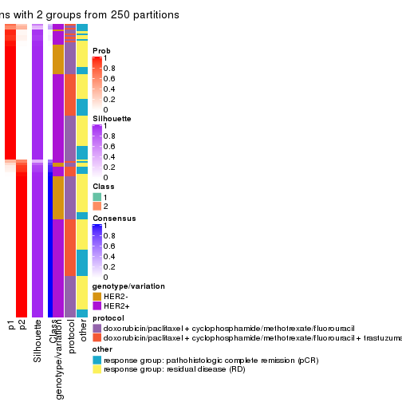</p>

</div>
<div id='tab-CV-kmeans-consensus-heatmap-2'>
<pre><code class="r">consensus_heatmap(res, k = 3)
</code></pre>

<p>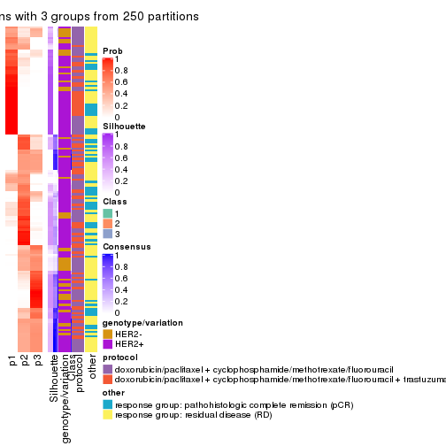</p>

</div>
<div id='tab-CV-kmeans-consensus-heatmap-3'>
<pre><code class="r">consensus_heatmap(res, k = 4)
</code></pre>

<p>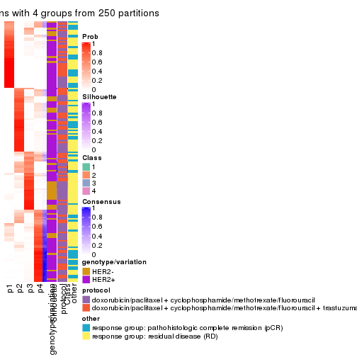</p>

</div>
<div id='tab-CV-kmeans-consensus-heatmap-4'>
<pre><code class="r">consensus_heatmap(res, k = 5)
</code></pre>

<p>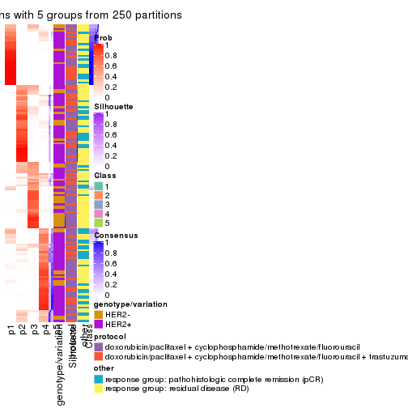</p>

</div>
<div id='tab-CV-kmeans-consensus-heatmap-5'>
<pre><code class="r">consensus_heatmap(res, k = 6)
</code></pre>

<p>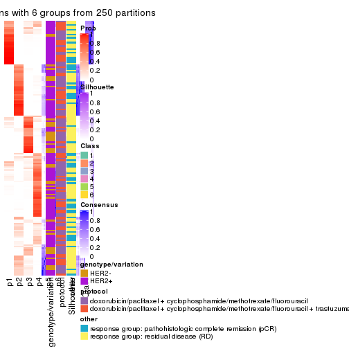</p>

</div>
</div>

Heatmaps for the membership of samples in all partitions to see how consistent they are:


<script>
$( function() {
	$( '#tabs-CV-kmeans-membership-heatmap' ).tabs();
} );
</script>
<div id='tabs-CV-kmeans-membership-heatmap'>
<ul>
<li><a href='#tab-CV-kmeans-membership-heatmap-1'>k = 2</a></li>
<li><a href='#tab-CV-kmeans-membership-heatmap-2'>k = 3</a></li>
<li><a href='#tab-CV-kmeans-membership-heatmap-3'>k = 4</a></li>
<li><a href='#tab-CV-kmeans-membership-heatmap-4'>k = 5</a></li>
<li><a href='#tab-CV-kmeans-membership-heatmap-5'>k = 6</a></li>
</ul>
<div id='tab-CV-kmeans-membership-heatmap-1'>
<pre><code class="r">membership_heatmap(res, k = 2)
</code></pre>

<p>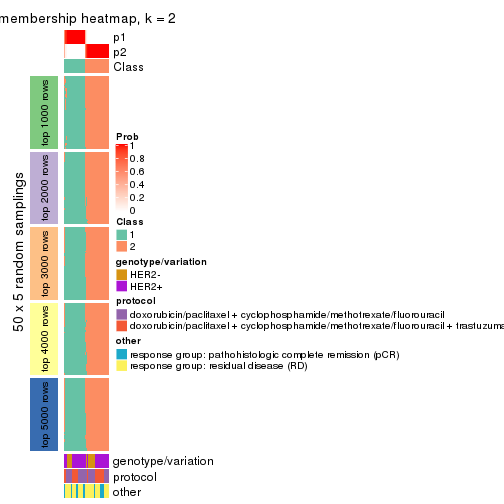</p>

</div>
<div id='tab-CV-kmeans-membership-heatmap-2'>
<pre><code class="r">membership_heatmap(res, k = 3)
</code></pre>

<p>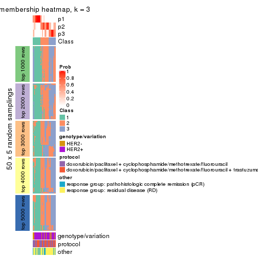</p>

</div>
<div id='tab-CV-kmeans-membership-heatmap-3'>
<pre><code class="r">membership_heatmap(res, k = 4)
</code></pre>

<p>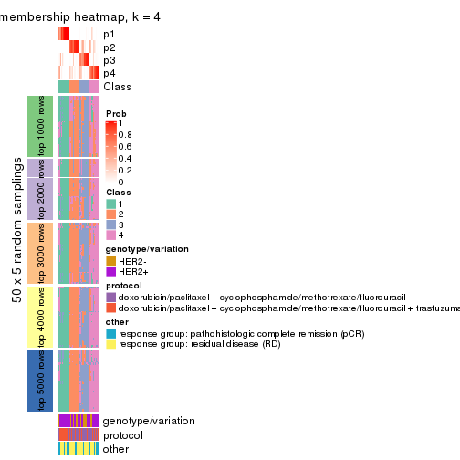</p>

</div>
<div id='tab-CV-kmeans-membership-heatmap-4'>
<pre><code class="r">membership_heatmap(res, k = 5)
</code></pre>

<p>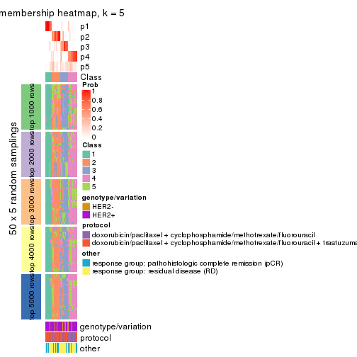</p>

</div>
<div id='tab-CV-kmeans-membership-heatmap-5'>
<pre><code class="r">membership_heatmap(res, k = 6)
</code></pre>

<p>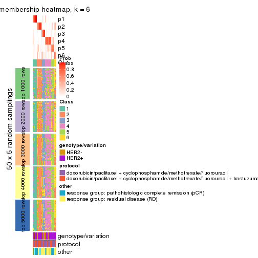</p>

</div>
</div>

As soon as we have had the classes for columns, we can look for signatures
which are significantly different between classes which can be candidate marks
for certain classes. Following are the heatmaps for signatures.


Signature heatmaps where rows are scaled:


<script>
$( function() {
	$( '#tabs-CV-kmeans-get-signatures' ).tabs();
} );
</script>
<div id='tabs-CV-kmeans-get-signatures'>
<ul>
<li><a href='#tab-CV-kmeans-get-signatures-1'>k = 2</a></li>
<li><a href='#tab-CV-kmeans-get-signatures-2'>k = 3</a></li>
<li><a href='#tab-CV-kmeans-get-signatures-3'>k = 4</a></li>
<li><a href='#tab-CV-kmeans-get-signatures-4'>k = 5</a></li>
<li><a href='#tab-CV-kmeans-get-signatures-5'>k = 6</a></li>
</ul>
<div id='tab-CV-kmeans-get-signatures-1'>
<pre><code class="r">get_signatures(res, k = 2)
</code></pre>

<pre><code>#&gt; Error: The width or height of the raster image is zero, maybe you forget to turn off the
#&gt; previous graphic device or it was corrupted. Run `dev.off()` to close it.
</code></pre>

<p></p>

</div>
<div id='tab-CV-kmeans-get-signatures-2'>
<pre><code class="r">get_signatures(res, k = 3)
</code></pre>

<pre><code>#&gt; Error: The width or height of the raster image is zero, maybe you forget to turn off the
#&gt; previous graphic device or it was corrupted. Run `dev.off()` to close it.
</code></pre>

<p></p>

</div>
<div id='tab-CV-kmeans-get-signatures-3'>
<pre><code class="r">get_signatures(res, k = 4)
</code></pre>

<pre><code>#&gt; Error: The width or height of the raster image is zero, maybe you forget to turn off the
#&gt; previous graphic device or it was corrupted. Run `dev.off()` to close it.
</code></pre>

<p></p>

</div>
<div id='tab-CV-kmeans-get-signatures-4'>
<pre><code class="r">get_signatures(res, k = 5)
</code></pre>

<pre><code>#&gt; Error: The width or height of the raster image is zero, maybe you forget to turn off the
#&gt; previous graphic device or it was corrupted. Run `dev.off()` to close it.
</code></pre>

<p></p>

</div>
<div id='tab-CV-kmeans-get-signatures-5'>
<pre><code class="r">get_signatures(res, k = 6)
</code></pre>

<pre><code>#&gt; Error: The width or height of the raster image is zero, maybe you forget to turn off the
#&gt; previous graphic device or it was corrupted. Run `dev.off()` to close it.
</code></pre>

<p></p>

</div>
</div>


Signature heatmaps where rows are not scaled:


<script>
$( function() {
	$( '#tabs-CV-kmeans-get-signatures-no-scale' ).tabs();
} );
</script>
<div id='tabs-CV-kmeans-get-signatures-no-scale'>
<ul>
<li><a href='#tab-CV-kmeans-get-signatures-no-scale-1'>k = 2</a></li>
<li><a href='#tab-CV-kmeans-get-signatures-no-scale-2'>k = 3</a></li>
<li><a href='#tab-CV-kmeans-get-signatures-no-scale-3'>k = 4</a></li>
<li><a href='#tab-CV-kmeans-get-signatures-no-scale-4'>k = 5</a></li>
<li><a href='#tab-CV-kmeans-get-signatures-no-scale-5'>k = 6</a></li>
</ul>
<div id='tab-CV-kmeans-get-signatures-no-scale-1'>
<pre><code class="r">get_signatures(res, k = 2, scale_rows = FALSE)
</code></pre>

<pre><code>#&gt; Error: The width or height of the raster image is zero, maybe you forget to turn off the
#&gt; previous graphic device or it was corrupted. Run `dev.off()` to close it.
</code></pre>

<p></p>

</div>
<div id='tab-CV-kmeans-get-signatures-no-scale-2'>
<pre><code class="r">get_signatures(res, k = 3, scale_rows = FALSE)
</code></pre>

<pre><code>#&gt; Error: The width or height of the raster image is zero, maybe you forget to turn off the
#&gt; previous graphic device or it was corrupted. Run `dev.off()` to close it.
</code></pre>

<p></p>

</div>
<div id='tab-CV-kmeans-get-signatures-no-scale-3'>
<pre><code class="r">get_signatures(res, k = 4, scale_rows = FALSE)
</code></pre>

<pre><code>#&gt; Error: The width or height of the raster image is zero, maybe you forget to turn off the
#&gt; previous graphic device or it was corrupted. Run `dev.off()` to close it.
</code></pre>

<p></p>

</div>
<div id='tab-CV-kmeans-get-signatures-no-scale-4'>
<pre><code class="r">get_signatures(res, k = 5, scale_rows = FALSE)
</code></pre>

<pre><code>#&gt; Error: The width or height of the raster image is zero, maybe you forget to turn off the
#&gt; previous graphic device or it was corrupted. Run `dev.off()` to close it.
</code></pre>

<p></p>

</div>
<div id='tab-CV-kmeans-get-signatures-no-scale-5'>
<pre><code class="r">get_signatures(res, k = 6, scale_rows = FALSE)
</code></pre>

<pre><code>#&gt; Error: The width or height of the raster image is zero, maybe you forget to turn off the
#&gt; previous graphic device or it was corrupted. Run `dev.off()` to close it.
</code></pre>

<p></p>

</div>
</div>


Compare the overlap of signatures from different k:

```r
compare_signatures(res)
```

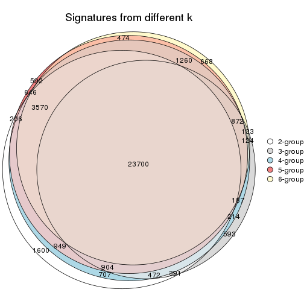

`get_signature()` returns a data frame invisibly. TO get the list of signatures, the function
call should be assigned to a variable explicitly. In following code, if `plot` argument is set
to `FALSE`, no heatmap is plotted while only the differential analysis is performed.

```r
# code only for demonstration
tb = get_signature(res, k = ..., plot = FALSE)
```

An example of the output of `tb` is:

```
#>   which_row         fdr    mean_1    mean_2 scaled_mean_1 scaled_mean_2 km
#> 1        38 0.042760348  8.373488  9.131774    -0.5533452     0.5164555  1
#> 2        40 0.018707592  7.106213  8.469186    -0.6173731     0.5762149  1
#> 3        55 0.019134737 10.221463 11.207825    -0.6159697     0.5749050  1
#> 4        59 0.006059896  5.921854  7.869574    -0.6899429     0.6439467  1
#> 5        60 0.018055526  8.928898 10.211722    -0.6204761     0.5791110  1
#> 6        98 0.009384629 15.714769 14.887706     0.6635654    -0.6193277  2
...
```

The columns in `tb` are:

1. `which_row`: row indices corresponding to the input matrix.
2. `fdr`: FDR for the differential test. 
3. `mean_x`: The mean value in group x.
4. `scaled_mean_x`: The mean value in group x after rows are scaled.
5. `km`: Row groups if k-means clustering is applied to rows.


UMAP plot which shows how samples are separated.


<script>
$( function() {
	$( '#tabs-CV-kmeans-dimension-reduction' ).tabs();
} );
</script>
<div id='tabs-CV-kmeans-dimension-reduction'>
<ul>
<li><a href='#tab-CV-kmeans-dimension-reduction-1'>k = 2</a></li>
<li><a href='#tab-CV-kmeans-dimension-reduction-2'>k = 3</a></li>
<li><a href='#tab-CV-kmeans-dimension-reduction-3'>k = 4</a></li>
<li><a href='#tab-CV-kmeans-dimension-reduction-4'>k = 5</a></li>
<li><a href='#tab-CV-kmeans-dimension-reduction-5'>k = 6</a></li>
</ul>
<div id='tab-CV-kmeans-dimension-reduction-1'>
<pre><code class="r">dimension_reduction(res, k = 2, method = &quot;UMAP&quot;)
</code></pre>

<p>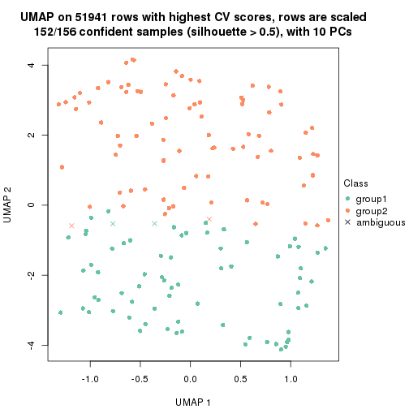</p>

</div>
<div id='tab-CV-kmeans-dimension-reduction-2'>
<pre><code class="r">dimension_reduction(res, k = 3, method = &quot;UMAP&quot;)
</code></pre>

<p>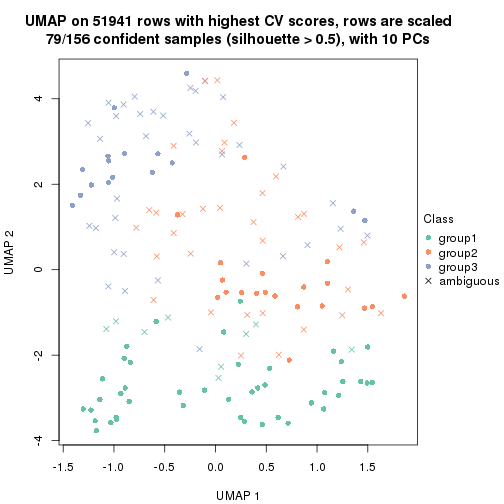</p>

</div>
<div id='tab-CV-kmeans-dimension-reduction-3'>
<pre><code class="r">dimension_reduction(res, k = 4, method = &quot;UMAP&quot;)
</code></pre>

<p>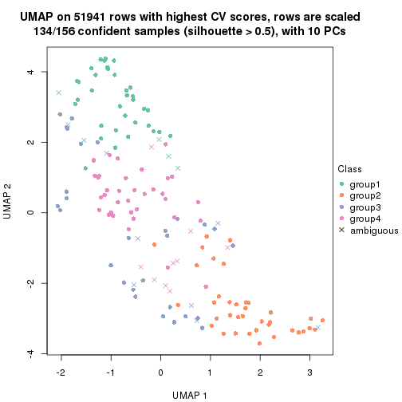</p>

</div>
<div id='tab-CV-kmeans-dimension-reduction-4'>
<pre><code class="r">dimension_reduction(res, k = 5, method = &quot;UMAP&quot;)
</code></pre>

<p>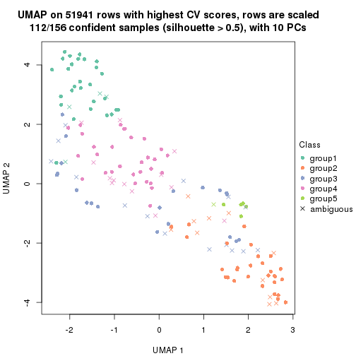</p>

</div>
<div id='tab-CV-kmeans-dimension-reduction-5'>
<pre><code class="r">dimension_reduction(res, k = 6, method = &quot;UMAP&quot;)
</code></pre>

<p>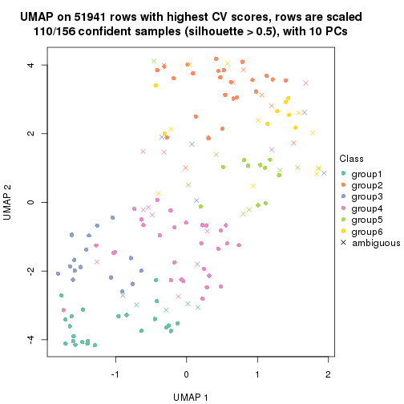</p>

</div>
</div>


Following heatmap shows how subgroups are split when increasing `k`:

```r
collect_classes(res)
```

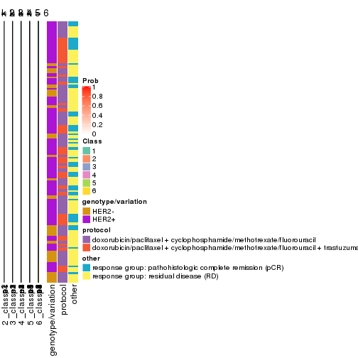


Test correlation between subgroups and known annotations. If the known
annotation is numeric, one-way ANOVA test is applied, and if the known
annotation is discrete, chi-squared contingency table test is applied.

```r
test_to_known_factors(res)
```

```
#>             n genotype/variation(p) protocol(p) other(p) k
#> CV:kmeans 152              0.502633       0.597   0.8697 2
#> CV:kmeans  79              0.023596       0.632   0.0862 3
#> CV:kmeans 134              0.000548       0.165   0.0545 4
#> CV:kmeans 112              0.000045       0.197   0.0451 5
#> CV:kmeans 110              0.003776       0.658   0.3782 6
```


If matrix rows can be associated to genes, consider to use `functional_enrichment(res,
...)` to perform function enrichment for the signature genes. See [this vignette](http://bioconductor.org/packages/devel/bioc/vignettes/cola/inst/doc/functional_enrichment.html) for more detailed explanations.


 

---------------------------------------------------


### CV:skmeans**


The object with results only for a single top-value method and a single partition method 
can be extracted as:

```r
res = res_list["CV", "skmeans"]
# you can also extract it by
# res = res_list["CV:skmeans"]
```

A summary of `res` and all the functions that can be applied to it:

```r
res
```

```
#> A 'ConsensusPartition' object with k = 2, 3, 4, 5, 6.
#>   On a matrix with 51941 rows and 156 columns.
#>   Top rows (1000, 2000, 3000, 4000, 5000) are extracted by 'CV' method.
#>   Subgroups are detected by 'skmeans' method.
#>   Performed in total 1250 partitions by row resampling.
#>   Best k for subgroups seems to be 2.
#> 
#> Following methods can be applied to this 'ConsensusPartition' object:
#>  [1] "cola_report"             "collect_classes"         "collect_plots"          
#>  [4] "collect_stats"           "colnames"                "compare_signatures"     
#>  [7] "consensus_heatmap"       "dimension_reduction"     "functional_enrichment"  
#> [10] "get_anno_col"            "get_anno"                "get_classes"            
#> [13] "get_consensus"           "get_matrix"              "get_membership"         
#> [16] "get_param"               "get_signatures"          "get_stats"              
#> [19] "is_best_k"               "is_stable_k"             "membership_heatmap"     
#> [22] "ncol"                    "nrow"                    "plot_ecdf"              
#> [25] "rownames"                "select_partition_number" "show"                   
#> [28] "suggest_best_k"          "test_to_known_factors"
```

`collect_plots()` function collects all the plots made from `res` for all `k` (number of partitions)
into one single page to provide an easy and fast comparison between different `k`.

```r
collect_plots(res)
```

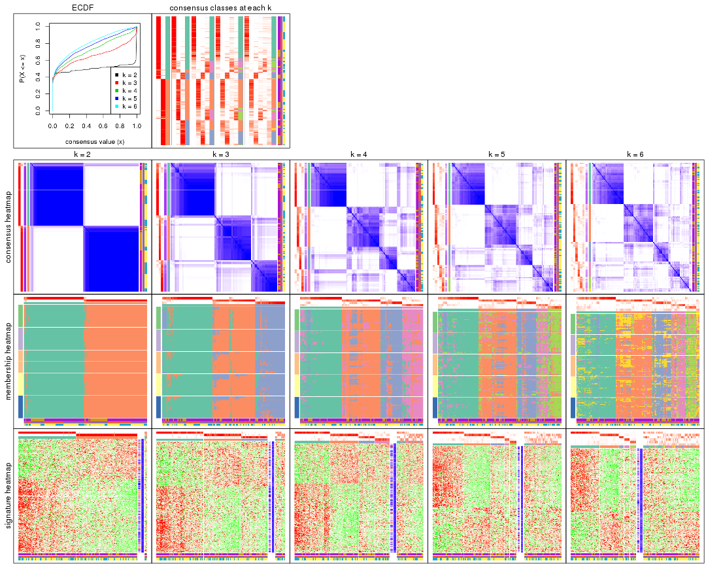

The plots are:

- The first row: a plot of the ECDF (empirical cumulative distribution
  function) curves of the consensus matrix for each `k` and the heatmap of
  predicted classes for each `k`.
- The second row: heatmaps of the consensus matrix for each `k`.
- The third row: heatmaps of the membership matrix for each `k`.
- The fouth row: heatmaps of the signatures for each `k`.

All the plots in panels can be made by individual functions and they are
plotted later in this section.

`select_partition_number()` produces several plots showing different
statistics for choosing "optimized" `k`. There are following statistics:

- ECDF curves of the consensus matrix for each `k`;
- 1-PAC. [The PAC
  score](https://en.wikipedia.org/wiki/Consensus_clustering#Over-interpretation_potential_of_consensus_clustering)
  measures the proportion of the ambiguous subgrouping.
- Mean silhouette score.
- Concordance. The mean probability of fiting the consensus class ids in all
  partitions.
- Area increased. Denote $A_k$ as the area under the ECDF curve for current
  `k`, the area increased is defined as $A_k - A_{k-1}$.
- Rand index. The percent of pairs of samples that are both in a same cluster
  or both are not in a same cluster in the partition of k and k-1.
- Jaccard index. The ratio of pairs of samples are both in a same cluster in
  the partition of k and k-1 and the pairs of samples are both in a same
  cluster in the partition k or k-1.

The detailed explanations of these statistics can be found in [the _cola_
vignette](http://bioconductor.org/packages/devel/bioc/vignettes/cola/inst/doc/cola.html#toc_13).

Generally speaking, lower PAC score, higher mean silhouette score or higher
concordance corresponds to better partition. Rand index and Jaccard index
measure how similar the current partition is compared to partition with `k-1`.
If they are too similar, we won't accept `k` is better than `k-1`.

```r
select_partition_number(res)
```

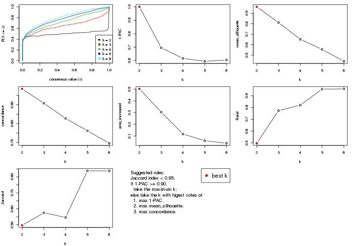

The numeric values for all these statistics can be obtained by `get_stats()`.

```r
get_stats(res)
```

```
#>   k 1-PAC mean_silhouette concordance area_increased  Rand Jaccard
#> 2 2 1.000           0.961       0.984         0.5031 0.497   0.497
#> 3 3 0.695           0.811       0.908         0.3043 0.773   0.575
#> 4 4 0.616           0.651       0.827         0.1174 0.820   0.546
#> 5 5 0.595           0.555       0.762         0.0604 0.955   0.838
#> 6 6 0.604           0.442       0.696         0.0388 0.958   0.838
```

`suggest_best_k()` suggests the best $k$ based on these statistics. The rules are as follows:

- All $k$ with Jaccard index larger than 0.95 are removed because increasing
  $k$ does not provide enough extra information. If all $k$ are removed, it is
  marked as no subgroup is detected.
- For all $k$ with 1-PAC score larger than 0.9, the maximal $k$ is taken as
  the best $k$, and other $k$ are marked as optional $k$.
- If it does not fit the second rule. The $k$ with the maximal vote of the
  highest 1-PAC score, highest mean silhouette, and highest concordance is
  taken as the best $k$.

```r
suggest_best_k(res)
```

```
#> [1] 2
```


Following shows the table of the partitions (You need to click the **show/hide
code output** link to see it). The membership matrix (columns with name `p*`)
is inferred by
[`clue::cl_consensus()`](https://www.rdocumentation.org/link/cl_consensus?package=clue)
function with the `SE` method. Basically the value in the membership matrix
represents the probability to belong to a certain group. The finall class
label for an item is determined with the group with highest probability it
belongs to.

In `get_classes()` function, the entropy is calculated from the membership
matrix and the silhouette score is calculated from the consensus matrix.


<script>
$( function() {
	$( '#tabs-CV-skmeans-get-classes' ).tabs();
} );
</script>
<div id='tabs-CV-skmeans-get-classes'>
<ul>
<li><a href='#tab-CV-skmeans-get-classes-1'>k = 2</a></li>
<li><a href='#tab-CV-skmeans-get-classes-2'>k = 3</a></li>
<li><a href='#tab-CV-skmeans-get-classes-3'>k = 4</a></li>
<li><a href='#tab-CV-skmeans-get-classes-4'>k = 5</a></li>
<li><a href='#tab-CV-skmeans-get-classes-5'>k = 6</a></li>
</ul>

<div id='tab-CV-skmeans-get-classes-1'>
<p><a id='tab-CV-skmeans-get-classes-1-a' style='color:#0366d6' href='#'>show/hide code output</a></p>
<pre><code class="r">cbind(get_classes(res, k = 2), get_membership(res, k = 2))
</code></pre>

<pre><code>#&gt;            class entropy silhouette    p1    p2
#&gt; GSM1232995     2  0.0000      0.987 0.000 1.000
#&gt; GSM1233002     1  0.1184      0.967 0.984 0.016
#&gt; GSM1233003     1  0.0000      0.980 1.000 0.000
#&gt; GSM1233014     2  0.0000      0.987 0.000 1.000
#&gt; GSM1233015     1  0.0000      0.980 1.000 0.000
#&gt; GSM1233016     1  0.4562      0.884 0.904 0.096
#&gt; GSM1233024     2  0.0000      0.987 0.000 1.000
#&gt; GSM1233049     1  0.0000      0.980 1.000 0.000
#&gt; GSM1233064     2  0.0000      0.987 0.000 1.000
#&gt; GSM1233068     1  0.0000      0.980 1.000 0.000
#&gt; GSM1233073     1  0.0000      0.980 1.000 0.000
#&gt; GSM1233093     1  0.0000      0.980 1.000 0.000
#&gt; GSM1233115     1  0.0000      0.980 1.000 0.000
#&gt; GSM1232992     2  0.0000      0.987 0.000 1.000
#&gt; GSM1232993     2  0.0000      0.987 0.000 1.000
#&gt; GSM1233005     2  0.0000      0.987 0.000 1.000
#&gt; GSM1233007     2  0.0000      0.987 0.000 1.000
#&gt; GSM1233010     1  0.0000      0.980 1.000 0.000
#&gt; GSM1233013     2  0.0000      0.987 0.000 1.000
#&gt; GSM1233018     2  0.0000      0.987 0.000 1.000
#&gt; GSM1233019     2  0.0000      0.987 0.000 1.000
#&gt; GSM1233021     2  0.0000      0.987 0.000 1.000
#&gt; GSM1233025     1  0.0000      0.980 1.000 0.000
#&gt; GSM1233029     2  0.0000      0.987 0.000 1.000
#&gt; GSM1233030     2  0.0000      0.987 0.000 1.000
#&gt; GSM1233031     1  0.0000      0.980 1.000 0.000
#&gt; GSM1233032     1  0.0000      0.980 1.000 0.000
#&gt; GSM1233035     1  0.0000      0.980 1.000 0.000
#&gt; GSM1233038     1  0.0000      0.980 1.000 0.000
#&gt; GSM1233039     2  0.0000      0.987 0.000 1.000
#&gt; GSM1233042     2  0.1633      0.965 0.024 0.976
#&gt; GSM1233043     2  0.0000      0.987 0.000 1.000
#&gt; GSM1233044     1  0.0000      0.980 1.000 0.000
#&gt; GSM1233046     1  0.0000      0.980 1.000 0.000
#&gt; GSM1233051     1  0.0000      0.980 1.000 0.000
#&gt; GSM1233054     1  0.0000      0.980 1.000 0.000
#&gt; GSM1233057     2  0.0000      0.987 0.000 1.000
#&gt; GSM1233060     1  0.7453      0.732 0.788 0.212
#&gt; GSM1233062     2  0.0000      0.987 0.000 1.000
#&gt; GSM1233075     2  0.0000      0.987 0.000 1.000
#&gt; GSM1233078     1  0.0000      0.980 1.000 0.000
#&gt; GSM1233079     1  0.0000      0.980 1.000 0.000
#&gt; GSM1233082     1  0.0000      0.980 1.000 0.000
#&gt; GSM1233083     1  0.0000      0.980 1.000 0.000
#&gt; GSM1233091     1  0.0000      0.980 1.000 0.000
#&gt; GSM1233095     1  0.0000      0.980 1.000 0.000
#&gt; GSM1233096     1  0.0000      0.980 1.000 0.000
#&gt; GSM1233101     1  0.0000      0.980 1.000 0.000
#&gt; GSM1233105     1  0.0000      0.980 1.000 0.000
#&gt; GSM1233117     2  0.0000      0.987 0.000 1.000
#&gt; GSM1233118     2  0.0000      0.987 0.000 1.000
#&gt; GSM1233001     2  0.0000      0.987 0.000 1.000
#&gt; GSM1233006     2  0.0000      0.987 0.000 1.000
#&gt; GSM1233008     2  0.0000      0.987 0.000 1.000
#&gt; GSM1233009     2  0.0000      0.987 0.000 1.000
#&gt; GSM1233017     2  0.0000      0.987 0.000 1.000
#&gt; GSM1233020     2  0.0000      0.987 0.000 1.000
#&gt; GSM1233022     2  0.0000      0.987 0.000 1.000
#&gt; GSM1233026     1  0.8386      0.635 0.732 0.268
#&gt; GSM1233028     1  0.0938      0.970 0.988 0.012
#&gt; GSM1233034     2  0.0000      0.987 0.000 1.000
#&gt; GSM1233040     1  0.0000      0.980 1.000 0.000
#&gt; GSM1233048     1  0.0000      0.980 1.000 0.000
#&gt; GSM1233056     1  0.0000      0.980 1.000 0.000
#&gt; GSM1233058     1  0.0000      0.980 1.000 0.000
#&gt; GSM1233059     1  0.0000      0.980 1.000 0.000
#&gt; GSM1233066     2  0.1184      0.973 0.016 0.984
#&gt; GSM1233071     2  0.0000      0.987 0.000 1.000
#&gt; GSM1233074     2  0.0000      0.987 0.000 1.000
#&gt; GSM1233076     2  0.0000      0.987 0.000 1.000
#&gt; GSM1233080     1  0.0000      0.980 1.000 0.000
#&gt; GSM1233088     1  0.9393      0.459 0.644 0.356
#&gt; GSM1233090     1  0.0000      0.980 1.000 0.000
#&gt; GSM1233092     2  0.0000      0.987 0.000 1.000
#&gt; GSM1233094     2  0.7376      0.735 0.208 0.792
#&gt; GSM1233097     1  0.1184      0.967 0.984 0.016
#&gt; GSM1233100     1  0.0000      0.980 1.000 0.000
#&gt; GSM1233104     2  0.0000      0.987 0.000 1.000
#&gt; GSM1233106     1  0.0000      0.980 1.000 0.000
#&gt; GSM1233111     1  0.0000      0.980 1.000 0.000
#&gt; GSM1233122     2  0.0000      0.987 0.000 1.000
#&gt; GSM1233146     2  0.9922      0.174 0.448 0.552
#&gt; GSM1232994     2  0.0000      0.987 0.000 1.000
#&gt; GSM1232996     2  0.0000      0.987 0.000 1.000
#&gt; GSM1232997     2  0.0000      0.987 0.000 1.000
#&gt; GSM1232998     2  0.0000      0.987 0.000 1.000
#&gt; GSM1232999     2  0.0000      0.987 0.000 1.000
#&gt; GSM1233000     2  0.0000      0.987 0.000 1.000
#&gt; GSM1233004     1  0.0000      0.980 1.000 0.000
#&gt; GSM1233011     2  0.0000      0.987 0.000 1.000
#&gt; GSM1233012     2  0.0000      0.987 0.000 1.000
#&gt; GSM1233023     2  0.0000      0.987 0.000 1.000
#&gt; GSM1233027     2  0.0000      0.987 0.000 1.000
#&gt; GSM1233033     1  0.0000      0.980 1.000 0.000
#&gt; GSM1233036     2  0.0000      0.987 0.000 1.000
#&gt; GSM1233037     2  0.2778      0.941 0.048 0.952
#&gt; GSM1233041     1  0.0000      0.980 1.000 0.000
#&gt; GSM1233045     2  0.1414      0.969 0.020 0.980
#&gt; GSM1233047     1  0.0000      0.980 1.000 0.000
#&gt; GSM1233050     1  0.0000      0.980 1.000 0.000
#&gt; GSM1233052     1  0.0000      0.980 1.000 0.000
#&gt; GSM1233053     1  0.0000      0.980 1.000 0.000
#&gt; GSM1233055     1  0.0000      0.980 1.000 0.000
#&gt; GSM1233061     1  0.2043      0.952 0.968 0.032
#&gt; GSM1233063     1  0.0000      0.980 1.000 0.000
#&gt; GSM1233065     2  0.0000      0.987 0.000 1.000
#&gt; GSM1233070     2  0.0000      0.987 0.000 1.000
#&gt; GSM1233077     2  0.0000      0.987 0.000 1.000
#&gt; GSM1233081     1  0.0000      0.980 1.000 0.000
#&gt; GSM1233084     1  0.0000      0.980 1.000 0.000
#&gt; GSM1233087     1  0.0000      0.980 1.000 0.000
#&gt; GSM1233089     2  0.0000      0.987 0.000 1.000
#&gt; GSM1233099     1  0.0000      0.980 1.000 0.000
#&gt; GSM1233112     1  0.0000      0.980 1.000 0.000
#&gt; GSM1233085     1  0.0000      0.980 1.000 0.000
#&gt; GSM1233098     2  0.0000      0.987 0.000 1.000
#&gt; GSM1233114     1  0.0000      0.980 1.000 0.000
#&gt; GSM1233119     1  0.0000      0.980 1.000 0.000
#&gt; GSM1233129     2  0.0000      0.987 0.000 1.000
#&gt; GSM1233132     1  0.0000      0.980 1.000 0.000
#&gt; GSM1233139     2  0.0000      0.987 0.000 1.000
#&gt; GSM1233143     2  0.0000      0.987 0.000 1.000
#&gt; GSM1233145     1  0.0000      0.980 1.000 0.000
#&gt; GSM1233067     2  0.0000      0.987 0.000 1.000
#&gt; GSM1233069     2  0.0000      0.987 0.000 1.000
#&gt; GSM1233072     2  0.0000      0.987 0.000 1.000
#&gt; GSM1233086     2  0.0000      0.987 0.000 1.000
#&gt; GSM1233102     1  0.0000      0.980 1.000 0.000
#&gt; GSM1233103     1  0.0000      0.980 1.000 0.000
#&gt; GSM1233107     2  0.7815      0.696 0.232 0.768
#&gt; GSM1233108     1  0.0000      0.980 1.000 0.000
#&gt; GSM1233109     1  0.0000      0.980 1.000 0.000
#&gt; GSM1233110     2  0.1633      0.966 0.024 0.976
#&gt; GSM1233113     2  0.0000      0.987 0.000 1.000
#&gt; GSM1233116     2  0.0000      0.987 0.000 1.000
#&gt; GSM1233120     1  0.0000      0.980 1.000 0.000
#&gt; GSM1233121     2  0.0000      0.987 0.000 1.000
#&gt; GSM1233123     1  0.9866      0.253 0.568 0.432
#&gt; GSM1233124     2  0.0000      0.987 0.000 1.000
#&gt; GSM1233125     1  0.0000      0.980 1.000 0.000
#&gt; GSM1233126     2  0.0000      0.987 0.000 1.000
#&gt; GSM1233127     2  0.0000      0.987 0.000 1.000
#&gt; GSM1233128     1  0.0000      0.980 1.000 0.000
#&gt; GSM1233130     2  0.0000      0.987 0.000 1.000
#&gt; GSM1233131     1  0.0000      0.980 1.000 0.000
#&gt; GSM1233133     1  0.0000      0.980 1.000 0.000
#&gt; GSM1233134     2  0.0000      0.987 0.000 1.000
#&gt; GSM1233135     2  0.0000      0.987 0.000 1.000
#&gt; GSM1233136     2  0.0000      0.987 0.000 1.000
#&gt; GSM1233137     1  0.0000      0.980 1.000 0.000
#&gt; GSM1233138     2  0.0000      0.987 0.000 1.000
#&gt; GSM1233140     1  0.0000      0.980 1.000 0.000
#&gt; GSM1233141     2  0.0000      0.987 0.000 1.000
#&gt; GSM1233142     2  0.0000      0.987 0.000 1.000
#&gt; GSM1233144     1  0.0000      0.980 1.000 0.000
#&gt; GSM1233147     2  0.0000      0.987 0.000 1.000
</code></pre>

<script>
$('#tab-CV-skmeans-get-classes-1-a').parent().next().next().hide();
$('#tab-CV-skmeans-get-classes-1-a').click(function(){
  $('#tab-CV-skmeans-get-classes-1-a').parent().next().next().toggle();
  return(false);
});
</script>
</div>

<div id='tab-CV-skmeans-get-classes-2'>
<p><a id='tab-CV-skmeans-get-classes-2-a' style='color:#0366d6' href='#'>show/hide code output</a></p>
<pre><code class="r">cbind(get_classes(res, k = 3), get_membership(res, k = 3))
</code></pre>

<pre><code>#&gt;            class entropy silhouette    p1    p2    p3
#&gt; GSM1232995     2  0.4750     0.7580 0.000 0.784 0.216
#&gt; GSM1233002     1  0.5178     0.6824 0.744 0.256 0.000
#&gt; GSM1233003     1  0.0000     0.9325 1.000 0.000 0.000
#&gt; GSM1233014     2  0.0000     0.8606 0.000 1.000 0.000
#&gt; GSM1233015     1  0.0000     0.9325 1.000 0.000 0.000
#&gt; GSM1233016     2  0.6267     0.1124 0.452 0.548 0.000
#&gt; GSM1233024     2  0.1289     0.8682 0.000 0.968 0.032
#&gt; GSM1233049     1  0.0000     0.9325 1.000 0.000 0.000
#&gt; GSM1233064     3  0.4178     0.7559 0.000 0.172 0.828
#&gt; GSM1233068     1  0.0000     0.9325 1.000 0.000 0.000
#&gt; GSM1233073     1  0.2537     0.8834 0.920 0.080 0.000
#&gt; GSM1233093     1  0.0000     0.9325 1.000 0.000 0.000
#&gt; GSM1233115     1  0.0000     0.9325 1.000 0.000 0.000
#&gt; GSM1232992     2  0.3340     0.8503 0.000 0.880 0.120
#&gt; GSM1232993     2  0.0424     0.8634 0.000 0.992 0.008
#&gt; GSM1233005     2  0.3267     0.8524 0.000 0.884 0.116
#&gt; GSM1233007     2  0.4452     0.7556 0.000 0.808 0.192
#&gt; GSM1233010     1  0.2261     0.8931 0.932 0.068 0.000
#&gt; GSM1233013     2  0.3340     0.8503 0.000 0.880 0.120
#&gt; GSM1233018     2  0.3340     0.8503 0.000 0.880 0.120
#&gt; GSM1233019     2  0.1529     0.8691 0.000 0.960 0.040
#&gt; GSM1233021     2  0.3267     0.8524 0.000 0.884 0.116
#&gt; GSM1233025     1  0.2165     0.8952 0.936 0.064 0.000
#&gt; GSM1233029     2  0.1643     0.8690 0.000 0.956 0.044
#&gt; GSM1233030     2  0.3192     0.8543 0.000 0.888 0.112
#&gt; GSM1233031     1  0.6295     0.2068 0.528 0.472 0.000
#&gt; GSM1233032     1  0.0000     0.9325 1.000 0.000 0.000
#&gt; GSM1233035     1  0.5363     0.6558 0.724 0.276 0.000
#&gt; GSM1233038     1  0.0000     0.9325 1.000 0.000 0.000
#&gt; GSM1233039     3  0.5988     0.4109 0.000 0.368 0.632
#&gt; GSM1233042     2  0.0000     0.8606 0.000 1.000 0.000
#&gt; GSM1233043     2  0.0000     0.8606 0.000 1.000 0.000
#&gt; GSM1233044     1  0.0000     0.9325 1.000 0.000 0.000
#&gt; GSM1233046     1  0.0237     0.9308 0.996 0.004 0.000
#&gt; GSM1233051     1  0.0000     0.9325 1.000 0.000 0.000
#&gt; GSM1233054     1  0.6079     0.3704 0.612 0.000 0.388
#&gt; GSM1233057     3  0.0000     0.8721 0.000 0.000 1.000
#&gt; GSM1233060     2  0.4504     0.6659 0.196 0.804 0.000
#&gt; GSM1233062     2  0.1163     0.8680 0.000 0.972 0.028
#&gt; GSM1233075     3  0.0000     0.8721 0.000 0.000 1.000
#&gt; GSM1233078     3  0.3267     0.7969 0.116 0.000 0.884
#&gt; GSM1233079     1  0.0000     0.9325 1.000 0.000 0.000
#&gt; GSM1233082     1  0.0000     0.9325 1.000 0.000 0.000
#&gt; GSM1233083     1  0.0000     0.9325 1.000 0.000 0.000
#&gt; GSM1233091     1  0.2590     0.8799 0.924 0.004 0.072
#&gt; GSM1233095     1  0.0000     0.9325 1.000 0.000 0.000
#&gt; GSM1233096     1  0.0000     0.9325 1.000 0.000 0.000
#&gt; GSM1233101     1  0.0000     0.9325 1.000 0.000 0.000
#&gt; GSM1233105     1  0.0592     0.9272 0.988 0.012 0.000
#&gt; GSM1233117     2  0.5497     0.6489 0.000 0.708 0.292
#&gt; GSM1233118     3  0.2165     0.8519 0.000 0.064 0.936
#&gt; GSM1233001     2  0.6126     0.4230 0.000 0.600 0.400
#&gt; GSM1233006     2  0.0424     0.8636 0.000 0.992 0.008
#&gt; GSM1233008     2  0.3340     0.8503 0.000 0.880 0.120
#&gt; GSM1233009     2  0.2165     0.8673 0.000 0.936 0.064
#&gt; GSM1233017     2  0.1964     0.8683 0.000 0.944 0.056
#&gt; GSM1233020     2  0.3941     0.8222 0.000 0.844 0.156
#&gt; GSM1233022     2  0.0237     0.8617 0.000 0.996 0.004
#&gt; GSM1233026     2  0.6168     0.2235 0.412 0.588 0.000
#&gt; GSM1233028     2  0.6260     0.0759 0.448 0.552 0.000
#&gt; GSM1233034     2  0.4002     0.8214 0.000 0.840 0.160
#&gt; GSM1233040     1  0.0000     0.9325 1.000 0.000 0.000
#&gt; GSM1233048     1  0.0000     0.9325 1.000 0.000 0.000
#&gt; GSM1233056     1  0.0000     0.9325 1.000 0.000 0.000
#&gt; GSM1233058     1  0.4750     0.7541 0.784 0.216 0.000
#&gt; GSM1233059     1  0.0000     0.9325 1.000 0.000 0.000
#&gt; GSM1233066     3  0.1015     0.8666 0.008 0.012 0.980
#&gt; GSM1233071     2  0.1529     0.8689 0.000 0.960 0.040
#&gt; GSM1233074     3  0.0747     0.8704 0.000 0.016 0.984
#&gt; GSM1233076     3  0.4002     0.7991 0.000 0.160 0.840
#&gt; GSM1233080     1  0.0000     0.9325 1.000 0.000 0.000
#&gt; GSM1233088     3  0.2810     0.8559 0.036 0.036 0.928
#&gt; GSM1233090     1  0.0000     0.9325 1.000 0.000 0.000
#&gt; GSM1233092     2  0.0000     0.8606 0.000 1.000 0.000
#&gt; GSM1233094     2  0.2066     0.8241 0.060 0.940 0.000
#&gt; GSM1233097     1  0.6126     0.3884 0.600 0.400 0.000
#&gt; GSM1233100     1  0.1753     0.9069 0.952 0.048 0.000
#&gt; GSM1233104     2  0.0000     0.8606 0.000 1.000 0.000
#&gt; GSM1233106     1  0.0000     0.9325 1.000 0.000 0.000
#&gt; GSM1233111     1  0.0000     0.9325 1.000 0.000 0.000
#&gt; GSM1233122     2  0.3340     0.8503 0.000 0.880 0.120
#&gt; GSM1233146     2  0.1411     0.8390 0.036 0.964 0.000
#&gt; GSM1232994     2  0.1163     0.8677 0.000 0.972 0.028
#&gt; GSM1232996     2  0.3340     0.8503 0.000 0.880 0.120
#&gt; GSM1232997     3  0.0747     0.8704 0.000 0.016 0.984
#&gt; GSM1232998     2  0.0592     0.8647 0.000 0.988 0.012
#&gt; GSM1232999     2  0.0424     0.8636 0.000 0.992 0.008
#&gt; GSM1233000     2  0.2537     0.8647 0.000 0.920 0.080
#&gt; GSM1233004     1  0.5896     0.5771 0.700 0.008 0.292
#&gt; GSM1233011     3  0.3941     0.7906 0.000 0.156 0.844
#&gt; GSM1233012     3  0.6008     0.3465 0.000 0.372 0.628
#&gt; GSM1233023     3  0.3619     0.7960 0.000 0.136 0.864
#&gt; GSM1233027     2  0.0892     0.8666 0.000 0.980 0.020
#&gt; GSM1233033     1  0.0000     0.9325 1.000 0.000 0.000
#&gt; GSM1233036     3  0.1529     0.8646 0.000 0.040 0.960
#&gt; GSM1233037     3  0.6193     0.5156 0.016 0.292 0.692
#&gt; GSM1233041     1  0.0000     0.9325 1.000 0.000 0.000
#&gt; GSM1233045     2  0.0000     0.8606 0.000 1.000 0.000
#&gt; GSM1233047     1  0.2165     0.8847 0.936 0.000 0.064
#&gt; GSM1233050     1  0.0000     0.9325 1.000 0.000 0.000
#&gt; GSM1233052     1  0.0000     0.9325 1.000 0.000 0.000
#&gt; GSM1233053     1  0.0000     0.9325 1.000 0.000 0.000
#&gt; GSM1233055     1  0.0000     0.9325 1.000 0.000 0.000
#&gt; GSM1233061     3  0.3619     0.7847 0.136 0.000 0.864
#&gt; GSM1233063     1  0.0000     0.9325 1.000 0.000 0.000
#&gt; GSM1233065     3  0.2261     0.8498 0.000 0.068 0.932
#&gt; GSM1233070     2  0.2261     0.8660 0.000 0.932 0.068
#&gt; GSM1233077     3  0.0237     0.8717 0.000 0.004 0.996
#&gt; GSM1233081     1  0.4346     0.7554 0.816 0.000 0.184
#&gt; GSM1233084     1  0.0000     0.9325 1.000 0.000 0.000
#&gt; GSM1233087     1  0.0747     0.9253 0.984 0.016 0.000
#&gt; GSM1233089     2  0.6260     0.2810 0.000 0.552 0.448
#&gt; GSM1233099     1  0.0424     0.9292 0.992 0.008 0.000
#&gt; GSM1233112     1  0.0000     0.9325 1.000 0.000 0.000
#&gt; GSM1233085     1  0.5058     0.6706 0.756 0.000 0.244
#&gt; GSM1233098     2  0.5327     0.6818 0.000 0.728 0.272
#&gt; GSM1233114     1  0.0000     0.9325 1.000 0.000 0.000
#&gt; GSM1233119     1  0.5098     0.7036 0.752 0.248 0.000
#&gt; GSM1233129     3  0.1753     0.8602 0.000 0.048 0.952
#&gt; GSM1233132     1  0.0000     0.9325 1.000 0.000 0.000
#&gt; GSM1233139     2  0.2796     0.8614 0.000 0.908 0.092
#&gt; GSM1233143     2  0.6215     0.3400 0.000 0.572 0.428
#&gt; GSM1233145     1  0.0000     0.9325 1.000 0.000 0.000
#&gt; GSM1233067     3  0.0592     0.8718 0.000 0.012 0.988
#&gt; GSM1233069     3  0.0000     0.8721 0.000 0.000 1.000
#&gt; GSM1233072     2  0.3482     0.8451 0.000 0.872 0.128
#&gt; GSM1233086     3  0.0892     0.8715 0.000 0.020 0.980
#&gt; GSM1233102     1  0.0892     0.9231 0.980 0.020 0.000
#&gt; GSM1233103     1  0.3038     0.8631 0.896 0.104 0.000
#&gt; GSM1233107     2  0.5092     0.7085 0.176 0.804 0.020
#&gt; GSM1233108     1  0.4605     0.7286 0.796 0.000 0.204
#&gt; GSM1233109     3  0.6180     0.2747 0.416 0.000 0.584
#&gt; GSM1233110     3  0.0000     0.8721 0.000 0.000 1.000
#&gt; GSM1233113     3  0.4002     0.7697 0.000 0.160 0.840
#&gt; GSM1233116     3  0.3482     0.8036 0.000 0.128 0.872
#&gt; GSM1233120     1  0.0592     0.9274 0.988 0.012 0.000
#&gt; GSM1233121     3  0.0237     0.8717 0.000 0.004 0.996
#&gt; GSM1233123     3  0.0747     0.8661 0.016 0.000 0.984
#&gt; GSM1233124     3  0.0000     0.8721 0.000 0.000 1.000
#&gt; GSM1233125     1  0.4555     0.7340 0.800 0.000 0.200
#&gt; GSM1233126     2  0.0000     0.8606 0.000 1.000 0.000
#&gt; GSM1233127     2  0.2066     0.8683 0.000 0.940 0.060
#&gt; GSM1233128     1  0.0000     0.9325 1.000 0.000 0.000
#&gt; GSM1233130     3  0.0237     0.8717 0.000 0.004 0.996
#&gt; GSM1233131     1  0.0237     0.9308 0.996 0.004 0.000
#&gt; GSM1233133     3  0.5859     0.4572 0.344 0.000 0.656
#&gt; GSM1233134     3  0.0000     0.8721 0.000 0.000 1.000
#&gt; GSM1233135     3  0.0000     0.8721 0.000 0.000 1.000
#&gt; GSM1233136     3  0.0237     0.8717 0.000 0.004 0.996
#&gt; GSM1233137     3  0.4121     0.7514 0.168 0.000 0.832
#&gt; GSM1233138     2  0.0000     0.8606 0.000 1.000 0.000
#&gt; GSM1233140     1  0.0237     0.9303 0.996 0.000 0.004
#&gt; GSM1233141     2  0.3116     0.8559 0.000 0.892 0.108
#&gt; GSM1233142     2  0.2261     0.8667 0.000 0.932 0.068
#&gt; GSM1233144     3  0.5098     0.6407 0.248 0.000 0.752
#&gt; GSM1233147     3  0.4887     0.7239 0.000 0.228 0.772
</code></pre>

<script>
$('#tab-CV-skmeans-get-classes-2-a').parent().next().next().hide();
$('#tab-CV-skmeans-get-classes-2-a').click(function(){
  $('#tab-CV-skmeans-get-classes-2-a').parent().next().next().toggle();
  return(false);
});
</script>
</div>

<div id='tab-CV-skmeans-get-classes-3'>
<p><a id='tab-CV-skmeans-get-classes-3-a' style='color:#0366d6' href='#'>show/hide code output</a></p>
<pre><code class="r">cbind(get_classes(res, k = 4), get_membership(res, k = 4))
</code></pre>

<pre><code>#&gt;            class entropy silhouette    p1    p2    p3    p4
#&gt; GSM1232995     2  0.1978     0.7581 0.000 0.928 0.068 0.004
#&gt; GSM1233002     4  0.6417     0.3104 0.388 0.072 0.000 0.540
#&gt; GSM1233003     1  0.0000     0.8816 1.000 0.000 0.000 0.000
#&gt; GSM1233014     4  0.4722     0.5439 0.000 0.300 0.008 0.692
#&gt; GSM1233015     1  0.2011     0.8465 0.920 0.000 0.000 0.080
#&gt; GSM1233016     4  0.4560     0.7178 0.092 0.084 0.008 0.816
#&gt; GSM1233024     2  0.3448     0.6733 0.000 0.828 0.004 0.168
#&gt; GSM1233049     1  0.0000     0.8816 1.000 0.000 0.000 0.000
#&gt; GSM1233064     2  0.5337     0.2676 0.000 0.564 0.424 0.012
#&gt; GSM1233068     1  0.1474     0.8632 0.948 0.000 0.000 0.052
#&gt; GSM1233073     4  0.4713     0.3920 0.360 0.000 0.000 0.640
#&gt; GSM1233093     1  0.0000     0.8816 1.000 0.000 0.000 0.000
#&gt; GSM1233115     1  0.0592     0.8790 0.984 0.000 0.000 0.016
#&gt; GSM1232992     2  0.0376     0.7648 0.000 0.992 0.004 0.004
#&gt; GSM1232993     2  0.3982     0.6066 0.000 0.776 0.004 0.220
#&gt; GSM1233005     2  0.0779     0.7655 0.000 0.980 0.004 0.016
#&gt; GSM1233007     2  0.6835     0.4028 0.000 0.576 0.136 0.288
#&gt; GSM1233010     4  0.4697     0.3748 0.356 0.000 0.000 0.644
#&gt; GSM1233013     2  0.0336     0.7640 0.000 0.992 0.000 0.008
#&gt; GSM1233018     2  0.0779     0.7655 0.000 0.980 0.004 0.016
#&gt; GSM1233019     2  0.1743     0.7455 0.000 0.940 0.004 0.056
#&gt; GSM1233021     2  0.0779     0.7655 0.000 0.980 0.004 0.016
#&gt; GSM1233025     4  0.4194     0.6318 0.228 0.000 0.008 0.764
#&gt; GSM1233029     2  0.2281     0.7322 0.000 0.904 0.000 0.096
#&gt; GSM1233030     2  0.0469     0.7633 0.000 0.988 0.000 0.012
#&gt; GSM1233031     4  0.3668     0.6970 0.116 0.028 0.004 0.852
#&gt; GSM1233032     1  0.0336     0.8788 0.992 0.000 0.000 0.008
#&gt; GSM1233035     4  0.5966     0.3253 0.384 0.036 0.004 0.576
#&gt; GSM1233038     1  0.0336     0.8798 0.992 0.000 0.000 0.008
#&gt; GSM1233039     2  0.7358     0.1082 0.000 0.448 0.392 0.160
#&gt; GSM1233042     4  0.4158     0.6466 0.000 0.224 0.008 0.768
#&gt; GSM1233043     4  0.4262     0.6366 0.000 0.236 0.008 0.756
#&gt; GSM1233044     1  0.1888     0.8659 0.940 0.000 0.016 0.044
#&gt; GSM1233046     1  0.1637     0.8571 0.940 0.000 0.000 0.060
#&gt; GSM1233051     1  0.0000     0.8816 1.000 0.000 0.000 0.000
#&gt; GSM1233054     1  0.5331     0.4684 0.644 0.000 0.332 0.024
#&gt; GSM1233057     3  0.5007     0.3530 0.000 0.356 0.636 0.008
#&gt; GSM1233060     4  0.6363     0.6480 0.144 0.184 0.004 0.668
#&gt; GSM1233062     2  0.3539     0.6631 0.000 0.820 0.004 0.176
#&gt; GSM1233075     3  0.5070     0.1954 0.000 0.416 0.580 0.004
#&gt; GSM1233078     3  0.1059     0.7673 0.016 0.000 0.972 0.012
#&gt; GSM1233079     1  0.0524     0.8775 0.988 0.000 0.004 0.008
#&gt; GSM1233082     1  0.1716     0.8580 0.936 0.000 0.000 0.064
#&gt; GSM1233083     1  0.0000     0.8816 1.000 0.000 0.000 0.000
#&gt; GSM1233091     1  0.5531     0.6758 0.732 0.000 0.128 0.140
#&gt; GSM1233095     1  0.0000     0.8816 1.000 0.000 0.000 0.000
#&gt; GSM1233096     1  0.0817     0.8755 0.976 0.000 0.000 0.024
#&gt; GSM1233101     1  0.0000     0.8816 1.000 0.000 0.000 0.000
#&gt; GSM1233105     1  0.4103     0.6515 0.744 0.000 0.000 0.256
#&gt; GSM1233117     2  0.2944     0.7216 0.000 0.868 0.128 0.004
#&gt; GSM1233118     2  0.4972     0.2047 0.000 0.544 0.456 0.000
#&gt; GSM1233001     2  0.2921     0.7108 0.000 0.860 0.140 0.000
#&gt; GSM1233006     2  0.5161     0.2147 0.000 0.592 0.008 0.400
#&gt; GSM1233008     2  0.0592     0.7646 0.000 0.984 0.000 0.016
#&gt; GSM1233009     2  0.2281     0.7368 0.000 0.904 0.000 0.096
#&gt; GSM1233017     2  0.2647     0.7145 0.000 0.880 0.000 0.120
#&gt; GSM1233020     2  0.0469     0.7655 0.000 0.988 0.012 0.000
#&gt; GSM1233022     4  0.5050     0.3622 0.000 0.408 0.004 0.588
#&gt; GSM1233026     4  0.3927     0.7137 0.072 0.060 0.012 0.856
#&gt; GSM1233028     4  0.4205     0.7079 0.096 0.068 0.004 0.832
#&gt; GSM1233034     2  0.1452     0.7648 0.000 0.956 0.036 0.008
#&gt; GSM1233040     1  0.0000     0.8816 1.000 0.000 0.000 0.000
#&gt; GSM1233048     1  0.0000     0.8816 1.000 0.000 0.000 0.000
#&gt; GSM1233056     1  0.0000     0.8816 1.000 0.000 0.000 0.000
#&gt; GSM1233058     4  0.3727     0.6688 0.164 0.004 0.008 0.824
#&gt; GSM1233059     1  0.0000     0.8816 1.000 0.000 0.000 0.000
#&gt; GSM1233066     3  0.1182     0.7694 0.000 0.016 0.968 0.016
#&gt; GSM1233071     2  0.3636     0.6744 0.000 0.820 0.008 0.172
#&gt; GSM1233074     2  0.5119     0.2386 0.000 0.556 0.440 0.004
#&gt; GSM1233076     3  0.6013     0.4915 0.000 0.072 0.640 0.288
#&gt; GSM1233080     1  0.0000     0.8816 1.000 0.000 0.000 0.000
#&gt; GSM1233088     3  0.6778     0.5405 0.056 0.224 0.660 0.060
#&gt; GSM1233090     1  0.0000     0.8816 1.000 0.000 0.000 0.000
#&gt; GSM1233092     4  0.4391     0.6147 0.000 0.252 0.008 0.740
#&gt; GSM1233094     4  0.3208     0.6925 0.000 0.148 0.004 0.848
#&gt; GSM1233097     4  0.1411     0.7082 0.020 0.020 0.000 0.960
#&gt; GSM1233100     1  0.4905     0.4429 0.632 0.004 0.000 0.364
#&gt; GSM1233104     4  0.2589     0.7052 0.000 0.116 0.000 0.884
#&gt; GSM1233106     1  0.1118     0.8712 0.964 0.000 0.000 0.036
#&gt; GSM1233111     1  0.0469     0.8790 0.988 0.000 0.000 0.012
#&gt; GSM1233122     2  0.0804     0.7651 0.000 0.980 0.012 0.008
#&gt; GSM1233146     4  0.2310     0.7125 0.004 0.068 0.008 0.920
#&gt; GSM1232994     2  0.3105     0.6929 0.000 0.856 0.004 0.140
#&gt; GSM1232996     2  0.0779     0.7655 0.000 0.980 0.004 0.016
#&gt; GSM1232997     2  0.4907     0.3114 0.000 0.580 0.420 0.000
#&gt; GSM1232998     4  0.5244     0.2339 0.000 0.436 0.008 0.556
#&gt; GSM1232999     2  0.5099     0.2735 0.000 0.612 0.008 0.380
#&gt; GSM1233000     2  0.0921     0.7619 0.000 0.972 0.000 0.028
#&gt; GSM1233004     3  0.6972     0.2689 0.356 0.000 0.520 0.124
#&gt; GSM1233011     3  0.6936     0.3563 0.000 0.292 0.564 0.144
#&gt; GSM1233012     2  0.3764     0.6472 0.000 0.784 0.216 0.000
#&gt; GSM1233023     2  0.4283     0.5847 0.000 0.740 0.256 0.004
#&gt; GSM1233027     2  0.4673     0.4801 0.000 0.700 0.008 0.292
#&gt; GSM1233033     1  0.0817     0.8748 0.976 0.000 0.000 0.024
#&gt; GSM1233036     3  0.5285     0.0300 0.000 0.468 0.524 0.008
#&gt; GSM1233037     2  0.6378     0.5300 0.048 0.672 0.240 0.040
#&gt; GSM1233041     1  0.0000     0.8816 1.000 0.000 0.000 0.000
#&gt; GSM1233045     4  0.2654     0.7021 0.000 0.108 0.004 0.888
#&gt; GSM1233047     1  0.1888     0.8507 0.940 0.000 0.044 0.016
#&gt; GSM1233050     1  0.0000     0.8816 1.000 0.000 0.000 0.000
#&gt; GSM1233052     1  0.1637     0.8614 0.940 0.000 0.000 0.060
#&gt; GSM1233053     1  0.1059     0.8701 0.972 0.000 0.012 0.016
#&gt; GSM1233055     1  0.0000     0.8816 1.000 0.000 0.000 0.000
#&gt; GSM1233061     3  0.3501     0.7056 0.132 0.000 0.848 0.020
#&gt; GSM1233063     1  0.0000     0.8816 1.000 0.000 0.000 0.000
#&gt; GSM1233065     2  0.5004     0.3589 0.000 0.604 0.392 0.004
#&gt; GSM1233070     2  0.4095     0.6349 0.000 0.792 0.016 0.192
#&gt; GSM1233077     3  0.0895     0.7677 0.000 0.020 0.976 0.004
#&gt; GSM1233081     1  0.4630     0.6248 0.732 0.000 0.252 0.016
#&gt; GSM1233084     1  0.0000     0.8816 1.000 0.000 0.000 0.000
#&gt; GSM1233087     1  0.4356     0.5926 0.708 0.000 0.000 0.292
#&gt; GSM1233089     2  0.3625     0.6960 0.000 0.828 0.160 0.012
#&gt; GSM1233099     1  0.4855     0.3779 0.600 0.000 0.000 0.400
#&gt; GSM1233112     1  0.0188     0.8804 0.996 0.000 0.000 0.004
#&gt; GSM1233085     1  0.5417     0.2797 0.572 0.000 0.412 0.016
#&gt; GSM1233098     2  0.2197     0.7495 0.000 0.916 0.080 0.004
#&gt; GSM1233114     1  0.2647     0.8109 0.880 0.000 0.000 0.120
#&gt; GSM1233119     4  0.1585     0.7052 0.040 0.004 0.004 0.952
#&gt; GSM1233129     2  0.5088     0.2826 0.000 0.572 0.424 0.004
#&gt; GSM1233132     1  0.2011     0.8443 0.920 0.000 0.000 0.080
#&gt; GSM1233139     2  0.0592     0.7642 0.000 0.984 0.000 0.016
#&gt; GSM1233143     2  0.3810     0.6702 0.000 0.804 0.188 0.008
#&gt; GSM1233145     1  0.1867     0.8490 0.928 0.000 0.000 0.072
#&gt; GSM1233067     3  0.5028     0.2313 0.000 0.400 0.596 0.004
#&gt; GSM1233069     3  0.1022     0.7652 0.000 0.032 0.968 0.000
#&gt; GSM1233072     2  0.0937     0.7663 0.000 0.976 0.012 0.012
#&gt; GSM1233086     3  0.4633     0.6487 0.000 0.172 0.780 0.048
#&gt; GSM1233102     1  0.4948     0.2278 0.560 0.000 0.000 0.440
#&gt; GSM1233103     4  0.5946    -0.0156 0.472 0.028 0.004 0.496
#&gt; GSM1233107     4  0.4730     0.4171 0.000 0.364 0.000 0.636
#&gt; GSM1233108     1  0.5269     0.4053 0.620 0.000 0.364 0.016
#&gt; GSM1233109     3  0.4567     0.5917 0.244 0.000 0.740 0.016
#&gt; GSM1233110     3  0.0672     0.7691 0.000 0.008 0.984 0.008
#&gt; GSM1233113     2  0.4522     0.5049 0.000 0.680 0.320 0.000
#&gt; GSM1233116     2  0.4996     0.1203 0.000 0.516 0.484 0.000
#&gt; GSM1233120     1  0.4605     0.5088 0.664 0.000 0.000 0.336
#&gt; GSM1233121     3  0.0657     0.7685 0.000 0.012 0.984 0.004
#&gt; GSM1233123     3  0.1082     0.7680 0.004 0.004 0.972 0.020
#&gt; GSM1233124     3  0.1520     0.7681 0.000 0.024 0.956 0.020
#&gt; GSM1233125     1  0.5253     0.4136 0.624 0.000 0.360 0.016
#&gt; GSM1233126     4  0.4262     0.6286 0.000 0.236 0.008 0.756
#&gt; GSM1233127     2  0.4134     0.5643 0.000 0.740 0.000 0.260
#&gt; GSM1233128     1  0.0000     0.8816 1.000 0.000 0.000 0.000
#&gt; GSM1233130     3  0.0376     0.7687 0.000 0.004 0.992 0.004
#&gt; GSM1233131     1  0.4564     0.5364 0.672 0.000 0.000 0.328
#&gt; GSM1233133     3  0.4675     0.5974 0.244 0.000 0.736 0.020
#&gt; GSM1233134     3  0.2124     0.7505 0.000 0.068 0.924 0.008
#&gt; GSM1233135     3  0.1489     0.7619 0.000 0.044 0.952 0.004
#&gt; GSM1233136     3  0.1042     0.7671 0.000 0.020 0.972 0.008
#&gt; GSM1233137     3  0.3757     0.6870 0.152 0.000 0.828 0.020
#&gt; GSM1233138     4  0.4452     0.6013 0.000 0.260 0.008 0.732
#&gt; GSM1233140     1  0.1510     0.8611 0.956 0.000 0.028 0.016
#&gt; GSM1233141     2  0.2760     0.7149 0.000 0.872 0.000 0.128
#&gt; GSM1233142     2  0.3649     0.6399 0.000 0.796 0.000 0.204
#&gt; GSM1233144     3  0.4079     0.6623 0.180 0.000 0.800 0.020
#&gt; GSM1233147     3  0.5705     0.5320 0.000 0.064 0.676 0.260
</code></pre>

<script>
$('#tab-CV-skmeans-get-classes-3-a').parent().next().next().hide();
$('#tab-CV-skmeans-get-classes-3-a').click(function(){
  $('#tab-CV-skmeans-get-classes-3-a').parent().next().next().toggle();
  return(false);
});
</script>
</div>

<div id='tab-CV-skmeans-get-classes-4'>
<p><a id='tab-CV-skmeans-get-classes-4-a' style='color:#0366d6' href='#'>show/hide code output</a></p>
<pre><code class="r">cbind(get_classes(res, k = 5), get_membership(res, k = 5))
</code></pre>

<pre><code>#&gt;            class entropy silhouette    p1    p2    p3    p4    p5
#&gt; GSM1232995     2  0.2270    0.71242 0.000 0.916 0.052 0.020 0.012
#&gt; GSM1233002     4  0.7055    0.35182 0.208 0.016 0.004 0.460 0.312
#&gt; GSM1233003     1  0.0324    0.81800 0.992 0.000 0.000 0.004 0.004
#&gt; GSM1233014     5  0.3477    0.58640 0.000 0.136 0.000 0.040 0.824
#&gt; GSM1233015     1  0.4306    0.52892 0.660 0.000 0.000 0.328 0.012
#&gt; GSM1233016     5  0.3114    0.51854 0.036 0.016 0.000 0.076 0.872
#&gt; GSM1233024     2  0.5090    0.54791 0.000 0.688 0.000 0.104 0.208
#&gt; GSM1233049     1  0.0162    0.81742 0.996 0.000 0.000 0.004 0.000
#&gt; GSM1233064     2  0.7264    0.34138 0.000 0.532 0.244 0.100 0.124
#&gt; GSM1233068     1  0.4001    0.69123 0.764 0.000 0.004 0.208 0.024
#&gt; GSM1233073     5  0.6318   -0.11363 0.240 0.004 0.000 0.204 0.552
#&gt; GSM1233093     1  0.0000    0.81729 1.000 0.000 0.000 0.000 0.000
#&gt; GSM1233115     1  0.1851    0.79832 0.912 0.000 0.000 0.088 0.000
#&gt; GSM1232992     2  0.1403    0.71315 0.000 0.952 0.000 0.024 0.024
#&gt; GSM1232993     2  0.5666    0.37155 0.000 0.592 0.000 0.108 0.300
#&gt; GSM1233005     2  0.1725    0.71336 0.000 0.936 0.000 0.020 0.044
#&gt; GSM1233007     5  0.6890    0.38135 0.000 0.284 0.060 0.116 0.540
#&gt; GSM1233010     4  0.4247    0.56779 0.132 0.000 0.000 0.776 0.092
#&gt; GSM1233013     2  0.1211    0.71405 0.000 0.960 0.000 0.016 0.024
#&gt; GSM1233018     2  0.1117    0.71512 0.000 0.964 0.000 0.020 0.016
#&gt; GSM1233019     2  0.3412    0.65884 0.000 0.820 0.000 0.028 0.152
#&gt; GSM1233021     2  0.1579    0.71335 0.000 0.944 0.000 0.024 0.032
#&gt; GSM1233025     5  0.6287   -0.10356 0.196 0.000 0.000 0.276 0.528
#&gt; GSM1233029     2  0.4840    0.60257 0.000 0.724 0.000 0.152 0.124
#&gt; GSM1233030     2  0.1725    0.70879 0.000 0.936 0.000 0.020 0.044
#&gt; GSM1233031     4  0.4054    0.51001 0.008 0.012 0.000 0.744 0.236
#&gt; GSM1233032     1  0.1153    0.81507 0.964 0.000 0.004 0.024 0.008
#&gt; GSM1233035     4  0.6721    0.43885 0.208 0.016 0.000 0.520 0.256
#&gt; GSM1233038     1  0.0510    0.81677 0.984 0.000 0.000 0.016 0.000
#&gt; GSM1233039     2  0.8350    0.05271 0.000 0.376 0.180 0.236 0.208
#&gt; GSM1233042     5  0.3849    0.55117 0.000 0.080 0.000 0.112 0.808
#&gt; GSM1233043     5  0.3849    0.55117 0.000 0.080 0.000 0.112 0.808
#&gt; GSM1233044     1  0.4401    0.72651 0.800 0.000 0.048 0.100 0.052
#&gt; GSM1233046     1  0.3193    0.75573 0.840 0.000 0.000 0.132 0.028
#&gt; GSM1233051     1  0.0671    0.81866 0.980 0.000 0.000 0.016 0.004
#&gt; GSM1233054     1  0.6200    0.36175 0.552 0.000 0.336 0.088 0.024
#&gt; GSM1233057     3  0.6475   -0.03116 0.000 0.436 0.444 0.092 0.028
#&gt; GSM1233060     4  0.7011    0.17067 0.060 0.104 0.000 0.464 0.372
#&gt; GSM1233062     2  0.5322    0.52822 0.000 0.672 0.000 0.140 0.188
#&gt; GSM1233075     2  0.5707    0.13928 0.000 0.496 0.444 0.032 0.028
#&gt; GSM1233078     3  0.2072    0.72149 0.020 0.000 0.928 0.036 0.016
#&gt; GSM1233079     1  0.0960    0.81615 0.972 0.000 0.004 0.016 0.008
#&gt; GSM1233082     1  0.3171    0.74136 0.816 0.000 0.000 0.176 0.008
#&gt; GSM1233083     1  0.1059    0.81594 0.968 0.000 0.004 0.020 0.008
#&gt; GSM1233091     1  0.6485    0.09991 0.484 0.008 0.060 0.412 0.036
#&gt; GSM1233095     1  0.0000    0.81729 1.000 0.000 0.000 0.000 0.000
#&gt; GSM1233096     1  0.2971    0.75313 0.836 0.000 0.000 0.156 0.008
#&gt; GSM1233101     1  0.0000    0.81729 1.000 0.000 0.000 0.000 0.000
#&gt; GSM1233105     1  0.6114    0.30520 0.564 0.000 0.000 0.244 0.192
#&gt; GSM1233117     2  0.3444    0.69997 0.000 0.848 0.104 0.024 0.024
#&gt; GSM1233118     2  0.5208    0.44332 0.000 0.624 0.328 0.028 0.020
#&gt; GSM1233001     2  0.2722    0.70441 0.000 0.896 0.056 0.020 0.028
#&gt; GSM1233006     5  0.3727    0.54934 0.000 0.216 0.000 0.016 0.768
#&gt; GSM1233008     2  0.1310    0.71741 0.000 0.956 0.000 0.020 0.024
#&gt; GSM1233009     2  0.4096    0.65309 0.000 0.784 0.000 0.144 0.072
#&gt; GSM1233017     2  0.4393    0.61862 0.000 0.756 0.000 0.076 0.168
#&gt; GSM1233020     2  0.2006    0.71353 0.000 0.932 0.020 0.024 0.024
#&gt; GSM1233022     5  0.5552    0.39747 0.000 0.328 0.000 0.088 0.584
#&gt; GSM1233026     4  0.4324    0.51190 0.016 0.052 0.008 0.800 0.124
#&gt; GSM1233028     4  0.4423    0.53753 0.024 0.048 0.000 0.780 0.148
#&gt; GSM1233034     2  0.2529    0.71519 0.000 0.900 0.004 0.056 0.040
#&gt; GSM1233040     1  0.1430    0.81047 0.944 0.000 0.000 0.052 0.004
#&gt; GSM1233048     1  0.0898    0.81629 0.972 0.000 0.000 0.020 0.008
#&gt; GSM1233056     1  0.0162    0.81707 0.996 0.000 0.000 0.004 0.000
#&gt; GSM1233058     4  0.4532    0.53555 0.048 0.004 0.008 0.756 0.184
#&gt; GSM1233059     1  0.0162    0.81734 0.996 0.000 0.000 0.004 0.000
#&gt; GSM1233066     3  0.2015    0.72818 0.004 0.008 0.932 0.036 0.020
#&gt; GSM1233071     2  0.6127    0.34092 0.000 0.552 0.000 0.172 0.276
#&gt; GSM1233074     2  0.5439    0.39238 0.000 0.596 0.348 0.032 0.024
#&gt; GSM1233076     5  0.7091   -0.12481 0.000 0.056 0.404 0.116 0.424
#&gt; GSM1233080     1  0.0162    0.81734 0.996 0.000 0.000 0.004 0.000
#&gt; GSM1233088     3  0.8780    0.17001 0.032 0.180 0.344 0.316 0.128
#&gt; GSM1233090     1  0.0162    0.81734 0.996 0.000 0.000 0.004 0.000
#&gt; GSM1233092     5  0.2712    0.60198 0.000 0.088 0.000 0.032 0.880
#&gt; GSM1233094     5  0.3950    0.52857 0.000 0.068 0.000 0.136 0.796
#&gt; GSM1233097     4  0.4551    0.41018 0.008 0.008 0.000 0.636 0.348
#&gt; GSM1233100     1  0.6662   -0.00938 0.468 0.008 0.000 0.340 0.184
#&gt; GSM1233104     5  0.5652    0.13962 0.000 0.088 0.000 0.360 0.552
#&gt; GSM1233106     1  0.2909    0.76734 0.848 0.000 0.000 0.140 0.012
#&gt; GSM1233111     1  0.2563    0.77895 0.872 0.000 0.000 0.120 0.008
#&gt; GSM1233122     2  0.1883    0.71706 0.000 0.932 0.008 0.012 0.048
#&gt; GSM1233146     5  0.4106    0.39852 0.000 0.020 0.000 0.256 0.724
#&gt; GSM1232994     2  0.4801    0.59866 0.000 0.728 0.000 0.124 0.148
#&gt; GSM1232996     2  0.1012    0.71682 0.000 0.968 0.000 0.012 0.020
#&gt; GSM1232997     2  0.5423    0.42363 0.000 0.616 0.324 0.036 0.024
#&gt; GSM1232998     5  0.5375    0.34599 0.000 0.368 0.000 0.064 0.568
#&gt; GSM1232999     2  0.5896    0.27975 0.000 0.564 0.000 0.128 0.308
#&gt; GSM1233000     2  0.2922    0.69432 0.000 0.872 0.000 0.072 0.056
#&gt; GSM1233004     3  0.7593    0.08900 0.332 0.000 0.380 0.240 0.048
#&gt; GSM1233011     3  0.7306    0.39015 0.000 0.252 0.524 0.104 0.120
#&gt; GSM1233012     2  0.4461    0.63930 0.000 0.756 0.192 0.028 0.024
#&gt; GSM1233023     2  0.4704    0.60905 0.000 0.744 0.192 0.032 0.032
#&gt; GSM1233027     2  0.5386    0.20084 0.000 0.544 0.000 0.060 0.396
#&gt; GSM1233033     1  0.2293    0.79464 0.900 0.000 0.000 0.084 0.016
#&gt; GSM1233036     3  0.6270    0.05407 0.000 0.408 0.484 0.088 0.020
#&gt; GSM1233037     2  0.7041    0.46387 0.032 0.604 0.160 0.164 0.040
#&gt; GSM1233041     1  0.0162    0.81734 0.996 0.000 0.000 0.004 0.000
#&gt; GSM1233045     4  0.4915    0.41976 0.000 0.064 0.004 0.696 0.236
#&gt; GSM1233047     1  0.3371    0.74726 0.848 0.000 0.104 0.040 0.008
#&gt; GSM1233050     1  0.0404    0.81746 0.988 0.000 0.000 0.012 0.000
#&gt; GSM1233052     1  0.3171    0.73884 0.816 0.000 0.000 0.176 0.008
#&gt; GSM1233053     1  0.1996    0.80106 0.928 0.000 0.032 0.036 0.004
#&gt; GSM1233055     1  0.0000    0.81729 1.000 0.000 0.000 0.000 0.000
#&gt; GSM1233061     3  0.4162    0.64164 0.132 0.000 0.800 0.048 0.020
#&gt; GSM1233063     1  0.0880    0.81652 0.968 0.000 0.000 0.032 0.000
#&gt; GSM1233065     2  0.5173    0.53513 0.000 0.684 0.248 0.044 0.024
#&gt; GSM1233070     2  0.5471    0.13211 0.000 0.516 0.004 0.052 0.428
#&gt; GSM1233077     3  0.2853    0.71982 0.000 0.036 0.892 0.044 0.028
#&gt; GSM1233081     1  0.4751    0.55925 0.692 0.000 0.264 0.036 0.008
#&gt; GSM1233084     1  0.0000    0.81729 1.000 0.000 0.000 0.000 0.000
#&gt; GSM1233087     1  0.5466    0.46845 0.656 0.000 0.000 0.152 0.192
#&gt; GSM1233089     2  0.4612    0.67138 0.000 0.780 0.108 0.028 0.084
#&gt; GSM1233099     4  0.6100    0.19276 0.428 0.000 0.000 0.448 0.124
#&gt; GSM1233112     1  0.0727    0.81652 0.980 0.000 0.004 0.012 0.004
#&gt; GSM1233085     1  0.5628    0.09750 0.492 0.000 0.452 0.036 0.020
#&gt; GSM1233098     2  0.3658    0.69921 0.000 0.844 0.044 0.028 0.084
#&gt; GSM1233114     1  0.3934    0.61608 0.740 0.000 0.000 0.244 0.016
#&gt; GSM1233119     4  0.4688    0.23083 0.008 0.004 0.000 0.532 0.456
#&gt; GSM1233129     2  0.5256    0.41310 0.000 0.608 0.344 0.032 0.016
#&gt; GSM1233132     1  0.3427    0.69656 0.796 0.000 0.000 0.192 0.012
#&gt; GSM1233139     2  0.2899    0.70367 0.000 0.872 0.004 0.096 0.028
#&gt; GSM1233143     2  0.4569    0.67147 0.000 0.760 0.172 0.020 0.048
#&gt; GSM1233145     1  0.3033    0.75808 0.864 0.000 0.000 0.084 0.052
#&gt; GSM1233067     3  0.5204    0.29509 0.000 0.348 0.608 0.024 0.020
#&gt; GSM1233069     3  0.2853    0.71984 0.000 0.044 0.892 0.036 0.028
#&gt; GSM1233072     2  0.3784    0.69988 0.000 0.820 0.024 0.024 0.132
#&gt; GSM1233086     3  0.5380    0.65160 0.000 0.092 0.736 0.096 0.076
#&gt; GSM1233102     1  0.6387    0.07610 0.516 0.000 0.000 0.248 0.236
#&gt; GSM1233103     4  0.5157    0.55309 0.160 0.020 0.004 0.732 0.084
#&gt; GSM1233107     4  0.6948    0.10864 0.012 0.204 0.004 0.468 0.312
#&gt; GSM1233108     1  0.4998    0.45382 0.632 0.000 0.328 0.032 0.008
#&gt; GSM1233109     3  0.4930    0.54726 0.228 0.000 0.708 0.048 0.016
#&gt; GSM1233110     3  0.0912    0.72514 0.000 0.000 0.972 0.016 0.012
#&gt; GSM1233113     2  0.4473    0.60968 0.000 0.748 0.204 0.028 0.020
#&gt; GSM1233116     2  0.5419    0.29257 0.000 0.548 0.404 0.032 0.016
#&gt; GSM1233120     1  0.5570    0.34410 0.608 0.000 0.000 0.288 0.104
#&gt; GSM1233121     3  0.2333    0.72400 0.000 0.016 0.916 0.040 0.028
#&gt; GSM1233123     3  0.1195    0.72532 0.000 0.000 0.960 0.028 0.012
#&gt; GSM1233124     3  0.2351    0.72151 0.000 0.028 0.916 0.036 0.020
#&gt; GSM1233125     1  0.5368    0.36891 0.592 0.000 0.356 0.036 0.016
#&gt; GSM1233126     5  0.2482    0.60154 0.000 0.084 0.000 0.024 0.892
#&gt; GSM1233127     2  0.5804    0.50049 0.000 0.628 0.004 0.208 0.160
#&gt; GSM1233128     1  0.0290    0.81742 0.992 0.000 0.000 0.008 0.000
#&gt; GSM1233130     3  0.1948    0.72596 0.000 0.008 0.932 0.036 0.024
#&gt; GSM1233131     4  0.5603    0.07122 0.452 0.000 0.000 0.476 0.072
#&gt; GSM1233133     3  0.4629    0.57020 0.204 0.000 0.740 0.036 0.020
#&gt; GSM1233134     3  0.2585    0.71354 0.000 0.072 0.896 0.024 0.008
#&gt; GSM1233135     3  0.2897    0.71557 0.000 0.072 0.884 0.020 0.024
#&gt; GSM1233136     3  0.3316    0.71378 0.000 0.044 0.868 0.052 0.036
#&gt; GSM1233137     3  0.3892    0.65584 0.120 0.000 0.820 0.036 0.024
#&gt; GSM1233138     5  0.2824    0.60197 0.000 0.096 0.000 0.032 0.872
#&gt; GSM1233140     1  0.3040    0.78551 0.876 0.000 0.044 0.068 0.012
#&gt; GSM1233141     2  0.4093    0.67775 0.000 0.808 0.012 0.088 0.092
#&gt; GSM1233142     2  0.5135    0.59509 0.000 0.704 0.004 0.172 0.120
#&gt; GSM1233144     3  0.4326    0.61889 0.160 0.000 0.780 0.036 0.024
#&gt; GSM1233147     3  0.6308    0.12226 0.000 0.028 0.456 0.076 0.440
</code></pre>

<script>
$('#tab-CV-skmeans-get-classes-4-a').parent().next().next().hide();
$('#tab-CV-skmeans-get-classes-4-a').click(function(){
  $('#tab-CV-skmeans-get-classes-4-a').parent().next().next().toggle();
  return(false);
});
</script>
</div>

<div id='tab-CV-skmeans-get-classes-5'>
<p><a id='tab-CV-skmeans-get-classes-5-a' style='color:#0366d6' href='#'>show/hide code output</a></p>
<pre><code class="r">cbind(get_classes(res, k = 6), get_membership(res, k = 6))
</code></pre>

<pre><code>#&gt;            class entropy silhouette    p1    p2    p3    p4    p5    p6
#&gt; GSM1232995     2  0.4133     0.5262 0.000 0.748 0.048 0.008 0.004 0.192
#&gt; GSM1233002     5  0.7820     0.2655 0.200 0.016 0.000 0.256 0.364 0.164
#&gt; GSM1233003     1  0.1080     0.7674 0.960 0.000 0.000 0.004 0.004 0.032
#&gt; GSM1233014     4  0.3338     0.5442 0.000 0.172 0.000 0.800 0.020 0.008
#&gt; GSM1233015     1  0.6537     0.1858 0.460 0.000 0.000 0.036 0.244 0.260
#&gt; GSM1233016     4  0.2874     0.5030 0.048 0.016 0.000 0.880 0.044 0.012
#&gt; GSM1233024     2  0.4352     0.5327 0.000 0.768 0.000 0.120 0.060 0.052
#&gt; GSM1233049     1  0.0405     0.7671 0.988 0.000 0.004 0.000 0.000 0.008
#&gt; GSM1233064     6  0.7331     0.4561 0.000 0.312 0.124 0.080 0.040 0.444
#&gt; GSM1233068     1  0.5916     0.5510 0.624 0.000 0.012 0.036 0.160 0.168
#&gt; GSM1233073     4  0.7238    -0.0912 0.216 0.008 0.000 0.456 0.212 0.108
#&gt; GSM1233093     1  0.0146     0.7668 0.996 0.000 0.000 0.000 0.000 0.004
#&gt; GSM1233115     1  0.2373     0.7513 0.888 0.000 0.000 0.004 0.084 0.024
#&gt; GSM1232992     2  0.1515     0.6031 0.000 0.944 0.000 0.020 0.008 0.028
#&gt; GSM1232993     2  0.6033     0.2692 0.000 0.608 0.000 0.184 0.084 0.124
#&gt; GSM1233005     2  0.2024     0.6068 0.000 0.920 0.000 0.016 0.028 0.036
#&gt; GSM1233007     4  0.7184    -0.1025 0.000 0.280 0.032 0.424 0.036 0.228
#&gt; GSM1233010     5  0.3803     0.5908 0.056 0.004 0.000 0.048 0.820 0.072
#&gt; GSM1233013     2  0.0806     0.6049 0.000 0.972 0.000 0.008 0.000 0.020
#&gt; GSM1233018     2  0.1555     0.6054 0.000 0.940 0.000 0.008 0.012 0.040
#&gt; GSM1233019     2  0.2151     0.5909 0.000 0.904 0.000 0.072 0.008 0.016
#&gt; GSM1233021     2  0.1700     0.6030 0.000 0.936 0.000 0.012 0.028 0.024
#&gt; GSM1233025     4  0.6343    -0.0703 0.168 0.000 0.000 0.496 0.296 0.040
#&gt; GSM1233029     2  0.3798     0.5498 0.000 0.812 0.000 0.060 0.040 0.088
#&gt; GSM1233030     2  0.0976     0.6033 0.000 0.968 0.000 0.016 0.008 0.008
#&gt; GSM1233031     5  0.5028     0.5587 0.008 0.032 0.000 0.116 0.716 0.128
#&gt; GSM1233032     1  0.2488     0.7579 0.892 0.000 0.016 0.004 0.016 0.072
#&gt; GSM1233035     5  0.8443     0.3350 0.140 0.060 0.008 0.192 0.352 0.248
#&gt; GSM1233038     1  0.1053     0.7649 0.964 0.000 0.000 0.004 0.012 0.020
#&gt; GSM1233039     6  0.7887     0.5021 0.000 0.192 0.092 0.140 0.112 0.464
#&gt; GSM1233042     4  0.4326     0.5367 0.000 0.092 0.000 0.776 0.064 0.068
#&gt; GSM1233043     4  0.4261     0.5399 0.000 0.096 0.000 0.780 0.064 0.060
#&gt; GSM1233044     1  0.5437     0.6498 0.720 0.000 0.080 0.048 0.088 0.064
#&gt; GSM1233046     1  0.4484     0.6891 0.772 0.000 0.008 0.044 0.092 0.084
#&gt; GSM1233051     1  0.1442     0.7691 0.944 0.000 0.004 0.000 0.012 0.040
#&gt; GSM1233054     3  0.6580     0.0079 0.360 0.000 0.424 0.008 0.028 0.180
#&gt; GSM1233057     3  0.6927    -0.1651 0.000 0.236 0.388 0.004 0.048 0.324
#&gt; GSM1233060     4  0.8041    -0.0991 0.024 0.156 0.000 0.300 0.252 0.268
#&gt; GSM1233062     2  0.4474     0.5209 0.000 0.760 0.000 0.112 0.048 0.080
#&gt; GSM1233075     2  0.6331    -0.0203 0.000 0.384 0.284 0.004 0.004 0.324
#&gt; GSM1233078     3  0.2368     0.5222 0.008 0.000 0.888 0.004 0.008 0.092
#&gt; GSM1233079     1  0.2613     0.7567 0.892 0.000 0.040 0.008 0.012 0.048
#&gt; GSM1233082     1  0.5204     0.5804 0.660 0.000 0.000 0.020 0.192 0.128
#&gt; GSM1233083     1  0.2164     0.7571 0.916 0.000 0.012 0.008 0.020 0.044
#&gt; GSM1233091     1  0.8032    -0.2384 0.328 0.008 0.072 0.048 0.320 0.224
#&gt; GSM1233095     1  0.0260     0.7672 0.992 0.000 0.000 0.000 0.000 0.008
#&gt; GSM1233096     1  0.4624     0.6574 0.732 0.000 0.000 0.024 0.104 0.140
#&gt; GSM1233101     1  0.0260     0.7674 0.992 0.000 0.000 0.000 0.000 0.008
#&gt; GSM1233105     1  0.6980     0.2453 0.484 0.000 0.000 0.196 0.192 0.128
#&gt; GSM1233117     2  0.4487     0.5206 0.000 0.732 0.064 0.016 0.004 0.184
#&gt; GSM1233118     2  0.6192     0.1846 0.000 0.476 0.232 0.008 0.004 0.280
#&gt; GSM1233001     2  0.3560     0.5151 0.000 0.772 0.012 0.008 0.004 0.204
#&gt; GSM1233006     4  0.3915     0.4581 0.000 0.228 0.000 0.736 0.008 0.028
#&gt; GSM1233008     2  0.2449     0.6069 0.000 0.888 0.000 0.020 0.012 0.080
#&gt; GSM1233009     2  0.4361     0.5384 0.000 0.768 0.000 0.040 0.096 0.096
#&gt; GSM1233017     2  0.3181     0.5763 0.000 0.852 0.000 0.076 0.028 0.044
#&gt; GSM1233020     2  0.2615     0.5740 0.000 0.852 0.000 0.008 0.004 0.136
#&gt; GSM1233022     4  0.5544     0.1661 0.000 0.408 0.000 0.500 0.056 0.036
#&gt; GSM1233026     5  0.4845     0.5316 0.004 0.048 0.000 0.068 0.728 0.152
#&gt; GSM1233028     5  0.4398     0.5646 0.004 0.056 0.000 0.068 0.776 0.096
#&gt; GSM1233034     2  0.3399     0.5498 0.000 0.820 0.000 0.024 0.024 0.132
#&gt; GSM1233040     1  0.2753     0.7498 0.876 0.000 0.004 0.012 0.028 0.080
#&gt; GSM1233048     1  0.1410     0.7656 0.944 0.000 0.000 0.004 0.008 0.044
#&gt; GSM1233056     1  0.0653     0.7672 0.980 0.000 0.004 0.000 0.004 0.012
#&gt; GSM1233058     5  0.4013     0.5760 0.024 0.012 0.004 0.072 0.812 0.076
#&gt; GSM1233059     1  0.0837     0.7676 0.972 0.000 0.000 0.004 0.004 0.020
#&gt; GSM1233066     3  0.2760     0.5342 0.004 0.000 0.868 0.012 0.016 0.100
#&gt; GSM1233071     2  0.6463     0.1812 0.000 0.540 0.000 0.184 0.072 0.204
#&gt; GSM1233074     2  0.6118     0.1455 0.000 0.456 0.212 0.004 0.004 0.324
#&gt; GSM1233076     4  0.7623    -0.2046 0.000 0.040 0.220 0.380 0.064 0.296
#&gt; GSM1233080     1  0.0260     0.7672 0.992 0.000 0.000 0.000 0.000 0.008
#&gt; GSM1233088     6  0.8028     0.3910 0.020 0.064 0.208 0.092 0.148 0.468
#&gt; GSM1233090     1  0.0363     0.7676 0.988 0.000 0.000 0.000 0.000 0.012
#&gt; GSM1233092     4  0.2009     0.5688 0.000 0.084 0.000 0.904 0.004 0.008
#&gt; GSM1233094     4  0.4435     0.4930 0.004 0.076 0.000 0.768 0.112 0.040
#&gt; GSM1233097     5  0.4341     0.5147 0.012 0.012 0.000 0.188 0.744 0.044
#&gt; GSM1233100     1  0.7573    -0.0257 0.408 0.012 0.000 0.204 0.240 0.136
#&gt; GSM1233104     4  0.6625     0.0543 0.000 0.168 0.000 0.408 0.372 0.052
#&gt; GSM1233106     1  0.5207     0.6164 0.684 0.000 0.008 0.020 0.128 0.160
#&gt; GSM1233111     1  0.4211     0.6935 0.772 0.000 0.000 0.028 0.076 0.124
#&gt; GSM1233122     2  0.3366     0.5731 0.000 0.824 0.000 0.092 0.004 0.080
#&gt; GSM1233146     4  0.5515     0.3275 0.004 0.028 0.000 0.608 0.276 0.084
#&gt; GSM1232994     2  0.4228     0.5450 0.000 0.784 0.000 0.080 0.076 0.060
#&gt; GSM1232996     2  0.2000     0.6075 0.000 0.916 0.000 0.004 0.032 0.048
#&gt; GSM1232997     2  0.5769     0.0501 0.000 0.460 0.180 0.000 0.000 0.360
#&gt; GSM1232998     2  0.5706    -0.0863 0.000 0.452 0.000 0.440 0.080 0.028
#&gt; GSM1232999     2  0.5526     0.3565 0.000 0.644 0.000 0.196 0.116 0.044
#&gt; GSM1233000     2  0.2672     0.5950 0.000 0.884 0.000 0.020 0.048 0.048
#&gt; GSM1233004     1  0.8104    -0.2529 0.292 0.000 0.244 0.024 0.260 0.180
#&gt; GSM1233011     3  0.8363    -0.2235 0.000 0.216 0.308 0.112 0.080 0.284
#&gt; GSM1233012     2  0.5672     0.4080 0.000 0.616 0.140 0.024 0.004 0.216
#&gt; GSM1233023     2  0.5369     0.2661 0.000 0.568 0.088 0.004 0.008 0.332
#&gt; GSM1233027     2  0.4887     0.4078 0.000 0.680 0.000 0.232 0.040 0.048
#&gt; GSM1233033     1  0.3210     0.7380 0.852 0.000 0.000 0.032 0.068 0.048
#&gt; GSM1233036     3  0.6976    -0.1179 0.000 0.332 0.388 0.004 0.056 0.220
#&gt; GSM1233037     6  0.7763     0.3309 0.012 0.340 0.144 0.040 0.076 0.388
#&gt; GSM1233041     1  0.0508     0.7682 0.984 0.000 0.000 0.000 0.004 0.012
#&gt; GSM1233045     5  0.5012     0.5016 0.000 0.076 0.000 0.100 0.720 0.104
#&gt; GSM1233047     1  0.4003     0.6363 0.740 0.000 0.208 0.000 0.004 0.048
#&gt; GSM1233050     1  0.0777     0.7673 0.972 0.000 0.000 0.000 0.004 0.024
#&gt; GSM1233052     1  0.4687     0.6330 0.704 0.000 0.000 0.008 0.168 0.120
#&gt; GSM1233053     1  0.2442     0.7477 0.884 0.000 0.068 0.000 0.000 0.048
#&gt; GSM1233055     1  0.0622     0.7662 0.980 0.000 0.000 0.000 0.008 0.012
#&gt; GSM1233061     3  0.3900     0.4892 0.096 0.000 0.796 0.000 0.020 0.088
#&gt; GSM1233063     1  0.2051     0.7653 0.916 0.000 0.000 0.008 0.040 0.036
#&gt; GSM1233065     2  0.5909     0.2257 0.000 0.532 0.132 0.008 0.012 0.316
#&gt; GSM1233070     2  0.6117    -0.0122 0.000 0.468 0.008 0.388 0.024 0.112
#&gt; GSM1233077     3  0.4241     0.4232 0.000 0.008 0.652 0.008 0.008 0.324
#&gt; GSM1233081     1  0.4317     0.4826 0.636 0.000 0.336 0.000 0.012 0.016
#&gt; GSM1233084     1  0.0363     0.7671 0.988 0.000 0.000 0.000 0.000 0.012
#&gt; GSM1233087     1  0.5819     0.4481 0.612 0.000 0.000 0.184 0.160 0.044
#&gt; GSM1233089     2  0.6194     0.2170 0.000 0.556 0.040 0.128 0.008 0.268
#&gt; GSM1233099     5  0.5939     0.4394 0.288 0.000 0.000 0.088 0.564 0.060
#&gt; GSM1233112     1  0.1621     0.7643 0.944 0.000 0.016 0.012 0.008 0.020
#&gt; GSM1233085     3  0.4705    -0.0321 0.440 0.000 0.520 0.000 0.004 0.036
#&gt; GSM1233098     2  0.5259     0.4281 0.000 0.668 0.032 0.088 0.004 0.208
#&gt; GSM1233114     1  0.5149     0.3999 0.596 0.000 0.000 0.036 0.328 0.040
#&gt; GSM1233119     5  0.4609     0.3570 0.008 0.000 0.000 0.344 0.612 0.036
#&gt; GSM1233129     2  0.6143     0.1728 0.000 0.464 0.236 0.004 0.004 0.292
#&gt; GSM1233132     1  0.4080     0.6020 0.724 0.000 0.000 0.020 0.236 0.020
#&gt; GSM1233139     2  0.4225     0.5594 0.000 0.768 0.004 0.028 0.048 0.152
#&gt; GSM1233143     2  0.5932     0.4324 0.000 0.624 0.140 0.040 0.012 0.184
#&gt; GSM1233145     1  0.3737     0.6945 0.816 0.000 0.000 0.064 0.084 0.036
#&gt; GSM1233067     3  0.6313    -0.0296 0.000 0.320 0.428 0.008 0.004 0.240
#&gt; GSM1233069     3  0.4245     0.4190 0.000 0.012 0.648 0.004 0.008 0.328
#&gt; GSM1233072     2  0.3943     0.5714 0.000 0.788 0.004 0.116 0.008 0.084
#&gt; GSM1233086     3  0.7095     0.2523 0.000 0.096 0.528 0.040 0.112 0.224
#&gt; GSM1233102     1  0.6713     0.0817 0.464 0.000 0.000 0.240 0.240 0.056
#&gt; GSM1233103     5  0.6144     0.5488 0.076 0.020 0.008 0.080 0.644 0.172
#&gt; GSM1233107     5  0.6814     0.2885 0.004 0.132 0.004 0.264 0.508 0.088
#&gt; GSM1233108     1  0.4528     0.3209 0.564 0.000 0.404 0.000 0.004 0.028
#&gt; GSM1233109     3  0.4473     0.4407 0.156 0.000 0.732 0.000 0.012 0.100
#&gt; GSM1233110     3  0.1204     0.5460 0.000 0.000 0.944 0.000 0.000 0.056
#&gt; GSM1233113     2  0.5641     0.3343 0.000 0.568 0.136 0.008 0.004 0.284
#&gt; GSM1233116     2  0.6462     0.1250 0.000 0.444 0.260 0.012 0.008 0.276
#&gt; GSM1233120     1  0.5909     0.2398 0.532 0.000 0.000 0.092 0.332 0.044
#&gt; GSM1233121     3  0.3977     0.4547 0.000 0.008 0.692 0.004 0.008 0.288
#&gt; GSM1233123     3  0.1411     0.5440 0.000 0.000 0.936 0.000 0.004 0.060
#&gt; GSM1233124     3  0.2568     0.5278 0.000 0.024 0.880 0.004 0.004 0.088
#&gt; GSM1233125     1  0.4546     0.2404 0.528 0.000 0.444 0.000 0.008 0.020
#&gt; GSM1233126     4  0.1957     0.5651 0.000 0.072 0.000 0.912 0.008 0.008
#&gt; GSM1233127     2  0.6158     0.3251 0.000 0.568 0.000 0.108 0.248 0.076
#&gt; GSM1233128     1  0.0717     0.7673 0.976 0.000 0.000 0.000 0.008 0.016
#&gt; GSM1233130     3  0.3437     0.4795 0.000 0.000 0.752 0.004 0.008 0.236
#&gt; GSM1233131     5  0.5705     0.0913 0.408 0.000 0.000 0.044 0.488 0.060
#&gt; GSM1233133     3  0.3204     0.4795 0.144 0.000 0.820 0.000 0.004 0.032
#&gt; GSM1233134     3  0.4085     0.4656 0.000 0.052 0.748 0.004 0.004 0.192
#&gt; GSM1233135     3  0.4183     0.4384 0.000 0.036 0.692 0.000 0.004 0.268
#&gt; GSM1233136     3  0.5054     0.3327 0.000 0.012 0.588 0.036 0.012 0.352
#&gt; GSM1233137     3  0.2889     0.5119 0.096 0.000 0.856 0.000 0.004 0.044
#&gt; GSM1233138     4  0.2062     0.5676 0.000 0.088 0.000 0.900 0.008 0.004
#&gt; GSM1233140     1  0.4411     0.6587 0.736 0.000 0.172 0.000 0.016 0.076
#&gt; GSM1233141     2  0.5129     0.5370 0.000 0.716 0.004 0.068 0.096 0.116
#&gt; GSM1233142     2  0.5096     0.4803 0.000 0.692 0.000 0.052 0.180 0.076
#&gt; GSM1233144     3  0.3054     0.4938 0.116 0.000 0.840 0.000 0.004 0.040
#&gt; GSM1233147     4  0.7192    -0.2000 0.000 0.040 0.288 0.376 0.020 0.276
</code></pre>

<script>
$('#tab-CV-skmeans-get-classes-5-a').parent().next().next().hide();
$('#tab-CV-skmeans-get-classes-5-a').click(function(){
  $('#tab-CV-skmeans-get-classes-5-a').parent().next().next().toggle();
  return(false);
});
</script>
</div>
</div>

Heatmaps for the consensus matrix. It visualizes the probability of two
samples to be in a same group.


<script>
$( function() {
	$( '#tabs-CV-skmeans-consensus-heatmap' ).tabs();
} );
</script>
<div id='tabs-CV-skmeans-consensus-heatmap'>
<ul>
<li><a href='#tab-CV-skmeans-consensus-heatmap-1'>k = 2</a></li>
<li><a href='#tab-CV-skmeans-consensus-heatmap-2'>k = 3</a></li>
<li><a href='#tab-CV-skmeans-consensus-heatmap-3'>k = 4</a></li>
<li><a href='#tab-CV-skmeans-consensus-heatmap-4'>k = 5</a></li>
<li><a href='#tab-CV-skmeans-consensus-heatmap-5'>k = 6</a></li>
</ul>
<div id='tab-CV-skmeans-consensus-heatmap-1'>
<pre><code class="r">consensus_heatmap(res, k = 2)
</code></pre>

<p>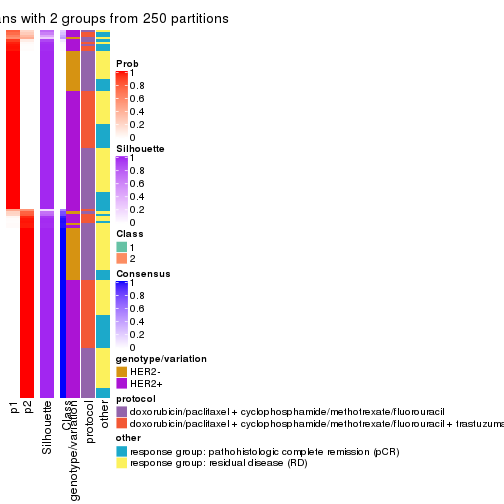</p>

</div>
<div id='tab-CV-skmeans-consensus-heatmap-2'>
<pre><code class="r">consensus_heatmap(res, k = 3)
</code></pre>

<p>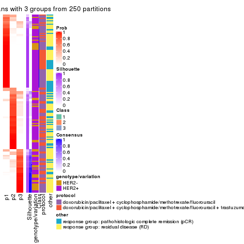</p>

</div>
<div id='tab-CV-skmeans-consensus-heatmap-3'>
<pre><code class="r">consensus_heatmap(res, k = 4)
</code></pre>

<p>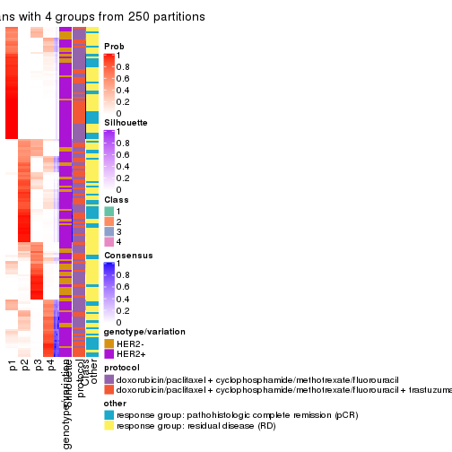</p>

</div>
<div id='tab-CV-skmeans-consensus-heatmap-4'>
<pre><code class="r">consensus_heatmap(res, k = 5)
</code></pre>

<p>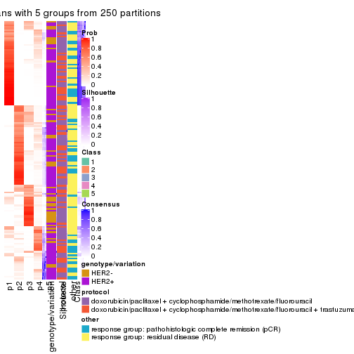</p>

</div>
<div id='tab-CV-skmeans-consensus-heatmap-5'>
<pre><code class="r">consensus_heatmap(res, k = 6)
</code></pre>

<p>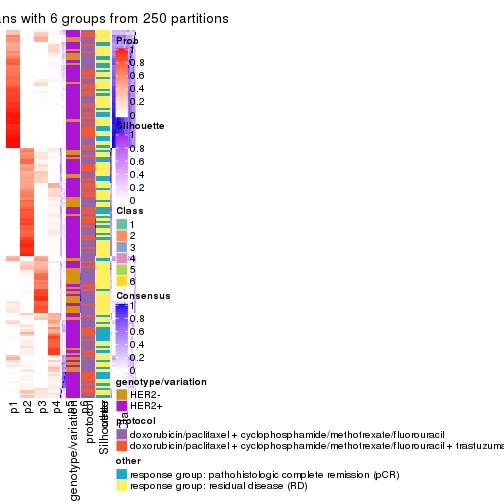</p>

</div>
</div>

Heatmaps for the membership of samples in all partitions to see how consistent they are:


<script>
$( function() {
	$( '#tabs-CV-skmeans-membership-heatmap' ).tabs();
} );
</script>
<div id='tabs-CV-skmeans-membership-heatmap'>
<ul>
<li><a href='#tab-CV-skmeans-membership-heatmap-1'>k = 2</a></li>
<li><a href='#tab-CV-skmeans-membership-heatmap-2'>k = 3</a></li>
<li><a href='#tab-CV-skmeans-membership-heatmap-3'>k = 4</a></li>
<li><a href='#tab-CV-skmeans-membership-heatmap-4'>k = 5</a></li>
<li><a href='#tab-CV-skmeans-membership-heatmap-5'>k = 6</a></li>
</ul>
<div id='tab-CV-skmeans-membership-heatmap-1'>
<pre><code class="r">membership_heatmap(res, k = 2)
</code></pre>

<p>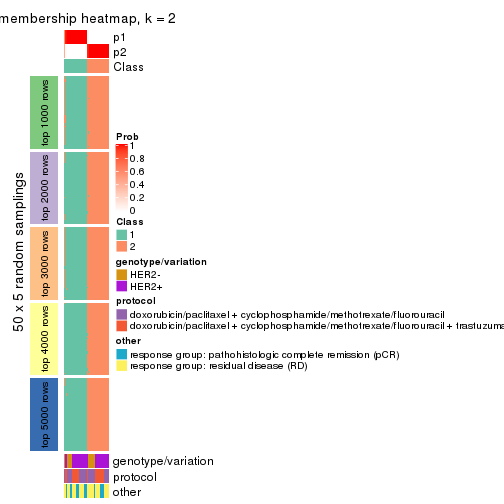</p>

</div>
<div id='tab-CV-skmeans-membership-heatmap-2'>
<pre><code class="r">membership_heatmap(res, k = 3)
</code></pre>

<p>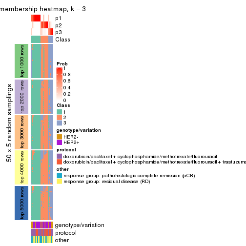</p>

</div>
<div id='tab-CV-skmeans-membership-heatmap-3'>
<pre><code class="r">membership_heatmap(res, k = 4)
</code></pre>

<p>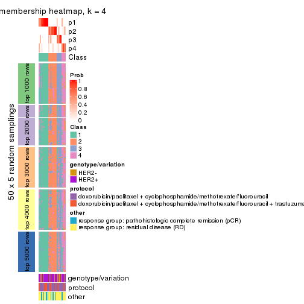</p>

</div>
<div id='tab-CV-skmeans-membership-heatmap-4'>
<pre><code class="r">membership_heatmap(res, k = 5)
</code></pre>

<p>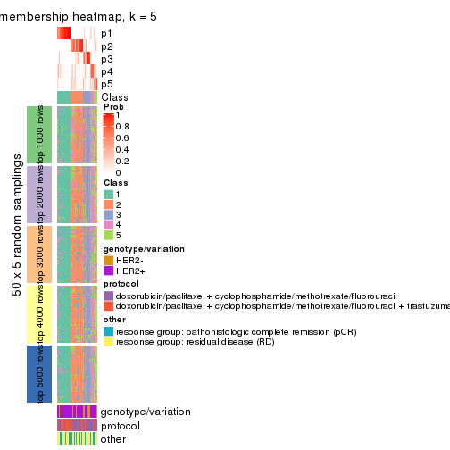</p>

</div>
<div id='tab-CV-skmeans-membership-heatmap-5'>
<pre><code class="r">membership_heatmap(res, k = 6)
</code></pre>

<p>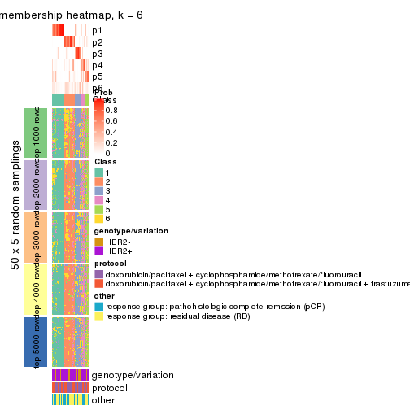</p>

</div>
</div>

As soon as we have had the classes for columns, we can look for signatures
which are significantly different between classes which can be candidate marks
for certain classes. Following are the heatmaps for signatures.


Signature heatmaps where rows are scaled:


<script>
$( function() {
	$( '#tabs-CV-skmeans-get-signatures' ).tabs();
} );
</script>
<div id='tabs-CV-skmeans-get-signatures'>
<ul>
<li><a href='#tab-CV-skmeans-get-signatures-1'>k = 2</a></li>
<li><a href='#tab-CV-skmeans-get-signatures-2'>k = 3</a></li>
<li><a href='#tab-CV-skmeans-get-signatures-3'>k = 4</a></li>
<li><a href='#tab-CV-skmeans-get-signatures-4'>k = 5</a></li>
<li><a href='#tab-CV-skmeans-get-signatures-5'>k = 6</a></li>
</ul>
<div id='tab-CV-skmeans-get-signatures-1'>
<pre><code class="r">get_signatures(res, k = 2)
</code></pre>

<pre><code>#&gt; Error: The width or height of the raster image is zero, maybe you forget to turn off the
#&gt; previous graphic device or it was corrupted. Run `dev.off()` to close it.
</code></pre>

<p></p>

</div>
<div id='tab-CV-skmeans-get-signatures-2'>
<pre><code class="r">get_signatures(res, k = 3)
</code></pre>

<pre><code>#&gt; Error: The width or height of the raster image is zero, maybe you forget to turn off the
#&gt; previous graphic device or it was corrupted. Run `dev.off()` to close it.
</code></pre>

<p></p>

</div>
<div id='tab-CV-skmeans-get-signatures-3'>
<pre><code class="r">get_signatures(res, k = 4)
</code></pre>

<pre><code>#&gt; Error: The width or height of the raster image is zero, maybe you forget to turn off the
#&gt; previous graphic device or it was corrupted. Run `dev.off()` to close it.
</code></pre>

<p></p>

</div>
<div id='tab-CV-skmeans-get-signatures-4'>
<pre><code class="r">get_signatures(res, k = 5)
</code></pre>

<pre><code>#&gt; Error: The width or height of the raster image is zero, maybe you forget to turn off the
#&gt; previous graphic device or it was corrupted. Run `dev.off()` to close it.
</code></pre>

<p></p>

</div>
<div id='tab-CV-skmeans-get-signatures-5'>
<pre><code class="r">get_signatures(res, k = 6)
</code></pre>

<pre><code>#&gt; Error: The width or height of the raster image is zero, maybe you forget to turn off the
#&gt; previous graphic device or it was corrupted. Run `dev.off()` to close it.
</code></pre>

<p></p>

</div>
</div>


Signature heatmaps where rows are not scaled:


<script>
$( function() {
	$( '#tabs-CV-skmeans-get-signatures-no-scale' ).tabs();
} );
</script>
<div id='tabs-CV-skmeans-get-signatures-no-scale'>
<ul>
<li><a href='#tab-CV-skmeans-get-signatures-no-scale-1'>k = 2</a></li>
<li><a href='#tab-CV-skmeans-get-signatures-no-scale-2'>k = 3</a></li>
<li><a href='#tab-CV-skmeans-get-signatures-no-scale-3'>k = 4</a></li>
<li><a href='#tab-CV-skmeans-get-signatures-no-scale-4'>k = 5</a></li>
<li><a href='#tab-CV-skmeans-get-signatures-no-scale-5'>k = 6</a></li>
</ul>
<div id='tab-CV-skmeans-get-signatures-no-scale-1'>
<pre><code class="r">get_signatures(res, k = 2, scale_rows = FALSE)
</code></pre>

<pre><code>#&gt; Error: The width or height of the raster image is zero, maybe you forget to turn off the
#&gt; previous graphic device or it was corrupted. Run `dev.off()` to close it.
</code></pre>

<p></p>

</div>
<div id='tab-CV-skmeans-get-signatures-no-scale-2'>
<pre><code class="r">get_signatures(res, k = 3, scale_rows = FALSE)
</code></pre>

<pre><code>#&gt; Error: The width or height of the raster image is zero, maybe you forget to turn off the
#&gt; previous graphic device or it was corrupted. Run `dev.off()` to close it.
</code></pre>

<p></p>

</div>
<div id='tab-CV-skmeans-get-signatures-no-scale-3'>
<pre><code class="r">get_signatures(res, k = 4, scale_rows = FALSE)
</code></pre>

<pre><code>#&gt; Error: The width or height of the raster image is zero, maybe you forget to turn off the
#&gt; previous graphic device or it was corrupted. Run `dev.off()` to close it.
</code></pre>

<p></p>

</div>
<div id='tab-CV-skmeans-get-signatures-no-scale-4'>
<pre><code class="r">get_signatures(res, k = 5, scale_rows = FALSE)
</code></pre>

<pre><code>#&gt; Error: The width or height of the raster image is zero, maybe you forget to turn off the
#&gt; previous graphic device or it was corrupted. Run `dev.off()` to close it.
</code></pre>

<p></p>

</div>
<div id='tab-CV-skmeans-get-signatures-no-scale-5'>
<pre><code class="r">get_signatures(res, k = 6, scale_rows = FALSE)
</code></pre>

<pre><code>#&gt; Error: The width or height of the raster image is zero, maybe you forget to turn off the
#&gt; previous graphic device or it was corrupted. Run `dev.off()` to close it.
</code></pre>

<p></p>

</div>
</div>


Compare the overlap of signatures from different k:

```r
compare_signatures(res)
```

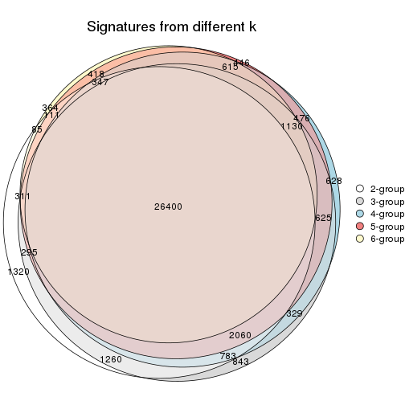

`get_signature()` returns a data frame invisibly. TO get the list of signatures, the function
call should be assigned to a variable explicitly. In following code, if `plot` argument is set
to `FALSE`, no heatmap is plotted while only the differential analysis is performed.

```r
# code only for demonstration
tb = get_signature(res, k = ..., plot = FALSE)
```

An example of the output of `tb` is:

```
#>   which_row         fdr    mean_1    mean_2 scaled_mean_1 scaled_mean_2 km
#> 1        38 0.042760348  8.373488  9.131774    -0.5533452     0.5164555  1
#> 2        40 0.018707592  7.106213  8.469186    -0.6173731     0.5762149  1
#> 3        55 0.019134737 10.221463 11.207825    -0.6159697     0.5749050  1
#> 4        59 0.006059896  5.921854  7.869574    -0.6899429     0.6439467  1
#> 5        60 0.018055526  8.928898 10.211722    -0.6204761     0.5791110  1
#> 6        98 0.009384629 15.714769 14.887706     0.6635654    -0.6193277  2
...
```

The columns in `tb` are:

1. `which_row`: row indices corresponding to the input matrix.
2. `fdr`: FDR for the differential test. 
3. `mean_x`: The mean value in group x.
4. `scaled_mean_x`: The mean value in group x after rows are scaled.
5. `km`: Row groups if k-means clustering is applied to rows.


UMAP plot which shows how samples are separated.


<script>
$( function() {
	$( '#tabs-CV-skmeans-dimension-reduction' ).tabs();
} );
</script>
<div id='tabs-CV-skmeans-dimension-reduction'>
<ul>
<li><a href='#tab-CV-skmeans-dimension-reduction-1'>k = 2</a></li>
<li><a href='#tab-CV-skmeans-dimension-reduction-2'>k = 3</a></li>
<li><a href='#tab-CV-skmeans-dimension-reduction-3'>k = 4</a></li>
<li><a href='#tab-CV-skmeans-dimension-reduction-4'>k = 5</a></li>
<li><a href='#tab-CV-skmeans-dimension-reduction-5'>k = 6</a></li>
</ul>
<div id='tab-CV-skmeans-dimension-reduction-1'>
<pre><code class="r">dimension_reduction(res, k = 2, method = &quot;UMAP&quot;)
</code></pre>

<p>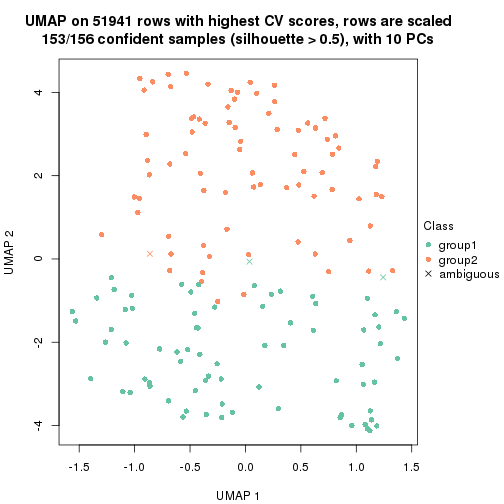</p>

</div>
<div id='tab-CV-skmeans-dimension-reduction-2'>
<pre><code class="r">dimension_reduction(res, k = 3, method = &quot;UMAP&quot;)
</code></pre>

<p>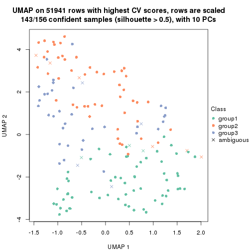</p>

</div>
<div id='tab-CV-skmeans-dimension-reduction-3'>
<pre><code class="r">dimension_reduction(res, k = 4, method = &quot;UMAP&quot;)
</code></pre>

<p>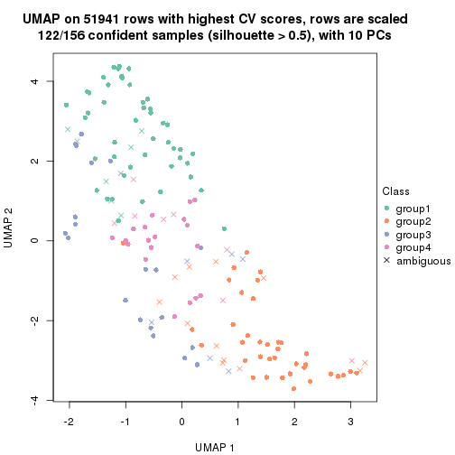</p>

</div>
<div id='tab-CV-skmeans-dimension-reduction-4'>
<pre><code class="r">dimension_reduction(res, k = 5, method = &quot;UMAP&quot;)
</code></pre>

<p>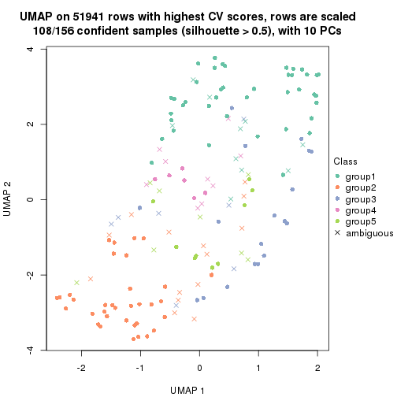</p>

</div>
<div id='tab-CV-skmeans-dimension-reduction-5'>
<pre><code class="r">dimension_reduction(res, k = 6, method = &quot;UMAP&quot;)
</code></pre>

<p>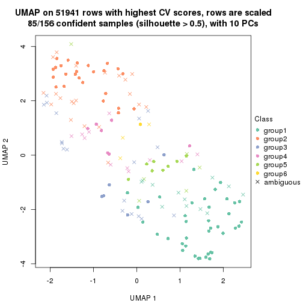</p>

</div>
</div>


Following heatmap shows how subgroups are split when increasing `k`:

```r
collect_classes(res)
```

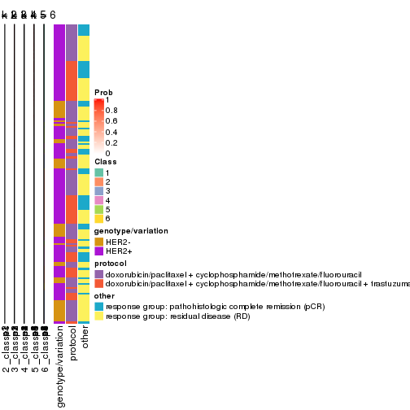


Test correlation between subgroups and known annotations. If the known
annotation is numeric, one-way ANOVA test is applied, and if the known
annotation is discrete, chi-squared contingency table test is applied.

```r
test_to_known_factors(res)
```

```
#>              n genotype/variation(p) protocol(p) other(p) k
#> CV:skmeans 153              3.95e-01       0.740   0.5292 2
#> CV:skmeans 143              2.87e-03       0.739   0.0962 3
#> CV:skmeans 122              3.08e-06       0.246   0.0193 4
#> CV:skmeans 108              1.13e-05       0.267   0.0430 5
#> CV:skmeans  85              2.02e-02       0.270   0.7967 6
```


If matrix rows can be associated to genes, consider to use `functional_enrichment(res,
...)` to perform function enrichment for the signature genes. See [this vignette](http://bioconductor.org/packages/devel/bioc/vignettes/cola/inst/doc/functional_enrichment.html) for more detailed explanations.


 

---------------------------------------------------


### CV:pam*


The object with results only for a single top-value method and a single partition method 
can be extracted as:

```r
res = res_list["CV", "pam"]
# you can also extract it by
# res = res_list["CV:pam"]
```

A summary of `res` and all the functions that can be applied to it:

```r
res
```

```
#> A 'ConsensusPartition' object with k = 2, 3, 4, 5, 6.
#>   On a matrix with 51941 rows and 156 columns.
#>   Top rows (1000, 2000, 3000, 4000, 5000) are extracted by 'CV' method.
#>   Subgroups are detected by 'pam' method.
#>   Performed in total 1250 partitions by row resampling.
#>   Best k for subgroups seems to be 2.
#> 
#> Following methods can be applied to this 'ConsensusPartition' object:
#>  [1] "cola_report"             "collect_classes"         "collect_plots"          
#>  [4] "collect_stats"           "colnames"                "compare_signatures"     
#>  [7] "consensus_heatmap"       "dimension_reduction"     "functional_enrichment"  
#> [10] "get_anno_col"            "get_anno"                "get_classes"            
#> [13] "get_consensus"           "get_matrix"              "get_membership"         
#> [16] "get_param"               "get_signatures"          "get_stats"              
#> [19] "is_best_k"               "is_stable_k"             "membership_heatmap"     
#> [22] "ncol"                    "nrow"                    "plot_ecdf"              
#> [25] "rownames"                "select_partition_number" "show"                   
#> [28] "suggest_best_k"          "test_to_known_factors"
```

`collect_plots()` function collects all the plots made from `res` for all `k` (number of partitions)
into one single page to provide an easy and fast comparison between different `k`.

```r
collect_plots(res)
```

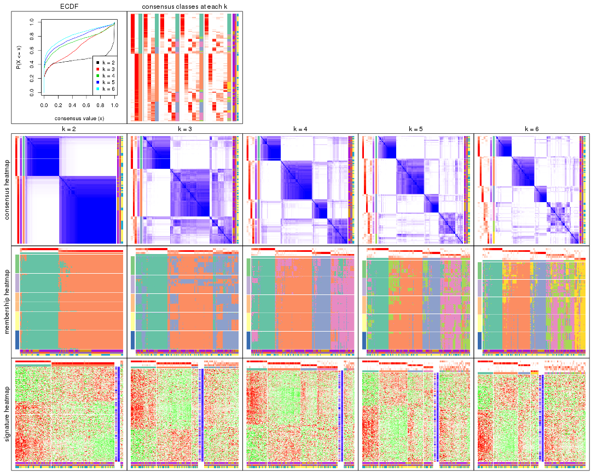

The plots are:

- The first row: a plot of the ECDF (empirical cumulative distribution
  function) curves of the consensus matrix for each `k` and the heatmap of
  predicted classes for each `k`.
- The second row: heatmaps of the consensus matrix for each `k`.
- The third row: heatmaps of the membership matrix for each `k`.
- The fouth row: heatmaps of the signatures for each `k`.

All the plots in panels can be made by individual functions and they are
plotted later in this section.

`select_partition_number()` produces several plots showing different
statistics for choosing "optimized" `k`. There are following statistics:

- ECDF curves of the consensus matrix for each `k`;
- 1-PAC. [The PAC
  score](https://en.wikipedia.org/wiki/Consensus_clustering#Over-interpretation_potential_of_consensus_clustering)
  measures the proportion of the ambiguous subgrouping.
- Mean silhouette score.
- Concordance. The mean probability of fiting the consensus class ids in all
  partitions.
- Area increased. Denote $A_k$ as the area under the ECDF curve for current
  `k`, the area increased is defined as $A_k - A_{k-1}$.
- Rand index. The percent of pairs of samples that are both in a same cluster
  or both are not in a same cluster in the partition of k and k-1.
- Jaccard index. The ratio of pairs of samples are both in a same cluster in
  the partition of k and k-1 and the pairs of samples are both in a same
  cluster in the partition k or k-1.

The detailed explanations of these statistics can be found in [the _cola_
vignette](http://bioconductor.org/packages/devel/bioc/vignettes/cola/inst/doc/cola.html#toc_13).

Generally speaking, lower PAC score, higher mean silhouette score or higher
concordance corresponds to better partition. Rand index and Jaccard index
measure how similar the current partition is compared to partition with `k-1`.
If they are too similar, we won't accept `k` is better than `k-1`.

```r
select_partition_number(res)
```

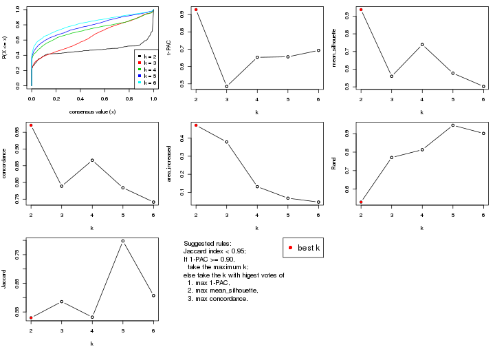

The numeric values for all these statistics can be obtained by `get_stats()`.

```r
get_stats(res)
```

```
#>   k 1-PAC mean_silhouette concordance area_increased  Rand Jaccard
#> 2 2 0.929           0.937       0.971         0.4711 0.530   0.530
#> 3 3 0.485           0.560       0.789         0.3789 0.771   0.586
#> 4 4 0.653           0.739       0.866         0.1316 0.813   0.532
#> 5 5 0.656           0.577       0.784         0.0677 0.945   0.798
#> 6 6 0.693           0.502       0.741         0.0461 0.901   0.607
```

`suggest_best_k()` suggests the best $k$ based on these statistics. The rules are as follows:

- All $k$ with Jaccard index larger than 0.95 are removed because increasing
  $k$ does not provide enough extra information. If all $k$ are removed, it is
  marked as no subgroup is detected.
- For all $k$ with 1-PAC score larger than 0.9, the maximal $k$ is taken as
  the best $k$, and other $k$ are marked as optional $k$.
- If it does not fit the second rule. The $k$ with the maximal vote of the
  highest 1-PAC score, highest mean silhouette, and highest concordance is
  taken as the best $k$.

```r
suggest_best_k(res)
```

```
#> [1] 2
```


Following shows the table of the partitions (You need to click the **show/hide
code output** link to see it). The membership matrix (columns with name `p*`)
is inferred by
[`clue::cl_consensus()`](https://www.rdocumentation.org/link/cl_consensus?package=clue)
function with the `SE` method. Basically the value in the membership matrix
represents the probability to belong to a certain group. The finall class
label for an item is determined with the group with highest probability it
belongs to.

In `get_classes()` function, the entropy is calculated from the membership
matrix and the silhouette score is calculated from the consensus matrix.


<script>
$( function() {
	$( '#tabs-CV-pam-get-classes' ).tabs();
} );
</script>
<div id='tabs-CV-pam-get-classes'>
<ul>
<li><a href='#tab-CV-pam-get-classes-1'>k = 2</a></li>
<li><a href='#tab-CV-pam-get-classes-2'>k = 3</a></li>
<li><a href='#tab-CV-pam-get-classes-3'>k = 4</a></li>
<li><a href='#tab-CV-pam-get-classes-4'>k = 5</a></li>
<li><a href='#tab-CV-pam-get-classes-5'>k = 6</a></li>
</ul>

<div id='tab-CV-pam-get-classes-1'>
<p><a id='tab-CV-pam-get-classes-1-a' style='color:#0366d6' href='#'>show/hide code output</a></p>
<pre><code class="r">cbind(get_classes(res, k = 2), get_membership(res, k = 2))
</code></pre>

<pre><code>#&gt;            class entropy silhouette    p1    p2
#&gt; GSM1232995     2  0.0000      0.972 0.000 1.000
#&gt; GSM1233002     2  0.0672      0.968 0.008 0.992
#&gt; GSM1233003     1  0.0000      0.966 1.000 0.000
#&gt; GSM1233014     2  0.1843      0.957 0.028 0.972
#&gt; GSM1233015     1  0.9286      0.483 0.656 0.344
#&gt; GSM1233016     2  0.3733      0.922 0.072 0.928
#&gt; GSM1233024     2  0.0000      0.972 0.000 1.000
#&gt; GSM1233049     1  0.0000      0.966 1.000 0.000
#&gt; GSM1233064     2  0.0000      0.972 0.000 1.000
#&gt; GSM1233068     1  0.5519      0.849 0.872 0.128
#&gt; GSM1233073     2  0.2603      0.946 0.044 0.956
#&gt; GSM1233093     1  0.0000      0.966 1.000 0.000
#&gt; GSM1233115     1  0.0000      0.966 1.000 0.000
#&gt; GSM1232992     2  0.0000      0.972 0.000 1.000
#&gt; GSM1232993     2  0.0000      0.972 0.000 1.000
#&gt; GSM1233005     2  0.0000      0.972 0.000 1.000
#&gt; GSM1233007     2  0.0000      0.972 0.000 1.000
#&gt; GSM1233010     2  0.9608      0.405 0.384 0.616
#&gt; GSM1233013     2  0.0000      0.972 0.000 1.000
#&gt; GSM1233018     2  0.0000      0.972 0.000 1.000
#&gt; GSM1233019     2  0.0000      0.972 0.000 1.000
#&gt; GSM1233021     2  0.0000      0.972 0.000 1.000
#&gt; GSM1233025     1  0.9970      0.102 0.532 0.468
#&gt; GSM1233029     2  0.0000      0.972 0.000 1.000
#&gt; GSM1233030     2  0.0000      0.972 0.000 1.000
#&gt; GSM1233031     2  0.4562      0.900 0.096 0.904
#&gt; GSM1233032     1  0.0000      0.966 1.000 0.000
#&gt; GSM1233035     2  0.4815      0.891 0.104 0.896
#&gt; GSM1233038     1  0.0000      0.966 1.000 0.000
#&gt; GSM1233039     2  0.0000      0.972 0.000 1.000
#&gt; GSM1233042     2  0.1633      0.959 0.024 0.976
#&gt; GSM1233043     2  0.0000      0.972 0.000 1.000
#&gt; GSM1233044     1  0.3733      0.910 0.928 0.072
#&gt; GSM1233046     1  0.0938      0.959 0.988 0.012
#&gt; GSM1233051     1  0.0000      0.966 1.000 0.000
#&gt; GSM1233054     1  0.2603      0.937 0.956 0.044
#&gt; GSM1233057     2  0.0376      0.970 0.004 0.996
#&gt; GSM1233060     2  0.0000      0.972 0.000 1.000
#&gt; GSM1233062     2  0.0000      0.972 0.000 1.000
#&gt; GSM1233075     2  0.0000      0.972 0.000 1.000
#&gt; GSM1233078     2  0.7602      0.736 0.220 0.780
#&gt; GSM1233079     1  0.0000      0.966 1.000 0.000
#&gt; GSM1233082     1  0.0000      0.966 1.000 0.000
#&gt; GSM1233083     1  0.0000      0.966 1.000 0.000
#&gt; GSM1233091     2  0.4939      0.885 0.108 0.892
#&gt; GSM1233095     1  0.0000      0.966 1.000 0.000
#&gt; GSM1233096     1  0.0000      0.966 1.000 0.000
#&gt; GSM1233101     1  0.0000      0.966 1.000 0.000
#&gt; GSM1233105     1  0.2043      0.944 0.968 0.032
#&gt; GSM1233117     2  0.0000      0.972 0.000 1.000
#&gt; GSM1233118     2  0.0000      0.972 0.000 1.000
#&gt; GSM1233001     2  0.0000      0.972 0.000 1.000
#&gt; GSM1233006     2  0.0000      0.972 0.000 1.000
#&gt; GSM1233008     2  0.0000      0.972 0.000 1.000
#&gt; GSM1233009     2  0.0000      0.972 0.000 1.000
#&gt; GSM1233017     2  0.0000      0.972 0.000 1.000
#&gt; GSM1233020     2  0.0000      0.972 0.000 1.000
#&gt; GSM1233022     2  0.0000      0.972 0.000 1.000
#&gt; GSM1233026     2  0.2603      0.944 0.044 0.956
#&gt; GSM1233028     2  0.0938      0.967 0.012 0.988
#&gt; GSM1233034     2  0.0000      0.972 0.000 1.000
#&gt; GSM1233040     1  0.0000      0.966 1.000 0.000
#&gt; GSM1233048     1  0.0000      0.966 1.000 0.000
#&gt; GSM1233056     1  0.0000      0.966 1.000 0.000
#&gt; GSM1233058     2  0.2423      0.949 0.040 0.960
#&gt; GSM1233059     1  0.0000      0.966 1.000 0.000
#&gt; GSM1233066     2  0.4161      0.909 0.084 0.916
#&gt; GSM1233071     2  0.0000      0.972 0.000 1.000
#&gt; GSM1233074     2  0.0000      0.972 0.000 1.000
#&gt; GSM1233076     2  0.0000      0.972 0.000 1.000
#&gt; GSM1233080     1  0.0000      0.966 1.000 0.000
#&gt; GSM1233088     2  0.0000      0.972 0.000 1.000
#&gt; GSM1233090     1  0.0000      0.966 1.000 0.000
#&gt; GSM1233092     2  0.1184      0.964 0.016 0.984
#&gt; GSM1233094     2  0.2423      0.949 0.040 0.960
#&gt; GSM1233097     2  0.8661      0.621 0.288 0.712
#&gt; GSM1233100     2  0.8327      0.660 0.264 0.736
#&gt; GSM1233104     2  0.1633      0.959 0.024 0.976
#&gt; GSM1233106     1  0.4298      0.894 0.912 0.088
#&gt; GSM1233111     1  0.0376      0.964 0.996 0.004
#&gt; GSM1233122     2  0.0000      0.972 0.000 1.000
#&gt; GSM1233146     2  0.0672      0.968 0.008 0.992
#&gt; GSM1232994     2  0.0000      0.972 0.000 1.000
#&gt; GSM1232996     2  0.0000      0.972 0.000 1.000
#&gt; GSM1232997     2  0.0000      0.972 0.000 1.000
#&gt; GSM1232998     2  0.0000      0.972 0.000 1.000
#&gt; GSM1232999     2  0.0000      0.972 0.000 1.000
#&gt; GSM1233000     2  0.0000      0.972 0.000 1.000
#&gt; GSM1233004     1  0.2603      0.936 0.956 0.044
#&gt; GSM1233011     2  0.0000      0.972 0.000 1.000
#&gt; GSM1233012     2  0.0000      0.972 0.000 1.000
#&gt; GSM1233023     2  0.0000      0.972 0.000 1.000
#&gt; GSM1233027     2  0.0000      0.972 0.000 1.000
#&gt; GSM1233033     1  0.0000      0.966 1.000 0.000
#&gt; GSM1233036     2  0.1843      0.956 0.028 0.972
#&gt; GSM1233037     2  0.0000      0.972 0.000 1.000
#&gt; GSM1233041     1  0.0000      0.966 1.000 0.000
#&gt; GSM1233045     2  0.1843      0.956 0.028 0.972
#&gt; GSM1233047     1  0.0672      0.962 0.992 0.008
#&gt; GSM1233050     1  0.0000      0.966 1.000 0.000
#&gt; GSM1233052     1  0.0000      0.966 1.000 0.000
#&gt; GSM1233053     1  0.0000      0.966 1.000 0.000
#&gt; GSM1233055     1  0.0000      0.966 1.000 0.000
#&gt; GSM1233061     1  0.9833      0.273 0.576 0.424
#&gt; GSM1233063     1  0.0000      0.966 1.000 0.000
#&gt; GSM1233065     2  0.0000      0.972 0.000 1.000
#&gt; GSM1233070     2  0.0000      0.972 0.000 1.000
#&gt; GSM1233077     2  0.0000      0.972 0.000 1.000
#&gt; GSM1233081     1  0.0000      0.966 1.000 0.000
#&gt; GSM1233084     1  0.0000      0.966 1.000 0.000
#&gt; GSM1233087     1  0.0376      0.964 0.996 0.004
#&gt; GSM1233089     2  0.0000      0.972 0.000 1.000
#&gt; GSM1233099     1  0.0376      0.964 0.996 0.004
#&gt; GSM1233112     1  0.0000      0.966 1.000 0.000
#&gt; GSM1233085     1  0.0000      0.966 1.000 0.000
#&gt; GSM1233098     2  0.0000      0.972 0.000 1.000
#&gt; GSM1233114     1  0.0000      0.966 1.000 0.000
#&gt; GSM1233119     2  0.8144      0.682 0.252 0.748
#&gt; GSM1233129     2  0.0000      0.972 0.000 1.000
#&gt; GSM1233132     1  0.0000      0.966 1.000 0.000
#&gt; GSM1233139     2  0.0000      0.972 0.000 1.000
#&gt; GSM1233143     2  0.0000      0.972 0.000 1.000
#&gt; GSM1233145     1  0.0000      0.966 1.000 0.000
#&gt; GSM1233067     2  0.0000      0.972 0.000 1.000
#&gt; GSM1233069     2  0.0000      0.972 0.000 1.000
#&gt; GSM1233072     2  0.0000      0.972 0.000 1.000
#&gt; GSM1233086     2  0.0000      0.972 0.000 1.000
#&gt; GSM1233102     1  0.0000      0.966 1.000 0.000
#&gt; GSM1233103     2  0.2948      0.938 0.052 0.948
#&gt; GSM1233107     2  0.5059      0.883 0.112 0.888
#&gt; GSM1233108     1  0.0000      0.966 1.000 0.000
#&gt; GSM1233109     1  0.0000      0.966 1.000 0.000
#&gt; GSM1233110     2  0.2778      0.941 0.048 0.952
#&gt; GSM1233113     2  0.0000      0.972 0.000 1.000
#&gt; GSM1233116     2  0.0000      0.972 0.000 1.000
#&gt; GSM1233120     1  0.0000      0.966 1.000 0.000
#&gt; GSM1233121     2  0.0376      0.970 0.004 0.996
#&gt; GSM1233123     2  0.4815      0.888 0.104 0.896
#&gt; GSM1233124     2  0.2778      0.941 0.048 0.952
#&gt; GSM1233125     1  0.0000      0.966 1.000 0.000
#&gt; GSM1233126     2  0.1843      0.957 0.028 0.972
#&gt; GSM1233127     2  0.0000      0.972 0.000 1.000
#&gt; GSM1233128     1  0.0000      0.966 1.000 0.000
#&gt; GSM1233130     2  0.0000      0.972 0.000 1.000
#&gt; GSM1233131     1  0.2948      0.929 0.948 0.052
#&gt; GSM1233133     1  0.0672      0.962 0.992 0.008
#&gt; GSM1233134     2  0.0000      0.972 0.000 1.000
#&gt; GSM1233135     2  0.0000      0.972 0.000 1.000
#&gt; GSM1233136     2  0.0000      0.972 0.000 1.000
#&gt; GSM1233137     1  0.0376      0.964 0.996 0.004
#&gt; GSM1233138     2  0.1633      0.959 0.024 0.976
#&gt; GSM1233140     1  0.4161      0.898 0.916 0.084
#&gt; GSM1233141     2  0.0000      0.972 0.000 1.000
#&gt; GSM1233142     2  0.0000      0.972 0.000 1.000
#&gt; GSM1233144     1  0.2948      0.929 0.948 0.052
#&gt; GSM1233147     2  0.0000      0.972 0.000 1.000
</code></pre>

<script>
$('#tab-CV-pam-get-classes-1-a').parent().next().next().hide();
$('#tab-CV-pam-get-classes-1-a').click(function(){
  $('#tab-CV-pam-get-classes-1-a').parent().next().next().toggle();
  return(false);
});
</script>
</div>

<div id='tab-CV-pam-get-classes-2'>
<p><a id='tab-CV-pam-get-classes-2-a' style='color:#0366d6' href='#'>show/hide code output</a></p>
<pre><code class="r">cbind(get_classes(res, k = 3), get_membership(res, k = 3))
</code></pre>

<pre><code>#&gt;            class entropy silhouette    p1    p2    p3
#&gt; GSM1232995     2  0.2796     0.7654 0.000 0.908 0.092
#&gt; GSM1233002     2  0.6451     0.2944 0.008 0.608 0.384
#&gt; GSM1233003     1  0.5905     0.5409 0.648 0.000 0.352
#&gt; GSM1233014     3  0.6952    -0.1882 0.016 0.480 0.504
#&gt; GSM1233015     1  0.7032     0.2434 0.604 0.368 0.028
#&gt; GSM1233016     3  0.2998     0.5746 0.016 0.068 0.916
#&gt; GSM1233024     2  0.2165     0.7645 0.000 0.936 0.064
#&gt; GSM1233049     1  0.0000     0.8354 1.000 0.000 0.000
#&gt; GSM1233064     2  0.0892     0.7639 0.000 0.980 0.020
#&gt; GSM1233068     3  0.3193     0.5275 0.100 0.004 0.896
#&gt; GSM1233073     3  0.6935     0.1207 0.024 0.372 0.604
#&gt; GSM1233093     1  0.0000     0.8354 1.000 0.000 0.000
#&gt; GSM1233115     1  0.0237     0.8345 0.996 0.000 0.004
#&gt; GSM1232992     2  0.0000     0.7652 0.000 1.000 0.000
#&gt; GSM1232993     2  0.0424     0.7674 0.000 0.992 0.008
#&gt; GSM1233005     2  0.0592     0.7660 0.000 0.988 0.012
#&gt; GSM1233007     2  0.3038     0.7198 0.000 0.896 0.104
#&gt; GSM1233010     3  0.7412     0.4658 0.192 0.112 0.696
#&gt; GSM1233013     2  0.0000     0.7652 0.000 1.000 0.000
#&gt; GSM1233018     2  0.0000     0.7652 0.000 1.000 0.000
#&gt; GSM1233019     2  0.0000     0.7652 0.000 1.000 0.000
#&gt; GSM1233021     2  0.2711     0.7581 0.000 0.912 0.088
#&gt; GSM1233025     3  0.5764     0.5021 0.124 0.076 0.800
#&gt; GSM1233029     2  0.2959     0.7538 0.000 0.900 0.100
#&gt; GSM1233030     2  0.0000     0.7652 0.000 1.000 0.000
#&gt; GSM1233031     3  0.6819    -0.1910 0.012 0.476 0.512
#&gt; GSM1233032     1  0.0000     0.8354 1.000 0.000 0.000
#&gt; GSM1233035     2  0.7186     0.1940 0.024 0.500 0.476
#&gt; GSM1233038     1  0.0237     0.8348 0.996 0.000 0.004
#&gt; GSM1233039     2  0.5859     0.3015 0.000 0.656 0.344
#&gt; GSM1233042     2  0.6753     0.3133 0.016 0.596 0.388
#&gt; GSM1233043     2  0.5988     0.3645 0.000 0.632 0.368
#&gt; GSM1233044     3  0.5365     0.3702 0.252 0.004 0.744
#&gt; GSM1233046     1  0.5560     0.5792 0.700 0.000 0.300
#&gt; GSM1233051     1  0.5291     0.6590 0.732 0.000 0.268
#&gt; GSM1233054     3  0.6280    -0.1886 0.460 0.000 0.540
#&gt; GSM1233057     2  0.4235     0.7230 0.000 0.824 0.176
#&gt; GSM1233060     2  0.5905     0.4094 0.000 0.648 0.352
#&gt; GSM1233062     2  0.4178     0.7237 0.000 0.828 0.172
#&gt; GSM1233075     2  0.0237     0.7665 0.000 0.996 0.004
#&gt; GSM1233078     3  0.2903     0.5725 0.028 0.048 0.924
#&gt; GSM1233079     1  0.1411     0.8221 0.964 0.000 0.036
#&gt; GSM1233082     1  0.2878     0.7946 0.904 0.000 0.096
#&gt; GSM1233083     1  0.0424     0.8345 0.992 0.000 0.008
#&gt; GSM1233091     3  0.7186     0.2483 0.040 0.336 0.624
#&gt; GSM1233095     1  0.0000     0.8354 1.000 0.000 0.000
#&gt; GSM1233096     1  0.0000     0.8354 1.000 0.000 0.000
#&gt; GSM1233101     1  0.0000     0.8354 1.000 0.000 0.000
#&gt; GSM1233105     1  0.6541     0.5462 0.672 0.024 0.304
#&gt; GSM1233117     2  0.0237     0.7666 0.000 0.996 0.004
#&gt; GSM1233118     2  0.0592     0.7676 0.000 0.988 0.012
#&gt; GSM1233001     2  0.0237     0.7638 0.000 0.996 0.004
#&gt; GSM1233006     2  0.5254     0.5048 0.000 0.736 0.264
#&gt; GSM1233008     2  0.4291     0.7200 0.000 0.820 0.180
#&gt; GSM1233009     2  0.2711     0.7589 0.000 0.912 0.088
#&gt; GSM1233017     2  0.2448     0.7608 0.000 0.924 0.076
#&gt; GSM1233020     2  0.0000     0.7652 0.000 1.000 0.000
#&gt; GSM1233022     2  0.3551     0.7495 0.000 0.868 0.132
#&gt; GSM1233026     2  0.6260     0.2390 0.000 0.552 0.448
#&gt; GSM1233028     2  0.6235     0.3818 0.000 0.564 0.436
#&gt; GSM1233034     2  0.1163     0.7690 0.000 0.972 0.028
#&gt; GSM1233040     1  0.0747     0.8278 0.984 0.000 0.016
#&gt; GSM1233048     1  0.0000     0.8354 1.000 0.000 0.000
#&gt; GSM1233056     1  0.0000     0.8354 1.000 0.000 0.000
#&gt; GSM1233058     3  0.4634     0.5219 0.012 0.164 0.824
#&gt; GSM1233059     1  0.0000     0.8354 1.000 0.000 0.000
#&gt; GSM1233066     3  0.0592     0.5720 0.000 0.012 0.988
#&gt; GSM1233071     2  0.5760     0.5008 0.000 0.672 0.328
#&gt; GSM1233074     2  0.3267     0.7542 0.000 0.884 0.116
#&gt; GSM1233076     3  0.5254     0.5135 0.000 0.264 0.736
#&gt; GSM1233080     1  0.0000     0.8354 1.000 0.000 0.000
#&gt; GSM1233088     2  0.5431     0.3570 0.000 0.716 0.284
#&gt; GSM1233090     1  0.0000     0.8354 1.000 0.000 0.000
#&gt; GSM1233092     2  0.6498     0.2976 0.008 0.596 0.396
#&gt; GSM1233094     3  0.6783     0.0577 0.016 0.396 0.588
#&gt; GSM1233097     3  0.7885     0.1768 0.072 0.336 0.592
#&gt; GSM1233100     3  0.8447     0.0553 0.092 0.392 0.516
#&gt; GSM1233104     3  0.6936    -0.1606 0.016 0.460 0.524
#&gt; GSM1233106     1  0.6521     0.1745 0.504 0.004 0.492
#&gt; GSM1233111     1  0.0424     0.8324 0.992 0.000 0.008
#&gt; GSM1233122     2  0.0000     0.7652 0.000 1.000 0.000
#&gt; GSM1233146     3  0.6672    -0.1888 0.008 0.472 0.520
#&gt; GSM1232994     2  0.1031     0.7651 0.000 0.976 0.024
#&gt; GSM1232996     2  0.3116     0.7559 0.000 0.892 0.108
#&gt; GSM1232997     2  0.3686     0.7450 0.000 0.860 0.140
#&gt; GSM1232998     2  0.5138     0.6773 0.000 0.748 0.252
#&gt; GSM1232999     2  0.3686     0.7457 0.000 0.860 0.140
#&gt; GSM1233000     2  0.0000     0.7652 0.000 1.000 0.000
#&gt; GSM1233004     3  0.4062     0.4587 0.164 0.000 0.836
#&gt; GSM1233011     3  0.6215     0.1621 0.000 0.428 0.572
#&gt; GSM1233012     2  0.3551     0.7467 0.000 0.868 0.132
#&gt; GSM1233023     2  0.2711     0.7558 0.000 0.912 0.088
#&gt; GSM1233027     2  0.0000     0.7652 0.000 1.000 0.000
#&gt; GSM1233033     1  0.2356     0.8030 0.928 0.000 0.072
#&gt; GSM1233036     2  0.5158     0.6798 0.004 0.764 0.232
#&gt; GSM1233037     2  0.5178     0.6534 0.000 0.744 0.256
#&gt; GSM1233041     1  0.0000     0.8354 1.000 0.000 0.000
#&gt; GSM1233045     2  0.6305     0.2470 0.000 0.516 0.484
#&gt; GSM1233047     1  0.6192     0.3456 0.580 0.000 0.420
#&gt; GSM1233050     1  0.0000     0.8354 1.000 0.000 0.000
#&gt; GSM1233052     1  0.0592     0.8314 0.988 0.000 0.012
#&gt; GSM1233053     1  0.0424     0.8323 0.992 0.000 0.008
#&gt; GSM1233055     1  0.0000     0.8354 1.000 0.000 0.000
#&gt; GSM1233061     3  0.2711     0.5310 0.088 0.000 0.912
#&gt; GSM1233063     1  0.0592     0.8322 0.988 0.000 0.012
#&gt; GSM1233065     2  0.4555     0.7082 0.000 0.800 0.200
#&gt; GSM1233070     2  0.4002     0.7034 0.000 0.840 0.160
#&gt; GSM1233077     3  0.6309     0.2403 0.000 0.496 0.504
#&gt; GSM1233081     1  0.3412     0.7639 0.876 0.000 0.124
#&gt; GSM1233084     1  0.0000     0.8354 1.000 0.000 0.000
#&gt; GSM1233087     1  0.5988     0.4857 0.632 0.000 0.368
#&gt; GSM1233089     2  0.1163     0.7616 0.000 0.972 0.028
#&gt; GSM1233099     1  0.5591     0.5763 0.696 0.000 0.304
#&gt; GSM1233112     1  0.6095     0.4902 0.608 0.000 0.392
#&gt; GSM1233085     1  0.5254     0.6105 0.736 0.000 0.264
#&gt; GSM1233098     2  0.0000     0.7652 0.000 1.000 0.000
#&gt; GSM1233114     1  0.0237     0.8348 0.996 0.000 0.004
#&gt; GSM1233119     3  0.3237     0.5709 0.032 0.056 0.912
#&gt; GSM1233129     2  0.4062     0.7262 0.000 0.836 0.164
#&gt; GSM1233132     1  0.0237     0.8348 0.996 0.000 0.004
#&gt; GSM1233139     2  0.3412     0.7511 0.000 0.876 0.124
#&gt; GSM1233143     2  0.4842     0.6476 0.000 0.776 0.224
#&gt; GSM1233145     1  0.2261     0.8041 0.932 0.000 0.068
#&gt; GSM1233067     2  0.4750     0.6580 0.000 0.784 0.216
#&gt; GSM1233069     2  0.6299    -0.2429 0.000 0.524 0.476
#&gt; GSM1233072     2  0.1860     0.7524 0.000 0.948 0.052
#&gt; GSM1233086     3  0.5216     0.4478 0.000 0.260 0.740
#&gt; GSM1233102     1  0.6260     0.3872 0.552 0.000 0.448
#&gt; GSM1233103     3  0.6286    -0.1088 0.000 0.464 0.536
#&gt; GSM1233107     2  0.8128     0.1055 0.068 0.492 0.440
#&gt; GSM1233108     1  0.6299     0.2318 0.524 0.000 0.476
#&gt; GSM1233109     3  0.6305    -0.1972 0.484 0.000 0.516
#&gt; GSM1233110     3  0.7099     0.3726 0.028 0.384 0.588
#&gt; GSM1233113     2  0.0237     0.7638 0.000 0.996 0.004
#&gt; GSM1233116     2  0.4291     0.5888 0.000 0.820 0.180
#&gt; GSM1233120     1  0.5560     0.5840 0.700 0.000 0.300
#&gt; GSM1233121     3  0.4887     0.4951 0.000 0.228 0.772
#&gt; GSM1233123     3  0.6852     0.4179 0.036 0.300 0.664
#&gt; GSM1233124     3  0.5202     0.4990 0.008 0.220 0.772
#&gt; GSM1233125     1  0.6291     0.2470 0.532 0.000 0.468
#&gt; GSM1233126     2  0.6944     0.1287 0.016 0.516 0.468
#&gt; GSM1233127     2  0.3816     0.7296 0.000 0.852 0.148
#&gt; GSM1233128     1  0.0000     0.8354 1.000 0.000 0.000
#&gt; GSM1233130     3  0.5497     0.4421 0.000 0.292 0.708
#&gt; GSM1233131     3  0.4796     0.3981 0.220 0.000 0.780
#&gt; GSM1233133     1  0.6307     0.2022 0.512 0.000 0.488
#&gt; GSM1233134     3  0.6026     0.3255 0.000 0.376 0.624
#&gt; GSM1233135     3  0.6244     0.3116 0.000 0.440 0.560
#&gt; GSM1233136     3  0.6295     0.2828 0.000 0.472 0.528
#&gt; GSM1233137     1  0.2448     0.7972 0.924 0.000 0.076
#&gt; GSM1233138     2  0.6824     0.2631 0.016 0.576 0.408
#&gt; GSM1233140     3  0.6104     0.2140 0.348 0.004 0.648
#&gt; GSM1233141     2  0.3941     0.7262 0.000 0.844 0.156
#&gt; GSM1233142     2  0.2878     0.7593 0.000 0.904 0.096
#&gt; GSM1233144     3  0.6244    -0.0364 0.440 0.000 0.560
#&gt; GSM1233147     3  0.3686     0.5590 0.000 0.140 0.860
</code></pre>

<script>
$('#tab-CV-pam-get-classes-2-a').parent().next().next().hide();
$('#tab-CV-pam-get-classes-2-a').click(function(){
  $('#tab-CV-pam-get-classes-2-a').parent().next().next().toggle();
  return(false);
});
</script>
</div>

<div id='tab-CV-pam-get-classes-3'>
<p><a id='tab-CV-pam-get-classes-3-a' style='color:#0366d6' href='#'>show/hide code output</a></p>
<pre><code class="r">cbind(get_classes(res, k = 4), get_membership(res, k = 4))
</code></pre>

<pre><code>#&gt;            class entropy silhouette    p1    p2    p3    p4
#&gt; GSM1232995     2  0.1474     0.8767 0.000 0.948 0.000 0.052
#&gt; GSM1233002     4  0.4193     0.6642 0.000 0.268 0.000 0.732
#&gt; GSM1233003     4  0.5392     0.5132 0.280 0.000 0.040 0.680
#&gt; GSM1233014     4  0.1302     0.7668 0.000 0.044 0.000 0.956
#&gt; GSM1233015     1  0.6028     0.3147 0.584 0.364 0.000 0.052
#&gt; GSM1233016     4  0.1716     0.7651 0.000 0.064 0.000 0.936
#&gt; GSM1233024     2  0.0469     0.8809 0.000 0.988 0.000 0.012
#&gt; GSM1233049     1  0.0000     0.8747 1.000 0.000 0.000 0.000
#&gt; GSM1233064     2  0.0592     0.8780 0.000 0.984 0.000 0.016
#&gt; GSM1233068     4  0.5429     0.6002 0.072 0.000 0.208 0.720
#&gt; GSM1233073     4  0.1822     0.7661 0.004 0.044 0.008 0.944
#&gt; GSM1233093     1  0.0000     0.8747 1.000 0.000 0.000 0.000
#&gt; GSM1233115     1  0.0336     0.8710 0.992 0.000 0.000 0.008
#&gt; GSM1232992     2  0.0000     0.8802 0.000 1.000 0.000 0.000
#&gt; GSM1232993     2  0.0000     0.8802 0.000 1.000 0.000 0.000
#&gt; GSM1233005     2  0.0469     0.8798 0.000 0.988 0.000 0.012
#&gt; GSM1233007     2  0.3505     0.8134 0.000 0.864 0.088 0.048
#&gt; GSM1233010     4  0.8094     0.3049 0.120 0.052 0.332 0.496
#&gt; GSM1233013     2  0.0000     0.8802 0.000 1.000 0.000 0.000
#&gt; GSM1233018     2  0.0188     0.8804 0.000 0.996 0.000 0.004
#&gt; GSM1233019     2  0.0000     0.8802 0.000 1.000 0.000 0.000
#&gt; GSM1233021     2  0.1022     0.8785 0.000 0.968 0.000 0.032
#&gt; GSM1233025     4  0.5202     0.7066 0.048 0.040 0.124 0.788
#&gt; GSM1233029     2  0.1940     0.8585 0.000 0.924 0.000 0.076
#&gt; GSM1233030     2  0.0000     0.8802 0.000 1.000 0.000 0.000
#&gt; GSM1233031     4  0.2888     0.7429 0.004 0.124 0.000 0.872
#&gt; GSM1233032     1  0.0000     0.8747 1.000 0.000 0.000 0.000
#&gt; GSM1233035     4  0.3636     0.7317 0.008 0.172 0.000 0.820
#&gt; GSM1233038     1  0.3610     0.7438 0.800 0.000 0.000 0.200
#&gt; GSM1233039     2  0.6386     0.2545 0.000 0.552 0.376 0.072
#&gt; GSM1233042     4  0.3024     0.7482 0.000 0.148 0.000 0.852
#&gt; GSM1233043     4  0.4500     0.5938 0.000 0.316 0.000 0.684
#&gt; GSM1233044     4  0.6508     0.5482 0.168 0.000 0.192 0.640
#&gt; GSM1233046     4  0.3907     0.6167 0.232 0.000 0.000 0.768
#&gt; GSM1233051     1  0.5866     0.3551 0.624 0.000 0.052 0.324
#&gt; GSM1233054     3  0.7728     0.0766 0.352 0.000 0.416 0.232
#&gt; GSM1233057     2  0.3372     0.8533 0.000 0.868 0.036 0.096
#&gt; GSM1233060     4  0.4713     0.5287 0.000 0.360 0.000 0.640
#&gt; GSM1233062     2  0.2408     0.8590 0.000 0.896 0.000 0.104
#&gt; GSM1233075     2  0.0188     0.8807 0.000 0.996 0.000 0.004
#&gt; GSM1233078     3  0.0000     0.8632 0.000 0.000 1.000 0.000
#&gt; GSM1233079     1  0.0336     0.8715 0.992 0.000 0.008 0.000
#&gt; GSM1233082     1  0.4509     0.6388 0.708 0.000 0.004 0.288
#&gt; GSM1233083     1  0.3710     0.7499 0.804 0.000 0.004 0.192
#&gt; GSM1233091     4  0.6779     0.6438 0.044 0.168 0.108 0.680
#&gt; GSM1233095     1  0.0000     0.8747 1.000 0.000 0.000 0.000
#&gt; GSM1233096     1  0.0000     0.8747 1.000 0.000 0.000 0.000
#&gt; GSM1233101     1  0.0000     0.8747 1.000 0.000 0.000 0.000
#&gt; GSM1233105     4  0.3649     0.6467 0.204 0.000 0.000 0.796
#&gt; GSM1233117     2  0.0188     0.8806 0.000 0.996 0.000 0.004
#&gt; GSM1233118     2  0.0592     0.8817 0.000 0.984 0.000 0.016
#&gt; GSM1233001     2  0.0000     0.8802 0.000 1.000 0.000 0.000
#&gt; GSM1233006     2  0.4961    -0.0208 0.000 0.552 0.000 0.448
#&gt; GSM1233008     2  0.2647     0.8539 0.000 0.880 0.000 0.120
#&gt; GSM1233009     2  0.1716     0.8657 0.000 0.936 0.000 0.064
#&gt; GSM1233017     2  0.0592     0.8805 0.000 0.984 0.000 0.016
#&gt; GSM1233020     2  0.0000     0.8802 0.000 1.000 0.000 0.000
#&gt; GSM1233022     2  0.2589     0.8464 0.000 0.884 0.000 0.116
#&gt; GSM1233026     2  0.7388     0.3452 0.000 0.504 0.304 0.192
#&gt; GSM1233028     4  0.4933     0.0854 0.000 0.432 0.000 0.568
#&gt; GSM1233034     2  0.0188     0.8804 0.000 0.996 0.000 0.004
#&gt; GSM1233040     1  0.0000     0.8747 1.000 0.000 0.000 0.000
#&gt; GSM1233048     1  0.0000     0.8747 1.000 0.000 0.000 0.000
#&gt; GSM1233056     1  0.0000     0.8747 1.000 0.000 0.000 0.000
#&gt; GSM1233058     4  0.3389     0.7272 0.004 0.024 0.104 0.868
#&gt; GSM1233059     1  0.0000     0.8747 1.000 0.000 0.000 0.000
#&gt; GSM1233066     3  0.2281     0.8198 0.000 0.000 0.904 0.096
#&gt; GSM1233071     4  0.4972     0.1351 0.000 0.456 0.000 0.544
#&gt; GSM1233074     2  0.2149     0.8622 0.000 0.912 0.000 0.088
#&gt; GSM1233076     3  0.3691     0.7759 0.000 0.068 0.856 0.076
#&gt; GSM1233080     1  0.0000     0.8747 1.000 0.000 0.000 0.000
#&gt; GSM1233088     2  0.5364     0.4876 0.000 0.652 0.320 0.028
#&gt; GSM1233090     1  0.0000     0.8747 1.000 0.000 0.000 0.000
#&gt; GSM1233092     4  0.3311     0.7417 0.000 0.172 0.000 0.828
#&gt; GSM1233094     4  0.1576     0.7665 0.000 0.048 0.004 0.948
#&gt; GSM1233097     4  0.0592     0.7592 0.016 0.000 0.000 0.984
#&gt; GSM1233100     4  0.1305     0.7665 0.004 0.036 0.000 0.960
#&gt; GSM1233104     4  0.0000     0.7565 0.000 0.000 0.000 1.000
#&gt; GSM1233106     1  0.7450     0.1254 0.424 0.000 0.172 0.404
#&gt; GSM1233111     1  0.0000     0.8747 1.000 0.000 0.000 0.000
#&gt; GSM1233122     2  0.0000     0.8802 0.000 1.000 0.000 0.000
#&gt; GSM1233146     4  0.3266     0.7037 0.000 0.168 0.000 0.832
#&gt; GSM1232994     2  0.1474     0.8661 0.000 0.948 0.000 0.052
#&gt; GSM1232996     2  0.2011     0.8644 0.000 0.920 0.000 0.080
#&gt; GSM1232997     2  0.3149     0.8589 0.000 0.880 0.032 0.088
#&gt; GSM1232998     2  0.3942     0.7789 0.000 0.764 0.000 0.236
#&gt; GSM1232999     2  0.2868     0.8461 0.000 0.864 0.000 0.136
#&gt; GSM1233000     2  0.0000     0.8802 0.000 1.000 0.000 0.000
#&gt; GSM1233004     3  0.4290     0.6660 0.016 0.000 0.772 0.212
#&gt; GSM1233011     3  0.6393     0.5501 0.000 0.188 0.652 0.160
#&gt; GSM1233012     2  0.2909     0.8576 0.000 0.888 0.020 0.092
#&gt; GSM1233023     2  0.2011     0.8642 0.000 0.920 0.000 0.080
#&gt; GSM1233027     2  0.0000     0.8802 0.000 1.000 0.000 0.000
#&gt; GSM1233033     1  0.4477     0.5973 0.688 0.000 0.000 0.312
#&gt; GSM1233036     2  0.4804     0.7898 0.000 0.776 0.064 0.160
#&gt; GSM1233037     2  0.5272     0.7475 0.000 0.752 0.112 0.136
#&gt; GSM1233041     1  0.0000     0.8747 1.000 0.000 0.000 0.000
#&gt; GSM1233045     4  0.3873     0.6399 0.000 0.228 0.000 0.772
#&gt; GSM1233047     3  0.4567     0.5604 0.276 0.000 0.716 0.008
#&gt; GSM1233050     1  0.0000     0.8747 1.000 0.000 0.000 0.000
#&gt; GSM1233052     1  0.1022     0.8553 0.968 0.000 0.000 0.032
#&gt; GSM1233053     1  0.0188     0.8731 0.996 0.000 0.004 0.000
#&gt; GSM1233055     1  0.0000     0.8747 1.000 0.000 0.000 0.000
#&gt; GSM1233061     3  0.2676     0.8206 0.012 0.000 0.896 0.092
#&gt; GSM1233063     1  0.3123     0.7838 0.844 0.000 0.000 0.156
#&gt; GSM1233065     2  0.4322     0.8161 0.000 0.804 0.044 0.152
#&gt; GSM1233070     2  0.3688     0.7428 0.000 0.792 0.000 0.208
#&gt; GSM1233077     3  0.0000     0.8632 0.000 0.000 1.000 0.000
#&gt; GSM1233081     1  0.3710     0.7136 0.804 0.000 0.192 0.004
#&gt; GSM1233084     1  0.0000     0.8747 1.000 0.000 0.000 0.000
#&gt; GSM1233087     4  0.2647     0.7175 0.120 0.000 0.000 0.880
#&gt; GSM1233089     2  0.1151     0.8768 0.000 0.968 0.008 0.024
#&gt; GSM1233099     4  0.3311     0.6745 0.172 0.000 0.000 0.828
#&gt; GSM1233112     4  0.6482     0.5402 0.208 0.000 0.152 0.640
#&gt; GSM1233085     1  0.4933     0.2379 0.568 0.000 0.432 0.000
#&gt; GSM1233098     2  0.0000     0.8802 0.000 1.000 0.000 0.000
#&gt; GSM1233114     1  0.3610     0.7438 0.800 0.000 0.000 0.200
#&gt; GSM1233119     4  0.5776     0.1808 0.012 0.016 0.388 0.584
#&gt; GSM1233129     2  0.2281     0.8596 0.000 0.904 0.000 0.096
#&gt; GSM1233132     1  0.3486     0.7547 0.812 0.000 0.000 0.188
#&gt; GSM1233139     2  0.2053     0.8746 0.000 0.924 0.004 0.072
#&gt; GSM1233143     2  0.5574     0.7104 0.000 0.728 0.148 0.124
#&gt; GSM1233145     1  0.4304     0.6511 0.716 0.000 0.000 0.284
#&gt; GSM1233067     2  0.5085     0.6046 0.000 0.676 0.304 0.020
#&gt; GSM1233069     3  0.0000     0.8632 0.000 0.000 1.000 0.000
#&gt; GSM1233072     2  0.1792     0.8551 0.000 0.932 0.000 0.068
#&gt; GSM1233086     3  0.2530     0.8135 0.000 0.000 0.888 0.112
#&gt; GSM1233102     4  0.2805     0.7243 0.100 0.000 0.012 0.888
#&gt; GSM1233103     2  0.7186     0.1230 0.000 0.444 0.136 0.420
#&gt; GSM1233107     4  0.2919     0.7723 0.044 0.060 0.000 0.896
#&gt; GSM1233108     3  0.0000     0.8632 0.000 0.000 1.000 0.000
#&gt; GSM1233109     3  0.0000     0.8632 0.000 0.000 1.000 0.000
#&gt; GSM1233110     3  0.0000     0.8632 0.000 0.000 1.000 0.000
#&gt; GSM1233113     2  0.0000     0.8802 0.000 1.000 0.000 0.000
#&gt; GSM1233116     3  0.4996    -0.0494 0.000 0.484 0.516 0.000
#&gt; GSM1233120     4  0.3688     0.6398 0.208 0.000 0.000 0.792
#&gt; GSM1233121     3  0.0000     0.8632 0.000 0.000 1.000 0.000
#&gt; GSM1233123     3  0.0000     0.8632 0.000 0.000 1.000 0.000
#&gt; GSM1233124     3  0.2149     0.8247 0.000 0.000 0.912 0.088
#&gt; GSM1233125     3  0.0469     0.8587 0.012 0.000 0.988 0.000
#&gt; GSM1233126     4  0.2197     0.7639 0.000 0.080 0.004 0.916
#&gt; GSM1233127     2  0.3074     0.8257 0.000 0.848 0.000 0.152
#&gt; GSM1233128     1  0.0336     0.8719 0.992 0.000 0.000 0.008
#&gt; GSM1233130     3  0.0000     0.8632 0.000 0.000 1.000 0.000
#&gt; GSM1233131     3  0.6862     0.1564 0.104 0.000 0.488 0.408
#&gt; GSM1233133     3  0.0000     0.8632 0.000 0.000 1.000 0.000
#&gt; GSM1233134     3  0.2081     0.8271 0.000 0.000 0.916 0.084
#&gt; GSM1233135     3  0.0000     0.8632 0.000 0.000 1.000 0.000
#&gt; GSM1233136     3  0.0592     0.8564 0.000 0.016 0.984 0.000
#&gt; GSM1233137     1  0.1867     0.8310 0.928 0.000 0.072 0.000
#&gt; GSM1233138     4  0.2149     0.7647 0.000 0.088 0.000 0.912
#&gt; GSM1233140     3  0.4235     0.7735 0.084 0.000 0.824 0.092
#&gt; GSM1233141     2  0.3074     0.8253 0.000 0.848 0.000 0.152
#&gt; GSM1233142     2  0.2081     0.8673 0.000 0.916 0.000 0.084
#&gt; GSM1233144     3  0.0000     0.8632 0.000 0.000 1.000 0.000
#&gt; GSM1233147     3  0.0188     0.8618 0.000 0.000 0.996 0.004
</code></pre>

<script>
$('#tab-CV-pam-get-classes-3-a').parent().next().next().hide();
$('#tab-CV-pam-get-classes-3-a').click(function(){
  $('#tab-CV-pam-get-classes-3-a').parent().next().next().toggle();
  return(false);
});
</script>
</div>

<div id='tab-CV-pam-get-classes-4'>
<p><a id='tab-CV-pam-get-classes-4-a' style='color:#0366d6' href='#'>show/hide code output</a></p>
<pre><code class="r">cbind(get_classes(res, k = 5), get_membership(res, k = 5))
</code></pre>

<pre><code>#&gt;            class entropy silhouette    p1    p2    p3    p4    p5
#&gt; GSM1232995     2  0.2230     0.7858 0.000 0.884 0.000 0.000 0.116
#&gt; GSM1233002     4  0.3667     0.5402 0.000 0.140 0.000 0.812 0.048
#&gt; GSM1233003     4  0.6934     0.1564 0.232 0.000 0.016 0.472 0.280
#&gt; GSM1233014     4  0.2970     0.5492 0.000 0.004 0.000 0.828 0.168
#&gt; GSM1233015     1  0.7638    -0.1146 0.400 0.284 0.000 0.052 0.264
#&gt; GSM1233016     4  0.4430     0.4160 0.000 0.012 0.000 0.628 0.360
#&gt; GSM1233024     2  0.1121     0.7967 0.000 0.956 0.000 0.000 0.044
#&gt; GSM1233049     1  0.0000     0.8376 1.000 0.000 0.000 0.000 0.000
#&gt; GSM1233064     2  0.1018     0.7991 0.000 0.968 0.000 0.016 0.016
#&gt; GSM1233068     4  0.6545     0.0654 0.028 0.000 0.100 0.456 0.416
#&gt; GSM1233073     4  0.3663     0.5359 0.000 0.016 0.000 0.776 0.208
#&gt; GSM1233093     1  0.0000     0.8376 1.000 0.000 0.000 0.000 0.000
#&gt; GSM1233115     1  0.0324     0.8337 0.992 0.000 0.000 0.004 0.004
#&gt; GSM1232992     2  0.0162     0.8002 0.000 0.996 0.000 0.000 0.004
#&gt; GSM1232993     2  0.0000     0.8004 0.000 1.000 0.000 0.000 0.000
#&gt; GSM1233005     2  0.0324     0.8004 0.000 0.992 0.000 0.004 0.004
#&gt; GSM1233007     2  0.4216     0.7238 0.000 0.812 0.088 0.036 0.064
#&gt; GSM1233010     5  0.7667     0.0699 0.060 0.016 0.132 0.368 0.424
#&gt; GSM1233013     2  0.0510     0.8012 0.000 0.984 0.000 0.000 0.016
#&gt; GSM1233018     2  0.0162     0.8002 0.000 0.996 0.000 0.000 0.004
#&gt; GSM1233019     2  0.0404     0.8006 0.000 0.988 0.000 0.000 0.012
#&gt; GSM1233021     2  0.1197     0.7958 0.000 0.952 0.000 0.000 0.048
#&gt; GSM1233025     4  0.5096     0.1257 0.000 0.012 0.016 0.500 0.472
#&gt; GSM1233029     2  0.1282     0.7894 0.000 0.952 0.000 0.044 0.004
#&gt; GSM1233030     2  0.0000     0.8004 0.000 1.000 0.000 0.000 0.000
#&gt; GSM1233031     4  0.4338     0.4150 0.000 0.024 0.000 0.696 0.280
#&gt; GSM1233032     1  0.0000     0.8376 1.000 0.000 0.000 0.000 0.000
#&gt; GSM1233035     5  0.5683    -0.0364 0.004 0.068 0.000 0.428 0.500
#&gt; GSM1233038     1  0.5778     0.4428 0.592 0.000 0.000 0.128 0.280
#&gt; GSM1233039     2  0.5441     0.2209 0.000 0.572 0.376 0.032 0.020
#&gt; GSM1233042     4  0.2573     0.5743 0.000 0.104 0.000 0.880 0.016
#&gt; GSM1233043     4  0.3527     0.5171 0.000 0.172 0.000 0.804 0.024
#&gt; GSM1233044     5  0.7627     0.0756 0.108 0.000 0.136 0.292 0.464
#&gt; GSM1233046     4  0.5345     0.4057 0.196 0.000 0.000 0.668 0.136
#&gt; GSM1233051     1  0.5243     0.3108 0.596 0.000 0.048 0.352 0.004
#&gt; GSM1233054     3  0.7711     0.0831 0.312 0.000 0.400 0.224 0.064
#&gt; GSM1233057     2  0.4273     0.4818 0.000 0.552 0.000 0.000 0.448
#&gt; GSM1233060     4  0.3835     0.4598 0.000 0.244 0.000 0.744 0.012
#&gt; GSM1233062     2  0.3774     0.6366 0.000 0.704 0.000 0.000 0.296
#&gt; GSM1233075     2  0.2813     0.7340 0.000 0.832 0.000 0.000 0.168
#&gt; GSM1233078     3  0.0000     0.7980 0.000 0.000 1.000 0.000 0.000
#&gt; GSM1233079     1  0.0162     0.8357 0.996 0.000 0.004 0.000 0.000
#&gt; GSM1233082     5  0.6436     0.1000 0.344 0.000 0.004 0.164 0.488
#&gt; GSM1233083     1  0.4757     0.6058 0.732 0.000 0.000 0.120 0.148
#&gt; GSM1233091     4  0.6077     0.2580 0.012 0.032 0.044 0.588 0.324
#&gt; GSM1233095     1  0.0000     0.8376 1.000 0.000 0.000 0.000 0.000
#&gt; GSM1233096     1  0.0609     0.8303 0.980 0.000 0.000 0.000 0.020
#&gt; GSM1233101     1  0.0000     0.8376 1.000 0.000 0.000 0.000 0.000
#&gt; GSM1233105     4  0.6192     0.0913 0.136 0.000 0.000 0.432 0.432
#&gt; GSM1233117     2  0.0000     0.8004 0.000 1.000 0.000 0.000 0.000
#&gt; GSM1233118     2  0.3160     0.7319 0.000 0.808 0.000 0.004 0.188
#&gt; GSM1233001     2  0.0000     0.8004 0.000 1.000 0.000 0.000 0.000
#&gt; GSM1233006     4  0.5458     0.0501 0.000 0.464 0.000 0.476 0.060
#&gt; GSM1233008     2  0.3895     0.6151 0.000 0.680 0.000 0.000 0.320
#&gt; GSM1233009     2  0.1310     0.7958 0.000 0.956 0.000 0.024 0.020
#&gt; GSM1233017     2  0.1197     0.7958 0.000 0.952 0.000 0.000 0.048
#&gt; GSM1233020     2  0.1270     0.7928 0.000 0.948 0.000 0.000 0.052
#&gt; GSM1233022     2  0.4237     0.7173 0.000 0.772 0.000 0.076 0.152
#&gt; GSM1233026     5  0.7025     0.3519 0.000 0.224 0.152 0.068 0.556
#&gt; GSM1233028     5  0.6406     0.2556 0.000 0.240 0.000 0.248 0.512
#&gt; GSM1233034     2  0.0404     0.8012 0.000 0.988 0.000 0.000 0.012
#&gt; GSM1233040     1  0.0000     0.8376 1.000 0.000 0.000 0.000 0.000
#&gt; GSM1233048     1  0.0000     0.8376 1.000 0.000 0.000 0.000 0.000
#&gt; GSM1233056     1  0.0000     0.8376 1.000 0.000 0.000 0.000 0.000
#&gt; GSM1233058     4  0.3809     0.4393 0.000 0.000 0.008 0.736 0.256
#&gt; GSM1233059     1  0.0000     0.8376 1.000 0.000 0.000 0.000 0.000
#&gt; GSM1233066     3  0.3586     0.6365 0.000 0.000 0.736 0.000 0.264
#&gt; GSM1233071     4  0.6343     0.1404 0.000 0.284 0.000 0.516 0.200
#&gt; GSM1233074     2  0.4114     0.6104 0.000 0.624 0.000 0.000 0.376
#&gt; GSM1233076     3  0.3826     0.7094 0.000 0.032 0.836 0.080 0.052
#&gt; GSM1233080     1  0.0000     0.8376 1.000 0.000 0.000 0.000 0.000
#&gt; GSM1233088     2  0.5397     0.3940 0.000 0.624 0.316 0.028 0.032
#&gt; GSM1233090     1  0.0000     0.8376 1.000 0.000 0.000 0.000 0.000
#&gt; GSM1233092     4  0.3176     0.5689 0.000 0.080 0.000 0.856 0.064
#&gt; GSM1233094     4  0.2463     0.5824 0.000 0.008 0.004 0.888 0.100
#&gt; GSM1233097     4  0.2536     0.5751 0.004 0.000 0.000 0.868 0.128
#&gt; GSM1233100     4  0.3435     0.5627 0.004 0.020 0.000 0.820 0.156
#&gt; GSM1233104     4  0.4242     0.2491 0.000 0.000 0.000 0.572 0.428
#&gt; GSM1233106     5  0.4522     0.3335 0.096 0.000 0.040 0.072 0.792
#&gt; GSM1233111     1  0.2074     0.7849 0.896 0.000 0.000 0.000 0.104
#&gt; GSM1233122     2  0.1197     0.7925 0.000 0.952 0.000 0.000 0.048
#&gt; GSM1233146     4  0.3507     0.5425 0.000 0.052 0.000 0.828 0.120
#&gt; GSM1232994     2  0.1205     0.7914 0.000 0.956 0.000 0.040 0.004
#&gt; GSM1232996     2  0.1410     0.7956 0.000 0.940 0.000 0.000 0.060
#&gt; GSM1232997     2  0.3109     0.7342 0.000 0.800 0.000 0.000 0.200
#&gt; GSM1232998     2  0.5470     0.5741 0.000 0.628 0.000 0.104 0.268
#&gt; GSM1232999     2  0.2439     0.7782 0.000 0.876 0.000 0.004 0.120
#&gt; GSM1233000     2  0.1197     0.7951 0.000 0.952 0.000 0.000 0.048
#&gt; GSM1233004     3  0.4240     0.5675 0.004 0.000 0.732 0.240 0.024
#&gt; GSM1233011     3  0.6334     0.3336 0.000 0.128 0.528 0.012 0.332
#&gt; GSM1233012     2  0.4489     0.5498 0.000 0.572 0.008 0.000 0.420
#&gt; GSM1233023     2  0.4390     0.5232 0.000 0.568 0.004 0.000 0.428
#&gt; GSM1233027     2  0.0451     0.8001 0.000 0.988 0.000 0.008 0.004
#&gt; GSM1233033     5  0.6589     0.1257 0.312 0.000 0.000 0.232 0.456
#&gt; GSM1233036     5  0.4975     0.0853 0.000 0.316 0.012 0.028 0.644
#&gt; GSM1233037     5  0.5957    -0.3287 0.000 0.408 0.068 0.016 0.508
#&gt; GSM1233041     1  0.1908     0.7920 0.908 0.000 0.000 0.000 0.092
#&gt; GSM1233045     4  0.4119     0.5098 0.000 0.068 0.000 0.780 0.152
#&gt; GSM1233047     3  0.4086     0.5213 0.284 0.000 0.704 0.000 0.012
#&gt; GSM1233050     1  0.0000     0.8376 1.000 0.000 0.000 0.000 0.000
#&gt; GSM1233052     1  0.1386     0.8078 0.952 0.000 0.000 0.032 0.016
#&gt; GSM1233053     1  0.0000     0.8376 1.000 0.000 0.000 0.000 0.000
#&gt; GSM1233055     1  0.0000     0.8376 1.000 0.000 0.000 0.000 0.000
#&gt; GSM1233061     3  0.4130     0.5842 0.012 0.000 0.696 0.000 0.292
#&gt; GSM1233063     1  0.6177     0.1383 0.464 0.000 0.000 0.136 0.400
#&gt; GSM1233065     2  0.5080     0.4060 0.000 0.504 0.008 0.020 0.468
#&gt; GSM1233070     2  0.4909     0.6394 0.000 0.716 0.000 0.164 0.120
#&gt; GSM1233077     3  0.0000     0.7980 0.000 0.000 1.000 0.000 0.000
#&gt; GSM1233081     1  0.3123     0.6852 0.812 0.000 0.184 0.004 0.000
#&gt; GSM1233084     1  0.0000     0.8376 1.000 0.000 0.000 0.000 0.000
#&gt; GSM1233087     4  0.1195     0.5885 0.028 0.000 0.000 0.960 0.012
#&gt; GSM1233089     2  0.2267     0.7858 0.000 0.916 0.008 0.028 0.048
#&gt; GSM1233099     4  0.4736     0.4770 0.072 0.000 0.000 0.712 0.216
#&gt; GSM1233112     4  0.7535     0.2867 0.180 0.000 0.144 0.524 0.152
#&gt; GSM1233085     1  0.4249     0.2255 0.568 0.000 0.432 0.000 0.000
#&gt; GSM1233098     2  0.1792     0.7882 0.000 0.916 0.000 0.000 0.084
#&gt; GSM1233114     1  0.5783     0.4582 0.612 0.000 0.000 0.160 0.228
#&gt; GSM1233119     5  0.5674     0.1869 0.000 0.008 0.080 0.316 0.596
#&gt; GSM1233129     2  0.4302     0.4567 0.000 0.520 0.000 0.000 0.480
#&gt; GSM1233132     1  0.4588     0.6264 0.748 0.000 0.000 0.116 0.136
#&gt; GSM1233139     2  0.1952     0.7902 0.000 0.912 0.000 0.004 0.084
#&gt; GSM1233143     2  0.5586     0.3807 0.000 0.480 0.044 0.012 0.464
#&gt; GSM1233145     1  0.6578     0.1985 0.468 0.000 0.000 0.248 0.284
#&gt; GSM1233067     2  0.6271     0.4073 0.000 0.532 0.272 0.000 0.196
#&gt; GSM1233069     3  0.0000     0.7980 0.000 0.000 1.000 0.000 0.000
#&gt; GSM1233072     2  0.2863     0.7633 0.000 0.876 0.000 0.064 0.060
#&gt; GSM1233086     3  0.4416     0.5378 0.000 0.000 0.632 0.012 0.356
#&gt; GSM1233102     4  0.3081     0.5400 0.012 0.000 0.000 0.832 0.156
#&gt; GSM1233103     5  0.7040     0.3107 0.000 0.280 0.052 0.148 0.520
#&gt; GSM1233107     5  0.5771    -0.0795 0.028 0.036 0.000 0.440 0.496
#&gt; GSM1233108     3  0.0000     0.7980 0.000 0.000 1.000 0.000 0.000
#&gt; GSM1233109     3  0.0000     0.7980 0.000 0.000 1.000 0.000 0.000
#&gt; GSM1233110     3  0.0000     0.7980 0.000 0.000 1.000 0.000 0.000
#&gt; GSM1233113     2  0.0404     0.8007 0.000 0.988 0.000 0.000 0.012
#&gt; GSM1233116     3  0.4658    -0.0495 0.000 0.484 0.504 0.000 0.012
#&gt; GSM1233120     4  0.4872     0.4760 0.120 0.000 0.000 0.720 0.160
#&gt; GSM1233121     3  0.0000     0.7980 0.000 0.000 1.000 0.000 0.000
#&gt; GSM1233123     3  0.0000     0.7980 0.000 0.000 1.000 0.000 0.000
#&gt; GSM1233124     3  0.3730     0.6244 0.000 0.000 0.712 0.000 0.288
#&gt; GSM1233125     3  0.1557     0.7696 0.008 0.000 0.940 0.000 0.052
#&gt; GSM1233126     4  0.2588     0.5803 0.000 0.048 0.000 0.892 0.060
#&gt; GSM1233127     2  0.4907     0.6128 0.000 0.656 0.000 0.052 0.292
#&gt; GSM1233128     1  0.2707     0.7576 0.860 0.000 0.000 0.008 0.132
#&gt; GSM1233130     3  0.0000     0.7980 0.000 0.000 1.000 0.000 0.000
#&gt; GSM1233131     5  0.7581     0.2125 0.068 0.000 0.200 0.280 0.452
#&gt; GSM1233133     3  0.0000     0.7980 0.000 0.000 1.000 0.000 0.000
#&gt; GSM1233134     3  0.3932     0.6000 0.000 0.000 0.672 0.000 0.328
#&gt; GSM1233135     3  0.2648     0.7217 0.000 0.000 0.848 0.000 0.152
#&gt; GSM1233136     3  0.1205     0.7790 0.000 0.004 0.956 0.000 0.040
#&gt; GSM1233137     1  0.1768     0.7908 0.924 0.000 0.072 0.000 0.004
#&gt; GSM1233138     4  0.2719     0.5805 0.000 0.048 0.000 0.884 0.068
#&gt; GSM1233140     3  0.4854     0.5509 0.044 0.000 0.648 0.000 0.308
#&gt; GSM1233141     2  0.4849     0.5671 0.000 0.608 0.000 0.032 0.360
#&gt; GSM1233142     2  0.4249     0.6476 0.000 0.688 0.000 0.016 0.296
#&gt; GSM1233144     3  0.0000     0.7980 0.000 0.000 1.000 0.000 0.000
#&gt; GSM1233147     3  0.0404     0.7940 0.000 0.000 0.988 0.000 0.012
</code></pre>

<script>
$('#tab-CV-pam-get-classes-4-a').parent().next().next().hide();
$('#tab-CV-pam-get-classes-4-a').click(function(){
  $('#tab-CV-pam-get-classes-4-a').parent().next().next().toggle();
  return(false);
});
</script>
</div>

<div id='tab-CV-pam-get-classes-5'>
<p><a id='tab-CV-pam-get-classes-5-a' style='color:#0366d6' href='#'>show/hide code output</a></p>
<pre><code class="r">cbind(get_classes(res, k = 6), get_membership(res, k = 6))
</code></pre>

<pre><code>#&gt;            class entropy silhouette    p1    p2    p3    p4    p5    p6
#&gt; GSM1232995     2  0.2191    0.79376 0.000 0.876 0.000 0.000 0.004 0.120
#&gt; GSM1233002     5  0.4262   -0.07799 0.000 0.016 0.000 0.476 0.508 0.000
#&gt; GSM1233003     4  0.5525    0.15471 0.156 0.000 0.008 0.584 0.252 0.000
#&gt; GSM1233014     4  0.5070    0.10955 0.000 0.000 0.000 0.576 0.328 0.096
#&gt; GSM1233015     1  0.6471   -0.07239 0.376 0.248 0.000 0.020 0.356 0.000
#&gt; GSM1233016     4  0.5248    0.11722 0.000 0.004 0.000 0.508 0.404 0.084
#&gt; GSM1233024     2  0.0458    0.83430 0.000 0.984 0.000 0.000 0.000 0.016
#&gt; GSM1233049     1  0.0000    0.85069 1.000 0.000 0.000 0.000 0.000 0.000
#&gt; GSM1233064     2  0.1766    0.82782 0.000 0.936 0.004 0.016 0.016 0.028
#&gt; GSM1233068     6  0.7303   -0.10772 0.020 0.000 0.060 0.256 0.252 0.412
#&gt; GSM1233073     4  0.1151    0.29446 0.000 0.000 0.000 0.956 0.012 0.032
#&gt; GSM1233093     1  0.0000    0.85069 1.000 0.000 0.000 0.000 0.000 0.000
#&gt; GSM1233115     1  0.0713    0.83628 0.972 0.000 0.000 0.000 0.028 0.000
#&gt; GSM1232992     2  0.0000    0.83589 0.000 1.000 0.000 0.000 0.000 0.000
#&gt; GSM1232993     2  0.0000    0.83589 0.000 1.000 0.000 0.000 0.000 0.000
#&gt; GSM1233005     2  0.0146    0.83567 0.000 0.996 0.000 0.004 0.000 0.000
#&gt; GSM1233007     2  0.4778    0.72239 0.000 0.764 0.088 0.052 0.028 0.068
#&gt; GSM1233010     5  0.5740    0.04881 0.020 0.008 0.120 0.256 0.596 0.000
#&gt; GSM1233013     2  0.0520    0.83582 0.000 0.984 0.000 0.000 0.008 0.008
#&gt; GSM1233018     2  0.0000    0.83589 0.000 1.000 0.000 0.000 0.000 0.000
#&gt; GSM1233019     2  0.0993    0.83096 0.000 0.964 0.000 0.000 0.012 0.024
#&gt; GSM1233021     2  0.0547    0.83289 0.000 0.980 0.000 0.000 0.000 0.020
#&gt; GSM1233025     4  0.3993    0.07246 0.000 0.004 0.000 0.520 0.476 0.000
#&gt; GSM1233029     2  0.0622    0.83245 0.000 0.980 0.000 0.012 0.008 0.000
#&gt; GSM1233030     2  0.0000    0.83589 0.000 1.000 0.000 0.000 0.000 0.000
#&gt; GSM1233031     5  0.3337    0.03310 0.000 0.000 0.000 0.260 0.736 0.004
#&gt; GSM1233032     1  0.0000    0.85069 1.000 0.000 0.000 0.000 0.000 0.000
#&gt; GSM1233035     5  0.4720    0.08826 0.000 0.044 0.000 0.128 0.736 0.092
#&gt; GSM1233038     4  0.6033    0.03371 0.364 0.000 0.000 0.388 0.248 0.000
#&gt; GSM1233039     2  0.4754    0.24811 0.000 0.584 0.376 0.008 0.020 0.012
#&gt; GSM1233042     4  0.4264    0.00153 0.000 0.016 0.000 0.500 0.484 0.000
#&gt; GSM1233043     5  0.4594   -0.08072 0.000 0.036 0.000 0.480 0.484 0.000
#&gt; GSM1233044     4  0.7932    0.01746 0.092 0.000 0.148 0.432 0.088 0.240
#&gt; GSM1233046     5  0.5757   -0.12090 0.180 0.000 0.000 0.352 0.468 0.000
#&gt; GSM1233051     1  0.6144    0.20516 0.544 0.000 0.036 0.244 0.176 0.000
#&gt; GSM1233054     3  0.8145    0.09360 0.296 0.000 0.368 0.108 0.092 0.136
#&gt; GSM1233057     6  0.1663    0.67138 0.000 0.088 0.000 0.000 0.000 0.912
#&gt; GSM1233060     4  0.5627    0.01797 0.000 0.148 0.000 0.452 0.400 0.000
#&gt; GSM1233062     2  0.3360    0.62880 0.000 0.732 0.000 0.000 0.004 0.264
#&gt; GSM1233075     6  0.3758    0.53984 0.000 0.324 0.000 0.000 0.008 0.668
#&gt; GSM1233078     3  0.0000    0.79504 0.000 0.000 1.000 0.000 0.000 0.000
#&gt; GSM1233079     1  0.0146    0.84898 0.996 0.000 0.004 0.000 0.000 0.000
#&gt; GSM1233082     5  0.5699   -0.07755 0.172 0.000 0.000 0.344 0.484 0.000
#&gt; GSM1233083     1  0.3647    0.42707 0.640 0.000 0.000 0.360 0.000 0.000
#&gt; GSM1233091     4  0.7257   -0.05227 0.004 0.032 0.020 0.340 0.308 0.296
#&gt; GSM1233095     1  0.0000    0.85069 1.000 0.000 0.000 0.000 0.000 0.000
#&gt; GSM1233096     1  0.0937    0.83389 0.960 0.000 0.000 0.000 0.040 0.000
#&gt; GSM1233101     1  0.0000    0.85069 1.000 0.000 0.000 0.000 0.000 0.000
#&gt; GSM1233105     4  0.5238    0.08463 0.096 0.000 0.000 0.496 0.408 0.000
#&gt; GSM1233117     2  0.0000    0.83589 0.000 1.000 0.000 0.000 0.000 0.000
#&gt; GSM1233118     6  0.4633    0.33405 0.000 0.392 0.000 0.004 0.036 0.568
#&gt; GSM1233001     2  0.0000    0.83589 0.000 1.000 0.000 0.000 0.000 0.000
#&gt; GSM1233006     2  0.6898   -0.05610 0.000 0.384 0.000 0.336 0.220 0.060
#&gt; GSM1233008     2  0.3668    0.54586 0.000 0.668 0.000 0.000 0.004 0.328
#&gt; GSM1233009     2  0.0508    0.83478 0.000 0.984 0.000 0.004 0.000 0.012
#&gt; GSM1233017     2  0.0547    0.83289 0.000 0.980 0.000 0.000 0.000 0.020
#&gt; GSM1233020     2  0.1895    0.81299 0.000 0.912 0.000 0.000 0.016 0.072
#&gt; GSM1233022     2  0.4368    0.71711 0.000 0.760 0.000 0.092 0.028 0.120
#&gt; GSM1233026     5  0.7676    0.06575 0.000 0.200 0.140 0.020 0.416 0.224
#&gt; GSM1233028     5  0.7538    0.11100 0.000 0.220 0.000 0.168 0.352 0.260
#&gt; GSM1233034     2  0.0000    0.83589 0.000 1.000 0.000 0.000 0.000 0.000
#&gt; GSM1233040     1  0.0458    0.84508 0.984 0.000 0.000 0.000 0.016 0.000
#&gt; GSM1233048     1  0.0000    0.85069 1.000 0.000 0.000 0.000 0.000 0.000
#&gt; GSM1233056     1  0.0000    0.85069 1.000 0.000 0.000 0.000 0.000 0.000
#&gt; GSM1233058     5  0.4141   -0.04501 0.000 0.000 0.000 0.432 0.556 0.012
#&gt; GSM1233059     1  0.0000    0.85069 1.000 0.000 0.000 0.000 0.000 0.000
#&gt; GSM1233066     3  0.3528    0.54770 0.000 0.000 0.700 0.000 0.004 0.296
#&gt; GSM1233071     6  0.7402    0.18307 0.000 0.184 0.000 0.184 0.228 0.404
#&gt; GSM1233074     6  0.1958    0.67491 0.000 0.100 0.000 0.000 0.004 0.896
#&gt; GSM1233076     3  0.3971    0.68847 0.000 0.020 0.816 0.076 0.032 0.056
#&gt; GSM1233080     1  0.0000    0.85069 1.000 0.000 0.000 0.000 0.000 0.000
#&gt; GSM1233088     2  0.5304    0.38097 0.000 0.584 0.324 0.004 0.076 0.012
#&gt; GSM1233090     1  0.0000    0.85069 1.000 0.000 0.000 0.000 0.000 0.000
#&gt; GSM1233092     4  0.5427    0.10753 0.000 0.028 0.000 0.532 0.380 0.060
#&gt; GSM1233094     4  0.4832    0.12592 0.000 0.000 0.004 0.608 0.324 0.064
#&gt; GSM1233097     4  0.4260    0.13087 0.004 0.000 0.000 0.640 0.332 0.024
#&gt; GSM1233100     4  0.3124    0.24202 0.004 0.004 0.000 0.816 0.164 0.012
#&gt; GSM1233104     4  0.4000    0.16977 0.000 0.000 0.000 0.724 0.228 0.048
#&gt; GSM1233106     5  0.7687    0.02404 0.060 0.000 0.044 0.264 0.368 0.264
#&gt; GSM1233111     1  0.2703    0.73223 0.824 0.000 0.000 0.004 0.172 0.000
#&gt; GSM1233122     2  0.1719    0.81544 0.000 0.924 0.000 0.000 0.016 0.060
#&gt; GSM1233146     5  0.4227   -0.07991 0.000 0.004 0.000 0.488 0.500 0.008
#&gt; GSM1232994     2  0.0520    0.83389 0.000 0.984 0.000 0.008 0.008 0.000
#&gt; GSM1232996     2  0.0713    0.83205 0.000 0.972 0.000 0.000 0.000 0.028
#&gt; GSM1232997     2  0.2823    0.71975 0.000 0.796 0.000 0.000 0.000 0.204
#&gt; GSM1232998     2  0.5544    0.57584 0.000 0.640 0.000 0.104 0.048 0.208
#&gt; GSM1232999     2  0.2420    0.79223 0.000 0.876 0.000 0.008 0.008 0.108
#&gt; GSM1233000     2  0.1657    0.81765 0.000 0.928 0.000 0.000 0.016 0.056
#&gt; GSM1233004     3  0.4602    0.56442 0.004 0.000 0.708 0.148 0.140 0.000
#&gt; GSM1233011     3  0.6511    0.31293 0.000 0.132 0.528 0.012 0.052 0.276
#&gt; GSM1233012     6  0.3429    0.55807 0.000 0.252 0.004 0.000 0.004 0.740
#&gt; GSM1233023     6  0.1391    0.67760 0.000 0.040 0.000 0.000 0.016 0.944
#&gt; GSM1233027     2  0.0405    0.83465 0.000 0.988 0.000 0.004 0.008 0.000
#&gt; GSM1233033     4  0.5296    0.05302 0.100 0.000 0.000 0.452 0.448 0.000
#&gt; GSM1233036     6  0.2420    0.63922 0.000 0.032 0.000 0.004 0.076 0.888
#&gt; GSM1233037     6  0.0000    0.66770 0.000 0.000 0.000 0.000 0.000 1.000
#&gt; GSM1233041     1  0.2520    0.75131 0.844 0.000 0.000 0.004 0.152 0.000
#&gt; GSM1233045     5  0.4863   -0.06683 0.000 0.016 0.000 0.460 0.496 0.028
#&gt; GSM1233047     3  0.3855    0.54160 0.272 0.000 0.704 0.000 0.000 0.024
#&gt; GSM1233050     1  0.0000    0.85069 1.000 0.000 0.000 0.000 0.000 0.000
#&gt; GSM1233052     1  0.1152    0.82264 0.952 0.000 0.000 0.004 0.044 0.000
#&gt; GSM1233053     1  0.0000    0.85069 1.000 0.000 0.000 0.000 0.000 0.000
#&gt; GSM1233055     1  0.0000    0.85069 1.000 0.000 0.000 0.000 0.000 0.000
#&gt; GSM1233061     3  0.3565    0.55647 0.004 0.000 0.716 0.000 0.004 0.276
#&gt; GSM1233063     5  0.5989   -0.07334 0.248 0.000 0.000 0.320 0.432 0.000
#&gt; GSM1233065     6  0.4001    0.52784 0.000 0.260 0.000 0.004 0.028 0.708
#&gt; GSM1233070     2  0.5496    0.63478 0.000 0.676 0.000 0.120 0.104 0.100
#&gt; GSM1233077     3  0.0000    0.79504 0.000 0.000 1.000 0.000 0.000 0.000
#&gt; GSM1233081     1  0.2838    0.70217 0.808 0.000 0.188 0.000 0.004 0.000
#&gt; GSM1233084     1  0.0000    0.85069 1.000 0.000 0.000 0.000 0.000 0.000
#&gt; GSM1233087     4  0.4118    0.13320 0.020 0.000 0.000 0.628 0.352 0.000
#&gt; GSM1233089     2  0.3060    0.79631 0.000 0.868 0.012 0.044 0.016 0.060
#&gt; GSM1233099     4  0.3014    0.26070 0.036 0.000 0.000 0.832 0.132 0.000
#&gt; GSM1233112     4  0.4707    0.21003 0.152 0.000 0.148 0.696 0.004 0.000
#&gt; GSM1233085     1  0.3804    0.25637 0.576 0.000 0.424 0.000 0.000 0.000
#&gt; GSM1233098     2  0.3345    0.69379 0.000 0.776 0.000 0.000 0.020 0.204
#&gt; GSM1233114     1  0.5452    0.03389 0.444 0.000 0.000 0.436 0.120 0.000
#&gt; GSM1233119     4  0.4303    0.07313 0.000 0.004 0.000 0.524 0.460 0.012
#&gt; GSM1233129     6  0.0713    0.67280 0.000 0.028 0.000 0.000 0.000 0.972
#&gt; GSM1233132     1  0.3607    0.45229 0.652 0.000 0.000 0.348 0.000 0.000
#&gt; GSM1233139     2  0.1444    0.81611 0.000 0.928 0.000 0.000 0.000 0.072
#&gt; GSM1233143     6  0.1176    0.67160 0.000 0.020 0.000 0.000 0.024 0.956
#&gt; GSM1233145     4  0.5684    0.11294 0.228 0.000 0.000 0.528 0.244 0.000
#&gt; GSM1233067     6  0.4838    0.58647 0.000 0.100 0.180 0.000 0.020 0.700
#&gt; GSM1233069     3  0.0146    0.79429 0.000 0.000 0.996 0.000 0.000 0.004
#&gt; GSM1233072     2  0.3504    0.77170 0.000 0.832 0.000 0.076 0.032 0.060
#&gt; GSM1233086     6  0.4490    0.24251 0.000 0.000 0.372 0.008 0.024 0.596
#&gt; GSM1233102     4  0.0146    0.29543 0.000 0.000 0.000 0.996 0.004 0.000
#&gt; GSM1233103     5  0.7782    0.01157 0.000 0.276 0.040 0.072 0.340 0.272
#&gt; GSM1233107     4  0.5511    0.12434 0.008 0.016 0.000 0.616 0.256 0.104
#&gt; GSM1233108     3  0.0146    0.79418 0.004 0.000 0.996 0.000 0.000 0.000
#&gt; GSM1233109     3  0.0000    0.79504 0.000 0.000 1.000 0.000 0.000 0.000
#&gt; GSM1233110     3  0.0000    0.79504 0.000 0.000 1.000 0.000 0.000 0.000
#&gt; GSM1233113     2  0.1074    0.83503 0.000 0.960 0.000 0.000 0.028 0.012
#&gt; GSM1233116     3  0.4732   -0.04544 0.000 0.476 0.488 0.000 0.020 0.016
#&gt; GSM1233120     4  0.2361    0.28276 0.088 0.000 0.000 0.884 0.028 0.000
#&gt; GSM1233121     3  0.0000    0.79504 0.000 0.000 1.000 0.000 0.000 0.000
#&gt; GSM1233123     3  0.0000    0.79504 0.000 0.000 1.000 0.000 0.000 0.000
#&gt; GSM1233124     3  0.4105    0.42441 0.000 0.000 0.632 0.000 0.020 0.348
#&gt; GSM1233125     3  0.2006    0.74041 0.004 0.000 0.892 0.000 0.104 0.000
#&gt; GSM1233126     4  0.5253    0.12486 0.000 0.020 0.000 0.556 0.364 0.060
#&gt; GSM1233127     2  0.5450    0.56150 0.000 0.620 0.000 0.068 0.048 0.264
#&gt; GSM1233128     1  0.3641    0.63245 0.732 0.000 0.000 0.020 0.248 0.000
#&gt; GSM1233130     3  0.0000    0.79504 0.000 0.000 1.000 0.000 0.000 0.000
#&gt; GSM1233131     5  0.6313    0.05608 0.028 0.000 0.152 0.256 0.548 0.016
#&gt; GSM1233133     3  0.0692    0.78901 0.000 0.000 0.976 0.000 0.020 0.004
#&gt; GSM1233134     6  0.3053    0.61340 0.000 0.000 0.168 0.000 0.020 0.812
#&gt; GSM1233135     6  0.4034    0.40958 0.000 0.000 0.328 0.000 0.020 0.652
#&gt; GSM1233136     3  0.1075    0.76984 0.000 0.000 0.952 0.000 0.000 0.048
#&gt; GSM1233137     1  0.2602    0.78423 0.884 0.000 0.072 0.000 0.020 0.024
#&gt; GSM1233138     4  0.5223    0.13157 0.000 0.020 0.000 0.568 0.352 0.060
#&gt; GSM1233140     3  0.6061    0.40669 0.012 0.000 0.540 0.008 0.252 0.188
#&gt; GSM1233141     2  0.5544    0.39253 0.000 0.536 0.000 0.044 0.052 0.368
#&gt; GSM1233142     2  0.5028    0.58229 0.000 0.636 0.000 0.004 0.112 0.248
#&gt; GSM1233144     3  0.0436    0.79312 0.004 0.000 0.988 0.000 0.004 0.004
#&gt; GSM1233147     3  0.0363    0.79119 0.000 0.000 0.988 0.000 0.000 0.012
</code></pre>

<script>
$('#tab-CV-pam-get-classes-5-a').parent().next().next().hide();
$('#tab-CV-pam-get-classes-5-a').click(function(){
  $('#tab-CV-pam-get-classes-5-a').parent().next().next().toggle();
  return(false);
});
</script>
</div>
</div>

Heatmaps for the consensus matrix. It visualizes the probability of two
samples to be in a same group.


<script>
$( function() {
	$( '#tabs-CV-pam-consensus-heatmap' ).tabs();
} );
</script>
<div id='tabs-CV-pam-consensus-heatmap'>
<ul>
<li><a href='#tab-CV-pam-consensus-heatmap-1'>k = 2</a></li>
<li><a href='#tab-CV-pam-consensus-heatmap-2'>k = 3</a></li>
<li><a href='#tab-CV-pam-consensus-heatmap-3'>k = 4</a></li>
<li><a href='#tab-CV-pam-consensus-heatmap-4'>k = 5</a></li>
<li><a href='#tab-CV-pam-consensus-heatmap-5'>k = 6</a></li>
</ul>
<div id='tab-CV-pam-consensus-heatmap-1'>
<pre><code class="r">consensus_heatmap(res, k = 2)
</code></pre>

<p>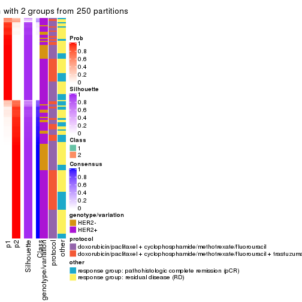</p>

</div>
<div id='tab-CV-pam-consensus-heatmap-2'>
<pre><code class="r">consensus_heatmap(res, k = 3)
</code></pre>

<p>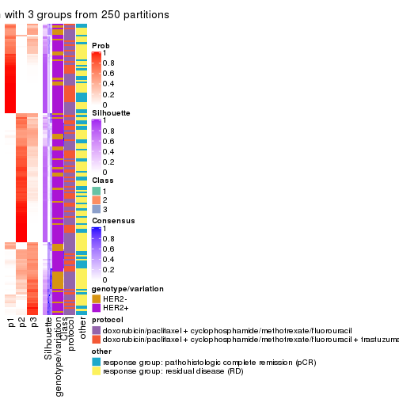</p>

</div>
<div id='tab-CV-pam-consensus-heatmap-3'>
<pre><code class="r">consensus_heatmap(res, k = 4)
</code></pre>

<p>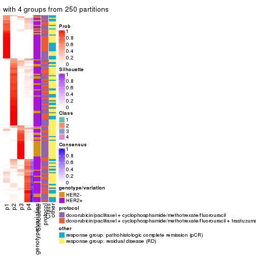</p>

</div>
<div id='tab-CV-pam-consensus-heatmap-4'>
<pre><code class="r">consensus_heatmap(res, k = 5)
</code></pre>

<p>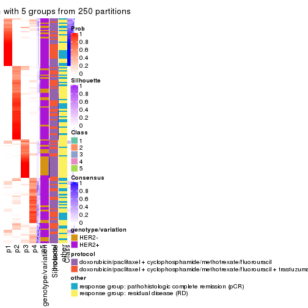</p>

</div>
<div id='tab-CV-pam-consensus-heatmap-5'>
<pre><code class="r">consensus_heatmap(res, k = 6)
</code></pre>

<p>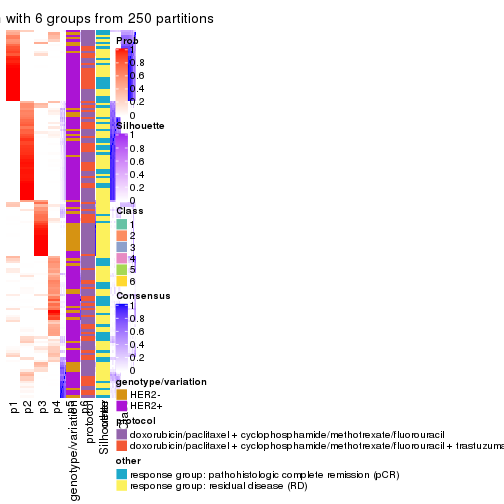</p>

</div>
</div>

Heatmaps for the membership of samples in all partitions to see how consistent they are:


<script>
$( function() {
	$( '#tabs-CV-pam-membership-heatmap' ).tabs();
} );
</script>
<div id='tabs-CV-pam-membership-heatmap'>
<ul>
<li><a href='#tab-CV-pam-membership-heatmap-1'>k = 2</a></li>
<li><a href='#tab-CV-pam-membership-heatmap-2'>k = 3</a></li>
<li><a href='#tab-CV-pam-membership-heatmap-3'>k = 4</a></li>
<li><a href='#tab-CV-pam-membership-heatmap-4'>k = 5</a></li>
<li><a href='#tab-CV-pam-membership-heatmap-5'>k = 6</a></li>
</ul>
<div id='tab-CV-pam-membership-heatmap-1'>
<pre><code class="r">membership_heatmap(res, k = 2)
</code></pre>

<p>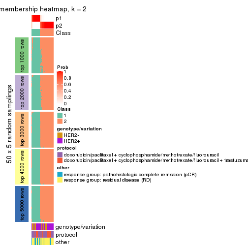</p>

</div>
<div id='tab-CV-pam-membership-heatmap-2'>
<pre><code class="r">membership_heatmap(res, k = 3)
</code></pre>

<p>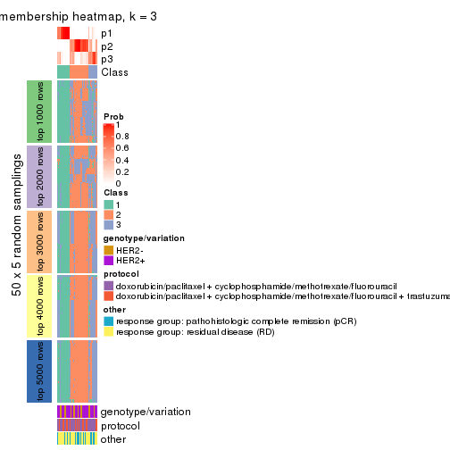</p>

</div>
<div id='tab-CV-pam-membership-heatmap-3'>
<pre><code class="r">membership_heatmap(res, k = 4)
</code></pre>

<p>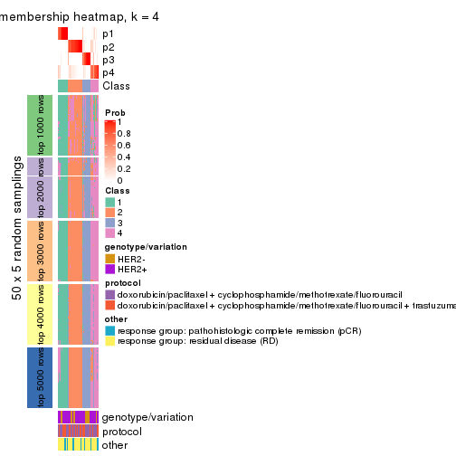</p>

</div>
<div id='tab-CV-pam-membership-heatmap-4'>
<pre><code class="r">membership_heatmap(res, k = 5)
</code></pre>

<p>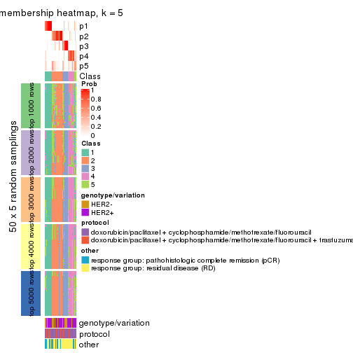</p>

</div>
<div id='tab-CV-pam-membership-heatmap-5'>
<pre><code class="r">membership_heatmap(res, k = 6)
</code></pre>

<p>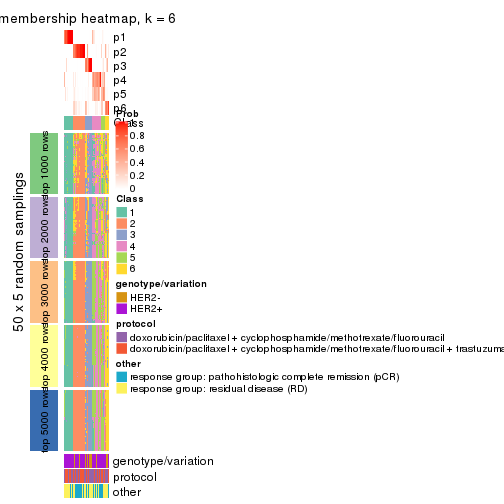</p>

</div>
</div>

As soon as we have had the classes for columns, we can look for signatures
which are significantly different between classes which can be candidate marks
for certain classes. Following are the heatmaps for signatures.


Signature heatmaps where rows are scaled:


<script>
$( function() {
	$( '#tabs-CV-pam-get-signatures' ).tabs();
} );
</script>
<div id='tabs-CV-pam-get-signatures'>
<ul>
<li><a href='#tab-CV-pam-get-signatures-1'>k = 2</a></li>
<li><a href='#tab-CV-pam-get-signatures-2'>k = 3</a></li>
<li><a href='#tab-CV-pam-get-signatures-3'>k = 4</a></li>
<li><a href='#tab-CV-pam-get-signatures-4'>k = 5</a></li>
<li><a href='#tab-CV-pam-get-signatures-5'>k = 6</a></li>
</ul>
<div id='tab-CV-pam-get-signatures-1'>
<pre><code class="r">get_signatures(res, k = 2)
</code></pre>

<pre><code>#&gt; Error: The width or height of the raster image is zero, maybe you forget to turn off the
#&gt; previous graphic device or it was corrupted. Run `dev.off()` to close it.
</code></pre>

<p></p>

</div>
<div id='tab-CV-pam-get-signatures-2'>
<pre><code class="r">get_signatures(res, k = 3)
</code></pre>

<pre><code>#&gt; Error: The width or height of the raster image is zero, maybe you forget to turn off the
#&gt; previous graphic device or it was corrupted. Run `dev.off()` to close it.
</code></pre>

<p></p>

</div>
<div id='tab-CV-pam-get-signatures-3'>
<pre><code class="r">get_signatures(res, k = 4)
</code></pre>

<pre><code>#&gt; Error: The width or height of the raster image is zero, maybe you forget to turn off the
#&gt; previous graphic device or it was corrupted. Run `dev.off()` to close it.
</code></pre>

<p></p>

</div>
<div id='tab-CV-pam-get-signatures-4'>
<pre><code class="r">get_signatures(res, k = 5)
</code></pre>

<pre><code>#&gt; Error: The width or height of the raster image is zero, maybe you forget to turn off the
#&gt; previous graphic device or it was corrupted. Run `dev.off()` to close it.
</code></pre>

<p></p>

</div>
<div id='tab-CV-pam-get-signatures-5'>
<pre><code class="r">get_signatures(res, k = 6)
</code></pre>

<pre><code>#&gt; Error: The width or height of the raster image is zero, maybe you forget to turn off the
#&gt; previous graphic device or it was corrupted. Run `dev.off()` to close it.
</code></pre>

<p></p>

</div>
</div>


Signature heatmaps where rows are not scaled:


<script>
$( function() {
	$( '#tabs-CV-pam-get-signatures-no-scale' ).tabs();
} );
</script>
<div id='tabs-CV-pam-get-signatures-no-scale'>
<ul>
<li><a href='#tab-CV-pam-get-signatures-no-scale-1'>k = 2</a></li>
<li><a href='#tab-CV-pam-get-signatures-no-scale-2'>k = 3</a></li>
<li><a href='#tab-CV-pam-get-signatures-no-scale-3'>k = 4</a></li>
<li><a href='#tab-CV-pam-get-signatures-no-scale-4'>k = 5</a></li>
<li><a href='#tab-CV-pam-get-signatures-no-scale-5'>k = 6</a></li>
</ul>
<div id='tab-CV-pam-get-signatures-no-scale-1'>
<pre><code class="r">get_signatures(res, k = 2, scale_rows = FALSE)
</code></pre>

<pre><code>#&gt; Error: The width or height of the raster image is zero, maybe you forget to turn off the
#&gt; previous graphic device or it was corrupted. Run `dev.off()` to close it.
</code></pre>

<p></p>

</div>
<div id='tab-CV-pam-get-signatures-no-scale-2'>
<pre><code class="r">get_signatures(res, k = 3, scale_rows = FALSE)
</code></pre>

<pre><code>#&gt; Error: The width or height of the raster image is zero, maybe you forget to turn off the
#&gt; previous graphic device or it was corrupted. Run `dev.off()` to close it.
</code></pre>

<p></p>

</div>
<div id='tab-CV-pam-get-signatures-no-scale-3'>
<pre><code class="r">get_signatures(res, k = 4, scale_rows = FALSE)
</code></pre>

<pre><code>#&gt; Error: The width or height of the raster image is zero, maybe you forget to turn off the
#&gt; previous graphic device or it was corrupted. Run `dev.off()` to close it.
</code></pre>

<p></p>

</div>
<div id='tab-CV-pam-get-signatures-no-scale-4'>
<pre><code class="r">get_signatures(res, k = 5, scale_rows = FALSE)
</code></pre>

<pre><code>#&gt; Error: The width or height of the raster image is zero, maybe you forget to turn off the
#&gt; previous graphic device or it was corrupted. Run `dev.off()` to close it.
</code></pre>

<p></p>

</div>
<div id='tab-CV-pam-get-signatures-no-scale-5'>
<pre><code class="r">get_signatures(res, k = 6, scale_rows = FALSE)
</code></pre>

<pre><code>#&gt; Error: The width or height of the raster image is zero, maybe you forget to turn off the
#&gt; previous graphic device or it was corrupted. Run `dev.off()` to close it.
</code></pre>

<p></p>

</div>
</div>


Compare the overlap of signatures from different k:

```r
compare_signatures(res)
```

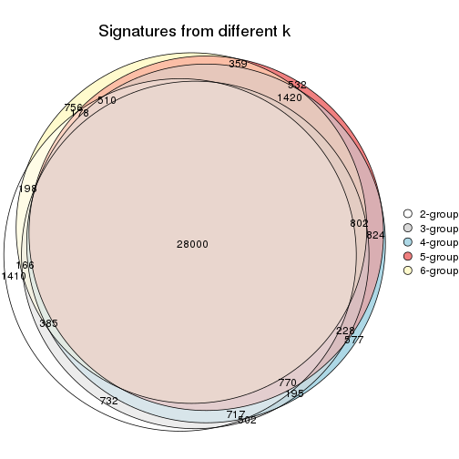

`get_signature()` returns a data frame invisibly. TO get the list of signatures, the function
call should be assigned to a variable explicitly. In following code, if `plot` argument is set
to `FALSE`, no heatmap is plotted while only the differential analysis is performed.

```r
# code only for demonstration
tb = get_signature(res, k = ..., plot = FALSE)
```

An example of the output of `tb` is:

```
#>   which_row         fdr    mean_1    mean_2 scaled_mean_1 scaled_mean_2 km
#> 1        38 0.042760348  8.373488  9.131774    -0.5533452     0.5164555  1
#> 2        40 0.018707592  7.106213  8.469186    -0.6173731     0.5762149  1
#> 3        55 0.019134737 10.221463 11.207825    -0.6159697     0.5749050  1
#> 4        59 0.006059896  5.921854  7.869574    -0.6899429     0.6439467  1
#> 5        60 0.018055526  8.928898 10.211722    -0.6204761     0.5791110  1
#> 6        98 0.009384629 15.714769 14.887706     0.6635654    -0.6193277  2
...
```

The columns in `tb` are:

1. `which_row`: row indices corresponding to the input matrix.
2. `fdr`: FDR for the differential test. 
3. `mean_x`: The mean value in group x.
4. `scaled_mean_x`: The mean value in group x after rows are scaled.
5. `km`: Row groups if k-means clustering is applied to rows.


UMAP plot which shows how samples are separated.


<script>
$( function() {
	$( '#tabs-CV-pam-dimension-reduction' ).tabs();
} );
</script>
<div id='tabs-CV-pam-dimension-reduction'>
<ul>
<li><a href='#tab-CV-pam-dimension-reduction-1'>k = 2</a></li>
<li><a href='#tab-CV-pam-dimension-reduction-2'>k = 3</a></li>
<li><a href='#tab-CV-pam-dimension-reduction-3'>k = 4</a></li>
<li><a href='#tab-CV-pam-dimension-reduction-4'>k = 5</a></li>
<li><a href='#tab-CV-pam-dimension-reduction-5'>k = 6</a></li>
</ul>
<div id='tab-CV-pam-dimension-reduction-1'>
<pre><code class="r">dimension_reduction(res, k = 2, method = &quot;UMAP&quot;)
</code></pre>

<p>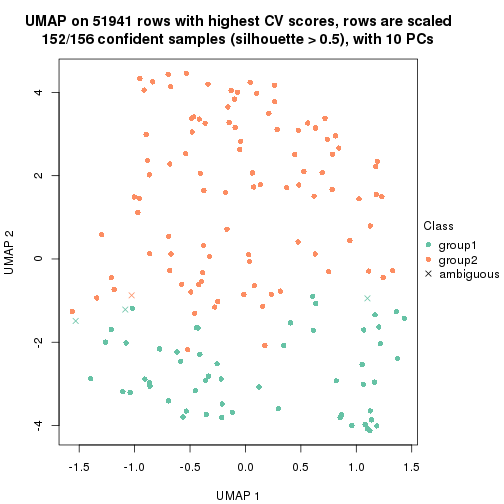</p>

</div>
<div id='tab-CV-pam-dimension-reduction-2'>
<pre><code class="r">dimension_reduction(res, k = 3, method = &quot;UMAP&quot;)
</code></pre>

<p>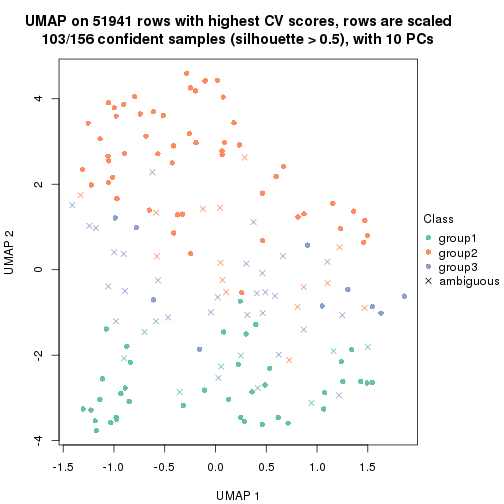</p>

</div>
<div id='tab-CV-pam-dimension-reduction-3'>
<pre><code class="r">dimension_reduction(res, k = 4, method = &quot;UMAP&quot;)
</code></pre>

<p>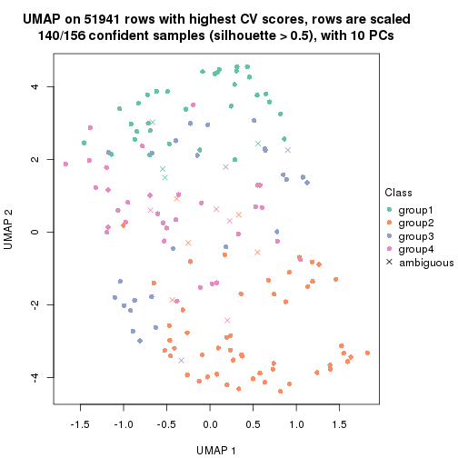</p>

</div>
<div id='tab-CV-pam-dimension-reduction-4'>
<pre><code class="r">dimension_reduction(res, k = 5, method = &quot;UMAP&quot;)
</code></pre>

<p>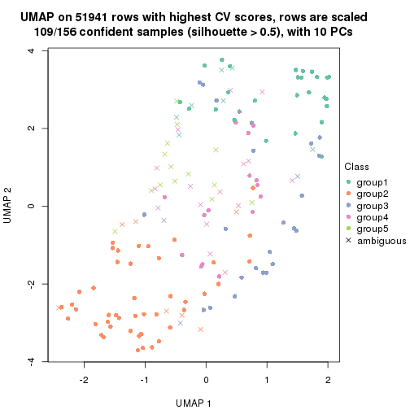</p>

</div>
<div id='tab-CV-pam-dimension-reduction-5'>
<pre><code class="r">dimension_reduction(res, k = 6, method = &quot;UMAP&quot;)
</code></pre>

<p>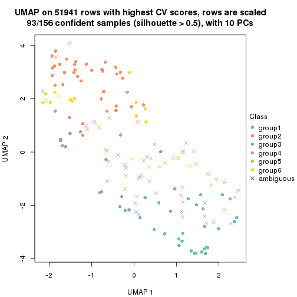</p>

</div>
</div>


Following heatmap shows how subgroups are split when increasing `k`:

```r
collect_classes(res)
```

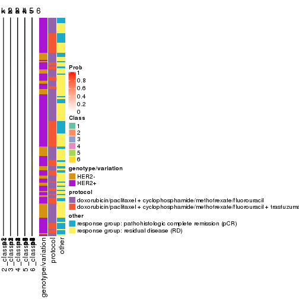


Test correlation between subgroups and known annotations. If the known
annotation is numeric, one-way ANOVA test is applied, and if the known
annotation is discrete, chi-squared contingency table test is applied.

```r
test_to_known_factors(res)
```

```
#>          n genotype/variation(p) protocol(p) other(p) k
#> CV:pam 152              1.00e+00       1.000   0.6397 2
#> CV:pam 103              9.57e-01       0.921   0.2781 3
#> CV:pam 140              5.14e-06       0.289   0.0309 4
#> CV:pam 109              1.94e-06       0.203   0.0143 5
#> CV:pam  93              1.68e-04       0.368   0.1424 6
```


If matrix rows can be associated to genes, consider to use `functional_enrichment(res,
...)` to perform function enrichment for the signature genes. See [this vignette](http://bioconductor.org/packages/devel/bioc/vignettes/cola/inst/doc/functional_enrichment.html) for more detailed explanations.


 

---------------------------------------------------


### CV:mclust


The object with results only for a single top-value method and a single partition method 
can be extracted as:

```r
res = res_list["CV", "mclust"]
# you can also extract it by
# res = res_list["CV:mclust"]
```

A summary of `res` and all the functions that can be applied to it:

```r
res
```

```
#> A 'ConsensusPartition' object with k = 2, 3, 4, 5, 6.
#>   On a matrix with 51941 rows and 156 columns.
#>   Top rows (1000, 2000, 3000, 4000, 5000) are extracted by 'CV' method.
#>   Subgroups are detected by 'mclust' method.
#>   Performed in total 1250 partitions by row resampling.
#>   Best k for subgroups seems to be 6.
#> 
#> Following methods can be applied to this 'ConsensusPartition' object:
#>  [1] "cola_report"             "collect_classes"         "collect_plots"          
#>  [4] "collect_stats"           "colnames"                "compare_signatures"     
#>  [7] "consensus_heatmap"       "dimension_reduction"     "functional_enrichment"  
#> [10] "get_anno_col"            "get_anno"                "get_classes"            
#> [13] "get_consensus"           "get_matrix"              "get_membership"         
#> [16] "get_param"               "get_signatures"          "get_stats"              
#> [19] "is_best_k"               "is_stable_k"             "membership_heatmap"     
#> [22] "ncol"                    "nrow"                    "plot_ecdf"              
#> [25] "rownames"                "select_partition_number" "show"                   
#> [28] "suggest_best_k"          "test_to_known_factors"
```

`collect_plots()` function collects all the plots made from `res` for all `k` (number of partitions)
into one single page to provide an easy and fast comparison between different `k`.

```r
collect_plots(res)
```

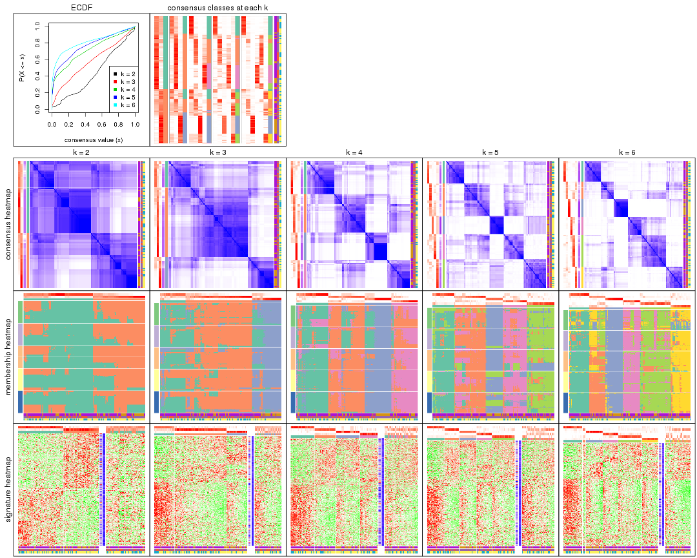

The plots are:

- The first row: a plot of the ECDF (empirical cumulative distribution
  function) curves of the consensus matrix for each `k` and the heatmap of
  predicted classes for each `k`.
- The second row: heatmaps of the consensus matrix for each `k`.
- The third row: heatmaps of the membership matrix for each `k`.
- The fouth row: heatmaps of the signatures for each `k`.

All the plots in panels can be made by individual functions and they are
plotted later in this section.

`select_partition_number()` produces several plots showing different
statistics for choosing "optimized" `k`. There are following statistics:

- ECDF curves of the consensus matrix for each `k`;
- 1-PAC. [The PAC
  score](https://en.wikipedia.org/wiki/Consensus_clustering#Over-interpretation_potential_of_consensus_clustering)
  measures the proportion of the ambiguous subgrouping.
- Mean silhouette score.
- Concordance. The mean probability of fiting the consensus class ids in all
  partitions.
- Area increased. Denote $A_k$ as the area under the ECDF curve for current
  `k`, the area increased is defined as $A_k - A_{k-1}$.
- Rand index. The percent of pairs of samples that are both in a same cluster
  or both are not in a same cluster in the partition of k and k-1.
- Jaccard index. The ratio of pairs of samples are both in a same cluster in
  the partition of k and k-1 and the pairs of samples are both in a same
  cluster in the partition k or k-1.

The detailed explanations of these statistics can be found in [the _cola_
vignette](http://bioconductor.org/packages/devel/bioc/vignettes/cola/inst/doc/cola.html#toc_13).

Generally speaking, lower PAC score, higher mean silhouette score or higher
concordance corresponds to better partition. Rand index and Jaccard index
measure how similar the current partition is compared to partition with `k-1`.
If they are too similar, we won't accept `k` is better than `k-1`.

```r
select_partition_number(res)
```

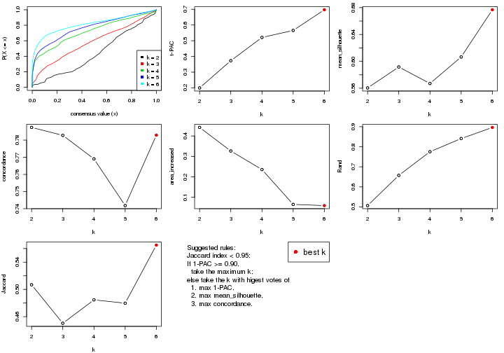

The numeric values for all these statistics can be obtained by `get_stats()`.

```r
get_stats(res)
```

```
#>   k 1-PAC mean_silhouette concordance area_increased  Rand Jaccard
#> 2 2 0.200           0.560       0.787         0.4417 0.507   0.507
#> 3 3 0.373           0.592       0.783         0.3266 0.657   0.450
#> 4 4 0.521           0.567       0.769         0.2358 0.775   0.485
#> 5 5 0.565           0.607       0.742         0.0654 0.841   0.480
#> 6 6 0.697           0.677       0.783         0.0596 0.896   0.565
```

`suggest_best_k()` suggests the best $k$ based on these statistics. The rules are as follows:

- All $k$ with Jaccard index larger than 0.95 are removed because increasing
  $k$ does not provide enough extra information. If all $k$ are removed, it is
  marked as no subgroup is detected.
- For all $k$ with 1-PAC score larger than 0.9, the maximal $k$ is taken as
  the best $k$, and other $k$ are marked as optional $k$.
- If it does not fit the second rule. The $k$ with the maximal vote of the
  highest 1-PAC score, highest mean silhouette, and highest concordance is
  taken as the best $k$.

```r
suggest_best_k(res)
```

```
#> [1] 6
```


Following shows the table of the partitions (You need to click the **show/hide
code output** link to see it). The membership matrix (columns with name `p*`)
is inferred by
[`clue::cl_consensus()`](https://www.rdocumentation.org/link/cl_consensus?package=clue)
function with the `SE` method. Basically the value in the membership matrix
represents the probability to belong to a certain group. The finall class
label for an item is determined with the group with highest probability it
belongs to.

In `get_classes()` function, the entropy is calculated from the membership
matrix and the silhouette score is calculated from the consensus matrix.


<script>
$( function() {
	$( '#tabs-CV-mclust-get-classes' ).tabs();
} );
</script>
<div id='tabs-CV-mclust-get-classes'>
<ul>
<li><a href='#tab-CV-mclust-get-classes-1'>k = 2</a></li>
<li><a href='#tab-CV-mclust-get-classes-2'>k = 3</a></li>
<li><a href='#tab-CV-mclust-get-classes-3'>k = 4</a></li>
<li><a href='#tab-CV-mclust-get-classes-4'>k = 5</a></li>
<li><a href='#tab-CV-mclust-get-classes-5'>k = 6</a></li>
</ul>

<div id='tab-CV-mclust-get-classes-1'>
<p><a id='tab-CV-mclust-get-classes-1-a' style='color:#0366d6' href='#'>show/hide code output</a></p>
<pre><code class="r">cbind(get_classes(res, k = 2), get_membership(res, k = 2))
</code></pre>

<pre><code>#&gt;            class entropy silhouette    p1    p2
#&gt; GSM1232995     2  0.8386    0.55451 0.268 0.732
#&gt; GSM1233002     1  0.3114    0.70588 0.944 0.056
#&gt; GSM1233003     1  0.9323    0.35793 0.652 0.348
#&gt; GSM1233014     1  0.4815    0.72946 0.896 0.104
#&gt; GSM1233015     1  0.6148    0.64287 0.848 0.152
#&gt; GSM1233016     1  0.4815    0.72946 0.896 0.104
#&gt; GSM1233024     1  0.5519    0.72899 0.872 0.128
#&gt; GSM1233049     2  0.7883    0.64638 0.236 0.764
#&gt; GSM1233064     2  0.9087    0.45994 0.324 0.676
#&gt; GSM1233068     1  0.9732    0.17897 0.596 0.404
#&gt; GSM1233073     1  0.0000    0.70725 1.000 0.000
#&gt; GSM1233093     1  0.9323    0.35793 0.652 0.348
#&gt; GSM1233115     1  0.9460    0.31559 0.636 0.364
#&gt; GSM1232992     1  0.9850    0.33569 0.572 0.428
#&gt; GSM1232993     1  0.4815    0.72946 0.896 0.104
#&gt; GSM1233005     1  0.9896    0.30157 0.560 0.440
#&gt; GSM1233007     2  0.9970    0.01424 0.468 0.532
#&gt; GSM1233010     1  0.0000    0.70725 1.000 0.000
#&gt; GSM1233013     1  0.9710    0.40478 0.600 0.400
#&gt; GSM1233018     1  0.9909    0.29077 0.556 0.444
#&gt; GSM1233019     1  0.4939    0.73002 0.892 0.108
#&gt; GSM1233021     1  0.9358    0.49920 0.648 0.352
#&gt; GSM1233025     1  0.0000    0.70725 1.000 0.000
#&gt; GSM1233029     1  0.4815    0.72946 0.896 0.104
#&gt; GSM1233030     1  0.8207    0.62918 0.744 0.256
#&gt; GSM1233031     1  0.5178    0.73023 0.884 0.116
#&gt; GSM1233032     2  0.8499    0.61568 0.276 0.724
#&gt; GSM1233035     1  0.3274    0.72729 0.940 0.060
#&gt; GSM1233038     1  0.3879    0.69930 0.924 0.076
#&gt; GSM1233039     2  0.9710    0.25046 0.400 0.600
#&gt; GSM1233042     1  0.4815    0.72946 0.896 0.104
#&gt; GSM1233043     1  0.4815    0.72946 0.896 0.104
#&gt; GSM1233044     1  0.9996   -0.16758 0.512 0.488
#&gt; GSM1233046     1  0.3114    0.70516 0.944 0.056
#&gt; GSM1233051     1  0.9833    0.10267 0.576 0.424
#&gt; GSM1233054     2  0.7299    0.67847 0.204 0.796
#&gt; GSM1233057     2  0.3274    0.71388 0.060 0.940
#&gt; GSM1233060     1  0.4815    0.72946 0.896 0.104
#&gt; GSM1233062     1  0.4939    0.73011 0.892 0.108
#&gt; GSM1233075     2  0.0000    0.71154 0.000 1.000
#&gt; GSM1233078     2  0.4815    0.67925 0.104 0.896
#&gt; GSM1233079     2  0.6343    0.68832 0.160 0.840
#&gt; GSM1233082     1  0.9170    0.39231 0.668 0.332
#&gt; GSM1233083     2  0.9996    0.23036 0.488 0.512
#&gt; GSM1233091     2  1.0000    0.11396 0.496 0.504
#&gt; GSM1233095     1  0.9552    0.28280 0.624 0.376
#&gt; GSM1233096     1  0.6801    0.61891 0.820 0.180
#&gt; GSM1233101     1  0.9998   -0.17830 0.508 0.492
#&gt; GSM1233105     1  0.0000    0.70725 1.000 0.000
#&gt; GSM1233117     2  0.9087    0.45921 0.324 0.676
#&gt; GSM1233118     2  0.2778    0.71499 0.048 0.952
#&gt; GSM1233001     2  0.4939    0.69551 0.108 0.892
#&gt; GSM1233006     1  0.4815    0.72946 0.896 0.104
#&gt; GSM1233008     2  0.9881    0.13862 0.436 0.564
#&gt; GSM1233009     1  0.5408    0.72982 0.876 0.124
#&gt; GSM1233017     1  0.5294    0.73002 0.880 0.120
#&gt; GSM1233020     2  0.9248    0.42383 0.340 0.660
#&gt; GSM1233022     1  0.6048    0.72362 0.852 0.148
#&gt; GSM1233026     1  0.5842    0.72626 0.860 0.140
#&gt; GSM1233028     1  0.5059    0.73064 0.888 0.112
#&gt; GSM1233034     2  0.9922    0.08005 0.448 0.552
#&gt; GSM1233040     1  0.9393    0.33769 0.644 0.356
#&gt; GSM1233048     1  0.9000    0.42407 0.684 0.316
#&gt; GSM1233056     1  0.9635    0.24362 0.612 0.388
#&gt; GSM1233058     1  0.3879    0.72562 0.924 0.076
#&gt; GSM1233059     1  0.9323    0.35793 0.652 0.348
#&gt; GSM1233066     2  0.0672    0.71323 0.008 0.992
#&gt; GSM1233071     1  0.6801    0.70978 0.820 0.180
#&gt; GSM1233074     2  0.0938    0.71383 0.012 0.988
#&gt; GSM1233076     2  0.9087    0.45921 0.324 0.676
#&gt; GSM1233080     1  0.9358    0.34851 0.648 0.352
#&gt; GSM1233088     2  0.9129    0.45256 0.328 0.672
#&gt; GSM1233090     1  0.9608    0.25770 0.616 0.384
#&gt; GSM1233092     1  0.4815    0.72946 0.896 0.104
#&gt; GSM1233094     1  0.4815    0.72946 0.896 0.104
#&gt; GSM1233097     1  0.4815    0.72946 0.896 0.104
#&gt; GSM1233100     1  0.0000    0.70725 1.000 0.000
#&gt; GSM1233104     1  0.4939    0.73002 0.892 0.108
#&gt; GSM1233106     1  0.9248    0.37558 0.660 0.340
#&gt; GSM1233111     1  0.8861    0.44620 0.696 0.304
#&gt; GSM1233122     2  0.9977    0.00777 0.472 0.528
#&gt; GSM1233146     1  0.4815    0.72946 0.896 0.104
#&gt; GSM1232994     1  0.9460    0.50044 0.636 0.364
#&gt; GSM1232996     1  0.9909    0.29079 0.556 0.444
#&gt; GSM1232997     2  0.3274    0.71396 0.060 0.940
#&gt; GSM1232998     1  0.4815    0.72946 0.896 0.104
#&gt; GSM1232999     1  0.4815    0.72946 0.896 0.104
#&gt; GSM1233000     1  0.7299    0.69286 0.796 0.204
#&gt; GSM1233004     2  0.9815    0.42084 0.420 0.580
#&gt; GSM1233011     2  0.9087    0.45921 0.324 0.676
#&gt; GSM1233012     2  0.8016    0.58407 0.244 0.756
#&gt; GSM1233023     2  0.4298    0.70530 0.088 0.912
#&gt; GSM1233027     1  0.4815    0.72946 0.896 0.104
#&gt; GSM1233033     1  0.0000    0.70725 1.000 0.000
#&gt; GSM1233036     2  0.8499    0.54323 0.276 0.724
#&gt; GSM1233037     2  0.8608    0.51969 0.284 0.716
#&gt; GSM1233041     1  0.9323    0.35793 0.652 0.348
#&gt; GSM1233045     1  0.5059    0.73060 0.888 0.112
#&gt; GSM1233047     2  0.6148    0.68853 0.152 0.848
#&gt; GSM1233050     1  0.9358    0.34806 0.648 0.352
#&gt; GSM1233052     1  0.6247    0.64543 0.844 0.156
#&gt; GSM1233053     2  0.8267    0.63705 0.260 0.740
#&gt; GSM1233055     1  0.9393    0.33867 0.644 0.356
#&gt; GSM1233061     2  0.4431    0.70822 0.092 0.908
#&gt; GSM1233063     1  0.9323    0.35793 0.652 0.348
#&gt; GSM1233065     2  0.3584    0.71206 0.068 0.932
#&gt; GSM1233070     1  0.9850    0.33858 0.572 0.428
#&gt; GSM1233077     2  0.0000    0.71154 0.000 1.000
#&gt; GSM1233081     2  0.5178    0.68317 0.116 0.884
#&gt; GSM1233084     1  0.9323    0.35793 0.652 0.348
#&gt; GSM1233087     1  0.3114    0.70679 0.944 0.056
#&gt; GSM1233089     2  0.9087    0.45921 0.324 0.676
#&gt; GSM1233099     1  0.0000    0.70725 1.000 0.000
#&gt; GSM1233112     2  0.9933    0.34135 0.452 0.548
#&gt; GSM1233085     2  0.4815    0.67925 0.104 0.896
#&gt; GSM1233098     2  0.9323    0.40430 0.348 0.652
#&gt; GSM1233114     1  0.7815    0.55784 0.768 0.232
#&gt; GSM1233119     1  0.4690    0.72992 0.900 0.100
#&gt; GSM1233129     2  0.3274    0.71388 0.060 0.940
#&gt; GSM1233132     1  0.0672    0.70890 0.992 0.008
#&gt; GSM1233139     2  1.0000   -0.11098 0.496 0.504
#&gt; GSM1233143     2  0.8327    0.55342 0.264 0.736
#&gt; GSM1233145     1  0.0000    0.70725 1.000 0.000
#&gt; GSM1233067     2  0.0000    0.71154 0.000 1.000
#&gt; GSM1233069     2  0.0000    0.71154 0.000 1.000
#&gt; GSM1233072     2  0.9795    0.22366 0.416 0.584
#&gt; GSM1233086     2  0.8555    0.53455 0.280 0.720
#&gt; GSM1233102     1  0.0000    0.70725 1.000 0.000
#&gt; GSM1233103     1  0.7056    0.69238 0.808 0.192
#&gt; GSM1233107     1  0.4815    0.72946 0.896 0.104
#&gt; GSM1233108     2  0.4815    0.67925 0.104 0.896
#&gt; GSM1233109     2  0.4815    0.67925 0.104 0.896
#&gt; GSM1233110     2  0.0000    0.71154 0.000 1.000
#&gt; GSM1233113     2  0.0000    0.71154 0.000 1.000
#&gt; GSM1233116     2  0.0000    0.71154 0.000 1.000
#&gt; GSM1233120     1  0.0000    0.70725 1.000 0.000
#&gt; GSM1233121     2  0.0000    0.71154 0.000 1.000
#&gt; GSM1233123     2  0.0000    0.71154 0.000 1.000
#&gt; GSM1233124     2  0.0000    0.71154 0.000 1.000
#&gt; GSM1233125     2  0.4815    0.67925 0.104 0.896
#&gt; GSM1233126     1  0.4815    0.72946 0.896 0.104
#&gt; GSM1233127     1  0.5408    0.72159 0.876 0.124
#&gt; GSM1233128     1  0.9775    0.15842 0.588 0.412
#&gt; GSM1233130     2  0.0000    0.71154 0.000 1.000
#&gt; GSM1233131     1  0.0672    0.70866 0.992 0.008
#&gt; GSM1233133     2  0.4815    0.67925 0.104 0.896
#&gt; GSM1233134     2  0.0000    0.71154 0.000 1.000
#&gt; GSM1233135     2  0.0000    0.71154 0.000 1.000
#&gt; GSM1233136     2  0.0000    0.71154 0.000 1.000
#&gt; GSM1233137     2  0.4815    0.67925 0.104 0.896
#&gt; GSM1233138     1  0.4815    0.72946 0.896 0.104
#&gt; GSM1233140     2  0.7219    0.68083 0.200 0.800
#&gt; GSM1233141     2  0.9988   -0.02733 0.480 0.520
#&gt; GSM1233142     1  0.6531    0.69707 0.832 0.168
#&gt; GSM1233144     2  0.4815    0.67925 0.104 0.896
#&gt; GSM1233147     2  0.8861    0.49456 0.304 0.696
</code></pre>

<script>
$('#tab-CV-mclust-get-classes-1-a').parent().next().next().hide();
$('#tab-CV-mclust-get-classes-1-a').click(function(){
  $('#tab-CV-mclust-get-classes-1-a').parent().next().next().toggle();
  return(false);
});
</script>
</div>

<div id='tab-CV-mclust-get-classes-2'>
<p><a id='tab-CV-mclust-get-classes-2-a' style='color:#0366d6' href='#'>show/hide code output</a></p>
<pre><code class="r">cbind(get_classes(res, k = 3), get_membership(res, k = 3))
</code></pre>

<pre><code>#&gt;            class entropy silhouette    p1    p2    p3
#&gt; GSM1232995     2  0.9926    -0.2685 0.328 0.388 0.284
#&gt; GSM1233002     2  0.0424     0.7758 0.008 0.992 0.000
#&gt; GSM1233003     1  0.6452     0.7808 0.712 0.252 0.036
#&gt; GSM1233014     2  0.5741     0.6735 0.188 0.776 0.036
#&gt; GSM1233015     2  0.5156     0.5661 0.216 0.776 0.008
#&gt; GSM1233016     2  0.4099     0.7058 0.140 0.852 0.008
#&gt; GSM1233024     2  0.2663     0.7765 0.024 0.932 0.044
#&gt; GSM1233049     1  0.6902     0.6424 0.732 0.100 0.168
#&gt; GSM1233064     2  0.9994    -0.3746 0.340 0.344 0.316
#&gt; GSM1233068     2  0.7396     0.2913 0.296 0.644 0.060
#&gt; GSM1233073     2  0.0000     0.7752 0.000 1.000 0.000
#&gt; GSM1233093     1  0.6180     0.7702 0.716 0.260 0.024
#&gt; GSM1233115     1  0.6539     0.7422 0.684 0.288 0.028
#&gt; GSM1232992     2  0.4658     0.7432 0.076 0.856 0.068
#&gt; GSM1232993     2  0.1411     0.7767 0.000 0.964 0.036
#&gt; GSM1233005     2  0.4749     0.7395 0.076 0.852 0.072
#&gt; GSM1233007     2  0.7044     0.5420 0.168 0.724 0.108
#&gt; GSM1233010     2  0.0000     0.7752 0.000 1.000 0.000
#&gt; GSM1233013     2  0.4745     0.7404 0.080 0.852 0.068
#&gt; GSM1233018     2  0.5153     0.7232 0.100 0.832 0.068
#&gt; GSM1233019     2  0.2926     0.7774 0.036 0.924 0.040
#&gt; GSM1233021     2  0.4194     0.7559 0.064 0.876 0.060
#&gt; GSM1233025     2  0.3619     0.7250 0.136 0.864 0.000
#&gt; GSM1233029     2  0.2297     0.7775 0.020 0.944 0.036
#&gt; GSM1233030     2  0.3039     0.7754 0.036 0.920 0.044
#&gt; GSM1233031     2  0.0592     0.7770 0.000 0.988 0.012
#&gt; GSM1233032     1  0.6462     0.6914 0.764 0.120 0.116
#&gt; GSM1233035     2  0.1411     0.7777 0.000 0.964 0.036
#&gt; GSM1233038     2  0.5982     0.3379 0.328 0.668 0.004
#&gt; GSM1233039     2  0.8535     0.1239 0.332 0.556 0.112
#&gt; GSM1233042     2  0.2878     0.7348 0.096 0.904 0.000
#&gt; GSM1233043     2  0.3845     0.7243 0.116 0.872 0.012
#&gt; GSM1233044     1  0.8250     0.5261 0.528 0.392 0.080
#&gt; GSM1233046     2  0.2165     0.7604 0.064 0.936 0.000
#&gt; GSM1233051     1  0.5982     0.7864 0.744 0.228 0.028
#&gt; GSM1233054     1  0.8511     0.0243 0.480 0.092 0.428
#&gt; GSM1233057     3  0.8196     0.3250 0.356 0.084 0.560
#&gt; GSM1233060     2  0.0000     0.7752 0.000 1.000 0.000
#&gt; GSM1233062     2  0.1832     0.7774 0.008 0.956 0.036
#&gt; GSM1233075     3  0.1315     0.7536 0.020 0.008 0.972
#&gt; GSM1233078     3  0.0983     0.7566 0.016 0.004 0.980
#&gt; GSM1233079     1  0.7581    -0.1252 0.496 0.040 0.464
#&gt; GSM1233082     2  0.7636    -0.0536 0.396 0.556 0.048
#&gt; GSM1233083     1  0.7059     0.7315 0.724 0.164 0.112
#&gt; GSM1233091     1  0.8606     0.5133 0.528 0.364 0.108
#&gt; GSM1233095     1  0.6012     0.7849 0.748 0.220 0.032
#&gt; GSM1233096     2  0.6600     0.0813 0.384 0.604 0.012
#&gt; GSM1233101     1  0.5678     0.7680 0.776 0.192 0.032
#&gt; GSM1233105     2  0.0237     0.7748 0.004 0.996 0.000
#&gt; GSM1233117     2  0.9528     0.0238 0.288 0.484 0.228
#&gt; GSM1233118     3  0.6016     0.5825 0.256 0.020 0.724
#&gt; GSM1233001     3  0.8530     0.3356 0.344 0.108 0.548
#&gt; GSM1233006     2  0.5047     0.7121 0.140 0.824 0.036
#&gt; GSM1233008     2  0.6410     0.6392 0.144 0.764 0.092
#&gt; GSM1233009     2  0.2636     0.7766 0.020 0.932 0.048
#&gt; GSM1233017     2  0.2550     0.7767 0.024 0.936 0.040
#&gt; GSM1233020     2  0.8571     0.1307 0.340 0.548 0.112
#&gt; GSM1233022     2  0.3267     0.7777 0.044 0.912 0.044
#&gt; GSM1233026     2  0.0424     0.7760 0.008 0.992 0.000
#&gt; GSM1233028     2  0.0237     0.7757 0.004 0.996 0.000
#&gt; GSM1233034     2  0.6181     0.6421 0.116 0.780 0.104
#&gt; GSM1233040     1  0.6056     0.7860 0.744 0.224 0.032
#&gt; GSM1233048     1  0.7145     0.4215 0.536 0.440 0.024
#&gt; GSM1233056     1  0.6203     0.7657 0.760 0.184 0.056
#&gt; GSM1233058     2  0.0237     0.7757 0.004 0.996 0.000
#&gt; GSM1233059     1  0.6287     0.7580 0.704 0.272 0.024
#&gt; GSM1233066     3  0.5247     0.6314 0.224 0.008 0.768
#&gt; GSM1233071     2  0.2269     0.7749 0.016 0.944 0.040
#&gt; GSM1233074     3  0.3690     0.7225 0.100 0.016 0.884
#&gt; GSM1233076     2  0.9303     0.0337 0.316 0.500 0.184
#&gt; GSM1233080     1  0.5982     0.7862 0.744 0.228 0.028
#&gt; GSM1233088     1  0.9921     0.3204 0.396 0.308 0.296
#&gt; GSM1233090     1  0.5939     0.7859 0.748 0.224 0.028
#&gt; GSM1233092     2  0.5741     0.6735 0.188 0.776 0.036
#&gt; GSM1233094     2  0.0747     0.7739 0.016 0.984 0.000
#&gt; GSM1233097     2  0.1411     0.7681 0.036 0.964 0.000
#&gt; GSM1233100     2  0.0000     0.7752 0.000 1.000 0.000
#&gt; GSM1233104     2  0.4930     0.7333 0.120 0.836 0.044
#&gt; GSM1233106     1  0.7841     0.5301 0.536 0.408 0.056
#&gt; GSM1233111     1  0.7396     0.3131 0.488 0.480 0.032
#&gt; GSM1233122     2  0.5500     0.7081 0.100 0.816 0.084
#&gt; GSM1233146     2  0.0237     0.7748 0.004 0.996 0.000
#&gt; GSM1232994     2  0.4058     0.7585 0.044 0.880 0.076
#&gt; GSM1232996     2  0.4838     0.7375 0.076 0.848 0.076
#&gt; GSM1232997     3  0.7885     0.3952 0.336 0.072 0.592
#&gt; GSM1232998     2  0.5741     0.6735 0.188 0.776 0.036
#&gt; GSM1232999     2  0.1647     0.7775 0.004 0.960 0.036
#&gt; GSM1233000     2  0.2550     0.7766 0.024 0.936 0.040
#&gt; GSM1233004     1  0.9252     0.2645 0.468 0.160 0.372
#&gt; GSM1233011     2  0.9151     0.0909 0.292 0.528 0.180
#&gt; GSM1233012     3  0.9608     0.0344 0.300 0.232 0.468
#&gt; GSM1233023     3  0.8683     0.2912 0.340 0.120 0.540
#&gt; GSM1233027     2  0.4960     0.7262 0.128 0.832 0.040
#&gt; GSM1233033     2  0.2066     0.7620 0.060 0.940 0.000
#&gt; GSM1233036     2  0.9996    -0.3587 0.324 0.348 0.328
#&gt; GSM1233037     3  0.9907    -0.2258 0.356 0.268 0.376
#&gt; GSM1233041     1  0.6451     0.7335 0.684 0.292 0.024
#&gt; GSM1233045     2  0.0237     0.7757 0.004 0.996 0.000
#&gt; GSM1233047     1  0.7918    -0.0836 0.484 0.056 0.460
#&gt; GSM1233050     1  0.5939     0.7859 0.748 0.224 0.028
#&gt; GSM1233052     2  0.5982     0.3057 0.328 0.668 0.004
#&gt; GSM1233053     1  0.6511     0.6657 0.760 0.104 0.136
#&gt; GSM1233055     1  0.6295     0.7848 0.728 0.236 0.036
#&gt; GSM1233061     3  0.6217     0.5759 0.264 0.024 0.712
#&gt; GSM1233063     1  0.6651     0.6968 0.656 0.320 0.024
#&gt; GSM1233065     3  0.7091     0.4854 0.320 0.040 0.640
#&gt; GSM1233070     2  0.4058     0.7499 0.044 0.880 0.076
#&gt; GSM1233077     3  0.0475     0.7574 0.004 0.004 0.992
#&gt; GSM1233081     3  0.4834     0.6695 0.204 0.004 0.792
#&gt; GSM1233084     1  0.6025     0.7858 0.740 0.232 0.028
#&gt; GSM1233087     2  0.2860     0.7667 0.084 0.912 0.004
#&gt; GSM1233089     2  0.9822    -0.1206 0.292 0.428 0.280
#&gt; GSM1233099     2  0.1031     0.7718 0.024 0.976 0.000
#&gt; GSM1233112     1  0.7552     0.7125 0.692 0.168 0.140
#&gt; GSM1233085     3  0.2165     0.7412 0.064 0.000 0.936
#&gt; GSM1233098     2  0.8592     0.1356 0.332 0.552 0.116
#&gt; GSM1233114     2  0.7067     0.2144 0.376 0.596 0.028
#&gt; GSM1233119     2  0.4921     0.6881 0.164 0.816 0.020
#&gt; GSM1233129     3  0.7529     0.4518 0.316 0.060 0.624
#&gt; GSM1233132     2  0.5058     0.5470 0.244 0.756 0.000
#&gt; GSM1233139     2  0.5889     0.6734 0.108 0.796 0.096
#&gt; GSM1233143     3  0.9908    -0.1130 0.276 0.332 0.392
#&gt; GSM1233145     2  0.5178     0.5625 0.256 0.744 0.000
#&gt; GSM1233067     3  0.0237     0.7563 0.004 0.000 0.996
#&gt; GSM1233069     3  0.0424     0.7568 0.008 0.000 0.992
#&gt; GSM1233072     2  0.7909     0.4353 0.240 0.648 0.112
#&gt; GSM1233086     3  0.9846    -0.0863 0.276 0.304 0.420
#&gt; GSM1233102     2  0.3941     0.7244 0.156 0.844 0.000
#&gt; GSM1233103     2  0.2806     0.7661 0.032 0.928 0.040
#&gt; GSM1233107     2  0.1877     0.7729 0.032 0.956 0.012
#&gt; GSM1233108     3  0.1643     0.7389 0.044 0.000 0.956
#&gt; GSM1233109     3  0.1643     0.7389 0.044 0.000 0.956
#&gt; GSM1233110     3  0.0475     0.7574 0.004 0.004 0.992
#&gt; GSM1233113     3  0.0237     0.7563 0.004 0.000 0.996
#&gt; GSM1233116     3  0.0237     0.7563 0.004 0.000 0.996
#&gt; GSM1233120     2  0.3340     0.7434 0.120 0.880 0.000
#&gt; GSM1233121     3  0.0237     0.7569 0.000 0.004 0.996
#&gt; GSM1233123     3  0.0475     0.7574 0.004 0.004 0.992
#&gt; GSM1233124     3  0.3644     0.7105 0.124 0.004 0.872
#&gt; GSM1233125     3  0.1860     0.7411 0.052 0.000 0.948
#&gt; GSM1233126     2  0.5689     0.6739 0.184 0.780 0.036
#&gt; GSM1233127     2  0.3155     0.7745 0.044 0.916 0.040
#&gt; GSM1233128     1  0.6158     0.7680 0.760 0.188 0.052
#&gt; GSM1233130     3  0.0475     0.7574 0.004 0.004 0.992
#&gt; GSM1233131     2  0.0424     0.7758 0.008 0.992 0.000
#&gt; GSM1233133     3  0.1753     0.7402 0.048 0.000 0.952
#&gt; GSM1233134     3  0.0424     0.7568 0.008 0.000 0.992
#&gt; GSM1233135     3  0.0237     0.7563 0.004 0.000 0.996
#&gt; GSM1233136     3  0.0237     0.7569 0.000 0.004 0.996
#&gt; GSM1233137     3  0.1643     0.7389 0.044 0.000 0.956
#&gt; GSM1233138     2  0.5741     0.6735 0.188 0.776 0.036
#&gt; GSM1233140     1  0.7458     0.6080 0.692 0.112 0.196
#&gt; GSM1233141     2  0.5848     0.7198 0.124 0.796 0.080
#&gt; GSM1233142     2  0.3572     0.7740 0.060 0.900 0.040
#&gt; GSM1233144     3  0.1643     0.7389 0.044 0.000 0.956
#&gt; GSM1233147     3  0.9926    -0.1307 0.276 0.348 0.376
</code></pre>

<script>
$('#tab-CV-mclust-get-classes-2-a').parent().next().next().hide();
$('#tab-CV-mclust-get-classes-2-a').click(function(){
  $('#tab-CV-mclust-get-classes-2-a').parent().next().next().toggle();
  return(false);
});
</script>
</div>

<div id='tab-CV-mclust-get-classes-3'>
<p><a id='tab-CV-mclust-get-classes-3-a' style='color:#0366d6' href='#'>show/hide code output</a></p>
<pre><code class="r">cbind(get_classes(res, k = 4), get_membership(res, k = 4))
</code></pre>

<pre><code>#&gt;            class entropy silhouette    p1    p2    p3    p4
#&gt; GSM1232995     2  0.4799    0.41740 0.224 0.744 0.032 0.000
#&gt; GSM1233002     4  0.5137    0.24154 0.000 0.452 0.004 0.544
#&gt; GSM1233003     1  0.0524    0.78140 0.988 0.008 0.000 0.004
#&gt; GSM1233014     4  0.0000    0.72361 0.000 0.000 0.000 1.000
#&gt; GSM1233015     1  0.7602   -0.14175 0.420 0.380 0.000 0.200
#&gt; GSM1233016     4  0.0000    0.72361 0.000 0.000 0.000 1.000
#&gt; GSM1233024     2  0.3123    0.62855 0.000 0.844 0.000 0.156
#&gt; GSM1233049     1  0.3399    0.73124 0.868 0.092 0.040 0.000
#&gt; GSM1233064     3  0.7784    0.26912 0.244 0.364 0.392 0.000
#&gt; GSM1233068     1  0.4281    0.65247 0.792 0.180 0.000 0.028
#&gt; GSM1233073     4  0.4456    0.57587 0.000 0.280 0.004 0.716
#&gt; GSM1233093     1  0.0336    0.78007 0.992 0.008 0.000 0.000
#&gt; GSM1233115     1  0.0707    0.77862 0.980 0.020 0.000 0.000
#&gt; GSM1232992     2  0.3497    0.63924 0.024 0.852 0.000 0.124
#&gt; GSM1232993     2  0.4040    0.56068 0.000 0.752 0.000 0.248
#&gt; GSM1233005     2  0.3962    0.63892 0.044 0.832 0.000 0.124
#&gt; GSM1233007     4  0.8655    0.00764 0.212 0.344 0.044 0.400
#&gt; GSM1233010     4  0.5132    0.25405 0.000 0.448 0.004 0.548
#&gt; GSM1233013     2  0.3497    0.63911 0.024 0.852 0.000 0.124
#&gt; GSM1233018     2  0.4127    0.63679 0.052 0.824 0.000 0.124
#&gt; GSM1233019     2  0.3311    0.61983 0.000 0.828 0.000 0.172
#&gt; GSM1233021     2  0.2999    0.63482 0.004 0.864 0.000 0.132
#&gt; GSM1233025     4  0.0000    0.72361 0.000 0.000 0.000 1.000
#&gt; GSM1233029     2  0.3569    0.60335 0.000 0.804 0.000 0.196
#&gt; GSM1233030     2  0.3591    0.62571 0.008 0.824 0.000 0.168
#&gt; GSM1233031     2  0.4917    0.43921 0.008 0.656 0.000 0.336
#&gt; GSM1233032     1  0.3308    0.73678 0.872 0.092 0.036 0.000
#&gt; GSM1233035     2  0.4360    0.56425 0.008 0.744 0.000 0.248
#&gt; GSM1233038     4  0.3325    0.67159 0.112 0.024 0.000 0.864
#&gt; GSM1233039     2  0.6008    0.36630 0.284 0.656 0.048 0.012
#&gt; GSM1233042     4  0.2704    0.69830 0.000 0.124 0.000 0.876
#&gt; GSM1233043     4  0.2647    0.69929 0.000 0.120 0.000 0.880
#&gt; GSM1233044     1  0.2845    0.76911 0.896 0.076 0.000 0.028
#&gt; GSM1233046     2  0.7506    0.30855 0.220 0.492 0.000 0.288
#&gt; GSM1233051     1  0.0524    0.78054 0.988 0.008 0.004 0.000
#&gt; GSM1233054     1  0.6845    0.26147 0.564 0.128 0.308 0.000
#&gt; GSM1233057     3  0.7114    0.53123 0.232 0.204 0.564 0.000
#&gt; GSM1233060     2  0.4428    0.52336 0.000 0.720 0.004 0.276
#&gt; GSM1233062     2  0.3873    0.57897 0.000 0.772 0.000 0.228
#&gt; GSM1233075     3  0.0937    0.81903 0.012 0.012 0.976 0.000
#&gt; GSM1233078     3  0.0188    0.82651 0.004 0.000 0.996 0.000
#&gt; GSM1233079     1  0.5977    0.53573 0.688 0.120 0.192 0.000
#&gt; GSM1233082     1  0.4998    0.58760 0.748 0.200 0.000 0.052
#&gt; GSM1233083     1  0.8118    0.26271 0.452 0.112 0.052 0.384
#&gt; GSM1233091     1  0.3749    0.73567 0.840 0.128 0.032 0.000
#&gt; GSM1233095     1  0.0188    0.77957 0.996 0.004 0.000 0.000
#&gt; GSM1233096     1  0.6977    0.33826 0.584 0.212 0.000 0.204
#&gt; GSM1233101     1  0.1305    0.77291 0.960 0.036 0.004 0.000
#&gt; GSM1233105     4  0.4905    0.44902 0.000 0.364 0.004 0.632
#&gt; GSM1233117     2  0.5533    0.38750 0.220 0.708 0.072 0.000
#&gt; GSM1233118     3  0.6885    0.56986 0.208 0.196 0.596 0.000
#&gt; GSM1233001     3  0.7536    0.43662 0.220 0.296 0.484 0.000
#&gt; GSM1233006     4  0.2216    0.70937 0.000 0.092 0.000 0.908
#&gt; GSM1233008     2  0.4297    0.62126 0.084 0.820 0.000 0.096
#&gt; GSM1233009     2  0.4012    0.62067 0.016 0.800 0.000 0.184
#&gt; GSM1233017     2  0.3219    0.62326 0.000 0.836 0.000 0.164
#&gt; GSM1233020     2  0.4609    0.42333 0.224 0.752 0.024 0.000
#&gt; GSM1233022     4  0.4972    0.07609 0.000 0.456 0.000 0.544
#&gt; GSM1233026     2  0.4655    0.46406 0.000 0.684 0.004 0.312
#&gt; GSM1233028     2  0.4401    0.53084 0.000 0.724 0.004 0.272
#&gt; GSM1233034     2  0.4470    0.57809 0.172 0.792 0.004 0.032
#&gt; GSM1233040     1  0.0524    0.78054 0.988 0.008 0.004 0.000
#&gt; GSM1233048     1  0.4149    0.64929 0.812 0.152 0.000 0.036
#&gt; GSM1233056     1  0.1635    0.76728 0.948 0.044 0.008 0.000
#&gt; GSM1233058     4  0.5513    0.38234 0.016 0.384 0.004 0.596
#&gt; GSM1233059     1  0.0336    0.78007 0.992 0.008 0.000 0.000
#&gt; GSM1233066     3  0.6393    0.61973 0.188 0.160 0.652 0.000
#&gt; GSM1233071     2  0.4228    0.58342 0.008 0.760 0.000 0.232
#&gt; GSM1233074     3  0.4700    0.72545 0.124 0.084 0.792 0.000
#&gt; GSM1233076     4  0.8872    0.04875 0.256 0.172 0.096 0.476
#&gt; GSM1233080     1  0.0188    0.77957 0.996 0.004 0.000 0.000
#&gt; GSM1233088     1  0.7453    0.32085 0.508 0.260 0.232 0.000
#&gt; GSM1233090     1  0.0188    0.77957 0.996 0.004 0.000 0.000
#&gt; GSM1233092     4  0.0000    0.72361 0.000 0.000 0.000 1.000
#&gt; GSM1233094     4  0.2714    0.70452 0.000 0.112 0.004 0.884
#&gt; GSM1233097     4  0.2999    0.69249 0.000 0.132 0.004 0.864
#&gt; GSM1233100     2  0.5168   -0.09612 0.000 0.504 0.004 0.492
#&gt; GSM1233104     4  0.2408    0.70640 0.000 0.104 0.000 0.896
#&gt; GSM1233106     1  0.3501    0.70533 0.848 0.132 0.000 0.020
#&gt; GSM1233111     1  0.4418    0.63338 0.784 0.184 0.000 0.032
#&gt; GSM1233122     2  0.4956    0.61321 0.108 0.776 0.000 0.116
#&gt; GSM1233146     4  0.5030    0.44833 0.004 0.352 0.004 0.640
#&gt; GSM1232994     2  0.2868    0.63259 0.000 0.864 0.000 0.136
#&gt; GSM1232996     2  0.3392    0.63892 0.020 0.856 0.000 0.124
#&gt; GSM1232997     3  0.7091    0.53875 0.224 0.208 0.568 0.000
#&gt; GSM1232998     4  0.0188    0.72283 0.000 0.004 0.000 0.996
#&gt; GSM1232999     2  0.4981    0.02379 0.000 0.536 0.000 0.464
#&gt; GSM1233000     2  0.3257    0.63121 0.004 0.844 0.000 0.152
#&gt; GSM1233004     1  0.9518   -0.03208 0.356 0.124 0.304 0.216
#&gt; GSM1233011     2  0.7358    0.30097 0.232 0.608 0.124 0.036
#&gt; GSM1233012     2  0.7147    0.16984 0.224 0.560 0.216 0.000
#&gt; GSM1233023     3  0.7480    0.45685 0.224 0.276 0.500 0.000
#&gt; GSM1233027     4  0.4431    0.55315 0.000 0.304 0.000 0.696
#&gt; GSM1233033     4  0.6615    0.53267 0.148 0.208 0.004 0.640
#&gt; GSM1233036     2  0.6770    0.26655 0.236 0.604 0.160 0.000
#&gt; GSM1233037     1  0.7536    0.25622 0.492 0.264 0.244 0.000
#&gt; GSM1233041     1  0.0336    0.78007 0.992 0.008 0.000 0.000
#&gt; GSM1233045     2  0.5112    0.12769 0.000 0.560 0.004 0.436
#&gt; GSM1233047     1  0.5902    0.55736 0.696 0.120 0.184 0.000
#&gt; GSM1233050     1  0.0336    0.78052 0.992 0.008 0.000 0.000
#&gt; GSM1233052     1  0.7348    0.22693 0.528 0.240 0.000 0.232
#&gt; GSM1233053     1  0.3612    0.72384 0.856 0.100 0.044 0.000
#&gt; GSM1233055     1  0.0336    0.78052 0.992 0.008 0.000 0.000
#&gt; GSM1233061     3  0.6656    0.54677 0.256 0.136 0.608 0.000
#&gt; GSM1233063     1  0.1174    0.77824 0.968 0.020 0.000 0.012
#&gt; GSM1233065     3  0.7004    0.55193 0.220 0.200 0.580 0.000
#&gt; GSM1233070     2  0.5202    0.41999 0.016 0.668 0.004 0.312
#&gt; GSM1233077     3  0.0188    0.82651 0.004 0.000 0.996 0.000
#&gt; GSM1233081     3  0.5624    0.66480 0.172 0.108 0.720 0.000
#&gt; GSM1233084     1  0.0188    0.77957 0.996 0.004 0.000 0.000
#&gt; GSM1233087     4  0.0927    0.72164 0.016 0.008 0.000 0.976
#&gt; GSM1233089     2  0.8100   -0.15146 0.224 0.452 0.308 0.016
#&gt; GSM1233099     4  0.2999    0.69094 0.000 0.132 0.004 0.864
#&gt; GSM1233112     1  0.5036    0.68702 0.792 0.112 0.080 0.016
#&gt; GSM1233085     3  0.0469    0.82379 0.012 0.000 0.988 0.000
#&gt; GSM1233098     2  0.4799    0.41732 0.224 0.744 0.032 0.000
#&gt; GSM1233114     1  0.5565    0.41395 0.624 0.032 0.000 0.344
#&gt; GSM1233119     4  0.0000    0.72361 0.000 0.000 0.000 1.000
#&gt; GSM1233129     3  0.7034    0.54823 0.220 0.204 0.576 0.000
#&gt; GSM1233132     1  0.7192    0.05337 0.472 0.140 0.000 0.388
#&gt; GSM1233139     2  0.4665    0.62579 0.088 0.804 0.004 0.104
#&gt; GSM1233143     2  0.6133    0.35914 0.204 0.672 0.124 0.000
#&gt; GSM1233145     4  0.0336    0.72196 0.008 0.000 0.000 0.992
#&gt; GSM1233067     3  0.0188    0.82651 0.004 0.000 0.996 0.000
#&gt; GSM1233069     3  0.0188    0.82651 0.004 0.000 0.996 0.000
#&gt; GSM1233072     2  0.5875    0.51074 0.224 0.684 0.000 0.092
#&gt; GSM1233086     2  0.7717   -0.32733 0.224 0.388 0.388 0.000
#&gt; GSM1233102     4  0.0000    0.72361 0.000 0.000 0.000 1.000
#&gt; GSM1233103     2  0.4567    0.57616 0.016 0.740 0.000 0.244
#&gt; GSM1233107     4  0.4992   -0.14903 0.000 0.476 0.000 0.524
#&gt; GSM1233108     3  0.0188    0.82651 0.004 0.000 0.996 0.000
#&gt; GSM1233109     3  0.0188    0.82651 0.004 0.000 0.996 0.000
#&gt; GSM1233110     3  0.0188    0.82651 0.004 0.000 0.996 0.000
#&gt; GSM1233113     3  0.0188    0.82651 0.004 0.000 0.996 0.000
#&gt; GSM1233116     3  0.0188    0.82651 0.004 0.000 0.996 0.000
#&gt; GSM1233120     4  0.0188    0.72327 0.004 0.000 0.000 0.996
#&gt; GSM1233121     3  0.0188    0.82651 0.004 0.000 0.996 0.000
#&gt; GSM1233123     3  0.0188    0.82651 0.004 0.000 0.996 0.000
#&gt; GSM1233124     3  0.4608    0.73581 0.096 0.104 0.800 0.000
#&gt; GSM1233125     3  0.0188    0.82651 0.004 0.000 0.996 0.000
#&gt; GSM1233126     4  0.0000    0.72361 0.000 0.000 0.000 1.000
#&gt; GSM1233127     2  0.4977    0.27036 0.000 0.540 0.000 0.460
#&gt; GSM1233128     1  0.0524    0.77690 0.988 0.008 0.004 0.000
#&gt; GSM1233130     3  0.0188    0.82651 0.004 0.000 0.996 0.000
#&gt; GSM1233131     4  0.6044    0.23192 0.036 0.416 0.004 0.544
#&gt; GSM1233133     3  0.0188    0.82651 0.004 0.000 0.996 0.000
#&gt; GSM1233134     3  0.0188    0.82651 0.004 0.000 0.996 0.000
#&gt; GSM1233135     3  0.0188    0.82651 0.004 0.000 0.996 0.000
#&gt; GSM1233136     3  0.0188    0.82651 0.004 0.000 0.996 0.000
#&gt; GSM1233137     3  0.0188    0.82651 0.004 0.000 0.996 0.000
#&gt; GSM1233138     4  0.0188    0.72283 0.000 0.004 0.000 0.996
#&gt; GSM1233140     1  0.4072    0.70419 0.828 0.120 0.052 0.000
#&gt; GSM1233141     2  0.6139    0.53482 0.100 0.656 0.000 0.244
#&gt; GSM1233142     2  0.4356    0.52534 0.000 0.708 0.000 0.292
#&gt; GSM1233144     3  0.0188    0.82651 0.004 0.000 0.996 0.000
#&gt; GSM1233147     4  0.8996    0.07693 0.228 0.184 0.112 0.476
</code></pre>

<script>
$('#tab-CV-mclust-get-classes-3-a').parent().next().next().hide();
$('#tab-CV-mclust-get-classes-3-a').click(function(){
  $('#tab-CV-mclust-get-classes-3-a').parent().next().next().toggle();
  return(false);
});
</script>
</div>

<div id='tab-CV-mclust-get-classes-4'>
<p><a id='tab-CV-mclust-get-classes-4-a' style='color:#0366d6' href='#'>show/hide code output</a></p>
<pre><code class="r">cbind(get_classes(res, k = 5), get_membership(res, k = 5))
</code></pre>

<pre><code>#&gt;            class entropy silhouette    p1    p2    p3    p4    p5
#&gt; GSM1232995     5  0.4065    0.68385 0.000 0.264 0.016 0.000 0.720
#&gt; GSM1233002     2  0.7229    0.17123 0.024 0.452 0.216 0.304 0.004
#&gt; GSM1233003     1  0.3102    0.82623 0.876 0.008 0.032 0.008 0.076
#&gt; GSM1233014     4  0.0854    0.65125 0.004 0.000 0.012 0.976 0.008
#&gt; GSM1233015     2  0.8052    0.22930 0.272 0.436 0.016 0.204 0.072
#&gt; GSM1233016     4  0.1314    0.65680 0.024 0.004 0.008 0.960 0.004
#&gt; GSM1233024     2  0.2929    0.54475 0.000 0.820 0.000 0.180 0.000
#&gt; GSM1233049     1  0.4696    0.49891 0.616 0.000 0.024 0.000 0.360
#&gt; GSM1233064     5  0.2283    0.77903 0.036 0.040 0.000 0.008 0.916
#&gt; GSM1233068     1  0.5011    0.75106 0.764 0.120 0.020 0.016 0.080
#&gt; GSM1233073     4  0.6958    0.32722 0.024 0.264 0.216 0.496 0.000
#&gt; GSM1233093     1  0.1484    0.82518 0.944 0.000 0.008 0.000 0.048
#&gt; GSM1233115     1  0.2853    0.82434 0.888 0.012 0.016 0.008 0.076
#&gt; GSM1232992     2  0.1356    0.58900 0.012 0.956 0.004 0.000 0.028
#&gt; GSM1232993     2  0.4682    0.48532 0.000 0.708 0.032 0.248 0.012
#&gt; GSM1233005     2  0.1399    0.58892 0.028 0.952 0.000 0.000 0.020
#&gt; GSM1233007     5  0.7078    0.25802 0.208 0.372 0.000 0.020 0.400
#&gt; GSM1233010     4  0.7182    0.00295 0.024 0.376 0.216 0.384 0.000
#&gt; GSM1233013     2  0.1168    0.59052 0.008 0.960 0.000 0.000 0.032
#&gt; GSM1233018     2  0.1960    0.57942 0.020 0.928 0.004 0.000 0.048
#&gt; GSM1233019     2  0.2773    0.55791 0.000 0.836 0.000 0.164 0.000
#&gt; GSM1233021     2  0.1467    0.59645 0.008 0.956 0.004 0.016 0.016
#&gt; GSM1233025     4  0.2411    0.66083 0.052 0.008 0.024 0.912 0.004
#&gt; GSM1233029     2  0.3492    0.55608 0.000 0.796 0.000 0.188 0.016
#&gt; GSM1233030     2  0.1960    0.60121 0.004 0.928 0.000 0.048 0.020
#&gt; GSM1233031     2  0.6528    0.09712 0.008 0.456 0.152 0.384 0.000
#&gt; GSM1233032     5  0.4508    0.27812 0.332 0.000 0.020 0.000 0.648
#&gt; GSM1233035     2  0.6893    0.30693 0.112 0.548 0.044 0.288 0.008
#&gt; GSM1233038     4  0.4685    0.57867 0.232 0.012 0.024 0.724 0.008
#&gt; GSM1233039     5  0.6014    0.51780 0.288 0.080 0.016 0.008 0.608
#&gt; GSM1233042     4  0.4000    0.58122 0.016 0.180 0.020 0.784 0.000
#&gt; GSM1233043     4  0.3242    0.59616 0.012 0.172 0.000 0.816 0.000
#&gt; GSM1233044     1  0.4329    0.79950 0.800 0.020 0.036 0.012 0.132
#&gt; GSM1233046     2  0.8694    0.10423 0.132 0.376 0.136 0.316 0.040
#&gt; GSM1233051     1  0.2741    0.82529 0.892 0.008 0.016 0.008 0.076
#&gt; GSM1233054     5  0.2027    0.76484 0.040 0.008 0.024 0.000 0.928
#&gt; GSM1233057     5  0.1405    0.77219 0.016 0.020 0.008 0.000 0.956
#&gt; GSM1233060     2  0.6802    0.24647 0.004 0.492 0.208 0.288 0.008
#&gt; GSM1233062     2  0.3707    0.45899 0.000 0.716 0.000 0.284 0.000
#&gt; GSM1233075     3  0.3988    0.94575 0.000 0.016 0.732 0.000 0.252
#&gt; GSM1233078     3  0.3452    0.94674 0.000 0.000 0.756 0.000 0.244
#&gt; GSM1233079     5  0.3669    0.71828 0.128 0.000 0.056 0.000 0.816
#&gt; GSM1233082     1  0.5804    0.61106 0.672 0.220 0.020 0.016 0.072
#&gt; GSM1233083     1  0.5519    0.40760 0.556 0.012 0.036 0.004 0.392
#&gt; GSM1233091     1  0.5462    0.45319 0.596 0.044 0.016 0.000 0.344
#&gt; GSM1233095     1  0.1697    0.82449 0.932 0.000 0.008 0.000 0.060
#&gt; GSM1233096     2  0.8071    0.22230 0.288 0.432 0.020 0.192 0.068
#&gt; GSM1233101     1  0.3409    0.78789 0.824 0.000 0.032 0.000 0.144
#&gt; GSM1233105     4  0.7233    0.16620 0.016 0.328 0.216 0.432 0.008
#&gt; GSM1233117     5  0.5875    0.59845 0.048 0.332 0.036 0.000 0.584
#&gt; GSM1233118     5  0.3578    0.73033 0.000 0.132 0.048 0.000 0.820
#&gt; GSM1233001     5  0.3648    0.73063 0.024 0.156 0.008 0.000 0.812
#&gt; GSM1233006     4  0.2831    0.63358 0.004 0.116 0.004 0.868 0.008
#&gt; GSM1233008     2  0.2782    0.55628 0.048 0.880 0.000 0.000 0.072
#&gt; GSM1233009     2  0.2771    0.58834 0.000 0.860 0.000 0.128 0.012
#&gt; GSM1233017     2  0.2280    0.58316 0.000 0.880 0.000 0.120 0.000
#&gt; GSM1233020     5  0.5328    0.57359 0.064 0.352 0.000 0.000 0.584
#&gt; GSM1233022     4  0.4630    0.19749 0.004 0.416 0.000 0.572 0.008
#&gt; GSM1233026     2  0.7147    0.24857 0.024 0.480 0.216 0.276 0.004
#&gt; GSM1233028     2  0.6768    0.23448 0.012 0.488 0.208 0.292 0.000
#&gt; GSM1233034     2  0.4906    0.43470 0.092 0.720 0.000 0.004 0.184
#&gt; GSM1233040     1  0.3098    0.80184 0.836 0.000 0.016 0.000 0.148
#&gt; GSM1233048     1  0.5604    0.67142 0.712 0.176 0.020 0.028 0.064
#&gt; GSM1233056     1  0.2915    0.80054 0.860 0.000 0.024 0.000 0.116
#&gt; GSM1233058     2  0.7444    0.03380 0.032 0.392 0.216 0.356 0.004
#&gt; GSM1233059     1  0.1484    0.82518 0.944 0.000 0.008 0.000 0.048
#&gt; GSM1233066     5  0.2517    0.72099 0.004 0.008 0.104 0.000 0.884
#&gt; GSM1233071     2  0.4338    0.51251 0.004 0.736 0.004 0.232 0.024
#&gt; GSM1233074     3  0.5691    0.55313 0.000 0.084 0.516 0.000 0.400
#&gt; GSM1233076     5  0.3740    0.75973 0.056 0.056 0.024 0.012 0.852
#&gt; GSM1233080     1  0.1484    0.82518 0.944 0.000 0.008 0.000 0.048
#&gt; GSM1233088     5  0.2312    0.76511 0.060 0.012 0.016 0.000 0.912
#&gt; GSM1233090     1  0.1830    0.82261 0.924 0.000 0.008 0.000 0.068
#&gt; GSM1233092     4  0.0854    0.65125 0.004 0.000 0.012 0.976 0.008
#&gt; GSM1233094     4  0.5349    0.60077 0.016 0.120 0.144 0.716 0.004
#&gt; GSM1233097     4  0.5611    0.58913 0.032 0.104 0.172 0.692 0.000
#&gt; GSM1233100     2  0.7073    0.09779 0.008 0.428 0.216 0.340 0.008
#&gt; GSM1233104     4  0.2077    0.65374 0.000 0.084 0.000 0.908 0.008
#&gt; GSM1233106     1  0.5444    0.71340 0.724 0.156 0.020 0.016 0.084
#&gt; GSM1233111     1  0.5518    0.69493 0.716 0.164 0.016 0.020 0.084
#&gt; GSM1233122     2  0.2630    0.55981 0.012 0.892 0.000 0.016 0.080
#&gt; GSM1233146     4  0.7078    0.22844 0.024 0.308 0.212 0.456 0.000
#&gt; GSM1232994     2  0.2966    0.54041 0.000 0.816 0.000 0.184 0.000
#&gt; GSM1232996     2  0.0693    0.59153 0.008 0.980 0.000 0.000 0.012
#&gt; GSM1232997     5  0.1503    0.76974 0.008 0.020 0.020 0.000 0.952
#&gt; GSM1232998     4  0.1404    0.64662 0.004 0.004 0.008 0.956 0.028
#&gt; GSM1232999     2  0.4367    0.24176 0.000 0.580 0.000 0.416 0.004
#&gt; GSM1233000     2  0.1981    0.60208 0.000 0.920 0.000 0.064 0.016
#&gt; GSM1233004     5  0.4056    0.74937 0.092 0.020 0.048 0.012 0.828
#&gt; GSM1233011     5  0.3818    0.76033 0.052 0.072 0.024 0.008 0.844
#&gt; GSM1233012     5  0.3134    0.75056 0.000 0.120 0.032 0.000 0.848
#&gt; GSM1233023     5  0.1695    0.77518 0.008 0.044 0.008 0.000 0.940
#&gt; GSM1233027     4  0.4520    0.37819 0.000 0.340 0.008 0.644 0.008
#&gt; GSM1233033     4  0.7278    0.45931 0.208 0.184 0.044 0.548 0.016
#&gt; GSM1233036     5  0.1646    0.77254 0.004 0.032 0.020 0.000 0.944
#&gt; GSM1233037     5  0.4179    0.69406 0.140 0.044 0.020 0.000 0.796
#&gt; GSM1233041     1  0.1484    0.82518 0.944 0.000 0.008 0.000 0.048
#&gt; GSM1233045     2  0.6923    0.11691 0.016 0.440 0.196 0.348 0.000
#&gt; GSM1233047     5  0.2446    0.75560 0.044 0.000 0.056 0.000 0.900
#&gt; GSM1233050     1  0.2233    0.82631 0.904 0.000 0.016 0.000 0.080
#&gt; GSM1233052     2  0.7791    0.21824 0.284 0.444 0.020 0.212 0.040
#&gt; GSM1233053     5  0.4661    0.36037 0.312 0.000 0.032 0.000 0.656
#&gt; GSM1233055     1  0.2208    0.82313 0.908 0.000 0.020 0.000 0.072
#&gt; GSM1233061     5  0.2482    0.73947 0.024 0.000 0.084 0.000 0.892
#&gt; GSM1233063     1  0.2852    0.82583 0.892 0.008 0.024 0.012 0.064
#&gt; GSM1233065     5  0.2388    0.76535 0.000 0.072 0.028 0.000 0.900
#&gt; GSM1233070     2  0.3292    0.58563 0.008 0.836 0.000 0.140 0.016
#&gt; GSM1233077     3  0.3480    0.95546 0.000 0.000 0.752 0.000 0.248
#&gt; GSM1233081     5  0.4599    0.17929 0.020 0.000 0.356 0.000 0.624
#&gt; GSM1233084     1  0.1484    0.82518 0.944 0.000 0.008 0.000 0.048
#&gt; GSM1233087     4  0.4295    0.60442 0.200 0.008 0.028 0.760 0.004
#&gt; GSM1233089     5  0.3615    0.76292 0.048 0.084 0.016 0.004 0.848
#&gt; GSM1233099     4  0.6270    0.58084 0.044 0.080 0.220 0.644 0.012
#&gt; GSM1233112     1  0.5635    0.17130 0.476 0.008 0.044 0.004 0.468
#&gt; GSM1233085     3  0.3980    0.89699 0.008 0.000 0.708 0.000 0.284
#&gt; GSM1233098     5  0.5028    0.65431 0.072 0.260 0.000 0.000 0.668
#&gt; GSM1233114     1  0.7508   -0.02735 0.452 0.148 0.032 0.344 0.024
#&gt; GSM1233119     4  0.0486    0.65642 0.004 0.004 0.000 0.988 0.004
#&gt; GSM1233129     5  0.1661    0.76716 0.000 0.036 0.024 0.000 0.940
#&gt; GSM1233132     4  0.7329    0.38627 0.240 0.196 0.032 0.516 0.016
#&gt; GSM1233139     2  0.2929    0.56925 0.044 0.880 0.000 0.008 0.068
#&gt; GSM1233143     5  0.4441    0.68443 0.000 0.236 0.044 0.000 0.720
#&gt; GSM1233145     4  0.4309    0.58525 0.228 0.004 0.024 0.740 0.004
#&gt; GSM1233067     3  0.3961    0.94840 0.000 0.016 0.736 0.000 0.248
#&gt; GSM1233069     3  0.3480    0.95546 0.000 0.000 0.752 0.000 0.248
#&gt; GSM1233072     2  0.5592    0.08854 0.024 0.628 0.016 0.024 0.308
#&gt; GSM1233086     5  0.3524    0.75742 0.052 0.036 0.040 0.008 0.864
#&gt; GSM1233102     4  0.3682    0.62890 0.156 0.004 0.024 0.812 0.004
#&gt; GSM1233103     2  0.7436    0.25163 0.168 0.504 0.048 0.268 0.012
#&gt; GSM1233107     4  0.6159    0.46599 0.012 0.192 0.192 0.604 0.000
#&gt; GSM1233108     3  0.3849    0.93940 0.016 0.000 0.752 0.000 0.232
#&gt; GSM1233109     3  0.3700    0.93700 0.008 0.000 0.752 0.000 0.240
#&gt; GSM1233110     3  0.3480    0.95546 0.000 0.000 0.752 0.000 0.248
#&gt; GSM1233113     3  0.3961    0.94840 0.000 0.016 0.736 0.000 0.248
#&gt; GSM1233116     3  0.3992    0.93890 0.000 0.012 0.720 0.000 0.268
#&gt; GSM1233120     4  0.4244    0.59994 0.204 0.004 0.024 0.760 0.008
#&gt; GSM1233121     3  0.3480    0.95546 0.000 0.000 0.752 0.000 0.248
#&gt; GSM1233123     3  0.3480    0.95546 0.000 0.000 0.752 0.000 0.248
#&gt; GSM1233124     5  0.3756    0.44908 0.000 0.008 0.248 0.000 0.744
#&gt; GSM1233125     3  0.3934    0.93403 0.016 0.000 0.740 0.000 0.244
#&gt; GSM1233126     4  0.0854    0.65125 0.004 0.000 0.012 0.976 0.008
#&gt; GSM1233127     4  0.4576    0.07429 0.004 0.456 0.000 0.536 0.004
#&gt; GSM1233128     1  0.3060    0.79682 0.848 0.000 0.024 0.000 0.128
#&gt; GSM1233130     3  0.3480    0.95546 0.000 0.000 0.752 0.000 0.248
#&gt; GSM1233131     4  0.7575    0.05844 0.028 0.356 0.216 0.388 0.012
#&gt; GSM1233133     3  0.3671    0.93824 0.008 0.000 0.756 0.000 0.236
#&gt; GSM1233134     3  0.3756    0.95233 0.000 0.008 0.744 0.000 0.248
#&gt; GSM1233135     3  0.3480    0.95546 0.000 0.000 0.752 0.000 0.248
#&gt; GSM1233136     3  0.3480    0.95546 0.000 0.000 0.752 0.000 0.248
#&gt; GSM1233137     3  0.3491    0.94581 0.004 0.000 0.768 0.000 0.228
#&gt; GSM1233138     4  0.0854    0.65125 0.004 0.000 0.012 0.976 0.008
#&gt; GSM1233140     5  0.2951    0.74088 0.112 0.000 0.028 0.000 0.860
#&gt; GSM1233141     2  0.4741    0.41958 0.000 0.724 0.004 0.204 0.068
#&gt; GSM1233142     2  0.3895    0.45957 0.004 0.728 0.000 0.264 0.004
#&gt; GSM1233144     3  0.3671    0.93824 0.008 0.000 0.756 0.000 0.236
#&gt; GSM1233147     5  0.3853    0.75272 0.052 0.052 0.036 0.012 0.848
</code></pre>

<script>
$('#tab-CV-mclust-get-classes-4-a').parent().next().next().hide();
$('#tab-CV-mclust-get-classes-4-a').click(function(){
  $('#tab-CV-mclust-get-classes-4-a').parent().next().next().toggle();
  return(false);
});
</script>
</div>

<div id='tab-CV-mclust-get-classes-5'>
<p><a id='tab-CV-mclust-get-classes-5-a' style='color:#0366d6' href='#'>show/hide code output</a></p>
<pre><code class="r">cbind(get_classes(res, k = 6), get_membership(res, k = 6))
</code></pre>

<pre><code>#&gt;            class entropy silhouette    p1    p2    p3    p4    p5    p6
#&gt; GSM1232995     6  0.5408     0.0137 0.016 0.424 0.052 0.000 0.008 0.500
#&gt; GSM1233002     5  0.2876     0.7482 0.000 0.056 0.000 0.080 0.860 0.004
#&gt; GSM1233003     1  0.2430     0.8581 0.900 0.048 0.012 0.004 0.000 0.036
#&gt; GSM1233014     4  0.0260     0.8324 0.000 0.000 0.000 0.992 0.008 0.000
#&gt; GSM1233015     5  0.5332     0.6033 0.136 0.096 0.000 0.016 0.704 0.048
#&gt; GSM1233016     4  0.2252     0.8335 0.000 0.044 0.000 0.908 0.020 0.028
#&gt; GSM1233024     5  0.3469     0.7486 0.000 0.088 0.000 0.104 0.808 0.000
#&gt; GSM1233049     6  0.6004     0.3558 0.320 0.112 0.040 0.000 0.000 0.528
#&gt; GSM1233064     6  0.4540     0.3394 0.040 0.308 0.008 0.000 0.000 0.644
#&gt; GSM1233068     1  0.3971     0.8099 0.808 0.080 0.000 0.004 0.052 0.056
#&gt; GSM1233073     5  0.4306     0.4028 0.000 0.032 0.000 0.344 0.624 0.000
#&gt; GSM1233093     1  0.0405     0.8625 0.988 0.008 0.000 0.000 0.000 0.004
#&gt; GSM1233115     1  0.1738     0.8613 0.928 0.016 0.004 0.000 0.000 0.052
#&gt; GSM1232992     2  0.4874     0.4506 0.008 0.580 0.000 0.004 0.368 0.040
#&gt; GSM1232993     5  0.3315     0.7353 0.004 0.092 0.000 0.036 0.844 0.024
#&gt; GSM1233005     2  0.4642     0.4065 0.012 0.560 0.000 0.004 0.408 0.016
#&gt; GSM1233007     2  0.6443     0.5628 0.060 0.600 0.004 0.020 0.184 0.132
#&gt; GSM1233010     5  0.3108     0.7221 0.000 0.044 0.000 0.128 0.828 0.000
#&gt; GSM1233013     2  0.5019     0.3576 0.008 0.532 0.000 0.004 0.412 0.044
#&gt; GSM1233018     2  0.5122     0.4833 0.012 0.584 0.000 0.004 0.344 0.056
#&gt; GSM1233019     5  0.3469     0.7492 0.000 0.088 0.000 0.104 0.808 0.000
#&gt; GSM1233021     5  0.4518     0.2969 0.000 0.336 0.000 0.008 0.624 0.032
#&gt; GSM1233025     4  0.2772     0.8320 0.004 0.048 0.000 0.884 0.036 0.028
#&gt; GSM1233029     5  0.3294     0.7255 0.004 0.084 0.000 0.032 0.848 0.032
#&gt; GSM1233030     5  0.3690     0.6882 0.004 0.128 0.000 0.016 0.808 0.044
#&gt; GSM1233031     5  0.1908     0.7558 0.000 0.004 0.000 0.096 0.900 0.000
#&gt; GSM1233032     6  0.4136     0.6293 0.192 0.076 0.000 0.000 0.000 0.732
#&gt; GSM1233035     5  0.1225     0.7678 0.000 0.012 0.000 0.036 0.952 0.000
#&gt; GSM1233038     4  0.4039     0.8135 0.012 0.068 0.000 0.808 0.076 0.036
#&gt; GSM1233039     2  0.5554     0.3813 0.124 0.552 0.004 0.000 0.004 0.316
#&gt; GSM1233042     4  0.3518     0.6782 0.000 0.012 0.000 0.732 0.256 0.000
#&gt; GSM1233043     4  0.3240     0.6827 0.000 0.004 0.000 0.752 0.244 0.000
#&gt; GSM1233044     1  0.3895     0.8147 0.816 0.060 0.040 0.000 0.008 0.076
#&gt; GSM1233046     5  0.3879     0.7222 0.044 0.076 0.000 0.072 0.808 0.000
#&gt; GSM1233051     1  0.1349     0.8618 0.940 0.000 0.004 0.000 0.000 0.056
#&gt; GSM1233054     6  0.1732     0.7375 0.072 0.004 0.004 0.000 0.000 0.920
#&gt; GSM1233057     6  0.1722     0.7376 0.036 0.016 0.008 0.004 0.000 0.936
#&gt; GSM1233060     5  0.2085     0.7596 0.000 0.056 0.000 0.024 0.912 0.008
#&gt; GSM1233062     5  0.3017     0.7510 0.000 0.084 0.000 0.072 0.844 0.000
#&gt; GSM1233075     3  0.0363     0.9435 0.000 0.000 0.988 0.000 0.000 0.012
#&gt; GSM1233078     3  0.1141     0.9260 0.000 0.000 0.948 0.000 0.000 0.052
#&gt; GSM1233079     6  0.4259     0.6914 0.112 0.084 0.032 0.000 0.000 0.772
#&gt; GSM1233082     1  0.4422     0.7694 0.772 0.084 0.000 0.004 0.096 0.044
#&gt; GSM1233083     1  0.5695     0.6390 0.632 0.220 0.056 0.004 0.000 0.088
#&gt; GSM1233091     1  0.6163     0.0867 0.456 0.300 0.004 0.000 0.004 0.236
#&gt; GSM1233095     1  0.1168     0.8620 0.956 0.028 0.000 0.000 0.000 0.016
#&gt; GSM1233096     5  0.5299     0.6002 0.144 0.100 0.000 0.012 0.700 0.044
#&gt; GSM1233101     1  0.3571     0.8106 0.816 0.096 0.012 0.000 0.000 0.076
#&gt; GSM1233105     5  0.3745     0.6055 0.000 0.028 0.000 0.240 0.732 0.000
#&gt; GSM1233117     2  0.5639     0.2924 0.020 0.536 0.084 0.004 0.000 0.356
#&gt; GSM1233118     6  0.3150     0.7256 0.008 0.060 0.088 0.000 0.000 0.844
#&gt; GSM1233001     6  0.2515     0.7233 0.024 0.072 0.016 0.000 0.000 0.888
#&gt; GSM1233006     4  0.2945     0.7559 0.000 0.020 0.000 0.824 0.156 0.000
#&gt; GSM1233008     2  0.5615     0.5505 0.044 0.592 0.000 0.004 0.296 0.064
#&gt; GSM1233009     5  0.2741     0.7302 0.000 0.092 0.000 0.032 0.868 0.008
#&gt; GSM1233017     5  0.3006     0.7465 0.000 0.092 0.000 0.064 0.844 0.000
#&gt; GSM1233020     2  0.4996     0.4179 0.032 0.604 0.008 0.004 0.012 0.340
#&gt; GSM1233022     4  0.2783     0.7567 0.000 0.016 0.000 0.836 0.148 0.000
#&gt; GSM1233026     5  0.2771     0.7625 0.004 0.060 0.000 0.068 0.868 0.000
#&gt; GSM1233028     5  0.1320     0.7665 0.000 0.016 0.000 0.036 0.948 0.000
#&gt; GSM1233034     2  0.5741     0.5793 0.056 0.624 0.004 0.000 0.228 0.088
#&gt; GSM1233040     1  0.3084     0.8137 0.832 0.032 0.004 0.000 0.000 0.132
#&gt; GSM1233048     1  0.3789     0.8136 0.820 0.064 0.000 0.004 0.072 0.040
#&gt; GSM1233056     1  0.4014     0.7926 0.784 0.136 0.036 0.000 0.000 0.044
#&gt; GSM1233058     5  0.3416     0.7123 0.000 0.056 0.000 0.140 0.804 0.000
#&gt; GSM1233059     1  0.0748     0.8617 0.976 0.016 0.000 0.004 0.000 0.004
#&gt; GSM1233066     6  0.2933     0.7294 0.008 0.032 0.108 0.000 0.000 0.852
#&gt; GSM1233071     5  0.3117     0.7330 0.000 0.100 0.000 0.032 0.848 0.020
#&gt; GSM1233074     3  0.2734     0.7878 0.008 0.004 0.840 0.000 0.000 0.148
#&gt; GSM1233076     2  0.5606     0.3065 0.024 0.548 0.076 0.004 0.000 0.348
#&gt; GSM1233080     1  0.0717     0.8627 0.976 0.016 0.000 0.000 0.000 0.008
#&gt; GSM1233088     6  0.2882     0.7121 0.060 0.076 0.004 0.000 0.000 0.860
#&gt; GSM1233090     1  0.0909     0.8631 0.968 0.012 0.000 0.000 0.000 0.020
#&gt; GSM1233092     4  0.0260     0.8324 0.000 0.000 0.000 0.992 0.008 0.000
#&gt; GSM1233094     4  0.4047     0.5678 0.000 0.028 0.000 0.676 0.296 0.000
#&gt; GSM1233097     4  0.5401     0.4037 0.000 0.080 0.000 0.568 0.332 0.020
#&gt; GSM1233100     5  0.2653     0.7653 0.004 0.064 0.000 0.056 0.876 0.000
#&gt; GSM1233104     4  0.1501     0.8255 0.000 0.000 0.000 0.924 0.076 0.000
#&gt; GSM1233106     1  0.3732     0.8136 0.824 0.076 0.000 0.004 0.052 0.044
#&gt; GSM1233111     1  0.4434     0.7777 0.776 0.092 0.000 0.008 0.080 0.044
#&gt; GSM1233122     2  0.4466     0.4897 0.016 0.628 0.000 0.012 0.340 0.004
#&gt; GSM1233146     5  0.4066     0.5947 0.000 0.036 0.000 0.272 0.692 0.000
#&gt; GSM1232994     5  0.4003     0.7220 0.000 0.092 0.000 0.152 0.756 0.000
#&gt; GSM1232996     2  0.4144     0.4133 0.000 0.580 0.000 0.004 0.408 0.008
#&gt; GSM1232997     6  0.1959     0.7406 0.020 0.032 0.024 0.000 0.000 0.924
#&gt; GSM1232998     4  0.0260     0.8324 0.000 0.000 0.000 0.992 0.008 0.000
#&gt; GSM1232999     5  0.4382     0.6546 0.000 0.076 0.000 0.228 0.696 0.000
#&gt; GSM1233000     5  0.3022     0.7131 0.000 0.112 0.000 0.020 0.848 0.020
#&gt; GSM1233004     6  0.7226     0.0636 0.216 0.328 0.084 0.004 0.000 0.368
#&gt; GSM1233011     2  0.5536     0.2938 0.024 0.540 0.080 0.000 0.000 0.356
#&gt; GSM1233012     6  0.4436     0.6197 0.012 0.180 0.080 0.000 0.000 0.728
#&gt; GSM1233023     6  0.2226     0.7251 0.028 0.060 0.008 0.000 0.000 0.904
#&gt; GSM1233027     4  0.4389     0.4952 0.000 0.052 0.000 0.660 0.288 0.000
#&gt; GSM1233033     5  0.4766     0.4297 0.000 0.060 0.000 0.320 0.616 0.004
#&gt; GSM1233036     6  0.3618     0.7316 0.032 0.076 0.068 0.000 0.000 0.824
#&gt; GSM1233037     6  0.3851     0.6563 0.120 0.060 0.004 0.000 0.016 0.800
#&gt; GSM1233041     1  0.0748     0.8622 0.976 0.016 0.000 0.004 0.000 0.004
#&gt; GSM1233045     5  0.2679     0.7593 0.000 0.040 0.000 0.096 0.864 0.000
#&gt; GSM1233047     6  0.3837     0.7324 0.052 0.076 0.060 0.000 0.000 0.812
#&gt; GSM1233050     1  0.1429     0.8617 0.940 0.004 0.004 0.000 0.000 0.052
#&gt; GSM1233052     5  0.5180     0.5704 0.200 0.080 0.000 0.016 0.684 0.020
#&gt; GSM1233053     6  0.4837     0.6393 0.184 0.084 0.028 0.000 0.000 0.704
#&gt; GSM1233055     1  0.2071     0.8602 0.916 0.044 0.012 0.000 0.000 0.028
#&gt; GSM1233061     6  0.2752     0.7345 0.012 0.020 0.104 0.000 0.000 0.864
#&gt; GSM1233063     1  0.2710     0.8605 0.892 0.036 0.004 0.004 0.028 0.036
#&gt; GSM1233065     6  0.2670     0.7418 0.020 0.044 0.052 0.000 0.000 0.884
#&gt; GSM1233070     5  0.4765     0.3641 0.016 0.320 0.000 0.040 0.624 0.000
#&gt; GSM1233077     3  0.0000     0.9488 0.000 0.000 1.000 0.000 0.000 0.000
#&gt; GSM1233081     6  0.4495     0.5953 0.000 0.072 0.256 0.000 0.000 0.672
#&gt; GSM1233084     1  0.0520     0.8631 0.984 0.008 0.000 0.000 0.000 0.008
#&gt; GSM1233087     4  0.4340     0.7904 0.012 0.060 0.000 0.776 0.124 0.028
#&gt; GSM1233089     2  0.5693     0.3133 0.024 0.548 0.072 0.004 0.004 0.348
#&gt; GSM1233099     4  0.5392     0.5809 0.000 0.084 0.000 0.620 0.264 0.032
#&gt; GSM1233112     1  0.6148     0.5519 0.580 0.240 0.064 0.004 0.000 0.112
#&gt; GSM1233085     3  0.3446     0.5516 0.000 0.000 0.692 0.000 0.000 0.308
#&gt; GSM1233098     2  0.5067     0.3746 0.040 0.572 0.008 0.000 0.012 0.368
#&gt; GSM1233114     5  0.7626     0.1641 0.232 0.080 0.000 0.236 0.416 0.036
#&gt; GSM1233119     4  0.0547     0.8335 0.000 0.000 0.000 0.980 0.020 0.000
#&gt; GSM1233129     6  0.2685     0.7407 0.016 0.036 0.068 0.000 0.000 0.880
#&gt; GSM1233132     5  0.5828     0.4116 0.012 0.080 0.000 0.300 0.576 0.032
#&gt; GSM1233139     2  0.5628     0.4181 0.036 0.520 0.004 0.004 0.392 0.044
#&gt; GSM1233143     6  0.5449    -0.0533 0.008 0.436 0.092 0.000 0.000 0.464
#&gt; GSM1233145     4  0.3155     0.8261 0.008 0.056 0.000 0.864 0.040 0.032
#&gt; GSM1233067     3  0.0146     0.9478 0.000 0.000 0.996 0.000 0.000 0.004
#&gt; GSM1233069     3  0.0000     0.9488 0.000 0.000 1.000 0.000 0.000 0.000
#&gt; GSM1233072     2  0.6112     0.4954 0.028 0.636 0.028 0.028 0.064 0.216
#&gt; GSM1233086     2  0.5737     0.0927 0.020 0.464 0.084 0.004 0.000 0.428
#&gt; GSM1233102     4  0.2632     0.8296 0.000 0.048 0.000 0.888 0.032 0.032
#&gt; GSM1233103     5  0.2257     0.7508 0.016 0.060 0.000 0.020 0.904 0.000
#&gt; GSM1233107     5  0.4331     0.2965 0.000 0.020 0.000 0.464 0.516 0.000
#&gt; GSM1233108     3  0.0790     0.9396 0.000 0.000 0.968 0.000 0.000 0.032
#&gt; GSM1233109     3  0.0790     0.9396 0.000 0.000 0.968 0.000 0.000 0.032
#&gt; GSM1233110     3  0.0000     0.9488 0.000 0.000 1.000 0.000 0.000 0.000
#&gt; GSM1233113     3  0.0146     0.9478 0.000 0.000 0.996 0.000 0.000 0.004
#&gt; GSM1233116     3  0.1531     0.9011 0.000 0.004 0.928 0.000 0.000 0.068
#&gt; GSM1233120     4  0.3479     0.8228 0.004 0.060 0.000 0.840 0.064 0.032
#&gt; GSM1233121     3  0.0260     0.9479 0.000 0.000 0.992 0.000 0.000 0.008
#&gt; GSM1233123     3  0.0000     0.9488 0.000 0.000 1.000 0.000 0.000 0.000
#&gt; GSM1233124     6  0.3812     0.6354 0.012 0.012 0.248 0.000 0.000 0.728
#&gt; GSM1233125     3  0.2996     0.7085 0.000 0.000 0.772 0.000 0.000 0.228
#&gt; GSM1233126     4  0.0260     0.8324 0.000 0.000 0.000 0.992 0.008 0.000
#&gt; GSM1233127     5  0.4550     0.4009 0.000 0.036 0.000 0.420 0.544 0.000
#&gt; GSM1233128     1  0.3948     0.7977 0.784 0.144 0.028 0.000 0.000 0.044
#&gt; GSM1233130     3  0.0000     0.9488 0.000 0.000 1.000 0.000 0.000 0.000
#&gt; GSM1233131     5  0.3618     0.6621 0.000 0.040 0.000 0.192 0.768 0.000
#&gt; GSM1233133     3  0.0713     0.9413 0.000 0.000 0.972 0.000 0.000 0.028
#&gt; GSM1233134     3  0.0000     0.9488 0.000 0.000 1.000 0.000 0.000 0.000
#&gt; GSM1233135     3  0.0000     0.9488 0.000 0.000 1.000 0.000 0.000 0.000
#&gt; GSM1233136     3  0.0000     0.9488 0.000 0.000 1.000 0.000 0.000 0.000
#&gt; GSM1233137     3  0.0000     0.9488 0.000 0.000 1.000 0.000 0.000 0.000
#&gt; GSM1233138     4  0.0260     0.8324 0.000 0.000 0.000 0.992 0.008 0.000
#&gt; GSM1233140     6  0.3879     0.7289 0.076 0.072 0.044 0.000 0.000 0.808
#&gt; GSM1233141     2  0.6653     0.5002 0.012 0.544 0.008 0.212 0.184 0.040
#&gt; GSM1233142     5  0.4249     0.6358 0.000 0.052 0.000 0.260 0.688 0.000
#&gt; GSM1233144     3  0.0790     0.9396 0.000 0.000 0.968 0.000 0.000 0.032
#&gt; GSM1233147     2  0.5620     0.2983 0.020 0.544 0.084 0.004 0.000 0.348
</code></pre>

<script>
$('#tab-CV-mclust-get-classes-5-a').parent().next().next().hide();
$('#tab-CV-mclust-get-classes-5-a').click(function(){
  $('#tab-CV-mclust-get-classes-5-a').parent().next().next().toggle();
  return(false);
});
</script>
</div>
</div>

Heatmaps for the consensus matrix. It visualizes the probability of two
samples to be in a same group.


<script>
$( function() {
	$( '#tabs-CV-mclust-consensus-heatmap' ).tabs();
} );
</script>
<div id='tabs-CV-mclust-consensus-heatmap'>
<ul>
<li><a href='#tab-CV-mclust-consensus-heatmap-1'>k = 2</a></li>
<li><a href='#tab-CV-mclust-consensus-heatmap-2'>k = 3</a></li>
<li><a href='#tab-CV-mclust-consensus-heatmap-3'>k = 4</a></li>
<li><a href='#tab-CV-mclust-consensus-heatmap-4'>k = 5</a></li>
<li><a href='#tab-CV-mclust-consensus-heatmap-5'>k = 6</a></li>
</ul>
<div id='tab-CV-mclust-consensus-heatmap-1'>
<pre><code class="r">consensus_heatmap(res, k = 2)
</code></pre>

<p>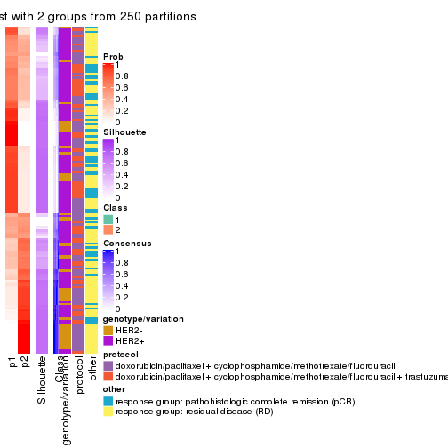</p>

</div>
<div id='tab-CV-mclust-consensus-heatmap-2'>
<pre><code class="r">consensus_heatmap(res, k = 3)
</code></pre>

<p>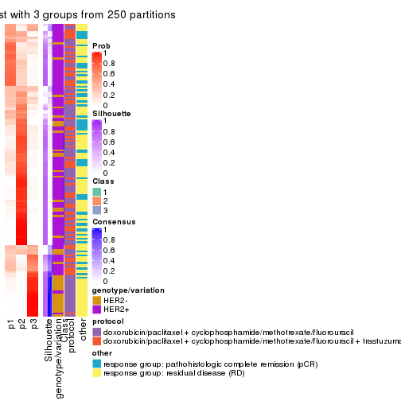</p>

</div>
<div id='tab-CV-mclust-consensus-heatmap-3'>
<pre><code class="r">consensus_heatmap(res, k = 4)
</code></pre>

<p>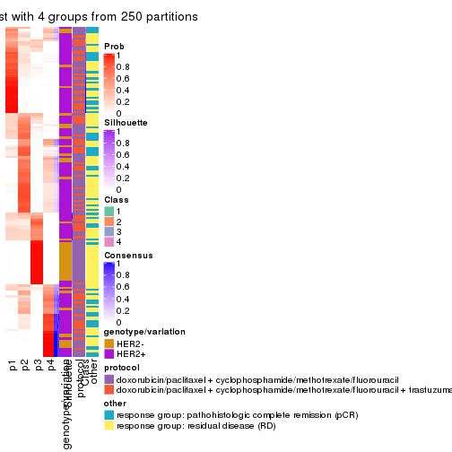</p>

</div>
<div id='tab-CV-mclust-consensus-heatmap-4'>
<pre><code class="r">consensus_heatmap(res, k = 5)
</code></pre>

<p>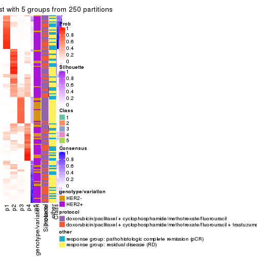</p>

</div>
<div id='tab-CV-mclust-consensus-heatmap-5'>
<pre><code class="r">consensus_heatmap(res, k = 6)
</code></pre>

<p>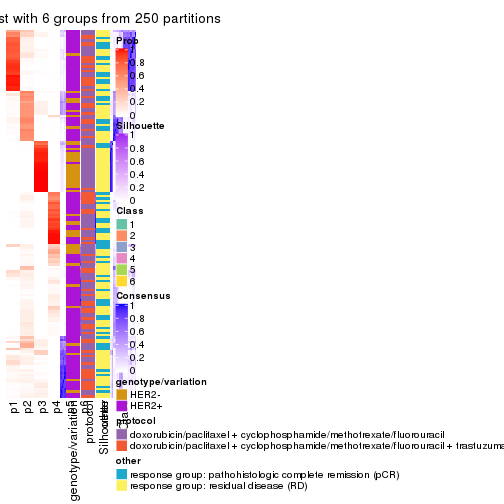</p>

</div>
</div>

Heatmaps for the membership of samples in all partitions to see how consistent they are:


<script>
$( function() {
	$( '#tabs-CV-mclust-membership-heatmap' ).tabs();
} );
</script>
<div id='tabs-CV-mclust-membership-heatmap'>
<ul>
<li><a href='#tab-CV-mclust-membership-heatmap-1'>k = 2</a></li>
<li><a href='#tab-CV-mclust-membership-heatmap-2'>k = 3</a></li>
<li><a href='#tab-CV-mclust-membership-heatmap-3'>k = 4</a></li>
<li><a href='#tab-CV-mclust-membership-heatmap-4'>k = 5</a></li>
<li><a href='#tab-CV-mclust-membership-heatmap-5'>k = 6</a></li>
</ul>
<div id='tab-CV-mclust-membership-heatmap-1'>
<pre><code class="r">membership_heatmap(res, k = 2)
</code></pre>

<p>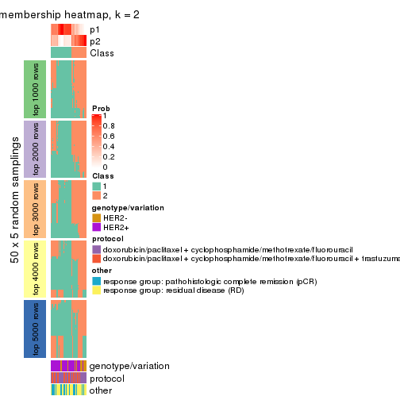</p>

</div>
<div id='tab-CV-mclust-membership-heatmap-2'>
<pre><code class="r">membership_heatmap(res, k = 3)
</code></pre>

<p>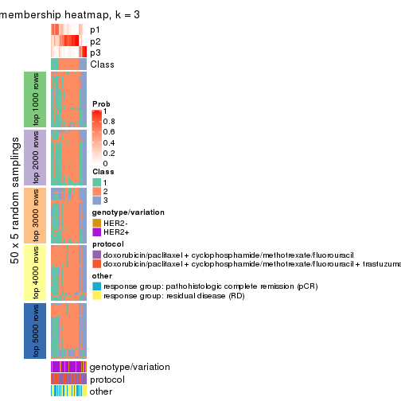</p>

</div>
<div id='tab-CV-mclust-membership-heatmap-3'>
<pre><code class="r">membership_heatmap(res, k = 4)
</code></pre>

<p>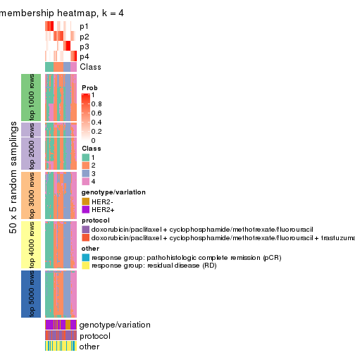</p>

</div>
<div id='tab-CV-mclust-membership-heatmap-4'>
<pre><code class="r">membership_heatmap(res, k = 5)
</code></pre>

<p>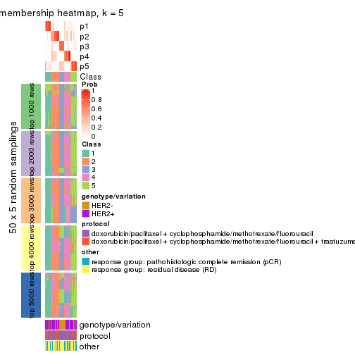</p>

</div>
<div id='tab-CV-mclust-membership-heatmap-5'>
<pre><code class="r">membership_heatmap(res, k = 6)
</code></pre>

<p>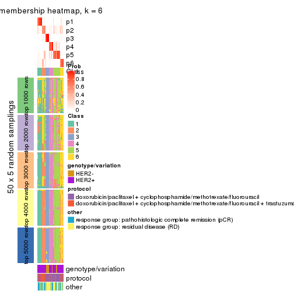</p>

</div>
</div>

As soon as we have had the classes for columns, we can look for signatures
which are significantly different between classes which can be candidate marks
for certain classes. Following are the heatmaps for signatures.


Signature heatmaps where rows are scaled:


<script>
$( function() {
	$( '#tabs-CV-mclust-get-signatures' ).tabs();
} );
</script>
<div id='tabs-CV-mclust-get-signatures'>
<ul>
<li><a href='#tab-CV-mclust-get-signatures-1'>k = 2</a></li>
<li><a href='#tab-CV-mclust-get-signatures-2'>k = 3</a></li>
<li><a href='#tab-CV-mclust-get-signatures-3'>k = 4</a></li>
<li><a href='#tab-CV-mclust-get-signatures-4'>k = 5</a></li>
<li><a href='#tab-CV-mclust-get-signatures-5'>k = 6</a></li>
</ul>
<div id='tab-CV-mclust-get-signatures-1'>
<pre><code class="r">get_signatures(res, k = 2)
</code></pre>

<pre><code>#&gt; Error: The width or height of the raster image is zero, maybe you forget to turn off the
#&gt; previous graphic device or it was corrupted. Run `dev.off()` to close it.
</code></pre>

<p></p>

</div>
<div id='tab-CV-mclust-get-signatures-2'>
<pre><code class="r">get_signatures(res, k = 3)
</code></pre>

<pre><code>#&gt; Error: The width or height of the raster image is zero, maybe you forget to turn off the
#&gt; previous graphic device or it was corrupted. Run `dev.off()` to close it.
</code></pre>

<p></p>

</div>
<div id='tab-CV-mclust-get-signatures-3'>
<pre><code class="r">get_signatures(res, k = 4)
</code></pre>

<pre><code>#&gt; Error: The width or height of the raster image is zero, maybe you forget to turn off the
#&gt; previous graphic device or it was corrupted. Run `dev.off()` to close it.
</code></pre>

<p></p>

</div>
<div id='tab-CV-mclust-get-signatures-4'>
<pre><code class="r">get_signatures(res, k = 5)
</code></pre>

<pre><code>#&gt; Error: The width or height of the raster image is zero, maybe you forget to turn off the
#&gt; previous graphic device or it was corrupted. Run `dev.off()` to close it.
</code></pre>

<p></p>

</div>
<div id='tab-CV-mclust-get-signatures-5'>
<pre><code class="r">get_signatures(res, k = 6)
</code></pre>

<pre><code>#&gt; Error: The width or height of the raster image is zero, maybe you forget to turn off the
#&gt; previous graphic device or it was corrupted. Run `dev.off()` to close it.
</code></pre>

<p></p>

</div>
</div>


Signature heatmaps where rows are not scaled:


<script>
$( function() {
	$( '#tabs-CV-mclust-get-signatures-no-scale' ).tabs();
} );
</script>
<div id='tabs-CV-mclust-get-signatures-no-scale'>
<ul>
<li><a href='#tab-CV-mclust-get-signatures-no-scale-1'>k = 2</a></li>
<li><a href='#tab-CV-mclust-get-signatures-no-scale-2'>k = 3</a></li>
<li><a href='#tab-CV-mclust-get-signatures-no-scale-3'>k = 4</a></li>
<li><a href='#tab-CV-mclust-get-signatures-no-scale-4'>k = 5</a></li>
<li><a href='#tab-CV-mclust-get-signatures-no-scale-5'>k = 6</a></li>
</ul>
<div id='tab-CV-mclust-get-signatures-no-scale-1'>
<pre><code class="r">get_signatures(res, k = 2, scale_rows = FALSE)
</code></pre>

<pre><code>#&gt; Error: The width or height of the raster image is zero, maybe you forget to turn off the
#&gt; previous graphic device or it was corrupted. Run `dev.off()` to close it.
</code></pre>

<p></p>

</div>
<div id='tab-CV-mclust-get-signatures-no-scale-2'>
<pre><code class="r">get_signatures(res, k = 3, scale_rows = FALSE)
</code></pre>

<pre><code>#&gt; Error: The width or height of the raster image is zero, maybe you forget to turn off the
#&gt; previous graphic device or it was corrupted. Run `dev.off()` to close it.
</code></pre>

<p></p>

</div>
<div id='tab-CV-mclust-get-signatures-no-scale-3'>
<pre><code class="r">get_signatures(res, k = 4, scale_rows = FALSE)
</code></pre>

<pre><code>#&gt; Error: The width or height of the raster image is zero, maybe you forget to turn off the
#&gt; previous graphic device or it was corrupted. Run `dev.off()` to close it.
</code></pre>

<p></p>

</div>
<div id='tab-CV-mclust-get-signatures-no-scale-4'>
<pre><code class="r">get_signatures(res, k = 5, scale_rows = FALSE)
</code></pre>

<pre><code>#&gt; Error: The width or height of the raster image is zero, maybe you forget to turn off the
#&gt; previous graphic device or it was corrupted. Run `dev.off()` to close it.
</code></pre>

<p></p>

</div>
<div id='tab-CV-mclust-get-signatures-no-scale-5'>
<pre><code class="r">get_signatures(res, k = 6, scale_rows = FALSE)
</code></pre>

<pre><code>#&gt; Error: The width or height of the raster image is zero, maybe you forget to turn off the
#&gt; previous graphic device or it was corrupted. Run `dev.off()` to close it.
</code></pre>

<p></p>

</div>
</div>


Compare the overlap of signatures from different k:

```r
compare_signatures(res)
```

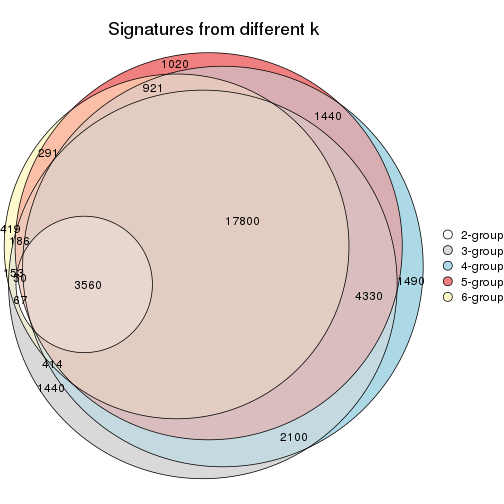

`get_signature()` returns a data frame invisibly. TO get the list of signatures, the function
call should be assigned to a variable explicitly. In following code, if `plot` argument is set
to `FALSE`, no heatmap is plotted while only the differential analysis is performed.

```r
# code only for demonstration
tb = get_signature(res, k = ..., plot = FALSE)
```

An example of the output of `tb` is:

```
#>   which_row         fdr    mean_1    mean_2 scaled_mean_1 scaled_mean_2 km
#> 1        38 0.042760348  8.373488  9.131774    -0.5533452     0.5164555  1
#> 2        40 0.018707592  7.106213  8.469186    -0.6173731     0.5762149  1
#> 3        55 0.019134737 10.221463 11.207825    -0.6159697     0.5749050  1
#> 4        59 0.006059896  5.921854  7.869574    -0.6899429     0.6439467  1
#> 5        60 0.018055526  8.928898 10.211722    -0.6204761     0.5791110  1
#> 6        98 0.009384629 15.714769 14.887706     0.6635654    -0.6193277  2
...
```

The columns in `tb` are:

1. `which_row`: row indices corresponding to the input matrix.
2. `fdr`: FDR for the differential test. 
3. `mean_x`: The mean value in group x.
4. `scaled_mean_x`: The mean value in group x after rows are scaled.
5. `km`: Row groups if k-means clustering is applied to rows.


UMAP plot which shows how samples are separated.


<script>
$( function() {
	$( '#tabs-CV-mclust-dimension-reduction' ).tabs();
} );
</script>
<div id='tabs-CV-mclust-dimension-reduction'>
<ul>
<li><a href='#tab-CV-mclust-dimension-reduction-1'>k = 2</a></li>
<li><a href='#tab-CV-mclust-dimension-reduction-2'>k = 3</a></li>
<li><a href='#tab-CV-mclust-dimension-reduction-3'>k = 4</a></li>
<li><a href='#tab-CV-mclust-dimension-reduction-4'>k = 5</a></li>
<li><a href='#tab-CV-mclust-dimension-reduction-5'>k = 6</a></li>
</ul>
<div id='tab-CV-mclust-dimension-reduction-1'>
<pre><code class="r">dimension_reduction(res, k = 2, method = &quot;UMAP&quot;)
</code></pre>

<p>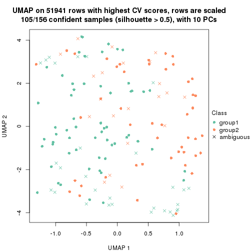</p>

</div>
<div id='tab-CV-mclust-dimension-reduction-2'>
<pre><code class="r">dimension_reduction(res, k = 3, method = &quot;UMAP&quot;)
</code></pre>

<p>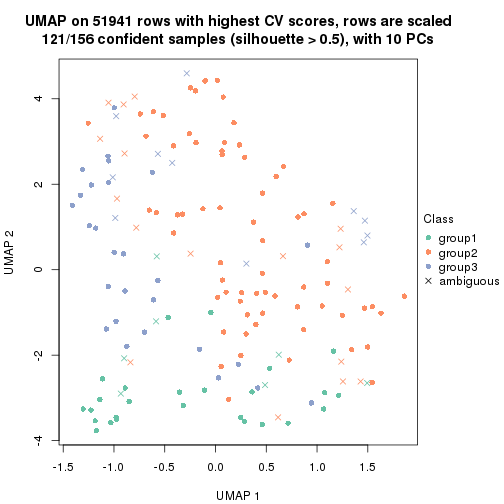</p>

</div>
<div id='tab-CV-mclust-dimension-reduction-3'>
<pre><code class="r">dimension_reduction(res, k = 4, method = &quot;UMAP&quot;)
</code></pre>

<p>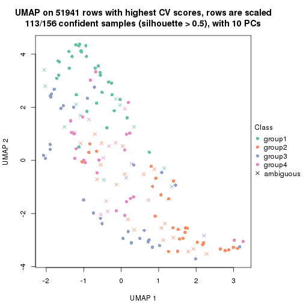</p>

</div>
<div id='tab-CV-mclust-dimension-reduction-4'>
<pre><code class="r">dimension_reduction(res, k = 5, method = &quot;UMAP&quot;)
</code></pre>

<p>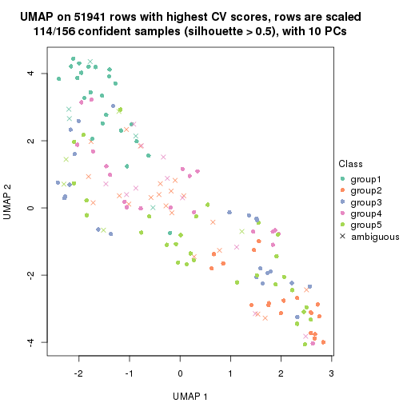</p>

</div>
<div id='tab-CV-mclust-dimension-reduction-5'>
<pre><code class="r">dimension_reduction(res, k = 6, method = &quot;UMAP&quot;)
</code></pre>

<p>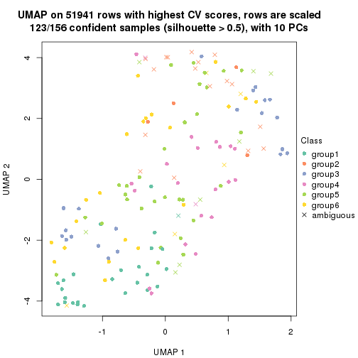</p>

</div>
</div>


Following heatmap shows how subgroups are split when increasing `k`:

```r
collect_classes(res)
```

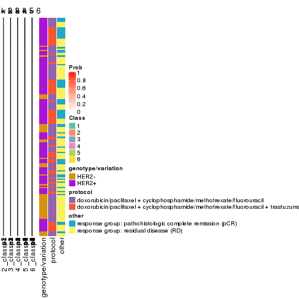


Test correlation between subgroups and known annotations. If the known
annotation is numeric, one-way ANOVA test is applied, and if the known
annotation is discrete, chi-squared contingency table test is applied.

```r
test_to_known_factors(res)
```

```
#>             n genotype/variation(p) protocol(p) other(p) k
#> CV:mclust 105              5.30e-03     0.37938   0.0184 2
#> CV:mclust 121              2.31e-07     0.04441   0.0226 3
#> CV:mclust 113              3.13e-06     0.11565   0.0458 4
#> CV:mclust 114              7.10e-09     0.00868   0.0341 5
#> CV:mclust 123              3.80e-09     0.00910   0.0338 6
```


If matrix rows can be associated to genes, consider to use `functional_enrichment(res,
...)` to perform function enrichment for the signature genes. See [this vignette](http://bioconductor.org/packages/devel/bioc/vignettes/cola/inst/doc/functional_enrichment.html) for more detailed explanations.


 

---------------------------------------------------


### CV:NMF*


The object with results only for a single top-value method and a single partition method 
can be extracted as:

```r
res = res_list["CV", "NMF"]
# you can also extract it by
# res = res_list["CV:NMF"]
```

A summary of `res` and all the functions that can be applied to it:

```r
res
```

```
#> A 'ConsensusPartition' object with k = 2, 3, 4, 5, 6.
#>   On a matrix with 51941 rows and 156 columns.
#>   Top rows (1000, 2000, 3000, 4000, 5000) are extracted by 'CV' method.
#>   Subgroups are detected by 'NMF' method.
#>   Performed in total 1250 partitions by row resampling.
#>   Best k for subgroups seems to be 2.
#> 
#> Following methods can be applied to this 'ConsensusPartition' object:
#>  [1] "cola_report"             "collect_classes"         "collect_plots"          
#>  [4] "collect_stats"           "colnames"                "compare_signatures"     
#>  [7] "consensus_heatmap"       "dimension_reduction"     "functional_enrichment"  
#> [10] "get_anno_col"            "get_anno"                "get_classes"            
#> [13] "get_consensus"           "get_matrix"              "get_membership"         
#> [16] "get_param"               "get_signatures"          "get_stats"              
#> [19] "is_best_k"               "is_stable_k"             "membership_heatmap"     
#> [22] "ncol"                    "nrow"                    "plot_ecdf"              
#> [25] "rownames"                "select_partition_number" "show"                   
#> [28] "suggest_best_k"          "test_to_known_factors"
```

`collect_plots()` function collects all the plots made from `res` for all `k` (number of partitions)
into one single page to provide an easy and fast comparison between different `k`.

```r
collect_plots(res)
```

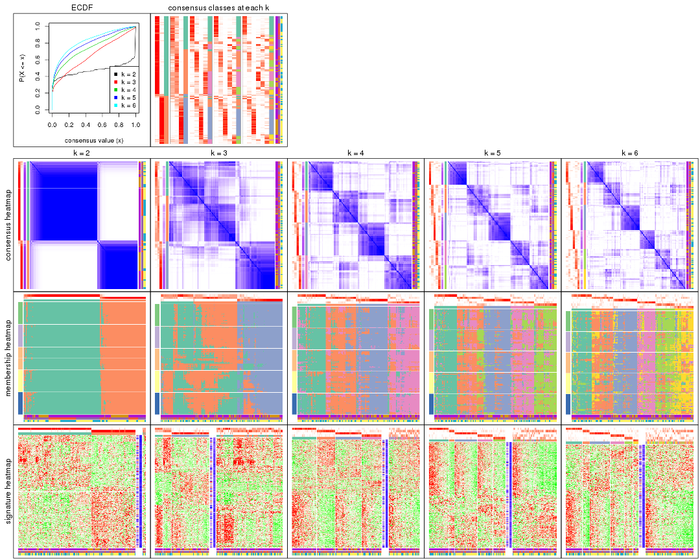

The plots are:

- The first row: a plot of the ECDF (empirical cumulative distribution
  function) curves of the consensus matrix for each `k` and the heatmap of
  predicted classes for each `k`.
- The second row: heatmaps of the consensus matrix for each `k`.
- The third row: heatmaps of the membership matrix for each `k`.
- The fouth row: heatmaps of the signatures for each `k`.

All the plots in panels can be made by individual functions and they are
plotted later in this section.

`select_partition_number()` produces several plots showing different
statistics for choosing "optimized" `k`. There are following statistics:

- ECDF curves of the consensus matrix for each `k`;
- 1-PAC. [The PAC
  score](https://en.wikipedia.org/wiki/Consensus_clustering#Over-interpretation_potential_of_consensus_clustering)
  measures the proportion of the ambiguous subgrouping.
- Mean silhouette score.
- Concordance. The mean probability of fiting the consensus class ids in all
  partitions.
- Area increased. Denote $A_k$ as the area under the ECDF curve for current
  `k`, the area increased is defined as $A_k - A_{k-1}$.
- Rand index. The percent of pairs of samples that are both in a same cluster
  or both are not in a same cluster in the partition of k and k-1.
- Jaccard index. The ratio of pairs of samples are both in a same cluster in
  the partition of k and k-1 and the pairs of samples are both in a same
  cluster in the partition k or k-1.

The detailed explanations of these statistics can be found in [the _cola_
vignette](http://bioconductor.org/packages/devel/bioc/vignettes/cola/inst/doc/cola.html#toc_13).

Generally speaking, lower PAC score, higher mean silhouette score or higher
concordance corresponds to better partition. Rand index and Jaccard index
measure how similar the current partition is compared to partition with `k-1`.
If they are too similar, we won't accept `k` is better than `k-1`.

```r
select_partition_number(res)
```

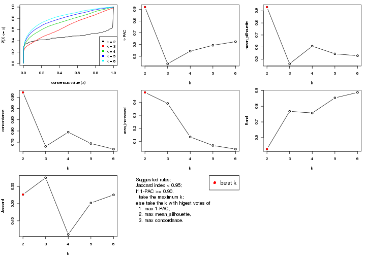

The numeric values for all these statistics can be obtained by `get_stats()`.

```r
get_stats(res)
```

```
#>   k 1-PAC mean_silhouette concordance area_increased  Rand Jaccard
#> 2 2 0.919           0.932       0.971         0.4753 0.527   0.527
#> 3 3 0.437           0.461       0.731         0.3912 0.768   0.576
#> 4 4 0.544           0.607       0.795         0.1336 0.757   0.410
#> 5 5 0.594           0.544       0.744         0.0684 0.854   0.502
#> 6 6 0.625           0.528       0.720         0.0407 0.888   0.526
```

`suggest_best_k()` suggests the best $k$ based on these statistics. The rules are as follows:

- All $k$ with Jaccard index larger than 0.95 are removed because increasing
  $k$ does not provide enough extra information. If all $k$ are removed, it is
  marked as no subgroup is detected.
- For all $k$ with 1-PAC score larger than 0.9, the maximal $k$ is taken as
  the best $k$, and other $k$ are marked as optional $k$.
- If it does not fit the second rule. The $k$ with the maximal vote of the
  highest 1-PAC score, highest mean silhouette, and highest concordance is
  taken as the best $k$.

```r
suggest_best_k(res)
```

```
#> [1] 2
```


Following shows the table of the partitions (You need to click the **show/hide
code output** link to see it). The membership matrix (columns with name `p*`)
is inferred by
[`clue::cl_consensus()`](https://www.rdocumentation.org/link/cl_consensus?package=clue)
function with the `SE` method. Basically the value in the membership matrix
represents the probability to belong to a certain group. The finall class
label for an item is determined with the group with highest probability it
belongs to.

In `get_classes()` function, the entropy is calculated from the membership
matrix and the silhouette score is calculated from the consensus matrix.


<script>
$( function() {
	$( '#tabs-CV-NMF-get-classes' ).tabs();
} );
</script>
<div id='tabs-CV-NMF-get-classes'>
<ul>
<li><a href='#tab-CV-NMF-get-classes-1'>k = 2</a></li>
<li><a href='#tab-CV-NMF-get-classes-2'>k = 3</a></li>
<li><a href='#tab-CV-NMF-get-classes-3'>k = 4</a></li>
<li><a href='#tab-CV-NMF-get-classes-4'>k = 5</a></li>
<li><a href='#tab-CV-NMF-get-classes-5'>k = 6</a></li>
</ul>

<div id='tab-CV-NMF-get-classes-1'>
<p><a id='tab-CV-NMF-get-classes-1-a' style='color:#0366d6' href='#'>show/hide code output</a></p>
<pre><code class="r">cbind(get_classes(res, k = 2), get_membership(res, k = 2))
</code></pre>

<pre><code>#&gt;            class entropy silhouette    p1    p2
#&gt; GSM1232995     2  0.0000     0.9661 0.000 1.000
#&gt; GSM1233002     1  0.0000     0.9720 1.000 0.000
#&gt; GSM1233003     1  0.0376     0.9691 0.996 0.004
#&gt; GSM1233014     1  0.0000     0.9720 1.000 0.000
#&gt; GSM1233015     1  0.0000     0.9720 1.000 0.000
#&gt; GSM1233016     1  0.0000     0.9720 1.000 0.000
#&gt; GSM1233024     1  0.0000     0.9720 1.000 0.000
#&gt; GSM1233049     2  0.0000     0.9661 0.000 1.000
#&gt; GSM1233064     2  0.1633     0.9484 0.024 0.976
#&gt; GSM1233068     1  0.0000     0.9720 1.000 0.000
#&gt; GSM1233073     1  0.0000     0.9720 1.000 0.000
#&gt; GSM1233093     1  0.0000     0.9720 1.000 0.000
#&gt; GSM1233115     1  0.0000     0.9720 1.000 0.000
#&gt; GSM1232992     1  0.0000     0.9720 1.000 0.000
#&gt; GSM1232993     1  0.0000     0.9720 1.000 0.000
#&gt; GSM1233005     1  0.0000     0.9720 1.000 0.000
#&gt; GSM1233007     1  0.0000     0.9720 1.000 0.000
#&gt; GSM1233010     1  0.0000     0.9720 1.000 0.000
#&gt; GSM1233013     1  0.1184     0.9601 0.984 0.016
#&gt; GSM1233018     1  0.0672     0.9662 0.992 0.008
#&gt; GSM1233019     1  0.0000     0.9720 1.000 0.000
#&gt; GSM1233021     1  0.0000     0.9720 1.000 0.000
#&gt; GSM1233025     1  0.0000     0.9720 1.000 0.000
#&gt; GSM1233029     1  0.0000     0.9720 1.000 0.000
#&gt; GSM1233030     1  0.0000     0.9720 1.000 0.000
#&gt; GSM1233031     1  0.0000     0.9720 1.000 0.000
#&gt; GSM1233032     2  0.0000     0.9661 0.000 1.000
#&gt; GSM1233035     1  0.0000     0.9720 1.000 0.000
#&gt; GSM1233038     1  0.0000     0.9720 1.000 0.000
#&gt; GSM1233039     1  0.6623     0.7937 0.828 0.172
#&gt; GSM1233042     1  0.0000     0.9720 1.000 0.000
#&gt; GSM1233043     1  0.0000     0.9720 1.000 0.000
#&gt; GSM1233044     1  0.8081     0.6761 0.752 0.248
#&gt; GSM1233046     1  0.0000     0.9720 1.000 0.000
#&gt; GSM1233051     1  0.4161     0.8993 0.916 0.084
#&gt; GSM1233054     2  0.0000     0.9661 0.000 1.000
#&gt; GSM1233057     2  0.0000     0.9661 0.000 1.000
#&gt; GSM1233060     1  0.0000     0.9720 1.000 0.000
#&gt; GSM1233062     1  0.0000     0.9720 1.000 0.000
#&gt; GSM1233075     2  0.0000     0.9661 0.000 1.000
#&gt; GSM1233078     2  0.0000     0.9661 0.000 1.000
#&gt; GSM1233079     2  0.0000     0.9661 0.000 1.000
#&gt; GSM1233082     1  0.0000     0.9720 1.000 0.000
#&gt; GSM1233083     2  0.8909     0.5677 0.308 0.692
#&gt; GSM1233091     1  0.8267     0.6586 0.740 0.260
#&gt; GSM1233095     1  0.3879     0.9065 0.924 0.076
#&gt; GSM1233096     1  0.0000     0.9720 1.000 0.000
#&gt; GSM1233101     2  0.0938     0.9583 0.012 0.988
#&gt; GSM1233105     1  0.0000     0.9720 1.000 0.000
#&gt; GSM1233117     2  0.0000     0.9661 0.000 1.000
#&gt; GSM1233118     2  0.0000     0.9661 0.000 1.000
#&gt; GSM1233001     2  0.1414     0.9516 0.020 0.980
#&gt; GSM1233006     1  0.0000     0.9720 1.000 0.000
#&gt; GSM1233008     1  0.2778     0.9336 0.952 0.048
#&gt; GSM1233009     1  0.0000     0.9720 1.000 0.000
#&gt; GSM1233017     1  0.0000     0.9720 1.000 0.000
#&gt; GSM1233020     2  0.5294     0.8506 0.120 0.880
#&gt; GSM1233022     1  0.0000     0.9720 1.000 0.000
#&gt; GSM1233026     1  0.0000     0.9720 1.000 0.000
#&gt; GSM1233028     1  0.0000     0.9720 1.000 0.000
#&gt; GSM1233034     1  0.4298     0.8951 0.912 0.088
#&gt; GSM1233040     1  0.6343     0.8108 0.840 0.160
#&gt; GSM1233048     1  0.0000     0.9720 1.000 0.000
#&gt; GSM1233056     2  0.9944     0.1773 0.456 0.544
#&gt; GSM1233058     1  0.0000     0.9720 1.000 0.000
#&gt; GSM1233059     1  0.0000     0.9720 1.000 0.000
#&gt; GSM1233066     2  0.0000     0.9661 0.000 1.000
#&gt; GSM1233071     1  0.0000     0.9720 1.000 0.000
#&gt; GSM1233074     2  0.0000     0.9661 0.000 1.000
#&gt; GSM1233076     2  0.6148     0.8158 0.152 0.848
#&gt; GSM1233080     1  0.0000     0.9720 1.000 0.000
#&gt; GSM1233088     2  0.8813     0.5691 0.300 0.700
#&gt; GSM1233090     1  0.5178     0.8648 0.884 0.116
#&gt; GSM1233092     1  0.0000     0.9720 1.000 0.000
#&gt; GSM1233094     1  0.0000     0.9720 1.000 0.000
#&gt; GSM1233097     1  0.0000     0.9720 1.000 0.000
#&gt; GSM1233100     1  0.0000     0.9720 1.000 0.000
#&gt; GSM1233104     1  0.0000     0.9720 1.000 0.000
#&gt; GSM1233106     1  0.0000     0.9720 1.000 0.000
#&gt; GSM1233111     1  0.0000     0.9720 1.000 0.000
#&gt; GSM1233122     1  0.0000     0.9720 1.000 0.000
#&gt; GSM1233146     1  0.0000     0.9720 1.000 0.000
#&gt; GSM1232994     1  0.0000     0.9720 1.000 0.000
#&gt; GSM1232996     1  0.0376     0.9691 0.996 0.004
#&gt; GSM1232997     2  0.0000     0.9661 0.000 1.000
#&gt; GSM1232998     1  0.0000     0.9720 1.000 0.000
#&gt; GSM1232999     1  0.0000     0.9720 1.000 0.000
#&gt; GSM1233000     1  0.0000     0.9720 1.000 0.000
#&gt; GSM1233004     2  0.0376     0.9635 0.004 0.996
#&gt; GSM1233011     2  0.2603     0.9320 0.044 0.956
#&gt; GSM1233012     2  0.0000     0.9661 0.000 1.000
#&gt; GSM1233023     2  0.0376     0.9635 0.004 0.996
#&gt; GSM1233027     1  0.0000     0.9720 1.000 0.000
#&gt; GSM1233033     1  0.0000     0.9720 1.000 0.000
#&gt; GSM1233036     2  0.0000     0.9661 0.000 1.000
#&gt; GSM1233037     2  0.9522     0.4024 0.372 0.628
#&gt; GSM1233041     1  0.0000     0.9720 1.000 0.000
#&gt; GSM1233045     1  0.0000     0.9720 1.000 0.000
#&gt; GSM1233047     2  0.0000     0.9661 0.000 1.000
#&gt; GSM1233050     1  0.8955     0.5585 0.688 0.312
#&gt; GSM1233052     1  0.0000     0.9720 1.000 0.000
#&gt; GSM1233053     2  0.0000     0.9661 0.000 1.000
#&gt; GSM1233055     1  0.0000     0.9720 1.000 0.000
#&gt; GSM1233061     2  0.0000     0.9661 0.000 1.000
#&gt; GSM1233063     1  0.0000     0.9720 1.000 0.000
#&gt; GSM1233065     2  0.0000     0.9661 0.000 1.000
#&gt; GSM1233070     1  0.0000     0.9720 1.000 0.000
#&gt; GSM1233077     2  0.0000     0.9661 0.000 1.000
#&gt; GSM1233081     2  0.0000     0.9661 0.000 1.000
#&gt; GSM1233084     1  0.0000     0.9720 1.000 0.000
#&gt; GSM1233087     1  0.0000     0.9720 1.000 0.000
#&gt; GSM1233089     2  0.0000     0.9661 0.000 1.000
#&gt; GSM1233099     1  0.0000     0.9720 1.000 0.000
#&gt; GSM1233112     2  0.1414     0.9520 0.020 0.980
#&gt; GSM1233085     2  0.0000     0.9661 0.000 1.000
#&gt; GSM1233098     1  1.0000    -0.0104 0.500 0.500
#&gt; GSM1233114     1  0.0000     0.9720 1.000 0.000
#&gt; GSM1233119     1  0.0000     0.9720 1.000 0.000
#&gt; GSM1233129     2  0.0000     0.9661 0.000 1.000
#&gt; GSM1233132     1  0.0000     0.9720 1.000 0.000
#&gt; GSM1233139     1  0.2948     0.9305 0.948 0.052
#&gt; GSM1233143     2  0.0000     0.9661 0.000 1.000
#&gt; GSM1233145     1  0.0000     0.9720 1.000 0.000
#&gt; GSM1233067     2  0.0000     0.9661 0.000 1.000
#&gt; GSM1233069     2  0.0000     0.9661 0.000 1.000
#&gt; GSM1233072     1  0.1414     0.9572 0.980 0.020
#&gt; GSM1233086     2  0.0000     0.9661 0.000 1.000
#&gt; GSM1233102     1  0.0000     0.9720 1.000 0.000
#&gt; GSM1233103     1  0.0000     0.9720 1.000 0.000
#&gt; GSM1233107     1  0.0000     0.9720 1.000 0.000
#&gt; GSM1233108     2  0.0000     0.9661 0.000 1.000
#&gt; GSM1233109     2  0.0000     0.9661 0.000 1.000
#&gt; GSM1233110     2  0.0000     0.9661 0.000 1.000
#&gt; GSM1233113     2  0.0000     0.9661 0.000 1.000
#&gt; GSM1233116     2  0.0000     0.9661 0.000 1.000
#&gt; GSM1233120     1  0.0000     0.9720 1.000 0.000
#&gt; GSM1233121     2  0.0000     0.9661 0.000 1.000
#&gt; GSM1233123     2  0.0000     0.9661 0.000 1.000
#&gt; GSM1233124     2  0.0000     0.9661 0.000 1.000
#&gt; GSM1233125     2  0.0000     0.9661 0.000 1.000
#&gt; GSM1233126     1  0.0000     0.9720 1.000 0.000
#&gt; GSM1233127     1  0.0000     0.9720 1.000 0.000
#&gt; GSM1233128     1  0.9491     0.4072 0.632 0.368
#&gt; GSM1233130     2  0.0000     0.9661 0.000 1.000
#&gt; GSM1233131     1  0.0000     0.9720 1.000 0.000
#&gt; GSM1233133     2  0.0000     0.9661 0.000 1.000
#&gt; GSM1233134     2  0.0000     0.9661 0.000 1.000
#&gt; GSM1233135     2  0.0000     0.9661 0.000 1.000
#&gt; GSM1233136     2  0.0000     0.9661 0.000 1.000
#&gt; GSM1233137     2  0.0000     0.9661 0.000 1.000
#&gt; GSM1233138     1  0.0000     0.9720 1.000 0.000
#&gt; GSM1233140     2  0.0000     0.9661 0.000 1.000
#&gt; GSM1233141     1  0.3274     0.9236 0.940 0.060
#&gt; GSM1233142     1  0.0000     0.9720 1.000 0.000
#&gt; GSM1233144     2  0.0000     0.9661 0.000 1.000
#&gt; GSM1233147     2  0.3114     0.9202 0.056 0.944
</code></pre>

<script>
$('#tab-CV-NMF-get-classes-1-a').parent().next().next().hide();
$('#tab-CV-NMF-get-classes-1-a').click(function(){
  $('#tab-CV-NMF-get-classes-1-a').parent().next().next().toggle();
  return(false);
});
</script>
</div>

<div id='tab-CV-NMF-get-classes-2'>
<p><a id='tab-CV-NMF-get-classes-2-a' style='color:#0366d6' href='#'>show/hide code output</a></p>
<pre><code class="r">cbind(get_classes(res, k = 3), get_membership(res, k = 3))
</code></pre>

<pre><code>#&gt;            class entropy silhouette    p1    p2    p3
#&gt; GSM1232995     3  0.6451     0.4802 0.004 0.436 0.560
#&gt; GSM1233002     1  0.5810     0.2693 0.664 0.336 0.000
#&gt; GSM1233003     1  0.7114    -0.3447 0.584 0.388 0.028
#&gt; GSM1233014     2  0.6192     0.4947 0.420 0.580 0.000
#&gt; GSM1233015     1  0.6267     0.4854 0.548 0.452 0.000
#&gt; GSM1233016     2  0.6305     0.4541 0.484 0.516 0.000
#&gt; GSM1233024     2  0.4062     0.4115 0.164 0.836 0.000
#&gt; GSM1233049     3  0.0000     0.8315 0.000 0.000 1.000
#&gt; GSM1233064     3  0.4526     0.7928 0.040 0.104 0.856
#&gt; GSM1233068     1  0.6095     0.5063 0.608 0.392 0.000
#&gt; GSM1233073     2  0.6225     0.4892 0.432 0.568 0.000
#&gt; GSM1233093     1  0.0747     0.4202 0.984 0.016 0.000
#&gt; GSM1233115     1  0.1031     0.4134 0.976 0.024 0.000
#&gt; GSM1232992     1  0.6308     0.4571 0.508 0.492 0.000
#&gt; GSM1232993     1  0.6267     0.4757 0.548 0.452 0.000
#&gt; GSM1233005     2  0.3752     0.3215 0.144 0.856 0.000
#&gt; GSM1233007     1  0.5517    -0.0906 0.728 0.268 0.004
#&gt; GSM1233010     1  0.4750     0.2757 0.784 0.216 0.000
#&gt; GSM1233013     2  0.6267    -0.4273 0.452 0.548 0.000
#&gt; GSM1233018     2  0.6274    -0.4320 0.456 0.544 0.000
#&gt; GSM1233019     2  0.2959     0.4179 0.100 0.900 0.000
#&gt; GSM1233021     2  0.5785    -0.1913 0.332 0.668 0.000
#&gt; GSM1233025     2  0.6309     0.4389 0.500 0.500 0.000
#&gt; GSM1233029     1  0.6204     0.4858 0.576 0.424 0.000
#&gt; GSM1233030     1  0.6309     0.4556 0.504 0.496 0.000
#&gt; GSM1233031     2  0.5948     0.3005 0.360 0.640 0.000
#&gt; GSM1233032     3  0.9305     0.0966 0.380 0.164 0.456
#&gt; GSM1233035     2  0.6302    -0.3863 0.480 0.520 0.000
#&gt; GSM1233038     1  0.6309    -0.4582 0.504 0.496 0.000
#&gt; GSM1233039     1  0.7975     0.4804 0.660 0.180 0.160
#&gt; GSM1233042     2  0.6295     0.4743 0.472 0.528 0.000
#&gt; GSM1233043     2  0.6180     0.5032 0.416 0.584 0.000
#&gt; GSM1233044     2  0.6962     0.4678 0.184 0.724 0.092
#&gt; GSM1233046     2  0.4842     0.3409 0.224 0.776 0.000
#&gt; GSM1233051     1  0.4662     0.4409 0.844 0.032 0.124
#&gt; GSM1233054     3  0.7941     0.5805 0.096 0.276 0.628
#&gt; GSM1233057     3  0.7567     0.5026 0.048 0.376 0.576
#&gt; GSM1233060     1  0.5810     0.5121 0.664 0.336 0.000
#&gt; GSM1233062     2  0.6260    -0.2899 0.448 0.552 0.000
#&gt; GSM1233075     3  0.2066     0.8223 0.000 0.060 0.940
#&gt; GSM1233078     3  0.0000     0.8315 0.000 0.000 1.000
#&gt; GSM1233079     3  0.0592     0.8294 0.012 0.000 0.988
#&gt; GSM1233082     1  0.5327     0.5211 0.728 0.272 0.000
#&gt; GSM1233083     3  0.9813     0.0607 0.316 0.260 0.424
#&gt; GSM1233091     1  0.6672     0.4729 0.520 0.472 0.008
#&gt; GSM1233095     1  0.3618     0.3840 0.884 0.012 0.104
#&gt; GSM1233096     1  0.5859     0.5274 0.656 0.344 0.000
#&gt; GSM1233101     3  0.1753     0.8181 0.048 0.000 0.952
#&gt; GSM1233105     1  0.3619     0.3367 0.864 0.136 0.000
#&gt; GSM1233117     3  0.6274     0.4611 0.000 0.456 0.544
#&gt; GSM1233118     3  0.2165     0.8219 0.000 0.064 0.936
#&gt; GSM1233001     3  0.9692     0.1743 0.224 0.344 0.432
#&gt; GSM1233006     2  0.6111     0.5078 0.396 0.604 0.000
#&gt; GSM1233008     2  0.4121     0.1693 0.168 0.832 0.000
#&gt; GSM1233009     2  0.6235    -0.4000 0.436 0.564 0.000
#&gt; GSM1233017     2  0.3116     0.3635 0.108 0.892 0.000
#&gt; GSM1233020     2  0.6527    -0.1917 0.008 0.588 0.404
#&gt; GSM1233022     2  0.4555     0.4997 0.200 0.800 0.000
#&gt; GSM1233026     1  0.4452     0.4390 0.808 0.192 0.000
#&gt; GSM1233028     2  0.3686     0.3893 0.140 0.860 0.000
#&gt; GSM1233034     1  0.6518     0.4659 0.512 0.484 0.004
#&gt; GSM1233040     1  0.6664     0.4789 0.528 0.464 0.008
#&gt; GSM1233048     1  0.5760     0.5246 0.672 0.328 0.000
#&gt; GSM1233056     3  0.9353     0.1476 0.388 0.168 0.444
#&gt; GSM1233058     2  0.6215     0.4996 0.428 0.572 0.000
#&gt; GSM1233059     1  0.4291     0.5042 0.820 0.180 0.000
#&gt; GSM1233066     3  0.0237     0.8313 0.000 0.004 0.996
#&gt; GSM1233071     1  0.6225     0.4875 0.568 0.432 0.000
#&gt; GSM1233074     3  0.3267     0.8023 0.000 0.116 0.884
#&gt; GSM1233076     3  0.8576     0.4607 0.240 0.160 0.600
#&gt; GSM1233080     1  0.0829     0.4029 0.984 0.012 0.004
#&gt; GSM1233088     1  0.9546     0.2820 0.472 0.216 0.312
#&gt; GSM1233090     1  0.6856     0.4880 0.740 0.128 0.132
#&gt; GSM1233092     2  0.6295     0.4627 0.472 0.528 0.000
#&gt; GSM1233094     2  0.5733     0.5240 0.324 0.676 0.000
#&gt; GSM1233097     2  0.5859     0.5222 0.344 0.656 0.000
#&gt; GSM1233100     1  0.5216     0.5004 0.740 0.260 0.000
#&gt; GSM1233104     2  0.5465     0.5205 0.288 0.712 0.000
#&gt; GSM1233106     1  0.5810     0.5266 0.664 0.336 0.000
#&gt; GSM1233111     1  0.5560     0.5312 0.700 0.300 0.000
#&gt; GSM1233122     2  0.2878     0.4679 0.096 0.904 0.000
#&gt; GSM1233146     2  0.6026     0.5135 0.376 0.624 0.000
#&gt; GSM1232994     2  0.3551     0.3983 0.132 0.868 0.000
#&gt; GSM1232996     2  0.2261     0.3607 0.068 0.932 0.000
#&gt; GSM1232997     3  0.4351     0.7729 0.004 0.168 0.828
#&gt; GSM1232998     2  0.5785     0.5251 0.332 0.668 0.000
#&gt; GSM1232999     2  0.4842     0.4841 0.224 0.776 0.000
#&gt; GSM1233000     2  0.6299    -0.4440 0.476 0.524 0.000
#&gt; GSM1233004     3  0.4994     0.7425 0.112 0.052 0.836
#&gt; GSM1233011     3  0.3572     0.7920 0.040 0.060 0.900
#&gt; GSM1233012     3  0.5497     0.6717 0.000 0.292 0.708
#&gt; GSM1233023     3  0.5318     0.7425 0.016 0.204 0.780
#&gt; GSM1233027     2  0.6062     0.5129 0.384 0.616 0.000
#&gt; GSM1233033     1  0.5835    -0.2408 0.660 0.340 0.000
#&gt; GSM1233036     3  0.7099     0.5206 0.028 0.384 0.588
#&gt; GSM1233037     1  0.7584     0.4466 0.488 0.472 0.040
#&gt; GSM1233041     1  0.0892     0.4238 0.980 0.020 0.000
#&gt; GSM1233045     2  0.6204     0.3075 0.424 0.576 0.000
#&gt; GSM1233047     3  0.3619     0.7934 0.000 0.136 0.864
#&gt; GSM1233050     1  0.6672     0.4729 0.520 0.472 0.008
#&gt; GSM1233052     1  0.5905     0.5107 0.648 0.352 0.000
#&gt; GSM1233053     3  0.7564     0.5922 0.068 0.296 0.636
#&gt; GSM1233055     1  0.6505    -0.4322 0.528 0.468 0.004
#&gt; GSM1233061     3  0.0747     0.8307 0.000 0.016 0.984
#&gt; GSM1233063     1  0.2165     0.4046 0.936 0.064 0.000
#&gt; GSM1233065     3  0.4733     0.7565 0.004 0.196 0.800
#&gt; GSM1233070     1  0.6309    -0.3787 0.504 0.496 0.000
#&gt; GSM1233077     3  0.0000     0.8315 0.000 0.000 1.000
#&gt; GSM1233081     3  0.0000     0.8315 0.000 0.000 1.000
#&gt; GSM1233084     1  0.2176     0.3790 0.948 0.032 0.020
#&gt; GSM1233087     2  0.6307     0.4501 0.488 0.512 0.000
#&gt; GSM1233089     3  0.4994     0.7425 0.024 0.160 0.816
#&gt; GSM1233099     2  0.5859     0.5203 0.344 0.656 0.000
#&gt; GSM1233112     3  0.6662     0.6684 0.120 0.128 0.752
#&gt; GSM1233085     3  0.0000     0.8315 0.000 0.000 1.000
#&gt; GSM1233098     3  0.7079     0.6622 0.176 0.104 0.720
#&gt; GSM1233114     2  0.6062     0.5097 0.384 0.616 0.000
#&gt; GSM1233119     2  0.6295     0.4627 0.472 0.528 0.000
#&gt; GSM1233129     3  0.5325     0.7138 0.004 0.248 0.748
#&gt; GSM1233132     2  0.5291     0.4799 0.268 0.732 0.000
#&gt; GSM1233139     2  0.6235    -0.4097 0.436 0.564 0.000
#&gt; GSM1233143     3  0.6267     0.4791 0.000 0.452 0.548
#&gt; GSM1233145     2  0.6305     0.4541 0.484 0.516 0.000
#&gt; GSM1233067     3  0.1289     0.8285 0.000 0.032 0.968
#&gt; GSM1233069     3  0.0000     0.8315 0.000 0.000 1.000
#&gt; GSM1233072     2  0.4504     0.5078 0.196 0.804 0.000
#&gt; GSM1233086     3  0.0237     0.8311 0.000 0.004 0.996
#&gt; GSM1233102     2  0.6305     0.4541 0.484 0.516 0.000
#&gt; GSM1233103     2  0.6299    -0.3955 0.476 0.524 0.000
#&gt; GSM1233107     2  0.3340     0.4807 0.120 0.880 0.000
#&gt; GSM1233108     3  0.0000     0.8315 0.000 0.000 1.000
#&gt; GSM1233109     3  0.0000     0.8315 0.000 0.000 1.000
#&gt; GSM1233110     3  0.0000     0.8315 0.000 0.000 1.000
#&gt; GSM1233113     3  0.3116     0.8063 0.000 0.108 0.892
#&gt; GSM1233116     3  0.0000     0.8315 0.000 0.000 1.000
#&gt; GSM1233120     2  0.6305     0.4541 0.484 0.516 0.000
#&gt; GSM1233121     3  0.0000     0.8315 0.000 0.000 1.000
#&gt; GSM1233123     3  0.0000     0.8315 0.000 0.000 1.000
#&gt; GSM1233124     3  0.0892     0.8302 0.000 0.020 0.980
#&gt; GSM1233125     3  0.0000     0.8315 0.000 0.000 1.000
#&gt; GSM1233126     2  0.6295     0.4627 0.472 0.528 0.000
#&gt; GSM1233127     2  0.2796     0.4682 0.092 0.908 0.000
#&gt; GSM1233128     3  0.8876     0.2278 0.412 0.120 0.468
#&gt; GSM1233130     3  0.0000     0.8315 0.000 0.000 1.000
#&gt; GSM1233131     2  0.6225     0.4732 0.432 0.568 0.000
#&gt; GSM1233133     3  0.0000     0.8315 0.000 0.000 1.000
#&gt; GSM1233134     3  0.2625     0.8149 0.000 0.084 0.916
#&gt; GSM1233135     3  0.0000     0.8315 0.000 0.000 1.000
#&gt; GSM1233136     3  0.0237     0.8307 0.000 0.004 0.996
#&gt; GSM1233137     3  0.1411     0.8278 0.000 0.036 0.964
#&gt; GSM1233138     2  0.6295     0.4627 0.472 0.528 0.000
#&gt; GSM1233140     3  0.1585     0.8245 0.028 0.008 0.964
#&gt; GSM1233141     2  0.0592     0.3962 0.012 0.988 0.000
#&gt; GSM1233142     2  0.1643     0.4008 0.044 0.956 0.000
#&gt; GSM1233144     3  0.0000     0.8315 0.000 0.000 1.000
#&gt; GSM1233147     3  0.7618     0.5916 0.156 0.156 0.688
</code></pre>

<script>
$('#tab-CV-NMF-get-classes-2-a').parent().next().next().hide();
$('#tab-CV-NMF-get-classes-2-a').click(function(){
  $('#tab-CV-NMF-get-classes-2-a').parent().next().next().toggle();
  return(false);
});
</script>
</div>

<div id='tab-CV-NMF-get-classes-3'>
<p><a id='tab-CV-NMF-get-classes-3-a' style='color:#0366d6' href='#'>show/hide code output</a></p>
<pre><code class="r">cbind(get_classes(res, k = 4), get_membership(res, k = 4))
</code></pre>

<pre><code>#&gt;            class entropy silhouette    p1    p2    p3    p4
#&gt; GSM1232995     2  0.2334     0.6694 0.000 0.908 0.088 0.004
#&gt; GSM1233002     4  0.7076     0.1622 0.416 0.124 0.000 0.460
#&gt; GSM1233003     4  0.4724     0.5821 0.136 0.000 0.076 0.788
#&gt; GSM1233014     4  0.4543     0.5469 0.000 0.324 0.000 0.676
#&gt; GSM1233015     1  0.1557     0.8121 0.944 0.056 0.000 0.000
#&gt; GSM1233016     4  0.1411     0.7014 0.020 0.020 0.000 0.960
#&gt; GSM1233024     2  0.4877     0.5361 0.044 0.752 0.000 0.204
#&gt; GSM1233049     3  0.1209     0.8260 0.004 0.000 0.964 0.032
#&gt; GSM1233064     3  0.6202     0.6386 0.056 0.244 0.676 0.024
#&gt; GSM1233068     1  0.1716     0.8118 0.936 0.064 0.000 0.000
#&gt; GSM1233073     4  0.5374     0.6297 0.052 0.244 0.000 0.704
#&gt; GSM1233093     1  0.2831     0.7806 0.876 0.000 0.004 0.120
#&gt; GSM1233115     1  0.3780     0.7629 0.832 0.004 0.016 0.148
#&gt; GSM1232992     2  0.3710     0.6129 0.192 0.804 0.000 0.004
#&gt; GSM1232993     2  0.5217     0.3189 0.380 0.608 0.000 0.012
#&gt; GSM1233005     2  0.2589     0.6416 0.000 0.884 0.000 0.116
#&gt; GSM1233007     4  0.4827     0.6173 0.164 0.040 0.012 0.784
#&gt; GSM1233010     1  0.3219     0.7489 0.836 0.000 0.000 0.164
#&gt; GSM1233013     2  0.1492     0.6845 0.036 0.956 0.004 0.004
#&gt; GSM1233018     2  0.2365     0.6833 0.064 0.920 0.004 0.012
#&gt; GSM1233019     2  0.3539     0.5888 0.004 0.820 0.000 0.176
#&gt; GSM1233021     2  0.1837     0.6812 0.028 0.944 0.000 0.028
#&gt; GSM1233025     4  0.1661     0.6860 0.052 0.000 0.004 0.944
#&gt; GSM1233029     1  0.4606     0.5874 0.724 0.264 0.000 0.012
#&gt; GSM1233030     2  0.4188     0.5531 0.244 0.752 0.000 0.004
#&gt; GSM1233031     1  0.7379     0.0631 0.452 0.384 0.000 0.164
#&gt; GSM1233032     1  0.4292     0.7557 0.820 0.100 0.080 0.000
#&gt; GSM1233035     1  0.5279     0.6257 0.716 0.232 0.000 0.052
#&gt; GSM1233038     4  0.2867     0.6683 0.104 0.012 0.000 0.884
#&gt; GSM1233039     1  0.4597     0.7808 0.828 0.032 0.080 0.060
#&gt; GSM1233042     4  0.2530     0.7093 0.004 0.100 0.000 0.896
#&gt; GSM1233043     4  0.2654     0.7080 0.004 0.108 0.000 0.888
#&gt; GSM1233044     2  0.4576     0.4434 0.000 0.728 0.012 0.260
#&gt; GSM1233046     2  0.6236     0.4675 0.152 0.668 0.000 0.180
#&gt; GSM1233051     1  0.4440     0.7531 0.804 0.000 0.060 0.136
#&gt; GSM1233054     3  0.7167     0.2426 0.136 0.396 0.468 0.000
#&gt; GSM1233057     2  0.5873     0.4115 0.076 0.668 0.256 0.000
#&gt; GSM1233060     1  0.1978     0.8105 0.928 0.068 0.000 0.004
#&gt; GSM1233062     2  0.5520     0.5520 0.244 0.696 0.000 0.060
#&gt; GSM1233075     3  0.3528     0.7556 0.000 0.192 0.808 0.000
#&gt; GSM1233078     3  0.0000     0.8383 0.000 0.000 1.000 0.000
#&gt; GSM1233079     3  0.2099     0.8180 0.040 0.004 0.936 0.020
#&gt; GSM1233082     1  0.0469     0.8201 0.988 0.012 0.000 0.000
#&gt; GSM1233083     4  0.4074     0.5944 0.008 0.004 0.196 0.792
#&gt; GSM1233091     1  0.3266     0.7422 0.832 0.168 0.000 0.000
#&gt; GSM1233095     1  0.7148     0.4984 0.580 0.004 0.216 0.200
#&gt; GSM1233096     1  0.0707     0.8196 0.980 0.020 0.000 0.000
#&gt; GSM1233101     3  0.2441     0.8074 0.020 0.004 0.920 0.056
#&gt; GSM1233105     1  0.3942     0.6782 0.764 0.000 0.000 0.236
#&gt; GSM1233117     2  0.4153     0.6490 0.000 0.820 0.132 0.048
#&gt; GSM1233118     3  0.4250     0.6741 0.000 0.276 0.724 0.000
#&gt; GSM1233001     2  0.6673     0.3521 0.140 0.608 0.252 0.000
#&gt; GSM1233006     4  0.3400     0.6819 0.000 0.180 0.000 0.820
#&gt; GSM1233008     2  0.0672     0.6812 0.008 0.984 0.000 0.008
#&gt; GSM1233009     2  0.3172     0.6442 0.160 0.840 0.000 0.000
#&gt; GSM1233017     2  0.3099     0.6488 0.020 0.876 0.000 0.104
#&gt; GSM1233020     2  0.3312     0.6691 0.000 0.876 0.072 0.052
#&gt; GSM1233022     2  0.5244     0.0121 0.008 0.556 0.000 0.436
#&gt; GSM1233026     1  0.1209     0.8174 0.964 0.004 0.000 0.032
#&gt; GSM1233028     2  0.3205     0.6457 0.024 0.872 0.000 0.104
#&gt; GSM1233034     1  0.4866     0.3267 0.596 0.404 0.000 0.000
#&gt; GSM1233040     1  0.1302     0.8163 0.956 0.044 0.000 0.000
#&gt; GSM1233048     1  0.1022     0.8178 0.968 0.032 0.000 0.000
#&gt; GSM1233056     4  0.5883     0.4435 0.064 0.000 0.288 0.648
#&gt; GSM1233058     4  0.3300     0.7038 0.008 0.144 0.000 0.848
#&gt; GSM1233059     1  0.0336     0.8186 0.992 0.000 0.000 0.008
#&gt; GSM1233066     3  0.1389     0.8340 0.000 0.048 0.952 0.000
#&gt; GSM1233071     1  0.2469     0.7869 0.892 0.108 0.000 0.000
#&gt; GSM1233074     3  0.4605     0.5859 0.000 0.336 0.664 0.000
#&gt; GSM1233076     4  0.4773     0.4865 0.004 0.008 0.280 0.708
#&gt; GSM1233080     1  0.4054     0.7295 0.796 0.000 0.016 0.188
#&gt; GSM1233088     1  0.5142     0.6721 0.744 0.064 0.192 0.000
#&gt; GSM1233090     1  0.0672     0.8180 0.984 0.000 0.008 0.008
#&gt; GSM1233092     4  0.2589     0.7069 0.000 0.116 0.000 0.884
#&gt; GSM1233094     4  0.4830     0.4378 0.000 0.392 0.000 0.608
#&gt; GSM1233097     4  0.4761     0.4838 0.000 0.372 0.000 0.628
#&gt; GSM1233100     1  0.2335     0.8163 0.920 0.060 0.000 0.020
#&gt; GSM1233104     4  0.4955     0.3419 0.000 0.444 0.000 0.556
#&gt; GSM1233106     1  0.0707     0.8198 0.980 0.020 0.000 0.000
#&gt; GSM1233111     1  0.0188     0.8196 0.996 0.004 0.000 0.000
#&gt; GSM1233122     2  0.4164     0.4639 0.000 0.736 0.000 0.264
#&gt; GSM1233146     4  0.4037     0.7002 0.040 0.136 0.000 0.824
#&gt; GSM1232994     2  0.4004     0.5953 0.024 0.812 0.000 0.164
#&gt; GSM1232996     2  0.1302     0.6725 0.000 0.956 0.000 0.044
#&gt; GSM1232997     3  0.5080     0.4254 0.004 0.420 0.576 0.000
#&gt; GSM1232998     4  0.4925     0.3801 0.000 0.428 0.000 0.572
#&gt; GSM1232999     2  0.4843     0.1229 0.000 0.604 0.000 0.396
#&gt; GSM1233000     2  0.2867     0.6755 0.104 0.884 0.000 0.012
#&gt; GSM1233004     3  0.5550     0.2020 0.000 0.020 0.552 0.428
#&gt; GSM1233011     3  0.4701     0.6862 0.000 0.056 0.780 0.164
#&gt; GSM1233012     2  0.5277    -0.0912 0.008 0.532 0.460 0.000
#&gt; GSM1233023     2  0.5774    -0.1708 0.028 0.508 0.464 0.000
#&gt; GSM1233027     4  0.3810     0.6757 0.008 0.188 0.000 0.804
#&gt; GSM1233033     1  0.5000     0.1710 0.504 0.000 0.000 0.496
#&gt; GSM1233036     2  0.4353     0.5067 0.012 0.756 0.232 0.000
#&gt; GSM1233037     2  0.5360     0.1050 0.436 0.552 0.012 0.000
#&gt; GSM1233041     1  0.2053     0.8010 0.924 0.000 0.004 0.072
#&gt; GSM1233045     4  0.6716     0.2830 0.092 0.404 0.000 0.504
#&gt; GSM1233047     3  0.4134     0.6859 0.000 0.260 0.740 0.000
#&gt; GSM1233050     1  0.2760     0.7749 0.872 0.128 0.000 0.000
#&gt; GSM1233052     1  0.1792     0.8134 0.932 0.068 0.000 0.000
#&gt; GSM1233053     3  0.7149     0.4456 0.184 0.264 0.552 0.000
#&gt; GSM1233055     4  0.4155     0.6213 0.100 0.000 0.072 0.828
#&gt; GSM1233061     3  0.1474     0.8316 0.000 0.052 0.948 0.000
#&gt; GSM1233063     1  0.4454     0.5963 0.692 0.000 0.000 0.308
#&gt; GSM1233065     2  0.5105    -0.0413 0.000 0.564 0.432 0.004
#&gt; GSM1233070     4  0.4488     0.6852 0.096 0.096 0.000 0.808
#&gt; GSM1233077     3  0.0524     0.8378 0.000 0.004 0.988 0.008
#&gt; GSM1233081     3  0.0188     0.8393 0.000 0.004 0.996 0.000
#&gt; GSM1233084     1  0.5442     0.5960 0.672 0.000 0.040 0.288
#&gt; GSM1233087     4  0.0336     0.6964 0.008 0.000 0.000 0.992
#&gt; GSM1233089     4  0.6779     0.3386 0.000 0.116 0.324 0.560
#&gt; GSM1233099     4  0.4877     0.5390 0.008 0.328 0.000 0.664
#&gt; GSM1233112     4  0.4916     0.1973 0.000 0.000 0.424 0.576
#&gt; GSM1233085     3  0.0469     0.8392 0.000 0.012 0.988 0.000
#&gt; GSM1233098     3  0.8251     0.4545 0.080 0.236 0.548 0.136
#&gt; GSM1233114     4  0.5566     0.6413 0.072 0.224 0.000 0.704
#&gt; GSM1233119     4  0.3355     0.6910 0.004 0.160 0.000 0.836
#&gt; GSM1233129     2  0.4624     0.2695 0.000 0.660 0.340 0.000
#&gt; GSM1233132     4  0.7800     0.2102 0.248 0.372 0.000 0.380
#&gt; GSM1233139     2  0.2053     0.6808 0.072 0.924 0.004 0.000
#&gt; GSM1233143     2  0.4579     0.5625 0.004 0.764 0.212 0.020
#&gt; GSM1233145     4  0.1388     0.7035 0.012 0.028 0.000 0.960
#&gt; GSM1233067     3  0.3726     0.7372 0.000 0.212 0.788 0.000
#&gt; GSM1233069     3  0.0188     0.8389 0.000 0.004 0.996 0.000
#&gt; GSM1233072     4  0.4999     0.1867 0.000 0.492 0.000 0.508
#&gt; GSM1233086     3  0.1798     0.8346 0.000 0.040 0.944 0.016
#&gt; GSM1233102     4  0.2714     0.7075 0.004 0.112 0.000 0.884
#&gt; GSM1233103     1  0.4610     0.6611 0.744 0.236 0.000 0.020
#&gt; GSM1233107     2  0.5364     0.1499 0.016 0.592 0.000 0.392
#&gt; GSM1233108     3  0.0707     0.8324 0.000 0.000 0.980 0.020
#&gt; GSM1233109     3  0.1211     0.8244 0.000 0.000 0.960 0.040
#&gt; GSM1233110     3  0.0469     0.8392 0.000 0.012 0.988 0.000
#&gt; GSM1233113     3  0.4898     0.4369 0.000 0.416 0.584 0.000
#&gt; GSM1233116     3  0.1557     0.8321 0.000 0.056 0.944 0.000
#&gt; GSM1233120     4  0.2021     0.7092 0.012 0.056 0.000 0.932
#&gt; GSM1233121     3  0.0188     0.8389 0.000 0.004 0.996 0.000
#&gt; GSM1233123     3  0.0336     0.8393 0.000 0.008 0.992 0.000
#&gt; GSM1233124     3  0.3311     0.7701 0.000 0.172 0.828 0.000
#&gt; GSM1233125     3  0.1004     0.8296 0.004 0.000 0.972 0.024
#&gt; GSM1233126     4  0.1867     0.7090 0.000 0.072 0.000 0.928
#&gt; GSM1233127     2  0.5028     0.1456 0.004 0.596 0.000 0.400
#&gt; GSM1233128     4  0.7185     0.3157 0.176 0.000 0.284 0.540
#&gt; GSM1233130     3  0.0524     0.8374 0.000 0.004 0.988 0.008
#&gt; GSM1233131     4  0.7292     0.3172 0.352 0.160 0.000 0.488
#&gt; GSM1233133     3  0.0336     0.8393 0.000 0.008 0.992 0.000
#&gt; GSM1233134     3  0.4134     0.6870 0.000 0.260 0.740 0.000
#&gt; GSM1233135     3  0.0336     0.8393 0.000 0.008 0.992 0.000
#&gt; GSM1233136     3  0.1854     0.8193 0.000 0.012 0.940 0.048
#&gt; GSM1233137     3  0.2216     0.8138 0.000 0.092 0.908 0.000
#&gt; GSM1233138     4  0.2589     0.7062 0.000 0.116 0.000 0.884
#&gt; GSM1233140     3  0.4645     0.6679 0.204 0.008 0.768 0.020
#&gt; GSM1233141     2  0.2704     0.6356 0.000 0.876 0.000 0.124
#&gt; GSM1233142     2  0.3450     0.6120 0.008 0.836 0.000 0.156
#&gt; GSM1233144     3  0.0469     0.8392 0.000 0.012 0.988 0.000
#&gt; GSM1233147     4  0.4957     0.4233 0.000 0.012 0.320 0.668
</code></pre>

<script>
$('#tab-CV-NMF-get-classes-3-a').parent().next().next().hide();
$('#tab-CV-NMF-get-classes-3-a').click(function(){
  $('#tab-CV-NMF-get-classes-3-a').parent().next().next().toggle();
  return(false);
});
</script>
</div>

<div id='tab-CV-NMF-get-classes-4'>
<p><a id='tab-CV-NMF-get-classes-4-a' style='color:#0366d6' href='#'>show/hide code output</a></p>
<pre><code class="r">cbind(get_classes(res, k = 5), get_membership(res, k = 5))
</code></pre>

<pre><code>#&gt;            class entropy silhouette    p1    p2    p3    p4    p5
#&gt; GSM1232995     2  0.3277   0.561978 0.000 0.856 0.072 0.004 0.068
#&gt; GSM1233002     5  0.4503   0.594118 0.124 0.120 0.000 0.000 0.756
#&gt; GSM1233003     4  0.4320   0.579383 0.016 0.016 0.040 0.804 0.124
#&gt; GSM1233014     4  0.4810   0.619961 0.000 0.204 0.000 0.712 0.084
#&gt; GSM1233015     1  0.0162   0.836134 0.996 0.004 0.000 0.000 0.000
#&gt; GSM1233016     4  0.1914   0.668749 0.000 0.016 0.000 0.924 0.060
#&gt; GSM1233024     2  0.4235  -0.005171 0.000 0.576 0.000 0.424 0.000
#&gt; GSM1233049     3  0.1314   0.828758 0.000 0.012 0.960 0.012 0.016
#&gt; GSM1233064     5  0.4618   0.554836 0.048 0.188 0.016 0.000 0.748
#&gt; GSM1233068     1  0.2378   0.804992 0.904 0.048 0.000 0.000 0.048
#&gt; GSM1233073     4  0.3876   0.672505 0.004 0.116 0.000 0.812 0.068
#&gt; GSM1233093     1  0.3302   0.785603 0.864 0.020 0.000 0.044 0.072
#&gt; GSM1233115     5  0.4860   0.470541 0.292 0.028 0.000 0.012 0.668
#&gt; GSM1232992     2  0.6015   0.355091 0.144 0.584 0.000 0.004 0.268
#&gt; GSM1232993     2  0.5258   0.000748 0.472 0.488 0.000 0.004 0.036
#&gt; GSM1233005     5  0.4196   0.365155 0.004 0.356 0.000 0.000 0.640
#&gt; GSM1233007     5  0.2270   0.668480 0.012 0.052 0.000 0.020 0.916
#&gt; GSM1233010     1  0.3778   0.755321 0.824 0.024 0.000 0.124 0.028
#&gt; GSM1233013     2  0.3450   0.552234 0.060 0.848 0.000 0.008 0.084
#&gt; GSM1233018     2  0.5357   0.278874 0.068 0.588 0.000 0.000 0.344
#&gt; GSM1233019     2  0.3930   0.485677 0.000 0.792 0.000 0.152 0.056
#&gt; GSM1233021     2  0.5283   0.054646 0.048 0.508 0.000 0.000 0.444
#&gt; GSM1233025     4  0.3759   0.536763 0.000 0.016 0.000 0.764 0.220
#&gt; GSM1233029     1  0.2482   0.793811 0.892 0.084 0.000 0.000 0.024
#&gt; GSM1233030     2  0.4768   0.353192 0.344 0.632 0.004 0.016 0.004
#&gt; GSM1233031     4  0.6626   0.375615 0.156 0.324 0.000 0.504 0.016
#&gt; GSM1233032     1  0.4223   0.602529 0.724 0.028 0.248 0.000 0.000
#&gt; GSM1233035     4  0.6691   0.346183 0.192 0.296 0.012 0.500 0.000
#&gt; GSM1233038     4  0.2208   0.654179 0.012 0.012 0.000 0.916 0.060
#&gt; GSM1233039     5  0.4316   0.575984 0.208 0.040 0.000 0.004 0.748
#&gt; GSM1233042     5  0.3752   0.653211 0.000 0.048 0.000 0.148 0.804
#&gt; GSM1233043     5  0.4238   0.621574 0.000 0.052 0.000 0.192 0.756
#&gt; GSM1233044     2  0.5735  -0.047764 0.000 0.508 0.064 0.420 0.008
#&gt; GSM1233046     4  0.4419   0.459434 0.008 0.344 0.004 0.644 0.000
#&gt; GSM1233051     1  0.5015   0.716470 0.760 0.020 0.016 0.068 0.136
#&gt; GSM1233054     3  0.6036   0.393646 0.144 0.308 0.548 0.000 0.000
#&gt; GSM1233057     2  0.6368   0.482526 0.124 0.644 0.160 0.000 0.072
#&gt; GSM1233060     1  0.0566   0.835500 0.984 0.012 0.000 0.000 0.004
#&gt; GSM1233062     2  0.6177   0.393822 0.240 0.600 0.000 0.144 0.016
#&gt; GSM1233075     3  0.4134   0.716212 0.000 0.196 0.760 0.000 0.044
#&gt; GSM1233078     3  0.1197   0.825621 0.000 0.000 0.952 0.000 0.048
#&gt; GSM1233079     3  0.2839   0.803600 0.036 0.024 0.892 0.000 0.048
#&gt; GSM1233082     1  0.0324   0.836415 0.992 0.004 0.000 0.000 0.004
#&gt; GSM1233083     5  0.5455   0.499655 0.004 0.024 0.064 0.220 0.688
#&gt; GSM1233091     1  0.4783   0.624618 0.724 0.100 0.000 0.000 0.176
#&gt; GSM1233095     5  0.6331   0.277292 0.364 0.028 0.028 0.036 0.544
#&gt; GSM1233096     1  0.0162   0.836134 0.996 0.004 0.000 0.000 0.000
#&gt; GSM1233101     5  0.6548   0.174358 0.080 0.028 0.380 0.008 0.504
#&gt; GSM1233105     4  0.3578   0.586287 0.204 0.004 0.000 0.784 0.008
#&gt; GSM1233117     2  0.3664   0.550043 0.000 0.840 0.096 0.040 0.024
#&gt; GSM1233118     3  0.4339   0.608361 0.000 0.296 0.684 0.000 0.020
#&gt; GSM1233001     2  0.6534   0.277563 0.164 0.520 0.012 0.000 0.304
#&gt; GSM1233006     5  0.5616   0.219060 0.000 0.084 0.000 0.364 0.552
#&gt; GSM1233008     2  0.2376   0.569950 0.024 0.916 0.012 0.004 0.044
#&gt; GSM1233009     2  0.4573   0.513681 0.164 0.756 0.000 0.072 0.008
#&gt; GSM1233017     2  0.3989   0.368814 0.004 0.728 0.000 0.260 0.008
#&gt; GSM1233020     2  0.4841   0.068072 0.008 0.520 0.004 0.004 0.464
#&gt; GSM1233022     4  0.4182   0.480531 0.000 0.352 0.000 0.644 0.004
#&gt; GSM1233026     1  0.2338   0.818680 0.916 0.016 0.000 0.036 0.032
#&gt; GSM1233028     2  0.4508   0.495800 0.032 0.784 0.000 0.128 0.056
#&gt; GSM1233034     1  0.4767   0.607893 0.720 0.192 0.000 0.000 0.088
#&gt; GSM1233040     1  0.1082   0.832840 0.964 0.008 0.000 0.028 0.000
#&gt; GSM1233048     1  0.0324   0.835843 0.992 0.004 0.000 0.000 0.004
#&gt; GSM1233056     4  0.7181   0.132589 0.004 0.024 0.208 0.464 0.300
#&gt; GSM1233058     5  0.3323   0.665865 0.000 0.100 0.000 0.056 0.844
#&gt; GSM1233059     1  0.0290   0.835852 0.992 0.000 0.000 0.008 0.000
#&gt; GSM1233066     3  0.1043   0.832469 0.000 0.040 0.960 0.000 0.000
#&gt; GSM1233071     1  0.1041   0.831031 0.964 0.032 0.000 0.000 0.004
#&gt; GSM1233074     3  0.4969   0.434584 0.000 0.376 0.588 0.000 0.036
#&gt; GSM1233076     5  0.3857   0.625259 0.000 0.016 0.044 0.120 0.820
#&gt; GSM1233080     1  0.5095   0.706364 0.768 0.024 0.024 0.100 0.084
#&gt; GSM1233088     1  0.3942   0.656823 0.748 0.020 0.000 0.000 0.232
#&gt; GSM1233090     1  0.1117   0.830904 0.964 0.016 0.000 0.020 0.000
#&gt; GSM1233092     4  0.4930   0.272097 0.000 0.032 0.000 0.580 0.388
#&gt; GSM1233094     4  0.4904   0.593686 0.000 0.240 0.000 0.688 0.072
#&gt; GSM1233097     5  0.6031   0.378428 0.000 0.268 0.000 0.164 0.568
#&gt; GSM1233100     1  0.1547   0.829986 0.948 0.032 0.000 0.004 0.016
#&gt; GSM1233104     4  0.6582   0.278562 0.000 0.376 0.000 0.416 0.208
#&gt; GSM1233106     1  0.0451   0.836146 0.988 0.004 0.000 0.008 0.000
#&gt; GSM1233111     1  0.0324   0.836227 0.992 0.004 0.000 0.004 0.000
#&gt; GSM1233122     2  0.5083   0.108132 0.000 0.532 0.000 0.036 0.432
#&gt; GSM1233146     4  0.4737   0.583131 0.004 0.056 0.000 0.712 0.228
#&gt; GSM1232994     2  0.4588   0.436485 0.024 0.756 0.000 0.180 0.040
#&gt; GSM1232996     2  0.4504   0.095310 0.008 0.564 0.000 0.000 0.428
#&gt; GSM1232997     2  0.6937   0.059110 0.036 0.424 0.132 0.000 0.408
#&gt; GSM1232998     5  0.5917   0.369997 0.000 0.304 0.000 0.132 0.564
#&gt; GSM1232999     5  0.5128   0.327692 0.004 0.380 0.000 0.036 0.580
#&gt; GSM1233000     2  0.4723   0.501563 0.128 0.736 0.000 0.000 0.136
#&gt; GSM1233004     5  0.1710   0.672999 0.000 0.020 0.024 0.012 0.944
#&gt; GSM1233011     3  0.6065   0.199406 0.000 0.072 0.516 0.020 0.392
#&gt; GSM1233012     3  0.4803   0.150812 0.000 0.492 0.492 0.012 0.004
#&gt; GSM1233023     2  0.6752   0.196760 0.052 0.484 0.088 0.000 0.376
#&gt; GSM1233027     5  0.4229   0.656848 0.004 0.104 0.000 0.104 0.788
#&gt; GSM1233033     4  0.3038   0.649388 0.088 0.016 0.000 0.872 0.024
#&gt; GSM1233036     2  0.5049   0.077185 0.000 0.560 0.408 0.028 0.004
#&gt; GSM1233037     1  0.5238   0.112313 0.520 0.440 0.004 0.000 0.036
#&gt; GSM1233041     1  0.4106   0.620142 0.724 0.020 0.000 0.256 0.000
#&gt; GSM1233045     5  0.5245   0.537753 0.064 0.224 0.000 0.020 0.692
#&gt; GSM1233047     3  0.3143   0.736673 0.000 0.204 0.796 0.000 0.000
#&gt; GSM1233050     1  0.1386   0.828078 0.952 0.032 0.000 0.000 0.016
#&gt; GSM1233052     1  0.1978   0.823883 0.932 0.032 0.000 0.024 0.012
#&gt; GSM1233053     3  0.4521   0.705901 0.088 0.164 0.748 0.000 0.000
#&gt; GSM1233055     5  0.5905   0.353992 0.016 0.024 0.040 0.312 0.608
#&gt; GSM1233061     3  0.1205   0.832991 0.000 0.040 0.956 0.000 0.004
#&gt; GSM1233063     4  0.6655   0.079973 0.384 0.020 0.004 0.476 0.116
#&gt; GSM1233065     5  0.5695   0.219415 0.020 0.372 0.048 0.000 0.560
#&gt; GSM1233070     5  0.2710   0.670471 0.008 0.064 0.000 0.036 0.892
#&gt; GSM1233077     3  0.3366   0.686704 0.000 0.000 0.768 0.000 0.232
#&gt; GSM1233081     3  0.0703   0.830920 0.000 0.000 0.976 0.000 0.024
#&gt; GSM1233084     1  0.7289   0.344253 0.528 0.024 0.036 0.276 0.136
#&gt; GSM1233087     5  0.4492   0.449805 0.004 0.020 0.000 0.296 0.680
#&gt; GSM1233089     5  0.2416   0.668708 0.000 0.060 0.016 0.016 0.908
#&gt; GSM1233099     4  0.5739   0.525056 0.000 0.280 0.000 0.596 0.124
#&gt; GSM1233112     5  0.6621   0.291385 0.000 0.020 0.156 0.296 0.528
#&gt; GSM1233085     3  0.0609   0.834457 0.000 0.020 0.980 0.000 0.000
#&gt; GSM1233098     5  0.3915   0.610549 0.024 0.136 0.028 0.000 0.812
#&gt; GSM1233114     4  0.3812   0.619710 0.000 0.204 0.000 0.772 0.024
#&gt; GSM1233119     4  0.3543   0.670885 0.000 0.112 0.000 0.828 0.060
#&gt; GSM1233129     2  0.5192   0.358029 0.000 0.644 0.280 0.000 0.076
#&gt; GSM1233132     4  0.4338   0.566393 0.008 0.264 0.000 0.712 0.016
#&gt; GSM1233139     2  0.3443   0.545710 0.040 0.860 0.036 0.064 0.000
#&gt; GSM1233143     2  0.5828   0.377912 0.000 0.608 0.260 0.128 0.004
#&gt; GSM1233145     4  0.3011   0.629887 0.000 0.016 0.000 0.844 0.140
#&gt; GSM1233067     3  0.2929   0.758209 0.000 0.180 0.820 0.000 0.000
#&gt; GSM1233069     3  0.1830   0.824886 0.000 0.008 0.924 0.000 0.068
#&gt; GSM1233072     2  0.6615  -0.180140 0.000 0.408 0.000 0.376 0.216
#&gt; GSM1233086     3  0.5012   0.609776 0.000 0.048 0.696 0.016 0.240
#&gt; GSM1233102     4  0.3409   0.673039 0.000 0.052 0.000 0.836 0.112
#&gt; GSM1233103     1  0.6877   0.079694 0.456 0.332 0.004 0.200 0.008
#&gt; GSM1233107     4  0.4588   0.435305 0.000 0.380 0.000 0.604 0.016
#&gt; GSM1233108     3  0.2079   0.812333 0.000 0.020 0.916 0.000 0.064
#&gt; GSM1233109     3  0.2464   0.797541 0.000 0.016 0.888 0.000 0.096
#&gt; GSM1233110     3  0.0912   0.835264 0.000 0.016 0.972 0.000 0.012
#&gt; GSM1233113     2  0.5884   0.167468 0.000 0.536 0.352 0.000 0.112
#&gt; GSM1233116     3  0.1331   0.835278 0.000 0.040 0.952 0.000 0.008
#&gt; GSM1233120     4  0.4969   0.522127 0.004 0.056 0.000 0.676 0.264
#&gt; GSM1233121     3  0.3366   0.690577 0.000 0.000 0.768 0.000 0.232
#&gt; GSM1233123     3  0.0693   0.834866 0.000 0.012 0.980 0.000 0.008
#&gt; GSM1233124     3  0.2230   0.804427 0.000 0.116 0.884 0.000 0.000
#&gt; GSM1233125     3  0.1862   0.818270 0.000 0.016 0.932 0.004 0.048
#&gt; GSM1233126     4  0.3888   0.655833 0.000 0.064 0.000 0.800 0.136
#&gt; GSM1233127     2  0.4830  -0.234983 0.000 0.492 0.000 0.488 0.020
#&gt; GSM1233128     4  0.7557   0.261350 0.044 0.024 0.224 0.520 0.188
#&gt; GSM1233130     3  0.2471   0.781826 0.000 0.000 0.864 0.000 0.136
#&gt; GSM1233131     4  0.3895   0.640399 0.044 0.132 0.000 0.812 0.012
#&gt; GSM1233133     3  0.0609   0.834457 0.000 0.020 0.980 0.000 0.000
#&gt; GSM1233134     3  0.3003   0.751427 0.000 0.188 0.812 0.000 0.000
#&gt; GSM1233135     3  0.1041   0.834318 0.000 0.032 0.964 0.000 0.004
#&gt; GSM1233136     5  0.3001   0.620731 0.000 0.004 0.144 0.008 0.844
#&gt; GSM1233137     3  0.1410   0.826333 0.000 0.060 0.940 0.000 0.000
#&gt; GSM1233138     4  0.3416   0.678575 0.000 0.072 0.000 0.840 0.088
#&gt; GSM1233140     3  0.2640   0.805690 0.032 0.016 0.900 0.052 0.000
#&gt; GSM1233141     2  0.3656   0.452893 0.000 0.800 0.000 0.168 0.032
#&gt; GSM1233142     2  0.4380   0.286916 0.000 0.688 0.004 0.292 0.016
#&gt; GSM1233144     3  0.0510   0.834757 0.000 0.016 0.984 0.000 0.000
#&gt; GSM1233147     5  0.3467   0.629767 0.000 0.004 0.036 0.128 0.832
</code></pre>

<script>
$('#tab-CV-NMF-get-classes-4-a').parent().next().next().hide();
$('#tab-CV-NMF-get-classes-4-a').click(function(){
  $('#tab-CV-NMF-get-classes-4-a').parent().next().next().toggle();
  return(false);
});
</script>
</div>

<div id='tab-CV-NMF-get-classes-5'>
<p><a id='tab-CV-NMF-get-classes-5-a' style='color:#0366d6' href='#'>show/hide code output</a></p>
<pre><code class="r">cbind(get_classes(res, k = 6), get_membership(res, k = 6))
</code></pre>

<pre><code>#&gt;            class entropy silhouette    p1    p2    p3    p4    p5    p6
#&gt; GSM1232995     2  0.2830     0.5683 0.000 0.864 0.064 0.000 0.068 0.004
#&gt; GSM1233002     6  0.5341     0.4353 0.148 0.228 0.000 0.008 0.000 0.616
#&gt; GSM1233003     4  0.2244     0.7586 0.016 0.012 0.000 0.912 0.048 0.012
#&gt; GSM1233014     4  0.2444     0.7498 0.000 0.028 0.000 0.892 0.068 0.012
#&gt; GSM1233015     1  0.1261     0.7690 0.952 0.024 0.000 0.000 0.024 0.000
#&gt; GSM1233016     4  0.1340     0.7633 0.008 0.000 0.000 0.948 0.040 0.004
#&gt; GSM1233024     5  0.6293     0.3341 0.004 0.312 0.000 0.272 0.408 0.004
#&gt; GSM1233049     3  0.1741     0.8109 0.004 0.012 0.940 0.004 0.020 0.020
#&gt; GSM1233064     6  0.4976     0.2369 0.052 0.400 0.008 0.000 0.000 0.540
#&gt; GSM1233068     1  0.2613     0.7279 0.848 0.140 0.000 0.000 0.000 0.012
#&gt; GSM1233073     4  0.0865     0.7606 0.000 0.000 0.000 0.964 0.036 0.000
#&gt; GSM1233093     1  0.3725     0.6987 0.804 0.012 0.000 0.004 0.052 0.128
#&gt; GSM1233115     6  0.3505     0.5639 0.096 0.008 0.000 0.004 0.068 0.824
#&gt; GSM1232992     2  0.4390     0.5136 0.148 0.720 0.000 0.000 0.000 0.132
#&gt; GSM1232993     2  0.4601     0.1181 0.436 0.536 0.000 0.012 0.004 0.012
#&gt; GSM1233005     6  0.5231     0.2285 0.000 0.392 0.004 0.000 0.084 0.520
#&gt; GSM1233007     6  0.5118     0.4822 0.020 0.252 0.000 0.084 0.000 0.644
#&gt; GSM1233010     5  0.4840     0.4701 0.152 0.000 0.000 0.004 0.680 0.164
#&gt; GSM1233013     2  0.2201     0.5940 0.048 0.912 0.000 0.004 0.024 0.012
#&gt; GSM1233018     2  0.4315     0.4623 0.016 0.736 0.004 0.000 0.044 0.200
#&gt; GSM1233019     2  0.4522     0.4811 0.000 0.700 0.000 0.236 0.036 0.028
#&gt; GSM1233021     2  0.5029     0.0776 0.000 0.544 0.000 0.000 0.080 0.376
#&gt; GSM1233025     4  0.6141     0.5552 0.024 0.016 0.004 0.596 0.156 0.204
#&gt; GSM1233029     1  0.2758     0.7548 0.860 0.112 0.000 0.000 0.016 0.012
#&gt; GSM1233030     2  0.3935     0.4330 0.292 0.688 0.000 0.004 0.016 0.000
#&gt; GSM1233031     5  0.3834     0.6194 0.100 0.048 0.000 0.036 0.812 0.004
#&gt; GSM1233032     1  0.4632     0.6328 0.724 0.080 0.176 0.000 0.016 0.004
#&gt; GSM1233035     5  0.7304     0.1589 0.316 0.092 0.000 0.224 0.364 0.004
#&gt; GSM1233038     4  0.3951     0.7024 0.040 0.012 0.000 0.792 0.140 0.016
#&gt; GSM1233039     6  0.4962     0.4883 0.152 0.180 0.000 0.000 0.004 0.664
#&gt; GSM1233042     4  0.5121     0.4571 0.000 0.052 0.000 0.624 0.032 0.292
#&gt; GSM1233043     4  0.4890     0.5250 0.004 0.044 0.000 0.660 0.024 0.268
#&gt; GSM1233044     5  0.7243     0.3578 0.000 0.224 0.156 0.096 0.496 0.028
#&gt; GSM1233046     4  0.4861     0.5446 0.012 0.108 0.000 0.700 0.176 0.004
#&gt; GSM1233051     1  0.5679     0.6005 0.676 0.084 0.000 0.076 0.016 0.148
#&gt; GSM1233054     3  0.5893     0.2712 0.152 0.312 0.520 0.000 0.016 0.000
#&gt; GSM1233057     2  0.4142     0.5945 0.068 0.800 0.084 0.000 0.036 0.012
#&gt; GSM1233060     1  0.2199     0.7634 0.892 0.088 0.000 0.000 0.020 0.000
#&gt; GSM1233062     1  0.6481    -0.1326 0.356 0.308 0.000 0.016 0.320 0.000
#&gt; GSM1233075     3  0.4131     0.3927 0.000 0.356 0.624 0.000 0.000 0.020
#&gt; GSM1233078     3  0.0865     0.8158 0.000 0.000 0.964 0.000 0.000 0.036
#&gt; GSM1233079     3  0.3606     0.7564 0.084 0.020 0.832 0.000 0.012 0.052
#&gt; GSM1233082     1  0.1434     0.7647 0.940 0.012 0.000 0.000 0.048 0.000
#&gt; GSM1233083     6  0.4818     0.4772 0.004 0.008 0.040 0.168 0.048 0.732
#&gt; GSM1233091     1  0.5171     0.5894 0.668 0.144 0.000 0.000 0.020 0.168
#&gt; GSM1233095     6  0.5760     0.4369 0.200 0.012 0.012 0.012 0.128 0.636
#&gt; GSM1233096     1  0.1151     0.7649 0.956 0.012 0.000 0.000 0.032 0.000
#&gt; GSM1233101     6  0.7056     0.1887 0.052 0.024 0.352 0.008 0.120 0.444
#&gt; GSM1233105     4  0.3090     0.7127 0.140 0.000 0.000 0.828 0.028 0.004
#&gt; GSM1233117     2  0.4606     0.5069 0.000 0.748 0.108 0.044 0.100 0.000
#&gt; GSM1233118     3  0.4605     0.5110 0.000 0.296 0.652 0.000 0.036 0.016
#&gt; GSM1233001     2  0.4905     0.4938 0.140 0.688 0.012 0.000 0.000 0.160
#&gt; GSM1233006     4  0.3439     0.6757 0.000 0.072 0.000 0.808 0.000 0.120
#&gt; GSM1233008     2  0.2611     0.5592 0.016 0.876 0.004 0.000 0.096 0.008
#&gt; GSM1233009     5  0.4963     0.3922 0.060 0.392 0.000 0.000 0.544 0.004
#&gt; GSM1233017     2  0.5440     0.1443 0.000 0.576 0.000 0.200 0.224 0.000
#&gt; GSM1233020     2  0.3919     0.4165 0.016 0.708 0.008 0.000 0.000 0.268
#&gt; GSM1233022     4  0.4233     0.5926 0.000 0.088 0.000 0.740 0.168 0.004
#&gt; GSM1233026     5  0.5115     0.4553 0.156 0.008 0.000 0.004 0.668 0.164
#&gt; GSM1233028     5  0.4527     0.5881 0.020 0.164 0.000 0.000 0.732 0.084
#&gt; GSM1233034     1  0.4641     0.2208 0.552 0.404 0.000 0.000 0.000 0.044
#&gt; GSM1233040     1  0.2551     0.7313 0.872 0.012 0.004 0.000 0.108 0.004
#&gt; GSM1233048     1  0.2044     0.7623 0.908 0.076 0.000 0.004 0.008 0.004
#&gt; GSM1233056     4  0.7030     0.3382 0.008 0.016 0.228 0.496 0.048 0.204
#&gt; GSM1233058     6  0.4620     0.0848 0.004 0.032 0.000 0.000 0.420 0.544
#&gt; GSM1233059     1  0.1931     0.7489 0.916 0.008 0.000 0.004 0.068 0.004
#&gt; GSM1233066     3  0.1644     0.8142 0.000 0.040 0.932 0.000 0.028 0.000
#&gt; GSM1233071     1  0.2531     0.7432 0.860 0.128 0.000 0.004 0.008 0.000
#&gt; GSM1233074     2  0.4326     0.3201 0.008 0.608 0.368 0.000 0.000 0.016
#&gt; GSM1233076     6  0.2787     0.5902 0.000 0.016 0.020 0.072 0.012 0.880
#&gt; GSM1233080     1  0.5127     0.6220 0.704 0.012 0.008 0.012 0.100 0.164
#&gt; GSM1233088     1  0.5446     0.3308 0.540 0.120 0.000 0.000 0.004 0.336
#&gt; GSM1233090     1  0.4258     0.6832 0.776 0.016 0.012 0.004 0.144 0.048
#&gt; GSM1233092     4  0.1897     0.7508 0.000 0.004 0.000 0.908 0.004 0.084
#&gt; GSM1233094     4  0.1845     0.7521 0.000 0.028 0.000 0.920 0.052 0.000
#&gt; GSM1233097     5  0.4934     0.2301 0.000 0.040 0.000 0.016 0.568 0.376
#&gt; GSM1233100     1  0.3690     0.7593 0.824 0.080 0.000 0.020 0.068 0.008
#&gt; GSM1233104     5  0.5558     0.4780 0.000 0.096 0.000 0.048 0.632 0.224
#&gt; GSM1233106     1  0.1562     0.7703 0.940 0.032 0.000 0.000 0.024 0.004
#&gt; GSM1233111     1  0.1578     0.7642 0.936 0.012 0.000 0.000 0.048 0.004
#&gt; GSM1233122     2  0.5680     0.3401 0.012 0.592 0.000 0.160 0.004 0.232
#&gt; GSM1233146     4  0.6039     0.4972 0.036 0.016 0.000 0.596 0.240 0.112
#&gt; GSM1232994     5  0.5057     0.3964 0.012 0.404 0.000 0.024 0.544 0.016
#&gt; GSM1232996     2  0.5292     0.1502 0.000 0.560 0.004 0.000 0.104 0.332
#&gt; GSM1232997     2  0.4815     0.4552 0.044 0.692 0.044 0.000 0.000 0.220
#&gt; GSM1232998     6  0.7036     0.3241 0.000 0.224 0.000 0.116 0.196 0.464
#&gt; GSM1232999     6  0.6410     0.2588 0.000 0.296 0.000 0.020 0.252 0.432
#&gt; GSM1233000     2  0.3673     0.5755 0.124 0.808 0.000 0.000 0.024 0.044
#&gt; GSM1233004     6  0.3204     0.5557 0.000 0.052 0.004 0.000 0.112 0.832
#&gt; GSM1233011     6  0.7000     0.1616 0.000 0.048 0.268 0.008 0.264 0.412
#&gt; GSM1233012     2  0.5147     0.0808 0.000 0.512 0.424 0.020 0.044 0.000
#&gt; GSM1233023     2  0.4720     0.4544 0.052 0.692 0.028 0.000 0.000 0.228
#&gt; GSM1233027     6  0.5390     0.5467 0.008 0.180 0.000 0.096 0.040 0.676
#&gt; GSM1233033     4  0.4721     0.6464 0.076 0.016 0.000 0.720 0.180 0.008
#&gt; GSM1233036     5  0.6112     0.1268 0.000 0.332 0.300 0.000 0.368 0.000
#&gt; GSM1233037     2  0.4249     0.1857 0.416 0.568 0.004 0.000 0.000 0.012
#&gt; GSM1233041     1  0.4753     0.6128 0.728 0.020 0.000 0.072 0.168 0.012
#&gt; GSM1233045     6  0.5184     0.1100 0.004 0.076 0.000 0.000 0.420 0.500
#&gt; GSM1233047     3  0.2744     0.7512 0.000 0.144 0.840 0.000 0.016 0.000
#&gt; GSM1233050     1  0.2695     0.7300 0.844 0.144 0.000 0.000 0.008 0.004
#&gt; GSM1233052     1  0.4784     0.3328 0.584 0.028 0.000 0.004 0.372 0.012
#&gt; GSM1233053     3  0.4464     0.7305 0.068 0.100 0.776 0.004 0.048 0.004
#&gt; GSM1233055     6  0.6300     0.3912 0.040 0.012 0.036 0.080 0.212 0.620
#&gt; GSM1233061     3  0.0632     0.8189 0.000 0.024 0.976 0.000 0.000 0.000
#&gt; GSM1233063     5  0.7254    -0.0266 0.368 0.020 0.004 0.072 0.396 0.140
#&gt; GSM1233065     2  0.4874    -0.0575 0.000 0.496 0.008 0.000 0.040 0.456
#&gt; GSM1233070     6  0.5899     0.4246 0.036 0.268 0.000 0.128 0.000 0.568
#&gt; GSM1233077     3  0.4405     0.4050 0.000 0.020 0.604 0.000 0.008 0.368
#&gt; GSM1233081     3  0.0547     0.8182 0.000 0.000 0.980 0.000 0.000 0.020
#&gt; GSM1233084     1  0.6141     0.5474 0.644 0.024 0.008 0.104 0.052 0.168
#&gt; GSM1233087     6  0.4372     0.4357 0.004 0.008 0.000 0.236 0.044 0.708
#&gt; GSM1233089     6  0.4433     0.5279 0.000 0.200 0.012 0.068 0.000 0.720
#&gt; GSM1233099     5  0.4335     0.5529 0.000 0.016 0.000 0.096 0.752 0.136
#&gt; GSM1233112     4  0.4438     0.4984 0.000 0.000 0.020 0.640 0.016 0.324
#&gt; GSM1233085     3  0.0146     0.8202 0.000 0.004 0.996 0.000 0.000 0.000
#&gt; GSM1233098     6  0.6080     0.0652 0.056 0.440 0.004 0.056 0.004 0.440
#&gt; GSM1233114     5  0.3767     0.5973 0.004 0.040 0.000 0.152 0.792 0.012
#&gt; GSM1233119     5  0.4302     0.5476 0.000 0.000 0.000 0.116 0.728 0.156
#&gt; GSM1233129     2  0.3663     0.5535 0.000 0.776 0.180 0.000 0.040 0.004
#&gt; GSM1233132     5  0.3691     0.6185 0.020 0.044 0.000 0.120 0.812 0.004
#&gt; GSM1233139     2  0.4426     0.2228 0.028 0.664 0.004 0.008 0.296 0.000
#&gt; GSM1233143     2  0.6706     0.1970 0.000 0.480 0.288 0.084 0.148 0.000
#&gt; GSM1233145     4  0.1074     0.7665 0.000 0.000 0.000 0.960 0.012 0.028
#&gt; GSM1233067     3  0.3210     0.7208 0.000 0.168 0.804 0.000 0.028 0.000
#&gt; GSM1233069     3  0.3073     0.7276 0.000 0.016 0.816 0.000 0.004 0.164
#&gt; GSM1233072     4  0.5614     0.2999 0.000 0.328 0.000 0.540 0.012 0.120
#&gt; GSM1233086     5  0.5549     0.3367 0.000 0.036 0.080 0.000 0.588 0.296
#&gt; GSM1233102     4  0.2462     0.7340 0.000 0.000 0.000 0.876 0.096 0.028
#&gt; GSM1233103     5  0.4355     0.5865 0.176 0.076 0.000 0.012 0.736 0.000
#&gt; GSM1233107     5  0.4465     0.5988 0.000 0.144 0.000 0.144 0.712 0.000
#&gt; GSM1233108     3  0.1820     0.8041 0.000 0.012 0.924 0.000 0.008 0.056
#&gt; GSM1233109     3  0.3025     0.7338 0.000 0.004 0.820 0.004 0.008 0.164
#&gt; GSM1233110     3  0.0146     0.8201 0.000 0.004 0.996 0.000 0.000 0.000
#&gt; GSM1233113     2  0.4761     0.5181 0.000 0.688 0.212 0.000 0.012 0.088
#&gt; GSM1233116     3  0.2245     0.8127 0.000 0.040 0.908 0.000 0.036 0.016
#&gt; GSM1233120     5  0.5641     0.2705 0.004 0.000 0.000 0.144 0.512 0.340
#&gt; GSM1233121     3  0.3852     0.5118 0.000 0.012 0.664 0.000 0.000 0.324
#&gt; GSM1233123     3  0.0000     0.8199 0.000 0.000 1.000 0.000 0.000 0.000
#&gt; GSM1233124     3  0.2956     0.7685 0.000 0.088 0.848 0.000 0.064 0.000
#&gt; GSM1233125     3  0.2809     0.7869 0.008 0.016 0.880 0.000 0.064 0.032
#&gt; GSM1233126     4  0.0603     0.7643 0.000 0.000 0.000 0.980 0.016 0.004
#&gt; GSM1233127     5  0.4599     0.6040 0.000 0.192 0.000 0.104 0.700 0.004
#&gt; GSM1233128     3  0.9035    -0.0758 0.096 0.020 0.292 0.164 0.208 0.220
#&gt; GSM1233130     3  0.3429     0.6367 0.000 0.004 0.740 0.000 0.004 0.252
#&gt; GSM1233131     5  0.3852     0.5755 0.080 0.000 0.000 0.108 0.796 0.016
#&gt; GSM1233133     3  0.0146     0.8202 0.000 0.004 0.996 0.000 0.000 0.000
#&gt; GSM1233134     3  0.2872     0.7557 0.000 0.140 0.836 0.000 0.024 0.000
#&gt; GSM1233135     3  0.0547     0.8193 0.000 0.020 0.980 0.000 0.000 0.000
#&gt; GSM1233136     6  0.3982     0.5609 0.000 0.052 0.124 0.016 0.012 0.796
#&gt; GSM1233137     3  0.1563     0.8071 0.000 0.056 0.932 0.000 0.012 0.000
#&gt; GSM1233138     4  0.1082     0.7626 0.000 0.004 0.000 0.956 0.040 0.000
#&gt; GSM1233140     3  0.3753     0.7547 0.036 0.016 0.824 0.012 0.104 0.008
#&gt; GSM1233141     5  0.4488     0.3876 0.000 0.420 0.000 0.032 0.548 0.000
#&gt; GSM1233142     5  0.4412     0.5720 0.000 0.256 0.000 0.048 0.688 0.008
#&gt; GSM1233144     3  0.0146     0.8201 0.000 0.004 0.996 0.000 0.000 0.000
#&gt; GSM1233147     6  0.3683     0.5752 0.000 0.040 0.024 0.108 0.008 0.820
</code></pre>

<script>
$('#tab-CV-NMF-get-classes-5-a').parent().next().next().hide();
$('#tab-CV-NMF-get-classes-5-a').click(function(){
  $('#tab-CV-NMF-get-classes-5-a').parent().next().next().toggle();
  return(false);
});
</script>
</div>
</div>

Heatmaps for the consensus matrix. It visualizes the probability of two
samples to be in a same group.


<script>
$( function() {
	$( '#tabs-CV-NMF-consensus-heatmap' ).tabs();
} );
</script>
<div id='tabs-CV-NMF-consensus-heatmap'>
<ul>
<li><a href='#tab-CV-NMF-consensus-heatmap-1'>k = 2</a></li>
<li><a href='#tab-CV-NMF-consensus-heatmap-2'>k = 3</a></li>
<li><a href='#tab-CV-NMF-consensus-heatmap-3'>k = 4</a></li>
<li><a href='#tab-CV-NMF-consensus-heatmap-4'>k = 5</a></li>
<li><a href='#tab-CV-NMF-consensus-heatmap-5'>k = 6</a></li>
</ul>
<div id='tab-CV-NMF-consensus-heatmap-1'>
<pre><code class="r">consensus_heatmap(res, k = 2)
</code></pre>

<p>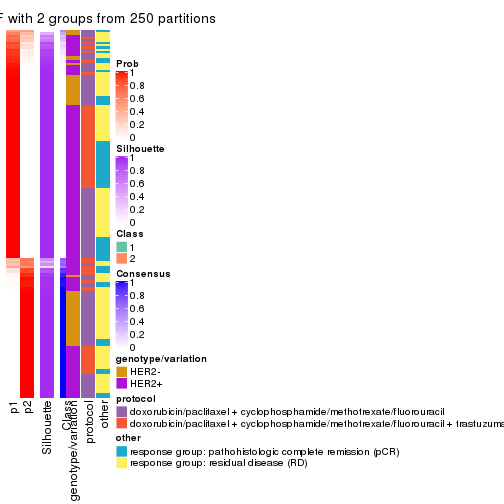</p>

</div>
<div id='tab-CV-NMF-consensus-heatmap-2'>
<pre><code class="r">consensus_heatmap(res, k = 3)
</code></pre>

<p>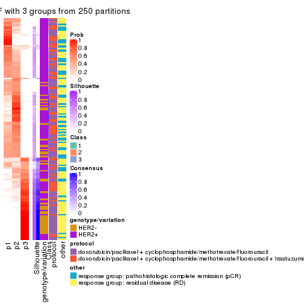</p>

</div>
<div id='tab-CV-NMF-consensus-heatmap-3'>
<pre><code class="r">consensus_heatmap(res, k = 4)
</code></pre>

<p>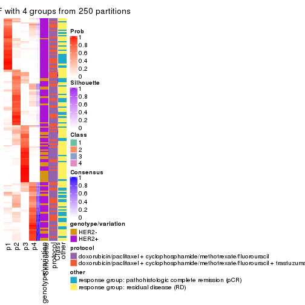</p>

</div>
<div id='tab-CV-NMF-consensus-heatmap-4'>
<pre><code class="r">consensus_heatmap(res, k = 5)
</code></pre>

<p>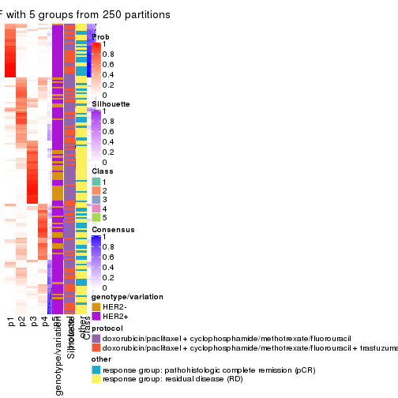</p>

</div>
<div id='tab-CV-NMF-consensus-heatmap-5'>
<pre><code class="r">consensus_heatmap(res, k = 6)
</code></pre>

<p>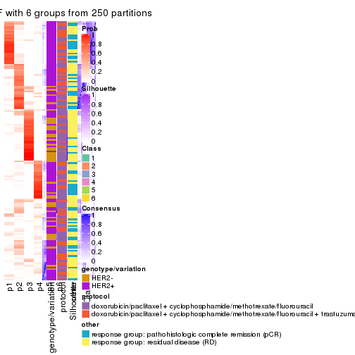</p>

</div>
</div>

Heatmaps for the membership of samples in all partitions to see how consistent they are:


<script>
$( function() {
	$( '#tabs-CV-NMF-membership-heatmap' ).tabs();
} );
</script>
<div id='tabs-CV-NMF-membership-heatmap'>
<ul>
<li><a href='#tab-CV-NMF-membership-heatmap-1'>k = 2</a></li>
<li><a href='#tab-CV-NMF-membership-heatmap-2'>k = 3</a></li>
<li><a href='#tab-CV-NMF-membership-heatmap-3'>k = 4</a></li>
<li><a href='#tab-CV-NMF-membership-heatmap-4'>k = 5</a></li>
<li><a href='#tab-CV-NMF-membership-heatmap-5'>k = 6</a></li>
</ul>
<div id='tab-CV-NMF-membership-heatmap-1'>
<pre><code class="r">membership_heatmap(res, k = 2)
</code></pre>

<p>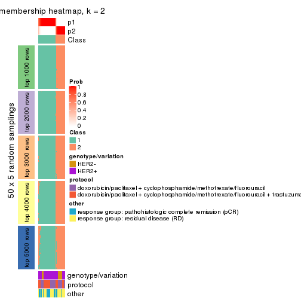</p>

</div>
<div id='tab-CV-NMF-membership-heatmap-2'>
<pre><code class="r">membership_heatmap(res, k = 3)
</code></pre>

<p>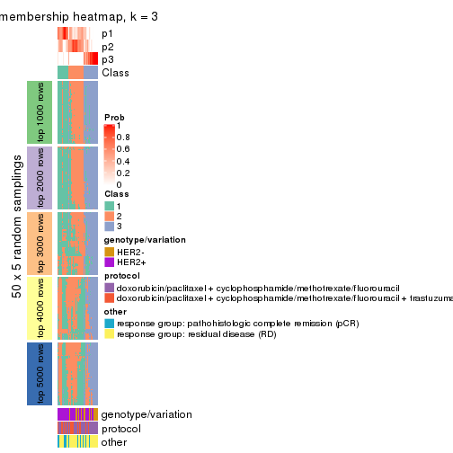</p>

</div>
<div id='tab-CV-NMF-membership-heatmap-3'>
<pre><code class="r">membership_heatmap(res, k = 4)
</code></pre>

<p>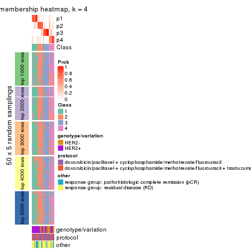</p>

</div>
<div id='tab-CV-NMF-membership-heatmap-4'>
<pre><code class="r">membership_heatmap(res, k = 5)
</code></pre>

<p>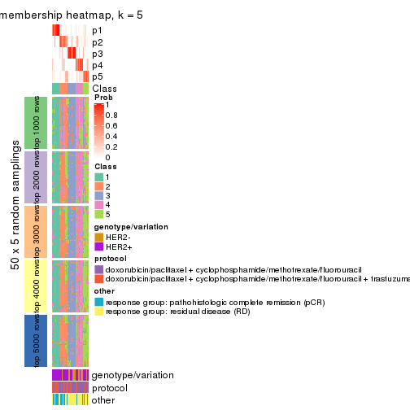</p>

</div>
<div id='tab-CV-NMF-membership-heatmap-5'>
<pre><code class="r">membership_heatmap(res, k = 6)
</code></pre>

<p>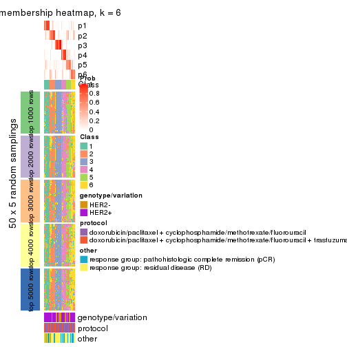</p>

</div>
</div>

As soon as we have had the classes for columns, we can look for signatures
which are significantly different between classes which can be candidate marks
for certain classes. Following are the heatmaps for signatures.


Signature heatmaps where rows are scaled:


<script>
$( function() {
	$( '#tabs-CV-NMF-get-signatures' ).tabs();
} );
</script>
<div id='tabs-CV-NMF-get-signatures'>
<ul>
<li><a href='#tab-CV-NMF-get-signatures-1'>k = 2</a></li>
<li><a href='#tab-CV-NMF-get-signatures-2'>k = 3</a></li>
<li><a href='#tab-CV-NMF-get-signatures-3'>k = 4</a></li>
<li><a href='#tab-CV-NMF-get-signatures-4'>k = 5</a></li>
<li><a href='#tab-CV-NMF-get-signatures-5'>k = 6</a></li>
</ul>
<div id='tab-CV-NMF-get-signatures-1'>
<pre><code class="r">get_signatures(res, k = 2)
</code></pre>

<pre><code>#&gt; Error: The width or height of the raster image is zero, maybe you forget to turn off the
#&gt; previous graphic device or it was corrupted. Run `dev.off()` to close it.
</code></pre>

<p></p>

</div>
<div id='tab-CV-NMF-get-signatures-2'>
<pre><code class="r">get_signatures(res, k = 3)
</code></pre>

<pre><code>#&gt; Error: The width or height of the raster image is zero, maybe you forget to turn off the
#&gt; previous graphic device or it was corrupted. Run `dev.off()` to close it.
</code></pre>

<p></p>

</div>
<div id='tab-CV-NMF-get-signatures-3'>
<pre><code class="r">get_signatures(res, k = 4)
</code></pre>

<pre><code>#&gt; Error: The width or height of the raster image is zero, maybe you forget to turn off the
#&gt; previous graphic device or it was corrupted. Run `dev.off()` to close it.
</code></pre>

<p></p>

</div>
<div id='tab-CV-NMF-get-signatures-4'>
<pre><code class="r">get_signatures(res, k = 5)
</code></pre>

<pre><code>#&gt; Error: The width or height of the raster image is zero, maybe you forget to turn off the
#&gt; previous graphic device or it was corrupted. Run `dev.off()` to close it.
</code></pre>

<p></p>

</div>
<div id='tab-CV-NMF-get-signatures-5'>
<pre><code class="r">get_signatures(res, k = 6)
</code></pre>

<pre><code>#&gt; Error: The width or height of the raster image is zero, maybe you forget to turn off the
#&gt; previous graphic device or it was corrupted. Run `dev.off()` to close it.
</code></pre>

<p></p>

</div>
</div>


Signature heatmaps where rows are not scaled:


<script>
$( function() {
	$( '#tabs-CV-NMF-get-signatures-no-scale' ).tabs();
} );
</script>
<div id='tabs-CV-NMF-get-signatures-no-scale'>
<ul>
<li><a href='#tab-CV-NMF-get-signatures-no-scale-1'>k = 2</a></li>
<li><a href='#tab-CV-NMF-get-signatures-no-scale-2'>k = 3</a></li>
<li><a href='#tab-CV-NMF-get-signatures-no-scale-3'>k = 4</a></li>
<li><a href='#tab-CV-NMF-get-signatures-no-scale-4'>k = 5</a></li>
<li><a href='#tab-CV-NMF-get-signatures-no-scale-5'>k = 6</a></li>
</ul>
<div id='tab-CV-NMF-get-signatures-no-scale-1'>
<pre><code class="r">get_signatures(res, k = 2, scale_rows = FALSE)
</code></pre>

<pre><code>#&gt; Error: The width or height of the raster image is zero, maybe you forget to turn off the
#&gt; previous graphic device or it was corrupted. Run `dev.off()` to close it.
</code></pre>

<p></p>

</div>
<div id='tab-CV-NMF-get-signatures-no-scale-2'>
<pre><code class="r">get_signatures(res, k = 3, scale_rows = FALSE)
</code></pre>

<pre><code>#&gt; Error: The width or height of the raster image is zero, maybe you forget to turn off the
#&gt; previous graphic device or it was corrupted. Run `dev.off()` to close it.
</code></pre>

<p></p>

</div>
<div id='tab-CV-NMF-get-signatures-no-scale-3'>
<pre><code class="r">get_signatures(res, k = 4, scale_rows = FALSE)
</code></pre>

<pre><code>#&gt; Error: The width or height of the raster image is zero, maybe you forget to turn off the
#&gt; previous graphic device or it was corrupted. Run `dev.off()` to close it.
</code></pre>

<p></p>

</div>
<div id='tab-CV-NMF-get-signatures-no-scale-4'>
<pre><code class="r">get_signatures(res, k = 5, scale_rows = FALSE)
</code></pre>

<pre><code>#&gt; Error: The width or height of the raster image is zero, maybe you forget to turn off the
#&gt; previous graphic device or it was corrupted. Run `dev.off()` to close it.
</code></pre>

<p></p>

</div>
<div id='tab-CV-NMF-get-signatures-no-scale-5'>
<pre><code class="r">get_signatures(res, k = 6, scale_rows = FALSE)
</code></pre>

<pre><code>#&gt; Error: The width or height of the raster image is zero, maybe you forget to turn off the
#&gt; previous graphic device or it was corrupted. Run `dev.off()` to close it.
</code></pre>

<p></p>

</div>
</div>


Compare the overlap of signatures from different k:

```r
compare_signatures(res)
```

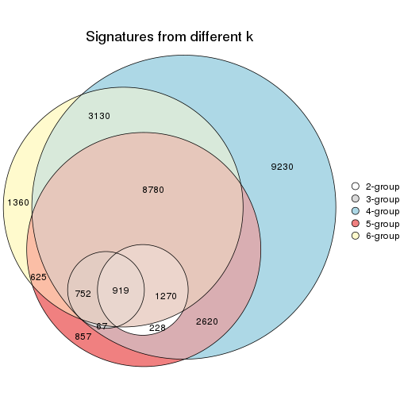

`get_signature()` returns a data frame invisibly. TO get the list of signatures, the function
call should be assigned to a variable explicitly. In following code, if `plot` argument is set
to `FALSE`, no heatmap is plotted while only the differential analysis is performed.

```r
# code only for demonstration
tb = get_signature(res, k = ..., plot = FALSE)
```

An example of the output of `tb` is:

```
#>   which_row         fdr    mean_1    mean_2 scaled_mean_1 scaled_mean_2 km
#> 1        38 0.042760348  8.373488  9.131774    -0.5533452     0.5164555  1
#> 2        40 0.018707592  7.106213  8.469186    -0.6173731     0.5762149  1
#> 3        55 0.019134737 10.221463 11.207825    -0.6159697     0.5749050  1
#> 4        59 0.006059896  5.921854  7.869574    -0.6899429     0.6439467  1
#> 5        60 0.018055526  8.928898 10.211722    -0.6204761     0.5791110  1
#> 6        98 0.009384629 15.714769 14.887706     0.6635654    -0.6193277  2
...
```

The columns in `tb` are:

1. `which_row`: row indices corresponding to the input matrix.
2. `fdr`: FDR for the differential test. 
3. `mean_x`: The mean value in group x.
4. `scaled_mean_x`: The mean value in group x after rows are scaled.
5. `km`: Row groups if k-means clustering is applied to rows.


UMAP plot which shows how samples are separated.


<script>
$( function() {
	$( '#tabs-CV-NMF-dimension-reduction' ).tabs();
} );
</script>
<div id='tabs-CV-NMF-dimension-reduction'>
<ul>
<li><a href='#tab-CV-NMF-dimension-reduction-1'>k = 2</a></li>
<li><a href='#tab-CV-NMF-dimension-reduction-2'>k = 3</a></li>
<li><a href='#tab-CV-NMF-dimension-reduction-3'>k = 4</a></li>
<li><a href='#tab-CV-NMF-dimension-reduction-4'>k = 5</a></li>
<li><a href='#tab-CV-NMF-dimension-reduction-5'>k = 6</a></li>
</ul>
<div id='tab-CV-NMF-dimension-reduction-1'>
<pre><code class="r">dimension_reduction(res, k = 2, method = &quot;UMAP&quot;)
</code></pre>

<p>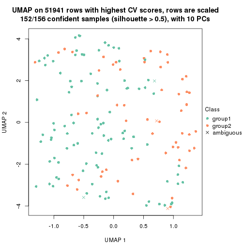</p>

</div>
<div id='tab-CV-NMF-dimension-reduction-2'>
<pre><code class="r">dimension_reduction(res, k = 3, method = &quot;UMAP&quot;)
</code></pre>

<p>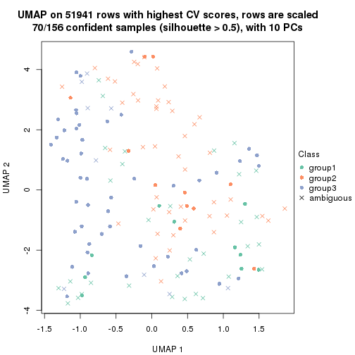</p>

</div>
<div id='tab-CV-NMF-dimension-reduction-3'>
<pre><code class="r">dimension_reduction(res, k = 4, method = &quot;UMAP&quot;)
</code></pre>

<p>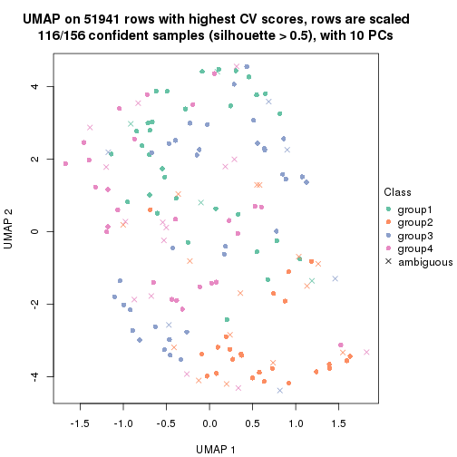</p>

</div>
<div id='tab-CV-NMF-dimension-reduction-4'>
<pre><code class="r">dimension_reduction(res, k = 5, method = &quot;UMAP&quot;)
</code></pre>

<p>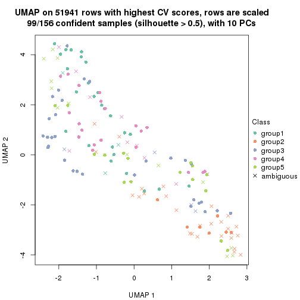</p>

</div>
<div id='tab-CV-NMF-dimension-reduction-5'>
<pre><code class="r">dimension_reduction(res, k = 6, method = &quot;UMAP&quot;)
</code></pre>

<p>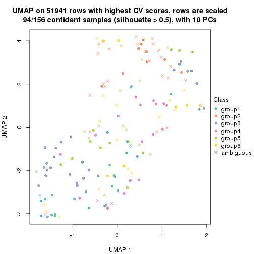</p>

</div>
</div>


Following heatmap shows how subgroups are split when increasing `k`:

```r
collect_classes(res)
```

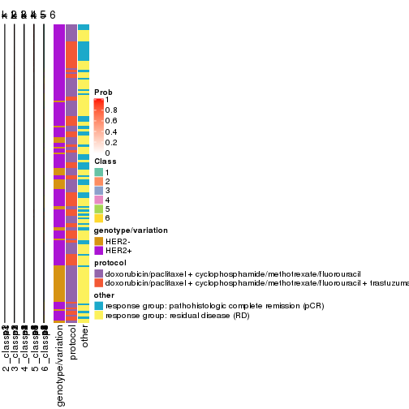


Test correlation between subgroups and known annotations. If the known
annotation is numeric, one-way ANOVA test is applied, and if the known
annotation is discrete, chi-squared contingency table test is applied.

```r
test_to_known_factors(res)
```

```
#>          n genotype/variation(p) protocol(p) other(p) k
#> CV:NMF 152              1.22e-03      0.4169  0.01874 2
#> CV:NMF  70              5.13e-03      0.0261  0.00104 3
#> CV:NMF 116              4.34e-06      0.0978  0.03117 4
#> CV:NMF  99              6.29e-06      0.0215  0.00195 5
#> CV:NMF  94              5.52e-06      0.0524  0.02997 6
```


If matrix rows can be associated to genes, consider to use `functional_enrichment(res,
...)` to perform function enrichment for the signature genes. See [this vignette](http://bioconductor.org/packages/devel/bioc/vignettes/cola/inst/doc/functional_enrichment.html) for more detailed explanations.


 

---------------------------------------------------


### MAD:hclust


The object with results only for a single top-value method and a single partition method 
can be extracted as:

```r
res = res_list["MAD", "hclust"]
# you can also extract it by
# res = res_list["MAD:hclust"]
```

A summary of `res` and all the functions that can be applied to it:

```r
res
```

```
#> A 'ConsensusPartition' object with k = 2, 3, 4, 5, 6.
#>   On a matrix with 51941 rows and 156 columns.
#>   Top rows (1000, 2000, 3000, 4000, 5000) are extracted by 'MAD' method.
#>   Subgroups are detected by 'hclust' method.
#>   Performed in total 1250 partitions by row resampling.
#>   Best k for subgroups seems to be 2.
#> 
#> Following methods can be applied to this 'ConsensusPartition' object:
#>  [1] "cola_report"             "collect_classes"         "collect_plots"          
#>  [4] "collect_stats"           "colnames"                "compare_signatures"     
#>  [7] "consensus_heatmap"       "dimension_reduction"     "functional_enrichment"  
#> [10] "get_anno_col"            "get_anno"                "get_classes"            
#> [13] "get_consensus"           "get_matrix"              "get_membership"         
#> [16] "get_param"               "get_signatures"          "get_stats"              
#> [19] "is_best_k"               "is_stable_k"             "membership_heatmap"     
#> [22] "ncol"                    "nrow"                    "plot_ecdf"              
#> [25] "rownames"                "select_partition_number" "show"                   
#> [28] "suggest_best_k"          "test_to_known_factors"
```

`collect_plots()` function collects all the plots made from `res` for all `k` (number of partitions)
into one single page to provide an easy and fast comparison between different `k`.

```r
collect_plots(res)
```

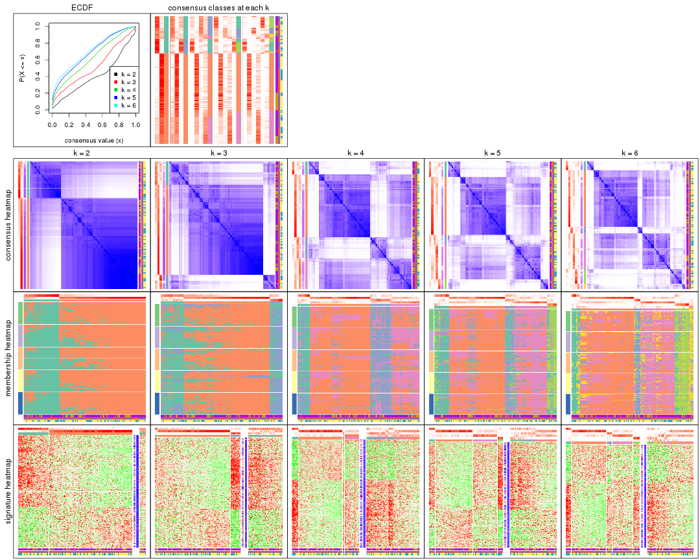

The plots are:

- The first row: a plot of the ECDF (empirical cumulative distribution
  function) curves of the consensus matrix for each `k` and the heatmap of
  predicted classes for each `k`.
- The second row: heatmaps of the consensus matrix for each `k`.
- The third row: heatmaps of the membership matrix for each `k`.
- The fouth row: heatmaps of the signatures for each `k`.

All the plots in panels can be made by individual functions and they are
plotted later in this section.

`select_partition_number()` produces several plots showing different
statistics for choosing "optimized" `k`. There are following statistics:

- ECDF curves of the consensus matrix for each `k`;
- 1-PAC. [The PAC
  score](https://en.wikipedia.org/wiki/Consensus_clustering#Over-interpretation_potential_of_consensus_clustering)
  measures the proportion of the ambiguous subgrouping.
- Mean silhouette score.
- Concordance. The mean probability of fiting the consensus class ids in all
  partitions.
- Area increased. Denote $A_k$ as the area under the ECDF curve for current
  `k`, the area increased is defined as $A_k - A_{k-1}$.
- Rand index. The percent of pairs of samples that are both in a same cluster
  or both are not in a same cluster in the partition of k and k-1.
- Jaccard index. The ratio of pairs of samples are both in a same cluster in
  the partition of k and k-1 and the pairs of samples are both in a same
  cluster in the partition k or k-1.

The detailed explanations of these statistics can be found in [the _cola_
vignette](http://bioconductor.org/packages/devel/bioc/vignettes/cola/inst/doc/cola.html#toc_13).

Generally speaking, lower PAC score, higher mean silhouette score or higher
concordance corresponds to better partition. Rand index and Jaccard index
measure how similar the current partition is compared to partition with `k-1`.
If they are too similar, we won't accept `k` is better than `k-1`.

```r
select_partition_number(res)
```

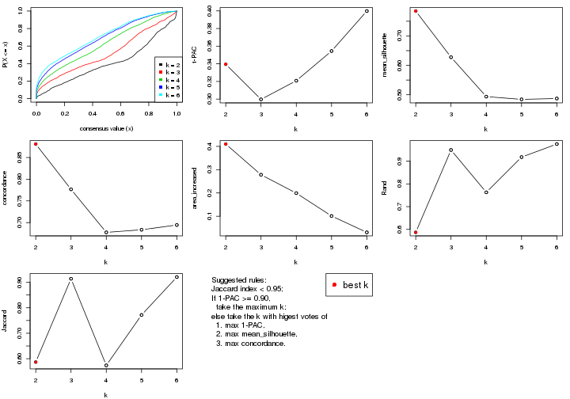

The numeric values for all these statistics can be obtained by `get_stats()`.

```r
get_stats(res)
```

```
#>   k 1-PAC mean_silhouette concordance area_increased  Rand Jaccard
#> 2 2 0.339           0.785       0.881         0.4100 0.587   0.587
#> 3 3 0.300           0.628       0.777         0.2781 0.949   0.914
#> 4 4 0.321           0.494       0.678         0.1992 0.763   0.574
#> 5 5 0.354           0.484       0.684         0.1010 0.918   0.772
#> 6 6 0.400           0.487       0.694         0.0308 0.975   0.920
```

`suggest_best_k()` suggests the best $k$ based on these statistics. The rules are as follows:

- All $k$ with Jaccard index larger than 0.95 are removed because increasing
  $k$ does not provide enough extra information. If all $k$ are removed, it is
  marked as no subgroup is detected.
- For all $k$ with 1-PAC score larger than 0.9, the maximal $k$ is taken as
  the best $k$, and other $k$ are marked as optional $k$.
- If it does not fit the second rule. The $k$ with the maximal vote of the
  highest 1-PAC score, highest mean silhouette, and highest concordance is
  taken as the best $k$.

```r
suggest_best_k(res)
```

```
#> [1] 2
```


Following shows the table of the partitions (You need to click the **show/hide
code output** link to see it). The membership matrix (columns with name `p*`)
is inferred by
[`clue::cl_consensus()`](https://www.rdocumentation.org/link/cl_consensus?package=clue)
function with the `SE` method. Basically the value in the membership matrix
represents the probability to belong to a certain group. The finall class
label for an item is determined with the group with highest probability it
belongs to.

In `get_classes()` function, the entropy is calculated from the membership
matrix and the silhouette score is calculated from the consensus matrix.


<script>
$( function() {
	$( '#tabs-MAD-hclust-get-classes' ).tabs();
} );
</script>
<div id='tabs-MAD-hclust-get-classes'>
<ul>
<li><a href='#tab-MAD-hclust-get-classes-1'>k = 2</a></li>
<li><a href='#tab-MAD-hclust-get-classes-2'>k = 3</a></li>
<li><a href='#tab-MAD-hclust-get-classes-3'>k = 4</a></li>
<li><a href='#tab-MAD-hclust-get-classes-4'>k = 5</a></li>
<li><a href='#tab-MAD-hclust-get-classes-5'>k = 6</a></li>
</ul>

<div id='tab-MAD-hclust-get-classes-1'>
<p><a id='tab-MAD-hclust-get-classes-1-a' style='color:#0366d6' href='#'>show/hide code output</a></p>
<pre><code class="r">cbind(get_classes(res, k = 2), get_membership(res, k = 2))
</code></pre>

<pre><code>#&gt;            class entropy silhouette    p1    p2
#&gt; GSM1232995     2  0.0000    0.87572 0.000 1.000
#&gt; GSM1233002     2  0.6343    0.81743 0.160 0.840
#&gt; GSM1233003     1  0.5519    0.81419 0.872 0.128
#&gt; GSM1233014     2  0.2948    0.87259 0.052 0.948
#&gt; GSM1233015     1  0.4690    0.83170 0.900 0.100
#&gt; GSM1233016     2  0.9552    0.46203 0.376 0.624
#&gt; GSM1233024     2  0.0938    0.87665 0.012 0.988
#&gt; GSM1233049     1  0.0000    0.81487 1.000 0.000
#&gt; GSM1233064     2  0.1184    0.87710 0.016 0.984
#&gt; GSM1233068     2  0.8386    0.69303 0.268 0.732
#&gt; GSM1233073     2  0.7950    0.73917 0.240 0.760
#&gt; GSM1233093     1  0.0000    0.81487 1.000 0.000
#&gt; GSM1233115     1  0.8555    0.68125 0.720 0.280
#&gt; GSM1232992     2  0.0000    0.87572 0.000 1.000
#&gt; GSM1232993     2  0.4022    0.86467 0.080 0.920
#&gt; GSM1233005     2  0.0000    0.87572 0.000 1.000
#&gt; GSM1233007     2  0.2603    0.87488 0.044 0.956
#&gt; GSM1233010     2  0.7376    0.76881 0.208 0.792
#&gt; GSM1233013     2  0.0000    0.87572 0.000 1.000
#&gt; GSM1233018     2  0.0000    0.87572 0.000 1.000
#&gt; GSM1233019     2  0.0376    0.87658 0.004 0.996
#&gt; GSM1233021     2  0.0000    0.87572 0.000 1.000
#&gt; GSM1233025     2  0.9286    0.54544 0.344 0.656
#&gt; GSM1233029     2  0.0938    0.87665 0.012 0.988
#&gt; GSM1233030     2  0.0000    0.87572 0.000 1.000
#&gt; GSM1233031     2  0.5294    0.84796 0.120 0.880
#&gt; GSM1233032     1  0.4431    0.83514 0.908 0.092
#&gt; GSM1233035     2  0.5408    0.83873 0.124 0.876
#&gt; GSM1233038     1  0.1414    0.82477 0.980 0.020
#&gt; GSM1233039     2  0.1184    0.87710 0.016 0.984
#&gt; GSM1233042     2  0.5946    0.82766 0.144 0.856
#&gt; GSM1233043     2  0.5946    0.82766 0.144 0.856
#&gt; GSM1233044     2  0.8144    0.71938 0.252 0.748
#&gt; GSM1233046     2  0.8661    0.65137 0.288 0.712
#&gt; GSM1233051     1  0.7815    0.74397 0.768 0.232
#&gt; GSM1233054     1  0.8327    0.71280 0.736 0.264
#&gt; GSM1233057     2  0.3431    0.86983 0.064 0.936
#&gt; GSM1233060     2  0.5946    0.82766 0.144 0.856
#&gt; GSM1233062     2  0.0938    0.87665 0.012 0.988
#&gt; GSM1233075     2  0.0000    0.87572 0.000 1.000
#&gt; GSM1233078     2  0.7376    0.75992 0.208 0.792
#&gt; GSM1233079     1  0.6887    0.78505 0.816 0.184
#&gt; GSM1233082     2  0.9988   -0.00861 0.480 0.520
#&gt; GSM1233083     1  0.4022    0.83270 0.920 0.080
#&gt; GSM1233091     2  0.6623    0.81333 0.172 0.828
#&gt; GSM1233095     1  0.1184    0.82412 0.984 0.016
#&gt; GSM1233096     1  0.4562    0.83247 0.904 0.096
#&gt; GSM1233101     1  0.2043    0.83076 0.968 0.032
#&gt; GSM1233105     1  0.9954    0.17772 0.540 0.460
#&gt; GSM1233117     2  0.0000    0.87572 0.000 1.000
#&gt; GSM1233118     2  0.0376    0.87593 0.004 0.996
#&gt; GSM1233001     2  0.0000    0.87572 0.000 1.000
#&gt; GSM1233006     2  0.0376    0.87658 0.004 0.996
#&gt; GSM1233008     2  0.0376    0.87607 0.004 0.996
#&gt; GSM1233009     2  0.0000    0.87572 0.000 1.000
#&gt; GSM1233017     2  0.0376    0.87657 0.004 0.996
#&gt; GSM1233020     2  0.0000    0.87572 0.000 1.000
#&gt; GSM1233022     2  0.3114    0.87208 0.056 0.944
#&gt; GSM1233026     2  0.7883    0.73034 0.236 0.764
#&gt; GSM1233028     2  0.6531    0.81784 0.168 0.832
#&gt; GSM1233034     2  0.0376    0.87580 0.004 0.996
#&gt; GSM1233040     1  0.3274    0.83589 0.940 0.060
#&gt; GSM1233048     1  0.2603    0.83419 0.956 0.044
#&gt; GSM1233056     1  0.0000    0.81487 1.000 0.000
#&gt; GSM1233058     2  0.6973    0.79286 0.188 0.812
#&gt; GSM1233059     1  0.1843    0.82924 0.972 0.028
#&gt; GSM1233066     2  0.3274    0.86461 0.060 0.940
#&gt; GSM1233071     2  0.2948    0.87209 0.052 0.948
#&gt; GSM1233074     2  0.0000    0.87572 0.000 1.000
#&gt; GSM1233076     2  0.4022    0.86534 0.080 0.920
#&gt; GSM1233080     1  0.0000    0.81487 1.000 0.000
#&gt; GSM1233088     2  0.1633    0.87729 0.024 0.976
#&gt; GSM1233090     1  0.0000    0.81487 1.000 0.000
#&gt; GSM1233092     2  0.7299    0.77912 0.204 0.796
#&gt; GSM1233094     2  0.5178    0.84752 0.116 0.884
#&gt; GSM1233097     2  0.6048    0.82962 0.148 0.852
#&gt; GSM1233100     2  0.6801    0.80168 0.180 0.820
#&gt; GSM1233104     2  0.5059    0.85048 0.112 0.888
#&gt; GSM1233106     1  0.8763    0.66949 0.704 0.296
#&gt; GSM1233111     1  0.3274    0.83589 0.940 0.060
#&gt; GSM1233122     2  0.0376    0.87658 0.004 0.996
#&gt; GSM1233146     2  0.6148    0.82321 0.152 0.848
#&gt; GSM1232994     2  0.0000    0.87572 0.000 1.000
#&gt; GSM1232996     2  0.0000    0.87572 0.000 1.000
#&gt; GSM1232997     2  0.0376    0.87643 0.004 0.996
#&gt; GSM1232998     2  0.2778    0.87267 0.048 0.952
#&gt; GSM1232999     2  0.0376    0.87658 0.004 0.996
#&gt; GSM1233000     2  0.0000    0.87572 0.000 1.000
#&gt; GSM1233004     1  0.9491    0.52024 0.632 0.368
#&gt; GSM1233011     2  0.5946    0.83219 0.144 0.856
#&gt; GSM1233012     2  0.0000    0.87572 0.000 1.000
#&gt; GSM1233023     2  0.0000    0.87572 0.000 1.000
#&gt; GSM1233027     2  0.0376    0.87658 0.004 0.996
#&gt; GSM1233033     1  0.4690    0.82587 0.900 0.100
#&gt; GSM1233036     2  0.3114    0.87234 0.056 0.944
#&gt; GSM1233037     2  0.3733    0.86752 0.072 0.928
#&gt; GSM1233041     1  0.0376    0.81741 0.996 0.004
#&gt; GSM1233045     2  0.6438    0.81604 0.164 0.836
#&gt; GSM1233047     1  0.9248    0.59115 0.660 0.340
#&gt; GSM1233050     1  0.2236    0.83182 0.964 0.036
#&gt; GSM1233052     2  0.8763    0.64027 0.296 0.704
#&gt; GSM1233053     1  0.8327    0.71280 0.736 0.264
#&gt; GSM1233055     1  0.0000    0.81487 1.000 0.000
#&gt; GSM1233061     2  0.4298    0.85627 0.088 0.912
#&gt; GSM1233063     1  0.4431    0.83508 0.908 0.092
#&gt; GSM1233065     2  0.0000    0.87572 0.000 1.000
#&gt; GSM1233070     2  0.0672    0.87689 0.008 0.992
#&gt; GSM1233077     2  0.6973    0.78047 0.188 0.812
#&gt; GSM1233081     1  0.7602    0.75574 0.780 0.220
#&gt; GSM1233084     1  0.0376    0.81741 0.996 0.004
#&gt; GSM1233087     1  0.9850    0.33224 0.572 0.428
#&gt; GSM1233089     2  0.0376    0.87658 0.004 0.996
#&gt; GSM1233099     2  0.8955    0.60728 0.312 0.688
#&gt; GSM1233112     1  0.4815    0.83090 0.896 0.104
#&gt; GSM1233085     1  0.9358    0.56638 0.648 0.352
#&gt; GSM1233098     2  0.0376    0.87658 0.004 0.996
#&gt; GSM1233114     2  0.8608    0.65357 0.284 0.716
#&gt; GSM1233119     2  0.9209    0.56103 0.336 0.664
#&gt; GSM1233129     2  0.0376    0.87593 0.004 0.996
#&gt; GSM1233132     2  0.8861    0.61638 0.304 0.696
#&gt; GSM1233139     2  0.0376    0.87657 0.004 0.996
#&gt; GSM1233143     2  0.0000    0.87572 0.000 1.000
#&gt; GSM1233145     1  0.3733    0.83580 0.928 0.072
#&gt; GSM1233067     2  0.0000    0.87572 0.000 1.000
#&gt; GSM1233069     2  0.6343    0.81012 0.160 0.840
#&gt; GSM1233072     2  0.0376    0.87658 0.004 0.996
#&gt; GSM1233086     2  0.3274    0.86796 0.060 0.940
#&gt; GSM1233102     2  0.9491    0.48449 0.368 0.632
#&gt; GSM1233103     2  0.8763    0.63441 0.296 0.704
#&gt; GSM1233107     2  0.7602    0.74916 0.220 0.780
#&gt; GSM1233108     1  0.6973    0.78216 0.812 0.188
#&gt; GSM1233109     1  0.9710    0.42388 0.600 0.400
#&gt; GSM1233110     2  0.8081    0.70736 0.248 0.752
#&gt; GSM1233113     2  0.0000    0.87572 0.000 1.000
#&gt; GSM1233116     2  0.0000    0.87572 0.000 1.000
#&gt; GSM1233120     2  0.9286    0.53924 0.344 0.656
#&gt; GSM1233121     2  0.6887    0.78520 0.184 0.816
#&gt; GSM1233123     2  0.6343    0.81460 0.160 0.840
#&gt; GSM1233124     2  0.3584    0.86773 0.068 0.932
#&gt; GSM1233125     1  0.5408    0.82452 0.876 0.124
#&gt; GSM1233126     2  0.9044    0.59544 0.320 0.680
#&gt; GSM1233127     2  0.0000    0.87572 0.000 1.000
#&gt; GSM1233128     1  0.2043    0.83082 0.968 0.032
#&gt; GSM1233130     2  0.7139    0.76872 0.196 0.804
#&gt; GSM1233131     2  0.8763    0.63441 0.296 0.704
#&gt; GSM1233133     1  0.9896    0.31611 0.560 0.440
#&gt; GSM1233134     2  0.2043    0.87515 0.032 0.968
#&gt; GSM1233135     2  0.0000    0.87572 0.000 1.000
#&gt; GSM1233136     2  0.7056    0.77407 0.192 0.808
#&gt; GSM1233137     1  0.9323    0.57387 0.652 0.348
#&gt; GSM1233138     2  0.9000    0.60383 0.316 0.684
#&gt; GSM1233140     1  0.3879    0.83694 0.924 0.076
#&gt; GSM1233141     2  0.0000    0.87572 0.000 1.000
#&gt; GSM1233142     2  0.0000    0.87572 0.000 1.000
#&gt; GSM1233144     1  0.9922    0.28813 0.552 0.448
#&gt; GSM1233147     2  0.3879    0.86690 0.076 0.924
</code></pre>

<script>
$('#tab-MAD-hclust-get-classes-1-a').parent().next().next().hide();
$('#tab-MAD-hclust-get-classes-1-a').click(function(){
  $('#tab-MAD-hclust-get-classes-1-a').parent().next().next().toggle();
  return(false);
});
</script>
</div>

<div id='tab-MAD-hclust-get-classes-2'>
<p><a id='tab-MAD-hclust-get-classes-2-a' style='color:#0366d6' href='#'>show/hide code output</a></p>
<pre><code class="r">cbind(get_classes(res, k = 3), get_membership(res, k = 3))
</code></pre>

<pre><code>#&gt;            class entropy silhouette    p1    p2    p3
#&gt; GSM1232995     2  0.1015     0.8050 0.012 0.980 0.008
#&gt; GSM1233002     2  0.5690     0.7055 0.288 0.708 0.004
#&gt; GSM1233003     1  0.8199     0.1115 0.488 0.072 0.440
#&gt; GSM1233014     2  0.3482     0.7946 0.128 0.872 0.000
#&gt; GSM1233015     1  0.5763     0.3291 0.716 0.008 0.276
#&gt; GSM1233016     2  0.8355     0.3525 0.408 0.508 0.084
#&gt; GSM1233024     2  0.1643     0.8118 0.044 0.956 0.000
#&gt; GSM1233049     3  0.1529     0.6875 0.040 0.000 0.960
#&gt; GSM1233064     2  0.2400     0.8121 0.064 0.932 0.004
#&gt; GSM1233068     2  0.7368     0.5650 0.352 0.604 0.044
#&gt; GSM1233073     2  0.7107     0.6111 0.340 0.624 0.036
#&gt; GSM1233093     3  0.1643     0.6891 0.044 0.000 0.956
#&gt; GSM1233115     1  0.8520     0.3963 0.588 0.132 0.280
#&gt; GSM1232992     2  0.0592     0.8100 0.012 0.988 0.000
#&gt; GSM1232993     2  0.4235     0.7818 0.176 0.824 0.000
#&gt; GSM1233005     2  0.0592     0.8100 0.012 0.988 0.000
#&gt; GSM1233007     2  0.3267     0.8062 0.116 0.884 0.000
#&gt; GSM1233010     2  0.6026     0.6128 0.376 0.624 0.000
#&gt; GSM1233013     2  0.1015     0.8050 0.012 0.980 0.008
#&gt; GSM1233018     2  0.1315     0.8070 0.020 0.972 0.008
#&gt; GSM1233019     2  0.1289     0.8116 0.032 0.968 0.000
#&gt; GSM1233021     2  0.0747     0.8103 0.016 0.984 0.000
#&gt; GSM1233025     2  0.7382     0.3874 0.456 0.512 0.032
#&gt; GSM1233029     2  0.1411     0.8123 0.036 0.964 0.000
#&gt; GSM1233030     2  0.1170     0.8058 0.016 0.976 0.008
#&gt; GSM1233031     2  0.5156     0.7571 0.216 0.776 0.008
#&gt; GSM1233032     1  0.7084     0.2923 0.628 0.036 0.336
#&gt; GSM1233035     2  0.5503     0.7511 0.208 0.772 0.020
#&gt; GSM1233038     3  0.4452     0.6492 0.192 0.000 0.808
#&gt; GSM1233039     2  0.2400     0.8121 0.064 0.932 0.004
#&gt; GSM1233042     2  0.5404     0.7261 0.256 0.740 0.004
#&gt; GSM1233043     2  0.5404     0.7261 0.256 0.740 0.004
#&gt; GSM1233044     2  0.6994     0.5922 0.360 0.612 0.028
#&gt; GSM1233046     2  0.7610     0.4861 0.388 0.564 0.048
#&gt; GSM1233051     1  0.7814     0.4815 0.652 0.104 0.244
#&gt; GSM1233054     1  0.6222     0.4994 0.776 0.092 0.132
#&gt; GSM1233057     2  0.4099     0.7922 0.140 0.852 0.008
#&gt; GSM1233060     2  0.5365     0.7287 0.252 0.744 0.004
#&gt; GSM1233062     2  0.1753     0.8118 0.048 0.952 0.000
#&gt; GSM1233075     2  0.1453     0.8063 0.024 0.968 0.008
#&gt; GSM1233078     2  0.6318     0.5789 0.356 0.636 0.008
#&gt; GSM1233079     1  0.6714     0.3546 0.672 0.032 0.296
#&gt; GSM1233082     1  0.8792     0.2096 0.492 0.392 0.116
#&gt; GSM1233083     3  0.6653     0.5042 0.288 0.032 0.680
#&gt; GSM1233091     2  0.6161     0.7016 0.288 0.696 0.016
#&gt; GSM1233095     3  0.5058     0.6614 0.244 0.000 0.756
#&gt; GSM1233096     1  0.5623     0.3198 0.716 0.004 0.280
#&gt; GSM1233101     3  0.5553     0.6319 0.272 0.004 0.724
#&gt; GSM1233105     1  0.9028     0.3811 0.540 0.292 0.168
#&gt; GSM1233117     2  0.1015     0.8050 0.012 0.980 0.008
#&gt; GSM1233118     2  0.1170     0.8054 0.016 0.976 0.008
#&gt; GSM1233001     2  0.1170     0.8049 0.016 0.976 0.008
#&gt; GSM1233006     2  0.1964     0.8115 0.056 0.944 0.000
#&gt; GSM1233008     2  0.1267     0.8112 0.024 0.972 0.004
#&gt; GSM1233009     2  0.1170     0.8061 0.016 0.976 0.008
#&gt; GSM1233017     2  0.1411     0.8127 0.036 0.964 0.000
#&gt; GSM1233020     2  0.1015     0.8050 0.012 0.980 0.008
#&gt; GSM1233022     2  0.3686     0.7941 0.140 0.860 0.000
#&gt; GSM1233026     2  0.6154     0.5470 0.408 0.592 0.000
#&gt; GSM1233028     2  0.5754     0.7095 0.296 0.700 0.004
#&gt; GSM1233034     2  0.1399     0.8077 0.028 0.968 0.004
#&gt; GSM1233040     1  0.5982     0.2414 0.668 0.004 0.328
#&gt; GSM1233048     1  0.6518    -0.2280 0.512 0.004 0.484
#&gt; GSM1233056     3  0.1163     0.6840 0.028 0.000 0.972
#&gt; GSM1233058     2  0.6081     0.6513 0.344 0.652 0.004
#&gt; GSM1233059     3  0.6008     0.5169 0.372 0.000 0.628
#&gt; GSM1233066     2  0.3349     0.7968 0.108 0.888 0.004
#&gt; GSM1233071     2  0.3826     0.8025 0.124 0.868 0.008
#&gt; GSM1233074     2  0.1453     0.8063 0.024 0.968 0.008
#&gt; GSM1233076     2  0.4293     0.7899 0.164 0.832 0.004
#&gt; GSM1233080     3  0.3412     0.7003 0.124 0.000 0.876
#&gt; GSM1233088     2  0.2772     0.8120 0.080 0.916 0.004
#&gt; GSM1233090     3  0.4002     0.6965 0.160 0.000 0.840
#&gt; GSM1233092     2  0.6420     0.6783 0.288 0.688 0.024
#&gt; GSM1233094     2  0.4931     0.7496 0.232 0.768 0.000
#&gt; GSM1233097     2  0.5553     0.7240 0.272 0.724 0.004
#&gt; GSM1233100     2  0.6255     0.6676 0.320 0.668 0.012
#&gt; GSM1233104     2  0.4702     0.7605 0.212 0.788 0.000
#&gt; GSM1233106     1  0.8726     0.4811 0.592 0.196 0.212
#&gt; GSM1233111     1  0.5982     0.2414 0.668 0.004 0.328
#&gt; GSM1233122     2  0.1964     0.8115 0.056 0.944 0.000
#&gt; GSM1233146     2  0.5623     0.7126 0.280 0.716 0.004
#&gt; GSM1232994     2  0.0747     0.8081 0.016 0.984 0.000
#&gt; GSM1232996     2  0.1315     0.8070 0.020 0.972 0.008
#&gt; GSM1232997     2  0.1647     0.8105 0.036 0.960 0.004
#&gt; GSM1232998     2  0.3412     0.7948 0.124 0.876 0.000
#&gt; GSM1232999     2  0.1031     0.8114 0.024 0.976 0.000
#&gt; GSM1233000     2  0.1170     0.8061 0.016 0.976 0.008
#&gt; GSM1233004     1  0.9084     0.4061 0.552 0.216 0.232
#&gt; GSM1233011     2  0.4842     0.7570 0.224 0.776 0.000
#&gt; GSM1233012     2  0.1015     0.8050 0.012 0.980 0.008
#&gt; GSM1233023     2  0.1585     0.8069 0.028 0.964 0.008
#&gt; GSM1233027     2  0.0892     0.8109 0.020 0.980 0.000
#&gt; GSM1233033     3  0.7920    -0.0248 0.468 0.056 0.476
#&gt; GSM1233036     2  0.3267     0.8086 0.116 0.884 0.000
#&gt; GSM1233037     2  0.4228     0.7889 0.148 0.844 0.008
#&gt; GSM1233041     3  0.5810     0.5767 0.336 0.000 0.664
#&gt; GSM1233045     2  0.5873     0.6877 0.312 0.684 0.004
#&gt; GSM1233047     1  0.6561     0.5218 0.756 0.144 0.100
#&gt; GSM1233050     3  0.6518     0.2623 0.484 0.004 0.512
#&gt; GSM1233052     2  0.7337     0.4508 0.428 0.540 0.032
#&gt; GSM1233053     1  0.6222     0.4994 0.776 0.092 0.132
#&gt; GSM1233055     3  0.1031     0.6838 0.024 0.000 0.976
#&gt; GSM1233061     2  0.4514     0.7767 0.156 0.832 0.012
#&gt; GSM1233063     1  0.6702     0.2827 0.648 0.024 0.328
#&gt; GSM1233065     2  0.1711     0.8076 0.032 0.960 0.008
#&gt; GSM1233070     2  0.2066     0.8124 0.060 0.940 0.000
#&gt; GSM1233077     2  0.6104     0.6009 0.348 0.648 0.004
#&gt; GSM1233081     1  0.7053     0.4415 0.692 0.064 0.244
#&gt; GSM1233084     3  0.5760     0.6033 0.328 0.000 0.672
#&gt; GSM1233087     1  0.9911     0.2969 0.400 0.296 0.304
#&gt; GSM1233089     2  0.1878     0.8125 0.044 0.952 0.004
#&gt; GSM1233099     2  0.7283     0.3825 0.460 0.512 0.028
#&gt; GSM1233112     3  0.6843     0.4081 0.332 0.028 0.640
#&gt; GSM1233085     1  0.6605     0.5211 0.752 0.152 0.096
#&gt; GSM1233098     2  0.1411     0.8118 0.036 0.964 0.000
#&gt; GSM1233114     2  0.7248     0.4285 0.436 0.536 0.028
#&gt; GSM1233119     2  0.7169     0.4069 0.456 0.520 0.024
#&gt; GSM1233129     2  0.1525     0.8084 0.032 0.964 0.004
#&gt; GSM1233132     2  0.7283     0.3704 0.460 0.512 0.028
#&gt; GSM1233139     2  0.1315     0.8073 0.020 0.972 0.008
#&gt; GSM1233143     2  0.1015     0.8050 0.012 0.980 0.008
#&gt; GSM1233145     3  0.6172     0.4952 0.308 0.012 0.680
#&gt; GSM1233067     2  0.1015     0.8050 0.012 0.980 0.008
#&gt; GSM1233069     2  0.5785     0.6630 0.300 0.696 0.004
#&gt; GSM1233072     2  0.1964     0.8115 0.056 0.944 0.000
#&gt; GSM1233086     2  0.3349     0.8032 0.108 0.888 0.004
#&gt; GSM1233102     2  0.8141     0.2671 0.460 0.472 0.068
#&gt; GSM1233103     2  0.7049     0.4157 0.452 0.528 0.020
#&gt; GSM1233107     2  0.6584     0.5679 0.380 0.608 0.012
#&gt; GSM1233108     1  0.6684     0.3568 0.676 0.032 0.292
#&gt; GSM1233109     1  0.7772     0.4806 0.672 0.196 0.132
#&gt; GSM1233110     2  0.6647     0.4980 0.396 0.592 0.012
#&gt; GSM1233113     2  0.1170     0.8049 0.016 0.976 0.008
#&gt; GSM1233116     2  0.1585     0.8051 0.028 0.964 0.008
#&gt; GSM1233120     2  0.7839     0.3065 0.464 0.484 0.052
#&gt; GSM1233121     2  0.6081     0.6079 0.344 0.652 0.004
#&gt; GSM1233123     2  0.5919     0.6833 0.276 0.712 0.012
#&gt; GSM1233124     2  0.3715     0.7959 0.128 0.868 0.004
#&gt; GSM1233125     1  0.7787     0.3325 0.588 0.064 0.348
#&gt; GSM1233126     2  0.7464     0.4808 0.400 0.560 0.040
#&gt; GSM1233127     2  0.1015     0.8050 0.012 0.980 0.008
#&gt; GSM1233128     1  0.6168     0.0556 0.588 0.000 0.412
#&gt; GSM1233130     2  0.6275     0.5895 0.348 0.644 0.008
#&gt; GSM1233131     2  0.7054     0.4104 0.456 0.524 0.020
#&gt; GSM1233133     1  0.7184     0.4817 0.688 0.240 0.072
#&gt; GSM1233134     2  0.3295     0.7975 0.096 0.896 0.008
#&gt; GSM1233135     2  0.1170     0.8049 0.016 0.976 0.008
#&gt; GSM1233136     2  0.6252     0.5970 0.344 0.648 0.008
#&gt; GSM1233137     1  0.6349     0.5201 0.764 0.156 0.080
#&gt; GSM1233138     2  0.7366     0.4887 0.400 0.564 0.036
#&gt; GSM1233140     1  0.6696     0.2535 0.632 0.020 0.348
#&gt; GSM1233141     2  0.1015     0.8050 0.012 0.980 0.008
#&gt; GSM1233142     2  0.1015     0.8050 0.012 0.980 0.008
#&gt; GSM1233144     1  0.7259     0.4760 0.680 0.248 0.072
#&gt; GSM1233147     2  0.4293     0.7909 0.164 0.832 0.004
</code></pre>

<script>
$('#tab-MAD-hclust-get-classes-2-a').parent().next().next().hide();
$('#tab-MAD-hclust-get-classes-2-a').click(function(){
  $('#tab-MAD-hclust-get-classes-2-a').parent().next().next().toggle();
  return(false);
});
</script>
</div>

<div id='tab-MAD-hclust-get-classes-3'>
<p><a id='tab-MAD-hclust-get-classes-3-a' style='color:#0366d6' href='#'>show/hide code output</a></p>
<pre><code class="r">cbind(get_classes(res, k = 4), get_membership(res, k = 4))
</code></pre>

<pre><code>#&gt;            class entropy silhouette    p1    p2    p3    p4
#&gt; GSM1232995     2  0.1302   0.717088 0.000 0.956 0.000 0.044
#&gt; GSM1233002     4  0.5650   0.444829 0.000 0.432 0.024 0.544
#&gt; GSM1233003     3  0.8716   0.126361 0.352 0.040 0.364 0.244
#&gt; GSM1233014     2  0.4761   0.279223 0.000 0.628 0.000 0.372
#&gt; GSM1233015     3  0.6449   0.504529 0.152 0.000 0.644 0.204
#&gt; GSM1233016     4  0.6891   0.594649 0.036 0.248 0.080 0.636
#&gt; GSM1233024     2  0.4018   0.624293 0.000 0.772 0.004 0.224
#&gt; GSM1233049     1  0.1610   0.650379 0.952 0.000 0.032 0.016
#&gt; GSM1233064     2  0.3335   0.693474 0.000 0.856 0.016 0.128
#&gt; GSM1233068     4  0.7278   0.558436 0.012 0.364 0.112 0.512
#&gt; GSM1233073     4  0.6102   0.598194 0.008 0.324 0.048 0.620
#&gt; GSM1233093     1  0.0927   0.651273 0.976 0.000 0.016 0.008
#&gt; GSM1233115     4  0.8530  -0.490372 0.188 0.044 0.344 0.424
#&gt; GSM1232992     2  0.3444   0.669426 0.000 0.816 0.000 0.184
#&gt; GSM1232993     2  0.5300   0.135942 0.000 0.580 0.012 0.408
#&gt; GSM1233005     2  0.3444   0.669426 0.000 0.816 0.000 0.184
#&gt; GSM1233007     2  0.5088   0.495387 0.000 0.688 0.024 0.288
#&gt; GSM1233010     4  0.7002   0.456453 0.000 0.388 0.120 0.492
#&gt; GSM1233013     2  0.1716   0.714771 0.000 0.936 0.000 0.064
#&gt; GSM1233018     2  0.2345   0.715475 0.000 0.900 0.000 0.100
#&gt; GSM1233019     2  0.3688   0.639773 0.000 0.792 0.000 0.208
#&gt; GSM1233021     2  0.3219   0.687759 0.000 0.836 0.000 0.164
#&gt; GSM1233025     4  0.6831   0.608430 0.012 0.260 0.112 0.616
#&gt; GSM1233029     2  0.3945   0.639041 0.000 0.780 0.004 0.216
#&gt; GSM1233030     2  0.1792   0.714113 0.000 0.932 0.000 0.068
#&gt; GSM1233031     2  0.6198  -0.000205 0.008 0.560 0.040 0.392
#&gt; GSM1233032     3  0.7072   0.484755 0.212 0.020 0.624 0.144
#&gt; GSM1233035     2  0.6236  -0.028272 0.012 0.560 0.036 0.392
#&gt; GSM1233038     1  0.5180   0.601710 0.740 0.000 0.064 0.196
#&gt; GSM1233039     2  0.3443   0.690480 0.000 0.848 0.016 0.136
#&gt; GSM1233042     4  0.5500   0.364562 0.000 0.464 0.016 0.520
#&gt; GSM1233043     4  0.5500   0.364562 0.000 0.464 0.016 0.520
#&gt; GSM1233044     4  0.7347   0.532018 0.012 0.376 0.116 0.496
#&gt; GSM1233046     4  0.7029   0.620140 0.020 0.284 0.100 0.596
#&gt; GSM1233051     3  0.8041   0.439795 0.132 0.044 0.504 0.320
#&gt; GSM1233054     3  0.5219   0.498820 0.048 0.036 0.784 0.132
#&gt; GSM1233057     2  0.4300   0.585203 0.000 0.820 0.092 0.088
#&gt; GSM1233060     4  0.5399   0.356117 0.000 0.468 0.012 0.520
#&gt; GSM1233062     2  0.4122   0.607175 0.000 0.760 0.004 0.236
#&gt; GSM1233075     2  0.0657   0.703131 0.000 0.984 0.004 0.012
#&gt; GSM1233078     2  0.7330   0.012847 0.000 0.512 0.184 0.304
#&gt; GSM1233079     3  0.7464   0.370396 0.208 0.000 0.496 0.296
#&gt; GSM1233082     4  0.8859   0.259433 0.060 0.236 0.276 0.428
#&gt; GSM1233083     1  0.6595   0.495422 0.604 0.000 0.120 0.276
#&gt; GSM1233091     4  0.6609   0.422874 0.004 0.440 0.068 0.488
#&gt; GSM1233095     1  0.5809   0.542832 0.692 0.000 0.216 0.092
#&gt; GSM1233096     3  0.6457   0.502261 0.156 0.000 0.644 0.200
#&gt; GSM1233101     1  0.6396   0.484242 0.644 0.004 0.248 0.104
#&gt; GSM1233105     4  0.7734   0.170195 0.088 0.096 0.212 0.604
#&gt; GSM1233117     2  0.1302   0.717088 0.000 0.956 0.000 0.044
#&gt; GSM1233118     2  0.1004   0.715457 0.000 0.972 0.004 0.024
#&gt; GSM1233001     2  0.0188   0.704877 0.000 0.996 0.000 0.004
#&gt; GSM1233006     2  0.4049   0.621917 0.000 0.780 0.008 0.212
#&gt; GSM1233008     2  0.2530   0.717144 0.000 0.896 0.004 0.100
#&gt; GSM1233009     2  0.2334   0.708289 0.000 0.908 0.004 0.088
#&gt; GSM1233017     2  0.2760   0.708667 0.000 0.872 0.000 0.128
#&gt; GSM1233020     2  0.1716   0.714771 0.000 0.936 0.000 0.064
#&gt; GSM1233022     2  0.4661   0.369608 0.000 0.652 0.000 0.348
#&gt; GSM1233026     4  0.7325   0.442577 0.000 0.368 0.160 0.472
#&gt; GSM1233028     4  0.5921   0.412280 0.000 0.448 0.036 0.516
#&gt; GSM1233034     2  0.1576   0.719185 0.000 0.948 0.004 0.048
#&gt; GSM1233040     3  0.6407   0.466312 0.204 0.000 0.648 0.148
#&gt; GSM1233048     3  0.6988   0.168457 0.380 0.000 0.500 0.120
#&gt; GSM1233056     1  0.0804   0.646977 0.980 0.000 0.008 0.012
#&gt; GSM1233058     4  0.6686   0.479655 0.000 0.388 0.092 0.520
#&gt; GSM1233059     1  0.6561   0.289947 0.564 0.000 0.344 0.092
#&gt; GSM1233066     2  0.4964   0.613021 0.000 0.764 0.068 0.168
#&gt; GSM1233071     2  0.4839   0.541316 0.004 0.724 0.016 0.256
#&gt; GSM1233074     2  0.0657   0.703131 0.000 0.984 0.004 0.012
#&gt; GSM1233076     2  0.5678   0.410158 0.000 0.640 0.044 0.316
#&gt; GSM1233080     1  0.3523   0.645413 0.856 0.000 0.112 0.032
#&gt; GSM1233088     2  0.3278   0.695345 0.000 0.864 0.020 0.116
#&gt; GSM1233090     1  0.4105   0.625591 0.812 0.000 0.156 0.032
#&gt; GSM1233092     4  0.5773   0.401479 0.008 0.440 0.016 0.536
#&gt; GSM1233094     4  0.4985   0.325457 0.000 0.468 0.000 0.532
#&gt; GSM1233097     4  0.5564   0.409091 0.000 0.436 0.020 0.544
#&gt; GSM1233100     4  0.5467   0.545771 0.000 0.364 0.024 0.612
#&gt; GSM1233104     2  0.5281  -0.148564 0.000 0.528 0.008 0.464
#&gt; GSM1233106     3  0.8738   0.429574 0.120 0.124 0.496 0.260
#&gt; GSM1233111     3  0.6407   0.466312 0.204 0.000 0.648 0.148
#&gt; GSM1233122     2  0.4086   0.618837 0.000 0.776 0.008 0.216
#&gt; GSM1233146     4  0.5576   0.420689 0.000 0.444 0.020 0.536
#&gt; GSM1232994     2  0.2469   0.713242 0.000 0.892 0.000 0.108
#&gt; GSM1232996     2  0.2408   0.714103 0.000 0.896 0.000 0.104
#&gt; GSM1232997     2  0.1576   0.711597 0.000 0.948 0.004 0.048
#&gt; GSM1232998     2  0.4746   0.287294 0.000 0.632 0.000 0.368
#&gt; GSM1232999     2  0.3801   0.635877 0.000 0.780 0.000 0.220
#&gt; GSM1233000     2  0.2408   0.710503 0.000 0.896 0.000 0.104
#&gt; GSM1233004     4  0.9227  -0.285252 0.168 0.116 0.312 0.404
#&gt; GSM1233011     2  0.6309   0.131178 0.000 0.588 0.076 0.336
#&gt; GSM1233012     2  0.0895   0.715543 0.000 0.976 0.004 0.020
#&gt; GSM1233023     2  0.0895   0.706010 0.000 0.976 0.004 0.020
#&gt; GSM1233027     2  0.3528   0.663325 0.000 0.808 0.000 0.192
#&gt; GSM1233033     1  0.8390  -0.096383 0.392 0.024 0.352 0.232
#&gt; GSM1233036     2  0.4904   0.579853 0.000 0.744 0.040 0.216
#&gt; GSM1233037     2  0.4424   0.574240 0.000 0.812 0.100 0.088
#&gt; GSM1233041     1  0.6367   0.350414 0.584 0.000 0.336 0.080
#&gt; GSM1233045     4  0.6575   0.443146 0.000 0.412 0.080 0.508
#&gt; GSM1233047     3  0.5937   0.494131 0.024 0.068 0.720 0.188
#&gt; GSM1233050     3  0.6895   0.080903 0.400 0.000 0.492 0.108
#&gt; GSM1233052     4  0.6554   0.628540 0.008 0.268 0.096 0.628
#&gt; GSM1233053     3  0.5219   0.498820 0.048 0.036 0.784 0.132
#&gt; GSM1233055     1  0.1297   0.653777 0.964 0.000 0.020 0.016
#&gt; GSM1233061     2  0.5452   0.551695 0.000 0.736 0.108 0.156
#&gt; GSM1233063     3  0.7141   0.468674 0.208 0.012 0.604 0.176
#&gt; GSM1233065     2  0.2342   0.716943 0.000 0.912 0.008 0.080
#&gt; GSM1233070     2  0.4248   0.612979 0.000 0.768 0.012 0.220
#&gt; GSM1233077     2  0.7268   0.021367 0.000 0.516 0.172 0.312
#&gt; GSM1233081     3  0.7442   0.449971 0.156 0.020 0.576 0.248
#&gt; GSM1233084     1  0.6280   0.412270 0.604 0.000 0.316 0.080
#&gt; GSM1233087     4  0.8876   0.227561 0.236 0.152 0.120 0.492
#&gt; GSM1233089     2  0.3448   0.663782 0.000 0.828 0.004 0.168
#&gt; GSM1233099     4  0.5279   0.632290 0.008 0.196 0.052 0.744
#&gt; GSM1233112     1  0.7222   0.417792 0.528 0.000 0.172 0.300
#&gt; GSM1233085     3  0.6095   0.492433 0.024 0.080 0.712 0.184
#&gt; GSM1233098     2  0.2921   0.686063 0.000 0.860 0.000 0.140
#&gt; GSM1233114     4  0.5610   0.628135 0.008 0.208 0.064 0.720
#&gt; GSM1233119     4  0.6990   0.587297 0.008 0.284 0.124 0.584
#&gt; GSM1233129     2  0.0927   0.710011 0.000 0.976 0.008 0.016
#&gt; GSM1233132     4  0.5519   0.622471 0.008 0.184 0.072 0.736
#&gt; GSM1233139     2  0.2334   0.707482 0.000 0.908 0.004 0.088
#&gt; GSM1233143     2  0.0524   0.709102 0.000 0.988 0.004 0.008
#&gt; GSM1233145     1  0.6603   0.475324 0.572 0.000 0.100 0.328
#&gt; GSM1233067     2  0.0188   0.707573 0.000 0.996 0.000 0.004
#&gt; GSM1233069     2  0.6836   0.163664 0.000 0.580 0.140 0.280
#&gt; GSM1233072     2  0.3972   0.630116 0.000 0.788 0.008 0.204
#&gt; GSM1233086     2  0.4996   0.606702 0.000 0.752 0.056 0.192
#&gt; GSM1233102     4  0.6005   0.612267 0.032 0.176 0.068 0.724
#&gt; GSM1233103     4  0.6181   0.629527 0.008 0.216 0.096 0.680
#&gt; GSM1233107     4  0.5921   0.603931 0.004 0.288 0.056 0.652
#&gt; GSM1233108     3  0.7468   0.364504 0.204 0.000 0.492 0.304
#&gt; GSM1233109     3  0.8297   0.339478 0.076 0.096 0.432 0.396
#&gt; GSM1233110     2  0.7606  -0.069890 0.000 0.476 0.248 0.276
#&gt; GSM1233113     2  0.0000   0.706787 0.000 1.000 0.000 0.000
#&gt; GSM1233116     2  0.1256   0.711518 0.000 0.964 0.008 0.028
#&gt; GSM1233120     4  0.5665   0.624035 0.028 0.180 0.052 0.740
#&gt; GSM1233121     2  0.7250   0.022686 0.000 0.516 0.168 0.316
#&gt; GSM1233123     2  0.6798   0.215956 0.000 0.604 0.172 0.224
#&gt; GSM1233124     2  0.5412   0.573359 0.000 0.736 0.096 0.168
#&gt; GSM1233125     3  0.8059   0.460684 0.232 0.052 0.552 0.164
#&gt; GSM1233126     4  0.6024   0.583425 0.012 0.300 0.044 0.644
#&gt; GSM1233127     2  0.1302   0.714887 0.000 0.956 0.000 0.044
#&gt; GSM1233128     3  0.7086   0.329469 0.292 0.000 0.548 0.160
#&gt; GSM1233130     2  0.7268   0.035889 0.000 0.516 0.172 0.312
#&gt; GSM1233131     4  0.6147   0.628717 0.008 0.212 0.096 0.684
#&gt; GSM1233133     3  0.7143   0.430141 0.016 0.152 0.608 0.224
#&gt; GSM1233134     2  0.3037   0.644812 0.000 0.888 0.076 0.036
#&gt; GSM1233135     2  0.0188   0.709224 0.000 0.996 0.000 0.004
#&gt; GSM1233136     2  0.7221   0.055599 0.000 0.524 0.168 0.308
#&gt; GSM1233137     3  0.5693   0.484030 0.012 0.080 0.732 0.176
#&gt; GSM1233138     4  0.6046   0.580794 0.012 0.304 0.044 0.640
#&gt; GSM1233140     3  0.7043   0.470701 0.216 0.016 0.620 0.148
#&gt; GSM1233141     2  0.1389   0.715211 0.000 0.952 0.000 0.048
#&gt; GSM1233142     2  0.1302   0.714887 0.000 0.956 0.000 0.044
#&gt; GSM1233144     3  0.7230   0.421630 0.016 0.164 0.600 0.220
#&gt; GSM1233147     2  0.5678   0.405910 0.000 0.640 0.044 0.316
</code></pre>

<script>
$('#tab-MAD-hclust-get-classes-3-a').parent().next().next().hide();
$('#tab-MAD-hclust-get-classes-3-a').click(function(){
  $('#tab-MAD-hclust-get-classes-3-a').parent().next().next().toggle();
  return(false);
});
</script>
</div>

<div id='tab-MAD-hclust-get-classes-4'>
<p><a id='tab-MAD-hclust-get-classes-4-a' style='color:#0366d6' href='#'>show/hide code output</a></p>
<pre><code class="r">cbind(get_classes(res, k = 5), get_membership(res, k = 5))
</code></pre>

<pre><code>#&gt;            class entropy silhouette    p1    p2    p3    p4    p5
#&gt; GSM1232995     2  0.1768     0.6905 0.000 0.924 0.004 0.072 0.000
#&gt; GSM1233002     4  0.4482     0.6019 0.004 0.252 0.032 0.712 0.000
#&gt; GSM1233003     1  0.7521     0.3934 0.548 0.012 0.092 0.180 0.168
#&gt; GSM1233014     4  0.4702     0.1831 0.000 0.432 0.016 0.552 0.000
#&gt; GSM1233015     1  0.2733     0.5468 0.872 0.000 0.012 0.112 0.004
#&gt; GSM1233016     4  0.7227     0.5682 0.068 0.132 0.116 0.624 0.060
#&gt; GSM1233024     2  0.4298     0.4769 0.000 0.640 0.008 0.352 0.000
#&gt; GSM1233049     5  0.2740     0.6594 0.096 0.000 0.028 0.000 0.876
#&gt; GSM1233064     2  0.3454     0.6627 0.000 0.816 0.028 0.156 0.000
#&gt; GSM1233068     4  0.6578     0.6111 0.096 0.224 0.064 0.612 0.004
#&gt; GSM1233073     4  0.4836     0.6613 0.032 0.156 0.036 0.764 0.012
#&gt; GSM1233093     5  0.2389     0.6580 0.116 0.000 0.004 0.000 0.880
#&gt; GSM1233115     3  0.7964     0.2283 0.256 0.008 0.440 0.216 0.080
#&gt; GSM1232992     2  0.3816     0.5677 0.000 0.696 0.000 0.304 0.000
#&gt; GSM1232993     4  0.4730     0.2252 0.004 0.416 0.012 0.568 0.000
#&gt; GSM1233005     2  0.3837     0.5634 0.000 0.692 0.000 0.308 0.000
#&gt; GSM1233007     2  0.5524     0.2527 0.008 0.536 0.040 0.412 0.004
#&gt; GSM1233010     4  0.7241     0.5102 0.076 0.268 0.140 0.516 0.000
#&gt; GSM1233013     2  0.2389     0.6812 0.000 0.880 0.004 0.116 0.000
#&gt; GSM1233018     2  0.3196     0.6710 0.000 0.804 0.004 0.192 0.000
#&gt; GSM1233019     2  0.4151     0.5002 0.000 0.652 0.004 0.344 0.000
#&gt; GSM1233021     2  0.3661     0.6073 0.000 0.724 0.000 0.276 0.000
#&gt; GSM1233025     4  0.7332     0.5575 0.072 0.132 0.172 0.592 0.032
#&gt; GSM1233029     2  0.4183     0.5260 0.000 0.668 0.008 0.324 0.000
#&gt; GSM1233030     2  0.2230     0.6823 0.000 0.884 0.000 0.116 0.000
#&gt; GSM1233031     4  0.6099     0.2594 0.028 0.416 0.060 0.496 0.000
#&gt; GSM1233032     1  0.4734     0.5007 0.776 0.000 0.116 0.056 0.052
#&gt; GSM1233035     4  0.5779     0.1486 0.036 0.456 0.028 0.480 0.000
#&gt; GSM1233038     5  0.6257     0.5723 0.116 0.000 0.104 0.116 0.664
#&gt; GSM1233039     2  0.3574     0.6573 0.000 0.804 0.028 0.168 0.000
#&gt; GSM1233042     4  0.4138     0.5705 0.000 0.276 0.016 0.708 0.000
#&gt; GSM1233043     4  0.4138     0.5705 0.000 0.276 0.016 0.708 0.000
#&gt; GSM1233044     4  0.6917     0.5982 0.096 0.248 0.092 0.564 0.000
#&gt; GSM1233046     4  0.5854     0.6177 0.080 0.124 0.064 0.716 0.016
#&gt; GSM1233051     1  0.6964     0.1374 0.572 0.016 0.224 0.156 0.032
#&gt; GSM1233054     1  0.6192    -0.2926 0.456 0.004 0.456 0.060 0.024
#&gt; GSM1233057     2  0.4372     0.5790 0.020 0.800 0.104 0.072 0.004
#&gt; GSM1233060     4  0.4161     0.5673 0.000 0.280 0.016 0.704 0.000
#&gt; GSM1233062     2  0.4354     0.4418 0.000 0.624 0.008 0.368 0.000
#&gt; GSM1233075     2  0.0798     0.6784 0.000 0.976 0.016 0.008 0.000
#&gt; GSM1233078     2  0.7619     0.1258 0.040 0.440 0.256 0.256 0.008
#&gt; GSM1233079     3  0.7516     0.1773 0.392 0.000 0.396 0.104 0.108
#&gt; GSM1233082     4  0.7799     0.1416 0.336 0.148 0.092 0.420 0.004
#&gt; GSM1233083     5  0.7094     0.4848 0.104 0.000 0.200 0.128 0.568
#&gt; GSM1233091     4  0.6295     0.5462 0.040 0.296 0.084 0.580 0.000
#&gt; GSM1233095     5  0.6487     0.4883 0.268 0.000 0.192 0.008 0.532
#&gt; GSM1233096     1  0.2681     0.5510 0.876 0.000 0.012 0.108 0.004
#&gt; GSM1233101     5  0.7118     0.4435 0.268 0.004 0.216 0.024 0.488
#&gt; GSM1233105     4  0.7035     0.1439 0.232 0.016 0.100 0.584 0.068
#&gt; GSM1233117     2  0.1768     0.6905 0.000 0.924 0.004 0.072 0.000
#&gt; GSM1233118     2  0.1894     0.6961 0.000 0.920 0.008 0.072 0.000
#&gt; GSM1233001     2  0.0162     0.6785 0.000 0.996 0.000 0.004 0.000
#&gt; GSM1233006     2  0.4416     0.4528 0.000 0.632 0.012 0.356 0.000
#&gt; GSM1233008     2  0.3462     0.6584 0.000 0.792 0.012 0.196 0.000
#&gt; GSM1233009     2  0.2470     0.6773 0.000 0.884 0.012 0.104 0.000
#&gt; GSM1233017     2  0.3003     0.6652 0.000 0.812 0.000 0.188 0.000
#&gt; GSM1233020     2  0.2389     0.6812 0.000 0.880 0.004 0.116 0.000
#&gt; GSM1233022     2  0.4803     0.0307 0.004 0.496 0.012 0.488 0.000
#&gt; GSM1233026     4  0.7744     0.4625 0.096 0.252 0.192 0.460 0.000
#&gt; GSM1233028     4  0.5727     0.5664 0.028 0.288 0.060 0.624 0.000
#&gt; GSM1233034     2  0.1956     0.6958 0.000 0.916 0.008 0.076 0.000
#&gt; GSM1233040     1  0.1764     0.5750 0.928 0.000 0.000 0.064 0.008
#&gt; GSM1233048     1  0.4946     0.4892 0.700 0.000 0.008 0.060 0.232
#&gt; GSM1233056     5  0.2136     0.6604 0.088 0.000 0.008 0.000 0.904
#&gt; GSM1233058     4  0.6839     0.5471 0.064 0.260 0.116 0.560 0.000
#&gt; GSM1233059     1  0.5184     0.1384 0.556 0.000 0.004 0.036 0.404
#&gt; GSM1233066     2  0.5672     0.5550 0.024 0.668 0.096 0.212 0.000
#&gt; GSM1233071     2  0.4947     0.4640 0.008 0.644 0.032 0.316 0.000
#&gt; GSM1233074     2  0.0798     0.6784 0.000 0.976 0.016 0.008 0.000
#&gt; GSM1233076     2  0.6388     0.1747 0.020 0.496 0.068 0.404 0.012
#&gt; GSM1233080     5  0.4480     0.6162 0.220 0.000 0.044 0.004 0.732
#&gt; GSM1233088     2  0.3409     0.6668 0.000 0.824 0.032 0.144 0.000
#&gt; GSM1233090     5  0.4513     0.5619 0.284 0.000 0.024 0.004 0.688
#&gt; GSM1233092     4  0.6046     0.5459 0.032 0.272 0.064 0.624 0.008
#&gt; GSM1233094     4  0.4039     0.5639 0.004 0.268 0.008 0.720 0.000
#&gt; GSM1233097     4  0.4952     0.5819 0.012 0.268 0.040 0.680 0.000
#&gt; GSM1233100     4  0.3982     0.6493 0.012 0.172 0.020 0.792 0.004
#&gt; GSM1233104     4  0.4972     0.4471 0.004 0.352 0.032 0.612 0.000
#&gt; GSM1233106     1  0.6324     0.2229 0.636 0.084 0.060 0.216 0.004
#&gt; GSM1233111     1  0.1764     0.5750 0.928 0.000 0.000 0.064 0.008
#&gt; GSM1233122     2  0.4402     0.4627 0.000 0.636 0.012 0.352 0.000
#&gt; GSM1233146     4  0.4479     0.5917 0.004 0.264 0.028 0.704 0.000
#&gt; GSM1232994     2  0.2690     0.6745 0.000 0.844 0.000 0.156 0.000
#&gt; GSM1232996     2  0.3231     0.6686 0.000 0.800 0.004 0.196 0.000
#&gt; GSM1232997     2  0.2006     0.6892 0.000 0.916 0.012 0.072 0.000
#&gt; GSM1232998     4  0.4617     0.1771 0.000 0.436 0.012 0.552 0.000
#&gt; GSM1232999     2  0.4101     0.4570 0.000 0.628 0.000 0.372 0.000
#&gt; GSM1233000     2  0.2674     0.6732 0.000 0.856 0.004 0.140 0.000
#&gt; GSM1233004     3  0.8501     0.2701 0.176 0.048 0.440 0.252 0.084
#&gt; GSM1233011     2  0.6700    -0.1222 0.040 0.448 0.096 0.416 0.000
#&gt; GSM1233012     2  0.1251     0.6910 0.000 0.956 0.008 0.036 0.000
#&gt; GSM1233023     2  0.1168     0.6850 0.000 0.960 0.008 0.032 0.000
#&gt; GSM1233027     2  0.3876     0.5535 0.000 0.684 0.000 0.316 0.000
#&gt; GSM1233033     1  0.7433     0.3826 0.544 0.008 0.084 0.164 0.200
#&gt; GSM1233036     2  0.5201     0.4631 0.016 0.636 0.036 0.312 0.000
#&gt; GSM1233037     2  0.4546     0.5702 0.028 0.792 0.104 0.072 0.004
#&gt; GSM1233041     1  0.5399     0.1262 0.524 0.000 0.024 0.020 0.432
#&gt; GSM1233045     4  0.6663     0.5348 0.052 0.276 0.108 0.564 0.000
#&gt; GSM1233047     3  0.6871     0.3963 0.340 0.036 0.516 0.096 0.012
#&gt; GSM1233050     1  0.5121     0.4499 0.692 0.000 0.024 0.044 0.240
#&gt; GSM1233052     4  0.5746     0.6080 0.104 0.128 0.048 0.712 0.008
#&gt; GSM1233053     3  0.6192     0.1854 0.456 0.004 0.456 0.060 0.024
#&gt; GSM1233055     5  0.3267     0.6719 0.112 0.000 0.044 0.000 0.844
#&gt; GSM1233061     2  0.5916     0.5444 0.028 0.672 0.128 0.168 0.004
#&gt; GSM1233063     1  0.4291     0.5620 0.808 0.004 0.048 0.108 0.032
#&gt; GSM1233065     2  0.2915     0.6928 0.000 0.860 0.024 0.116 0.000
#&gt; GSM1233070     2  0.4387     0.4763 0.000 0.640 0.012 0.348 0.000
#&gt; GSM1233077     2  0.7544     0.1368 0.036 0.448 0.252 0.256 0.008
#&gt; GSM1233081     3  0.7564     0.2903 0.392 0.012 0.416 0.100 0.080
#&gt; GSM1233084     1  0.5804    -0.0341 0.492 0.000 0.048 0.020 0.440
#&gt; GSM1233087     4  0.8827     0.0942 0.096 0.072 0.196 0.432 0.204
#&gt; GSM1233089     2  0.4025     0.5435 0.000 0.700 0.008 0.292 0.000
#&gt; GSM1233099     4  0.3195     0.5577 0.052 0.016 0.040 0.880 0.012
#&gt; GSM1233112     5  0.7381     0.4136 0.072 0.000 0.316 0.144 0.468
#&gt; GSM1233085     3  0.6903     0.4063 0.328 0.040 0.524 0.096 0.012
#&gt; GSM1233098     2  0.3395     0.6113 0.000 0.764 0.000 0.236 0.000
#&gt; GSM1233114     4  0.3783     0.5580 0.056 0.028 0.060 0.848 0.008
#&gt; GSM1233119     4  0.7749     0.5552 0.084 0.168 0.168 0.548 0.032
#&gt; GSM1233129     2  0.1522     0.6902 0.000 0.944 0.012 0.044 0.000
#&gt; GSM1233132     4  0.3362     0.5268 0.060 0.008 0.060 0.864 0.008
#&gt; GSM1233139     2  0.2522     0.6752 0.000 0.880 0.012 0.108 0.000
#&gt; GSM1233143     2  0.0992     0.6855 0.000 0.968 0.008 0.024 0.000
#&gt; GSM1233145     5  0.7605     0.4442 0.120 0.000 0.192 0.180 0.508
#&gt; GSM1233067     2  0.0566     0.6824 0.000 0.984 0.004 0.012 0.000
#&gt; GSM1233069     2  0.7107     0.2475 0.032 0.516 0.220 0.228 0.004
#&gt; GSM1233072     2  0.4356     0.4799 0.000 0.648 0.012 0.340 0.000
#&gt; GSM1233086     2  0.5497     0.5202 0.016 0.652 0.072 0.260 0.000
#&gt; GSM1233102     4  0.3884     0.5176 0.048 0.008 0.060 0.844 0.040
#&gt; GSM1233103     4  0.4442     0.5686 0.088 0.052 0.060 0.800 0.000
#&gt; GSM1233107     4  0.4522     0.6241 0.040 0.116 0.056 0.788 0.000
#&gt; GSM1233108     3  0.7477     0.1904 0.376 0.000 0.416 0.104 0.104
#&gt; GSM1233109     3  0.8401     0.3549 0.244 0.068 0.428 0.220 0.040
#&gt; GSM1233110     2  0.8107     0.0603 0.084 0.408 0.264 0.236 0.008
#&gt; GSM1233113     2  0.0451     0.6804 0.000 0.988 0.004 0.008 0.000
#&gt; GSM1233116     2  0.1661     0.6905 0.000 0.940 0.024 0.036 0.000
#&gt; GSM1233120     4  0.3629     0.5371 0.052 0.012 0.044 0.860 0.032
#&gt; GSM1233121     2  0.7494     0.1372 0.032 0.448 0.252 0.260 0.008
#&gt; GSM1233123     2  0.7027     0.3189 0.048 0.556 0.216 0.176 0.004
#&gt; GSM1233124     2  0.5875     0.5361 0.036 0.660 0.096 0.208 0.000
#&gt; GSM1233125     1  0.5904     0.4463 0.688 0.028 0.196 0.052 0.036
#&gt; GSM1233126     4  0.6496     0.6106 0.036 0.164 0.104 0.660 0.036
#&gt; GSM1233127     2  0.2144     0.6859 0.000 0.912 0.020 0.068 0.000
#&gt; GSM1233128     1  0.5090     0.5472 0.752 0.000 0.112 0.048 0.088
#&gt; GSM1233130     2  0.7620     0.1489 0.044 0.452 0.240 0.256 0.008
#&gt; GSM1233131     4  0.4437     0.5695 0.088 0.048 0.064 0.800 0.000
#&gt; GSM1233133     3  0.7886     0.4502 0.272 0.100 0.464 0.156 0.008
#&gt; GSM1233134     2  0.3399     0.6405 0.024 0.864 0.072 0.036 0.004
#&gt; GSM1233135     2  0.0671     0.6841 0.000 0.980 0.004 0.016 0.000
#&gt; GSM1233136     2  0.7546     0.1647 0.040 0.460 0.240 0.252 0.008
#&gt; GSM1233137     3  0.7106     0.3693 0.348 0.044 0.496 0.096 0.016
#&gt; GSM1233138     4  0.6530     0.6100 0.036 0.168 0.104 0.656 0.036
#&gt; GSM1233140     1  0.4286     0.5467 0.804 0.000 0.104 0.060 0.032
#&gt; GSM1233141     2  0.2236     0.6855 0.000 0.908 0.024 0.068 0.000
#&gt; GSM1233142     2  0.2144     0.6859 0.000 0.912 0.020 0.068 0.000
#&gt; GSM1233144     3  0.7973     0.4446 0.268 0.108 0.456 0.160 0.008
#&gt; GSM1233147     2  0.6310     0.1697 0.016 0.496 0.068 0.408 0.012
</code></pre>

<script>
$('#tab-MAD-hclust-get-classes-4-a').parent().next().next().hide();
$('#tab-MAD-hclust-get-classes-4-a').click(function(){
  $('#tab-MAD-hclust-get-classes-4-a').parent().next().next().toggle();
  return(false);
});
</script>
</div>

<div id='tab-MAD-hclust-get-classes-5'>
<p><a id='tab-MAD-hclust-get-classes-5-a' style='color:#0366d6' href='#'>show/hide code output</a></p>
<pre><code class="r">cbind(get_classes(res, k = 6), get_membership(res, k = 6))
</code></pre>

<pre><code>#&gt;            class entropy silhouette    p1    p2    p3    p4    p5    p6
#&gt; GSM1232995     2  0.1700     0.6820 0.000 0.916 0.000 0.080 0.000 0.004
#&gt; GSM1233002     4  0.4127     0.5921 0.000 0.236 0.004 0.716 0.000 0.044
#&gt; GSM1233003     5  0.7169     0.3927 0.160 0.012 0.020 0.132 0.548 0.128
#&gt; GSM1233014     4  0.4317     0.2334 0.000 0.408 0.004 0.572 0.000 0.016
#&gt; GSM1233015     5  0.2022     0.6295 0.000 0.000 0.024 0.052 0.916 0.008
#&gt; GSM1233016     4  0.6751     0.5039 0.020 0.124 0.056 0.604 0.032 0.164
#&gt; GSM1233024     2  0.4034     0.4384 0.000 0.624 0.004 0.364 0.000 0.008
#&gt; GSM1233049     1  0.1692     0.6502 0.932 0.000 0.048 0.000 0.008 0.012
#&gt; GSM1233064     2  0.3488     0.6442 0.000 0.800 0.012 0.160 0.000 0.028
#&gt; GSM1233068     4  0.6375     0.5943 0.000 0.212 0.020 0.592 0.104 0.072
#&gt; GSM1233073     4  0.4479     0.6451 0.004 0.148 0.012 0.764 0.032 0.040
#&gt; GSM1233093     1  0.1268     0.6533 0.952 0.000 0.004 0.000 0.036 0.008
#&gt; GSM1233115     6  0.6044     0.5500 0.012 0.004 0.032 0.164 0.172 0.616
#&gt; GSM1232992     2  0.3601     0.5417 0.000 0.684 0.000 0.312 0.000 0.004
#&gt; GSM1232993     4  0.4269     0.2573 0.000 0.404 0.004 0.580 0.004 0.008
#&gt; GSM1233005     2  0.3619     0.5371 0.000 0.680 0.000 0.316 0.000 0.004
#&gt; GSM1233007     2  0.5244     0.1872 0.000 0.512 0.020 0.416 0.000 0.052
#&gt; GSM1233010     4  0.6877     0.5073 0.000 0.236 0.020 0.504 0.052 0.188
#&gt; GSM1233013     2  0.2191     0.6704 0.000 0.876 0.000 0.120 0.000 0.004
#&gt; GSM1233018     2  0.3043     0.6566 0.000 0.792 0.000 0.200 0.000 0.008
#&gt; GSM1233019     2  0.3887     0.4614 0.000 0.632 0.000 0.360 0.000 0.008
#&gt; GSM1233021     2  0.3448     0.5876 0.000 0.716 0.000 0.280 0.000 0.004
#&gt; GSM1233025     4  0.6195     0.4697 0.012 0.112 0.016 0.564 0.016 0.280
#&gt; GSM1233029     2  0.3925     0.4947 0.000 0.656 0.004 0.332 0.000 0.008
#&gt; GSM1233030     2  0.2048     0.6727 0.000 0.880 0.000 0.120 0.000 0.000
#&gt; GSM1233031     4  0.5707     0.2833 0.000 0.404 0.004 0.492 0.024 0.076
#&gt; GSM1233032     5  0.4653     0.5676 0.040 0.000 0.164 0.020 0.744 0.032
#&gt; GSM1233035     4  0.5646     0.1529 0.000 0.448 0.024 0.468 0.040 0.020
#&gt; GSM1233038     1  0.6401     0.5053 0.604 0.000 0.036 0.096 0.064 0.200
#&gt; GSM1233039     2  0.3593     0.6374 0.000 0.788 0.012 0.172 0.000 0.028
#&gt; GSM1233042     4  0.3927     0.5647 0.000 0.260 0.004 0.712 0.000 0.024
#&gt; GSM1233043     4  0.3927     0.5647 0.000 0.260 0.004 0.712 0.000 0.024
#&gt; GSM1233044     4  0.6833     0.5905 0.000 0.216 0.036 0.548 0.060 0.140
#&gt; GSM1233046     4  0.5867     0.5917 0.016 0.120 0.068 0.696 0.064 0.036
#&gt; GSM1233051     5  0.6034     0.0942 0.004 0.012 0.016 0.108 0.536 0.324
#&gt; GSM1233054     3  0.4077     0.6451 0.012 0.004 0.748 0.024 0.208 0.004
#&gt; GSM1233057     2  0.3708     0.5741 0.000 0.800 0.136 0.052 0.008 0.004
#&gt; GSM1233060     4  0.3950     0.5614 0.000 0.264 0.004 0.708 0.000 0.024
#&gt; GSM1233062     2  0.4079     0.3999 0.000 0.608 0.004 0.380 0.000 0.008
#&gt; GSM1233075     2  0.0717     0.6712 0.000 0.976 0.016 0.008 0.000 0.000
#&gt; GSM1233078     2  0.7484     0.0896 0.000 0.404 0.124 0.220 0.008 0.244
#&gt; GSM1233079     6  0.7133     0.4359 0.032 0.000 0.144 0.064 0.288 0.472
#&gt; GSM1233082     4  0.7421     0.1060 0.000 0.144 0.036 0.388 0.356 0.076
#&gt; GSM1233083     1  0.7029     0.2749 0.428 0.000 0.048 0.112 0.044 0.368
#&gt; GSM1233091     4  0.6001     0.5401 0.000 0.284 0.024 0.580 0.032 0.080
#&gt; GSM1233095     1  0.6256     0.4679 0.508 0.000 0.020 0.008 0.168 0.296
#&gt; GSM1233096     5  0.1957     0.6313 0.000 0.000 0.024 0.048 0.920 0.008
#&gt; GSM1233101     1  0.6545     0.3881 0.460 0.004 0.008 0.020 0.184 0.324
#&gt; GSM1233105     4  0.7092     0.0627 0.028 0.016 0.068 0.548 0.212 0.128
#&gt; GSM1233117     2  0.1644     0.6808 0.000 0.920 0.000 0.076 0.000 0.004
#&gt; GSM1233118     2  0.1802     0.6882 0.000 0.916 0.000 0.072 0.000 0.012
#&gt; GSM1233001     2  0.0146     0.6714 0.000 0.996 0.000 0.004 0.000 0.000
#&gt; GSM1233006     2  0.4302     0.4046 0.000 0.608 0.004 0.368 0.000 0.020
#&gt; GSM1233008     2  0.3345     0.6403 0.000 0.776 0.000 0.204 0.000 0.020
#&gt; GSM1233009     2  0.2266     0.6680 0.000 0.880 0.012 0.108 0.000 0.000
#&gt; GSM1233017     2  0.2762     0.6498 0.000 0.804 0.000 0.196 0.000 0.000
#&gt; GSM1233020     2  0.2191     0.6704 0.000 0.876 0.000 0.120 0.000 0.004
#&gt; GSM1233022     4  0.4394    -0.0133 0.000 0.484 0.004 0.496 0.000 0.016
#&gt; GSM1233026     4  0.7210     0.4543 0.000 0.212 0.024 0.444 0.056 0.264
#&gt; GSM1233028     4  0.5293     0.5648 0.000 0.264 0.008 0.632 0.016 0.080
#&gt; GSM1233034     2  0.1812     0.6877 0.000 0.912 0.008 0.080 0.000 0.000
#&gt; GSM1233040     5  0.0881     0.6428 0.008 0.000 0.012 0.008 0.972 0.000
#&gt; GSM1233048     5  0.4450     0.5323 0.216 0.000 0.016 0.016 0.724 0.028
#&gt; GSM1233056     1  0.1167     0.6550 0.960 0.000 0.012 0.000 0.008 0.020
#&gt; GSM1233058     4  0.6476     0.5431 0.000 0.232 0.016 0.552 0.044 0.156
#&gt; GSM1233059     5  0.4262     0.2195 0.424 0.000 0.004 0.000 0.560 0.012
#&gt; GSM1233066     2  0.5696     0.5150 0.000 0.640 0.064 0.216 0.008 0.072
#&gt; GSM1233071     2  0.4777     0.4316 0.000 0.632 0.032 0.316 0.008 0.012
#&gt; GSM1233074     2  0.0717     0.6712 0.000 0.976 0.016 0.008 0.000 0.000
#&gt; GSM1233076     2  0.5927     0.1000 0.000 0.472 0.020 0.396 0.004 0.108
#&gt; GSM1233080     1  0.4765     0.6145 0.720 0.000 0.016 0.004 0.144 0.116
#&gt; GSM1233088     2  0.3468     0.6499 0.000 0.808 0.016 0.148 0.000 0.028
#&gt; GSM1233090     1  0.5013     0.5644 0.684 0.000 0.020 0.004 0.204 0.088
#&gt; GSM1233092     4  0.5421     0.5372 0.004 0.256 0.028 0.628 0.000 0.084
#&gt; GSM1233094     4  0.3470     0.5642 0.000 0.248 0.000 0.740 0.000 0.012
#&gt; GSM1233097     4  0.4550     0.5790 0.000 0.248 0.008 0.692 0.008 0.044
#&gt; GSM1233100     4  0.3811     0.6346 0.000 0.160 0.008 0.788 0.012 0.032
#&gt; GSM1233104     4  0.4569     0.4635 0.000 0.332 0.008 0.624 0.000 0.036
#&gt; GSM1233106     5  0.5994     0.3528 0.000 0.084 0.060 0.176 0.648 0.032
#&gt; GSM1233111     5  0.0881     0.6428 0.008 0.000 0.012 0.008 0.972 0.000
#&gt; GSM1233122     2  0.4290     0.4159 0.000 0.612 0.004 0.364 0.000 0.020
#&gt; GSM1233146     4  0.4038     0.5856 0.000 0.244 0.000 0.712 0.000 0.044
#&gt; GSM1232994     2  0.2491     0.6613 0.000 0.836 0.000 0.164 0.000 0.000
#&gt; GSM1232996     2  0.3073     0.6539 0.000 0.788 0.000 0.204 0.000 0.008
#&gt; GSM1232997     2  0.1951     0.6804 0.000 0.908 0.016 0.076 0.000 0.000
#&gt; GSM1232998     4  0.4192     0.2282 0.000 0.412 0.000 0.572 0.000 0.016
#&gt; GSM1232999     2  0.3872     0.4090 0.000 0.604 0.000 0.392 0.000 0.004
#&gt; GSM1233000     2  0.2442     0.6625 0.000 0.852 0.004 0.144 0.000 0.000
#&gt; GSM1233004     6  0.5742     0.4852 0.008 0.016 0.028 0.212 0.088 0.648
#&gt; GSM1233011     4  0.6143     0.1812 0.000 0.412 0.004 0.420 0.016 0.148
#&gt; GSM1233012     2  0.1334     0.6821 0.000 0.948 0.020 0.032 0.000 0.000
#&gt; GSM1233023     2  0.1124     0.6776 0.000 0.956 0.008 0.036 0.000 0.000
#&gt; GSM1233027     2  0.3652     0.5265 0.000 0.672 0.000 0.324 0.000 0.004
#&gt; GSM1233033     5  0.7026     0.4138 0.196 0.008 0.016 0.128 0.544 0.108
#&gt; GSM1233036     2  0.4948     0.4017 0.000 0.612 0.004 0.324 0.012 0.048
#&gt; GSM1233037     2  0.3845     0.5660 0.000 0.792 0.140 0.052 0.012 0.004
#&gt; GSM1233041     5  0.4580     0.2517 0.440 0.000 0.004 0.000 0.528 0.028
#&gt; GSM1233045     4  0.6315     0.5353 0.000 0.248 0.016 0.560 0.036 0.140
#&gt; GSM1233047     3  0.4358     0.7055 0.000 0.016 0.784 0.036 0.104 0.060
#&gt; GSM1233050     5  0.4524     0.4983 0.228 0.000 0.020 0.004 0.708 0.040
#&gt; GSM1233052     4  0.5657     0.5705 0.000 0.120 0.020 0.684 0.112 0.064
#&gt; GSM1233053     3  0.4077     0.6451 0.012 0.004 0.748 0.024 0.208 0.004
#&gt; GSM1233055     1  0.2586     0.6627 0.880 0.000 0.008 0.000 0.032 0.080
#&gt; GSM1233061     2  0.5940     0.5072 0.000 0.640 0.120 0.156 0.008 0.076
#&gt; GSM1233063     5  0.3839     0.6246 0.024 0.000 0.016 0.056 0.820 0.084
#&gt; GSM1233065     2  0.2933     0.6818 0.000 0.848 0.012 0.120 0.000 0.020
#&gt; GSM1233070     2  0.4303     0.4295 0.000 0.616 0.008 0.360 0.000 0.016
#&gt; GSM1233077     2  0.7407     0.0920 0.000 0.408 0.108 0.224 0.008 0.252
#&gt; GSM1233081     3  0.7462    -0.0914 0.016 0.008 0.388 0.064 0.204 0.320
#&gt; GSM1233084     5  0.5383     0.0672 0.440 0.000 0.012 0.000 0.472 0.076
#&gt; GSM1233087     4  0.7730    -0.0868 0.092 0.060 0.040 0.424 0.044 0.340
#&gt; GSM1233089     2  0.3784     0.5031 0.000 0.680 0.000 0.308 0.000 0.012
#&gt; GSM1233099     4  0.3313     0.5065 0.004 0.004 0.032 0.856 0.044 0.060
#&gt; GSM1233112     6  0.6525    -0.2632 0.260 0.000 0.112 0.072 0.012 0.544
#&gt; GSM1233085     3  0.4042     0.7020 0.000 0.020 0.812 0.036 0.076 0.056
#&gt; GSM1233098     2  0.3290     0.5819 0.000 0.744 0.000 0.252 0.000 0.004
#&gt; GSM1233114     4  0.3849     0.5133 0.004 0.020 0.056 0.832 0.044 0.044
#&gt; GSM1233119     4  0.6630     0.4697 0.012 0.136 0.016 0.536 0.032 0.268
#&gt; GSM1233129     2  0.1590     0.6825 0.000 0.936 0.008 0.048 0.000 0.008
#&gt; GSM1233132     4  0.3590     0.4841 0.004 0.004 0.056 0.840 0.052 0.044
#&gt; GSM1233139     2  0.2312     0.6657 0.000 0.876 0.012 0.112 0.000 0.000
#&gt; GSM1233143     2  0.1176     0.6766 0.000 0.956 0.020 0.024 0.000 0.000
#&gt; GSM1233145     1  0.7504     0.2486 0.380 0.000 0.056 0.152 0.056 0.356
#&gt; GSM1233067     2  0.0820     0.6750 0.000 0.972 0.016 0.012 0.000 0.000
#&gt; GSM1233069     2  0.7130     0.2033 0.000 0.480 0.108 0.200 0.008 0.204
#&gt; GSM1233072     2  0.4254     0.4326 0.000 0.624 0.004 0.352 0.000 0.020
#&gt; GSM1233086     2  0.5604     0.4588 0.000 0.612 0.024 0.268 0.012 0.084
#&gt; GSM1233102     4  0.3969     0.4627 0.028 0.000 0.036 0.820 0.048 0.068
#&gt; GSM1233103     4  0.4691     0.5236 0.000 0.048 0.056 0.772 0.088 0.036
#&gt; GSM1233107     4  0.4508     0.5798 0.000 0.108 0.056 0.776 0.036 0.024
#&gt; GSM1233108     6  0.6976     0.4609 0.028 0.000 0.148 0.060 0.264 0.500
#&gt; GSM1233109     6  0.7521     0.3991 0.004 0.032 0.168 0.164 0.136 0.496
#&gt; GSM1233110     2  0.7743     0.0297 0.000 0.364 0.212 0.192 0.008 0.224
#&gt; GSM1233113     2  0.0405     0.6716 0.000 0.988 0.008 0.004 0.000 0.000
#&gt; GSM1233116     2  0.2036     0.6831 0.000 0.916 0.008 0.048 0.000 0.028
#&gt; GSM1233120     4  0.3770     0.4837 0.024 0.000 0.036 0.832 0.044 0.064
#&gt; GSM1233121     2  0.7390     0.0917 0.000 0.408 0.104 0.228 0.008 0.252
#&gt; GSM1233123     2  0.6995     0.2702 0.000 0.516 0.144 0.148 0.008 0.184
#&gt; GSM1233124     2  0.5688     0.5105 0.000 0.644 0.108 0.196 0.008 0.044
#&gt; GSM1233125     5  0.5791     0.4780 0.028 0.016 0.104 0.012 0.660 0.180
#&gt; GSM1233126     4  0.5811     0.5517 0.008 0.152 0.052 0.644 0.000 0.144
#&gt; GSM1233127     2  0.2282     0.6742 0.000 0.900 0.020 0.068 0.000 0.012
#&gt; GSM1233128     5  0.4150     0.5855 0.084 0.000 0.004 0.004 0.760 0.148
#&gt; GSM1233130     2  0.7441     0.0894 0.000 0.400 0.096 0.228 0.012 0.264
#&gt; GSM1233131     4  0.4695     0.5252 0.000 0.044 0.056 0.772 0.088 0.040
#&gt; GSM1233133     3  0.6291     0.5314 0.000 0.060 0.640 0.096 0.060 0.144
#&gt; GSM1233134     2  0.2723     0.6229 0.000 0.852 0.128 0.016 0.000 0.004
#&gt; GSM1233135     2  0.1036     0.6787 0.000 0.964 0.008 0.024 0.000 0.004
#&gt; GSM1233136     2  0.7399     0.1008 0.000 0.408 0.092 0.228 0.012 0.260
#&gt; GSM1233137     3  0.2899     0.6961 0.000 0.020 0.872 0.032 0.072 0.004
#&gt; GSM1233138     4  0.5777     0.5532 0.008 0.152 0.052 0.648 0.000 0.140
#&gt; GSM1233140     5  0.4142     0.6026 0.016 0.000 0.084 0.020 0.796 0.084
#&gt; GSM1233141     2  0.2375     0.6737 0.000 0.896 0.020 0.068 0.000 0.016
#&gt; GSM1233142     2  0.2282     0.6742 0.000 0.900 0.020 0.068 0.000 0.012
#&gt; GSM1233144     3  0.6349     0.5142 0.000 0.068 0.636 0.100 0.056 0.140
#&gt; GSM1233147     2  0.5897     0.0940 0.000 0.472 0.020 0.400 0.004 0.104
</code></pre>

<script>
$('#tab-MAD-hclust-get-classes-5-a').parent().next().next().hide();
$('#tab-MAD-hclust-get-classes-5-a').click(function(){
  $('#tab-MAD-hclust-get-classes-5-a').parent().next().next().toggle();
  return(false);
});
</script>
</div>
</div>

Heatmaps for the consensus matrix. It visualizes the probability of two
samples to be in a same group.


<script>
$( function() {
	$( '#tabs-MAD-hclust-consensus-heatmap' ).tabs();
} );
</script>
<div id='tabs-MAD-hclust-consensus-heatmap'>
<ul>
<li><a href='#tab-MAD-hclust-consensus-heatmap-1'>k = 2</a></li>
<li><a href='#tab-MAD-hclust-consensus-heatmap-2'>k = 3</a></li>
<li><a href='#tab-MAD-hclust-consensus-heatmap-3'>k = 4</a></li>
<li><a href='#tab-MAD-hclust-consensus-heatmap-4'>k = 5</a></li>
<li><a href='#tab-MAD-hclust-consensus-heatmap-5'>k = 6</a></li>
</ul>
<div id='tab-MAD-hclust-consensus-heatmap-1'>
<pre><code class="r">consensus_heatmap(res, k = 2)
</code></pre>

<p>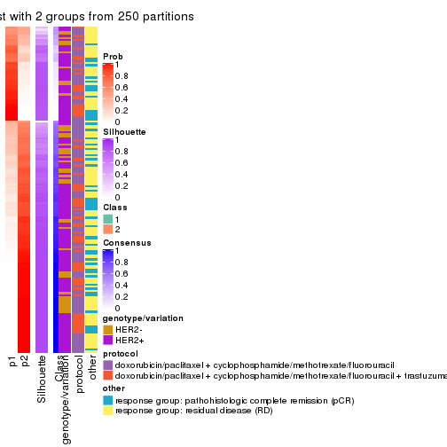</p>

</div>
<div id='tab-MAD-hclust-consensus-heatmap-2'>
<pre><code class="r">consensus_heatmap(res, k = 3)
</code></pre>

<p>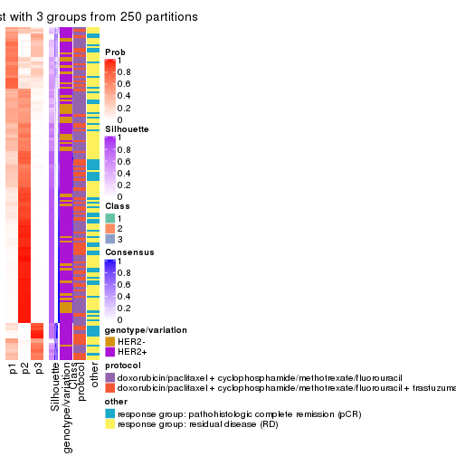</p>

</div>
<div id='tab-MAD-hclust-consensus-heatmap-3'>
<pre><code class="r">consensus_heatmap(res, k = 4)
</code></pre>

<p>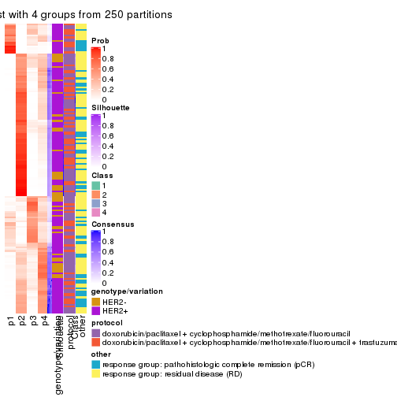</p>

</div>
<div id='tab-MAD-hclust-consensus-heatmap-4'>
<pre><code class="r">consensus_heatmap(res, k = 5)
</code></pre>

<p>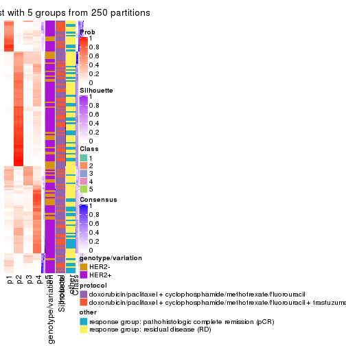</p>

</div>
<div id='tab-MAD-hclust-consensus-heatmap-5'>
<pre><code class="r">consensus_heatmap(res, k = 6)
</code></pre>

<p>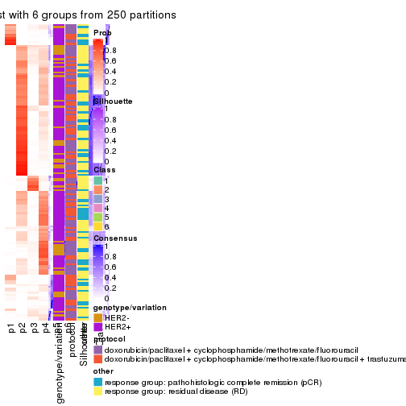</p>

</div>
</div>

Heatmaps for the membership of samples in all partitions to see how consistent they are:


<script>
$( function() {
	$( '#tabs-MAD-hclust-membership-heatmap' ).tabs();
} );
</script>
<div id='tabs-MAD-hclust-membership-heatmap'>
<ul>
<li><a href='#tab-MAD-hclust-membership-heatmap-1'>k = 2</a></li>
<li><a href='#tab-MAD-hclust-membership-heatmap-2'>k = 3</a></li>
<li><a href='#tab-MAD-hclust-membership-heatmap-3'>k = 4</a></li>
<li><a href='#tab-MAD-hclust-membership-heatmap-4'>k = 5</a></li>
<li><a href='#tab-MAD-hclust-membership-heatmap-5'>k = 6</a></li>
</ul>
<div id='tab-MAD-hclust-membership-heatmap-1'>
<pre><code class="r">membership_heatmap(res, k = 2)
</code></pre>

<p>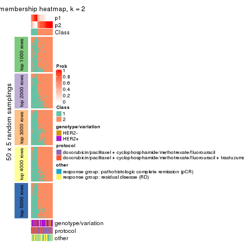</p>

</div>
<div id='tab-MAD-hclust-membership-heatmap-2'>
<pre><code class="r">membership_heatmap(res, k = 3)
</code></pre>

<p>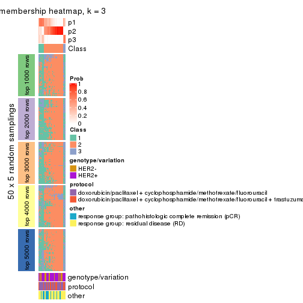</p>

</div>
<div id='tab-MAD-hclust-membership-heatmap-3'>
<pre><code class="r">membership_heatmap(res, k = 4)
</code></pre>

<p>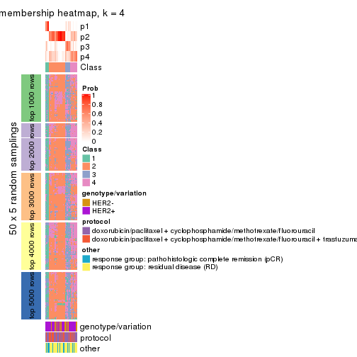</p>

</div>
<div id='tab-MAD-hclust-membership-heatmap-4'>
<pre><code class="r">membership_heatmap(res, k = 5)
</code></pre>

<p>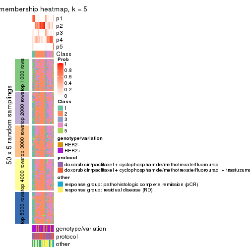</p>

</div>
<div id='tab-MAD-hclust-membership-heatmap-5'>
<pre><code class="r">membership_heatmap(res, k = 6)
</code></pre>

<p>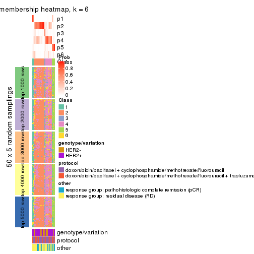</p>

</div>
</div>

As soon as we have had the classes for columns, we can look for signatures
which are significantly different between classes which can be candidate marks
for certain classes. Following are the heatmaps for signatures.


Signature heatmaps where rows are scaled:


<script>
$( function() {
	$( '#tabs-MAD-hclust-get-signatures' ).tabs();
} );
</script>
<div id='tabs-MAD-hclust-get-signatures'>
<ul>
<li><a href='#tab-MAD-hclust-get-signatures-1'>k = 2</a></li>
<li><a href='#tab-MAD-hclust-get-signatures-2'>k = 3</a></li>
<li><a href='#tab-MAD-hclust-get-signatures-3'>k = 4</a></li>
<li><a href='#tab-MAD-hclust-get-signatures-4'>k = 5</a></li>
<li><a href='#tab-MAD-hclust-get-signatures-5'>k = 6</a></li>
</ul>
<div id='tab-MAD-hclust-get-signatures-1'>
<pre><code class="r">get_signatures(res, k = 2)
</code></pre>

<pre><code>#&gt; Error: The width or height of the raster image is zero, maybe you forget to turn off the
#&gt; previous graphic device or it was corrupted. Run `dev.off()` to close it.
</code></pre>

<p></p>

</div>
<div id='tab-MAD-hclust-get-signatures-2'>
<pre><code class="r">get_signatures(res, k = 3)
</code></pre>

<pre><code>#&gt; Error: The width or height of the raster image is zero, maybe you forget to turn off the
#&gt; previous graphic device or it was corrupted. Run `dev.off()` to close it.
</code></pre>

<p></p>

</div>
<div id='tab-MAD-hclust-get-signatures-3'>
<pre><code class="r">get_signatures(res, k = 4)
</code></pre>

<pre><code>#&gt; Error: The width or height of the raster image is zero, maybe you forget to turn off the
#&gt; previous graphic device or it was corrupted. Run `dev.off()` to close it.
</code></pre>

<p></p>

</div>
<div id='tab-MAD-hclust-get-signatures-4'>
<pre><code class="r">get_signatures(res, k = 5)
</code></pre>

<pre><code>#&gt; Error: The width or height of the raster image is zero, maybe you forget to turn off the
#&gt; previous graphic device or it was corrupted. Run `dev.off()` to close it.
</code></pre>

<p></p>

</div>
<div id='tab-MAD-hclust-get-signatures-5'>
<pre><code class="r">get_signatures(res, k = 6)
</code></pre>

<pre><code>#&gt; Error: The width or height of the raster image is zero, maybe you forget to turn off the
#&gt; previous graphic device or it was corrupted. Run `dev.off()` to close it.
</code></pre>

<p></p>

</div>
</div>


Signature heatmaps where rows are not scaled:


<script>
$( function() {
	$( '#tabs-MAD-hclust-get-signatures-no-scale' ).tabs();
} );
</script>
<div id='tabs-MAD-hclust-get-signatures-no-scale'>
<ul>
<li><a href='#tab-MAD-hclust-get-signatures-no-scale-1'>k = 2</a></li>
<li><a href='#tab-MAD-hclust-get-signatures-no-scale-2'>k = 3</a></li>
<li><a href='#tab-MAD-hclust-get-signatures-no-scale-3'>k = 4</a></li>
<li><a href='#tab-MAD-hclust-get-signatures-no-scale-4'>k = 5</a></li>
<li><a href='#tab-MAD-hclust-get-signatures-no-scale-5'>k = 6</a></li>
</ul>
<div id='tab-MAD-hclust-get-signatures-no-scale-1'>
<pre><code class="r">get_signatures(res, k = 2, scale_rows = FALSE)
</code></pre>

<pre><code>#&gt; Error: The width or height of the raster image is zero, maybe you forget to turn off the
#&gt; previous graphic device or it was corrupted. Run `dev.off()` to close it.
</code></pre>

<p></p>

</div>
<div id='tab-MAD-hclust-get-signatures-no-scale-2'>
<pre><code class="r">get_signatures(res, k = 3, scale_rows = FALSE)
</code></pre>

<pre><code>#&gt; Error: The width or height of the raster image is zero, maybe you forget to turn off the
#&gt; previous graphic device or it was corrupted. Run `dev.off()` to close it.
</code></pre>

<p></p>

</div>
<div id='tab-MAD-hclust-get-signatures-no-scale-3'>
<pre><code class="r">get_signatures(res, k = 4, scale_rows = FALSE)
</code></pre>

<pre><code>#&gt; Error: The width or height of the raster image is zero, maybe you forget to turn off the
#&gt; previous graphic device or it was corrupted. Run `dev.off()` to close it.
</code></pre>

<p></p>

</div>
<div id='tab-MAD-hclust-get-signatures-no-scale-4'>
<pre><code class="r">get_signatures(res, k = 5, scale_rows = FALSE)
</code></pre>

<pre><code>#&gt; Error: The width or height of the raster image is zero, maybe you forget to turn off the
#&gt; previous graphic device or it was corrupted. Run `dev.off()` to close it.
</code></pre>

<p></p>

</div>
<div id='tab-MAD-hclust-get-signatures-no-scale-5'>
<pre><code class="r">get_signatures(res, k = 6, scale_rows = FALSE)
</code></pre>

<pre><code>#&gt; Error: The width or height of the raster image is zero, maybe you forget to turn off the
#&gt; previous graphic device or it was corrupted. Run `dev.off()` to close it.
</code></pre>

<p></p>

</div>
</div>


Compare the overlap of signatures from different k:

```r
compare_signatures(res)
```

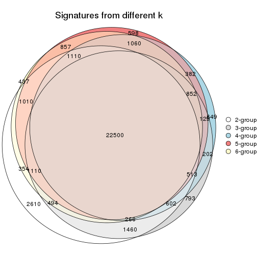

`get_signature()` returns a data frame invisibly. TO get the list of signatures, the function
call should be assigned to a variable explicitly. In following code, if `plot` argument is set
to `FALSE`, no heatmap is plotted while only the differential analysis is performed.

```r
# code only for demonstration
tb = get_signature(res, k = ..., plot = FALSE)
```

An example of the output of `tb` is:

```
#>   which_row         fdr    mean_1    mean_2 scaled_mean_1 scaled_mean_2 km
#> 1        38 0.042760348  8.373488  9.131774    -0.5533452     0.5164555  1
#> 2        40 0.018707592  7.106213  8.469186    -0.6173731     0.5762149  1
#> 3        55 0.019134737 10.221463 11.207825    -0.6159697     0.5749050  1
#> 4        59 0.006059896  5.921854  7.869574    -0.6899429     0.6439467  1
#> 5        60 0.018055526  8.928898 10.211722    -0.6204761     0.5791110  1
#> 6        98 0.009384629 15.714769 14.887706     0.6635654    -0.6193277  2
...
```

The columns in `tb` are:

1. `which_row`: row indices corresponding to the input matrix.
2. `fdr`: FDR for the differential test. 
3. `mean_x`: The mean value in group x.
4. `scaled_mean_x`: The mean value in group x after rows are scaled.
5. `km`: Row groups if k-means clustering is applied to rows.


UMAP plot which shows how samples are separated.


<script>
$( function() {
	$( '#tabs-MAD-hclust-dimension-reduction' ).tabs();
} );
</script>
<div id='tabs-MAD-hclust-dimension-reduction'>
<ul>
<li><a href='#tab-MAD-hclust-dimension-reduction-1'>k = 2</a></li>
<li><a href='#tab-MAD-hclust-dimension-reduction-2'>k = 3</a></li>
<li><a href='#tab-MAD-hclust-dimension-reduction-3'>k = 4</a></li>
<li><a href='#tab-MAD-hclust-dimension-reduction-4'>k = 5</a></li>
<li><a href='#tab-MAD-hclust-dimension-reduction-5'>k = 6</a></li>
</ul>
<div id='tab-MAD-hclust-dimension-reduction-1'>
<pre><code class="r">dimension_reduction(res, k = 2, method = &quot;UMAP&quot;)
</code></pre>

<p>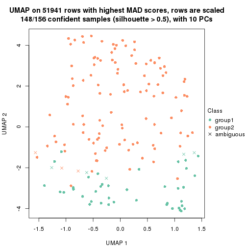</p>

</div>
<div id='tab-MAD-hclust-dimension-reduction-2'>
<pre><code class="r">dimension_reduction(res, k = 3, method = &quot;UMAP&quot;)
</code></pre>

<p>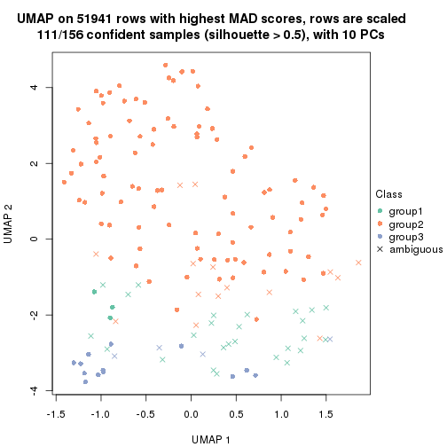</p>

</div>
<div id='tab-MAD-hclust-dimension-reduction-3'>
<pre><code class="r">dimension_reduction(res, k = 4, method = &quot;UMAP&quot;)
</code></pre>

<p>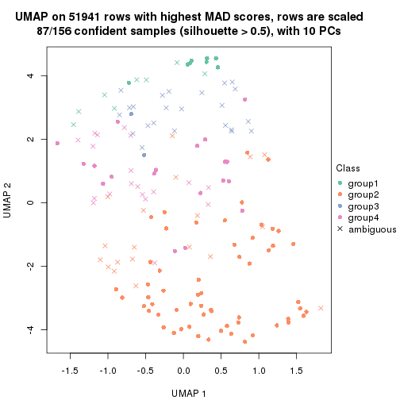</p>

</div>
<div id='tab-MAD-hclust-dimension-reduction-4'>
<pre><code class="r">dimension_reduction(res, k = 5, method = &quot;UMAP&quot;)
</code></pre>

<p>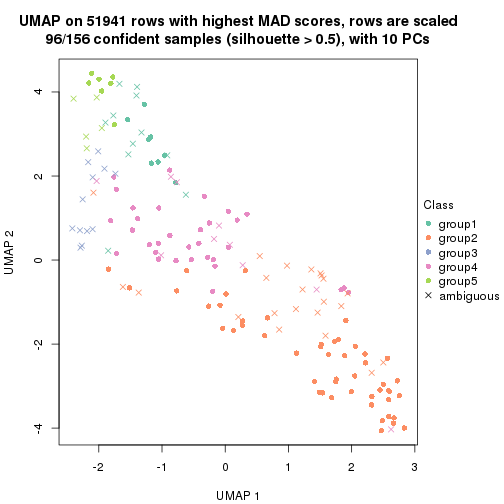</p>

</div>
<div id='tab-MAD-hclust-dimension-reduction-5'>
<pre><code class="r">dimension_reduction(res, k = 6, method = &quot;UMAP&quot;)
</code></pre>

<p>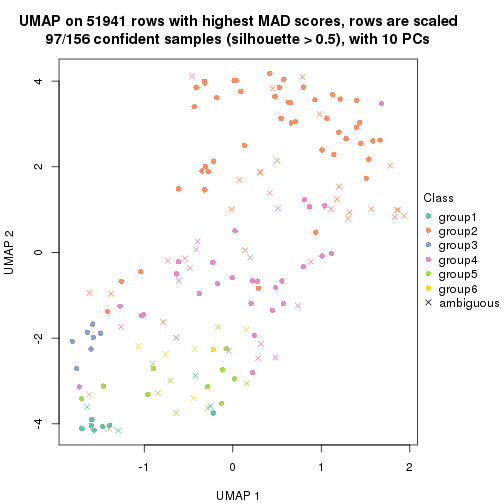</p>

</div>
</div>


Following heatmap shows how subgroups are split when increasing `k`:

```r
collect_classes(res)
```

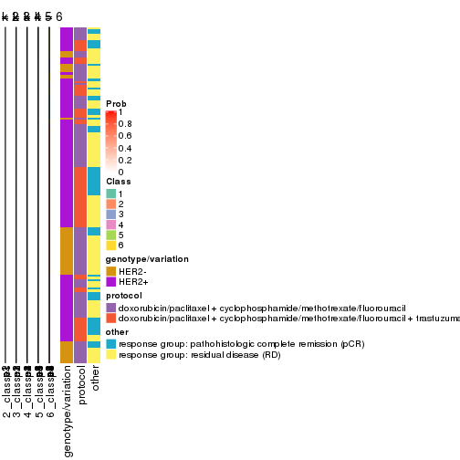


Test correlation between subgroups and known annotations. If the known
annotation is numeric, one-way ANOVA test is applied, and if the known
annotation is discrete, chi-squared contingency table test is applied.

```r
test_to_known_factors(res)
```

```
#>              n genotype/variation(p) protocol(p) other(p) k
#> MAD:hclust 148                0.2405       0.513    0.863 2
#> MAD:hclust 111                0.0259       0.713    0.762 3
#> MAD:hclust  87                0.0227       0.077    0.419 4
#> MAD:hclust  96                0.3988       0.604    0.182 5
#> MAD:hclust  97                0.2387       0.817    0.175 6
```


If matrix rows can be associated to genes, consider to use `functional_enrichment(res,
...)` to perform function enrichment for the signature genes. See [this vignette](http://bioconductor.org/packages/devel/bioc/vignettes/cola/inst/doc/functional_enrichment.html) for more detailed explanations.


 

---------------------------------------------------


### MAD:kmeans*


The object with results only for a single top-value method and a single partition method 
can be extracted as:

```r
res = res_list["MAD", "kmeans"]
# you can also extract it by
# res = res_list["MAD:kmeans"]
```

A summary of `res` and all the functions that can be applied to it:

```r
res
```

```
#> A 'ConsensusPartition' object with k = 2, 3, 4, 5, 6.
#>   On a matrix with 51941 rows and 156 columns.
#>   Top rows (1000, 2000, 3000, 4000, 5000) are extracted by 'MAD' method.
#>   Subgroups are detected by 'kmeans' method.
#>   Performed in total 1250 partitions by row resampling.
#>   Best k for subgroups seems to be 2.
#> 
#> Following methods can be applied to this 'ConsensusPartition' object:
#>  [1] "cola_report"             "collect_classes"         "collect_plots"          
#>  [4] "collect_stats"           "colnames"                "compare_signatures"     
#>  [7] "consensus_heatmap"       "dimension_reduction"     "functional_enrichment"  
#> [10] "get_anno_col"            "get_anno"                "get_classes"            
#> [13] "get_consensus"           "get_matrix"              "get_membership"         
#> [16] "get_param"               "get_signatures"          "get_stats"              
#> [19] "is_best_k"               "is_stable_k"             "membership_heatmap"     
#> [22] "ncol"                    "nrow"                    "plot_ecdf"              
#> [25] "rownames"                "select_partition_number" "show"                   
#> [28] "suggest_best_k"          "test_to_known_factors"
```

`collect_plots()` function collects all the plots made from `res` for all `k` (number of partitions)
into one single page to provide an easy and fast comparison between different `k`.

```r
collect_plots(res)
```

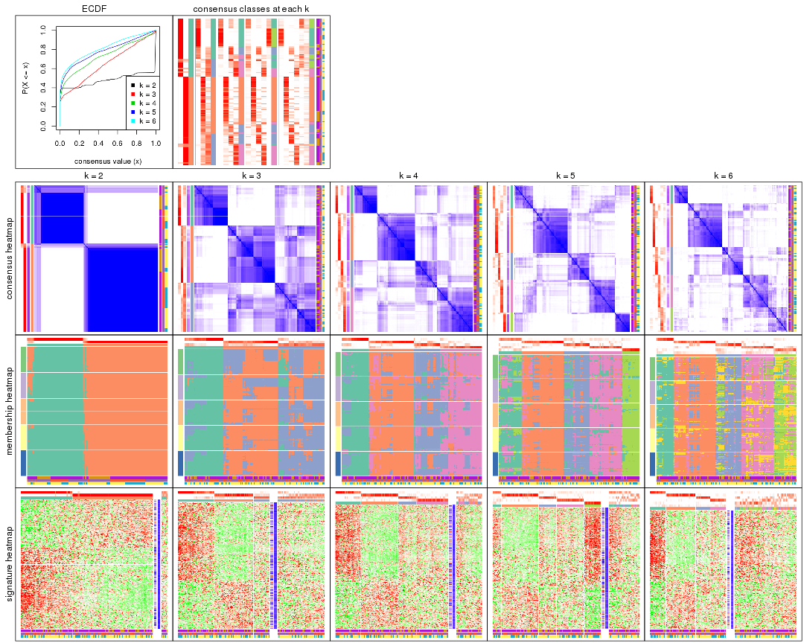

The plots are:

- The first row: a plot of the ECDF (empirical cumulative distribution
  function) curves of the consensus matrix for each `k` and the heatmap of
  predicted classes for each `k`.
- The second row: heatmaps of the consensus matrix for each `k`.
- The third row: heatmaps of the membership matrix for each `k`.
- The fouth row: heatmaps of the signatures for each `k`.

All the plots in panels can be made by individual functions and they are
plotted later in this section.

`select_partition_number()` produces several plots showing different
statistics for choosing "optimized" `k`. There are following statistics:

- ECDF curves of the consensus matrix for each `k`;
- 1-PAC. [The PAC
  score](https://en.wikipedia.org/wiki/Consensus_clustering#Over-interpretation_potential_of_consensus_clustering)
  measures the proportion of the ambiguous subgrouping.
- Mean silhouette score.
- Concordance. The mean probability of fiting the consensus class ids in all
  partitions.
- Area increased. Denote $A_k$ as the area under the ECDF curve for current
  `k`, the area increased is defined as $A_k - A_{k-1}$.
- Rand index. The percent of pairs of samples that are both in a same cluster
  or both are not in a same cluster in the partition of k and k-1.
- Jaccard index. The ratio of pairs of samples are both in a same cluster in
  the partition of k and k-1 and the pairs of samples are both in a same
  cluster in the partition k or k-1.

The detailed explanations of these statistics can be found in [the _cola_
vignette](http://bioconductor.org/packages/devel/bioc/vignettes/cola/inst/doc/cola.html#toc_13).

Generally speaking, lower PAC score, higher mean silhouette score or higher
concordance corresponds to better partition. Rand index and Jaccard index
measure how similar the current partition is compared to partition with `k-1`.
If they are too similar, we won't accept `k` is better than `k-1`.

```r
select_partition_number(res)
```

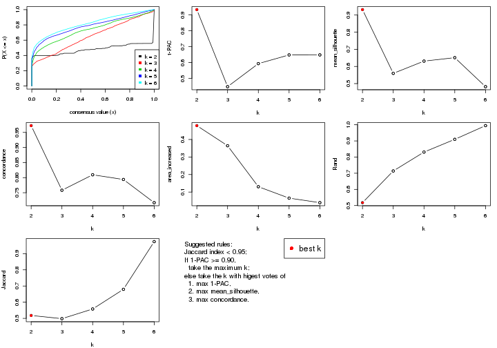

The numeric values for all these statistics can be obtained by `get_stats()`.

```r
get_stats(res)
```

```
#>   k 1-PAC mean_silhouette concordance area_increased  Rand Jaccard
#> 2 2 0.933           0.931       0.972         0.4789 0.518   0.518
#> 3 3 0.448           0.560       0.758         0.3643 0.714   0.498
#> 4 4 0.593           0.631       0.810         0.1306 0.831   0.558
#> 5 5 0.648           0.651       0.794         0.0654 0.910   0.680
#> 6 6 0.648           0.482       0.717         0.0396 0.994   0.974
```

`suggest_best_k()` suggests the best $k$ based on these statistics. The rules are as follows:

- All $k$ with Jaccard index larger than 0.95 are removed because increasing
  $k$ does not provide enough extra information. If all $k$ are removed, it is
  marked as no subgroup is detected.
- For all $k$ with 1-PAC score larger than 0.9, the maximal $k$ is taken as
  the best $k$, and other $k$ are marked as optional $k$.
- If it does not fit the second rule. The $k$ with the maximal vote of the
  highest 1-PAC score, highest mean silhouette, and highest concordance is
  taken as the best $k$.

```r
suggest_best_k(res)
```

```
#> [1] 2
```


Following shows the table of the partitions (You need to click the **show/hide
code output** link to see it). The membership matrix (columns with name `p*`)
is inferred by
[`clue::cl_consensus()`](https://www.rdocumentation.org/link/cl_consensus?package=clue)
function with the `SE` method. Basically the value in the membership matrix
represents the probability to belong to a certain group. The finall class
label for an item is determined with the group with highest probability it
belongs to.

In `get_classes()` function, the entropy is calculated from the membership
matrix and the silhouette score is calculated from the consensus matrix.


<script>
$( function() {
	$( '#tabs-MAD-kmeans-get-classes' ).tabs();
} );
</script>
<div id='tabs-MAD-kmeans-get-classes'>
<ul>
<li><a href='#tab-MAD-kmeans-get-classes-1'>k = 2</a></li>
<li><a href='#tab-MAD-kmeans-get-classes-2'>k = 3</a></li>
<li><a href='#tab-MAD-kmeans-get-classes-3'>k = 4</a></li>
<li><a href='#tab-MAD-kmeans-get-classes-4'>k = 5</a></li>
<li><a href='#tab-MAD-kmeans-get-classes-5'>k = 6</a></li>
</ul>

<div id='tab-MAD-kmeans-get-classes-1'>
<p><a id='tab-MAD-kmeans-get-classes-1-a' style='color:#0366d6' href='#'>show/hide code output</a></p>
<pre><code class="r">cbind(get_classes(res, k = 2), get_membership(res, k = 2))
</code></pre>

<pre><code>#&gt;            class entropy silhouette    p1    p2
#&gt; GSM1232995     2  0.0000      0.981 0.000 1.000
#&gt; GSM1233002     2  0.9686      0.297 0.396 0.604
#&gt; GSM1233003     1  0.0000      0.956 1.000 0.000
#&gt; GSM1233014     2  0.0000      0.981 0.000 1.000
#&gt; GSM1233015     1  0.0000      0.956 1.000 0.000
#&gt; GSM1233016     2  0.7139      0.740 0.196 0.804
#&gt; GSM1233024     2  0.0000      0.981 0.000 1.000
#&gt; GSM1233049     1  0.0000      0.956 1.000 0.000
#&gt; GSM1233064     2  0.0000      0.981 0.000 1.000
#&gt; GSM1233068     1  0.7745      0.711 0.772 0.228
#&gt; GSM1233073     1  0.9552      0.438 0.624 0.376
#&gt; GSM1233093     1  0.0000      0.956 1.000 0.000
#&gt; GSM1233115     1  0.0000      0.956 1.000 0.000
#&gt; GSM1232992     2  0.0000      0.981 0.000 1.000
#&gt; GSM1232993     2  0.0000      0.981 0.000 1.000
#&gt; GSM1233005     2  0.0000      0.981 0.000 1.000
#&gt; GSM1233007     2  0.0000      0.981 0.000 1.000
#&gt; GSM1233010     1  0.9286      0.510 0.656 0.344
#&gt; GSM1233013     2  0.0000      0.981 0.000 1.000
#&gt; GSM1233018     2  0.0000      0.981 0.000 1.000
#&gt; GSM1233019     2  0.0000      0.981 0.000 1.000
#&gt; GSM1233021     2  0.0000      0.981 0.000 1.000
#&gt; GSM1233025     1  0.0376      0.953 0.996 0.004
#&gt; GSM1233029     2  0.0000      0.981 0.000 1.000
#&gt; GSM1233030     2  0.0000      0.981 0.000 1.000
#&gt; GSM1233031     2  0.0000      0.981 0.000 1.000
#&gt; GSM1233032     1  0.0000      0.956 1.000 0.000
#&gt; GSM1233035     1  0.7602      0.723 0.780 0.220
#&gt; GSM1233038     1  0.0000      0.956 1.000 0.000
#&gt; GSM1233039     2  0.0000      0.981 0.000 1.000
#&gt; GSM1233042     2  0.0000      0.981 0.000 1.000
#&gt; GSM1233043     2  0.0000      0.981 0.000 1.000
#&gt; GSM1233044     1  0.0000      0.956 1.000 0.000
#&gt; GSM1233046     1  0.0000      0.956 1.000 0.000
#&gt; GSM1233051     1  0.0000      0.956 1.000 0.000
#&gt; GSM1233054     1  0.9427      0.477 0.640 0.360
#&gt; GSM1233057     2  0.0000      0.981 0.000 1.000
#&gt; GSM1233060     2  0.0000      0.981 0.000 1.000
#&gt; GSM1233062     2  0.0000      0.981 0.000 1.000
#&gt; GSM1233075     2  0.0000      0.981 0.000 1.000
#&gt; GSM1233078     1  0.9522      0.449 0.628 0.372
#&gt; GSM1233079     1  0.0000      0.956 1.000 0.000
#&gt; GSM1233082     1  0.0376      0.953 0.996 0.004
#&gt; GSM1233083     1  0.0000      0.956 1.000 0.000
#&gt; GSM1233091     2  0.0000      0.981 0.000 1.000
#&gt; GSM1233095     1  0.0000      0.956 1.000 0.000
#&gt; GSM1233096     1  0.0000      0.956 1.000 0.000
#&gt; GSM1233101     1  0.0000      0.956 1.000 0.000
#&gt; GSM1233105     1  0.0000      0.956 1.000 0.000
#&gt; GSM1233117     2  0.0000      0.981 0.000 1.000
#&gt; GSM1233118     2  0.0000      0.981 0.000 1.000
#&gt; GSM1233001     2  0.0000      0.981 0.000 1.000
#&gt; GSM1233006     2  0.0000      0.981 0.000 1.000
#&gt; GSM1233008     2  0.0000      0.981 0.000 1.000
#&gt; GSM1233009     2  0.0000      0.981 0.000 1.000
#&gt; GSM1233017     2  0.0000      0.981 0.000 1.000
#&gt; GSM1233020     2  0.0000      0.981 0.000 1.000
#&gt; GSM1233022     2  0.0000      0.981 0.000 1.000
#&gt; GSM1233026     2  0.0000      0.981 0.000 1.000
#&gt; GSM1233028     2  0.0000      0.981 0.000 1.000
#&gt; GSM1233034     2  0.0000      0.981 0.000 1.000
#&gt; GSM1233040     1  0.0000      0.956 1.000 0.000
#&gt; GSM1233048     1  0.0000      0.956 1.000 0.000
#&gt; GSM1233056     1  0.0000      0.956 1.000 0.000
#&gt; GSM1233058     2  0.0000      0.981 0.000 1.000
#&gt; GSM1233059     1  0.0000      0.956 1.000 0.000
#&gt; GSM1233066     2  0.0000      0.981 0.000 1.000
#&gt; GSM1233071     2  0.0000      0.981 0.000 1.000
#&gt; GSM1233074     2  0.0000      0.981 0.000 1.000
#&gt; GSM1233076     2  0.0000      0.981 0.000 1.000
#&gt; GSM1233080     1  0.0000      0.956 1.000 0.000
#&gt; GSM1233088     2  0.0000      0.981 0.000 1.000
#&gt; GSM1233090     1  0.0000      0.956 1.000 0.000
#&gt; GSM1233092     2  0.0000      0.981 0.000 1.000
#&gt; GSM1233094     2  0.0000      0.981 0.000 1.000
#&gt; GSM1233097     2  0.0000      0.981 0.000 1.000
#&gt; GSM1233100     1  0.9866      0.290 0.568 0.432
#&gt; GSM1233104     2  0.0000      0.981 0.000 1.000
#&gt; GSM1233106     1  0.0000      0.956 1.000 0.000
#&gt; GSM1233111     1  0.0000      0.956 1.000 0.000
#&gt; GSM1233122     2  0.0000      0.981 0.000 1.000
#&gt; GSM1233146     2  0.0000      0.981 0.000 1.000
#&gt; GSM1232994     2  0.0000      0.981 0.000 1.000
#&gt; GSM1232996     2  0.0000      0.981 0.000 1.000
#&gt; GSM1232997     2  0.0000      0.981 0.000 1.000
#&gt; GSM1232998     2  0.0000      0.981 0.000 1.000
#&gt; GSM1232999     2  0.0000      0.981 0.000 1.000
#&gt; GSM1233000     2  0.0000      0.981 0.000 1.000
#&gt; GSM1233004     1  0.8267      0.662 0.740 0.260
#&gt; GSM1233011     2  0.0000      0.981 0.000 1.000
#&gt; GSM1233012     2  0.0000      0.981 0.000 1.000
#&gt; GSM1233023     2  0.0000      0.981 0.000 1.000
#&gt; GSM1233027     2  0.0000      0.981 0.000 1.000
#&gt; GSM1233033     1  0.0000      0.956 1.000 0.000
#&gt; GSM1233036     2  0.0000      0.981 0.000 1.000
#&gt; GSM1233037     2  0.0000      0.981 0.000 1.000
#&gt; GSM1233041     1  0.0000      0.956 1.000 0.000
#&gt; GSM1233045     2  0.0000      0.981 0.000 1.000
#&gt; GSM1233047     1  0.0000      0.956 1.000 0.000
#&gt; GSM1233050     1  0.0000      0.956 1.000 0.000
#&gt; GSM1233052     1  0.0000      0.956 1.000 0.000
#&gt; GSM1233053     1  0.0000      0.956 1.000 0.000
#&gt; GSM1233055     1  0.0000      0.956 1.000 0.000
#&gt; GSM1233061     2  0.1414      0.962 0.020 0.980
#&gt; GSM1233063     1  0.0000      0.956 1.000 0.000
#&gt; GSM1233065     2  0.0000      0.981 0.000 1.000
#&gt; GSM1233070     2  0.0000      0.981 0.000 1.000
#&gt; GSM1233077     2  0.0000      0.981 0.000 1.000
#&gt; GSM1233081     1  0.0000      0.956 1.000 0.000
#&gt; GSM1233084     1  0.0000      0.956 1.000 0.000
#&gt; GSM1233087     1  0.0376      0.953 0.996 0.004
#&gt; GSM1233089     2  0.0000      0.981 0.000 1.000
#&gt; GSM1233099     1  0.0000      0.956 1.000 0.000
#&gt; GSM1233112     1  0.0000      0.956 1.000 0.000
#&gt; GSM1233085     1  0.0000      0.956 1.000 0.000
#&gt; GSM1233098     2  0.0000      0.981 0.000 1.000
#&gt; GSM1233114     1  0.0000      0.956 1.000 0.000
#&gt; GSM1233119     2  0.7745      0.691 0.228 0.772
#&gt; GSM1233129     2  0.0000      0.981 0.000 1.000
#&gt; GSM1233132     1  0.0000      0.956 1.000 0.000
#&gt; GSM1233139     2  0.0000      0.981 0.000 1.000
#&gt; GSM1233143     2  0.0000      0.981 0.000 1.000
#&gt; GSM1233145     1  0.0000      0.956 1.000 0.000
#&gt; GSM1233067     2  0.0000      0.981 0.000 1.000
#&gt; GSM1233069     2  0.0000      0.981 0.000 1.000
#&gt; GSM1233072     2  0.0000      0.981 0.000 1.000
#&gt; GSM1233086     2  0.0000      0.981 0.000 1.000
#&gt; GSM1233102     1  0.0000      0.956 1.000 0.000
#&gt; GSM1233103     2  0.9983      0.022 0.476 0.524
#&gt; GSM1233107     2  0.9393      0.431 0.356 0.644
#&gt; GSM1233108     1  0.0000      0.956 1.000 0.000
#&gt; GSM1233109     1  0.0000      0.956 1.000 0.000
#&gt; GSM1233110     2  0.0938      0.970 0.012 0.988
#&gt; GSM1233113     2  0.0000      0.981 0.000 1.000
#&gt; GSM1233116     2  0.0000      0.981 0.000 1.000
#&gt; GSM1233120     1  0.0000      0.956 1.000 0.000
#&gt; GSM1233121     2  0.0000      0.981 0.000 1.000
#&gt; GSM1233123     2  0.0000      0.981 0.000 1.000
#&gt; GSM1233124     2  0.0000      0.981 0.000 1.000
#&gt; GSM1233125     1  0.0000      0.956 1.000 0.000
#&gt; GSM1233126     2  0.0376      0.977 0.004 0.996
#&gt; GSM1233127     2  0.0000      0.981 0.000 1.000
#&gt; GSM1233128     1  0.0000      0.956 1.000 0.000
#&gt; GSM1233130     2  0.0000      0.981 0.000 1.000
#&gt; GSM1233131     1  0.0000      0.956 1.000 0.000
#&gt; GSM1233133     1  0.0000      0.956 1.000 0.000
#&gt; GSM1233134     2  0.0000      0.981 0.000 1.000
#&gt; GSM1233135     2  0.0000      0.981 0.000 1.000
#&gt; GSM1233136     2  0.0000      0.981 0.000 1.000
#&gt; GSM1233137     1  0.0000      0.956 1.000 0.000
#&gt; GSM1233138     2  0.0000      0.981 0.000 1.000
#&gt; GSM1233140     1  0.0000      0.956 1.000 0.000
#&gt; GSM1233141     2  0.0000      0.981 0.000 1.000
#&gt; GSM1233142     2  0.0000      0.981 0.000 1.000
#&gt; GSM1233144     1  0.0000      0.956 1.000 0.000
#&gt; GSM1233147     2  0.0000      0.981 0.000 1.000
</code></pre>

<script>
$('#tab-MAD-kmeans-get-classes-1-a').parent().next().next().hide();
$('#tab-MAD-kmeans-get-classes-1-a').click(function(){
  $('#tab-MAD-kmeans-get-classes-1-a').parent().next().next().toggle();
  return(false);
});
</script>
</div>

<div id='tab-MAD-kmeans-get-classes-2'>
<p><a id='tab-MAD-kmeans-get-classes-2-a' style='color:#0366d6' href='#'>show/hide code output</a></p>
<pre><code class="r">cbind(get_classes(res, k = 3), get_membership(res, k = 3))
</code></pre>

<pre><code>#&gt;            class entropy silhouette    p1    p2    p3
#&gt; GSM1232995     2  0.0237     0.7191 0.000 0.996 0.004
#&gt; GSM1233002     3  0.5731     0.6022 0.020 0.228 0.752
#&gt; GSM1233003     1  0.0237     0.8569 0.996 0.000 0.004
#&gt; GSM1233014     2  0.6308    -0.1640 0.000 0.508 0.492
#&gt; GSM1233015     1  0.5926     0.5881 0.644 0.000 0.356
#&gt; GSM1233016     3  0.5726     0.6057 0.024 0.216 0.760
#&gt; GSM1233024     2  0.4702     0.5320 0.000 0.788 0.212
#&gt; GSM1233049     1  0.0000     0.8581 1.000 0.000 0.000
#&gt; GSM1233064     2  0.6008     0.4096 0.000 0.628 0.372
#&gt; GSM1233068     3  0.5772     0.4922 0.220 0.024 0.756
#&gt; GSM1233073     3  0.5967     0.6065 0.032 0.216 0.752
#&gt; GSM1233093     1  0.0000     0.8581 1.000 0.000 0.000
#&gt; GSM1233115     1  0.5760     0.6209 0.672 0.000 0.328
#&gt; GSM1232992     2  0.0000     0.7191 0.000 1.000 0.000
#&gt; GSM1232993     2  0.5859     0.2919 0.000 0.656 0.344
#&gt; GSM1233005     2  0.0000     0.7191 0.000 1.000 0.000
#&gt; GSM1233007     2  0.5785     0.2074 0.000 0.668 0.332
#&gt; GSM1233010     3  0.6049     0.6096 0.040 0.204 0.756
#&gt; GSM1233013     2  0.0237     0.7183 0.000 0.996 0.004
#&gt; GSM1233018     2  0.0000     0.7191 0.000 1.000 0.000
#&gt; GSM1233019     2  0.2878     0.6681 0.000 0.904 0.096
#&gt; GSM1233021     2  0.0000     0.7191 0.000 1.000 0.000
#&gt; GSM1233025     3  0.5493     0.4915 0.232 0.012 0.756
#&gt; GSM1233029     2  0.2878     0.6699 0.000 0.904 0.096
#&gt; GSM1233030     2  0.1031     0.7105 0.000 0.976 0.024
#&gt; GSM1233031     3  0.5058     0.5905 0.000 0.244 0.756
#&gt; GSM1233032     1  0.3116     0.8488 0.892 0.000 0.108
#&gt; GSM1233035     3  0.5842     0.6090 0.036 0.196 0.768
#&gt; GSM1233038     1  0.0237     0.8569 0.996 0.000 0.004
#&gt; GSM1233039     3  0.6215     0.1469 0.000 0.428 0.572
#&gt; GSM1233042     3  0.6180     0.3660 0.000 0.416 0.584
#&gt; GSM1233043     3  0.6244     0.3135 0.000 0.440 0.560
#&gt; GSM1233044     3  0.5722     0.3691 0.292 0.004 0.704
#&gt; GSM1233046     3  0.5291     0.4288 0.268 0.000 0.732
#&gt; GSM1233051     1  0.3879     0.8260 0.848 0.000 0.152
#&gt; GSM1233054     3  0.6621     0.2757 0.032 0.284 0.684
#&gt; GSM1233057     2  0.6305     0.2168 0.000 0.516 0.484
#&gt; GSM1233060     3  0.5058     0.5905 0.000 0.244 0.756
#&gt; GSM1233062     2  0.5968     0.2420 0.000 0.636 0.364
#&gt; GSM1233075     2  0.4931     0.6235 0.000 0.768 0.232
#&gt; GSM1233078     3  0.4682     0.4155 0.004 0.192 0.804
#&gt; GSM1233079     1  0.2711     0.8524 0.912 0.000 0.088
#&gt; GSM1233082     3  0.6062     0.1706 0.384 0.000 0.616
#&gt; GSM1233083     1  0.0000     0.8581 1.000 0.000 0.000
#&gt; GSM1233091     3  0.3816     0.4962 0.000 0.148 0.852
#&gt; GSM1233095     1  0.0000     0.8581 1.000 0.000 0.000
#&gt; GSM1233096     1  0.3267     0.8433 0.884 0.000 0.116
#&gt; GSM1233101     1  0.0000     0.8581 1.000 0.000 0.000
#&gt; GSM1233105     3  0.5882     0.2849 0.348 0.000 0.652
#&gt; GSM1233117     2  0.0237     0.7191 0.000 0.996 0.004
#&gt; GSM1233118     2  0.4399     0.6536 0.000 0.812 0.188
#&gt; GSM1233001     2  0.3879     0.6711 0.000 0.848 0.152
#&gt; GSM1233006     2  0.5363     0.4289 0.000 0.724 0.276
#&gt; GSM1233008     2  0.0237     0.7183 0.000 0.996 0.004
#&gt; GSM1233009     2  0.2878     0.6681 0.000 0.904 0.096
#&gt; GSM1233017     2  0.2878     0.6681 0.000 0.904 0.096
#&gt; GSM1233020     2  0.0000     0.7191 0.000 1.000 0.000
#&gt; GSM1233022     2  0.5948     0.2525 0.000 0.640 0.360
#&gt; GSM1233026     3  0.4931     0.5980 0.000 0.232 0.768
#&gt; GSM1233028     3  0.4931     0.5966 0.000 0.232 0.768
#&gt; GSM1233034     2  0.3340     0.6860 0.000 0.880 0.120
#&gt; GSM1233040     1  0.3116     0.8476 0.892 0.000 0.108
#&gt; GSM1233048     1  0.0000     0.8581 1.000 0.000 0.000
#&gt; GSM1233056     1  0.0000     0.8581 1.000 0.000 0.000
#&gt; GSM1233058     3  0.4974     0.5966 0.000 0.236 0.764
#&gt; GSM1233059     1  0.0000     0.8581 1.000 0.000 0.000
#&gt; GSM1233066     3  0.4974     0.3728 0.000 0.236 0.764
#&gt; GSM1233071     2  0.6095     0.1457 0.000 0.608 0.392
#&gt; GSM1233074     2  0.4842     0.6301 0.000 0.776 0.224
#&gt; GSM1233076     3  0.6095     0.2574 0.000 0.392 0.608
#&gt; GSM1233080     1  0.0000     0.8581 1.000 0.000 0.000
#&gt; GSM1233088     3  0.5397     0.3186 0.000 0.280 0.720
#&gt; GSM1233090     1  0.0000     0.8581 1.000 0.000 0.000
#&gt; GSM1233092     3  0.6309     0.1699 0.000 0.496 0.504
#&gt; GSM1233094     3  0.6079     0.4128 0.000 0.388 0.612
#&gt; GSM1233097     3  0.5905     0.4754 0.000 0.352 0.648
#&gt; GSM1233100     3  0.5816     0.6038 0.024 0.224 0.752
#&gt; GSM1233104     3  0.6225     0.3322 0.000 0.432 0.568
#&gt; GSM1233106     1  0.6244     0.3869 0.560 0.000 0.440
#&gt; GSM1233111     1  0.3412     0.8416 0.876 0.000 0.124
#&gt; GSM1233122     2  0.0000     0.7191 0.000 1.000 0.000
#&gt; GSM1233146     3  0.5733     0.5091 0.000 0.324 0.676
#&gt; GSM1232994     2  0.3340     0.6458 0.000 0.880 0.120
#&gt; GSM1232996     2  0.0000     0.7191 0.000 1.000 0.000
#&gt; GSM1232997     2  0.4796     0.6333 0.000 0.780 0.220
#&gt; GSM1232998     2  0.5706     0.3436 0.000 0.680 0.320
#&gt; GSM1232999     2  0.5560     0.3868 0.000 0.700 0.300
#&gt; GSM1233000     2  0.2878     0.6681 0.000 0.904 0.096
#&gt; GSM1233004     3  0.4189     0.5321 0.056 0.068 0.876
#&gt; GSM1233011     3  0.6299    -0.0647 0.000 0.476 0.524
#&gt; GSM1233012     2  0.4121     0.6665 0.000 0.832 0.168
#&gt; GSM1233023     2  0.4702     0.6391 0.000 0.788 0.212
#&gt; GSM1233027     2  0.4235     0.5845 0.000 0.824 0.176
#&gt; GSM1233033     1  0.2165     0.8555 0.936 0.000 0.064
#&gt; GSM1233036     2  0.6215     0.3511 0.000 0.572 0.428
#&gt; GSM1233037     2  0.6307     0.2071 0.000 0.512 0.488
#&gt; GSM1233041     1  0.0000     0.8581 1.000 0.000 0.000
#&gt; GSM1233045     3  0.5926     0.4667 0.000 0.356 0.644
#&gt; GSM1233047     1  0.6095     0.6188 0.608 0.000 0.392
#&gt; GSM1233050     1  0.0000     0.8581 1.000 0.000 0.000
#&gt; GSM1233052     3  0.5926     0.2576 0.356 0.000 0.644
#&gt; GSM1233053     1  0.3816     0.8286 0.852 0.000 0.148
#&gt; GSM1233055     1  0.0000     0.8581 1.000 0.000 0.000
#&gt; GSM1233061     3  0.5497     0.2761 0.000 0.292 0.708
#&gt; GSM1233063     1  0.3267     0.8433 0.884 0.000 0.116
#&gt; GSM1233065     2  0.4702     0.6391 0.000 0.788 0.212
#&gt; GSM1233070     2  0.6008     0.2013 0.000 0.628 0.372
#&gt; GSM1233077     2  0.6204     0.3894 0.000 0.576 0.424
#&gt; GSM1233081     1  0.5760     0.6873 0.672 0.000 0.328
#&gt; GSM1233084     1  0.0000     0.8581 1.000 0.000 0.000
#&gt; GSM1233087     3  0.6154     0.5334 0.204 0.044 0.752
#&gt; GSM1233089     2  0.0592     0.7180 0.000 0.988 0.012
#&gt; GSM1233099     3  0.5987     0.5247 0.208 0.036 0.756
#&gt; GSM1233112     1  0.0000     0.8581 1.000 0.000 0.000
#&gt; GSM1233085     1  0.5810     0.6855 0.664 0.000 0.336
#&gt; GSM1233098     2  0.0000     0.7191 0.000 1.000 0.000
#&gt; GSM1233114     1  0.4399     0.7949 0.812 0.000 0.188
#&gt; GSM1233119     3  0.5967     0.6072 0.032 0.216 0.752
#&gt; GSM1233129     2  0.4796     0.6334 0.000 0.780 0.220
#&gt; GSM1233132     1  0.4654     0.7706 0.792 0.000 0.208
#&gt; GSM1233139     2  0.0592     0.7186 0.000 0.988 0.012
#&gt; GSM1233143     2  0.1753     0.7111 0.000 0.952 0.048
#&gt; GSM1233145     1  0.0237     0.8569 0.996 0.000 0.004
#&gt; GSM1233067     2  0.4750     0.6361 0.000 0.784 0.216
#&gt; GSM1233069     2  0.4974     0.6206 0.000 0.764 0.236
#&gt; GSM1233072     2  0.0000     0.7191 0.000 1.000 0.000
#&gt; GSM1233086     3  0.6062     0.1422 0.000 0.384 0.616
#&gt; GSM1233102     3  0.6045     0.3635 0.380 0.000 0.620
#&gt; GSM1233103     3  0.5219     0.6086 0.016 0.196 0.788
#&gt; GSM1233107     3  0.6372     0.6096 0.084 0.152 0.764
#&gt; GSM1233108     1  0.3192     0.8479 0.888 0.000 0.112
#&gt; GSM1233109     1  0.6095     0.6091 0.608 0.000 0.392
#&gt; GSM1233110     3  0.5988     0.1330 0.000 0.368 0.632
#&gt; GSM1233113     2  0.4504     0.6491 0.000 0.804 0.196
#&gt; GSM1233116     2  0.4504     0.6497 0.000 0.804 0.196
#&gt; GSM1233120     3  0.5465     0.4519 0.288 0.000 0.712
#&gt; GSM1233121     3  0.6252    -0.0704 0.000 0.444 0.556
#&gt; GSM1233123     3  0.6026     0.1156 0.000 0.376 0.624
#&gt; GSM1233124     3  0.6295    -0.1413 0.000 0.472 0.528
#&gt; GSM1233125     1  0.3267     0.8472 0.884 0.000 0.116
#&gt; GSM1233126     3  0.6521     0.1779 0.004 0.492 0.504
#&gt; GSM1233127     2  0.3941     0.6053 0.000 0.844 0.156
#&gt; GSM1233128     1  0.0000     0.8581 1.000 0.000 0.000
#&gt; GSM1233130     3  0.5785     0.2094 0.000 0.332 0.668
#&gt; GSM1233131     3  0.6252    -0.0231 0.444 0.000 0.556
#&gt; GSM1233133     1  0.6079     0.6247 0.612 0.000 0.388
#&gt; GSM1233134     2  0.5138     0.6096 0.000 0.748 0.252
#&gt; GSM1233135     2  0.4931     0.6235 0.000 0.768 0.232
#&gt; GSM1233136     2  0.6204     0.3894 0.000 0.576 0.424
#&gt; GSM1233137     1  0.6274     0.5254 0.544 0.000 0.456
#&gt; GSM1233138     3  0.6309     0.1699 0.000 0.496 0.504
#&gt; GSM1233140     1  0.3482     0.8413 0.872 0.000 0.128
#&gt; GSM1233141     2  0.2959     0.6700 0.000 0.900 0.100
#&gt; GSM1233142     2  0.2878     0.6681 0.000 0.904 0.096
#&gt; GSM1233144     1  0.6678     0.4665 0.512 0.008 0.480
#&gt; GSM1233147     2  0.6235     0.1111 0.000 0.564 0.436
</code></pre>

<script>
$('#tab-MAD-kmeans-get-classes-2-a').parent().next().next().hide();
$('#tab-MAD-kmeans-get-classes-2-a').click(function(){
  $('#tab-MAD-kmeans-get-classes-2-a').parent().next().next().toggle();
  return(false);
});
</script>
</div>

<div id='tab-MAD-kmeans-get-classes-3'>
<p><a id='tab-MAD-kmeans-get-classes-3-a' style='color:#0366d6' href='#'>show/hide code output</a></p>
<pre><code class="r">cbind(get_classes(res, k = 4), get_membership(res, k = 4))
</code></pre>

<pre><code>#&gt;            class entropy silhouette    p1    p2    p3    p4
#&gt; GSM1232995     2  0.0524     0.8213 0.000 0.988 0.008 0.004
#&gt; GSM1233002     4  0.1488     0.7320 0.000 0.032 0.012 0.956
#&gt; GSM1233003     1  0.2300     0.8196 0.924 0.000 0.028 0.048
#&gt; GSM1233014     4  0.4677     0.4234 0.000 0.316 0.004 0.680
#&gt; GSM1233015     4  0.8017     0.0588 0.272 0.004 0.348 0.376
#&gt; GSM1233016     4  0.2032     0.7305 0.000 0.028 0.036 0.936
#&gt; GSM1233024     2  0.2999     0.7590 0.000 0.864 0.004 0.132
#&gt; GSM1233049     1  0.0000     0.8356 1.000 0.000 0.000 0.000
#&gt; GSM1233064     2  0.7679    -0.1170 0.000 0.424 0.356 0.220
#&gt; GSM1233068     4  0.4969     0.5479 0.008 0.004 0.312 0.676
#&gt; GSM1233073     4  0.1297     0.7325 0.000 0.020 0.016 0.964
#&gt; GSM1233093     1  0.0188     0.8369 0.996 0.000 0.000 0.004
#&gt; GSM1233115     4  0.7918    -0.0544 0.316 0.000 0.332 0.352
#&gt; GSM1232992     2  0.0672     0.8222 0.000 0.984 0.008 0.008
#&gt; GSM1232993     2  0.3208     0.7502 0.000 0.848 0.004 0.148
#&gt; GSM1233005     2  0.0672     0.8222 0.000 0.984 0.008 0.008
#&gt; GSM1233007     2  0.5723     0.3477 0.000 0.580 0.032 0.388
#&gt; GSM1233010     4  0.1284     0.7312 0.000 0.012 0.024 0.964
#&gt; GSM1233013     2  0.0336     0.8211 0.000 0.992 0.000 0.008
#&gt; GSM1233018     2  0.0524     0.8213 0.000 0.988 0.008 0.004
#&gt; GSM1233019     2  0.1109     0.8165 0.000 0.968 0.004 0.028
#&gt; GSM1233021     2  0.0672     0.8222 0.000 0.984 0.008 0.008
#&gt; GSM1233025     4  0.1209     0.7268 0.004 0.000 0.032 0.964
#&gt; GSM1233029     2  0.1305     0.8147 0.000 0.960 0.004 0.036
#&gt; GSM1233030     2  0.0469     0.8205 0.000 0.988 0.000 0.012
#&gt; GSM1233031     4  0.2111     0.7326 0.000 0.044 0.024 0.932
#&gt; GSM1233032     1  0.5193     0.6591 0.656 0.000 0.324 0.020
#&gt; GSM1233035     4  0.4936     0.5761 0.000 0.020 0.280 0.700
#&gt; GSM1233038     1  0.2124     0.8207 0.932 0.000 0.028 0.040
#&gt; GSM1233039     3  0.7878     0.2796 0.000 0.284 0.376 0.340
#&gt; GSM1233042     4  0.3105     0.6840 0.000 0.140 0.004 0.856
#&gt; GSM1233043     4  0.3105     0.6840 0.000 0.140 0.004 0.856
#&gt; GSM1233044     4  0.2737     0.7004 0.008 0.000 0.104 0.888
#&gt; GSM1233046     4  0.5326     0.5481 0.012 0.012 0.308 0.668
#&gt; GSM1233051     1  0.6039     0.6216 0.596 0.000 0.348 0.056
#&gt; GSM1233054     3  0.1690     0.6635 0.008 0.008 0.952 0.032
#&gt; GSM1233057     3  0.5271     0.4846 0.000 0.340 0.640 0.020
#&gt; GSM1233060     4  0.3279     0.7203 0.000 0.096 0.032 0.872
#&gt; GSM1233062     2  0.4819     0.4902 0.000 0.652 0.004 0.344
#&gt; GSM1233075     3  0.4996     0.1640 0.000 0.484 0.516 0.000
#&gt; GSM1233078     3  0.1388     0.6713 0.000 0.012 0.960 0.028
#&gt; GSM1233079     1  0.5069     0.6645 0.664 0.000 0.320 0.016
#&gt; GSM1233082     4  0.5717     0.5049 0.044 0.000 0.324 0.632
#&gt; GSM1233083     1  0.1520     0.8295 0.956 0.000 0.020 0.024
#&gt; GSM1233091     4  0.6558     0.3077 0.000 0.108 0.296 0.596
#&gt; GSM1233095     1  0.0188     0.8369 0.996 0.000 0.000 0.004
#&gt; GSM1233096     1  0.5745     0.6729 0.656 0.000 0.288 0.056
#&gt; GSM1233101     1  0.0188     0.8369 0.996 0.000 0.000 0.004
#&gt; GSM1233105     4  0.5877     0.5531 0.068 0.000 0.276 0.656
#&gt; GSM1233117     2  0.0672     0.8222 0.000 0.984 0.008 0.008
#&gt; GSM1233118     2  0.3024     0.7193 0.000 0.852 0.148 0.000
#&gt; GSM1233001     2  0.2011     0.7796 0.000 0.920 0.080 0.000
#&gt; GSM1233006     2  0.4483     0.6044 0.000 0.712 0.004 0.284
#&gt; GSM1233008     2  0.0672     0.8222 0.000 0.984 0.008 0.008
#&gt; GSM1233009     2  0.0921     0.8174 0.000 0.972 0.000 0.028
#&gt; GSM1233017     2  0.0921     0.8174 0.000 0.972 0.000 0.028
#&gt; GSM1233020     2  0.0336     0.8199 0.000 0.992 0.008 0.000
#&gt; GSM1233022     2  0.4964     0.4153 0.000 0.616 0.004 0.380
#&gt; GSM1233026     4  0.1284     0.7307 0.000 0.024 0.012 0.964
#&gt; GSM1233028     4  0.1388     0.7318 0.000 0.028 0.012 0.960
#&gt; GSM1233034     2  0.2125     0.7810 0.000 0.920 0.076 0.004
#&gt; GSM1233040     1  0.5130     0.6696 0.668 0.000 0.312 0.020
#&gt; GSM1233048     1  0.0469     0.8365 0.988 0.000 0.000 0.012
#&gt; GSM1233056     1  0.0336     0.8364 0.992 0.000 0.000 0.008
#&gt; GSM1233058     4  0.1004     0.7308 0.000 0.024 0.004 0.972
#&gt; GSM1233059     1  0.0188     0.8369 0.996 0.000 0.000 0.004
#&gt; GSM1233066     3  0.5524     0.5250 0.000 0.048 0.676 0.276
#&gt; GSM1233071     2  0.4840     0.6359 0.000 0.732 0.028 0.240
#&gt; GSM1233074     2  0.4134     0.5558 0.000 0.740 0.260 0.000
#&gt; GSM1233076     4  0.6798     0.3185 0.000 0.172 0.224 0.604
#&gt; GSM1233080     1  0.0188     0.8369 0.996 0.000 0.000 0.004
#&gt; GSM1233088     3  0.3731     0.6505 0.000 0.120 0.844 0.036
#&gt; GSM1233090     1  0.0188     0.8369 0.996 0.000 0.000 0.004
#&gt; GSM1233092     4  0.3945     0.6081 0.000 0.216 0.004 0.780
#&gt; GSM1233094     4  0.2546     0.7117 0.000 0.092 0.008 0.900
#&gt; GSM1233097     4  0.1661     0.7262 0.000 0.052 0.004 0.944
#&gt; GSM1233100     4  0.1624     0.7329 0.000 0.028 0.020 0.952
#&gt; GSM1233104     4  0.2401     0.7112 0.000 0.092 0.004 0.904
#&gt; GSM1233106     4  0.6952     0.3676 0.120 0.000 0.364 0.516
#&gt; GSM1233111     1  0.5793     0.6504 0.628 0.000 0.324 0.048
#&gt; GSM1233122     2  0.0672     0.8222 0.000 0.984 0.008 0.008
#&gt; GSM1233146     4  0.1970     0.7237 0.000 0.060 0.008 0.932
#&gt; GSM1232994     2  0.1109     0.8165 0.000 0.968 0.004 0.028
#&gt; GSM1232996     2  0.0524     0.8213 0.000 0.988 0.008 0.004
#&gt; GSM1232997     2  0.4277     0.5152 0.000 0.720 0.280 0.000
#&gt; GSM1232998     2  0.5161     0.1800 0.000 0.520 0.004 0.476
#&gt; GSM1232999     2  0.4800     0.4915 0.000 0.656 0.004 0.340
#&gt; GSM1233000     2  0.0921     0.8174 0.000 0.972 0.000 0.028
#&gt; GSM1233004     4  0.5099     0.2249 0.000 0.008 0.380 0.612
#&gt; GSM1233011     4  0.7661     0.0323 0.000 0.272 0.264 0.464
#&gt; GSM1233012     2  0.1940     0.7834 0.000 0.924 0.076 0.000
#&gt; GSM1233023     2  0.3172     0.7060 0.000 0.840 0.160 0.000
#&gt; GSM1233027     2  0.4049     0.6823 0.000 0.780 0.008 0.212
#&gt; GSM1233033     1  0.5070     0.7441 0.748 0.000 0.192 0.060
#&gt; GSM1233036     3  0.5517     0.3398 0.000 0.412 0.568 0.020
#&gt; GSM1233037     3  0.4004     0.6474 0.000 0.164 0.812 0.024
#&gt; GSM1233041     1  0.0657     0.8367 0.984 0.000 0.012 0.004
#&gt; GSM1233045     4  0.2334     0.7147 0.000 0.088 0.004 0.908
#&gt; GSM1233047     3  0.3198     0.6001 0.080 0.000 0.880 0.040
#&gt; GSM1233050     1  0.0188     0.8369 0.996 0.000 0.000 0.004
#&gt; GSM1233052     4  0.6098     0.5139 0.076 0.000 0.292 0.632
#&gt; GSM1233053     1  0.5149     0.6381 0.648 0.000 0.336 0.016
#&gt; GSM1233055     1  0.0336     0.8364 0.992 0.000 0.000 0.008
#&gt; GSM1233061     3  0.1388     0.6717 0.000 0.012 0.960 0.028
#&gt; GSM1233063     1  0.5712     0.6692 0.644 0.000 0.308 0.048
#&gt; GSM1233065     2  0.3710     0.6635 0.000 0.804 0.192 0.004
#&gt; GSM1233070     2  0.5007     0.4601 0.000 0.636 0.008 0.356
#&gt; GSM1233077     3  0.6621     0.5402 0.000 0.140 0.616 0.244
#&gt; GSM1233081     3  0.3557     0.5718 0.108 0.000 0.856 0.036
#&gt; GSM1233084     1  0.0779     0.8364 0.980 0.000 0.016 0.004
#&gt; GSM1233087     4  0.1114     0.7271 0.016 0.004 0.008 0.972
#&gt; GSM1233089     2  0.0592     0.8167 0.000 0.984 0.016 0.000
#&gt; GSM1233099     4  0.1284     0.7276 0.012 0.000 0.024 0.964
#&gt; GSM1233112     1  0.1297     0.8309 0.964 0.000 0.016 0.020
#&gt; GSM1233085     3  0.3984     0.5339 0.132 0.000 0.828 0.040
#&gt; GSM1233098     2  0.0927     0.8212 0.000 0.976 0.016 0.008
#&gt; GSM1233114     4  0.7923    -0.1192 0.324 0.000 0.332 0.344
#&gt; GSM1233119     4  0.0992     0.7299 0.004 0.008 0.012 0.976
#&gt; GSM1233129     2  0.4277     0.5185 0.000 0.720 0.280 0.000
#&gt; GSM1233132     4  0.7646     0.1978 0.292 0.000 0.244 0.464
#&gt; GSM1233139     2  0.1284     0.8196 0.000 0.964 0.012 0.024
#&gt; GSM1233143     2  0.1151     0.8160 0.000 0.968 0.024 0.008
#&gt; GSM1233145     1  0.2546     0.8066 0.912 0.000 0.028 0.060
#&gt; GSM1233067     2  0.4454     0.4921 0.000 0.692 0.308 0.000
#&gt; GSM1233069     3  0.5070     0.4178 0.000 0.372 0.620 0.008
#&gt; GSM1233072     2  0.0672     0.8222 0.000 0.984 0.008 0.008
#&gt; GSM1233086     3  0.6637     0.3739 0.000 0.092 0.540 0.368
#&gt; GSM1233102     4  0.3056     0.7068 0.072 0.000 0.040 0.888
#&gt; GSM1233103     4  0.5013     0.5649 0.000 0.020 0.292 0.688
#&gt; GSM1233107     4  0.4952     0.5861 0.008 0.012 0.268 0.712
#&gt; GSM1233108     3  0.5408    -0.4313 0.488 0.000 0.500 0.012
#&gt; GSM1233109     3  0.3215     0.5890 0.092 0.000 0.876 0.032
#&gt; GSM1233110     3  0.2174     0.6820 0.000 0.052 0.928 0.020
#&gt; GSM1233113     2  0.2281     0.7672 0.000 0.904 0.096 0.000
#&gt; GSM1233116     2  0.3052     0.7362 0.000 0.860 0.136 0.004
#&gt; GSM1233120     4  0.2871     0.7090 0.072 0.000 0.032 0.896
#&gt; GSM1233121     3  0.6351     0.5309 0.000 0.104 0.628 0.268
#&gt; GSM1233123     3  0.2089     0.6811 0.000 0.048 0.932 0.020
#&gt; GSM1233124     3  0.6303     0.5991 0.000 0.192 0.660 0.148
#&gt; GSM1233125     1  0.5407     0.4249 0.504 0.000 0.484 0.012
#&gt; GSM1233126     4  0.3498     0.6592 0.000 0.160 0.008 0.832
#&gt; GSM1233127     2  0.3649     0.6969 0.000 0.796 0.000 0.204
#&gt; GSM1233128     1  0.1284     0.8337 0.964 0.000 0.024 0.012
#&gt; GSM1233130     3  0.4224     0.6430 0.000 0.044 0.812 0.144
#&gt; GSM1233131     4  0.6013     0.5146 0.064 0.000 0.312 0.624
#&gt; GSM1233133     3  0.2593     0.5981 0.080 0.000 0.904 0.016
#&gt; GSM1233134     3  0.4661     0.4556 0.000 0.348 0.652 0.000
#&gt; GSM1233135     3  0.4776     0.4097 0.000 0.376 0.624 0.000
#&gt; GSM1233136     3  0.6621     0.5402 0.000 0.140 0.616 0.244
#&gt; GSM1233137     3  0.2949     0.6121 0.088 0.000 0.888 0.024
#&gt; GSM1233138     4  0.3545     0.6559 0.000 0.164 0.008 0.828
#&gt; GSM1233140     1  0.6016     0.5375 0.544 0.000 0.412 0.044
#&gt; GSM1233141     2  0.3311     0.7279 0.000 0.828 0.000 0.172
#&gt; GSM1233142     2  0.1940     0.7985 0.000 0.924 0.000 0.076
#&gt; GSM1233144     3  0.2111     0.6429 0.044 0.000 0.932 0.024
#&gt; GSM1233147     4  0.7028     0.3318 0.000 0.228 0.196 0.576
</code></pre>

<script>
$('#tab-MAD-kmeans-get-classes-3-a').parent().next().next().hide();
$('#tab-MAD-kmeans-get-classes-3-a').click(function(){
  $('#tab-MAD-kmeans-get-classes-3-a').parent().next().next().toggle();
  return(false);
});
</script>
</div>

<div id='tab-MAD-kmeans-get-classes-4'>
<p><a id='tab-MAD-kmeans-get-classes-4-a' style='color:#0366d6' href='#'>show/hide code output</a></p>
<pre><code class="r">cbind(get_classes(res, k = 5), get_membership(res, k = 5))
</code></pre>

<pre><code>#&gt;            class entropy silhouette    p1    p2    p3    p4    p5
#&gt; GSM1232995     2  0.0566     0.8325 0.004 0.984 0.012 0.000 0.000
#&gt; GSM1233002     4  0.2756     0.7665 0.096 0.012 0.012 0.880 0.000
#&gt; GSM1233003     5  0.3876     0.7601 0.192 0.000 0.000 0.032 0.776
#&gt; GSM1233014     4  0.3443     0.6952 0.012 0.164 0.008 0.816 0.000
#&gt; GSM1233015     1  0.5223     0.6217 0.748 0.000 0.076 0.092 0.084
#&gt; GSM1233016     4  0.3681     0.6916 0.184 0.008 0.008 0.796 0.004
#&gt; GSM1233024     2  0.3059     0.7872 0.028 0.860 0.004 0.108 0.000
#&gt; GSM1233049     5  0.0404     0.8844 0.012 0.000 0.000 0.000 0.988
#&gt; GSM1233064     3  0.6927     0.2806 0.056 0.336 0.500 0.108 0.000
#&gt; GSM1233068     1  0.5375     0.3956 0.568 0.000 0.044 0.380 0.008
#&gt; GSM1233073     4  0.1809     0.7698 0.060 0.012 0.000 0.928 0.000
#&gt; GSM1233093     5  0.0404     0.8845 0.012 0.000 0.000 0.000 0.988
#&gt; GSM1233115     1  0.6267     0.5824 0.616 0.000 0.044 0.240 0.100
#&gt; GSM1232992     2  0.0000     0.8330 0.000 1.000 0.000 0.000 0.000
#&gt; GSM1232993     2  0.3651     0.7456 0.028 0.808 0.004 0.160 0.000
#&gt; GSM1233005     2  0.0740     0.8338 0.008 0.980 0.004 0.008 0.000
#&gt; GSM1233007     4  0.6375     0.4645 0.020 0.284 0.132 0.564 0.000
#&gt; GSM1233010     4  0.3239     0.7279 0.156 0.004 0.012 0.828 0.000
#&gt; GSM1233013     2  0.0162     0.8329 0.000 0.996 0.000 0.004 0.000
#&gt; GSM1233018     2  0.0740     0.8329 0.008 0.980 0.008 0.004 0.000
#&gt; GSM1233019     2  0.0771     0.8316 0.004 0.976 0.000 0.020 0.000
#&gt; GSM1233021     2  0.0740     0.8338 0.008 0.980 0.004 0.008 0.000
#&gt; GSM1233025     4  0.3578     0.6903 0.204 0.000 0.008 0.784 0.004
#&gt; GSM1233029     2  0.1547     0.8293 0.016 0.948 0.004 0.032 0.000
#&gt; GSM1233030     2  0.0162     0.8329 0.000 0.996 0.000 0.004 0.000
#&gt; GSM1233031     4  0.3561     0.6946 0.188 0.008 0.008 0.796 0.000
#&gt; GSM1233032     1  0.5426     0.4226 0.608 0.000 0.084 0.000 0.308
#&gt; GSM1233035     1  0.5636     0.3283 0.524 0.016 0.044 0.416 0.000
#&gt; GSM1233038     5  0.2171     0.8513 0.064 0.000 0.000 0.024 0.912
#&gt; GSM1233039     3  0.7344     0.3789 0.076 0.176 0.516 0.232 0.000
#&gt; GSM1233042     4  0.2645     0.7518 0.012 0.096 0.008 0.884 0.000
#&gt; GSM1233043     4  0.2645     0.7518 0.012 0.096 0.008 0.884 0.000
#&gt; GSM1233044     4  0.4045     0.6870 0.148 0.000 0.056 0.792 0.004
#&gt; GSM1233046     1  0.5853     0.3895 0.540 0.004 0.052 0.388 0.016
#&gt; GSM1233051     1  0.4671     0.5199 0.712 0.000 0.040 0.008 0.240
#&gt; GSM1233054     3  0.4114     0.4748 0.376 0.000 0.624 0.000 0.000
#&gt; GSM1233057     3  0.4879     0.6396 0.124 0.156 0.720 0.000 0.000
#&gt; GSM1233060     4  0.4978     0.6787 0.156 0.092 0.016 0.736 0.000
#&gt; GSM1233062     2  0.4958     0.4377 0.032 0.616 0.004 0.348 0.000
#&gt; GSM1233075     3  0.4639     0.3455 0.020 0.368 0.612 0.000 0.000
#&gt; GSM1233078     3  0.0880     0.7246 0.032 0.000 0.968 0.000 0.000
#&gt; GSM1233079     1  0.5405     0.4076 0.596 0.000 0.076 0.000 0.328
#&gt; GSM1233082     1  0.4810     0.5782 0.692 0.000 0.024 0.264 0.020
#&gt; GSM1233083     5  0.2505     0.8358 0.092 0.000 0.000 0.020 0.888
#&gt; GSM1233091     4  0.7017     0.2921 0.180 0.028 0.324 0.468 0.000
#&gt; GSM1233095     5  0.0609     0.8846 0.020 0.000 0.000 0.000 0.980
#&gt; GSM1233096     1  0.4358     0.5177 0.696 0.000 0.008 0.012 0.284
#&gt; GSM1233101     5  0.0703     0.8844 0.024 0.000 0.000 0.000 0.976
#&gt; GSM1233105     1  0.4972     0.4585 0.612 0.004 0.000 0.352 0.032
#&gt; GSM1233117     2  0.0727     0.8340 0.004 0.980 0.004 0.012 0.000
#&gt; GSM1233118     2  0.3882     0.6592 0.020 0.756 0.224 0.000 0.000
#&gt; GSM1233001     2  0.2408     0.7876 0.016 0.892 0.092 0.000 0.000
#&gt; GSM1233006     2  0.4220     0.5490 0.008 0.688 0.004 0.300 0.000
#&gt; GSM1233008     2  0.0162     0.8332 0.000 0.996 0.004 0.000 0.000
#&gt; GSM1233009     2  0.1547     0.8271 0.032 0.948 0.004 0.016 0.000
#&gt; GSM1233017     2  0.1564     0.8256 0.024 0.948 0.004 0.024 0.000
#&gt; GSM1233020     2  0.0566     0.8321 0.004 0.984 0.012 0.000 0.000
#&gt; GSM1233022     2  0.5377     0.1083 0.044 0.496 0.004 0.456 0.000
#&gt; GSM1233026     4  0.3504     0.7368 0.160 0.008 0.016 0.816 0.000
#&gt; GSM1233028     4  0.2753     0.7608 0.104 0.008 0.012 0.876 0.000
#&gt; GSM1233034     2  0.2775     0.7914 0.036 0.884 0.076 0.004 0.000
#&gt; GSM1233040     1  0.4854     0.4646 0.648 0.000 0.044 0.000 0.308
#&gt; GSM1233048     5  0.1792     0.8426 0.084 0.000 0.000 0.000 0.916
#&gt; GSM1233056     5  0.0671     0.8800 0.016 0.000 0.000 0.004 0.980
#&gt; GSM1233058     4  0.2748     0.7630 0.096 0.008 0.016 0.880 0.000
#&gt; GSM1233059     5  0.0880     0.8807 0.032 0.000 0.000 0.000 0.968
#&gt; GSM1233066     3  0.2162     0.7169 0.012 0.008 0.916 0.064 0.000
#&gt; GSM1233071     2  0.5287     0.6533 0.092 0.708 0.020 0.180 0.000
#&gt; GSM1233074     2  0.4437     0.5106 0.020 0.664 0.316 0.000 0.000
#&gt; GSM1233076     4  0.5784     0.5267 0.056 0.040 0.268 0.636 0.000
#&gt; GSM1233080     5  0.0510     0.8844 0.016 0.000 0.000 0.000 0.984
#&gt; GSM1233088     3  0.5698     0.4873 0.308 0.052 0.612 0.028 0.000
#&gt; GSM1233090     5  0.0794     0.8824 0.028 0.000 0.000 0.000 0.972
#&gt; GSM1233092     4  0.3018     0.7364 0.012 0.116 0.012 0.860 0.000
#&gt; GSM1233094     4  0.2130     0.7599 0.012 0.080 0.000 0.908 0.000
#&gt; GSM1233097     4  0.2270     0.7744 0.052 0.020 0.012 0.916 0.000
#&gt; GSM1233100     4  0.2395     0.7704 0.072 0.016 0.008 0.904 0.000
#&gt; GSM1233104     4  0.1695     0.7756 0.008 0.044 0.008 0.940 0.000
#&gt; GSM1233106     1  0.5407     0.6281 0.728 0.000 0.076 0.132 0.064
#&gt; GSM1233111     1  0.4573     0.5029 0.688 0.000 0.028 0.004 0.280
#&gt; GSM1233122     2  0.0324     0.8335 0.004 0.992 0.004 0.000 0.000
#&gt; GSM1233146     4  0.1356     0.7753 0.012 0.028 0.004 0.956 0.000
#&gt; GSM1232994     2  0.1646     0.8252 0.020 0.944 0.004 0.032 0.000
#&gt; GSM1232996     2  0.0740     0.8329 0.008 0.980 0.008 0.004 0.000
#&gt; GSM1232997     2  0.4584     0.5064 0.028 0.660 0.312 0.000 0.000
#&gt; GSM1232998     4  0.4353     0.4746 0.004 0.328 0.008 0.660 0.000
#&gt; GSM1232999     2  0.4816    -0.0551 0.008 0.496 0.008 0.488 0.000
#&gt; GSM1233000     2  0.0510     0.8327 0.000 0.984 0.000 0.016 0.000
#&gt; GSM1233004     4  0.5492     0.5033 0.076 0.000 0.312 0.608 0.004
#&gt; GSM1233011     4  0.6432     0.4199 0.032 0.112 0.288 0.568 0.000
#&gt; GSM1233012     2  0.1830     0.8153 0.012 0.932 0.052 0.004 0.000
#&gt; GSM1233023     2  0.4024     0.6561 0.028 0.752 0.220 0.000 0.000
#&gt; GSM1233027     2  0.3561     0.7084 0.008 0.796 0.008 0.188 0.000
#&gt; GSM1233033     1  0.4946     0.3112 0.596 0.000 0.000 0.036 0.368
#&gt; GSM1233036     3  0.5065     0.5335 0.048 0.264 0.676 0.012 0.000
#&gt; GSM1233037     3  0.5297     0.4664 0.360 0.060 0.580 0.000 0.000
#&gt; GSM1233041     5  0.2329     0.8217 0.124 0.000 0.000 0.000 0.876
#&gt; GSM1233045     4  0.3113     0.7648 0.100 0.020 0.016 0.864 0.000
#&gt; GSM1233047     3  0.5107     0.3872 0.356 0.000 0.596 0.000 0.048
#&gt; GSM1233050     5  0.2020     0.8317 0.100 0.000 0.000 0.000 0.900
#&gt; GSM1233052     1  0.5762     0.3996 0.544 0.000 0.040 0.388 0.028
#&gt; GSM1233053     1  0.5928     0.4013 0.548 0.000 0.124 0.000 0.328
#&gt; GSM1233055     5  0.0671     0.8799 0.016 0.000 0.000 0.004 0.980
#&gt; GSM1233061     3  0.1121     0.7225 0.044 0.000 0.956 0.000 0.000
#&gt; GSM1233063     1  0.4455     0.4969 0.692 0.000 0.008 0.016 0.284
#&gt; GSM1233065     2  0.4248     0.6312 0.032 0.728 0.240 0.000 0.000
#&gt; GSM1233070     2  0.5270     0.3297 0.016 0.584 0.028 0.372 0.000
#&gt; GSM1233077     3  0.3046     0.7067 0.020 0.028 0.876 0.076 0.000
#&gt; GSM1233081     3  0.4645     0.5236 0.268 0.000 0.688 0.000 0.044
#&gt; GSM1233084     5  0.0963     0.8820 0.036 0.000 0.000 0.000 0.964
#&gt; GSM1233087     4  0.1857     0.7697 0.060 0.000 0.008 0.928 0.004
#&gt; GSM1233089     2  0.0798     0.8322 0.008 0.976 0.016 0.000 0.000
#&gt; GSM1233099     4  0.3419     0.7068 0.180 0.000 0.016 0.804 0.000
#&gt; GSM1233112     5  0.2305     0.8411 0.092 0.000 0.000 0.012 0.896
#&gt; GSM1233085     3  0.5066     0.3976 0.344 0.000 0.608 0.000 0.048
#&gt; GSM1233098     2  0.2047     0.8232 0.012 0.928 0.020 0.040 0.000
#&gt; GSM1233114     1  0.4881     0.6117 0.744 0.000 0.012 0.132 0.112
#&gt; GSM1233119     4  0.2563     0.7614 0.120 0.000 0.008 0.872 0.000
#&gt; GSM1233129     2  0.4747     0.4207 0.028 0.620 0.352 0.000 0.000
#&gt; GSM1233132     1  0.6189     0.5494 0.596 0.000 0.024 0.268 0.112
#&gt; GSM1233139     2  0.1492     0.8287 0.040 0.948 0.004 0.008 0.000
#&gt; GSM1233143     2  0.2263     0.8235 0.036 0.920 0.020 0.024 0.000
#&gt; GSM1233145     5  0.3134     0.8051 0.120 0.000 0.000 0.032 0.848
#&gt; GSM1233067     2  0.4147     0.5483 0.008 0.676 0.316 0.000 0.000
#&gt; GSM1233069     3  0.2727     0.7055 0.016 0.116 0.868 0.000 0.000
#&gt; GSM1233072     2  0.0290     0.8328 0.000 0.992 0.008 0.000 0.000
#&gt; GSM1233086     3  0.5313     0.2590 0.024 0.024 0.596 0.356 0.000
#&gt; GSM1233102     4  0.3764     0.7001 0.156 0.000 0.000 0.800 0.044
#&gt; GSM1233103     1  0.5157     0.2954 0.520 0.000 0.040 0.440 0.000
#&gt; GSM1233107     1  0.5419     0.3186 0.560 0.008 0.036 0.392 0.004
#&gt; GSM1233108     1  0.6955     0.0356 0.352 0.000 0.320 0.004 0.324
#&gt; GSM1233109     3  0.4114     0.6259 0.176 0.000 0.776 0.004 0.044
#&gt; GSM1233110     3  0.0963     0.7248 0.036 0.000 0.964 0.000 0.000
#&gt; GSM1233113     2  0.2522     0.7793 0.012 0.880 0.108 0.000 0.000
#&gt; GSM1233116     2  0.3391     0.7135 0.012 0.800 0.188 0.000 0.000
#&gt; GSM1233120     4  0.4290     0.6735 0.196 0.000 0.004 0.756 0.044
#&gt; GSM1233121     3  0.2861     0.7079 0.016 0.024 0.884 0.076 0.000
#&gt; GSM1233123     3  0.0880     0.7253 0.032 0.000 0.968 0.000 0.000
#&gt; GSM1233124     3  0.2434     0.7296 0.024 0.040 0.912 0.024 0.000
#&gt; GSM1233125     5  0.6942    -0.0890 0.348 0.000 0.296 0.004 0.352
#&gt; GSM1233126     4  0.3460     0.7428 0.088 0.048 0.008 0.852 0.004
#&gt; GSM1233127     2  0.4675     0.7026 0.088 0.744 0.004 0.164 0.000
#&gt; GSM1233128     5  0.2583     0.8157 0.132 0.000 0.000 0.004 0.864
#&gt; GSM1233130     3  0.1200     0.7273 0.016 0.008 0.964 0.012 0.000
#&gt; GSM1233131     1  0.4946     0.5004 0.636 0.000 0.012 0.328 0.024
#&gt; GSM1233133     3  0.4355     0.5744 0.224 0.000 0.732 0.000 0.044
#&gt; GSM1233134     3  0.2654     0.7205 0.032 0.084 0.884 0.000 0.000
#&gt; GSM1233135     3  0.2563     0.7056 0.008 0.120 0.872 0.000 0.000
#&gt; GSM1233136     3  0.3046     0.7067 0.020 0.028 0.876 0.076 0.000
#&gt; GSM1233137     3  0.4233     0.5988 0.208 0.000 0.748 0.000 0.044
#&gt; GSM1233138     4  0.3209     0.7510 0.068 0.060 0.008 0.864 0.000
#&gt; GSM1233140     1  0.5420     0.4921 0.664 0.000 0.112 0.004 0.220
#&gt; GSM1233141     2  0.4181     0.7428 0.076 0.788 0.004 0.132 0.000
#&gt; GSM1233142     2  0.3338     0.7878 0.068 0.852 0.004 0.076 0.000
#&gt; GSM1233144     3  0.3456     0.6389 0.184 0.000 0.800 0.000 0.016
#&gt; GSM1233147     4  0.5161     0.5472 0.020 0.040 0.272 0.668 0.000
</code></pre>

<script>
$('#tab-MAD-kmeans-get-classes-4-a').parent().next().next().hide();
$('#tab-MAD-kmeans-get-classes-4-a').click(function(){
  $('#tab-MAD-kmeans-get-classes-4-a').parent().next().next().toggle();
  return(false);
});
</script>
</div>

<div id='tab-MAD-kmeans-get-classes-5'>
<p><a id='tab-MAD-kmeans-get-classes-5-a' style='color:#0366d6' href='#'>show/hide code output</a></p>
<pre><code class="r">cbind(get_classes(res, k = 6), get_membership(res, k = 6))
</code></pre>

<pre><code>#&gt;            class entropy silhouette    p1    p2    p3    p4    p5    p6
#&gt; GSM1232995     2  0.1003    0.77081 0.000 0.964 0.016 0.000 0.000 0.020
#&gt; GSM1233002     4  0.2152    0.59556 0.000 0.004 0.000 0.904 0.068 0.024
#&gt; GSM1233003     1  0.6506    0.42081 0.492 0.000 0.000 0.048 0.196 0.264
#&gt; GSM1233014     4  0.4854    0.52291 0.000 0.152 0.000 0.664 0.000 0.184
#&gt; GSM1233015     5  0.2639    0.28436 0.008 0.000 0.000 0.084 0.876 0.032
#&gt; GSM1233016     4  0.5827    0.22189 0.008 0.008 0.004 0.472 0.096 0.412
#&gt; GSM1233024     2  0.3857    0.67581 0.000 0.768 0.000 0.080 0.000 0.152
#&gt; GSM1233049     1  0.0603    0.84847 0.980 0.000 0.000 0.000 0.016 0.004
#&gt; GSM1233064     3  0.6341    0.12971 0.000 0.372 0.464 0.124 0.012 0.028
#&gt; GSM1233068     5  0.4763   -0.16476 0.000 0.000 0.004 0.440 0.516 0.040
#&gt; GSM1233073     4  0.3043    0.58241 0.000 0.008 0.000 0.832 0.020 0.140
#&gt; GSM1233093     1  0.0713    0.84910 0.972 0.000 0.000 0.000 0.028 0.000
#&gt; GSM1233115     5  0.6612    0.00195 0.032 0.000 0.032 0.328 0.492 0.116
#&gt; GSM1232992     2  0.0146    0.77179 0.000 0.996 0.000 0.004 0.000 0.000
#&gt; GSM1232993     2  0.4693    0.57002 0.000 0.684 0.000 0.176 0.000 0.140
#&gt; GSM1233005     2  0.0603    0.77270 0.000 0.980 0.004 0.016 0.000 0.000
#&gt; GSM1233007     4  0.6663    0.35395 0.000 0.288 0.136 0.488 0.000 0.088
#&gt; GSM1233010     4  0.3210    0.49807 0.000 0.000 0.000 0.812 0.152 0.036
#&gt; GSM1233013     2  0.0291    0.77136 0.000 0.992 0.000 0.004 0.000 0.004
#&gt; GSM1233018     2  0.0551    0.77244 0.000 0.984 0.004 0.008 0.000 0.004
#&gt; GSM1233019     2  0.1196    0.76557 0.000 0.952 0.000 0.008 0.000 0.040
#&gt; GSM1233021     2  0.0603    0.77270 0.000 0.980 0.004 0.016 0.000 0.000
#&gt; GSM1233025     4  0.5526    0.26147 0.008 0.000 0.004 0.552 0.104 0.332
#&gt; GSM1233029     2  0.1856    0.75838 0.000 0.920 0.000 0.032 0.000 0.048
#&gt; GSM1233030     2  0.1124    0.76679 0.000 0.956 0.000 0.008 0.000 0.036
#&gt; GSM1233031     4  0.4663    0.30325 0.000 0.000 0.000 0.684 0.192 0.124
#&gt; GSM1233032     5  0.4828    0.39635 0.108 0.000 0.004 0.000 0.668 0.220
#&gt; GSM1233035     5  0.6104   -0.74430 0.000 0.008 0.000 0.216 0.452 0.324
#&gt; GSM1233038     1  0.3186    0.80024 0.824 0.000 0.000 0.016 0.016 0.144
#&gt; GSM1233039     3  0.7025    0.29226 0.000 0.160 0.500 0.252 0.056 0.032
#&gt; GSM1233042     4  0.4199    0.57768 0.000 0.100 0.000 0.736 0.000 0.164
#&gt; GSM1233043     4  0.4199    0.57768 0.000 0.100 0.000 0.736 0.000 0.164
#&gt; GSM1233044     4  0.4301    0.47584 0.000 0.000 0.020 0.760 0.096 0.124
#&gt; GSM1233046     5  0.6103   -0.68301 0.004 0.000 0.008 0.188 0.476 0.324
#&gt; GSM1233051     5  0.4086    0.40246 0.036 0.000 0.000 0.024 0.756 0.184
#&gt; GSM1233054     3  0.6141    0.33513 0.000 0.000 0.452 0.012 0.336 0.200
#&gt; GSM1233057     3  0.5836    0.58649 0.000 0.116 0.652 0.004 0.120 0.108
#&gt; GSM1233060     4  0.6459    0.25329 0.000 0.080 0.000 0.548 0.188 0.184
#&gt; GSM1233062     2  0.5734    0.34317 0.000 0.536 0.000 0.264 0.004 0.196
#&gt; GSM1233075     3  0.4702    0.29078 0.000 0.332 0.612 0.000 0.004 0.052
#&gt; GSM1233078     3  0.1895    0.68750 0.000 0.000 0.912 0.000 0.016 0.072
#&gt; GSM1233079     5  0.4893    0.40132 0.128 0.000 0.004 0.000 0.668 0.200
#&gt; GSM1233082     5  0.4038    0.06956 0.000 0.000 0.000 0.244 0.712 0.044
#&gt; GSM1233083     1  0.2980    0.78705 0.808 0.000 0.000 0.000 0.012 0.180
#&gt; GSM1233091     4  0.6177    0.22277 0.000 0.008 0.236 0.572 0.144 0.040
#&gt; GSM1233095     1  0.1124    0.84804 0.956 0.000 0.000 0.000 0.036 0.008
#&gt; GSM1233096     5  0.2563    0.36346 0.084 0.000 0.000 0.028 0.880 0.008
#&gt; GSM1233101     1  0.1245    0.84941 0.952 0.000 0.000 0.000 0.032 0.016
#&gt; GSM1233105     5  0.6096   -0.43496 0.024 0.000 0.000 0.156 0.496 0.324
#&gt; GSM1233117     2  0.1003    0.77392 0.000 0.964 0.004 0.004 0.000 0.028
#&gt; GSM1233118     2  0.4617    0.45577 0.000 0.624 0.324 0.000 0.004 0.048
#&gt; GSM1233001     2  0.2668    0.72633 0.000 0.872 0.096 0.004 0.004 0.024
#&gt; GSM1233006     2  0.5602    0.24989 0.000 0.536 0.000 0.276 0.000 0.188
#&gt; GSM1233008     2  0.0653    0.77368 0.000 0.980 0.004 0.004 0.000 0.012
#&gt; GSM1233009     2  0.2488    0.74251 0.000 0.864 0.000 0.008 0.004 0.124
#&gt; GSM1233017     2  0.2212    0.74152 0.000 0.880 0.000 0.008 0.000 0.112
#&gt; GSM1233020     2  0.0405    0.77197 0.000 0.988 0.008 0.000 0.000 0.004
#&gt; GSM1233022     2  0.6079   -0.08788 0.000 0.380 0.000 0.348 0.000 0.272
#&gt; GSM1233026     4  0.3939    0.50559 0.000 0.000 0.020 0.784 0.140 0.056
#&gt; GSM1233028     4  0.2586    0.55521 0.000 0.000 0.000 0.868 0.100 0.032
#&gt; GSM1233034     2  0.2425    0.74476 0.000 0.900 0.060 0.016 0.008 0.016
#&gt; GSM1233040     5  0.4124    0.41167 0.120 0.000 0.000 0.000 0.748 0.132
#&gt; GSM1233048     1  0.2593    0.78995 0.844 0.000 0.000 0.000 0.148 0.008
#&gt; GSM1233056     1  0.0858    0.84323 0.968 0.000 0.000 0.000 0.004 0.028
#&gt; GSM1233058     4  0.2186    0.58607 0.000 0.000 0.012 0.908 0.056 0.024
#&gt; GSM1233059     1  0.1958    0.82455 0.896 0.000 0.000 0.000 0.100 0.004
#&gt; GSM1233066     3  0.1293    0.69703 0.000 0.004 0.956 0.020 0.004 0.016
#&gt; GSM1233071     2  0.6454    0.36086 0.000 0.540 0.000 0.096 0.120 0.244
#&gt; GSM1233074     2  0.4861    0.31762 0.000 0.552 0.392 0.000 0.004 0.052
#&gt; GSM1233076     4  0.5928    0.43687 0.000 0.024 0.272 0.592 0.028 0.084
#&gt; GSM1233080     1  0.0790    0.84848 0.968 0.000 0.000 0.000 0.032 0.000
#&gt; GSM1233088     3  0.6203    0.41167 0.000 0.024 0.576 0.088 0.268 0.044
#&gt; GSM1233090     1  0.1644    0.83642 0.920 0.000 0.000 0.000 0.076 0.004
#&gt; GSM1233092     4  0.4762    0.55153 0.000 0.120 0.004 0.684 0.000 0.192
#&gt; GSM1233094     4  0.3996    0.58282 0.000 0.080 0.000 0.752 0.000 0.168
#&gt; GSM1233097     4  0.1448    0.60986 0.000 0.012 0.000 0.948 0.016 0.024
#&gt; GSM1233100     4  0.2456    0.58386 0.000 0.008 0.000 0.892 0.052 0.048
#&gt; GSM1233104     4  0.2488    0.61924 0.000 0.044 0.000 0.880 0.000 0.076
#&gt; GSM1233106     5  0.2282    0.28475 0.000 0.000 0.000 0.088 0.888 0.024
#&gt; GSM1233111     5  0.3419    0.40690 0.088 0.000 0.000 0.012 0.828 0.072
#&gt; GSM1233122     2  0.0291    0.77264 0.000 0.992 0.004 0.000 0.000 0.004
#&gt; GSM1233146     4  0.3166    0.60481 0.000 0.024 0.000 0.816 0.004 0.156
#&gt; GSM1232994     2  0.2432    0.74154 0.000 0.876 0.000 0.024 0.000 0.100
#&gt; GSM1232996     2  0.0748    0.77273 0.000 0.976 0.004 0.016 0.000 0.004
#&gt; GSM1232997     2  0.4456    0.38650 0.000 0.596 0.372 0.000 0.004 0.028
#&gt; GSM1232998     4  0.4887    0.43469 0.000 0.280 0.000 0.624 0.000 0.096
#&gt; GSM1232999     2  0.5027   -0.03035 0.000 0.488 0.000 0.440 0.000 0.072
#&gt; GSM1233000     2  0.1080    0.77069 0.000 0.960 0.000 0.004 0.004 0.032
#&gt; GSM1233004     4  0.4739    0.45655 0.000 0.004 0.208 0.708 0.032 0.048
#&gt; GSM1233011     4  0.6254    0.33997 0.000 0.072 0.328 0.516 0.004 0.080
#&gt; GSM1233012     2  0.3039    0.73140 0.000 0.848 0.088 0.000 0.004 0.060
#&gt; GSM1233023     2  0.4506    0.46089 0.000 0.636 0.324 0.004 0.004 0.032
#&gt; GSM1233027     2  0.4307    0.53460 0.000 0.704 0.000 0.224 0.000 0.072
#&gt; GSM1233033     5  0.5779    0.22272 0.192 0.000 0.000 0.008 0.544 0.256
#&gt; GSM1233036     3  0.5766    0.53506 0.000 0.192 0.648 0.024 0.032 0.104
#&gt; GSM1233037     3  0.6630    0.39188 0.000 0.068 0.472 0.004 0.328 0.128
#&gt; GSM1233041     1  0.4328    0.69389 0.716 0.000 0.000 0.000 0.192 0.092
#&gt; GSM1233045     4  0.2542    0.59085 0.000 0.012 0.012 0.896 0.056 0.024
#&gt; GSM1233047     3  0.6364    0.19458 0.016 0.000 0.388 0.000 0.364 0.232
#&gt; GSM1233050     1  0.2631    0.78383 0.840 0.000 0.000 0.000 0.152 0.008
#&gt; GSM1233052     5  0.4972   -0.21798 0.000 0.000 0.000 0.392 0.536 0.072
#&gt; GSM1233053     5  0.6495    0.30935 0.180 0.000 0.068 0.000 0.528 0.224
#&gt; GSM1233055     1  0.0935    0.84276 0.964 0.000 0.000 0.000 0.004 0.032
#&gt; GSM1233061     3  0.1984    0.69135 0.000 0.000 0.912 0.000 0.032 0.056
#&gt; GSM1233063     5  0.4239    0.37630 0.088 0.000 0.000 0.008 0.748 0.156
#&gt; GSM1233065     2  0.4860    0.40439 0.000 0.596 0.352 0.012 0.004 0.036
#&gt; GSM1233070     2  0.5630    0.14567 0.000 0.524 0.028 0.368 0.000 0.080
#&gt; GSM1233077     3  0.1714    0.68722 0.000 0.024 0.936 0.016 0.000 0.024
#&gt; GSM1233081     3  0.6293    0.32635 0.020 0.000 0.472 0.000 0.272 0.236
#&gt; GSM1233084     1  0.2794    0.82417 0.860 0.000 0.000 0.000 0.080 0.060
#&gt; GSM1233087     4  0.1644    0.60745 0.004 0.000 0.000 0.932 0.012 0.052
#&gt; GSM1233089     2  0.0891    0.76975 0.000 0.968 0.024 0.000 0.000 0.008
#&gt; GSM1233099     4  0.4969    0.18912 0.000 0.000 0.000 0.648 0.156 0.196
#&gt; GSM1233112     1  0.3110    0.77865 0.792 0.000 0.000 0.000 0.012 0.196
#&gt; GSM1233085     3  0.6351    0.21866 0.016 0.000 0.408 0.000 0.344 0.232
#&gt; GSM1233098     2  0.2188    0.76239 0.000 0.912 0.032 0.020 0.000 0.036
#&gt; GSM1233114     5  0.5455   -0.14664 0.044 0.000 0.000 0.080 0.628 0.248
#&gt; GSM1233119     4  0.2968    0.57566 0.000 0.000 0.000 0.816 0.016 0.168
#&gt; GSM1233129     2  0.4780    0.28798 0.000 0.544 0.408 0.000 0.004 0.044
#&gt; GSM1233132     5  0.6490   -0.44745 0.052 0.000 0.000 0.204 0.508 0.236
#&gt; GSM1233139     2  0.2975    0.74069 0.000 0.832 0.012 0.004 0.004 0.148
#&gt; GSM1233143     2  0.3667    0.71960 0.000 0.776 0.032 0.008 0.000 0.184
#&gt; GSM1233145     1  0.4133    0.72341 0.724 0.000 0.000 0.024 0.020 0.232
#&gt; GSM1233067     2  0.4816    0.24985 0.000 0.516 0.436 0.000 0.004 0.044
#&gt; GSM1233069     3  0.1405    0.69077 0.000 0.024 0.948 0.004 0.000 0.024
#&gt; GSM1233072     2  0.0748    0.77332 0.000 0.976 0.004 0.004 0.000 0.016
#&gt; GSM1233086     3  0.4230    0.34752 0.000 0.004 0.648 0.324 0.000 0.024
#&gt; GSM1233102     4  0.5219    0.22335 0.036 0.000 0.000 0.552 0.036 0.376
#&gt; GSM1233103     5  0.5849   -0.44571 0.000 0.000 0.004 0.332 0.484 0.180
#&gt; GSM1233107     6  0.5795    0.00000 0.000 0.000 0.000 0.184 0.364 0.452
#&gt; GSM1233108     5  0.7361    0.19661 0.132 0.000 0.204 0.000 0.372 0.292
#&gt; GSM1233109     3  0.5560    0.51426 0.020 0.000 0.636 0.008 0.132 0.204
#&gt; GSM1233110     3  0.1367    0.69418 0.000 0.000 0.944 0.000 0.012 0.044
#&gt; GSM1233113     2  0.3183    0.70061 0.000 0.828 0.128 0.000 0.004 0.040
#&gt; GSM1233116     2  0.4177    0.54584 0.000 0.684 0.280 0.004 0.000 0.032
#&gt; GSM1233120     4  0.5818    0.07460 0.036 0.000 0.000 0.564 0.108 0.292
#&gt; GSM1233121     3  0.1458    0.68982 0.000 0.016 0.948 0.016 0.000 0.020
#&gt; GSM1233123     3  0.1367    0.69438 0.000 0.000 0.944 0.000 0.012 0.044
#&gt; GSM1233124     3  0.1674    0.69483 0.000 0.000 0.924 0.004 0.004 0.068
#&gt; GSM1233125     5  0.7267    0.23649 0.128 0.000 0.184 0.000 0.392 0.296
#&gt; GSM1233126     4  0.5190    0.48042 0.008 0.052 0.004 0.592 0.008 0.336
#&gt; GSM1233127     2  0.5261    0.57891 0.000 0.644 0.004 0.100 0.016 0.236
#&gt; GSM1233128     1  0.4854    0.63366 0.664 0.000 0.000 0.000 0.184 0.152
#&gt; GSM1233130     3  0.1053    0.69267 0.000 0.004 0.964 0.012 0.000 0.020
#&gt; GSM1233131     5  0.5150   -0.25580 0.000 0.000 0.000 0.188 0.624 0.188
#&gt; GSM1233133     3  0.5873    0.42617 0.012 0.000 0.544 0.000 0.216 0.228
#&gt; GSM1233134     3  0.2715    0.68569 0.000 0.028 0.872 0.000 0.012 0.088
#&gt; GSM1233135     3  0.1408    0.69259 0.000 0.020 0.944 0.000 0.000 0.036
#&gt; GSM1233136     3  0.1714    0.68722 0.000 0.024 0.936 0.016 0.000 0.024
#&gt; GSM1233137     3  0.5730    0.47050 0.012 0.000 0.568 0.000 0.184 0.236
#&gt; GSM1233138     4  0.4893    0.52015 0.000 0.060 0.004 0.636 0.008 0.292
#&gt; GSM1233140     5  0.5041    0.39061 0.048 0.000 0.028 0.004 0.648 0.272
#&gt; GSM1233141     2  0.4875    0.62722 0.000 0.680 0.004 0.092 0.008 0.216
#&gt; GSM1233142     2  0.4130    0.68144 0.000 0.744 0.004 0.044 0.008 0.200
#&gt; GSM1233144     3  0.5422    0.49127 0.004 0.000 0.596 0.000 0.176 0.224
#&gt; GSM1233147     4  0.6174    0.42651 0.000 0.060 0.280 0.544 0.000 0.116
</code></pre>

<script>
$('#tab-MAD-kmeans-get-classes-5-a').parent().next().next().hide();
$('#tab-MAD-kmeans-get-classes-5-a').click(function(){
  $('#tab-MAD-kmeans-get-classes-5-a').parent().next().next().toggle();
  return(false);
});
</script>
</div>
</div>

Heatmaps for the consensus matrix. It visualizes the probability of two
samples to be in a same group.


<script>
$( function() {
	$( '#tabs-MAD-kmeans-consensus-heatmap' ).tabs();
} );
</script>
<div id='tabs-MAD-kmeans-consensus-heatmap'>
<ul>
<li><a href='#tab-MAD-kmeans-consensus-heatmap-1'>k = 2</a></li>
<li><a href='#tab-MAD-kmeans-consensus-heatmap-2'>k = 3</a></li>
<li><a href='#tab-MAD-kmeans-consensus-heatmap-3'>k = 4</a></li>
<li><a href='#tab-MAD-kmeans-consensus-heatmap-4'>k = 5</a></li>
<li><a href='#tab-MAD-kmeans-consensus-heatmap-5'>k = 6</a></li>
</ul>
<div id='tab-MAD-kmeans-consensus-heatmap-1'>
<pre><code class="r">consensus_heatmap(res, k = 2)
</code></pre>

<p>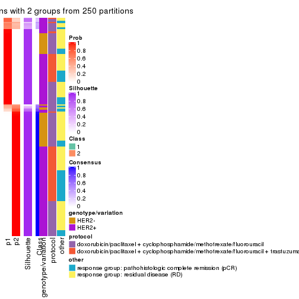</p>

</div>
<div id='tab-MAD-kmeans-consensus-heatmap-2'>
<pre><code class="r">consensus_heatmap(res, k = 3)
</code></pre>

<p>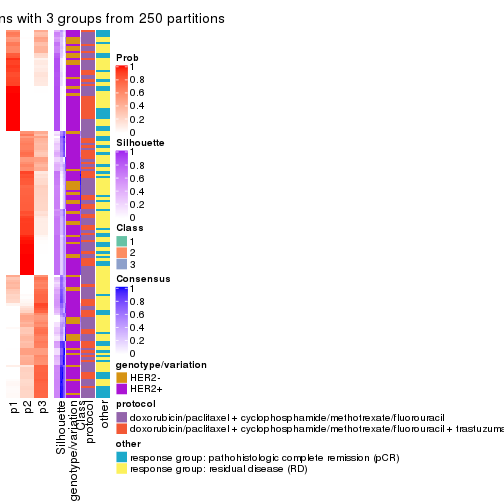</p>

</div>
<div id='tab-MAD-kmeans-consensus-heatmap-3'>
<pre><code class="r">consensus_heatmap(res, k = 4)
</code></pre>

<p>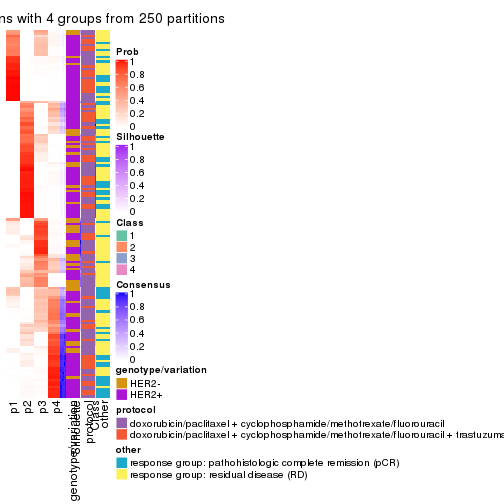</p>

</div>
<div id='tab-MAD-kmeans-consensus-heatmap-4'>
<pre><code class="r">consensus_heatmap(res, k = 5)
</code></pre>

<p>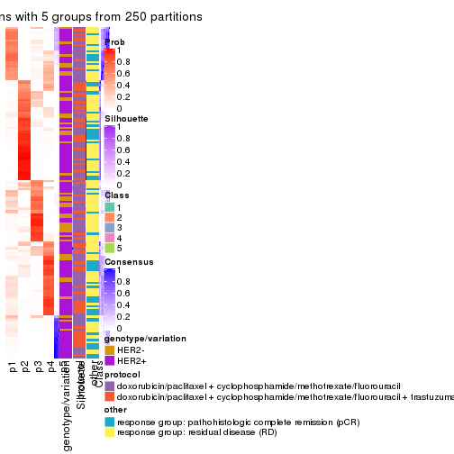</p>

</div>
<div id='tab-MAD-kmeans-consensus-heatmap-5'>
<pre><code class="r">consensus_heatmap(res, k = 6)
</code></pre>

<p>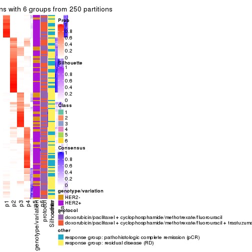</p>

</div>
</div>

Heatmaps for the membership of samples in all partitions to see how consistent they are:


<script>
$( function() {
	$( '#tabs-MAD-kmeans-membership-heatmap' ).tabs();
} );
</script>
<div id='tabs-MAD-kmeans-membership-heatmap'>
<ul>
<li><a href='#tab-MAD-kmeans-membership-heatmap-1'>k = 2</a></li>
<li><a href='#tab-MAD-kmeans-membership-heatmap-2'>k = 3</a></li>
<li><a href='#tab-MAD-kmeans-membership-heatmap-3'>k = 4</a></li>
<li><a href='#tab-MAD-kmeans-membership-heatmap-4'>k = 5</a></li>
<li><a href='#tab-MAD-kmeans-membership-heatmap-5'>k = 6</a></li>
</ul>
<div id='tab-MAD-kmeans-membership-heatmap-1'>
<pre><code class="r">membership_heatmap(res, k = 2)
</code></pre>

<p>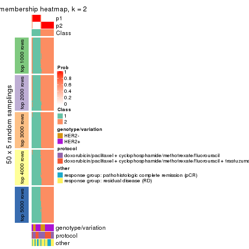</p>

</div>
<div id='tab-MAD-kmeans-membership-heatmap-2'>
<pre><code class="r">membership_heatmap(res, k = 3)
</code></pre>

<p>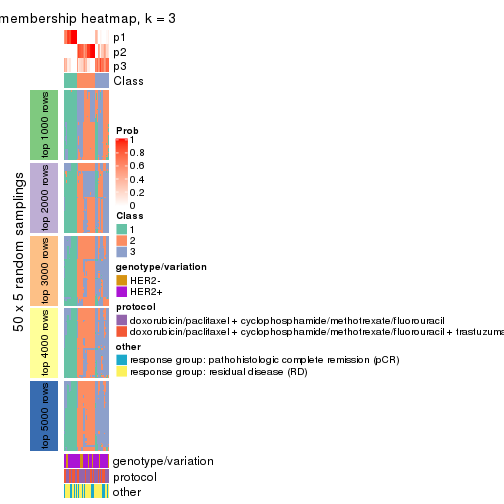</p>

</div>
<div id='tab-MAD-kmeans-membership-heatmap-3'>
<pre><code class="r">membership_heatmap(res, k = 4)
</code></pre>

<p>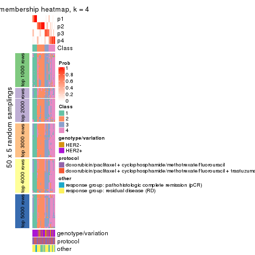</p>

</div>
<div id='tab-MAD-kmeans-membership-heatmap-4'>
<pre><code class="r">membership_heatmap(res, k = 5)
</code></pre>

<p>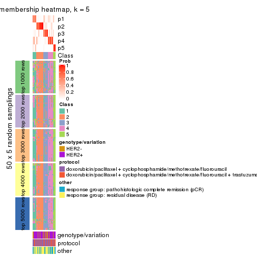</p>

</div>
<div id='tab-MAD-kmeans-membership-heatmap-5'>
<pre><code class="r">membership_heatmap(res, k = 6)
</code></pre>

<p>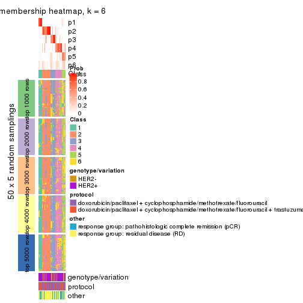</p>

</div>
</div>

As soon as we have had the classes for columns, we can look for signatures
which are significantly different between classes which can be candidate marks
for certain classes. Following are the heatmaps for signatures.


Signature heatmaps where rows are scaled:


<script>
$( function() {
	$( '#tabs-MAD-kmeans-get-signatures' ).tabs();
} );
</script>
<div id='tabs-MAD-kmeans-get-signatures'>
<ul>
<li><a href='#tab-MAD-kmeans-get-signatures-1'>k = 2</a></li>
<li><a href='#tab-MAD-kmeans-get-signatures-2'>k = 3</a></li>
<li><a href='#tab-MAD-kmeans-get-signatures-3'>k = 4</a></li>
<li><a href='#tab-MAD-kmeans-get-signatures-4'>k = 5</a></li>
<li><a href='#tab-MAD-kmeans-get-signatures-5'>k = 6</a></li>
</ul>
<div id='tab-MAD-kmeans-get-signatures-1'>
<pre><code class="r">get_signatures(res, k = 2)
</code></pre>

<pre><code>#&gt; Error: The width or height of the raster image is zero, maybe you forget to turn off the
#&gt; previous graphic device or it was corrupted. Run `dev.off()` to close it.
</code></pre>

<p></p>

</div>
<div id='tab-MAD-kmeans-get-signatures-2'>
<pre><code class="r">get_signatures(res, k = 3)
</code></pre>

<pre><code>#&gt; Error: The width or height of the raster image is zero, maybe you forget to turn off the
#&gt; previous graphic device or it was corrupted. Run `dev.off()` to close it.
</code></pre>

<p></p>

</div>
<div id='tab-MAD-kmeans-get-signatures-3'>
<pre><code class="r">get_signatures(res, k = 4)
</code></pre>

<pre><code>#&gt; Error: The width or height of the raster image is zero, maybe you forget to turn off the
#&gt; previous graphic device or it was corrupted. Run `dev.off()` to close it.
</code></pre>

<p></p>

</div>
<div id='tab-MAD-kmeans-get-signatures-4'>
<pre><code class="r">get_signatures(res, k = 5)
</code></pre>

<pre><code>#&gt; Error: The width or height of the raster image is zero, maybe you forget to turn off the
#&gt; previous graphic device or it was corrupted. Run `dev.off()` to close it.
</code></pre>

<p></p>

</div>
<div id='tab-MAD-kmeans-get-signatures-5'>
<pre><code class="r">get_signatures(res, k = 6)
</code></pre>

<pre><code>#&gt; Error: The width or height of the raster image is zero, maybe you forget to turn off the
#&gt; previous graphic device or it was corrupted. Run `dev.off()` to close it.
</code></pre>

<p></p>

</div>
</div>


Signature heatmaps where rows are not scaled:


<script>
$( function() {
	$( '#tabs-MAD-kmeans-get-signatures-no-scale' ).tabs();
} );
</script>
<div id='tabs-MAD-kmeans-get-signatures-no-scale'>
<ul>
<li><a href='#tab-MAD-kmeans-get-signatures-no-scale-1'>k = 2</a></li>
<li><a href='#tab-MAD-kmeans-get-signatures-no-scale-2'>k = 3</a></li>
<li><a href='#tab-MAD-kmeans-get-signatures-no-scale-3'>k = 4</a></li>
<li><a href='#tab-MAD-kmeans-get-signatures-no-scale-4'>k = 5</a></li>
<li><a href='#tab-MAD-kmeans-get-signatures-no-scale-5'>k = 6</a></li>
</ul>
<div id='tab-MAD-kmeans-get-signatures-no-scale-1'>
<pre><code class="r">get_signatures(res, k = 2, scale_rows = FALSE)
</code></pre>

<pre><code>#&gt; Error: The width or height of the raster image is zero, maybe you forget to turn off the
#&gt; previous graphic device or it was corrupted. Run `dev.off()` to close it.
</code></pre>

<p></p>

</div>
<div id='tab-MAD-kmeans-get-signatures-no-scale-2'>
<pre><code class="r">get_signatures(res, k = 3, scale_rows = FALSE)
</code></pre>

<pre><code>#&gt; Error: The width or height of the raster image is zero, maybe you forget to turn off the
#&gt; previous graphic device or it was corrupted. Run `dev.off()` to close it.
</code></pre>

<p></p>

</div>
<div id='tab-MAD-kmeans-get-signatures-no-scale-3'>
<pre><code class="r">get_signatures(res, k = 4, scale_rows = FALSE)
</code></pre>

<pre><code>#&gt; Error: The width or height of the raster image is zero, maybe you forget to turn off the
#&gt; previous graphic device or it was corrupted. Run `dev.off()` to close it.
</code></pre>

<p></p>

</div>
<div id='tab-MAD-kmeans-get-signatures-no-scale-4'>
<pre><code class="r">get_signatures(res, k = 5, scale_rows = FALSE)
</code></pre>

<pre><code>#&gt; Error: The width or height of the raster image is zero, maybe you forget to turn off the
#&gt; previous graphic device or it was corrupted. Run `dev.off()` to close it.
</code></pre>

<p></p>

</div>
<div id='tab-MAD-kmeans-get-signatures-no-scale-5'>
<pre><code class="r">get_signatures(res, k = 6, scale_rows = FALSE)
</code></pre>

<pre><code>#&gt; Error: The width or height of the raster image is zero, maybe you forget to turn off the
#&gt; previous graphic device or it was corrupted. Run `dev.off()` to close it.
</code></pre>

<p></p>

</div>
</div>


Compare the overlap of signatures from different k:

```r
compare_signatures(res)
```

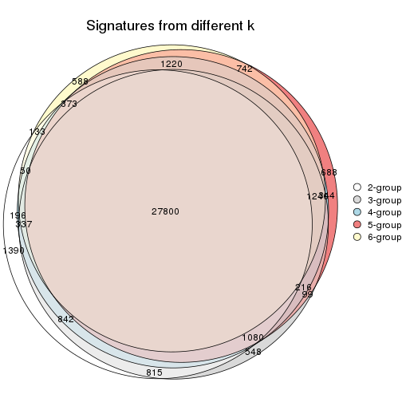

`get_signature()` returns a data frame invisibly. TO get the list of signatures, the function
call should be assigned to a variable explicitly. In following code, if `plot` argument is set
to `FALSE`, no heatmap is plotted while only the differential analysis is performed.

```r
# code only for demonstration
tb = get_signature(res, k = ..., plot = FALSE)
```

An example of the output of `tb` is:

```
#>   which_row         fdr    mean_1    mean_2 scaled_mean_1 scaled_mean_2 km
#> 1        38 0.042760348  8.373488  9.131774    -0.5533452     0.5164555  1
#> 2        40 0.018707592  7.106213  8.469186    -0.6173731     0.5762149  1
#> 3        55 0.019134737 10.221463 11.207825    -0.6159697     0.5749050  1
#> 4        59 0.006059896  5.921854  7.869574    -0.6899429     0.6439467  1
#> 5        60 0.018055526  8.928898 10.211722    -0.6204761     0.5791110  1
#> 6        98 0.009384629 15.714769 14.887706     0.6635654    -0.6193277  2
...
```

The columns in `tb` are:

1. `which_row`: row indices corresponding to the input matrix.
2. `fdr`: FDR for the differential test. 
3. `mean_x`: The mean value in group x.
4. `scaled_mean_x`: The mean value in group x after rows are scaled.
5. `km`: Row groups if k-means clustering is applied to rows.


UMAP plot which shows how samples are separated.


<script>
$( function() {
	$( '#tabs-MAD-kmeans-dimension-reduction' ).tabs();
} );
</script>
<div id='tabs-MAD-kmeans-dimension-reduction'>
<ul>
<li><a href='#tab-MAD-kmeans-dimension-reduction-1'>k = 2</a></li>
<li><a href='#tab-MAD-kmeans-dimension-reduction-2'>k = 3</a></li>
<li><a href='#tab-MAD-kmeans-dimension-reduction-3'>k = 4</a></li>
<li><a href='#tab-MAD-kmeans-dimension-reduction-4'>k = 5</a></li>
<li><a href='#tab-MAD-kmeans-dimension-reduction-5'>k = 6</a></li>
</ul>
<div id='tab-MAD-kmeans-dimension-reduction-1'>
<pre><code class="r">dimension_reduction(res, k = 2, method = &quot;UMAP&quot;)
</code></pre>

<p>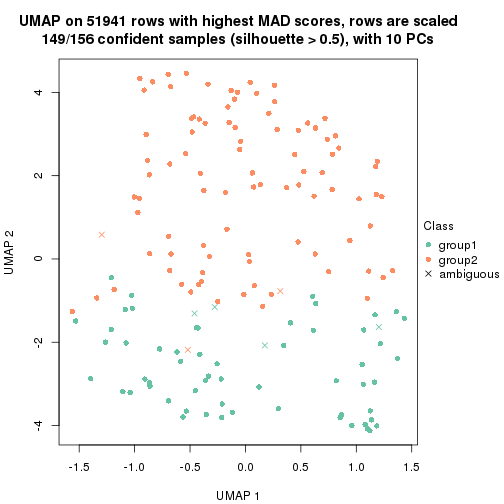</p>

</div>
<div id='tab-MAD-kmeans-dimension-reduction-2'>
<pre><code class="r">dimension_reduction(res, k = 3, method = &quot;UMAP&quot;)
</code></pre>

<p>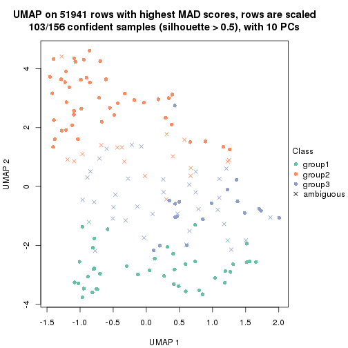</p>

</div>
<div id='tab-MAD-kmeans-dimension-reduction-3'>
<pre><code class="r">dimension_reduction(res, k = 4, method = &quot;UMAP&quot;)
</code></pre>

<p>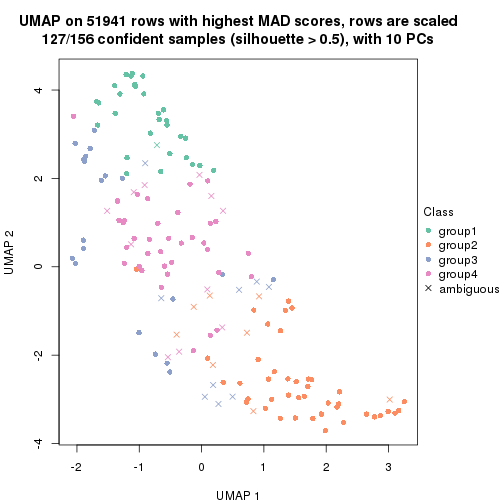</p>

</div>
<div id='tab-MAD-kmeans-dimension-reduction-4'>
<pre><code class="r">dimension_reduction(res, k = 5, method = &quot;UMAP&quot;)
</code></pre>

<p>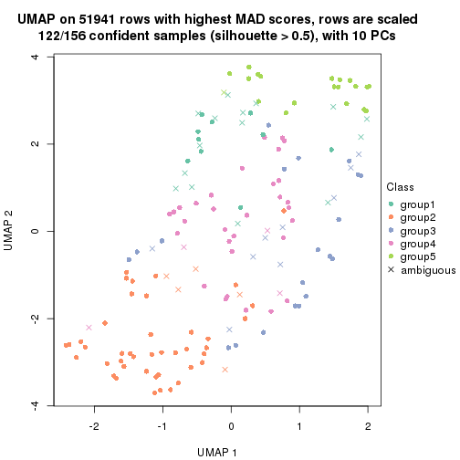</p>

</div>
<div id='tab-MAD-kmeans-dimension-reduction-5'>
<pre><code class="r">dimension_reduction(res, k = 6, method = &quot;UMAP&quot;)
</code></pre>

<p>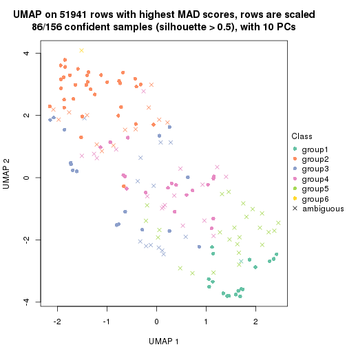</p>

</div>
</div>


Following heatmap shows how subgroups are split when increasing `k`:

```r
collect_classes(res)
```

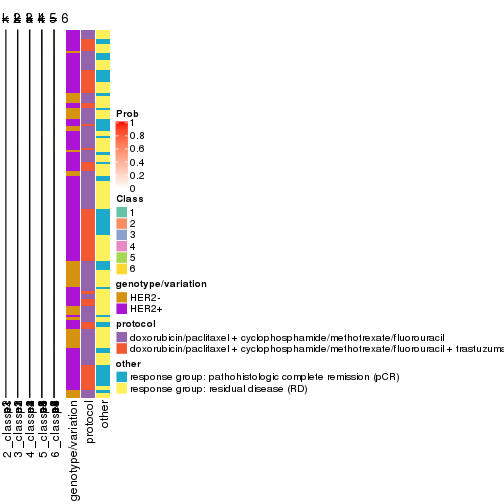


Test correlation between subgroups and known annotations. If the known
annotation is numeric, one-way ANOVA test is applied, and if the known
annotation is discrete, chi-squared contingency table test is applied.

```r
test_to_known_factors(res)
```

```
#>              n genotype/variation(p) protocol(p) other(p) k
#> MAD:kmeans 149               0.97868       0.577  0.73183 2
#> MAD:kmeans 103               0.47572       0.909  0.39974 3
#> MAD:kmeans 127               0.00457       0.532  0.25566 4
#> MAD:kmeans 122               0.00121       0.237  0.00886 5
#> MAD:kmeans  86               0.00187       0.116  0.00119 6
```


If matrix rows can be associated to genes, consider to use `functional_enrichment(res,
...)` to perform function enrichment for the signature genes. See [this vignette](http://bioconductor.org/packages/devel/bioc/vignettes/cola/inst/doc/functional_enrichment.html) for more detailed explanations.


 

---------------------------------------------------


### MAD:skmeans**


The object with results only for a single top-value method and a single partition method 
can be extracted as:

```r
res = res_list["MAD", "skmeans"]
# you can also extract it by
# res = res_list["MAD:skmeans"]
```

A summary of `res` and all the functions that can be applied to it:

```r
res
```

```
#> A 'ConsensusPartition' object with k = 2, 3, 4, 5, 6.
#>   On a matrix with 51941 rows and 156 columns.
#>   Top rows (1000, 2000, 3000, 4000, 5000) are extracted by 'MAD' method.
#>   Subgroups are detected by 'skmeans' method.
#>   Performed in total 1250 partitions by row resampling.
#>   Best k for subgroups seems to be 2.
#> 
#> Following methods can be applied to this 'ConsensusPartition' object:
#>  [1] "cola_report"             "collect_classes"         "collect_plots"          
#>  [4] "collect_stats"           "colnames"                "compare_signatures"     
#>  [7] "consensus_heatmap"       "dimension_reduction"     "functional_enrichment"  
#> [10] "get_anno_col"            "get_anno"                "get_classes"            
#> [13] "get_consensus"           "get_matrix"              "get_membership"         
#> [16] "get_param"               "get_signatures"          "get_stats"              
#> [19] "is_best_k"               "is_stable_k"             "membership_heatmap"     
#> [22] "ncol"                    "nrow"                    "plot_ecdf"              
#> [25] "rownames"                "select_partition_number" "show"                   
#> [28] "suggest_best_k"          "test_to_known_factors"
```

`collect_plots()` function collects all the plots made from `res` for all `k` (number of partitions)
into one single page to provide an easy and fast comparison between different `k`.

```r
collect_plots(res)
```

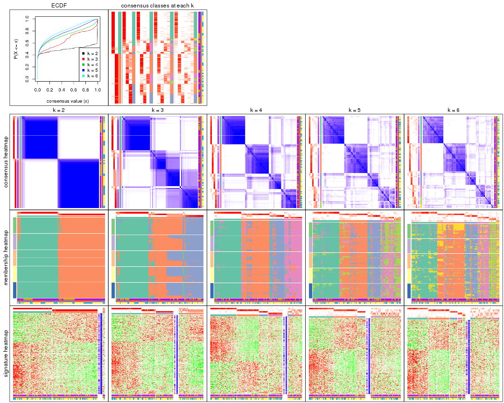

The plots are:

- The first row: a plot of the ECDF (empirical cumulative distribution
  function) curves of the consensus matrix for each `k` and the heatmap of
  predicted classes for each `k`.
- The second row: heatmaps of the consensus matrix for each `k`.
- The third row: heatmaps of the membership matrix for each `k`.
- The fouth row: heatmaps of the signatures for each `k`.

All the plots in panels can be made by individual functions and they are
plotted later in this section.

`select_partition_number()` produces several plots showing different
statistics for choosing "optimized" `k`. There are following statistics:

- ECDF curves of the consensus matrix for each `k`;
- 1-PAC. [The PAC
  score](https://en.wikipedia.org/wiki/Consensus_clustering#Over-interpretation_potential_of_consensus_clustering)
  measures the proportion of the ambiguous subgrouping.
- Mean silhouette score.
- Concordance. The mean probability of fiting the consensus class ids in all
  partitions.
- Area increased. Denote $A_k$ as the area under the ECDF curve for current
  `k`, the area increased is defined as $A_k - A_{k-1}$.
- Rand index. The percent of pairs of samples that are both in a same cluster
  or both are not in a same cluster in the partition of k and k-1.
- Jaccard index. The ratio of pairs of samples are both in a same cluster in
  the partition of k and k-1 and the pairs of samples are both in a same
  cluster in the partition k or k-1.

The detailed explanations of these statistics can be found in [the _cola_
vignette](http://bioconductor.org/packages/devel/bioc/vignettes/cola/inst/doc/cola.html#toc_13).

Generally speaking, lower PAC score, higher mean silhouette score or higher
concordance corresponds to better partition. Rand index and Jaccard index
measure how similar the current partition is compared to partition with `k-1`.
If they are too similar, we won't accept `k` is better than `k-1`.

```r
select_partition_number(res)
```

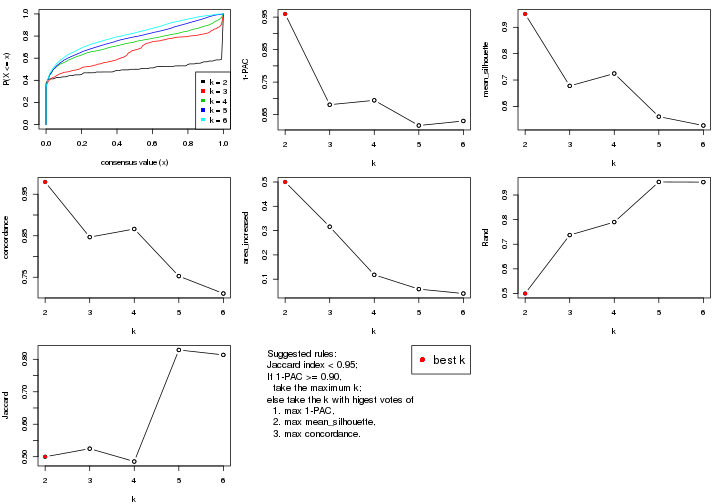

The numeric values for all these statistics can be obtained by `get_stats()`.

```r
get_stats(res)
```

```
#>   k 1-PAC mean_silhouette concordance area_increased  Rand Jaccard
#> 2 2 0.960           0.950       0.980         0.5002 0.500   0.500
#> 3 3 0.681           0.678       0.847         0.3160 0.737   0.525
#> 4 4 0.694           0.725       0.866         0.1181 0.790   0.485
#> 5 5 0.616           0.561       0.753         0.0592 0.953   0.829
#> 6 6 0.630           0.528       0.711         0.0411 0.952   0.813
```

`suggest_best_k()` suggests the best $k$ based on these statistics. The rules are as follows:

- All $k$ with Jaccard index larger than 0.95 are removed because increasing
  $k$ does not provide enough extra information. If all $k$ are removed, it is
  marked as no subgroup is detected.
- For all $k$ with 1-PAC score larger than 0.9, the maximal $k$ is taken as
  the best $k$, and other $k$ are marked as optional $k$.
- If it does not fit the second rule. The $k$ with the maximal vote of the
  highest 1-PAC score, highest mean silhouette, and highest concordance is
  taken as the best $k$.

```r
suggest_best_k(res)
```

```
#> [1] 2
```


Following shows the table of the partitions (You need to click the **show/hide
code output** link to see it). The membership matrix (columns with name `p*`)
is inferred by
[`clue::cl_consensus()`](https://www.rdocumentation.org/link/cl_consensus?package=clue)
function with the `SE` method. Basically the value in the membership matrix
represents the probability to belong to a certain group. The finall class
label for an item is determined with the group with highest probability it
belongs to.

In `get_classes()` function, the entropy is calculated from the membership
matrix and the silhouette score is calculated from the consensus matrix.


<script>
$( function() {
	$( '#tabs-MAD-skmeans-get-classes' ).tabs();
} );
</script>
<div id='tabs-MAD-skmeans-get-classes'>
<ul>
<li><a href='#tab-MAD-skmeans-get-classes-1'>k = 2</a></li>
<li><a href='#tab-MAD-skmeans-get-classes-2'>k = 3</a></li>
<li><a href='#tab-MAD-skmeans-get-classes-3'>k = 4</a></li>
<li><a href='#tab-MAD-skmeans-get-classes-4'>k = 5</a></li>
<li><a href='#tab-MAD-skmeans-get-classes-5'>k = 6</a></li>
</ul>

<div id='tab-MAD-skmeans-get-classes-1'>
<p><a id='tab-MAD-skmeans-get-classes-1-a' style='color:#0366d6' href='#'>show/hide code output</a></p>
<pre><code class="r">cbind(get_classes(res, k = 2), get_membership(res, k = 2))
</code></pre>

<pre><code>#&gt;            class entropy silhouette    p1    p2
#&gt; GSM1232995     2  0.0000      0.982 0.000 1.000
#&gt; GSM1233002     1  0.7376      0.745 0.792 0.208
#&gt; GSM1233003     1  0.0000      0.975 1.000 0.000
#&gt; GSM1233014     2  0.0000      0.982 0.000 1.000
#&gt; GSM1233015     1  0.0000      0.975 1.000 0.000
#&gt; GSM1233016     1  0.0000      0.975 1.000 0.000
#&gt; GSM1233024     2  0.0000      0.982 0.000 1.000
#&gt; GSM1233049     1  0.0000      0.975 1.000 0.000
#&gt; GSM1233064     2  0.0000      0.982 0.000 1.000
#&gt; GSM1233068     1  0.0000      0.975 1.000 0.000
#&gt; GSM1233073     1  0.0376      0.971 0.996 0.004
#&gt; GSM1233093     1  0.0000      0.975 1.000 0.000
#&gt; GSM1233115     1  0.0000      0.975 1.000 0.000
#&gt; GSM1232992     2  0.0000      0.982 0.000 1.000
#&gt; GSM1232993     2  0.0000      0.982 0.000 1.000
#&gt; GSM1233005     2  0.0000      0.982 0.000 1.000
#&gt; GSM1233007     2  0.0000      0.982 0.000 1.000
#&gt; GSM1233010     1  0.0000      0.975 1.000 0.000
#&gt; GSM1233013     2  0.0000      0.982 0.000 1.000
#&gt; GSM1233018     2  0.0000      0.982 0.000 1.000
#&gt; GSM1233019     2  0.0000      0.982 0.000 1.000
#&gt; GSM1233021     2  0.0000      0.982 0.000 1.000
#&gt; GSM1233025     1  0.0000      0.975 1.000 0.000
#&gt; GSM1233029     2  0.0000      0.982 0.000 1.000
#&gt; GSM1233030     2  0.0000      0.982 0.000 1.000
#&gt; GSM1233031     1  0.6247      0.815 0.844 0.156
#&gt; GSM1233032     1  0.0000      0.975 1.000 0.000
#&gt; GSM1233035     1  0.0000      0.975 1.000 0.000
#&gt; GSM1233038     1  0.0000      0.975 1.000 0.000
#&gt; GSM1233039     2  0.0000      0.982 0.000 1.000
#&gt; GSM1233042     2  0.0000      0.982 0.000 1.000
#&gt; GSM1233043     2  0.0000      0.982 0.000 1.000
#&gt; GSM1233044     1  0.0000      0.975 1.000 0.000
#&gt; GSM1233046     1  0.0000      0.975 1.000 0.000
#&gt; GSM1233051     1  0.0000      0.975 1.000 0.000
#&gt; GSM1233054     1  0.0672      0.968 0.992 0.008
#&gt; GSM1233057     2  0.0000      0.982 0.000 1.000
#&gt; GSM1233060     2  0.9661      0.330 0.392 0.608
#&gt; GSM1233062     2  0.0000      0.982 0.000 1.000
#&gt; GSM1233075     2  0.0000      0.982 0.000 1.000
#&gt; GSM1233078     1  0.0376      0.971 0.996 0.004
#&gt; GSM1233079     1  0.0000      0.975 1.000 0.000
#&gt; GSM1233082     1  0.0000      0.975 1.000 0.000
#&gt; GSM1233083     1  0.0000      0.975 1.000 0.000
#&gt; GSM1233091     1  0.9580      0.413 0.620 0.380
#&gt; GSM1233095     1  0.0000      0.975 1.000 0.000
#&gt; GSM1233096     1  0.0000      0.975 1.000 0.000
#&gt; GSM1233101     1  0.0000      0.975 1.000 0.000
#&gt; GSM1233105     1  0.0000      0.975 1.000 0.000
#&gt; GSM1233117     2  0.0000      0.982 0.000 1.000
#&gt; GSM1233118     2  0.0000      0.982 0.000 1.000
#&gt; GSM1233001     2  0.0000      0.982 0.000 1.000
#&gt; GSM1233006     2  0.0000      0.982 0.000 1.000
#&gt; GSM1233008     2  0.0000      0.982 0.000 1.000
#&gt; GSM1233009     2  0.0000      0.982 0.000 1.000
#&gt; GSM1233017     2  0.0000      0.982 0.000 1.000
#&gt; GSM1233020     2  0.0000      0.982 0.000 1.000
#&gt; GSM1233022     2  0.0000      0.982 0.000 1.000
#&gt; GSM1233026     1  0.8555      0.628 0.720 0.280
#&gt; GSM1233028     2  0.5519      0.847 0.128 0.872
#&gt; GSM1233034     2  0.0000      0.982 0.000 1.000
#&gt; GSM1233040     1  0.0000      0.975 1.000 0.000
#&gt; GSM1233048     1  0.0000      0.975 1.000 0.000
#&gt; GSM1233056     1  0.0000      0.975 1.000 0.000
#&gt; GSM1233058     1  0.7453      0.739 0.788 0.212
#&gt; GSM1233059     1  0.0000      0.975 1.000 0.000
#&gt; GSM1233066     2  0.0672      0.976 0.008 0.992
#&gt; GSM1233071     2  0.0000      0.982 0.000 1.000
#&gt; GSM1233074     2  0.0000      0.982 0.000 1.000
#&gt; GSM1233076     2  0.0000      0.982 0.000 1.000
#&gt; GSM1233080     1  0.0000      0.975 1.000 0.000
#&gt; GSM1233088     1  0.9833      0.289 0.576 0.424
#&gt; GSM1233090     1  0.0000      0.975 1.000 0.000
#&gt; GSM1233092     2  0.0000      0.982 0.000 1.000
#&gt; GSM1233094     2  0.0000      0.982 0.000 1.000
#&gt; GSM1233097     2  0.0376      0.979 0.004 0.996
#&gt; GSM1233100     1  0.2603      0.936 0.956 0.044
#&gt; GSM1233104     2  0.0000      0.982 0.000 1.000
#&gt; GSM1233106     1  0.0000      0.975 1.000 0.000
#&gt; GSM1233111     1  0.0000      0.975 1.000 0.000
#&gt; GSM1233122     2  0.0000      0.982 0.000 1.000
#&gt; GSM1233146     2  0.0000      0.982 0.000 1.000
#&gt; GSM1232994     2  0.0000      0.982 0.000 1.000
#&gt; GSM1232996     2  0.0000      0.982 0.000 1.000
#&gt; GSM1232997     2  0.0000      0.982 0.000 1.000
#&gt; GSM1232998     2  0.0000      0.982 0.000 1.000
#&gt; GSM1232999     2  0.0000      0.982 0.000 1.000
#&gt; GSM1233000     2  0.0000      0.982 0.000 1.000
#&gt; GSM1233004     1  0.0000      0.975 1.000 0.000
#&gt; GSM1233011     2  0.0000      0.982 0.000 1.000
#&gt; GSM1233012     2  0.0000      0.982 0.000 1.000
#&gt; GSM1233023     2  0.0000      0.982 0.000 1.000
#&gt; GSM1233027     2  0.0000      0.982 0.000 1.000
#&gt; GSM1233033     1  0.0000      0.975 1.000 0.000
#&gt; GSM1233036     2  0.0000      0.982 0.000 1.000
#&gt; GSM1233037     2  0.0376      0.979 0.004 0.996
#&gt; GSM1233041     1  0.0000      0.975 1.000 0.000
#&gt; GSM1233045     2  0.0000      0.982 0.000 1.000
#&gt; GSM1233047     1  0.0000      0.975 1.000 0.000
#&gt; GSM1233050     1  0.0000      0.975 1.000 0.000
#&gt; GSM1233052     1  0.0000      0.975 1.000 0.000
#&gt; GSM1233053     1  0.0000      0.975 1.000 0.000
#&gt; GSM1233055     1  0.0000      0.975 1.000 0.000
#&gt; GSM1233061     2  0.9977      0.107 0.472 0.528
#&gt; GSM1233063     1  0.0000      0.975 1.000 0.000
#&gt; GSM1233065     2  0.0000      0.982 0.000 1.000
#&gt; GSM1233070     2  0.0000      0.982 0.000 1.000
#&gt; GSM1233077     2  0.0000      0.982 0.000 1.000
#&gt; GSM1233081     1  0.0000      0.975 1.000 0.000
#&gt; GSM1233084     1  0.0000      0.975 1.000 0.000
#&gt; GSM1233087     1  0.0000      0.975 1.000 0.000
#&gt; GSM1233089     2  0.0000      0.982 0.000 1.000
#&gt; GSM1233099     1  0.0000      0.975 1.000 0.000
#&gt; GSM1233112     1  0.0000      0.975 1.000 0.000
#&gt; GSM1233085     1  0.0000      0.975 1.000 0.000
#&gt; GSM1233098     2  0.0000      0.982 0.000 1.000
#&gt; GSM1233114     1  0.0000      0.975 1.000 0.000
#&gt; GSM1233119     1  0.0000      0.975 1.000 0.000
#&gt; GSM1233129     2  0.0000      0.982 0.000 1.000
#&gt; GSM1233132     1  0.0000      0.975 1.000 0.000
#&gt; GSM1233139     2  0.0000      0.982 0.000 1.000
#&gt; GSM1233143     2  0.0000      0.982 0.000 1.000
#&gt; GSM1233145     1  0.0000      0.975 1.000 0.000
#&gt; GSM1233067     2  0.0000      0.982 0.000 1.000
#&gt; GSM1233069     2  0.0000      0.982 0.000 1.000
#&gt; GSM1233072     2  0.0000      0.982 0.000 1.000
#&gt; GSM1233086     2  0.0000      0.982 0.000 1.000
#&gt; GSM1233102     1  0.0000      0.975 1.000 0.000
#&gt; GSM1233103     1  0.0000      0.975 1.000 0.000
#&gt; GSM1233107     1  0.2948      0.928 0.948 0.052
#&gt; GSM1233108     1  0.0000      0.975 1.000 0.000
#&gt; GSM1233109     1  0.0000      0.975 1.000 0.000
#&gt; GSM1233110     2  0.7056      0.759 0.192 0.808
#&gt; GSM1233113     2  0.0000      0.982 0.000 1.000
#&gt; GSM1233116     2  0.0000      0.982 0.000 1.000
#&gt; GSM1233120     1  0.0000      0.975 1.000 0.000
#&gt; GSM1233121     2  0.0000      0.982 0.000 1.000
#&gt; GSM1233123     2  0.4161      0.899 0.084 0.916
#&gt; GSM1233124     2  0.0000      0.982 0.000 1.000
#&gt; GSM1233125     1  0.0000      0.975 1.000 0.000
#&gt; GSM1233126     2  0.5059      0.866 0.112 0.888
#&gt; GSM1233127     2  0.0000      0.982 0.000 1.000
#&gt; GSM1233128     1  0.0000      0.975 1.000 0.000
#&gt; GSM1233130     2  0.0938      0.972 0.012 0.988
#&gt; GSM1233131     1  0.0000      0.975 1.000 0.000
#&gt; GSM1233133     1  0.0000      0.975 1.000 0.000
#&gt; GSM1233134     2  0.0000      0.982 0.000 1.000
#&gt; GSM1233135     2  0.0000      0.982 0.000 1.000
#&gt; GSM1233136     2  0.0000      0.982 0.000 1.000
#&gt; GSM1233137     1  0.0000      0.975 1.000 0.000
#&gt; GSM1233138     2  0.0000      0.982 0.000 1.000
#&gt; GSM1233140     1  0.0000      0.975 1.000 0.000
#&gt; GSM1233141     2  0.0000      0.982 0.000 1.000
#&gt; GSM1233142     2  0.0000      0.982 0.000 1.000
#&gt; GSM1233144     1  0.0000      0.975 1.000 0.000
#&gt; GSM1233147     2  0.0000      0.982 0.000 1.000
</code></pre>

<script>
$('#tab-MAD-skmeans-get-classes-1-a').parent().next().next().hide();
$('#tab-MAD-skmeans-get-classes-1-a').click(function(){
  $('#tab-MAD-skmeans-get-classes-1-a').parent().next().next().toggle();
  return(false);
});
</script>
</div>

<div id='tab-MAD-skmeans-get-classes-2'>
<p><a id='tab-MAD-skmeans-get-classes-2-a' style='color:#0366d6' href='#'>show/hide code output</a></p>
<pre><code class="r">cbind(get_classes(res, k = 3), get_membership(res, k = 3))
</code></pre>

<pre><code>#&gt;            class entropy silhouette    p1    p2    p3
#&gt; GSM1232995     2  0.6280    0.45158 0.000 0.540 0.460
#&gt; GSM1233002     2  0.4504    0.48661 0.196 0.804 0.000
#&gt; GSM1233003     1  0.0000    0.94313 1.000 0.000 0.000
#&gt; GSM1233014     2  0.0000    0.61265 0.000 1.000 0.000
#&gt; GSM1233015     1  0.0000    0.94313 1.000 0.000 0.000
#&gt; GSM1233016     2  0.6299   -0.16370 0.476 0.524 0.000
#&gt; GSM1233024     2  0.5706    0.53800 0.000 0.680 0.320
#&gt; GSM1233049     1  0.0000    0.94313 1.000 0.000 0.000
#&gt; GSM1233064     3  0.1964    0.82148 0.000 0.056 0.944
#&gt; GSM1233068     1  0.0000    0.94313 1.000 0.000 0.000
#&gt; GSM1233073     2  0.5465    0.34835 0.288 0.712 0.000
#&gt; GSM1233093     1  0.0000    0.94313 1.000 0.000 0.000
#&gt; GSM1233115     1  0.0000    0.94313 1.000 0.000 0.000
#&gt; GSM1232992     2  0.6274    0.45684 0.000 0.544 0.456
#&gt; GSM1232993     2  0.5905    0.52356 0.000 0.648 0.352
#&gt; GSM1233005     2  0.6274    0.45684 0.000 0.544 0.456
#&gt; GSM1233007     2  0.3752    0.59276 0.000 0.856 0.144
#&gt; GSM1233010     2  0.6305   -0.19629 0.484 0.516 0.000
#&gt; GSM1233013     2  0.6280    0.45158 0.000 0.540 0.460
#&gt; GSM1233018     2  0.6280    0.45158 0.000 0.540 0.460
#&gt; GSM1233019     2  0.6252    0.46805 0.000 0.556 0.444
#&gt; GSM1233021     2  0.6274    0.45684 0.000 0.544 0.456
#&gt; GSM1233025     1  0.6260    0.34307 0.552 0.448 0.000
#&gt; GSM1233029     2  0.6140    0.49453 0.000 0.596 0.404
#&gt; GSM1233030     2  0.6274    0.45684 0.000 0.544 0.456
#&gt; GSM1233031     2  0.1163    0.60392 0.028 0.972 0.000
#&gt; GSM1233032     1  0.0000    0.94313 1.000 0.000 0.000
#&gt; GSM1233035     1  0.2356    0.88017 0.928 0.072 0.000
#&gt; GSM1233038     1  0.0000    0.94313 1.000 0.000 0.000
#&gt; GSM1233039     3  0.2448    0.81903 0.000 0.076 0.924
#&gt; GSM1233042     2  0.0000    0.61265 0.000 1.000 0.000
#&gt; GSM1233043     2  0.0000    0.61265 0.000 1.000 0.000
#&gt; GSM1233044     1  0.0892    0.92994 0.980 0.020 0.000
#&gt; GSM1233046     1  0.0000    0.94313 1.000 0.000 0.000
#&gt; GSM1233051     1  0.0000    0.94313 1.000 0.000 0.000
#&gt; GSM1233054     3  0.6280    0.04278 0.460 0.000 0.540
#&gt; GSM1233057     3  0.0000    0.85366 0.000 0.000 1.000
#&gt; GSM1233060     2  0.1315    0.61307 0.008 0.972 0.020
#&gt; GSM1233062     2  0.5138    0.56423 0.000 0.748 0.252
#&gt; GSM1233075     3  0.0000    0.85366 0.000 0.000 1.000
#&gt; GSM1233078     3  0.6267    0.06928 0.452 0.000 0.548
#&gt; GSM1233079     1  0.0000    0.94313 1.000 0.000 0.000
#&gt; GSM1233082     1  0.0000    0.94313 1.000 0.000 0.000
#&gt; GSM1233083     1  0.0000    0.94313 1.000 0.000 0.000
#&gt; GSM1233091     3  0.8525    0.40329 0.200 0.188 0.612
#&gt; GSM1233095     1  0.0000    0.94313 1.000 0.000 0.000
#&gt; GSM1233096     1  0.0000    0.94313 1.000 0.000 0.000
#&gt; GSM1233101     1  0.0000    0.94313 1.000 0.000 0.000
#&gt; GSM1233105     1  0.0000    0.94313 1.000 0.000 0.000
#&gt; GSM1233117     2  0.6280    0.45158 0.000 0.540 0.460
#&gt; GSM1233118     3  0.1411    0.83733 0.000 0.036 0.964
#&gt; GSM1233001     3  0.2261    0.80441 0.000 0.068 0.932
#&gt; GSM1233006     2  0.3482    0.59990 0.000 0.872 0.128
#&gt; GSM1233008     2  0.6280    0.45158 0.000 0.540 0.460
#&gt; GSM1233009     2  0.6252    0.46805 0.000 0.556 0.444
#&gt; GSM1233017     2  0.6252    0.46805 0.000 0.556 0.444
#&gt; GSM1233020     2  0.6280    0.45158 0.000 0.540 0.460
#&gt; GSM1233022     2  0.1860    0.61108 0.000 0.948 0.052
#&gt; GSM1233026     2  0.7360    0.39393 0.212 0.692 0.096
#&gt; GSM1233028     2  0.0747    0.60712 0.016 0.984 0.000
#&gt; GSM1233034     3  0.3482    0.71471 0.000 0.128 0.872
#&gt; GSM1233040     1  0.0000    0.94313 1.000 0.000 0.000
#&gt; GSM1233048     1  0.0000    0.94313 1.000 0.000 0.000
#&gt; GSM1233056     1  0.0000    0.94313 1.000 0.000 0.000
#&gt; GSM1233058     2  0.3816    0.52275 0.148 0.852 0.000
#&gt; GSM1233059     1  0.0000    0.94313 1.000 0.000 0.000
#&gt; GSM1233066     3  0.2066    0.81552 0.000 0.060 0.940
#&gt; GSM1233071     2  0.6252    0.46805 0.000 0.556 0.444
#&gt; GSM1233074     3  0.0000    0.85366 0.000 0.000 1.000
#&gt; GSM1233076     2  0.6111    0.10638 0.000 0.604 0.396
#&gt; GSM1233080     1  0.0000    0.94313 1.000 0.000 0.000
#&gt; GSM1233088     3  0.2165    0.79845 0.064 0.000 0.936
#&gt; GSM1233090     1  0.0000    0.94313 1.000 0.000 0.000
#&gt; GSM1233092     2  0.0000    0.61265 0.000 1.000 0.000
#&gt; GSM1233094     2  0.0000    0.61265 0.000 1.000 0.000
#&gt; GSM1233097     2  0.0000    0.61265 0.000 1.000 0.000
#&gt; GSM1233100     2  0.5254    0.42143 0.264 0.736 0.000
#&gt; GSM1233104     2  0.0000    0.61265 0.000 1.000 0.000
#&gt; GSM1233106     1  0.0000    0.94313 1.000 0.000 0.000
#&gt; GSM1233111     1  0.0000    0.94313 1.000 0.000 0.000
#&gt; GSM1233122     2  0.6280    0.45158 0.000 0.540 0.460
#&gt; GSM1233146     2  0.0000    0.61265 0.000 1.000 0.000
#&gt; GSM1232994     2  0.6204    0.48256 0.000 0.576 0.424
#&gt; GSM1232996     2  0.6280    0.45158 0.000 0.540 0.460
#&gt; GSM1232997     3  0.0592    0.85185 0.000 0.012 0.988
#&gt; GSM1232998     2  0.0000    0.61265 0.000 1.000 0.000
#&gt; GSM1232999     2  0.0000    0.61265 0.000 1.000 0.000
#&gt; GSM1233000     2  0.6267    0.46096 0.000 0.548 0.452
#&gt; GSM1233004     2  0.9927    0.00435 0.316 0.392 0.292
#&gt; GSM1233011     2  0.6215    0.04376 0.000 0.572 0.428
#&gt; GSM1233012     3  0.2796    0.77310 0.000 0.092 0.908
#&gt; GSM1233023     3  0.1031    0.84598 0.000 0.024 0.976
#&gt; GSM1233027     2  0.0237    0.61283 0.000 0.996 0.004
#&gt; GSM1233033     1  0.0000    0.94313 1.000 0.000 0.000
#&gt; GSM1233036     3  0.0592    0.85203 0.000 0.012 0.988
#&gt; GSM1233037     3  0.0000    0.85366 0.000 0.000 1.000
#&gt; GSM1233041     1  0.0000    0.94313 1.000 0.000 0.000
#&gt; GSM1233045     2  0.0000    0.61265 0.000 1.000 0.000
#&gt; GSM1233047     1  0.2625    0.87803 0.916 0.000 0.084
#&gt; GSM1233050     1  0.0000    0.94313 1.000 0.000 0.000
#&gt; GSM1233052     1  0.0000    0.94313 1.000 0.000 0.000
#&gt; GSM1233053     1  0.0000    0.94313 1.000 0.000 0.000
#&gt; GSM1233055     1  0.0000    0.94313 1.000 0.000 0.000
#&gt; GSM1233061     3  0.3686    0.70145 0.140 0.000 0.860
#&gt; GSM1233063     1  0.0000    0.94313 1.000 0.000 0.000
#&gt; GSM1233065     3  0.0892    0.84810 0.000 0.020 0.980
#&gt; GSM1233070     2  0.5882    0.52314 0.000 0.652 0.348
#&gt; GSM1233077     3  0.1411    0.83692 0.000 0.036 0.964
#&gt; GSM1233081     1  0.1289    0.92280 0.968 0.000 0.032
#&gt; GSM1233084     1  0.0000    0.94313 1.000 0.000 0.000
#&gt; GSM1233087     1  0.6168    0.41496 0.588 0.412 0.000
#&gt; GSM1233089     2  0.6299    0.42059 0.000 0.524 0.476
#&gt; GSM1233099     1  0.5363    0.64530 0.724 0.276 0.000
#&gt; GSM1233112     1  0.0000    0.94313 1.000 0.000 0.000
#&gt; GSM1233085     1  0.1860    0.90731 0.948 0.000 0.052
#&gt; GSM1233098     2  0.6280    0.45189 0.000 0.540 0.460
#&gt; GSM1233114     1  0.0000    0.94313 1.000 0.000 0.000
#&gt; GSM1233119     2  0.6260   -0.09167 0.448 0.552 0.000
#&gt; GSM1233129     3  0.0424    0.85279 0.000 0.008 0.992
#&gt; GSM1233132     1  0.0000    0.94313 1.000 0.000 0.000
#&gt; GSM1233139     3  0.6286   -0.29756 0.000 0.464 0.536
#&gt; GSM1233143     3  0.6008    0.01720 0.000 0.372 0.628
#&gt; GSM1233145     1  0.0000    0.94313 1.000 0.000 0.000
#&gt; GSM1233067     3  0.0592    0.85172 0.000 0.012 0.988
#&gt; GSM1233069     3  0.0000    0.85366 0.000 0.000 1.000
#&gt; GSM1233072     2  0.6280    0.45158 0.000 0.540 0.460
#&gt; GSM1233086     3  0.4399    0.67746 0.000 0.188 0.812
#&gt; GSM1233102     1  0.5465    0.62670 0.712 0.288 0.000
#&gt; GSM1233103     1  0.0237    0.94057 0.996 0.004 0.000
#&gt; GSM1233107     1  0.8118    0.45401 0.648 0.188 0.164
#&gt; GSM1233108     1  0.1031    0.92815 0.976 0.000 0.024
#&gt; GSM1233109     1  0.2165    0.89792 0.936 0.000 0.064
#&gt; GSM1233110     3  0.0000    0.85366 0.000 0.000 1.000
#&gt; GSM1233113     3  0.1289    0.84064 0.000 0.032 0.968
#&gt; GSM1233116     3  0.1964    0.81983 0.000 0.056 0.944
#&gt; GSM1233120     1  0.2448    0.88261 0.924 0.076 0.000
#&gt; GSM1233121     3  0.1753    0.82689 0.000 0.048 0.952
#&gt; GSM1233123     3  0.0000    0.85366 0.000 0.000 1.000
#&gt; GSM1233124     3  0.0000    0.85366 0.000 0.000 1.000
#&gt; GSM1233125     1  0.0892    0.93079 0.980 0.000 0.020
#&gt; GSM1233126     2  0.0592    0.60863 0.012 0.988 0.000
#&gt; GSM1233127     2  0.6260    0.46410 0.000 0.552 0.448
#&gt; GSM1233128     1  0.0000    0.94313 1.000 0.000 0.000
#&gt; GSM1233130     3  0.1399    0.84038 0.004 0.028 0.968
#&gt; GSM1233131     1  0.0000    0.94313 1.000 0.000 0.000
#&gt; GSM1233133     1  0.2537    0.88334 0.920 0.000 0.080
#&gt; GSM1233134     3  0.0000    0.85366 0.000 0.000 1.000
#&gt; GSM1233135     3  0.0000    0.85366 0.000 0.000 1.000
#&gt; GSM1233136     3  0.1411    0.83692 0.000 0.036 0.964
#&gt; GSM1233137     1  0.5706    0.53220 0.680 0.000 0.320
#&gt; GSM1233138     2  0.0000    0.61265 0.000 1.000 0.000
#&gt; GSM1233140     1  0.0000    0.94313 1.000 0.000 0.000
#&gt; GSM1233141     2  0.6280    0.45158 0.000 0.540 0.460
#&gt; GSM1233142     2  0.6274    0.45648 0.000 0.544 0.456
#&gt; GSM1233144     1  0.6252    0.23401 0.556 0.000 0.444
#&gt; GSM1233147     2  0.4504    0.45488 0.000 0.804 0.196
</code></pre>

<script>
$('#tab-MAD-skmeans-get-classes-2-a').parent().next().next().hide();
$('#tab-MAD-skmeans-get-classes-2-a').click(function(){
  $('#tab-MAD-skmeans-get-classes-2-a').parent().next().next().toggle();
  return(false);
});
</script>
</div>

<div id='tab-MAD-skmeans-get-classes-3'>
<p><a id='tab-MAD-skmeans-get-classes-3-a' style='color:#0366d6' href='#'>show/hide code output</a></p>
<pre><code class="r">cbind(get_classes(res, k = 4), get_membership(res, k = 4))
</code></pre>

<pre><code>#&gt;            class entropy silhouette    p1    p2    p3    p4
#&gt; GSM1232995     2  0.1004     0.8263 0.000 0.972 0.024 0.004
#&gt; GSM1233002     4  0.2317     0.8000 0.032 0.036 0.004 0.928
#&gt; GSM1233003     1  0.0817     0.9387 0.976 0.000 0.000 0.024
#&gt; GSM1233014     4  0.3808     0.7580 0.000 0.176 0.012 0.812
#&gt; GSM1233015     1  0.0000     0.9457 1.000 0.000 0.000 0.000
#&gt; GSM1233016     4  0.5769     0.6687 0.212 0.064 0.012 0.712
#&gt; GSM1233024     2  0.1716     0.8037 0.000 0.936 0.000 0.064
#&gt; GSM1233049     1  0.0188     0.9456 0.996 0.000 0.004 0.000
#&gt; GSM1233064     2  0.4936     0.4465 0.000 0.624 0.372 0.004
#&gt; GSM1233068     1  0.1474     0.9200 0.948 0.000 0.000 0.052
#&gt; GSM1233073     4  0.1004     0.7949 0.024 0.004 0.000 0.972
#&gt; GSM1233093     1  0.0188     0.9456 0.996 0.000 0.004 0.000
#&gt; GSM1233115     1  0.2124     0.9075 0.924 0.000 0.008 0.068
#&gt; GSM1232992     2  0.0469     0.8280 0.000 0.988 0.012 0.000
#&gt; GSM1232993     2  0.1211     0.8177 0.000 0.960 0.000 0.040
#&gt; GSM1233005     2  0.0927     0.8285 0.000 0.976 0.016 0.008
#&gt; GSM1233007     2  0.6397     0.5351 0.000 0.648 0.144 0.208
#&gt; GSM1233010     4  0.1661     0.7885 0.052 0.000 0.004 0.944
#&gt; GSM1233013     2  0.0469     0.8280 0.000 0.988 0.012 0.000
#&gt; GSM1233018     2  0.0707     0.8276 0.000 0.980 0.020 0.000
#&gt; GSM1233019     2  0.0188     0.8264 0.000 0.996 0.000 0.004
#&gt; GSM1233021     2  0.0779     0.8283 0.000 0.980 0.016 0.004
#&gt; GSM1233025     4  0.4019     0.6948 0.196 0.000 0.012 0.792
#&gt; GSM1233029     2  0.0376     0.8276 0.000 0.992 0.004 0.004
#&gt; GSM1233030     2  0.0188     0.8278 0.000 0.996 0.004 0.000
#&gt; GSM1233031     4  0.1151     0.7996 0.008 0.024 0.000 0.968
#&gt; GSM1233032     1  0.0188     0.9456 0.996 0.000 0.004 0.000
#&gt; GSM1233035     1  0.4257     0.7924 0.812 0.048 0.000 0.140
#&gt; GSM1233038     1  0.1637     0.9205 0.940 0.000 0.000 0.060
#&gt; GSM1233039     3  0.5576     0.0370 0.000 0.444 0.536 0.020
#&gt; GSM1233042     4  0.3088     0.7889 0.000 0.128 0.008 0.864
#&gt; GSM1233043     4  0.3088     0.7889 0.000 0.128 0.008 0.864
#&gt; GSM1233044     1  0.2741     0.8802 0.892 0.000 0.012 0.096
#&gt; GSM1233046     1  0.1909     0.9232 0.940 0.008 0.004 0.048
#&gt; GSM1233051     1  0.0000     0.9457 1.000 0.000 0.000 0.000
#&gt; GSM1233054     3  0.4837     0.4433 0.348 0.000 0.648 0.004
#&gt; GSM1233057     3  0.4720     0.4409 0.000 0.324 0.672 0.004
#&gt; GSM1233060     4  0.6237     0.2366 0.044 0.448 0.004 0.504
#&gt; GSM1233062     2  0.3024     0.7358 0.000 0.852 0.000 0.148
#&gt; GSM1233075     3  0.4677     0.4531 0.000 0.316 0.680 0.004
#&gt; GSM1233078     3  0.1792     0.7178 0.068 0.000 0.932 0.000
#&gt; GSM1233079     1  0.0188     0.9456 0.996 0.000 0.004 0.000
#&gt; GSM1233082     1  0.0707     0.9398 0.980 0.000 0.000 0.020
#&gt; GSM1233083     1  0.1004     0.9408 0.972 0.000 0.004 0.024
#&gt; GSM1233091     3  0.7828     0.4310 0.060 0.120 0.576 0.244
#&gt; GSM1233095     1  0.0188     0.9456 0.996 0.000 0.004 0.000
#&gt; GSM1233096     1  0.0000     0.9457 1.000 0.000 0.000 0.000
#&gt; GSM1233101     1  0.0376     0.9453 0.992 0.000 0.004 0.004
#&gt; GSM1233105     1  0.2011     0.9035 0.920 0.000 0.000 0.080
#&gt; GSM1233117     2  0.0707     0.8280 0.000 0.980 0.020 0.000
#&gt; GSM1233118     2  0.4677     0.5278 0.000 0.680 0.316 0.004
#&gt; GSM1233001     2  0.3052     0.7512 0.000 0.860 0.136 0.004
#&gt; GSM1233006     2  0.3142     0.7445 0.000 0.860 0.008 0.132
#&gt; GSM1233008     2  0.0469     0.8280 0.000 0.988 0.012 0.000
#&gt; GSM1233009     2  0.0188     0.8272 0.000 0.996 0.004 0.000
#&gt; GSM1233017     2  0.0188     0.8264 0.000 0.996 0.000 0.004
#&gt; GSM1233020     2  0.0817     0.8270 0.000 0.976 0.024 0.000
#&gt; GSM1233022     2  0.5158    -0.0420 0.000 0.524 0.004 0.472
#&gt; GSM1233026     4  0.3669     0.7788 0.040 0.032 0.052 0.876
#&gt; GSM1233028     4  0.1256     0.7995 0.000 0.028 0.008 0.964
#&gt; GSM1233034     2  0.2266     0.7935 0.000 0.912 0.084 0.004
#&gt; GSM1233040     1  0.0000     0.9457 1.000 0.000 0.000 0.000
#&gt; GSM1233048     1  0.0188     0.9456 0.996 0.000 0.004 0.000
#&gt; GSM1233056     1  0.0376     0.9455 0.992 0.000 0.004 0.004
#&gt; GSM1233058     4  0.1247     0.7959 0.004 0.012 0.016 0.968
#&gt; GSM1233059     1  0.0000     0.9457 1.000 0.000 0.000 0.000
#&gt; GSM1233066     3  0.0804     0.7410 0.000 0.008 0.980 0.012
#&gt; GSM1233071     2  0.0779     0.8244 0.000 0.980 0.004 0.016
#&gt; GSM1233074     2  0.5070     0.3120 0.000 0.580 0.416 0.004
#&gt; GSM1233076     4  0.6489     0.3689 0.000 0.080 0.372 0.548
#&gt; GSM1233080     1  0.0188     0.9456 0.996 0.000 0.004 0.000
#&gt; GSM1233088     3  0.3852     0.6524 0.012 0.180 0.808 0.000
#&gt; GSM1233090     1  0.0188     0.9456 0.996 0.000 0.004 0.000
#&gt; GSM1233092     4  0.3743     0.7696 0.000 0.160 0.016 0.824
#&gt; GSM1233094     4  0.2944     0.7879 0.000 0.128 0.004 0.868
#&gt; GSM1233097     4  0.0779     0.7963 0.000 0.016 0.004 0.980
#&gt; GSM1233100     4  0.2593     0.7801 0.080 0.016 0.000 0.904
#&gt; GSM1233104     4  0.1109     0.7991 0.000 0.028 0.004 0.968
#&gt; GSM1233106     1  0.0000     0.9457 1.000 0.000 0.000 0.000
#&gt; GSM1233111     1  0.0000     0.9457 1.000 0.000 0.000 0.000
#&gt; GSM1233122     2  0.0592     0.8279 0.000 0.984 0.016 0.000
#&gt; GSM1233146     4  0.3217     0.7884 0.000 0.128 0.012 0.860
#&gt; GSM1232994     2  0.1022     0.8186 0.000 0.968 0.000 0.032
#&gt; GSM1232996     2  0.1004     0.8286 0.000 0.972 0.024 0.004
#&gt; GSM1232997     2  0.4872     0.4543 0.000 0.640 0.356 0.004
#&gt; GSM1232998     4  0.4364     0.7102 0.000 0.220 0.016 0.764
#&gt; GSM1232999     2  0.5452     0.0931 0.000 0.556 0.016 0.428
#&gt; GSM1233000     2  0.0188     0.8274 0.000 0.996 0.004 0.000
#&gt; GSM1233004     4  0.5808     0.2560 0.032 0.000 0.424 0.544
#&gt; GSM1233011     4  0.7500     0.1030 0.000 0.180 0.408 0.412
#&gt; GSM1233012     2  0.2053     0.8022 0.000 0.924 0.072 0.004
#&gt; GSM1233023     2  0.4428     0.5942 0.000 0.720 0.276 0.004
#&gt; GSM1233027     2  0.4253     0.6341 0.000 0.776 0.016 0.208
#&gt; GSM1233033     1  0.0469     0.9428 0.988 0.000 0.000 0.012
#&gt; GSM1233036     2  0.5168     0.0704 0.000 0.504 0.492 0.004
#&gt; GSM1233037     3  0.5212     0.2545 0.004 0.404 0.588 0.004
#&gt; GSM1233041     1  0.0000     0.9457 1.000 0.000 0.000 0.000
#&gt; GSM1233045     4  0.2522     0.7901 0.000 0.076 0.016 0.908
#&gt; GSM1233047     1  0.4103     0.6528 0.744 0.000 0.256 0.000
#&gt; GSM1233050     1  0.0188     0.9456 0.996 0.000 0.004 0.000
#&gt; GSM1233052     1  0.2773     0.8701 0.880 0.000 0.004 0.116
#&gt; GSM1233053     1  0.0188     0.9456 0.996 0.000 0.004 0.000
#&gt; GSM1233055     1  0.0376     0.9455 0.992 0.000 0.004 0.004
#&gt; GSM1233061     3  0.1610     0.7421 0.032 0.016 0.952 0.000
#&gt; GSM1233063     1  0.0000     0.9457 1.000 0.000 0.000 0.000
#&gt; GSM1233065     2  0.4950     0.4263 0.000 0.620 0.376 0.004
#&gt; GSM1233070     2  0.2919     0.7951 0.000 0.896 0.044 0.060
#&gt; GSM1233077     3  0.0376     0.7386 0.000 0.004 0.992 0.004
#&gt; GSM1233081     1  0.4382     0.5769 0.704 0.000 0.296 0.000
#&gt; GSM1233084     1  0.0188     0.9456 0.996 0.000 0.004 0.000
#&gt; GSM1233087     4  0.1716     0.7817 0.064 0.000 0.000 0.936
#&gt; GSM1233089     2  0.1302     0.8242 0.000 0.956 0.044 0.000
#&gt; GSM1233099     4  0.3801     0.6485 0.220 0.000 0.000 0.780
#&gt; GSM1233112     1  0.0524     0.9446 0.988 0.000 0.004 0.008
#&gt; GSM1233085     1  0.4072     0.6597 0.748 0.000 0.252 0.000
#&gt; GSM1233098     2  0.1474     0.8222 0.000 0.948 0.052 0.000
#&gt; GSM1233114     1  0.0707     0.9403 0.980 0.000 0.000 0.020
#&gt; GSM1233119     4  0.0376     0.7935 0.004 0.000 0.004 0.992
#&gt; GSM1233129     2  0.5039     0.3485 0.000 0.592 0.404 0.004
#&gt; GSM1233132     1  0.1302     0.9303 0.956 0.000 0.000 0.044
#&gt; GSM1233139     2  0.0524     0.8278 0.000 0.988 0.008 0.004
#&gt; GSM1233143     2  0.1256     0.8244 0.000 0.964 0.028 0.008
#&gt; GSM1233145     1  0.1716     0.9179 0.936 0.000 0.000 0.064
#&gt; GSM1233067     3  0.5151     0.0171 0.000 0.464 0.532 0.004
#&gt; GSM1233069     3  0.0592     0.7441 0.000 0.016 0.984 0.000
#&gt; GSM1233072     2  0.0707     0.8284 0.000 0.980 0.020 0.000
#&gt; GSM1233086     3  0.5293     0.6021 0.000 0.100 0.748 0.152
#&gt; GSM1233102     4  0.3801     0.6609 0.220 0.000 0.000 0.780
#&gt; GSM1233103     1  0.4044     0.8123 0.820 0.024 0.004 0.152
#&gt; GSM1233107     2  0.8034    -0.1130 0.320 0.384 0.004 0.292
#&gt; GSM1233108     1  0.3486     0.7613 0.812 0.000 0.188 0.000
#&gt; GSM1233109     3  0.4948     0.1660 0.440 0.000 0.560 0.000
#&gt; GSM1233110     3  0.0469     0.7439 0.000 0.012 0.988 0.000
#&gt; GSM1233113     2  0.3870     0.6815 0.000 0.788 0.208 0.004
#&gt; GSM1233116     2  0.4819     0.4959 0.000 0.652 0.344 0.004
#&gt; GSM1233120     4  0.4855     0.3014 0.400 0.000 0.000 0.600
#&gt; GSM1233121     3  0.0336     0.7369 0.000 0.000 0.992 0.008
#&gt; GSM1233123     3  0.0592     0.7443 0.000 0.016 0.984 0.000
#&gt; GSM1233124     3  0.2401     0.7307 0.000 0.092 0.904 0.004
#&gt; GSM1233125     1  0.2868     0.8244 0.864 0.000 0.136 0.000
#&gt; GSM1233126     4  0.3718     0.7631 0.000 0.168 0.012 0.820
#&gt; GSM1233127     2  0.3494     0.7168 0.000 0.824 0.004 0.172
#&gt; GSM1233128     1  0.0000     0.9457 1.000 0.000 0.000 0.000
#&gt; GSM1233130     3  0.0000     0.7400 0.000 0.000 1.000 0.000
#&gt; GSM1233131     1  0.1474     0.9263 0.948 0.000 0.000 0.052
#&gt; GSM1233133     3  0.5000    -0.0114 0.496 0.000 0.504 0.000
#&gt; GSM1233134     3  0.2530     0.7226 0.000 0.100 0.896 0.004
#&gt; GSM1233135     3  0.1305     0.7434 0.000 0.036 0.960 0.004
#&gt; GSM1233136     3  0.0188     0.7389 0.000 0.000 0.996 0.004
#&gt; GSM1233137     3  0.4781     0.4613 0.336 0.000 0.660 0.004
#&gt; GSM1233138     4  0.3625     0.7666 0.000 0.160 0.012 0.828
#&gt; GSM1233140     1  0.0188     0.9450 0.996 0.000 0.004 0.000
#&gt; GSM1233141     2  0.3032     0.7642 0.000 0.868 0.008 0.124
#&gt; GSM1233142     2  0.1489     0.8163 0.000 0.952 0.004 0.044
#&gt; GSM1233144     3  0.4008     0.5968 0.244 0.000 0.756 0.000
#&gt; GSM1233147     4  0.6725     0.4533 0.000 0.104 0.348 0.548
</code></pre>

<script>
$('#tab-MAD-skmeans-get-classes-3-a').parent().next().next().hide();
$('#tab-MAD-skmeans-get-classes-3-a').click(function(){
  $('#tab-MAD-skmeans-get-classes-3-a').parent().next().next().toggle();
  return(false);
});
</script>
</div>

<div id='tab-MAD-skmeans-get-classes-4'>
<p><a id='tab-MAD-skmeans-get-classes-4-a' style='color:#0366d6' href='#'>show/hide code output</a></p>
<pre><code class="r">cbind(get_classes(res, k = 5), get_membership(res, k = 5))
</code></pre>

<pre><code>#&gt;            class entropy silhouette    p1    p2    p3    p4    p5
#&gt; GSM1232995     2  0.1179    0.78092 0.000 0.964 0.016 0.004 0.016
#&gt; GSM1233002     4  0.4971    0.31083 0.052 0.020 0.000 0.716 0.212
#&gt; GSM1233003     1  0.2674    0.83152 0.856 0.000 0.000 0.004 0.140
#&gt; GSM1233014     5  0.5556    0.16114 0.000 0.068 0.000 0.456 0.476
#&gt; GSM1233015     1  0.4407    0.76986 0.760 0.004 0.000 0.064 0.172
#&gt; GSM1233016     5  0.5135    0.27069 0.080 0.012 0.000 0.204 0.704
#&gt; GSM1233024     2  0.4364    0.65121 0.000 0.736 0.000 0.048 0.216
#&gt; GSM1233049     1  0.0000    0.85997 1.000 0.000 0.000 0.000 0.000
#&gt; GSM1233064     2  0.6151    0.47642 0.000 0.612 0.268 0.052 0.068
#&gt; GSM1233068     1  0.4599    0.73995 0.744 0.000 0.000 0.156 0.100
#&gt; GSM1233073     4  0.4718   -0.00825 0.016 0.000 0.000 0.540 0.444
#&gt; GSM1233093     1  0.0162    0.86007 0.996 0.000 0.000 0.000 0.004
#&gt; GSM1233115     1  0.3359    0.77139 0.816 0.000 0.000 0.164 0.020
#&gt; GSM1232992     2  0.0324    0.77924 0.000 0.992 0.004 0.000 0.004
#&gt; GSM1232993     2  0.3506    0.72599 0.000 0.824 0.000 0.044 0.132
#&gt; GSM1233005     2  0.2026    0.77362 0.000 0.924 0.012 0.056 0.008
#&gt; GSM1233007     2  0.7496    0.12669 0.000 0.480 0.068 0.240 0.212
#&gt; GSM1233010     4  0.3412    0.36882 0.028 0.000 0.000 0.820 0.152
#&gt; GSM1233013     2  0.0566    0.77926 0.000 0.984 0.004 0.000 0.012
#&gt; GSM1233018     2  0.1095    0.77947 0.000 0.968 0.012 0.012 0.008
#&gt; GSM1233019     2  0.2189    0.76296 0.000 0.904 0.000 0.012 0.084
#&gt; GSM1233021     2  0.1883    0.77551 0.000 0.932 0.012 0.048 0.008
#&gt; GSM1233025     5  0.6339    0.11701 0.188 0.000 0.000 0.304 0.508
#&gt; GSM1233029     2  0.1725    0.77757 0.000 0.936 0.000 0.044 0.020
#&gt; GSM1233030     2  0.1341    0.77380 0.000 0.944 0.000 0.000 0.056
#&gt; GSM1233031     4  0.4638    0.24041 0.000 0.028 0.000 0.648 0.324
#&gt; GSM1233032     1  0.1638    0.85596 0.932 0.000 0.004 0.000 0.064
#&gt; GSM1233035     5  0.5964    0.04619 0.344 0.032 0.000 0.056 0.568
#&gt; GSM1233038     1  0.3012    0.82727 0.852 0.000 0.000 0.024 0.124
#&gt; GSM1233039     2  0.7696    0.02662 0.000 0.416 0.344 0.136 0.104
#&gt; GSM1233042     4  0.5232   -0.13485 0.000 0.044 0.000 0.500 0.456
#&gt; GSM1233043     4  0.5232   -0.13485 0.000 0.044 0.000 0.500 0.456
#&gt; GSM1233044     1  0.5494    0.71574 0.716 0.000 0.044 0.108 0.132
#&gt; GSM1233046     1  0.5302    0.44752 0.556 0.008 0.004 0.028 0.404
#&gt; GSM1233051     1  0.2017    0.85990 0.912 0.000 0.000 0.008 0.080
#&gt; GSM1233054     3  0.6101    0.44163 0.304 0.004 0.568 0.004 0.120
#&gt; GSM1233057     3  0.6154    0.22649 0.008 0.372 0.528 0.008 0.084
#&gt; GSM1233060     5  0.6362    0.17644 0.016 0.204 0.000 0.196 0.584
#&gt; GSM1233062     2  0.5245    0.53747 0.000 0.640 0.000 0.080 0.280
#&gt; GSM1233075     3  0.5010    0.18952 0.000 0.392 0.572 0.000 0.036
#&gt; GSM1233078     3  0.1872    0.71307 0.052 0.000 0.928 0.000 0.020
#&gt; GSM1233079     1  0.0955    0.85939 0.968 0.000 0.004 0.000 0.028
#&gt; GSM1233082     1  0.3906    0.81834 0.800 0.000 0.000 0.068 0.132
#&gt; GSM1233083     1  0.2193    0.84172 0.900 0.000 0.000 0.008 0.092
#&gt; GSM1233091     4  0.8399    0.23280 0.116 0.112 0.152 0.520 0.100
#&gt; GSM1233095     1  0.0290    0.86013 0.992 0.000 0.000 0.000 0.008
#&gt; GSM1233096     1  0.2358    0.85011 0.888 0.000 0.000 0.008 0.104
#&gt; GSM1233101     1  0.0290    0.86013 0.992 0.000 0.000 0.000 0.008
#&gt; GSM1233105     1  0.4639    0.59071 0.632 0.000 0.000 0.024 0.344
#&gt; GSM1233117     2  0.1787    0.78348 0.000 0.936 0.016 0.004 0.044
#&gt; GSM1233118     2  0.4295    0.62267 0.000 0.724 0.248 0.004 0.024
#&gt; GSM1233001     2  0.2570    0.75423 0.000 0.888 0.084 0.000 0.028
#&gt; GSM1233006     2  0.6158   -0.06383 0.000 0.452 0.000 0.132 0.416
#&gt; GSM1233008     2  0.1483    0.78238 0.000 0.952 0.012 0.008 0.028
#&gt; GSM1233009     2  0.2886    0.74411 0.000 0.844 0.000 0.008 0.148
#&gt; GSM1233017     2  0.2806    0.73813 0.000 0.844 0.000 0.004 0.152
#&gt; GSM1233020     2  0.0960    0.77899 0.000 0.972 0.016 0.004 0.008
#&gt; GSM1233022     5  0.6188    0.20251 0.000 0.284 0.000 0.176 0.540
#&gt; GSM1233026     4  0.4603    0.35418 0.008 0.028 0.008 0.732 0.224
#&gt; GSM1233028     4  0.2358    0.39690 0.000 0.008 0.000 0.888 0.104
#&gt; GSM1233034     2  0.1549    0.77873 0.000 0.944 0.040 0.000 0.016
#&gt; GSM1233040     1  0.1851    0.85786 0.912 0.000 0.000 0.000 0.088
#&gt; GSM1233048     1  0.0404    0.86101 0.988 0.000 0.000 0.000 0.012
#&gt; GSM1233056     1  0.0963    0.85867 0.964 0.000 0.000 0.000 0.036
#&gt; GSM1233058     4  0.0324    0.41639 0.000 0.004 0.000 0.992 0.004
#&gt; GSM1233059     1  0.0162    0.86061 0.996 0.000 0.000 0.000 0.004
#&gt; GSM1233066     3  0.1830    0.71736 0.000 0.004 0.932 0.052 0.012
#&gt; GSM1233071     2  0.4016    0.64527 0.000 0.716 0.000 0.012 0.272
#&gt; GSM1233074     2  0.4677    0.54027 0.000 0.664 0.300 0.000 0.036
#&gt; GSM1233076     4  0.7902    0.14889 0.000 0.076 0.272 0.380 0.272
#&gt; GSM1233080     1  0.0290    0.86013 0.992 0.000 0.000 0.000 0.008
#&gt; GSM1233088     3  0.7602    0.49831 0.048 0.180 0.568 0.060 0.144
#&gt; GSM1233090     1  0.0000    0.85997 1.000 0.000 0.000 0.000 0.000
#&gt; GSM1233092     5  0.5238    0.12992 0.000 0.044 0.000 0.472 0.484
#&gt; GSM1233094     4  0.5049   -0.16645 0.000 0.032 0.000 0.488 0.480
#&gt; GSM1233097     4  0.1831    0.39530 0.000 0.004 0.000 0.920 0.076
#&gt; GSM1233100     4  0.5162    0.21080 0.064 0.000 0.000 0.628 0.308
#&gt; GSM1233104     4  0.3690    0.26848 0.000 0.012 0.000 0.764 0.224
#&gt; GSM1233106     1  0.2573    0.84874 0.880 0.000 0.000 0.016 0.104
#&gt; GSM1233111     1  0.2179    0.85437 0.896 0.000 0.000 0.004 0.100
#&gt; GSM1233122     2  0.1041    0.78089 0.000 0.964 0.004 0.000 0.032
#&gt; GSM1233146     5  0.5459    0.14458 0.000 0.060 0.000 0.468 0.472
#&gt; GSM1232994     2  0.3016    0.74142 0.000 0.848 0.000 0.020 0.132
#&gt; GSM1232996     2  0.1883    0.77620 0.000 0.932 0.012 0.048 0.008
#&gt; GSM1232997     2  0.4302    0.61448 0.000 0.720 0.248 0.000 0.032
#&gt; GSM1232998     4  0.6260   -0.07777 0.000 0.172 0.000 0.516 0.312
#&gt; GSM1232999     2  0.6254    0.03968 0.000 0.480 0.000 0.368 0.152
#&gt; GSM1233000     2  0.1484    0.77635 0.000 0.944 0.000 0.008 0.048
#&gt; GSM1233004     4  0.6395    0.30514 0.084 0.000 0.216 0.624 0.076
#&gt; GSM1233011     4  0.8103    0.13636 0.000 0.184 0.288 0.396 0.132
#&gt; GSM1233012     2  0.2992    0.77587 0.000 0.868 0.068 0.000 0.064
#&gt; GSM1233023     2  0.4000    0.69132 0.000 0.788 0.164 0.004 0.044
#&gt; GSM1233027     2  0.5700    0.42335 0.000 0.628 0.000 0.196 0.176
#&gt; GSM1233033     1  0.2561    0.83819 0.856 0.000 0.000 0.000 0.144
#&gt; GSM1233036     2  0.6616    0.08964 0.000 0.440 0.436 0.048 0.076
#&gt; GSM1233037     3  0.6422    0.07753 0.008 0.416 0.456 0.004 0.116
#&gt; GSM1233041     1  0.1121    0.86024 0.956 0.000 0.000 0.000 0.044
#&gt; GSM1233045     4  0.1648    0.41250 0.000 0.040 0.000 0.940 0.020
#&gt; GSM1233047     1  0.4355    0.65674 0.732 0.000 0.224 0.000 0.044
#&gt; GSM1233050     1  0.0290    0.86064 0.992 0.000 0.000 0.000 0.008
#&gt; GSM1233052     1  0.4678    0.66471 0.712 0.000 0.000 0.224 0.064
#&gt; GSM1233053     1  0.2209    0.84521 0.912 0.000 0.032 0.000 0.056
#&gt; GSM1233055     1  0.1205    0.85829 0.956 0.000 0.000 0.004 0.040
#&gt; GSM1233061     3  0.1626    0.72545 0.016 0.000 0.940 0.000 0.044
#&gt; GSM1233063     1  0.1341    0.85964 0.944 0.000 0.000 0.000 0.056
#&gt; GSM1233065     2  0.5043    0.59029 0.000 0.688 0.252 0.020 0.040
#&gt; GSM1233070     2  0.4436    0.66277 0.000 0.768 0.004 0.088 0.140
#&gt; GSM1233077     3  0.2086    0.71948 0.000 0.008 0.924 0.020 0.048
#&gt; GSM1233081     1  0.4250    0.62544 0.720 0.000 0.252 0.000 0.028
#&gt; GSM1233084     1  0.0609    0.86176 0.980 0.000 0.000 0.000 0.020
#&gt; GSM1233087     4  0.5700    0.18470 0.120 0.000 0.000 0.600 0.280
#&gt; GSM1233089     2  0.1911    0.77898 0.000 0.932 0.028 0.004 0.036
#&gt; GSM1233099     4  0.5631    0.22693 0.164 0.000 0.000 0.636 0.200
#&gt; GSM1233112     1  0.1410    0.85447 0.940 0.000 0.000 0.000 0.060
#&gt; GSM1233085     1  0.4655    0.61430 0.700 0.000 0.248 0.000 0.052
#&gt; GSM1233098     2  0.2482    0.76964 0.000 0.904 0.016 0.016 0.064
#&gt; GSM1233114     1  0.3460    0.82470 0.828 0.000 0.000 0.044 0.128
#&gt; GSM1233119     4  0.3274    0.35535 0.000 0.000 0.000 0.780 0.220
#&gt; GSM1233129     2  0.4911    0.52578 0.000 0.652 0.308 0.008 0.032
#&gt; GSM1233132     1  0.4280    0.76663 0.772 0.000 0.000 0.088 0.140
#&gt; GSM1233139     2  0.2674    0.75408 0.000 0.856 0.004 0.000 0.140
#&gt; GSM1233143     2  0.3731    0.74149 0.000 0.800 0.040 0.000 0.160
#&gt; GSM1233145     1  0.3764    0.78663 0.800 0.000 0.000 0.044 0.156
#&gt; GSM1233067     2  0.4904    0.20116 0.000 0.504 0.472 0.000 0.024
#&gt; GSM1233069     3  0.1630    0.72662 0.000 0.016 0.944 0.004 0.036
#&gt; GSM1233072     2  0.1704    0.77922 0.000 0.928 0.004 0.000 0.068
#&gt; GSM1233086     3  0.6911    0.38659 0.000 0.120 0.568 0.236 0.076
#&gt; GSM1233102     5  0.6642    0.05465 0.228 0.000 0.000 0.352 0.420
#&gt; GSM1233103     1  0.7142    0.01995 0.376 0.008 0.004 0.272 0.340
#&gt; GSM1233107     5  0.7591    0.12919 0.144 0.184 0.000 0.156 0.516
#&gt; GSM1233108     1  0.3412    0.76417 0.820 0.000 0.152 0.000 0.028
#&gt; GSM1233109     3  0.5133    0.29212 0.388 0.000 0.568 0.000 0.044
#&gt; GSM1233110     3  0.0290    0.72951 0.000 0.000 0.992 0.000 0.008
#&gt; GSM1233113     2  0.3449    0.70735 0.000 0.812 0.164 0.000 0.024
#&gt; GSM1233116     2  0.4853    0.56511 0.000 0.664 0.296 0.008 0.032
#&gt; GSM1233120     4  0.6767   -0.04620 0.328 0.000 0.000 0.392 0.280
#&gt; GSM1233121     3  0.1934    0.72303 0.000 0.008 0.932 0.020 0.040
#&gt; GSM1233123     3  0.0162    0.72945 0.000 0.000 0.996 0.000 0.004
#&gt; GSM1233124     3  0.2347    0.71369 0.000 0.056 0.912 0.016 0.016
#&gt; GSM1233125     1  0.3759    0.78646 0.808 0.000 0.136 0.000 0.056
#&gt; GSM1233126     5  0.5016    0.24232 0.000 0.044 0.000 0.348 0.608
#&gt; GSM1233127     2  0.4986    0.62802 0.000 0.688 0.000 0.084 0.228
#&gt; GSM1233128     1  0.1410    0.85883 0.940 0.000 0.000 0.000 0.060
#&gt; GSM1233130     3  0.1522    0.72487 0.000 0.000 0.944 0.012 0.044
#&gt; GSM1233131     1  0.4971    0.72633 0.708 0.000 0.000 0.116 0.176
#&gt; GSM1233133     3  0.5221    0.23134 0.400 0.000 0.552 0.000 0.048
#&gt; GSM1233134     3  0.1914    0.71458 0.000 0.060 0.924 0.000 0.016
#&gt; GSM1233135     3  0.1117    0.73137 0.000 0.020 0.964 0.000 0.016
#&gt; GSM1233136     3  0.2178    0.71755 0.000 0.008 0.920 0.024 0.048
#&gt; GSM1233137     3  0.4960    0.53025 0.268 0.000 0.668 0.000 0.064
#&gt; GSM1233138     5  0.5044    0.20444 0.000 0.036 0.000 0.408 0.556
#&gt; GSM1233140     1  0.2616    0.85278 0.880 0.000 0.020 0.000 0.100
#&gt; GSM1233141     2  0.4691    0.68006 0.000 0.736 0.004 0.076 0.184
#&gt; GSM1233142     2  0.3863    0.72228 0.000 0.796 0.000 0.052 0.152
#&gt; GSM1233144     3  0.4204    0.59970 0.196 0.000 0.756 0.000 0.048
#&gt; GSM1233147     4  0.7567    0.09509 0.000 0.040 0.276 0.348 0.336
</code></pre>

<script>
$('#tab-MAD-skmeans-get-classes-4-a').parent().next().next().hide();
$('#tab-MAD-skmeans-get-classes-4-a').click(function(){
  $('#tab-MAD-skmeans-get-classes-4-a').parent().next().next().toggle();
  return(false);
});
</script>
</div>

<div id='tab-MAD-skmeans-get-classes-5'>
<p><a id='tab-MAD-skmeans-get-classes-5-a' style='color:#0366d6' href='#'>show/hide code output</a></p>
<pre><code class="r">cbind(get_classes(res, k = 6), get_membership(res, k = 6))
</code></pre>

<pre><code>#&gt;            class entropy silhouette    p1    p2    p3    p4    p5    p6
#&gt; GSM1232995     2  0.1010     0.7424 0.000 0.960 0.000 0.004 0.000 0.036
#&gt; GSM1233002     5  0.6678     0.2118 0.100 0.024 0.004 0.376 0.456 0.040
#&gt; GSM1233003     1  0.4082     0.7195 0.792 0.000 0.000 0.064 0.048 0.096
#&gt; GSM1233014     4  0.2532     0.5358 0.000 0.052 0.000 0.884 0.060 0.004
#&gt; GSM1233015     1  0.5446     0.3467 0.504 0.000 0.004 0.004 0.092 0.396
#&gt; GSM1233016     4  0.4842     0.3812 0.040 0.000 0.000 0.720 0.092 0.148
#&gt; GSM1233024     2  0.5174     0.5720 0.000 0.660 0.000 0.140 0.016 0.184
#&gt; GSM1233049     1  0.0260     0.7611 0.992 0.000 0.000 0.000 0.000 0.008
#&gt; GSM1233064     2  0.6738     0.4145 0.000 0.576 0.200 0.040 0.096 0.088
#&gt; GSM1233068     1  0.5577     0.4933 0.588 0.000 0.004 0.004 0.176 0.228
#&gt; GSM1233073     4  0.5276     0.3951 0.044 0.004 0.000 0.688 0.160 0.104
#&gt; GSM1233093     1  0.0547     0.7617 0.980 0.000 0.000 0.000 0.000 0.020
#&gt; GSM1233115     1  0.3642     0.6478 0.760 0.000 0.000 0.000 0.204 0.036
#&gt; GSM1232992     2  0.0291     0.7405 0.000 0.992 0.000 0.004 0.000 0.004
#&gt; GSM1232993     2  0.4870     0.5908 0.000 0.696 0.000 0.168 0.016 0.120
#&gt; GSM1233005     2  0.1116     0.7395 0.000 0.960 0.000 0.008 0.028 0.004
#&gt; GSM1233007     2  0.7361    -0.0722 0.000 0.416 0.088 0.348 0.104 0.044
#&gt; GSM1233010     5  0.4585     0.5392 0.044 0.000 0.000 0.124 0.748 0.084
#&gt; GSM1233013     2  0.0777     0.7410 0.000 0.972 0.000 0.004 0.000 0.024
#&gt; GSM1233018     2  0.0806     0.7406 0.000 0.972 0.000 0.000 0.020 0.008
#&gt; GSM1233019     2  0.1984     0.7350 0.000 0.912 0.000 0.032 0.000 0.056
#&gt; GSM1233021     2  0.0858     0.7398 0.000 0.968 0.000 0.000 0.028 0.004
#&gt; GSM1233025     4  0.6831     0.1371 0.148 0.000 0.000 0.512 0.196 0.144
#&gt; GSM1233029     2  0.1492     0.7445 0.000 0.940 0.000 0.000 0.024 0.036
#&gt; GSM1233030     2  0.1701     0.7346 0.000 0.920 0.000 0.008 0.000 0.072
#&gt; GSM1233031     5  0.5714     0.2040 0.000 0.000 0.000 0.176 0.484 0.340
#&gt; GSM1233032     1  0.3773     0.7194 0.788 0.000 0.012 0.008 0.028 0.164
#&gt; GSM1233035     6  0.5573     0.4588 0.084 0.016 0.000 0.160 0.060 0.680
#&gt; GSM1233038     1  0.4071     0.7124 0.792 0.000 0.000 0.060 0.048 0.100
#&gt; GSM1233039     2  0.8050    -0.1203 0.000 0.340 0.264 0.040 0.236 0.120
#&gt; GSM1233042     4  0.3792     0.5047 0.000 0.044 0.000 0.792 0.144 0.020
#&gt; GSM1233043     4  0.3792     0.5047 0.000 0.044 0.000 0.792 0.144 0.020
#&gt; GSM1233044     1  0.7131     0.4874 0.564 0.000 0.068 0.124 0.116 0.128
#&gt; GSM1233046     6  0.5927     0.2325 0.324 0.000 0.004 0.108 0.028 0.536
#&gt; GSM1233051     1  0.3076     0.7610 0.840 0.000 0.000 0.004 0.044 0.112
#&gt; GSM1233054     3  0.6902     0.2117 0.212 0.000 0.428 0.004 0.056 0.300
#&gt; GSM1233057     3  0.6871     0.1599 0.000 0.280 0.396 0.000 0.052 0.272
#&gt; GSM1233060     6  0.7118     0.0853 0.008 0.116 0.000 0.344 0.120 0.412
#&gt; GSM1233062     2  0.6411     0.3767 0.000 0.524 0.000 0.172 0.056 0.248
#&gt; GSM1233075     3  0.5786    -0.0558 0.000 0.432 0.444 0.000 0.020 0.104
#&gt; GSM1233078     3  0.3277     0.6611 0.020 0.000 0.856 0.012 0.056 0.056
#&gt; GSM1233079     1  0.2820     0.7478 0.860 0.000 0.008 0.008 0.012 0.112
#&gt; GSM1233082     1  0.4719     0.6717 0.692 0.000 0.000 0.008 0.100 0.200
#&gt; GSM1233083     1  0.3089     0.7356 0.856 0.000 0.000 0.040 0.024 0.080
#&gt; GSM1233091     5  0.6973     0.3851 0.052 0.056 0.120 0.028 0.604 0.140
#&gt; GSM1233095     1  0.0363     0.7612 0.988 0.000 0.000 0.000 0.000 0.012
#&gt; GSM1233096     1  0.3909     0.7011 0.748 0.000 0.004 0.004 0.032 0.212
#&gt; GSM1233101     1  0.0858     0.7617 0.968 0.000 0.000 0.000 0.004 0.028
#&gt; GSM1233105     1  0.6553     0.4121 0.512 0.000 0.000 0.160 0.072 0.256
#&gt; GSM1233117     2  0.1398     0.7429 0.000 0.940 0.000 0.008 0.000 0.052
#&gt; GSM1233118     2  0.3595     0.6841 0.000 0.796 0.144 0.000 0.004 0.056
#&gt; GSM1233001     2  0.2784     0.7188 0.000 0.880 0.032 0.004 0.020 0.064
#&gt; GSM1233006     4  0.4527     0.2731 0.000 0.360 0.000 0.604 0.008 0.028
#&gt; GSM1233008     2  0.1124     0.7436 0.000 0.956 0.000 0.000 0.008 0.036
#&gt; GSM1233009     2  0.4274     0.5836 0.000 0.676 0.000 0.024 0.012 0.288
#&gt; GSM1233017     2  0.4224     0.6048 0.000 0.700 0.000 0.036 0.008 0.256
#&gt; GSM1233020     2  0.0291     0.7403 0.000 0.992 0.000 0.004 0.004 0.000
#&gt; GSM1233022     4  0.5617     0.2194 0.000 0.184 0.000 0.608 0.020 0.188
#&gt; GSM1233026     5  0.4123     0.5434 0.008 0.012 0.004 0.120 0.788 0.068
#&gt; GSM1233028     5  0.4355     0.5495 0.000 0.008 0.000 0.164 0.736 0.092
#&gt; GSM1233034     2  0.2758     0.7229 0.000 0.872 0.008 0.004 0.028 0.088
#&gt; GSM1233040     1  0.3908     0.7186 0.764 0.000 0.004 0.008 0.036 0.188
#&gt; GSM1233048     1  0.1333     0.7632 0.944 0.000 0.000 0.000 0.008 0.048
#&gt; GSM1233056     1  0.1577     0.7572 0.940 0.000 0.000 0.016 0.008 0.036
#&gt; GSM1233058     5  0.3530     0.5409 0.004 0.012 0.000 0.200 0.776 0.008
#&gt; GSM1233059     1  0.1082     0.7614 0.956 0.000 0.000 0.000 0.004 0.040
#&gt; GSM1233066     3  0.3051     0.6537 0.000 0.016 0.872 0.032 0.056 0.024
#&gt; GSM1233071     2  0.5545     0.3284 0.000 0.492 0.000 0.096 0.012 0.400
#&gt; GSM1233074     2  0.5128     0.5637 0.000 0.660 0.216 0.000 0.020 0.104
#&gt; GSM1233076     4  0.7895    -0.0193 0.000 0.080 0.256 0.356 0.260 0.048
#&gt; GSM1233080     1  0.0260     0.7616 0.992 0.000 0.000 0.000 0.000 0.008
#&gt; GSM1233088     3  0.7439     0.2410 0.028 0.068 0.448 0.012 0.140 0.304
#&gt; GSM1233090     1  0.0865     0.7609 0.964 0.000 0.000 0.000 0.000 0.036
#&gt; GSM1233092     4  0.2340     0.5368 0.000 0.044 0.000 0.896 0.056 0.004
#&gt; GSM1233094     4  0.3594     0.5125 0.000 0.028 0.000 0.820 0.104 0.048
#&gt; GSM1233097     5  0.4246     0.4069 0.000 0.012 0.000 0.340 0.636 0.012
#&gt; GSM1233100     4  0.6623    -0.0151 0.088 0.004 0.000 0.456 0.356 0.096
#&gt; GSM1233104     4  0.4426     0.1151 0.000 0.020 0.000 0.596 0.376 0.008
#&gt; GSM1233106     1  0.4571     0.6597 0.680 0.000 0.008 0.004 0.048 0.260
#&gt; GSM1233111     1  0.4054     0.7227 0.752 0.000 0.004 0.004 0.052 0.188
#&gt; GSM1233122     2  0.1579     0.7419 0.000 0.944 0.004 0.020 0.008 0.024
#&gt; GSM1233146     4  0.4189     0.5111 0.000 0.044 0.004 0.784 0.120 0.048
#&gt; GSM1232994     2  0.3964     0.6600 0.000 0.764 0.000 0.048 0.012 0.176
#&gt; GSM1232996     2  0.0972     0.7401 0.000 0.964 0.000 0.000 0.028 0.008
#&gt; GSM1232997     2  0.4966     0.6091 0.000 0.700 0.168 0.000 0.032 0.100
#&gt; GSM1232998     4  0.5203     0.3607 0.000 0.152 0.004 0.656 0.180 0.008
#&gt; GSM1232999     2  0.5950     0.1380 0.000 0.516 0.004 0.300 0.172 0.008
#&gt; GSM1233000     2  0.2466     0.7242 0.000 0.872 0.000 0.008 0.008 0.112
#&gt; GSM1233004     5  0.6120     0.4159 0.096 0.000 0.172 0.044 0.640 0.048
#&gt; GSM1233011     5  0.8162     0.0918 0.000 0.196 0.224 0.248 0.304 0.028
#&gt; GSM1233012     2  0.3447     0.7203 0.000 0.816 0.036 0.008 0.004 0.136
#&gt; GSM1233023     2  0.4192     0.6654 0.000 0.780 0.116 0.004 0.024 0.076
#&gt; GSM1233027     2  0.4864     0.3958 0.000 0.624 0.000 0.308 0.056 0.012
#&gt; GSM1233033     1  0.4942     0.6858 0.704 0.000 0.000 0.052 0.064 0.180
#&gt; GSM1233036     3  0.7253     0.0300 0.000 0.360 0.364 0.008 0.092 0.176
#&gt; GSM1233037     6  0.7104    -0.0734 0.012 0.220 0.276 0.000 0.060 0.432
#&gt; GSM1233041     1  0.2575     0.7582 0.880 0.000 0.000 0.004 0.044 0.072
#&gt; GSM1233045     5  0.3719     0.5368 0.000 0.028 0.000 0.200 0.764 0.008
#&gt; GSM1233047     1  0.5787     0.4626 0.604 0.000 0.204 0.004 0.024 0.164
#&gt; GSM1233050     1  0.1152     0.7604 0.952 0.000 0.000 0.000 0.004 0.044
#&gt; GSM1233052     1  0.4834     0.5413 0.660 0.000 0.000 0.000 0.212 0.128
#&gt; GSM1233053     1  0.4449     0.6546 0.736 0.000 0.048 0.004 0.024 0.188
#&gt; GSM1233055     1  0.1503     0.7579 0.944 0.000 0.000 0.016 0.008 0.032
#&gt; GSM1233061     3  0.4038     0.6320 0.032 0.004 0.796 0.004 0.040 0.124
#&gt; GSM1233063     1  0.3160     0.7509 0.840 0.000 0.000 0.008 0.048 0.104
#&gt; GSM1233065     2  0.5002     0.6253 0.000 0.712 0.144 0.000 0.056 0.088
#&gt; GSM1233070     2  0.5025     0.5599 0.000 0.688 0.008 0.216 0.036 0.052
#&gt; GSM1233077     3  0.3352     0.6491 0.000 0.012 0.840 0.008 0.096 0.044
#&gt; GSM1233081     1  0.5537     0.4848 0.632 0.000 0.236 0.004 0.036 0.092
#&gt; GSM1233084     1  0.1251     0.7634 0.956 0.000 0.000 0.008 0.012 0.024
#&gt; GSM1233087     4  0.7056    -0.0752 0.212 0.000 0.000 0.380 0.328 0.080
#&gt; GSM1233089     2  0.1921     0.7357 0.000 0.928 0.004 0.032 0.012 0.024
#&gt; GSM1233099     5  0.7257     0.2388 0.172 0.000 0.000 0.192 0.440 0.196
#&gt; GSM1233112     1  0.2867     0.7382 0.868 0.000 0.000 0.040 0.016 0.076
#&gt; GSM1233085     1  0.6135     0.3613 0.548 0.000 0.264 0.008 0.024 0.156
#&gt; GSM1233098     2  0.2755     0.7204 0.000 0.884 0.012 0.064 0.016 0.024
#&gt; GSM1233114     1  0.5037     0.6475 0.676 0.000 0.000 0.040 0.064 0.220
#&gt; GSM1233119     5  0.5152     0.3248 0.012 0.000 0.004 0.376 0.556 0.052
#&gt; GSM1233129     2  0.4849     0.5946 0.000 0.692 0.200 0.000 0.020 0.088
#&gt; GSM1233132     1  0.5260     0.5599 0.660 0.000 0.000 0.048 0.072 0.220
#&gt; GSM1233139     2  0.4473     0.5728 0.000 0.644 0.004 0.020 0.012 0.320
#&gt; GSM1233143     2  0.5460     0.5483 0.000 0.612 0.060 0.052 0.000 0.276
#&gt; GSM1233145     1  0.4514     0.6803 0.756 0.000 0.000 0.092 0.044 0.108
#&gt; GSM1233067     2  0.5034     0.2779 0.000 0.520 0.404 0.000 0.000 0.076
#&gt; GSM1233069     3  0.2898     0.6580 0.000 0.016 0.872 0.004 0.068 0.040
#&gt; GSM1233072     2  0.2065     0.7430 0.000 0.912 0.000 0.032 0.004 0.052
#&gt; GSM1233086     3  0.6975     0.2571 0.000 0.104 0.496 0.060 0.296 0.044
#&gt; GSM1233102     4  0.6343     0.1838 0.232 0.000 0.000 0.556 0.084 0.128
#&gt; GSM1233103     6  0.5416     0.3406 0.104 0.000 0.000 0.032 0.228 0.636
#&gt; GSM1233107     6  0.6899     0.4081 0.032 0.104 0.004 0.180 0.108 0.572
#&gt; GSM1233108     1  0.4701     0.6215 0.728 0.000 0.180 0.008 0.032 0.052
#&gt; GSM1233109     3  0.6051     0.3296 0.316 0.000 0.548 0.008 0.064 0.064
#&gt; GSM1233110     3  0.1693     0.6692 0.000 0.004 0.932 0.000 0.020 0.044
#&gt; GSM1233113     2  0.3196     0.7052 0.000 0.836 0.096 0.000 0.004 0.064
#&gt; GSM1233116     2  0.4007     0.6564 0.000 0.760 0.184 0.000 0.020 0.036
#&gt; GSM1233120     1  0.7366    -0.2059 0.344 0.000 0.000 0.332 0.184 0.140
#&gt; GSM1233121     3  0.3166     0.6531 0.000 0.012 0.852 0.008 0.092 0.036
#&gt; GSM1233123     3  0.1628     0.6690 0.000 0.008 0.940 0.004 0.012 0.036
#&gt; GSM1233124     3  0.3836     0.6357 0.000 0.056 0.820 0.008 0.040 0.076
#&gt; GSM1233125     1  0.5198     0.6618 0.704 0.000 0.156 0.008 0.052 0.080
#&gt; GSM1233126     4  0.1542     0.5326 0.000 0.016 0.000 0.944 0.016 0.024
#&gt; GSM1233127     2  0.6053     0.4427 0.000 0.556 0.000 0.108 0.056 0.280
#&gt; GSM1233128     1  0.2945     0.7532 0.864 0.000 0.000 0.016 0.048 0.072
#&gt; GSM1233130     3  0.3044     0.6548 0.000 0.012 0.860 0.008 0.088 0.032
#&gt; GSM1233131     1  0.5696     0.5818 0.604 0.000 0.000 0.028 0.148 0.220
#&gt; GSM1233133     3  0.5801     0.4076 0.248 0.000 0.604 0.008 0.032 0.108
#&gt; GSM1233134     3  0.3550     0.6253 0.000 0.072 0.828 0.004 0.016 0.080
#&gt; GSM1233135     3  0.1262     0.6692 0.000 0.016 0.956 0.000 0.008 0.020
#&gt; GSM1233136     3  0.3792     0.6386 0.000 0.016 0.816 0.016 0.104 0.048
#&gt; GSM1233137     3  0.5386     0.4947 0.164 0.000 0.660 0.004 0.024 0.148
#&gt; GSM1233138     4  0.2002     0.5333 0.000 0.020 0.000 0.916 0.056 0.008
#&gt; GSM1233140     1  0.5013     0.7172 0.708 0.000 0.028 0.016 0.064 0.184
#&gt; GSM1233141     2  0.5636     0.5425 0.000 0.620 0.000 0.080 0.060 0.240
#&gt; GSM1233142     2  0.5452     0.5441 0.000 0.628 0.000 0.064 0.056 0.252
#&gt; GSM1233144     3  0.4731     0.5559 0.132 0.000 0.732 0.004 0.024 0.108
#&gt; GSM1233147     4  0.6890     0.2621 0.000 0.064 0.192 0.560 0.136 0.048
</code></pre>

<script>
$('#tab-MAD-skmeans-get-classes-5-a').parent().next().next().hide();
$('#tab-MAD-skmeans-get-classes-5-a').click(function(){
  $('#tab-MAD-skmeans-get-classes-5-a').parent().next().next().toggle();
  return(false);
});
</script>
</div>
</div>

Heatmaps for the consensus matrix. It visualizes the probability of two
samples to be in a same group.


<script>
$( function() {
	$( '#tabs-MAD-skmeans-consensus-heatmap' ).tabs();
} );
</script>
<div id='tabs-MAD-skmeans-consensus-heatmap'>
<ul>
<li><a href='#tab-MAD-skmeans-consensus-heatmap-1'>k = 2</a></li>
<li><a href='#tab-MAD-skmeans-consensus-heatmap-2'>k = 3</a></li>
<li><a href='#tab-MAD-skmeans-consensus-heatmap-3'>k = 4</a></li>
<li><a href='#tab-MAD-skmeans-consensus-heatmap-4'>k = 5</a></li>
<li><a href='#tab-MAD-skmeans-consensus-heatmap-5'>k = 6</a></li>
</ul>
<div id='tab-MAD-skmeans-consensus-heatmap-1'>
<pre><code class="r">consensus_heatmap(res, k = 2)
</code></pre>

<p>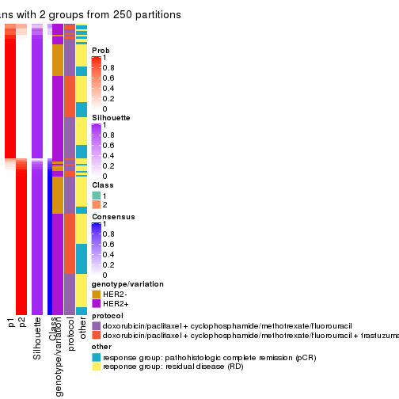</p>

</div>
<div id='tab-MAD-skmeans-consensus-heatmap-2'>
<pre><code class="r">consensus_heatmap(res, k = 3)
</code></pre>

<p>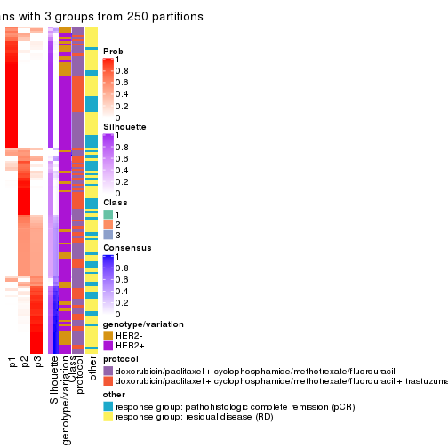</p>

</div>
<div id='tab-MAD-skmeans-consensus-heatmap-3'>
<pre><code class="r">consensus_heatmap(res, k = 4)
</code></pre>

<p>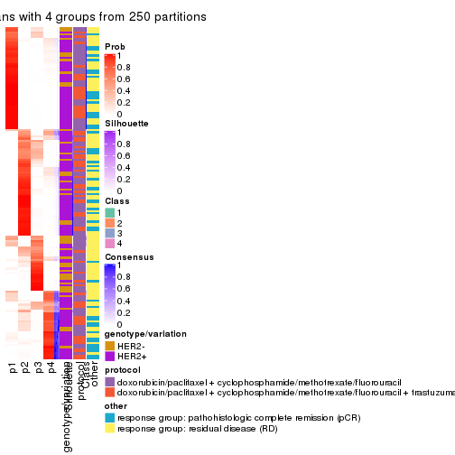</p>

</div>
<div id='tab-MAD-skmeans-consensus-heatmap-4'>
<pre><code class="r">consensus_heatmap(res, k = 5)
</code></pre>

<p>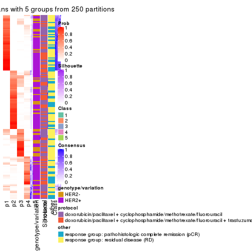</p>

</div>
<div id='tab-MAD-skmeans-consensus-heatmap-5'>
<pre><code class="r">consensus_heatmap(res, k = 6)
</code></pre>

<p>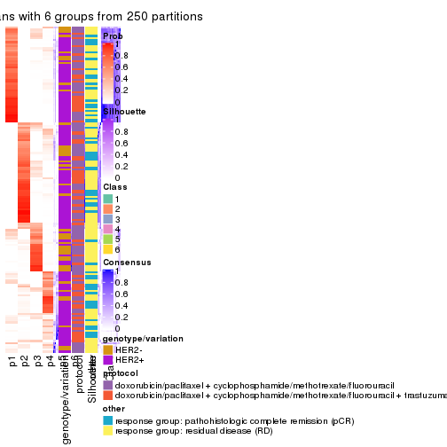</p>

</div>
</div>

Heatmaps for the membership of samples in all partitions to see how consistent they are:


<script>
$( function() {
	$( '#tabs-MAD-skmeans-membership-heatmap' ).tabs();
} );
</script>
<div id='tabs-MAD-skmeans-membership-heatmap'>
<ul>
<li><a href='#tab-MAD-skmeans-membership-heatmap-1'>k = 2</a></li>
<li><a href='#tab-MAD-skmeans-membership-heatmap-2'>k = 3</a></li>
<li><a href='#tab-MAD-skmeans-membership-heatmap-3'>k = 4</a></li>
<li><a href='#tab-MAD-skmeans-membership-heatmap-4'>k = 5</a></li>
<li><a href='#tab-MAD-skmeans-membership-heatmap-5'>k = 6</a></li>
</ul>
<div id='tab-MAD-skmeans-membership-heatmap-1'>
<pre><code class="r">membership_heatmap(res, k = 2)
</code></pre>

<p>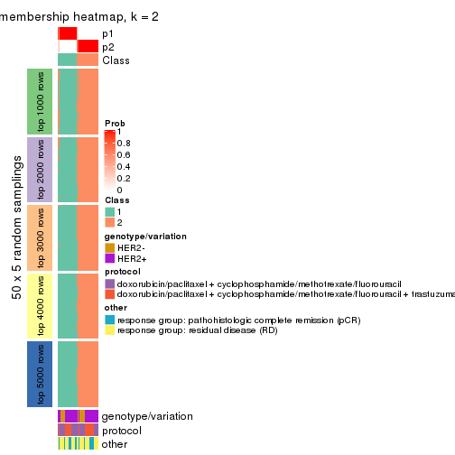</p>

</div>
<div id='tab-MAD-skmeans-membership-heatmap-2'>
<pre><code class="r">membership_heatmap(res, k = 3)
</code></pre>

<p>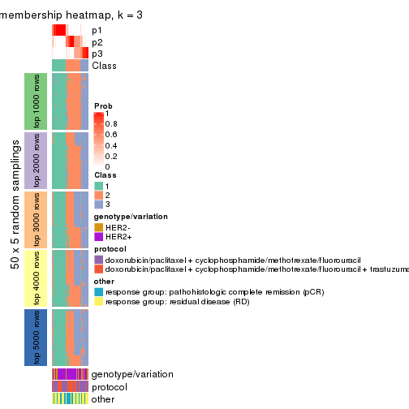</p>

</div>
<div id='tab-MAD-skmeans-membership-heatmap-3'>
<pre><code class="r">membership_heatmap(res, k = 4)
</code></pre>

<p>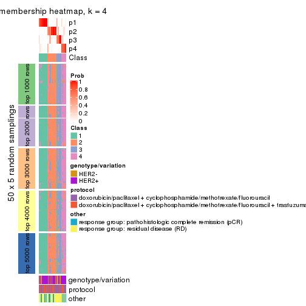</p>

</div>
<div id='tab-MAD-skmeans-membership-heatmap-4'>
<pre><code class="r">membership_heatmap(res, k = 5)
</code></pre>

<p>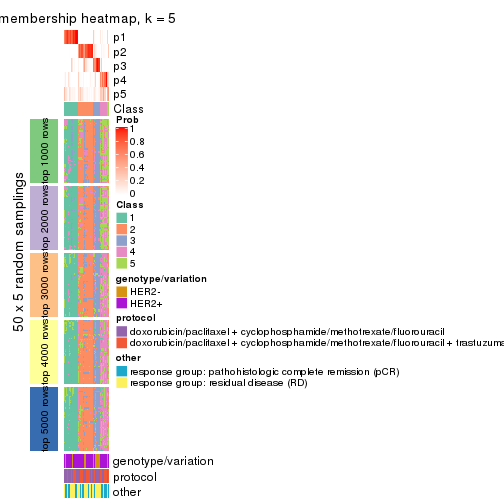</p>

</div>
<div id='tab-MAD-skmeans-membership-heatmap-5'>
<pre><code class="r">membership_heatmap(res, k = 6)
</code></pre>

<p>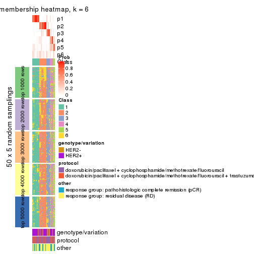</p>

</div>
</div>

As soon as we have had the classes for columns, we can look for signatures
which are significantly different between classes which can be candidate marks
for certain classes. Following are the heatmaps for signatures.


Signature heatmaps where rows are scaled:


<script>
$( function() {
	$( '#tabs-MAD-skmeans-get-signatures' ).tabs();
} );
</script>
<div id='tabs-MAD-skmeans-get-signatures'>
<ul>
<li><a href='#tab-MAD-skmeans-get-signatures-1'>k = 2</a></li>
<li><a href='#tab-MAD-skmeans-get-signatures-2'>k = 3</a></li>
<li><a href='#tab-MAD-skmeans-get-signatures-3'>k = 4</a></li>
<li><a href='#tab-MAD-skmeans-get-signatures-4'>k = 5</a></li>
<li><a href='#tab-MAD-skmeans-get-signatures-5'>k = 6</a></li>
</ul>
<div id='tab-MAD-skmeans-get-signatures-1'>
<pre><code class="r">get_signatures(res, k = 2)
</code></pre>

<pre><code>#&gt; Error: The width or height of the raster image is zero, maybe you forget to turn off the
#&gt; previous graphic device or it was corrupted. Run `dev.off()` to close it.
</code></pre>

<p></p>

</div>
<div id='tab-MAD-skmeans-get-signatures-2'>
<pre><code class="r">get_signatures(res, k = 3)
</code></pre>

<pre><code>#&gt; Error: The width or height of the raster image is zero, maybe you forget to turn off the
#&gt; previous graphic device or it was corrupted. Run `dev.off()` to close it.
</code></pre>

<p></p>

</div>
<div id='tab-MAD-skmeans-get-signatures-3'>
<pre><code class="r">get_signatures(res, k = 4)
</code></pre>

<pre><code>#&gt; Error: The width or height of the raster image is zero, maybe you forget to turn off the
#&gt; previous graphic device or it was corrupted. Run `dev.off()` to close it.
</code></pre>

<p></p>

</div>
<div id='tab-MAD-skmeans-get-signatures-4'>
<pre><code class="r">get_signatures(res, k = 5)
</code></pre>

<pre><code>#&gt; Error: The width or height of the raster image is zero, maybe you forget to turn off the
#&gt; previous graphic device or it was corrupted. Run `dev.off()` to close it.
</code></pre>

<p></p>

</div>
<div id='tab-MAD-skmeans-get-signatures-5'>
<pre><code class="r">get_signatures(res, k = 6)
</code></pre>

<pre><code>#&gt; Error: The width or height of the raster image is zero, maybe you forget to turn off the
#&gt; previous graphic device or it was corrupted. Run `dev.off()` to close it.
</code></pre>

<p></p>

</div>
</div>


Signature heatmaps where rows are not scaled:


<script>
$( function() {
	$( '#tabs-MAD-skmeans-get-signatures-no-scale' ).tabs();
} );
</script>
<div id='tabs-MAD-skmeans-get-signatures-no-scale'>
<ul>
<li><a href='#tab-MAD-skmeans-get-signatures-no-scale-1'>k = 2</a></li>
<li><a href='#tab-MAD-skmeans-get-signatures-no-scale-2'>k = 3</a></li>
<li><a href='#tab-MAD-skmeans-get-signatures-no-scale-3'>k = 4</a></li>
<li><a href='#tab-MAD-skmeans-get-signatures-no-scale-4'>k = 5</a></li>
<li><a href='#tab-MAD-skmeans-get-signatures-no-scale-5'>k = 6</a></li>
</ul>
<div id='tab-MAD-skmeans-get-signatures-no-scale-1'>
<pre><code class="r">get_signatures(res, k = 2, scale_rows = FALSE)
</code></pre>

<pre><code>#&gt; Error: The width or height of the raster image is zero, maybe you forget to turn off the
#&gt; previous graphic device or it was corrupted. Run `dev.off()` to close it.
</code></pre>

<p></p>

</div>
<div id='tab-MAD-skmeans-get-signatures-no-scale-2'>
<pre><code class="r">get_signatures(res, k = 3, scale_rows = FALSE)
</code></pre>

<pre><code>#&gt; Error: The width or height of the raster image is zero, maybe you forget to turn off the
#&gt; previous graphic device or it was corrupted. Run `dev.off()` to close it.
</code></pre>

<p></p>

</div>
<div id='tab-MAD-skmeans-get-signatures-no-scale-3'>
<pre><code class="r">get_signatures(res, k = 4, scale_rows = FALSE)
</code></pre>

<pre><code>#&gt; Error: The width or height of the raster image is zero, maybe you forget to turn off the
#&gt; previous graphic device or it was corrupted. Run `dev.off()` to close it.
</code></pre>

<p></p>

</div>
<div id='tab-MAD-skmeans-get-signatures-no-scale-4'>
<pre><code class="r">get_signatures(res, k = 5, scale_rows = FALSE)
</code></pre>

<pre><code>#&gt; Error: The width or height of the raster image is zero, maybe you forget to turn off the
#&gt; previous graphic device or it was corrupted. Run `dev.off()` to close it.
</code></pre>

<p></p>

</div>
<div id='tab-MAD-skmeans-get-signatures-no-scale-5'>
<pre><code class="r">get_signatures(res, k = 6, scale_rows = FALSE)
</code></pre>

<pre><code>#&gt; Error: The width or height of the raster image is zero, maybe you forget to turn off the
#&gt; previous graphic device or it was corrupted. Run `dev.off()` to close it.
</code></pre>

<p></p>

</div>
</div>


Compare the overlap of signatures from different k:

```r
compare_signatures(res)
```

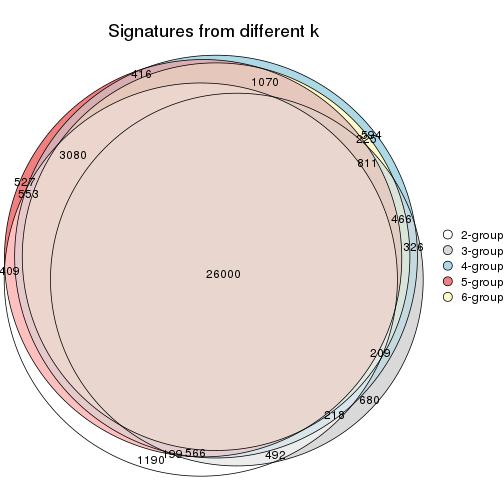

`get_signature()` returns a data frame invisibly. TO get the list of signatures, the function
call should be assigned to a variable explicitly. In following code, if `plot` argument is set
to `FALSE`, no heatmap is plotted while only the differential analysis is performed.

```r
# code only for demonstration
tb = get_signature(res, k = ..., plot = FALSE)
```

An example of the output of `tb` is:

```
#>   which_row         fdr    mean_1    mean_2 scaled_mean_1 scaled_mean_2 km
#> 1        38 0.042760348  8.373488  9.131774    -0.5533452     0.5164555  1
#> 2        40 0.018707592  7.106213  8.469186    -0.6173731     0.5762149  1
#> 3        55 0.019134737 10.221463 11.207825    -0.6159697     0.5749050  1
#> 4        59 0.006059896  5.921854  7.869574    -0.6899429     0.6439467  1
#> 5        60 0.018055526  8.928898 10.211722    -0.6204761     0.5791110  1
#> 6        98 0.009384629 15.714769 14.887706     0.6635654    -0.6193277  2
...
```

The columns in `tb` are:

1. `which_row`: row indices corresponding to the input matrix.
2. `fdr`: FDR for the differential test. 
3. `mean_x`: The mean value in group x.
4. `scaled_mean_x`: The mean value in group x after rows are scaled.
5. `km`: Row groups if k-means clustering is applied to rows.


UMAP plot which shows how samples are separated.


<script>
$( function() {
	$( '#tabs-MAD-skmeans-dimension-reduction' ).tabs();
} );
</script>
<div id='tabs-MAD-skmeans-dimension-reduction'>
<ul>
<li><a href='#tab-MAD-skmeans-dimension-reduction-1'>k = 2</a></li>
<li><a href='#tab-MAD-skmeans-dimension-reduction-2'>k = 3</a></li>
<li><a href='#tab-MAD-skmeans-dimension-reduction-3'>k = 4</a></li>
<li><a href='#tab-MAD-skmeans-dimension-reduction-4'>k = 5</a></li>
<li><a href='#tab-MAD-skmeans-dimension-reduction-5'>k = 6</a></li>
</ul>
<div id='tab-MAD-skmeans-dimension-reduction-1'>
<pre><code class="r">dimension_reduction(res, k = 2, method = &quot;UMAP&quot;)
</code></pre>

<p>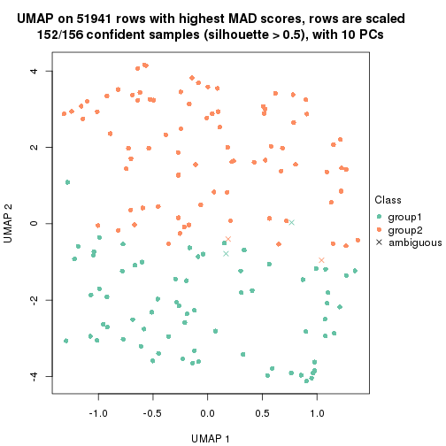</p>

</div>
<div id='tab-MAD-skmeans-dimension-reduction-2'>
<pre><code class="r">dimension_reduction(res, k = 3, method = &quot;UMAP&quot;)
</code></pre>

<p>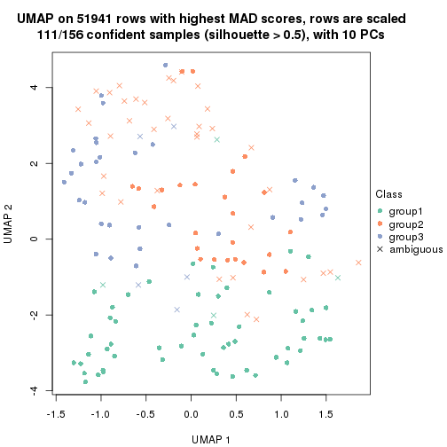</p>

</div>
<div id='tab-MAD-skmeans-dimension-reduction-3'>
<pre><code class="r">dimension_reduction(res, k = 4, method = &quot;UMAP&quot;)
</code></pre>

<p>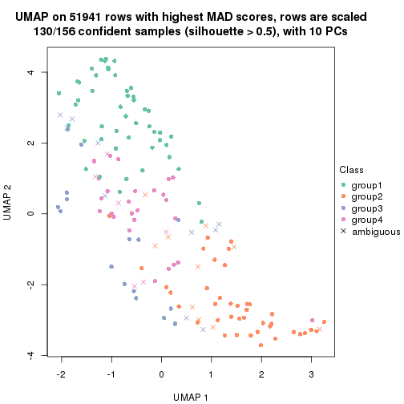</p>

</div>
<div id='tab-MAD-skmeans-dimension-reduction-4'>
<pre><code class="r">dimension_reduction(res, k = 5, method = &quot;UMAP&quot;)
</code></pre>

<p>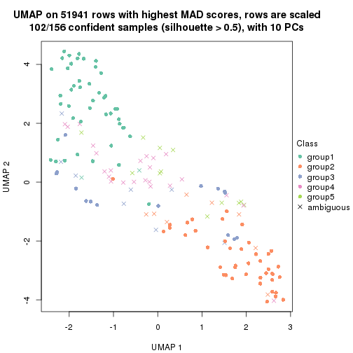</p>

</div>
<div id='tab-MAD-skmeans-dimension-reduction-5'>
<pre><code class="r">dimension_reduction(res, k = 6, method = &quot;UMAP&quot;)
</code></pre>

<p>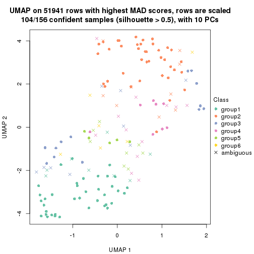</p>

</div>
</div>


Following heatmap shows how subgroups are split when increasing `k`:

```r
collect_classes(res)
```

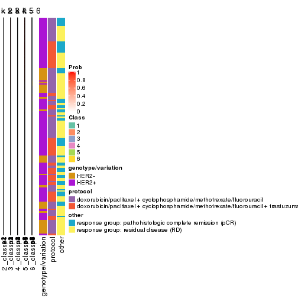


Test correlation between subgroups and known annotations. If the known
annotation is numeric, one-way ANOVA test is applied, and if the known
annotation is discrete, chi-squared contingency table test is applied.

```r
test_to_known_factors(res)
```

```
#>               n genotype/variation(p) protocol(p) other(p) k
#> MAD:skmeans 152              0.759265       0.389   0.8497 2
#> MAD:skmeans 111              0.011603       0.276   0.2045 3
#> MAD:skmeans 130              0.000364       0.450   0.0611 4
#> MAD:skmeans 102              0.000262       0.256   0.0548 5
#> MAD:skmeans 104              0.002420       0.231   0.1247 6
```


If matrix rows can be associated to genes, consider to use `functional_enrichment(res,
...)` to perform function enrichment for the signature genes. See [this vignette](http://bioconductor.org/packages/devel/bioc/vignettes/cola/inst/doc/functional_enrichment.html) for more detailed explanations.


 

---------------------------------------------------


### MAD:pam


The object with results only for a single top-value method and a single partition method 
can be extracted as:

```r
res = res_list["MAD", "pam"]
# you can also extract it by
# res = res_list["MAD:pam"]
```

A summary of `res` and all the functions that can be applied to it:

```r
res
```

```
#> A 'ConsensusPartition' object with k = 2, 3, 4, 5, 6.
#>   On a matrix with 51941 rows and 156 columns.
#>   Top rows (1000, 2000, 3000, 4000, 5000) are extracted by 'MAD' method.
#>   Subgroups are detected by 'pam' method.
#>   Performed in total 1250 partitions by row resampling.
#>   Best k for subgroups seems to be 3.
#> 
#> Following methods can be applied to this 'ConsensusPartition' object:
#>  [1] "cola_report"             "collect_classes"         "collect_plots"          
#>  [4] "collect_stats"           "colnames"                "compare_signatures"     
#>  [7] "consensus_heatmap"       "dimension_reduction"     "functional_enrichment"  
#> [10] "get_anno_col"            "get_anno"                "get_classes"            
#> [13] "get_consensus"           "get_matrix"              "get_membership"         
#> [16] "get_param"               "get_signatures"          "get_stats"              
#> [19] "is_best_k"               "is_stable_k"             "membership_heatmap"     
#> [22] "ncol"                    "nrow"                    "plot_ecdf"              
#> [25] "rownames"                "select_partition_number" "show"                   
#> [28] "suggest_best_k"          "test_to_known_factors"
```

`collect_plots()` function collects all the plots made from `res` for all `k` (number of partitions)
into one single page to provide an easy and fast comparison between different `k`.

```r
collect_plots(res)
```

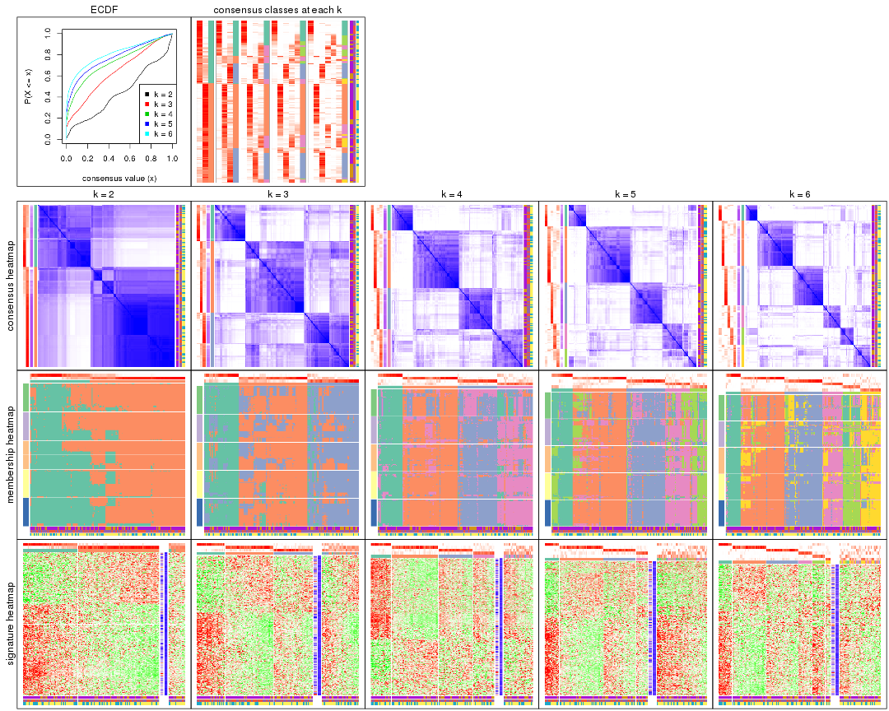

The plots are:

- The first row: a plot of the ECDF (empirical cumulative distribution
  function) curves of the consensus matrix for each `k` and the heatmap of
  predicted classes for each `k`.
- The second row: heatmaps of the consensus matrix for each `k`.
- The third row: heatmaps of the membership matrix for each `k`.
- The fouth row: heatmaps of the signatures for each `k`.

All the plots in panels can be made by individual functions and they are
plotted later in this section.

`select_partition_number()` produces several plots showing different
statistics for choosing "optimized" `k`. There are following statistics:

- ECDF curves of the consensus matrix for each `k`;
- 1-PAC. [The PAC
  score](https://en.wikipedia.org/wiki/Consensus_clustering#Over-interpretation_potential_of_consensus_clustering)
  measures the proportion of the ambiguous subgrouping.
- Mean silhouette score.
- Concordance. The mean probability of fiting the consensus class ids in all
  partitions.
- Area increased. Denote $A_k$ as the area under the ECDF curve for current
  `k`, the area increased is defined as $A_k - A_{k-1}$.
- Rand index. The percent of pairs of samples that are both in a same cluster
  or both are not in a same cluster in the partition of k and k-1.
- Jaccard index. The ratio of pairs of samples are both in a same cluster in
  the partition of k and k-1 and the pairs of samples are both in a same
  cluster in the partition k or k-1.

The detailed explanations of these statistics can be found in [the _cola_
vignette](http://bioconductor.org/packages/devel/bioc/vignettes/cola/inst/doc/cola.html#toc_13).

Generally speaking, lower PAC score, higher mean silhouette score or higher
concordance corresponds to better partition. Rand index and Jaccard index
measure how similar the current partition is compared to partition with `k-1`.
If they are too similar, we won't accept `k` is better than `k-1`.

```r
select_partition_number(res)
```

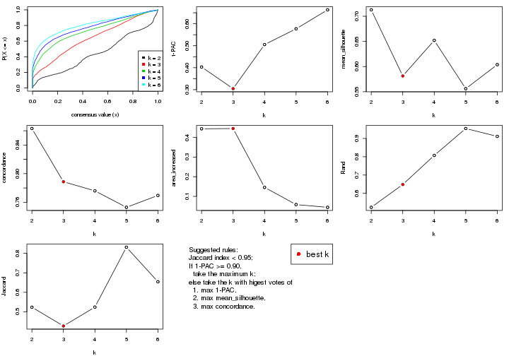

The numeric values for all these statistics can be obtained by `get_stats()`.

```r
get_stats(res)
```

```
#>   k 1-PAC mean_silhouette concordance area_increased  Rand Jaccard
#> 2 2 0.403           0.713       0.863         0.4439 0.524   0.524
#> 3 3 0.305           0.581       0.789         0.4452 0.648   0.427
#> 4 4 0.505           0.652       0.776         0.1458 0.807   0.524
#> 5 5 0.577           0.556       0.753         0.0583 0.954   0.832
#> 6 6 0.663           0.604       0.770         0.0444 0.911   0.654
```

`suggest_best_k()` suggests the best $k$ based on these statistics. The rules are as follows:

- All $k$ with Jaccard index larger than 0.95 are removed because increasing
  $k$ does not provide enough extra information. If all $k$ are removed, it is
  marked as no subgroup is detected.
- For all $k$ with 1-PAC score larger than 0.9, the maximal $k$ is taken as
  the best $k$, and other $k$ are marked as optional $k$.
- If it does not fit the second rule. The $k$ with the maximal vote of the
  highest 1-PAC score, highest mean silhouette, and highest concordance is
  taken as the best $k$.

```r
suggest_best_k(res)
```

```
#> [1] 3
```


Following shows the table of the partitions (You need to click the **show/hide
code output** link to see it). The membership matrix (columns with name `p*`)
is inferred by
[`clue::cl_consensus()`](https://www.rdocumentation.org/link/cl_consensus?package=clue)
function with the `SE` method. Basically the value in the membership matrix
represents the probability to belong to a certain group. The finall class
label for an item is determined with the group with highest probability it
belongs to.

In `get_classes()` function, the entropy is calculated from the membership
matrix and the silhouette score is calculated from the consensus matrix.


<script>
$( function() {
	$( '#tabs-MAD-pam-get-classes' ).tabs();
} );
</script>
<div id='tabs-MAD-pam-get-classes'>
<ul>
<li><a href='#tab-MAD-pam-get-classes-1'>k = 2</a></li>
<li><a href='#tab-MAD-pam-get-classes-2'>k = 3</a></li>
<li><a href='#tab-MAD-pam-get-classes-3'>k = 4</a></li>
<li><a href='#tab-MAD-pam-get-classes-4'>k = 5</a></li>
<li><a href='#tab-MAD-pam-get-classes-5'>k = 6</a></li>
</ul>

<div id='tab-MAD-pam-get-classes-1'>
<p><a id='tab-MAD-pam-get-classes-1-a' style='color:#0366d6' href='#'>show/hide code output</a></p>
<pre><code class="r">cbind(get_classes(res, k = 2), get_membership(res, k = 2))
</code></pre>

<pre><code>#&gt;            class entropy silhouette    p1    p2
#&gt; GSM1232995     2  0.1843      0.857 0.028 0.972
#&gt; GSM1233002     2  0.7674      0.629 0.224 0.776
#&gt; GSM1233003     1  0.2236      0.773 0.964 0.036
#&gt; GSM1233014     2  0.1184      0.855 0.016 0.984
#&gt; GSM1233015     1  0.9850      0.223 0.572 0.428
#&gt; GSM1233016     1  0.9608      0.567 0.616 0.384
#&gt; GSM1233024     2  0.0376      0.856 0.004 0.996
#&gt; GSM1233049     1  0.0376      0.766 0.996 0.004
#&gt; GSM1233064     2  0.2043      0.856 0.032 0.968
#&gt; GSM1233068     1  0.9795      0.474 0.584 0.416
#&gt; GSM1233073     1  0.9815      0.505 0.580 0.420
#&gt; GSM1233093     1  0.1843      0.759 0.972 0.028
#&gt; GSM1233115     1  0.5737      0.752 0.864 0.136
#&gt; GSM1232992     2  0.0000      0.856 0.000 1.000
#&gt; GSM1232993     2  0.2236      0.858 0.036 0.964
#&gt; GSM1233005     2  0.0376      0.856 0.004 0.996
#&gt; GSM1233007     2  0.0672      0.855 0.008 0.992
#&gt; GSM1233010     2  0.8713      0.497 0.292 0.708
#&gt; GSM1233013     2  0.1843      0.857 0.028 0.972
#&gt; GSM1233018     2  0.0000      0.856 0.000 1.000
#&gt; GSM1233019     2  0.0376      0.856 0.004 0.996
#&gt; GSM1233021     2  0.0000      0.856 0.000 1.000
#&gt; GSM1233025     2  0.9881      0.105 0.436 0.564
#&gt; GSM1233029     2  0.0000      0.856 0.000 1.000
#&gt; GSM1233030     2  0.1414      0.858 0.020 0.980
#&gt; GSM1233031     2  0.8267      0.556 0.260 0.740
#&gt; GSM1233032     1  0.3879      0.767 0.924 0.076
#&gt; GSM1233035     2  0.8763      0.525 0.296 0.704
#&gt; GSM1233038     1  0.2043      0.760 0.968 0.032
#&gt; GSM1233039     2  0.0672      0.857 0.008 0.992
#&gt; GSM1233042     2  0.2948      0.836 0.052 0.948
#&gt; GSM1233043     2  0.0672      0.855 0.008 0.992
#&gt; GSM1233044     1  0.9522      0.584 0.628 0.372
#&gt; GSM1233046     2  0.8763      0.525 0.296 0.704
#&gt; GSM1233051     1  0.9170      0.622 0.668 0.332
#&gt; GSM1233054     1  0.9944      0.355 0.544 0.456
#&gt; GSM1233057     2  0.2043      0.856 0.032 0.968
#&gt; GSM1233060     2  0.8081      0.573 0.248 0.752
#&gt; GSM1233062     2  0.0376      0.856 0.004 0.996
#&gt; GSM1233075     2  0.1843      0.857 0.028 0.972
#&gt; GSM1233078     1  0.9635      0.531 0.612 0.388
#&gt; GSM1233079     1  0.0672      0.766 0.992 0.008
#&gt; GSM1233082     1  0.9170      0.627 0.668 0.332
#&gt; GSM1233083     1  0.1843      0.759 0.972 0.028
#&gt; GSM1233091     2  0.3879      0.839 0.076 0.924
#&gt; GSM1233095     1  0.0000      0.766 1.000 0.000
#&gt; GSM1233096     1  0.2043      0.767 0.968 0.032
#&gt; GSM1233101     1  0.3733      0.768 0.928 0.072
#&gt; GSM1233105     1  0.8267      0.692 0.740 0.260
#&gt; GSM1233117     2  0.1843      0.857 0.028 0.972
#&gt; GSM1233118     2  0.1843      0.857 0.028 0.972
#&gt; GSM1233001     2  0.2043      0.856 0.032 0.968
#&gt; GSM1233006     2  0.0938      0.854 0.012 0.988
#&gt; GSM1233008     2  0.1414      0.859 0.020 0.980
#&gt; GSM1233009     2  0.1843      0.857 0.028 0.972
#&gt; GSM1233017     2  0.0376      0.856 0.004 0.996
#&gt; GSM1233020     2  0.0000      0.856 0.000 1.000
#&gt; GSM1233022     2  0.0376      0.856 0.004 0.996
#&gt; GSM1233026     2  0.7376      0.655 0.208 0.792
#&gt; GSM1233028     2  0.1843      0.852 0.028 0.972
#&gt; GSM1233034     2  0.1843      0.857 0.028 0.972
#&gt; GSM1233040     1  0.1184      0.768 0.984 0.016
#&gt; GSM1233048     1  0.0672      0.766 0.992 0.008
#&gt; GSM1233056     1  0.0000      0.766 1.000 0.000
#&gt; GSM1233058     2  0.8713      0.501 0.292 0.708
#&gt; GSM1233059     1  0.0000      0.766 1.000 0.000
#&gt; GSM1233066     1  0.9710      0.507 0.600 0.400
#&gt; GSM1233071     2  0.8386      0.569 0.268 0.732
#&gt; GSM1233074     2  0.1843      0.857 0.028 0.972
#&gt; GSM1233076     2  0.3879      0.818 0.076 0.924
#&gt; GSM1233080     1  0.0000      0.766 1.000 0.000
#&gt; GSM1233088     2  0.9686      0.238 0.396 0.604
#&gt; GSM1233090     1  0.0376      0.766 0.996 0.004
#&gt; GSM1233092     2  0.1184      0.854 0.016 0.984
#&gt; GSM1233094     2  0.8327      0.551 0.264 0.736
#&gt; GSM1233097     2  0.2778      0.844 0.048 0.952
#&gt; GSM1233100     2  0.8267      0.553 0.260 0.740
#&gt; GSM1233104     2  0.4161      0.814 0.084 0.916
#&gt; GSM1233106     1  0.9635      0.535 0.612 0.388
#&gt; GSM1233111     1  0.5629      0.707 0.868 0.132
#&gt; GSM1233122     2  0.2043      0.856 0.032 0.968
#&gt; GSM1233146     2  0.4022      0.813 0.080 0.920
#&gt; GSM1232994     2  0.0672      0.855 0.008 0.992
#&gt; GSM1232996     2  0.0000      0.856 0.000 1.000
#&gt; GSM1232997     2  0.1843      0.857 0.028 0.972
#&gt; GSM1232998     2  0.0672      0.855 0.008 0.992
#&gt; GSM1232999     2  0.0376      0.856 0.004 0.996
#&gt; GSM1233000     2  0.1843      0.857 0.028 0.972
#&gt; GSM1233004     1  0.9661      0.550 0.608 0.392
#&gt; GSM1233011     2  0.0938      0.857 0.012 0.988
#&gt; GSM1233012     2  0.1843      0.857 0.028 0.972
#&gt; GSM1233023     2  0.1843      0.857 0.028 0.972
#&gt; GSM1233027     2  0.0938      0.854 0.012 0.988
#&gt; GSM1233033     1  0.4431      0.767 0.908 0.092
#&gt; GSM1233036     2  0.2236      0.855 0.036 0.964
#&gt; GSM1233037     2  0.3733      0.840 0.072 0.928
#&gt; GSM1233041     1  0.0376      0.766 0.996 0.004
#&gt; GSM1233045     2  0.1633      0.852 0.024 0.976
#&gt; GSM1233047     1  0.9460      0.573 0.636 0.364
#&gt; GSM1233050     1  0.1633      0.770 0.976 0.024
#&gt; GSM1233052     1  0.7139      0.741 0.804 0.196
#&gt; GSM1233053     1  0.1633      0.770 0.976 0.024
#&gt; GSM1233055     1  0.1843      0.759 0.972 0.028
#&gt; GSM1233061     2  0.5629      0.789 0.132 0.868
#&gt; GSM1233063     1  0.5519      0.760 0.872 0.128
#&gt; GSM1233065     2  0.1843      0.857 0.028 0.972
#&gt; GSM1233070     2  0.0672      0.856 0.008 0.992
#&gt; GSM1233077     2  0.9248      0.378 0.340 0.660
#&gt; GSM1233081     1  0.9393      0.585 0.644 0.356
#&gt; GSM1233084     1  0.0000      0.766 1.000 0.000
#&gt; GSM1233087     1  0.9866      0.479 0.568 0.432
#&gt; GSM1233089     2  0.0376      0.856 0.004 0.996
#&gt; GSM1233099     1  0.9732      0.534 0.596 0.404
#&gt; GSM1233112     1  0.7815      0.708 0.768 0.232
#&gt; GSM1233085     1  0.9129      0.630 0.672 0.328
#&gt; GSM1233098     2  0.1843      0.857 0.028 0.972
#&gt; GSM1233114     1  0.6973      0.738 0.812 0.188
#&gt; GSM1233119     1  0.9754      0.527 0.592 0.408
#&gt; GSM1233129     2  0.2423      0.854 0.040 0.960
#&gt; GSM1233132     1  0.1184      0.768 0.984 0.016
#&gt; GSM1233139     2  0.1843      0.857 0.028 0.972
#&gt; GSM1233143     2  0.2603      0.853 0.044 0.956
#&gt; GSM1233145     1  0.2423      0.764 0.960 0.040
#&gt; GSM1233067     2  0.3114      0.846 0.056 0.944
#&gt; GSM1233069     2  0.9323      0.356 0.348 0.652
#&gt; GSM1233072     2  0.0672      0.857 0.008 0.992
#&gt; GSM1233086     2  0.5737      0.774 0.136 0.864
#&gt; GSM1233102     1  0.9044      0.654 0.680 0.320
#&gt; GSM1233103     2  1.0000     -0.179 0.496 0.504
#&gt; GSM1233107     2  0.8267      0.603 0.260 0.740
#&gt; GSM1233108     1  0.2043      0.772 0.968 0.032
#&gt; GSM1233109     1  0.9427      0.580 0.640 0.360
#&gt; GSM1233110     2  0.9460      0.314 0.364 0.636
#&gt; GSM1233113     2  0.1843      0.857 0.028 0.972
#&gt; GSM1233116     2  0.0672      0.857 0.008 0.992
#&gt; GSM1233120     1  0.8555      0.687 0.720 0.280
#&gt; GSM1233121     2  0.9427      0.320 0.360 0.640
#&gt; GSM1233123     2  0.9393      0.329 0.356 0.644
#&gt; GSM1233124     2  0.9491      0.299 0.368 0.632
#&gt; GSM1233125     1  0.0672      0.766 0.992 0.008
#&gt; GSM1233126     2  0.8207      0.578 0.256 0.744
#&gt; GSM1233127     2  0.2236      0.857 0.036 0.964
#&gt; GSM1233128     1  0.1843      0.759 0.972 0.028
#&gt; GSM1233130     2  0.9393      0.331 0.356 0.644
#&gt; GSM1233131     1  0.8327      0.700 0.736 0.264
#&gt; GSM1233133     1  0.9248      0.613 0.660 0.340
#&gt; GSM1233134     2  0.5408      0.787 0.124 0.876
#&gt; GSM1233135     2  0.9044      0.435 0.320 0.680
#&gt; GSM1233136     2  0.9358      0.342 0.352 0.648
#&gt; GSM1233137     1  0.6531      0.739 0.832 0.168
#&gt; GSM1233138     2  0.1414      0.854 0.020 0.980
#&gt; GSM1233140     1  0.7376      0.729 0.792 0.208
#&gt; GSM1233141     2  0.2043      0.859 0.032 0.968
#&gt; GSM1233142     2  0.0376      0.857 0.004 0.996
#&gt; GSM1233144     1  0.9129      0.630 0.672 0.328
#&gt; GSM1233147     2  0.8016      0.577 0.244 0.756
</code></pre>

<script>
$('#tab-MAD-pam-get-classes-1-a').parent().next().next().hide();
$('#tab-MAD-pam-get-classes-1-a').click(function(){
  $('#tab-MAD-pam-get-classes-1-a').parent().next().next().toggle();
  return(false);
});
</script>
</div>

<div id='tab-MAD-pam-get-classes-2'>
<p><a id='tab-MAD-pam-get-classes-2-a' style='color:#0366d6' href='#'>show/hide code output</a></p>
<pre><code class="r">cbind(get_classes(res, k = 3), get_membership(res, k = 3))
</code></pre>

<pre><code>#&gt;            class entropy silhouette    p1    p2    p3
#&gt; GSM1232995     2  0.6095     0.1679 0.000 0.608 0.392
#&gt; GSM1233002     2  0.3921     0.6838 0.036 0.884 0.080
#&gt; GSM1233003     1  0.4399     0.7553 0.812 0.000 0.188
#&gt; GSM1233014     2  0.3879     0.6837 0.000 0.848 0.152
#&gt; GSM1233015     2  0.7922    -0.0771 0.060 0.532 0.408
#&gt; GSM1233016     1  0.8796     0.4323 0.508 0.120 0.372
#&gt; GSM1233024     2  0.1753     0.7009 0.000 0.952 0.048
#&gt; GSM1233049     1  0.2261     0.7923 0.932 0.000 0.068
#&gt; GSM1233064     2  0.4974     0.4898 0.000 0.764 0.236
#&gt; GSM1233068     3  0.1989     0.7168 0.004 0.048 0.948
#&gt; GSM1233073     2  0.9390     0.3238 0.184 0.476 0.340
#&gt; GSM1233093     1  0.0000     0.7977 1.000 0.000 0.000
#&gt; GSM1233115     3  0.9172     0.1831 0.296 0.180 0.524
#&gt; GSM1232992     2  0.0000     0.7027 0.000 1.000 0.000
#&gt; GSM1232993     2  0.4842     0.5007 0.000 0.776 0.224
#&gt; GSM1233005     2  0.0000     0.7027 0.000 1.000 0.000
#&gt; GSM1233007     2  0.3340     0.7005 0.000 0.880 0.120
#&gt; GSM1233010     2  0.6810     0.6138 0.068 0.720 0.212
#&gt; GSM1233013     2  0.5882     0.2191 0.000 0.652 0.348
#&gt; GSM1233018     2  0.0000     0.7027 0.000 1.000 0.000
#&gt; GSM1233019     2  0.1529     0.7024 0.000 0.960 0.040
#&gt; GSM1233021     2  0.0000     0.7027 0.000 1.000 0.000
#&gt; GSM1233025     1  0.9749     0.2339 0.444 0.296 0.260
#&gt; GSM1233029     2  0.0000     0.7027 0.000 1.000 0.000
#&gt; GSM1233030     2  0.4504     0.5985 0.000 0.804 0.196
#&gt; GSM1233031     2  0.5207     0.6889 0.052 0.824 0.124
#&gt; GSM1233032     1  0.6252     0.2136 0.556 0.000 0.444
#&gt; GSM1233035     3  0.9621     0.3326 0.252 0.276 0.472
#&gt; GSM1233038     1  0.0000     0.7977 1.000 0.000 0.000
#&gt; GSM1233039     2  0.3192     0.6977 0.000 0.888 0.112
#&gt; GSM1233042     2  0.0592     0.7037 0.012 0.988 0.000
#&gt; GSM1233043     2  0.0000     0.7027 0.000 1.000 0.000
#&gt; GSM1233044     3  0.7295     0.3557 0.072 0.252 0.676
#&gt; GSM1233046     3  0.7337     0.6676 0.140 0.152 0.708
#&gt; GSM1233051     3  0.4883     0.4877 0.208 0.004 0.788
#&gt; GSM1233054     3  0.4883     0.6880 0.004 0.208 0.788
#&gt; GSM1233057     3  0.5560     0.6132 0.000 0.300 0.700
#&gt; GSM1233060     2  0.3253     0.7033 0.036 0.912 0.052
#&gt; GSM1233062     2  0.3551     0.6993 0.000 0.868 0.132
#&gt; GSM1233075     3  0.5835     0.5653 0.000 0.340 0.660
#&gt; GSM1233078     3  0.0000     0.7185 0.000 0.000 1.000
#&gt; GSM1233079     3  0.6168     0.2005 0.412 0.000 0.588
#&gt; GSM1233082     3  0.2703     0.7078 0.056 0.016 0.928
#&gt; GSM1233083     1  0.4399     0.7599 0.812 0.000 0.188
#&gt; GSM1233091     3  0.5591     0.6090 0.000 0.304 0.696
#&gt; GSM1233095     1  0.2261     0.7923 0.932 0.000 0.068
#&gt; GSM1233096     1  0.3816     0.7141 0.852 0.000 0.148
#&gt; GSM1233101     1  0.3573     0.7726 0.876 0.004 0.120
#&gt; GSM1233105     1  0.7916     0.5784 0.636 0.100 0.264
#&gt; GSM1233117     2  0.5785     0.3560 0.000 0.668 0.332
#&gt; GSM1233118     3  0.5882     0.5028 0.000 0.348 0.652
#&gt; GSM1233001     2  0.6286    -0.1232 0.000 0.536 0.464
#&gt; GSM1233006     2  0.3340     0.6898 0.000 0.880 0.120
#&gt; GSM1233008     2  0.6079     0.2813 0.000 0.612 0.388
#&gt; GSM1233009     2  0.4605     0.5378 0.000 0.796 0.204
#&gt; GSM1233017     2  0.1753     0.7009 0.000 0.952 0.048
#&gt; GSM1233020     2  0.2066     0.6888 0.000 0.940 0.060
#&gt; GSM1233022     2  0.2959     0.7076 0.000 0.900 0.100
#&gt; GSM1233026     2  0.6348     0.6263 0.048 0.740 0.212
#&gt; GSM1233028     2  0.3359     0.6981 0.016 0.900 0.084
#&gt; GSM1233034     2  0.4555     0.5518 0.000 0.800 0.200
#&gt; GSM1233040     1  0.3941     0.7109 0.844 0.000 0.156
#&gt; GSM1233048     1  0.0000     0.7977 1.000 0.000 0.000
#&gt; GSM1233056     1  0.0747     0.7982 0.984 0.000 0.016
#&gt; GSM1233058     2  0.6446     0.6260 0.052 0.736 0.212
#&gt; GSM1233059     1  0.0237     0.7983 0.996 0.000 0.004
#&gt; GSM1233066     3  0.0000     0.7185 0.000 0.000 1.000
#&gt; GSM1233071     3  0.4834     0.6838 0.004 0.204 0.792
#&gt; GSM1233074     3  0.5760     0.5795 0.000 0.328 0.672
#&gt; GSM1233076     2  0.5363     0.6085 0.000 0.724 0.276
#&gt; GSM1233080     1  0.1964     0.7952 0.944 0.000 0.056
#&gt; GSM1233088     3  0.5012     0.6625 0.008 0.204 0.788
#&gt; GSM1233090     1  0.0424     0.7991 0.992 0.000 0.008
#&gt; GSM1233092     2  0.4931     0.6402 0.000 0.768 0.232
#&gt; GSM1233094     2  0.6079     0.6308 0.036 0.748 0.216
#&gt; GSM1233097     2  0.5506     0.6501 0.016 0.764 0.220
#&gt; GSM1233100     2  0.5377     0.6664 0.112 0.820 0.068
#&gt; GSM1233104     2  0.5585     0.6574 0.024 0.772 0.204
#&gt; GSM1233106     3  0.1031     0.7147 0.024 0.000 0.976
#&gt; GSM1233111     1  0.3879     0.7141 0.848 0.000 0.152
#&gt; GSM1233122     3  0.6267     0.2505 0.000 0.452 0.548
#&gt; GSM1233146     2  0.2955     0.7027 0.008 0.912 0.080
#&gt; GSM1232994     2  0.0000     0.7027 0.000 1.000 0.000
#&gt; GSM1232996     2  0.0000     0.7027 0.000 1.000 0.000
#&gt; GSM1232997     2  0.6126     0.1377 0.000 0.600 0.400
#&gt; GSM1232998     2  0.3879     0.6837 0.000 0.848 0.152
#&gt; GSM1232999     2  0.0000     0.7027 0.000 1.000 0.000
#&gt; GSM1233000     2  0.4750     0.5170 0.000 0.784 0.216
#&gt; GSM1233004     2  0.9234     0.3312 0.160 0.476 0.364
#&gt; GSM1233011     2  0.6192     0.4123 0.000 0.580 0.420
#&gt; GSM1233012     3  0.5926     0.4568 0.000 0.356 0.644
#&gt; GSM1233023     3  0.5785     0.5865 0.000 0.332 0.668
#&gt; GSM1233027     2  0.0000     0.7027 0.000 1.000 0.000
#&gt; GSM1233033     1  0.3295     0.7871 0.896 0.008 0.096
#&gt; GSM1233036     3  0.4897     0.6946 0.016 0.172 0.812
#&gt; GSM1233037     3  0.4887     0.6674 0.000 0.228 0.772
#&gt; GSM1233041     1  0.0000     0.7977 1.000 0.000 0.000
#&gt; GSM1233045     2  0.2711     0.7074 0.000 0.912 0.088
#&gt; GSM1233047     3  0.1267     0.7247 0.024 0.004 0.972
#&gt; GSM1233050     1  0.2711     0.7886 0.912 0.000 0.088
#&gt; GSM1233052     2  0.9192     0.3978 0.180 0.520 0.300
#&gt; GSM1233053     1  0.6291     0.1513 0.532 0.000 0.468
#&gt; GSM1233055     1  0.0000     0.7977 1.000 0.000 0.000
#&gt; GSM1233061     3  0.3192     0.7250 0.000 0.112 0.888
#&gt; GSM1233063     1  0.4931     0.7114 0.768 0.000 0.232
#&gt; GSM1233065     2  0.6235     0.0854 0.000 0.564 0.436
#&gt; GSM1233070     2  0.5882     0.5514 0.000 0.652 0.348
#&gt; GSM1233077     3  0.2537     0.7025 0.000 0.080 0.920
#&gt; GSM1233081     3  0.0424     0.7198 0.008 0.000 0.992
#&gt; GSM1233084     1  0.0892     0.7980 0.980 0.000 0.020
#&gt; GSM1233087     2  0.9355     0.3561 0.188 0.492 0.320
#&gt; GSM1233089     2  0.3192     0.6969 0.000 0.888 0.112
#&gt; GSM1233099     2  0.9441     0.3388 0.200 0.484 0.316
#&gt; GSM1233112     1  0.5948     0.6034 0.640 0.000 0.360
#&gt; GSM1233085     3  0.3340     0.6876 0.120 0.000 0.880
#&gt; GSM1233098     3  0.6235     0.4185 0.000 0.436 0.564
#&gt; GSM1233114     1  0.4702     0.7125 0.788 0.000 0.212
#&gt; GSM1233119     2  0.9830     0.2521 0.264 0.420 0.316
#&gt; GSM1233129     3  0.5621     0.6037 0.000 0.308 0.692
#&gt; GSM1233132     1  0.0592     0.7992 0.988 0.000 0.012
#&gt; GSM1233139     2  0.6302    -0.1497 0.000 0.520 0.480
#&gt; GSM1233143     3  0.4399     0.6861 0.000 0.188 0.812
#&gt; GSM1233145     1  0.3551     0.7721 0.868 0.000 0.132
#&gt; GSM1233067     3  0.4504     0.6842 0.000 0.196 0.804
#&gt; GSM1233069     3  0.3686     0.7123 0.000 0.140 0.860
#&gt; GSM1233072     2  0.4291     0.6630 0.000 0.820 0.180
#&gt; GSM1233086     3  0.4178     0.6380 0.000 0.172 0.828
#&gt; GSM1233102     1  0.9520     0.3869 0.452 0.196 0.352
#&gt; GSM1233103     3  0.5835     0.6980 0.052 0.164 0.784
#&gt; GSM1233107     3  0.8231     0.5871 0.156 0.208 0.636
#&gt; GSM1233108     3  0.6305    -0.2134 0.484 0.000 0.516
#&gt; GSM1233109     3  0.0592     0.7196 0.012 0.000 0.988
#&gt; GSM1233110     3  0.0000     0.7185 0.000 0.000 1.000
#&gt; GSM1233113     2  0.6299    -0.1370 0.000 0.524 0.476
#&gt; GSM1233116     2  0.5431     0.5980 0.000 0.716 0.284
#&gt; GSM1233120     1  0.9842     0.2732 0.420 0.272 0.308
#&gt; GSM1233121     3  0.3038     0.6729 0.000 0.104 0.896
#&gt; GSM1233123     3  0.3038     0.7257 0.000 0.104 0.896
#&gt; GSM1233124     3  0.2356     0.7309 0.000 0.072 0.928
#&gt; GSM1233125     1  0.4504     0.7620 0.804 0.000 0.196
#&gt; GSM1233126     2  0.8776     0.4801 0.144 0.560 0.296
#&gt; GSM1233127     2  0.6192     0.3334 0.000 0.580 0.420
#&gt; GSM1233128     1  0.0892     0.7994 0.980 0.000 0.020
#&gt; GSM1233130     3  0.0000     0.7185 0.000 0.000 1.000
#&gt; GSM1233131     1  0.8435     0.5400 0.592 0.124 0.284
#&gt; GSM1233133     3  0.0592     0.7210 0.012 0.000 0.988
#&gt; GSM1233134     3  0.3879     0.7103 0.000 0.152 0.848
#&gt; GSM1233135     3  0.4121     0.7136 0.000 0.168 0.832
#&gt; GSM1233136     3  0.5291     0.4672 0.000 0.268 0.732
#&gt; GSM1233137     3  0.5138     0.5400 0.252 0.000 0.748
#&gt; GSM1233138     2  0.6341     0.5908 0.016 0.672 0.312
#&gt; GSM1233140     3  0.5650     0.3090 0.312 0.000 0.688
#&gt; GSM1233141     3  0.6280     0.1111 0.000 0.460 0.540
#&gt; GSM1233142     2  0.4555     0.6650 0.000 0.800 0.200
#&gt; GSM1233144     3  0.0892     0.7202 0.020 0.000 0.980
#&gt; GSM1233147     2  0.5397     0.5992 0.000 0.720 0.280
</code></pre>

<script>
$('#tab-MAD-pam-get-classes-2-a').parent().next().next().hide();
$('#tab-MAD-pam-get-classes-2-a').click(function(){
  $('#tab-MAD-pam-get-classes-2-a').parent().next().next().toggle();
  return(false);
});
</script>
</div>

<div id='tab-MAD-pam-get-classes-3'>
<p><a id='tab-MAD-pam-get-classes-3-a' style='color:#0366d6' href='#'>show/hide code output</a></p>
<pre><code class="r">cbind(get_classes(res, k = 4), get_membership(res, k = 4))
</code></pre>

<pre><code>#&gt;            class entropy silhouette    p1    p2    p3    p4
#&gt; GSM1232995     2  0.3249     0.7589 0.000 0.852 0.140 0.008
#&gt; GSM1233002     4  0.4679     0.4807 0.000 0.352 0.000 0.648
#&gt; GSM1233003     4  0.6176     0.4004 0.368 0.000 0.060 0.572
#&gt; GSM1233014     2  0.7128     0.4056 0.000 0.528 0.152 0.320
#&gt; GSM1233015     2  0.3264     0.7650 0.004 0.876 0.096 0.024
#&gt; GSM1233016     4  0.5506     0.5562 0.268 0.016 0.024 0.692
#&gt; GSM1233024     2  0.2345     0.7845 0.000 0.900 0.000 0.100
#&gt; GSM1233049     1  0.1724     0.8296 0.948 0.000 0.032 0.020
#&gt; GSM1233064     2  0.0817     0.7909 0.000 0.976 0.024 0.000
#&gt; GSM1233068     3  0.1722     0.7882 0.000 0.008 0.944 0.048
#&gt; GSM1233073     4  0.5276     0.6599 0.004 0.084 0.156 0.756
#&gt; GSM1233093     1  0.0000     0.8392 1.000 0.000 0.000 0.000
#&gt; GSM1233115     4  0.6405     0.6273 0.092 0.072 0.112 0.724
#&gt; GSM1232992     2  0.0000     0.7892 0.000 1.000 0.000 0.000
#&gt; GSM1232993     2  0.0927     0.7910 0.000 0.976 0.008 0.016
#&gt; GSM1233005     2  0.0000     0.7892 0.000 1.000 0.000 0.000
#&gt; GSM1233007     2  0.3610     0.7213 0.000 0.800 0.000 0.200
#&gt; GSM1233010     4  0.7897     0.5311 0.036 0.300 0.140 0.524
#&gt; GSM1233013     2  0.1389     0.7866 0.000 0.952 0.048 0.000
#&gt; GSM1233018     2  0.0000     0.7892 0.000 1.000 0.000 0.000
#&gt; GSM1233019     2  0.1716     0.7858 0.000 0.936 0.000 0.064
#&gt; GSM1233021     2  0.0000     0.7892 0.000 1.000 0.000 0.000
#&gt; GSM1233025     4  0.5563     0.5844 0.248 0.028 0.020 0.704
#&gt; GSM1233029     2  0.1118     0.7836 0.000 0.964 0.000 0.036
#&gt; GSM1233030     2  0.2334     0.7787 0.000 0.908 0.004 0.088
#&gt; GSM1233031     2  0.5878     0.5675 0.000 0.632 0.056 0.312
#&gt; GSM1233032     1  0.4936     0.5630 0.700 0.000 0.280 0.020
#&gt; GSM1233035     2  0.8644     0.3973 0.076 0.464 0.312 0.148
#&gt; GSM1233038     1  0.1389     0.8276 0.952 0.000 0.000 0.048
#&gt; GSM1233039     2  0.4855     0.2128 0.000 0.600 0.000 0.400
#&gt; GSM1233042     2  0.3074     0.7343 0.000 0.848 0.000 0.152
#&gt; GSM1233043     2  0.3172     0.7311 0.000 0.840 0.000 0.160
#&gt; GSM1233044     3  0.5057     0.5480 0.004 0.044 0.748 0.204
#&gt; GSM1233046     3  0.5517     0.6524 0.020 0.036 0.724 0.220
#&gt; GSM1233051     4  0.7437     0.4138 0.136 0.008 0.380 0.476
#&gt; GSM1233054     3  0.1929     0.7999 0.000 0.024 0.940 0.036
#&gt; GSM1233057     3  0.2266     0.7861 0.000 0.084 0.912 0.004
#&gt; GSM1233060     2  0.3569     0.7507 0.000 0.804 0.000 0.196
#&gt; GSM1233062     2  0.5369     0.7225 0.000 0.744 0.144 0.112
#&gt; GSM1233075     3  0.4879     0.7582 0.000 0.092 0.780 0.128
#&gt; GSM1233078     3  0.3942     0.7309 0.000 0.000 0.764 0.236
#&gt; GSM1233079     1  0.6813     0.4024 0.576 0.000 0.292 0.132
#&gt; GSM1233082     3  0.4594     0.4021 0.008 0.000 0.712 0.280
#&gt; GSM1233083     4  0.5772     0.5116 0.260 0.000 0.068 0.672
#&gt; GSM1233091     3  0.2480     0.7793 0.000 0.088 0.904 0.008
#&gt; GSM1233095     1  0.3523     0.7713 0.856 0.000 0.032 0.112
#&gt; GSM1233096     1  0.1109     0.8357 0.968 0.000 0.004 0.028
#&gt; GSM1233101     1  0.5923     0.5966 0.696 0.000 0.176 0.128
#&gt; GSM1233105     4  0.6402     0.4936 0.292 0.012 0.068 0.628
#&gt; GSM1233117     2  0.3149     0.7786 0.000 0.880 0.032 0.088
#&gt; GSM1233118     3  0.6584     0.3809 0.000 0.336 0.568 0.096
#&gt; GSM1233001     2  0.2976     0.7588 0.000 0.872 0.120 0.008
#&gt; GSM1233006     2  0.4194     0.7161 0.000 0.764 0.008 0.228
#&gt; GSM1233008     2  0.4595     0.7247 0.000 0.780 0.176 0.044
#&gt; GSM1233009     2  0.0469     0.7911 0.000 0.988 0.012 0.000
#&gt; GSM1233017     2  0.2149     0.7788 0.000 0.912 0.000 0.088
#&gt; GSM1233020     2  0.0524     0.7916 0.000 0.988 0.004 0.008
#&gt; GSM1233022     2  0.5132     0.7377 0.000 0.748 0.068 0.184
#&gt; GSM1233026     4  0.7354     0.4411 0.000 0.352 0.168 0.480
#&gt; GSM1233028     2  0.5905     0.6296 0.000 0.700 0.144 0.156
#&gt; GSM1233034     2  0.1629     0.7927 0.000 0.952 0.024 0.024
#&gt; GSM1233040     1  0.0779     0.8386 0.980 0.000 0.004 0.016
#&gt; GSM1233048     1  0.1867     0.8180 0.928 0.000 0.000 0.072
#&gt; GSM1233056     1  0.0000     0.8392 1.000 0.000 0.000 0.000
#&gt; GSM1233058     4  0.5770     0.6575 0.000 0.140 0.148 0.712
#&gt; GSM1233059     1  0.0000     0.8392 1.000 0.000 0.000 0.000
#&gt; GSM1233066     3  0.1474     0.7911 0.000 0.000 0.948 0.052
#&gt; GSM1233071     3  0.4174     0.7549 0.000 0.044 0.816 0.140
#&gt; GSM1233074     3  0.3991     0.7335 0.000 0.172 0.808 0.020
#&gt; GSM1233076     4  0.3962     0.6442 0.000 0.152 0.028 0.820
#&gt; GSM1233080     1  0.0817     0.8366 0.976 0.000 0.024 0.000
#&gt; GSM1233088     3  0.4514     0.7592 0.000 0.056 0.796 0.148
#&gt; GSM1233090     1  0.0000     0.8392 1.000 0.000 0.000 0.000
#&gt; GSM1233092     4  0.3893     0.6070 0.000 0.196 0.008 0.796
#&gt; GSM1233094     2  0.7599     0.2802 0.000 0.448 0.208 0.344
#&gt; GSM1233097     4  0.7243     0.0161 0.000 0.404 0.144 0.452
#&gt; GSM1233100     2  0.6696     0.5042 0.004 0.604 0.112 0.280
#&gt; GSM1233104     2  0.7268     0.2530 0.000 0.476 0.152 0.372
#&gt; GSM1233106     3  0.0921     0.7888 0.000 0.000 0.972 0.028
#&gt; GSM1233111     1  0.1256     0.8350 0.964 0.000 0.008 0.028
#&gt; GSM1233122     2  0.3907     0.7623 0.000 0.836 0.044 0.120
#&gt; GSM1233146     2  0.5630     0.6691 0.000 0.724 0.140 0.136
#&gt; GSM1232994     2  0.0000     0.7892 0.000 1.000 0.000 0.000
#&gt; GSM1232996     2  0.0469     0.7881 0.000 0.988 0.000 0.012
#&gt; GSM1232997     2  0.3870     0.7276 0.000 0.788 0.208 0.004
#&gt; GSM1232998     2  0.6719     0.5151 0.000 0.608 0.152 0.240
#&gt; GSM1232999     2  0.1118     0.7836 0.000 0.964 0.000 0.036
#&gt; GSM1233000     2  0.0592     0.7906 0.000 0.984 0.016 0.000
#&gt; GSM1233004     4  0.4525     0.6511 0.000 0.116 0.080 0.804
#&gt; GSM1233011     4  0.6547     0.6017 0.000 0.124 0.260 0.616
#&gt; GSM1233012     2  0.7113     0.3035 0.000 0.484 0.384 0.132
#&gt; GSM1233023     3  0.2888     0.7726 0.000 0.124 0.872 0.004
#&gt; GSM1233027     2  0.1118     0.7836 0.000 0.964 0.000 0.036
#&gt; GSM1233033     1  0.5060     0.1189 0.584 0.000 0.004 0.412
#&gt; GSM1233036     3  0.3080     0.7755 0.000 0.024 0.880 0.096
#&gt; GSM1233037     3  0.3439     0.8016 0.000 0.048 0.868 0.084
#&gt; GSM1233041     1  0.0188     0.8388 0.996 0.000 0.000 0.004
#&gt; GSM1233045     2  0.5070     0.6618 0.000 0.748 0.060 0.192
#&gt; GSM1233047     3  0.0921     0.7911 0.000 0.000 0.972 0.028
#&gt; GSM1233050     1  0.2473     0.8046 0.908 0.000 0.080 0.012
#&gt; GSM1233052     4  0.8168     0.6064 0.056 0.196 0.200 0.548
#&gt; GSM1233053     1  0.5141     0.7032 0.756 0.000 0.160 0.084
#&gt; GSM1233055     1  0.1940     0.8124 0.924 0.000 0.000 0.076
#&gt; GSM1233061     3  0.1970     0.7907 0.000 0.008 0.932 0.060
#&gt; GSM1233063     4  0.6064     0.2680 0.444 0.000 0.044 0.512
#&gt; GSM1233065     2  0.5184     0.5866 0.000 0.672 0.304 0.024
#&gt; GSM1233070     4  0.6871     0.4853 0.000 0.240 0.168 0.592
#&gt; GSM1233077     4  0.4624     0.2638 0.000 0.000 0.340 0.660
#&gt; GSM1233081     3  0.3688     0.7152 0.000 0.000 0.792 0.208
#&gt; GSM1233084     1  0.0188     0.8388 0.996 0.000 0.000 0.004
#&gt; GSM1233087     4  0.4890     0.6673 0.000 0.080 0.144 0.776
#&gt; GSM1233089     2  0.2918     0.7701 0.000 0.876 0.008 0.116
#&gt; GSM1233099     4  0.5596     0.6586 0.004 0.088 0.180 0.728
#&gt; GSM1233112     4  0.5142     0.5803 0.192 0.000 0.064 0.744
#&gt; GSM1233085     3  0.3105     0.7698 0.004 0.000 0.856 0.140
#&gt; GSM1233098     2  0.5132     0.0899 0.000 0.548 0.448 0.004
#&gt; GSM1233114     1  0.5953     0.4452 0.656 0.000 0.076 0.268
#&gt; GSM1233119     4  0.4825     0.6660 0.020 0.036 0.152 0.792
#&gt; GSM1233129     3  0.2271     0.7825 0.000 0.076 0.916 0.008
#&gt; GSM1233132     1  0.2401     0.8145 0.904 0.000 0.004 0.092
#&gt; GSM1233139     2  0.3142     0.7530 0.000 0.860 0.132 0.008
#&gt; GSM1233143     3  0.3606     0.7517 0.000 0.024 0.844 0.132
#&gt; GSM1233145     4  0.5592     0.3641 0.404 0.000 0.024 0.572
#&gt; GSM1233067     3  0.3958     0.7641 0.000 0.024 0.816 0.160
#&gt; GSM1233069     3  0.3266     0.7633 0.000 0.000 0.832 0.168
#&gt; GSM1233072     2  0.3161     0.7669 0.000 0.864 0.012 0.124
#&gt; GSM1233086     3  0.4094     0.7582 0.000 0.056 0.828 0.116
#&gt; GSM1233102     4  0.5134     0.6400 0.120 0.004 0.104 0.772
#&gt; GSM1233103     3  0.6703     0.4685 0.000 0.232 0.612 0.156
#&gt; GSM1233107     3  0.7359     0.2515 0.000 0.184 0.504 0.312
#&gt; GSM1233108     4  0.7007     0.3676 0.144 0.000 0.308 0.548
#&gt; GSM1233109     4  0.4955     0.1513 0.000 0.000 0.444 0.556
#&gt; GSM1233110     3  0.2921     0.7556 0.000 0.000 0.860 0.140
#&gt; GSM1233113     2  0.3156     0.7755 0.000 0.884 0.068 0.048
#&gt; GSM1233116     2  0.6490     0.6578 0.000 0.640 0.156 0.204
#&gt; GSM1233120     4  0.4562     0.6136 0.152 0.000 0.056 0.792
#&gt; GSM1233121     3  0.4624     0.7532 0.000 0.052 0.784 0.164
#&gt; GSM1233123     3  0.2921     0.7591 0.000 0.000 0.860 0.140
#&gt; GSM1233124     3  0.2011     0.7874 0.000 0.000 0.920 0.080
#&gt; GSM1233125     1  0.6395     0.0166 0.472 0.000 0.064 0.464
#&gt; GSM1233126     4  0.4254     0.6687 0.032 0.024 0.108 0.836
#&gt; GSM1233127     2  0.6388     0.6503 0.000 0.652 0.156 0.192
#&gt; GSM1233128     1  0.0672     0.8381 0.984 0.000 0.008 0.008
#&gt; GSM1233130     4  0.4776     0.2581 0.000 0.000 0.376 0.624
#&gt; GSM1233131     4  0.5519     0.5005 0.316 0.004 0.028 0.652
#&gt; GSM1233133     3  0.1302     0.7954 0.000 0.000 0.956 0.044
#&gt; GSM1233134     3  0.2334     0.8018 0.000 0.004 0.908 0.088
#&gt; GSM1233135     3  0.3681     0.7681 0.000 0.008 0.816 0.176
#&gt; GSM1233136     4  0.5198     0.4310 0.000 0.040 0.252 0.708
#&gt; GSM1233137     3  0.3760     0.7489 0.028 0.000 0.836 0.136
#&gt; GSM1233138     4  0.5080     0.6525 0.000 0.092 0.144 0.764
#&gt; GSM1233140     3  0.4635     0.5673 0.268 0.000 0.720 0.012
#&gt; GSM1233141     3  0.6984     0.4017 0.000 0.236 0.580 0.184
#&gt; GSM1233142     2  0.5812     0.6930 0.000 0.708 0.156 0.136
#&gt; GSM1233144     3  0.2814     0.7607 0.000 0.000 0.868 0.132
#&gt; GSM1233147     4  0.2775     0.6621 0.000 0.084 0.020 0.896
</code></pre>

<script>
$('#tab-MAD-pam-get-classes-3-a').parent().next().next().hide();
$('#tab-MAD-pam-get-classes-3-a').click(function(){
  $('#tab-MAD-pam-get-classes-3-a').parent().next().next().toggle();
  return(false);
});
</script>
</div>

<div id='tab-MAD-pam-get-classes-4'>
<p><a id='tab-MAD-pam-get-classes-4-a' style='color:#0366d6' href='#'>show/hide code output</a></p>
<pre><code class="r">cbind(get_classes(res, k = 5), get_membership(res, k = 5))
</code></pre>

<pre><code>#&gt;            class entropy silhouette    p1    p2    p3    p4    p5
#&gt; GSM1232995     2  0.1478     0.7582 0.000 0.936 0.064 0.000 0.000
#&gt; GSM1233002     4  0.6304     0.3032 0.000 0.156 0.000 0.460 0.384
#&gt; GSM1233003     5  0.3837     0.3482 0.164 0.000 0.024 0.012 0.800
#&gt; GSM1233014     2  0.7466     0.3591 0.000 0.460 0.056 0.212 0.272
#&gt; GSM1233015     2  0.3590     0.7299 0.000 0.828 0.080 0.000 0.092
#&gt; GSM1233016     5  0.6024     0.2219 0.116 0.000 0.000 0.412 0.472
#&gt; GSM1233024     2  0.3074     0.7328 0.000 0.804 0.000 0.196 0.000
#&gt; GSM1233049     1  0.0867     0.7460 0.976 0.000 0.008 0.008 0.008
#&gt; GSM1233064     2  0.0404     0.7619 0.000 0.988 0.012 0.000 0.000
#&gt; GSM1233068     3  0.0963     0.7997 0.000 0.000 0.964 0.000 0.036
#&gt; GSM1233073     5  0.6364    -0.2397 0.004 0.032 0.064 0.416 0.484
#&gt; GSM1233093     1  0.0404     0.7538 0.988 0.000 0.000 0.000 0.012
#&gt; GSM1233115     4  0.7074     0.4560 0.120 0.052 0.044 0.620 0.164
#&gt; GSM1232992     2  0.0000     0.7611 0.000 1.000 0.000 0.000 0.000
#&gt; GSM1232993     2  0.0000     0.7611 0.000 1.000 0.000 0.000 0.000
#&gt; GSM1233005     2  0.0000     0.7611 0.000 1.000 0.000 0.000 0.000
#&gt; GSM1233007     2  0.4367     0.5367 0.000 0.620 0.000 0.372 0.008
#&gt; GSM1233010     4  0.6294     0.5169 0.000 0.188 0.076 0.644 0.092
#&gt; GSM1233013     2  0.0609     0.7610 0.000 0.980 0.020 0.000 0.000
#&gt; GSM1233018     2  0.0000     0.7611 0.000 1.000 0.000 0.000 0.000
#&gt; GSM1233019     2  0.1608     0.7544 0.000 0.928 0.000 0.072 0.000
#&gt; GSM1233021     2  0.0162     0.7614 0.000 0.996 0.000 0.004 0.000
#&gt; GSM1233025     4  0.4294     0.4980 0.112 0.008 0.000 0.788 0.092
#&gt; GSM1233029     2  0.2471     0.7247 0.000 0.864 0.000 0.136 0.000
#&gt; GSM1233030     2  0.2077     0.7506 0.000 0.908 0.008 0.084 0.000
#&gt; GSM1233031     2  0.6747     0.5167 0.000 0.540 0.024 0.208 0.228
#&gt; GSM1233032     1  0.4477     0.5099 0.708 0.000 0.252 0.000 0.040
#&gt; GSM1233035     2  0.9034     0.2376 0.064 0.392 0.228 0.120 0.196
#&gt; GSM1233038     5  0.3534     0.2518 0.256 0.000 0.000 0.000 0.744
#&gt; GSM1233039     4  0.4283     0.2145 0.000 0.456 0.000 0.544 0.000
#&gt; GSM1233042     2  0.5117     0.5685 0.000 0.652 0.000 0.072 0.276
#&gt; GSM1233043     2  0.5578     0.5357 0.000 0.616 0.000 0.112 0.272
#&gt; GSM1233044     3  0.5850     0.5165 0.004 0.028 0.680 0.156 0.132
#&gt; GSM1233046     3  0.6646     0.4246 0.024 0.008 0.568 0.132 0.268
#&gt; GSM1233051     4  0.7293     0.2484 0.044 0.000 0.324 0.448 0.184
#&gt; GSM1233054     3  0.0992     0.8071 0.000 0.008 0.968 0.024 0.000
#&gt; GSM1233057     3  0.1282     0.8026 0.000 0.044 0.952 0.004 0.000
#&gt; GSM1233060     2  0.5009     0.5972 0.000 0.652 0.000 0.060 0.288
#&gt; GSM1233062     2  0.4537     0.7200 0.000 0.740 0.076 0.184 0.000
#&gt; GSM1233075     3  0.2661     0.7966 0.000 0.056 0.888 0.056 0.000
#&gt; GSM1233078     3  0.4288     0.7305 0.012 0.000 0.732 0.240 0.016
#&gt; GSM1233079     1  0.5015     0.4711 0.684 0.000 0.252 0.056 0.008
#&gt; GSM1233082     3  0.5414     0.3260 0.000 0.000 0.624 0.284 0.092
#&gt; GSM1233083     4  0.6617     0.3015 0.116 0.000 0.036 0.540 0.308
#&gt; GSM1233091     3  0.1549     0.7996 0.000 0.016 0.944 0.000 0.040
#&gt; GSM1233095     1  0.1538     0.7319 0.948 0.000 0.008 0.008 0.036
#&gt; GSM1233096     1  0.4235     0.4514 0.576 0.000 0.000 0.000 0.424
#&gt; GSM1233101     1  0.3794     0.6628 0.832 0.000 0.080 0.016 0.072
#&gt; GSM1233105     5  0.3818     0.3680 0.144 0.000 0.016 0.028 0.812
#&gt; GSM1233117     2  0.2305     0.7507 0.000 0.896 0.012 0.092 0.000
#&gt; GSM1233118     3  0.5525     0.4382 0.000 0.288 0.612 0.100 0.000
#&gt; GSM1233001     2  0.2280     0.7337 0.000 0.880 0.120 0.000 0.000
#&gt; GSM1233006     2  0.4088     0.7137 0.000 0.776 0.000 0.168 0.056
#&gt; GSM1233008     2  0.3409     0.7170 0.000 0.816 0.160 0.024 0.000
#&gt; GSM1233009     2  0.0162     0.7618 0.000 0.996 0.004 0.000 0.000
#&gt; GSM1233017     2  0.1792     0.7511 0.000 0.916 0.000 0.084 0.000
#&gt; GSM1233020     2  0.0000     0.7611 0.000 1.000 0.000 0.000 0.000
#&gt; GSM1233022     2  0.5816     0.6537 0.000 0.652 0.032 0.232 0.084
#&gt; GSM1233026     4  0.5640     0.5459 0.000 0.156 0.080 0.704 0.060
#&gt; GSM1233028     2  0.6543     0.5838 0.000 0.628 0.076 0.140 0.156
#&gt; GSM1233034     2  0.1012     0.7625 0.000 0.968 0.020 0.012 0.000
#&gt; GSM1233040     1  0.4227     0.4560 0.580 0.000 0.000 0.000 0.420
#&gt; GSM1233048     1  0.1410     0.7424 0.940 0.000 0.000 0.000 0.060
#&gt; GSM1233056     1  0.0404     0.7538 0.988 0.000 0.000 0.000 0.012
#&gt; GSM1233058     4  0.6092     0.5411 0.000 0.096 0.072 0.668 0.164
#&gt; GSM1233059     1  0.0404     0.7538 0.988 0.000 0.000 0.000 0.012
#&gt; GSM1233066     3  0.0880     0.8026 0.000 0.000 0.968 0.032 0.000
#&gt; GSM1233071     3  0.3370     0.7495 0.000 0.028 0.824 0.148 0.000
#&gt; GSM1233074     3  0.1965     0.7833 0.000 0.096 0.904 0.000 0.000
#&gt; GSM1233076     4  0.2450     0.5787 0.000 0.028 0.000 0.896 0.076
#&gt; GSM1233080     1  0.0162     0.7522 0.996 0.000 0.004 0.000 0.000
#&gt; GSM1233088     3  0.4751     0.7285 0.000 0.044 0.752 0.172 0.032
#&gt; GSM1233090     1  0.0404     0.7538 0.988 0.000 0.000 0.000 0.012
#&gt; GSM1233092     4  0.3688     0.5568 0.000 0.060 0.000 0.816 0.124
#&gt; GSM1233094     2  0.7889     0.2052 0.000 0.376 0.140 0.124 0.360
#&gt; GSM1233097     5  0.7707    -0.1412 0.000 0.356 0.064 0.212 0.368
#&gt; GSM1233100     2  0.6731     0.3755 0.000 0.480 0.056 0.080 0.384
#&gt; GSM1233104     2  0.7611     0.2895 0.000 0.432 0.060 0.228 0.280
#&gt; GSM1233106     3  0.0794     0.8003 0.000 0.000 0.972 0.000 0.028
#&gt; GSM1233111     1  0.4262     0.4287 0.560 0.000 0.000 0.000 0.440
#&gt; GSM1233122     2  0.3098     0.7332 0.000 0.836 0.016 0.148 0.000
#&gt; GSM1233146     2  0.7032     0.4696 0.000 0.528 0.056 0.144 0.272
#&gt; GSM1232994     2  0.0000     0.7611 0.000 1.000 0.000 0.000 0.000
#&gt; GSM1232996     2  0.1544     0.7531 0.000 0.932 0.000 0.068 0.000
#&gt; GSM1232997     2  0.3274     0.6785 0.000 0.780 0.220 0.000 0.000
#&gt; GSM1232998     2  0.6324     0.5830 0.000 0.628 0.056 0.212 0.104
#&gt; GSM1232999     2  0.2471     0.7247 0.000 0.864 0.000 0.136 0.000
#&gt; GSM1233000     2  0.0162     0.7612 0.000 0.996 0.004 0.000 0.000
#&gt; GSM1233004     4  0.3784     0.5541 0.000 0.088 0.016 0.832 0.064
#&gt; GSM1233011     4  0.4651     0.5520 0.000 0.092 0.156 0.748 0.004
#&gt; GSM1233012     2  0.6257     0.2518 0.000 0.460 0.392 0.148 0.000
#&gt; GSM1233023     3  0.1478     0.7980 0.000 0.064 0.936 0.000 0.000
#&gt; GSM1233027     2  0.2471     0.7247 0.000 0.864 0.000 0.136 0.000
#&gt; GSM1233033     5  0.5163     0.1408 0.296 0.000 0.000 0.068 0.636
#&gt; GSM1233036     3  0.2193     0.7861 0.000 0.000 0.900 0.092 0.008
#&gt; GSM1233037     3  0.1753     0.8078 0.000 0.032 0.936 0.032 0.000
#&gt; GSM1233041     1  0.4138     0.4741 0.616 0.000 0.000 0.000 0.384
#&gt; GSM1233045     2  0.6771     0.4326 0.000 0.544 0.028 0.196 0.232
#&gt; GSM1233047     3  0.0579     0.8046 0.000 0.000 0.984 0.008 0.008
#&gt; GSM1233050     1  0.1485     0.7433 0.948 0.000 0.020 0.000 0.032
#&gt; GSM1233052     4  0.8295     0.2632 0.048 0.124 0.076 0.396 0.356
#&gt; GSM1233053     1  0.3272     0.7004 0.860 0.000 0.072 0.008 0.060
#&gt; GSM1233055     1  0.0609     0.7518 0.980 0.000 0.000 0.000 0.020
#&gt; GSM1233061     3  0.1831     0.8077 0.000 0.000 0.920 0.076 0.004
#&gt; GSM1233063     5  0.7058     0.1465 0.264 0.000 0.036 0.196 0.504
#&gt; GSM1233065     2  0.5051     0.5850 0.000 0.680 0.248 0.068 0.004
#&gt; GSM1233070     4  0.5314     0.5105 0.000 0.124 0.080 0.736 0.060
#&gt; GSM1233077     4  0.3013     0.4645 0.000 0.000 0.160 0.832 0.008
#&gt; GSM1233081     3  0.4774     0.5714 0.012 0.000 0.644 0.328 0.016
#&gt; GSM1233084     1  0.3966     0.5298 0.664 0.000 0.000 0.000 0.336
#&gt; GSM1233087     4  0.6180     0.3369 0.000 0.048 0.044 0.504 0.404
#&gt; GSM1233089     2  0.2516     0.7386 0.000 0.860 0.000 0.140 0.000
#&gt; GSM1233099     5  0.4863    -0.1937 0.000 0.016 0.008 0.384 0.592
#&gt; GSM1233112     5  0.6627    -0.1118 0.096 0.000 0.036 0.400 0.468
#&gt; GSM1233085     3  0.3170     0.7840 0.012 0.000 0.852 0.120 0.016
#&gt; GSM1233098     2  0.4440     0.0580 0.000 0.528 0.468 0.004 0.000
#&gt; GSM1233114     5  0.6058    -0.0142 0.292 0.000 0.036 0.072 0.600
#&gt; GSM1233119     4  0.3720     0.5526 0.000 0.000 0.012 0.760 0.228
#&gt; GSM1233129     3  0.0963     0.8008 0.000 0.036 0.964 0.000 0.000
#&gt; GSM1233132     1  0.4009     0.5614 0.684 0.000 0.004 0.000 0.312
#&gt; GSM1233139     2  0.2690     0.7178 0.000 0.844 0.156 0.000 0.000
#&gt; GSM1233143     3  0.2605     0.7512 0.000 0.000 0.852 0.148 0.000
#&gt; GSM1233145     5  0.4323     0.3366 0.196 0.000 0.024 0.020 0.760
#&gt; GSM1233067     3  0.2806     0.7531 0.000 0.004 0.844 0.152 0.000
#&gt; GSM1233069     3  0.3246     0.7538 0.000 0.000 0.808 0.184 0.008
#&gt; GSM1233072     2  0.2605     0.7353 0.000 0.852 0.000 0.148 0.000
#&gt; GSM1233086     3  0.4238     0.7267 0.000 0.052 0.756 0.192 0.000
#&gt; GSM1233102     5  0.5433    -0.1866 0.016 0.000 0.032 0.412 0.540
#&gt; GSM1233103     3  0.7412     0.2729 0.000 0.300 0.480 0.136 0.084
#&gt; GSM1233107     5  0.8179    -0.0954 0.000 0.168 0.340 0.148 0.344
#&gt; GSM1233108     4  0.5966     0.3819 0.120 0.000 0.128 0.684 0.068
#&gt; GSM1233109     4  0.4493     0.3889 0.012 0.000 0.272 0.700 0.016
#&gt; GSM1233110     3  0.3209     0.7523 0.000 0.000 0.812 0.180 0.008
#&gt; GSM1233113     2  0.2370     0.7533 0.000 0.904 0.040 0.056 0.000
#&gt; GSM1233116     2  0.5674     0.5548 0.000 0.536 0.072 0.388 0.004
#&gt; GSM1233120     5  0.4884    -0.1944 0.020 0.000 0.004 0.404 0.572
#&gt; GSM1233121     3  0.5134     0.7187 0.012 0.052 0.724 0.196 0.016
#&gt; GSM1233123     3  0.3280     0.7558 0.000 0.000 0.812 0.176 0.012
#&gt; GSM1233124     3  0.2011     0.8024 0.000 0.000 0.908 0.088 0.004
#&gt; GSM1233125     5  0.7382     0.0535 0.224 0.000 0.036 0.340 0.400
#&gt; GSM1233126     4  0.4151     0.3934 0.000 0.004 0.000 0.652 0.344
#&gt; GSM1233127     2  0.5990     0.6495 0.000 0.668 0.044 0.156 0.132
#&gt; GSM1233128     1  0.4434     0.3642 0.536 0.000 0.004 0.000 0.460
#&gt; GSM1233130     4  0.3806     0.4544 0.012 0.000 0.180 0.792 0.016
#&gt; GSM1233131     5  0.6635     0.3334 0.156 0.000 0.020 0.300 0.524
#&gt; GSM1233133     3  0.1569     0.8036 0.012 0.000 0.948 0.032 0.008
#&gt; GSM1233134     3  0.1341     0.8073 0.000 0.000 0.944 0.056 0.000
#&gt; GSM1233135     3  0.2843     0.7932 0.000 0.000 0.848 0.144 0.008
#&gt; GSM1233136     4  0.2644     0.5136 0.012 0.000 0.088 0.888 0.012
#&gt; GSM1233137     3  0.2208     0.7958 0.020 0.000 0.908 0.072 0.000
#&gt; GSM1233138     4  0.3653     0.5545 0.000 0.012 0.016 0.808 0.164
#&gt; GSM1233140     3  0.5715     0.1635 0.076 0.000 0.536 0.004 0.384
#&gt; GSM1233141     3  0.8007     0.2317 0.000 0.200 0.444 0.216 0.140
#&gt; GSM1233142     2  0.5118     0.7017 0.000 0.732 0.036 0.168 0.064
#&gt; GSM1233144     3  0.3769     0.7453 0.012 0.000 0.796 0.176 0.016
#&gt; GSM1233147     4  0.2110     0.5797 0.000 0.016 0.000 0.912 0.072
</code></pre>

<script>
$('#tab-MAD-pam-get-classes-4-a').parent().next().next().hide();
$('#tab-MAD-pam-get-classes-4-a').click(function(){
  $('#tab-MAD-pam-get-classes-4-a').parent().next().next().toggle();
  return(false);
});
</script>
</div>

<div id='tab-MAD-pam-get-classes-5'>
<p><a id='tab-MAD-pam-get-classes-5-a' style='color:#0366d6' href='#'>show/hide code output</a></p>
<pre><code class="r">cbind(get_classes(res, k = 6), get_membership(res, k = 6))
</code></pre>

<pre><code>#&gt;            class entropy silhouette    p1    p2    p3    p4    p5    p6
#&gt; GSM1232995     2  0.1148     0.7701 0.000 0.960 0.020 0.016 0.004 0.000
#&gt; GSM1233002     4  0.2912     0.6712 0.000 0.076 0.000 0.852 0.000 0.072
#&gt; GSM1233003     5  0.4518     0.7116 0.104 0.000 0.000 0.200 0.696 0.000
#&gt; GSM1233014     4  0.5198     0.4364 0.000 0.056 0.016 0.628 0.012 0.288
#&gt; GSM1233015     2  0.2559     0.7528 0.000 0.896 0.052 0.024 0.020 0.008
#&gt; GSM1233016     5  0.6237     0.5904 0.088 0.004 0.000 0.124 0.596 0.188
#&gt; GSM1233024     2  0.3674     0.6173 0.000 0.716 0.000 0.016 0.000 0.268
#&gt; GSM1233049     1  0.0146     0.8496 0.996 0.000 0.000 0.000 0.000 0.004
#&gt; GSM1233064     2  0.0551     0.7719 0.000 0.984 0.008 0.004 0.000 0.004
#&gt; GSM1233068     3  0.0935     0.8032 0.000 0.000 0.964 0.032 0.004 0.000
#&gt; GSM1233073     4  0.2565     0.6549 0.000 0.004 0.012 0.892 0.040 0.052
#&gt; GSM1233093     1  0.0000     0.8507 1.000 0.000 0.000 0.000 0.000 0.000
#&gt; GSM1233115     6  0.6586     0.3060 0.120 0.028 0.004 0.284 0.032 0.532
#&gt; GSM1232992     2  0.0146     0.7709 0.000 0.996 0.000 0.004 0.000 0.000
#&gt; GSM1232993     2  0.0146     0.7709 0.000 0.996 0.000 0.004 0.000 0.000
#&gt; GSM1233005     2  0.0508     0.7701 0.000 0.984 0.000 0.012 0.000 0.004
#&gt; GSM1233007     2  0.4341     0.3587 0.000 0.564 0.000 0.024 0.000 0.412
#&gt; GSM1233010     6  0.5269     0.4516 0.000 0.212 0.020 0.068 0.024 0.676
#&gt; GSM1233013     2  0.0436     0.7719 0.000 0.988 0.004 0.004 0.000 0.004
#&gt; GSM1233018     2  0.0363     0.7702 0.000 0.988 0.000 0.012 0.000 0.000
#&gt; GSM1233019     2  0.1285     0.7649 0.000 0.944 0.000 0.004 0.000 0.052
#&gt; GSM1233021     2  0.0458     0.7701 0.000 0.984 0.000 0.016 0.000 0.000
#&gt; GSM1233025     6  0.5354     0.4669 0.072 0.004 0.000 0.144 0.088 0.692
#&gt; GSM1233029     2  0.3534     0.5861 0.000 0.740 0.000 0.016 0.000 0.244
#&gt; GSM1233030     2  0.1349     0.7637 0.000 0.940 0.000 0.004 0.000 0.056
#&gt; GSM1233031     2  0.7041     0.0552 0.000 0.368 0.008 0.280 0.044 0.300
#&gt; GSM1233032     1  0.3163     0.6074 0.764 0.000 0.232 0.000 0.004 0.000
#&gt; GSM1233035     2  0.8573     0.1390 0.064 0.392 0.148 0.064 0.264 0.068
#&gt; GSM1233038     5  0.4496     0.7230 0.136 0.000 0.000 0.156 0.708 0.000
#&gt; GSM1233039     6  0.4172     0.1013 0.000 0.460 0.000 0.012 0.000 0.528
#&gt; GSM1233042     4  0.3641     0.6003 0.000 0.248 0.000 0.732 0.000 0.020
#&gt; GSM1233043     4  0.3830     0.6220 0.000 0.212 0.000 0.744 0.000 0.044
#&gt; GSM1233044     3  0.6180     0.4128 0.000 0.020 0.608 0.124 0.048 0.200
#&gt; GSM1233046     4  0.6815     0.3277 0.020 0.024 0.296 0.528 0.052 0.080
#&gt; GSM1233051     6  0.7331     0.1854 0.016 0.000 0.256 0.064 0.276 0.388
#&gt; GSM1233054     3  0.0260     0.8079 0.000 0.000 0.992 0.000 0.000 0.008
#&gt; GSM1233057     3  0.0405     0.8070 0.000 0.008 0.988 0.000 0.000 0.004
#&gt; GSM1233060     4  0.3778     0.5489 0.000 0.288 0.000 0.696 0.000 0.016
#&gt; GSM1233062     2  0.4433     0.6471 0.000 0.716 0.020 0.036 0.004 0.224
#&gt; GSM1233075     3  0.0806     0.8072 0.000 0.008 0.972 0.000 0.000 0.020
#&gt; GSM1233078     3  0.4637     0.7232 0.000 0.004 0.728 0.028 0.060 0.180
#&gt; GSM1233079     1  0.3948     0.5799 0.728 0.000 0.240 0.024 0.004 0.004
#&gt; GSM1233082     3  0.4745     0.5001 0.000 0.000 0.676 0.056 0.020 0.248
#&gt; GSM1233083     4  0.5526    -0.1031 0.036 0.000 0.008 0.492 0.036 0.428
#&gt; GSM1233091     3  0.2313     0.7886 0.000 0.016 0.904 0.060 0.004 0.016
#&gt; GSM1233095     1  0.0858     0.8320 0.968 0.000 0.000 0.028 0.000 0.004
#&gt; GSM1233096     5  0.3965     0.6157 0.388 0.000 0.000 0.008 0.604 0.000
#&gt; GSM1233101     1  0.4598     0.5568 0.680 0.000 0.016 0.268 0.012 0.024
#&gt; GSM1233105     5  0.5241     0.3381 0.080 0.000 0.000 0.444 0.472 0.004
#&gt; GSM1233117     2  0.1750     0.7642 0.000 0.928 0.008 0.004 0.004 0.056
#&gt; GSM1233118     3  0.4684     0.4980 0.000 0.268 0.664 0.000 0.012 0.056
#&gt; GSM1233001     2  0.1814     0.7470 0.000 0.900 0.100 0.000 0.000 0.000
#&gt; GSM1233006     2  0.4139     0.6839 0.000 0.772 0.000 0.104 0.016 0.108
#&gt; GSM1233008     2  0.3514     0.6941 0.000 0.812 0.140 0.032 0.004 0.012
#&gt; GSM1233009     2  0.0291     0.7717 0.000 0.992 0.004 0.004 0.000 0.000
#&gt; GSM1233017     2  0.1349     0.7637 0.000 0.940 0.000 0.004 0.000 0.056
#&gt; GSM1233020     2  0.0291     0.7714 0.000 0.992 0.000 0.004 0.000 0.004
#&gt; GSM1233022     2  0.5831     0.4015 0.000 0.532 0.008 0.152 0.004 0.304
#&gt; GSM1233026     6  0.4635     0.5106 0.000 0.120 0.020 0.084 0.020 0.756
#&gt; GSM1233028     2  0.7563     0.1685 0.000 0.424 0.020 0.168 0.128 0.260
#&gt; GSM1233034     2  0.0806     0.7710 0.000 0.972 0.020 0.000 0.000 0.008
#&gt; GSM1233040     5  0.3841     0.6288 0.380 0.000 0.000 0.004 0.616 0.000
#&gt; GSM1233048     1  0.0291     0.8479 0.992 0.000 0.000 0.004 0.004 0.000
#&gt; GSM1233056     1  0.0260     0.8461 0.992 0.000 0.000 0.000 0.008 0.000
#&gt; GSM1233058     6  0.5187     0.4393 0.000 0.068 0.020 0.224 0.016 0.672
#&gt; GSM1233059     1  0.0000     0.8507 1.000 0.000 0.000 0.000 0.000 0.000
#&gt; GSM1233066     3  0.1036     0.8035 0.000 0.000 0.964 0.024 0.004 0.008
#&gt; GSM1233071     3  0.2846     0.7646 0.000 0.012 0.864 0.004 0.020 0.100
#&gt; GSM1233074     3  0.0713     0.8036 0.000 0.028 0.972 0.000 0.000 0.000
#&gt; GSM1233076     6  0.2402     0.5387 0.000 0.004 0.000 0.140 0.000 0.856
#&gt; GSM1233080     1  0.0000     0.8507 1.000 0.000 0.000 0.000 0.000 0.000
#&gt; GSM1233088     3  0.3652     0.7364 0.000 0.048 0.796 0.004 0.004 0.148
#&gt; GSM1233090     1  0.0000     0.8507 1.000 0.000 0.000 0.000 0.000 0.000
#&gt; GSM1233092     6  0.3801     0.4519 0.000 0.012 0.000 0.232 0.016 0.740
#&gt; GSM1233094     4  0.2867     0.6677 0.000 0.040 0.016 0.868 0.000 0.076
#&gt; GSM1233097     4  0.3067     0.6624 0.000 0.064 0.012 0.860 0.004 0.060
#&gt; GSM1233100     4  0.3191     0.6723 0.000 0.096 0.016 0.844 0.000 0.044
#&gt; GSM1233104     4  0.5295     0.4272 0.000 0.060 0.012 0.628 0.020 0.280
#&gt; GSM1233106     3  0.0146     0.8073 0.000 0.000 0.996 0.004 0.000 0.000
#&gt; GSM1233111     5  0.3652     0.6735 0.324 0.000 0.000 0.004 0.672 0.000
#&gt; GSM1233122     2  0.2660     0.7420 0.000 0.872 0.008 0.004 0.016 0.100
#&gt; GSM1233146     4  0.6323     0.0866 0.000 0.368 0.012 0.376 0.000 0.244
#&gt; GSM1232994     2  0.0146     0.7709 0.000 0.996 0.000 0.004 0.000 0.000
#&gt; GSM1232996     2  0.2301     0.7280 0.000 0.884 0.000 0.020 0.000 0.096
#&gt; GSM1232997     2  0.3163     0.6274 0.000 0.764 0.232 0.004 0.000 0.000
#&gt; GSM1232998     2  0.6664     0.2026 0.000 0.456 0.016 0.220 0.020 0.288
#&gt; GSM1232999     2  0.3695     0.5801 0.000 0.732 0.000 0.024 0.000 0.244
#&gt; GSM1233000     2  0.0291     0.7714 0.000 0.992 0.000 0.004 0.000 0.004
#&gt; GSM1233004     6  0.3755     0.5120 0.000 0.052 0.000 0.100 0.036 0.812
#&gt; GSM1233011     6  0.5038     0.5203 0.000 0.060 0.140 0.056 0.016 0.728
#&gt; GSM1233012     2  0.5772     0.1427 0.000 0.460 0.424 0.004 0.016 0.096
#&gt; GSM1233023     3  0.0458     0.8066 0.000 0.016 0.984 0.000 0.000 0.000
#&gt; GSM1233027     2  0.3695     0.5801 0.000 0.732 0.000 0.024 0.000 0.244
#&gt; GSM1233033     5  0.5081     0.7327 0.156 0.000 0.000 0.128 0.688 0.028
#&gt; GSM1233036     3  0.2335     0.7915 0.000 0.000 0.904 0.028 0.024 0.044
#&gt; GSM1233037     3  0.0806     0.8072 0.000 0.008 0.972 0.000 0.000 0.020
#&gt; GSM1233041     5  0.3620     0.6548 0.352 0.000 0.000 0.000 0.648 0.000
#&gt; GSM1233045     4  0.5756     0.4379 0.000 0.180 0.008 0.544 0.000 0.268
#&gt; GSM1233047     3  0.0653     0.8078 0.000 0.000 0.980 0.012 0.004 0.004
#&gt; GSM1233050     1  0.0146     0.8495 0.996 0.000 0.000 0.004 0.000 0.000
#&gt; GSM1233052     4  0.4563     0.6401 0.024 0.084 0.020 0.792 0.044 0.036
#&gt; GSM1233053     1  0.2650     0.7851 0.880 0.000 0.040 0.072 0.004 0.004
#&gt; GSM1233055     1  0.0146     0.8500 0.996 0.000 0.000 0.000 0.004 0.000
#&gt; GSM1233061     3  0.2265     0.8042 0.000 0.000 0.900 0.024 0.008 0.068
#&gt; GSM1233063     5  0.4957     0.7076 0.172 0.000 0.004 0.020 0.700 0.104
#&gt; GSM1233065     2  0.5575     0.4984 0.000 0.644 0.204 0.040 0.004 0.108
#&gt; GSM1233070     6  0.5516     0.4653 0.000 0.136 0.052 0.100 0.020 0.692
#&gt; GSM1233077     6  0.4014     0.3842 0.000 0.000 0.240 0.000 0.044 0.716
#&gt; GSM1233081     3  0.4498     0.5683 0.000 0.000 0.640 0.024 0.016 0.320
#&gt; GSM1233084     5  0.4096     0.4391 0.484 0.000 0.000 0.008 0.508 0.000
#&gt; GSM1233087     4  0.2695     0.6232 0.000 0.004 0.008 0.844 0.000 0.144
#&gt; GSM1233089     2  0.2203     0.7517 0.000 0.896 0.000 0.004 0.016 0.084
#&gt; GSM1233099     4  0.4034     0.5450 0.000 0.004 0.000 0.692 0.280 0.024
#&gt; GSM1233112     4  0.3389     0.6180 0.036 0.000 0.008 0.848 0.072 0.036
#&gt; GSM1233085     3  0.3717     0.7756 0.000 0.004 0.820 0.024 0.076 0.076
#&gt; GSM1233098     2  0.3989     0.0863 0.000 0.528 0.468 0.004 0.000 0.000
#&gt; GSM1233114     5  0.1672     0.6259 0.016 0.000 0.000 0.048 0.932 0.004
#&gt; GSM1233119     6  0.4658     0.4717 0.000 0.000 0.008 0.092 0.204 0.696
#&gt; GSM1233129     3  0.0260     0.8063 0.000 0.008 0.992 0.000 0.000 0.000
#&gt; GSM1233132     1  0.5925     0.2810 0.444 0.000 0.000 0.224 0.332 0.000
#&gt; GSM1233139     2  0.2378     0.7145 0.000 0.848 0.152 0.000 0.000 0.000
#&gt; GSM1233143     3  0.2942     0.7624 0.000 0.004 0.856 0.004 0.036 0.100
#&gt; GSM1233145     5  0.4560     0.7121 0.108 0.000 0.000 0.200 0.692 0.000
#&gt; GSM1233067     3  0.2548     0.7690 0.000 0.004 0.876 0.004 0.016 0.100
#&gt; GSM1233069     3  0.3046     0.7332 0.000 0.000 0.800 0.000 0.012 0.188
#&gt; GSM1233072     2  0.2405     0.7436 0.000 0.880 0.000 0.004 0.016 0.100
#&gt; GSM1233086     3  0.4933     0.6887 0.000 0.036 0.708 0.036 0.020 0.200
#&gt; GSM1233102     4  0.2251     0.6428 0.000 0.000 0.008 0.904 0.052 0.036
#&gt; GSM1233103     3  0.7729     0.3027 0.000 0.176 0.432 0.048 0.248 0.096
#&gt; GSM1233107     3  0.8384     0.1248 0.000 0.184 0.336 0.112 0.272 0.096
#&gt; GSM1233108     6  0.6099     0.4295 0.164 0.000 0.128 0.024 0.052 0.632
#&gt; GSM1233109     6  0.4926     0.2984 0.000 0.000 0.292 0.024 0.048 0.636
#&gt; GSM1233110     3  0.4193     0.6837 0.000 0.000 0.724 0.008 0.048 0.220
#&gt; GSM1233113     2  0.1723     0.7660 0.000 0.928 0.036 0.000 0.000 0.036
#&gt; GSM1233116     6  0.5763    -0.2738 0.000 0.428 0.032 0.040 0.020 0.480
#&gt; GSM1233120     4  0.2907     0.6195 0.000 0.000 0.000 0.828 0.152 0.020
#&gt; GSM1233121     3  0.5292     0.6509 0.000 0.028 0.672 0.028 0.048 0.224
#&gt; GSM1233123     3  0.4053     0.7035 0.000 0.000 0.744 0.008 0.048 0.200
#&gt; GSM1233124     3  0.3201     0.7918 0.000 0.000 0.852 0.044 0.032 0.072
#&gt; GSM1233125     5  0.4299     0.4875 0.004 0.000 0.008 0.016 0.652 0.320
#&gt; GSM1233126     4  0.4633     0.3379 0.000 0.004 0.000 0.568 0.036 0.392
#&gt; GSM1233127     2  0.5928     0.5254 0.000 0.600 0.008 0.044 0.244 0.104
#&gt; GSM1233128     5  0.4140     0.6993 0.280 0.000 0.000 0.024 0.688 0.008
#&gt; GSM1233130     6  0.4613     0.3851 0.000 0.000 0.232 0.024 0.048 0.696
#&gt; GSM1233131     5  0.4360     0.6906 0.104 0.004 0.000 0.032 0.772 0.088
#&gt; GSM1233133     3  0.2620     0.7878 0.000 0.000 0.888 0.024 0.040 0.048
#&gt; GSM1233134     3  0.0363     0.8072 0.000 0.000 0.988 0.000 0.000 0.012
#&gt; GSM1233135     3  0.1462     0.8044 0.000 0.000 0.936 0.000 0.008 0.056
#&gt; GSM1233136     6  0.3918     0.5000 0.000 0.000 0.160 0.016 0.048 0.776
#&gt; GSM1233137     3  0.0914     0.8068 0.016 0.000 0.968 0.000 0.000 0.016
#&gt; GSM1233138     6  0.4033     0.4600 0.000 0.004 0.004 0.220 0.036 0.736
#&gt; GSM1233140     5  0.3634     0.4706 0.000 0.000 0.356 0.000 0.644 0.000
#&gt; GSM1233141     3  0.8272     0.0500 0.000 0.188 0.336 0.048 0.244 0.184
#&gt; GSM1233142     2  0.6188     0.5118 0.000 0.576 0.008 0.052 0.244 0.120
#&gt; GSM1233144     3  0.4502     0.6884 0.000 0.000 0.720 0.028 0.048 0.204
#&gt; GSM1233147     6  0.2377     0.5445 0.000 0.004 0.000 0.124 0.004 0.868
</code></pre>

<script>
$('#tab-MAD-pam-get-classes-5-a').parent().next().next().hide();
$('#tab-MAD-pam-get-classes-5-a').click(function(){
  $('#tab-MAD-pam-get-classes-5-a').parent().next().next().toggle();
  return(false);
});
</script>
</div>
</div>

Heatmaps for the consensus matrix. It visualizes the probability of two
samples to be in a same group.


<script>
$( function() {
	$( '#tabs-MAD-pam-consensus-heatmap' ).tabs();
} );
</script>
<div id='tabs-MAD-pam-consensus-heatmap'>
<ul>
<li><a href='#tab-MAD-pam-consensus-heatmap-1'>k = 2</a></li>
<li><a href='#tab-MAD-pam-consensus-heatmap-2'>k = 3</a></li>
<li><a href='#tab-MAD-pam-consensus-heatmap-3'>k = 4</a></li>
<li><a href='#tab-MAD-pam-consensus-heatmap-4'>k = 5</a></li>
<li><a href='#tab-MAD-pam-consensus-heatmap-5'>k = 6</a></li>
</ul>
<div id='tab-MAD-pam-consensus-heatmap-1'>
<pre><code class="r">consensus_heatmap(res, k = 2)
</code></pre>

<p>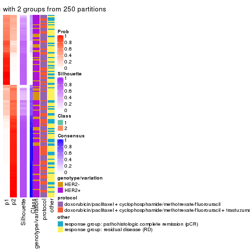</p>

</div>
<div id='tab-MAD-pam-consensus-heatmap-2'>
<pre><code class="r">consensus_heatmap(res, k = 3)
</code></pre>

<p>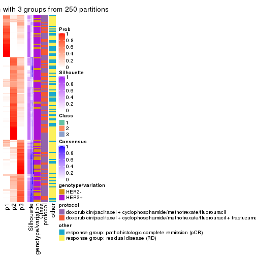</p>

</div>
<div id='tab-MAD-pam-consensus-heatmap-3'>
<pre><code class="r">consensus_heatmap(res, k = 4)
</code></pre>

<p>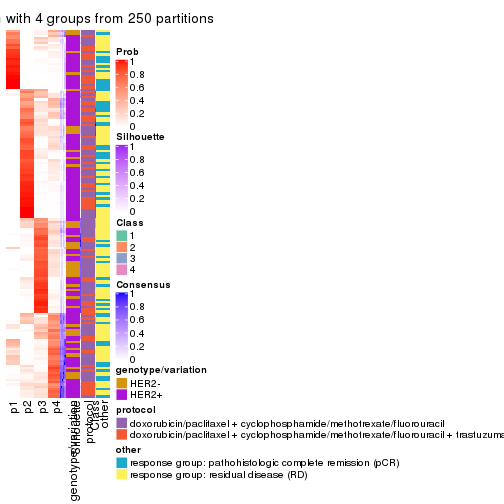</p>

</div>
<div id='tab-MAD-pam-consensus-heatmap-4'>
<pre><code class="r">consensus_heatmap(res, k = 5)
</code></pre>

<p>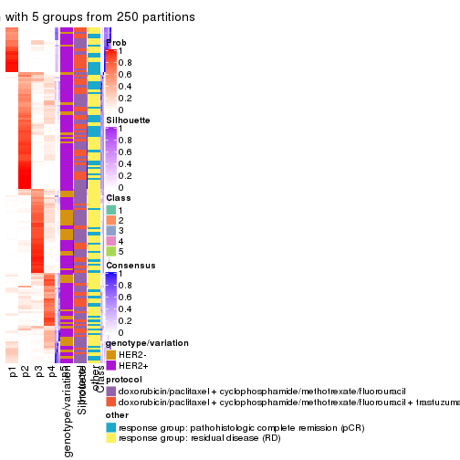</p>

</div>
<div id='tab-MAD-pam-consensus-heatmap-5'>
<pre><code class="r">consensus_heatmap(res, k = 6)
</code></pre>

<p>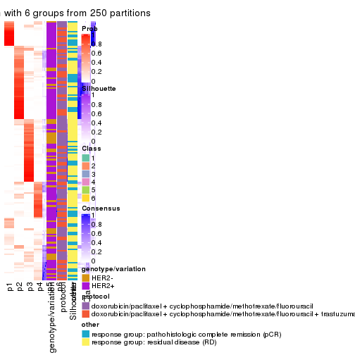</p>

</div>
</div>

Heatmaps for the membership of samples in all partitions to see how consistent they are:


<script>
$( function() {
	$( '#tabs-MAD-pam-membership-heatmap' ).tabs();
} );
</script>
<div id='tabs-MAD-pam-membership-heatmap'>
<ul>
<li><a href='#tab-MAD-pam-membership-heatmap-1'>k = 2</a></li>
<li><a href='#tab-MAD-pam-membership-heatmap-2'>k = 3</a></li>
<li><a href='#tab-MAD-pam-membership-heatmap-3'>k = 4</a></li>
<li><a href='#tab-MAD-pam-membership-heatmap-4'>k = 5</a></li>
<li><a href='#tab-MAD-pam-membership-heatmap-5'>k = 6</a></li>
</ul>
<div id='tab-MAD-pam-membership-heatmap-1'>
<pre><code class="r">membership_heatmap(res, k = 2)
</code></pre>

<p>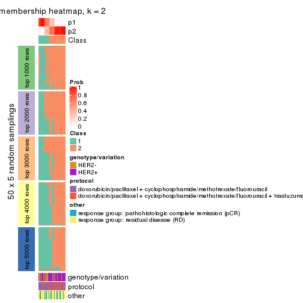</p>

</div>
<div id='tab-MAD-pam-membership-heatmap-2'>
<pre><code class="r">membership_heatmap(res, k = 3)
</code></pre>

<p>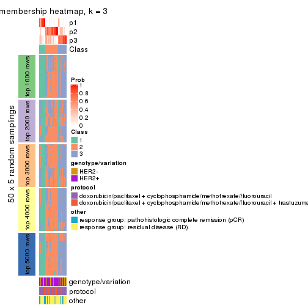</p>

</div>
<div id='tab-MAD-pam-membership-heatmap-3'>
<pre><code class="r">membership_heatmap(res, k = 4)
</code></pre>

<p>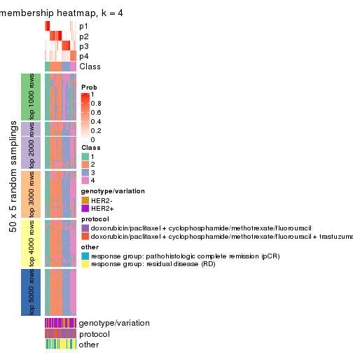</p>

</div>
<div id='tab-MAD-pam-membership-heatmap-4'>
<pre><code class="r">membership_heatmap(res, k = 5)
</code></pre>

<p>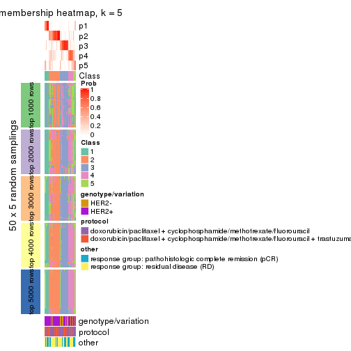</p>

</div>
<div id='tab-MAD-pam-membership-heatmap-5'>
<pre><code class="r">membership_heatmap(res, k = 6)
</code></pre>

<p>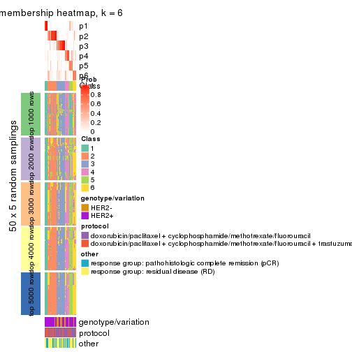</p>

</div>
</div>

As soon as we have had the classes for columns, we can look for signatures
which are significantly different between classes which can be candidate marks
for certain classes. Following are the heatmaps for signatures.


Signature heatmaps where rows are scaled:


<script>
$( function() {
	$( '#tabs-MAD-pam-get-signatures' ).tabs();
} );
</script>
<div id='tabs-MAD-pam-get-signatures'>
<ul>
<li><a href='#tab-MAD-pam-get-signatures-1'>k = 2</a></li>
<li><a href='#tab-MAD-pam-get-signatures-2'>k = 3</a></li>
<li><a href='#tab-MAD-pam-get-signatures-3'>k = 4</a></li>
<li><a href='#tab-MAD-pam-get-signatures-4'>k = 5</a></li>
<li><a href='#tab-MAD-pam-get-signatures-5'>k = 6</a></li>
</ul>
<div id='tab-MAD-pam-get-signatures-1'>
<pre><code class="r">get_signatures(res, k = 2)
</code></pre>

<pre><code>#&gt; Error: The width or height of the raster image is zero, maybe you forget to turn off the
#&gt; previous graphic device or it was corrupted. Run `dev.off()` to close it.
</code></pre>

<p></p>

</div>
<div id='tab-MAD-pam-get-signatures-2'>
<pre><code class="r">get_signatures(res, k = 3)
</code></pre>

<pre><code>#&gt; Error: The width or height of the raster image is zero, maybe you forget to turn off the
#&gt; previous graphic device or it was corrupted. Run `dev.off()` to close it.
</code></pre>

<p></p>

</div>
<div id='tab-MAD-pam-get-signatures-3'>
<pre><code class="r">get_signatures(res, k = 4)
</code></pre>

<pre><code>#&gt; Error: The width or height of the raster image is zero, maybe you forget to turn off the
#&gt; previous graphic device or it was corrupted. Run `dev.off()` to close it.
</code></pre>

<p></p>

</div>
<div id='tab-MAD-pam-get-signatures-4'>
<pre><code class="r">get_signatures(res, k = 5)
</code></pre>

<pre><code>#&gt; Error: The width or height of the raster image is zero, maybe you forget to turn off the
#&gt; previous graphic device or it was corrupted. Run `dev.off()` to close it.
</code></pre>

<p></p>

</div>
<div id='tab-MAD-pam-get-signatures-5'>
<pre><code class="r">get_signatures(res, k = 6)
</code></pre>

<pre><code>#&gt; Error: The width or height of the raster image is zero, maybe you forget to turn off the
#&gt; previous graphic device or it was corrupted. Run `dev.off()` to close it.
</code></pre>

<p></p>

</div>
</div>


Signature heatmaps where rows are not scaled:


<script>
$( function() {
	$( '#tabs-MAD-pam-get-signatures-no-scale' ).tabs();
} );
</script>
<div id='tabs-MAD-pam-get-signatures-no-scale'>
<ul>
<li><a href='#tab-MAD-pam-get-signatures-no-scale-1'>k = 2</a></li>
<li><a href='#tab-MAD-pam-get-signatures-no-scale-2'>k = 3</a></li>
<li><a href='#tab-MAD-pam-get-signatures-no-scale-3'>k = 4</a></li>
<li><a href='#tab-MAD-pam-get-signatures-no-scale-4'>k = 5</a></li>
<li><a href='#tab-MAD-pam-get-signatures-no-scale-5'>k = 6</a></li>
</ul>
<div id='tab-MAD-pam-get-signatures-no-scale-1'>
<pre><code class="r">get_signatures(res, k = 2, scale_rows = FALSE)
</code></pre>

<pre><code>#&gt; Error: The width or height of the raster image is zero, maybe you forget to turn off the
#&gt; previous graphic device or it was corrupted. Run `dev.off()` to close it.
</code></pre>

<p></p>

</div>
<div id='tab-MAD-pam-get-signatures-no-scale-2'>
<pre><code class="r">get_signatures(res, k = 3, scale_rows = FALSE)
</code></pre>

<pre><code>#&gt; Error: The width or height of the raster image is zero, maybe you forget to turn off the
#&gt; previous graphic device or it was corrupted. Run `dev.off()` to close it.
</code></pre>

<p></p>

</div>
<div id='tab-MAD-pam-get-signatures-no-scale-3'>
<pre><code class="r">get_signatures(res, k = 4, scale_rows = FALSE)
</code></pre>

<pre><code>#&gt; Error: The width or height of the raster image is zero, maybe you forget to turn off the
#&gt; previous graphic device or it was corrupted. Run `dev.off()` to close it.
</code></pre>

<p></p>

</div>
<div id='tab-MAD-pam-get-signatures-no-scale-4'>
<pre><code class="r">get_signatures(res, k = 5, scale_rows = FALSE)
</code></pre>

<pre><code>#&gt; Error: The width or height of the raster image is zero, maybe you forget to turn off the
#&gt; previous graphic device or it was corrupted. Run `dev.off()` to close it.
</code></pre>

<p></p>

</div>
<div id='tab-MAD-pam-get-signatures-no-scale-5'>
<pre><code class="r">get_signatures(res, k = 6, scale_rows = FALSE)
</code></pre>

<pre><code>#&gt; Error: The width or height of the raster image is zero, maybe you forget to turn off the
#&gt; previous graphic device or it was corrupted. Run `dev.off()` to close it.
</code></pre>

<p></p>

</div>
</div>


Compare the overlap of signatures from different k:

```r
compare_signatures(res)
```

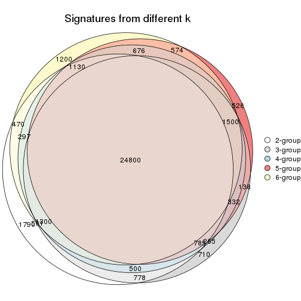

`get_signature()` returns a data frame invisibly. TO get the list of signatures, the function
call should be assigned to a variable explicitly. In following code, if `plot` argument is set
to `FALSE`, no heatmap is plotted while only the differential analysis is performed.

```r
# code only for demonstration
tb = get_signature(res, k = ..., plot = FALSE)
```

An example of the output of `tb` is:

```
#>   which_row         fdr    mean_1    mean_2 scaled_mean_1 scaled_mean_2 km
#> 1        38 0.042760348  8.373488  9.131774    -0.5533452     0.5164555  1
#> 2        40 0.018707592  7.106213  8.469186    -0.6173731     0.5762149  1
#> 3        55 0.019134737 10.221463 11.207825    -0.6159697     0.5749050  1
#> 4        59 0.006059896  5.921854  7.869574    -0.6899429     0.6439467  1
#> 5        60 0.018055526  8.928898 10.211722    -0.6204761     0.5791110  1
#> 6        98 0.009384629 15.714769 14.887706     0.6635654    -0.6193277  2
...
```

The columns in `tb` are:

1. `which_row`: row indices corresponding to the input matrix.
2. `fdr`: FDR for the differential test. 
3. `mean_x`: The mean value in group x.
4. `scaled_mean_x`: The mean value in group x after rows are scaled.
5. `km`: Row groups if k-means clustering is applied to rows.


UMAP plot which shows how samples are separated.


<script>
$( function() {
	$( '#tabs-MAD-pam-dimension-reduction' ).tabs();
} );
</script>
<div id='tabs-MAD-pam-dimension-reduction'>
<ul>
<li><a href='#tab-MAD-pam-dimension-reduction-1'>k = 2</a></li>
<li><a href='#tab-MAD-pam-dimension-reduction-2'>k = 3</a></li>
<li><a href='#tab-MAD-pam-dimension-reduction-3'>k = 4</a></li>
<li><a href='#tab-MAD-pam-dimension-reduction-4'>k = 5</a></li>
<li><a href='#tab-MAD-pam-dimension-reduction-5'>k = 6</a></li>
</ul>
<div id='tab-MAD-pam-dimension-reduction-1'>
<pre><code class="r">dimension_reduction(res, k = 2, method = &quot;UMAP&quot;)
</code></pre>

<p>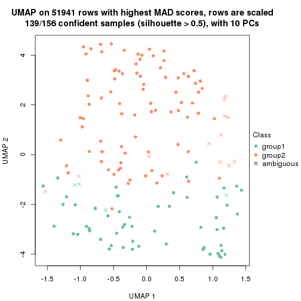</p>

</div>
<div id='tab-MAD-pam-dimension-reduction-2'>
<pre><code class="r">dimension_reduction(res, k = 3, method = &quot;UMAP&quot;)
</code></pre>

<p>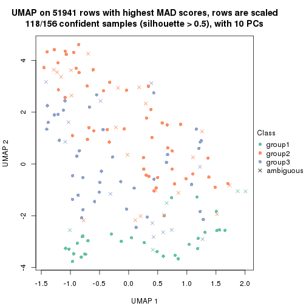</p>

</div>
<div id='tab-MAD-pam-dimension-reduction-3'>
<pre><code class="r">dimension_reduction(res, k = 4, method = &quot;UMAP&quot;)
</code></pre>

<p>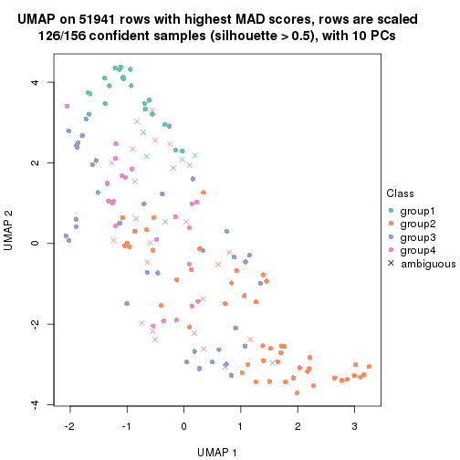</p>

</div>
<div id='tab-MAD-pam-dimension-reduction-4'>
<pre><code class="r">dimension_reduction(res, k = 5, method = &quot;UMAP&quot;)
</code></pre>

<p>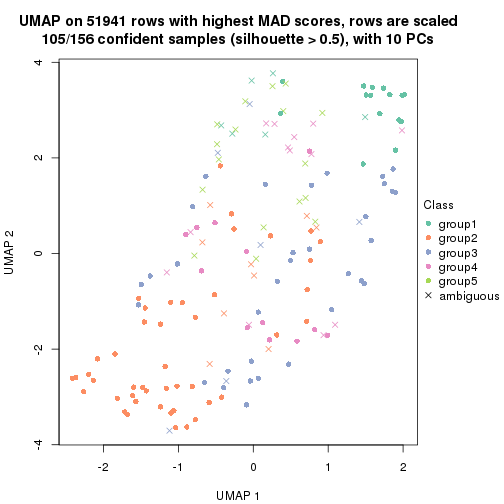</p>

</div>
<div id='tab-MAD-pam-dimension-reduction-5'>
<pre><code class="r">dimension_reduction(res, k = 6, method = &quot;UMAP&quot;)
</code></pre>

<p>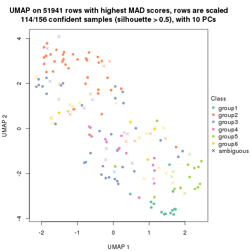</p>

</div>
</div>


Following heatmap shows how subgroups are split when increasing `k`:

```r
collect_classes(res)
```

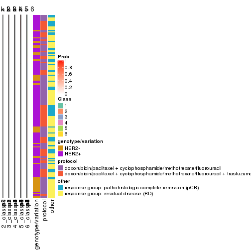


Test correlation between subgroups and known annotations. If the known
annotation is numeric, one-way ANOVA test is applied, and if the known
annotation is discrete, chi-squared contingency table test is applied.

```r
test_to_known_factors(res)
```

```
#>           n genotype/variation(p) protocol(p) other(p) k
#> MAD:pam 139              0.370157       0.559    1.000 2
#> MAD:pam 118              0.000247       0.113    0.117 3
#> MAD:pam 126              0.001511       0.281    0.409 4
#> MAD:pam 105              0.003118       0.246    0.340 5
#> MAD:pam 114              0.007466       0.355    0.722 6
```


If matrix rows can be associated to genes, consider to use `functional_enrichment(res,
...)` to perform function enrichment for the signature genes. See [this vignette](http://bioconductor.org/packages/devel/bioc/vignettes/cola/inst/doc/functional_enrichment.html) for more detailed explanations.


 

---------------------------------------------------


### MAD:mclust**


The object with results only for a single top-value method and a single partition method 
can be extracted as:

```r
res = res_list["MAD", "mclust"]
# you can also extract it by
# res = res_list["MAD:mclust"]
```

A summary of `res` and all the functions that can be applied to it:

```r
res
```

```
#> A 'ConsensusPartition' object with k = 2, 3, 4, 5, 6.
#>   On a matrix with 51941 rows and 156 columns.
#>   Top rows (1000, 2000, 3000, 4000, 5000) are extracted by 'MAD' method.
#>   Subgroups are detected by 'mclust' method.
#>   Performed in total 1250 partitions by row resampling.
#>   Best k for subgroups seems to be 2.
#> 
#> Following methods can be applied to this 'ConsensusPartition' object:
#>  [1] "cola_report"             "collect_classes"         "collect_plots"          
#>  [4] "collect_stats"           "colnames"                "compare_signatures"     
#>  [7] "consensus_heatmap"       "dimension_reduction"     "functional_enrichment"  
#> [10] "get_anno_col"            "get_anno"                "get_classes"            
#> [13] "get_consensus"           "get_matrix"              "get_membership"         
#> [16] "get_param"               "get_signatures"          "get_stats"              
#> [19] "is_best_k"               "is_stable_k"             "membership_heatmap"     
#> [22] "ncol"                    "nrow"                    "plot_ecdf"              
#> [25] "rownames"                "select_partition_number" "show"                   
#> [28] "suggest_best_k"          "test_to_known_factors"
```

`collect_plots()` function collects all the plots made from `res` for all `k` (number of partitions)
into one single page to provide an easy and fast comparison between different `k`.

```r
collect_plots(res)
```

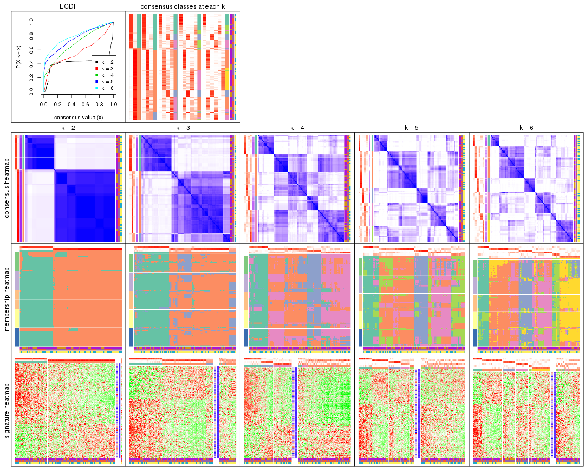

The plots are:

- The first row: a plot of the ECDF (empirical cumulative distribution
  function) curves of the consensus matrix for each `k` and the heatmap of
  predicted classes for each `k`.
- The second row: heatmaps of the consensus matrix for each `k`.
- The third row: heatmaps of the membership matrix for each `k`.
- The fouth row: heatmaps of the signatures for each `k`.

All the plots in panels can be made by individual functions and they are
plotted later in this section.

`select_partition_number()` produces several plots showing different
statistics for choosing "optimized" `k`. There are following statistics:

- ECDF curves of the consensus matrix for each `k`;
- 1-PAC. [The PAC
  score](https://en.wikipedia.org/wiki/Consensus_clustering#Over-interpretation_potential_of_consensus_clustering)
  measures the proportion of the ambiguous subgrouping.
- Mean silhouette score.
- Concordance. The mean probability of fiting the consensus class ids in all
  partitions.
- Area increased. Denote $A_k$ as the area under the ECDF curve for current
  `k`, the area increased is defined as $A_k - A_{k-1}$.
- Rand index. The percent of pairs of samples that are both in a same cluster
  or both are not in a same cluster in the partition of k and k-1.
- Jaccard index. The ratio of pairs of samples are both in a same cluster in
  the partition of k and k-1 and the pairs of samples are both in a same
  cluster in the partition k or k-1.

The detailed explanations of these statistics can be found in [the _cola_
vignette](http://bioconductor.org/packages/devel/bioc/vignettes/cola/inst/doc/cola.html#toc_13).

Generally speaking, lower PAC score, higher mean silhouette score or higher
concordance corresponds to better partition. Rand index and Jaccard index
measure how similar the current partition is compared to partition with `k-1`.
If they are too similar, we won't accept `k` is better than `k-1`.

```r
select_partition_number(res)
```

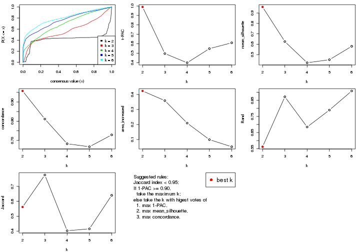

The numeric values for all these statistics can be obtained by `get_stats()`.

```r
get_stats(res)
```

```
#>   k 1-PAC mean_silhouette concordance area_increased  Rand Jaccard
#> 2 2 0.990           0.958       0.957         0.4233 0.562   0.562
#> 3 3 0.496           0.626       0.811         0.3590 0.872   0.777
#> 4 4 0.398           0.422       0.683         0.2096 0.684   0.402
#> 5 5 0.548           0.451       0.667         0.0992 0.789   0.415
#> 6 6 0.610           0.580       0.729         0.0518 0.908   0.640
```

`suggest_best_k()` suggests the best $k$ based on these statistics. The rules are as follows:

- All $k$ with Jaccard index larger than 0.95 are removed because increasing
  $k$ does not provide enough extra information. If all $k$ are removed, it is
  marked as no subgroup is detected.
- For all $k$ with 1-PAC score larger than 0.9, the maximal $k$ is taken as
  the best $k$, and other $k$ are marked as optional $k$.
- If it does not fit the second rule. The $k$ with the maximal vote of the
  highest 1-PAC score, highest mean silhouette, and highest concordance is
  taken as the best $k$.

```r
suggest_best_k(res)
```

```
#> [1] 2
```


Following shows the table of the partitions (You need to click the **show/hide
code output** link to see it). The membership matrix (columns with name `p*`)
is inferred by
[`clue::cl_consensus()`](https://www.rdocumentation.org/link/cl_consensus?package=clue)
function with the `SE` method. Basically the value in the membership matrix
represents the probability to belong to a certain group. The finall class
label for an item is determined with the group with highest probability it
belongs to.

In `get_classes()` function, the entropy is calculated from the membership
matrix and the silhouette score is calculated from the consensus matrix.


<script>
$( function() {
	$( '#tabs-MAD-mclust-get-classes' ).tabs();
} );
</script>
<div id='tabs-MAD-mclust-get-classes'>
<ul>
<li><a href='#tab-MAD-mclust-get-classes-1'>k = 2</a></li>
<li><a href='#tab-MAD-mclust-get-classes-2'>k = 3</a></li>
<li><a href='#tab-MAD-mclust-get-classes-3'>k = 4</a></li>
<li><a href='#tab-MAD-mclust-get-classes-4'>k = 5</a></li>
<li><a href='#tab-MAD-mclust-get-classes-5'>k = 6</a></li>
</ul>

<div id='tab-MAD-mclust-get-classes-1'>
<p><a id='tab-MAD-mclust-get-classes-1-a' style='color:#0366d6' href='#'>show/hide code output</a></p>
<pre><code class="r">cbind(get_classes(res, k = 2), get_membership(res, k = 2))
</code></pre>

<pre><code>#&gt;            class entropy silhouette    p1    p2
#&gt; GSM1232995     2  0.0000      0.977 0.000 1.000
#&gt; GSM1233002     2  0.0376      0.976 0.004 0.996
#&gt; GSM1233003     1  0.4022      0.974 0.920 0.080
#&gt; GSM1233014     2  0.2236      0.960 0.036 0.964
#&gt; GSM1233015     1  0.7376      0.839 0.792 0.208
#&gt; GSM1233016     2  0.0376      0.976 0.004 0.996
#&gt; GSM1233024     2  0.0376      0.976 0.004 0.996
#&gt; GSM1233049     1  0.4022      0.974 0.920 0.080
#&gt; GSM1233064     2  0.0376      0.976 0.004 0.996
#&gt; GSM1233068     2  0.0376      0.976 0.004 0.996
#&gt; GSM1233073     2  0.1184      0.972 0.016 0.984
#&gt; GSM1233093     1  0.4022      0.974 0.920 0.080
#&gt; GSM1233115     1  0.4161      0.972 0.916 0.084
#&gt; GSM1232992     2  0.0376      0.976 0.004 0.996
#&gt; GSM1232993     2  0.0376      0.976 0.004 0.996
#&gt; GSM1233005     2  0.0000      0.977 0.000 1.000
#&gt; GSM1233007     2  0.0000      0.977 0.000 1.000
#&gt; GSM1233010     2  0.0376      0.976 0.004 0.996
#&gt; GSM1233013     2  0.0376      0.976 0.004 0.996
#&gt; GSM1233018     2  0.0000      0.977 0.000 1.000
#&gt; GSM1233019     2  0.0376      0.976 0.004 0.996
#&gt; GSM1233021     2  0.0000      0.977 0.000 1.000
#&gt; GSM1233025     2  0.2236      0.953 0.036 0.964
#&gt; GSM1233029     2  0.0376      0.976 0.004 0.996
#&gt; GSM1233030     2  0.0376      0.976 0.004 0.996
#&gt; GSM1233031     2  0.0376      0.976 0.004 0.996
#&gt; GSM1233032     1  0.3879      0.969 0.924 0.076
#&gt; GSM1233035     2  0.0376      0.976 0.004 0.996
#&gt; GSM1233038     1  0.4022      0.974 0.920 0.080
#&gt; GSM1233039     2  0.0000      0.977 0.000 1.000
#&gt; GSM1233042     2  0.2236      0.960 0.036 0.964
#&gt; GSM1233043     2  0.2236      0.960 0.036 0.964
#&gt; GSM1233044     2  0.4562      0.885 0.096 0.904
#&gt; GSM1233046     2  0.4562      0.886 0.096 0.904
#&gt; GSM1233051     1  0.4022      0.974 0.920 0.080
#&gt; GSM1233054     2  0.0672      0.975 0.008 0.992
#&gt; GSM1233057     2  0.0672      0.975 0.008 0.992
#&gt; GSM1233060     2  0.0376      0.976 0.004 0.996
#&gt; GSM1233062     2  0.0376      0.976 0.004 0.996
#&gt; GSM1233075     2  0.2043      0.962 0.032 0.968
#&gt; GSM1233078     2  0.2778      0.951 0.048 0.952
#&gt; GSM1233079     1  0.3879      0.969 0.924 0.076
#&gt; GSM1233082     1  0.7950      0.793 0.760 0.240
#&gt; GSM1233083     1  0.4022      0.974 0.920 0.080
#&gt; GSM1233091     2  0.0000      0.977 0.000 1.000
#&gt; GSM1233095     1  0.4022      0.974 0.920 0.080
#&gt; GSM1233096     1  0.4022      0.974 0.920 0.080
#&gt; GSM1233101     1  0.4022      0.974 0.920 0.080
#&gt; GSM1233105     1  0.4022      0.974 0.920 0.080
#&gt; GSM1233117     2  0.0000      0.977 0.000 1.000
#&gt; GSM1233118     2  0.0672      0.975 0.008 0.992
#&gt; GSM1233001     2  0.0672      0.975 0.008 0.992
#&gt; GSM1233006     2  0.2043      0.963 0.032 0.968
#&gt; GSM1233008     2  0.0000      0.977 0.000 1.000
#&gt; GSM1233009     2  0.0376      0.976 0.004 0.996
#&gt; GSM1233017     2  0.0376      0.976 0.004 0.996
#&gt; GSM1233020     2  0.0000      0.977 0.000 1.000
#&gt; GSM1233022     2  0.0376      0.976 0.004 0.996
#&gt; GSM1233026     2  0.0376      0.976 0.004 0.996
#&gt; GSM1233028     2  0.0376      0.976 0.004 0.996
#&gt; GSM1233034     2  0.0000      0.977 0.000 1.000
#&gt; GSM1233040     1  0.3733      0.970 0.928 0.072
#&gt; GSM1233048     1  0.4022      0.974 0.920 0.080
#&gt; GSM1233056     1  0.4022      0.974 0.920 0.080
#&gt; GSM1233058     2  0.1843      0.966 0.028 0.972
#&gt; GSM1233059     1  0.4022      0.974 0.920 0.080
#&gt; GSM1233066     2  0.2603      0.954 0.044 0.956
#&gt; GSM1233071     2  0.0376      0.976 0.004 0.996
#&gt; GSM1233074     2  0.0672      0.975 0.008 0.992
#&gt; GSM1233076     2  0.0000      0.977 0.000 1.000
#&gt; GSM1233080     1  0.4022      0.974 0.920 0.080
#&gt; GSM1233088     2  0.0672      0.975 0.008 0.992
#&gt; GSM1233090     1  0.4022      0.974 0.920 0.080
#&gt; GSM1233092     2  0.1414      0.970 0.020 0.980
#&gt; GSM1233094     2  0.2236      0.960 0.036 0.964
#&gt; GSM1233097     2  0.2236      0.960 0.036 0.964
#&gt; GSM1233100     2  0.0376      0.976 0.004 0.996
#&gt; GSM1233104     2  0.2236      0.960 0.036 0.964
#&gt; GSM1233106     1  0.7528      0.828 0.784 0.216
#&gt; GSM1233111     1  0.4022      0.974 0.920 0.080
#&gt; GSM1233122     2  0.0000      0.977 0.000 1.000
#&gt; GSM1233146     2  0.0376      0.976 0.004 0.996
#&gt; GSM1232994     2  0.0376      0.976 0.004 0.996
#&gt; GSM1232996     2  0.0000      0.977 0.000 1.000
#&gt; GSM1232997     2  0.0672      0.975 0.008 0.992
#&gt; GSM1232998     2  0.0376      0.976 0.004 0.996
#&gt; GSM1232999     2  0.2236      0.960 0.036 0.964
#&gt; GSM1233000     2  0.0376      0.976 0.004 0.996
#&gt; GSM1233004     2  0.9732      0.295 0.404 0.596
#&gt; GSM1233011     2  0.0672      0.975 0.008 0.992
#&gt; GSM1233012     2  0.0672      0.975 0.008 0.992
#&gt; GSM1233023     2  0.0672      0.975 0.008 0.992
#&gt; GSM1233027     2  0.1184      0.973 0.016 0.984
#&gt; GSM1233033     1  0.4022      0.974 0.920 0.080
#&gt; GSM1233036     2  0.0672      0.975 0.008 0.992
#&gt; GSM1233037     2  0.0672      0.975 0.008 0.992
#&gt; GSM1233041     1  0.4022      0.974 0.920 0.080
#&gt; GSM1233045     2  0.2043      0.963 0.032 0.968
#&gt; GSM1233047     1  0.3879      0.967 0.924 0.076
#&gt; GSM1233050     1  0.4022      0.974 0.920 0.080
#&gt; GSM1233052     1  0.4815      0.955 0.896 0.104
#&gt; GSM1233053     1  0.3879      0.969 0.924 0.076
#&gt; GSM1233055     1  0.4022      0.974 0.920 0.080
#&gt; GSM1233061     2  0.0672      0.975 0.008 0.992
#&gt; GSM1233063     1  0.4022      0.974 0.920 0.080
#&gt; GSM1233065     2  0.1414      0.969 0.020 0.980
#&gt; GSM1233070     2  0.0376      0.976 0.004 0.996
#&gt; GSM1233077     2  0.2778      0.951 0.048 0.952
#&gt; GSM1233081     1  0.2236      0.942 0.964 0.036
#&gt; GSM1233084     1  0.4022      0.974 0.920 0.080
#&gt; GSM1233087     1  0.9000      0.662 0.684 0.316
#&gt; GSM1233089     2  0.0000      0.977 0.000 1.000
#&gt; GSM1233099     2  0.5408      0.847 0.124 0.876
#&gt; GSM1233112     1  0.4022      0.974 0.920 0.080
#&gt; GSM1233085     1  0.2236      0.942 0.964 0.036
#&gt; GSM1233098     2  0.0000      0.977 0.000 1.000
#&gt; GSM1233114     1  0.4022      0.974 0.920 0.080
#&gt; GSM1233119     2  0.2236      0.960 0.036 0.964
#&gt; GSM1233129     2  0.0672      0.975 0.008 0.992
#&gt; GSM1233132     1  0.4022      0.974 0.920 0.080
#&gt; GSM1233139     2  0.0376      0.976 0.004 0.996
#&gt; GSM1233143     2  0.0000      0.977 0.000 1.000
#&gt; GSM1233145     1  0.4022      0.974 0.920 0.080
#&gt; GSM1233067     2  0.2778      0.951 0.048 0.952
#&gt; GSM1233069     2  0.2778      0.951 0.048 0.952
#&gt; GSM1233072     2  0.0000      0.977 0.000 1.000
#&gt; GSM1233086     2  0.2778      0.951 0.048 0.952
#&gt; GSM1233102     1  0.4022      0.974 0.920 0.080
#&gt; GSM1233103     2  0.0376      0.976 0.004 0.996
#&gt; GSM1233107     2  0.0672      0.975 0.008 0.992
#&gt; GSM1233108     1  0.2236      0.942 0.964 0.036
#&gt; GSM1233109     1  0.2236      0.942 0.964 0.036
#&gt; GSM1233110     2  0.2778      0.951 0.048 0.952
#&gt; GSM1233113     2  0.2778      0.951 0.048 0.952
#&gt; GSM1233116     2  0.2778      0.951 0.048 0.952
#&gt; GSM1233120     1  0.4022      0.974 0.920 0.080
#&gt; GSM1233121     2  0.2778      0.951 0.048 0.952
#&gt; GSM1233123     2  0.2778      0.951 0.048 0.952
#&gt; GSM1233124     2  0.2778      0.951 0.048 0.952
#&gt; GSM1233125     1  0.2236      0.942 0.964 0.036
#&gt; GSM1233126     2  0.2236      0.960 0.036 0.964
#&gt; GSM1233127     2  0.0376      0.976 0.004 0.996
#&gt; GSM1233128     1  0.4022      0.974 0.920 0.080
#&gt; GSM1233130     2  0.2778      0.951 0.048 0.952
#&gt; GSM1233131     1  0.4022      0.974 0.920 0.080
#&gt; GSM1233133     1  0.2236      0.942 0.964 0.036
#&gt; GSM1233134     2  0.2778      0.951 0.048 0.952
#&gt; GSM1233135     2  0.2778      0.951 0.048 0.952
#&gt; GSM1233136     2  0.2778      0.951 0.048 0.952
#&gt; GSM1233137     1  0.2423      0.943 0.960 0.040
#&gt; GSM1233138     2  0.2236      0.960 0.036 0.964
#&gt; GSM1233140     1  0.3879      0.969 0.924 0.076
#&gt; GSM1233141     2  0.0376      0.976 0.004 0.996
#&gt; GSM1233142     2  0.0376      0.976 0.004 0.996
#&gt; GSM1233144     1  0.4022      0.930 0.920 0.080
#&gt; GSM1233147     2  0.0000      0.977 0.000 1.000
</code></pre>

<script>
$('#tab-MAD-mclust-get-classes-1-a').parent().next().next().hide();
$('#tab-MAD-mclust-get-classes-1-a').click(function(){
  $('#tab-MAD-mclust-get-classes-1-a').parent().next().next().toggle();
  return(false);
});
</script>
</div>

<div id='tab-MAD-mclust-get-classes-2'>
<p><a id='tab-MAD-mclust-get-classes-2-a' style='color:#0366d6' href='#'>show/hide code output</a></p>
<pre><code class="r">cbind(get_classes(res, k = 3), get_membership(res, k = 3))
</code></pre>

<pre><code>#&gt;            class entropy silhouette    p1    p2    p3
#&gt; GSM1232995     2  0.1337    0.68372 0.012 0.972 0.016
#&gt; GSM1233002     3  0.7674    0.83951 0.044 0.476 0.480
#&gt; GSM1233003     1  0.2703    0.88442 0.928 0.056 0.016
#&gt; GSM1233014     2  0.4146    0.62018 0.044 0.876 0.080
#&gt; GSM1233015     1  0.3234    0.87990 0.908 0.072 0.020
#&gt; GSM1233016     3  0.8068    0.84292 0.064 0.456 0.480
#&gt; GSM1233024     2  0.2443    0.66203 0.032 0.940 0.028
#&gt; GSM1233049     1  0.2550    0.89270 0.936 0.024 0.040
#&gt; GSM1233064     2  0.2903    0.67894 0.028 0.924 0.048
#&gt; GSM1233068     2  0.7411    0.14353 0.256 0.668 0.076
#&gt; GSM1233073     3  0.7835    0.84600 0.052 0.456 0.492
#&gt; GSM1233093     1  0.2297    0.89128 0.944 0.020 0.036
#&gt; GSM1233115     1  0.1647    0.89474 0.960 0.036 0.004
#&gt; GSM1232992     2  0.1015    0.68149 0.008 0.980 0.012
#&gt; GSM1232993     2  0.2903    0.64798 0.028 0.924 0.048
#&gt; GSM1233005     2  0.1015    0.68330 0.008 0.980 0.012
#&gt; GSM1233007     2  0.2793    0.66819 0.028 0.928 0.044
#&gt; GSM1233010     3  0.7996    0.83081 0.060 0.464 0.476
#&gt; GSM1233013     2  0.1337    0.68173 0.012 0.972 0.016
#&gt; GSM1233018     2  0.1015    0.68382 0.008 0.980 0.012
#&gt; GSM1233019     2  0.2031    0.67370 0.032 0.952 0.016
#&gt; GSM1233021     2  0.1337    0.68256 0.016 0.972 0.012
#&gt; GSM1233025     3  0.8774    0.78079 0.112 0.412 0.476
#&gt; GSM1233029     2  0.1399    0.67561 0.028 0.968 0.004
#&gt; GSM1233030     2  0.1751    0.67519 0.028 0.960 0.012
#&gt; GSM1233031     2  0.3764    0.62963 0.040 0.892 0.068
#&gt; GSM1233032     1  0.2116    0.88714 0.948 0.040 0.012
#&gt; GSM1233035     2  0.7557    0.00510 0.264 0.656 0.080
#&gt; GSM1233038     1  0.3649    0.87347 0.896 0.068 0.036
#&gt; GSM1233039     2  0.2903    0.67578 0.028 0.924 0.048
#&gt; GSM1233042     3  0.7585    0.82863 0.040 0.476 0.484
#&gt; GSM1233043     2  0.7487   -0.80350 0.036 0.500 0.464
#&gt; GSM1233044     1  0.7876    0.34673 0.612 0.308 0.080
#&gt; GSM1233046     1  0.8071    0.12643 0.564 0.360 0.076
#&gt; GSM1233051     1  0.1711    0.89318 0.960 0.032 0.008
#&gt; GSM1233054     2  0.9315    0.19086 0.220 0.520 0.260
#&gt; GSM1233057     2  0.6728    0.51804 0.080 0.736 0.184
#&gt; GSM1233060     2  0.3669    0.63338 0.040 0.896 0.064
#&gt; GSM1233062     2  0.3028    0.64580 0.032 0.920 0.048
#&gt; GSM1233075     2  0.6962    0.33808 0.020 0.568 0.412
#&gt; GSM1233078     3  0.9442   -0.00522 0.216 0.288 0.496
#&gt; GSM1233079     1  0.2681    0.88717 0.932 0.040 0.028
#&gt; GSM1233082     1  0.5173    0.78893 0.816 0.148 0.036
#&gt; GSM1233083     1  0.3253    0.88173 0.912 0.052 0.036
#&gt; GSM1233091     2  0.3899    0.66539 0.056 0.888 0.056
#&gt; GSM1233095     1  0.2152    0.89110 0.948 0.016 0.036
#&gt; GSM1233096     1  0.1525    0.89393 0.964 0.032 0.004
#&gt; GSM1233101     1  0.2918    0.88584 0.924 0.044 0.032
#&gt; GSM1233105     1  0.4256    0.84995 0.868 0.096 0.036
#&gt; GSM1233117     2  0.1482    0.68388 0.020 0.968 0.012
#&gt; GSM1233118     2  0.3337    0.67047 0.032 0.908 0.060
#&gt; GSM1233001     2  0.4137    0.65123 0.032 0.872 0.096
#&gt; GSM1233006     2  0.3764    0.63120 0.040 0.892 0.068
#&gt; GSM1233008     2  0.1015    0.68382 0.008 0.980 0.012
#&gt; GSM1233009     2  0.1643    0.67692 0.044 0.956 0.000
#&gt; GSM1233017     2  0.1877    0.67429 0.032 0.956 0.012
#&gt; GSM1233020     2  0.1781    0.68493 0.020 0.960 0.020
#&gt; GSM1233022     2  0.3472    0.63525 0.040 0.904 0.056
#&gt; GSM1233026     2  0.6211    0.20534 0.036 0.736 0.228
#&gt; GSM1233028     2  0.6000    0.30481 0.040 0.760 0.200
#&gt; GSM1233034     2  0.1267    0.68735 0.024 0.972 0.004
#&gt; GSM1233040     1  0.1765    0.88804 0.956 0.040 0.004
#&gt; GSM1233048     1  0.1399    0.89442 0.968 0.028 0.004
#&gt; GSM1233056     1  0.1529    0.88701 0.960 0.000 0.040
#&gt; GSM1233058     3  0.7396    0.83929 0.032 0.480 0.488
#&gt; GSM1233059     1  0.2434    0.89265 0.940 0.024 0.036
#&gt; GSM1233066     2  0.5826    0.59041 0.032 0.764 0.204
#&gt; GSM1233071     2  0.2926    0.65573 0.036 0.924 0.040
#&gt; GSM1233074     2  0.5778    0.55871 0.032 0.768 0.200
#&gt; GSM1233076     2  0.3649    0.67231 0.036 0.896 0.068
#&gt; GSM1233080     1  0.2152    0.89110 0.948 0.016 0.036
#&gt; GSM1233088     2  0.4658    0.65132 0.076 0.856 0.068
#&gt; GSM1233090     1  0.2297    0.89230 0.944 0.020 0.036
#&gt; GSM1233092     2  0.5105    0.53641 0.048 0.828 0.124
#&gt; GSM1233094     3  0.7585    0.82909 0.040 0.476 0.484
#&gt; GSM1233097     3  0.7493    0.83328 0.036 0.476 0.488
#&gt; GSM1233100     3  0.7839    0.84626 0.052 0.464 0.484
#&gt; GSM1233104     2  0.6956   -0.20700 0.040 0.660 0.300
#&gt; GSM1233106     1  0.2743    0.88755 0.928 0.052 0.020
#&gt; GSM1233111     1  0.1315    0.89426 0.972 0.020 0.008
#&gt; GSM1233122     2  0.1482    0.68407 0.020 0.968 0.012
#&gt; GSM1233146     2  0.7755   -0.81627 0.048 0.492 0.460
#&gt; GSM1232994     2  0.2176    0.67118 0.032 0.948 0.020
#&gt; GSM1232996     2  0.1015    0.68382 0.008 0.980 0.012
#&gt; GSM1232997     2  0.5778    0.56555 0.032 0.768 0.200
#&gt; GSM1232998     2  0.3899    0.63817 0.056 0.888 0.056
#&gt; GSM1232999     2  0.3337    0.64377 0.032 0.908 0.060
#&gt; GSM1233000     2  0.1751    0.67519 0.028 0.960 0.012
#&gt; GSM1233004     1  0.8350    0.56880 0.600 0.120 0.280
#&gt; GSM1233011     2  0.3623    0.67438 0.032 0.896 0.072
#&gt; GSM1233012     2  0.2681    0.68052 0.028 0.932 0.040
#&gt; GSM1233023     2  0.3802    0.65617 0.032 0.888 0.080
#&gt; GSM1233027     2  0.2689    0.66439 0.036 0.932 0.032
#&gt; GSM1233033     1  0.2400    0.88565 0.932 0.064 0.004
#&gt; GSM1233036     2  0.2564    0.68237 0.028 0.936 0.036
#&gt; GSM1233037     2  0.6622    0.53061 0.088 0.748 0.164
#&gt; GSM1233041     1  0.2434    0.89265 0.940 0.024 0.036
#&gt; GSM1233045     2  0.7129   -0.59678 0.028 0.580 0.392
#&gt; GSM1233047     1  0.4689    0.85538 0.852 0.052 0.096
#&gt; GSM1233050     1  0.1315    0.89461 0.972 0.020 0.008
#&gt; GSM1233052     1  0.4324    0.84750 0.860 0.112 0.028
#&gt; GSM1233053     1  0.2269    0.88720 0.944 0.040 0.016
#&gt; GSM1233055     1  0.1832    0.89019 0.956 0.008 0.036
#&gt; GSM1233061     2  0.6668    0.51866 0.040 0.696 0.264
#&gt; GSM1233063     1  0.1315    0.89426 0.972 0.020 0.008
#&gt; GSM1233065     2  0.6012    0.55656 0.032 0.748 0.220
#&gt; GSM1233070     2  0.3375    0.64542 0.044 0.908 0.048
#&gt; GSM1233077     2  0.6944    0.30037 0.016 0.516 0.468
#&gt; GSM1233081     1  0.4539    0.84098 0.836 0.016 0.148
#&gt; GSM1233084     1  0.2152    0.89110 0.948 0.016 0.036
#&gt; GSM1233087     1  0.7485    0.52756 0.680 0.224 0.096
#&gt; GSM1233089     2  0.1877    0.68552 0.032 0.956 0.012
#&gt; GSM1233099     2  0.9522   -0.68003 0.188 0.412 0.400
#&gt; GSM1233112     1  0.1950    0.89141 0.952 0.040 0.008
#&gt; GSM1233085     1  0.4326    0.84472 0.844 0.012 0.144
#&gt; GSM1233098     2  0.1453    0.68661 0.024 0.968 0.008
#&gt; GSM1233114     1  0.2301    0.88560 0.936 0.060 0.004
#&gt; GSM1233119     3  0.7987    0.84317 0.060 0.448 0.492
#&gt; GSM1233129     2  0.3713    0.65816 0.032 0.892 0.076
#&gt; GSM1233132     1  0.3031    0.87250 0.912 0.076 0.012
#&gt; GSM1233139     2  0.0892    0.68619 0.020 0.980 0.000
#&gt; GSM1233143     2  0.2050    0.68440 0.028 0.952 0.020
#&gt; GSM1233145     1  0.3649    0.87347 0.896 0.068 0.036
#&gt; GSM1233067     2  0.6108    0.54670 0.028 0.732 0.240
#&gt; GSM1233069     2  0.6919    0.30037 0.016 0.536 0.448
#&gt; GSM1233072     2  0.1337    0.68390 0.016 0.972 0.012
#&gt; GSM1233086     2  0.5803    0.59043 0.028 0.760 0.212
#&gt; GSM1233102     1  0.4821    0.84582 0.848 0.088 0.064
#&gt; GSM1233103     2  0.4658    0.59570 0.076 0.856 0.068
#&gt; GSM1233107     2  0.5722    0.48625 0.132 0.800 0.068
#&gt; GSM1233108     1  0.4233    0.84185 0.836 0.004 0.160
#&gt; GSM1233109     1  0.5062    0.81860 0.800 0.016 0.184
#&gt; GSM1233110     2  0.6950    0.29356 0.016 0.508 0.476
#&gt; GSM1233113     2  0.6148    0.54458 0.028 0.728 0.244
#&gt; GSM1233116     2  0.5849    0.56983 0.028 0.756 0.216
#&gt; GSM1233120     1  0.4423    0.84295 0.864 0.088 0.048
#&gt; GSM1233121     2  0.6888    0.35019 0.016 0.552 0.432
#&gt; GSM1233123     2  0.6931    0.31058 0.016 0.528 0.456
#&gt; GSM1233124     2  0.6226    0.54904 0.028 0.720 0.252
#&gt; GSM1233125     1  0.3851    0.85333 0.860 0.004 0.136
#&gt; GSM1233126     2  0.7652   -0.75797 0.044 0.512 0.444
#&gt; GSM1233127     2  0.2663    0.66706 0.044 0.932 0.024
#&gt; GSM1233128     1  0.2434    0.88604 0.940 0.024 0.036
#&gt; GSM1233130     2  0.6954    0.28966 0.016 0.500 0.484
#&gt; GSM1233131     1  0.3966    0.86032 0.876 0.100 0.024
#&gt; GSM1233133     1  0.5008    0.81910 0.804 0.016 0.180
#&gt; GSM1233134     2  0.6888    0.31945 0.016 0.552 0.432
#&gt; GSM1233135     2  0.6919    0.30037 0.016 0.536 0.448
#&gt; GSM1233136     2  0.6954    0.28966 0.016 0.500 0.484
#&gt; GSM1233137     1  0.6369    0.69692 0.668 0.016 0.316
#&gt; GSM1233138     2  0.6936   -0.11366 0.044 0.672 0.284
#&gt; GSM1233140     1  0.2269    0.88720 0.944 0.040 0.016
#&gt; GSM1233141     2  0.1774    0.68182 0.024 0.960 0.016
#&gt; GSM1233142     2  0.1877    0.67472 0.032 0.956 0.012
#&gt; GSM1233144     1  0.5843    0.75929 0.732 0.016 0.252
#&gt; GSM1233147     2  0.4206    0.66558 0.040 0.872 0.088
</code></pre>

<script>
$('#tab-MAD-mclust-get-classes-2-a').parent().next().next().hide();
$('#tab-MAD-mclust-get-classes-2-a').click(function(){
  $('#tab-MAD-mclust-get-classes-2-a').parent().next().next().toggle();
  return(false);
});
</script>
</div>

<div id='tab-MAD-mclust-get-classes-3'>
<p><a id='tab-MAD-mclust-get-classes-3-a' style='color:#0366d6' href='#'>show/hide code output</a></p>
<pre><code class="r">cbind(get_classes(res, k = 4), get_membership(res, k = 4))
</code></pre>

<pre><code>#&gt;            class entropy silhouette    p1    p2    p3    p4
#&gt; GSM1232995     2  0.0707    0.45395 0.000 0.980 0.000 0.020
#&gt; GSM1233002     4  0.4035    0.63511 0.000 0.176 0.020 0.804
#&gt; GSM1233003     1  0.4799    0.66051 0.704 0.004 0.008 0.284
#&gt; GSM1233014     4  0.4428    0.62493 0.004 0.116 0.064 0.816
#&gt; GSM1233015     4  0.8502    0.33964 0.348 0.084 0.112 0.456
#&gt; GSM1233016     4  0.2360    0.66361 0.004 0.052 0.020 0.924
#&gt; GSM1233024     4  0.5606    0.24490 0.000 0.480 0.020 0.500
#&gt; GSM1233049     1  0.0895    0.77366 0.976 0.004 0.020 0.000
#&gt; GSM1233064     2  0.3946    0.44633 0.000 0.812 0.168 0.020
#&gt; GSM1233068     2  0.8486    0.16398 0.088 0.528 0.152 0.232
#&gt; GSM1233073     4  0.2363    0.66476 0.000 0.056 0.024 0.920
#&gt; GSM1233093     1  0.1743    0.75830 0.940 0.004 0.056 0.000
#&gt; GSM1233115     1  0.3728    0.76281 0.864 0.008 0.064 0.064
#&gt; GSM1232992     2  0.5028   -0.05681 0.000 0.596 0.004 0.400
#&gt; GSM1232993     2  0.6360   -0.10422 0.000 0.516 0.064 0.420
#&gt; GSM1233005     2  0.4866   -0.05798 0.000 0.596 0.000 0.404
#&gt; GSM1233007     2  0.4879    0.45889 0.000 0.780 0.128 0.092
#&gt; GSM1233010     4  0.3862    0.64395 0.000 0.152 0.024 0.824
#&gt; GSM1233013     2  0.5028   -0.05681 0.000 0.596 0.004 0.400
#&gt; GSM1233018     2  0.4776   -0.00994 0.000 0.624 0.000 0.376
#&gt; GSM1233019     2  0.5105   -0.12610 0.000 0.564 0.004 0.432
#&gt; GSM1233021     2  0.4866   -0.05798 0.000 0.596 0.000 0.404
#&gt; GSM1233025     4  0.1697    0.65310 0.004 0.016 0.028 0.952
#&gt; GSM1233029     2  0.5193   -0.06526 0.000 0.580 0.008 0.412
#&gt; GSM1233030     2  0.5039   -0.06197 0.000 0.592 0.004 0.404
#&gt; GSM1233031     4  0.7548    0.46214 0.036 0.288 0.112 0.564
#&gt; GSM1233032     1  0.5835    0.57731 0.688 0.008 0.244 0.060
#&gt; GSM1233035     4  0.8760    0.42931 0.100 0.256 0.152 0.492
#&gt; GSM1233038     4  0.4897    0.50405 0.332 0.000 0.008 0.660
#&gt; GSM1233039     2  0.4850    0.43703 0.004 0.776 0.168 0.052
#&gt; GSM1233042     4  0.2216    0.66086 0.000 0.092 0.000 0.908
#&gt; GSM1233043     4  0.2469    0.65836 0.000 0.108 0.000 0.892
#&gt; GSM1233044     2  0.8556    0.15952 0.124 0.508 0.100 0.268
#&gt; GSM1233046     4  0.8758    0.45090 0.112 0.236 0.148 0.504
#&gt; GSM1233051     1  0.3652    0.76222 0.868 0.008 0.064 0.060
#&gt; GSM1233054     2  0.8532   -0.22365 0.132 0.412 0.388 0.068
#&gt; GSM1233057     2  0.6570    0.13643 0.072 0.580 0.340 0.008
#&gt; GSM1233060     4  0.7314    0.22345 0.008 0.400 0.120 0.472
#&gt; GSM1233062     2  0.5971   -0.11615 0.000 0.532 0.040 0.428
#&gt; GSM1233075     3  0.3032    0.73784 0.000 0.124 0.868 0.008
#&gt; GSM1233078     3  0.2956    0.75378 0.048 0.012 0.904 0.036
#&gt; GSM1233079     3  0.6215    0.40949 0.304 0.008 0.628 0.060
#&gt; GSM1233082     4  0.9163    0.39345 0.276 0.236 0.084 0.404
#&gt; GSM1233083     1  0.4540    0.64474 0.740 0.004 0.008 0.248
#&gt; GSM1233091     2  0.6375    0.36776 0.028 0.688 0.204 0.080
#&gt; GSM1233095     1  0.1743    0.75830 0.940 0.004 0.056 0.000
#&gt; GSM1233096     1  0.6687   -0.13434 0.472 0.008 0.064 0.456
#&gt; GSM1233101     1  0.0524    0.77841 0.988 0.004 0.008 0.000
#&gt; GSM1233105     4  0.5875    0.55779 0.204 0.024 0.056 0.716
#&gt; GSM1233117     2  0.3751    0.28713 0.000 0.800 0.004 0.196
#&gt; GSM1233118     2  0.4594    0.28919 0.000 0.712 0.280 0.008
#&gt; GSM1233001     2  0.4343    0.27988 0.004 0.732 0.264 0.000
#&gt; GSM1233006     4  0.5754    0.48887 0.000 0.316 0.048 0.636
#&gt; GSM1233008     2  0.4936   -0.00625 0.000 0.624 0.004 0.372
#&gt; GSM1233009     2  0.6278   -0.07943 0.000 0.532 0.060 0.408
#&gt; GSM1233017     2  0.5039   -0.06197 0.000 0.592 0.004 0.404
#&gt; GSM1233020     2  0.1004    0.47040 0.000 0.972 0.024 0.004
#&gt; GSM1233022     4  0.5646    0.50638 0.000 0.296 0.048 0.656
#&gt; GSM1233026     4  0.6302    0.36701 0.000 0.368 0.068 0.564
#&gt; GSM1233028     4  0.5543    0.42576 0.000 0.360 0.028 0.612
#&gt; GSM1233034     2  0.3231    0.46193 0.004 0.868 0.116 0.012
#&gt; GSM1233040     1  0.5350    0.65996 0.744 0.008 0.188 0.060
#&gt; GSM1233048     1  0.5507    0.63962 0.720 0.004 0.064 0.212
#&gt; GSM1233056     1  0.3851    0.73398 0.852 0.004 0.056 0.088
#&gt; GSM1233058     4  0.4323    0.61489 0.000 0.204 0.020 0.776
#&gt; GSM1233059     1  0.0376    0.77737 0.992 0.004 0.004 0.000
#&gt; GSM1233066     2  0.6087    0.08940 0.000 0.540 0.412 0.048
#&gt; GSM1233071     2  0.6826   -0.11511 0.000 0.484 0.100 0.416
#&gt; GSM1233074     2  0.5212    0.08966 0.000 0.572 0.420 0.008
#&gt; GSM1233076     2  0.5412    0.41927 0.000 0.736 0.168 0.096
#&gt; GSM1233080     1  0.1743    0.75830 0.940 0.004 0.056 0.000
#&gt; GSM1233088     2  0.6786    0.13048 0.052 0.572 0.348 0.028
#&gt; GSM1233090     1  0.0336    0.77813 0.992 0.008 0.000 0.000
#&gt; GSM1233092     4  0.4626    0.61804 0.004 0.120 0.072 0.804
#&gt; GSM1233094     4  0.1792    0.65820 0.000 0.068 0.000 0.932
#&gt; GSM1233097     4  0.2197    0.66145 0.000 0.080 0.004 0.916
#&gt; GSM1233100     4  0.3143    0.66478 0.000 0.100 0.024 0.876
#&gt; GSM1233104     4  0.2053    0.65709 0.004 0.072 0.000 0.924
#&gt; GSM1233106     1  0.6057    0.69450 0.748 0.072 0.096 0.084
#&gt; GSM1233111     1  0.3652    0.76222 0.868 0.008 0.064 0.060
#&gt; GSM1233122     2  0.4122    0.23284 0.000 0.760 0.004 0.236
#&gt; GSM1233146     4  0.3925    0.63693 0.000 0.176 0.016 0.808
#&gt; GSM1232994     2  0.5161   -0.22104 0.000 0.520 0.004 0.476
#&gt; GSM1232996     2  0.4761   -0.00326 0.000 0.628 0.000 0.372
#&gt; GSM1232997     2  0.5172    0.12308 0.000 0.588 0.404 0.008
#&gt; GSM1232998     4  0.5886    0.54232 0.004 0.160 0.124 0.712
#&gt; GSM1232999     4  0.5833    0.31076 0.000 0.440 0.032 0.528
#&gt; GSM1233000     2  0.5039   -0.06197 0.000 0.592 0.004 0.404
#&gt; GSM1233004     3  0.8285    0.45813 0.072 0.248 0.536 0.144
#&gt; GSM1233011     2  0.5288    0.37930 0.000 0.720 0.224 0.056
#&gt; GSM1233012     2  0.3088    0.43458 0.000 0.864 0.128 0.008
#&gt; GSM1233023     2  0.5112    0.23448 0.004 0.648 0.340 0.008
#&gt; GSM1233027     4  0.5643    0.34088 0.000 0.428 0.024 0.548
#&gt; GSM1233033     4  0.6314    0.43330 0.288 0.012 0.064 0.636
#&gt; GSM1233036     2  0.4019    0.42513 0.000 0.792 0.196 0.012
#&gt; GSM1233037     2  0.7926   -0.10571 0.084 0.472 0.384 0.060
#&gt; GSM1233041     1  0.0895    0.77366 0.976 0.004 0.020 0.000
#&gt; GSM1233045     4  0.4539    0.55167 0.000 0.272 0.008 0.720
#&gt; GSM1233047     1  0.7668    0.12279 0.484 0.064 0.392 0.060
#&gt; GSM1233050     1  0.3255    0.76894 0.888 0.008 0.048 0.056
#&gt; GSM1233052     4  0.8697    0.47119 0.224 0.216 0.072 0.488
#&gt; GSM1233053     1  0.5742    0.59730 0.700 0.008 0.232 0.060
#&gt; GSM1233055     1  0.3272    0.73870 0.860 0.004 0.008 0.128
#&gt; GSM1233061     2  0.6099   -0.06001 0.004 0.500 0.460 0.036
#&gt; GSM1233063     1  0.3508    0.76299 0.872 0.004 0.064 0.060
#&gt; GSM1233065     2  0.5085    0.14220 0.000 0.616 0.376 0.008
#&gt; GSM1233070     2  0.6435   -0.04843 0.000 0.532 0.072 0.396
#&gt; GSM1233077     3  0.3105    0.73942 0.000 0.120 0.868 0.012
#&gt; GSM1233081     3  0.5030    0.62990 0.188 0.000 0.752 0.060
#&gt; GSM1233084     1  0.1743    0.75830 0.940 0.004 0.056 0.000
#&gt; GSM1233087     4  0.4737    0.62470 0.136 0.012 0.052 0.800
#&gt; GSM1233089     2  0.1452    0.47557 0.000 0.956 0.036 0.008
#&gt; GSM1233099     4  0.2845    0.66151 0.032 0.028 0.028 0.912
#&gt; GSM1233112     1  0.4331    0.75353 0.808 0.004 0.036 0.152
#&gt; GSM1233085     3  0.5030    0.63009 0.188 0.000 0.752 0.060
#&gt; GSM1233098     2  0.3323    0.45928 0.000 0.876 0.064 0.060
#&gt; GSM1233114     1  0.6559    0.09974 0.480 0.004 0.064 0.452
#&gt; GSM1233119     4  0.2485    0.66143 0.004 0.064 0.016 0.916
#&gt; GSM1233129     2  0.5007    0.21555 0.000 0.636 0.356 0.008
#&gt; GSM1233132     4  0.5706    0.49153 0.236 0.004 0.064 0.696
#&gt; GSM1233139     2  0.6837   -0.04754 0.000 0.504 0.104 0.392
#&gt; GSM1233143     2  0.3320    0.45520 0.000 0.876 0.056 0.068
#&gt; GSM1233145     4  0.4917    0.49631 0.336 0.000 0.008 0.656
#&gt; GSM1233067     2  0.4964    0.11893 0.000 0.616 0.380 0.004
#&gt; GSM1233069     3  0.3032    0.73784 0.000 0.124 0.868 0.008
#&gt; GSM1233072     2  0.3024    0.35025 0.000 0.852 0.000 0.148
#&gt; GSM1233086     2  0.5658    0.25218 0.000 0.632 0.328 0.040
#&gt; GSM1233102     4  0.4360    0.57213 0.248 0.000 0.008 0.744
#&gt; GSM1233103     4  0.8800    0.39124 0.088 0.284 0.160 0.468
#&gt; GSM1233107     4  0.7551    0.51169 0.052 0.244 0.108 0.596
#&gt; GSM1233108     3  0.5169    0.58242 0.272 0.000 0.696 0.032
#&gt; GSM1233109     3  0.4663    0.67732 0.148 0.000 0.788 0.064
#&gt; GSM1233110     3  0.3043    0.74843 0.004 0.112 0.876 0.008
#&gt; GSM1233113     2  0.5060    0.07363 0.000 0.584 0.412 0.004
#&gt; GSM1233116     2  0.4781    0.19409 0.000 0.660 0.336 0.004
#&gt; GSM1233120     4  0.4137    0.58065 0.208 0.000 0.012 0.780
#&gt; GSM1233121     3  0.3421    0.73909 0.000 0.088 0.868 0.044
#&gt; GSM1233123     3  0.2918    0.74530 0.000 0.116 0.876 0.008
#&gt; GSM1233124     2  0.5345    0.08486 0.000 0.560 0.428 0.012
#&gt; GSM1233125     3  0.5025    0.59144 0.252 0.000 0.716 0.032
#&gt; GSM1233126     4  0.1824    0.65417 0.004 0.060 0.000 0.936
#&gt; GSM1233127     2  0.5105   -0.10784 0.000 0.564 0.004 0.432
#&gt; GSM1233128     1  0.3504    0.74172 0.872 0.004 0.056 0.068
#&gt; GSM1233130     3  0.3382    0.74824 0.004 0.080 0.876 0.040
#&gt; GSM1233131     4  0.7944    0.50681 0.272 0.096 0.076 0.556
#&gt; GSM1233133     3  0.4907    0.64622 0.176 0.000 0.764 0.060
#&gt; GSM1233134     3  0.3032    0.73784 0.000 0.124 0.868 0.008
#&gt; GSM1233135     3  0.3032    0.73784 0.000 0.124 0.868 0.008
#&gt; GSM1233136     3  0.3399    0.74036 0.000 0.092 0.868 0.040
#&gt; GSM1233137     3  0.3840    0.72065 0.104 0.000 0.844 0.052
#&gt; GSM1233138     4  0.2125    0.65731 0.004 0.076 0.000 0.920
#&gt; GSM1233140     1  0.6098    0.53900 0.664 0.012 0.264 0.060
#&gt; GSM1233141     2  0.5004   -0.03799 0.000 0.604 0.004 0.392
#&gt; GSM1233142     2  0.5039   -0.06197 0.000 0.592 0.004 0.404
#&gt; GSM1233144     3  0.4114    0.71100 0.112 0.000 0.828 0.060
#&gt; GSM1233147     2  0.6275    0.36771 0.000 0.660 0.136 0.204
</code></pre>

<script>
$('#tab-MAD-mclust-get-classes-3-a').parent().next().next().hide();
$('#tab-MAD-mclust-get-classes-3-a').click(function(){
  $('#tab-MAD-mclust-get-classes-3-a').parent().next().next().toggle();
  return(false);
});
</script>
</div>

<div id='tab-MAD-mclust-get-classes-4'>
<p><a id='tab-MAD-mclust-get-classes-4-a' style='color:#0366d6' href='#'>show/hide code output</a></p>
<pre><code class="r">cbind(get_classes(res, k = 5), get_membership(res, k = 5))
</code></pre>

<pre><code>#&gt;            class entropy silhouette    p1    p2    p3    p4    p5
#&gt; GSM1232995     2  0.4906    -0.0182 0.000 0.640 0.008 0.324 0.028
#&gt; GSM1233002     4  0.6824    -0.4603 0.000 0.340 0.000 0.340 0.320
#&gt; GSM1233003     1  0.5973     0.2754 0.552 0.024 0.000 0.064 0.360
#&gt; GSM1233014     2  0.6446     0.2791 0.000 0.492 0.016 0.372 0.120
#&gt; GSM1233015     5  0.5766     0.5138 0.096 0.176 0.000 0.044 0.684
#&gt; GSM1233016     5  0.6630     0.3600 0.000 0.220 0.000 0.376 0.404
#&gt; GSM1233024     2  0.1907     0.6104 0.000 0.928 0.000 0.044 0.028
#&gt; GSM1233049     1  0.0290     0.7518 0.992 0.000 0.000 0.000 0.008
#&gt; GSM1233064     4  0.5537     0.5497 0.000 0.264 0.112 0.624 0.000
#&gt; GSM1233068     4  0.6824    -0.0996 0.012 0.188 0.000 0.428 0.372
#&gt; GSM1233073     4  0.6802    -0.4728 0.000 0.300 0.000 0.372 0.328
#&gt; GSM1233093     1  0.1671     0.7374 0.924 0.000 0.000 0.000 0.076
#&gt; GSM1233115     1  0.4317     0.6010 0.668 0.000 0.004 0.008 0.320
#&gt; GSM1232992     2  0.1954     0.5928 0.000 0.932 0.008 0.032 0.028
#&gt; GSM1232993     2  0.2629     0.5875 0.000 0.860 0.000 0.136 0.004
#&gt; GSM1233005     2  0.1780     0.5969 0.000 0.940 0.008 0.024 0.028
#&gt; GSM1233007     4  0.3710     0.3644 0.000 0.192 0.000 0.784 0.024
#&gt; GSM1233010     2  0.6824    -0.2409 0.000 0.344 0.000 0.332 0.324
#&gt; GSM1233013     2  0.1579     0.5919 0.000 0.944 0.000 0.032 0.024
#&gt; GSM1233018     2  0.2193     0.5846 0.000 0.920 0.008 0.044 0.028
#&gt; GSM1233019     2  0.0865     0.6066 0.000 0.972 0.000 0.004 0.024
#&gt; GSM1233021     2  0.1588     0.6014 0.000 0.948 0.008 0.016 0.028
#&gt; GSM1233025     5  0.6482     0.3823 0.000 0.188 0.000 0.372 0.440
#&gt; GSM1233029     2  0.0162     0.6116 0.000 0.996 0.000 0.004 0.000
#&gt; GSM1233030     2  0.0865     0.6043 0.000 0.972 0.000 0.004 0.024
#&gt; GSM1233031     2  0.4225     0.4194 0.000 0.632 0.000 0.364 0.004
#&gt; GSM1233032     1  0.5890     0.5066 0.496 0.000 0.028 0.044 0.432
#&gt; GSM1233035     2  0.5486    -0.1964 0.004 0.500 0.000 0.052 0.444
#&gt; GSM1233038     5  0.7407     0.3756 0.348 0.188 0.000 0.048 0.416
#&gt; GSM1233039     4  0.3950     0.5425 0.000 0.136 0.068 0.796 0.000
#&gt; GSM1233042     2  0.5727     0.3512 0.000 0.556 0.016 0.372 0.056
#&gt; GSM1233043     2  0.5609     0.3598 0.000 0.564 0.016 0.372 0.048
#&gt; GSM1233044     4  0.6016     0.0335 0.020 0.148 0.000 0.636 0.196
#&gt; GSM1233046     5  0.5243     0.4990 0.004 0.352 0.000 0.048 0.596
#&gt; GSM1233051     1  0.4370     0.5924 0.656 0.004 0.000 0.008 0.332
#&gt; GSM1233054     4  0.5014     0.2677 0.004 0.000 0.024 0.540 0.432
#&gt; GSM1233057     4  0.6890     0.5113 0.000 0.168 0.176 0.584 0.072
#&gt; GSM1233060     2  0.6046     0.2437 0.000 0.524 0.000 0.344 0.132
#&gt; GSM1233062     2  0.1965     0.6128 0.000 0.924 0.000 0.052 0.024
#&gt; GSM1233075     3  0.3239     0.7319 0.000 0.068 0.852 0.080 0.000
#&gt; GSM1233078     3  0.0703     0.8223 0.000 0.000 0.976 0.024 0.000
#&gt; GSM1233079     3  0.7000     0.2945 0.112 0.000 0.444 0.052 0.392
#&gt; GSM1233082     5  0.4728     0.5171 0.060 0.240 0.000 0.000 0.700
#&gt; GSM1233083     1  0.3030     0.6795 0.868 0.004 0.000 0.040 0.088
#&gt; GSM1233091     4  0.2696     0.4926 0.000 0.040 0.028 0.900 0.032
#&gt; GSM1233095     1  0.0000     0.7521 1.000 0.000 0.000 0.000 0.000
#&gt; GSM1233096     5  0.5301     0.4511 0.176 0.148 0.000 0.000 0.676
#&gt; GSM1233101     1  0.0000     0.7521 1.000 0.000 0.000 0.000 0.000
#&gt; GSM1233105     5  0.6568     0.5508 0.028 0.248 0.000 0.156 0.568
#&gt; GSM1233117     2  0.4140     0.3203 0.000 0.764 0.008 0.200 0.028
#&gt; GSM1233118     4  0.5285     0.5418 0.000 0.356 0.060 0.584 0.000
#&gt; GSM1233001     4  0.5704     0.5627 0.000 0.328 0.064 0.592 0.016
#&gt; GSM1233006     2  0.4581     0.4165 0.000 0.624 0.004 0.360 0.012
#&gt; GSM1233008     2  0.2036     0.5790 0.000 0.920 0.000 0.056 0.024
#&gt; GSM1233009     2  0.1403     0.6024 0.000 0.952 0.000 0.024 0.024
#&gt; GSM1233017     2  0.0703     0.6057 0.000 0.976 0.000 0.000 0.024
#&gt; GSM1233020     2  0.5222    -0.3397 0.000 0.512 0.008 0.452 0.028
#&gt; GSM1233022     2  0.4577     0.5189 0.000 0.740 0.000 0.176 0.084
#&gt; GSM1233026     4  0.6798    -0.4109 0.000 0.324 0.000 0.376 0.300
#&gt; GSM1233028     2  0.5523     0.3422 0.000 0.572 0.000 0.348 0.080
#&gt; GSM1233034     4  0.5085     0.5313 0.000 0.344 0.004 0.612 0.040
#&gt; GSM1233040     5  0.5573    -0.5385 0.460 0.000 0.024 0.028 0.488
#&gt; GSM1233048     5  0.5336     0.1372 0.288 0.084 0.000 0.000 0.628
#&gt; GSM1233056     1  0.1410     0.7299 0.940 0.000 0.000 0.000 0.060
#&gt; GSM1233058     2  0.6822    -0.2283 0.000 0.344 0.000 0.340 0.316
#&gt; GSM1233059     1  0.1851     0.7352 0.912 0.000 0.000 0.000 0.088
#&gt; GSM1233066     4  0.4211     0.3133 0.000 0.000 0.360 0.636 0.004
#&gt; GSM1233071     2  0.1579     0.6068 0.000 0.944 0.000 0.032 0.024
#&gt; GSM1233074     4  0.5703     0.5715 0.000 0.316 0.092 0.588 0.004
#&gt; GSM1233076     4  0.2983     0.4369 0.000 0.096 0.040 0.864 0.000
#&gt; GSM1233080     1  0.0000     0.7521 1.000 0.000 0.000 0.000 0.000
#&gt; GSM1233088     4  0.6225     0.3974 0.000 0.028 0.160 0.624 0.188
#&gt; GSM1233090     1  0.0404     0.7521 0.988 0.000 0.000 0.000 0.012
#&gt; GSM1233092     2  0.6299     0.2891 0.000 0.496 0.012 0.380 0.112
#&gt; GSM1233094     2  0.5990     0.3275 0.000 0.536 0.016 0.372 0.076
#&gt; GSM1233097     2  0.5784     0.3518 0.000 0.552 0.016 0.372 0.060
#&gt; GSM1233100     2  0.6747    -0.1153 0.000 0.376 0.000 0.364 0.260
#&gt; GSM1233104     2  0.6374     0.2920 0.000 0.500 0.016 0.372 0.112
#&gt; GSM1233106     5  0.6235    -0.0958 0.276 0.048 0.000 0.076 0.600
#&gt; GSM1233111     1  0.5061     0.5359 0.528 0.008 0.000 0.020 0.444
#&gt; GSM1233122     2  0.3563     0.4437 0.000 0.824 0.008 0.140 0.028
#&gt; GSM1233146     2  0.4696     0.4095 0.000 0.616 0.000 0.360 0.024
#&gt; GSM1232994     2  0.1195     0.6075 0.000 0.960 0.000 0.012 0.028
#&gt; GSM1232996     2  0.2409     0.5728 0.000 0.908 0.008 0.056 0.028
#&gt; GSM1232997     4  0.6017     0.5761 0.000 0.292 0.132 0.572 0.004
#&gt; GSM1232998     2  0.5928     0.2998 0.000 0.500 0.000 0.392 0.108
#&gt; GSM1232999     2  0.3048     0.5628 0.000 0.820 0.000 0.176 0.004
#&gt; GSM1233000     2  0.0671     0.6100 0.000 0.980 0.000 0.004 0.016
#&gt; GSM1233004     3  0.4825     0.3647 0.024 0.000 0.568 0.408 0.000
#&gt; GSM1233011     4  0.4078     0.4996 0.000 0.128 0.072 0.796 0.004
#&gt; GSM1233012     4  0.4664     0.4561 0.000 0.436 0.004 0.552 0.008
#&gt; GSM1233023     4  0.5635     0.5671 0.000 0.320 0.068 0.600 0.012
#&gt; GSM1233027     2  0.1364     0.6122 0.000 0.952 0.000 0.036 0.012
#&gt; GSM1233033     5  0.5670     0.5851 0.096 0.224 0.000 0.020 0.660
#&gt; GSM1233036     4  0.4637     0.4775 0.000 0.420 0.008 0.568 0.004
#&gt; GSM1233037     4  0.5206     0.2816 0.000 0.004 0.036 0.544 0.416
#&gt; GSM1233041     1  0.1792     0.7349 0.916 0.000 0.000 0.000 0.084
#&gt; GSM1233045     2  0.4915     0.4404 0.000 0.660 0.016 0.300 0.024
#&gt; GSM1233047     1  0.7302     0.4411 0.416 0.000 0.104 0.084 0.396
#&gt; GSM1233050     1  0.3876     0.6111 0.684 0.000 0.000 0.000 0.316
#&gt; GSM1233052     5  0.5769     0.5270 0.032 0.340 0.000 0.044 0.584
#&gt; GSM1233053     1  0.5890     0.5066 0.496 0.000 0.028 0.044 0.432
#&gt; GSM1233055     1  0.2690     0.7047 0.844 0.000 0.000 0.000 0.156
#&gt; GSM1233061     4  0.5420     0.2068 0.000 0.000 0.416 0.524 0.060
#&gt; GSM1233063     1  0.4219     0.5557 0.584 0.000 0.000 0.000 0.416
#&gt; GSM1233065     4  0.5944     0.5732 0.000 0.312 0.116 0.568 0.004
#&gt; GSM1233070     2  0.4086     0.5270 0.000 0.736 0.000 0.240 0.024
#&gt; GSM1233077     3  0.0703     0.8223 0.000 0.000 0.976 0.024 0.000
#&gt; GSM1233081     3  0.4374     0.6416 0.028 0.000 0.700 0.000 0.272
#&gt; GSM1233084     1  0.0000     0.7521 1.000 0.000 0.000 0.000 0.000
#&gt; GSM1233087     5  0.7064     0.3907 0.020 0.204 0.000 0.376 0.400
#&gt; GSM1233089     4  0.4807     0.4168 0.000 0.464 0.008 0.520 0.008
#&gt; GSM1233099     5  0.6696     0.3340 0.000 0.240 0.000 0.372 0.388
#&gt; GSM1233112     1  0.1732     0.7319 0.920 0.000 0.000 0.000 0.080
#&gt; GSM1233085     3  0.5107     0.5599 0.044 0.000 0.620 0.004 0.332
#&gt; GSM1233098     2  0.5040    -0.3276 0.000 0.516 0.004 0.456 0.024
#&gt; GSM1233114     5  0.4854     0.3651 0.184 0.088 0.000 0.004 0.724
#&gt; GSM1233119     4  0.6696    -0.4933 0.000 0.240 0.000 0.388 0.372
#&gt; GSM1233129     4  0.5575     0.5683 0.000 0.320 0.080 0.596 0.004
#&gt; GSM1233132     5  0.5523     0.5955 0.048 0.224 0.000 0.048 0.680
#&gt; GSM1233139     2  0.2325     0.5843 0.000 0.904 0.000 0.068 0.028
#&gt; GSM1233143     2  0.5019    -0.2879 0.000 0.536 0.004 0.436 0.024
#&gt; GSM1233145     5  0.7366     0.3756 0.348 0.180 0.000 0.048 0.424
#&gt; GSM1233067     4  0.6358     0.5502 0.000 0.328 0.180 0.492 0.000
#&gt; GSM1233069     3  0.0703     0.8223 0.000 0.000 0.976 0.024 0.000
#&gt; GSM1233072     2  0.4415     0.2412 0.000 0.728 0.008 0.236 0.028
#&gt; GSM1233086     4  0.4782     0.4371 0.000 0.052 0.244 0.700 0.004
#&gt; GSM1233102     5  0.7146     0.4043 0.028 0.192 0.000 0.368 0.412
#&gt; GSM1233103     5  0.5774     0.4876 0.004 0.336 0.000 0.092 0.568
#&gt; GSM1233107     2  0.6407     0.2261 0.004 0.500 0.000 0.332 0.164
#&gt; GSM1233108     3  0.4382     0.5869 0.288 0.000 0.688 0.000 0.024
#&gt; GSM1233109     3  0.1186     0.8156 0.020 0.000 0.964 0.008 0.008
#&gt; GSM1233110     3  0.0703     0.8223 0.000 0.000 0.976 0.024 0.000
#&gt; GSM1233113     4  0.6311     0.5529 0.000 0.320 0.176 0.504 0.000
#&gt; GSM1233116     4  0.6406     0.5490 0.000 0.328 0.188 0.484 0.000
#&gt; GSM1233120     5  0.7107     0.4077 0.028 0.184 0.000 0.368 0.420
#&gt; GSM1233121     3  0.0703     0.8223 0.000 0.000 0.976 0.024 0.000
#&gt; GSM1233123     3  0.0703     0.8223 0.000 0.000 0.976 0.024 0.000
#&gt; GSM1233124     4  0.5708     0.2978 0.000 0.084 0.412 0.504 0.000
#&gt; GSM1233125     3  0.4506     0.5730 0.296 0.000 0.676 0.000 0.028
#&gt; GSM1233126     2  0.6514     0.2688 0.000 0.484 0.016 0.372 0.128
#&gt; GSM1233127     2  0.1082     0.6159 0.000 0.964 0.000 0.028 0.008
#&gt; GSM1233128     1  0.1331     0.7378 0.952 0.000 0.008 0.000 0.040
#&gt; GSM1233130     3  0.0703     0.8223 0.000 0.000 0.976 0.024 0.000
#&gt; GSM1233131     5  0.6023     0.5700 0.068 0.296 0.000 0.036 0.600
#&gt; GSM1233133     3  0.4374     0.6417 0.028 0.000 0.700 0.000 0.272
#&gt; GSM1233134     3  0.1582     0.8020 0.000 0.028 0.944 0.028 0.000
#&gt; GSM1233135     3  0.0794     0.8203 0.000 0.000 0.972 0.028 0.000
#&gt; GSM1233136     3  0.0703     0.8223 0.000 0.000 0.976 0.024 0.000
#&gt; GSM1233137     3  0.4351     0.6885 0.004 0.000 0.724 0.028 0.244
#&gt; GSM1233138     2  0.6480     0.2754 0.000 0.488 0.016 0.372 0.124
#&gt; GSM1233140     1  0.6201     0.4991 0.480 0.000 0.040 0.052 0.428
#&gt; GSM1233141     2  0.1579     0.5993 0.000 0.944 0.000 0.032 0.024
#&gt; GSM1233142     2  0.0865     0.6043 0.000 0.972 0.000 0.004 0.024
#&gt; GSM1233144     3  0.3106     0.7801 0.008 0.000 0.856 0.020 0.116
#&gt; GSM1233147     4  0.3055     0.4107 0.000 0.072 0.000 0.864 0.064
</code></pre>

<script>
$('#tab-MAD-mclust-get-classes-4-a').parent().next().next().hide();
$('#tab-MAD-mclust-get-classes-4-a').click(function(){
  $('#tab-MAD-mclust-get-classes-4-a').parent().next().next().toggle();
  return(false);
});
</script>
</div>

<div id='tab-MAD-mclust-get-classes-5'>
<p><a id='tab-MAD-mclust-get-classes-5-a' style='color:#0366d6' href='#'>show/hide code output</a></p>
<pre><code class="r">cbind(get_classes(res, k = 6), get_membership(res, k = 6))
</code></pre>

<pre><code>#&gt;            class entropy silhouette    p1    p2    p3    p4    p5    p6
#&gt; GSM1232995     2  0.4757     0.0327 0.000 0.508 0.004 0.008 0.024 0.456
#&gt; GSM1233002     4  0.2703     0.6545 0.000 0.172 0.000 0.824 0.000 0.004
#&gt; GSM1233003     1  0.7210     0.0403 0.372 0.096 0.000 0.304 0.228 0.000
#&gt; GSM1233014     2  0.4669     0.4627 0.004 0.504 0.008 0.468 0.004 0.012
#&gt; GSM1233015     4  0.4832     0.2164 0.000 0.044 0.000 0.492 0.460 0.004
#&gt; GSM1233016     4  0.2420     0.6676 0.004 0.128 0.000 0.864 0.000 0.004
#&gt; GSM1233024     2  0.0692     0.7029 0.000 0.976 0.000 0.020 0.004 0.000
#&gt; GSM1233049     1  0.0790     0.7813 0.968 0.000 0.000 0.000 0.032 0.000
#&gt; GSM1233064     6  0.3594     0.7468 0.000 0.068 0.024 0.060 0.012 0.836
#&gt; GSM1233068     4  0.6984     0.1844 0.008 0.072 0.000 0.408 0.156 0.356
#&gt; GSM1233073     4  0.2482     0.6374 0.000 0.148 0.000 0.848 0.004 0.000
#&gt; GSM1233093     1  0.2135     0.7337 0.872 0.000 0.000 0.000 0.128 0.000
#&gt; GSM1233115     1  0.4288     0.4551 0.744 0.000 0.048 0.016 0.188 0.004
#&gt; GSM1232992     2  0.3622     0.6483 0.000 0.792 0.004 0.012 0.024 0.168
#&gt; GSM1232993     2  0.2218     0.6837 0.000 0.884 0.000 0.104 0.000 0.012
#&gt; GSM1233005     2  0.4125     0.6813 0.000 0.776 0.004 0.068 0.016 0.136
#&gt; GSM1233007     6  0.5269     0.6205 0.000 0.112 0.004 0.204 0.020 0.660
#&gt; GSM1233010     4  0.2454     0.6588 0.000 0.160 0.000 0.840 0.000 0.000
#&gt; GSM1233013     2  0.3124     0.6608 0.000 0.828 0.000 0.008 0.024 0.140
#&gt; GSM1233018     2  0.4022     0.6249 0.000 0.756 0.004 0.020 0.024 0.196
#&gt; GSM1233019     2  0.0725     0.7052 0.000 0.976 0.000 0.012 0.000 0.012
#&gt; GSM1233021     2  0.3536     0.6942 0.000 0.820 0.004 0.048 0.012 0.116
#&gt; GSM1233025     4  0.1471     0.6523 0.004 0.064 0.000 0.932 0.000 0.000
#&gt; GSM1233029     2  0.1257     0.7077 0.000 0.952 0.000 0.020 0.000 0.028
#&gt; GSM1233030     2  0.1194     0.7063 0.000 0.956 0.000 0.008 0.004 0.032
#&gt; GSM1233031     2  0.3730     0.5764 0.000 0.740 0.000 0.236 0.008 0.016
#&gt; GSM1233032     5  0.4027     0.5832 0.216 0.000 0.024 0.000 0.740 0.020
#&gt; GSM1233035     2  0.5672    -0.0773 0.000 0.528 0.000 0.260 0.212 0.000
#&gt; GSM1233038     4  0.4070     0.4029 0.248 0.004 0.000 0.716 0.028 0.004
#&gt; GSM1233039     6  0.3907     0.7218 0.000 0.036 0.008 0.128 0.028 0.800
#&gt; GSM1233042     2  0.4400     0.4008 0.000 0.560 0.008 0.420 0.004 0.008
#&gt; GSM1233043     2  0.4261     0.5049 0.000 0.620 0.008 0.360 0.004 0.008
#&gt; GSM1233044     4  0.6008     0.1843 0.036 0.032 0.000 0.516 0.044 0.372
#&gt; GSM1233046     4  0.5646     0.5276 0.000 0.220 0.000 0.536 0.244 0.000
#&gt; GSM1233051     5  0.4348     0.1186 0.464 0.000 0.004 0.004 0.520 0.008
#&gt; GSM1233054     5  0.4246     0.0358 0.000 0.000 0.020 0.000 0.580 0.400
#&gt; GSM1233057     6  0.3710     0.6273 0.000 0.012 0.024 0.000 0.196 0.768
#&gt; GSM1233060     2  0.4393     0.0148 0.000 0.500 0.000 0.480 0.004 0.016
#&gt; GSM1233062     2  0.0935     0.7041 0.000 0.964 0.000 0.032 0.000 0.004
#&gt; GSM1233075     3  0.3349     0.7959 0.000 0.008 0.748 0.000 0.000 0.244
#&gt; GSM1233078     3  0.1866     0.8301 0.000 0.000 0.908 0.000 0.008 0.084
#&gt; GSM1233079     3  0.5364     0.2136 0.068 0.000 0.496 0.000 0.420 0.016
#&gt; GSM1233082     4  0.6455     0.4437 0.016 0.132 0.000 0.496 0.324 0.032
#&gt; GSM1233083     1  0.3161     0.7126 0.856 0.004 0.036 0.080 0.024 0.000
#&gt; GSM1233091     6  0.4732     0.6734 0.000 0.012 0.004 0.160 0.108 0.716
#&gt; GSM1233095     1  0.0146     0.7829 0.996 0.000 0.000 0.000 0.004 0.000
#&gt; GSM1233096     4  0.6382     0.3408 0.100 0.080 0.000 0.500 0.320 0.000
#&gt; GSM1233101     1  0.0713     0.7813 0.972 0.000 0.000 0.000 0.028 0.000
#&gt; GSM1233105     4  0.4745     0.6088 0.000 0.136 0.000 0.676 0.188 0.000
#&gt; GSM1233117     2  0.4808     0.2863 0.000 0.580 0.004 0.016 0.024 0.376
#&gt; GSM1233118     6  0.2597     0.7269 0.000 0.176 0.000 0.000 0.000 0.824
#&gt; GSM1233001     6  0.4579     0.7242 0.000 0.180 0.012 0.000 0.092 0.716
#&gt; GSM1233006     2  0.3512     0.5804 0.000 0.720 0.000 0.272 0.000 0.008
#&gt; GSM1233008     2  0.3384     0.6351 0.000 0.800 0.000 0.008 0.024 0.168
#&gt; GSM1233009     2  0.0837     0.7057 0.000 0.972 0.000 0.004 0.004 0.020
#&gt; GSM1233017     2  0.0436     0.7037 0.000 0.988 0.000 0.004 0.004 0.004
#&gt; GSM1233020     6  0.4130     0.5777 0.000 0.300 0.004 0.000 0.024 0.672
#&gt; GSM1233022     2  0.2624     0.6778 0.000 0.844 0.000 0.148 0.004 0.004
#&gt; GSM1233026     4  0.4082     0.5746 0.000 0.068 0.000 0.764 0.012 0.156
#&gt; GSM1233028     4  0.4178     0.0833 0.000 0.428 0.000 0.560 0.004 0.008
#&gt; GSM1233034     6  0.4883     0.7010 0.000 0.240 0.000 0.008 0.092 0.660
#&gt; GSM1233040     5  0.1843     0.5973 0.080 0.000 0.004 0.000 0.912 0.004
#&gt; GSM1233048     5  0.5929     0.2991 0.160 0.024 0.000 0.264 0.552 0.000
#&gt; GSM1233056     1  0.0622     0.7794 0.980 0.000 0.000 0.012 0.008 0.000
#&gt; GSM1233058     4  0.2989     0.6488 0.000 0.176 0.000 0.812 0.008 0.004
#&gt; GSM1233059     1  0.3547     0.5658 0.668 0.000 0.000 0.000 0.332 0.000
#&gt; GSM1233066     6  0.4298     0.6742 0.000 0.004 0.176 0.088 0.000 0.732
#&gt; GSM1233071     2  0.1970     0.6958 0.000 0.912 0.000 0.060 0.000 0.028
#&gt; GSM1233074     6  0.3648     0.6826 0.000 0.024 0.128 0.000 0.040 0.808
#&gt; GSM1233076     6  0.4502     0.6801 0.008 0.020 0.068 0.156 0.000 0.748
#&gt; GSM1233080     1  0.0260     0.7837 0.992 0.000 0.000 0.000 0.008 0.000
#&gt; GSM1233088     6  0.3735     0.6120 0.000 0.008 0.020 0.000 0.224 0.748
#&gt; GSM1233090     1  0.2340     0.7180 0.852 0.000 0.000 0.000 0.148 0.000
#&gt; GSM1233092     2  0.4722     0.4611 0.004 0.504 0.004 0.464 0.004 0.020
#&gt; GSM1233094     2  0.4192     0.5012 0.000 0.612 0.008 0.372 0.004 0.004
#&gt; GSM1233097     2  0.4400     0.3883 0.000 0.560 0.008 0.420 0.004 0.008
#&gt; GSM1233100     4  0.2912     0.6001 0.000 0.216 0.000 0.784 0.000 0.000
#&gt; GSM1233104     2  0.4583     0.4596 0.004 0.504 0.008 0.472 0.004 0.008
#&gt; GSM1233106     5  0.4287     0.4597 0.040 0.008 0.000 0.216 0.728 0.008
#&gt; GSM1233111     5  0.2320     0.5760 0.132 0.000 0.000 0.000 0.864 0.004
#&gt; GSM1233122     2  0.4540     0.5096 0.000 0.672 0.004 0.020 0.024 0.280
#&gt; GSM1233146     2  0.4222     0.2365 0.000 0.516 0.000 0.472 0.004 0.008
#&gt; GSM1232994     2  0.0692     0.7029 0.000 0.976 0.000 0.020 0.004 0.000
#&gt; GSM1232996     2  0.4340     0.6388 0.000 0.744 0.004 0.048 0.020 0.184
#&gt; GSM1232997     6  0.4236     0.7039 0.000 0.072 0.148 0.000 0.020 0.760
#&gt; GSM1232998     2  0.4350     0.5231 0.004 0.552 0.000 0.428 0.000 0.016
#&gt; GSM1232999     2  0.2613     0.6812 0.000 0.848 0.000 0.140 0.000 0.012
#&gt; GSM1233000     2  0.1148     0.7065 0.000 0.960 0.000 0.016 0.004 0.020
#&gt; GSM1233004     3  0.6155     0.5248 0.156 0.000 0.628 0.076 0.016 0.124
#&gt; GSM1233011     6  0.3909     0.6736 0.000 0.020 0.012 0.200 0.008 0.760
#&gt; GSM1233012     6  0.3323     0.6938 0.000 0.240 0.000 0.000 0.008 0.752
#&gt; GSM1233023     6  0.4031     0.7397 0.000 0.112 0.020 0.000 0.084 0.784
#&gt; GSM1233027     2  0.2094     0.7016 0.000 0.900 0.000 0.080 0.000 0.020
#&gt; GSM1233033     4  0.6214     0.5220 0.052 0.148 0.000 0.548 0.252 0.000
#&gt; GSM1233036     6  0.3183     0.7241 0.000 0.200 0.004 0.000 0.008 0.788
#&gt; GSM1233037     6  0.4323     0.3608 0.000 0.004 0.020 0.000 0.376 0.600
#&gt; GSM1233041     1  0.3515     0.5744 0.676 0.000 0.000 0.000 0.324 0.000
#&gt; GSM1233045     2  0.4798     0.3901 0.000 0.564 0.008 0.396 0.012 0.020
#&gt; GSM1233047     5  0.6033     0.4934 0.200 0.000 0.128 0.000 0.600 0.072
#&gt; GSM1233050     1  0.3899     0.2304 0.628 0.000 0.008 0.000 0.364 0.000
#&gt; GSM1233052     4  0.5420     0.5535 0.000 0.172 0.000 0.572 0.256 0.000
#&gt; GSM1233053     5  0.3626     0.5995 0.184 0.000 0.020 0.000 0.780 0.016
#&gt; GSM1233055     1  0.3089     0.7038 0.800 0.004 0.000 0.008 0.188 0.000
#&gt; GSM1233061     6  0.3440     0.6085 0.000 0.000 0.196 0.000 0.028 0.776
#&gt; GSM1233063     5  0.4838     0.1925 0.372 0.000 0.000 0.064 0.564 0.000
#&gt; GSM1233065     6  0.4215     0.7099 0.000 0.092 0.148 0.000 0.008 0.752
#&gt; GSM1233070     2  0.5525     0.5558 0.000 0.628 0.000 0.168 0.024 0.180
#&gt; GSM1233077     3  0.1714     0.8280 0.000 0.000 0.908 0.000 0.000 0.092
#&gt; GSM1233081     3  0.3056     0.7527 0.016 0.000 0.832 0.000 0.140 0.012
#&gt; GSM1233084     1  0.0260     0.7837 0.992 0.000 0.000 0.000 0.008 0.000
#&gt; GSM1233087     4  0.2476     0.6631 0.000 0.092 0.004 0.880 0.024 0.000
#&gt; GSM1233089     6  0.3487     0.6876 0.000 0.224 0.000 0.000 0.020 0.756
#&gt; GSM1233099     4  0.2234     0.6640 0.000 0.124 0.000 0.872 0.004 0.000
#&gt; GSM1233112     1  0.2077     0.7624 0.920 0.000 0.012 0.032 0.032 0.004
#&gt; GSM1233085     3  0.4512     0.6556 0.028 0.000 0.708 0.000 0.224 0.040
#&gt; GSM1233098     6  0.4159     0.5850 0.000 0.300 0.000 0.008 0.020 0.672
#&gt; GSM1233114     4  0.6179     0.0383 0.200 0.012 0.000 0.420 0.368 0.000
#&gt; GSM1233119     4  0.1026     0.6165 0.004 0.012 0.000 0.968 0.008 0.008
#&gt; GSM1233129     6  0.3557     0.7478 0.000 0.092 0.024 0.000 0.060 0.824
#&gt; GSM1233132     4  0.5627     0.5497 0.016 0.144 0.000 0.584 0.256 0.000
#&gt; GSM1233139     2  0.3425     0.6422 0.000 0.800 0.000 0.008 0.028 0.164
#&gt; GSM1233143     6  0.4714     0.3641 0.000 0.416 0.004 0.008 0.024 0.548
#&gt; GSM1233145     4  0.4139     0.3724 0.260 0.000 0.000 0.700 0.036 0.004
#&gt; GSM1233067     6  0.4243     0.7030 0.000 0.104 0.164 0.000 0.000 0.732
#&gt; GSM1233069     3  0.2738     0.8195 0.000 0.004 0.820 0.000 0.000 0.176
#&gt; GSM1233072     2  0.4910     0.1151 0.000 0.520 0.004 0.016 0.024 0.436
#&gt; GSM1233086     6  0.4528     0.6660 0.000 0.004 0.148 0.132 0.000 0.716
#&gt; GSM1233102     4  0.1096     0.6173 0.008 0.004 0.000 0.964 0.020 0.004
#&gt; GSM1233103     4  0.6280     0.5332 0.000 0.196 0.000 0.544 0.212 0.048
#&gt; GSM1233107     2  0.5132     0.3201 0.000 0.600 0.000 0.316 0.068 0.016
#&gt; GSM1233108     3  0.2848     0.7673 0.104 0.000 0.856 0.000 0.036 0.004
#&gt; GSM1233109     3  0.0777     0.8089 0.000 0.000 0.972 0.000 0.024 0.004
#&gt; GSM1233110     3  0.2006     0.8318 0.000 0.000 0.892 0.000 0.004 0.104
#&gt; GSM1233113     6  0.4482     0.7054 0.000 0.124 0.168 0.000 0.000 0.708
#&gt; GSM1233116     6  0.4704     0.7128 0.000 0.160 0.156 0.000 0.000 0.684
#&gt; GSM1233120     4  0.0922     0.6223 0.004 0.004 0.000 0.968 0.024 0.000
#&gt; GSM1233121     3  0.1908     0.8277 0.000 0.004 0.900 0.000 0.000 0.096
#&gt; GSM1233123     3  0.3109     0.8094 0.000 0.000 0.772 0.000 0.004 0.224
#&gt; GSM1233124     6  0.3658     0.6389 0.000 0.016 0.188 0.020 0.000 0.776
#&gt; GSM1233125     3  0.3419     0.7348 0.152 0.000 0.804 0.000 0.040 0.004
#&gt; GSM1233126     4  0.4579    -0.4296 0.004 0.464 0.008 0.512 0.004 0.008
#&gt; GSM1233127     2  0.1007     0.6993 0.000 0.956 0.000 0.044 0.000 0.000
#&gt; GSM1233128     1  0.0291     0.7819 0.992 0.000 0.004 0.000 0.004 0.000
#&gt; GSM1233130     3  0.1908     0.8292 0.000 0.000 0.900 0.000 0.004 0.096
#&gt; GSM1233131     4  0.5680     0.5418 0.012 0.160 0.000 0.568 0.260 0.000
#&gt; GSM1233133     3  0.3202     0.7530 0.000 0.000 0.816 0.000 0.144 0.040
#&gt; GSM1233134     3  0.3512     0.7690 0.000 0.008 0.720 0.000 0.000 0.272
#&gt; GSM1233135     3  0.3081     0.8099 0.000 0.004 0.776 0.000 0.000 0.220
#&gt; GSM1233136     3  0.1714     0.8280 0.000 0.000 0.908 0.000 0.000 0.092
#&gt; GSM1233137     3  0.3261     0.7866 0.000 0.000 0.824 0.000 0.104 0.072
#&gt; GSM1233138     2  0.4583     0.4596 0.004 0.504 0.008 0.472 0.004 0.008
#&gt; GSM1233140     5  0.3946     0.5882 0.208 0.000 0.032 0.000 0.748 0.012
#&gt; GSM1233141     2  0.2969     0.6846 0.000 0.852 0.004 0.008 0.024 0.112
#&gt; GSM1233142     2  0.1155     0.7060 0.000 0.956 0.000 0.004 0.004 0.036
#&gt; GSM1233144     3  0.2842     0.7882 0.000 0.000 0.852 0.000 0.104 0.044
#&gt; GSM1233147     6  0.4776     0.6482 0.012 0.012 0.056 0.204 0.004 0.712
</code></pre>

<script>
$('#tab-MAD-mclust-get-classes-5-a').parent().next().next().hide();
$('#tab-MAD-mclust-get-classes-5-a').click(function(){
  $('#tab-MAD-mclust-get-classes-5-a').parent().next().next().toggle();
  return(false);
});
</script>
</div>
</div>

Heatmaps for the consensus matrix. It visualizes the probability of two
samples to be in a same group.


<script>
$( function() {
	$( '#tabs-MAD-mclust-consensus-heatmap' ).tabs();
} );
</script>
<div id='tabs-MAD-mclust-consensus-heatmap'>
<ul>
<li><a href='#tab-MAD-mclust-consensus-heatmap-1'>k = 2</a></li>
<li><a href='#tab-MAD-mclust-consensus-heatmap-2'>k = 3</a></li>
<li><a href='#tab-MAD-mclust-consensus-heatmap-3'>k = 4</a></li>
<li><a href='#tab-MAD-mclust-consensus-heatmap-4'>k = 5</a></li>
<li><a href='#tab-MAD-mclust-consensus-heatmap-5'>k = 6</a></li>
</ul>
<div id='tab-MAD-mclust-consensus-heatmap-1'>
<pre><code class="r">consensus_heatmap(res, k = 2)
</code></pre>

<p>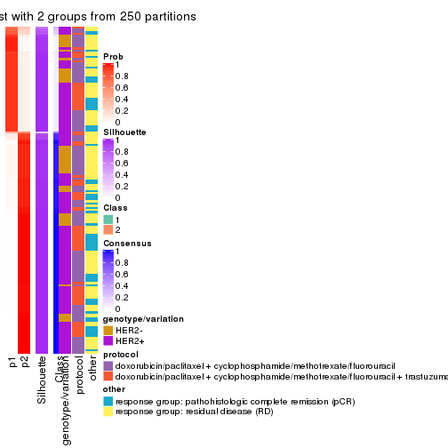</p>

</div>
<div id='tab-MAD-mclust-consensus-heatmap-2'>
<pre><code class="r">consensus_heatmap(res, k = 3)
</code></pre>

<p>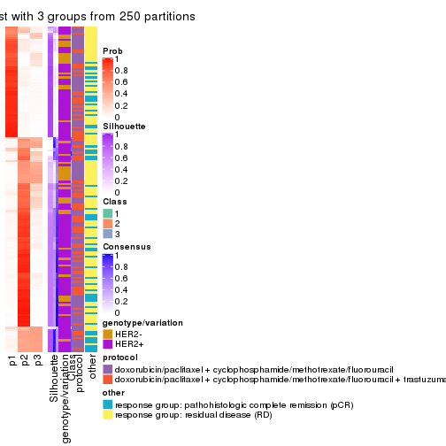</p>

</div>
<div id='tab-MAD-mclust-consensus-heatmap-3'>
<pre><code class="r">consensus_heatmap(res, k = 4)
</code></pre>

<p>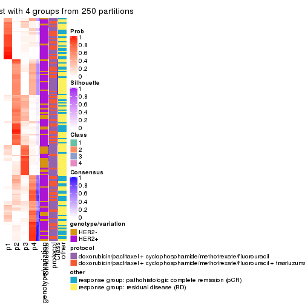</p>

</div>
<div id='tab-MAD-mclust-consensus-heatmap-4'>
<pre><code class="r">consensus_heatmap(res, k = 5)
</code></pre>

<p>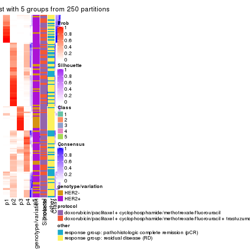</p>

</div>
<div id='tab-MAD-mclust-consensus-heatmap-5'>
<pre><code class="r">consensus_heatmap(res, k = 6)
</code></pre>

<p>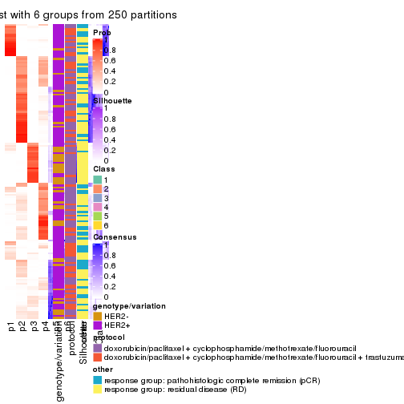</p>

</div>
</div>

Heatmaps for the membership of samples in all partitions to see how consistent they are:


<script>
$( function() {
	$( '#tabs-MAD-mclust-membership-heatmap' ).tabs();
} );
</script>
<div id='tabs-MAD-mclust-membership-heatmap'>
<ul>
<li><a href='#tab-MAD-mclust-membership-heatmap-1'>k = 2</a></li>
<li><a href='#tab-MAD-mclust-membership-heatmap-2'>k = 3</a></li>
<li><a href='#tab-MAD-mclust-membership-heatmap-3'>k = 4</a></li>
<li><a href='#tab-MAD-mclust-membership-heatmap-4'>k = 5</a></li>
<li><a href='#tab-MAD-mclust-membership-heatmap-5'>k = 6</a></li>
</ul>
<div id='tab-MAD-mclust-membership-heatmap-1'>
<pre><code class="r">membership_heatmap(res, k = 2)
</code></pre>

<p>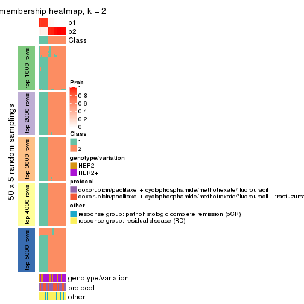</p>

</div>
<div id='tab-MAD-mclust-membership-heatmap-2'>
<pre><code class="r">membership_heatmap(res, k = 3)
</code></pre>

<p>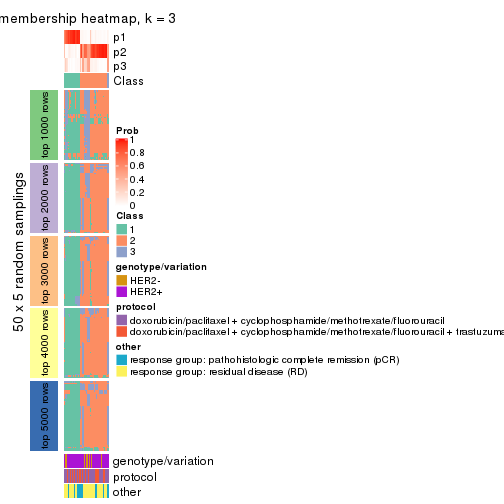</p>

</div>
<div id='tab-MAD-mclust-membership-heatmap-3'>
<pre><code class="r">membership_heatmap(res, k = 4)
</code></pre>

<p>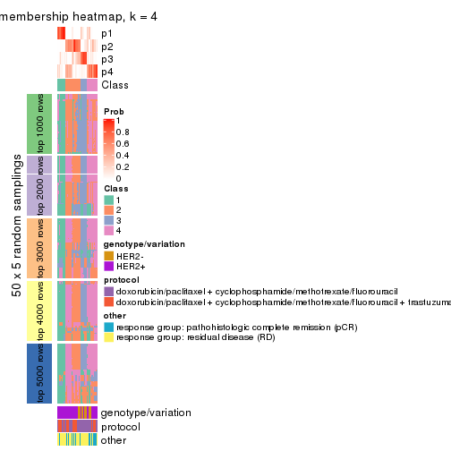</p>

</div>
<div id='tab-MAD-mclust-membership-heatmap-4'>
<pre><code class="r">membership_heatmap(res, k = 5)
</code></pre>

<p>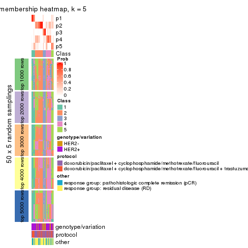</p>

</div>
<div id='tab-MAD-mclust-membership-heatmap-5'>
<pre><code class="r">membership_heatmap(res, k = 6)
</code></pre>

<p>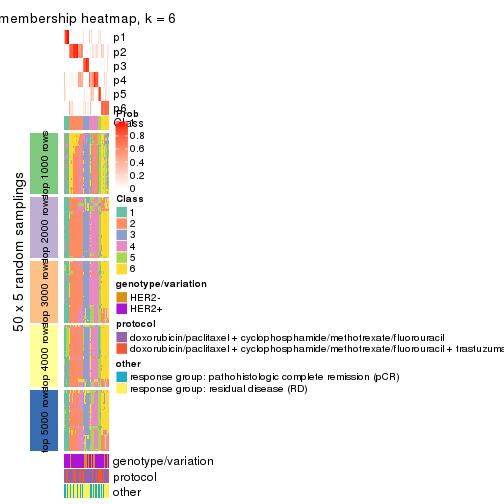</p>

</div>
</div>

As soon as we have had the classes for columns, we can look for signatures
which are significantly different between classes which can be candidate marks
for certain classes. Following are the heatmaps for signatures.


Signature heatmaps where rows are scaled:


<script>
$( function() {
	$( '#tabs-MAD-mclust-get-signatures' ).tabs();
} );
</script>
<div id='tabs-MAD-mclust-get-signatures'>
<ul>
<li><a href='#tab-MAD-mclust-get-signatures-1'>k = 2</a></li>
<li><a href='#tab-MAD-mclust-get-signatures-2'>k = 3</a></li>
<li><a href='#tab-MAD-mclust-get-signatures-3'>k = 4</a></li>
<li><a href='#tab-MAD-mclust-get-signatures-4'>k = 5</a></li>
<li><a href='#tab-MAD-mclust-get-signatures-5'>k = 6</a></li>
</ul>
<div id='tab-MAD-mclust-get-signatures-1'>
<pre><code class="r">get_signatures(res, k = 2)
</code></pre>

<pre><code>#&gt; Error: The width or height of the raster image is zero, maybe you forget to turn off the
#&gt; previous graphic device or it was corrupted. Run `dev.off()` to close it.
</code></pre>

<p></p>

</div>
<div id='tab-MAD-mclust-get-signatures-2'>
<pre><code class="r">get_signatures(res, k = 3)
</code></pre>

<pre><code>#&gt; Error: The width or height of the raster image is zero, maybe you forget to turn off the
#&gt; previous graphic device or it was corrupted. Run `dev.off()` to close it.
</code></pre>

<p></p>

</div>
<div id='tab-MAD-mclust-get-signatures-3'>
<pre><code class="r">get_signatures(res, k = 4)
</code></pre>

<pre><code>#&gt; Error: The width or height of the raster image is zero, maybe you forget to turn off the
#&gt; previous graphic device or it was corrupted. Run `dev.off()` to close it.
</code></pre>

<p></p>

</div>
<div id='tab-MAD-mclust-get-signatures-4'>
<pre><code class="r">get_signatures(res, k = 5)
</code></pre>

<pre><code>#&gt; Error: The width or height of the raster image is zero, maybe you forget to turn off the
#&gt; previous graphic device or it was corrupted. Run `dev.off()` to close it.
</code></pre>

<p></p>

</div>
<div id='tab-MAD-mclust-get-signatures-5'>
<pre><code class="r">get_signatures(res, k = 6)
</code></pre>

<pre><code>#&gt; Error: The width or height of the raster image is zero, maybe you forget to turn off the
#&gt; previous graphic device or it was corrupted. Run `dev.off()` to close it.
</code></pre>

<p></p>

</div>
</div>


Signature heatmaps where rows are not scaled:


<script>
$( function() {
	$( '#tabs-MAD-mclust-get-signatures-no-scale' ).tabs();
} );
</script>
<div id='tabs-MAD-mclust-get-signatures-no-scale'>
<ul>
<li><a href='#tab-MAD-mclust-get-signatures-no-scale-1'>k = 2</a></li>
<li><a href='#tab-MAD-mclust-get-signatures-no-scale-2'>k = 3</a></li>
<li><a href='#tab-MAD-mclust-get-signatures-no-scale-3'>k = 4</a></li>
<li><a href='#tab-MAD-mclust-get-signatures-no-scale-4'>k = 5</a></li>
<li><a href='#tab-MAD-mclust-get-signatures-no-scale-5'>k = 6</a></li>
</ul>
<div id='tab-MAD-mclust-get-signatures-no-scale-1'>
<pre><code class="r">get_signatures(res, k = 2, scale_rows = FALSE)
</code></pre>

<pre><code>#&gt; Error: The width or height of the raster image is zero, maybe you forget to turn off the
#&gt; previous graphic device or it was corrupted. Run `dev.off()` to close it.
</code></pre>

<p></p>

</div>
<div id='tab-MAD-mclust-get-signatures-no-scale-2'>
<pre><code class="r">get_signatures(res, k = 3, scale_rows = FALSE)
</code></pre>

<pre><code>#&gt; Error: The width or height of the raster image is zero, maybe you forget to turn off the
#&gt; previous graphic device or it was corrupted. Run `dev.off()` to close it.
</code></pre>

<p></p>

</div>
<div id='tab-MAD-mclust-get-signatures-no-scale-3'>
<pre><code class="r">get_signatures(res, k = 4, scale_rows = FALSE)
</code></pre>

<pre><code>#&gt; Error: The width or height of the raster image is zero, maybe you forget to turn off the
#&gt; previous graphic device or it was corrupted. Run `dev.off()` to close it.
</code></pre>

<p></p>

</div>
<div id='tab-MAD-mclust-get-signatures-no-scale-4'>
<pre><code class="r">get_signatures(res, k = 5, scale_rows = FALSE)
</code></pre>

<pre><code>#&gt; Error: The width or height of the raster image is zero, maybe you forget to turn off the
#&gt; previous graphic device or it was corrupted. Run `dev.off()` to close it.
</code></pre>

<p></p>

</div>
<div id='tab-MAD-mclust-get-signatures-no-scale-5'>
<pre><code class="r">get_signatures(res, k = 6, scale_rows = FALSE)
</code></pre>

<pre><code>#&gt; Error: The width or height of the raster image is zero, maybe you forget to turn off the
#&gt; previous graphic device or it was corrupted. Run `dev.off()` to close it.
</code></pre>

<p></p>

</div>
</div>


Compare the overlap of signatures from different k:

```r
compare_signatures(res)
```

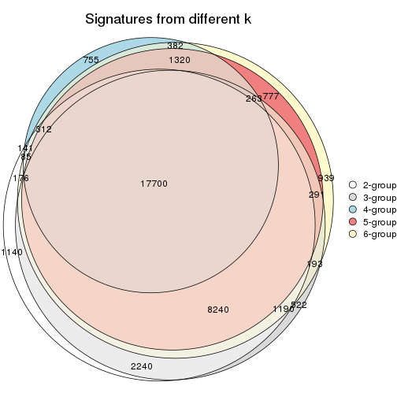

`get_signature()` returns a data frame invisibly. TO get the list of signatures, the function
call should be assigned to a variable explicitly. In following code, if `plot` argument is set
to `FALSE`, no heatmap is plotted while only the differential analysis is performed.

```r
# code only for demonstration
tb = get_signature(res, k = ..., plot = FALSE)
```

An example of the output of `tb` is:

```
#>   which_row         fdr    mean_1    mean_2 scaled_mean_1 scaled_mean_2 km
#> 1        38 0.042760348  8.373488  9.131774    -0.5533452     0.5164555  1
#> 2        40 0.018707592  7.106213  8.469186    -0.6173731     0.5762149  1
#> 3        55 0.019134737 10.221463 11.207825    -0.6159697     0.5749050  1
#> 4        59 0.006059896  5.921854  7.869574    -0.6899429     0.6439467  1
#> 5        60 0.018055526  8.928898 10.211722    -0.6204761     0.5791110  1
#> 6        98 0.009384629 15.714769 14.887706     0.6635654    -0.6193277  2
...
```

The columns in `tb` are:

1. `which_row`: row indices corresponding to the input matrix.
2. `fdr`: FDR for the differential test. 
3. `mean_x`: The mean value in group x.
4. `scaled_mean_x`: The mean value in group x after rows are scaled.
5. `km`: Row groups if k-means clustering is applied to rows.


UMAP plot which shows how samples are separated.


<script>
$( function() {
	$( '#tabs-MAD-mclust-dimension-reduction' ).tabs();
} );
</script>
<div id='tabs-MAD-mclust-dimension-reduction'>
<ul>
<li><a href='#tab-MAD-mclust-dimension-reduction-1'>k = 2</a></li>
<li><a href='#tab-MAD-mclust-dimension-reduction-2'>k = 3</a></li>
<li><a href='#tab-MAD-mclust-dimension-reduction-3'>k = 4</a></li>
<li><a href='#tab-MAD-mclust-dimension-reduction-4'>k = 5</a></li>
<li><a href='#tab-MAD-mclust-dimension-reduction-5'>k = 6</a></li>
</ul>
<div id='tab-MAD-mclust-dimension-reduction-1'>
<pre><code class="r">dimension_reduction(res, k = 2, method = &quot;UMAP&quot;)
</code></pre>

<p>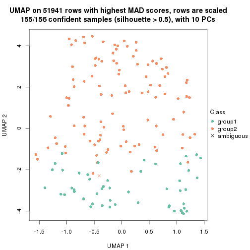</p>

</div>
<div id='tab-MAD-mclust-dimension-reduction-2'>
<pre><code class="r">dimension_reduction(res, k = 3, method = &quot;UMAP&quot;)
</code></pre>

<p>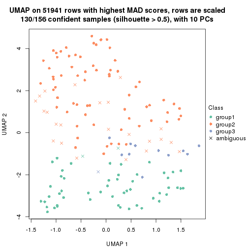</p>

</div>
<div id='tab-MAD-mclust-dimension-reduction-3'>
<pre><code class="r">dimension_reduction(res, k = 4, method = &quot;UMAP&quot;)
</code></pre>

<p>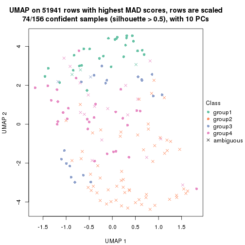</p>

</div>
<div id='tab-MAD-mclust-dimension-reduction-4'>
<pre><code class="r">dimension_reduction(res, k = 5, method = &quot;UMAP&quot;)
</code></pre>

<p>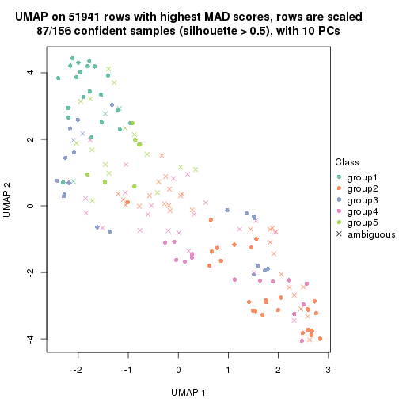</p>

</div>
<div id='tab-MAD-mclust-dimension-reduction-5'>
<pre><code class="r">dimension_reduction(res, k = 6, method = &quot;UMAP&quot;)
</code></pre>

<p>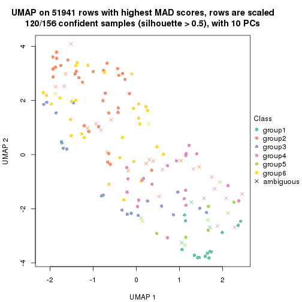</p>

</div>
</div>


Following heatmap shows how subgroups are split when increasing `k`:

```r
collect_classes(res)
```

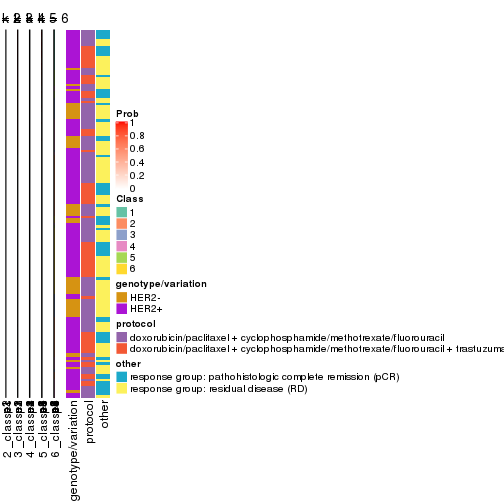


Test correlation between subgroups and known annotations. If the known
annotation is numeric, one-way ANOVA test is applied, and if the known
annotation is discrete, chi-squared contingency table test is applied.

```r
test_to_known_factors(res)
```

```
#>              n genotype/variation(p) protocol(p) other(p) k
#> MAD:mclust 155              7.13e-01     1.00000  1.00000 2
#> MAD:mclust 130              3.15e-01     0.79764  0.03656 3
#> MAD:mclust  74              1.42e-06     0.00567  0.00667 4
#> MAD:mclust  87              3.40e-06     0.04095  0.16562 5
#> MAD:mclust 120              3.37e-05     0.08218  0.13668 6
```


If matrix rows can be associated to genes, consider to use `functional_enrichment(res,
...)` to perform function enrichment for the signature genes. See [this vignette](http://bioconductor.org/packages/devel/bioc/vignettes/cola/inst/doc/functional_enrichment.html) for more detailed explanations.


 

---------------------------------------------------


### MAD:NMF


The object with results only for a single top-value method and a single partition method 
can be extracted as:

```r
res = res_list["MAD", "NMF"]
# you can also extract it by
# res = res_list["MAD:NMF"]
```

A summary of `res` and all the functions that can be applied to it:

```r
res
```

```
#> A 'ConsensusPartition' object with k = 2, 3, 4, 5, 6.
#>   On a matrix with 51941 rows and 156 columns.
#>   Top rows (1000, 2000, 3000, 4000, 5000) are extracted by 'MAD' method.
#>   Subgroups are detected by 'NMF' method.
#>   Performed in total 1250 partitions by row resampling.
#>   Best k for subgroups seems to be 2.
#> 
#> Following methods can be applied to this 'ConsensusPartition' object:
#>  [1] "cola_report"             "collect_classes"         "collect_plots"          
#>  [4] "collect_stats"           "colnames"                "compare_signatures"     
#>  [7] "consensus_heatmap"       "dimension_reduction"     "functional_enrichment"  
#> [10] "get_anno_col"            "get_anno"                "get_classes"            
#> [13] "get_consensus"           "get_matrix"              "get_membership"         
#> [16] "get_param"               "get_signatures"          "get_stats"              
#> [19] "is_best_k"               "is_stable_k"             "membership_heatmap"     
#> [22] "ncol"                    "nrow"                    "plot_ecdf"              
#> [25] "rownames"                "select_partition_number" "show"                   
#> [28] "suggest_best_k"          "test_to_known_factors"
```

`collect_plots()` function collects all the plots made from `res` for all `k` (number of partitions)
into one single page to provide an easy and fast comparison between different `k`.

```r
collect_plots(res)
```

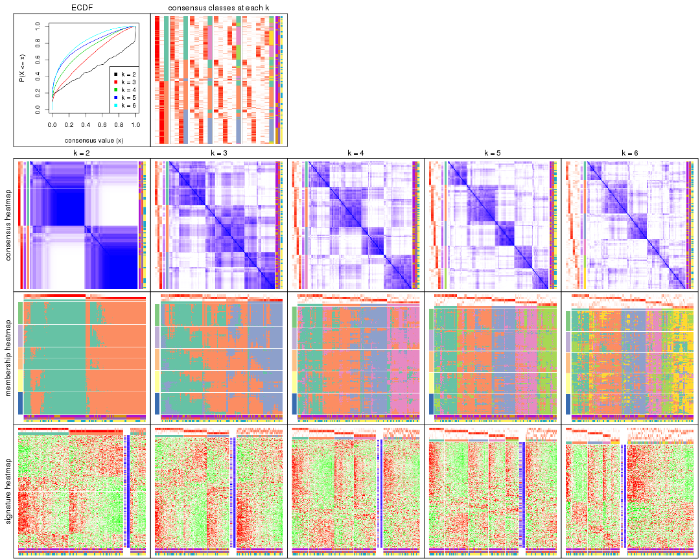

The plots are:

- The first row: a plot of the ECDF (empirical cumulative distribution
  function) curves of the consensus matrix for each `k` and the heatmap of
  predicted classes for each `k`.
- The second row: heatmaps of the consensus matrix for each `k`.
- The third row: heatmaps of the membership matrix for each `k`.
- The fouth row: heatmaps of the signatures for each `k`.

All the plots in panels can be made by individual functions and they are
plotted later in this section.

`select_partition_number()` produces several plots showing different
statistics for choosing "optimized" `k`. There are following statistics:

- ECDF curves of the consensus matrix for each `k`;
- 1-PAC. [The PAC
  score](https://en.wikipedia.org/wiki/Consensus_clustering#Over-interpretation_potential_of_consensus_clustering)
  measures the proportion of the ambiguous subgrouping.
- Mean silhouette score.
- Concordance. The mean probability of fiting the consensus class ids in all
  partitions.
- Area increased. Denote $A_k$ as the area under the ECDF curve for current
  `k`, the area increased is defined as $A_k - A_{k-1}$.
- Rand index. The percent of pairs of samples that are both in a same cluster
  or both are not in a same cluster in the partition of k and k-1.
- Jaccard index. The ratio of pairs of samples are both in a same cluster in
  the partition of k and k-1 and the pairs of samples are both in a same
  cluster in the partition k or k-1.

The detailed explanations of these statistics can be found in [the _cola_
vignette](http://bioconductor.org/packages/devel/bioc/vignettes/cola/inst/doc/cola.html#toc_13).

Generally speaking, lower PAC score, higher mean silhouette score or higher
concordance corresponds to better partition. Rand index and Jaccard index
measure how similar the current partition is compared to partition with `k-1`.
If they are too similar, we won't accept `k` is better than `k-1`.

```r
select_partition_number(res)
```

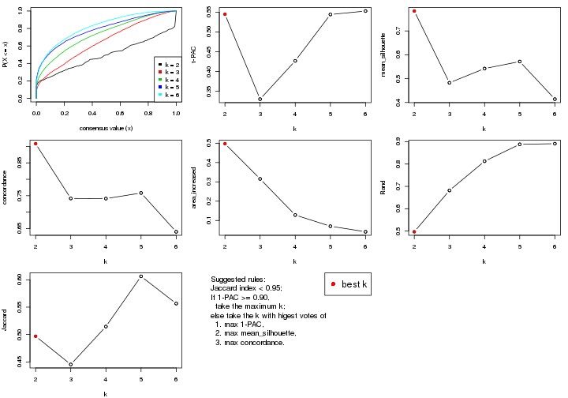

The numeric values for all these statistics can be obtained by `get_stats()`.

```r
get_stats(res)
```

```
#>   k 1-PAC mean_silhouette concordance area_increased  Rand Jaccard
#> 2 2 0.545           0.783       0.908         0.4974 0.497   0.497
#> 3 3 0.330           0.483       0.742         0.3153 0.682   0.445
#> 4 4 0.427           0.542       0.741         0.1284 0.813   0.515
#> 5 5 0.544           0.572       0.758         0.0706 0.888   0.606
#> 6 6 0.553           0.414       0.640         0.0418 0.891   0.557
```

`suggest_best_k()` suggests the best $k$ based on these statistics. The rules are as follows:

- All $k$ with Jaccard index larger than 0.95 are removed because increasing
  $k$ does not provide enough extra information. If all $k$ are removed, it is
  marked as no subgroup is detected.
- For all $k$ with 1-PAC score larger than 0.9, the maximal $k$ is taken as
  the best $k$, and other $k$ are marked as optional $k$.
- If it does not fit the second rule. The $k$ with the maximal vote of the
  highest 1-PAC score, highest mean silhouette, and highest concordance is
  taken as the best $k$.

```r
suggest_best_k(res)
```

```
#> [1] 2
```


Following shows the table of the partitions (You need to click the **show/hide
code output** link to see it). The membership matrix (columns with name `p*`)
is inferred by
[`clue::cl_consensus()`](https://www.rdocumentation.org/link/cl_consensus?package=clue)
function with the `SE` method. Basically the value in the membership matrix
represents the probability to belong to a certain group. The finall class
label for an item is determined with the group with highest probability it
belongs to.

In `get_classes()` function, the entropy is calculated from the membership
matrix and the silhouette score is calculated from the consensus matrix.


<script>
$( function() {
	$( '#tabs-MAD-NMF-get-classes' ).tabs();
} );
</script>
<div id='tabs-MAD-NMF-get-classes'>
<ul>
<li><a href='#tab-MAD-NMF-get-classes-1'>k = 2</a></li>
<li><a href='#tab-MAD-NMF-get-classes-2'>k = 3</a></li>
<li><a href='#tab-MAD-NMF-get-classes-3'>k = 4</a></li>
<li><a href='#tab-MAD-NMF-get-classes-4'>k = 5</a></li>
<li><a href='#tab-MAD-NMF-get-classes-5'>k = 6</a></li>
</ul>

<div id='tab-MAD-NMF-get-classes-1'>
<p><a id='tab-MAD-NMF-get-classes-1-a' style='color:#0366d6' href='#'>show/hide code output</a></p>
<pre><code class="r">cbind(get_classes(res, k = 2), get_membership(res, k = 2))
</code></pre>

<pre><code>#&gt;            class entropy silhouette    p1    p2
#&gt; GSM1232995     2  0.0672     0.9041 0.008 0.992
#&gt; GSM1233002     1  0.0000     0.8758 1.000 0.000
#&gt; GSM1233003     1  0.0000     0.8758 1.000 0.000
#&gt; GSM1233014     1  0.0000     0.8758 1.000 0.000
#&gt; GSM1233015     2  0.4939     0.8319 0.108 0.892
#&gt; GSM1233016     1  0.0000     0.8758 1.000 0.000
#&gt; GSM1233024     1  0.5519     0.7906 0.872 0.128
#&gt; GSM1233049     2  0.3114     0.8680 0.056 0.944
#&gt; GSM1233064     2  0.0000     0.9072 0.000 1.000
#&gt; GSM1233068     2  0.9087     0.5335 0.324 0.676
#&gt; GSM1233073     1  0.0000     0.8758 1.000 0.000
#&gt; GSM1233093     1  0.0000     0.8758 1.000 0.000
#&gt; GSM1233115     1  0.6973     0.7298 0.812 0.188
#&gt; GSM1232992     2  0.7815     0.6854 0.232 0.768
#&gt; GSM1232993     1  0.9209     0.4983 0.664 0.336
#&gt; GSM1233005     1  0.8909     0.5538 0.692 0.308
#&gt; GSM1233007     1  0.1184     0.8711 0.984 0.016
#&gt; GSM1233010     1  0.0000     0.8758 1.000 0.000
#&gt; GSM1233013     2  0.6343     0.7766 0.160 0.840
#&gt; GSM1233018     2  0.3584     0.8655 0.068 0.932
#&gt; GSM1233019     1  0.9393     0.4552 0.644 0.356
#&gt; GSM1233021     1  0.9954     0.1582 0.540 0.460
#&gt; GSM1233025     1  0.0000     0.8758 1.000 0.000
#&gt; GSM1233029     1  0.9552     0.4081 0.624 0.376
#&gt; GSM1233030     2  0.9580     0.3946 0.380 0.620
#&gt; GSM1233031     1  0.0000     0.8758 1.000 0.000
#&gt; GSM1233032     2  0.0000     0.9072 0.000 1.000
#&gt; GSM1233035     1  0.9491     0.4283 0.632 0.368
#&gt; GSM1233038     1  0.0000     0.8758 1.000 0.000
#&gt; GSM1233039     2  0.0376     0.9057 0.004 0.996
#&gt; GSM1233042     1  0.0000     0.8758 1.000 0.000
#&gt; GSM1233043     1  0.0000     0.8758 1.000 0.000
#&gt; GSM1233044     1  0.4298     0.8259 0.912 0.088
#&gt; GSM1233046     2  0.9993     0.0461 0.484 0.516
#&gt; GSM1233051     1  0.9998     0.0899 0.508 0.492
#&gt; GSM1233054     2  0.0000     0.9072 0.000 1.000
#&gt; GSM1233057     2  0.0000     0.9072 0.000 1.000
#&gt; GSM1233060     1  0.0672     0.8730 0.992 0.008
#&gt; GSM1233062     1  0.7219     0.7130 0.800 0.200
#&gt; GSM1233075     2  0.0000     0.9072 0.000 1.000
#&gt; GSM1233078     2  0.0000     0.9072 0.000 1.000
#&gt; GSM1233079     2  0.0376     0.9053 0.004 0.996
#&gt; GSM1233082     1  0.1843     0.8652 0.972 0.028
#&gt; GSM1233083     1  0.0000     0.8758 1.000 0.000
#&gt; GSM1233091     2  0.0938     0.9015 0.012 0.988
#&gt; GSM1233095     1  0.7299     0.7081 0.796 0.204
#&gt; GSM1233096     1  0.9323     0.4682 0.652 0.348
#&gt; GSM1233101     1  0.9248     0.4894 0.660 0.340
#&gt; GSM1233105     1  0.0000     0.8758 1.000 0.000
#&gt; GSM1233117     2  0.5519     0.8116 0.128 0.872
#&gt; GSM1233118     2  0.0000     0.9072 0.000 1.000
#&gt; GSM1233001     2  0.0000     0.9072 0.000 1.000
#&gt; GSM1233006     1  0.0672     0.8730 0.992 0.008
#&gt; GSM1233008     2  0.3431     0.8688 0.064 0.936
#&gt; GSM1233009     2  0.9393     0.4547 0.356 0.644
#&gt; GSM1233017     2  0.9983     0.0779 0.476 0.524
#&gt; GSM1233020     2  0.0376     0.9057 0.004 0.996
#&gt; GSM1233022     1  0.0000     0.8758 1.000 0.000
#&gt; GSM1233026     1  0.1843     0.8638 0.972 0.028
#&gt; GSM1233028     1  0.5059     0.8048 0.888 0.112
#&gt; GSM1233034     2  0.0000     0.9072 0.000 1.000
#&gt; GSM1233040     2  0.0000     0.9072 0.000 1.000
#&gt; GSM1233048     1  0.7815     0.6717 0.768 0.232
#&gt; GSM1233056     1  0.0000     0.8758 1.000 0.000
#&gt; GSM1233058     1  0.0000     0.8758 1.000 0.000
#&gt; GSM1233059     1  0.6438     0.7695 0.836 0.164
#&gt; GSM1233066     2  0.0000     0.9072 0.000 1.000
#&gt; GSM1233071     2  0.9580     0.3949 0.380 0.620
#&gt; GSM1233074     2  0.0000     0.9072 0.000 1.000
#&gt; GSM1233076     1  0.6343     0.7588 0.840 0.160
#&gt; GSM1233080     1  0.4815     0.8120 0.896 0.104
#&gt; GSM1233088     2  0.0000     0.9072 0.000 1.000
#&gt; GSM1233090     2  0.4022     0.8497 0.080 0.920
#&gt; GSM1233092     1  0.0000     0.8758 1.000 0.000
#&gt; GSM1233094     1  0.0000     0.8758 1.000 0.000
#&gt; GSM1233097     1  0.0000     0.8758 1.000 0.000
#&gt; GSM1233100     1  0.0000     0.8758 1.000 0.000
#&gt; GSM1233104     1  0.0000     0.8758 1.000 0.000
#&gt; GSM1233106     2  0.1633     0.8970 0.024 0.976
#&gt; GSM1233111     2  0.2043     0.8920 0.032 0.968
#&gt; GSM1233122     2  0.9129     0.5172 0.328 0.672
#&gt; GSM1233146     1  0.0000     0.8758 1.000 0.000
#&gt; GSM1232994     1  0.9248     0.4894 0.660 0.340
#&gt; GSM1232996     2  0.7453     0.7140 0.212 0.788
#&gt; GSM1232997     2  0.0000     0.9072 0.000 1.000
#&gt; GSM1232998     1  0.0000     0.8758 1.000 0.000
#&gt; GSM1232999     1  0.0000     0.8758 1.000 0.000
#&gt; GSM1233000     2  0.9323     0.4735 0.348 0.652
#&gt; GSM1233004     1  0.8386     0.6186 0.732 0.268
#&gt; GSM1233011     1  0.8661     0.5893 0.712 0.288
#&gt; GSM1233012     2  0.0000     0.9072 0.000 1.000
#&gt; GSM1233023     2  0.0000     0.9072 0.000 1.000
#&gt; GSM1233027     1  0.0000     0.8758 1.000 0.000
#&gt; GSM1233033     1  0.0000     0.8758 1.000 0.000
#&gt; GSM1233036     2  0.0000     0.9072 0.000 1.000
#&gt; GSM1233037     2  0.0000     0.9072 0.000 1.000
#&gt; GSM1233041     1  0.0672     0.8728 0.992 0.008
#&gt; GSM1233045     1  0.0000     0.8758 1.000 0.000
#&gt; GSM1233047     2  0.0000     0.9072 0.000 1.000
#&gt; GSM1233050     2  0.0000     0.9072 0.000 1.000
#&gt; GSM1233052     1  0.0000     0.8758 1.000 0.000
#&gt; GSM1233053     2  0.0000     0.9072 0.000 1.000
#&gt; GSM1233055     1  0.0000     0.8758 1.000 0.000
#&gt; GSM1233061     2  0.0000     0.9072 0.000 1.000
#&gt; GSM1233063     1  0.3274     0.8446 0.940 0.060
#&gt; GSM1233065     2  0.0000     0.9072 0.000 1.000
#&gt; GSM1233070     1  0.4562     0.8184 0.904 0.096
#&gt; GSM1233077     2  0.0000     0.9072 0.000 1.000
#&gt; GSM1233081     2  0.0000     0.9072 0.000 1.000
#&gt; GSM1233084     1  0.0376     0.8743 0.996 0.004
#&gt; GSM1233087     1  0.0000     0.8758 1.000 0.000
#&gt; GSM1233089     2  0.3584     0.8667 0.068 0.932
#&gt; GSM1233099     1  0.0000     0.8758 1.000 0.000
#&gt; GSM1233112     1  0.0672     0.8728 0.992 0.008
#&gt; GSM1233085     2  0.0000     0.9072 0.000 1.000
#&gt; GSM1233098     1  0.9983     0.1163 0.524 0.476
#&gt; GSM1233114     1  0.1414     0.8676 0.980 0.020
#&gt; GSM1233119     1  0.0000     0.8758 1.000 0.000
#&gt; GSM1233129     2  0.0000     0.9072 0.000 1.000
#&gt; GSM1233132     1  0.0000     0.8758 1.000 0.000
#&gt; GSM1233139     2  0.0376     0.9058 0.004 0.996
#&gt; GSM1233143     2  0.0376     0.9058 0.004 0.996
#&gt; GSM1233145     1  0.0000     0.8758 1.000 0.000
#&gt; GSM1233067     2  0.0000     0.9072 0.000 1.000
#&gt; GSM1233069     2  0.0000     0.9072 0.000 1.000
#&gt; GSM1233072     2  0.8207     0.6458 0.256 0.744
#&gt; GSM1233086     2  0.5842     0.7857 0.140 0.860
#&gt; GSM1233102     1  0.0000     0.8758 1.000 0.000
#&gt; GSM1233103     1  0.9977     0.1200 0.528 0.472
#&gt; GSM1233107     1  0.9970     0.1301 0.532 0.468
#&gt; GSM1233108     2  0.6247     0.7566 0.156 0.844
#&gt; GSM1233109     2  0.5946     0.7739 0.144 0.856
#&gt; GSM1233110     2  0.0000     0.9072 0.000 1.000
#&gt; GSM1233113     2  0.0000     0.9072 0.000 1.000
#&gt; GSM1233116     2  0.0000     0.9072 0.000 1.000
#&gt; GSM1233120     1  0.0000     0.8758 1.000 0.000
#&gt; GSM1233121     2  0.0000     0.9072 0.000 1.000
#&gt; GSM1233123     2  0.0000     0.9072 0.000 1.000
#&gt; GSM1233124     2  0.0000     0.9072 0.000 1.000
#&gt; GSM1233125     2  0.8499     0.5571 0.276 0.724
#&gt; GSM1233126     1  0.0000     0.8758 1.000 0.000
#&gt; GSM1233127     1  0.9909     0.2132 0.556 0.444
#&gt; GSM1233128     1  0.6973     0.7286 0.812 0.188
#&gt; GSM1233130     2  0.0000     0.9072 0.000 1.000
#&gt; GSM1233131     1  0.0000     0.8758 1.000 0.000
#&gt; GSM1233133     2  0.0000     0.9072 0.000 1.000
#&gt; GSM1233134     2  0.0000     0.9072 0.000 1.000
#&gt; GSM1233135     2  0.0000     0.9072 0.000 1.000
#&gt; GSM1233136     2  0.0672     0.9033 0.008 0.992
#&gt; GSM1233137     2  0.0000     0.9072 0.000 1.000
#&gt; GSM1233138     1  0.0000     0.8758 1.000 0.000
#&gt; GSM1233140     2  0.1184     0.8983 0.016 0.984
#&gt; GSM1233141     2  0.7815     0.6852 0.232 0.768
#&gt; GSM1233142     2  0.9552     0.4056 0.376 0.624
#&gt; GSM1233144     2  0.0000     0.9072 0.000 1.000
#&gt; GSM1233147     1  0.5629     0.7872 0.868 0.132
</code></pre>

<script>
$('#tab-MAD-NMF-get-classes-1-a').parent().next().next().hide();
$('#tab-MAD-NMF-get-classes-1-a').click(function(){
  $('#tab-MAD-NMF-get-classes-1-a').parent().next().next().toggle();
  return(false);
});
</script>
</div>

<div id='tab-MAD-NMF-get-classes-2'>
<p><a id='tab-MAD-NMF-get-classes-2-a' style='color:#0366d6' href='#'>show/hide code output</a></p>
<pre><code class="r">cbind(get_classes(res, k = 3), get_membership(res, k = 3))
</code></pre>

<pre><code>#&gt;            class entropy silhouette    p1    p2    p3
#&gt; GSM1232995     2  0.6027     0.4449 0.016 0.712 0.272
#&gt; GSM1233002     1  0.5810     0.5630 0.664 0.336 0.000
#&gt; GSM1233003     1  0.4934     0.6084 0.820 0.024 0.156
#&gt; GSM1233014     1  0.4178     0.6587 0.828 0.172 0.000
#&gt; GSM1233015     2  0.2496     0.6001 0.004 0.928 0.068
#&gt; GSM1233016     1  0.3263     0.6784 0.912 0.048 0.040
#&gt; GSM1233024     2  0.5835     0.3781 0.340 0.660 0.000
#&gt; GSM1233049     3  0.2879     0.6722 0.052 0.024 0.924
#&gt; GSM1233064     2  0.6008     0.1331 0.000 0.628 0.372
#&gt; GSM1233068     2  0.3043     0.5943 0.008 0.908 0.084
#&gt; GSM1233073     1  0.3619     0.6800 0.864 0.136 0.000
#&gt; GSM1233093     1  0.5903     0.5521 0.744 0.232 0.024
#&gt; GSM1233115     1  0.9507     0.1039 0.432 0.188 0.380
#&gt; GSM1232992     2  0.1315     0.6457 0.008 0.972 0.020
#&gt; GSM1232993     2  0.2400     0.6339 0.064 0.932 0.004
#&gt; GSM1233005     2  0.5815     0.4673 0.304 0.692 0.004
#&gt; GSM1233007     1  0.4733     0.6353 0.800 0.196 0.004
#&gt; GSM1233010     1  0.4475     0.6667 0.840 0.144 0.016
#&gt; GSM1233013     2  0.4007     0.6591 0.084 0.880 0.036
#&gt; GSM1233018     2  0.3967     0.6496 0.044 0.884 0.072
#&gt; GSM1233019     2  0.5541     0.5469 0.252 0.740 0.008
#&gt; GSM1233021     2  0.4589     0.6141 0.172 0.820 0.008
#&gt; GSM1233025     1  0.1905     0.6750 0.956 0.016 0.028
#&gt; GSM1233029     2  0.1529     0.6366 0.040 0.960 0.000
#&gt; GSM1233030     2  0.2414     0.6382 0.020 0.940 0.040
#&gt; GSM1233031     2  0.6489    -0.1016 0.456 0.540 0.004
#&gt; GSM1233032     3  0.4931     0.5538 0.000 0.232 0.768
#&gt; GSM1233035     2  0.2313     0.6448 0.032 0.944 0.024
#&gt; GSM1233038     1  0.1337     0.6736 0.972 0.016 0.012
#&gt; GSM1233039     3  0.6260     0.4025 0.000 0.448 0.552
#&gt; GSM1233042     1  0.5497     0.5609 0.708 0.292 0.000
#&gt; GSM1233043     1  0.5431     0.5715 0.716 0.284 0.000
#&gt; GSM1233044     1  0.5931     0.6566 0.792 0.124 0.084
#&gt; GSM1233046     2  0.4782     0.6240 0.164 0.820 0.016
#&gt; GSM1233051     3  0.7569     0.4548 0.092 0.240 0.668
#&gt; GSM1233054     3  0.6045     0.4426 0.000 0.380 0.620
#&gt; GSM1233057     2  0.6286    -0.1026 0.000 0.536 0.464
#&gt; GSM1233060     2  0.4291     0.4653 0.180 0.820 0.000
#&gt; GSM1233062     2  0.5623     0.4802 0.280 0.716 0.004
#&gt; GSM1233075     3  0.4931     0.6324 0.000 0.232 0.768
#&gt; GSM1233078     3  0.1129     0.7040 0.004 0.020 0.976
#&gt; GSM1233079     3  0.3083     0.6689 0.024 0.060 0.916
#&gt; GSM1233082     2  0.9282    -0.1591 0.368 0.468 0.164
#&gt; GSM1233083     1  0.2066     0.6628 0.940 0.000 0.060
#&gt; GSM1233091     2  0.6126     0.1273 0.004 0.644 0.352
#&gt; GSM1233095     1  0.9021     0.3397 0.552 0.184 0.264
#&gt; GSM1233096     2  0.5728     0.4916 0.032 0.772 0.196
#&gt; GSM1233101     3  0.6460     0.1861 0.440 0.004 0.556
#&gt; GSM1233105     1  0.6066     0.6062 0.728 0.248 0.024
#&gt; GSM1233117     2  0.7202     0.5840 0.124 0.716 0.160
#&gt; GSM1233118     3  0.6095     0.4251 0.000 0.392 0.608
#&gt; GSM1233001     2  0.6308    -0.1347 0.000 0.508 0.492
#&gt; GSM1233006     1  0.5988     0.4397 0.632 0.368 0.000
#&gt; GSM1233008     2  0.6590     0.6235 0.112 0.756 0.132
#&gt; GSM1233009     2  0.1989     0.6266 0.004 0.948 0.048
#&gt; GSM1233017     2  0.4755     0.6078 0.184 0.808 0.008
#&gt; GSM1233020     2  0.6200     0.3665 0.012 0.676 0.312
#&gt; GSM1233022     1  0.6518     0.1471 0.512 0.484 0.004
#&gt; GSM1233026     1  0.8204     0.4620 0.588 0.316 0.096
#&gt; GSM1233028     2  0.5948     0.3023 0.360 0.640 0.000
#&gt; GSM1233034     2  0.3816     0.5410 0.000 0.852 0.148
#&gt; GSM1233040     3  0.6204     0.2768 0.000 0.424 0.576
#&gt; GSM1233048     2  0.3356     0.6215 0.036 0.908 0.056
#&gt; GSM1233056     1  0.1585     0.6700 0.964 0.008 0.028
#&gt; GSM1233058     1  0.3551     0.6790 0.868 0.132 0.000
#&gt; GSM1233059     2  0.8550     0.2720 0.176 0.608 0.216
#&gt; GSM1233066     3  0.3116     0.6980 0.000 0.108 0.892
#&gt; GSM1233071     2  0.2982     0.6321 0.024 0.920 0.056
#&gt; GSM1233074     3  0.5810     0.5134 0.000 0.336 0.664
#&gt; GSM1233076     1  0.6180     0.3603 0.660 0.008 0.332
#&gt; GSM1233080     1  0.9431     0.2994 0.500 0.220 0.280
#&gt; GSM1233088     2  0.6252    -0.1652 0.000 0.556 0.444
#&gt; GSM1233090     3  0.7459     0.3114 0.044 0.372 0.584
#&gt; GSM1233092     1  0.2959     0.6827 0.900 0.100 0.000
#&gt; GSM1233094     1  0.5363     0.5853 0.724 0.276 0.000
#&gt; GSM1233097     1  0.5058     0.6114 0.756 0.244 0.000
#&gt; GSM1233100     1  0.5706     0.5837 0.680 0.320 0.000
#&gt; GSM1233104     1  0.5363     0.5837 0.724 0.276 0.000
#&gt; GSM1233106     2  0.6126     0.1492 0.000 0.600 0.400
#&gt; GSM1233111     2  0.6813    -0.0505 0.012 0.520 0.468
#&gt; GSM1233122     2  0.5366     0.5945 0.208 0.776 0.016
#&gt; GSM1233146     1  0.5560     0.5607 0.700 0.300 0.000
#&gt; GSM1232994     2  0.5285     0.5545 0.244 0.752 0.004
#&gt; GSM1232996     2  0.6283     0.6117 0.176 0.760 0.064
#&gt; GSM1232997     3  0.6126     0.4057 0.000 0.400 0.600
#&gt; GSM1232998     1  0.5178     0.5957 0.744 0.256 0.000
#&gt; GSM1232999     1  0.5835     0.4978 0.660 0.340 0.000
#&gt; GSM1233000     2  0.1781     0.6502 0.020 0.960 0.020
#&gt; GSM1233004     1  0.7248     0.1203 0.536 0.028 0.436
#&gt; GSM1233011     1  0.6763     0.1265 0.552 0.012 0.436
#&gt; GSM1233012     2  0.6308    -0.1291 0.000 0.508 0.492
#&gt; GSM1233023     3  0.6295     0.2268 0.000 0.472 0.528
#&gt; GSM1233027     1  0.5785     0.5158 0.668 0.332 0.000
#&gt; GSM1233033     1  0.7731     0.5493 0.664 0.228 0.108
#&gt; GSM1233036     2  0.6295    -0.0610 0.000 0.528 0.472
#&gt; GSM1233037     2  0.5968     0.1731 0.000 0.636 0.364
#&gt; GSM1233041     1  0.9904     0.2603 0.400 0.316 0.284
#&gt; GSM1233045     1  0.6307     0.3184 0.512 0.488 0.000
#&gt; GSM1233047     3  0.4452     0.6594 0.000 0.192 0.808
#&gt; GSM1233050     3  0.6154     0.3309 0.000 0.408 0.592
#&gt; GSM1233052     2  0.5560     0.1575 0.300 0.700 0.000
#&gt; GSM1233053     2  0.6267    -0.0452 0.000 0.548 0.452
#&gt; GSM1233055     1  0.1163     0.6804 0.972 0.028 0.000
#&gt; GSM1233061     3  0.4702     0.6469 0.000 0.212 0.788
#&gt; GSM1233063     1  0.9968     0.2105 0.368 0.332 0.300
#&gt; GSM1233065     3  0.6244     0.3064 0.000 0.440 0.560
#&gt; GSM1233070     2  0.6518    -0.0490 0.484 0.512 0.004
#&gt; GSM1233077     3  0.2050     0.7040 0.020 0.028 0.952
#&gt; GSM1233081     3  0.0661     0.6992 0.008 0.004 0.988
#&gt; GSM1233084     1  0.9359     0.3061 0.508 0.208 0.284
#&gt; GSM1233087     1  0.1860     0.6838 0.948 0.052 0.000
#&gt; GSM1233089     2  0.8157     0.3498 0.096 0.596 0.308
#&gt; GSM1233099     1  0.5948     0.4674 0.640 0.360 0.000
#&gt; GSM1233112     1  0.6034     0.5790 0.752 0.036 0.212
#&gt; GSM1233085     3  0.1031     0.7051 0.000 0.024 0.976
#&gt; GSM1233098     2  0.6630     0.4492 0.300 0.672 0.028
#&gt; GSM1233114     2  0.7674    -0.0257 0.472 0.484 0.044
#&gt; GSM1233119     1  0.1643     0.6832 0.956 0.044 0.000
#&gt; GSM1233129     3  0.6302     0.2010 0.000 0.480 0.520
#&gt; GSM1233132     1  0.6468     0.3037 0.552 0.444 0.004
#&gt; GSM1233139     2  0.3551     0.5871 0.000 0.868 0.132
#&gt; GSM1233143     2  0.6553     0.3729 0.020 0.656 0.324
#&gt; GSM1233145     1  0.0424     0.6781 0.992 0.008 0.000
#&gt; GSM1233067     3  0.6062     0.4361 0.000 0.384 0.616
#&gt; GSM1233069     3  0.3038     0.7003 0.000 0.104 0.896
#&gt; GSM1233072     2  0.7447     0.5873 0.160 0.700 0.140
#&gt; GSM1233086     3  0.7860     0.4760 0.088 0.284 0.628
#&gt; GSM1233102     1  0.1964     0.6835 0.944 0.056 0.000
#&gt; GSM1233103     2  0.4289     0.6552 0.092 0.868 0.040
#&gt; GSM1233107     2  0.5247     0.5809 0.224 0.768 0.008
#&gt; GSM1233108     3  0.2356     0.6712 0.072 0.000 0.928
#&gt; GSM1233109     3  0.2772     0.6703 0.080 0.004 0.916
#&gt; GSM1233110     3  0.1753     0.7069 0.000 0.048 0.952
#&gt; GSM1233113     3  0.6309     0.1515 0.000 0.496 0.504
#&gt; GSM1233116     3  0.5733     0.5314 0.000 0.324 0.676
#&gt; GSM1233120     1  0.2878     0.6832 0.904 0.096 0.000
#&gt; GSM1233121     3  0.2680     0.7073 0.008 0.068 0.924
#&gt; GSM1233123     3  0.2796     0.7033 0.000 0.092 0.908
#&gt; GSM1233124     3  0.5706     0.5369 0.000 0.320 0.680
#&gt; GSM1233125     3  0.3193     0.6512 0.100 0.004 0.896
#&gt; GSM1233126     1  0.3412     0.6790 0.876 0.124 0.000
#&gt; GSM1233127     2  0.5502     0.5563 0.248 0.744 0.008
#&gt; GSM1233128     3  0.6796     0.2442 0.368 0.020 0.612
#&gt; GSM1233130     3  0.0848     0.7004 0.008 0.008 0.984
#&gt; GSM1233131     1  0.6292     0.6125 0.740 0.216 0.044
#&gt; GSM1233133     3  0.0424     0.7020 0.000 0.008 0.992
#&gt; GSM1233134     3  0.5178     0.6106 0.000 0.256 0.744
#&gt; GSM1233135     3  0.2796     0.7031 0.000 0.092 0.908
#&gt; GSM1233136     3  0.2918     0.6969 0.044 0.032 0.924
#&gt; GSM1233137     3  0.5098     0.6195 0.000 0.248 0.752
#&gt; GSM1233138     1  0.3412     0.6808 0.876 0.124 0.000
#&gt; GSM1233140     3  0.2443     0.6792 0.032 0.028 0.940
#&gt; GSM1233141     2  0.5633     0.5970 0.208 0.768 0.024
#&gt; GSM1233142     2  0.5318     0.5966 0.204 0.780 0.016
#&gt; GSM1233144     3  0.0747     0.7040 0.000 0.016 0.984
#&gt; GSM1233147     1  0.7128     0.5209 0.684 0.064 0.252
</code></pre>

<script>
$('#tab-MAD-NMF-get-classes-2-a').parent().next().next().hide();
$('#tab-MAD-NMF-get-classes-2-a').click(function(){
  $('#tab-MAD-NMF-get-classes-2-a').parent().next().next().toggle();
  return(false);
});
</script>
</div>

<div id='tab-MAD-NMF-get-classes-3'>
<p><a id='tab-MAD-NMF-get-classes-3-a' style='color:#0366d6' href='#'>show/hide code output</a></p>
<pre><code class="r">cbind(get_classes(res, k = 4), get_membership(res, k = 4))
</code></pre>

<pre><code>#&gt;            class entropy silhouette    p1    p2    p3    p4
#&gt; GSM1232995     2   0.321    0.70302 0.000 0.876 0.092 0.032
#&gt; GSM1233002     4   0.606    0.63795 0.088 0.232 0.004 0.676
#&gt; GSM1233003     4   0.713    0.02955 0.444 0.024 0.068 0.464
#&gt; GSM1233014     4   0.388    0.69781 0.016 0.172 0.000 0.812
#&gt; GSM1233015     1   0.439    0.59530 0.740 0.252 0.008 0.000
#&gt; GSM1233016     4   0.702    0.23120 0.412 0.092 0.008 0.488
#&gt; GSM1233024     2   0.576    0.51677 0.128 0.712 0.000 0.160
#&gt; GSM1233049     3   0.232    0.72081 0.036 0.000 0.924 0.040
#&gt; GSM1233064     2   0.853    0.35363 0.156 0.504 0.264 0.076
#&gt; GSM1233068     1   0.486    0.49141 0.668 0.324 0.008 0.000
#&gt; GSM1233073     4   0.525    0.63792 0.148 0.100 0.000 0.752
#&gt; GSM1233093     1   0.445    0.51917 0.744 0.000 0.012 0.244
#&gt; GSM1233115     4   0.830    0.23722 0.188 0.036 0.304 0.472
#&gt; GSM1232992     2   0.247    0.67816 0.108 0.892 0.000 0.000
#&gt; GSM1232993     2   0.467    0.59516 0.200 0.764 0.000 0.036
#&gt; GSM1233005     2   0.463    0.50855 0.012 0.740 0.004 0.244
#&gt; GSM1233007     4   0.442    0.67826 0.000 0.160 0.044 0.796
#&gt; GSM1233010     1   0.518    0.52623 0.732 0.056 0.000 0.212
#&gt; GSM1233013     2   0.117    0.70835 0.020 0.968 0.012 0.000
#&gt; GSM1233018     2   0.250    0.71061 0.028 0.924 0.012 0.036
#&gt; GSM1233019     2   0.286    0.66264 0.008 0.880 0.000 0.112
#&gt; GSM1233021     2   0.340    0.68329 0.032 0.864 0.000 0.104
#&gt; GSM1233025     4   0.553    0.26391 0.388 0.004 0.016 0.592
#&gt; GSM1233029     2   0.515    0.43986 0.316 0.664 0.000 0.020
#&gt; GSM1233030     2   0.381    0.61846 0.176 0.812 0.000 0.012
#&gt; GSM1233031     1   0.630    0.39795 0.548 0.388 0.000 0.064
#&gt; GSM1233032     1   0.584    0.21211 0.524 0.032 0.444 0.000
#&gt; GSM1233035     1   0.523    0.57503 0.676 0.296 0.000 0.028
#&gt; GSM1233038     4   0.511    0.39372 0.328 0.016 0.000 0.656
#&gt; GSM1233039     3   0.891    0.14971 0.288 0.256 0.400 0.056
#&gt; GSM1233042     4   0.383    0.69388 0.004 0.204 0.000 0.792
#&gt; GSM1233043     4   0.371    0.69423 0.004 0.192 0.000 0.804
#&gt; GSM1233044     4   0.597    0.68264 0.016 0.148 0.112 0.724
#&gt; GSM1233046     2   0.607    0.45311 0.172 0.684 0.000 0.144
#&gt; GSM1233051     1   0.435    0.59669 0.780 0.000 0.196 0.024
#&gt; GSM1233054     3   0.628    0.00582 0.056 0.468 0.476 0.000
#&gt; GSM1233057     2   0.627    0.48323 0.096 0.632 0.272 0.000
#&gt; GSM1233060     1   0.544    0.38576 0.596 0.384 0.000 0.020
#&gt; GSM1233062     2   0.565    0.50243 0.192 0.712 0.000 0.096
#&gt; GSM1233075     3   0.402    0.65229 0.004 0.224 0.772 0.000
#&gt; GSM1233078     3   0.141    0.75238 0.000 0.020 0.960 0.020
#&gt; GSM1233079     3   0.385    0.59850 0.180 0.000 0.808 0.012
#&gt; GSM1233082     1   0.168    0.68866 0.948 0.044 0.004 0.004
#&gt; GSM1233083     4   0.349    0.62389 0.044 0.000 0.092 0.864
#&gt; GSM1233091     1   0.922    0.12474 0.420 0.284 0.184 0.112
#&gt; GSM1233095     4   0.730    0.32379 0.220 0.000 0.244 0.536
#&gt; GSM1233096     1   0.247    0.69732 0.900 0.096 0.004 0.000
#&gt; GSM1233101     3   0.603    0.04306 0.032 0.004 0.496 0.468
#&gt; GSM1233105     1   0.514    0.54391 0.744 0.064 0.000 0.192
#&gt; GSM1233117     2   0.298    0.70955 0.000 0.892 0.068 0.040
#&gt; GSM1233118     2   0.597    0.11476 0.000 0.532 0.428 0.040
#&gt; GSM1233001     2   0.508    0.55551 0.036 0.716 0.248 0.000
#&gt; GSM1233006     4   0.510    0.51588 0.008 0.380 0.000 0.612
#&gt; GSM1233008     2   0.112    0.71064 0.000 0.964 0.036 0.000
#&gt; GSM1233009     2   0.393    0.60425 0.196 0.796 0.004 0.004
#&gt; GSM1233017     2   0.203    0.68767 0.036 0.936 0.000 0.028
#&gt; GSM1233020     2   0.422    0.68434 0.000 0.824 0.104 0.072
#&gt; GSM1233022     2   0.683    0.23554 0.144 0.584 0.000 0.272
#&gt; GSM1233026     1   0.437    0.64708 0.808 0.148 0.004 0.040
#&gt; GSM1233028     2   0.444    0.60353 0.060 0.804 0.000 0.136
#&gt; GSM1233034     2   0.463    0.51223 0.268 0.720 0.012 0.000
#&gt; GSM1233040     1   0.362    0.69479 0.860 0.064 0.076 0.000
#&gt; GSM1233048     1   0.354    0.67268 0.828 0.164 0.000 0.008
#&gt; GSM1233056     4   0.370    0.63768 0.064 0.012 0.056 0.868
#&gt; GSM1233058     4   0.386    0.68593 0.004 0.176 0.008 0.812
#&gt; GSM1233059     1   0.205    0.69483 0.928 0.064 0.008 0.000
#&gt; GSM1233066     3   0.305    0.74280 0.000 0.108 0.876 0.016
#&gt; GSM1233071     2   0.524    0.29182 0.356 0.628 0.000 0.016
#&gt; GSM1233074     3   0.503    0.33865 0.004 0.400 0.596 0.000
#&gt; GSM1233076     4   0.560    0.49531 0.008 0.040 0.264 0.688
#&gt; GSM1233080     1   0.591    0.54531 0.700 0.000 0.148 0.152
#&gt; GSM1233088     1   0.790    0.02461 0.372 0.304 0.324 0.000
#&gt; GSM1233090     1   0.384    0.63655 0.816 0.016 0.168 0.000
#&gt; GSM1233092     4   0.241    0.69933 0.000 0.104 0.000 0.896
#&gt; GSM1233094     4   0.483    0.66866 0.032 0.228 0.000 0.740
#&gt; GSM1233097     4   0.469    0.64647 0.004 0.288 0.004 0.704
#&gt; GSM1233100     4   0.642    0.57128 0.216 0.140 0.000 0.644
#&gt; GSM1233104     4   0.481    0.62659 0.008 0.316 0.000 0.676
#&gt; GSM1233106     1   0.340    0.69727 0.864 0.104 0.032 0.000
#&gt; GSM1233111     1   0.272    0.69860 0.904 0.064 0.032 0.000
#&gt; GSM1233122     2   0.233    0.69605 0.000 0.916 0.012 0.072
#&gt; GSM1233146     4   0.703    0.47294 0.132 0.348 0.000 0.520
#&gt; GSM1232994     2   0.289    0.67321 0.036 0.896 0.000 0.068
#&gt; GSM1232996     2   0.378    0.65443 0.004 0.832 0.016 0.148
#&gt; GSM1232997     2   0.528    0.02808 0.000 0.524 0.468 0.008
#&gt; GSM1232998     4   0.461    0.63927 0.000 0.304 0.004 0.692
#&gt; GSM1232999     4   0.489    0.48151 0.000 0.412 0.000 0.588
#&gt; GSM1233000     2   0.327    0.66001 0.132 0.856 0.000 0.012
#&gt; GSM1233004     4   0.647    0.45592 0.004 0.096 0.276 0.624
#&gt; GSM1233011     4   0.603    0.43520 0.020 0.036 0.292 0.652
#&gt; GSM1233012     2   0.484    0.49127 0.012 0.688 0.300 0.000
#&gt; GSM1233023     2   0.496    0.50489 0.020 0.696 0.284 0.000
#&gt; GSM1233027     4   0.478    0.55015 0.000 0.376 0.000 0.624
#&gt; GSM1233033     1   0.406    0.57352 0.808 0.016 0.004 0.172
#&gt; GSM1233036     2   0.446    0.60555 0.024 0.768 0.208 0.000
#&gt; GSM1233037     2   0.647    0.53834 0.164 0.644 0.192 0.000
#&gt; GSM1233041     1   0.232    0.65863 0.924 0.000 0.036 0.040
#&gt; GSM1233045     4   0.613    0.54672 0.056 0.328 0.004 0.612
#&gt; GSM1233047     3   0.340    0.71469 0.008 0.152 0.840 0.000
#&gt; GSM1233050     1   0.633    0.56623 0.656 0.144 0.200 0.000
#&gt; GSM1233052     1   0.579    0.54036 0.656 0.284 0.000 0.060
#&gt; GSM1233053     2   0.676    0.30180 0.108 0.548 0.344 0.000
#&gt; GSM1233055     4   0.200    0.65679 0.044 0.000 0.020 0.936
#&gt; GSM1233061     3   0.398    0.65569 0.004 0.220 0.776 0.000
#&gt; GSM1233063     1   0.149    0.67015 0.956 0.000 0.032 0.012
#&gt; GSM1233065     2   0.609    0.32486 0.000 0.596 0.344 0.060
#&gt; GSM1233070     2   0.557   -0.19401 0.012 0.516 0.004 0.468
#&gt; GSM1233077     3   0.281    0.73753 0.000 0.024 0.896 0.080
#&gt; GSM1233081     3   0.112    0.74342 0.012 0.004 0.972 0.012
#&gt; GSM1233084     1   0.639    0.47853 0.648 0.000 0.140 0.212
#&gt; GSM1233087     4   0.111    0.66923 0.016 0.004 0.008 0.972
#&gt; GSM1233089     2   0.661    0.45104 0.000 0.620 0.144 0.236
#&gt; GSM1233099     4   0.537    0.44570 0.012 0.444 0.000 0.544
#&gt; GSM1233112     4   0.492    0.57585 0.000 0.036 0.228 0.736
#&gt; GSM1233085     3   0.209    0.75358 0.020 0.048 0.932 0.000
#&gt; GSM1233098     4   0.812    0.04738 0.084 0.408 0.072 0.436
#&gt; GSM1233114     1   0.734    0.27424 0.460 0.380 0.000 0.160
#&gt; GSM1233119     4   0.556    0.67517 0.124 0.132 0.004 0.740
#&gt; GSM1233129     2   0.472    0.44457 0.000 0.672 0.324 0.004
#&gt; GSM1233132     1   0.772    0.23675 0.408 0.364 0.000 0.228
#&gt; GSM1233139     2   0.331    0.68302 0.092 0.872 0.036 0.000
#&gt; GSM1233143     2   0.317    0.66983 0.000 0.840 0.160 0.000
#&gt; GSM1233145     4   0.391    0.64935 0.104 0.040 0.008 0.848
#&gt; GSM1233067     3   0.516    0.10387 0.000 0.476 0.520 0.004
#&gt; GSM1233069     3   0.202    0.75910 0.000 0.056 0.932 0.012
#&gt; GSM1233072     2   0.337    0.69059 0.000 0.872 0.048 0.080
#&gt; GSM1233086     3   0.616    0.50261 0.000 0.092 0.644 0.264
#&gt; GSM1233102     4   0.346    0.68251 0.056 0.076 0.000 0.868
#&gt; GSM1233103     1   0.538    0.30517 0.536 0.452 0.000 0.012
#&gt; GSM1233107     2   0.340    0.65725 0.068 0.872 0.000 0.060
#&gt; GSM1233108     3   0.259    0.70990 0.044 0.000 0.912 0.044
#&gt; GSM1233109     3   0.245    0.71273 0.016 0.000 0.912 0.072
#&gt; GSM1233110     3   0.156    0.75785 0.000 0.056 0.944 0.000
#&gt; GSM1233113     2   0.495    0.40004 0.000 0.648 0.344 0.008
#&gt; GSM1233116     3   0.564    0.48337 0.000 0.324 0.636 0.040
#&gt; GSM1233120     4   0.291    0.69506 0.020 0.092 0.000 0.888
#&gt; GSM1233121     3   0.281    0.73965 0.000 0.024 0.896 0.080
#&gt; GSM1233123     3   0.190    0.75707 0.004 0.064 0.932 0.000
#&gt; GSM1233124     3   0.519    0.40210 0.000 0.372 0.616 0.012
#&gt; GSM1233125     3   0.365    0.65908 0.108 0.000 0.852 0.040
#&gt; GSM1233126     4   0.425    0.68600 0.064 0.116 0.000 0.820
#&gt; GSM1233127     2   0.261    0.67392 0.012 0.900 0.000 0.088
#&gt; GSM1233128     3   0.760   -0.05744 0.380 0.000 0.420 0.200
#&gt; GSM1233130     3   0.115    0.74751 0.000 0.008 0.968 0.024
#&gt; GSM1233131     1   0.520    0.58584 0.752 0.088 0.000 0.160
#&gt; GSM1233133     3   0.183    0.74944 0.024 0.032 0.944 0.000
#&gt; GSM1233134     3   0.472    0.54654 0.008 0.300 0.692 0.000
#&gt; GSM1233135     3   0.179    0.75761 0.000 0.068 0.932 0.000
#&gt; GSM1233136     3   0.415    0.68345 0.000 0.032 0.808 0.160
#&gt; GSM1233137     3   0.412    0.65383 0.008 0.220 0.772 0.000
#&gt; GSM1233138     4   0.553    0.65174 0.136 0.132 0.000 0.732
#&gt; GSM1233140     3   0.474    0.38370 0.328 0.000 0.668 0.004
#&gt; GSM1233141     2   0.139    0.70841 0.000 0.960 0.012 0.028
#&gt; GSM1233142     2   0.149    0.69813 0.012 0.956 0.000 0.032
#&gt; GSM1233144     3   0.131    0.75611 0.004 0.036 0.960 0.000
#&gt; GSM1233147     4   0.487    0.53655 0.000 0.028 0.244 0.728
</code></pre>

<script>
$('#tab-MAD-NMF-get-classes-3-a').parent().next().next().hide();
$('#tab-MAD-NMF-get-classes-3-a').click(function(){
  $('#tab-MAD-NMF-get-classes-3-a').parent().next().next().toggle();
  return(false);
});
</script>
</div>

<div id='tab-MAD-NMF-get-classes-4'>
<p><a id='tab-MAD-NMF-get-classes-4-a' style='color:#0366d6' href='#'>show/hide code output</a></p>
<pre><code class="r">cbind(get_classes(res, k = 5), get_membership(res, k = 5))
</code></pre>

<pre><code>#&gt;            class entropy silhouette    p1    p2    p3    p4    p5
#&gt; GSM1232995     2  0.2054     0.7191 0.000 0.916 0.072 0.008 0.004
#&gt; GSM1233002     4  0.4221     0.6704 0.112 0.108 0.000 0.780 0.000
#&gt; GSM1233003     5  0.3241     0.6248 0.104 0.000 0.028 0.012 0.856
#&gt; GSM1233014     5  0.3953     0.6731 0.000 0.148 0.000 0.060 0.792
#&gt; GSM1233015     1  0.2424     0.6967 0.868 0.132 0.000 0.000 0.000
#&gt; GSM1233016     5  0.1547     0.6969 0.016 0.032 0.004 0.000 0.948
#&gt; GSM1233024     2  0.4683     0.3131 0.012 0.624 0.000 0.008 0.356
#&gt; GSM1233049     3  0.2506     0.7585 0.036 0.000 0.904 0.008 0.052
#&gt; GSM1233064     4  0.7137     0.3254 0.216 0.296 0.028 0.460 0.000
#&gt; GSM1233068     1  0.3051     0.6964 0.852 0.120 0.000 0.028 0.000
#&gt; GSM1233073     5  0.3780     0.6581 0.000 0.060 0.000 0.132 0.808
#&gt; GSM1233093     1  0.3948     0.6243 0.768 0.012 0.000 0.208 0.012
#&gt; GSM1233115     4  0.2264     0.7030 0.060 0.004 0.024 0.912 0.000
#&gt; GSM1232992     2  0.2550     0.7089 0.084 0.892 0.004 0.020 0.000
#&gt; GSM1232993     2  0.4477     0.5491 0.252 0.708 0.000 0.040 0.000
#&gt; GSM1233005     4  0.4696     0.3807 0.012 0.400 0.000 0.584 0.004
#&gt; GSM1233007     4  0.1267     0.7117 0.000 0.024 0.004 0.960 0.012
#&gt; GSM1233010     1  0.4560     0.6511 0.784 0.016 0.004 0.092 0.104
#&gt; GSM1233013     2  0.0968     0.7214 0.012 0.972 0.012 0.004 0.000
#&gt; GSM1233018     2  0.3844     0.6570 0.064 0.804 0.000 0.132 0.000
#&gt; GSM1233019     2  0.2358     0.6731 0.000 0.888 0.000 0.008 0.104
#&gt; GSM1233021     2  0.4693     0.5228 0.056 0.700 0.000 0.244 0.000
#&gt; GSM1233025     5  0.2804     0.6745 0.048 0.000 0.008 0.056 0.888
#&gt; GSM1233029     2  0.4904     0.0829 0.472 0.504 0.000 0.024 0.000
#&gt; GSM1233030     2  0.2172     0.7171 0.060 0.916 0.004 0.000 0.020
#&gt; GSM1233031     1  0.5801     0.3116 0.532 0.380 0.000 0.004 0.084
#&gt; GSM1233032     1  0.4977     0.1408 0.532 0.008 0.444 0.000 0.016
#&gt; GSM1233035     5  0.6923     0.1405 0.284 0.340 0.004 0.000 0.372
#&gt; GSM1233038     5  0.2938     0.6448 0.084 0.000 0.008 0.032 0.876
#&gt; GSM1233039     1  0.7254     0.0264 0.400 0.164 0.044 0.392 0.000
#&gt; GSM1233042     4  0.5475     0.5407 0.000 0.124 0.000 0.644 0.232
#&gt; GSM1233043     4  0.5673     0.5049 0.000 0.132 0.000 0.616 0.252
#&gt; GSM1233044     5  0.6646     0.5359 0.000 0.120 0.180 0.084 0.616
#&gt; GSM1233046     2  0.4937     0.1241 0.028 0.544 0.000 0.000 0.428
#&gt; GSM1233051     1  0.6062     0.5042 0.632 0.000 0.160 0.020 0.188
#&gt; GSM1233054     2  0.7014     0.2188 0.252 0.420 0.316 0.012 0.000
#&gt; GSM1233057     2  0.4677     0.6691 0.104 0.756 0.132 0.008 0.000
#&gt; GSM1233060     1  0.4382     0.5445 0.700 0.276 0.000 0.020 0.004
#&gt; GSM1233062     2  0.4354     0.6092 0.068 0.768 0.000 0.004 0.160
#&gt; GSM1233075     3  0.3003     0.7391 0.000 0.188 0.812 0.000 0.000
#&gt; GSM1233078     3  0.0798     0.8077 0.000 0.008 0.976 0.016 0.000
#&gt; GSM1233079     3  0.3898     0.6495 0.160 0.000 0.800 0.024 0.016
#&gt; GSM1233082     1  0.0807     0.7114 0.976 0.012 0.000 0.000 0.012
#&gt; GSM1233083     4  0.4436     0.5930 0.008 0.000 0.068 0.768 0.156
#&gt; GSM1233091     1  0.5697     0.1944 0.512 0.084 0.000 0.404 0.000
#&gt; GSM1233095     4  0.3619     0.6572 0.124 0.000 0.040 0.828 0.008
#&gt; GSM1233096     1  0.1386     0.7134 0.952 0.032 0.000 0.000 0.016
#&gt; GSM1233101     4  0.2234     0.7004 0.016 0.004 0.060 0.916 0.004
#&gt; GSM1233105     5  0.2756     0.6612 0.092 0.024 0.004 0.000 0.880
#&gt; GSM1233117     2  0.3567     0.6885 0.000 0.832 0.112 0.004 0.052
#&gt; GSM1233118     3  0.4747     0.0594 0.000 0.484 0.500 0.016 0.000
#&gt; GSM1233001     2  0.4115     0.6792 0.036 0.796 0.148 0.020 0.000
#&gt; GSM1233006     5  0.5294     0.3831 0.000 0.380 0.000 0.056 0.564
#&gt; GSM1233008     2  0.1186     0.7214 0.008 0.964 0.020 0.008 0.000
#&gt; GSM1233009     2  0.2773     0.6654 0.164 0.836 0.000 0.000 0.000
#&gt; GSM1233017     2  0.2249     0.6842 0.008 0.896 0.000 0.000 0.096
#&gt; GSM1233020     2  0.3372     0.6747 0.000 0.840 0.036 0.120 0.004
#&gt; GSM1233022     5  0.3611     0.6614 0.004 0.208 0.000 0.008 0.780
#&gt; GSM1233026     1  0.6046     0.5548 0.652 0.032 0.004 0.208 0.104
#&gt; GSM1233028     2  0.5060     0.5421 0.104 0.692 0.000 0.204 0.000
#&gt; GSM1233034     2  0.4527     0.3322 0.392 0.596 0.000 0.012 0.000
#&gt; GSM1233040     1  0.2104     0.7047 0.924 0.024 0.008 0.000 0.044
#&gt; GSM1233048     1  0.2408     0.7070 0.892 0.092 0.000 0.016 0.000
#&gt; GSM1233056     5  0.5411     0.2284 0.008 0.000 0.044 0.396 0.552
#&gt; GSM1233058     4  0.1757     0.7154 0.012 0.048 0.000 0.936 0.004
#&gt; GSM1233059     1  0.0566     0.7122 0.984 0.012 0.000 0.004 0.000
#&gt; GSM1233066     3  0.2339     0.8013 0.000 0.100 0.892 0.004 0.004
#&gt; GSM1233071     2  0.4888     0.6053 0.188 0.720 0.004 0.000 0.088
#&gt; GSM1233074     3  0.4045     0.4763 0.000 0.356 0.644 0.000 0.000
#&gt; GSM1233076     4  0.2193     0.6942 0.000 0.000 0.060 0.912 0.028
#&gt; GSM1233080     1  0.5260     0.6196 0.736 0.000 0.052 0.136 0.076
#&gt; GSM1233088     1  0.5154     0.5673 0.696 0.224 0.064 0.016 0.000
#&gt; GSM1233090     1  0.0833     0.7092 0.976 0.000 0.016 0.004 0.004
#&gt; GSM1233092     5  0.5770     0.2694 0.000 0.096 0.000 0.372 0.532
#&gt; GSM1233094     5  0.5048     0.6182 0.000 0.152 0.000 0.144 0.704
#&gt; GSM1233097     4  0.2237     0.7133 0.004 0.084 0.000 0.904 0.008
#&gt; GSM1233100     1  0.6798     0.1258 0.460 0.116 0.000 0.388 0.036
#&gt; GSM1233104     4  0.5240     0.5815 0.000 0.216 0.000 0.672 0.112
#&gt; GSM1233106     1  0.1579     0.7120 0.944 0.032 0.000 0.000 0.024
#&gt; GSM1233111     1  0.1914     0.6959 0.928 0.008 0.008 0.000 0.056
#&gt; GSM1233122     2  0.2700     0.6882 0.000 0.884 0.024 0.004 0.088
#&gt; GSM1233146     5  0.6619     0.3519 0.004 0.320 0.000 0.204 0.472
#&gt; GSM1232994     2  0.2515     0.6961 0.020 0.908 0.000 0.032 0.040
#&gt; GSM1232996     2  0.4347     0.3526 0.004 0.636 0.000 0.356 0.004
#&gt; GSM1232997     2  0.5455     0.2295 0.012 0.548 0.400 0.040 0.000
#&gt; GSM1232998     4  0.4926     0.6166 0.000 0.152 0.000 0.716 0.132
#&gt; GSM1232999     4  0.4163     0.6611 0.000 0.228 0.000 0.740 0.032
#&gt; GSM1233000     2  0.2669     0.6967 0.104 0.876 0.000 0.020 0.000
#&gt; GSM1233004     4  0.1442     0.7063 0.000 0.004 0.032 0.952 0.012
#&gt; GSM1233011     4  0.5455     0.5364 0.000 0.008 0.176 0.680 0.136
#&gt; GSM1233012     2  0.4235     0.4386 0.000 0.656 0.336 0.000 0.008
#&gt; GSM1233023     2  0.4365     0.6647 0.024 0.776 0.164 0.036 0.000
#&gt; GSM1233027     4  0.5683     0.5206 0.000 0.304 0.000 0.588 0.108
#&gt; GSM1233033     5  0.3530     0.5347 0.204 0.000 0.012 0.000 0.784
#&gt; GSM1233036     2  0.4335     0.6165 0.036 0.740 0.220 0.004 0.000
#&gt; GSM1233037     2  0.4503     0.6742 0.120 0.756 0.124 0.000 0.000
#&gt; GSM1233041     1  0.4430     0.5499 0.720 0.000 0.032 0.004 0.244
#&gt; GSM1233045     4  0.3527     0.6985 0.056 0.116 0.000 0.828 0.000
#&gt; GSM1233047     3  0.2439     0.7899 0.004 0.120 0.876 0.000 0.000
#&gt; GSM1233050     1  0.2625     0.7066 0.876 0.108 0.000 0.016 0.000
#&gt; GSM1233052     1  0.3849     0.6756 0.808 0.112 0.000 0.080 0.000
#&gt; GSM1233053     2  0.6993     0.2464 0.248 0.428 0.312 0.012 0.000
#&gt; GSM1233055     4  0.3351     0.6449 0.020 0.000 0.004 0.828 0.148
#&gt; GSM1233061     3  0.2852     0.7540 0.000 0.172 0.828 0.000 0.000
#&gt; GSM1233063     1  0.4957     0.4926 0.664 0.000 0.040 0.008 0.288
#&gt; GSM1233065     2  0.5892    -0.0316 0.016 0.472 0.060 0.452 0.000
#&gt; GSM1233070     4  0.6215     0.1488 0.048 0.452 0.000 0.456 0.044
#&gt; GSM1233077     3  0.2674     0.7630 0.000 0.012 0.868 0.120 0.000
#&gt; GSM1233081     3  0.0880     0.8002 0.000 0.000 0.968 0.032 0.000
#&gt; GSM1233084     1  0.6931     0.3358 0.512 0.000 0.148 0.040 0.300
#&gt; GSM1233087     4  0.2088     0.6949 0.004 0.004 0.004 0.916 0.072
#&gt; GSM1233089     2  0.6211     0.4250 0.000 0.592 0.080 0.288 0.040
#&gt; GSM1233099     4  0.5238     0.4362 0.012 0.396 0.000 0.564 0.028
#&gt; GSM1233112     5  0.6248     0.4618 0.000 0.024 0.256 0.124 0.596
#&gt; GSM1233085     3  0.0963     0.8138 0.000 0.036 0.964 0.000 0.000
#&gt; GSM1233098     4  0.5446     0.6120 0.068 0.236 0.016 0.676 0.004
#&gt; GSM1233114     5  0.4064     0.6579 0.024 0.216 0.004 0.000 0.756
#&gt; GSM1233119     5  0.4728     0.5534 0.000 0.060 0.000 0.240 0.700
#&gt; GSM1233129     2  0.3906     0.5200 0.000 0.704 0.292 0.004 0.000
#&gt; GSM1233132     5  0.6124     0.4868 0.200 0.236 0.000 0.000 0.564
#&gt; GSM1233139     2  0.2595     0.7132 0.080 0.888 0.032 0.000 0.000
#&gt; GSM1233143     2  0.4496     0.6495 0.000 0.752 0.156 0.000 0.092
#&gt; GSM1233145     5  0.2393     0.6838 0.004 0.016 0.000 0.080 0.900
#&gt; GSM1233067     3  0.4350     0.3361 0.000 0.408 0.588 0.000 0.004
#&gt; GSM1233069     3  0.1484     0.8152 0.000 0.048 0.944 0.008 0.000
#&gt; GSM1233072     2  0.4087     0.6207 0.000 0.784 0.040 0.008 0.168
#&gt; GSM1233086     4  0.4636     0.4786 0.000 0.024 0.308 0.664 0.004
#&gt; GSM1233102     5  0.3201     0.6797 0.000 0.052 0.000 0.096 0.852
#&gt; GSM1233103     1  0.4151     0.4433 0.652 0.344 0.000 0.000 0.004
#&gt; GSM1233107     2  0.4126     0.2614 0.000 0.620 0.000 0.000 0.380
#&gt; GSM1233108     3  0.2409     0.7702 0.012 0.000 0.908 0.060 0.020
#&gt; GSM1233109     3  0.1877     0.7782 0.000 0.000 0.924 0.064 0.012
#&gt; GSM1233110     3  0.1205     0.8144 0.000 0.040 0.956 0.004 0.000
#&gt; GSM1233113     2  0.4066     0.4655 0.000 0.672 0.324 0.000 0.004
#&gt; GSM1233116     3  0.5595     0.5440 0.000 0.276 0.632 0.080 0.012
#&gt; GSM1233120     4  0.5131     0.3056 0.000 0.048 0.000 0.588 0.364
#&gt; GSM1233121     3  0.2674     0.7628 0.000 0.012 0.868 0.120 0.000
#&gt; GSM1233123     3  0.1502     0.8133 0.000 0.056 0.940 0.004 0.000
#&gt; GSM1233124     3  0.3895     0.5504 0.000 0.320 0.680 0.000 0.000
#&gt; GSM1233125     3  0.3584     0.7183 0.060 0.000 0.852 0.032 0.056
#&gt; GSM1233126     5  0.2653     0.6975 0.000 0.096 0.000 0.024 0.880
#&gt; GSM1233127     2  0.3809     0.5188 0.000 0.736 0.000 0.008 0.256
#&gt; GSM1233128     5  0.7599     0.0913 0.184 0.000 0.372 0.064 0.380
#&gt; GSM1233130     3  0.1041     0.8017 0.000 0.004 0.964 0.032 0.000
#&gt; GSM1233131     1  0.5396     0.1929 0.532 0.048 0.004 0.000 0.416
#&gt; GSM1233133     3  0.0510     0.8102 0.000 0.016 0.984 0.000 0.000
#&gt; GSM1233134     3  0.3177     0.7177 0.000 0.208 0.792 0.000 0.000
#&gt; GSM1233135     3  0.1991     0.8090 0.000 0.076 0.916 0.004 0.004
#&gt; GSM1233136     3  0.4680     0.1392 0.000 0.008 0.540 0.448 0.004
#&gt; GSM1233137     3  0.2773     0.7606 0.000 0.164 0.836 0.000 0.000
#&gt; GSM1233138     5  0.2540     0.7001 0.000 0.088 0.000 0.024 0.888
#&gt; GSM1233140     3  0.5087     0.5349 0.152 0.000 0.700 0.000 0.148
#&gt; GSM1233141     2  0.2708     0.6922 0.000 0.892 0.016 0.020 0.072
#&gt; GSM1233142     2  0.1282     0.7057 0.000 0.952 0.000 0.004 0.044
#&gt; GSM1233144     3  0.0609     0.8110 0.000 0.020 0.980 0.000 0.000
#&gt; GSM1233147     4  0.2459     0.6972 0.000 0.004 0.052 0.904 0.040
</code></pre>

<script>
$('#tab-MAD-NMF-get-classes-4-a').parent().next().next().hide();
$('#tab-MAD-NMF-get-classes-4-a').click(function(){
  $('#tab-MAD-NMF-get-classes-4-a').parent().next().next().toggle();
  return(false);
});
</script>
</div>

<div id='tab-MAD-NMF-get-classes-5'>
<p><a id='tab-MAD-NMF-get-classes-5-a' style='color:#0366d6' href='#'>show/hide code output</a></p>
<pre><code class="r">cbind(get_classes(res, k = 6), get_membership(res, k = 6))
</code></pre>

<pre><code>#&gt;            class entropy silhouette    p1    p2    p3    p4    p5    p6
#&gt; GSM1232995     2  0.3409    0.62699 0.004 0.844 0.076 0.004 0.016 0.056
#&gt; GSM1233002     6  0.4811    0.50501 0.180 0.120 0.000 0.004 0.004 0.692
#&gt; GSM1233003     4  0.4316    0.32177 0.012 0.000 0.004 0.628 0.348 0.008
#&gt; GSM1233014     4  0.4725    0.56686 0.000 0.104 0.000 0.732 0.128 0.036
#&gt; GSM1233015     1  0.3268    0.54406 0.824 0.076 0.000 0.000 0.100 0.000
#&gt; GSM1233016     4  0.4011    0.43671 0.000 0.024 0.000 0.672 0.304 0.000
#&gt; GSM1233024     2  0.4959    0.46141 0.020 0.664 0.000 0.240 0.076 0.000
#&gt; GSM1233049     3  0.5441    0.56338 0.080 0.012 0.720 0.120 0.028 0.040
#&gt; GSM1233064     6  0.6160    0.31521 0.172 0.240 0.040 0.000 0.000 0.548
#&gt; GSM1233068     1  0.2999    0.57477 0.860 0.084 0.000 0.000 0.024 0.032
#&gt; GSM1233073     4  0.1794    0.60628 0.024 0.008 0.000 0.936 0.020 0.012
#&gt; GSM1233093     1  0.5271    0.42603 0.680 0.000 0.004 0.052 0.072 0.192
#&gt; GSM1233115     6  0.4016    0.55595 0.044 0.012 0.008 0.012 0.124 0.800
#&gt; GSM1232992     2  0.4617    0.53666 0.104 0.716 0.012 0.000 0.000 0.168
#&gt; GSM1232993     1  0.6087    0.06680 0.448 0.436 0.000 0.028 0.028 0.060
#&gt; GSM1233005     6  0.5742    0.27620 0.028 0.364 0.000 0.000 0.092 0.516
#&gt; GSM1233007     6  0.2603    0.57005 0.016 0.064 0.020 0.004 0.004 0.892
#&gt; GSM1233010     5  0.4082    0.39508 0.204 0.008 0.000 0.000 0.740 0.048
#&gt; GSM1233013     2  0.2614    0.62224 0.060 0.884 0.012 0.000 0.000 0.044
#&gt; GSM1233018     2  0.4427    0.48725 0.048 0.716 0.004 0.000 0.012 0.220
#&gt; GSM1233019     2  0.3518    0.62493 0.016 0.824 0.000 0.112 0.004 0.044
#&gt; GSM1233021     2  0.5687    0.21549 0.052 0.548 0.000 0.000 0.060 0.340
#&gt; GSM1233025     5  0.5242    0.21836 0.012 0.000 0.004 0.284 0.616 0.084
#&gt; GSM1233029     1  0.5344    0.23901 0.520 0.400 0.000 0.000 0.024 0.056
#&gt; GSM1233030     2  0.2611    0.62459 0.092 0.880 0.004 0.012 0.008 0.004
#&gt; GSM1233031     5  0.6805    0.01389 0.252 0.328 0.000 0.028 0.384 0.008
#&gt; GSM1233032     3  0.6141   -0.01222 0.292 0.008 0.456 0.000 0.244 0.000
#&gt; GSM1233035     2  0.7560   -0.04754 0.176 0.388 0.004 0.192 0.240 0.000
#&gt; GSM1233038     4  0.4572    0.12472 0.012 0.000 0.000 0.512 0.460 0.016
#&gt; GSM1233039     6  0.5494    0.38452 0.244 0.084 0.016 0.000 0.020 0.636
#&gt; GSM1233042     4  0.6395    0.29129 0.068 0.048 0.000 0.536 0.036 0.312
#&gt; GSM1233043     4  0.6219    0.30644 0.044 0.064 0.000 0.552 0.032 0.308
#&gt; GSM1233044     5  0.7174    0.23812 0.000 0.112 0.096 0.096 0.564 0.132
#&gt; GSM1233046     4  0.5530    0.00785 0.028 0.444 0.004 0.472 0.052 0.000
#&gt; GSM1233051     1  0.6324   -0.08106 0.440 0.000 0.064 0.004 0.408 0.084
#&gt; GSM1233054     3  0.6379    0.28193 0.288 0.232 0.460 0.000 0.016 0.004
#&gt; GSM1233057     2  0.4948    0.56278 0.124 0.700 0.156 0.000 0.004 0.016
#&gt; GSM1233060     1  0.3879    0.52420 0.748 0.220 0.000 0.012 0.012 0.008
#&gt; GSM1233062     2  0.5542    0.46356 0.064 0.648 0.000 0.068 0.216 0.004
#&gt; GSM1233075     3  0.3387    0.68140 0.000 0.164 0.796 0.000 0.000 0.040
#&gt; GSM1233078     3  0.2076    0.69665 0.016 0.000 0.912 0.000 0.012 0.060
#&gt; GSM1233079     3  0.5450    0.44444 0.228 0.000 0.640 0.000 0.084 0.048
#&gt; GSM1233082     1  0.3711    0.38869 0.720 0.020 0.000 0.000 0.260 0.000
#&gt; GSM1233083     6  0.6176    0.14128 0.020 0.000 0.036 0.300 0.092 0.552
#&gt; GSM1233091     1  0.5726    0.35496 0.600 0.072 0.004 0.000 0.052 0.272
#&gt; GSM1233095     6  0.7621    0.36266 0.216 0.000 0.048 0.088 0.192 0.456
#&gt; GSM1233096     1  0.3455    0.47996 0.784 0.036 0.000 0.000 0.180 0.000
#&gt; GSM1233101     6  0.7739    0.44549 0.128 0.016 0.064 0.072 0.236 0.484
#&gt; GSM1233105     4  0.4690    0.46145 0.056 0.032 0.000 0.708 0.204 0.000
#&gt; GSM1233117     2  0.3784    0.62111 0.000 0.812 0.120 0.032 0.020 0.016
#&gt; GSM1233118     3  0.4510    0.37599 0.000 0.380 0.588 0.000 0.008 0.024
#&gt; GSM1233001     2  0.5848    0.46450 0.036 0.600 0.124 0.000 0.004 0.236
#&gt; GSM1233006     4  0.5488    0.45260 0.004 0.176 0.000 0.604 0.004 0.212
#&gt; GSM1233008     2  0.2808    0.62879 0.012 0.880 0.008 0.000 0.056 0.044
#&gt; GSM1233009     2  0.3493    0.57206 0.136 0.800 0.000 0.000 0.064 0.000
#&gt; GSM1233017     2  0.2767    0.61981 0.004 0.868 0.000 0.072 0.056 0.000
#&gt; GSM1233020     2  0.5062    0.40126 0.012 0.600 0.068 0.000 0.000 0.320
#&gt; GSM1233022     4  0.5547    0.27479 0.000 0.344 0.000 0.508 0.148 0.000
#&gt; GSM1233026     5  0.3695    0.41863 0.176 0.004 0.000 0.000 0.776 0.044
#&gt; GSM1233028     2  0.6699    0.03624 0.044 0.420 0.000 0.000 0.312 0.224
#&gt; GSM1233034     1  0.5552    0.01975 0.452 0.436 0.000 0.000 0.008 0.104
#&gt; GSM1233040     1  0.4719    0.10635 0.564 0.016 0.024 0.000 0.396 0.000
#&gt; GSM1233048     1  0.2131    0.57069 0.916 0.048 0.004 0.004 0.004 0.024
#&gt; GSM1233056     4  0.4630    0.52622 0.076 0.000 0.020 0.772 0.052 0.080
#&gt; GSM1233058     6  0.5309    0.51981 0.016 0.052 0.000 0.016 0.308 0.608
#&gt; GSM1233059     1  0.2651    0.52638 0.860 0.028 0.000 0.000 0.112 0.000
#&gt; GSM1233066     3  0.5158    0.64545 0.000 0.144 0.700 0.000 0.064 0.092
#&gt; GSM1233071     2  0.5618    0.37728 0.276 0.604 0.004 0.076 0.040 0.000
#&gt; GSM1233074     3  0.4092    0.45720 0.000 0.344 0.636 0.000 0.000 0.020
#&gt; GSM1233076     6  0.3026    0.53510 0.004 0.000 0.036 0.020 0.076 0.864
#&gt; GSM1233080     1  0.6346    0.36605 0.636 0.000 0.044 0.096 0.092 0.132
#&gt; GSM1233088     1  0.5934    0.43768 0.604 0.132 0.036 0.000 0.008 0.220
#&gt; GSM1233090     1  0.3788    0.50981 0.828 0.000 0.040 0.036 0.076 0.020
#&gt; GSM1233092     4  0.4475    0.54649 0.000 0.032 0.000 0.708 0.032 0.228
#&gt; GSM1233094     4  0.3064    0.60538 0.004 0.068 0.000 0.860 0.056 0.012
#&gt; GSM1233097     6  0.6133    0.51730 0.044 0.052 0.000 0.040 0.292 0.572
#&gt; GSM1233100     1  0.7604    0.20807 0.500 0.048 0.004 0.128 0.144 0.176
#&gt; GSM1233104     6  0.6974    0.43414 0.012 0.152 0.000 0.072 0.308 0.456
#&gt; GSM1233106     1  0.3440    0.46500 0.776 0.028 0.000 0.000 0.196 0.000
#&gt; GSM1233111     1  0.3820    0.25476 0.660 0.004 0.004 0.000 0.332 0.000
#&gt; GSM1233122     2  0.5593    0.52335 0.012 0.648 0.040 0.084 0.000 0.216
#&gt; GSM1233146     2  0.7961   -0.03721 0.028 0.332 0.000 0.268 0.128 0.244
#&gt; GSM1232994     2  0.3585    0.62680 0.032 0.844 0.000 0.048 0.052 0.024
#&gt; GSM1232996     2  0.5807   -0.11772 0.012 0.456 0.000 0.000 0.128 0.404
#&gt; GSM1232997     2  0.6071    0.37550 0.012 0.524 0.252 0.000 0.004 0.208
#&gt; GSM1232998     6  0.6050    0.51874 0.000 0.132 0.000 0.044 0.268 0.556
#&gt; GSM1232999     6  0.5603    0.53068 0.004 0.168 0.000 0.004 0.244 0.580
#&gt; GSM1233000     2  0.3737    0.56216 0.168 0.780 0.000 0.000 0.008 0.044
#&gt; GSM1233004     6  0.4063    0.53452 0.004 0.012 0.008 0.004 0.260 0.712
#&gt; GSM1233011     5  0.5453   -0.26867 0.000 0.012 0.048 0.016 0.488 0.436
#&gt; GSM1233012     2  0.4151    0.18422 0.000 0.576 0.412 0.004 0.008 0.000
#&gt; GSM1233023     2  0.5691    0.45963 0.032 0.600 0.124 0.000 0.000 0.244
#&gt; GSM1233027     6  0.4769    0.46965 0.008 0.248 0.000 0.028 0.032 0.684
#&gt; GSM1233033     5  0.5469    0.26412 0.144 0.000 0.000 0.324 0.532 0.000
#&gt; GSM1233036     2  0.5953    0.46880 0.024 0.588 0.220 0.000 0.160 0.008
#&gt; GSM1233037     2  0.5126    0.52672 0.196 0.668 0.120 0.000 0.004 0.012
#&gt; GSM1233041     5  0.4730    0.07997 0.468 0.000 0.016 0.020 0.496 0.000
#&gt; GSM1233045     6  0.5749    0.54756 0.052 0.064 0.000 0.012 0.256 0.616
#&gt; GSM1233047     3  0.2068    0.71070 0.008 0.080 0.904 0.000 0.008 0.000
#&gt; GSM1233050     1  0.2796    0.57359 0.872 0.068 0.000 0.000 0.048 0.012
#&gt; GSM1233052     1  0.3889    0.55566 0.816 0.080 0.000 0.008 0.040 0.056
#&gt; GSM1233053     3  0.6429    0.36314 0.276 0.204 0.488 0.000 0.028 0.004
#&gt; GSM1233055     6  0.7092    0.37184 0.108 0.004 0.008 0.192 0.180 0.508
#&gt; GSM1233061     3  0.3102    0.69369 0.000 0.156 0.816 0.000 0.000 0.028
#&gt; GSM1233063     5  0.4634    0.24699 0.376 0.000 0.008 0.024 0.588 0.004
#&gt; GSM1233065     6  0.6192    0.26362 0.024 0.356 0.028 0.000 0.084 0.508
#&gt; GSM1233070     6  0.5689    0.07819 0.060 0.380 0.004 0.028 0.004 0.524
#&gt; GSM1233077     3  0.4379    0.48960 0.000 0.008 0.632 0.000 0.024 0.336
#&gt; GSM1233081     3  0.1976    0.69513 0.024 0.008 0.928 0.000 0.020 0.020
#&gt; GSM1233084     5  0.7236    0.11921 0.388 0.000 0.056 0.096 0.396 0.064
#&gt; GSM1233087     6  0.4722    0.51868 0.020 0.000 0.000 0.104 0.160 0.716
#&gt; GSM1233089     2  0.5644    0.22246 0.008 0.472 0.080 0.012 0.000 0.428
#&gt; GSM1233099     2  0.8586   -0.18749 0.132 0.288 0.000 0.104 0.276 0.200
#&gt; GSM1233112     4  0.4805    0.51654 0.024 0.004 0.036 0.716 0.016 0.204
#&gt; GSM1233085     3  0.1777    0.70228 0.012 0.032 0.932 0.000 0.024 0.000
#&gt; GSM1233098     6  0.6132    0.30418 0.092 0.260 0.060 0.004 0.004 0.580
#&gt; GSM1233114     5  0.6167   -0.05404 0.004 0.288 0.000 0.292 0.416 0.000
#&gt; GSM1233119     5  0.5893    0.17530 0.000 0.032 0.004 0.132 0.588 0.244
#&gt; GSM1233129     2  0.4788    0.42578 0.008 0.652 0.288 0.000 0.012 0.040
#&gt; GSM1233132     2  0.7517   -0.14263 0.148 0.328 0.000 0.292 0.232 0.000
#&gt; GSM1233139     2  0.3037    0.62785 0.056 0.872 0.032 0.012 0.028 0.000
#&gt; GSM1233143     2  0.4278    0.58468 0.000 0.760 0.152 0.056 0.032 0.000
#&gt; GSM1233145     4  0.3144    0.57357 0.000 0.004 0.000 0.808 0.172 0.016
#&gt; GSM1233067     3  0.3841    0.38791 0.000 0.380 0.616 0.000 0.004 0.000
#&gt; GSM1233069     3  0.4098    0.62290 0.000 0.036 0.732 0.000 0.012 0.220
#&gt; GSM1233072     2  0.5560    0.57533 0.000 0.680 0.044 0.128 0.016 0.132
#&gt; GSM1233086     6  0.6451    0.40215 0.012 0.020 0.124 0.012 0.332 0.500
#&gt; GSM1233102     4  0.1003    0.61164 0.000 0.016 0.000 0.964 0.020 0.000
#&gt; GSM1233103     1  0.6250    0.16599 0.432 0.324 0.012 0.000 0.232 0.000
#&gt; GSM1233107     2  0.5215    0.40284 0.000 0.620 0.004 0.236 0.140 0.000
#&gt; GSM1233108     3  0.3864    0.63081 0.016 0.000 0.796 0.000 0.092 0.096
#&gt; GSM1233109     3  0.4613    0.59072 0.012 0.000 0.704 0.000 0.080 0.204
#&gt; GSM1233110     3  0.0748    0.70657 0.000 0.004 0.976 0.000 0.004 0.016
#&gt; GSM1233113     2  0.5219    0.40875 0.000 0.604 0.272 0.000 0.004 0.120
#&gt; GSM1233116     3  0.7375    0.26101 0.000 0.220 0.412 0.000 0.184 0.184
#&gt; GSM1233120     4  0.5870    0.47835 0.088 0.004 0.004 0.652 0.096 0.156
#&gt; GSM1233121     3  0.3343    0.67324 0.004 0.008 0.816 0.000 0.024 0.148
#&gt; GSM1233123     3  0.1605    0.71489 0.000 0.044 0.936 0.000 0.004 0.016
#&gt; GSM1233124     3  0.5137    0.39629 0.000 0.328 0.584 0.000 0.080 0.008
#&gt; GSM1233125     3  0.4693    0.13532 0.012 0.000 0.532 0.000 0.432 0.024
#&gt; GSM1233126     4  0.3063    0.60479 0.000 0.052 0.000 0.856 0.076 0.016
#&gt; GSM1233127     2  0.4444    0.51345 0.000 0.708 0.000 0.184 0.108 0.000
#&gt; GSM1233128     5  0.6132    0.40486 0.048 0.000 0.188 0.056 0.636 0.072
#&gt; GSM1233130     3  0.3960    0.61334 0.000 0.004 0.736 0.000 0.040 0.220
#&gt; GSM1233131     5  0.5622    0.38334 0.236 0.068 0.000 0.072 0.624 0.000
#&gt; GSM1233133     3  0.1461    0.69878 0.000 0.016 0.940 0.000 0.044 0.000
#&gt; GSM1233134     3  0.3023    0.62154 0.000 0.232 0.768 0.000 0.000 0.000
#&gt; GSM1233135     3  0.2265    0.71506 0.000 0.068 0.900 0.000 0.008 0.024
#&gt; GSM1233136     6  0.5071    0.05313 0.000 0.012 0.376 0.000 0.056 0.556
#&gt; GSM1233137     3  0.2100    0.70803 0.000 0.112 0.884 0.000 0.004 0.000
#&gt; GSM1233138     4  0.5081    0.50349 0.000 0.072 0.000 0.664 0.232 0.032
#&gt; GSM1233140     5  0.5343    0.06723 0.072 0.000 0.444 0.012 0.472 0.000
#&gt; GSM1233141     2  0.3893    0.62440 0.000 0.820 0.024 0.052 0.080 0.024
#&gt; GSM1233142     2  0.3413    0.60393 0.004 0.820 0.004 0.048 0.124 0.000
#&gt; GSM1233144     3  0.0820    0.70379 0.000 0.012 0.972 0.000 0.016 0.000
#&gt; GSM1233147     6  0.3651    0.53239 0.000 0.012 0.052 0.040 0.060 0.836
</code></pre>

<script>
$('#tab-MAD-NMF-get-classes-5-a').parent().next().next().hide();
$('#tab-MAD-NMF-get-classes-5-a').click(function(){
  $('#tab-MAD-NMF-get-classes-5-a').parent().next().next().toggle();
  return(false);
});
</script>
</div>
</div>

Heatmaps for the consensus matrix. It visualizes the probability of two
samples to be in a same group.


<script>
$( function() {
	$( '#tabs-MAD-NMF-consensus-heatmap' ).tabs();
} );
</script>
<div id='tabs-MAD-NMF-consensus-heatmap'>
<ul>
<li><a href='#tab-MAD-NMF-consensus-heatmap-1'>k = 2</a></li>
<li><a href='#tab-MAD-NMF-consensus-heatmap-2'>k = 3</a></li>
<li><a href='#tab-MAD-NMF-consensus-heatmap-3'>k = 4</a></li>
<li><a href='#tab-MAD-NMF-consensus-heatmap-4'>k = 5</a></li>
<li><a href='#tab-MAD-NMF-consensus-heatmap-5'>k = 6</a></li>
</ul>
<div id='tab-MAD-NMF-consensus-heatmap-1'>
<pre><code class="r">consensus_heatmap(res, k = 2)
</code></pre>

<p>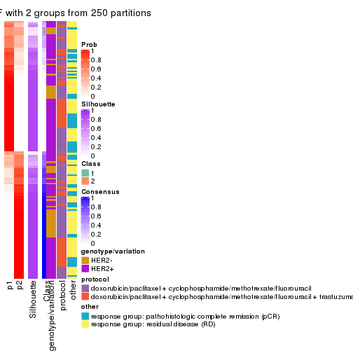</p>

</div>
<div id='tab-MAD-NMF-consensus-heatmap-2'>
<pre><code class="r">consensus_heatmap(res, k = 3)
</code></pre>

<p>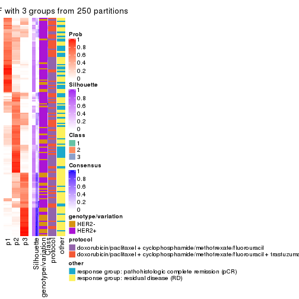</p>

</div>
<div id='tab-MAD-NMF-consensus-heatmap-3'>
<pre><code class="r">consensus_heatmap(res, k = 4)
</code></pre>

<p>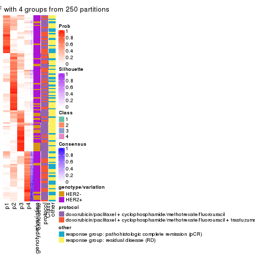</p>

</div>
<div id='tab-MAD-NMF-consensus-heatmap-4'>
<pre><code class="r">consensus_heatmap(res, k = 5)
</code></pre>

<p>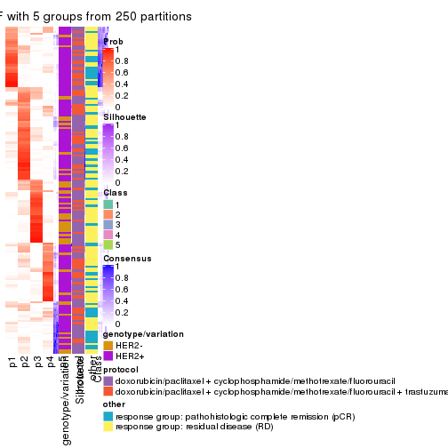</p>

</div>
<div id='tab-MAD-NMF-consensus-heatmap-5'>
<pre><code class="r">consensus_heatmap(res, k = 6)
</code></pre>

<p>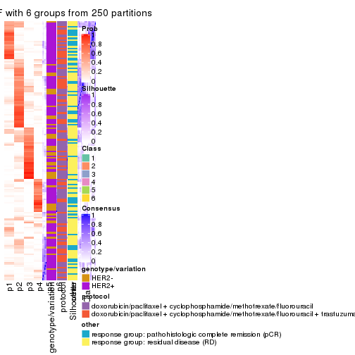</p>

</div>
</div>

Heatmaps for the membership of samples in all partitions to see how consistent they are:


<script>
$( function() {
	$( '#tabs-MAD-NMF-membership-heatmap' ).tabs();
} );
</script>
<div id='tabs-MAD-NMF-membership-heatmap'>
<ul>
<li><a href='#tab-MAD-NMF-membership-heatmap-1'>k = 2</a></li>
<li><a href='#tab-MAD-NMF-membership-heatmap-2'>k = 3</a></li>
<li><a href='#tab-MAD-NMF-membership-heatmap-3'>k = 4</a></li>
<li><a href='#tab-MAD-NMF-membership-heatmap-4'>k = 5</a></li>
<li><a href='#tab-MAD-NMF-membership-heatmap-5'>k = 6</a></li>
</ul>
<div id='tab-MAD-NMF-membership-heatmap-1'>
<pre><code class="r">membership_heatmap(res, k = 2)
</code></pre>

<p>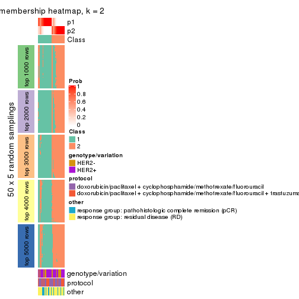</p>

</div>
<div id='tab-MAD-NMF-membership-heatmap-2'>
<pre><code class="r">membership_heatmap(res, k = 3)
</code></pre>

<p>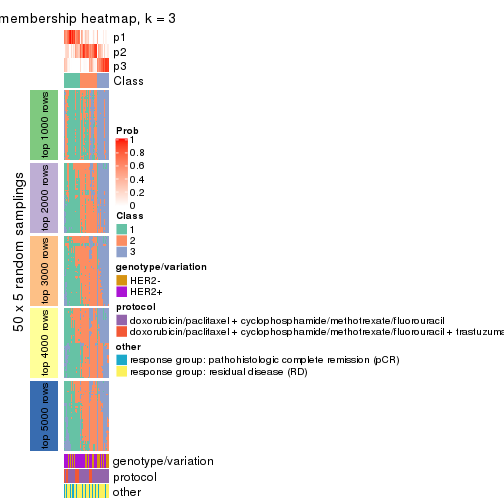</p>

</div>
<div id='tab-MAD-NMF-membership-heatmap-3'>
<pre><code class="r">membership_heatmap(res, k = 4)
</code></pre>

<p>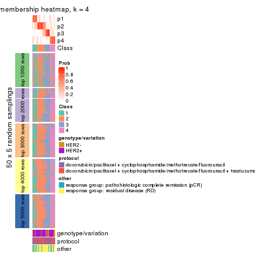</p>

</div>
<div id='tab-MAD-NMF-membership-heatmap-4'>
<pre><code class="r">membership_heatmap(res, k = 5)
</code></pre>

<p>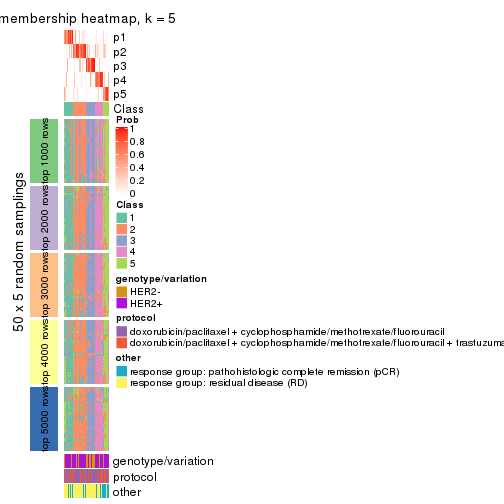</p>

</div>
<div id='tab-MAD-NMF-membership-heatmap-5'>
<pre><code class="r">membership_heatmap(res, k = 6)
</code></pre>

<p>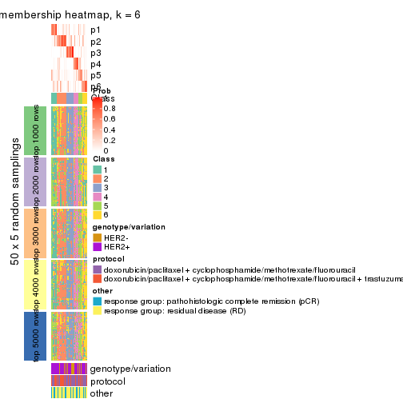</p>

</div>
</div>

As soon as we have had the classes for columns, we can look for signatures
which are significantly different between classes which can be candidate marks
for certain classes. Following are the heatmaps for signatures.


Signature heatmaps where rows are scaled:


<script>
$( function() {
	$( '#tabs-MAD-NMF-get-signatures' ).tabs();
} );
</script>
<div id='tabs-MAD-NMF-get-signatures'>
<ul>
<li><a href='#tab-MAD-NMF-get-signatures-1'>k = 2</a></li>
<li><a href='#tab-MAD-NMF-get-signatures-2'>k = 3</a></li>
<li><a href='#tab-MAD-NMF-get-signatures-3'>k = 4</a></li>
<li><a href='#tab-MAD-NMF-get-signatures-4'>k = 5</a></li>
<li><a href='#tab-MAD-NMF-get-signatures-5'>k = 6</a></li>
</ul>
<div id='tab-MAD-NMF-get-signatures-1'>
<pre><code class="r">get_signatures(res, k = 2)
</code></pre>

<pre><code>#&gt; Error: The width or height of the raster image is zero, maybe you forget to turn off the
#&gt; previous graphic device or it was corrupted. Run `dev.off()` to close it.
</code></pre>

<p></p>

</div>
<div id='tab-MAD-NMF-get-signatures-2'>
<pre><code class="r">get_signatures(res, k = 3)
</code></pre>

<pre><code>#&gt; Error: The width or height of the raster image is zero, maybe you forget to turn off the
#&gt; previous graphic device or it was corrupted. Run `dev.off()` to close it.
</code></pre>

<p></p>

</div>
<div id='tab-MAD-NMF-get-signatures-3'>
<pre><code class="r">get_signatures(res, k = 4)
</code></pre>

<pre><code>#&gt; Error: The width or height of the raster image is zero, maybe you forget to turn off the
#&gt; previous graphic device or it was corrupted. Run `dev.off()` to close it.
</code></pre>

<p></p>

</div>
<div id='tab-MAD-NMF-get-signatures-4'>
<pre><code class="r">get_signatures(res, k = 5)
</code></pre>

<pre><code>#&gt; Error: The width or height of the raster image is zero, maybe you forget to turn off the
#&gt; previous graphic device or it was corrupted. Run `dev.off()` to close it.
</code></pre>

<p></p>

</div>
<div id='tab-MAD-NMF-get-signatures-5'>
<pre><code class="r">get_signatures(res, k = 6)
</code></pre>

<pre><code>#&gt; Error: The width or height of the raster image is zero, maybe you forget to turn off the
#&gt; previous graphic device or it was corrupted. Run `dev.off()` to close it.
</code></pre>

<p></p>

</div>
</div>


Signature heatmaps where rows are not scaled:


<script>
$( function() {
	$( '#tabs-MAD-NMF-get-signatures-no-scale' ).tabs();
} );
</script>
<div id='tabs-MAD-NMF-get-signatures-no-scale'>
<ul>
<li><a href='#tab-MAD-NMF-get-signatures-no-scale-1'>k = 2</a></li>
<li><a href='#tab-MAD-NMF-get-signatures-no-scale-2'>k = 3</a></li>
<li><a href='#tab-MAD-NMF-get-signatures-no-scale-3'>k = 4</a></li>
<li><a href='#tab-MAD-NMF-get-signatures-no-scale-4'>k = 5</a></li>
<li><a href='#tab-MAD-NMF-get-signatures-no-scale-5'>k = 6</a></li>
</ul>
<div id='tab-MAD-NMF-get-signatures-no-scale-1'>
<pre><code class="r">get_signatures(res, k = 2, scale_rows = FALSE)
</code></pre>

<pre><code>#&gt; Error: The width or height of the raster image is zero, maybe you forget to turn off the
#&gt; previous graphic device or it was corrupted. Run `dev.off()` to close it.
</code></pre>

<p></p>

</div>
<div id='tab-MAD-NMF-get-signatures-no-scale-2'>
<pre><code class="r">get_signatures(res, k = 3, scale_rows = FALSE)
</code></pre>

<pre><code>#&gt; Error: The width or height of the raster image is zero, maybe you forget to turn off the
#&gt; previous graphic device or it was corrupted. Run `dev.off()` to close it.
</code></pre>

<p></p>

</div>
<div id='tab-MAD-NMF-get-signatures-no-scale-3'>
<pre><code class="r">get_signatures(res, k = 4, scale_rows = FALSE)
</code></pre>

<pre><code>#&gt; Error: The width or height of the raster image is zero, maybe you forget to turn off the
#&gt; previous graphic device or it was corrupted. Run `dev.off()` to close it.
</code></pre>

<p></p>

</div>
<div id='tab-MAD-NMF-get-signatures-no-scale-4'>
<pre><code class="r">get_signatures(res, k = 5, scale_rows = FALSE)
</code></pre>

<pre><code>#&gt; Error: The width or height of the raster image is zero, maybe you forget to turn off the
#&gt; previous graphic device or it was corrupted. Run `dev.off()` to close it.
</code></pre>

<p></p>

</div>
<div id='tab-MAD-NMF-get-signatures-no-scale-5'>
<pre><code class="r">get_signatures(res, k = 6, scale_rows = FALSE)
</code></pre>

<pre><code>#&gt; Error: The width or height of the raster image is zero, maybe you forget to turn off the
#&gt; previous graphic device or it was corrupted. Run `dev.off()` to close it.
</code></pre>

<p></p>

</div>
</div>


Compare the overlap of signatures from different k:

```r
compare_signatures(res)
```

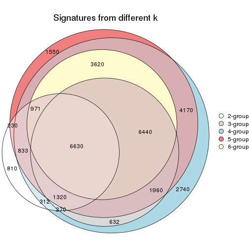

`get_signature()` returns a data frame invisibly. TO get the list of signatures, the function
call should be assigned to a variable explicitly. In following code, if `plot` argument is set
to `FALSE`, no heatmap is plotted while only the differential analysis is performed.

```r
# code only for demonstration
tb = get_signature(res, k = ..., plot = FALSE)
```

An example of the output of `tb` is:

```
#>   which_row         fdr    mean_1    mean_2 scaled_mean_1 scaled_mean_2 km
#> 1        38 0.042760348  8.373488  9.131774    -0.5533452     0.5164555  1
#> 2        40 0.018707592  7.106213  8.469186    -0.6173731     0.5762149  1
#> 3        55 0.019134737 10.221463 11.207825    -0.6159697     0.5749050  1
#> 4        59 0.006059896  5.921854  7.869574    -0.6899429     0.6439467  1
#> 5        60 0.018055526  8.928898 10.211722    -0.6204761     0.5791110  1
#> 6        98 0.009384629 15.714769 14.887706     0.6635654    -0.6193277  2
...
```

The columns in `tb` are:

1. `which_row`: row indices corresponding to the input matrix.
2. `fdr`: FDR for the differential test. 
3. `mean_x`: The mean value in group x.
4. `scaled_mean_x`: The mean value in group x after rows are scaled.
5. `km`: Row groups if k-means clustering is applied to rows.


UMAP plot which shows how samples are separated.


<script>
$( function() {
	$( '#tabs-MAD-NMF-dimension-reduction' ).tabs();
} );
</script>
<div id='tabs-MAD-NMF-dimension-reduction'>
<ul>
<li><a href='#tab-MAD-NMF-dimension-reduction-1'>k = 2</a></li>
<li><a href='#tab-MAD-NMF-dimension-reduction-2'>k = 3</a></li>
<li><a href='#tab-MAD-NMF-dimension-reduction-3'>k = 4</a></li>
<li><a href='#tab-MAD-NMF-dimension-reduction-4'>k = 5</a></li>
<li><a href='#tab-MAD-NMF-dimension-reduction-5'>k = 6</a></li>
</ul>
<div id='tab-MAD-NMF-dimension-reduction-1'>
<pre><code class="r">dimension_reduction(res, k = 2, method = &quot;UMAP&quot;)
</code></pre>

<p>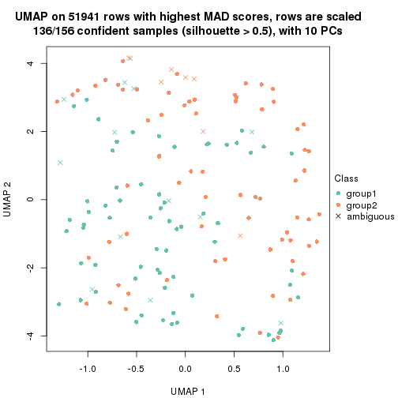</p>

</div>
<div id='tab-MAD-NMF-dimension-reduction-2'>
<pre><code class="r">dimension_reduction(res, k = 3, method = &quot;UMAP&quot;)
</code></pre>

<p>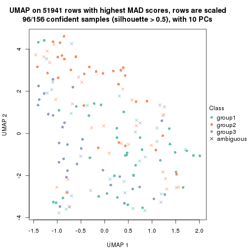</p>

</div>
<div id='tab-MAD-NMF-dimension-reduction-3'>
<pre><code class="r">dimension_reduction(res, k = 4, method = &quot;UMAP&quot;)
</code></pre>

<p>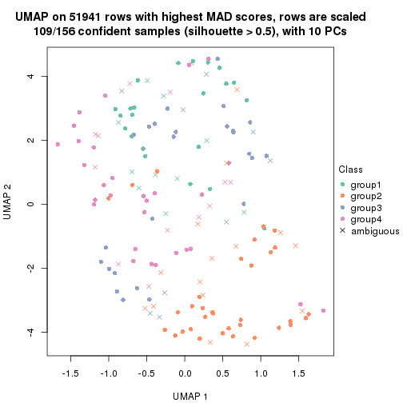</p>

</div>
<div id='tab-MAD-NMF-dimension-reduction-4'>
<pre><code class="r">dimension_reduction(res, k = 5, method = &quot;UMAP&quot;)
</code></pre>

<p>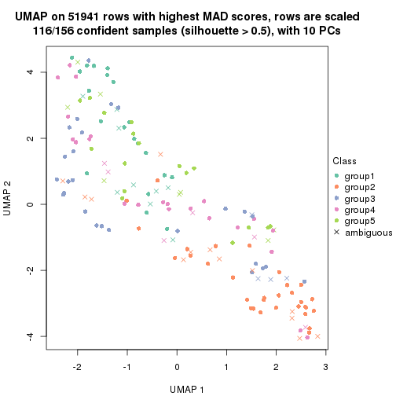</p>

</div>
<div id='tab-MAD-NMF-dimension-reduction-5'>
<pre><code class="r">dimension_reduction(res, k = 6, method = &quot;UMAP&quot;)
</code></pre>

<p></p>

</div>
</div>


Following heatmap shows how subgroups are split when increasing `k`:

```r
collect_classes(res)
```

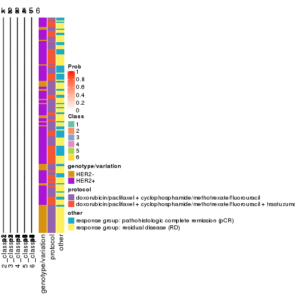


Test correlation between subgroups and known annotations. If the known
annotation is numeric, one-way ANOVA test is applied, and if the known
annotation is discrete, chi-squared contingency table test is applied.

```r
test_to_known_factors(res)
```

```
#>           n genotype/variation(p) protocol(p) other(p) k
#> MAD:NMF 136              1.28e-02     0.24475  0.18363 2
#> MAD:NMF  96              8.47e-04     0.31453  0.03595 3
#> MAD:NMF 109              4.41e-05     0.04471  0.04316 4
#> MAD:NMF 116              3.24e-06     0.00866  0.00761 5
#> MAD:NMF  70              2.48e-03     0.06671  0.06669 6
```


If matrix rows can be associated to genes, consider to use `functional_enrichment(res,
...)` to perform function enrichment for the signature genes. See [this vignette](http://bioconductor.org/packages/devel/bioc/vignettes/cola/inst/doc/functional_enrichment.html) for more detailed explanations.


 

---------------------------------------------------


### ATC:hclust


The object with results only for a single top-value method and a single partition method 
can be extracted as:

```r
res = res_list["ATC", "hclust"]
# you can also extract it by
# res = res_list["ATC:hclust"]
```

A summary of `res` and all the functions that can be applied to it:

```r
res
```

```
#> A 'ConsensusPartition' object with k = 2, 3, 4, 5, 6.
#>   On a matrix with 51941 rows and 156 columns.
#>   Top rows (1000, 2000, 3000, 4000, 5000) are extracted by 'ATC' method.
#>   Subgroups are detected by 'hclust' method.
#>   Performed in total 1250 partitions by row resampling.
#>   Best k for subgroups seems to be 2.
#> 
#> Following methods can be applied to this 'ConsensusPartition' object:
#>  [1] "cola_report"             "collect_classes"         "collect_plots"          
#>  [4] "collect_stats"           "colnames"                "compare_signatures"     
#>  [7] "consensus_heatmap"       "dimension_reduction"     "functional_enrichment"  
#> [10] "get_anno_col"            "get_anno"                "get_classes"            
#> [13] "get_consensus"           "get_matrix"              "get_membership"         
#> [16] "get_param"               "get_signatures"          "get_stats"              
#> [19] "is_best_k"               "is_stable_k"             "membership_heatmap"     
#> [22] "ncol"                    "nrow"                    "plot_ecdf"              
#> [25] "rownames"                "select_partition_number" "show"                   
#> [28] "suggest_best_k"          "test_to_known_factors"
```

`collect_plots()` function collects all the plots made from `res` for all `k` (number of partitions)
into one single page to provide an easy and fast comparison between different `k`.

```r
collect_plots(res)
```

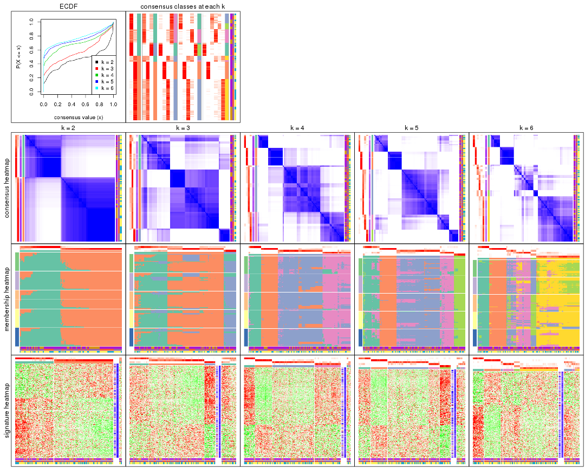

The plots are:

- The first row: a plot of the ECDF (empirical cumulative distribution
  function) curves of the consensus matrix for each `k` and the heatmap of
  predicted classes for each `k`.
- The second row: heatmaps of the consensus matrix for each `k`.
- The third row: heatmaps of the membership matrix for each `k`.
- The fouth row: heatmaps of the signatures for each `k`.

All the plots in panels can be made by individual functions and they are
plotted later in this section.

`select_partition_number()` produces several plots showing different
statistics for choosing "optimized" `k`. There are following statistics:

- ECDF curves of the consensus matrix for each `k`;
- 1-PAC. [The PAC
  score](https://en.wikipedia.org/wiki/Consensus_clustering#Over-interpretation_potential_of_consensus_clustering)
  measures the proportion of the ambiguous subgrouping.
- Mean silhouette score.
- Concordance. The mean probability of fiting the consensus class ids in all
  partitions.
- Area increased. Denote $A_k$ as the area under the ECDF curve for current
  `k`, the area increased is defined as $A_k - A_{k-1}$.
- Rand index. The percent of pairs of samples that are both in a same cluster
  or both are not in a same cluster in the partition of k and k-1.
- Jaccard index. The ratio of pairs of samples are both in a same cluster in
  the partition of k and k-1 and the pairs of samples are both in a same
  cluster in the partition k or k-1.

The detailed explanations of these statistics can be found in [the _cola_
vignette](http://bioconductor.org/packages/devel/bioc/vignettes/cola/inst/doc/cola.html#toc_13).

Generally speaking, lower PAC score, higher mean silhouette score or higher
concordance corresponds to better partition. Rand index and Jaccard index
measure how similar the current partition is compared to partition with `k-1`.
If they are too similar, we won't accept `k` is better than `k-1`.

```r
select_partition_number(res)
```

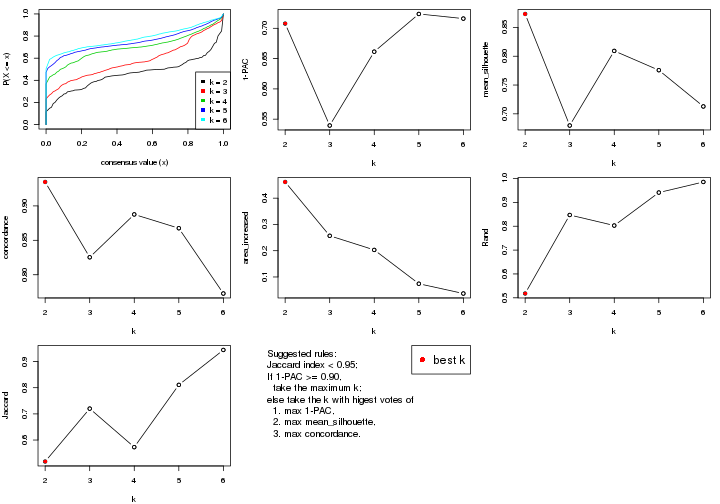

The numeric values for all these statistics can be obtained by `get_stats()`.

```r
get_stats(res)
```

```
#>   k 1-PAC mean_silhouette concordance area_increased  Rand Jaccard
#> 2 2 0.708           0.873       0.935         0.4618 0.518   0.518
#> 3 3 0.540           0.680       0.825         0.2568 0.847   0.720
#> 4 4 0.661           0.809       0.888         0.2030 0.803   0.573
#> 5 5 0.724           0.776       0.868         0.0743 0.941   0.811
#> 6 6 0.716           0.713       0.773         0.0370 0.985   0.944
```

`suggest_best_k()` suggests the best $k$ based on these statistics. The rules are as follows:

- All $k$ with Jaccard index larger than 0.95 are removed because increasing
  $k$ does not provide enough extra information. If all $k$ are removed, it is
  marked as no subgroup is detected.
- For all $k$ with 1-PAC score larger than 0.9, the maximal $k$ is taken as
  the best $k$, and other $k$ are marked as optional $k$.
- If it does not fit the second rule. The $k$ with the maximal vote of the
  highest 1-PAC score, highest mean silhouette, and highest concordance is
  taken as the best $k$.

```r
suggest_best_k(res)
```

```
#> [1] 2
```


Following shows the table of the partitions (You need to click the **show/hide
code output** link to see it). The membership matrix (columns with name `p*`)
is inferred by
[`clue::cl_consensus()`](https://www.rdocumentation.org/link/cl_consensus?package=clue)
function with the `SE` method. Basically the value in the membership matrix
represents the probability to belong to a certain group. The finall class
label for an item is determined with the group with highest probability it
belongs to.

In `get_classes()` function, the entropy is calculated from the membership
matrix and the silhouette score is calculated from the consensus matrix.


<script>
$( function() {
	$( '#tabs-ATC-hclust-get-classes' ).tabs();
} );
</script>
<div id='tabs-ATC-hclust-get-classes'>
<ul>
<li><a href='#tab-ATC-hclust-get-classes-1'>k = 2</a></li>
<li><a href='#tab-ATC-hclust-get-classes-2'>k = 3</a></li>
<li><a href='#tab-ATC-hclust-get-classes-3'>k = 4</a></li>
<li><a href='#tab-ATC-hclust-get-classes-4'>k = 5</a></li>
<li><a href='#tab-ATC-hclust-get-classes-5'>k = 6</a></li>
</ul>

<div id='tab-ATC-hclust-get-classes-1'>
<p><a id='tab-ATC-hclust-get-classes-1-a' style='color:#0366d6' href='#'>show/hide code output</a></p>
<pre><code class="r">cbind(get_classes(res, k = 2), get_membership(res, k = 2))
</code></pre>

<pre><code>#&gt;            class entropy silhouette    p1    p2
#&gt; GSM1232995     2  0.0000     0.9456 0.000 1.000
#&gt; GSM1233002     1  0.3274     0.8792 0.940 0.060
#&gt; GSM1233003     1  0.0000     0.8973 1.000 0.000
#&gt; GSM1233014     2  0.2423     0.9374 0.040 0.960
#&gt; GSM1233015     1  0.8016     0.7348 0.756 0.244
#&gt; GSM1233016     2  0.7139     0.7792 0.196 0.804
#&gt; GSM1233024     2  0.0000     0.9456 0.000 1.000
#&gt; GSM1233049     1  0.0000     0.8973 1.000 0.000
#&gt; GSM1233064     2  0.3431     0.9256 0.064 0.936
#&gt; GSM1233068     2  0.5059     0.8858 0.112 0.888
#&gt; GSM1233073     2  0.9970     0.0364 0.468 0.532
#&gt; GSM1233093     1  0.0000     0.8973 1.000 0.000
#&gt; GSM1233115     1  0.1414     0.8942 0.980 0.020
#&gt; GSM1232992     2  0.0000     0.9456 0.000 1.000
#&gt; GSM1232993     2  0.3274     0.9279 0.060 0.940
#&gt; GSM1233005     2  0.0000     0.9456 0.000 1.000
#&gt; GSM1233007     2  0.3114     0.9301 0.056 0.944
#&gt; GSM1233010     1  0.9963     0.2237 0.536 0.464
#&gt; GSM1233013     2  0.0000     0.9456 0.000 1.000
#&gt; GSM1233018     2  0.0000     0.9456 0.000 1.000
#&gt; GSM1233019     2  0.0000     0.9456 0.000 1.000
#&gt; GSM1233021     2  0.0000     0.9456 0.000 1.000
#&gt; GSM1233025     1  0.7745     0.7536 0.772 0.228
#&gt; GSM1233029     2  0.1843     0.9411 0.028 0.972
#&gt; GSM1233030     2  0.0000     0.9456 0.000 1.000
#&gt; GSM1233031     2  0.7299     0.7665 0.204 0.796
#&gt; GSM1233032     1  0.0000     0.8973 1.000 0.000
#&gt; GSM1233035     2  0.4562     0.9014 0.096 0.904
#&gt; GSM1233038     1  0.0000     0.8973 1.000 0.000
#&gt; GSM1233039     2  0.3879     0.9176 0.076 0.924
#&gt; GSM1233042     2  0.3584     0.9233 0.068 0.932
#&gt; GSM1233043     2  0.3584     0.9233 0.068 0.932
#&gt; GSM1233044     1  0.6343     0.8140 0.840 0.160
#&gt; GSM1233046     1  0.9170     0.5907 0.668 0.332
#&gt; GSM1233051     1  0.1414     0.8942 0.980 0.020
#&gt; GSM1233054     1  0.8713     0.6637 0.708 0.292
#&gt; GSM1233057     2  0.3879     0.9176 0.076 0.924
#&gt; GSM1233060     2  0.4562     0.9010 0.096 0.904
#&gt; GSM1233062     2  0.1843     0.9411 0.028 0.972
#&gt; GSM1233075     2  0.0000     0.9456 0.000 1.000
#&gt; GSM1233078     2  0.9896     0.1545 0.440 0.560
#&gt; GSM1233079     1  0.0000     0.8973 1.000 0.000
#&gt; GSM1233082     1  0.7883     0.7446 0.764 0.236
#&gt; GSM1233083     1  0.0000     0.8973 1.000 0.000
#&gt; GSM1233091     1  0.9000     0.6220 0.684 0.316
#&gt; GSM1233095     1  0.0000     0.8973 1.000 0.000
#&gt; GSM1233096     1  0.0000     0.8973 1.000 0.000
#&gt; GSM1233101     1  0.0000     0.8973 1.000 0.000
#&gt; GSM1233105     1  0.7745     0.7536 0.772 0.228
#&gt; GSM1233117     2  0.0000     0.9456 0.000 1.000
#&gt; GSM1233118     2  0.0000     0.9456 0.000 1.000
#&gt; GSM1233001     2  0.0000     0.9456 0.000 1.000
#&gt; GSM1233006     2  0.0000     0.9456 0.000 1.000
#&gt; GSM1233008     2  0.0000     0.9456 0.000 1.000
#&gt; GSM1233009     2  0.0000     0.9456 0.000 1.000
#&gt; GSM1233017     2  0.0000     0.9456 0.000 1.000
#&gt; GSM1233020     2  0.0000     0.9456 0.000 1.000
#&gt; GSM1233022     2  0.2043     0.9401 0.032 0.968
#&gt; GSM1233026     2  0.7299     0.7667 0.204 0.796
#&gt; GSM1233028     2  0.8144     0.6817 0.252 0.748
#&gt; GSM1233034     2  0.0000     0.9456 0.000 1.000
#&gt; GSM1233040     1  0.0000     0.8973 1.000 0.000
#&gt; GSM1233048     1  0.0000     0.8973 1.000 0.000
#&gt; GSM1233056     1  0.0000     0.8973 1.000 0.000
#&gt; GSM1233058     2  0.7602     0.7405 0.220 0.780
#&gt; GSM1233059     1  0.0000     0.8973 1.000 0.000
#&gt; GSM1233066     2  0.4161     0.9113 0.084 0.916
#&gt; GSM1233071     2  0.2043     0.9401 0.032 0.968
#&gt; GSM1233074     2  0.0000     0.9456 0.000 1.000
#&gt; GSM1233076     2  0.2043     0.9401 0.032 0.968
#&gt; GSM1233080     1  0.0000     0.8973 1.000 0.000
#&gt; GSM1233088     2  0.4562     0.9010 0.096 0.904
#&gt; GSM1233090     1  0.0000     0.8973 1.000 0.000
#&gt; GSM1233092     2  0.0000     0.9456 0.000 1.000
#&gt; GSM1233094     2  0.3274     0.9279 0.060 0.940
#&gt; GSM1233097     2  0.3431     0.9256 0.064 0.936
#&gt; GSM1233100     1  0.8207     0.7186 0.744 0.256
#&gt; GSM1233104     2  0.2423     0.9374 0.040 0.960
#&gt; GSM1233106     1  0.8081     0.7297 0.752 0.248
#&gt; GSM1233111     1  0.0000     0.8973 1.000 0.000
#&gt; GSM1233122     2  0.0000     0.9456 0.000 1.000
#&gt; GSM1233146     2  0.4022     0.9145 0.080 0.920
#&gt; GSM1232994     2  0.0000     0.9456 0.000 1.000
#&gt; GSM1232996     2  0.0000     0.9456 0.000 1.000
#&gt; GSM1232997     2  0.0000     0.9456 0.000 1.000
#&gt; GSM1232998     2  0.0000     0.9456 0.000 1.000
#&gt; GSM1232999     2  0.0000     0.9456 0.000 1.000
#&gt; GSM1233000     2  0.0000     0.9456 0.000 1.000
#&gt; GSM1233004     1  0.2236     0.8892 0.964 0.036
#&gt; GSM1233011     2  0.2423     0.9374 0.040 0.960
#&gt; GSM1233012     2  0.0000     0.9456 0.000 1.000
#&gt; GSM1233023     2  0.0000     0.9456 0.000 1.000
#&gt; GSM1233027     2  0.0000     0.9456 0.000 1.000
#&gt; GSM1233033     1  0.0000     0.8973 1.000 0.000
#&gt; GSM1233036     2  0.3114     0.9303 0.056 0.944
#&gt; GSM1233037     2  0.7376     0.7591 0.208 0.792
#&gt; GSM1233041     1  0.0000     0.8973 1.000 0.000
#&gt; GSM1233045     2  0.3431     0.9256 0.064 0.936
#&gt; GSM1233047     1  0.2778     0.8846 0.952 0.048
#&gt; GSM1233050     1  0.0000     0.8973 1.000 0.000
#&gt; GSM1233052     1  0.1184     0.8950 0.984 0.016
#&gt; GSM1233053     1  0.0000     0.8973 1.000 0.000
#&gt; GSM1233055     1  0.0000     0.8973 1.000 0.000
#&gt; GSM1233061     1  0.9129     0.5989 0.672 0.328
#&gt; GSM1233063     1  0.0000     0.8973 1.000 0.000
#&gt; GSM1233065     2  0.0000     0.9456 0.000 1.000
#&gt; GSM1233070     2  0.0000     0.9456 0.000 1.000
#&gt; GSM1233077     2  0.1843     0.9411 0.028 0.972
#&gt; GSM1233081     1  0.7745     0.7537 0.772 0.228
#&gt; GSM1233084     1  0.0000     0.8973 1.000 0.000
#&gt; GSM1233087     1  0.7950     0.7398 0.760 0.240
#&gt; GSM1233089     2  0.0000     0.9456 0.000 1.000
#&gt; GSM1233099     1  0.9000     0.6220 0.684 0.316
#&gt; GSM1233112     1  0.0000     0.8973 1.000 0.000
#&gt; GSM1233085     1  0.2423     0.8878 0.960 0.040
#&gt; GSM1233098     2  0.0000     0.9456 0.000 1.000
#&gt; GSM1233114     1  0.0000     0.8973 1.000 0.000
#&gt; GSM1233119     1  0.9933     0.2661 0.548 0.452
#&gt; GSM1233129     2  0.0000     0.9456 0.000 1.000
#&gt; GSM1233132     1  0.2948     0.8828 0.948 0.052
#&gt; GSM1233139     2  0.0000     0.9456 0.000 1.000
#&gt; GSM1233143     2  0.0000     0.9456 0.000 1.000
#&gt; GSM1233145     1  0.0000     0.8973 1.000 0.000
#&gt; GSM1233067     2  0.0000     0.9456 0.000 1.000
#&gt; GSM1233069     2  0.0000     0.9456 0.000 1.000
#&gt; GSM1233072     2  0.0000     0.9456 0.000 1.000
#&gt; GSM1233086     2  0.2423     0.9374 0.040 0.960
#&gt; GSM1233102     1  0.0672     0.8964 0.992 0.008
#&gt; GSM1233103     2  0.4562     0.9013 0.096 0.904
#&gt; GSM1233107     2  0.4161     0.9113 0.084 0.916
#&gt; GSM1233108     1  0.0000     0.8973 1.000 0.000
#&gt; GSM1233109     1  0.1414     0.8942 0.980 0.020
#&gt; GSM1233110     2  0.5629     0.8631 0.132 0.868
#&gt; GSM1233113     2  0.0000     0.9456 0.000 1.000
#&gt; GSM1233116     2  0.0000     0.9456 0.000 1.000
#&gt; GSM1233120     1  0.7950     0.7400 0.760 0.240
#&gt; GSM1233121     2  0.2423     0.9374 0.040 0.960
#&gt; GSM1233123     2  0.5178     0.8808 0.116 0.884
#&gt; GSM1233124     2  0.3431     0.9258 0.064 0.936
#&gt; GSM1233125     1  0.0000     0.8973 1.000 0.000
#&gt; GSM1233126     2  0.2043     0.9401 0.032 0.968
#&gt; GSM1233127     2  0.0000     0.9456 0.000 1.000
#&gt; GSM1233128     1  0.0000     0.8973 1.000 0.000
#&gt; GSM1233130     2  0.4690     0.8972 0.100 0.900
#&gt; GSM1233131     1  0.7745     0.7536 0.772 0.228
#&gt; GSM1233133     1  0.2778     0.8846 0.952 0.048
#&gt; GSM1233134     2  0.0000     0.9456 0.000 1.000
#&gt; GSM1233135     2  0.0672     0.9447 0.008 0.992
#&gt; GSM1233136     2  0.2043     0.9401 0.032 0.968
#&gt; GSM1233137     1  0.5294     0.8435 0.880 0.120
#&gt; GSM1233138     2  0.0672     0.9447 0.008 0.992
#&gt; GSM1233140     1  0.0376     0.8968 0.996 0.004
#&gt; GSM1233141     2  0.0000     0.9456 0.000 1.000
#&gt; GSM1233142     2  0.0000     0.9456 0.000 1.000
#&gt; GSM1233144     1  0.5294     0.8435 0.880 0.120
#&gt; GSM1233147     2  0.0376     0.9452 0.004 0.996
</code></pre>

<script>
$('#tab-ATC-hclust-get-classes-1-a').parent().next().next().hide();
$('#tab-ATC-hclust-get-classes-1-a').click(function(){
  $('#tab-ATC-hclust-get-classes-1-a').parent().next().next().toggle();
  return(false);
});
</script>
</div>

<div id='tab-ATC-hclust-get-classes-2'>
<p><a id='tab-ATC-hclust-get-classes-2-a' style='color:#0366d6' href='#'>show/hide code output</a></p>
<pre><code class="r">cbind(get_classes(res, k = 3), get_membership(res, k = 3))
</code></pre>

<pre><code>#&gt;            class entropy silhouette    p1    p2    p3
#&gt; GSM1232995     2  0.0237      0.777 0.004 0.996 0.000
#&gt; GSM1233002     1  0.5254      0.576 0.736 0.000 0.264
#&gt; GSM1233003     3  0.0424      0.947 0.008 0.000 0.992
#&gt; GSM1233014     2  0.5497      0.814 0.292 0.708 0.000
#&gt; GSM1233015     1  0.2496      0.630 0.928 0.004 0.068
#&gt; GSM1233016     1  0.6309     -0.559 0.504 0.496 0.000
#&gt; GSM1233024     2  0.4399      0.843 0.188 0.812 0.000
#&gt; GSM1233049     3  0.0000      0.949 0.000 0.000 1.000
#&gt; GSM1233064     2  0.5988      0.763 0.368 0.632 0.000
#&gt; GSM1233068     2  0.6192      0.703 0.420 0.580 0.000
#&gt; GSM1233073     1  0.4842      0.289 0.776 0.224 0.000
#&gt; GSM1233093     3  0.0000      0.949 0.000 0.000 1.000
#&gt; GSM1233115     1  0.5678      0.533 0.684 0.000 0.316
#&gt; GSM1232992     2  0.0237      0.777 0.004 0.996 0.000
#&gt; GSM1232993     2  0.5926      0.773 0.356 0.644 0.000
#&gt; GSM1233005     2  0.0237      0.777 0.004 0.996 0.000
#&gt; GSM1233007     2  0.5905      0.776 0.352 0.648 0.000
#&gt; GSM1233010     1  0.5627      0.446 0.780 0.188 0.032
#&gt; GSM1233013     2  0.0237      0.777 0.004 0.996 0.000
#&gt; GSM1233018     2  0.0237      0.777 0.004 0.996 0.000
#&gt; GSM1233019     2  0.0237      0.777 0.004 0.996 0.000
#&gt; GSM1233021     2  0.0237      0.777 0.004 0.996 0.000
#&gt; GSM1233025     1  0.2625      0.632 0.916 0.000 0.084
#&gt; GSM1233029     2  0.5138      0.830 0.252 0.748 0.000
#&gt; GSM1233030     2  0.0000      0.779 0.000 1.000 0.000
#&gt; GSM1233031     1  0.6307     -0.538 0.512 0.488 0.000
#&gt; GSM1233032     3  0.2356      0.879 0.072 0.000 0.928
#&gt; GSM1233035     2  0.6140      0.726 0.404 0.596 0.000
#&gt; GSM1233038     3  0.0000      0.949 0.000 0.000 1.000
#&gt; GSM1233039     2  0.6045      0.751 0.380 0.620 0.000
#&gt; GSM1233042     2  0.6026      0.756 0.376 0.624 0.000
#&gt; GSM1233043     2  0.6026      0.756 0.376 0.624 0.000
#&gt; GSM1233044     1  0.3879      0.619 0.848 0.000 0.152
#&gt; GSM1233046     1  0.1031      0.590 0.976 0.024 0.000
#&gt; GSM1233051     1  0.5650      0.537 0.688 0.000 0.312
#&gt; GSM1233054     1  0.1453      0.610 0.968 0.008 0.024
#&gt; GSM1233057     2  0.6062      0.747 0.384 0.616 0.000
#&gt; GSM1233060     2  0.6140      0.724 0.404 0.596 0.000
#&gt; GSM1233062     2  0.5397      0.821 0.280 0.720 0.000
#&gt; GSM1233075     2  0.4178      0.841 0.172 0.828 0.000
#&gt; GSM1233078     1  0.6161      0.202 0.708 0.272 0.020
#&gt; GSM1233079     1  0.5926      0.484 0.644 0.000 0.356
#&gt; GSM1233082     1  0.2448      0.631 0.924 0.000 0.076
#&gt; GSM1233083     1  0.6307      0.203 0.512 0.000 0.488
#&gt; GSM1233091     1  0.0829      0.599 0.984 0.012 0.004
#&gt; GSM1233095     3  0.0000      0.949 0.000 0.000 1.000
#&gt; GSM1233096     1  0.5926      0.484 0.644 0.000 0.356
#&gt; GSM1233101     3  0.5560      0.468 0.300 0.000 0.700
#&gt; GSM1233105     1  0.2625      0.632 0.916 0.000 0.084
#&gt; GSM1233117     2  0.0237      0.781 0.004 0.996 0.000
#&gt; GSM1233118     2  0.0237      0.781 0.004 0.996 0.000
#&gt; GSM1233001     2  0.0237      0.777 0.004 0.996 0.000
#&gt; GSM1233006     2  0.4399      0.843 0.188 0.812 0.000
#&gt; GSM1233008     2  0.4399      0.843 0.188 0.812 0.000
#&gt; GSM1233009     2  0.3412      0.827 0.124 0.876 0.000
#&gt; GSM1233017     2  0.0237      0.781 0.004 0.996 0.000
#&gt; GSM1233020     2  0.0237      0.777 0.004 0.996 0.000
#&gt; GSM1233022     2  0.5138      0.830 0.252 0.748 0.000
#&gt; GSM1233026     1  0.6307     -0.540 0.512 0.488 0.000
#&gt; GSM1233028     1  0.6244     -0.424 0.560 0.440 0.000
#&gt; GSM1233034     2  0.4399      0.843 0.188 0.812 0.000
#&gt; GSM1233040     3  0.0424      0.947 0.008 0.000 0.992
#&gt; GSM1233048     3  0.0424      0.947 0.008 0.000 0.992
#&gt; GSM1233056     3  0.0000      0.949 0.000 0.000 1.000
#&gt; GSM1233058     1  0.6295     -0.502 0.528 0.472 0.000
#&gt; GSM1233059     3  0.0000      0.949 0.000 0.000 1.000
#&gt; GSM1233066     2  0.6095      0.739 0.392 0.608 0.000
#&gt; GSM1233071     2  0.5138      0.830 0.252 0.748 0.000
#&gt; GSM1233074     2  0.4291      0.842 0.180 0.820 0.000
#&gt; GSM1233076     2  0.5216      0.828 0.260 0.740 0.000
#&gt; GSM1233080     3  0.0000      0.949 0.000 0.000 1.000
#&gt; GSM1233088     2  0.6140      0.724 0.404 0.596 0.000
#&gt; GSM1233090     3  0.0000      0.949 0.000 0.000 1.000
#&gt; GSM1233092     2  0.4452      0.843 0.192 0.808 0.000
#&gt; GSM1233094     2  0.5968      0.767 0.364 0.636 0.000
#&gt; GSM1233097     2  0.5988      0.763 0.368 0.632 0.000
#&gt; GSM1233100     1  0.2200      0.626 0.940 0.004 0.056
#&gt; GSM1233104     2  0.5560      0.810 0.300 0.700 0.000
#&gt; GSM1233106     1  0.2165      0.629 0.936 0.000 0.064
#&gt; GSM1233111     1  0.5926      0.484 0.644 0.000 0.356
#&gt; GSM1233122     2  0.0237      0.777 0.004 0.996 0.000
#&gt; GSM1233146     2  0.6079      0.743 0.388 0.612 0.000
#&gt; GSM1232994     2  0.0237      0.777 0.004 0.996 0.000
#&gt; GSM1232996     2  0.0237      0.777 0.004 0.996 0.000
#&gt; GSM1232997     2  0.4399      0.843 0.188 0.812 0.000
#&gt; GSM1232998     2  0.0237      0.777 0.004 0.996 0.000
#&gt; GSM1232999     2  0.4399      0.843 0.188 0.812 0.000
#&gt; GSM1233000     2  0.4399      0.843 0.188 0.812 0.000
#&gt; GSM1233004     1  0.5497      0.557 0.708 0.000 0.292
#&gt; GSM1233011     2  0.5497      0.814 0.292 0.708 0.000
#&gt; GSM1233012     2  0.4399      0.843 0.188 0.812 0.000
#&gt; GSM1233023     2  0.4399      0.843 0.188 0.812 0.000
#&gt; GSM1233027     2  0.0237      0.777 0.004 0.996 0.000
#&gt; GSM1233033     1  0.5810      0.501 0.664 0.000 0.336
#&gt; GSM1233036     2  0.5835      0.785 0.340 0.660 0.000
#&gt; GSM1233037     1  0.6305     -0.528 0.516 0.484 0.000
#&gt; GSM1233041     3  0.0000      0.949 0.000 0.000 1.000
#&gt; GSM1233045     2  0.5988      0.763 0.368 0.632 0.000
#&gt; GSM1233047     1  0.5291      0.573 0.732 0.000 0.268
#&gt; GSM1233050     3  0.0424      0.947 0.008 0.000 0.992
#&gt; GSM1233052     1  0.5706      0.525 0.680 0.000 0.320
#&gt; GSM1233053     1  0.6168      0.391 0.588 0.000 0.412
#&gt; GSM1233055     3  0.0424      0.947 0.008 0.000 0.992
#&gt; GSM1233061     1  0.1267      0.592 0.972 0.024 0.004
#&gt; GSM1233063     1  0.5926      0.484 0.644 0.000 0.356
#&gt; GSM1233065     2  0.0237      0.777 0.004 0.996 0.000
#&gt; GSM1233070     2  0.4399      0.843 0.188 0.812 0.000
#&gt; GSM1233077     2  0.5058      0.832 0.244 0.756 0.000
#&gt; GSM1233081     1  0.2625      0.631 0.916 0.000 0.084
#&gt; GSM1233084     3  0.0000      0.949 0.000 0.000 1.000
#&gt; GSM1233087     1  0.2356      0.631 0.928 0.000 0.072
#&gt; GSM1233089     2  0.0237      0.777 0.004 0.996 0.000
#&gt; GSM1233099     1  0.0829      0.599 0.984 0.012 0.004
#&gt; GSM1233112     1  0.6154      0.401 0.592 0.000 0.408
#&gt; GSM1233085     1  0.5363      0.566 0.724 0.000 0.276
#&gt; GSM1233098     2  0.3879      0.836 0.152 0.848 0.000
#&gt; GSM1233114     1  0.5926      0.484 0.644 0.000 0.356
#&gt; GSM1233119     1  0.5467      0.470 0.792 0.176 0.032
#&gt; GSM1233129     2  0.4399      0.843 0.188 0.812 0.000
#&gt; GSM1233132     1  0.5216      0.578 0.740 0.000 0.260
#&gt; GSM1233139     2  0.4399      0.843 0.188 0.812 0.000
#&gt; GSM1233143     2  0.4346      0.843 0.184 0.816 0.000
#&gt; GSM1233145     3  0.5497      0.489 0.292 0.000 0.708
#&gt; GSM1233067     2  0.0237      0.777 0.004 0.996 0.000
#&gt; GSM1233069     2  0.4291      0.842 0.180 0.820 0.000
#&gt; GSM1233072     2  0.0000      0.779 0.000 1.000 0.000
#&gt; GSM1233086     2  0.5560      0.810 0.300 0.700 0.000
#&gt; GSM1233102     1  0.5835      0.505 0.660 0.000 0.340
#&gt; GSM1233103     2  0.6140      0.725 0.404 0.596 0.000
#&gt; GSM1233107     2  0.6095      0.739 0.392 0.608 0.000
#&gt; GSM1233108     1  0.5926      0.484 0.644 0.000 0.356
#&gt; GSM1233109     1  0.5621      0.539 0.692 0.000 0.308
#&gt; GSM1233110     2  0.6244      0.669 0.440 0.560 0.000
#&gt; GSM1233113     2  0.0237      0.777 0.004 0.996 0.000
#&gt; GSM1233116     2  0.0237      0.777 0.004 0.996 0.000
#&gt; GSM1233120     1  0.2356      0.631 0.928 0.000 0.072
#&gt; GSM1233121     2  0.5560      0.810 0.300 0.700 0.000
#&gt; GSM1233123     2  0.6204      0.696 0.424 0.576 0.000
#&gt; GSM1233124     2  0.6008      0.760 0.372 0.628 0.000
#&gt; GSM1233125     1  0.6079      0.431 0.612 0.000 0.388
#&gt; GSM1233126     2  0.5216      0.828 0.260 0.740 0.000
#&gt; GSM1233127     2  0.4346      0.843 0.184 0.816 0.000
#&gt; GSM1233128     3  0.0000      0.949 0.000 0.000 1.000
#&gt; GSM1233130     2  0.6154      0.719 0.408 0.592 0.000
#&gt; GSM1233131     1  0.2625      0.632 0.916 0.000 0.084
#&gt; GSM1233133     1  0.5254      0.575 0.736 0.000 0.264
#&gt; GSM1233134     2  0.4399      0.843 0.188 0.812 0.000
#&gt; GSM1233135     2  0.4605      0.842 0.204 0.796 0.000
#&gt; GSM1233136     2  0.5098      0.831 0.248 0.752 0.000
#&gt; GSM1233137     1  0.4452      0.608 0.808 0.000 0.192
#&gt; GSM1233138     2  0.4605      0.842 0.204 0.796 0.000
#&gt; GSM1233140     1  0.5905      0.491 0.648 0.000 0.352
#&gt; GSM1233141     2  0.0237      0.777 0.004 0.996 0.000
#&gt; GSM1233142     2  0.0237      0.777 0.004 0.996 0.000
#&gt; GSM1233144     1  0.4452      0.609 0.808 0.000 0.192
#&gt; GSM1233147     2  0.4452      0.843 0.192 0.808 0.000
</code></pre>

<script>
$('#tab-ATC-hclust-get-classes-2-a').parent().next().next().hide();
$('#tab-ATC-hclust-get-classes-2-a').click(function(){
  $('#tab-ATC-hclust-get-classes-2-a').parent().next().next().toggle();
  return(false);
});
</script>
</div>

<div id='tab-ATC-hclust-get-classes-3'>
<p><a id='tab-ATC-hclust-get-classes-3-a' style='color:#0366d6' href='#'>show/hide code output</a></p>
<pre><code class="r">cbind(get_classes(res, k = 4), get_membership(res, k = 4))
</code></pre>

<pre><code>#&gt;            class entropy silhouette    p1    p2    p3    p4
#&gt; GSM1232995     2  0.0000    0.98907 0.000 1.000 0.000 0.000
#&gt; GSM1233002     4  0.2411    0.79513 0.040 0.000 0.040 0.920
#&gt; GSM1233003     1  0.0707    0.92660 0.980 0.000 0.000 0.020
#&gt; GSM1233014     3  0.2011    0.85404 0.000 0.080 0.920 0.000
#&gt; GSM1233015     4  0.3764    0.75437 0.000 0.000 0.216 0.784
#&gt; GSM1233016     3  0.3219    0.70811 0.000 0.000 0.836 0.164
#&gt; GSM1233024     3  0.3649    0.81197 0.000 0.204 0.796 0.000
#&gt; GSM1233049     1  0.0000    0.93209 1.000 0.000 0.000 0.000
#&gt; GSM1233064     3  0.0376    0.84033 0.000 0.004 0.992 0.004
#&gt; GSM1233068     3  0.1716    0.80951 0.000 0.000 0.936 0.064
#&gt; GSM1233073     3  0.4977   -0.11334 0.000 0.000 0.540 0.460
#&gt; GSM1233093     1  0.0000    0.93209 1.000 0.000 0.000 0.000
#&gt; GSM1233115     4  0.1792    0.78165 0.068 0.000 0.000 0.932
#&gt; GSM1232992     2  0.0000    0.98907 0.000 1.000 0.000 0.000
#&gt; GSM1232993     3  0.0779    0.84503 0.000 0.016 0.980 0.004
#&gt; GSM1233005     2  0.0000    0.98907 0.000 1.000 0.000 0.000
#&gt; GSM1233007     3  0.0707    0.84680 0.000 0.020 0.980 0.000
#&gt; GSM1233010     4  0.4977    0.35178 0.000 0.000 0.460 0.540
#&gt; GSM1233013     2  0.0000    0.98907 0.000 1.000 0.000 0.000
#&gt; GSM1233018     2  0.0000    0.98907 0.000 1.000 0.000 0.000
#&gt; GSM1233019     2  0.0000    0.98907 0.000 1.000 0.000 0.000
#&gt; GSM1233021     2  0.0000    0.98907 0.000 1.000 0.000 0.000
#&gt; GSM1233025     4  0.3569    0.76478 0.000 0.000 0.196 0.804
#&gt; GSM1233029     3  0.2647    0.84789 0.000 0.120 0.880 0.000
#&gt; GSM1233030     2  0.1474    0.93494 0.000 0.948 0.052 0.000
#&gt; GSM1233031     3  0.3311    0.69989 0.000 0.000 0.828 0.172
#&gt; GSM1233032     1  0.2589    0.83468 0.884 0.000 0.000 0.116
#&gt; GSM1233035     3  0.1211    0.82441 0.000 0.000 0.960 0.040
#&gt; GSM1233038     1  0.0000    0.93209 1.000 0.000 0.000 0.000
#&gt; GSM1233039     3  0.0779    0.83660 0.000 0.004 0.980 0.016
#&gt; GSM1233042     3  0.0188    0.83901 0.000 0.000 0.996 0.004
#&gt; GSM1233043     3  0.0188    0.83901 0.000 0.000 0.996 0.004
#&gt; GSM1233044     4  0.2469    0.78494 0.000 0.000 0.108 0.892
#&gt; GSM1233046     4  0.4585    0.65053 0.000 0.000 0.332 0.668
#&gt; GSM1233051     4  0.1716    0.78369 0.064 0.000 0.000 0.936
#&gt; GSM1233054     4  0.4250    0.70590 0.000 0.000 0.276 0.724
#&gt; GSM1233057     3  0.0707    0.83284 0.000 0.000 0.980 0.020
#&gt; GSM1233060     3  0.1474    0.81721 0.000 0.000 0.948 0.052
#&gt; GSM1233062     3  0.2216    0.85392 0.000 0.092 0.908 0.000
#&gt; GSM1233075     3  0.4277    0.73657 0.000 0.280 0.720 0.000
#&gt; GSM1233078     3  0.4941   -0.00303 0.000 0.000 0.564 0.436
#&gt; GSM1233079     4  0.2469    0.76282 0.108 0.000 0.000 0.892
#&gt; GSM1233082     4  0.3649    0.76126 0.000 0.000 0.204 0.796
#&gt; GSM1233083     4  0.4134    0.58624 0.260 0.000 0.000 0.740
#&gt; GSM1233091     4  0.4454    0.67830 0.000 0.000 0.308 0.692
#&gt; GSM1233095     1  0.0000    0.93209 1.000 0.000 0.000 0.000
#&gt; GSM1233096     4  0.2469    0.76282 0.108 0.000 0.000 0.892
#&gt; GSM1233101     1  0.4967    0.17147 0.548 0.000 0.000 0.452
#&gt; GSM1233105     4  0.3569    0.76478 0.000 0.000 0.196 0.804
#&gt; GSM1233117     2  0.1389    0.94104 0.000 0.952 0.048 0.000
#&gt; GSM1233118     2  0.1389    0.94104 0.000 0.952 0.048 0.000
#&gt; GSM1233001     2  0.0000    0.98907 0.000 1.000 0.000 0.000
#&gt; GSM1233006     3  0.3486    0.82173 0.000 0.188 0.812 0.000
#&gt; GSM1233008     3  0.3649    0.81197 0.000 0.204 0.796 0.000
#&gt; GSM1233009     3  0.4713    0.61910 0.000 0.360 0.640 0.000
#&gt; GSM1233017     2  0.1389    0.94178 0.000 0.952 0.048 0.000
#&gt; GSM1233020     2  0.0000    0.98907 0.000 1.000 0.000 0.000
#&gt; GSM1233022     3  0.2647    0.84750 0.000 0.120 0.880 0.000
#&gt; GSM1233026     3  0.3356    0.69241 0.000 0.000 0.824 0.176
#&gt; GSM1233028     3  0.3837    0.61028 0.000 0.000 0.776 0.224
#&gt; GSM1233034     3  0.3569    0.81731 0.000 0.196 0.804 0.000
#&gt; GSM1233040     1  0.0817    0.92527 0.976 0.000 0.000 0.024
#&gt; GSM1233048     1  0.0817    0.92527 0.976 0.000 0.000 0.024
#&gt; GSM1233056     1  0.0000    0.93209 1.000 0.000 0.000 0.000
#&gt; GSM1233058     3  0.3610    0.65608 0.000 0.000 0.800 0.200
#&gt; GSM1233059     1  0.0000    0.93209 1.000 0.000 0.000 0.000
#&gt; GSM1233066     3  0.1211    0.82427 0.000 0.000 0.960 0.040
#&gt; GSM1233071     3  0.2647    0.84750 0.000 0.120 0.880 0.000
#&gt; GSM1233074     3  0.4040    0.77257 0.000 0.248 0.752 0.000
#&gt; GSM1233076     3  0.2714    0.85038 0.000 0.112 0.884 0.004
#&gt; GSM1233080     1  0.0000    0.93209 1.000 0.000 0.000 0.000
#&gt; GSM1233088     3  0.1557    0.81497 0.000 0.000 0.944 0.056
#&gt; GSM1233090     1  0.0000    0.93209 1.000 0.000 0.000 0.000
#&gt; GSM1233092     3  0.3444    0.82429 0.000 0.184 0.816 0.000
#&gt; GSM1233094     3  0.0524    0.84191 0.000 0.008 0.988 0.004
#&gt; GSM1233097     3  0.0376    0.84033 0.000 0.004 0.992 0.004
#&gt; GSM1233100     4  0.3873    0.74571 0.000 0.000 0.228 0.772
#&gt; GSM1233104     3  0.1867    0.85439 0.000 0.072 0.928 0.000
#&gt; GSM1233106     4  0.3764    0.75450 0.000 0.000 0.216 0.784
#&gt; GSM1233111     4  0.2469    0.76282 0.108 0.000 0.000 0.892
#&gt; GSM1233122     2  0.0000    0.98907 0.000 1.000 0.000 0.000
#&gt; GSM1233146     3  0.0921    0.82962 0.000 0.000 0.972 0.028
#&gt; GSM1232994     2  0.0000    0.98907 0.000 1.000 0.000 0.000
#&gt; GSM1232996     2  0.0000    0.98907 0.000 1.000 0.000 0.000
#&gt; GSM1232997     3  0.3569    0.81731 0.000 0.196 0.804 0.000
#&gt; GSM1232998     2  0.0000    0.98907 0.000 1.000 0.000 0.000
#&gt; GSM1232999     3  0.3444    0.82352 0.000 0.184 0.816 0.000
#&gt; GSM1233000     3  0.3486    0.82173 0.000 0.188 0.812 0.000
#&gt; GSM1233004     4  0.1302    0.78695 0.044 0.000 0.000 0.956
#&gt; GSM1233011     3  0.2011    0.85404 0.000 0.080 0.920 0.000
#&gt; GSM1233012     3  0.3764    0.80316 0.000 0.216 0.784 0.000
#&gt; GSM1233023     3  0.3649    0.81197 0.000 0.204 0.796 0.000
#&gt; GSM1233027     2  0.0000    0.98907 0.000 1.000 0.000 0.000
#&gt; GSM1233033     4  0.2149    0.77275 0.088 0.000 0.000 0.912
#&gt; GSM1233036     3  0.1022    0.85059 0.000 0.032 0.968 0.000
#&gt; GSM1233037     3  0.3356    0.68833 0.000 0.000 0.824 0.176
#&gt; GSM1233041     1  0.0000    0.93209 1.000 0.000 0.000 0.000
#&gt; GSM1233045     3  0.0376    0.84033 0.000 0.004 0.992 0.004
#&gt; GSM1233047     4  0.0707    0.78895 0.020 0.000 0.000 0.980
#&gt; GSM1233050     1  0.0817    0.92527 0.976 0.000 0.000 0.024
#&gt; GSM1233052     4  0.1867    0.77847 0.072 0.000 0.000 0.928
#&gt; GSM1233053     4  0.3400    0.69852 0.180 0.000 0.000 0.820
#&gt; GSM1233055     1  0.0817    0.92527 0.976 0.000 0.000 0.024
#&gt; GSM1233061     4  0.4564    0.65735 0.000 0.000 0.328 0.672
#&gt; GSM1233063     4  0.2469    0.76282 0.108 0.000 0.000 0.892
#&gt; GSM1233065     2  0.0000    0.98907 0.000 1.000 0.000 0.000
#&gt; GSM1233070     3  0.3486    0.82173 0.000 0.188 0.812 0.000
#&gt; GSM1233077     3  0.2760    0.84515 0.000 0.128 0.872 0.000
#&gt; GSM1233081     4  0.3751    0.76607 0.004 0.000 0.196 0.800
#&gt; GSM1233084     1  0.0000    0.93209 1.000 0.000 0.000 0.000
#&gt; GSM1233087     4  0.3688    0.75918 0.000 0.000 0.208 0.792
#&gt; GSM1233089     2  0.0000    0.98907 0.000 1.000 0.000 0.000
#&gt; GSM1233099     4  0.4454    0.67830 0.000 0.000 0.308 0.692
#&gt; GSM1233112     4  0.3356    0.70386 0.176 0.000 0.000 0.824
#&gt; GSM1233085     4  0.0921    0.78863 0.028 0.000 0.000 0.972
#&gt; GSM1233098     3  0.4661    0.63284 0.000 0.348 0.652 0.000
#&gt; GSM1233114     4  0.2469    0.76282 0.108 0.000 0.000 0.892
#&gt; GSM1233119     4  0.4955    0.39563 0.000 0.000 0.444 0.556
#&gt; GSM1233129     3  0.3610    0.81461 0.000 0.200 0.800 0.000
#&gt; GSM1233132     4  0.0469    0.78905 0.012 0.000 0.000 0.988
#&gt; GSM1233139     3  0.3444    0.82352 0.000 0.184 0.816 0.000
#&gt; GSM1233143     3  0.3801    0.79977 0.000 0.220 0.780 0.000
#&gt; GSM1233145     1  0.4948    0.20896 0.560 0.000 0.000 0.440
#&gt; GSM1233067     2  0.0000    0.98907 0.000 1.000 0.000 0.000
#&gt; GSM1233069     3  0.4134    0.76074 0.000 0.260 0.740 0.000
#&gt; GSM1233072     2  0.0188    0.98507 0.000 0.996 0.004 0.000
#&gt; GSM1233086     3  0.1867    0.85439 0.000 0.072 0.928 0.000
#&gt; GSM1233102     4  0.2216    0.77091 0.092 0.000 0.000 0.908
#&gt; GSM1233103     3  0.1474    0.81816 0.000 0.000 0.948 0.052
#&gt; GSM1233107     3  0.1118    0.82615 0.000 0.000 0.964 0.036
#&gt; GSM1233108     4  0.2469    0.76282 0.108 0.000 0.000 0.892
#&gt; GSM1233109     4  0.1637    0.78437 0.060 0.000 0.000 0.940
#&gt; GSM1233110     3  0.2216    0.78675 0.000 0.000 0.908 0.092
#&gt; GSM1233113     2  0.0000    0.98907 0.000 1.000 0.000 0.000
#&gt; GSM1233116     2  0.0000    0.98907 0.000 1.000 0.000 0.000
#&gt; GSM1233120     4  0.3688    0.75947 0.000 0.000 0.208 0.792
#&gt; GSM1233121     3  0.1867    0.85439 0.000 0.072 0.928 0.000
#&gt; GSM1233123     3  0.1940    0.79992 0.000 0.000 0.924 0.076
#&gt; GSM1233124     3  0.0657    0.83847 0.000 0.004 0.984 0.012
#&gt; GSM1233125     4  0.3172    0.71845 0.160 0.000 0.000 0.840
#&gt; GSM1233126     3  0.2530    0.84986 0.000 0.112 0.888 0.000
#&gt; GSM1233127     3  0.3801    0.79977 0.000 0.220 0.780 0.000
#&gt; GSM1233128     1  0.0000    0.93209 1.000 0.000 0.000 0.000
#&gt; GSM1233130     3  0.1557    0.81512 0.000 0.000 0.944 0.056
#&gt; GSM1233131     4  0.3569    0.76475 0.000 0.000 0.196 0.804
#&gt; GSM1233133     4  0.0592    0.78921 0.016 0.000 0.000 0.984
#&gt; GSM1233134     3  0.3688    0.80908 0.000 0.208 0.792 0.000
#&gt; GSM1233135     3  0.3266    0.83104 0.000 0.168 0.832 0.000
#&gt; GSM1233136     3  0.2704    0.84625 0.000 0.124 0.876 0.000
#&gt; GSM1233137     4  0.1557    0.79186 0.000 0.000 0.056 0.944
#&gt; GSM1233138     3  0.3266    0.83104 0.000 0.168 0.832 0.000
#&gt; GSM1233140     4  0.2408    0.76496 0.104 0.000 0.000 0.896
#&gt; GSM1233141     2  0.0000    0.98907 0.000 1.000 0.000 0.000
#&gt; GSM1233142     2  0.0000    0.98907 0.000 1.000 0.000 0.000
#&gt; GSM1233144     4  0.1557    0.79207 0.000 0.000 0.056 0.944
#&gt; GSM1233147     3  0.3569    0.81779 0.000 0.196 0.804 0.000
</code></pre>

<script>
$('#tab-ATC-hclust-get-classes-3-a').parent().next().next().hide();
$('#tab-ATC-hclust-get-classes-3-a').click(function(){
  $('#tab-ATC-hclust-get-classes-3-a').parent().next().next().toggle();
  return(false);
});
</script>
</div>

<div id='tab-ATC-hclust-get-classes-4'>
<p><a id='tab-ATC-hclust-get-classes-4-a' style='color:#0366d6' href='#'>show/hide code output</a></p>
<pre><code class="r">cbind(get_classes(res, k = 5), get_membership(res, k = 5))
</code></pre>

<pre><code>#&gt;            class entropy silhouette    p1    p2    p3    p4    p5
#&gt; GSM1232995     2  0.0000     0.9828 0.000 1.000 0.000 0.000 0.000
#&gt; GSM1233002     1  0.4182     0.5202 0.600 0.000 0.000 0.400 0.000
#&gt; GSM1233003     5  0.1608     0.9306 0.072 0.000 0.000 0.000 0.928
#&gt; GSM1233014     3  0.1792     0.8192 0.000 0.000 0.916 0.084 0.000
#&gt; GSM1233015     4  0.1430     0.7761 0.052 0.000 0.004 0.944 0.000
#&gt; GSM1233016     3  0.4171     0.5694 0.000 0.000 0.604 0.396 0.000
#&gt; GSM1233024     3  0.1671     0.7971 0.000 0.076 0.924 0.000 0.000
#&gt; GSM1233049     5  0.0162     0.9581 0.000 0.000 0.000 0.004 0.996
#&gt; GSM1233064     3  0.3003     0.7926 0.000 0.000 0.812 0.188 0.000
#&gt; GSM1233068     3  0.3774     0.7136 0.000 0.000 0.704 0.296 0.000
#&gt; GSM1233073     4  0.3949     0.4277 0.004 0.000 0.300 0.696 0.000
#&gt; GSM1233093     5  0.0162     0.9581 0.000 0.000 0.000 0.004 0.996
#&gt; GSM1233115     1  0.3242     0.7223 0.784 0.000 0.000 0.216 0.000
#&gt; GSM1232992     2  0.0000     0.9828 0.000 1.000 0.000 0.000 0.000
#&gt; GSM1232993     3  0.3010     0.8014 0.000 0.004 0.824 0.172 0.000
#&gt; GSM1233005     2  0.0162     0.9827 0.000 0.996 0.004 0.000 0.000
#&gt; GSM1233007     3  0.2930     0.8041 0.000 0.004 0.832 0.164 0.000
#&gt; GSM1233010     4  0.4029     0.6001 0.024 0.000 0.232 0.744 0.000
#&gt; GSM1233013     2  0.0000     0.9828 0.000 1.000 0.000 0.000 0.000
#&gt; GSM1233018     2  0.0000     0.9828 0.000 1.000 0.000 0.000 0.000
#&gt; GSM1233019     2  0.0000     0.9828 0.000 1.000 0.000 0.000 0.000
#&gt; GSM1233021     2  0.0162     0.9827 0.000 0.996 0.004 0.000 0.000
#&gt; GSM1233025     4  0.1608     0.7671 0.072 0.000 0.000 0.928 0.000
#&gt; GSM1233029     3  0.0955     0.8182 0.000 0.004 0.968 0.028 0.000
#&gt; GSM1233030     2  0.1908     0.8977 0.000 0.908 0.092 0.000 0.000
#&gt; GSM1233031     3  0.4235     0.5307 0.000 0.000 0.576 0.424 0.000
#&gt; GSM1233032     5  0.2690     0.8435 0.156 0.000 0.000 0.000 0.844
#&gt; GSM1233035     3  0.3612     0.7416 0.000 0.000 0.732 0.268 0.000
#&gt; GSM1233038     5  0.0000     0.9587 0.000 0.000 0.000 0.000 1.000
#&gt; GSM1233039     3  0.3210     0.7815 0.000 0.000 0.788 0.212 0.000
#&gt; GSM1233042     3  0.2929     0.7978 0.000 0.000 0.820 0.180 0.000
#&gt; GSM1233043     3  0.2929     0.7978 0.000 0.000 0.820 0.180 0.000
#&gt; GSM1233044     4  0.3766     0.4433 0.268 0.000 0.004 0.728 0.000
#&gt; GSM1233046     4  0.1892     0.7462 0.004 0.000 0.080 0.916 0.000
#&gt; GSM1233051     1  0.3210     0.7231 0.788 0.000 0.000 0.212 0.000
#&gt; GSM1233054     4  0.1997     0.7696 0.036 0.000 0.040 0.924 0.000
#&gt; GSM1233057     3  0.3424     0.7630 0.000 0.000 0.760 0.240 0.000
#&gt; GSM1233060     3  0.3636     0.7395 0.000 0.000 0.728 0.272 0.000
#&gt; GSM1233062     3  0.1638     0.8214 0.000 0.004 0.932 0.064 0.000
#&gt; GSM1233075     3  0.2690     0.7408 0.000 0.156 0.844 0.000 0.000
#&gt; GSM1233078     4  0.4251     0.3547 0.012 0.000 0.316 0.672 0.000
#&gt; GSM1233079     1  0.0794     0.7620 0.972 0.000 0.000 0.028 0.000
#&gt; GSM1233082     4  0.1704     0.7719 0.068 0.000 0.004 0.928 0.000
#&gt; GSM1233083     1  0.3278     0.6752 0.824 0.000 0.000 0.020 0.156
#&gt; GSM1233091     4  0.1502     0.7604 0.004 0.000 0.056 0.940 0.000
#&gt; GSM1233095     5  0.0000     0.9587 0.000 0.000 0.000 0.000 1.000
#&gt; GSM1233096     1  0.0794     0.7620 0.972 0.000 0.000 0.028 0.000
#&gt; GSM1233101     1  0.4489     0.1494 0.572 0.000 0.000 0.008 0.420
#&gt; GSM1233105     4  0.1608     0.7671 0.072 0.000 0.000 0.928 0.000
#&gt; GSM1233117     2  0.1544     0.9231 0.000 0.932 0.068 0.000 0.000
#&gt; GSM1233118     2  0.1544     0.9231 0.000 0.932 0.068 0.000 0.000
#&gt; GSM1233001     2  0.0162     0.9816 0.000 0.996 0.004 0.000 0.000
#&gt; GSM1233006     3  0.1410     0.8041 0.000 0.060 0.940 0.000 0.000
#&gt; GSM1233008     3  0.1671     0.7971 0.000 0.076 0.924 0.000 0.000
#&gt; GSM1233009     3  0.3395     0.6689 0.000 0.236 0.764 0.000 0.000
#&gt; GSM1233017     2  0.1608     0.9195 0.000 0.928 0.072 0.000 0.000
#&gt; GSM1233020     2  0.0000     0.9828 0.000 1.000 0.000 0.000 0.000
#&gt; GSM1233022     3  0.0671     0.8167 0.000 0.004 0.980 0.016 0.000
#&gt; GSM1233026     3  0.4210     0.5381 0.000 0.000 0.588 0.412 0.000
#&gt; GSM1233028     3  0.4294     0.4093 0.000 0.000 0.532 0.468 0.000
#&gt; GSM1233034     3  0.1544     0.8010 0.000 0.068 0.932 0.000 0.000
#&gt; GSM1233040     5  0.1792     0.9241 0.084 0.000 0.000 0.000 0.916
#&gt; GSM1233048     5  0.2127     0.9107 0.108 0.000 0.000 0.000 0.892
#&gt; GSM1233056     5  0.0162     0.9581 0.000 0.000 0.000 0.004 0.996
#&gt; GSM1233058     3  0.4256     0.4868 0.000 0.000 0.564 0.436 0.000
#&gt; GSM1233059     5  0.0000     0.9587 0.000 0.000 0.000 0.000 1.000
#&gt; GSM1233066     3  0.3612     0.7408 0.000 0.000 0.732 0.268 0.000
#&gt; GSM1233071     3  0.0671     0.8167 0.000 0.004 0.980 0.016 0.000
#&gt; GSM1233074     3  0.2280     0.7679 0.000 0.120 0.880 0.000 0.000
#&gt; GSM1233076     3  0.1430     0.8203 0.000 0.004 0.944 0.052 0.000
#&gt; GSM1233080     5  0.0000     0.9587 0.000 0.000 0.000 0.000 1.000
#&gt; GSM1233088     3  0.3684     0.7322 0.000 0.000 0.720 0.280 0.000
#&gt; GSM1233090     5  0.0000     0.9587 0.000 0.000 0.000 0.000 1.000
#&gt; GSM1233092     3  0.1341     0.8053 0.000 0.056 0.944 0.000 0.000
#&gt; GSM1233094     3  0.3177     0.7837 0.000 0.000 0.792 0.208 0.000
#&gt; GSM1233097     3  0.3039     0.7908 0.000 0.000 0.808 0.192 0.000
#&gt; GSM1233100     4  0.1331     0.7772 0.040 0.000 0.008 0.952 0.000
#&gt; GSM1233104     3  0.2020     0.8175 0.000 0.000 0.900 0.100 0.000
#&gt; GSM1233106     4  0.1740     0.7778 0.056 0.000 0.012 0.932 0.000
#&gt; GSM1233111     1  0.0703     0.7606 0.976 0.000 0.000 0.024 0.000
#&gt; GSM1233122     2  0.0000     0.9828 0.000 1.000 0.000 0.000 0.000
#&gt; GSM1233146     3  0.3508     0.7538 0.000 0.000 0.748 0.252 0.000
#&gt; GSM1232994     2  0.0162     0.9827 0.000 0.996 0.004 0.000 0.000
#&gt; GSM1232996     2  0.0000     0.9828 0.000 1.000 0.000 0.000 0.000
#&gt; GSM1232997     3  0.1544     0.8010 0.000 0.068 0.932 0.000 0.000
#&gt; GSM1232998     2  0.0162     0.9827 0.000 0.996 0.004 0.000 0.000
#&gt; GSM1232999     3  0.1341     0.8052 0.000 0.056 0.944 0.000 0.000
#&gt; GSM1233000     3  0.1410     0.8041 0.000 0.060 0.940 0.000 0.000
#&gt; GSM1233004     1  0.4150     0.5639 0.612 0.000 0.000 0.388 0.000
#&gt; GSM1233011     3  0.1792     0.8192 0.000 0.000 0.916 0.084 0.000
#&gt; GSM1233012     3  0.1851     0.7904 0.000 0.088 0.912 0.000 0.000
#&gt; GSM1233023     3  0.1671     0.7971 0.000 0.076 0.924 0.000 0.000
#&gt; GSM1233027     2  0.0404     0.9772 0.000 0.988 0.012 0.000 0.000
#&gt; GSM1233033     1  0.1270     0.7606 0.948 0.000 0.000 0.052 0.000
#&gt; GSM1233036     3  0.2732     0.8060 0.000 0.000 0.840 0.160 0.000
#&gt; GSM1233037     3  0.4210     0.5342 0.000 0.000 0.588 0.412 0.000
#&gt; GSM1233041     5  0.0162     0.9581 0.000 0.000 0.000 0.004 0.996
#&gt; GSM1233045     3  0.3039     0.7908 0.000 0.000 0.808 0.192 0.000
#&gt; GSM1233047     1  0.4283     0.4380 0.544 0.000 0.000 0.456 0.000
#&gt; GSM1233050     5  0.2127     0.9107 0.108 0.000 0.000 0.000 0.892
#&gt; GSM1233052     1  0.3796     0.6569 0.700 0.000 0.000 0.300 0.000
#&gt; GSM1233053     1  0.4065     0.7173 0.772 0.000 0.000 0.180 0.048
#&gt; GSM1233055     5  0.2439     0.9018 0.120 0.000 0.000 0.004 0.876
#&gt; GSM1233061     4  0.1831     0.7491 0.004 0.000 0.076 0.920 0.000
#&gt; GSM1233063     1  0.0794     0.7620 0.972 0.000 0.000 0.028 0.000
#&gt; GSM1233065     2  0.0162     0.9827 0.000 0.996 0.004 0.000 0.000
#&gt; GSM1233070     3  0.1410     0.8041 0.000 0.060 0.940 0.000 0.000
#&gt; GSM1233077     3  0.0566     0.8158 0.000 0.004 0.984 0.012 0.000
#&gt; GSM1233081     4  0.2068     0.7527 0.092 0.000 0.004 0.904 0.000
#&gt; GSM1233084     5  0.0000     0.9587 0.000 0.000 0.000 0.000 1.000
#&gt; GSM1233087     4  0.1704     0.7726 0.068 0.000 0.004 0.928 0.000
#&gt; GSM1233089     2  0.0162     0.9827 0.000 0.996 0.004 0.000 0.000
#&gt; GSM1233099     4  0.1502     0.7604 0.004 0.000 0.056 0.940 0.000
#&gt; GSM1233112     1  0.3991     0.7208 0.780 0.000 0.000 0.172 0.048
#&gt; GSM1233085     1  0.4268     0.4619 0.556 0.000 0.000 0.444 0.000
#&gt; GSM1233098     3  0.3305     0.6676 0.000 0.224 0.776 0.000 0.000
#&gt; GSM1233114     1  0.0703     0.7606 0.976 0.000 0.000 0.024 0.000
#&gt; GSM1233119     4  0.3877     0.6230 0.024 0.000 0.212 0.764 0.000
#&gt; GSM1233129     3  0.1608     0.7990 0.000 0.072 0.928 0.000 0.000
#&gt; GSM1233132     1  0.4291     0.4082 0.536 0.000 0.000 0.464 0.000
#&gt; GSM1233139     3  0.1341     0.8052 0.000 0.056 0.944 0.000 0.000
#&gt; GSM1233143     3  0.1908     0.7900 0.000 0.092 0.908 0.000 0.000
#&gt; GSM1233145     1  0.4287     0.0277 0.540 0.000 0.000 0.000 0.460
#&gt; GSM1233067     2  0.0162     0.9827 0.000 0.996 0.004 0.000 0.000
#&gt; GSM1233069     3  0.2424     0.7588 0.000 0.132 0.868 0.000 0.000
#&gt; GSM1233072     2  0.0290     0.9802 0.000 0.992 0.008 0.000 0.000
#&gt; GSM1233086     3  0.1908     0.8185 0.000 0.000 0.908 0.092 0.000
#&gt; GSM1233102     1  0.2329     0.7554 0.876 0.000 0.000 0.124 0.000
#&gt; GSM1233103     3  0.3636     0.7383 0.000 0.000 0.728 0.272 0.000
#&gt; GSM1233107     3  0.3586     0.7442 0.000 0.000 0.736 0.264 0.000
#&gt; GSM1233108     1  0.0794     0.7620 0.972 0.000 0.000 0.028 0.000
#&gt; GSM1233109     1  0.3612     0.6858 0.732 0.000 0.000 0.268 0.000
#&gt; GSM1233110     3  0.3932     0.6754 0.000 0.000 0.672 0.328 0.000
#&gt; GSM1233113     2  0.0000     0.9828 0.000 1.000 0.000 0.000 0.000
#&gt; GSM1233116     2  0.0000     0.9828 0.000 1.000 0.000 0.000 0.000
#&gt; GSM1233120     4  0.1956     0.7716 0.076 0.000 0.008 0.916 0.000
#&gt; GSM1233121     3  0.1965     0.8182 0.000 0.000 0.904 0.096 0.000
#&gt; GSM1233123     3  0.3857     0.6924 0.000 0.000 0.688 0.312 0.000
#&gt; GSM1233124     3  0.3305     0.7742 0.000 0.000 0.776 0.224 0.000
#&gt; GSM1233125     1  0.2054     0.7443 0.920 0.000 0.000 0.028 0.052
#&gt; GSM1233126     3  0.1205     0.8201 0.000 0.004 0.956 0.040 0.000
#&gt; GSM1233127     3  0.1908     0.7900 0.000 0.092 0.908 0.000 0.000
#&gt; GSM1233128     5  0.0162     0.9581 0.000 0.000 0.000 0.004 0.996
#&gt; GSM1233130     3  0.3636     0.7381 0.000 0.000 0.728 0.272 0.000
#&gt; GSM1233131     4  0.2068     0.7558 0.092 0.000 0.004 0.904 0.000
#&gt; GSM1233133     1  0.4302     0.3785 0.520 0.000 0.000 0.480 0.000
#&gt; GSM1233134     3  0.1732     0.7949 0.000 0.080 0.920 0.000 0.000
#&gt; GSM1233135     3  0.1408     0.8103 0.000 0.044 0.948 0.008 0.000
#&gt; GSM1233136     3  0.0671     0.8169 0.000 0.004 0.980 0.016 0.000
#&gt; GSM1233137     4  0.4015     0.1885 0.348 0.000 0.000 0.652 0.000
#&gt; GSM1233138     3  0.1408     0.8103 0.000 0.044 0.948 0.008 0.000
#&gt; GSM1233140     1  0.1121     0.7610 0.956 0.000 0.000 0.044 0.000
#&gt; GSM1233141     2  0.0000     0.9828 0.000 1.000 0.000 0.000 0.000
#&gt; GSM1233142     2  0.0000     0.9828 0.000 1.000 0.000 0.000 0.000
#&gt; GSM1233144     4  0.3983     0.2162 0.340 0.000 0.000 0.660 0.000
#&gt; GSM1233147     3  0.1544     0.8015 0.000 0.068 0.932 0.000 0.000
</code></pre>

<script>
$('#tab-ATC-hclust-get-classes-4-a').parent().next().next().hide();
$('#tab-ATC-hclust-get-classes-4-a').click(function(){
  $('#tab-ATC-hclust-get-classes-4-a').parent().next().next().toggle();
  return(false);
});
</script>
</div>

<div id='tab-ATC-hclust-get-classes-5'>
<p><a id='tab-ATC-hclust-get-classes-5-a' style='color:#0366d6' href='#'>show/hide code output</a></p>
<pre><code class="r">cbind(get_classes(res, k = 6), get_membership(res, k = 6))
</code></pre>

<pre><code>#&gt;            class entropy silhouette    p1    p2    p3    p4    p5    p6
#&gt; GSM1232995     2  0.0146   9.77e-01 0.000 0.996 0.000 0.000 0.004 0.000
#&gt; GSM1233002     3  0.5774   4.24e-01 0.000 0.000 0.456 0.364 0.180 0.000
#&gt; GSM1233003     1  0.1779   8.88e-01 0.920 0.000 0.064 0.000 0.016 0.000
#&gt; GSM1233014     6  0.1549   7.68e-01 0.000 0.000 0.000 0.044 0.020 0.936
#&gt; GSM1233015     4  0.0603   7.42e-01 0.000 0.000 0.016 0.980 0.000 0.004
#&gt; GSM1233016     6  0.5296   4.98e-01 0.000 0.000 0.000 0.308 0.128 0.564
#&gt; GSM1233024     6  0.2859   7.39e-01 0.000 0.016 0.000 0.000 0.156 0.828
#&gt; GSM1233049     1  0.0458   9.12e-01 0.984 0.000 0.000 0.000 0.016 0.000
#&gt; GSM1233064     6  0.3468   7.33e-01 0.000 0.000 0.000 0.128 0.068 0.804
#&gt; GSM1233068     6  0.4823   6.32e-01 0.000 0.000 0.000 0.216 0.124 0.660
#&gt; GSM1233073     4  0.4934   4.67e-01 0.000 0.000 0.000 0.628 0.108 0.264
#&gt; GSM1233093     1  0.0458   9.12e-01 0.984 0.000 0.000 0.000 0.016 0.000
#&gt; GSM1233115     3  0.5688   3.73e-02 0.000 0.000 0.496 0.176 0.328 0.000
#&gt; GSM1232992     2  0.0000   9.78e-01 0.000 1.000 0.000 0.000 0.000 0.000
#&gt; GSM1232993     6  0.3252   7.46e-01 0.000 0.000 0.000 0.108 0.068 0.824
#&gt; GSM1233005     2  0.0146   9.78e-01 0.000 0.996 0.000 0.000 0.000 0.004
#&gt; GSM1233007     6  0.2937   7.49e-01 0.000 0.000 0.000 0.096 0.056 0.848
#&gt; GSM1233010     4  0.4338   5.69e-01 0.000 0.000 0.004 0.716 0.072 0.208
#&gt; GSM1233013     2  0.0146   9.77e-01 0.000 0.996 0.000 0.000 0.004 0.000
#&gt; GSM1233018     2  0.0146   9.77e-01 0.000 0.996 0.000 0.000 0.004 0.000
#&gt; GSM1233019     2  0.0146   9.77e-01 0.000 0.996 0.000 0.000 0.004 0.000
#&gt; GSM1233021     2  0.0146   9.78e-01 0.000 0.996 0.000 0.000 0.000 0.004
#&gt; GSM1233025     4  0.1049   7.31e-01 0.000 0.000 0.032 0.960 0.008 0.000
#&gt; GSM1233029     6  0.1007   7.68e-01 0.000 0.000 0.000 0.000 0.044 0.956
#&gt; GSM1233030     2  0.2740   8.48e-01 0.000 0.864 0.000 0.000 0.076 0.060
#&gt; GSM1233031     6  0.5314   4.78e-01 0.000 0.000 0.000 0.336 0.120 0.544
#&gt; GSM1233032     1  0.3013   8.13e-01 0.844 0.000 0.088 0.000 0.068 0.000
#&gt; GSM1233035     6  0.4585   6.66e-01 0.000 0.000 0.000 0.192 0.116 0.692
#&gt; GSM1233038     1  0.0000   9.14e-01 1.000 0.000 0.000 0.000 0.000 0.000
#&gt; GSM1233039     6  0.3717   7.22e-01 0.000 0.000 0.000 0.148 0.072 0.780
#&gt; GSM1233042     6  0.3611   7.33e-01 0.000 0.000 0.000 0.108 0.096 0.796
#&gt; GSM1233043     6  0.3611   7.33e-01 0.000 0.000 0.000 0.108 0.096 0.796
#&gt; GSM1233044     4  0.3309   3.70e-01 0.000 0.000 0.280 0.720 0.000 0.000
#&gt; GSM1233046     4  0.2846   7.06e-01 0.000 0.000 0.000 0.856 0.060 0.084
#&gt; GSM1233051     3  0.5625  -8.36e-05 0.000 0.000 0.504 0.164 0.332 0.000
#&gt; GSM1233054     4  0.3043   7.27e-01 0.000 0.000 0.040 0.864 0.040 0.056
#&gt; GSM1233057     6  0.4371   6.80e-01 0.000 0.000 0.000 0.180 0.104 0.716
#&gt; GSM1233060     6  0.4545   6.67e-01 0.000 0.000 0.000 0.192 0.112 0.696
#&gt; GSM1233062     6  0.1700   7.72e-01 0.000 0.000 0.000 0.004 0.080 0.916
#&gt; GSM1233075     6  0.4059   6.86e-01 0.000 0.100 0.000 0.000 0.148 0.752
#&gt; GSM1233078     4  0.4959   3.75e-01 0.000 0.000 0.008 0.616 0.072 0.304
#&gt; GSM1233079     5  0.3971   9.55e-01 0.000 0.000 0.448 0.004 0.548 0.000
#&gt; GSM1233082     4  0.0790   7.36e-01 0.000 0.000 0.032 0.968 0.000 0.000
#&gt; GSM1233083     3  0.5790  -6.48e-01 0.140 0.000 0.464 0.008 0.388 0.000
#&gt; GSM1233091     4  0.2711   7.20e-01 0.000 0.000 0.004 0.872 0.056 0.068
#&gt; GSM1233095     1  0.0000   9.14e-01 1.000 0.000 0.000 0.000 0.000 0.000
#&gt; GSM1233096     5  0.3971   9.55e-01 0.000 0.000 0.448 0.004 0.548 0.000
#&gt; GSM1233101     3  0.4566   3.75e-03 0.364 0.000 0.596 0.004 0.036 0.000
#&gt; GSM1233105     4  0.1049   7.31e-01 0.000 0.000 0.032 0.960 0.008 0.000
#&gt; GSM1233117     2  0.1845   9.11e-01 0.000 0.920 0.000 0.000 0.028 0.052
#&gt; GSM1233118     2  0.1845   9.11e-01 0.000 0.920 0.000 0.000 0.028 0.052
#&gt; GSM1233001     2  0.0291   9.75e-01 0.000 0.992 0.000 0.000 0.004 0.004
#&gt; GSM1233006     6  0.2613   7.47e-01 0.000 0.012 0.000 0.000 0.140 0.848
#&gt; GSM1233008     6  0.2859   7.39e-01 0.000 0.016 0.000 0.000 0.156 0.828
#&gt; GSM1233009     6  0.4425   6.42e-01 0.000 0.176 0.000 0.000 0.112 0.712
#&gt; GSM1233017     2  0.1930   9.07e-01 0.000 0.916 0.000 0.000 0.036 0.048
#&gt; GSM1233020     2  0.0146   9.77e-01 0.000 0.996 0.000 0.000 0.004 0.000
#&gt; GSM1233022     6  0.1204   7.66e-01 0.000 0.000 0.000 0.000 0.056 0.944
#&gt; GSM1233026     6  0.5313   4.73e-01 0.000 0.000 0.000 0.324 0.124 0.552
#&gt; GSM1233028     6  0.5380   3.46e-01 0.000 0.000 0.000 0.384 0.116 0.500
#&gt; GSM1233034     6  0.2631   7.44e-01 0.000 0.008 0.000 0.000 0.152 0.840
#&gt; GSM1233040     1  0.2432   8.71e-01 0.876 0.000 0.100 0.000 0.024 0.000
#&gt; GSM1233048     1  0.2909   8.48e-01 0.836 0.000 0.136 0.000 0.028 0.000
#&gt; GSM1233056     1  0.0458   9.12e-01 0.984 0.000 0.000 0.000 0.016 0.000
#&gt; GSM1233058     6  0.5344   4.18e-01 0.000 0.000 0.000 0.348 0.120 0.532
#&gt; GSM1233059     1  0.0000   9.14e-01 1.000 0.000 0.000 0.000 0.000 0.000
#&gt; GSM1233066     6  0.4613   6.58e-01 0.000 0.000 0.000 0.196 0.116 0.688
#&gt; GSM1233071     6  0.1204   7.66e-01 0.000 0.000 0.000 0.000 0.056 0.944
#&gt; GSM1233074     6  0.3681   7.10e-01 0.000 0.064 0.000 0.000 0.156 0.780
#&gt; GSM1233076     6  0.0891   7.71e-01 0.000 0.000 0.000 0.008 0.024 0.968
#&gt; GSM1233080     1  0.0000   9.14e-01 1.000 0.000 0.000 0.000 0.000 0.000
#&gt; GSM1233088     6  0.4601   6.60e-01 0.000 0.000 0.000 0.200 0.112 0.688
#&gt; GSM1233090     1  0.0000   9.14e-01 1.000 0.000 0.000 0.000 0.000 0.000
#&gt; GSM1233092     6  0.2613   7.47e-01 0.000 0.012 0.000 0.000 0.140 0.848
#&gt; GSM1233094     6  0.3680   7.24e-01 0.000 0.000 0.000 0.144 0.072 0.784
#&gt; GSM1233097     6  0.3412   7.34e-01 0.000 0.000 0.000 0.128 0.064 0.808
#&gt; GSM1233100     4  0.0665   7.44e-01 0.000 0.000 0.008 0.980 0.008 0.004
#&gt; GSM1233104     6  0.1984   7.65e-01 0.000 0.000 0.000 0.056 0.032 0.912
#&gt; GSM1233106     4  0.0881   7.45e-01 0.000 0.000 0.012 0.972 0.008 0.008
#&gt; GSM1233111     5  0.3966   9.54e-01 0.000 0.000 0.444 0.004 0.552 0.000
#&gt; GSM1233122     2  0.0000   9.78e-01 0.000 1.000 0.000 0.000 0.000 0.000
#&gt; GSM1233146     6  0.4496   6.72e-01 0.000 0.000 0.000 0.180 0.116 0.704
#&gt; GSM1232994     2  0.0146   9.78e-01 0.000 0.996 0.000 0.000 0.000 0.004
#&gt; GSM1232996     2  0.0146   9.77e-01 0.000 0.996 0.000 0.000 0.004 0.000
#&gt; GSM1232997     6  0.2669   7.43e-01 0.000 0.008 0.000 0.000 0.156 0.836
#&gt; GSM1232998     2  0.0146   9.78e-01 0.000 0.996 0.000 0.000 0.000 0.004
#&gt; GSM1232999     6  0.2473   7.49e-01 0.000 0.008 0.000 0.000 0.136 0.856
#&gt; GSM1233000     6  0.2653   7.46e-01 0.000 0.012 0.000 0.000 0.144 0.844
#&gt; GSM1233004     3  0.4720   5.37e-01 0.000 0.000 0.624 0.304 0.072 0.000
#&gt; GSM1233011     6  0.1644   7.68e-01 0.000 0.000 0.000 0.040 0.028 0.932
#&gt; GSM1233012     6  0.3102   7.33e-01 0.000 0.028 0.000 0.000 0.156 0.816
#&gt; GSM1233023     6  0.2859   7.39e-01 0.000 0.016 0.000 0.000 0.156 0.828
#&gt; GSM1233027     2  0.0363   9.73e-01 0.000 0.988 0.000 0.000 0.000 0.012
#&gt; GSM1233033     5  0.3789   8.11e-01 0.000 0.000 0.332 0.008 0.660 0.000
#&gt; GSM1233036     6  0.3520   7.43e-01 0.000 0.000 0.000 0.096 0.100 0.804
#&gt; GSM1233037     6  0.5279   4.67e-01 0.000 0.000 0.000 0.324 0.120 0.556
#&gt; GSM1233041     1  0.0458   9.12e-01 0.984 0.000 0.000 0.000 0.016 0.000
#&gt; GSM1233045     6  0.3468   7.33e-01 0.000 0.000 0.000 0.128 0.068 0.804
#&gt; GSM1233047     3  0.3841   4.98e-01 0.000 0.000 0.616 0.380 0.004 0.000
#&gt; GSM1233050     1  0.2909   8.48e-01 0.836 0.000 0.136 0.000 0.028 0.000
#&gt; GSM1233052     3  0.2871   5.06e-01 0.000 0.000 0.804 0.192 0.004 0.000
#&gt; GSM1233053     3  0.1867   3.81e-01 0.000 0.000 0.916 0.064 0.020 0.000
#&gt; GSM1233055     1  0.3101   8.38e-01 0.820 0.000 0.148 0.000 0.032 0.000
#&gt; GSM1233061     4  0.2988   7.08e-01 0.000 0.000 0.004 0.852 0.060 0.084
#&gt; GSM1233063     5  0.3971   9.55e-01 0.000 0.000 0.448 0.004 0.548 0.000
#&gt; GSM1233065     2  0.0146   9.78e-01 0.000 0.996 0.000 0.000 0.000 0.004
#&gt; GSM1233070     6  0.2653   7.46e-01 0.000 0.012 0.000 0.000 0.144 0.844
#&gt; GSM1233077     6  0.0937   7.70e-01 0.000 0.000 0.000 0.000 0.040 0.960
#&gt; GSM1233081     4  0.1141   7.25e-01 0.000 0.000 0.052 0.948 0.000 0.000
#&gt; GSM1233084     1  0.0000   9.14e-01 1.000 0.000 0.000 0.000 0.000 0.000
#&gt; GSM1233087     4  0.0790   7.38e-01 0.000 0.000 0.032 0.968 0.000 0.000
#&gt; GSM1233089     2  0.0146   9.78e-01 0.000 0.996 0.000 0.000 0.000 0.004
#&gt; GSM1233099     4  0.2711   7.20e-01 0.000 0.000 0.004 0.872 0.056 0.068
#&gt; GSM1233112     3  0.1769   3.77e-01 0.004 0.000 0.924 0.060 0.012 0.000
#&gt; GSM1233085     3  0.3647   5.28e-01 0.000 0.000 0.640 0.360 0.000 0.000
#&gt; GSM1233098     6  0.4732   6.15e-01 0.000 0.172 0.000 0.000 0.148 0.680
#&gt; GSM1233114     5  0.3966   9.54e-01 0.000 0.000 0.444 0.004 0.552 0.000
#&gt; GSM1233119     4  0.4337   5.81e-01 0.000 0.000 0.008 0.724 0.068 0.200
#&gt; GSM1233129     6  0.2768   7.41e-01 0.000 0.012 0.000 0.000 0.156 0.832
#&gt; GSM1233132     3  0.3695   4.78e-01 0.000 0.000 0.624 0.376 0.000 0.000
#&gt; GSM1233139     6  0.2513   7.48e-01 0.000 0.008 0.000 0.000 0.140 0.852
#&gt; GSM1233143     6  0.3139   7.33e-01 0.000 0.032 0.000 0.000 0.152 0.816
#&gt; GSM1233145     1  0.5940  -1.22e-01 0.440 0.000 0.332 0.000 0.228 0.000
#&gt; GSM1233067     2  0.0146   9.78e-01 0.000 0.996 0.000 0.000 0.000 0.004
#&gt; GSM1233069     6  0.3806   7.03e-01 0.000 0.076 0.000 0.000 0.152 0.772
#&gt; GSM1233072     2  0.0260   9.76e-01 0.000 0.992 0.000 0.000 0.000 0.008
#&gt; GSM1233086     6  0.1845   7.66e-01 0.000 0.000 0.000 0.052 0.028 0.920
#&gt; GSM1233102     3  0.5082  -5.58e-01 0.000 0.000 0.512 0.080 0.408 0.000
#&gt; GSM1233103     6  0.4596   6.64e-01 0.000 0.000 0.000 0.188 0.120 0.692
#&gt; GSM1233107     6  0.4585   6.62e-01 0.000 0.000 0.000 0.192 0.116 0.692
#&gt; GSM1233108     5  0.3971   9.55e-01 0.000 0.000 0.448 0.004 0.548 0.000
#&gt; GSM1233109     3  0.5701   3.34e-01 0.000 0.000 0.524 0.228 0.248 0.000
#&gt; GSM1233110     6  0.4963   6.04e-01 0.000 0.000 0.000 0.240 0.124 0.636
#&gt; GSM1233113     2  0.0146   9.77e-01 0.000 0.996 0.000 0.000 0.004 0.000
#&gt; GSM1233116     2  0.0146   9.77e-01 0.000 0.996 0.000 0.000 0.004 0.000
#&gt; GSM1233120     4  0.1082   7.38e-01 0.000 0.000 0.040 0.956 0.000 0.004
#&gt; GSM1233121     6  0.1921   7.66e-01 0.000 0.000 0.000 0.052 0.032 0.916
#&gt; GSM1233123     6  0.4944   6.11e-01 0.000 0.000 0.000 0.224 0.132 0.644
#&gt; GSM1233124     6  0.4026   7.05e-01 0.000 0.000 0.000 0.160 0.088 0.752
#&gt; GSM1233125     5  0.4815   8.68e-01 0.048 0.000 0.396 0.004 0.552 0.000
#&gt; GSM1233126     6  0.1204   7.72e-01 0.000 0.000 0.000 0.000 0.056 0.944
#&gt; GSM1233127     6  0.3139   7.33e-01 0.000 0.032 0.000 0.000 0.152 0.816
#&gt; GSM1233128     1  0.0458   9.12e-01 0.984 0.000 0.000 0.000 0.016 0.000
#&gt; GSM1233130     6  0.4596   6.64e-01 0.000 0.000 0.000 0.188 0.120 0.692
#&gt; GSM1233131     4  0.1349   7.20e-01 0.000 0.000 0.056 0.940 0.004 0.000
#&gt; GSM1233133     3  0.3899   4.48e-01 0.000 0.000 0.592 0.404 0.004 0.000
#&gt; GSM1233134     6  0.2945   7.37e-01 0.000 0.020 0.000 0.000 0.156 0.824
#&gt; GSM1233135     6  0.2165   7.56e-01 0.000 0.008 0.000 0.000 0.108 0.884
#&gt; GSM1233136     6  0.1075   7.70e-01 0.000 0.000 0.000 0.000 0.048 0.952
#&gt; GSM1233137     4  0.3774  -1.44e-04 0.000 0.000 0.408 0.592 0.000 0.000
#&gt; GSM1233138     6  0.2165   7.56e-01 0.000 0.008 0.000 0.000 0.108 0.884
#&gt; GSM1233140     5  0.4229   9.35e-01 0.000 0.000 0.436 0.016 0.548 0.000
#&gt; GSM1233141     2  0.0000   9.78e-01 0.000 1.000 0.000 0.000 0.000 0.000
#&gt; GSM1233142     2  0.0146   9.77e-01 0.000 0.996 0.000 0.000 0.004 0.000
#&gt; GSM1233144     4  0.3717   7.17e-02 0.000 0.000 0.384 0.616 0.000 0.000
#&gt; GSM1233147     6  0.2730   7.43e-01 0.000 0.012 0.000 0.000 0.152 0.836
</code></pre>

<script>
$('#tab-ATC-hclust-get-classes-5-a').parent().next().next().hide();
$('#tab-ATC-hclust-get-classes-5-a').click(function(){
  $('#tab-ATC-hclust-get-classes-5-a').parent().next().next().toggle();
  return(false);
});
</script>
</div>
</div>

Heatmaps for the consensus matrix. It visualizes the probability of two
samples to be in a same group.


<script>
$( function() {
	$( '#tabs-ATC-hclust-consensus-heatmap' ).tabs();
} );
</script>
<div id='tabs-ATC-hclust-consensus-heatmap'>
<ul>
<li><a href='#tab-ATC-hclust-consensus-heatmap-1'>k = 2</a></li>
<li><a href='#tab-ATC-hclust-consensus-heatmap-2'>k = 3</a></li>
<li><a href='#tab-ATC-hclust-consensus-heatmap-3'>k = 4</a></li>
<li><a href='#tab-ATC-hclust-consensus-heatmap-4'>k = 5</a></li>
<li><a href='#tab-ATC-hclust-consensus-heatmap-5'>k = 6</a></li>
</ul>
<div id='tab-ATC-hclust-consensus-heatmap-1'>
<pre><code class="r">consensus_heatmap(res, k = 2)
</code></pre>

<p>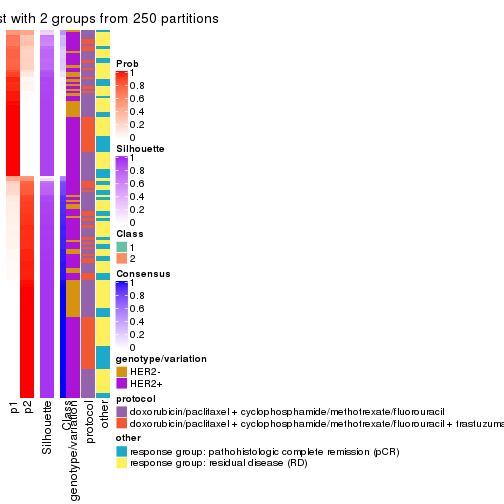</p>

</div>
<div id='tab-ATC-hclust-consensus-heatmap-2'>
<pre><code class="r">consensus_heatmap(res, k = 3)
</code></pre>

<p>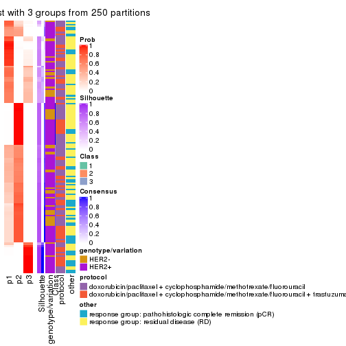</p>

</div>
<div id='tab-ATC-hclust-consensus-heatmap-3'>
<pre><code class="r">consensus_heatmap(res, k = 4)
</code></pre>

<p>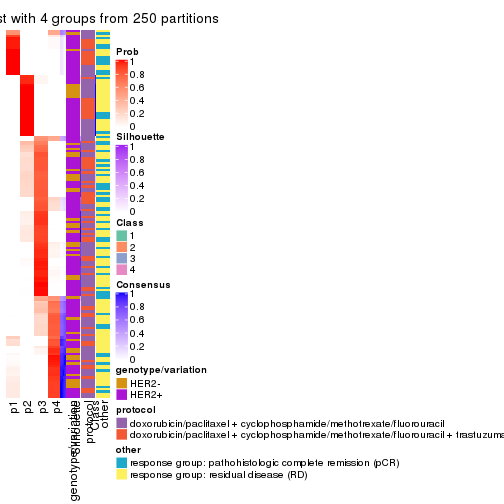</p>

</div>
<div id='tab-ATC-hclust-consensus-heatmap-4'>
<pre><code class="r">consensus_heatmap(res, k = 5)
</code></pre>

<p>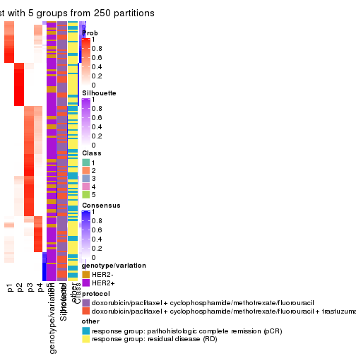</p>

</div>
<div id='tab-ATC-hclust-consensus-heatmap-5'>
<pre><code class="r">consensus_heatmap(res, k = 6)
</code></pre>

<p>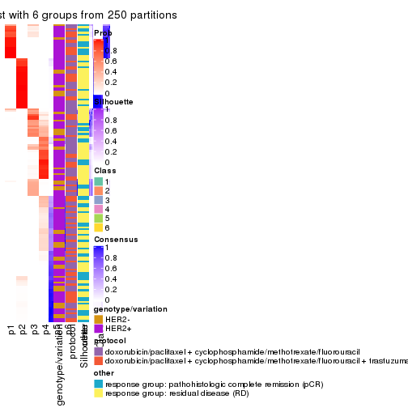</p>

</div>
</div>

Heatmaps for the membership of samples in all partitions to see how consistent they are:


<script>
$( function() {
	$( '#tabs-ATC-hclust-membership-heatmap' ).tabs();
} );
</script>
<div id='tabs-ATC-hclust-membership-heatmap'>
<ul>
<li><a href='#tab-ATC-hclust-membership-heatmap-1'>k = 2</a></li>
<li><a href='#tab-ATC-hclust-membership-heatmap-2'>k = 3</a></li>
<li><a href='#tab-ATC-hclust-membership-heatmap-3'>k = 4</a></li>
<li><a href='#tab-ATC-hclust-membership-heatmap-4'>k = 5</a></li>
<li><a href='#tab-ATC-hclust-membership-heatmap-5'>k = 6</a></li>
</ul>
<div id='tab-ATC-hclust-membership-heatmap-1'>
<pre><code class="r">membership_heatmap(res, k = 2)
</code></pre>

<p>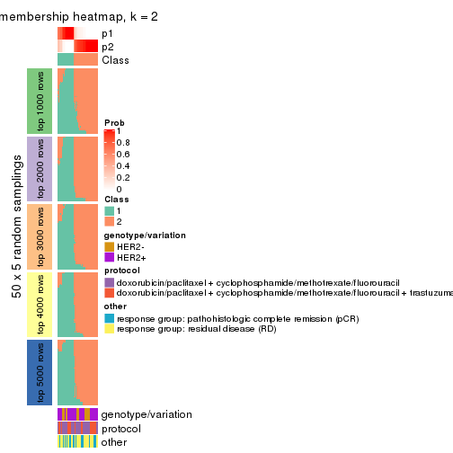</p>

</div>
<div id='tab-ATC-hclust-membership-heatmap-2'>
<pre><code class="r">membership_heatmap(res, k = 3)
</code></pre>

<p>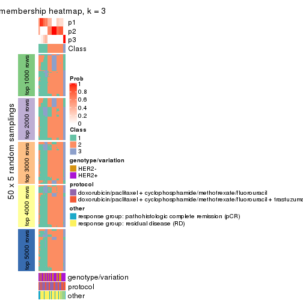</p>

</div>
<div id='tab-ATC-hclust-membership-heatmap-3'>
<pre><code class="r">membership_heatmap(res, k = 4)
</code></pre>

<p>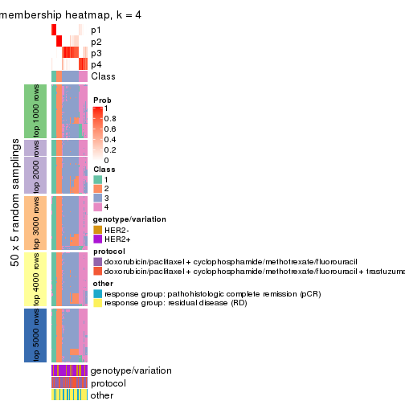</p>

</div>
<div id='tab-ATC-hclust-membership-heatmap-4'>
<pre><code class="r">membership_heatmap(res, k = 5)
</code></pre>

<p>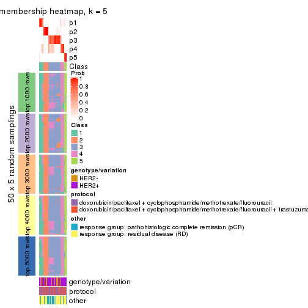</p>

</div>
<div id='tab-ATC-hclust-membership-heatmap-5'>
<pre><code class="r">membership_heatmap(res, k = 6)
</code></pre>

<p>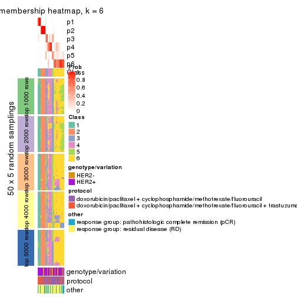</p>

</div>
</div>

As soon as we have had the classes for columns, we can look for signatures
which are significantly different between classes which can be candidate marks
for certain classes. Following are the heatmaps for signatures.


Signature heatmaps where rows are scaled:


<script>
$( function() {
	$( '#tabs-ATC-hclust-get-signatures' ).tabs();
} );
</script>
<div id='tabs-ATC-hclust-get-signatures'>
<ul>
<li><a href='#tab-ATC-hclust-get-signatures-1'>k = 2</a></li>
<li><a href='#tab-ATC-hclust-get-signatures-2'>k = 3</a></li>
<li><a href='#tab-ATC-hclust-get-signatures-3'>k = 4</a></li>
<li><a href='#tab-ATC-hclust-get-signatures-4'>k = 5</a></li>
<li><a href='#tab-ATC-hclust-get-signatures-5'>k = 6</a></li>
</ul>
<div id='tab-ATC-hclust-get-signatures-1'>
<pre><code class="r">get_signatures(res, k = 2)
</code></pre>

<pre><code>#&gt; Error: The width or height of the raster image is zero, maybe you forget to turn off the
#&gt; previous graphic device or it was corrupted. Run `dev.off()` to close it.
</code></pre>

<p></p>

</div>
<div id='tab-ATC-hclust-get-signatures-2'>
<pre><code class="r">get_signatures(res, k = 3)
</code></pre>

<pre><code>#&gt; Error: The width or height of the raster image is zero, maybe you forget to turn off the
#&gt; previous graphic device or it was corrupted. Run `dev.off()` to close it.
</code></pre>

<p></p>

</div>
<div id='tab-ATC-hclust-get-signatures-3'>
<pre><code class="r">get_signatures(res, k = 4)
</code></pre>

<pre><code>#&gt; Error: The width or height of the raster image is zero, maybe you forget to turn off the
#&gt; previous graphic device or it was corrupted. Run `dev.off()` to close it.
</code></pre>

<p></p>

</div>
<div id='tab-ATC-hclust-get-signatures-4'>
<pre><code class="r">get_signatures(res, k = 5)
</code></pre>

<pre><code>#&gt; Error: The width or height of the raster image is zero, maybe you forget to turn off the
#&gt; previous graphic device or it was corrupted. Run `dev.off()` to close it.
</code></pre>

<p></p>

</div>
<div id='tab-ATC-hclust-get-signatures-5'>
<pre><code class="r">get_signatures(res, k = 6)
</code></pre>

<pre><code>#&gt; Error: The width or height of the raster image is zero, maybe you forget to turn off the
#&gt; previous graphic device or it was corrupted. Run `dev.off()` to close it.
</code></pre>

<p></p>

</div>
</div>


Signature heatmaps where rows are not scaled:


<script>
$( function() {
	$( '#tabs-ATC-hclust-get-signatures-no-scale' ).tabs();
} );
</script>
<div id='tabs-ATC-hclust-get-signatures-no-scale'>
<ul>
<li><a href='#tab-ATC-hclust-get-signatures-no-scale-1'>k = 2</a></li>
<li><a href='#tab-ATC-hclust-get-signatures-no-scale-2'>k = 3</a></li>
<li><a href='#tab-ATC-hclust-get-signatures-no-scale-3'>k = 4</a></li>
<li><a href='#tab-ATC-hclust-get-signatures-no-scale-4'>k = 5</a></li>
<li><a href='#tab-ATC-hclust-get-signatures-no-scale-5'>k = 6</a></li>
</ul>
<div id='tab-ATC-hclust-get-signatures-no-scale-1'>
<pre><code class="r">get_signatures(res, k = 2, scale_rows = FALSE)
</code></pre>

<pre><code>#&gt; Error: The width or height of the raster image is zero, maybe you forget to turn off the
#&gt; previous graphic device or it was corrupted. Run `dev.off()` to close it.
</code></pre>

<p></p>

</div>
<div id='tab-ATC-hclust-get-signatures-no-scale-2'>
<pre><code class="r">get_signatures(res, k = 3, scale_rows = FALSE)
</code></pre>

<pre><code>#&gt; Error: The width or height of the raster image is zero, maybe you forget to turn off the
#&gt; previous graphic device or it was corrupted. Run `dev.off()` to close it.
</code></pre>

<p></p>

</div>
<div id='tab-ATC-hclust-get-signatures-no-scale-3'>
<pre><code class="r">get_signatures(res, k = 4, scale_rows = FALSE)
</code></pre>

<pre><code>#&gt; Error: The width or height of the raster image is zero, maybe you forget to turn off the
#&gt; previous graphic device or it was corrupted. Run `dev.off()` to close it.
</code></pre>

<p></p>

</div>
<div id='tab-ATC-hclust-get-signatures-no-scale-4'>
<pre><code class="r">get_signatures(res, k = 5, scale_rows = FALSE)
</code></pre>

<pre><code>#&gt; Error: The width or height of the raster image is zero, maybe you forget to turn off the
#&gt; previous graphic device or it was corrupted. Run `dev.off()` to close it.
</code></pre>

<p></p>

</div>
<div id='tab-ATC-hclust-get-signatures-no-scale-5'>
<pre><code class="r">get_signatures(res, k = 6, scale_rows = FALSE)
</code></pre>

<pre><code>#&gt; Error: The width or height of the raster image is zero, maybe you forget to turn off the
#&gt; previous graphic device or it was corrupted. Run `dev.off()` to close it.
</code></pre>

<p></p>

</div>
</div>


Compare the overlap of signatures from different k:

```r
compare_signatures(res)
```


`get_signature()` returns a data frame invisibly. TO get the list of signatures, the function
call should be assigned to a variable explicitly. In following code, if `plot` argument is set
to `FALSE`, no heatmap is plotted while only the differential analysis is performed.

```r
# code only for demonstration
tb = get_signature(res, k = ..., plot = FALSE)
```

An example of the output of `tb` is:

```
#>   which_row         fdr    mean_1    mean_2 scaled_mean_1 scaled_mean_2 km
#> 1        38 0.042760348  8.373488  9.131774    -0.5533452     0.5164555  1
#> 2        40 0.018707592  7.106213  8.469186    -0.6173731     0.5762149  1
#> 3        55 0.019134737 10.221463 11.207825    -0.6159697     0.5749050  1
#> 4        59 0.006059896  5.921854  7.869574    -0.6899429     0.6439467  1
#> 5        60 0.018055526  8.928898 10.211722    -0.6204761     0.5791110  1
#> 6        98 0.009384629 15.714769 14.887706     0.6635654    -0.6193277  2
...
```

The columns in `tb` are:

1. `which_row`: row indices corresponding to the input matrix.
2. `fdr`: FDR for the differential test. 
3. `mean_x`: The mean value in group x.
4. `scaled_mean_x`: The mean value in group x after rows are scaled.
5. `km`: Row groups if k-means clustering is applied to rows.


UMAP plot which shows how samples are separated.


<script>
$( function() {
	$( '#tabs-ATC-hclust-dimension-reduction' ).tabs();
} );
</script>
<div id='tabs-ATC-hclust-dimension-reduction'>
<ul>
<li><a href='#tab-ATC-hclust-dimension-reduction-1'>k = 2</a></li>
<li><a href='#tab-ATC-hclust-dimension-reduction-2'>k = 3</a></li>
<li><a href='#tab-ATC-hclust-dimension-reduction-3'>k = 4</a></li>
<li><a href='#tab-ATC-hclust-dimension-reduction-4'>k = 5</a></li>
<li><a href='#tab-ATC-hclust-dimension-reduction-5'>k = 6</a></li>
</ul>
<div id='tab-ATC-hclust-dimension-reduction-1'>
<pre><code class="r">dimension_reduction(res, k = 2, method = &quot;UMAP&quot;)
</code></pre>

<p>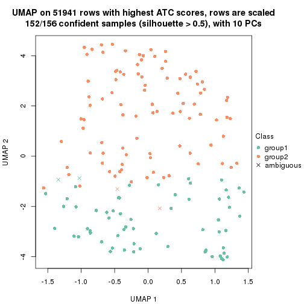</p>

</div>
<div id='tab-ATC-hclust-dimension-reduction-2'>
<pre><code class="r">dimension_reduction(res, k = 3, method = &quot;UMAP&quot;)
</code></pre>

<p>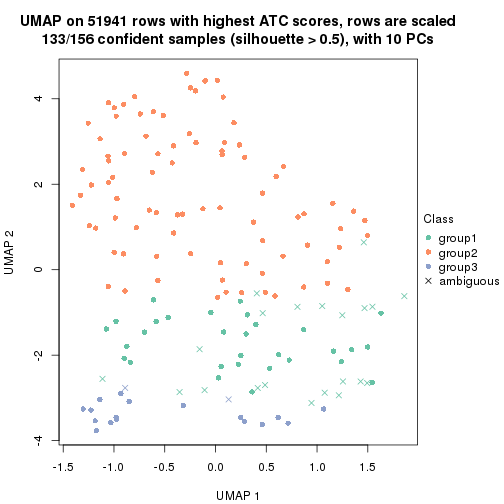</p>

</div>
<div id='tab-ATC-hclust-dimension-reduction-3'>
<pre><code class="r">dimension_reduction(res, k = 4, method = &quot;UMAP&quot;)
</code></pre>

<p>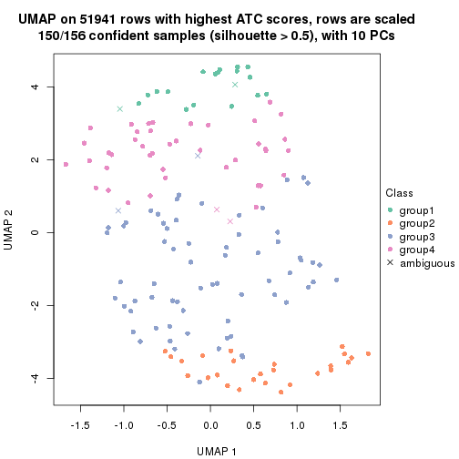</p>

</div>
<div id='tab-ATC-hclust-dimension-reduction-4'>
<pre><code class="r">dimension_reduction(res, k = 5, method = &quot;UMAP&quot;)
</code></pre>

<p>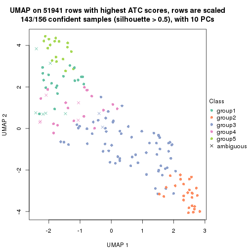</p>

</div>
<div id='tab-ATC-hclust-dimension-reduction-5'>
<pre><code class="r">dimension_reduction(res, k = 6, method = &quot;UMAP&quot;)
</code></pre>

<p>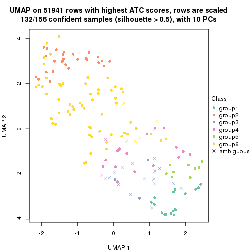</p>

</div>
</div>


Following heatmap shows how subgroups are split when increasing `k`:

```r
collect_classes(res)
```

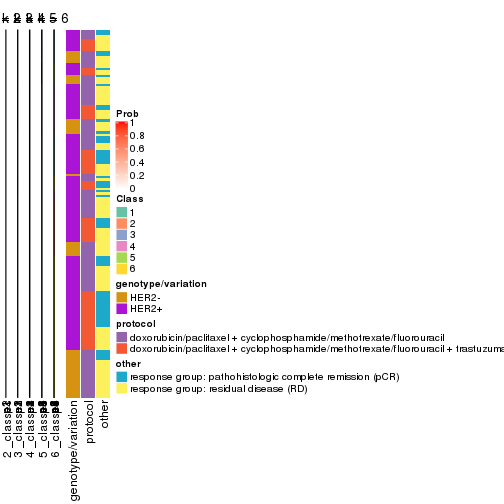


Test correlation between subgroups and known annotations. If the known
annotation is numeric, one-way ANOVA test is applied, and if the known
annotation is discrete, chi-squared contingency table test is applied.

```r
test_to_known_factors(res)
```

```
#>              n genotype/variation(p) protocol(p) other(p) k
#> ATC:hclust 152                 0.798       0.901   0.8243 2
#> ATC:hclust 133                 0.109       0.229   0.1149 3
#> ATC:hclust 150                 0.179       0.355   0.0248 4
#> ATC:hclust 143                 0.231       0.621   0.0817 5
#> ATC:hclust 132                 0.183       0.634   0.2077 6
```


If matrix rows can be associated to genes, consider to use `functional_enrichment(res,
...)` to perform function enrichment for the signature genes. See [this vignette](http://bioconductor.org/packages/devel/bioc/vignettes/cola/inst/doc/functional_enrichment.html) for more detailed explanations.


 

---------------------------------------------------


### ATC:kmeans**


The object with results only for a single top-value method and a single partition method 
can be extracted as:

```r
res = res_list["ATC", "kmeans"]
# you can also extract it by
# res = res_list["ATC:kmeans"]
```

A summary of `res` and all the functions that can be applied to it:

```r
res
```

```
#> A 'ConsensusPartition' object with k = 2, 3, 4, 5, 6.
#>   On a matrix with 51941 rows and 156 columns.
#>   Top rows (1000, 2000, 3000, 4000, 5000) are extracted by 'ATC' method.
#>   Subgroups are detected by 'kmeans' method.
#>   Performed in total 1250 partitions by row resampling.
#>   Best k for subgroups seems to be 3.
#> 
#> Following methods can be applied to this 'ConsensusPartition' object:
#>  [1] "cola_report"             "collect_classes"         "collect_plots"          
#>  [4] "collect_stats"           "colnames"                "compare_signatures"     
#>  [7] "consensus_heatmap"       "dimension_reduction"     "functional_enrichment"  
#> [10] "get_anno_col"            "get_anno"                "get_classes"            
#> [13] "get_consensus"           "get_matrix"              "get_membership"         
#> [16] "get_param"               "get_signatures"          "get_stats"              
#> [19] "is_best_k"               "is_stable_k"             "membership_heatmap"     
#> [22] "ncol"                    "nrow"                    "plot_ecdf"              
#> [25] "rownames"                "select_partition_number" "show"                   
#> [28] "suggest_best_k"          "test_to_known_factors"
```

`collect_plots()` function collects all the plots made from `res` for all `k` (number of partitions)
into one single page to provide an easy and fast comparison between different `k`.

```r
collect_plots(res)
```

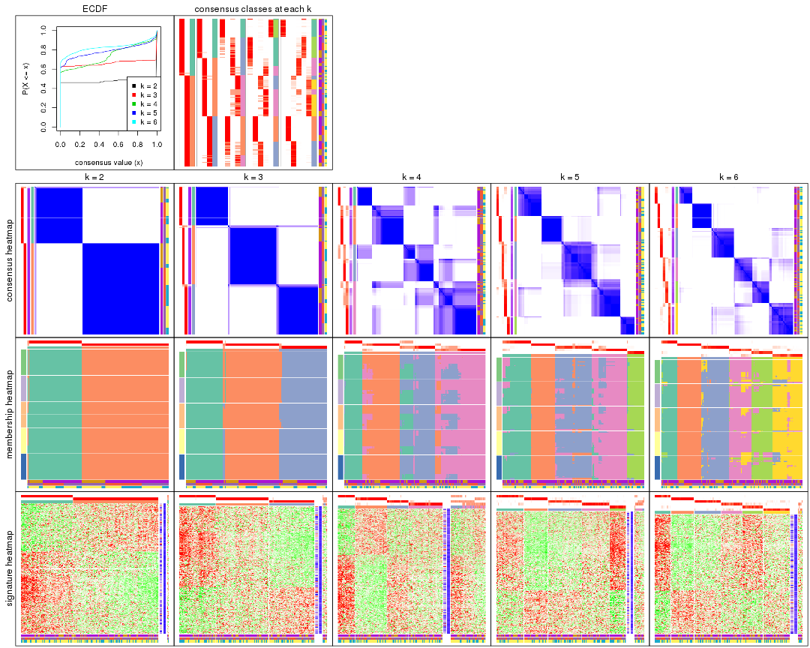

The plots are:

- The first row: a plot of the ECDF (empirical cumulative distribution
  function) curves of the consensus matrix for each `k` and the heatmap of
  predicted classes for each `k`.
- The second row: heatmaps of the consensus matrix for each `k`.
- The third row: heatmaps of the membership matrix for each `k`.
- The fouth row: heatmaps of the signatures for each `k`.

All the plots in panels can be made by individual functions and they are
plotted later in this section.

`select_partition_number()` produces several plots showing different
statistics for choosing "optimized" `k`. There are following statistics:

- ECDF curves of the consensus matrix for each `k`;
- 1-PAC. [The PAC
  score](https://en.wikipedia.org/wiki/Consensus_clustering#Over-interpretation_potential_of_consensus_clustering)
  measures the proportion of the ambiguous subgrouping.
- Mean silhouette score.
- Concordance. The mean probability of fiting the consensus class ids in all
  partitions.
- Area increased. Denote $A_k$ as the area under the ECDF curve for current
  `k`, the area increased is defined as $A_k - A_{k-1}$.
- Rand index. The percent of pairs of samples that are both in a same cluster
  or both are not in a same cluster in the partition of k and k-1.
- Jaccard index. The ratio of pairs of samples are both in a same cluster in
  the partition of k and k-1 and the pairs of samples are both in a same
  cluster in the partition k or k-1.

The detailed explanations of these statistics can be found in [the _cola_
vignette](http://bioconductor.org/packages/devel/bioc/vignettes/cola/inst/doc/cola.html#toc_13).

Generally speaking, lower PAC score, higher mean silhouette score or higher
concordance corresponds to better partition. Rand index and Jaccard index
measure how similar the current partition is compared to partition with `k-1`.
If they are too similar, we won't accept `k` is better than `k-1`.

```r
select_partition_number(res)
```

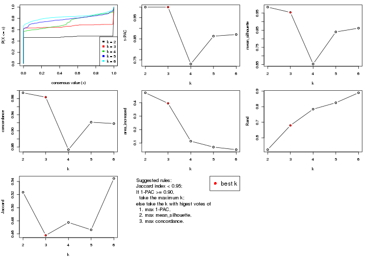

The numeric values for all these statistics can be obtained by `get_stats()`.

```r
get_stats(res)
```

```
#>   k 1-PAC mean_silhouette concordance area_increased  Rand Jaccard
#> 2 2 1.000           0.985       0.994         0.4743 0.524   0.524
#> 3 3 1.000           0.954       0.984         0.3956 0.679   0.458
#> 4 4 0.731           0.653       0.853         0.1134 0.784   0.477
#> 5 5 0.863           0.840       0.921         0.0695 0.825   0.466
#> 6 6 0.871           0.862       0.918         0.0502 0.889   0.545
```

`suggest_best_k()` suggests the best $k$ based on these statistics. The rules are as follows:

- All $k$ with Jaccard index larger than 0.95 are removed because increasing
  $k$ does not provide enough extra information. If all $k$ are removed, it is
  marked as no subgroup is detected.
- For all $k$ with 1-PAC score larger than 0.9, the maximal $k$ is taken as
  the best $k$, and other $k$ are marked as optional $k$.
- If it does not fit the second rule. The $k$ with the maximal vote of the
  highest 1-PAC score, highest mean silhouette, and highest concordance is
  taken as the best $k$.

```r
suggest_best_k(res)
```

```
#> [1] 3
#> attr(,"optional")
#> [1] 2
```

There is also optional best $k$ = 2 that is worth to check.

Following shows the table of the partitions (You need to click the **show/hide
code output** link to see it). The membership matrix (columns with name `p*`)
is inferred by
[`clue::cl_consensus()`](https://www.rdocumentation.org/link/cl_consensus?package=clue)
function with the `SE` method. Basically the value in the membership matrix
represents the probability to belong to a certain group. The finall class
label for an item is determined with the group with highest probability it
belongs to.

In `get_classes()` function, the entropy is calculated from the membership
matrix and the silhouette score is calculated from the consensus matrix.


<script>
$( function() {
	$( '#tabs-ATC-kmeans-get-classes' ).tabs();
} );
</script>
<div id='tabs-ATC-kmeans-get-classes'>
<ul>
<li><a href='#tab-ATC-kmeans-get-classes-1'>k = 2</a></li>
<li><a href='#tab-ATC-kmeans-get-classes-2'>k = 3</a></li>
<li><a href='#tab-ATC-kmeans-get-classes-3'>k = 4</a></li>
<li><a href='#tab-ATC-kmeans-get-classes-4'>k = 5</a></li>
<li><a href='#tab-ATC-kmeans-get-classes-5'>k = 6</a></li>
</ul>

<div id='tab-ATC-kmeans-get-classes-1'>
<p><a id='tab-ATC-kmeans-get-classes-1-a' style='color:#0366d6' href='#'>show/hide code output</a></p>
<pre><code class="r">cbind(get_classes(res, k = 2), get_membership(res, k = 2))
</code></pre>

<pre><code>#&gt;            class entropy silhouette    p1    p2
#&gt; GSM1232995     2   0.000      1.000 0.000 1.000
#&gt; GSM1233002     1   0.000      0.985 1.000 0.000
#&gt; GSM1233003     1   0.000      0.985 1.000 0.000
#&gt; GSM1233014     2   0.000      1.000 0.000 1.000
#&gt; GSM1233015     1   0.000      0.985 1.000 0.000
#&gt; GSM1233016     2   0.000      1.000 0.000 1.000
#&gt; GSM1233024     2   0.000      1.000 0.000 1.000
#&gt; GSM1233049     1   0.000      0.985 1.000 0.000
#&gt; GSM1233064     2   0.000      1.000 0.000 1.000
#&gt; GSM1233068     2   0.000      1.000 0.000 1.000
#&gt; GSM1233073     2   0.000      1.000 0.000 1.000
#&gt; GSM1233093     1   0.000      0.985 1.000 0.000
#&gt; GSM1233115     1   0.000      0.985 1.000 0.000
#&gt; GSM1232992     2   0.000      1.000 0.000 1.000
#&gt; GSM1232993     2   0.000      1.000 0.000 1.000
#&gt; GSM1233005     2   0.000      1.000 0.000 1.000
#&gt; GSM1233007     2   0.000      1.000 0.000 1.000
#&gt; GSM1233010     1   0.000      0.985 1.000 0.000
#&gt; GSM1233013     2   0.000      1.000 0.000 1.000
#&gt; GSM1233018     2   0.000      1.000 0.000 1.000
#&gt; GSM1233019     2   0.000      1.000 0.000 1.000
#&gt; GSM1233021     2   0.000      1.000 0.000 1.000
#&gt; GSM1233025     1   0.000      0.985 1.000 0.000
#&gt; GSM1233029     2   0.000      1.000 0.000 1.000
#&gt; GSM1233030     2   0.000      1.000 0.000 1.000
#&gt; GSM1233031     2   0.000      1.000 0.000 1.000
#&gt; GSM1233032     1   0.000      0.985 1.000 0.000
#&gt; GSM1233035     2   0.000      1.000 0.000 1.000
#&gt; GSM1233038     1   0.000      0.985 1.000 0.000
#&gt; GSM1233039     2   0.000      1.000 0.000 1.000
#&gt; GSM1233042     2   0.000      1.000 0.000 1.000
#&gt; GSM1233043     2   0.000      1.000 0.000 1.000
#&gt; GSM1233044     1   0.000      0.985 1.000 0.000
#&gt; GSM1233046     1   0.978      0.307 0.588 0.412
#&gt; GSM1233051     1   0.000      0.985 1.000 0.000
#&gt; GSM1233054     1   0.000      0.985 1.000 0.000
#&gt; GSM1233057     2   0.000      1.000 0.000 1.000
#&gt; GSM1233060     2   0.000      1.000 0.000 1.000
#&gt; GSM1233062     2   0.000      1.000 0.000 1.000
#&gt; GSM1233075     2   0.000      1.000 0.000 1.000
#&gt; GSM1233078     2   0.000      1.000 0.000 1.000
#&gt; GSM1233079     1   0.000      0.985 1.000 0.000
#&gt; GSM1233082     1   0.000      0.985 1.000 0.000
#&gt; GSM1233083     1   0.000      0.985 1.000 0.000
#&gt; GSM1233091     2   0.000      1.000 0.000 1.000
#&gt; GSM1233095     1   0.000      0.985 1.000 0.000
#&gt; GSM1233096     1   0.000      0.985 1.000 0.000
#&gt; GSM1233101     1   0.000      0.985 1.000 0.000
#&gt; GSM1233105     1   0.000      0.985 1.000 0.000
#&gt; GSM1233117     2   0.000      1.000 0.000 1.000
#&gt; GSM1233118     2   0.000      1.000 0.000 1.000
#&gt; GSM1233001     2   0.000      1.000 0.000 1.000
#&gt; GSM1233006     2   0.000      1.000 0.000 1.000
#&gt; GSM1233008     2   0.000      1.000 0.000 1.000
#&gt; GSM1233009     2   0.000      1.000 0.000 1.000
#&gt; GSM1233017     2   0.000      1.000 0.000 1.000
#&gt; GSM1233020     2   0.000      1.000 0.000 1.000
#&gt; GSM1233022     2   0.000      1.000 0.000 1.000
#&gt; GSM1233026     2   0.000      1.000 0.000 1.000
#&gt; GSM1233028     2   0.000      1.000 0.000 1.000
#&gt; GSM1233034     2   0.000      1.000 0.000 1.000
#&gt; GSM1233040     1   0.000      0.985 1.000 0.000
#&gt; GSM1233048     1   0.000      0.985 1.000 0.000
#&gt; GSM1233056     1   0.000      0.985 1.000 0.000
#&gt; GSM1233058     2   0.000      1.000 0.000 1.000
#&gt; GSM1233059     1   0.000      0.985 1.000 0.000
#&gt; GSM1233066     2   0.000      1.000 0.000 1.000
#&gt; GSM1233071     2   0.000      1.000 0.000 1.000
#&gt; GSM1233074     2   0.000      1.000 0.000 1.000
#&gt; GSM1233076     2   0.000      1.000 0.000 1.000
#&gt; GSM1233080     1   0.000      0.985 1.000 0.000
#&gt; GSM1233088     2   0.000      1.000 0.000 1.000
#&gt; GSM1233090     1   0.000      0.985 1.000 0.000
#&gt; GSM1233092     2   0.000      1.000 0.000 1.000
#&gt; GSM1233094     2   0.000      1.000 0.000 1.000
#&gt; GSM1233097     2   0.000      1.000 0.000 1.000
#&gt; GSM1233100     1   0.000      0.985 1.000 0.000
#&gt; GSM1233104     2   0.000      1.000 0.000 1.000
#&gt; GSM1233106     1   0.000      0.985 1.000 0.000
#&gt; GSM1233111     1   0.000      0.985 1.000 0.000
#&gt; GSM1233122     2   0.000      1.000 0.000 1.000
#&gt; GSM1233146     2   0.000      1.000 0.000 1.000
#&gt; GSM1232994     2   0.000      1.000 0.000 1.000
#&gt; GSM1232996     2   0.000      1.000 0.000 1.000
#&gt; GSM1232997     2   0.000      1.000 0.000 1.000
#&gt; GSM1232998     2   0.000      1.000 0.000 1.000
#&gt; GSM1232999     2   0.000      1.000 0.000 1.000
#&gt; GSM1233000     2   0.000      1.000 0.000 1.000
#&gt; GSM1233004     1   0.000      0.985 1.000 0.000
#&gt; GSM1233011     2   0.000      1.000 0.000 1.000
#&gt; GSM1233012     2   0.000      1.000 0.000 1.000
#&gt; GSM1233023     2   0.000      1.000 0.000 1.000
#&gt; GSM1233027     2   0.000      1.000 0.000 1.000
#&gt; GSM1233033     1   0.000      0.985 1.000 0.000
#&gt; GSM1233036     2   0.000      1.000 0.000 1.000
#&gt; GSM1233037     2   0.000      1.000 0.000 1.000
#&gt; GSM1233041     1   0.000      0.985 1.000 0.000
#&gt; GSM1233045     2   0.000      1.000 0.000 1.000
#&gt; GSM1233047     1   0.000      0.985 1.000 0.000
#&gt; GSM1233050     1   0.000      0.985 1.000 0.000
#&gt; GSM1233052     1   0.000      0.985 1.000 0.000
#&gt; GSM1233053     1   0.000      0.985 1.000 0.000
#&gt; GSM1233055     1   0.000      0.985 1.000 0.000
#&gt; GSM1233061     2   0.000      1.000 0.000 1.000
#&gt; GSM1233063     1   0.000      0.985 1.000 0.000
#&gt; GSM1233065     2   0.000      1.000 0.000 1.000
#&gt; GSM1233070     2   0.000      1.000 0.000 1.000
#&gt; GSM1233077     2   0.000      1.000 0.000 1.000
#&gt; GSM1233081     1   0.000      0.985 1.000 0.000
#&gt; GSM1233084     1   0.000      0.985 1.000 0.000
#&gt; GSM1233087     1   0.000      0.985 1.000 0.000
#&gt; GSM1233089     2   0.000      1.000 0.000 1.000
#&gt; GSM1233099     1   0.000      0.985 1.000 0.000
#&gt; GSM1233112     1   0.000      0.985 1.000 0.000
#&gt; GSM1233085     1   0.000      0.985 1.000 0.000
#&gt; GSM1233098     2   0.000      1.000 0.000 1.000
#&gt; GSM1233114     1   0.000      0.985 1.000 0.000
#&gt; GSM1233119     1   0.992      0.198 0.552 0.448
#&gt; GSM1233129     2   0.000      1.000 0.000 1.000
#&gt; GSM1233132     1   0.000      0.985 1.000 0.000
#&gt; GSM1233139     2   0.000      1.000 0.000 1.000
#&gt; GSM1233143     2   0.000      1.000 0.000 1.000
#&gt; GSM1233145     1   0.000      0.985 1.000 0.000
#&gt; GSM1233067     2   0.000      1.000 0.000 1.000
#&gt; GSM1233069     2   0.000      1.000 0.000 1.000
#&gt; GSM1233072     2   0.000      1.000 0.000 1.000
#&gt; GSM1233086     2   0.000      1.000 0.000 1.000
#&gt; GSM1233102     1   0.000      0.985 1.000 0.000
#&gt; GSM1233103     2   0.000      1.000 0.000 1.000
#&gt; GSM1233107     2   0.000      1.000 0.000 1.000
#&gt; GSM1233108     1   0.000      0.985 1.000 0.000
#&gt; GSM1233109     1   0.000      0.985 1.000 0.000
#&gt; GSM1233110     2   0.000      1.000 0.000 1.000
#&gt; GSM1233113     2   0.000      1.000 0.000 1.000
#&gt; GSM1233116     2   0.000      1.000 0.000 1.000
#&gt; GSM1233120     1   0.000      0.985 1.000 0.000
#&gt; GSM1233121     2   0.000      1.000 0.000 1.000
#&gt; GSM1233123     2   0.000      1.000 0.000 1.000
#&gt; GSM1233124     2   0.000      1.000 0.000 1.000
#&gt; GSM1233125     1   0.000      0.985 1.000 0.000
#&gt; GSM1233126     2   0.000      1.000 0.000 1.000
#&gt; GSM1233127     2   0.000      1.000 0.000 1.000
#&gt; GSM1233128     1   0.000      0.985 1.000 0.000
#&gt; GSM1233130     2   0.000      1.000 0.000 1.000
#&gt; GSM1233131     1   0.000      0.985 1.000 0.000
#&gt; GSM1233133     1   0.000      0.985 1.000 0.000
#&gt; GSM1233134     2   0.000      1.000 0.000 1.000
#&gt; GSM1233135     2   0.000      1.000 0.000 1.000
#&gt; GSM1233136     2   0.000      1.000 0.000 1.000
#&gt; GSM1233137     1   0.000      0.985 1.000 0.000
#&gt; GSM1233138     2   0.000      1.000 0.000 1.000
#&gt; GSM1233140     1   0.000      0.985 1.000 0.000
#&gt; GSM1233141     2   0.000      1.000 0.000 1.000
#&gt; GSM1233142     2   0.000      1.000 0.000 1.000
#&gt; GSM1233144     1   0.000      0.985 1.000 0.000
#&gt; GSM1233147     2   0.000      1.000 0.000 1.000
</code></pre>

<script>
$('#tab-ATC-kmeans-get-classes-1-a').parent().next().next().hide();
$('#tab-ATC-kmeans-get-classes-1-a').click(function(){
  $('#tab-ATC-kmeans-get-classes-1-a').parent().next().next().toggle();
  return(false);
});
</script>
</div>

<div id='tab-ATC-kmeans-get-classes-2'>
<p><a id='tab-ATC-kmeans-get-classes-2-a' style='color:#0366d6' href='#'>show/hide code output</a></p>
<pre><code class="r">cbind(get_classes(res, k = 3), get_membership(res, k = 3))
</code></pre>

<pre><code>#&gt;            class entropy silhouette    p1    p2    p3
#&gt; GSM1232995     3  0.0000      0.975 0.000 0.000 1.000
#&gt; GSM1233002     2  0.6095      0.340 0.392 0.608 0.000
#&gt; GSM1233003     1  0.0000      0.996 1.000 0.000 0.000
#&gt; GSM1233014     2  0.0000      0.978 0.000 1.000 0.000
#&gt; GSM1233015     2  0.0000      0.978 0.000 1.000 0.000
#&gt; GSM1233016     2  0.0000      0.978 0.000 1.000 0.000
#&gt; GSM1233024     3  0.0000      0.975 0.000 0.000 1.000
#&gt; GSM1233049     1  0.0000      0.996 1.000 0.000 0.000
#&gt; GSM1233064     2  0.0000      0.978 0.000 1.000 0.000
#&gt; GSM1233068     2  0.0000      0.978 0.000 1.000 0.000
#&gt; GSM1233073     2  0.0000      0.978 0.000 1.000 0.000
#&gt; GSM1233093     1  0.0000      0.996 1.000 0.000 0.000
#&gt; GSM1233115     1  0.0000      0.996 1.000 0.000 0.000
#&gt; GSM1232992     3  0.0000      0.975 0.000 0.000 1.000
#&gt; GSM1232993     2  0.0000      0.978 0.000 1.000 0.000
#&gt; GSM1233005     3  0.0000      0.975 0.000 0.000 1.000
#&gt; GSM1233007     2  0.0000      0.978 0.000 1.000 0.000
#&gt; GSM1233010     2  0.0000      0.978 0.000 1.000 0.000
#&gt; GSM1233013     3  0.0000      0.975 0.000 0.000 1.000
#&gt; GSM1233018     3  0.0000      0.975 0.000 0.000 1.000
#&gt; GSM1233019     3  0.0000      0.975 0.000 0.000 1.000
#&gt; GSM1233021     3  0.0000      0.975 0.000 0.000 1.000
#&gt; GSM1233025     2  0.0000      0.978 0.000 1.000 0.000
#&gt; GSM1233029     3  0.4750      0.713 0.000 0.216 0.784
#&gt; GSM1233030     3  0.0000      0.975 0.000 0.000 1.000
#&gt; GSM1233031     2  0.0000      0.978 0.000 1.000 0.000
#&gt; GSM1233032     1  0.0000      0.996 1.000 0.000 0.000
#&gt; GSM1233035     2  0.0000      0.978 0.000 1.000 0.000
#&gt; GSM1233038     1  0.0000      0.996 1.000 0.000 0.000
#&gt; GSM1233039     2  0.0000      0.978 0.000 1.000 0.000
#&gt; GSM1233042     2  0.0000      0.978 0.000 1.000 0.000
#&gt; GSM1233043     2  0.0000      0.978 0.000 1.000 0.000
#&gt; GSM1233044     2  0.0000      0.978 0.000 1.000 0.000
#&gt; GSM1233046     2  0.0000      0.978 0.000 1.000 0.000
#&gt; GSM1233051     1  0.0000      0.996 1.000 0.000 0.000
#&gt; GSM1233054     2  0.0000      0.978 0.000 1.000 0.000
#&gt; GSM1233057     2  0.0000      0.978 0.000 1.000 0.000
#&gt; GSM1233060     2  0.0000      0.978 0.000 1.000 0.000
#&gt; GSM1233062     2  0.6215      0.225 0.000 0.572 0.428
#&gt; GSM1233075     3  0.0000      0.975 0.000 0.000 1.000
#&gt; GSM1233078     2  0.0000      0.978 0.000 1.000 0.000
#&gt; GSM1233079     1  0.0000      0.996 1.000 0.000 0.000
#&gt; GSM1233082     2  0.0000      0.978 0.000 1.000 0.000
#&gt; GSM1233083     1  0.0000      0.996 1.000 0.000 0.000
#&gt; GSM1233091     2  0.0000      0.978 0.000 1.000 0.000
#&gt; GSM1233095     1  0.0000      0.996 1.000 0.000 0.000
#&gt; GSM1233096     1  0.0000      0.996 1.000 0.000 0.000
#&gt; GSM1233101     1  0.0000      0.996 1.000 0.000 0.000
#&gt; GSM1233105     2  0.0000      0.978 0.000 1.000 0.000
#&gt; GSM1233117     3  0.0000      0.975 0.000 0.000 1.000
#&gt; GSM1233118     3  0.0000      0.975 0.000 0.000 1.000
#&gt; GSM1233001     3  0.0000      0.975 0.000 0.000 1.000
#&gt; GSM1233006     3  0.0000      0.975 0.000 0.000 1.000
#&gt; GSM1233008     3  0.0000      0.975 0.000 0.000 1.000
#&gt; GSM1233009     3  0.0000      0.975 0.000 0.000 1.000
#&gt; GSM1233017     3  0.0000      0.975 0.000 0.000 1.000
#&gt; GSM1233020     3  0.0000      0.975 0.000 0.000 1.000
#&gt; GSM1233022     3  0.6295      0.110 0.000 0.472 0.528
#&gt; GSM1233026     2  0.0000      0.978 0.000 1.000 0.000
#&gt; GSM1233028     2  0.0000      0.978 0.000 1.000 0.000
#&gt; GSM1233034     3  0.0000      0.975 0.000 0.000 1.000
#&gt; GSM1233040     1  0.0000      0.996 1.000 0.000 0.000
#&gt; GSM1233048     1  0.0000      0.996 1.000 0.000 0.000
#&gt; GSM1233056     1  0.0000      0.996 1.000 0.000 0.000
#&gt; GSM1233058     2  0.0000      0.978 0.000 1.000 0.000
#&gt; GSM1233059     1  0.0000      0.996 1.000 0.000 0.000
#&gt; GSM1233066     2  0.0000      0.978 0.000 1.000 0.000
#&gt; GSM1233071     2  0.0000      0.978 0.000 1.000 0.000
#&gt; GSM1233074     3  0.0000      0.975 0.000 0.000 1.000
#&gt; GSM1233076     2  0.0000      0.978 0.000 1.000 0.000
#&gt; GSM1233080     1  0.0000      0.996 1.000 0.000 0.000
#&gt; GSM1233088     2  0.0000      0.978 0.000 1.000 0.000
#&gt; GSM1233090     1  0.0000      0.996 1.000 0.000 0.000
#&gt; GSM1233092     3  0.0000      0.975 0.000 0.000 1.000
#&gt; GSM1233094     2  0.0000      0.978 0.000 1.000 0.000
#&gt; GSM1233097     2  0.0000      0.978 0.000 1.000 0.000
#&gt; GSM1233100     2  0.0000      0.978 0.000 1.000 0.000
#&gt; GSM1233104     2  0.0000      0.978 0.000 1.000 0.000
#&gt; GSM1233106     2  0.0000      0.978 0.000 1.000 0.000
#&gt; GSM1233111     1  0.0000      0.996 1.000 0.000 0.000
#&gt; GSM1233122     3  0.0000      0.975 0.000 0.000 1.000
#&gt; GSM1233146     2  0.0000      0.978 0.000 1.000 0.000
#&gt; GSM1232994     3  0.0000      0.975 0.000 0.000 1.000
#&gt; GSM1232996     3  0.0000      0.975 0.000 0.000 1.000
#&gt; GSM1232997     3  0.0747      0.959 0.000 0.016 0.984
#&gt; GSM1232998     3  0.0000      0.975 0.000 0.000 1.000
#&gt; GSM1232999     3  0.0000      0.975 0.000 0.000 1.000
#&gt; GSM1233000     3  0.0000      0.975 0.000 0.000 1.000
#&gt; GSM1233004     1  0.0000      0.996 1.000 0.000 0.000
#&gt; GSM1233011     2  0.0000      0.978 0.000 1.000 0.000
#&gt; GSM1233012     3  0.0000      0.975 0.000 0.000 1.000
#&gt; GSM1233023     3  0.0000      0.975 0.000 0.000 1.000
#&gt; GSM1233027     3  0.0000      0.975 0.000 0.000 1.000
#&gt; GSM1233033     1  0.0000      0.996 1.000 0.000 0.000
#&gt; GSM1233036     2  0.0000      0.978 0.000 1.000 0.000
#&gt; GSM1233037     2  0.0000      0.978 0.000 1.000 0.000
#&gt; GSM1233041     1  0.0000      0.996 1.000 0.000 0.000
#&gt; GSM1233045     2  0.0000      0.978 0.000 1.000 0.000
#&gt; GSM1233047     1  0.0000      0.996 1.000 0.000 0.000
#&gt; GSM1233050     1  0.0000      0.996 1.000 0.000 0.000
#&gt; GSM1233052     1  0.0000      0.996 1.000 0.000 0.000
#&gt; GSM1233053     1  0.0000      0.996 1.000 0.000 0.000
#&gt; GSM1233055     1  0.0000      0.996 1.000 0.000 0.000
#&gt; GSM1233061     2  0.0000      0.978 0.000 1.000 0.000
#&gt; GSM1233063     1  0.0000      0.996 1.000 0.000 0.000
#&gt; GSM1233065     3  0.0000      0.975 0.000 0.000 1.000
#&gt; GSM1233070     3  0.0000      0.975 0.000 0.000 1.000
#&gt; GSM1233077     3  0.6280      0.151 0.000 0.460 0.540
#&gt; GSM1233081     2  0.0000      0.978 0.000 1.000 0.000
#&gt; GSM1233084     1  0.0000      0.996 1.000 0.000 0.000
#&gt; GSM1233087     2  0.0000      0.978 0.000 1.000 0.000
#&gt; GSM1233089     3  0.0000      0.975 0.000 0.000 1.000
#&gt; GSM1233099     2  0.0000      0.978 0.000 1.000 0.000
#&gt; GSM1233112     1  0.0000      0.996 1.000 0.000 0.000
#&gt; GSM1233085     1  0.0000      0.996 1.000 0.000 0.000
#&gt; GSM1233098     3  0.0000      0.975 0.000 0.000 1.000
#&gt; GSM1233114     1  0.0000      0.996 1.000 0.000 0.000
#&gt; GSM1233119     2  0.0000      0.978 0.000 1.000 0.000
#&gt; GSM1233129     3  0.0000      0.975 0.000 0.000 1.000
#&gt; GSM1233132     1  0.3752      0.825 0.856 0.144 0.000
#&gt; GSM1233139     3  0.0000      0.975 0.000 0.000 1.000
#&gt; GSM1233143     3  0.0000      0.975 0.000 0.000 1.000
#&gt; GSM1233145     1  0.0000      0.996 1.000 0.000 0.000
#&gt; GSM1233067     3  0.0000      0.975 0.000 0.000 1.000
#&gt; GSM1233069     3  0.0000      0.975 0.000 0.000 1.000
#&gt; GSM1233072     3  0.0000      0.975 0.000 0.000 1.000
#&gt; GSM1233086     2  0.0000      0.978 0.000 1.000 0.000
#&gt; GSM1233102     1  0.0000      0.996 1.000 0.000 0.000
#&gt; GSM1233103     2  0.0000      0.978 0.000 1.000 0.000
#&gt; GSM1233107     2  0.0000      0.978 0.000 1.000 0.000
#&gt; GSM1233108     1  0.0000      0.996 1.000 0.000 0.000
#&gt; GSM1233109     1  0.0000      0.996 1.000 0.000 0.000
#&gt; GSM1233110     2  0.0000      0.978 0.000 1.000 0.000
#&gt; GSM1233113     3  0.0000      0.975 0.000 0.000 1.000
#&gt; GSM1233116     3  0.0000      0.975 0.000 0.000 1.000
#&gt; GSM1233120     2  0.0000      0.978 0.000 1.000 0.000
#&gt; GSM1233121     2  0.0000      0.978 0.000 1.000 0.000
#&gt; GSM1233123     2  0.0000      0.978 0.000 1.000 0.000
#&gt; GSM1233124     2  0.0000      0.978 0.000 1.000 0.000
#&gt; GSM1233125     1  0.0000      0.996 1.000 0.000 0.000
#&gt; GSM1233126     2  0.0237      0.974 0.000 0.996 0.004
#&gt; GSM1233127     3  0.0000      0.975 0.000 0.000 1.000
#&gt; GSM1233128     1  0.0000      0.996 1.000 0.000 0.000
#&gt; GSM1233130     2  0.0000      0.978 0.000 1.000 0.000
#&gt; GSM1233131     2  0.0000      0.978 0.000 1.000 0.000
#&gt; GSM1233133     1  0.0000      0.996 1.000 0.000 0.000
#&gt; GSM1233134     3  0.0000      0.975 0.000 0.000 1.000
#&gt; GSM1233135     3  0.0000      0.975 0.000 0.000 1.000
#&gt; GSM1233136     2  0.6235      0.199 0.000 0.564 0.436
#&gt; GSM1233137     2  0.0000      0.978 0.000 1.000 0.000
#&gt; GSM1233138     3  0.0000      0.975 0.000 0.000 1.000
#&gt; GSM1233140     1  0.0000      0.996 1.000 0.000 0.000
#&gt; GSM1233141     3  0.0000      0.975 0.000 0.000 1.000
#&gt; GSM1233142     3  0.0000      0.975 0.000 0.000 1.000
#&gt; GSM1233144     2  0.0000      0.978 0.000 1.000 0.000
#&gt; GSM1233147     3  0.0000      0.975 0.000 0.000 1.000
</code></pre>

<script>
$('#tab-ATC-kmeans-get-classes-2-a').parent().next().next().hide();
$('#tab-ATC-kmeans-get-classes-2-a').click(function(){
  $('#tab-ATC-kmeans-get-classes-2-a').parent().next().next().toggle();
  return(false);
});
</script>
</div>

<div id='tab-ATC-kmeans-get-classes-3'>
<p><a id='tab-ATC-kmeans-get-classes-3-a' style='color:#0366d6' href='#'>show/hide code output</a></p>
<pre><code class="r">cbind(get_classes(res, k = 4), get_membership(res, k = 4))
</code></pre>

<pre><code>#&gt;            class entropy silhouette    p1    p2    p3    p4
#&gt; GSM1232995     2  0.0000     0.8923 0.000 1.000 0.000 0.000
#&gt; GSM1233002     3  0.0000     0.7211 0.000 0.000 1.000 0.000
#&gt; GSM1233003     1  0.0000     0.9630 1.000 0.000 0.000 0.000
#&gt; GSM1233014     4  0.0000     0.7715 0.000 0.000 0.000 1.000
#&gt; GSM1233015     3  0.0000     0.7211 0.000 0.000 1.000 0.000
#&gt; GSM1233016     4  0.4804     0.4935 0.000 0.000 0.384 0.616
#&gt; GSM1233024     2  0.4406     0.6447 0.000 0.700 0.000 0.300
#&gt; GSM1233049     1  0.0000     0.9630 1.000 0.000 0.000 0.000
#&gt; GSM1233064     4  0.0000     0.7715 0.000 0.000 0.000 1.000
#&gt; GSM1233068     4  0.4730     0.5182 0.000 0.000 0.364 0.636
#&gt; GSM1233073     4  0.4996     0.3451 0.000 0.000 0.484 0.516
#&gt; GSM1233093     1  0.0000     0.9630 1.000 0.000 0.000 0.000
#&gt; GSM1233115     3  0.4382     0.5007 0.296 0.000 0.704 0.000
#&gt; GSM1232992     2  0.0000     0.8923 0.000 1.000 0.000 0.000
#&gt; GSM1232993     4  0.0000     0.7715 0.000 0.000 0.000 1.000
#&gt; GSM1233005     2  0.0000     0.8923 0.000 1.000 0.000 0.000
#&gt; GSM1233007     4  0.0000     0.7715 0.000 0.000 0.000 1.000
#&gt; GSM1233010     3  0.4955    -0.1953 0.000 0.000 0.556 0.444
#&gt; GSM1233013     2  0.0000     0.8923 0.000 1.000 0.000 0.000
#&gt; GSM1233018     2  0.0000     0.8923 0.000 1.000 0.000 0.000
#&gt; GSM1233019     2  0.0000     0.8923 0.000 1.000 0.000 0.000
#&gt; GSM1233021     2  0.0000     0.8923 0.000 1.000 0.000 0.000
#&gt; GSM1233025     3  0.0000     0.7211 0.000 0.000 1.000 0.000
#&gt; GSM1233029     4  0.0000     0.7715 0.000 0.000 0.000 1.000
#&gt; GSM1233030     2  0.0000     0.8923 0.000 1.000 0.000 0.000
#&gt; GSM1233031     4  0.4996     0.3451 0.000 0.000 0.484 0.516
#&gt; GSM1233032     1  0.0000     0.9630 1.000 0.000 0.000 0.000
#&gt; GSM1233035     4  0.2921     0.7113 0.000 0.000 0.140 0.860
#&gt; GSM1233038     1  0.0000     0.9630 1.000 0.000 0.000 0.000
#&gt; GSM1233039     4  0.0000     0.7715 0.000 0.000 0.000 1.000
#&gt; GSM1233042     4  0.1211     0.7576 0.000 0.000 0.040 0.960
#&gt; GSM1233043     4  0.0000     0.7715 0.000 0.000 0.000 1.000
#&gt; GSM1233044     3  0.0000     0.7211 0.000 0.000 1.000 0.000
#&gt; GSM1233046     4  0.4998     0.3360 0.000 0.000 0.488 0.512
#&gt; GSM1233051     3  0.4843     0.3734 0.396 0.000 0.604 0.000
#&gt; GSM1233054     3  0.3266     0.5322 0.000 0.000 0.832 0.168
#&gt; GSM1233057     4  0.0000     0.7715 0.000 0.000 0.000 1.000
#&gt; GSM1233060     4  0.3569     0.6755 0.000 0.000 0.196 0.804
#&gt; GSM1233062     4  0.0000     0.7715 0.000 0.000 0.000 1.000
#&gt; GSM1233075     2  0.0000     0.8923 0.000 1.000 0.000 0.000
#&gt; GSM1233078     4  0.4996     0.3451 0.000 0.000 0.484 0.516
#&gt; GSM1233079     3  0.4996     0.2168 0.484 0.000 0.516 0.000
#&gt; GSM1233082     3  0.0000     0.7211 0.000 0.000 1.000 0.000
#&gt; GSM1233083     3  0.4999     0.1942 0.492 0.000 0.508 0.000
#&gt; GSM1233091     4  0.4996     0.3451 0.000 0.000 0.484 0.516
#&gt; GSM1233095     1  0.0000     0.9630 1.000 0.000 0.000 0.000
#&gt; GSM1233096     3  0.4996     0.2168 0.484 0.000 0.516 0.000
#&gt; GSM1233101     1  0.2011     0.8642 0.920 0.000 0.080 0.000
#&gt; GSM1233105     3  0.0000     0.7211 0.000 0.000 1.000 0.000
#&gt; GSM1233117     2  0.0000     0.8923 0.000 1.000 0.000 0.000
#&gt; GSM1233118     2  0.0000     0.8923 0.000 1.000 0.000 0.000
#&gt; GSM1233001     2  0.0000     0.8923 0.000 1.000 0.000 0.000
#&gt; GSM1233006     4  0.4454     0.3140 0.000 0.308 0.000 0.692
#&gt; GSM1233008     2  0.3172     0.7888 0.000 0.840 0.000 0.160
#&gt; GSM1233009     2  0.1022     0.8769 0.000 0.968 0.000 0.032
#&gt; GSM1233017     2  0.0000     0.8923 0.000 1.000 0.000 0.000
#&gt; GSM1233020     2  0.0000     0.8923 0.000 1.000 0.000 0.000
#&gt; GSM1233022     4  0.0000     0.7715 0.000 0.000 0.000 1.000
#&gt; GSM1233026     4  0.4989     0.3656 0.000 0.000 0.472 0.528
#&gt; GSM1233028     4  0.4996     0.3451 0.000 0.000 0.484 0.516
#&gt; GSM1233034     4  0.4985    -0.1912 0.000 0.468 0.000 0.532
#&gt; GSM1233040     1  0.0000     0.9630 1.000 0.000 0.000 0.000
#&gt; GSM1233048     1  0.0000     0.9630 1.000 0.000 0.000 0.000
#&gt; GSM1233056     1  0.0000     0.9630 1.000 0.000 0.000 0.000
#&gt; GSM1233058     4  0.4989     0.3653 0.000 0.000 0.472 0.528
#&gt; GSM1233059     1  0.0000     0.9630 1.000 0.000 0.000 0.000
#&gt; GSM1233066     4  0.4193     0.6187 0.000 0.000 0.268 0.732
#&gt; GSM1233071     4  0.0000     0.7715 0.000 0.000 0.000 1.000
#&gt; GSM1233074     2  0.4040     0.7092 0.000 0.752 0.000 0.248
#&gt; GSM1233076     4  0.0000     0.7715 0.000 0.000 0.000 1.000
#&gt; GSM1233080     1  0.0000     0.9630 1.000 0.000 0.000 0.000
#&gt; GSM1233088     4  0.3837     0.6550 0.000 0.000 0.224 0.776
#&gt; GSM1233090     1  0.0000     0.9630 1.000 0.000 0.000 0.000
#&gt; GSM1233092     2  0.4996     0.3027 0.000 0.516 0.000 0.484
#&gt; GSM1233094     4  0.0000     0.7715 0.000 0.000 0.000 1.000
#&gt; GSM1233097     4  0.0000     0.7715 0.000 0.000 0.000 1.000
#&gt; GSM1233100     3  0.3311     0.5253 0.000 0.000 0.828 0.172
#&gt; GSM1233104     4  0.0000     0.7715 0.000 0.000 0.000 1.000
#&gt; GSM1233106     3  0.0336     0.7160 0.000 0.000 0.992 0.008
#&gt; GSM1233111     3  0.4996     0.2168 0.484 0.000 0.516 0.000
#&gt; GSM1233122     2  0.0000     0.8923 0.000 1.000 0.000 0.000
#&gt; GSM1233146     4  0.0000     0.7715 0.000 0.000 0.000 1.000
#&gt; GSM1232994     2  0.0000     0.8923 0.000 1.000 0.000 0.000
#&gt; GSM1232996     2  0.0000     0.8923 0.000 1.000 0.000 0.000
#&gt; GSM1232997     4  0.0188     0.7693 0.000 0.004 0.000 0.996
#&gt; GSM1232998     2  0.0000     0.8923 0.000 1.000 0.000 0.000
#&gt; GSM1232999     4  0.0188     0.7693 0.000 0.004 0.000 0.996
#&gt; GSM1233000     2  0.4103     0.7004 0.000 0.744 0.000 0.256
#&gt; GSM1233004     3  0.1302     0.7000 0.044 0.000 0.956 0.000
#&gt; GSM1233011     4  0.0000     0.7715 0.000 0.000 0.000 1.000
#&gt; GSM1233012     2  0.4916     0.4374 0.000 0.576 0.000 0.424
#&gt; GSM1233023     2  0.4888     0.4610 0.000 0.588 0.000 0.412
#&gt; GSM1233027     2  0.0000     0.8923 0.000 1.000 0.000 0.000
#&gt; GSM1233033     3  0.4996     0.2168 0.484 0.000 0.516 0.000
#&gt; GSM1233036     4  0.0000     0.7715 0.000 0.000 0.000 1.000
#&gt; GSM1233037     4  0.4994     0.3521 0.000 0.000 0.480 0.520
#&gt; GSM1233041     1  0.0000     0.9630 1.000 0.000 0.000 0.000
#&gt; GSM1233045     4  0.0000     0.7715 0.000 0.000 0.000 1.000
#&gt; GSM1233047     3  0.0000     0.7211 0.000 0.000 1.000 0.000
#&gt; GSM1233050     1  0.0000     0.9630 1.000 0.000 0.000 0.000
#&gt; GSM1233052     3  0.4193     0.5303 0.268 0.000 0.732 0.000
#&gt; GSM1233053     3  0.4948     0.3013 0.440 0.000 0.560 0.000
#&gt; GSM1233055     1  0.0000     0.9630 1.000 0.000 0.000 0.000
#&gt; GSM1233061     4  0.4996     0.3451 0.000 0.000 0.484 0.516
#&gt; GSM1233063     3  0.4996     0.2168 0.484 0.000 0.516 0.000
#&gt; GSM1233065     2  0.0000     0.8923 0.000 1.000 0.000 0.000
#&gt; GSM1233070     4  0.4961    -0.1262 0.000 0.448 0.000 0.552
#&gt; GSM1233077     4  0.0000     0.7715 0.000 0.000 0.000 1.000
#&gt; GSM1233081     3  0.0000     0.7211 0.000 0.000 1.000 0.000
#&gt; GSM1233084     1  0.0000     0.9630 1.000 0.000 0.000 0.000
#&gt; GSM1233087     3  0.0000     0.7211 0.000 0.000 1.000 0.000
#&gt; GSM1233089     2  0.0000     0.8923 0.000 1.000 0.000 0.000
#&gt; GSM1233099     3  0.3400     0.5112 0.000 0.000 0.820 0.180
#&gt; GSM1233112     3  0.4996     0.2168 0.484 0.000 0.516 0.000
#&gt; GSM1233085     3  0.0000     0.7211 0.000 0.000 1.000 0.000
#&gt; GSM1233098     2  0.0000     0.8923 0.000 1.000 0.000 0.000
#&gt; GSM1233114     3  0.4996     0.2168 0.484 0.000 0.516 0.000
#&gt; GSM1233119     3  0.4992    -0.2787 0.000 0.000 0.524 0.476
#&gt; GSM1233129     2  0.5000     0.2698 0.000 0.504 0.000 0.496
#&gt; GSM1233132     3  0.0000     0.7211 0.000 0.000 1.000 0.000
#&gt; GSM1233139     4  0.4981    -0.1786 0.000 0.464 0.000 0.536
#&gt; GSM1233143     2  0.3975     0.7174 0.000 0.760 0.000 0.240
#&gt; GSM1233145     1  0.0000     0.9630 1.000 0.000 0.000 0.000
#&gt; GSM1233067     2  0.0000     0.8923 0.000 1.000 0.000 0.000
#&gt; GSM1233069     2  0.4193     0.6866 0.000 0.732 0.000 0.268
#&gt; GSM1233072     2  0.0000     0.8923 0.000 1.000 0.000 0.000
#&gt; GSM1233086     4  0.0000     0.7715 0.000 0.000 0.000 1.000
#&gt; GSM1233102     3  0.4972     0.2728 0.456 0.000 0.544 0.000
#&gt; GSM1233103     4  0.2345     0.7317 0.000 0.000 0.100 0.900
#&gt; GSM1233107     4  0.3975     0.6421 0.000 0.000 0.240 0.760
#&gt; GSM1233108     3  0.4996     0.2168 0.484 0.000 0.516 0.000
#&gt; GSM1233109     3  0.0000     0.7211 0.000 0.000 1.000 0.000
#&gt; GSM1233110     4  0.4564     0.5597 0.000 0.000 0.328 0.672
#&gt; GSM1233113     2  0.0000     0.8923 0.000 1.000 0.000 0.000
#&gt; GSM1233116     2  0.0000     0.8923 0.000 1.000 0.000 0.000
#&gt; GSM1233120     3  0.0000     0.7211 0.000 0.000 1.000 0.000
#&gt; GSM1233121     4  0.0000     0.7715 0.000 0.000 0.000 1.000
#&gt; GSM1233123     4  0.4356     0.5968 0.000 0.000 0.292 0.708
#&gt; GSM1233124     4  0.0000     0.7715 0.000 0.000 0.000 1.000
#&gt; GSM1233125     1  0.4972    -0.0941 0.544 0.000 0.456 0.000
#&gt; GSM1233126     4  0.0000     0.7715 0.000 0.000 0.000 1.000
#&gt; GSM1233127     2  0.1211     0.8726 0.000 0.960 0.000 0.040
#&gt; GSM1233128     1  0.0000     0.9630 1.000 0.000 0.000 0.000
#&gt; GSM1233130     4  0.3074     0.7048 0.000 0.000 0.152 0.848
#&gt; GSM1233131     3  0.0000     0.7211 0.000 0.000 1.000 0.000
#&gt; GSM1233133     3  0.0000     0.7211 0.000 0.000 1.000 0.000
#&gt; GSM1233134     2  0.4999     0.2811 0.000 0.508 0.000 0.492
#&gt; GSM1233135     4  0.4916    -0.0436 0.000 0.424 0.000 0.576
#&gt; GSM1233136     4  0.0000     0.7715 0.000 0.000 0.000 1.000
#&gt; GSM1233137     3  0.0000     0.7211 0.000 0.000 1.000 0.000
#&gt; GSM1233138     4  0.4624     0.2307 0.000 0.340 0.000 0.660
#&gt; GSM1233140     3  0.4746     0.4145 0.368 0.000 0.632 0.000
#&gt; GSM1233141     2  0.0000     0.8923 0.000 1.000 0.000 0.000
#&gt; GSM1233142     2  0.0000     0.8923 0.000 1.000 0.000 0.000
#&gt; GSM1233144     3  0.0000     0.7211 0.000 0.000 1.000 0.000
#&gt; GSM1233147     4  0.4925    -0.0592 0.000 0.428 0.000 0.572
</code></pre>

<script>
$('#tab-ATC-kmeans-get-classes-3-a').parent().next().next().hide();
$('#tab-ATC-kmeans-get-classes-3-a').click(function(){
  $('#tab-ATC-kmeans-get-classes-3-a').parent().next().next().toggle();
  return(false);
});
</script>
</div>

<div id='tab-ATC-kmeans-get-classes-4'>
<p><a id='tab-ATC-kmeans-get-classes-4-a' style='color:#0366d6' href='#'>show/hide code output</a></p>
<pre><code class="r">cbind(get_classes(res, k = 5), get_membership(res, k = 5))
</code></pre>

<pre><code>#&gt;            class entropy silhouette    p1    p2    p3    p4    p5
#&gt; GSM1232995     2  0.0000     0.9951 0.000 1.000 0.000 0.000 0.000
#&gt; GSM1233002     1  0.0000     0.9147 1.000 0.000 0.000 0.000 0.000
#&gt; GSM1233003     5  0.1121     0.9487 0.000 0.000 0.044 0.000 0.956
#&gt; GSM1233014     3  0.2605     0.8289 0.000 0.000 0.852 0.148 0.000
#&gt; GSM1233015     4  0.4074     0.2888 0.364 0.000 0.000 0.636 0.000
#&gt; GSM1233016     4  0.0000     0.8589 0.000 0.000 0.000 1.000 0.000
#&gt; GSM1233024     3  0.1478     0.8918 0.000 0.064 0.936 0.000 0.000
#&gt; GSM1233049     5  0.0000     0.9577 0.000 0.000 0.000 0.000 1.000
#&gt; GSM1233064     4  0.4268     0.1825 0.000 0.000 0.444 0.556 0.000
#&gt; GSM1233068     4  0.0290     0.8584 0.000 0.000 0.008 0.992 0.000
#&gt; GSM1233073     4  0.0000     0.8589 0.000 0.000 0.000 1.000 0.000
#&gt; GSM1233093     5  0.0000     0.9577 0.000 0.000 0.000 0.000 1.000
#&gt; GSM1233115     1  0.0000     0.9147 1.000 0.000 0.000 0.000 0.000
#&gt; GSM1232992     2  0.0000     0.9951 0.000 1.000 0.000 0.000 0.000
#&gt; GSM1232993     3  0.3395     0.7123 0.000 0.000 0.764 0.236 0.000
#&gt; GSM1233005     2  0.0000     0.9951 0.000 1.000 0.000 0.000 0.000
#&gt; GSM1233007     3  0.2813     0.8088 0.000 0.000 0.832 0.168 0.000
#&gt; GSM1233010     4  0.1197     0.8248 0.048 0.000 0.000 0.952 0.000
#&gt; GSM1233013     2  0.0000     0.9951 0.000 1.000 0.000 0.000 0.000
#&gt; GSM1233018     2  0.0000     0.9951 0.000 1.000 0.000 0.000 0.000
#&gt; GSM1233019     2  0.0000     0.9951 0.000 1.000 0.000 0.000 0.000
#&gt; GSM1233021     2  0.0000     0.9951 0.000 1.000 0.000 0.000 0.000
#&gt; GSM1233025     4  0.4291    -0.0594 0.464 0.000 0.000 0.536 0.000
#&gt; GSM1233029     3  0.1341     0.8896 0.000 0.000 0.944 0.056 0.000
#&gt; GSM1233030     2  0.0000     0.9951 0.000 1.000 0.000 0.000 0.000
#&gt; GSM1233031     4  0.0000     0.8589 0.000 0.000 0.000 1.000 0.000
#&gt; GSM1233032     5  0.1121     0.9487 0.000 0.000 0.044 0.000 0.956
#&gt; GSM1233035     4  0.0290     0.8584 0.000 0.000 0.008 0.992 0.000
#&gt; GSM1233038     5  0.0000     0.9577 0.000 0.000 0.000 0.000 1.000
#&gt; GSM1233039     4  0.3707     0.5645 0.000 0.000 0.284 0.716 0.000
#&gt; GSM1233042     4  0.1410     0.8277 0.000 0.000 0.060 0.940 0.000
#&gt; GSM1233043     4  0.4302     0.0511 0.000 0.000 0.480 0.520 0.000
#&gt; GSM1233044     1  0.3932     0.5962 0.672 0.000 0.000 0.328 0.000
#&gt; GSM1233046     4  0.0000     0.8589 0.000 0.000 0.000 1.000 0.000
#&gt; GSM1233051     1  0.0404     0.9113 0.988 0.000 0.012 0.000 0.000
#&gt; GSM1233054     4  0.1197     0.8248 0.048 0.000 0.000 0.952 0.000
#&gt; GSM1233057     4  0.3661     0.5778 0.000 0.000 0.276 0.724 0.000
#&gt; GSM1233060     4  0.0290     0.8584 0.000 0.000 0.008 0.992 0.000
#&gt; GSM1233062     3  0.1341     0.8896 0.000 0.000 0.944 0.056 0.000
#&gt; GSM1233075     2  0.2179     0.8653 0.000 0.888 0.112 0.000 0.000
#&gt; GSM1233078     4  0.0000     0.8589 0.000 0.000 0.000 1.000 0.000
#&gt; GSM1233079     1  0.0000     0.9147 1.000 0.000 0.000 0.000 0.000
#&gt; GSM1233082     1  0.2891     0.8020 0.824 0.000 0.000 0.176 0.000
#&gt; GSM1233083     1  0.1341     0.8873 0.944 0.000 0.056 0.000 0.000
#&gt; GSM1233091     4  0.0000     0.8589 0.000 0.000 0.000 1.000 0.000
#&gt; GSM1233095     5  0.0000     0.9577 0.000 0.000 0.000 0.000 1.000
#&gt; GSM1233096     1  0.0000     0.9147 1.000 0.000 0.000 0.000 0.000
#&gt; GSM1233101     5  0.5406     0.1265 0.464 0.000 0.056 0.000 0.480
#&gt; GSM1233105     1  0.2891     0.8020 0.824 0.000 0.000 0.176 0.000
#&gt; GSM1233117     2  0.0000     0.9951 0.000 1.000 0.000 0.000 0.000
#&gt; GSM1233118     2  0.0000     0.9951 0.000 1.000 0.000 0.000 0.000
#&gt; GSM1233001     2  0.0000     0.9951 0.000 1.000 0.000 0.000 0.000
#&gt; GSM1233006     3  0.1568     0.8958 0.000 0.036 0.944 0.020 0.000
#&gt; GSM1233008     3  0.2179     0.8588 0.000 0.112 0.888 0.000 0.000
#&gt; GSM1233009     3  0.3966     0.5271 0.000 0.336 0.664 0.000 0.000
#&gt; GSM1233017     2  0.0000     0.9951 0.000 1.000 0.000 0.000 0.000
#&gt; GSM1233020     2  0.0000     0.9951 0.000 1.000 0.000 0.000 0.000
#&gt; GSM1233022     3  0.1341     0.8896 0.000 0.000 0.944 0.056 0.000
#&gt; GSM1233026     4  0.0000     0.8589 0.000 0.000 0.000 1.000 0.000
#&gt; GSM1233028     4  0.0000     0.8589 0.000 0.000 0.000 1.000 0.000
#&gt; GSM1233034     3  0.1341     0.8949 0.000 0.056 0.944 0.000 0.000
#&gt; GSM1233040     5  0.1121     0.9487 0.000 0.000 0.044 0.000 0.956
#&gt; GSM1233048     5  0.2209     0.9230 0.032 0.000 0.056 0.000 0.912
#&gt; GSM1233056     5  0.0000     0.9577 0.000 0.000 0.000 0.000 1.000
#&gt; GSM1233058     4  0.0000     0.8589 0.000 0.000 0.000 1.000 0.000
#&gt; GSM1233059     5  0.0000     0.9577 0.000 0.000 0.000 0.000 1.000
#&gt; GSM1233066     4  0.0290     0.8584 0.000 0.000 0.008 0.992 0.000
#&gt; GSM1233071     3  0.1341     0.8896 0.000 0.000 0.944 0.056 0.000
#&gt; GSM1233074     3  0.1792     0.8805 0.000 0.084 0.916 0.000 0.000
#&gt; GSM1233076     3  0.2732     0.8187 0.000 0.000 0.840 0.160 0.000
#&gt; GSM1233080     5  0.0000     0.9577 0.000 0.000 0.000 0.000 1.000
#&gt; GSM1233088     4  0.0290     0.8584 0.000 0.000 0.008 0.992 0.000
#&gt; GSM1233090     5  0.0000     0.9577 0.000 0.000 0.000 0.000 1.000
#&gt; GSM1233092     3  0.1341     0.8949 0.000 0.056 0.944 0.000 0.000
#&gt; GSM1233094     4  0.3999     0.4508 0.000 0.000 0.344 0.656 0.000
#&gt; GSM1233097     4  0.4305     0.0233 0.000 0.000 0.488 0.512 0.000
#&gt; GSM1233100     4  0.1197     0.8248 0.048 0.000 0.000 0.952 0.000
#&gt; GSM1233104     3  0.2230     0.8559 0.000 0.000 0.884 0.116 0.000
#&gt; GSM1233106     4  0.1608     0.8020 0.072 0.000 0.000 0.928 0.000
#&gt; GSM1233111     1  0.0000     0.9147 1.000 0.000 0.000 0.000 0.000
#&gt; GSM1233122     2  0.0000     0.9951 0.000 1.000 0.000 0.000 0.000
#&gt; GSM1233146     4  0.3336     0.6480 0.000 0.000 0.228 0.772 0.000
#&gt; GSM1232994     2  0.0000     0.9951 0.000 1.000 0.000 0.000 0.000
#&gt; GSM1232996     2  0.0000     0.9951 0.000 1.000 0.000 0.000 0.000
#&gt; GSM1232997     3  0.1341     0.8896 0.000 0.000 0.944 0.056 0.000
#&gt; GSM1232998     2  0.0000     0.9951 0.000 1.000 0.000 0.000 0.000
#&gt; GSM1232999     3  0.1341     0.8896 0.000 0.000 0.944 0.056 0.000
#&gt; GSM1233000     3  0.1478     0.8918 0.000 0.064 0.936 0.000 0.000
#&gt; GSM1233004     1  0.0000     0.9147 1.000 0.000 0.000 0.000 0.000
#&gt; GSM1233011     3  0.2813     0.8085 0.000 0.000 0.832 0.168 0.000
#&gt; GSM1233012     3  0.1410     0.8934 0.000 0.060 0.940 0.000 0.000
#&gt; GSM1233023     3  0.1478     0.8918 0.000 0.064 0.936 0.000 0.000
#&gt; GSM1233027     2  0.0000     0.9951 0.000 1.000 0.000 0.000 0.000
#&gt; GSM1233033     1  0.0000     0.9147 1.000 0.000 0.000 0.000 0.000
#&gt; GSM1233036     3  0.2852     0.8040 0.000 0.000 0.828 0.172 0.000
#&gt; GSM1233037     4  0.0000     0.8589 0.000 0.000 0.000 1.000 0.000
#&gt; GSM1233041     5  0.0000     0.9577 0.000 0.000 0.000 0.000 1.000
#&gt; GSM1233045     3  0.4256     0.2294 0.000 0.000 0.564 0.436 0.000
#&gt; GSM1233047     1  0.0404     0.9113 0.988 0.000 0.012 0.000 0.000
#&gt; GSM1233050     5  0.1121     0.9487 0.000 0.000 0.044 0.000 0.956
#&gt; GSM1233052     1  0.1270     0.8898 0.948 0.000 0.052 0.000 0.000
#&gt; GSM1233053     1  0.1270     0.8898 0.948 0.000 0.052 0.000 0.000
#&gt; GSM1233055     5  0.0880     0.9517 0.000 0.000 0.032 0.000 0.968
#&gt; GSM1233061     4  0.0000     0.8589 0.000 0.000 0.000 1.000 0.000
#&gt; GSM1233063     1  0.0000     0.9147 1.000 0.000 0.000 0.000 0.000
#&gt; GSM1233065     2  0.0000     0.9951 0.000 1.000 0.000 0.000 0.000
#&gt; GSM1233070     3  0.1341     0.8949 0.000 0.056 0.944 0.000 0.000
#&gt; GSM1233077     3  0.1341     0.8896 0.000 0.000 0.944 0.056 0.000
#&gt; GSM1233081     1  0.2377     0.8392 0.872 0.000 0.000 0.128 0.000
#&gt; GSM1233084     5  0.0000     0.9577 0.000 0.000 0.000 0.000 1.000
#&gt; GSM1233087     1  0.3983     0.5720 0.660 0.000 0.000 0.340 0.000
#&gt; GSM1233089     2  0.0000     0.9951 0.000 1.000 0.000 0.000 0.000
#&gt; GSM1233099     4  0.1197     0.8248 0.048 0.000 0.000 0.952 0.000
#&gt; GSM1233112     1  0.1270     0.8898 0.948 0.000 0.052 0.000 0.000
#&gt; GSM1233085     1  0.0404     0.9113 0.988 0.000 0.012 0.000 0.000
#&gt; GSM1233098     3  0.4262     0.2592 0.000 0.440 0.560 0.000 0.000
#&gt; GSM1233114     1  0.0000     0.9147 1.000 0.000 0.000 0.000 0.000
#&gt; GSM1233119     4  0.0000     0.8589 0.000 0.000 0.000 1.000 0.000
#&gt; GSM1233129     3  0.1341     0.8949 0.000 0.056 0.944 0.000 0.000
#&gt; GSM1233132     1  0.0566     0.9118 0.984 0.000 0.012 0.004 0.000
#&gt; GSM1233139     3  0.1341     0.8949 0.000 0.056 0.944 0.000 0.000
#&gt; GSM1233143     3  0.1792     0.8805 0.000 0.084 0.916 0.000 0.000
#&gt; GSM1233145     5  0.2153     0.9237 0.040 0.000 0.044 0.000 0.916
#&gt; GSM1233067     2  0.0000     0.9951 0.000 1.000 0.000 0.000 0.000
#&gt; GSM1233069     3  0.1671     0.8857 0.000 0.076 0.924 0.000 0.000
#&gt; GSM1233072     2  0.0000     0.9951 0.000 1.000 0.000 0.000 0.000
#&gt; GSM1233086     3  0.2280     0.8524 0.000 0.000 0.880 0.120 0.000
#&gt; GSM1233102     1  0.0000     0.9147 1.000 0.000 0.000 0.000 0.000
#&gt; GSM1233103     4  0.0404     0.8568 0.000 0.000 0.012 0.988 0.000
#&gt; GSM1233107     4  0.0290     0.8584 0.000 0.000 0.008 0.992 0.000
#&gt; GSM1233108     1  0.0000     0.9147 1.000 0.000 0.000 0.000 0.000
#&gt; GSM1233109     1  0.0000     0.9147 1.000 0.000 0.000 0.000 0.000
#&gt; GSM1233110     4  0.0000     0.8589 0.000 0.000 0.000 1.000 0.000
#&gt; GSM1233113     2  0.0000     0.9951 0.000 1.000 0.000 0.000 0.000
#&gt; GSM1233116     2  0.0000     0.9951 0.000 1.000 0.000 0.000 0.000
#&gt; GSM1233120     4  0.3752     0.4683 0.292 0.000 0.000 0.708 0.000
#&gt; GSM1233121     3  0.2605     0.8293 0.000 0.000 0.852 0.148 0.000
#&gt; GSM1233123     4  0.0290     0.8584 0.000 0.000 0.008 0.992 0.000
#&gt; GSM1233124     4  0.4015     0.4418 0.000 0.000 0.348 0.652 0.000
#&gt; GSM1233125     1  0.1502     0.8847 0.940 0.000 0.056 0.000 0.004
#&gt; GSM1233126     3  0.1341     0.8896 0.000 0.000 0.944 0.056 0.000
#&gt; GSM1233127     3  0.3684     0.6373 0.000 0.280 0.720 0.000 0.000
#&gt; GSM1233128     5  0.0000     0.9577 0.000 0.000 0.000 0.000 1.000
#&gt; GSM1233130     4  0.0609     0.8529 0.000 0.000 0.020 0.980 0.000
#&gt; GSM1233131     1  0.3395     0.7362 0.764 0.000 0.000 0.236 0.000
#&gt; GSM1233133     1  0.0000     0.9147 1.000 0.000 0.000 0.000 0.000
#&gt; GSM1233134     3  0.1341     0.8949 0.000 0.056 0.944 0.000 0.000
#&gt; GSM1233135     3  0.1341     0.8949 0.000 0.056 0.944 0.000 0.000
#&gt; GSM1233136     3  0.1341     0.8896 0.000 0.000 0.944 0.056 0.000
#&gt; GSM1233137     1  0.3816     0.6368 0.696 0.000 0.000 0.304 0.000
#&gt; GSM1233138     3  0.1568     0.8958 0.000 0.036 0.944 0.020 0.000
#&gt; GSM1233140     1  0.0000     0.9147 1.000 0.000 0.000 0.000 0.000
#&gt; GSM1233141     2  0.0000     0.9951 0.000 1.000 0.000 0.000 0.000
#&gt; GSM1233142     2  0.0000     0.9951 0.000 1.000 0.000 0.000 0.000
#&gt; GSM1233144     1  0.3274     0.7551 0.780 0.000 0.000 0.220 0.000
#&gt; GSM1233147     3  0.1522     0.8959 0.000 0.044 0.944 0.012 0.000
</code></pre>

<script>
$('#tab-ATC-kmeans-get-classes-4-a').parent().next().next().hide();
$('#tab-ATC-kmeans-get-classes-4-a').click(function(){
  $('#tab-ATC-kmeans-get-classes-4-a').parent().next().next().toggle();
  return(false);
});
</script>
</div>

<div id='tab-ATC-kmeans-get-classes-5'>
<p><a id='tab-ATC-kmeans-get-classes-5-a' style='color:#0366d6' href='#'>show/hide code output</a></p>
<pre><code class="r">cbind(get_classes(res, k = 6), get_membership(res, k = 6))
</code></pre>

<pre><code>#&gt;            class entropy silhouette    p1    p2    p3    p4    p5    p6
#&gt; GSM1232995     2  0.0000     0.9991 0.000 1.000 0.000 0.000 0.000 0.000
#&gt; GSM1233002     4  0.3464     0.3023 0.000 0.000 0.000 0.688 0.312 0.000
#&gt; GSM1233003     1  0.2039     0.9300 0.908 0.000 0.000 0.004 0.072 0.016
#&gt; GSM1233014     6  0.2697     0.7849 0.000 0.000 0.188 0.000 0.000 0.812
#&gt; GSM1233015     4  0.1391     0.8341 0.000 0.000 0.000 0.944 0.016 0.040
#&gt; GSM1233016     6  0.3547     0.3562 0.000 0.000 0.000 0.332 0.000 0.668
#&gt; GSM1233024     3  0.0458     0.9310 0.000 0.000 0.984 0.016 0.000 0.000
#&gt; GSM1233049     1  0.0000     0.9570 1.000 0.000 0.000 0.000 0.000 0.000
#&gt; GSM1233064     6  0.1327     0.8618 0.000 0.000 0.064 0.000 0.000 0.936
#&gt; GSM1233068     6  0.1501     0.8158 0.000 0.000 0.000 0.076 0.000 0.924
#&gt; GSM1233073     4  0.3547     0.6491 0.000 0.000 0.000 0.668 0.000 0.332
#&gt; GSM1233093     1  0.0000     0.9570 1.000 0.000 0.000 0.000 0.000 0.000
#&gt; GSM1233115     5  0.1556     0.9193 0.000 0.000 0.000 0.080 0.920 0.000
#&gt; GSM1232992     2  0.0000     0.9991 0.000 1.000 0.000 0.000 0.000 0.000
#&gt; GSM1232993     6  0.1910     0.8442 0.000 0.000 0.108 0.000 0.000 0.892
#&gt; GSM1233005     2  0.0000     0.9991 0.000 1.000 0.000 0.000 0.000 0.000
#&gt; GSM1233007     6  0.2597     0.7983 0.000 0.000 0.176 0.000 0.000 0.824
#&gt; GSM1233010     4  0.2300     0.8298 0.000 0.000 0.000 0.856 0.000 0.144
#&gt; GSM1233013     2  0.0000     0.9991 0.000 1.000 0.000 0.000 0.000 0.000
#&gt; GSM1233018     2  0.0000     0.9991 0.000 1.000 0.000 0.000 0.000 0.000
#&gt; GSM1233019     2  0.0000     0.9991 0.000 1.000 0.000 0.000 0.000 0.000
#&gt; GSM1233021     2  0.0000     0.9991 0.000 1.000 0.000 0.000 0.000 0.000
#&gt; GSM1233025     4  0.0914     0.8279 0.000 0.000 0.000 0.968 0.016 0.016
#&gt; GSM1233029     3  0.1204     0.9032 0.000 0.000 0.944 0.000 0.000 0.056
#&gt; GSM1233030     2  0.0000     0.9991 0.000 1.000 0.000 0.000 0.000 0.000
#&gt; GSM1233031     4  0.3706     0.5548 0.000 0.000 0.000 0.620 0.000 0.380
#&gt; GSM1233032     1  0.1738     0.9390 0.928 0.000 0.000 0.004 0.052 0.016
#&gt; GSM1233035     6  0.0632     0.8559 0.000 0.000 0.000 0.024 0.000 0.976
#&gt; GSM1233038     1  0.0000     0.9570 1.000 0.000 0.000 0.000 0.000 0.000
#&gt; GSM1233039     6  0.0713     0.8632 0.000 0.000 0.028 0.000 0.000 0.972
#&gt; GSM1233042     6  0.0717     0.8592 0.000 0.000 0.008 0.016 0.000 0.976
#&gt; GSM1233043     6  0.1444     0.8600 0.000 0.000 0.072 0.000 0.000 0.928
#&gt; GSM1233044     4  0.0909     0.8264 0.000 0.000 0.000 0.968 0.020 0.012
#&gt; GSM1233046     4  0.2969     0.7785 0.000 0.000 0.000 0.776 0.000 0.224
#&gt; GSM1233051     5  0.1327     0.9171 0.000 0.000 0.000 0.064 0.936 0.000
#&gt; GSM1233054     4  0.2135     0.8364 0.000 0.000 0.000 0.872 0.000 0.128
#&gt; GSM1233057     6  0.0937     0.8641 0.000 0.000 0.040 0.000 0.000 0.960
#&gt; GSM1233060     6  0.0632     0.8559 0.000 0.000 0.000 0.024 0.000 0.976
#&gt; GSM1233062     3  0.3483     0.6832 0.000 0.000 0.748 0.016 0.000 0.236
#&gt; GSM1233075     3  0.2941     0.6938 0.000 0.220 0.780 0.000 0.000 0.000
#&gt; GSM1233078     4  0.3023     0.7695 0.000 0.000 0.000 0.768 0.000 0.232
#&gt; GSM1233079     5  0.1501     0.9201 0.000 0.000 0.000 0.076 0.924 0.000
#&gt; GSM1233082     4  0.1007     0.8055 0.000 0.000 0.000 0.956 0.044 0.000
#&gt; GSM1233083     5  0.0725     0.8760 0.000 0.000 0.000 0.012 0.976 0.012
#&gt; GSM1233091     4  0.3499     0.6676 0.000 0.000 0.000 0.680 0.000 0.320
#&gt; GSM1233095     1  0.0000     0.9570 1.000 0.000 0.000 0.000 0.000 0.000
#&gt; GSM1233096     5  0.1501     0.9201 0.000 0.000 0.000 0.076 0.924 0.000
#&gt; GSM1233101     5  0.2123     0.8321 0.052 0.000 0.000 0.012 0.912 0.024
#&gt; GSM1233105     4  0.1007     0.8055 0.000 0.000 0.000 0.956 0.044 0.000
#&gt; GSM1233117     2  0.0000     0.9991 0.000 1.000 0.000 0.000 0.000 0.000
#&gt; GSM1233118     2  0.0000     0.9991 0.000 1.000 0.000 0.000 0.000 0.000
#&gt; GSM1233001     2  0.0000     0.9991 0.000 1.000 0.000 0.000 0.000 0.000
#&gt; GSM1233006     3  0.0000     0.9350 0.000 0.000 1.000 0.000 0.000 0.000
#&gt; GSM1233008     3  0.0603     0.9298 0.000 0.004 0.980 0.016 0.000 0.000
#&gt; GSM1233009     3  0.1007     0.9021 0.000 0.044 0.956 0.000 0.000 0.000
#&gt; GSM1233017     2  0.0547     0.9778 0.000 0.980 0.020 0.000 0.000 0.000
#&gt; GSM1233020     2  0.0000     0.9991 0.000 1.000 0.000 0.000 0.000 0.000
#&gt; GSM1233022     3  0.1141     0.9064 0.000 0.000 0.948 0.000 0.000 0.052
#&gt; GSM1233026     6  0.3823    -0.0108 0.000 0.000 0.000 0.436 0.000 0.564
#&gt; GSM1233028     4  0.3531     0.6556 0.000 0.000 0.000 0.672 0.000 0.328
#&gt; GSM1233034     3  0.0458     0.9310 0.000 0.000 0.984 0.016 0.000 0.000
#&gt; GSM1233040     1  0.1863     0.9356 0.920 0.000 0.000 0.004 0.060 0.016
#&gt; GSM1233048     1  0.3550     0.8261 0.788 0.000 0.000 0.012 0.176 0.024
#&gt; GSM1233056     1  0.0000     0.9570 1.000 0.000 0.000 0.000 0.000 0.000
#&gt; GSM1233058     6  0.2941     0.6084 0.000 0.000 0.000 0.220 0.000 0.780
#&gt; GSM1233059     1  0.0000     0.9570 1.000 0.000 0.000 0.000 0.000 0.000
#&gt; GSM1233066     6  0.0713     0.8539 0.000 0.000 0.000 0.028 0.000 0.972
#&gt; GSM1233071     3  0.3330     0.6032 0.000 0.000 0.716 0.000 0.000 0.284
#&gt; GSM1233074     3  0.0603     0.9298 0.000 0.004 0.980 0.016 0.000 0.000
#&gt; GSM1233076     6  0.2730     0.7799 0.000 0.000 0.192 0.000 0.000 0.808
#&gt; GSM1233080     1  0.0000     0.9570 1.000 0.000 0.000 0.000 0.000 0.000
#&gt; GSM1233088     6  0.0632     0.8559 0.000 0.000 0.000 0.024 0.000 0.976
#&gt; GSM1233090     1  0.0000     0.9570 1.000 0.000 0.000 0.000 0.000 0.000
#&gt; GSM1233092     3  0.0000     0.9350 0.000 0.000 1.000 0.000 0.000 0.000
#&gt; GSM1233094     6  0.1141     0.8638 0.000 0.000 0.052 0.000 0.000 0.948
#&gt; GSM1233097     6  0.1501     0.8587 0.000 0.000 0.076 0.000 0.000 0.924
#&gt; GSM1233100     4  0.2135     0.8364 0.000 0.000 0.000 0.872 0.000 0.128
#&gt; GSM1233104     6  0.2697     0.7852 0.000 0.000 0.188 0.000 0.000 0.812
#&gt; GSM1233106     4  0.1501     0.8400 0.000 0.000 0.000 0.924 0.000 0.076
#&gt; GSM1233111     5  0.1501     0.9201 0.000 0.000 0.000 0.076 0.924 0.000
#&gt; GSM1233122     2  0.0000     0.9991 0.000 1.000 0.000 0.000 0.000 0.000
#&gt; GSM1233146     6  0.0717     0.8612 0.000 0.000 0.016 0.008 0.000 0.976
#&gt; GSM1232994     2  0.0000     0.9991 0.000 1.000 0.000 0.000 0.000 0.000
#&gt; GSM1232996     2  0.0000     0.9991 0.000 1.000 0.000 0.000 0.000 0.000
#&gt; GSM1232997     3  0.1003     0.9241 0.000 0.000 0.964 0.016 0.000 0.020
#&gt; GSM1232998     2  0.0000     0.9991 0.000 1.000 0.000 0.000 0.000 0.000
#&gt; GSM1232999     3  0.0000     0.9350 0.000 0.000 1.000 0.000 0.000 0.000
#&gt; GSM1233000     3  0.0000     0.9350 0.000 0.000 1.000 0.000 0.000 0.000
#&gt; GSM1233004     5  0.2964     0.8559 0.000 0.000 0.000 0.204 0.792 0.004
#&gt; GSM1233011     6  0.2562     0.8019 0.000 0.000 0.172 0.000 0.000 0.828
#&gt; GSM1233012     3  0.0000     0.9350 0.000 0.000 1.000 0.000 0.000 0.000
#&gt; GSM1233023     3  0.0458     0.9310 0.000 0.000 0.984 0.016 0.000 0.000
#&gt; GSM1233027     2  0.0000     0.9991 0.000 1.000 0.000 0.000 0.000 0.000
#&gt; GSM1233033     5  0.1501     0.9201 0.000 0.000 0.000 0.076 0.924 0.000
#&gt; GSM1233036     6  0.2664     0.8211 0.000 0.000 0.136 0.016 0.000 0.848
#&gt; GSM1233037     6  0.3797     0.0559 0.000 0.000 0.000 0.420 0.000 0.580
#&gt; GSM1233041     1  0.0000     0.9570 1.000 0.000 0.000 0.000 0.000 0.000
#&gt; GSM1233045     6  0.1556     0.8571 0.000 0.000 0.080 0.000 0.000 0.920
#&gt; GSM1233047     5  0.3349     0.8229 0.000 0.000 0.000 0.244 0.748 0.008
#&gt; GSM1233050     1  0.1863     0.9356 0.920 0.000 0.000 0.004 0.060 0.016
#&gt; GSM1233052     5  0.2212     0.8708 0.000 0.000 0.000 0.112 0.880 0.008
#&gt; GSM1233053     5  0.0972     0.8879 0.000 0.000 0.000 0.028 0.964 0.008
#&gt; GSM1233055     1  0.1801     0.9372 0.924 0.000 0.000 0.004 0.056 0.016
#&gt; GSM1233061     4  0.3499     0.6685 0.000 0.000 0.000 0.680 0.000 0.320
#&gt; GSM1233063     5  0.1501     0.9201 0.000 0.000 0.000 0.076 0.924 0.000
#&gt; GSM1233065     2  0.0000     0.9991 0.000 1.000 0.000 0.000 0.000 0.000
#&gt; GSM1233070     3  0.0000     0.9350 0.000 0.000 1.000 0.000 0.000 0.000
#&gt; GSM1233077     3  0.1863     0.8602 0.000 0.000 0.896 0.000 0.000 0.104
#&gt; GSM1233081     4  0.1007     0.8055 0.000 0.000 0.000 0.956 0.044 0.000
#&gt; GSM1233084     1  0.0000     0.9570 1.000 0.000 0.000 0.000 0.000 0.000
#&gt; GSM1233087     4  0.0806     0.8245 0.000 0.000 0.000 0.972 0.020 0.008
#&gt; GSM1233089     2  0.0000     0.9991 0.000 1.000 0.000 0.000 0.000 0.000
#&gt; GSM1233099     4  0.2135     0.8364 0.000 0.000 0.000 0.872 0.000 0.128
#&gt; GSM1233112     5  0.0520     0.8838 0.000 0.000 0.000 0.008 0.984 0.008
#&gt; GSM1233085     5  0.3323     0.8268 0.000 0.000 0.000 0.240 0.752 0.008
#&gt; GSM1233098     3  0.1267     0.8860 0.000 0.060 0.940 0.000 0.000 0.000
#&gt; GSM1233114     5  0.1501     0.9201 0.000 0.000 0.000 0.076 0.924 0.000
#&gt; GSM1233119     4  0.2762     0.7996 0.000 0.000 0.000 0.804 0.000 0.196
#&gt; GSM1233129     3  0.0000     0.9350 0.000 0.000 1.000 0.000 0.000 0.000
#&gt; GSM1233132     5  0.3634     0.7604 0.000 0.000 0.000 0.296 0.696 0.008
#&gt; GSM1233139     3  0.0000     0.9350 0.000 0.000 1.000 0.000 0.000 0.000
#&gt; GSM1233143     3  0.0146     0.9336 0.000 0.004 0.996 0.000 0.000 0.000
#&gt; GSM1233145     1  0.3855     0.7075 0.704 0.000 0.000 0.004 0.276 0.016
#&gt; GSM1233067     2  0.0000     0.9991 0.000 1.000 0.000 0.000 0.000 0.000
#&gt; GSM1233069     3  0.0146     0.9336 0.000 0.004 0.996 0.000 0.000 0.000
#&gt; GSM1233072     2  0.0000     0.9991 0.000 1.000 0.000 0.000 0.000 0.000
#&gt; GSM1233086     6  0.2697     0.7853 0.000 0.000 0.188 0.000 0.000 0.812
#&gt; GSM1233102     5  0.1501     0.9201 0.000 0.000 0.000 0.076 0.924 0.000
#&gt; GSM1233103     6  0.0692     0.8577 0.000 0.000 0.004 0.020 0.000 0.976
#&gt; GSM1233107     6  0.0632     0.8559 0.000 0.000 0.000 0.024 0.000 0.976
#&gt; GSM1233108     5  0.1556     0.9190 0.000 0.000 0.000 0.080 0.920 0.000
#&gt; GSM1233109     5  0.3023     0.8400 0.000 0.000 0.000 0.232 0.768 0.000
#&gt; GSM1233110     6  0.1141     0.8372 0.000 0.000 0.000 0.052 0.000 0.948
#&gt; GSM1233113     2  0.0000     0.9991 0.000 1.000 0.000 0.000 0.000 0.000
#&gt; GSM1233116     2  0.0000     0.9991 0.000 1.000 0.000 0.000 0.000 0.000
#&gt; GSM1233120     4  0.1075     0.8377 0.000 0.000 0.000 0.952 0.000 0.048
#&gt; GSM1233121     6  0.2527     0.8056 0.000 0.000 0.168 0.000 0.000 0.832
#&gt; GSM1233123     6  0.0713     0.8539 0.000 0.000 0.000 0.028 0.000 0.972
#&gt; GSM1233124     6  0.1141     0.8638 0.000 0.000 0.052 0.000 0.000 0.948
#&gt; GSM1233125     5  0.0622     0.8793 0.000 0.000 0.000 0.008 0.980 0.012
#&gt; GSM1233126     3  0.3782     0.2863 0.000 0.000 0.588 0.000 0.000 0.412
#&gt; GSM1233127     3  0.0458     0.9265 0.000 0.016 0.984 0.000 0.000 0.000
#&gt; GSM1233128     1  0.0000     0.9570 1.000 0.000 0.000 0.000 0.000 0.000
#&gt; GSM1233130     6  0.0692     0.8577 0.000 0.000 0.004 0.020 0.000 0.976
#&gt; GSM1233131     4  0.1151     0.8189 0.000 0.000 0.000 0.956 0.032 0.012
#&gt; GSM1233133     5  0.3360     0.8042 0.000 0.000 0.000 0.264 0.732 0.004
#&gt; GSM1233134     3  0.0000     0.9350 0.000 0.000 1.000 0.000 0.000 0.000
#&gt; GSM1233135     3  0.0000     0.9350 0.000 0.000 1.000 0.000 0.000 0.000
#&gt; GSM1233136     3  0.1957     0.8525 0.000 0.000 0.888 0.000 0.000 0.112
#&gt; GSM1233137     4  0.0891     0.8246 0.000 0.000 0.000 0.968 0.024 0.008
#&gt; GSM1233138     3  0.0000     0.9350 0.000 0.000 1.000 0.000 0.000 0.000
#&gt; GSM1233140     5  0.1501     0.9201 0.000 0.000 0.000 0.076 0.924 0.000
#&gt; GSM1233141     2  0.0000     0.9991 0.000 1.000 0.000 0.000 0.000 0.000
#&gt; GSM1233142     2  0.0000     0.9991 0.000 1.000 0.000 0.000 0.000 0.000
#&gt; GSM1233144     4  0.1151     0.8189 0.000 0.000 0.000 0.956 0.032 0.012
#&gt; GSM1233147     3  0.0000     0.9350 0.000 0.000 1.000 0.000 0.000 0.000
</code></pre>

<script>
$('#tab-ATC-kmeans-get-classes-5-a').parent().next().next().hide();
$('#tab-ATC-kmeans-get-classes-5-a').click(function(){
  $('#tab-ATC-kmeans-get-classes-5-a').parent().next().next().toggle();
  return(false);
});
</script>
</div>
</div>

Heatmaps for the consensus matrix. It visualizes the probability of two
samples to be in a same group.


<script>
$( function() {
	$( '#tabs-ATC-kmeans-consensus-heatmap' ).tabs();
} );
</script>
<div id='tabs-ATC-kmeans-consensus-heatmap'>
<ul>
<li><a href='#tab-ATC-kmeans-consensus-heatmap-1'>k = 2</a></li>
<li><a href='#tab-ATC-kmeans-consensus-heatmap-2'>k = 3</a></li>
<li><a href='#tab-ATC-kmeans-consensus-heatmap-3'>k = 4</a></li>
<li><a href='#tab-ATC-kmeans-consensus-heatmap-4'>k = 5</a></li>
<li><a href='#tab-ATC-kmeans-consensus-heatmap-5'>k = 6</a></li>
</ul>
<div id='tab-ATC-kmeans-consensus-heatmap-1'>
<pre><code class="r">consensus_heatmap(res, k = 2)
</code></pre>

<p>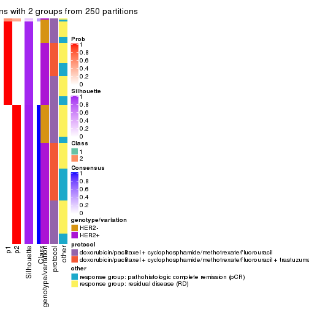</p>

</div>
<div id='tab-ATC-kmeans-consensus-heatmap-2'>
<pre><code class="r">consensus_heatmap(res, k = 3)
</code></pre>

<p>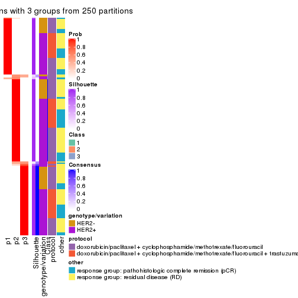</p>

</div>
<div id='tab-ATC-kmeans-consensus-heatmap-3'>
<pre><code class="r">consensus_heatmap(res, k = 4)
</code></pre>

<p>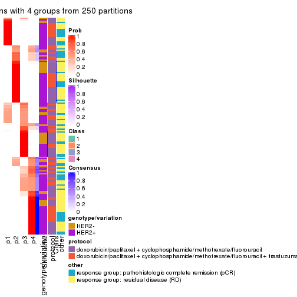</p>

</div>
<div id='tab-ATC-kmeans-consensus-heatmap-4'>
<pre><code class="r">consensus_heatmap(res, k = 5)
</code></pre>

<p>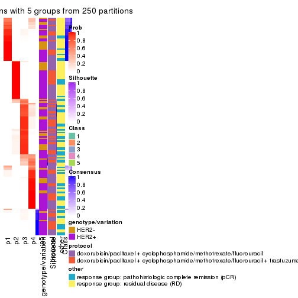</p>

</div>
<div id='tab-ATC-kmeans-consensus-heatmap-5'>
<pre><code class="r">consensus_heatmap(res, k = 6)
</code></pre>

<p>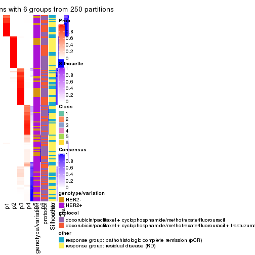</p>

</div>
</div>

Heatmaps for the membership of samples in all partitions to see how consistent they are:


<script>
$( function() {
	$( '#tabs-ATC-kmeans-membership-heatmap' ).tabs();
} );
</script>
<div id='tabs-ATC-kmeans-membership-heatmap'>
<ul>
<li><a href='#tab-ATC-kmeans-membership-heatmap-1'>k = 2</a></li>
<li><a href='#tab-ATC-kmeans-membership-heatmap-2'>k = 3</a></li>
<li><a href='#tab-ATC-kmeans-membership-heatmap-3'>k = 4</a></li>
<li><a href='#tab-ATC-kmeans-membership-heatmap-4'>k = 5</a></li>
<li><a href='#tab-ATC-kmeans-membership-heatmap-5'>k = 6</a></li>
</ul>
<div id='tab-ATC-kmeans-membership-heatmap-1'>
<pre><code class="r">membership_heatmap(res, k = 2)
</code></pre>

<p>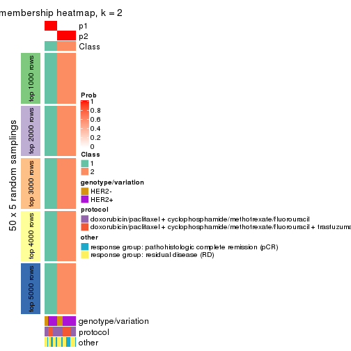</p>

</div>
<div id='tab-ATC-kmeans-membership-heatmap-2'>
<pre><code class="r">membership_heatmap(res, k = 3)
</code></pre>

<p>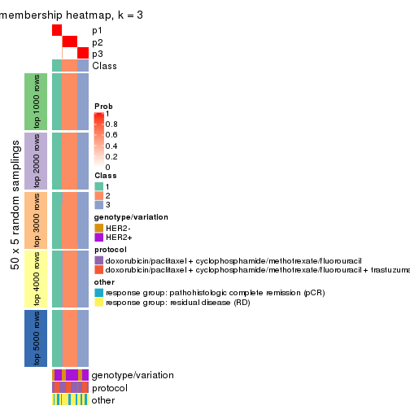</p>

</div>
<div id='tab-ATC-kmeans-membership-heatmap-3'>
<pre><code class="r">membership_heatmap(res, k = 4)
</code></pre>

<p>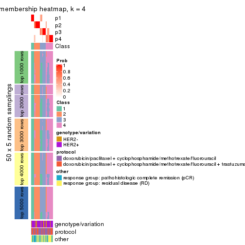</p>

</div>
<div id='tab-ATC-kmeans-membership-heatmap-4'>
<pre><code class="r">membership_heatmap(res, k = 5)
</code></pre>

<p>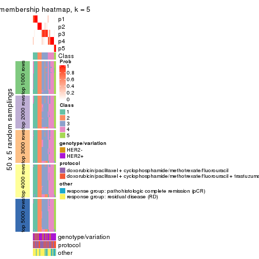</p>

</div>
<div id='tab-ATC-kmeans-membership-heatmap-5'>
<pre><code class="r">membership_heatmap(res, k = 6)
</code></pre>

<p>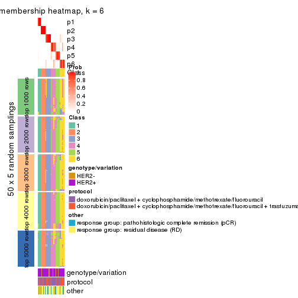</p>

</div>
</div>

As soon as we have had the classes for columns, we can look for signatures
which are significantly different between classes which can be candidate marks
for certain classes. Following are the heatmaps for signatures.


Signature heatmaps where rows are scaled:


<script>
$( function() {
	$( '#tabs-ATC-kmeans-get-signatures' ).tabs();
} );
</script>
<div id='tabs-ATC-kmeans-get-signatures'>
<ul>
<li><a href='#tab-ATC-kmeans-get-signatures-1'>k = 2</a></li>
<li><a href='#tab-ATC-kmeans-get-signatures-2'>k = 3</a></li>
<li><a href='#tab-ATC-kmeans-get-signatures-3'>k = 4</a></li>
<li><a href='#tab-ATC-kmeans-get-signatures-4'>k = 5</a></li>
<li><a href='#tab-ATC-kmeans-get-signatures-5'>k = 6</a></li>
</ul>
<div id='tab-ATC-kmeans-get-signatures-1'>
<pre><code class="r">get_signatures(res, k = 2)
</code></pre>

<pre><code>#&gt; Error: The width or height of the raster image is zero, maybe you forget to turn off the
#&gt; previous graphic device or it was corrupted. Run `dev.off()` to close it.
</code></pre>

<p></p>

</div>
<div id='tab-ATC-kmeans-get-signatures-2'>
<pre><code class="r">get_signatures(res, k = 3)
</code></pre>

<pre><code>#&gt; Error: The width or height of the raster image is zero, maybe you forget to turn off the
#&gt; previous graphic device or it was corrupted. Run `dev.off()` to close it.
</code></pre>

<p></p>

</div>
<div id='tab-ATC-kmeans-get-signatures-3'>
<pre><code class="r">get_signatures(res, k = 4)
</code></pre>

<pre><code>#&gt; Error: The width or height of the raster image is zero, maybe you forget to turn off the
#&gt; previous graphic device or it was corrupted. Run `dev.off()` to close it.
</code></pre>

<p></p>

</div>
<div id='tab-ATC-kmeans-get-signatures-4'>
<pre><code class="r">get_signatures(res, k = 5)
</code></pre>

<pre><code>#&gt; Error: The width or height of the raster image is zero, maybe you forget to turn off the
#&gt; previous graphic device or it was corrupted. Run `dev.off()` to close it.
</code></pre>

<p></p>

</div>
<div id='tab-ATC-kmeans-get-signatures-5'>
<pre><code class="r">get_signatures(res, k = 6)
</code></pre>

<pre><code>#&gt; Error: The width or height of the raster image is zero, maybe you forget to turn off the
#&gt; previous graphic device or it was corrupted. Run `dev.off()` to close it.
</code></pre>

<p></p>

</div>
</div>


Signature heatmaps where rows are not scaled:


<script>
$( function() {
	$( '#tabs-ATC-kmeans-get-signatures-no-scale' ).tabs();
} );
</script>
<div id='tabs-ATC-kmeans-get-signatures-no-scale'>
<ul>
<li><a href='#tab-ATC-kmeans-get-signatures-no-scale-1'>k = 2</a></li>
<li><a href='#tab-ATC-kmeans-get-signatures-no-scale-2'>k = 3</a></li>
<li><a href='#tab-ATC-kmeans-get-signatures-no-scale-3'>k = 4</a></li>
<li><a href='#tab-ATC-kmeans-get-signatures-no-scale-4'>k = 5</a></li>
<li><a href='#tab-ATC-kmeans-get-signatures-no-scale-5'>k = 6</a></li>
</ul>
<div id='tab-ATC-kmeans-get-signatures-no-scale-1'>
<pre><code class="r">get_signatures(res, k = 2, scale_rows = FALSE)
</code></pre>

<pre><code>#&gt; Error: The width or height of the raster image is zero, maybe you forget to turn off the
#&gt; previous graphic device or it was corrupted. Run `dev.off()` to close it.
</code></pre>

<p></p>

</div>
<div id='tab-ATC-kmeans-get-signatures-no-scale-2'>
<pre><code class="r">get_signatures(res, k = 3, scale_rows = FALSE)
</code></pre>

<pre><code>#&gt; Error: The width or height of the raster image is zero, maybe you forget to turn off the
#&gt; previous graphic device or it was corrupted. Run `dev.off()` to close it.
</code></pre>

<p></p>

</div>
<div id='tab-ATC-kmeans-get-signatures-no-scale-3'>
<pre><code class="r">get_signatures(res, k = 4, scale_rows = FALSE)
</code></pre>

<pre><code>#&gt; Error: The width or height of the raster image is zero, maybe you forget to turn off the
#&gt; previous graphic device or it was corrupted. Run `dev.off()` to close it.
</code></pre>

<p></p>

</div>
<div id='tab-ATC-kmeans-get-signatures-no-scale-4'>
<pre><code class="r">get_signatures(res, k = 5, scale_rows = FALSE)
</code></pre>

<pre><code>#&gt; Error: The width or height of the raster image is zero, maybe you forget to turn off the
#&gt; previous graphic device or it was corrupted. Run `dev.off()` to close it.
</code></pre>

<p></p>

</div>
<div id='tab-ATC-kmeans-get-signatures-no-scale-5'>
<pre><code class="r">get_signatures(res, k = 6, scale_rows = FALSE)
</code></pre>

<pre><code>#&gt; Error: The width or height of the raster image is zero, maybe you forget to turn off the
#&gt; previous graphic device or it was corrupted. Run `dev.off()` to close it.
</code></pre>

<p></p>

</div>
</div>


Compare the overlap of signatures from different k:

```r
compare_signatures(res)
```

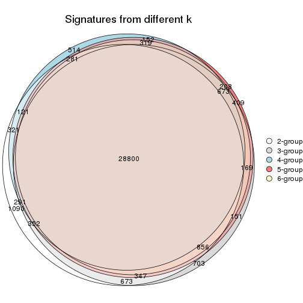

`get_signature()` returns a data frame invisibly. TO get the list of signatures, the function
call should be assigned to a variable explicitly. In following code, if `plot` argument is set
to `FALSE`, no heatmap is plotted while only the differential analysis is performed.

```r
# code only for demonstration
tb = get_signature(res, k = ..., plot = FALSE)
```

An example of the output of `tb` is:

```
#>   which_row         fdr    mean_1    mean_2 scaled_mean_1 scaled_mean_2 km
#> 1        38 0.042760348  8.373488  9.131774    -0.5533452     0.5164555  1
#> 2        40 0.018707592  7.106213  8.469186    -0.6173731     0.5762149  1
#> 3        55 0.019134737 10.221463 11.207825    -0.6159697     0.5749050  1
#> 4        59 0.006059896  5.921854  7.869574    -0.6899429     0.6439467  1
#> 5        60 0.018055526  8.928898 10.211722    -0.6204761     0.5791110  1
#> 6        98 0.009384629 15.714769 14.887706     0.6635654    -0.6193277  2
...
```

The columns in `tb` are:

1. `which_row`: row indices corresponding to the input matrix.
2. `fdr`: FDR for the differential test. 
3. `mean_x`: The mean value in group x.
4. `scaled_mean_x`: The mean value in group x after rows are scaled.
5. `km`: Row groups if k-means clustering is applied to rows.


UMAP plot which shows how samples are separated.


<script>
$( function() {
	$( '#tabs-ATC-kmeans-dimension-reduction' ).tabs();
} );
</script>
<div id='tabs-ATC-kmeans-dimension-reduction'>
<ul>
<li><a href='#tab-ATC-kmeans-dimension-reduction-1'>k = 2</a></li>
<li><a href='#tab-ATC-kmeans-dimension-reduction-2'>k = 3</a></li>
<li><a href='#tab-ATC-kmeans-dimension-reduction-3'>k = 4</a></li>
<li><a href='#tab-ATC-kmeans-dimension-reduction-4'>k = 5</a></li>
<li><a href='#tab-ATC-kmeans-dimension-reduction-5'>k = 6</a></li>
</ul>
<div id='tab-ATC-kmeans-dimension-reduction-1'>
<pre><code class="r">dimension_reduction(res, k = 2, method = &quot;UMAP&quot;)
</code></pre>

<p>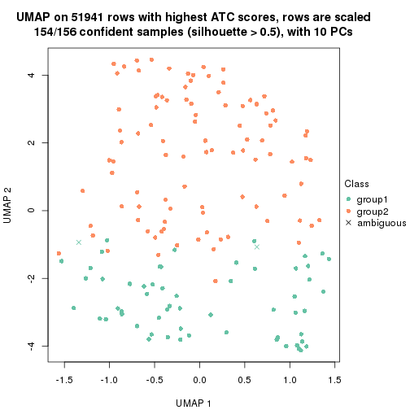</p>

</div>
<div id='tab-ATC-kmeans-dimension-reduction-2'>
<pre><code class="r">dimension_reduction(res, k = 3, method = &quot;UMAP&quot;)
</code></pre>

<p>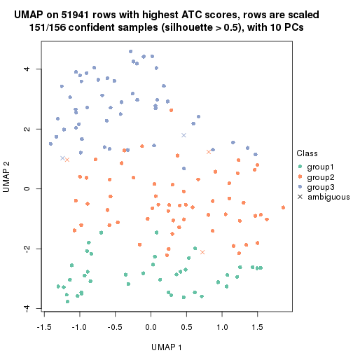</p>

</div>
<div id='tab-ATC-kmeans-dimension-reduction-3'>
<pre><code class="r">dimension_reduction(res, k = 4, method = &quot;UMAP&quot;)
</code></pre>

<p>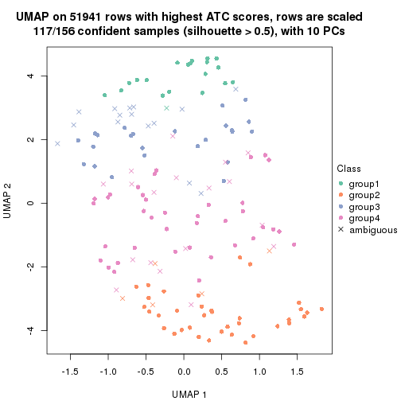</p>

</div>
<div id='tab-ATC-kmeans-dimension-reduction-4'>
<pre><code class="r">dimension_reduction(res, k = 5, method = &quot;UMAP&quot;)
</code></pre>

<p>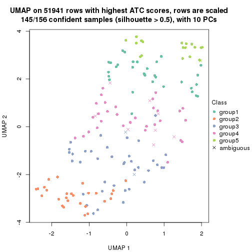</p>

</div>
<div id='tab-ATC-kmeans-dimension-reduction-5'>
<pre><code class="r">dimension_reduction(res, k = 6, method = &quot;UMAP&quot;)
</code></pre>

<p>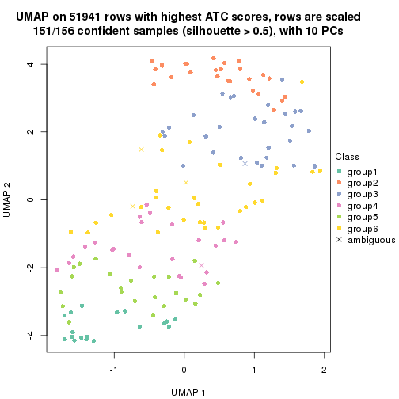</p>

</div>
</div>


Following heatmap shows how subgroups are split when increasing `k`:

```r
collect_classes(res)
```

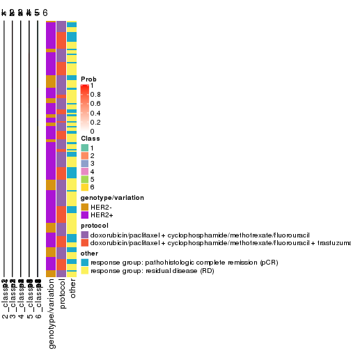


Test correlation between subgroups and known annotations. If the known
annotation is numeric, one-way ANOVA test is applied, and if the known
annotation is discrete, chi-squared contingency table test is applied.

```r
test_to_known_factors(res)
```

```
#>              n genotype/variation(p) protocol(p) other(p) k
#> ATC:kmeans 154                 1.000       0.939   0.9763 2
#> ATC:kmeans 151                 0.667       0.627   0.8708 3
#> ATC:kmeans 117                 0.374       0.631   0.3250 4
#> ATC:kmeans 145                 0.152       0.358   0.0332 5
#> ATC:kmeans 151                 0.298       0.462   0.0753 6
```


If matrix rows can be associated to genes, consider to use `functional_enrichment(res,
...)` to perform function enrichment for the signature genes. See [this vignette](http://bioconductor.org/packages/devel/bioc/vignettes/cola/inst/doc/functional_enrichment.html) for more detailed explanations.


 

---------------------------------------------------


### ATC:skmeans**


The object with results only for a single top-value method and a single partition method 
can be extracted as:

```r
res = res_list["ATC", "skmeans"]
# you can also extract it by
# res = res_list["ATC:skmeans"]
```

A summary of `res` and all the functions that can be applied to it:

```r
res
```

```
#> A 'ConsensusPartition' object with k = 2, 3, 4, 5, 6.
#>   On a matrix with 51941 rows and 156 columns.
#>   Top rows (1000, 2000, 3000, 4000, 5000) are extracted by 'ATC' method.
#>   Subgroups are detected by 'skmeans' method.
#>   Performed in total 1250 partitions by row resampling.
#>   Best k for subgroups seems to be 3.
#> 
#> Following methods can be applied to this 'ConsensusPartition' object:
#>  [1] "cola_report"             "collect_classes"         "collect_plots"          
#>  [4] "collect_stats"           "colnames"                "compare_signatures"     
#>  [7] "consensus_heatmap"       "dimension_reduction"     "functional_enrichment"  
#> [10] "get_anno_col"            "get_anno"                "get_classes"            
#> [13] "get_consensus"           "get_matrix"              "get_membership"         
#> [16] "get_param"               "get_signatures"          "get_stats"              
#> [19] "is_best_k"               "is_stable_k"             "membership_heatmap"     
#> [22] "ncol"                    "nrow"                    "plot_ecdf"              
#> [25] "rownames"                "select_partition_number" "show"                   
#> [28] "suggest_best_k"          "test_to_known_factors"
```

`collect_plots()` function collects all the plots made from `res` for all `k` (number of partitions)
into one single page to provide an easy and fast comparison between different `k`.

```r
collect_plots(res)
```

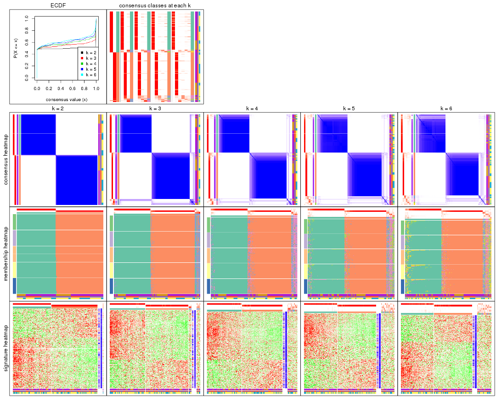

The plots are:

- The first row: a plot of the ECDF (empirical cumulative distribution
  function) curves of the consensus matrix for each `k` and the heatmap of
  predicted classes for each `k`.
- The second row: heatmaps of the consensus matrix for each `k`.
- The third row: heatmaps of the membership matrix for each `k`.
- The fouth row: heatmaps of the signatures for each `k`.

All the plots in panels can be made by individual functions and they are
plotted later in this section.

`select_partition_number()` produces several plots showing different
statistics for choosing "optimized" `k`. There are following statistics:

- ECDF curves of the consensus matrix for each `k`;
- 1-PAC. [The PAC
  score](https://en.wikipedia.org/wiki/Consensus_clustering#Over-interpretation_potential_of_consensus_clustering)
  measures the proportion of the ambiguous subgrouping.
- Mean silhouette score.
- Concordance. The mean probability of fiting the consensus class ids in all
  partitions.
- Area increased. Denote $A_k$ as the area under the ECDF curve for current
  `k`, the area increased is defined as $A_k - A_{k-1}$.
- Rand index. The percent of pairs of samples that are both in a same cluster
  or both are not in a same cluster in the partition of k and k-1.
- Jaccard index. The ratio of pairs of samples are both in a same cluster in
  the partition of k and k-1 and the pairs of samples are both in a same
  cluster in the partition k or k-1.

The detailed explanations of these statistics can be found in [the _cola_
vignette](http://bioconductor.org/packages/devel/bioc/vignettes/cola/inst/doc/cola.html#toc_13).

Generally speaking, lower PAC score, higher mean silhouette score or higher
concordance corresponds to better partition. Rand index and Jaccard index
measure how similar the current partition is compared to partition with `k-1`.
If they are too similar, we won't accept `k` is better than `k-1`.

```r
select_partition_number(res)
```

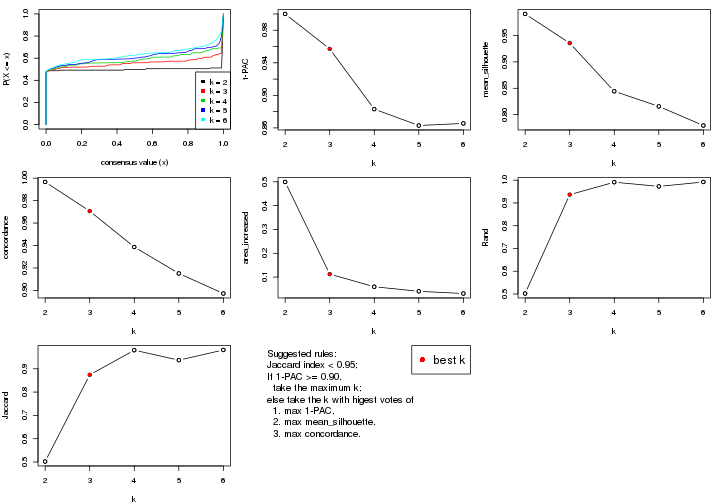

The numeric values for all these statistics can be obtained by `get_stats()`.

```r
get_stats(res)
```

```
#>   k 1-PAC mean_silhouette concordance area_increased  Rand Jaccard
#> 2 2 1.000           0.991       0.997         0.4991 0.502   0.502
#> 3 3 0.957           0.936       0.971         0.1126 0.936   0.874
#> 4 4 0.883           0.844       0.939         0.0596 0.991   0.980
#> 5 5 0.863           0.816       0.915         0.0405 0.973   0.937
#> 6 6 0.866           0.779       0.897         0.0312 0.992   0.981
```

`suggest_best_k()` suggests the best $k$ based on these statistics. The rules are as follows:

- All $k$ with Jaccard index larger than 0.95 are removed because increasing
  $k$ does not provide enough extra information. If all $k$ are removed, it is
  marked as no subgroup is detected.
- For all $k$ with 1-PAC score larger than 0.9, the maximal $k$ is taken as
  the best $k$, and other $k$ are marked as optional $k$.
- If it does not fit the second rule. The $k$ with the maximal vote of the
  highest 1-PAC score, highest mean silhouette, and highest concordance is
  taken as the best $k$.

```r
suggest_best_k(res)
```

```
#> [1] 3
#> attr(,"optional")
#> [1] 2
```

There is also optional best $k$ = 2 that is worth to check.

Following shows the table of the partitions (You need to click the **show/hide
code output** link to see it). The membership matrix (columns with name `p*`)
is inferred by
[`clue::cl_consensus()`](https://www.rdocumentation.org/link/cl_consensus?package=clue)
function with the `SE` method. Basically the value in the membership matrix
represents the probability to belong to a certain group. The finall class
label for an item is determined with the group with highest probability it
belongs to.

In `get_classes()` function, the entropy is calculated from the membership
matrix and the silhouette score is calculated from the consensus matrix.


<script>
$( function() {
	$( '#tabs-ATC-skmeans-get-classes' ).tabs();
} );
</script>
<div id='tabs-ATC-skmeans-get-classes'>
<ul>
<li><a href='#tab-ATC-skmeans-get-classes-1'>k = 2</a></li>
<li><a href='#tab-ATC-skmeans-get-classes-2'>k = 3</a></li>
<li><a href='#tab-ATC-skmeans-get-classes-3'>k = 4</a></li>
<li><a href='#tab-ATC-skmeans-get-classes-4'>k = 5</a></li>
<li><a href='#tab-ATC-skmeans-get-classes-5'>k = 6</a></li>
</ul>

<div id='tab-ATC-skmeans-get-classes-1'>
<p><a id='tab-ATC-skmeans-get-classes-1-a' style='color:#0366d6' href='#'>show/hide code output</a></p>
<pre><code class="r">cbind(get_classes(res, k = 2), get_membership(res, k = 2))
</code></pre>

<pre><code>#&gt;            class entropy silhouette    p1    p2
#&gt; GSM1232995     2  0.0000      0.994 0.000 1.000
#&gt; GSM1233002     1  0.0000      1.000 1.000 0.000
#&gt; GSM1233003     1  0.0000      1.000 1.000 0.000
#&gt; GSM1233014     2  0.0000      0.994 0.000 1.000
#&gt; GSM1233015     1  0.0000      1.000 1.000 0.000
#&gt; GSM1233016     1  0.0000      1.000 1.000 0.000
#&gt; GSM1233024     2  0.0000      0.994 0.000 1.000
#&gt; GSM1233049     1  0.0000      1.000 1.000 0.000
#&gt; GSM1233064     2  0.0000      0.994 0.000 1.000
#&gt; GSM1233068     2  0.9909      0.204 0.444 0.556
#&gt; GSM1233073     1  0.0000      1.000 1.000 0.000
#&gt; GSM1233093     1  0.0000      1.000 1.000 0.000
#&gt; GSM1233115     1  0.0000      1.000 1.000 0.000
#&gt; GSM1232992     2  0.0000      0.994 0.000 1.000
#&gt; GSM1232993     2  0.0000      0.994 0.000 1.000
#&gt; GSM1233005     2  0.0000      0.994 0.000 1.000
#&gt; GSM1233007     2  0.0000      0.994 0.000 1.000
#&gt; GSM1233010     1  0.0000      1.000 1.000 0.000
#&gt; GSM1233013     2  0.0000      0.994 0.000 1.000
#&gt; GSM1233018     2  0.0000      0.994 0.000 1.000
#&gt; GSM1233019     2  0.0000      0.994 0.000 1.000
#&gt; GSM1233021     2  0.0000      0.994 0.000 1.000
#&gt; GSM1233025     1  0.0000      1.000 1.000 0.000
#&gt; GSM1233029     2  0.0000      0.994 0.000 1.000
#&gt; GSM1233030     2  0.0000      0.994 0.000 1.000
#&gt; GSM1233031     1  0.0000      1.000 1.000 0.000
#&gt; GSM1233032     1  0.0000      1.000 1.000 0.000
#&gt; GSM1233035     2  0.0000      0.994 0.000 1.000
#&gt; GSM1233038     1  0.0000      1.000 1.000 0.000
#&gt; GSM1233039     2  0.0000      0.994 0.000 1.000
#&gt; GSM1233042     2  0.0000      0.994 0.000 1.000
#&gt; GSM1233043     2  0.0000      0.994 0.000 1.000
#&gt; GSM1233044     1  0.0000      1.000 1.000 0.000
#&gt; GSM1233046     1  0.0000      1.000 1.000 0.000
#&gt; GSM1233051     1  0.0000      1.000 1.000 0.000
#&gt; GSM1233054     1  0.0000      1.000 1.000 0.000
#&gt; GSM1233057     2  0.0000      0.994 0.000 1.000
#&gt; GSM1233060     2  0.0000      0.994 0.000 1.000
#&gt; GSM1233062     2  0.0000      0.994 0.000 1.000
#&gt; GSM1233075     2  0.0000      0.994 0.000 1.000
#&gt; GSM1233078     1  0.0000      1.000 1.000 0.000
#&gt; GSM1233079     1  0.0000      1.000 1.000 0.000
#&gt; GSM1233082     1  0.0000      1.000 1.000 0.000
#&gt; GSM1233083     1  0.0000      1.000 1.000 0.000
#&gt; GSM1233091     1  0.0000      1.000 1.000 0.000
#&gt; GSM1233095     1  0.0000      1.000 1.000 0.000
#&gt; GSM1233096     1  0.0000      1.000 1.000 0.000
#&gt; GSM1233101     1  0.0000      1.000 1.000 0.000
#&gt; GSM1233105     1  0.0000      1.000 1.000 0.000
#&gt; GSM1233117     2  0.0000      0.994 0.000 1.000
#&gt; GSM1233118     2  0.0000      0.994 0.000 1.000
#&gt; GSM1233001     2  0.0000      0.994 0.000 1.000
#&gt; GSM1233006     2  0.0000      0.994 0.000 1.000
#&gt; GSM1233008     2  0.0000      0.994 0.000 1.000
#&gt; GSM1233009     2  0.0000      0.994 0.000 1.000
#&gt; GSM1233017     2  0.0000      0.994 0.000 1.000
#&gt; GSM1233020     2  0.0000      0.994 0.000 1.000
#&gt; GSM1233022     2  0.0000      0.994 0.000 1.000
#&gt; GSM1233026     1  0.0000      1.000 1.000 0.000
#&gt; GSM1233028     1  0.0000      1.000 1.000 0.000
#&gt; GSM1233034     2  0.0000      0.994 0.000 1.000
#&gt; GSM1233040     1  0.0000      1.000 1.000 0.000
#&gt; GSM1233048     1  0.0000      1.000 1.000 0.000
#&gt; GSM1233056     1  0.0000      1.000 1.000 0.000
#&gt; GSM1233058     1  0.0000      1.000 1.000 0.000
#&gt; GSM1233059     1  0.0000      1.000 1.000 0.000
#&gt; GSM1233066     2  0.0000      0.994 0.000 1.000
#&gt; GSM1233071     2  0.0000      0.994 0.000 1.000
#&gt; GSM1233074     2  0.0000      0.994 0.000 1.000
#&gt; GSM1233076     2  0.0000      0.994 0.000 1.000
#&gt; GSM1233080     1  0.0000      1.000 1.000 0.000
#&gt; GSM1233088     2  0.0000      0.994 0.000 1.000
#&gt; GSM1233090     1  0.0000      1.000 1.000 0.000
#&gt; GSM1233092     2  0.0000      0.994 0.000 1.000
#&gt; GSM1233094     2  0.0000      0.994 0.000 1.000
#&gt; GSM1233097     2  0.0000      0.994 0.000 1.000
#&gt; GSM1233100     1  0.0000      1.000 1.000 0.000
#&gt; GSM1233104     2  0.0000      0.994 0.000 1.000
#&gt; GSM1233106     1  0.0000      1.000 1.000 0.000
#&gt; GSM1233111     1  0.0000      1.000 1.000 0.000
#&gt; GSM1233122     2  0.0000      0.994 0.000 1.000
#&gt; GSM1233146     2  0.0000      0.994 0.000 1.000
#&gt; GSM1232994     2  0.0000      0.994 0.000 1.000
#&gt; GSM1232996     2  0.0000      0.994 0.000 1.000
#&gt; GSM1232997     2  0.0000      0.994 0.000 1.000
#&gt; GSM1232998     2  0.0000      0.994 0.000 1.000
#&gt; GSM1232999     2  0.0000      0.994 0.000 1.000
#&gt; GSM1233000     2  0.0000      0.994 0.000 1.000
#&gt; GSM1233004     1  0.0000      1.000 1.000 0.000
#&gt; GSM1233011     2  0.0000      0.994 0.000 1.000
#&gt; GSM1233012     2  0.0000      0.994 0.000 1.000
#&gt; GSM1233023     2  0.0000      0.994 0.000 1.000
#&gt; GSM1233027     2  0.0000      0.994 0.000 1.000
#&gt; GSM1233033     1  0.0000      1.000 1.000 0.000
#&gt; GSM1233036     2  0.0000      0.994 0.000 1.000
#&gt; GSM1233037     1  0.0000      1.000 1.000 0.000
#&gt; GSM1233041     1  0.0000      1.000 1.000 0.000
#&gt; GSM1233045     2  0.0000      0.994 0.000 1.000
#&gt; GSM1233047     1  0.0000      1.000 1.000 0.000
#&gt; GSM1233050     1  0.0000      1.000 1.000 0.000
#&gt; GSM1233052     1  0.0000      1.000 1.000 0.000
#&gt; GSM1233053     1  0.0000      1.000 1.000 0.000
#&gt; GSM1233055     1  0.0000      1.000 1.000 0.000
#&gt; GSM1233061     1  0.0000      1.000 1.000 0.000
#&gt; GSM1233063     1  0.0000      1.000 1.000 0.000
#&gt; GSM1233065     2  0.0000      0.994 0.000 1.000
#&gt; GSM1233070     2  0.0000      0.994 0.000 1.000
#&gt; GSM1233077     2  0.0000      0.994 0.000 1.000
#&gt; GSM1233081     1  0.0000      1.000 1.000 0.000
#&gt; GSM1233084     1  0.0000      1.000 1.000 0.000
#&gt; GSM1233087     1  0.0000      1.000 1.000 0.000
#&gt; GSM1233089     2  0.0000      0.994 0.000 1.000
#&gt; GSM1233099     1  0.0000      1.000 1.000 0.000
#&gt; GSM1233112     1  0.0000      1.000 1.000 0.000
#&gt; GSM1233085     1  0.0000      1.000 1.000 0.000
#&gt; GSM1233098     2  0.0000      0.994 0.000 1.000
#&gt; GSM1233114     1  0.0000      1.000 1.000 0.000
#&gt; GSM1233119     1  0.0000      1.000 1.000 0.000
#&gt; GSM1233129     2  0.0000      0.994 0.000 1.000
#&gt; GSM1233132     1  0.0000      1.000 1.000 0.000
#&gt; GSM1233139     2  0.0000      0.994 0.000 1.000
#&gt; GSM1233143     2  0.0000      0.994 0.000 1.000
#&gt; GSM1233145     1  0.0000      1.000 1.000 0.000
#&gt; GSM1233067     2  0.0000      0.994 0.000 1.000
#&gt; GSM1233069     2  0.0000      0.994 0.000 1.000
#&gt; GSM1233072     2  0.0000      0.994 0.000 1.000
#&gt; GSM1233086     2  0.0000      0.994 0.000 1.000
#&gt; GSM1233102     1  0.0000      1.000 1.000 0.000
#&gt; GSM1233103     2  0.0000      0.994 0.000 1.000
#&gt; GSM1233107     2  0.0000      0.994 0.000 1.000
#&gt; GSM1233108     1  0.0000      1.000 1.000 0.000
#&gt; GSM1233109     1  0.0000      1.000 1.000 0.000
#&gt; GSM1233110     2  0.3879      0.914 0.076 0.924
#&gt; GSM1233113     2  0.0000      0.994 0.000 1.000
#&gt; GSM1233116     2  0.0000      0.994 0.000 1.000
#&gt; GSM1233120     1  0.0000      1.000 1.000 0.000
#&gt; GSM1233121     2  0.0000      0.994 0.000 1.000
#&gt; GSM1233123     2  0.0672      0.986 0.008 0.992
#&gt; GSM1233124     2  0.0000      0.994 0.000 1.000
#&gt; GSM1233125     1  0.0000      1.000 1.000 0.000
#&gt; GSM1233126     2  0.0000      0.994 0.000 1.000
#&gt; GSM1233127     2  0.0000      0.994 0.000 1.000
#&gt; GSM1233128     1  0.0000      1.000 1.000 0.000
#&gt; GSM1233130     2  0.0000      0.994 0.000 1.000
#&gt; GSM1233131     1  0.0000      1.000 1.000 0.000
#&gt; GSM1233133     1  0.0000      1.000 1.000 0.000
#&gt; GSM1233134     2  0.0000      0.994 0.000 1.000
#&gt; GSM1233135     2  0.0000      0.994 0.000 1.000
#&gt; GSM1233136     2  0.0000      0.994 0.000 1.000
#&gt; GSM1233137     1  0.0000      1.000 1.000 0.000
#&gt; GSM1233138     2  0.0000      0.994 0.000 1.000
#&gt; GSM1233140     1  0.0000      1.000 1.000 0.000
#&gt; GSM1233141     2  0.0000      0.994 0.000 1.000
#&gt; GSM1233142     2  0.0000      0.994 0.000 1.000
#&gt; GSM1233144     1  0.0000      1.000 1.000 0.000
#&gt; GSM1233147     2  0.0000      0.994 0.000 1.000
</code></pre>

<script>
$('#tab-ATC-skmeans-get-classes-1-a').parent().next().next().hide();
$('#tab-ATC-skmeans-get-classes-1-a').click(function(){
  $('#tab-ATC-skmeans-get-classes-1-a').parent().next().next().toggle();
  return(false);
});
</script>
</div>

<div id='tab-ATC-skmeans-get-classes-2'>
<p><a id='tab-ATC-skmeans-get-classes-2-a' style='color:#0366d6' href='#'>show/hide code output</a></p>
<pre><code class="r">cbind(get_classes(res, k = 3), get_membership(res, k = 3))
</code></pre>

<pre><code>#&gt;            class entropy silhouette    p1    p2    p3
#&gt; GSM1232995     2  0.0000      0.983 0.000 1.000 0.000
#&gt; GSM1233002     1  0.0000      0.986 1.000 0.000 0.000
#&gt; GSM1233003     1  0.0000      0.986 1.000 0.000 0.000
#&gt; GSM1233014     2  0.0000      0.983 0.000 1.000 0.000
#&gt; GSM1233015     1  0.0000      0.986 1.000 0.000 0.000
#&gt; GSM1233016     3  0.0892      0.706 0.020 0.000 0.980
#&gt; GSM1233024     2  0.0000      0.983 0.000 1.000 0.000
#&gt; GSM1233049     1  0.0000      0.986 1.000 0.000 0.000
#&gt; GSM1233064     2  0.0000      0.983 0.000 1.000 0.000
#&gt; GSM1233068     3  0.3587      0.703 0.088 0.020 0.892
#&gt; GSM1233073     1  0.5733      0.450 0.676 0.000 0.324
#&gt; GSM1233093     1  0.0000      0.986 1.000 0.000 0.000
#&gt; GSM1233115     1  0.0000      0.986 1.000 0.000 0.000
#&gt; GSM1232992     2  0.0000      0.983 0.000 1.000 0.000
#&gt; GSM1232993     2  0.0000      0.983 0.000 1.000 0.000
#&gt; GSM1233005     2  0.0000      0.983 0.000 1.000 0.000
#&gt; GSM1233007     2  0.0000      0.983 0.000 1.000 0.000
#&gt; GSM1233010     1  0.0000      0.986 1.000 0.000 0.000
#&gt; GSM1233013     2  0.0000      0.983 0.000 1.000 0.000
#&gt; GSM1233018     2  0.0000      0.983 0.000 1.000 0.000
#&gt; GSM1233019     2  0.0000      0.983 0.000 1.000 0.000
#&gt; GSM1233021     2  0.0000      0.983 0.000 1.000 0.000
#&gt; GSM1233025     1  0.0000      0.986 1.000 0.000 0.000
#&gt; GSM1233029     2  0.0000      0.983 0.000 1.000 0.000
#&gt; GSM1233030     2  0.0000      0.983 0.000 1.000 0.000
#&gt; GSM1233031     1  0.4062      0.778 0.836 0.000 0.164
#&gt; GSM1233032     1  0.0000      0.986 1.000 0.000 0.000
#&gt; GSM1233035     3  0.1860      0.724 0.000 0.052 0.948
#&gt; GSM1233038     1  0.0000      0.986 1.000 0.000 0.000
#&gt; GSM1233039     2  0.2165      0.920 0.000 0.936 0.064
#&gt; GSM1233042     2  0.4702      0.700 0.000 0.788 0.212
#&gt; GSM1233043     2  0.0237      0.979 0.000 0.996 0.004
#&gt; GSM1233044     1  0.0000      0.986 1.000 0.000 0.000
#&gt; GSM1233046     1  0.0000      0.986 1.000 0.000 0.000
#&gt; GSM1233051     1  0.0000      0.986 1.000 0.000 0.000
#&gt; GSM1233054     1  0.0000      0.986 1.000 0.000 0.000
#&gt; GSM1233057     2  0.3816      0.810 0.000 0.852 0.148
#&gt; GSM1233060     2  0.3340      0.851 0.000 0.880 0.120
#&gt; GSM1233062     2  0.0000      0.983 0.000 1.000 0.000
#&gt; GSM1233075     2  0.0000      0.983 0.000 1.000 0.000
#&gt; GSM1233078     1  0.1163      0.958 0.972 0.000 0.028
#&gt; GSM1233079     1  0.0000      0.986 1.000 0.000 0.000
#&gt; GSM1233082     1  0.0000      0.986 1.000 0.000 0.000
#&gt; GSM1233083     1  0.0000      0.986 1.000 0.000 0.000
#&gt; GSM1233091     1  0.0237      0.982 0.996 0.000 0.004
#&gt; GSM1233095     1  0.0000      0.986 1.000 0.000 0.000
#&gt; GSM1233096     1  0.0000      0.986 1.000 0.000 0.000
#&gt; GSM1233101     1  0.0000      0.986 1.000 0.000 0.000
#&gt; GSM1233105     1  0.0000      0.986 1.000 0.000 0.000
#&gt; GSM1233117     2  0.0000      0.983 0.000 1.000 0.000
#&gt; GSM1233118     2  0.0000      0.983 0.000 1.000 0.000
#&gt; GSM1233001     2  0.0000      0.983 0.000 1.000 0.000
#&gt; GSM1233006     2  0.0000      0.983 0.000 1.000 0.000
#&gt; GSM1233008     2  0.0000      0.983 0.000 1.000 0.000
#&gt; GSM1233009     2  0.0000      0.983 0.000 1.000 0.000
#&gt; GSM1233017     2  0.0000      0.983 0.000 1.000 0.000
#&gt; GSM1233020     2  0.0000      0.983 0.000 1.000 0.000
#&gt; GSM1233022     2  0.0000      0.983 0.000 1.000 0.000
#&gt; GSM1233026     3  0.5810      0.468 0.336 0.000 0.664
#&gt; GSM1233028     1  0.4555      0.713 0.800 0.000 0.200
#&gt; GSM1233034     2  0.0000      0.983 0.000 1.000 0.000
#&gt; GSM1233040     1  0.0000      0.986 1.000 0.000 0.000
#&gt; GSM1233048     1  0.0000      0.986 1.000 0.000 0.000
#&gt; GSM1233056     1  0.0000      0.986 1.000 0.000 0.000
#&gt; GSM1233058     3  0.6302      0.133 0.480 0.000 0.520
#&gt; GSM1233059     1  0.0000      0.986 1.000 0.000 0.000
#&gt; GSM1233066     3  0.2448      0.728 0.000 0.076 0.924
#&gt; GSM1233071     2  0.0000      0.983 0.000 1.000 0.000
#&gt; GSM1233074     2  0.0000      0.983 0.000 1.000 0.000
#&gt; GSM1233076     2  0.0000      0.983 0.000 1.000 0.000
#&gt; GSM1233080     1  0.0000      0.986 1.000 0.000 0.000
#&gt; GSM1233088     2  0.1860      0.933 0.000 0.948 0.052
#&gt; GSM1233090     1  0.0000      0.986 1.000 0.000 0.000
#&gt; GSM1233092     2  0.0000      0.983 0.000 1.000 0.000
#&gt; GSM1233094     2  0.0000      0.983 0.000 1.000 0.000
#&gt; GSM1233097     2  0.0000      0.983 0.000 1.000 0.000
#&gt; GSM1233100     1  0.0000      0.986 1.000 0.000 0.000
#&gt; GSM1233104     2  0.0000      0.983 0.000 1.000 0.000
#&gt; GSM1233106     1  0.0000      0.986 1.000 0.000 0.000
#&gt; GSM1233111     1  0.0000      0.986 1.000 0.000 0.000
#&gt; GSM1233122     2  0.0000      0.983 0.000 1.000 0.000
#&gt; GSM1233146     2  0.6180      0.187 0.000 0.584 0.416
#&gt; GSM1232994     2  0.0000      0.983 0.000 1.000 0.000
#&gt; GSM1232996     2  0.0000      0.983 0.000 1.000 0.000
#&gt; GSM1232997     2  0.0000      0.983 0.000 1.000 0.000
#&gt; GSM1232998     2  0.0000      0.983 0.000 1.000 0.000
#&gt; GSM1232999     2  0.0000      0.983 0.000 1.000 0.000
#&gt; GSM1233000     2  0.0000      0.983 0.000 1.000 0.000
#&gt; GSM1233004     1  0.0000      0.986 1.000 0.000 0.000
#&gt; GSM1233011     2  0.0000      0.983 0.000 1.000 0.000
#&gt; GSM1233012     2  0.0000      0.983 0.000 1.000 0.000
#&gt; GSM1233023     2  0.0000      0.983 0.000 1.000 0.000
#&gt; GSM1233027     2  0.0000      0.983 0.000 1.000 0.000
#&gt; GSM1233033     1  0.0000      0.986 1.000 0.000 0.000
#&gt; GSM1233036     2  0.0892      0.965 0.000 0.980 0.020
#&gt; GSM1233037     3  0.6215      0.288 0.428 0.000 0.572
#&gt; GSM1233041     1  0.0000      0.986 1.000 0.000 0.000
#&gt; GSM1233045     2  0.0000      0.983 0.000 1.000 0.000
#&gt; GSM1233047     1  0.0000      0.986 1.000 0.000 0.000
#&gt; GSM1233050     1  0.0000      0.986 1.000 0.000 0.000
#&gt; GSM1233052     1  0.0000      0.986 1.000 0.000 0.000
#&gt; GSM1233053     1  0.0000      0.986 1.000 0.000 0.000
#&gt; GSM1233055     1  0.0000      0.986 1.000 0.000 0.000
#&gt; GSM1233061     1  0.1163      0.958 0.972 0.000 0.028
#&gt; GSM1233063     1  0.0000      0.986 1.000 0.000 0.000
#&gt; GSM1233065     2  0.0000      0.983 0.000 1.000 0.000
#&gt; GSM1233070     2  0.0000      0.983 0.000 1.000 0.000
#&gt; GSM1233077     2  0.0000      0.983 0.000 1.000 0.000
#&gt; GSM1233081     1  0.0000      0.986 1.000 0.000 0.000
#&gt; GSM1233084     1  0.0000      0.986 1.000 0.000 0.000
#&gt; GSM1233087     1  0.0000      0.986 1.000 0.000 0.000
#&gt; GSM1233089     2  0.0000      0.983 0.000 1.000 0.000
#&gt; GSM1233099     1  0.0000      0.986 1.000 0.000 0.000
#&gt; GSM1233112     1  0.0000      0.986 1.000 0.000 0.000
#&gt; GSM1233085     1  0.0000      0.986 1.000 0.000 0.000
#&gt; GSM1233098     2  0.0000      0.983 0.000 1.000 0.000
#&gt; GSM1233114     1  0.0000      0.986 1.000 0.000 0.000
#&gt; GSM1233119     1  0.2165      0.916 0.936 0.000 0.064
#&gt; GSM1233129     2  0.0000      0.983 0.000 1.000 0.000
#&gt; GSM1233132     1  0.0000      0.986 1.000 0.000 0.000
#&gt; GSM1233139     2  0.0000      0.983 0.000 1.000 0.000
#&gt; GSM1233143     2  0.0000      0.983 0.000 1.000 0.000
#&gt; GSM1233145     1  0.0000      0.986 1.000 0.000 0.000
#&gt; GSM1233067     2  0.0000      0.983 0.000 1.000 0.000
#&gt; GSM1233069     2  0.0000      0.983 0.000 1.000 0.000
#&gt; GSM1233072     2  0.0000      0.983 0.000 1.000 0.000
#&gt; GSM1233086     2  0.0000      0.983 0.000 1.000 0.000
#&gt; GSM1233102     1  0.0000      0.986 1.000 0.000 0.000
#&gt; GSM1233103     2  0.1753      0.938 0.000 0.952 0.048
#&gt; GSM1233107     3  0.5058      0.615 0.000 0.244 0.756
#&gt; GSM1233108     1  0.0000      0.986 1.000 0.000 0.000
#&gt; GSM1233109     1  0.0000      0.986 1.000 0.000 0.000
#&gt; GSM1233110     3  0.7044      0.467 0.032 0.348 0.620
#&gt; GSM1233113     2  0.0000      0.983 0.000 1.000 0.000
#&gt; GSM1233116     2  0.0000      0.983 0.000 1.000 0.000
#&gt; GSM1233120     1  0.0000      0.986 1.000 0.000 0.000
#&gt; GSM1233121     2  0.0000      0.983 0.000 1.000 0.000
#&gt; GSM1233123     3  0.6421      0.280 0.004 0.424 0.572
#&gt; GSM1233124     2  0.0237      0.979 0.000 0.996 0.004
#&gt; GSM1233125     1  0.0000      0.986 1.000 0.000 0.000
#&gt; GSM1233126     2  0.0000      0.983 0.000 1.000 0.000
#&gt; GSM1233127     2  0.0000      0.983 0.000 1.000 0.000
#&gt; GSM1233128     1  0.0000      0.986 1.000 0.000 0.000
#&gt; GSM1233130     2  0.3340      0.853 0.000 0.880 0.120
#&gt; GSM1233131     1  0.0000      0.986 1.000 0.000 0.000
#&gt; GSM1233133     1  0.0000      0.986 1.000 0.000 0.000
#&gt; GSM1233134     2  0.0000      0.983 0.000 1.000 0.000
#&gt; GSM1233135     2  0.0000      0.983 0.000 1.000 0.000
#&gt; GSM1233136     2  0.0000      0.983 0.000 1.000 0.000
#&gt; GSM1233137     1  0.0000      0.986 1.000 0.000 0.000
#&gt; GSM1233138     2  0.0000      0.983 0.000 1.000 0.000
#&gt; GSM1233140     1  0.0000      0.986 1.000 0.000 0.000
#&gt; GSM1233141     2  0.0000      0.983 0.000 1.000 0.000
#&gt; GSM1233142     2  0.0000      0.983 0.000 1.000 0.000
#&gt; GSM1233144     1  0.0000      0.986 1.000 0.000 0.000
#&gt; GSM1233147     2  0.0000      0.983 0.000 1.000 0.000
</code></pre>

<script>
$('#tab-ATC-skmeans-get-classes-2-a').parent().next().next().hide();
$('#tab-ATC-skmeans-get-classes-2-a').click(function(){
  $('#tab-ATC-skmeans-get-classes-2-a').parent().next().next().toggle();
  return(false);
});
</script>
</div>

<div id='tab-ATC-skmeans-get-classes-3'>
<p><a id='tab-ATC-skmeans-get-classes-3-a' style='color:#0366d6' href='#'>show/hide code output</a></p>
<pre><code class="r">cbind(get_classes(res, k = 4), get_membership(res, k = 4))
</code></pre>

<pre><code>#&gt;            class entropy silhouette    p1    p2    p3    p4
#&gt; GSM1232995     2  0.0000     0.9493 0.000 1.000 0.000 0.000
#&gt; GSM1233002     1  0.0000     0.9699 1.000 0.000 0.000 0.000
#&gt; GSM1233003     1  0.0000     0.9699 1.000 0.000 0.000 0.000
#&gt; GSM1233014     2  0.0000     0.9493 0.000 1.000 0.000 0.000
#&gt; GSM1233015     1  0.0000     0.9699 1.000 0.000 0.000 0.000
#&gt; GSM1233016     4  0.5186    -0.1307 0.016 0.000 0.344 0.640
#&gt; GSM1233024     2  0.0000     0.9493 0.000 1.000 0.000 0.000
#&gt; GSM1233049     1  0.0000     0.9699 1.000 0.000 0.000 0.000
#&gt; GSM1233064     2  0.1151     0.9249 0.000 0.968 0.024 0.008
#&gt; GSM1233068     4  0.2131     0.1488 0.040 0.008 0.016 0.936
#&gt; GSM1233073     1  0.6805     0.3249 0.592 0.000 0.260 0.148
#&gt; GSM1233093     1  0.0000     0.9699 1.000 0.000 0.000 0.000
#&gt; GSM1233115     1  0.0000     0.9699 1.000 0.000 0.000 0.000
#&gt; GSM1232992     2  0.0000     0.9493 0.000 1.000 0.000 0.000
#&gt; GSM1232993     2  0.0188     0.9464 0.000 0.996 0.000 0.004
#&gt; GSM1233005     2  0.0000     0.9493 0.000 1.000 0.000 0.000
#&gt; GSM1233007     2  0.0188     0.9464 0.000 0.996 0.000 0.004
#&gt; GSM1233010     1  0.0188     0.9669 0.996 0.000 0.004 0.000
#&gt; GSM1233013     2  0.0000     0.9493 0.000 1.000 0.000 0.000
#&gt; GSM1233018     2  0.0000     0.9493 0.000 1.000 0.000 0.000
#&gt; GSM1233019     2  0.0000     0.9493 0.000 1.000 0.000 0.000
#&gt; GSM1233021     2  0.0000     0.9493 0.000 1.000 0.000 0.000
#&gt; GSM1233025     1  0.0000     0.9699 1.000 0.000 0.000 0.000
#&gt; GSM1233029     2  0.0000     0.9493 0.000 1.000 0.000 0.000
#&gt; GSM1233030     2  0.0000     0.9493 0.000 1.000 0.000 0.000
#&gt; GSM1233031     1  0.6187     0.3363 0.596 0.000 0.336 0.068
#&gt; GSM1233032     1  0.0000     0.9699 1.000 0.000 0.000 0.000
#&gt; GSM1233035     4  0.3117     0.0922 0.000 0.028 0.092 0.880
#&gt; GSM1233038     1  0.0000     0.9699 1.000 0.000 0.000 0.000
#&gt; GSM1233039     2  0.5085     0.5872 0.000 0.708 0.032 0.260
#&gt; GSM1233042     4  0.7047    -0.0888 0.000 0.436 0.120 0.444
#&gt; GSM1233043     2  0.4312     0.7581 0.000 0.812 0.056 0.132
#&gt; GSM1233044     1  0.0000     0.9699 1.000 0.000 0.000 0.000
#&gt; GSM1233046     1  0.1940     0.9016 0.924 0.000 0.076 0.000
#&gt; GSM1233051     1  0.0000     0.9699 1.000 0.000 0.000 0.000
#&gt; GSM1233054     1  0.0188     0.9669 0.996 0.000 0.004 0.000
#&gt; GSM1233057     2  0.4920     0.6656 0.000 0.756 0.052 0.192
#&gt; GSM1233060     2  0.7323    -0.1462 0.000 0.456 0.388 0.156
#&gt; GSM1233062     2  0.0000     0.9493 0.000 1.000 0.000 0.000
#&gt; GSM1233075     2  0.0000     0.9493 0.000 1.000 0.000 0.000
#&gt; GSM1233078     1  0.3168     0.8580 0.884 0.000 0.060 0.056
#&gt; GSM1233079     1  0.0000     0.9699 1.000 0.000 0.000 0.000
#&gt; GSM1233082     1  0.0000     0.9699 1.000 0.000 0.000 0.000
#&gt; GSM1233083     1  0.0000     0.9699 1.000 0.000 0.000 0.000
#&gt; GSM1233091     1  0.4050     0.7794 0.820 0.000 0.144 0.036
#&gt; GSM1233095     1  0.0000     0.9699 1.000 0.000 0.000 0.000
#&gt; GSM1233096     1  0.0000     0.9699 1.000 0.000 0.000 0.000
#&gt; GSM1233101     1  0.0000     0.9699 1.000 0.000 0.000 0.000
#&gt; GSM1233105     1  0.0000     0.9699 1.000 0.000 0.000 0.000
#&gt; GSM1233117     2  0.0000     0.9493 0.000 1.000 0.000 0.000
#&gt; GSM1233118     2  0.0000     0.9493 0.000 1.000 0.000 0.000
#&gt; GSM1233001     2  0.0000     0.9493 0.000 1.000 0.000 0.000
#&gt; GSM1233006     2  0.0000     0.9493 0.000 1.000 0.000 0.000
#&gt; GSM1233008     2  0.0000     0.9493 0.000 1.000 0.000 0.000
#&gt; GSM1233009     2  0.0000     0.9493 0.000 1.000 0.000 0.000
#&gt; GSM1233017     2  0.0000     0.9493 0.000 1.000 0.000 0.000
#&gt; GSM1233020     2  0.0000     0.9493 0.000 1.000 0.000 0.000
#&gt; GSM1233022     2  0.0000     0.9493 0.000 1.000 0.000 0.000
#&gt; GSM1233026     3  0.6653     0.1534 0.180 0.000 0.624 0.196
#&gt; GSM1233028     1  0.5250     0.6558 0.744 0.000 0.080 0.176
#&gt; GSM1233034     2  0.0000     0.9493 0.000 1.000 0.000 0.000
#&gt; GSM1233040     1  0.0000     0.9699 1.000 0.000 0.000 0.000
#&gt; GSM1233048     1  0.0000     0.9699 1.000 0.000 0.000 0.000
#&gt; GSM1233056     1  0.0000     0.9699 1.000 0.000 0.000 0.000
#&gt; GSM1233058     4  0.6690     0.0479 0.188 0.000 0.192 0.620
#&gt; GSM1233059     1  0.0000     0.9699 1.000 0.000 0.000 0.000
#&gt; GSM1233066     4  0.6135    -0.2159 0.000 0.068 0.324 0.608
#&gt; GSM1233071     2  0.0000     0.9493 0.000 1.000 0.000 0.000
#&gt; GSM1233074     2  0.0000     0.9493 0.000 1.000 0.000 0.000
#&gt; GSM1233076     2  0.0000     0.9493 0.000 1.000 0.000 0.000
#&gt; GSM1233080     1  0.0000     0.9699 1.000 0.000 0.000 0.000
#&gt; GSM1233088     2  0.6919     0.1173 0.000 0.528 0.352 0.120
#&gt; GSM1233090     1  0.0000     0.9699 1.000 0.000 0.000 0.000
#&gt; GSM1233092     2  0.0000     0.9493 0.000 1.000 0.000 0.000
#&gt; GSM1233094     2  0.2775     0.8584 0.000 0.896 0.084 0.020
#&gt; GSM1233097     2  0.1938     0.8976 0.000 0.936 0.012 0.052
#&gt; GSM1233100     1  0.0188     0.9668 0.996 0.000 0.004 0.000
#&gt; GSM1233104     2  0.0000     0.9493 0.000 1.000 0.000 0.000
#&gt; GSM1233106     1  0.0336     0.9637 0.992 0.000 0.000 0.008
#&gt; GSM1233111     1  0.0000     0.9699 1.000 0.000 0.000 0.000
#&gt; GSM1233122     2  0.0000     0.9493 0.000 1.000 0.000 0.000
#&gt; GSM1233146     2  0.7438    -0.0142 0.000 0.512 0.244 0.244
#&gt; GSM1232994     2  0.0000     0.9493 0.000 1.000 0.000 0.000
#&gt; GSM1232996     2  0.0000     0.9493 0.000 1.000 0.000 0.000
#&gt; GSM1232997     2  0.0000     0.9493 0.000 1.000 0.000 0.000
#&gt; GSM1232998     2  0.0000     0.9493 0.000 1.000 0.000 0.000
#&gt; GSM1232999     2  0.0000     0.9493 0.000 1.000 0.000 0.000
#&gt; GSM1233000     2  0.0000     0.9493 0.000 1.000 0.000 0.000
#&gt; GSM1233004     1  0.0000     0.9699 1.000 0.000 0.000 0.000
#&gt; GSM1233011     2  0.0000     0.9493 0.000 1.000 0.000 0.000
#&gt; GSM1233012     2  0.0000     0.9493 0.000 1.000 0.000 0.000
#&gt; GSM1233023     2  0.0000     0.9493 0.000 1.000 0.000 0.000
#&gt; GSM1233027     2  0.0000     0.9493 0.000 1.000 0.000 0.000
#&gt; GSM1233033     1  0.0000     0.9699 1.000 0.000 0.000 0.000
#&gt; GSM1233036     2  0.2281     0.8649 0.000 0.904 0.000 0.096
#&gt; GSM1233037     4  0.5998     0.0701 0.240 0.000 0.092 0.668
#&gt; GSM1233041     1  0.0000     0.9699 1.000 0.000 0.000 0.000
#&gt; GSM1233045     2  0.2363     0.8827 0.000 0.920 0.024 0.056
#&gt; GSM1233047     1  0.0000     0.9699 1.000 0.000 0.000 0.000
#&gt; GSM1233050     1  0.0000     0.9699 1.000 0.000 0.000 0.000
#&gt; GSM1233052     1  0.0000     0.9699 1.000 0.000 0.000 0.000
#&gt; GSM1233053     1  0.0000     0.9699 1.000 0.000 0.000 0.000
#&gt; GSM1233055     1  0.0000     0.9699 1.000 0.000 0.000 0.000
#&gt; GSM1233061     1  0.5022     0.5995 0.708 0.000 0.264 0.028
#&gt; GSM1233063     1  0.0000     0.9699 1.000 0.000 0.000 0.000
#&gt; GSM1233065     2  0.0000     0.9493 0.000 1.000 0.000 0.000
#&gt; GSM1233070     2  0.0000     0.9493 0.000 1.000 0.000 0.000
#&gt; GSM1233077     2  0.0000     0.9493 0.000 1.000 0.000 0.000
#&gt; GSM1233081     1  0.0000     0.9699 1.000 0.000 0.000 0.000
#&gt; GSM1233084     1  0.0000     0.9699 1.000 0.000 0.000 0.000
#&gt; GSM1233087     1  0.0000     0.9699 1.000 0.000 0.000 0.000
#&gt; GSM1233089     2  0.0000     0.9493 0.000 1.000 0.000 0.000
#&gt; GSM1233099     1  0.0376     0.9638 0.992 0.000 0.004 0.004
#&gt; GSM1233112     1  0.0000     0.9699 1.000 0.000 0.000 0.000
#&gt; GSM1233085     1  0.0000     0.9699 1.000 0.000 0.000 0.000
#&gt; GSM1233098     2  0.0000     0.9493 0.000 1.000 0.000 0.000
#&gt; GSM1233114     1  0.0000     0.9699 1.000 0.000 0.000 0.000
#&gt; GSM1233119     1  0.3090     0.8604 0.888 0.000 0.056 0.056
#&gt; GSM1233129     2  0.0000     0.9493 0.000 1.000 0.000 0.000
#&gt; GSM1233132     1  0.0000     0.9699 1.000 0.000 0.000 0.000
#&gt; GSM1233139     2  0.0000     0.9493 0.000 1.000 0.000 0.000
#&gt; GSM1233143     2  0.0000     0.9493 0.000 1.000 0.000 0.000
#&gt; GSM1233145     1  0.0000     0.9699 1.000 0.000 0.000 0.000
#&gt; GSM1233067     2  0.0000     0.9493 0.000 1.000 0.000 0.000
#&gt; GSM1233069     2  0.0000     0.9493 0.000 1.000 0.000 0.000
#&gt; GSM1233072     2  0.0000     0.9493 0.000 1.000 0.000 0.000
#&gt; GSM1233086     2  0.0000     0.9493 0.000 1.000 0.000 0.000
#&gt; GSM1233102     1  0.0000     0.9699 1.000 0.000 0.000 0.000
#&gt; GSM1233103     2  0.6757     0.1131 0.000 0.524 0.376 0.100
#&gt; GSM1233107     3  0.7003     0.1760 0.000 0.116 0.460 0.424
#&gt; GSM1233108     1  0.0000     0.9699 1.000 0.000 0.000 0.000
#&gt; GSM1233109     1  0.0000     0.9699 1.000 0.000 0.000 0.000
#&gt; GSM1233110     3  0.3667     0.4108 0.000 0.056 0.856 0.088
#&gt; GSM1233113     2  0.0000     0.9493 0.000 1.000 0.000 0.000
#&gt; GSM1233116     2  0.0000     0.9493 0.000 1.000 0.000 0.000
#&gt; GSM1233120     1  0.0000     0.9699 1.000 0.000 0.000 0.000
#&gt; GSM1233121     2  0.0000     0.9493 0.000 1.000 0.000 0.000
#&gt; GSM1233123     3  0.6215     0.2922 0.000 0.128 0.664 0.208
#&gt; GSM1233124     2  0.3545     0.7712 0.000 0.828 0.164 0.008
#&gt; GSM1233125     1  0.0000     0.9699 1.000 0.000 0.000 0.000
#&gt; GSM1233126     2  0.0188     0.9464 0.000 0.996 0.000 0.004
#&gt; GSM1233127     2  0.0000     0.9493 0.000 1.000 0.000 0.000
#&gt; GSM1233128     1  0.0000     0.9699 1.000 0.000 0.000 0.000
#&gt; GSM1233130     2  0.6383     0.2362 0.000 0.568 0.356 0.076
#&gt; GSM1233131     1  0.0000     0.9699 1.000 0.000 0.000 0.000
#&gt; GSM1233133     1  0.0000     0.9699 1.000 0.000 0.000 0.000
#&gt; GSM1233134     2  0.0000     0.9493 0.000 1.000 0.000 0.000
#&gt; GSM1233135     2  0.0000     0.9493 0.000 1.000 0.000 0.000
#&gt; GSM1233136     2  0.0469     0.9404 0.000 0.988 0.012 0.000
#&gt; GSM1233137     1  0.0000     0.9699 1.000 0.000 0.000 0.000
#&gt; GSM1233138     2  0.0000     0.9493 0.000 1.000 0.000 0.000
#&gt; GSM1233140     1  0.0000     0.9699 1.000 0.000 0.000 0.000
#&gt; GSM1233141     2  0.0000     0.9493 0.000 1.000 0.000 0.000
#&gt; GSM1233142     2  0.0000     0.9493 0.000 1.000 0.000 0.000
#&gt; GSM1233144     1  0.0000     0.9699 1.000 0.000 0.000 0.000
#&gt; GSM1233147     2  0.0000     0.9493 0.000 1.000 0.000 0.000
</code></pre>

<script>
$('#tab-ATC-skmeans-get-classes-3-a').parent().next().next().hide();
$('#tab-ATC-skmeans-get-classes-3-a').click(function(){
  $('#tab-ATC-skmeans-get-classes-3-a').parent().next().next().toggle();
  return(false);
});
</script>
</div>

<div id='tab-ATC-skmeans-get-classes-4'>
<p><a id='tab-ATC-skmeans-get-classes-4-a' style='color:#0366d6' href='#'>show/hide code output</a></p>
<pre><code class="r">cbind(get_classes(res, k = 5), get_membership(res, k = 5))
</code></pre>

<pre><code>#&gt;            class entropy silhouette    p1    p2    p3    p4    p5
#&gt; GSM1232995     2  0.0000     0.9522 0.000 1.000 0.000 0.000 0.000
#&gt; GSM1233002     1  0.0486     0.9398 0.988 0.000 0.004 0.004 0.004
#&gt; GSM1233003     1  0.0451     0.9418 0.988 0.000 0.000 0.004 0.008
#&gt; GSM1233014     2  0.0000     0.9522 0.000 1.000 0.000 0.000 0.000
#&gt; GSM1233015     1  0.0854     0.9348 0.976 0.000 0.004 0.012 0.008
#&gt; GSM1233016     4  0.3242     0.4599 0.000 0.000 0.076 0.852 0.072
#&gt; GSM1233024     2  0.0000     0.9522 0.000 1.000 0.000 0.000 0.000
#&gt; GSM1233049     1  0.0290     0.9411 0.992 0.000 0.000 0.000 0.008
#&gt; GSM1233064     2  0.2388     0.8447 0.000 0.900 0.072 0.000 0.028
#&gt; GSM1233068     4  0.6076     0.2446 0.012 0.004 0.072 0.492 0.420
#&gt; GSM1233073     1  0.7848    -0.0130 0.476 0.000 0.148 0.172 0.204
#&gt; GSM1233093     1  0.0290     0.9411 0.992 0.000 0.000 0.000 0.008
#&gt; GSM1233115     1  0.0000     0.9418 1.000 0.000 0.000 0.000 0.000
#&gt; GSM1232992     2  0.0000     0.9522 0.000 1.000 0.000 0.000 0.000
#&gt; GSM1232993     2  0.0579     0.9395 0.000 0.984 0.008 0.000 0.008
#&gt; GSM1233005     2  0.0000     0.9522 0.000 1.000 0.000 0.000 0.000
#&gt; GSM1233007     2  0.0955     0.9242 0.000 0.968 0.028 0.000 0.004
#&gt; GSM1233010     1  0.1393     0.9223 0.956 0.000 0.012 0.008 0.024
#&gt; GSM1233013     2  0.0000     0.9522 0.000 1.000 0.000 0.000 0.000
#&gt; GSM1233018     2  0.0000     0.9522 0.000 1.000 0.000 0.000 0.000
#&gt; GSM1233019     2  0.0000     0.9522 0.000 1.000 0.000 0.000 0.000
#&gt; GSM1233021     2  0.0000     0.9522 0.000 1.000 0.000 0.000 0.000
#&gt; GSM1233025     1  0.0727     0.9367 0.980 0.000 0.004 0.012 0.004
#&gt; GSM1233029     2  0.0000     0.9522 0.000 1.000 0.000 0.000 0.000
#&gt; GSM1233030     2  0.0000     0.9522 0.000 1.000 0.000 0.000 0.000
#&gt; GSM1233031     1  0.7204     0.1840 0.524 0.000 0.224 0.060 0.192
#&gt; GSM1233032     1  0.0324     0.9410 0.992 0.000 0.000 0.004 0.004
#&gt; GSM1233035     4  0.5503     0.3994 0.000 0.028 0.052 0.652 0.268
#&gt; GSM1233038     1  0.0324     0.9410 0.992 0.000 0.000 0.004 0.004
#&gt; GSM1233039     2  0.6533     0.2483 0.000 0.636 0.096 0.136 0.132
#&gt; GSM1233042     5  0.7604    -0.3496 0.000 0.232 0.272 0.060 0.436
#&gt; GSM1233043     2  0.6107     0.1251 0.000 0.604 0.232 0.012 0.152
#&gt; GSM1233044     1  0.0162     0.9416 0.996 0.000 0.000 0.004 0.000
#&gt; GSM1233046     1  0.4558     0.7299 0.780 0.000 0.076 0.024 0.120
#&gt; GSM1233051     1  0.0000     0.9418 1.000 0.000 0.000 0.000 0.000
#&gt; GSM1233054     1  0.1764     0.8975 0.928 0.000 0.008 0.000 0.064
#&gt; GSM1233057     2  0.6972     0.0756 0.000 0.592 0.124 0.156 0.128
#&gt; GSM1233060     3  0.7531     0.4095 0.000 0.252 0.476 0.072 0.200
#&gt; GSM1233062     2  0.0162     0.9492 0.000 0.996 0.000 0.004 0.000
#&gt; GSM1233075     2  0.0000     0.9522 0.000 1.000 0.000 0.000 0.000
#&gt; GSM1233078     1  0.5384     0.6575 0.736 0.000 0.080 0.096 0.088
#&gt; GSM1233079     1  0.0324     0.9410 0.992 0.000 0.000 0.004 0.004
#&gt; GSM1233082     1  0.0613     0.9384 0.984 0.000 0.004 0.004 0.008
#&gt; GSM1233083     1  0.0162     0.9417 0.996 0.000 0.000 0.000 0.004
#&gt; GSM1233091     1  0.5870     0.3999 0.604 0.000 0.072 0.024 0.300
#&gt; GSM1233095     1  0.0162     0.9416 0.996 0.000 0.000 0.000 0.004
#&gt; GSM1233096     1  0.0324     0.9410 0.992 0.000 0.000 0.004 0.004
#&gt; GSM1233101     1  0.0290     0.9411 0.992 0.000 0.000 0.000 0.008
#&gt; GSM1233105     1  0.0613     0.9384 0.984 0.000 0.004 0.004 0.008
#&gt; GSM1233117     2  0.0000     0.9522 0.000 1.000 0.000 0.000 0.000
#&gt; GSM1233118     2  0.0000     0.9522 0.000 1.000 0.000 0.000 0.000
#&gt; GSM1233001     2  0.0000     0.9522 0.000 1.000 0.000 0.000 0.000
#&gt; GSM1233006     2  0.0000     0.9522 0.000 1.000 0.000 0.000 0.000
#&gt; GSM1233008     2  0.0000     0.9522 0.000 1.000 0.000 0.000 0.000
#&gt; GSM1233009     2  0.0000     0.9522 0.000 1.000 0.000 0.000 0.000
#&gt; GSM1233017     2  0.0000     0.9522 0.000 1.000 0.000 0.000 0.000
#&gt; GSM1233020     2  0.0000     0.9522 0.000 1.000 0.000 0.000 0.000
#&gt; GSM1233022     2  0.0000     0.9522 0.000 1.000 0.000 0.000 0.000
#&gt; GSM1233026     4  0.7627     0.0799 0.200 0.000 0.280 0.448 0.072
#&gt; GSM1233028     1  0.6231     0.3012 0.576 0.000 0.048 0.064 0.312
#&gt; GSM1233034     2  0.0000     0.9522 0.000 1.000 0.000 0.000 0.000
#&gt; GSM1233040     1  0.0290     0.9411 0.992 0.000 0.000 0.000 0.008
#&gt; GSM1233048     1  0.0404     0.9402 0.988 0.000 0.000 0.000 0.012
#&gt; GSM1233056     1  0.0000     0.9418 1.000 0.000 0.000 0.000 0.000
#&gt; GSM1233058     5  0.4397     0.0631 0.044 0.000 0.056 0.100 0.800
#&gt; GSM1233059     1  0.0290     0.9411 0.992 0.000 0.000 0.000 0.008
#&gt; GSM1233066     4  0.4864     0.4429 0.000 0.056 0.080 0.772 0.092
#&gt; GSM1233071     2  0.0000     0.9522 0.000 1.000 0.000 0.000 0.000
#&gt; GSM1233074     2  0.0000     0.9522 0.000 1.000 0.000 0.000 0.000
#&gt; GSM1233076     2  0.0703     0.9317 0.000 0.976 0.024 0.000 0.000
#&gt; GSM1233080     1  0.0000     0.9418 1.000 0.000 0.000 0.000 0.000
#&gt; GSM1233088     3  0.6929     0.4725 0.000 0.260 0.536 0.044 0.160
#&gt; GSM1233090     1  0.0290     0.9411 0.992 0.000 0.000 0.000 0.008
#&gt; GSM1233092     2  0.0000     0.9522 0.000 1.000 0.000 0.000 0.000
#&gt; GSM1233094     2  0.4251     0.6771 0.000 0.796 0.132 0.024 0.048
#&gt; GSM1233097     2  0.3579     0.7382 0.000 0.828 0.100 0.000 0.072
#&gt; GSM1233100     1  0.1522     0.9109 0.944 0.000 0.012 0.000 0.044
#&gt; GSM1233104     2  0.0162     0.9492 0.000 0.996 0.004 0.000 0.000
#&gt; GSM1233106     1  0.0613     0.9384 0.984 0.000 0.004 0.004 0.008
#&gt; GSM1233111     1  0.0486     0.9398 0.988 0.000 0.004 0.004 0.004
#&gt; GSM1233122     2  0.0000     0.9522 0.000 1.000 0.000 0.000 0.000
#&gt; GSM1233146     2  0.5849    -0.0946 0.000 0.560 0.068 0.356 0.016
#&gt; GSM1232994     2  0.0000     0.9522 0.000 1.000 0.000 0.000 0.000
#&gt; GSM1232996     2  0.0000     0.9522 0.000 1.000 0.000 0.000 0.000
#&gt; GSM1232997     2  0.0162     0.9492 0.000 0.996 0.004 0.000 0.000
#&gt; GSM1232998     2  0.0000     0.9522 0.000 1.000 0.000 0.000 0.000
#&gt; GSM1232999     2  0.0000     0.9522 0.000 1.000 0.000 0.000 0.000
#&gt; GSM1233000     2  0.0000     0.9522 0.000 1.000 0.000 0.000 0.000
#&gt; GSM1233004     1  0.0290     0.9411 0.992 0.000 0.000 0.000 0.008
#&gt; GSM1233011     2  0.0324     0.9462 0.000 0.992 0.004 0.004 0.000
#&gt; GSM1233012     2  0.0000     0.9522 0.000 1.000 0.000 0.000 0.000
#&gt; GSM1233023     2  0.0000     0.9522 0.000 1.000 0.000 0.000 0.000
#&gt; GSM1233027     2  0.0000     0.9522 0.000 1.000 0.000 0.000 0.000
#&gt; GSM1233033     1  0.0613     0.9384 0.984 0.000 0.004 0.004 0.008
#&gt; GSM1233036     2  0.4401     0.6805 0.000 0.800 0.036 0.084 0.080
#&gt; GSM1233037     5  0.6873    -0.0133 0.172 0.000 0.060 0.192 0.576
#&gt; GSM1233041     1  0.0324     0.9410 0.992 0.000 0.000 0.004 0.004
#&gt; GSM1233045     2  0.3493     0.7432 0.000 0.832 0.108 0.000 0.060
#&gt; GSM1233047     1  0.0404     0.9402 0.988 0.000 0.000 0.000 0.012
#&gt; GSM1233050     1  0.0290     0.9411 0.992 0.000 0.000 0.000 0.008
#&gt; GSM1233052     1  0.0404     0.9402 0.988 0.000 0.000 0.000 0.012
#&gt; GSM1233053     1  0.0404     0.9402 0.988 0.000 0.000 0.000 0.012
#&gt; GSM1233055     1  0.0290     0.9411 0.992 0.000 0.000 0.000 0.008
#&gt; GSM1233061     1  0.7180     0.1277 0.508 0.000 0.152 0.060 0.280
#&gt; GSM1233063     1  0.0324     0.9410 0.992 0.000 0.000 0.004 0.004
#&gt; GSM1233065     2  0.0000     0.9522 0.000 1.000 0.000 0.000 0.000
#&gt; GSM1233070     2  0.0000     0.9522 0.000 1.000 0.000 0.000 0.000
#&gt; GSM1233077     2  0.0162     0.9492 0.000 0.996 0.004 0.000 0.000
#&gt; GSM1233081     1  0.0162     0.9418 0.996 0.000 0.000 0.000 0.004
#&gt; GSM1233084     1  0.0324     0.9410 0.992 0.000 0.000 0.004 0.004
#&gt; GSM1233087     1  0.0162     0.9417 0.996 0.000 0.004 0.000 0.000
#&gt; GSM1233089     2  0.0000     0.9522 0.000 1.000 0.000 0.000 0.000
#&gt; GSM1233099     1  0.2305     0.8686 0.896 0.000 0.012 0.000 0.092
#&gt; GSM1233112     1  0.0290     0.9411 0.992 0.000 0.000 0.000 0.008
#&gt; GSM1233085     1  0.0290     0.9411 0.992 0.000 0.000 0.000 0.008
#&gt; GSM1233098     2  0.0000     0.9522 0.000 1.000 0.000 0.000 0.000
#&gt; GSM1233114     1  0.0486     0.9398 0.988 0.000 0.004 0.004 0.004
#&gt; GSM1233119     1  0.4031     0.7629 0.808 0.000 0.024 0.132 0.036
#&gt; GSM1233129     2  0.0000     0.9522 0.000 1.000 0.000 0.000 0.000
#&gt; GSM1233132     1  0.0609     0.9367 0.980 0.000 0.000 0.000 0.020
#&gt; GSM1233139     2  0.0000     0.9522 0.000 1.000 0.000 0.000 0.000
#&gt; GSM1233143     2  0.0000     0.9522 0.000 1.000 0.000 0.000 0.000
#&gt; GSM1233145     1  0.0000     0.9418 1.000 0.000 0.000 0.000 0.000
#&gt; GSM1233067     2  0.0000     0.9522 0.000 1.000 0.000 0.000 0.000
#&gt; GSM1233069     2  0.0000     0.9522 0.000 1.000 0.000 0.000 0.000
#&gt; GSM1233072     2  0.0000     0.9522 0.000 1.000 0.000 0.000 0.000
#&gt; GSM1233086     2  0.0000     0.9522 0.000 1.000 0.000 0.000 0.000
#&gt; GSM1233102     1  0.0324     0.9410 0.992 0.000 0.000 0.004 0.004
#&gt; GSM1233103     3  0.5848     0.4964 0.000 0.280 0.616 0.020 0.084
#&gt; GSM1233107     4  0.5357     0.3324 0.000 0.116 0.124 0.724 0.036
#&gt; GSM1233108     1  0.0324     0.9410 0.992 0.000 0.000 0.004 0.004
#&gt; GSM1233109     1  0.0000     0.9418 1.000 0.000 0.000 0.000 0.000
#&gt; GSM1233110     3  0.5774    -0.3452 0.004 0.008 0.604 0.304 0.080
#&gt; GSM1233113     2  0.0000     0.9522 0.000 1.000 0.000 0.000 0.000
#&gt; GSM1233116     2  0.0000     0.9522 0.000 1.000 0.000 0.000 0.000
#&gt; GSM1233120     1  0.0671     0.9371 0.980 0.000 0.004 0.000 0.016
#&gt; GSM1233121     2  0.0404     0.9427 0.000 0.988 0.012 0.000 0.000
#&gt; GSM1233123     5  0.7155     0.0248 0.000 0.072 0.348 0.108 0.472
#&gt; GSM1233124     2  0.3523     0.7358 0.000 0.832 0.120 0.044 0.004
#&gt; GSM1233125     1  0.0324     0.9410 0.992 0.000 0.000 0.004 0.004
#&gt; GSM1233126     2  0.0771     0.9320 0.000 0.976 0.020 0.000 0.004
#&gt; GSM1233127     2  0.0000     0.9522 0.000 1.000 0.000 0.000 0.000
#&gt; GSM1233128     1  0.0324     0.9410 0.992 0.000 0.000 0.004 0.004
#&gt; GSM1233130     3  0.7412     0.4550 0.000 0.272 0.500 0.132 0.096
#&gt; GSM1233131     1  0.0404     0.9411 0.988 0.000 0.000 0.000 0.012
#&gt; GSM1233133     1  0.0290     0.9411 0.992 0.000 0.000 0.000 0.008
#&gt; GSM1233134     2  0.0000     0.9522 0.000 1.000 0.000 0.000 0.000
#&gt; GSM1233135     2  0.0000     0.9522 0.000 1.000 0.000 0.000 0.000
#&gt; GSM1233136     2  0.0963     0.9197 0.000 0.964 0.036 0.000 0.000
#&gt; GSM1233137     1  0.0404     0.9402 0.988 0.000 0.000 0.000 0.012
#&gt; GSM1233138     2  0.0000     0.9522 0.000 1.000 0.000 0.000 0.000
#&gt; GSM1233140     1  0.0324     0.9410 0.992 0.000 0.000 0.004 0.004
#&gt; GSM1233141     2  0.0000     0.9522 0.000 1.000 0.000 0.000 0.000
#&gt; GSM1233142     2  0.0000     0.9522 0.000 1.000 0.000 0.000 0.000
#&gt; GSM1233144     1  0.0404     0.9417 0.988 0.000 0.000 0.000 0.012
#&gt; GSM1233147     2  0.0000     0.9522 0.000 1.000 0.000 0.000 0.000
</code></pre>

<script>
$('#tab-ATC-skmeans-get-classes-4-a').parent().next().next().hide();
$('#tab-ATC-skmeans-get-classes-4-a').click(function(){
  $('#tab-ATC-skmeans-get-classes-4-a').parent().next().next().toggle();
  return(false);
});
</script>
</div>

<div id='tab-ATC-skmeans-get-classes-5'>
<p><a id='tab-ATC-skmeans-get-classes-5-a' style='color:#0366d6' href='#'>show/hide code output</a></p>
<pre><code class="r">cbind(get_classes(res, k = 6), get_membership(res, k = 6))
</code></pre>

<pre><code>#&gt;            class entropy silhouette    p1    p2    p3    p4    p5    p6
#&gt; GSM1232995     2  0.0000     0.9437 0.000 1.000 0.000 0.000 0.000 0.000
#&gt; GSM1233002     1  0.0909     0.9091 0.968 0.000 0.000 0.000 0.020 0.012
#&gt; GSM1233003     1  0.0146     0.9130 0.996 0.000 0.000 0.000 0.004 0.000
#&gt; GSM1233014     2  0.0508     0.9326 0.000 0.984 0.000 0.012 0.004 0.000
#&gt; GSM1233015     1  0.2434     0.8674 0.892 0.000 0.008 0.000 0.064 0.036
#&gt; GSM1233016     3  0.5010     0.3082 0.004 0.000 0.592 0.020 0.348 0.036
#&gt; GSM1233024     2  0.0000     0.9437 0.000 1.000 0.000 0.000 0.000 0.000
#&gt; GSM1233049     1  0.0000     0.9128 1.000 0.000 0.000 0.000 0.000 0.000
#&gt; GSM1233064     2  0.3128     0.7515 0.000 0.836 0.008 0.132 0.016 0.008
#&gt; GSM1233068     3  0.5679     0.2764 0.000 0.004 0.660 0.128 0.068 0.140
#&gt; GSM1233073     1  0.8122    -0.4048 0.352 0.000 0.096 0.076 0.176 0.300
#&gt; GSM1233093     1  0.0000     0.9128 1.000 0.000 0.000 0.000 0.000 0.000
#&gt; GSM1233115     1  0.0291     0.9130 0.992 0.000 0.000 0.000 0.004 0.004
#&gt; GSM1232992     2  0.0000     0.9437 0.000 1.000 0.000 0.000 0.000 0.000
#&gt; GSM1232993     2  0.1261     0.9072 0.000 0.956 0.004 0.028 0.004 0.008
#&gt; GSM1233005     2  0.0000     0.9437 0.000 1.000 0.000 0.000 0.000 0.000
#&gt; GSM1233007     2  0.1718     0.8826 0.000 0.932 0.000 0.044 0.008 0.016
#&gt; GSM1233010     1  0.3239     0.8199 0.840 0.000 0.016 0.000 0.100 0.044
#&gt; GSM1233013     2  0.0000     0.9437 0.000 1.000 0.000 0.000 0.000 0.000
#&gt; GSM1233018     2  0.0000     0.9437 0.000 1.000 0.000 0.000 0.000 0.000
#&gt; GSM1233019     2  0.0000     0.9437 0.000 1.000 0.000 0.000 0.000 0.000
#&gt; GSM1233021     2  0.0000     0.9437 0.000 1.000 0.000 0.000 0.000 0.000
#&gt; GSM1233025     1  0.1838     0.8836 0.916 0.000 0.000 0.000 0.068 0.016
#&gt; GSM1233029     2  0.0000     0.9437 0.000 1.000 0.000 0.000 0.000 0.000
#&gt; GSM1233030     2  0.0000     0.9437 0.000 1.000 0.000 0.000 0.000 0.000
#&gt; GSM1233031     1  0.7422    -0.0199 0.476 0.000 0.048 0.068 0.216 0.192
#&gt; GSM1233032     1  0.0692     0.9111 0.976 0.000 0.000 0.000 0.020 0.004
#&gt; GSM1233035     3  0.2820     0.4759 0.000 0.032 0.884 0.052 0.016 0.016
#&gt; GSM1233038     1  0.0692     0.9111 0.976 0.000 0.000 0.000 0.020 0.004
#&gt; GSM1233039     2  0.6703    -0.0564 0.000 0.556 0.204 0.160 0.036 0.044
#&gt; GSM1233042     4  0.5879    -0.0567 0.000 0.076 0.116 0.660 0.016 0.132
#&gt; GSM1233043     4  0.5654     0.3518 0.000 0.416 0.076 0.480 0.000 0.028
#&gt; GSM1233044     1  0.0405     0.9135 0.988 0.000 0.000 0.000 0.008 0.004
#&gt; GSM1233046     1  0.4803     0.6059 0.716 0.000 0.020 0.012 0.064 0.188
#&gt; GSM1233051     1  0.0000     0.9128 1.000 0.000 0.000 0.000 0.000 0.000
#&gt; GSM1233054     1  0.2002     0.8559 0.908 0.000 0.004 0.000 0.012 0.076
#&gt; GSM1233057     2  0.7474    -0.2388 0.000 0.508 0.180 0.156 0.068 0.088
#&gt; GSM1233060     4  0.7149     0.3933 0.000 0.164 0.056 0.552 0.116 0.112
#&gt; GSM1233062     2  0.0146     0.9410 0.000 0.996 0.000 0.000 0.000 0.004
#&gt; GSM1233075     2  0.0000     0.9437 0.000 1.000 0.000 0.000 0.000 0.000
#&gt; GSM1233078     1  0.6704     0.3801 0.580 0.000 0.044 0.056 0.160 0.160
#&gt; GSM1233079     1  0.0993     0.9081 0.964 0.000 0.000 0.000 0.024 0.012
#&gt; GSM1233082     1  0.1765     0.8879 0.924 0.000 0.000 0.000 0.052 0.024
#&gt; GSM1233083     1  0.0000     0.9128 1.000 0.000 0.000 0.000 0.000 0.000
#&gt; GSM1233091     1  0.6070     0.1703 0.540 0.000 0.024 0.056 0.044 0.336
#&gt; GSM1233095     1  0.0000     0.9128 1.000 0.000 0.000 0.000 0.000 0.000
#&gt; GSM1233096     1  0.0806     0.9102 0.972 0.000 0.000 0.000 0.020 0.008
#&gt; GSM1233101     1  0.0000     0.9128 1.000 0.000 0.000 0.000 0.000 0.000
#&gt; GSM1233105     1  0.1745     0.8880 0.924 0.000 0.000 0.000 0.056 0.020
#&gt; GSM1233117     2  0.0000     0.9437 0.000 1.000 0.000 0.000 0.000 0.000
#&gt; GSM1233118     2  0.0000     0.9437 0.000 1.000 0.000 0.000 0.000 0.000
#&gt; GSM1233001     2  0.0000     0.9437 0.000 1.000 0.000 0.000 0.000 0.000
#&gt; GSM1233006     2  0.0000     0.9437 0.000 1.000 0.000 0.000 0.000 0.000
#&gt; GSM1233008     2  0.0000     0.9437 0.000 1.000 0.000 0.000 0.000 0.000
#&gt; GSM1233009     2  0.0000     0.9437 0.000 1.000 0.000 0.000 0.000 0.000
#&gt; GSM1233017     2  0.0000     0.9437 0.000 1.000 0.000 0.000 0.000 0.000
#&gt; GSM1233020     2  0.0000     0.9437 0.000 1.000 0.000 0.000 0.000 0.000
#&gt; GSM1233022     2  0.0000     0.9437 0.000 1.000 0.000 0.000 0.000 0.000
#&gt; GSM1233026     5  0.6767     0.1714 0.112 0.000 0.160 0.036 0.584 0.108
#&gt; GSM1233028     1  0.7822    -0.1480 0.456 0.000 0.140 0.096 0.084 0.224
#&gt; GSM1233034     2  0.0260     0.9380 0.000 0.992 0.008 0.000 0.000 0.000
#&gt; GSM1233040     1  0.0000     0.9128 1.000 0.000 0.000 0.000 0.000 0.000
#&gt; GSM1233048     1  0.0000     0.9128 1.000 0.000 0.000 0.000 0.000 0.000
#&gt; GSM1233056     1  0.0000     0.9128 1.000 0.000 0.000 0.000 0.000 0.000
#&gt; GSM1233058     6  0.6459     0.2854 0.044 0.000 0.160 0.196 0.024 0.576
#&gt; GSM1233059     1  0.0000     0.9128 1.000 0.000 0.000 0.000 0.000 0.000
#&gt; GSM1233066     3  0.6530     0.4255 0.000 0.040 0.580 0.060 0.228 0.092
#&gt; GSM1233071     2  0.0146     0.9409 0.000 0.996 0.000 0.004 0.000 0.000
#&gt; GSM1233074     2  0.0000     0.9437 0.000 1.000 0.000 0.000 0.000 0.000
#&gt; GSM1233076     2  0.1364     0.8957 0.000 0.944 0.004 0.048 0.004 0.000
#&gt; GSM1233080     1  0.0000     0.9128 1.000 0.000 0.000 0.000 0.000 0.000
#&gt; GSM1233088     4  0.7392     0.4168 0.000 0.180 0.068 0.520 0.144 0.088
#&gt; GSM1233090     1  0.0000     0.9128 1.000 0.000 0.000 0.000 0.000 0.000
#&gt; GSM1233092     2  0.0000     0.9437 0.000 1.000 0.000 0.000 0.000 0.000
#&gt; GSM1233094     2  0.4012     0.6994 0.000 0.804 0.012 0.096 0.064 0.024
#&gt; GSM1233097     2  0.3877     0.6531 0.000 0.780 0.024 0.168 0.004 0.024
#&gt; GSM1233100     1  0.2431     0.8234 0.872 0.000 0.004 0.004 0.004 0.116
#&gt; GSM1233104     2  0.0146     0.9410 0.000 0.996 0.000 0.004 0.000 0.000
#&gt; GSM1233106     1  0.2547     0.8558 0.880 0.000 0.004 0.000 0.080 0.036
#&gt; GSM1233111     1  0.1245     0.9032 0.952 0.000 0.000 0.000 0.032 0.016
#&gt; GSM1233122     2  0.0000     0.9437 0.000 1.000 0.000 0.000 0.000 0.000
#&gt; GSM1233146     2  0.7315    -0.4423 0.000 0.432 0.256 0.080 0.216 0.016
#&gt; GSM1232994     2  0.0000     0.9437 0.000 1.000 0.000 0.000 0.000 0.000
#&gt; GSM1232996     2  0.0000     0.9437 0.000 1.000 0.000 0.000 0.000 0.000
#&gt; GSM1232997     2  0.0260     0.9377 0.000 0.992 0.000 0.008 0.000 0.000
#&gt; GSM1232998     2  0.0000     0.9437 0.000 1.000 0.000 0.000 0.000 0.000
#&gt; GSM1232999     2  0.0000     0.9437 0.000 1.000 0.000 0.000 0.000 0.000
#&gt; GSM1233000     2  0.0000     0.9437 0.000 1.000 0.000 0.000 0.000 0.000
#&gt; GSM1233004     1  0.0000     0.9128 1.000 0.000 0.000 0.000 0.000 0.000
#&gt; GSM1233011     2  0.0405     0.9356 0.000 0.988 0.000 0.008 0.004 0.000
#&gt; GSM1233012     2  0.0000     0.9437 0.000 1.000 0.000 0.000 0.000 0.000
#&gt; GSM1233023     2  0.0000     0.9437 0.000 1.000 0.000 0.000 0.000 0.000
#&gt; GSM1233027     2  0.0000     0.9437 0.000 1.000 0.000 0.000 0.000 0.000
#&gt; GSM1233033     1  0.1682     0.8903 0.928 0.000 0.000 0.000 0.052 0.020
#&gt; GSM1233036     2  0.4041     0.6136 0.000 0.764 0.164 0.060 0.000 0.012
#&gt; GSM1233037     6  0.8459     0.1902 0.136 0.000 0.284 0.192 0.084 0.304
#&gt; GSM1233041     1  0.0692     0.9111 0.976 0.000 0.000 0.000 0.020 0.004
#&gt; GSM1233045     2  0.3905     0.4914 0.000 0.712 0.012 0.264 0.000 0.012
#&gt; GSM1233047     1  0.0146     0.9118 0.996 0.000 0.000 0.000 0.000 0.004
#&gt; GSM1233050     1  0.0000     0.9128 1.000 0.000 0.000 0.000 0.000 0.000
#&gt; GSM1233052     1  0.0508     0.9080 0.984 0.000 0.000 0.000 0.004 0.012
#&gt; GSM1233053     1  0.0146     0.9118 0.996 0.000 0.000 0.000 0.000 0.004
#&gt; GSM1233055     1  0.0000     0.9128 1.000 0.000 0.000 0.000 0.000 0.000
#&gt; GSM1233061     1  0.6970    -0.2885 0.404 0.000 0.040 0.024 0.164 0.368
#&gt; GSM1233063     1  0.0777     0.9107 0.972 0.000 0.000 0.000 0.024 0.004
#&gt; GSM1233065     2  0.0000     0.9437 0.000 1.000 0.000 0.000 0.000 0.000
#&gt; GSM1233070     2  0.0000     0.9437 0.000 1.000 0.000 0.000 0.000 0.000
#&gt; GSM1233077     2  0.0458     0.9321 0.000 0.984 0.000 0.016 0.000 0.000
#&gt; GSM1233081     1  0.0458     0.9129 0.984 0.000 0.000 0.000 0.000 0.016
#&gt; GSM1233084     1  0.0692     0.9111 0.976 0.000 0.000 0.000 0.020 0.004
#&gt; GSM1233087     1  0.1003     0.9085 0.964 0.000 0.000 0.000 0.016 0.020
#&gt; GSM1233089     2  0.0000     0.9437 0.000 1.000 0.000 0.000 0.000 0.000
#&gt; GSM1233099     1  0.2615     0.7987 0.852 0.000 0.000 0.004 0.008 0.136
#&gt; GSM1233112     1  0.0000     0.9128 1.000 0.000 0.000 0.000 0.000 0.000
#&gt; GSM1233085     1  0.0000     0.9128 1.000 0.000 0.000 0.000 0.000 0.000
#&gt; GSM1233098     2  0.0000     0.9437 0.000 1.000 0.000 0.000 0.000 0.000
#&gt; GSM1233114     1  0.1408     0.8991 0.944 0.000 0.000 0.000 0.036 0.020
#&gt; GSM1233119     1  0.5299     0.5998 0.684 0.000 0.052 0.004 0.176 0.084
#&gt; GSM1233129     2  0.0000     0.9437 0.000 1.000 0.000 0.000 0.000 0.000
#&gt; GSM1233132     1  0.0363     0.9094 0.988 0.000 0.000 0.000 0.000 0.012
#&gt; GSM1233139     2  0.0000     0.9437 0.000 1.000 0.000 0.000 0.000 0.000
#&gt; GSM1233143     2  0.0000     0.9437 0.000 1.000 0.000 0.000 0.000 0.000
#&gt; GSM1233145     1  0.0692     0.9111 0.976 0.000 0.000 0.000 0.020 0.004
#&gt; GSM1233067     2  0.0000     0.9437 0.000 1.000 0.000 0.000 0.000 0.000
#&gt; GSM1233069     2  0.0000     0.9437 0.000 1.000 0.000 0.000 0.000 0.000
#&gt; GSM1233072     2  0.0000     0.9437 0.000 1.000 0.000 0.000 0.000 0.000
#&gt; GSM1233086     2  0.0000     0.9437 0.000 1.000 0.000 0.000 0.000 0.000
#&gt; GSM1233102     1  0.0806     0.9102 0.972 0.000 0.000 0.000 0.020 0.008
#&gt; GSM1233103     4  0.6733     0.4592 0.000 0.184 0.020 0.560 0.156 0.080
#&gt; GSM1233107     3  0.6579     0.2549 0.000 0.072 0.464 0.036 0.380 0.048
#&gt; GSM1233108     1  0.0993     0.9080 0.964 0.000 0.000 0.000 0.024 0.012
#&gt; GSM1233109     1  0.0820     0.9107 0.972 0.000 0.000 0.000 0.016 0.012
#&gt; GSM1233110     5  0.5366     0.1197 0.000 0.008 0.028 0.176 0.672 0.116
#&gt; GSM1233113     2  0.0000     0.9437 0.000 1.000 0.000 0.000 0.000 0.000
#&gt; GSM1233116     2  0.0000     0.9437 0.000 1.000 0.000 0.000 0.000 0.000
#&gt; GSM1233120     1  0.0922     0.9016 0.968 0.000 0.000 0.004 0.004 0.024
#&gt; GSM1233121     2  0.1340     0.8999 0.000 0.948 0.000 0.040 0.008 0.004
#&gt; GSM1233123     6  0.7392    -0.0193 0.000 0.052 0.080 0.156 0.216 0.496
#&gt; GSM1233124     2  0.5124     0.5157 0.000 0.724 0.016 0.056 0.132 0.072
#&gt; GSM1233125     1  0.0603     0.9118 0.980 0.000 0.000 0.000 0.016 0.004
#&gt; GSM1233126     2  0.1116     0.9119 0.000 0.960 0.008 0.028 0.000 0.004
#&gt; GSM1233127     2  0.0000     0.9437 0.000 1.000 0.000 0.000 0.000 0.000
#&gt; GSM1233128     1  0.0806     0.9102 0.972 0.000 0.000 0.000 0.020 0.008
#&gt; GSM1233130     4  0.7268     0.3821 0.000 0.176 0.052 0.488 0.232 0.052
#&gt; GSM1233131     1  0.0622     0.9111 0.980 0.000 0.000 0.000 0.012 0.008
#&gt; GSM1233133     1  0.0000     0.9128 1.000 0.000 0.000 0.000 0.000 0.000
#&gt; GSM1233134     2  0.0000     0.9437 0.000 1.000 0.000 0.000 0.000 0.000
#&gt; GSM1233135     2  0.0000     0.9437 0.000 1.000 0.000 0.000 0.000 0.000
#&gt; GSM1233136     2  0.1956     0.8526 0.000 0.908 0.000 0.080 0.008 0.004
#&gt; GSM1233137     1  0.0508     0.9080 0.984 0.000 0.000 0.000 0.004 0.012
#&gt; GSM1233138     2  0.0000     0.9437 0.000 1.000 0.000 0.000 0.000 0.000
#&gt; GSM1233140     1  0.1074     0.9067 0.960 0.000 0.000 0.000 0.028 0.012
#&gt; GSM1233141     2  0.0000     0.9437 0.000 1.000 0.000 0.000 0.000 0.000
#&gt; GSM1233142     2  0.0000     0.9437 0.000 1.000 0.000 0.000 0.000 0.000
#&gt; GSM1233144     1  0.0405     0.9128 0.988 0.000 0.000 0.000 0.008 0.004
#&gt; GSM1233147     2  0.0000     0.9437 0.000 1.000 0.000 0.000 0.000 0.000
</code></pre>

<script>
$('#tab-ATC-skmeans-get-classes-5-a').parent().next().next().hide();
$('#tab-ATC-skmeans-get-classes-5-a').click(function(){
  $('#tab-ATC-skmeans-get-classes-5-a').parent().next().next().toggle();
  return(false);
});
</script>
</div>
</div>

Heatmaps for the consensus matrix. It visualizes the probability of two
samples to be in a same group.


<script>
$( function() {
	$( '#tabs-ATC-skmeans-consensus-heatmap' ).tabs();
} );
</script>
<div id='tabs-ATC-skmeans-consensus-heatmap'>
<ul>
<li><a href='#tab-ATC-skmeans-consensus-heatmap-1'>k = 2</a></li>
<li><a href='#tab-ATC-skmeans-consensus-heatmap-2'>k = 3</a></li>
<li><a href='#tab-ATC-skmeans-consensus-heatmap-3'>k = 4</a></li>
<li><a href='#tab-ATC-skmeans-consensus-heatmap-4'>k = 5</a></li>
<li><a href='#tab-ATC-skmeans-consensus-heatmap-5'>k = 6</a></li>
</ul>
<div id='tab-ATC-skmeans-consensus-heatmap-1'>
<pre><code class="r">consensus_heatmap(res, k = 2)
</code></pre>

<p>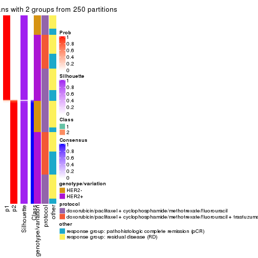</p>

</div>
<div id='tab-ATC-skmeans-consensus-heatmap-2'>
<pre><code class="r">consensus_heatmap(res, k = 3)
</code></pre>

<p>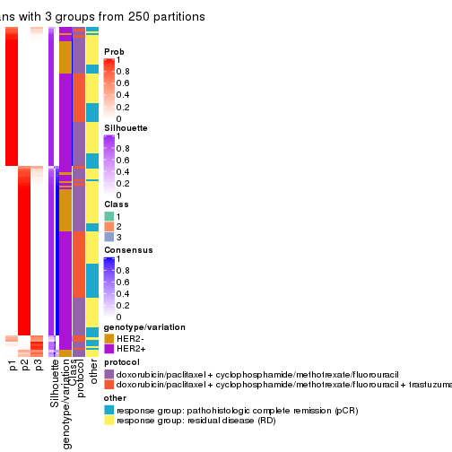</p>

</div>
<div id='tab-ATC-skmeans-consensus-heatmap-3'>
<pre><code class="r">consensus_heatmap(res, k = 4)
</code></pre>

<p>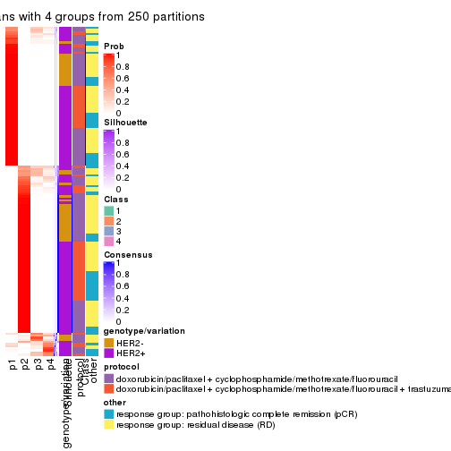</p>

</div>
<div id='tab-ATC-skmeans-consensus-heatmap-4'>
<pre><code class="r">consensus_heatmap(res, k = 5)
</code></pre>

<p>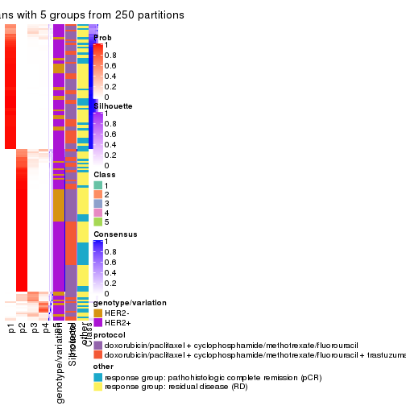</p>

</div>
<div id='tab-ATC-skmeans-consensus-heatmap-5'>
<pre><code class="r">consensus_heatmap(res, k = 6)
</code></pre>

<p>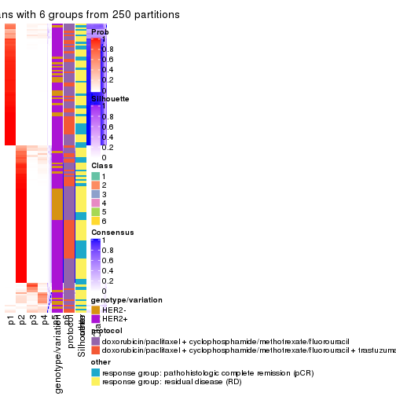</p>

</div>
</div>

Heatmaps for the membership of samples in all partitions to see how consistent they are:


<script>
$( function() {
	$( '#tabs-ATC-skmeans-membership-heatmap' ).tabs();
} );
</script>
<div id='tabs-ATC-skmeans-membership-heatmap'>
<ul>
<li><a href='#tab-ATC-skmeans-membership-heatmap-1'>k = 2</a></li>
<li><a href='#tab-ATC-skmeans-membership-heatmap-2'>k = 3</a></li>
<li><a href='#tab-ATC-skmeans-membership-heatmap-3'>k = 4</a></li>
<li><a href='#tab-ATC-skmeans-membership-heatmap-4'>k = 5</a></li>
<li><a href='#tab-ATC-skmeans-membership-heatmap-5'>k = 6</a></li>
</ul>
<div id='tab-ATC-skmeans-membership-heatmap-1'>
<pre><code class="r">membership_heatmap(res, k = 2)
</code></pre>

<p>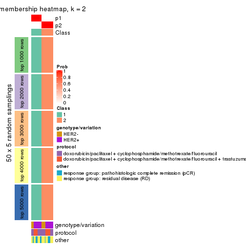</p>

</div>
<div id='tab-ATC-skmeans-membership-heatmap-2'>
<pre><code class="r">membership_heatmap(res, k = 3)
</code></pre>

<p>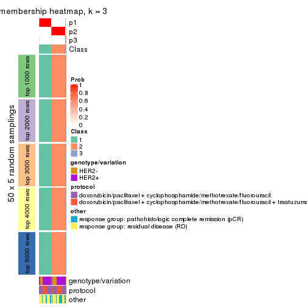</p>

</div>
<div id='tab-ATC-skmeans-membership-heatmap-3'>
<pre><code class="r">membership_heatmap(res, k = 4)
</code></pre>

<p>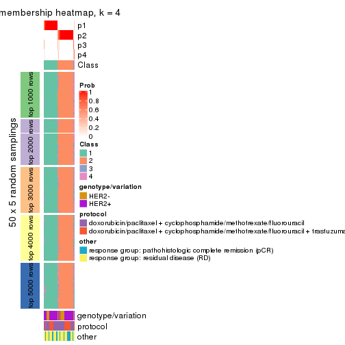</p>

</div>
<div id='tab-ATC-skmeans-membership-heatmap-4'>
<pre><code class="r">membership_heatmap(res, k = 5)
</code></pre>

<p>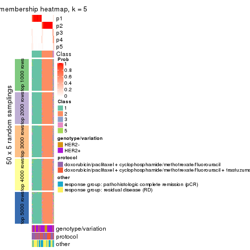</p>

</div>
<div id='tab-ATC-skmeans-membership-heatmap-5'>
<pre><code class="r">membership_heatmap(res, k = 6)
</code></pre>

<p>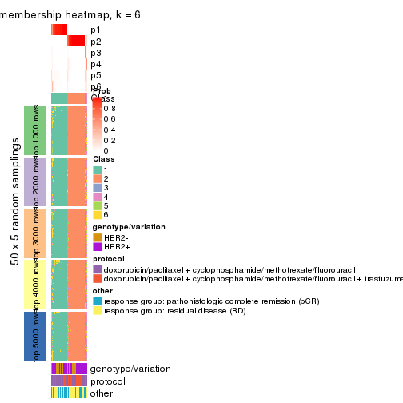</p>

</div>
</div>

As soon as we have had the classes for columns, we can look for signatures
which are significantly different between classes which can be candidate marks
for certain classes. Following are the heatmaps for signatures.


Signature heatmaps where rows are scaled:


<script>
$( function() {
	$( '#tabs-ATC-skmeans-get-signatures' ).tabs();
} );
</script>
<div id='tabs-ATC-skmeans-get-signatures'>
<ul>
<li><a href='#tab-ATC-skmeans-get-signatures-1'>k = 2</a></li>
<li><a href='#tab-ATC-skmeans-get-signatures-2'>k = 3</a></li>
<li><a href='#tab-ATC-skmeans-get-signatures-3'>k = 4</a></li>
<li><a href='#tab-ATC-skmeans-get-signatures-4'>k = 5</a></li>
<li><a href='#tab-ATC-skmeans-get-signatures-5'>k = 6</a></li>
</ul>
<div id='tab-ATC-skmeans-get-signatures-1'>
<pre><code class="r">get_signatures(res, k = 2)
</code></pre>

<pre><code>#&gt; Error: The width or height of the raster image is zero, maybe you forget to turn off the
#&gt; previous graphic device or it was corrupted. Run `dev.off()` to close it.
</code></pre>

<p></p>

</div>
<div id='tab-ATC-skmeans-get-signatures-2'>
<pre><code class="r">get_signatures(res, k = 3)
</code></pre>

<pre><code>#&gt; Error: The width or height of the raster image is zero, maybe you forget to turn off the
#&gt; previous graphic device or it was corrupted. Run `dev.off()` to close it.
</code></pre>

<p></p>

</div>
<div id='tab-ATC-skmeans-get-signatures-3'>
<pre><code class="r">get_signatures(res, k = 4)
</code></pre>

<pre><code>#&gt; Error: The width or height of the raster image is zero, maybe you forget to turn off the
#&gt; previous graphic device or it was corrupted. Run `dev.off()` to close it.
</code></pre>

<p></p>

</div>
<div id='tab-ATC-skmeans-get-signatures-4'>
<pre><code class="r">get_signatures(res, k = 5)
</code></pre>

<pre><code>#&gt; Error: The width or height of the raster image is zero, maybe you forget to turn off the
#&gt; previous graphic device or it was corrupted. Run `dev.off()` to close it.
</code></pre>

<p></p>

</div>
<div id='tab-ATC-skmeans-get-signatures-5'>
<pre><code class="r">get_signatures(res, k = 6)
</code></pre>

<pre><code>#&gt; Error: The width or height of the raster image is zero, maybe you forget to turn off the
#&gt; previous graphic device or it was corrupted. Run `dev.off()` to close it.
</code></pre>

<p></p>

</div>
</div>


Signature heatmaps where rows are not scaled:


<script>
$( function() {
	$( '#tabs-ATC-skmeans-get-signatures-no-scale' ).tabs();
} );
</script>
<div id='tabs-ATC-skmeans-get-signatures-no-scale'>
<ul>
<li><a href='#tab-ATC-skmeans-get-signatures-no-scale-1'>k = 2</a></li>
<li><a href='#tab-ATC-skmeans-get-signatures-no-scale-2'>k = 3</a></li>
<li><a href='#tab-ATC-skmeans-get-signatures-no-scale-3'>k = 4</a></li>
<li><a href='#tab-ATC-skmeans-get-signatures-no-scale-4'>k = 5</a></li>
<li><a href='#tab-ATC-skmeans-get-signatures-no-scale-5'>k = 6</a></li>
</ul>
<div id='tab-ATC-skmeans-get-signatures-no-scale-1'>
<pre><code class="r">get_signatures(res, k = 2, scale_rows = FALSE)
</code></pre>

<pre><code>#&gt; Error: The width or height of the raster image is zero, maybe you forget to turn off the
#&gt; previous graphic device or it was corrupted. Run `dev.off()` to close it.
</code></pre>

<p></p>

</div>
<div id='tab-ATC-skmeans-get-signatures-no-scale-2'>
<pre><code class="r">get_signatures(res, k = 3, scale_rows = FALSE)
</code></pre>

<pre><code>#&gt; Error: The width or height of the raster image is zero, maybe you forget to turn off the
#&gt; previous graphic device or it was corrupted. Run `dev.off()` to close it.
</code></pre>

<p></p>

</div>
<div id='tab-ATC-skmeans-get-signatures-no-scale-3'>
<pre><code class="r">get_signatures(res, k = 4, scale_rows = FALSE)
</code></pre>

<pre><code>#&gt; Error: The width or height of the raster image is zero, maybe you forget to turn off the
#&gt; previous graphic device or it was corrupted. Run `dev.off()` to close it.
</code></pre>

<p></p>

</div>
<div id='tab-ATC-skmeans-get-signatures-no-scale-4'>
<pre><code class="r">get_signatures(res, k = 5, scale_rows = FALSE)
</code></pre>

<pre><code>#&gt; Error: The width or height of the raster image is zero, maybe you forget to turn off the
#&gt; previous graphic device or it was corrupted. Run `dev.off()` to close it.
</code></pre>

<p></p>

</div>
<div id='tab-ATC-skmeans-get-signatures-no-scale-5'>
<pre><code class="r">get_signatures(res, k = 6, scale_rows = FALSE)
</code></pre>

<pre><code>#&gt; Error: The width or height of the raster image is zero, maybe you forget to turn off the
#&gt; previous graphic device or it was corrupted. Run `dev.off()` to close it.
</code></pre>

<p></p>

</div>
</div>


Compare the overlap of signatures from different k:

```r
compare_signatures(res)
```

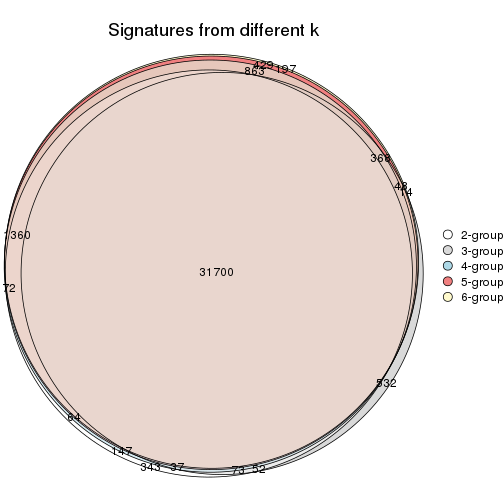

`get_signature()` returns a data frame invisibly. TO get the list of signatures, the function
call should be assigned to a variable explicitly. In following code, if `plot` argument is set
to `FALSE`, no heatmap is plotted while only the differential analysis is performed.

```r
# code only for demonstration
tb = get_signature(res, k = ..., plot = FALSE)
```

An example of the output of `tb` is:

```
#>   which_row         fdr    mean_1    mean_2 scaled_mean_1 scaled_mean_2 km
#> 1        38 0.042760348  8.373488  9.131774    -0.5533452     0.5164555  1
#> 2        40 0.018707592  7.106213  8.469186    -0.6173731     0.5762149  1
#> 3        55 0.019134737 10.221463 11.207825    -0.6159697     0.5749050  1
#> 4        59 0.006059896  5.921854  7.869574    -0.6899429     0.6439467  1
#> 5        60 0.018055526  8.928898 10.211722    -0.6204761     0.5791110  1
#> 6        98 0.009384629 15.714769 14.887706     0.6635654    -0.6193277  2
...
```

The columns in `tb` are:

1. `which_row`: row indices corresponding to the input matrix.
2. `fdr`: FDR for the differential test. 
3. `mean_x`: The mean value in group x.
4. `scaled_mean_x`: The mean value in group x after rows are scaled.
5. `km`: Row groups if k-means clustering is applied to rows.


UMAP plot which shows how samples are separated.


<script>
$( function() {
	$( '#tabs-ATC-skmeans-dimension-reduction' ).tabs();
} );
</script>
<div id='tabs-ATC-skmeans-dimension-reduction'>
<ul>
<li><a href='#tab-ATC-skmeans-dimension-reduction-1'>k = 2</a></li>
<li><a href='#tab-ATC-skmeans-dimension-reduction-2'>k = 3</a></li>
<li><a href='#tab-ATC-skmeans-dimension-reduction-3'>k = 4</a></li>
<li><a href='#tab-ATC-skmeans-dimension-reduction-4'>k = 5</a></li>
<li><a href='#tab-ATC-skmeans-dimension-reduction-5'>k = 6</a></li>
</ul>
<div id='tab-ATC-skmeans-dimension-reduction-1'>
<pre><code class="r">dimension_reduction(res, k = 2, method = &quot;UMAP&quot;)
</code></pre>

<p>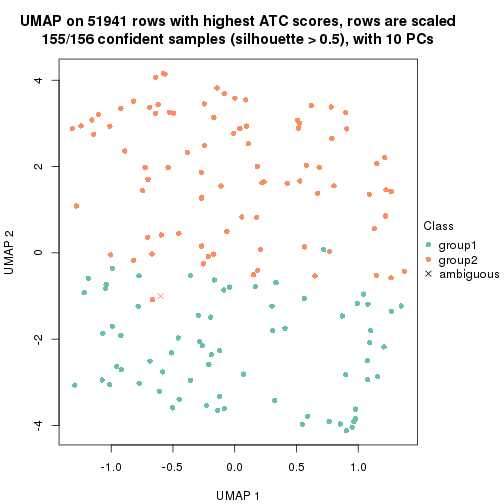</p>

</div>
<div id='tab-ATC-skmeans-dimension-reduction-2'>
<pre><code class="r">dimension_reduction(res, k = 3, method = &quot;UMAP&quot;)
</code></pre>

<p>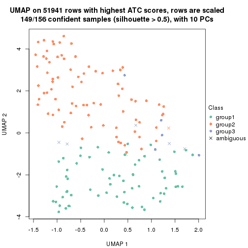</p>

</div>
<div id='tab-ATC-skmeans-dimension-reduction-3'>
<pre><code class="r">dimension_reduction(res, k = 4, method = &quot;UMAP&quot;)
</code></pre>

<p>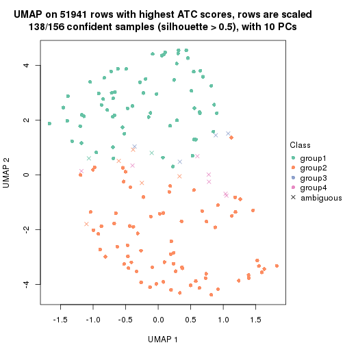</p>

</div>
<div id='tab-ATC-skmeans-dimension-reduction-4'>
<pre><code class="r">dimension_reduction(res, k = 5, method = &quot;UMAP&quot;)
</code></pre>

<p>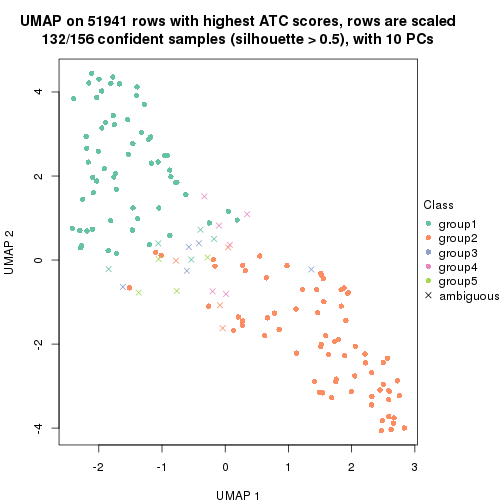</p>

</div>
<div id='tab-ATC-skmeans-dimension-reduction-5'>
<pre><code class="r">dimension_reduction(res, k = 6, method = &quot;UMAP&quot;)
</code></pre>

<p>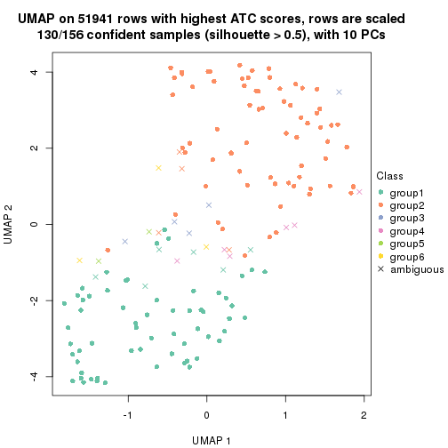</p>

</div>
</div>


Following heatmap shows how subgroups are split when increasing `k`:

```r
collect_classes(res)
```

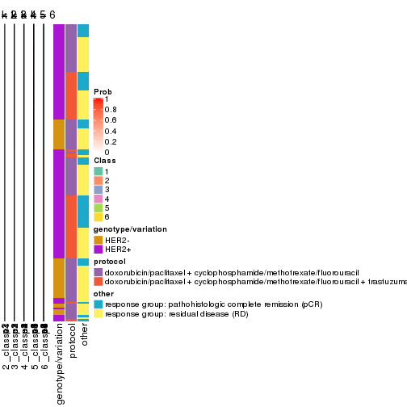


Test correlation between subgroups and known annotations. If the known
annotation is numeric, one-way ANOVA test is applied, and if the known
annotation is discrete, chi-squared contingency table test is applied.

```r
test_to_known_factors(res)
```

```
#>               n genotype/variation(p) protocol(p) other(p) k
#> ATC:skmeans 155                 0.370       1.000    0.728 2
#> ATC:skmeans 149                 0.782       0.608    0.421 3
#> ATC:skmeans 138                 0.799       0.746    1.000 4
#> ATC:skmeans 132                 0.816       0.497    1.000 5
#> ATC:skmeans 130                 0.822       0.611    1.000 6
```


If matrix rows can be associated to genes, consider to use `functional_enrichment(res,
...)` to perform function enrichment for the signature genes. See [this vignette](http://bioconductor.org/packages/devel/bioc/vignettes/cola/inst/doc/functional_enrichment.html) for more detailed explanations.


 

---------------------------------------------------


### ATC:pam*


The object with results only for a single top-value method and a single partition method 
can be extracted as:

```r
res = res_list["ATC", "pam"]
# you can also extract it by
# res = res_list["ATC:pam"]
```

A summary of `res` and all the functions that can be applied to it:

```r
res
```

```
#> A 'ConsensusPartition' object with k = 2, 3, 4, 5, 6.
#>   On a matrix with 51941 rows and 156 columns.
#>   Top rows (1000, 2000, 3000, 4000, 5000) are extracted by 'ATC' method.
#>   Subgroups are detected by 'pam' method.
#>   Performed in total 1250 partitions by row resampling.
#>   Best k for subgroups seems to be 5.
#> 
#> Following methods can be applied to this 'ConsensusPartition' object:
#>  [1] "cola_report"             "collect_classes"         "collect_plots"          
#>  [4] "collect_stats"           "colnames"                "compare_signatures"     
#>  [7] "consensus_heatmap"       "dimension_reduction"     "functional_enrichment"  
#> [10] "get_anno_col"            "get_anno"                "get_classes"            
#> [13] "get_consensus"           "get_matrix"              "get_membership"         
#> [16] "get_param"               "get_signatures"          "get_stats"              
#> [19] "is_best_k"               "is_stable_k"             "membership_heatmap"     
#> [22] "ncol"                    "nrow"                    "plot_ecdf"              
#> [25] "rownames"                "select_partition_number" "show"                   
#> [28] "suggest_best_k"          "test_to_known_factors"
```

`collect_plots()` function collects all the plots made from `res` for all `k` (number of partitions)
into one single page to provide an easy and fast comparison between different `k`.

```r
collect_plots(res)
```

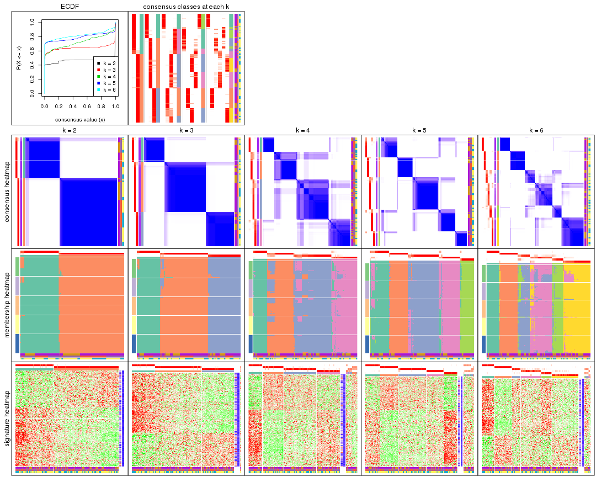

The plots are:

- The first row: a plot of the ECDF (empirical cumulative distribution
  function) curves of the consensus matrix for each `k` and the heatmap of
  predicted classes for each `k`.
- The second row: heatmaps of the consensus matrix for each `k`.
- The third row: heatmaps of the membership matrix for each `k`.
- The fouth row: heatmaps of the signatures for each `k`.

All the plots in panels can be made by individual functions and they are
plotted later in this section.

`select_partition_number()` produces several plots showing different
statistics for choosing "optimized" `k`. There are following statistics:

- ECDF curves of the consensus matrix for each `k`;
- 1-PAC. [The PAC
  score](https://en.wikipedia.org/wiki/Consensus_clustering#Over-interpretation_potential_of_consensus_clustering)
  measures the proportion of the ambiguous subgrouping.
- Mean silhouette score.
- Concordance. The mean probability of fiting the consensus class ids in all
  partitions.
- Area increased. Denote $A_k$ as the area under the ECDF curve for current
  `k`, the area increased is defined as $A_k - A_{k-1}$.
- Rand index. The percent of pairs of samples that are both in a same cluster
  or both are not in a same cluster in the partition of k and k-1.
- Jaccard index. The ratio of pairs of samples are both in a same cluster in
  the partition of k and k-1 and the pairs of samples are both in a same
  cluster in the partition k or k-1.

The detailed explanations of these statistics can be found in [the _cola_
vignette](http://bioconductor.org/packages/devel/bioc/vignettes/cola/inst/doc/cola.html#toc_13).

Generally speaking, lower PAC score, higher mean silhouette score or higher
concordance corresponds to better partition. Rand index and Jaccard index
measure how similar the current partition is compared to partition with `k-1`.
If they are too similar, we won't accept `k` is better than `k-1`.

```r
select_partition_number(res)
```

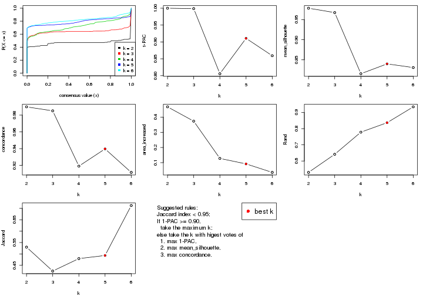

The numeric values for all these statistics can be obtained by `get_stats()`.

```r
get_stats(res)
```

```
#>   k 1-PAC mean_silhouette concordance area_increased  Rand Jaccard
#> 2 2 1.000           0.978       0.990         0.4677 0.530   0.530
#> 3 3 0.999           0.967       0.985         0.3734 0.642   0.425
#> 4 4 0.806           0.815       0.919         0.1279 0.778   0.480
#> 5 5 0.911           0.840       0.940         0.0917 0.837   0.493
#> 6 6 0.859           0.831       0.912         0.0359 0.935   0.712
```

`suggest_best_k()` suggests the best $k$ based on these statistics. The rules are as follows:

- All $k$ with Jaccard index larger than 0.95 are removed because increasing
  $k$ does not provide enough extra information. If all $k$ are removed, it is
  marked as no subgroup is detected.
- For all $k$ with 1-PAC score larger than 0.9, the maximal $k$ is taken as
  the best $k$, and other $k$ are marked as optional $k$.
- If it does not fit the second rule. The $k$ with the maximal vote of the
  highest 1-PAC score, highest mean silhouette, and highest concordance is
  taken as the best $k$.

```r
suggest_best_k(res)
```

```
#> [1] 5
#> attr(,"optional")
#> [1] 2 3
```

There is also optional best $k$ = 2 3 that is worth to check.

Following shows the table of the partitions (You need to click the **show/hide
code output** link to see it). The membership matrix (columns with name `p*`)
is inferred by
[`clue::cl_consensus()`](https://www.rdocumentation.org/link/cl_consensus?package=clue)
function with the `SE` method. Basically the value in the membership matrix
represents the probability to belong to a certain group. The finall class
label for an item is determined with the group with highest probability it
belongs to.

In `get_classes()` function, the entropy is calculated from the membership
matrix and the silhouette score is calculated from the consensus matrix.


<script>
$( function() {
	$( '#tabs-ATC-pam-get-classes' ).tabs();
} );
</script>
<div id='tabs-ATC-pam-get-classes'>
<ul>
<li><a href='#tab-ATC-pam-get-classes-1'>k = 2</a></li>
<li><a href='#tab-ATC-pam-get-classes-2'>k = 3</a></li>
<li><a href='#tab-ATC-pam-get-classes-3'>k = 4</a></li>
<li><a href='#tab-ATC-pam-get-classes-4'>k = 5</a></li>
<li><a href='#tab-ATC-pam-get-classes-5'>k = 6</a></li>
</ul>

<div id='tab-ATC-pam-get-classes-1'>
<p><a id='tab-ATC-pam-get-classes-1-a' style='color:#0366d6' href='#'>show/hide code output</a></p>
<pre><code class="r">cbind(get_classes(res, k = 2), get_membership(res, k = 2))
</code></pre>

<pre><code>#&gt;            class entropy silhouette    p1    p2
#&gt; GSM1232995     2  0.0000      0.995 0.000 1.000
#&gt; GSM1233002     1  0.0000      0.979 1.000 0.000
#&gt; GSM1233003     1  0.0000      0.979 1.000 0.000
#&gt; GSM1233014     2  0.0000      0.995 0.000 1.000
#&gt; GSM1233015     1  0.5519      0.856 0.872 0.128
#&gt; GSM1233016     2  0.0000      0.995 0.000 1.000
#&gt; GSM1233024     2  0.0000      0.995 0.000 1.000
#&gt; GSM1233049     1  0.0000      0.979 1.000 0.000
#&gt; GSM1233064     2  0.0000      0.995 0.000 1.000
#&gt; GSM1233068     2  0.0000      0.995 0.000 1.000
#&gt; GSM1233073     2  0.0672      0.988 0.008 0.992
#&gt; GSM1233093     1  0.0000      0.979 1.000 0.000
#&gt; GSM1233115     1  0.0000      0.979 1.000 0.000
#&gt; GSM1232992     2  0.0000      0.995 0.000 1.000
#&gt; GSM1232993     2  0.0000      0.995 0.000 1.000
#&gt; GSM1233005     2  0.0000      0.995 0.000 1.000
#&gt; GSM1233007     2  0.0000      0.995 0.000 1.000
#&gt; GSM1233010     1  0.8207      0.678 0.744 0.256
#&gt; GSM1233013     2  0.0000      0.995 0.000 1.000
#&gt; GSM1233018     2  0.0000      0.995 0.000 1.000
#&gt; GSM1233019     2  0.0000      0.995 0.000 1.000
#&gt; GSM1233021     2  0.0000      0.995 0.000 1.000
#&gt; GSM1233025     1  0.0672      0.973 0.992 0.008
#&gt; GSM1233029     2  0.0000      0.995 0.000 1.000
#&gt; GSM1233030     2  0.0000      0.995 0.000 1.000
#&gt; GSM1233031     2  0.0000      0.995 0.000 1.000
#&gt; GSM1233032     1  0.0000      0.979 1.000 0.000
#&gt; GSM1233035     2  0.0000      0.995 0.000 1.000
#&gt; GSM1233038     1  0.0000      0.979 1.000 0.000
#&gt; GSM1233039     2  0.0000      0.995 0.000 1.000
#&gt; GSM1233042     2  0.0000      0.995 0.000 1.000
#&gt; GSM1233043     2  0.0000      0.995 0.000 1.000
#&gt; GSM1233044     1  0.0000      0.979 1.000 0.000
#&gt; GSM1233046     2  0.7674      0.703 0.224 0.776
#&gt; GSM1233051     1  0.0000      0.979 1.000 0.000
#&gt; GSM1233054     1  0.7056      0.779 0.808 0.192
#&gt; GSM1233057     2  0.0000      0.995 0.000 1.000
#&gt; GSM1233060     2  0.0000      0.995 0.000 1.000
#&gt; GSM1233062     2  0.0000      0.995 0.000 1.000
#&gt; GSM1233075     2  0.0000      0.995 0.000 1.000
#&gt; GSM1233078     2  0.3733      0.920 0.072 0.928
#&gt; GSM1233079     1  0.0000      0.979 1.000 0.000
#&gt; GSM1233082     1  0.0000      0.979 1.000 0.000
#&gt; GSM1233083     1  0.0000      0.979 1.000 0.000
#&gt; GSM1233091     2  0.1843      0.968 0.028 0.972
#&gt; GSM1233095     1  0.0000      0.979 1.000 0.000
#&gt; GSM1233096     1  0.0000      0.979 1.000 0.000
#&gt; GSM1233101     1  0.0000      0.979 1.000 0.000
#&gt; GSM1233105     1  0.0000      0.979 1.000 0.000
#&gt; GSM1233117     2  0.0000      0.995 0.000 1.000
#&gt; GSM1233118     2  0.0000      0.995 0.000 1.000
#&gt; GSM1233001     2  0.0000      0.995 0.000 1.000
#&gt; GSM1233006     2  0.0000      0.995 0.000 1.000
#&gt; GSM1233008     2  0.0000      0.995 0.000 1.000
#&gt; GSM1233009     2  0.0000      0.995 0.000 1.000
#&gt; GSM1233017     2  0.0000      0.995 0.000 1.000
#&gt; GSM1233020     2  0.0000      0.995 0.000 1.000
#&gt; GSM1233022     2  0.0000      0.995 0.000 1.000
#&gt; GSM1233026     2  0.0000      0.995 0.000 1.000
#&gt; GSM1233028     2  0.0376      0.992 0.004 0.996
#&gt; GSM1233034     2  0.0000      0.995 0.000 1.000
#&gt; GSM1233040     1  0.0000      0.979 1.000 0.000
#&gt; GSM1233048     1  0.0000      0.979 1.000 0.000
#&gt; GSM1233056     1  0.0000      0.979 1.000 0.000
#&gt; GSM1233058     2  0.0000      0.995 0.000 1.000
#&gt; GSM1233059     1  0.0000      0.979 1.000 0.000
#&gt; GSM1233066     2  0.0000      0.995 0.000 1.000
#&gt; GSM1233071     2  0.0000      0.995 0.000 1.000
#&gt; GSM1233074     2  0.0000      0.995 0.000 1.000
#&gt; GSM1233076     2  0.0000      0.995 0.000 1.000
#&gt; GSM1233080     1  0.0000      0.979 1.000 0.000
#&gt; GSM1233088     2  0.0000      0.995 0.000 1.000
#&gt; GSM1233090     1  0.0000      0.979 1.000 0.000
#&gt; GSM1233092     2  0.0000      0.995 0.000 1.000
#&gt; GSM1233094     2  0.0000      0.995 0.000 1.000
#&gt; GSM1233097     2  0.0000      0.995 0.000 1.000
#&gt; GSM1233100     1  0.7056      0.779 0.808 0.192
#&gt; GSM1233104     2  0.0000      0.995 0.000 1.000
#&gt; GSM1233106     1  0.7056      0.779 0.808 0.192
#&gt; GSM1233111     1  0.0000      0.979 1.000 0.000
#&gt; GSM1233122     2  0.0000      0.995 0.000 1.000
#&gt; GSM1233146     2  0.0000      0.995 0.000 1.000
#&gt; GSM1232994     2  0.0000      0.995 0.000 1.000
#&gt; GSM1232996     2  0.0000      0.995 0.000 1.000
#&gt; GSM1232997     2  0.0000      0.995 0.000 1.000
#&gt; GSM1232998     2  0.0000      0.995 0.000 1.000
#&gt; GSM1232999     2  0.0000      0.995 0.000 1.000
#&gt; GSM1233000     2  0.0000      0.995 0.000 1.000
#&gt; GSM1233004     1  0.0000      0.979 1.000 0.000
#&gt; GSM1233011     2  0.0000      0.995 0.000 1.000
#&gt; GSM1233012     2  0.0000      0.995 0.000 1.000
#&gt; GSM1233023     2  0.0000      0.995 0.000 1.000
#&gt; GSM1233027     2  0.0000      0.995 0.000 1.000
#&gt; GSM1233033     1  0.0000      0.979 1.000 0.000
#&gt; GSM1233036     2  0.0000      0.995 0.000 1.000
#&gt; GSM1233037     2  0.0000      0.995 0.000 1.000
#&gt; GSM1233041     1  0.0000      0.979 1.000 0.000
#&gt; GSM1233045     2  0.0000      0.995 0.000 1.000
#&gt; GSM1233047     1  0.0000      0.979 1.000 0.000
#&gt; GSM1233050     1  0.0000      0.979 1.000 0.000
#&gt; GSM1233052     1  0.0000      0.979 1.000 0.000
#&gt; GSM1233053     1  0.0000      0.979 1.000 0.000
#&gt; GSM1233055     1  0.0000      0.979 1.000 0.000
#&gt; GSM1233061     2  0.0000      0.995 0.000 1.000
#&gt; GSM1233063     1  0.0000      0.979 1.000 0.000
#&gt; GSM1233065     2  0.0000      0.995 0.000 1.000
#&gt; GSM1233070     2  0.0000      0.995 0.000 1.000
#&gt; GSM1233077     2  0.0000      0.995 0.000 1.000
#&gt; GSM1233081     1  0.0000      0.979 1.000 0.000
#&gt; GSM1233084     1  0.0000      0.979 1.000 0.000
#&gt; GSM1233087     1  0.0000      0.979 1.000 0.000
#&gt; GSM1233089     2  0.0000      0.995 0.000 1.000
#&gt; GSM1233099     1  0.7056      0.779 0.808 0.192
#&gt; GSM1233112     1  0.0000      0.979 1.000 0.000
#&gt; GSM1233085     1  0.0000      0.979 1.000 0.000
#&gt; GSM1233098     2  0.0000      0.995 0.000 1.000
#&gt; GSM1233114     1  0.0000      0.979 1.000 0.000
#&gt; GSM1233119     2  0.4431      0.897 0.092 0.908
#&gt; GSM1233129     2  0.0000      0.995 0.000 1.000
#&gt; GSM1233132     1  0.0000      0.979 1.000 0.000
#&gt; GSM1233139     2  0.0000      0.995 0.000 1.000
#&gt; GSM1233143     2  0.0000      0.995 0.000 1.000
#&gt; GSM1233145     1  0.0000      0.979 1.000 0.000
#&gt; GSM1233067     2  0.0000      0.995 0.000 1.000
#&gt; GSM1233069     2  0.0000      0.995 0.000 1.000
#&gt; GSM1233072     2  0.0000      0.995 0.000 1.000
#&gt; GSM1233086     2  0.0000      0.995 0.000 1.000
#&gt; GSM1233102     1  0.0000      0.979 1.000 0.000
#&gt; GSM1233103     2  0.0000      0.995 0.000 1.000
#&gt; GSM1233107     2  0.0000      0.995 0.000 1.000
#&gt; GSM1233108     1  0.0000      0.979 1.000 0.000
#&gt; GSM1233109     1  0.0000      0.979 1.000 0.000
#&gt; GSM1233110     2  0.0000      0.995 0.000 1.000
#&gt; GSM1233113     2  0.0000      0.995 0.000 1.000
#&gt; GSM1233116     2  0.0000      0.995 0.000 1.000
#&gt; GSM1233120     1  0.0000      0.979 1.000 0.000
#&gt; GSM1233121     2  0.0000      0.995 0.000 1.000
#&gt; GSM1233123     2  0.0000      0.995 0.000 1.000
#&gt; GSM1233124     2  0.0000      0.995 0.000 1.000
#&gt; GSM1233125     1  0.0000      0.979 1.000 0.000
#&gt; GSM1233126     2  0.0000      0.995 0.000 1.000
#&gt; GSM1233127     2  0.0000      0.995 0.000 1.000
#&gt; GSM1233128     1  0.0000      0.979 1.000 0.000
#&gt; GSM1233130     2  0.0000      0.995 0.000 1.000
#&gt; GSM1233131     1  0.0000      0.979 1.000 0.000
#&gt; GSM1233133     1  0.0000      0.979 1.000 0.000
#&gt; GSM1233134     2  0.0000      0.995 0.000 1.000
#&gt; GSM1233135     2  0.0000      0.995 0.000 1.000
#&gt; GSM1233136     2  0.0000      0.995 0.000 1.000
#&gt; GSM1233137     1  0.0000      0.979 1.000 0.000
#&gt; GSM1233138     2  0.0000      0.995 0.000 1.000
#&gt; GSM1233140     1  0.0000      0.979 1.000 0.000
#&gt; GSM1233141     2  0.0000      0.995 0.000 1.000
#&gt; GSM1233142     2  0.0000      0.995 0.000 1.000
#&gt; GSM1233144     1  0.0000      0.979 1.000 0.000
#&gt; GSM1233147     2  0.0000      0.995 0.000 1.000
</code></pre>

<script>
$('#tab-ATC-pam-get-classes-1-a').parent().next().next().hide();
$('#tab-ATC-pam-get-classes-1-a').click(function(){
  $('#tab-ATC-pam-get-classes-1-a').parent().next().next().toggle();
  return(false);
});
</script>
</div>

<div id='tab-ATC-pam-get-classes-2'>
<p><a id='tab-ATC-pam-get-classes-2-a' style='color:#0366d6' href='#'>show/hide code output</a></p>
<pre><code class="r">cbind(get_classes(res, k = 3), get_membership(res, k = 3))
</code></pre>

<pre><code>#&gt;            class entropy silhouette    p1    p2    p3
#&gt; GSM1232995     3  0.0000      0.991 0.000 0.000 1.000
#&gt; GSM1233002     2  0.0237      0.976 0.004 0.996 0.000
#&gt; GSM1233003     1  0.0000      0.983 1.000 0.000 0.000
#&gt; GSM1233014     2  0.0000      0.978 0.000 1.000 0.000
#&gt; GSM1233015     2  0.0000      0.978 0.000 1.000 0.000
#&gt; GSM1233016     2  0.0000      0.978 0.000 1.000 0.000
#&gt; GSM1233024     3  0.0424      0.987 0.000 0.008 0.992
#&gt; GSM1233049     1  0.0000      0.983 1.000 0.000 0.000
#&gt; GSM1233064     2  0.0000      0.978 0.000 1.000 0.000
#&gt; GSM1233068     2  0.0000      0.978 0.000 1.000 0.000
#&gt; GSM1233073     2  0.0000      0.978 0.000 1.000 0.000
#&gt; GSM1233093     1  0.0000      0.983 1.000 0.000 0.000
#&gt; GSM1233115     1  0.3267      0.874 0.884 0.116 0.000
#&gt; GSM1232992     3  0.0000      0.991 0.000 0.000 1.000
#&gt; GSM1232993     2  0.0000      0.978 0.000 1.000 0.000
#&gt; GSM1233005     3  0.0000      0.991 0.000 0.000 1.000
#&gt; GSM1233007     2  0.0000      0.978 0.000 1.000 0.000
#&gt; GSM1233010     2  0.0000      0.978 0.000 1.000 0.000
#&gt; GSM1233013     3  0.0000      0.991 0.000 0.000 1.000
#&gt; GSM1233018     3  0.0000      0.991 0.000 0.000 1.000
#&gt; GSM1233019     3  0.0000      0.991 0.000 0.000 1.000
#&gt; GSM1233021     3  0.0000      0.991 0.000 0.000 1.000
#&gt; GSM1233025     2  0.0000      0.978 0.000 1.000 0.000
#&gt; GSM1233029     2  0.5098      0.682 0.000 0.752 0.248
#&gt; GSM1233030     3  0.0000      0.991 0.000 0.000 1.000
#&gt; GSM1233031     2  0.0000      0.978 0.000 1.000 0.000
#&gt; GSM1233032     1  0.0000      0.983 1.000 0.000 0.000
#&gt; GSM1233035     2  0.0000      0.978 0.000 1.000 0.000
#&gt; GSM1233038     1  0.0000      0.983 1.000 0.000 0.000
#&gt; GSM1233039     2  0.0000      0.978 0.000 1.000 0.000
#&gt; GSM1233042     2  0.0000      0.978 0.000 1.000 0.000
#&gt; GSM1233043     2  0.0000      0.978 0.000 1.000 0.000
#&gt; GSM1233044     2  0.0000      0.978 0.000 1.000 0.000
#&gt; GSM1233046     2  0.0000      0.978 0.000 1.000 0.000
#&gt; GSM1233051     1  0.3192      0.878 0.888 0.112 0.000
#&gt; GSM1233054     2  0.0000      0.978 0.000 1.000 0.000
#&gt; GSM1233057     2  0.0000      0.978 0.000 1.000 0.000
#&gt; GSM1233060     2  0.0000      0.978 0.000 1.000 0.000
#&gt; GSM1233062     2  0.4654      0.746 0.000 0.792 0.208
#&gt; GSM1233075     3  0.0000      0.991 0.000 0.000 1.000
#&gt; GSM1233078     2  0.0000      0.978 0.000 1.000 0.000
#&gt; GSM1233079     1  0.0000      0.983 1.000 0.000 0.000
#&gt; GSM1233082     2  0.0237      0.976 0.004 0.996 0.000
#&gt; GSM1233083     1  0.0000      0.983 1.000 0.000 0.000
#&gt; GSM1233091     2  0.0000      0.978 0.000 1.000 0.000
#&gt; GSM1233095     1  0.0000      0.983 1.000 0.000 0.000
#&gt; GSM1233096     1  0.0000      0.983 1.000 0.000 0.000
#&gt; GSM1233101     1  0.0000      0.983 1.000 0.000 0.000
#&gt; GSM1233105     2  0.0237      0.976 0.004 0.996 0.000
#&gt; GSM1233117     3  0.0000      0.991 0.000 0.000 1.000
#&gt; GSM1233118     3  0.0000      0.991 0.000 0.000 1.000
#&gt; GSM1233001     3  0.0000      0.991 0.000 0.000 1.000
#&gt; GSM1233006     3  0.2625      0.906 0.000 0.084 0.916
#&gt; GSM1233008     3  0.0000      0.991 0.000 0.000 1.000
#&gt; GSM1233009     3  0.0000      0.991 0.000 0.000 1.000
#&gt; GSM1233017     3  0.0000      0.991 0.000 0.000 1.000
#&gt; GSM1233020     3  0.0000      0.991 0.000 0.000 1.000
#&gt; GSM1233022     2  0.4452      0.769 0.000 0.808 0.192
#&gt; GSM1233026     2  0.0000      0.978 0.000 1.000 0.000
#&gt; GSM1233028     2  0.0000      0.978 0.000 1.000 0.000
#&gt; GSM1233034     3  0.0592      0.984 0.000 0.012 0.988
#&gt; GSM1233040     1  0.0000      0.983 1.000 0.000 0.000
#&gt; GSM1233048     1  0.0000      0.983 1.000 0.000 0.000
#&gt; GSM1233056     1  0.0000      0.983 1.000 0.000 0.000
#&gt; GSM1233058     2  0.0000      0.978 0.000 1.000 0.000
#&gt; GSM1233059     1  0.0000      0.983 1.000 0.000 0.000
#&gt; GSM1233066     2  0.0000      0.978 0.000 1.000 0.000
#&gt; GSM1233071     2  0.0000      0.978 0.000 1.000 0.000
#&gt; GSM1233074     3  0.0237      0.989 0.000 0.004 0.996
#&gt; GSM1233076     2  0.0000      0.978 0.000 1.000 0.000
#&gt; GSM1233080     1  0.0000      0.983 1.000 0.000 0.000
#&gt; GSM1233088     2  0.0000      0.978 0.000 1.000 0.000
#&gt; GSM1233090     1  0.0000      0.983 1.000 0.000 0.000
#&gt; GSM1233092     3  0.0424      0.987 0.000 0.008 0.992
#&gt; GSM1233094     2  0.0000      0.978 0.000 1.000 0.000
#&gt; GSM1233097     2  0.0000      0.978 0.000 1.000 0.000
#&gt; GSM1233100     2  0.0000      0.978 0.000 1.000 0.000
#&gt; GSM1233104     2  0.0000      0.978 0.000 1.000 0.000
#&gt; GSM1233106     2  0.0000      0.978 0.000 1.000 0.000
#&gt; GSM1233111     1  0.0000      0.983 1.000 0.000 0.000
#&gt; GSM1233122     3  0.0000      0.991 0.000 0.000 1.000
#&gt; GSM1233146     2  0.0000      0.978 0.000 1.000 0.000
#&gt; GSM1232994     3  0.0000      0.991 0.000 0.000 1.000
#&gt; GSM1232996     3  0.0000      0.991 0.000 0.000 1.000
#&gt; GSM1232997     2  0.5968      0.450 0.000 0.636 0.364
#&gt; GSM1232998     3  0.0000      0.991 0.000 0.000 1.000
#&gt; GSM1232999     3  0.1753      0.948 0.000 0.048 0.952
#&gt; GSM1233000     3  0.0424      0.987 0.000 0.008 0.992
#&gt; GSM1233004     2  0.2261      0.914 0.068 0.932 0.000
#&gt; GSM1233011     2  0.0000      0.978 0.000 1.000 0.000
#&gt; GSM1233012     3  0.0424      0.987 0.000 0.008 0.992
#&gt; GSM1233023     3  0.0424      0.987 0.000 0.008 0.992
#&gt; GSM1233027     3  0.0000      0.991 0.000 0.000 1.000
#&gt; GSM1233033     1  0.0000      0.983 1.000 0.000 0.000
#&gt; GSM1233036     2  0.0000      0.978 0.000 1.000 0.000
#&gt; GSM1233037     2  0.0000      0.978 0.000 1.000 0.000
#&gt; GSM1233041     1  0.0000      0.983 1.000 0.000 0.000
#&gt; GSM1233045     2  0.0000      0.978 0.000 1.000 0.000
#&gt; GSM1233047     2  0.0892      0.963 0.020 0.980 0.000
#&gt; GSM1233050     1  0.0000      0.983 1.000 0.000 0.000
#&gt; GSM1233052     1  0.4796      0.736 0.780 0.220 0.000
#&gt; GSM1233053     1  0.2356      0.918 0.928 0.072 0.000
#&gt; GSM1233055     1  0.0000      0.983 1.000 0.000 0.000
#&gt; GSM1233061     2  0.0000      0.978 0.000 1.000 0.000
#&gt; GSM1233063     1  0.0000      0.983 1.000 0.000 0.000
#&gt; GSM1233065     3  0.0000      0.991 0.000 0.000 1.000
#&gt; GSM1233070     3  0.1163      0.970 0.000 0.028 0.972
#&gt; GSM1233077     2  0.3686      0.838 0.000 0.860 0.140
#&gt; GSM1233081     2  0.0237      0.976 0.004 0.996 0.000
#&gt; GSM1233084     1  0.0000      0.983 1.000 0.000 0.000
#&gt; GSM1233087     2  0.0000      0.978 0.000 1.000 0.000
#&gt; GSM1233089     3  0.0000      0.991 0.000 0.000 1.000
#&gt; GSM1233099     2  0.0000      0.978 0.000 1.000 0.000
#&gt; GSM1233112     1  0.0000      0.983 1.000 0.000 0.000
#&gt; GSM1233085     2  0.0424      0.973 0.008 0.992 0.000
#&gt; GSM1233098     3  0.0000      0.991 0.000 0.000 1.000
#&gt; GSM1233114     1  0.0000      0.983 1.000 0.000 0.000
#&gt; GSM1233119     2  0.0000      0.978 0.000 1.000 0.000
#&gt; GSM1233129     3  0.0424      0.987 0.000 0.008 0.992
#&gt; GSM1233132     2  0.0424      0.973 0.008 0.992 0.000
#&gt; GSM1233139     3  0.0592      0.984 0.000 0.012 0.988
#&gt; GSM1233143     3  0.0000      0.991 0.000 0.000 1.000
#&gt; GSM1233145     1  0.0000      0.983 1.000 0.000 0.000
#&gt; GSM1233067     3  0.0000      0.991 0.000 0.000 1.000
#&gt; GSM1233069     3  0.0424      0.987 0.000 0.008 0.992
#&gt; GSM1233072     3  0.0000      0.991 0.000 0.000 1.000
#&gt; GSM1233086     2  0.0000      0.978 0.000 1.000 0.000
#&gt; GSM1233102     1  0.0000      0.983 1.000 0.000 0.000
#&gt; GSM1233103     2  0.0000      0.978 0.000 1.000 0.000
#&gt; GSM1233107     2  0.0000      0.978 0.000 1.000 0.000
#&gt; GSM1233108     1  0.0000      0.983 1.000 0.000 0.000
#&gt; GSM1233109     2  0.0424      0.973 0.008 0.992 0.000
#&gt; GSM1233110     2  0.0000      0.978 0.000 1.000 0.000
#&gt; GSM1233113     3  0.0000      0.991 0.000 0.000 1.000
#&gt; GSM1233116     3  0.0000      0.991 0.000 0.000 1.000
#&gt; GSM1233120     2  0.0000      0.978 0.000 1.000 0.000
#&gt; GSM1233121     2  0.0000      0.978 0.000 1.000 0.000
#&gt; GSM1233123     2  0.0000      0.978 0.000 1.000 0.000
#&gt; GSM1233124     2  0.0000      0.978 0.000 1.000 0.000
#&gt; GSM1233125     1  0.0000      0.983 1.000 0.000 0.000
#&gt; GSM1233126     2  0.1031      0.958 0.000 0.976 0.024
#&gt; GSM1233127     3  0.0000      0.991 0.000 0.000 1.000
#&gt; GSM1233128     1  0.0000      0.983 1.000 0.000 0.000
#&gt; GSM1233130     2  0.0000      0.978 0.000 1.000 0.000
#&gt; GSM1233131     2  0.0237      0.976 0.004 0.996 0.000
#&gt; GSM1233133     2  0.0237      0.976 0.004 0.996 0.000
#&gt; GSM1233134     3  0.0424      0.987 0.000 0.008 0.992
#&gt; GSM1233135     3  0.1411      0.961 0.000 0.036 0.964
#&gt; GSM1233136     2  0.2711      0.894 0.000 0.912 0.088
#&gt; GSM1233137     2  0.0000      0.978 0.000 1.000 0.000
#&gt; GSM1233138     3  0.2537      0.911 0.000 0.080 0.920
#&gt; GSM1233140     1  0.0747      0.969 0.984 0.016 0.000
#&gt; GSM1233141     3  0.0000      0.991 0.000 0.000 1.000
#&gt; GSM1233142     3  0.0000      0.991 0.000 0.000 1.000
#&gt; GSM1233144     2  0.0237      0.976 0.004 0.996 0.000
#&gt; GSM1233147     3  0.0892      0.977 0.000 0.020 0.980
</code></pre>

<script>
$('#tab-ATC-pam-get-classes-2-a').parent().next().next().hide();
$('#tab-ATC-pam-get-classes-2-a').click(function(){
  $('#tab-ATC-pam-get-classes-2-a').parent().next().next().toggle();
  return(false);
});
</script>
</div>

<div id='tab-ATC-pam-get-classes-3'>
<p><a id='tab-ATC-pam-get-classes-3-a' style='color:#0366d6' href='#'>show/hide code output</a></p>
<pre><code class="r">cbind(get_classes(res, k = 4), get_membership(res, k = 4))
</code></pre>

<pre><code>#&gt;            class entropy silhouette    p1    p2    p3    p4
#&gt; GSM1232995     2  0.0000     0.8536 0.000 1.000 0.000 0.000
#&gt; GSM1233002     4  0.0000     0.9067 0.000 0.000 0.000 1.000
#&gt; GSM1233003     1  0.0000     0.9912 1.000 0.000 0.000 0.000
#&gt; GSM1233014     3  0.0000     0.8896 0.000 0.000 1.000 0.000
#&gt; GSM1233015     4  0.1867     0.8726 0.000 0.000 0.072 0.928
#&gt; GSM1233016     3  0.3400     0.7491 0.000 0.000 0.820 0.180
#&gt; GSM1233024     2  0.4866     0.4885 0.000 0.596 0.404 0.000
#&gt; GSM1233049     1  0.0000     0.9912 1.000 0.000 0.000 0.000
#&gt; GSM1233064     3  0.0000     0.8896 0.000 0.000 1.000 0.000
#&gt; GSM1233068     3  0.0921     0.8811 0.000 0.000 0.972 0.028
#&gt; GSM1233073     3  0.4697     0.4574 0.000 0.000 0.644 0.356
#&gt; GSM1233093     1  0.0000     0.9912 1.000 0.000 0.000 0.000
#&gt; GSM1233115     4  0.0000     0.9067 0.000 0.000 0.000 1.000
#&gt; GSM1232992     2  0.0000     0.8536 0.000 1.000 0.000 0.000
#&gt; GSM1232993     3  0.0000     0.8896 0.000 0.000 1.000 0.000
#&gt; GSM1233005     2  0.0000     0.8536 0.000 1.000 0.000 0.000
#&gt; GSM1233007     3  0.0000     0.8896 0.000 0.000 1.000 0.000
#&gt; GSM1233010     4  0.3311     0.7817 0.000 0.000 0.172 0.828
#&gt; GSM1233013     2  0.0000     0.8536 0.000 1.000 0.000 0.000
#&gt; GSM1233018     2  0.0000     0.8536 0.000 1.000 0.000 0.000
#&gt; GSM1233019     2  0.0000     0.8536 0.000 1.000 0.000 0.000
#&gt; GSM1233021     2  0.0000     0.8536 0.000 1.000 0.000 0.000
#&gt; GSM1233025     4  0.1557     0.8827 0.000 0.000 0.056 0.944
#&gt; GSM1233029     3  0.0336     0.8856 0.000 0.008 0.992 0.000
#&gt; GSM1233030     2  0.0000     0.8536 0.000 1.000 0.000 0.000
#&gt; GSM1233031     3  0.4697     0.4574 0.000 0.000 0.644 0.356
#&gt; GSM1233032     1  0.0000     0.9912 1.000 0.000 0.000 0.000
#&gt; GSM1233035     3  0.0707     0.8840 0.000 0.000 0.980 0.020
#&gt; GSM1233038     1  0.0000     0.9912 1.000 0.000 0.000 0.000
#&gt; GSM1233039     3  0.0000     0.8896 0.000 0.000 1.000 0.000
#&gt; GSM1233042     3  0.0188     0.8888 0.000 0.000 0.996 0.004
#&gt; GSM1233043     3  0.0000     0.8896 0.000 0.000 1.000 0.000
#&gt; GSM1233044     4  0.0817     0.8989 0.000 0.000 0.024 0.976
#&gt; GSM1233046     4  0.4999    -0.0238 0.000 0.000 0.492 0.508
#&gt; GSM1233051     4  0.0000     0.9067 0.000 0.000 0.000 1.000
#&gt; GSM1233054     4  0.2408     0.8486 0.000 0.000 0.104 0.896
#&gt; GSM1233057     3  0.0000     0.8896 0.000 0.000 1.000 0.000
#&gt; GSM1233060     3  0.0921     0.8811 0.000 0.000 0.972 0.028
#&gt; GSM1233062     3  0.0188     0.8877 0.000 0.004 0.996 0.000
#&gt; GSM1233075     2  0.0707     0.8438 0.000 0.980 0.020 0.000
#&gt; GSM1233078     3  0.4713     0.4480 0.000 0.000 0.640 0.360
#&gt; GSM1233079     4  0.3801     0.6813 0.220 0.000 0.000 0.780
#&gt; GSM1233082     4  0.0000     0.9067 0.000 0.000 0.000 1.000
#&gt; GSM1233083     1  0.1940     0.9239 0.924 0.000 0.000 0.076
#&gt; GSM1233091     3  0.4643     0.4832 0.000 0.000 0.656 0.344
#&gt; GSM1233095     1  0.0000     0.9912 1.000 0.000 0.000 0.000
#&gt; GSM1233096     4  0.1118     0.8861 0.036 0.000 0.000 0.964
#&gt; GSM1233101     1  0.0921     0.9689 0.972 0.000 0.000 0.028
#&gt; GSM1233105     4  0.0000     0.9067 0.000 0.000 0.000 1.000
#&gt; GSM1233117     2  0.0000     0.8536 0.000 1.000 0.000 0.000
#&gt; GSM1233118     2  0.0000     0.8536 0.000 1.000 0.000 0.000
#&gt; GSM1233001     2  0.0000     0.8536 0.000 1.000 0.000 0.000
#&gt; GSM1233006     3  0.2281     0.8151 0.000 0.096 0.904 0.000
#&gt; GSM1233008     2  0.4661     0.5807 0.000 0.652 0.348 0.000
#&gt; GSM1233009     2  0.4008     0.6936 0.000 0.756 0.244 0.000
#&gt; GSM1233017     2  0.0000     0.8536 0.000 1.000 0.000 0.000
#&gt; GSM1233020     2  0.0000     0.8536 0.000 1.000 0.000 0.000
#&gt; GSM1233022     3  0.0000     0.8896 0.000 0.000 1.000 0.000
#&gt; GSM1233026     3  0.4040     0.6564 0.000 0.000 0.752 0.248
#&gt; GSM1233028     3  0.4661     0.4744 0.000 0.000 0.652 0.348
#&gt; GSM1233034     2  0.4981     0.3442 0.000 0.536 0.464 0.000
#&gt; GSM1233040     1  0.0000     0.9912 1.000 0.000 0.000 0.000
#&gt; GSM1233048     1  0.0000     0.9912 1.000 0.000 0.000 0.000
#&gt; GSM1233056     1  0.0000     0.9912 1.000 0.000 0.000 0.000
#&gt; GSM1233058     3  0.2868     0.8006 0.000 0.000 0.864 0.136
#&gt; GSM1233059     1  0.0000     0.9912 1.000 0.000 0.000 0.000
#&gt; GSM1233066     3  0.0921     0.8811 0.000 0.000 0.972 0.028
#&gt; GSM1233071     3  0.0000     0.8896 0.000 0.000 1.000 0.000
#&gt; GSM1233074     2  0.4898     0.4652 0.000 0.584 0.416 0.000
#&gt; GSM1233076     3  0.0000     0.8896 0.000 0.000 1.000 0.000
#&gt; GSM1233080     1  0.0000     0.9912 1.000 0.000 0.000 0.000
#&gt; GSM1233088     3  0.0921     0.8811 0.000 0.000 0.972 0.028
#&gt; GSM1233090     1  0.0000     0.9912 1.000 0.000 0.000 0.000
#&gt; GSM1233092     3  0.4989    -0.1636 0.000 0.472 0.528 0.000
#&gt; GSM1233094     3  0.0000     0.8896 0.000 0.000 1.000 0.000
#&gt; GSM1233097     3  0.0000     0.8896 0.000 0.000 1.000 0.000
#&gt; GSM1233100     4  0.2281     0.8553 0.000 0.000 0.096 0.904
#&gt; GSM1233104     3  0.0000     0.8896 0.000 0.000 1.000 0.000
#&gt; GSM1233106     4  0.2281     0.8553 0.000 0.000 0.096 0.904
#&gt; GSM1233111     4  0.4103     0.6232 0.256 0.000 0.000 0.744
#&gt; GSM1233122     2  0.0000     0.8536 0.000 1.000 0.000 0.000
#&gt; GSM1233146     3  0.0000     0.8896 0.000 0.000 1.000 0.000
#&gt; GSM1232994     2  0.0000     0.8536 0.000 1.000 0.000 0.000
#&gt; GSM1232996     2  0.0000     0.8536 0.000 1.000 0.000 0.000
#&gt; GSM1232997     3  0.2011     0.8302 0.000 0.080 0.920 0.000
#&gt; GSM1232998     2  0.0000     0.8536 0.000 1.000 0.000 0.000
#&gt; GSM1232999     3  0.2281     0.8151 0.000 0.096 0.904 0.000
#&gt; GSM1233000     2  0.4907     0.4568 0.000 0.580 0.420 0.000
#&gt; GSM1233004     4  0.0000     0.9067 0.000 0.000 0.000 1.000
#&gt; GSM1233011     3  0.0000     0.8896 0.000 0.000 1.000 0.000
#&gt; GSM1233012     2  0.4925     0.4393 0.000 0.572 0.428 0.000
#&gt; GSM1233023     2  0.4948     0.4100 0.000 0.560 0.440 0.000
#&gt; GSM1233027     2  0.0000     0.8536 0.000 1.000 0.000 0.000
#&gt; GSM1233033     4  0.0592     0.8989 0.016 0.000 0.000 0.984
#&gt; GSM1233036     3  0.0000     0.8896 0.000 0.000 1.000 0.000
#&gt; GSM1233037     3  0.4477     0.5474 0.000 0.000 0.688 0.312
#&gt; GSM1233041     1  0.0000     0.9912 1.000 0.000 0.000 0.000
#&gt; GSM1233045     3  0.0000     0.8896 0.000 0.000 1.000 0.000
#&gt; GSM1233047     4  0.0000     0.9067 0.000 0.000 0.000 1.000
#&gt; GSM1233050     1  0.0000     0.9912 1.000 0.000 0.000 0.000
#&gt; GSM1233052     4  0.0000     0.9067 0.000 0.000 0.000 1.000
#&gt; GSM1233053     4  0.4866     0.3217 0.404 0.000 0.000 0.596
#&gt; GSM1233055     1  0.0000     0.9912 1.000 0.000 0.000 0.000
#&gt; GSM1233061     3  0.4661     0.4744 0.000 0.000 0.652 0.348
#&gt; GSM1233063     4  0.0188     0.9051 0.004 0.000 0.000 0.996
#&gt; GSM1233065     2  0.0000     0.8536 0.000 1.000 0.000 0.000
#&gt; GSM1233070     3  0.2281     0.8151 0.000 0.096 0.904 0.000
#&gt; GSM1233077     3  0.0000     0.8896 0.000 0.000 1.000 0.000
#&gt; GSM1233081     4  0.0000     0.9067 0.000 0.000 0.000 1.000
#&gt; GSM1233084     1  0.0000     0.9912 1.000 0.000 0.000 0.000
#&gt; GSM1233087     4  0.0000     0.9067 0.000 0.000 0.000 1.000
#&gt; GSM1233089     2  0.0000     0.8536 0.000 1.000 0.000 0.000
#&gt; GSM1233099     4  0.3219     0.7907 0.000 0.000 0.164 0.836
#&gt; GSM1233112     4  0.2469     0.8354 0.108 0.000 0.000 0.892
#&gt; GSM1233085     4  0.0000     0.9067 0.000 0.000 0.000 1.000
#&gt; GSM1233098     2  0.3172     0.7663 0.000 0.840 0.160 0.000
#&gt; GSM1233114     4  0.0592     0.8989 0.016 0.000 0.000 0.984
#&gt; GSM1233119     4  0.3528     0.7564 0.000 0.000 0.192 0.808
#&gt; GSM1233129     3  0.2281     0.8151 0.000 0.096 0.904 0.000
#&gt; GSM1233132     4  0.0000     0.9067 0.000 0.000 0.000 1.000
#&gt; GSM1233139     3  0.2281     0.8151 0.000 0.096 0.904 0.000
#&gt; GSM1233143     2  0.4697     0.5690 0.000 0.644 0.356 0.000
#&gt; GSM1233145     1  0.0000     0.9912 1.000 0.000 0.000 0.000
#&gt; GSM1233067     2  0.0000     0.8536 0.000 1.000 0.000 0.000
#&gt; GSM1233069     2  0.4925     0.4393 0.000 0.572 0.428 0.000
#&gt; GSM1233072     2  0.0000     0.8536 0.000 1.000 0.000 0.000
#&gt; GSM1233086     3  0.0000     0.8896 0.000 0.000 1.000 0.000
#&gt; GSM1233102     4  0.2081     0.8480 0.084 0.000 0.000 0.916
#&gt; GSM1233103     3  0.0336     0.8877 0.000 0.000 0.992 0.008
#&gt; GSM1233107     3  0.0921     0.8811 0.000 0.000 0.972 0.028
#&gt; GSM1233108     4  0.4661     0.4519 0.348 0.000 0.000 0.652
#&gt; GSM1233109     4  0.0000     0.9067 0.000 0.000 0.000 1.000
#&gt; GSM1233110     3  0.2530     0.8227 0.000 0.000 0.888 0.112
#&gt; GSM1233113     2  0.0000     0.8536 0.000 1.000 0.000 0.000
#&gt; GSM1233116     2  0.0000     0.8536 0.000 1.000 0.000 0.000
#&gt; GSM1233120     4  0.1557     0.8827 0.000 0.000 0.056 0.944
#&gt; GSM1233121     3  0.0000     0.8896 0.000 0.000 1.000 0.000
#&gt; GSM1233123     3  0.1389     0.8696 0.000 0.000 0.952 0.048
#&gt; GSM1233124     3  0.0000     0.8896 0.000 0.000 1.000 0.000
#&gt; GSM1233125     1  0.1867     0.9250 0.928 0.000 0.000 0.072
#&gt; GSM1233126     3  0.0000     0.8896 0.000 0.000 1.000 0.000
#&gt; GSM1233127     2  0.4661     0.5807 0.000 0.652 0.348 0.000
#&gt; GSM1233128     1  0.0000     0.9912 1.000 0.000 0.000 0.000
#&gt; GSM1233130     3  0.0921     0.8811 0.000 0.000 0.972 0.028
#&gt; GSM1233131     4  0.0336     0.9051 0.000 0.000 0.008 0.992
#&gt; GSM1233133     4  0.0000     0.9067 0.000 0.000 0.000 1.000
#&gt; GSM1233134     3  0.3975     0.5887 0.000 0.240 0.760 0.000
#&gt; GSM1233135     3  0.2281     0.8151 0.000 0.096 0.904 0.000
#&gt; GSM1233136     3  0.0000     0.8896 0.000 0.000 1.000 0.000
#&gt; GSM1233137     4  0.0336     0.9051 0.000 0.000 0.008 0.992
#&gt; GSM1233138     3  0.2281     0.8151 0.000 0.096 0.904 0.000
#&gt; GSM1233140     4  0.0188     0.9051 0.004 0.000 0.000 0.996
#&gt; GSM1233141     2  0.0000     0.8536 0.000 1.000 0.000 0.000
#&gt; GSM1233142     2  0.0000     0.8536 0.000 1.000 0.000 0.000
#&gt; GSM1233144     4  0.0188     0.9060 0.000 0.000 0.004 0.996
#&gt; GSM1233147     3  0.2281     0.8151 0.000 0.096 0.904 0.000
</code></pre>

<script>
$('#tab-ATC-pam-get-classes-3-a').parent().next().next().hide();
$('#tab-ATC-pam-get-classes-3-a').click(function(){
  $('#tab-ATC-pam-get-classes-3-a').parent().next().next().toggle();
  return(false);
});
</script>
</div>

<div id='tab-ATC-pam-get-classes-4'>
<p><a id='tab-ATC-pam-get-classes-4-a' style='color:#0366d6' href='#'>show/hide code output</a></p>
<pre><code class="r">cbind(get_classes(res, k = 5), get_membership(res, k = 5))
</code></pre>

<pre><code>#&gt;            class entropy silhouette    p1    p2    p3    p4    p5
#&gt; GSM1232995     2  0.0000     0.9797 0.000 1.000 0.000 0.000 0.000
#&gt; GSM1233002     1  0.0703     0.8648 0.976 0.000 0.000 0.024 0.000
#&gt; GSM1233003     5  0.0000     0.9552 0.000 0.000 0.000 0.000 1.000
#&gt; GSM1233014     3  0.0000     0.9383 0.000 0.000 1.000 0.000 0.000
#&gt; GSM1233015     4  0.4278     0.0450 0.452 0.000 0.000 0.548 0.000
#&gt; GSM1233016     4  0.0000     0.8977 0.000 0.000 0.000 1.000 0.000
#&gt; GSM1233024     3  0.0000     0.9383 0.000 0.000 1.000 0.000 0.000
#&gt; GSM1233049     5  0.0000     0.9552 0.000 0.000 0.000 0.000 1.000
#&gt; GSM1233064     3  0.4278     0.2767 0.000 0.000 0.548 0.452 0.000
#&gt; GSM1233068     4  0.0000     0.8977 0.000 0.000 0.000 1.000 0.000
#&gt; GSM1233073     4  0.0000     0.8977 0.000 0.000 0.000 1.000 0.000
#&gt; GSM1233093     5  0.0000     0.9552 0.000 0.000 0.000 0.000 1.000
#&gt; GSM1233115     1  0.0000     0.8748 1.000 0.000 0.000 0.000 0.000
#&gt; GSM1232992     2  0.0000     0.9797 0.000 1.000 0.000 0.000 0.000
#&gt; GSM1232993     3  0.0000     0.9383 0.000 0.000 1.000 0.000 0.000
#&gt; GSM1233005     2  0.0000     0.9797 0.000 1.000 0.000 0.000 0.000
#&gt; GSM1233007     3  0.0000     0.9383 0.000 0.000 1.000 0.000 0.000
#&gt; GSM1233010     4  0.0000     0.8977 0.000 0.000 0.000 1.000 0.000
#&gt; GSM1233013     2  0.0000     0.9797 0.000 1.000 0.000 0.000 0.000
#&gt; GSM1233018     2  0.0000     0.9797 0.000 1.000 0.000 0.000 0.000
#&gt; GSM1233019     2  0.0000     0.9797 0.000 1.000 0.000 0.000 0.000
#&gt; GSM1233021     2  0.0000     0.9797 0.000 1.000 0.000 0.000 0.000
#&gt; GSM1233025     1  0.4283     0.2200 0.544 0.000 0.000 0.456 0.000
#&gt; GSM1233029     3  0.0000     0.9383 0.000 0.000 1.000 0.000 0.000
#&gt; GSM1233030     2  0.0000     0.9797 0.000 1.000 0.000 0.000 0.000
#&gt; GSM1233031     4  0.0000     0.8977 0.000 0.000 0.000 1.000 0.000
#&gt; GSM1233032     5  0.0000     0.9552 0.000 0.000 0.000 0.000 1.000
#&gt; GSM1233035     4  0.3586     0.5932 0.000 0.000 0.264 0.736 0.000
#&gt; GSM1233038     5  0.0000     0.9552 0.000 0.000 0.000 0.000 1.000
#&gt; GSM1233039     3  0.4300     0.2071 0.000 0.000 0.524 0.476 0.000
#&gt; GSM1233042     4  0.0510     0.8819 0.000 0.000 0.016 0.984 0.000
#&gt; GSM1233043     3  0.3932     0.5511 0.000 0.000 0.672 0.328 0.000
#&gt; GSM1233044     4  0.4305    -0.0879 0.488 0.000 0.000 0.512 0.000
#&gt; GSM1233046     4  0.0000     0.8977 0.000 0.000 0.000 1.000 0.000
#&gt; GSM1233051     1  0.0000     0.8748 1.000 0.000 0.000 0.000 0.000
#&gt; GSM1233054     4  0.0000     0.8977 0.000 0.000 0.000 1.000 0.000
#&gt; GSM1233057     4  0.4307    -0.1637 0.000 0.000 0.496 0.504 0.000
#&gt; GSM1233060     4  0.0000     0.8977 0.000 0.000 0.000 1.000 0.000
#&gt; GSM1233062     3  0.0000     0.9383 0.000 0.000 1.000 0.000 0.000
#&gt; GSM1233075     2  0.0963     0.9389 0.000 0.964 0.036 0.000 0.000
#&gt; GSM1233078     4  0.0000     0.8977 0.000 0.000 0.000 1.000 0.000
#&gt; GSM1233079     1  0.0000     0.8748 1.000 0.000 0.000 0.000 0.000
#&gt; GSM1233082     1  0.1197     0.8517 0.952 0.000 0.000 0.048 0.000
#&gt; GSM1233083     5  0.4268     0.2974 0.444 0.000 0.000 0.000 0.556
#&gt; GSM1233091     4  0.0000     0.8977 0.000 0.000 0.000 1.000 0.000
#&gt; GSM1233095     5  0.0000     0.9552 0.000 0.000 0.000 0.000 1.000
#&gt; GSM1233096     1  0.0000     0.8748 1.000 0.000 0.000 0.000 0.000
#&gt; GSM1233101     5  0.2605     0.8146 0.148 0.000 0.000 0.000 0.852
#&gt; GSM1233105     1  0.3143     0.6994 0.796 0.000 0.000 0.204 0.000
#&gt; GSM1233117     2  0.0000     0.9797 0.000 1.000 0.000 0.000 0.000
#&gt; GSM1233118     2  0.0000     0.9797 0.000 1.000 0.000 0.000 0.000
#&gt; GSM1233001     2  0.0000     0.9797 0.000 1.000 0.000 0.000 0.000
#&gt; GSM1233006     3  0.0000     0.9383 0.000 0.000 1.000 0.000 0.000
#&gt; GSM1233008     3  0.0000     0.9383 0.000 0.000 1.000 0.000 0.000
#&gt; GSM1233009     3  0.2966     0.7385 0.000 0.184 0.816 0.000 0.000
#&gt; GSM1233017     2  0.0000     0.9797 0.000 1.000 0.000 0.000 0.000
#&gt; GSM1233020     2  0.0000     0.9797 0.000 1.000 0.000 0.000 0.000
#&gt; GSM1233022     3  0.0000     0.9383 0.000 0.000 1.000 0.000 0.000
#&gt; GSM1233026     4  0.0000     0.8977 0.000 0.000 0.000 1.000 0.000
#&gt; GSM1233028     4  0.0000     0.8977 0.000 0.000 0.000 1.000 0.000
#&gt; GSM1233034     3  0.0000     0.9383 0.000 0.000 1.000 0.000 0.000
#&gt; GSM1233040     5  0.0000     0.9552 0.000 0.000 0.000 0.000 1.000
#&gt; GSM1233048     5  0.0000     0.9552 0.000 0.000 0.000 0.000 1.000
#&gt; GSM1233056     5  0.0000     0.9552 0.000 0.000 0.000 0.000 1.000
#&gt; GSM1233058     4  0.0000     0.8977 0.000 0.000 0.000 1.000 0.000
#&gt; GSM1233059     5  0.0000     0.9552 0.000 0.000 0.000 0.000 1.000
#&gt; GSM1233066     4  0.0000     0.8977 0.000 0.000 0.000 1.000 0.000
#&gt; GSM1233071     3  0.0000     0.9383 0.000 0.000 1.000 0.000 0.000
#&gt; GSM1233074     3  0.0404     0.9297 0.000 0.012 0.988 0.000 0.000
#&gt; GSM1233076     3  0.0162     0.9359 0.000 0.000 0.996 0.004 0.000
#&gt; GSM1233080     5  0.0000     0.9552 0.000 0.000 0.000 0.000 1.000
#&gt; GSM1233088     4  0.0000     0.8977 0.000 0.000 0.000 1.000 0.000
#&gt; GSM1233090     5  0.0000     0.9552 0.000 0.000 0.000 0.000 1.000
#&gt; GSM1233092     3  0.0000     0.9383 0.000 0.000 1.000 0.000 0.000
#&gt; GSM1233094     3  0.3837     0.5865 0.000 0.000 0.692 0.308 0.000
#&gt; GSM1233097     3  0.4300     0.2104 0.000 0.000 0.524 0.476 0.000
#&gt; GSM1233100     4  0.0000     0.8977 0.000 0.000 0.000 1.000 0.000
#&gt; GSM1233104     3  0.0000     0.9383 0.000 0.000 1.000 0.000 0.000
#&gt; GSM1233106     4  0.4088     0.3072 0.368 0.000 0.000 0.632 0.000
#&gt; GSM1233111     1  0.0162     0.8724 0.996 0.000 0.000 0.000 0.004
#&gt; GSM1233122     2  0.0000     0.9797 0.000 1.000 0.000 0.000 0.000
#&gt; GSM1233146     3  0.2230     0.8433 0.000 0.000 0.884 0.116 0.000
#&gt; GSM1232994     2  0.0000     0.9797 0.000 1.000 0.000 0.000 0.000
#&gt; GSM1232996     2  0.0000     0.9797 0.000 1.000 0.000 0.000 0.000
#&gt; GSM1232997     3  0.0000     0.9383 0.000 0.000 1.000 0.000 0.000
#&gt; GSM1232998     2  0.0000     0.9797 0.000 1.000 0.000 0.000 0.000
#&gt; GSM1232999     3  0.0000     0.9383 0.000 0.000 1.000 0.000 0.000
#&gt; GSM1233000     3  0.0000     0.9383 0.000 0.000 1.000 0.000 0.000
#&gt; GSM1233004     1  0.0000     0.8748 1.000 0.000 0.000 0.000 0.000
#&gt; GSM1233011     3  0.0162     0.9359 0.000 0.000 0.996 0.004 0.000
#&gt; GSM1233012     3  0.0000     0.9383 0.000 0.000 1.000 0.000 0.000
#&gt; GSM1233023     3  0.0000     0.9383 0.000 0.000 1.000 0.000 0.000
#&gt; GSM1233027     2  0.0000     0.9797 0.000 1.000 0.000 0.000 0.000
#&gt; GSM1233033     1  0.0000     0.8748 1.000 0.000 0.000 0.000 0.000
#&gt; GSM1233036     3  0.0162     0.9359 0.000 0.000 0.996 0.004 0.000
#&gt; GSM1233037     4  0.0000     0.8977 0.000 0.000 0.000 1.000 0.000
#&gt; GSM1233041     5  0.0000     0.9552 0.000 0.000 0.000 0.000 1.000
#&gt; GSM1233045     3  0.2852     0.7807 0.000 0.000 0.828 0.172 0.000
#&gt; GSM1233047     1  0.0000     0.8748 1.000 0.000 0.000 0.000 0.000
#&gt; GSM1233050     5  0.0000     0.9552 0.000 0.000 0.000 0.000 1.000
#&gt; GSM1233052     1  0.0000     0.8748 1.000 0.000 0.000 0.000 0.000
#&gt; GSM1233053     1  0.3949     0.3600 0.668 0.000 0.000 0.000 0.332
#&gt; GSM1233055     5  0.0000     0.9552 0.000 0.000 0.000 0.000 1.000
#&gt; GSM1233061     4  0.0000     0.8977 0.000 0.000 0.000 1.000 0.000
#&gt; GSM1233063     1  0.0000     0.8748 1.000 0.000 0.000 0.000 0.000
#&gt; GSM1233065     2  0.0000     0.9797 0.000 1.000 0.000 0.000 0.000
#&gt; GSM1233070     3  0.0000     0.9383 0.000 0.000 1.000 0.000 0.000
#&gt; GSM1233077     3  0.0000     0.9383 0.000 0.000 1.000 0.000 0.000
#&gt; GSM1233081     1  0.1121     0.8544 0.956 0.000 0.000 0.044 0.000
#&gt; GSM1233084     5  0.0000     0.9552 0.000 0.000 0.000 0.000 1.000
#&gt; GSM1233087     1  0.4291     0.1968 0.536 0.000 0.000 0.464 0.000
#&gt; GSM1233089     2  0.0000     0.9797 0.000 1.000 0.000 0.000 0.000
#&gt; GSM1233099     4  0.0000     0.8977 0.000 0.000 0.000 1.000 0.000
#&gt; GSM1233112     1  0.1121     0.8410 0.956 0.000 0.000 0.000 0.044
#&gt; GSM1233085     1  0.0000     0.8748 1.000 0.000 0.000 0.000 0.000
#&gt; GSM1233098     2  0.4201     0.2921 0.000 0.592 0.408 0.000 0.000
#&gt; GSM1233114     1  0.0000     0.8748 1.000 0.000 0.000 0.000 0.000
#&gt; GSM1233119     4  0.0000     0.8977 0.000 0.000 0.000 1.000 0.000
#&gt; GSM1233129     3  0.0000     0.9383 0.000 0.000 1.000 0.000 0.000
#&gt; GSM1233132     1  0.0000     0.8748 1.000 0.000 0.000 0.000 0.000
#&gt; GSM1233139     3  0.0000     0.9383 0.000 0.000 1.000 0.000 0.000
#&gt; GSM1233143     3  0.0000     0.9383 0.000 0.000 1.000 0.000 0.000
#&gt; GSM1233145     5  0.0000     0.9552 0.000 0.000 0.000 0.000 1.000
#&gt; GSM1233067     2  0.0000     0.9797 0.000 1.000 0.000 0.000 0.000
#&gt; GSM1233069     3  0.0000     0.9383 0.000 0.000 1.000 0.000 0.000
#&gt; GSM1233072     2  0.0000     0.9797 0.000 1.000 0.000 0.000 0.000
#&gt; GSM1233086     3  0.0000     0.9383 0.000 0.000 1.000 0.000 0.000
#&gt; GSM1233102     1  0.0000     0.8748 1.000 0.000 0.000 0.000 0.000
#&gt; GSM1233103     4  0.0162     0.8939 0.000 0.000 0.004 0.996 0.000
#&gt; GSM1233107     4  0.0000     0.8977 0.000 0.000 0.000 1.000 0.000
#&gt; GSM1233108     1  0.1732     0.8043 0.920 0.000 0.000 0.000 0.080
#&gt; GSM1233109     1  0.0000     0.8748 1.000 0.000 0.000 0.000 0.000
#&gt; GSM1233110     4  0.0000     0.8977 0.000 0.000 0.000 1.000 0.000
#&gt; GSM1233113     2  0.0000     0.9797 0.000 1.000 0.000 0.000 0.000
#&gt; GSM1233116     2  0.0000     0.9797 0.000 1.000 0.000 0.000 0.000
#&gt; GSM1233120     4  0.4287     0.0145 0.460 0.000 0.000 0.540 0.000
#&gt; GSM1233121     3  0.0000     0.9383 0.000 0.000 1.000 0.000 0.000
#&gt; GSM1233123     4  0.0000     0.8977 0.000 0.000 0.000 1.000 0.000
#&gt; GSM1233124     3  0.1478     0.8915 0.000 0.000 0.936 0.064 0.000
#&gt; GSM1233125     5  0.3707     0.6188 0.284 0.000 0.000 0.000 0.716
#&gt; GSM1233126     3  0.0000     0.9383 0.000 0.000 1.000 0.000 0.000
#&gt; GSM1233127     3  0.0000     0.9383 0.000 0.000 1.000 0.000 0.000
#&gt; GSM1233128     5  0.0000     0.9552 0.000 0.000 0.000 0.000 1.000
#&gt; GSM1233130     4  0.0000     0.8977 0.000 0.000 0.000 1.000 0.000
#&gt; GSM1233131     1  0.4150     0.3942 0.612 0.000 0.000 0.388 0.000
#&gt; GSM1233133     1  0.0000     0.8748 1.000 0.000 0.000 0.000 0.000
#&gt; GSM1233134     3  0.0000     0.9383 0.000 0.000 1.000 0.000 0.000
#&gt; GSM1233135     3  0.0000     0.9383 0.000 0.000 1.000 0.000 0.000
#&gt; GSM1233136     3  0.0000     0.9383 0.000 0.000 1.000 0.000 0.000
#&gt; GSM1233137     1  0.4242     0.3007 0.572 0.000 0.000 0.428 0.000
#&gt; GSM1233138     3  0.0000     0.9383 0.000 0.000 1.000 0.000 0.000
#&gt; GSM1233140     1  0.0000     0.8748 1.000 0.000 0.000 0.000 0.000
#&gt; GSM1233141     2  0.0000     0.9797 0.000 1.000 0.000 0.000 0.000
#&gt; GSM1233142     2  0.0000     0.9797 0.000 1.000 0.000 0.000 0.000
#&gt; GSM1233144     1  0.4235     0.3119 0.576 0.000 0.000 0.424 0.000
#&gt; GSM1233147     3  0.0000     0.9383 0.000 0.000 1.000 0.000 0.000
</code></pre>

<script>
$('#tab-ATC-pam-get-classes-4-a').parent().next().next().hide();
$('#tab-ATC-pam-get-classes-4-a').click(function(){
  $('#tab-ATC-pam-get-classes-4-a').parent().next().next().toggle();
  return(false);
});
</script>
</div>

<div id='tab-ATC-pam-get-classes-5'>
<p><a id='tab-ATC-pam-get-classes-5-a' style='color:#0366d6' href='#'>show/hide code output</a></p>
<pre><code class="r">cbind(get_classes(res, k = 6), get_membership(res, k = 6))
</code></pre>

<pre><code>#&gt;            class entropy silhouette    p1    p2    p3    p4    p5    p6
#&gt; GSM1232995     2  0.0146    0.97073 0.000 0.996 0.004 0.000 0.000 0.000
#&gt; GSM1233002     3  0.2378    0.71352 0.000 0.000 0.848 0.000 0.152 0.000
#&gt; GSM1233003     1  0.0000    0.99007 1.000 0.000 0.000 0.000 0.000 0.000
#&gt; GSM1233014     6  0.1957    0.90034 0.000 0.000 0.000 0.112 0.000 0.888
#&gt; GSM1233015     3  0.1196    0.77865 0.000 0.000 0.952 0.040 0.008 0.000
#&gt; GSM1233016     4  0.2527    0.80617 0.000 0.000 0.168 0.832 0.000 0.000
#&gt; GSM1233024     6  0.0000    0.93659 0.000 0.000 0.000 0.000 0.000 1.000
#&gt; GSM1233049     1  0.0000    0.99007 1.000 0.000 0.000 0.000 0.000 0.000
#&gt; GSM1233064     4  0.3288    0.51014 0.000 0.000 0.000 0.724 0.000 0.276
#&gt; GSM1233068     4  0.2219    0.81773 0.000 0.000 0.136 0.864 0.000 0.000
#&gt; GSM1233073     4  0.2300    0.81585 0.000 0.000 0.144 0.856 0.000 0.000
#&gt; GSM1233093     1  0.0000    0.99007 1.000 0.000 0.000 0.000 0.000 0.000
#&gt; GSM1233115     5  0.0260    0.87688 0.000 0.000 0.008 0.000 0.992 0.000
#&gt; GSM1232992     2  0.0000    0.97182 0.000 1.000 0.000 0.000 0.000 0.000
#&gt; GSM1232993     6  0.1765    0.90581 0.000 0.000 0.000 0.096 0.000 0.904
#&gt; GSM1233005     2  0.0000    0.97182 0.000 1.000 0.000 0.000 0.000 0.000
#&gt; GSM1233007     6  0.2260    0.88197 0.000 0.000 0.000 0.140 0.000 0.860
#&gt; GSM1233010     4  0.3126    0.74670 0.000 0.000 0.248 0.752 0.000 0.000
#&gt; GSM1233013     2  0.0146    0.97073 0.000 0.996 0.004 0.000 0.000 0.000
#&gt; GSM1233018     2  0.0146    0.97073 0.000 0.996 0.004 0.000 0.000 0.000
#&gt; GSM1233019     2  0.0146    0.97073 0.000 0.996 0.004 0.000 0.000 0.000
#&gt; GSM1233021     2  0.0146    0.97073 0.000 0.996 0.004 0.000 0.000 0.000
#&gt; GSM1233025     3  0.0909    0.79067 0.000 0.000 0.968 0.020 0.012 0.000
#&gt; GSM1233029     6  0.0000    0.93659 0.000 0.000 0.000 0.000 0.000 1.000
#&gt; GSM1233030     2  0.0000    0.97182 0.000 1.000 0.000 0.000 0.000 0.000
#&gt; GSM1233031     4  0.2219    0.81674 0.000 0.000 0.136 0.864 0.000 0.000
#&gt; GSM1233032     1  0.0000    0.99007 1.000 0.000 0.000 0.000 0.000 0.000
#&gt; GSM1233035     4  0.5076    0.60687 0.000 0.000 0.132 0.620 0.000 0.248
#&gt; GSM1233038     1  0.0000    0.99007 1.000 0.000 0.000 0.000 0.000 0.000
#&gt; GSM1233039     4  0.3023    0.59012 0.000 0.000 0.000 0.768 0.000 0.232
#&gt; GSM1233042     4  0.1327    0.80909 0.000 0.000 0.064 0.936 0.000 0.000
#&gt; GSM1233043     4  0.3838    0.00732 0.000 0.000 0.000 0.552 0.000 0.448
#&gt; GSM1233044     3  0.0777    0.78308 0.000 0.000 0.972 0.024 0.004 0.000
#&gt; GSM1233046     4  0.2454    0.81094 0.000 0.000 0.160 0.840 0.000 0.000
#&gt; GSM1233051     5  0.0632    0.87641 0.000 0.000 0.024 0.000 0.976 0.000
#&gt; GSM1233054     4  0.3647    0.61354 0.000 0.000 0.360 0.640 0.000 0.000
#&gt; GSM1233057     4  0.2793    0.62525 0.000 0.000 0.000 0.800 0.000 0.200
#&gt; GSM1233060     4  0.0000    0.78325 0.000 0.000 0.000 1.000 0.000 0.000
#&gt; GSM1233062     6  0.0000    0.93659 0.000 0.000 0.000 0.000 0.000 1.000
#&gt; GSM1233075     2  0.2300    0.80946 0.000 0.856 0.000 0.000 0.000 0.144
#&gt; GSM1233078     4  0.2260    0.81641 0.000 0.000 0.140 0.860 0.000 0.000
#&gt; GSM1233079     5  0.0000    0.87453 0.000 0.000 0.000 0.000 1.000 0.000
#&gt; GSM1233082     3  0.1411    0.78373 0.000 0.000 0.936 0.004 0.060 0.000
#&gt; GSM1233083     5  0.0632    0.85813 0.024 0.000 0.000 0.000 0.976 0.000
#&gt; GSM1233091     4  0.2092    0.81788 0.000 0.000 0.124 0.876 0.000 0.000
#&gt; GSM1233095     1  0.0000    0.99007 1.000 0.000 0.000 0.000 0.000 0.000
#&gt; GSM1233096     5  0.0146    0.87601 0.000 0.000 0.004 0.000 0.996 0.000
#&gt; GSM1233101     1  0.2454    0.79227 0.840 0.000 0.000 0.000 0.160 0.000
#&gt; GSM1233105     3  0.1204    0.78332 0.000 0.000 0.944 0.000 0.056 0.000
#&gt; GSM1233117     2  0.0000    0.97182 0.000 1.000 0.000 0.000 0.000 0.000
#&gt; GSM1233118     2  0.0000    0.97182 0.000 1.000 0.000 0.000 0.000 0.000
#&gt; GSM1233001     2  0.0000    0.97182 0.000 1.000 0.000 0.000 0.000 0.000
#&gt; GSM1233006     6  0.0000    0.93659 0.000 0.000 0.000 0.000 0.000 1.000
#&gt; GSM1233008     6  0.0146    0.93494 0.000 0.004 0.000 0.000 0.000 0.996
#&gt; GSM1233009     6  0.1501    0.87594 0.000 0.076 0.000 0.000 0.000 0.924
#&gt; GSM1233017     2  0.0000    0.97182 0.000 1.000 0.000 0.000 0.000 0.000
#&gt; GSM1233020     2  0.0146    0.97073 0.000 0.996 0.004 0.000 0.000 0.000
#&gt; GSM1233022     6  0.0260    0.93519 0.000 0.000 0.000 0.008 0.000 0.992
#&gt; GSM1233026     4  0.2378    0.81341 0.000 0.000 0.152 0.848 0.000 0.000
#&gt; GSM1233028     4  0.2260    0.81613 0.000 0.000 0.140 0.860 0.000 0.000
#&gt; GSM1233034     6  0.0000    0.93659 0.000 0.000 0.000 0.000 0.000 1.000
#&gt; GSM1233040     1  0.0000    0.99007 1.000 0.000 0.000 0.000 0.000 0.000
#&gt; GSM1233048     1  0.0146    0.98688 0.996 0.000 0.000 0.000 0.004 0.000
#&gt; GSM1233056     1  0.0000    0.99007 1.000 0.000 0.000 0.000 0.000 0.000
#&gt; GSM1233058     4  0.2219    0.81674 0.000 0.000 0.136 0.864 0.000 0.000
#&gt; GSM1233059     1  0.0000    0.99007 1.000 0.000 0.000 0.000 0.000 0.000
#&gt; GSM1233066     4  0.1663    0.81580 0.000 0.000 0.088 0.912 0.000 0.000
#&gt; GSM1233071     6  0.1863    0.90229 0.000 0.000 0.000 0.104 0.000 0.896
#&gt; GSM1233074     6  0.0458    0.92831 0.000 0.016 0.000 0.000 0.000 0.984
#&gt; GSM1233076     6  0.2562    0.85601 0.000 0.000 0.000 0.172 0.000 0.828
#&gt; GSM1233080     1  0.0000    0.99007 1.000 0.000 0.000 0.000 0.000 0.000
#&gt; GSM1233088     4  0.0000    0.78325 0.000 0.000 0.000 1.000 0.000 0.000
#&gt; GSM1233090     1  0.0000    0.99007 1.000 0.000 0.000 0.000 0.000 0.000
#&gt; GSM1233092     6  0.0000    0.93659 0.000 0.000 0.000 0.000 0.000 1.000
#&gt; GSM1233094     4  0.3867   -0.13854 0.000 0.000 0.000 0.512 0.000 0.488
#&gt; GSM1233097     4  0.3330    0.50041 0.000 0.000 0.000 0.716 0.000 0.284
#&gt; GSM1233100     4  0.3198    0.73751 0.000 0.000 0.260 0.740 0.000 0.000
#&gt; GSM1233104     6  0.2219    0.88625 0.000 0.000 0.000 0.136 0.000 0.864
#&gt; GSM1233106     3  0.2562    0.64447 0.000 0.000 0.828 0.172 0.000 0.000
#&gt; GSM1233111     5  0.0000    0.87453 0.000 0.000 0.000 0.000 1.000 0.000
#&gt; GSM1233122     2  0.0000    0.97182 0.000 1.000 0.000 0.000 0.000 0.000
#&gt; GSM1233146     6  0.3464    0.66497 0.000 0.000 0.000 0.312 0.000 0.688
#&gt; GSM1232994     2  0.0000    0.97182 0.000 1.000 0.000 0.000 0.000 0.000
#&gt; GSM1232996     2  0.0146    0.97073 0.000 0.996 0.004 0.000 0.000 0.000
#&gt; GSM1232997     6  0.0547    0.93209 0.000 0.000 0.000 0.020 0.000 0.980
#&gt; GSM1232998     2  0.0000    0.97182 0.000 1.000 0.000 0.000 0.000 0.000
#&gt; GSM1232999     6  0.0000    0.93659 0.000 0.000 0.000 0.000 0.000 1.000
#&gt; GSM1233000     6  0.0000    0.93659 0.000 0.000 0.000 0.000 0.000 1.000
#&gt; GSM1233004     3  0.3828    0.32002 0.000 0.000 0.560 0.000 0.440 0.000
#&gt; GSM1233011     6  0.2260    0.88234 0.000 0.000 0.000 0.140 0.000 0.860
#&gt; GSM1233012     6  0.0000    0.93659 0.000 0.000 0.000 0.000 0.000 1.000
#&gt; GSM1233023     6  0.0000    0.93659 0.000 0.000 0.000 0.000 0.000 1.000
#&gt; GSM1233027     2  0.0000    0.97182 0.000 1.000 0.000 0.000 0.000 0.000
#&gt; GSM1233033     5  0.3789    0.03661 0.000 0.000 0.416 0.000 0.584 0.000
#&gt; GSM1233036     6  0.2135    0.88971 0.000 0.000 0.000 0.128 0.000 0.872
#&gt; GSM1233037     4  0.2219    0.81674 0.000 0.000 0.136 0.864 0.000 0.000
#&gt; GSM1233041     1  0.0000    0.99007 1.000 0.000 0.000 0.000 0.000 0.000
#&gt; GSM1233045     6  0.3607    0.58528 0.000 0.000 0.000 0.348 0.000 0.652
#&gt; GSM1233047     5  0.1327    0.85482 0.000 0.000 0.064 0.000 0.936 0.000
#&gt; GSM1233050     1  0.0000    0.99007 1.000 0.000 0.000 0.000 0.000 0.000
#&gt; GSM1233052     5  0.0547    0.87723 0.000 0.000 0.020 0.000 0.980 0.000
#&gt; GSM1233053     5  0.0547    0.87723 0.000 0.000 0.020 0.000 0.980 0.000
#&gt; GSM1233055     1  0.0000    0.99007 1.000 0.000 0.000 0.000 0.000 0.000
#&gt; GSM1233061     4  0.2378    0.81328 0.000 0.000 0.152 0.848 0.000 0.000
#&gt; GSM1233063     5  0.0458    0.87779 0.000 0.000 0.016 0.000 0.984 0.000
#&gt; GSM1233065     2  0.0000    0.97182 0.000 1.000 0.000 0.000 0.000 0.000
#&gt; GSM1233070     6  0.0000    0.93659 0.000 0.000 0.000 0.000 0.000 1.000
#&gt; GSM1233077     6  0.1957    0.89926 0.000 0.000 0.000 0.112 0.000 0.888
#&gt; GSM1233081     3  0.1714    0.76622 0.000 0.000 0.908 0.000 0.092 0.000
#&gt; GSM1233084     1  0.0000    0.99007 1.000 0.000 0.000 0.000 0.000 0.000
#&gt; GSM1233087     3  0.0891    0.78511 0.000 0.000 0.968 0.024 0.008 0.000
#&gt; GSM1233089     2  0.0000    0.97182 0.000 1.000 0.000 0.000 0.000 0.000
#&gt; GSM1233099     4  0.3101    0.75029 0.000 0.000 0.244 0.756 0.000 0.000
#&gt; GSM1233112     5  0.0458    0.87786 0.000 0.000 0.016 0.000 0.984 0.000
#&gt; GSM1233085     5  0.2092    0.80042 0.000 0.000 0.124 0.000 0.876 0.000
#&gt; GSM1233098     2  0.3847    0.19884 0.000 0.544 0.000 0.000 0.000 0.456
#&gt; GSM1233114     5  0.3244    0.50269 0.000 0.000 0.268 0.000 0.732 0.000
#&gt; GSM1233119     4  0.3101    0.74864 0.000 0.000 0.244 0.756 0.000 0.000
#&gt; GSM1233129     6  0.0000    0.93659 0.000 0.000 0.000 0.000 0.000 1.000
#&gt; GSM1233132     5  0.3151    0.59862 0.000 0.000 0.252 0.000 0.748 0.000
#&gt; GSM1233139     6  0.0000    0.93659 0.000 0.000 0.000 0.000 0.000 1.000
#&gt; GSM1233143     6  0.0146    0.93494 0.000 0.004 0.000 0.000 0.000 0.996
#&gt; GSM1233145     1  0.0000    0.99007 1.000 0.000 0.000 0.000 0.000 0.000
#&gt; GSM1233067     2  0.0000    0.97182 0.000 1.000 0.000 0.000 0.000 0.000
#&gt; GSM1233069     6  0.0000    0.93659 0.000 0.000 0.000 0.000 0.000 1.000
#&gt; GSM1233072     2  0.0000    0.97182 0.000 1.000 0.000 0.000 0.000 0.000
#&gt; GSM1233086     6  0.2135    0.89099 0.000 0.000 0.000 0.128 0.000 0.872
#&gt; GSM1233102     3  0.3854    0.30148 0.000 0.000 0.536 0.000 0.464 0.000
#&gt; GSM1233103     4  0.0000    0.78325 0.000 0.000 0.000 1.000 0.000 0.000
#&gt; GSM1233107     4  0.1765    0.81727 0.000 0.000 0.096 0.904 0.000 0.000
#&gt; GSM1233108     5  0.0458    0.87777 0.000 0.000 0.016 0.000 0.984 0.000
#&gt; GSM1233109     3  0.3756    0.40065 0.000 0.000 0.600 0.000 0.400 0.000
#&gt; GSM1233110     4  0.0000    0.78325 0.000 0.000 0.000 1.000 0.000 0.000
#&gt; GSM1233113     2  0.0146    0.97073 0.000 0.996 0.004 0.000 0.000 0.000
#&gt; GSM1233116     2  0.0146    0.97073 0.000 0.996 0.004 0.000 0.000 0.000
#&gt; GSM1233120     3  0.1285    0.76568 0.000 0.000 0.944 0.052 0.004 0.000
#&gt; GSM1233121     6  0.2378    0.87479 0.000 0.000 0.000 0.152 0.000 0.848
#&gt; GSM1233123     4  0.1957    0.81815 0.000 0.000 0.112 0.888 0.000 0.000
#&gt; GSM1233124     6  0.3076    0.77826 0.000 0.000 0.000 0.240 0.000 0.760
#&gt; GSM1233125     5  0.3547    0.53113 0.300 0.000 0.004 0.000 0.696 0.000
#&gt; GSM1233126     6  0.0000    0.93659 0.000 0.000 0.000 0.000 0.000 1.000
#&gt; GSM1233127     6  0.0146    0.93494 0.000 0.004 0.000 0.000 0.000 0.996
#&gt; GSM1233128     1  0.0000    0.99007 1.000 0.000 0.000 0.000 0.000 0.000
#&gt; GSM1233130     4  0.0363    0.78890 0.000 0.000 0.012 0.988 0.000 0.000
#&gt; GSM1233131     3  0.1151    0.79316 0.000 0.000 0.956 0.012 0.032 0.000
#&gt; GSM1233133     3  0.3823    0.23483 0.000 0.000 0.564 0.000 0.436 0.000
#&gt; GSM1233134     6  0.0000    0.93659 0.000 0.000 0.000 0.000 0.000 1.000
#&gt; GSM1233135     6  0.0000    0.93659 0.000 0.000 0.000 0.000 0.000 1.000
#&gt; GSM1233136     6  0.2219    0.88625 0.000 0.000 0.000 0.136 0.000 0.864
#&gt; GSM1233137     3  0.0717    0.79195 0.000 0.000 0.976 0.008 0.016 0.000
#&gt; GSM1233138     6  0.0000    0.93659 0.000 0.000 0.000 0.000 0.000 1.000
#&gt; GSM1233140     3  0.3833    0.31816 0.000 0.000 0.556 0.000 0.444 0.000
#&gt; GSM1233141     2  0.0000    0.97182 0.000 1.000 0.000 0.000 0.000 0.000
#&gt; GSM1233142     2  0.0000    0.97182 0.000 1.000 0.000 0.000 0.000 0.000
#&gt; GSM1233144     3  0.0458    0.79189 0.000 0.000 0.984 0.000 0.016 0.000
#&gt; GSM1233147     6  0.0000    0.93659 0.000 0.000 0.000 0.000 0.000 1.000
</code></pre>

<script>
$('#tab-ATC-pam-get-classes-5-a').parent().next().next().hide();
$('#tab-ATC-pam-get-classes-5-a').click(function(){
  $('#tab-ATC-pam-get-classes-5-a').parent().next().next().toggle();
  return(false);
});
</script>
</div>
</div>

Heatmaps for the consensus matrix. It visualizes the probability of two
samples to be in a same group.


<script>
$( function() {
	$( '#tabs-ATC-pam-consensus-heatmap' ).tabs();
} );
</script>
<div id='tabs-ATC-pam-consensus-heatmap'>
<ul>
<li><a href='#tab-ATC-pam-consensus-heatmap-1'>k = 2</a></li>
<li><a href='#tab-ATC-pam-consensus-heatmap-2'>k = 3</a></li>
<li><a href='#tab-ATC-pam-consensus-heatmap-3'>k = 4</a></li>
<li><a href='#tab-ATC-pam-consensus-heatmap-4'>k = 5</a></li>
<li><a href='#tab-ATC-pam-consensus-heatmap-5'>k = 6</a></li>
</ul>
<div id='tab-ATC-pam-consensus-heatmap-1'>
<pre><code class="r">consensus_heatmap(res, k = 2)
</code></pre>

<p>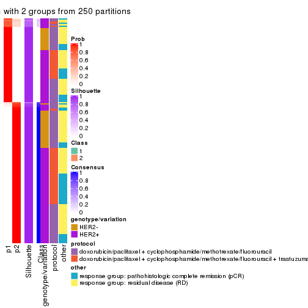</p>

</div>
<div id='tab-ATC-pam-consensus-heatmap-2'>
<pre><code class="r">consensus_heatmap(res, k = 3)
</code></pre>

<p>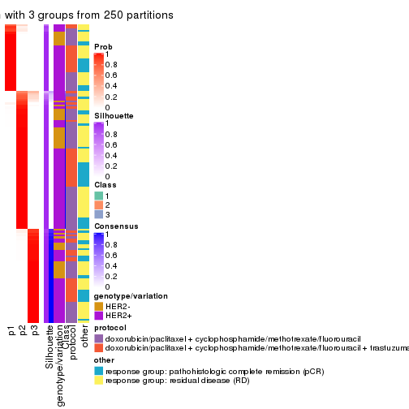</p>

</div>
<div id='tab-ATC-pam-consensus-heatmap-3'>
<pre><code class="r">consensus_heatmap(res, k = 4)
</code></pre>

<p>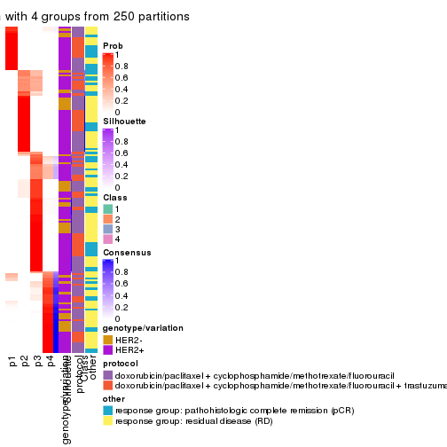</p>

</div>
<div id='tab-ATC-pam-consensus-heatmap-4'>
<pre><code class="r">consensus_heatmap(res, k = 5)
</code></pre>

<p>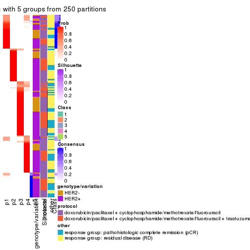</p>

</div>
<div id='tab-ATC-pam-consensus-heatmap-5'>
<pre><code class="r">consensus_heatmap(res, k = 6)
</code></pre>

<p>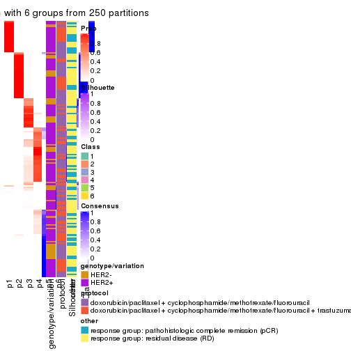</p>

</div>
</div>

Heatmaps for the membership of samples in all partitions to see how consistent they are:


<script>
$( function() {
	$( '#tabs-ATC-pam-membership-heatmap' ).tabs();
} );
</script>
<div id='tabs-ATC-pam-membership-heatmap'>
<ul>
<li><a href='#tab-ATC-pam-membership-heatmap-1'>k = 2</a></li>
<li><a href='#tab-ATC-pam-membership-heatmap-2'>k = 3</a></li>
<li><a href='#tab-ATC-pam-membership-heatmap-3'>k = 4</a></li>
<li><a href='#tab-ATC-pam-membership-heatmap-4'>k = 5</a></li>
<li><a href='#tab-ATC-pam-membership-heatmap-5'>k = 6</a></li>
</ul>
<div id='tab-ATC-pam-membership-heatmap-1'>
<pre><code class="r">membership_heatmap(res, k = 2)
</code></pre>

<p>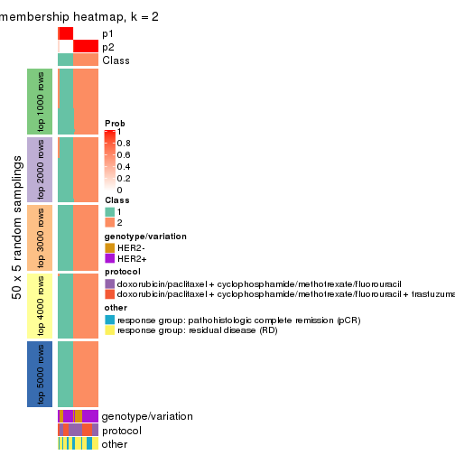</p>

</div>
<div id='tab-ATC-pam-membership-heatmap-2'>
<pre><code class="r">membership_heatmap(res, k = 3)
</code></pre>

<p>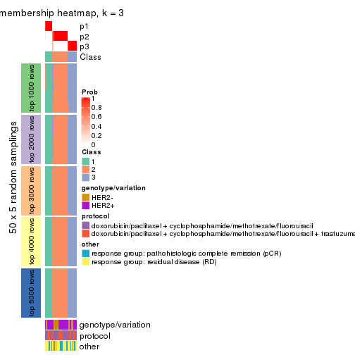</p>

</div>
<div id='tab-ATC-pam-membership-heatmap-3'>
<pre><code class="r">membership_heatmap(res, k = 4)
</code></pre>

<p>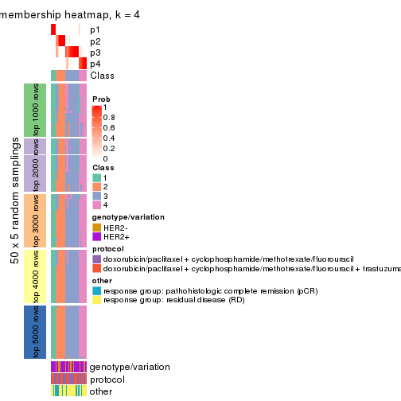</p>

</div>
<div id='tab-ATC-pam-membership-heatmap-4'>
<pre><code class="r">membership_heatmap(res, k = 5)
</code></pre>

<p>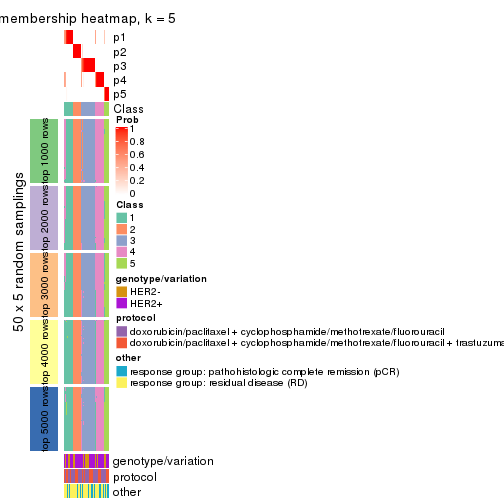</p>

</div>
<div id='tab-ATC-pam-membership-heatmap-5'>
<pre><code class="r">membership_heatmap(res, k = 6)
</code></pre>

<p>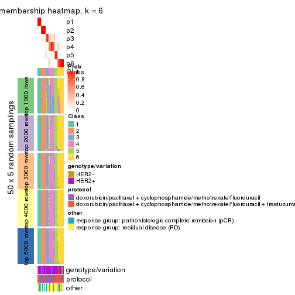</p>

</div>
</div>

As soon as we have had the classes for columns, we can look for signatures
which are significantly different between classes which can be candidate marks
for certain classes. Following are the heatmaps for signatures.


Signature heatmaps where rows are scaled:


<script>
$( function() {
	$( '#tabs-ATC-pam-get-signatures' ).tabs();
} );
</script>
<div id='tabs-ATC-pam-get-signatures'>
<ul>
<li><a href='#tab-ATC-pam-get-signatures-1'>k = 2</a></li>
<li><a href='#tab-ATC-pam-get-signatures-2'>k = 3</a></li>
<li><a href='#tab-ATC-pam-get-signatures-3'>k = 4</a></li>
<li><a href='#tab-ATC-pam-get-signatures-4'>k = 5</a></li>
<li><a href='#tab-ATC-pam-get-signatures-5'>k = 6</a></li>
</ul>
<div id='tab-ATC-pam-get-signatures-1'>
<pre><code class="r">get_signatures(res, k = 2)
</code></pre>

<pre><code>#&gt; Error: The width or height of the raster image is zero, maybe you forget to turn off the
#&gt; previous graphic device or it was corrupted. Run `dev.off()` to close it.
</code></pre>

<p></p>

</div>
<div id='tab-ATC-pam-get-signatures-2'>
<pre><code class="r">get_signatures(res, k = 3)
</code></pre>

<pre><code>#&gt; Error: The width or height of the raster image is zero, maybe you forget to turn off the
#&gt; previous graphic device or it was corrupted. Run `dev.off()` to close it.
</code></pre>

<p></p>

</div>
<div id='tab-ATC-pam-get-signatures-3'>
<pre><code class="r">get_signatures(res, k = 4)
</code></pre>

<pre><code>#&gt; Error: The width or height of the raster image is zero, maybe you forget to turn off the
#&gt; previous graphic device or it was corrupted. Run `dev.off()` to close it.
</code></pre>

<p></p>

</div>
<div id='tab-ATC-pam-get-signatures-4'>
<pre><code class="r">get_signatures(res, k = 5)
</code></pre>

<pre><code>#&gt; Error: The width or height of the raster image is zero, maybe you forget to turn off the
#&gt; previous graphic device or it was corrupted. Run `dev.off()` to close it.
</code></pre>

<p></p>

</div>
<div id='tab-ATC-pam-get-signatures-5'>
<pre><code class="r">get_signatures(res, k = 6)
</code></pre>

<pre><code>#&gt; Error: The width or height of the raster image is zero, maybe you forget to turn off the
#&gt; previous graphic device or it was corrupted. Run `dev.off()` to close it.
</code></pre>

<p></p>

</div>
</div>


Signature heatmaps where rows are not scaled:


<script>
$( function() {
	$( '#tabs-ATC-pam-get-signatures-no-scale' ).tabs();
} );
</script>
<div id='tabs-ATC-pam-get-signatures-no-scale'>
<ul>
<li><a href='#tab-ATC-pam-get-signatures-no-scale-1'>k = 2</a></li>
<li><a href='#tab-ATC-pam-get-signatures-no-scale-2'>k = 3</a></li>
<li><a href='#tab-ATC-pam-get-signatures-no-scale-3'>k = 4</a></li>
<li><a href='#tab-ATC-pam-get-signatures-no-scale-4'>k = 5</a></li>
<li><a href='#tab-ATC-pam-get-signatures-no-scale-5'>k = 6</a></li>
</ul>
<div id='tab-ATC-pam-get-signatures-no-scale-1'>
<pre><code class="r">get_signatures(res, k = 2, scale_rows = FALSE)
</code></pre>

<p>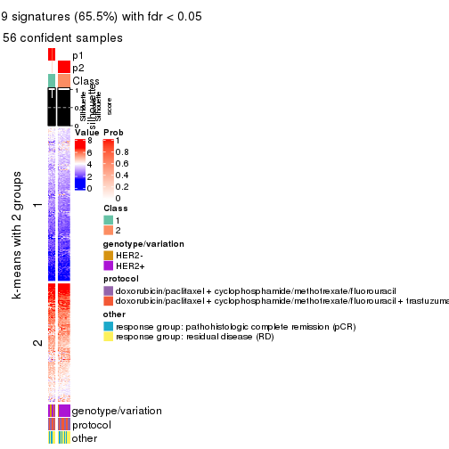</p>

</div>
<div id='tab-ATC-pam-get-signatures-no-scale-2'>
<pre><code class="r">get_signatures(res, k = 3, scale_rows = FALSE)
</code></pre>

<pre><code>#&gt; Error: The width or height of the raster image is zero, maybe you forget to turn off the
#&gt; previous graphic device or it was corrupted. Run `dev.off()` to close it.
</code></pre>

<p></p>

</div>
<div id='tab-ATC-pam-get-signatures-no-scale-3'>
<pre><code class="r">get_signatures(res, k = 4, scale_rows = FALSE)
</code></pre>

<pre><code>#&gt; Error: The width or height of the raster image is zero, maybe you forget to turn off the
#&gt; previous graphic device or it was corrupted. Run `dev.off()` to close it.
</code></pre>

<p></p>

</div>
<div id='tab-ATC-pam-get-signatures-no-scale-4'>
<pre><code class="r">get_signatures(res, k = 5, scale_rows = FALSE)
</code></pre>

<pre><code>#&gt; Error: The width or height of the raster image is zero, maybe you forget to turn off the
#&gt; previous graphic device or it was corrupted. Run `dev.off()` to close it.
</code></pre>

<p></p>

</div>
<div id='tab-ATC-pam-get-signatures-no-scale-5'>
<pre><code class="r">get_signatures(res, k = 6, scale_rows = FALSE)
</code></pre>

<pre><code>#&gt; Error: The width or height of the raster image is zero, maybe you forget to turn off the
#&gt; previous graphic device or it was corrupted. Run `dev.off()` to close it.
</code></pre>

<p></p>

</div>
</div>


Compare the overlap of signatures from different k:

```r
compare_signatures(res)
```

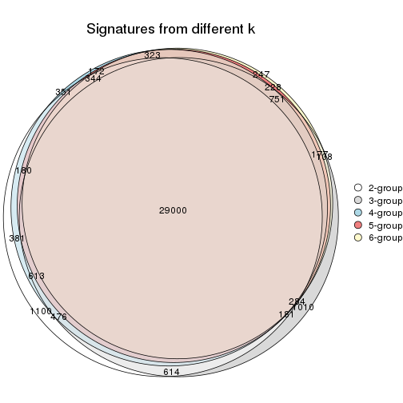

`get_signature()` returns a data frame invisibly. TO get the list of signatures, the function
call should be assigned to a variable explicitly. In following code, if `plot` argument is set
to `FALSE`, no heatmap is plotted while only the differential analysis is performed.

```r
# code only for demonstration
tb = get_signature(res, k = ..., plot = FALSE)
```

An example of the output of `tb` is:

```
#>   which_row         fdr    mean_1    mean_2 scaled_mean_1 scaled_mean_2 km
#> 1        38 0.042760348  8.373488  9.131774    -0.5533452     0.5164555  1
#> 2        40 0.018707592  7.106213  8.469186    -0.6173731     0.5762149  1
#> 3        55 0.019134737 10.221463 11.207825    -0.6159697     0.5749050  1
#> 4        59 0.006059896  5.921854  7.869574    -0.6899429     0.6439467  1
#> 5        60 0.018055526  8.928898 10.211722    -0.6204761     0.5791110  1
#> 6        98 0.009384629 15.714769 14.887706     0.6635654    -0.6193277  2
...
```

The columns in `tb` are:

1. `which_row`: row indices corresponding to the input matrix.
2. `fdr`: FDR for the differential test. 
3. `mean_x`: The mean value in group x.
4. `scaled_mean_x`: The mean value in group x after rows are scaled.
5. `km`: Row groups if k-means clustering is applied to rows.


UMAP plot which shows how samples are separated.


<script>
$( function() {
	$( '#tabs-ATC-pam-dimension-reduction' ).tabs();
} );
</script>
<div id='tabs-ATC-pam-dimension-reduction'>
<ul>
<li><a href='#tab-ATC-pam-dimension-reduction-1'>k = 2</a></li>
<li><a href='#tab-ATC-pam-dimension-reduction-2'>k = 3</a></li>
<li><a href='#tab-ATC-pam-dimension-reduction-3'>k = 4</a></li>
<li><a href='#tab-ATC-pam-dimension-reduction-4'>k = 5</a></li>
<li><a href='#tab-ATC-pam-dimension-reduction-5'>k = 6</a></li>
</ul>
<div id='tab-ATC-pam-dimension-reduction-1'>
<pre><code class="r">dimension_reduction(res, k = 2, method = &quot;UMAP&quot;)
</code></pre>

<p>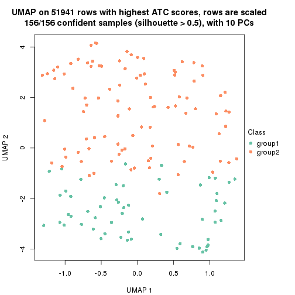</p>

</div>
<div id='tab-ATC-pam-dimension-reduction-2'>
<pre><code class="r">dimension_reduction(res, k = 3, method = &quot;UMAP&quot;)
</code></pre>

<p>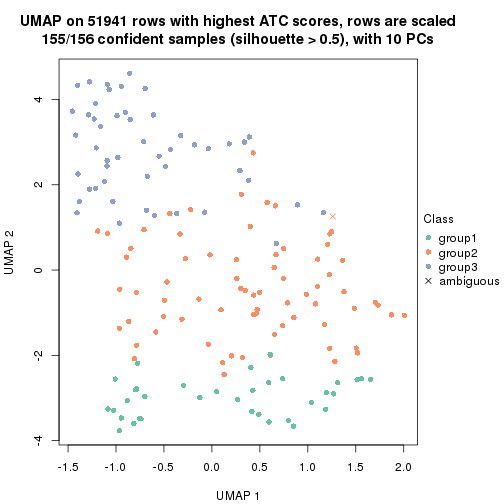</p>

</div>
<div id='tab-ATC-pam-dimension-reduction-3'>
<pre><code class="r">dimension_reduction(res, k = 4, method = &quot;UMAP&quot;)
</code></pre>

<p>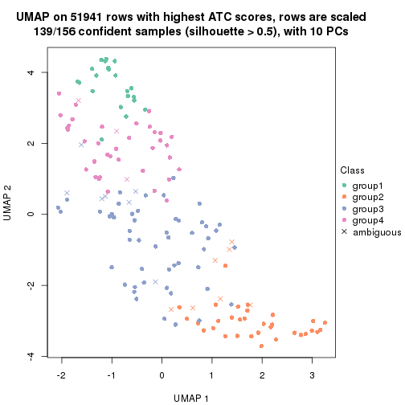</p>

</div>
<div id='tab-ATC-pam-dimension-reduction-4'>
<pre><code class="r">dimension_reduction(res, k = 5, method = &quot;UMAP&quot;)
</code></pre>

<p>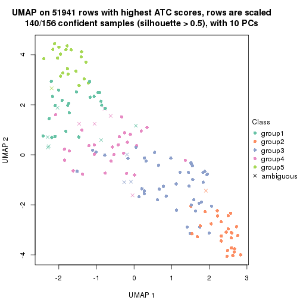</p>

</div>
<div id='tab-ATC-pam-dimension-reduction-5'>
<pre><code class="r">dimension_reduction(res, k = 6, method = &quot;UMAP&quot;)
</code></pre>

<p>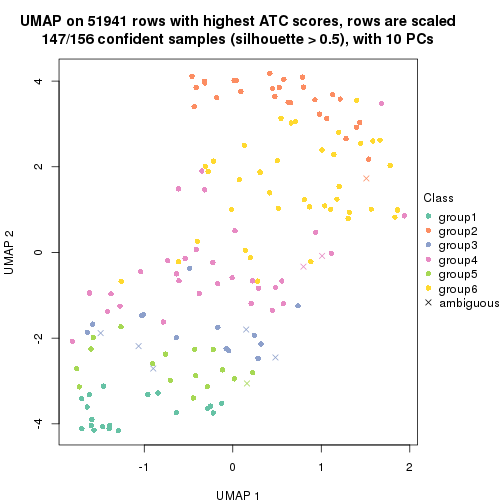</p>

</div>
</div>


Following heatmap shows how subgroups are split when increasing `k`:

```r
collect_classes(res)
```

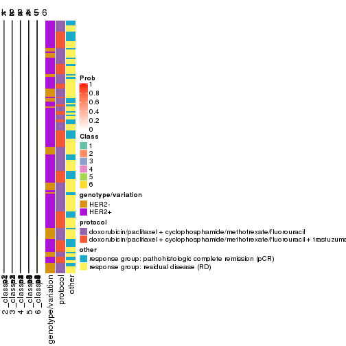


Test correlation between subgroups and known annotations. If the known
annotation is numeric, one-way ANOVA test is applied, and if the known
annotation is discrete, chi-squared contingency table test is applied.

```r
test_to_known_factors(res)
```

```
#>           n genotype/variation(p) protocol(p) other(p) k
#> ATC:pam 156                 0.966       1.000    0.943 2
#> ATC:pam 155                 0.436       0.517    0.909 3
#> ATC:pam 139                 0.427       0.755    0.400 4
#> ATC:pam 140                 0.479       0.463    0.166 5
#> ATC:pam 147                 0.400       0.326    0.204 6
```


If matrix rows can be associated to genes, consider to use `functional_enrichment(res,
...)` to perform function enrichment for the signature genes. See [this vignette](http://bioconductor.org/packages/devel/bioc/vignettes/cola/inst/doc/functional_enrichment.html) for more detailed explanations.


 

---------------------------------------------------


### ATC:mclust


The object with results only for a single top-value method and a single partition method 
can be extracted as:

```r
res = res_list["ATC", "mclust"]
# you can also extract it by
# res = res_list["ATC:mclust"]
```

A summary of `res` and all the functions that can be applied to it:

```r
res
```

```
#> A 'ConsensusPartition' object with k = 2, 3, 4, 5, 6.
#>   On a matrix with 51941 rows and 156 columns.
#>   Top rows (1000, 2000, 3000, 4000, 5000) are extracted by 'ATC' method.
#>   Subgroups are detected by 'mclust' method.
#>   Performed in total 1250 partitions by row resampling.
#>   Best k for subgroups seems to be 2.
#> 
#> Following methods can be applied to this 'ConsensusPartition' object:
#>  [1] "cola_report"             "collect_classes"         "collect_plots"          
#>  [4] "collect_stats"           "colnames"                "compare_signatures"     
#>  [7] "consensus_heatmap"       "dimension_reduction"     "functional_enrichment"  
#> [10] "get_anno_col"            "get_anno"                "get_classes"            
#> [13] "get_consensus"           "get_matrix"              "get_membership"         
#> [16] "get_param"               "get_signatures"          "get_stats"              
#> [19] "is_best_k"               "is_stable_k"             "membership_heatmap"     
#> [22] "ncol"                    "nrow"                    "plot_ecdf"              
#> [25] "rownames"                "select_partition_number" "show"                   
#> [28] "suggest_best_k"          "test_to_known_factors"
```

`collect_plots()` function collects all the plots made from `res` for all `k` (number of partitions)
into one single page to provide an easy and fast comparison between different `k`.

```r
collect_plots(res)
```

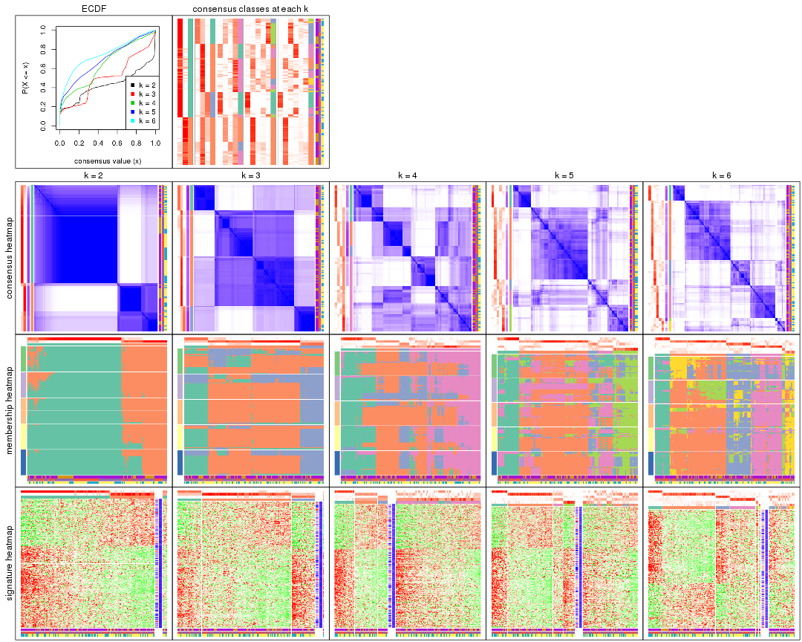

The plots are:

- The first row: a plot of the ECDF (empirical cumulative distribution
  function) curves of the consensus matrix for each `k` and the heatmap of
  predicted classes for each `k`.
- The second row: heatmaps of the consensus matrix for each `k`.
- The third row: heatmaps of the membership matrix for each `k`.
- The fouth row: heatmaps of the signatures for each `k`.

All the plots in panels can be made by individual functions and they are
plotted later in this section.

`select_partition_number()` produces several plots showing different
statistics for choosing "optimized" `k`. There are following statistics:

- ECDF curves of the consensus matrix for each `k`;
- 1-PAC. [The PAC
  score](https://en.wikipedia.org/wiki/Consensus_clustering#Over-interpretation_potential_of_consensus_clustering)
  measures the proportion of the ambiguous subgrouping.
- Mean silhouette score.
- Concordance. The mean probability of fiting the consensus class ids in all
  partitions.
- Area increased. Denote $A_k$ as the area under the ECDF curve for current
  `k`, the area increased is defined as $A_k - A_{k-1}$.
- Rand index. The percent of pairs of samples that are both in a same cluster
  or both are not in a same cluster in the partition of k and k-1.
- Jaccard index. The ratio of pairs of samples are both in a same cluster in
  the partition of k and k-1 and the pairs of samples are both in a same
  cluster in the partition k or k-1.

The detailed explanations of these statistics can be found in [the _cola_
vignette](http://bioconductor.org/packages/devel/bioc/vignettes/cola/inst/doc/cola.html#toc_13).

Generally speaking, lower PAC score, higher mean silhouette score or higher
concordance corresponds to better partition. Rand index and Jaccard index
measure how similar the current partition is compared to partition with `k-1`.
If they are too similar, we won't accept `k` is better than `k-1`.

```r
select_partition_number(res)
```

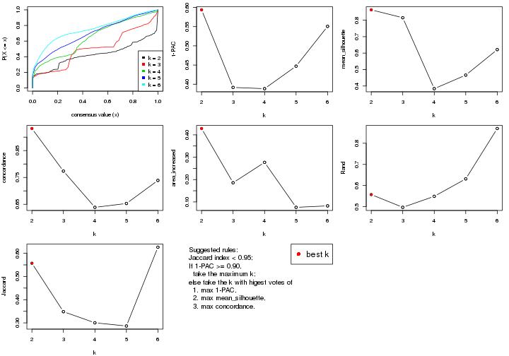

The numeric values for all these statistics can be obtained by `get_stats()`.

```r
get_stats(res)
```

```
#>   k 1-PAC mean_silhouette concordance area_increased  Rand Jaccard
#> 2 2 0.594           0.863       0.932         0.4281 0.557   0.557
#> 3 3 0.392           0.815       0.774         0.1858 0.497   0.348
#> 4 4 0.388           0.384       0.639         0.2768 0.549   0.300
#> 5 5 0.447           0.466       0.653         0.0759 0.631   0.287
#> 6 6 0.551           0.621       0.739         0.0823 0.870   0.626
```

`suggest_best_k()` suggests the best $k$ based on these statistics. The rules are as follows:

- All $k$ with Jaccard index larger than 0.95 are removed because increasing
  $k$ does not provide enough extra information. If all $k$ are removed, it is
  marked as no subgroup is detected.
- For all $k$ with 1-PAC score larger than 0.9, the maximal $k$ is taken as
  the best $k$, and other $k$ are marked as optional $k$.
- If it does not fit the second rule. The $k$ with the maximal vote of the
  highest 1-PAC score, highest mean silhouette, and highest concordance is
  taken as the best $k$.

```r
suggest_best_k(res)
```

```
#> [1] 2
```


Following shows the table of the partitions (You need to click the **show/hide
code output** link to see it). The membership matrix (columns with name `p*`)
is inferred by
[`clue::cl_consensus()`](https://www.rdocumentation.org/link/cl_consensus?package=clue)
function with the `SE` method. Basically the value in the membership matrix
represents the probability to belong to a certain group. The finall class
label for an item is determined with the group with highest probability it
belongs to.

In `get_classes()` function, the entropy is calculated from the membership
matrix and the silhouette score is calculated from the consensus matrix.


<script>
$( function() {
	$( '#tabs-ATC-mclust-get-classes' ).tabs();
} );
</script>
<div id='tabs-ATC-mclust-get-classes'>
<ul>
<li><a href='#tab-ATC-mclust-get-classes-1'>k = 2</a></li>
<li><a href='#tab-ATC-mclust-get-classes-2'>k = 3</a></li>
<li><a href='#tab-ATC-mclust-get-classes-3'>k = 4</a></li>
<li><a href='#tab-ATC-mclust-get-classes-4'>k = 5</a></li>
<li><a href='#tab-ATC-mclust-get-classes-5'>k = 6</a></li>
</ul>

<div id='tab-ATC-mclust-get-classes-1'>
<p><a id='tab-ATC-mclust-get-classes-1-a' style='color:#0366d6' href='#'>show/hide code output</a></p>
<pre><code class="r">cbind(get_classes(res, k = 2), get_membership(res, k = 2))
</code></pre>

<pre><code>#&gt;            class entropy silhouette    p1    p2
#&gt; GSM1232995     2  0.7299      0.817 0.204 0.796
#&gt; GSM1233002     1  0.0000      0.942 1.000 0.000
#&gt; GSM1233003     1  0.0000      0.942 1.000 0.000
#&gt; GSM1233014     2  0.0000      0.879 0.000 1.000
#&gt; GSM1233015     1  0.0000      0.942 1.000 0.000
#&gt; GSM1233016     1  0.0000      0.942 1.000 0.000
#&gt; GSM1233024     1  0.9522      0.375 0.628 0.372
#&gt; GSM1233049     1  0.0000      0.942 1.000 0.000
#&gt; GSM1233064     1  0.8144      0.656 0.748 0.252
#&gt; GSM1233068     1  0.0000      0.942 1.000 0.000
#&gt; GSM1233073     1  0.1633      0.927 0.976 0.024
#&gt; GSM1233093     1  0.0000      0.942 1.000 0.000
#&gt; GSM1233115     1  0.0000      0.942 1.000 0.000
#&gt; GSM1232992     2  0.1414      0.874 0.020 0.980
#&gt; GSM1232993     1  0.2603      0.912 0.956 0.044
#&gt; GSM1233005     2  0.7299      0.817 0.204 0.796
#&gt; GSM1233007     1  0.0376      0.940 0.996 0.004
#&gt; GSM1233010     1  0.0000      0.942 1.000 0.000
#&gt; GSM1233013     2  0.5842      0.849 0.140 0.860
#&gt; GSM1233018     2  0.7299      0.817 0.204 0.796
#&gt; GSM1233019     2  0.7299      0.817 0.204 0.796
#&gt; GSM1233021     2  0.7299      0.817 0.204 0.796
#&gt; GSM1233025     1  0.0000      0.942 1.000 0.000
#&gt; GSM1233029     2  0.0000      0.879 0.000 1.000
#&gt; GSM1233030     2  0.5946      0.847 0.144 0.856
#&gt; GSM1233031     1  0.2778      0.908 0.952 0.048
#&gt; GSM1233032     1  0.0000      0.942 1.000 0.000
#&gt; GSM1233035     1  0.0000      0.942 1.000 0.000
#&gt; GSM1233038     1  0.0000      0.942 1.000 0.000
#&gt; GSM1233039     1  0.8763      0.567 0.704 0.296
#&gt; GSM1233042     1  0.0376      0.940 0.996 0.004
#&gt; GSM1233043     1  0.6343      0.795 0.840 0.160
#&gt; GSM1233044     1  0.0000      0.942 1.000 0.000
#&gt; GSM1233046     1  0.0376      0.940 0.996 0.004
#&gt; GSM1233051     1  0.0000      0.942 1.000 0.000
#&gt; GSM1233054     1  0.0000      0.942 1.000 0.000
#&gt; GSM1233057     1  0.5294      0.841 0.880 0.120
#&gt; GSM1233060     1  0.8144      0.655 0.748 0.252
#&gt; GSM1233062     2  0.9850      0.362 0.428 0.572
#&gt; GSM1233075     2  0.0000      0.879 0.000 1.000
#&gt; GSM1233078     1  0.0000      0.942 1.000 0.000
#&gt; GSM1233079     1  0.0000      0.942 1.000 0.000
#&gt; GSM1233082     1  0.0000      0.942 1.000 0.000
#&gt; GSM1233083     1  0.0000      0.942 1.000 0.000
#&gt; GSM1233091     1  0.0000      0.942 1.000 0.000
#&gt; GSM1233095     1  0.0000      0.942 1.000 0.000
#&gt; GSM1233096     1  0.0000      0.942 1.000 0.000
#&gt; GSM1233101     1  0.0000      0.942 1.000 0.000
#&gt; GSM1233105     1  0.0000      0.942 1.000 0.000
#&gt; GSM1233117     2  0.0000      0.879 0.000 1.000
#&gt; GSM1233118     2  0.0000      0.879 0.000 1.000
#&gt; GSM1233001     2  0.0000      0.879 0.000 1.000
#&gt; GSM1233006     2  0.1633      0.873 0.024 0.976
#&gt; GSM1233008     1  0.4815      0.859 0.896 0.104
#&gt; GSM1233009     2  0.0000      0.879 0.000 1.000
#&gt; GSM1233017     2  0.0000      0.879 0.000 1.000
#&gt; GSM1233020     2  0.7299      0.817 0.204 0.796
#&gt; GSM1233022     1  0.5629      0.829 0.868 0.132
#&gt; GSM1233026     1  0.0000      0.942 1.000 0.000
#&gt; GSM1233028     1  0.0938      0.935 0.988 0.012
#&gt; GSM1233034     1  0.1633      0.927 0.976 0.024
#&gt; GSM1233040     1  0.0000      0.942 1.000 0.000
#&gt; GSM1233048     1  0.0000      0.942 1.000 0.000
#&gt; GSM1233056     1  0.0000      0.942 1.000 0.000
#&gt; GSM1233058     1  0.0000      0.942 1.000 0.000
#&gt; GSM1233059     1  0.0000      0.942 1.000 0.000
#&gt; GSM1233066     1  0.3431      0.895 0.936 0.064
#&gt; GSM1233071     2  0.6438      0.821 0.164 0.836
#&gt; GSM1233074     1  0.9087      0.502 0.676 0.324
#&gt; GSM1233076     2  0.8386      0.740 0.268 0.732
#&gt; GSM1233080     1  0.0000      0.942 1.000 0.000
#&gt; GSM1233088     1  0.8499      0.608 0.724 0.276
#&gt; GSM1233090     1  0.0000      0.942 1.000 0.000
#&gt; GSM1233092     2  0.0000      0.879 0.000 1.000
#&gt; GSM1233094     1  0.0672      0.937 0.992 0.008
#&gt; GSM1233097     1  0.0000      0.942 1.000 0.000
#&gt; GSM1233100     1  0.0000      0.942 1.000 0.000
#&gt; GSM1233104     2  0.9427      0.552 0.360 0.640
#&gt; GSM1233106     1  0.0000      0.942 1.000 0.000
#&gt; GSM1233111     1  0.0000      0.942 1.000 0.000
#&gt; GSM1233122     2  0.0000      0.879 0.000 1.000
#&gt; GSM1233146     1  0.0000      0.942 1.000 0.000
#&gt; GSM1232994     2  0.8081      0.763 0.248 0.752
#&gt; GSM1232996     2  0.8327      0.739 0.264 0.736
#&gt; GSM1232997     1  0.4431      0.869 0.908 0.092
#&gt; GSM1232998     2  0.7528      0.804 0.216 0.784
#&gt; GSM1232999     2  0.0000      0.879 0.000 1.000
#&gt; GSM1233000     2  0.0000      0.879 0.000 1.000
#&gt; GSM1233004     1  0.0000      0.942 1.000 0.000
#&gt; GSM1233011     1  0.5519      0.834 0.872 0.128
#&gt; GSM1233012     2  0.5842      0.849 0.140 0.860
#&gt; GSM1233023     1  0.8909      0.542 0.692 0.308
#&gt; GSM1233027     1  0.9710      0.286 0.600 0.400
#&gt; GSM1233033     1  0.0000      0.942 1.000 0.000
#&gt; GSM1233036     1  0.0938      0.935 0.988 0.012
#&gt; GSM1233037     1  0.1633      0.927 0.976 0.024
#&gt; GSM1233041     1  0.0000      0.942 1.000 0.000
#&gt; GSM1233045     1  0.7602      0.709 0.780 0.220
#&gt; GSM1233047     1  0.0000      0.942 1.000 0.000
#&gt; GSM1233050     1  0.0000      0.942 1.000 0.000
#&gt; GSM1233052     1  0.0000      0.942 1.000 0.000
#&gt; GSM1233053     1  0.0000      0.942 1.000 0.000
#&gt; GSM1233055     1  0.0000      0.942 1.000 0.000
#&gt; GSM1233061     1  0.0000      0.942 1.000 0.000
#&gt; GSM1233063     1  0.0000      0.942 1.000 0.000
#&gt; GSM1233065     2  0.7376      0.813 0.208 0.792
#&gt; GSM1233070     2  0.0000      0.879 0.000 1.000
#&gt; GSM1233077     2  0.0000      0.879 0.000 1.000
#&gt; GSM1233081     1  0.0000      0.942 1.000 0.000
#&gt; GSM1233084     1  0.0000      0.942 1.000 0.000
#&gt; GSM1233087     1  0.0000      0.942 1.000 0.000
#&gt; GSM1233089     2  0.7299      0.817 0.204 0.796
#&gt; GSM1233099     1  0.0000      0.942 1.000 0.000
#&gt; GSM1233112     1  0.0000      0.942 1.000 0.000
#&gt; GSM1233085     1  0.0000      0.942 1.000 0.000
#&gt; GSM1233098     2  0.0000      0.879 0.000 1.000
#&gt; GSM1233114     1  0.0000      0.942 1.000 0.000
#&gt; GSM1233119     1  0.0000      0.942 1.000 0.000
#&gt; GSM1233129     1  0.7376      0.728 0.792 0.208
#&gt; GSM1233132     1  0.0000      0.942 1.000 0.000
#&gt; GSM1233139     2  0.0000      0.879 0.000 1.000
#&gt; GSM1233143     1  0.4939      0.856 0.892 0.108
#&gt; GSM1233145     1  0.0000      0.942 1.000 0.000
#&gt; GSM1233067     2  0.7299      0.817 0.204 0.796
#&gt; GSM1233069     2  0.0000      0.879 0.000 1.000
#&gt; GSM1233072     2  0.0000      0.879 0.000 1.000
#&gt; GSM1233086     2  0.6247      0.842 0.156 0.844
#&gt; GSM1233102     1  0.0000      0.942 1.000 0.000
#&gt; GSM1233103     1  0.1633      0.927 0.976 0.024
#&gt; GSM1233107     1  0.0000      0.942 1.000 0.000
#&gt; GSM1233108     1  0.0000      0.942 1.000 0.000
#&gt; GSM1233109     1  0.0000      0.942 1.000 0.000
#&gt; GSM1233110     1  0.4690      0.862 0.900 0.100
#&gt; GSM1233113     2  0.7299      0.817 0.204 0.796
#&gt; GSM1233116     2  0.0000      0.879 0.000 1.000
#&gt; GSM1233120     1  0.0000      0.942 1.000 0.000
#&gt; GSM1233121     2  0.0000      0.879 0.000 1.000
#&gt; GSM1233123     1  0.0000      0.942 1.000 0.000
#&gt; GSM1233124     2  0.7376      0.813 0.208 0.792
#&gt; GSM1233125     1  0.0000      0.942 1.000 0.000
#&gt; GSM1233126     2  0.7299      0.817 0.204 0.796
#&gt; GSM1233127     2  0.0000      0.879 0.000 1.000
#&gt; GSM1233128     1  0.0000      0.942 1.000 0.000
#&gt; GSM1233130     1  0.9129      0.484 0.672 0.328
#&gt; GSM1233131     1  0.0000      0.942 1.000 0.000
#&gt; GSM1233133     1  0.0000      0.942 1.000 0.000
#&gt; GSM1233134     2  0.0000      0.879 0.000 1.000
#&gt; GSM1233135     1  1.0000     -0.134 0.504 0.496
#&gt; GSM1233136     2  0.9087      0.646 0.324 0.676
#&gt; GSM1233137     1  0.0000      0.942 1.000 0.000
#&gt; GSM1233138     1  0.8443      0.613 0.728 0.272
#&gt; GSM1233140     1  0.0000      0.942 1.000 0.000
#&gt; GSM1233141     2  0.0000      0.879 0.000 1.000
#&gt; GSM1233142     2  0.0000      0.879 0.000 1.000
#&gt; GSM1233144     1  0.0000      0.942 1.000 0.000
#&gt; GSM1233147     2  0.0000      0.879 0.000 1.000
</code></pre>

<script>
$('#tab-ATC-mclust-get-classes-1-a').parent().next().next().hide();
$('#tab-ATC-mclust-get-classes-1-a').click(function(){
  $('#tab-ATC-mclust-get-classes-1-a').parent().next().next().toggle();
  return(false);
});
</script>
</div>

<div id='tab-ATC-mclust-get-classes-2'>
<p><a id='tab-ATC-mclust-get-classes-2-a' style='color:#0366d6' href='#'>show/hide code output</a></p>
<pre><code class="r">cbind(get_classes(res, k = 3), get_membership(res, k = 3))
</code></pre>

<pre><code>#&gt;            class entropy silhouette    p1    p2    p3
#&gt; GSM1232995     2  0.6981      0.735 0.228 0.704 0.068
#&gt; GSM1233002     1  0.6143      0.955 0.684 0.304 0.012
#&gt; GSM1233003     3  0.6897      0.905 0.040 0.292 0.668
#&gt; GSM1233014     2  0.4974      0.768 0.000 0.764 0.236
#&gt; GSM1233015     1  0.5797      0.965 0.712 0.280 0.008
#&gt; GSM1233016     1  0.5497      0.962 0.708 0.292 0.000
#&gt; GSM1233024     2  0.3644      0.784 0.124 0.872 0.004
#&gt; GSM1233049     3  0.5497      0.949 0.000 0.292 0.708
#&gt; GSM1233064     2  0.0475      0.782 0.004 0.992 0.004
#&gt; GSM1233068     2  0.2200      0.758 0.056 0.940 0.004
#&gt; GSM1233073     2  0.0237      0.780 0.000 0.996 0.004
#&gt; GSM1233093     3  0.5497      0.949 0.000 0.292 0.708
#&gt; GSM1233115     1  0.8847      0.733 0.552 0.300 0.148
#&gt; GSM1232992     2  0.6808      0.763 0.084 0.732 0.184
#&gt; GSM1232993     2  0.0592      0.777 0.000 0.988 0.012
#&gt; GSM1233005     2  0.6019      0.720 0.288 0.700 0.012
#&gt; GSM1233007     2  0.1529      0.760 0.000 0.960 0.040
#&gt; GSM1233010     2  0.1860      0.760 0.052 0.948 0.000
#&gt; GSM1233013     2  0.7144      0.734 0.220 0.700 0.080
#&gt; GSM1233018     2  0.6019      0.720 0.288 0.700 0.012
#&gt; GSM1233019     2  0.6019      0.720 0.288 0.700 0.012
#&gt; GSM1233021     2  0.6019      0.720 0.288 0.700 0.012
#&gt; GSM1233025     1  0.6051      0.970 0.696 0.292 0.012
#&gt; GSM1233029     2  0.5517      0.757 0.004 0.728 0.268
#&gt; GSM1233030     2  0.5722      0.745 0.004 0.704 0.292
#&gt; GSM1233031     2  0.0237      0.780 0.000 0.996 0.004
#&gt; GSM1233032     1  0.6051      0.970 0.696 0.292 0.012
#&gt; GSM1233035     2  0.4575      0.554 0.184 0.812 0.004
#&gt; GSM1233038     1  0.6051      0.970 0.696 0.292 0.012
#&gt; GSM1233039     2  0.0747      0.784 0.016 0.984 0.000
#&gt; GSM1233042     2  0.1643      0.756 0.000 0.956 0.044
#&gt; GSM1233043     2  0.0848      0.782 0.008 0.984 0.008
#&gt; GSM1233044     2  0.1950      0.754 0.040 0.952 0.008
#&gt; GSM1233046     2  0.0592      0.777 0.000 0.988 0.012
#&gt; GSM1233051     3  0.8371      0.797 0.116 0.292 0.592
#&gt; GSM1233054     3  0.6008      0.821 0.000 0.372 0.628
#&gt; GSM1233057     2  0.0747      0.783 0.016 0.984 0.000
#&gt; GSM1233060     2  0.0237      0.780 0.000 0.996 0.004
#&gt; GSM1233062     2  0.1031      0.786 0.024 0.976 0.000
#&gt; GSM1233075     2  0.5497      0.746 0.000 0.708 0.292
#&gt; GSM1233078     2  0.4465      0.551 0.176 0.820 0.004
#&gt; GSM1233079     1  0.5797      0.965 0.712 0.280 0.008
#&gt; GSM1233082     1  0.5831      0.968 0.708 0.284 0.008
#&gt; GSM1233083     3  0.6326      0.930 0.020 0.292 0.688
#&gt; GSM1233091     2  0.1643      0.756 0.000 0.956 0.044
#&gt; GSM1233095     3  0.5497      0.949 0.000 0.292 0.708
#&gt; GSM1233096     1  0.5831      0.968 0.708 0.284 0.008
#&gt; GSM1233101     3  0.5497      0.949 0.000 0.292 0.708
#&gt; GSM1233105     1  0.5797      0.965 0.712 0.280 0.008
#&gt; GSM1233117     2  0.5722      0.745 0.004 0.704 0.292
#&gt; GSM1233118     2  0.6820      0.746 0.052 0.700 0.248
#&gt; GSM1233001     2  0.5722      0.745 0.004 0.704 0.292
#&gt; GSM1233006     2  0.5497      0.746 0.000 0.708 0.292
#&gt; GSM1233008     2  0.2448      0.780 0.076 0.924 0.000
#&gt; GSM1233009     2  0.7024      0.748 0.072 0.704 0.224
#&gt; GSM1233017     2  0.6562      0.746 0.036 0.700 0.264
#&gt; GSM1233020     2  0.6019      0.720 0.288 0.700 0.012
#&gt; GSM1233022     2  0.1399      0.766 0.028 0.968 0.004
#&gt; GSM1233026     2  0.2096      0.748 0.052 0.944 0.004
#&gt; GSM1233028     2  0.0237      0.780 0.000 0.996 0.004
#&gt; GSM1233034     2  0.2261      0.768 0.068 0.932 0.000
#&gt; GSM1233040     3  0.5497      0.949 0.000 0.292 0.708
#&gt; GSM1233048     3  0.5497      0.949 0.000 0.292 0.708
#&gt; GSM1233056     3  0.5722      0.946 0.004 0.292 0.704
#&gt; GSM1233058     2  0.1643      0.756 0.000 0.956 0.044
#&gt; GSM1233059     3  0.6193      0.934 0.016 0.292 0.692
#&gt; GSM1233066     2  0.0592      0.781 0.012 0.988 0.000
#&gt; GSM1233071     2  0.5465      0.748 0.000 0.712 0.288
#&gt; GSM1233074     2  0.2550      0.791 0.056 0.932 0.012
#&gt; GSM1233076     2  0.1031      0.789 0.000 0.976 0.024
#&gt; GSM1233080     3  0.9693      0.453 0.252 0.292 0.456
#&gt; GSM1233088     2  0.0237      0.780 0.000 0.996 0.004
#&gt; GSM1233090     3  0.5497      0.949 0.000 0.292 0.708
#&gt; GSM1233092     2  0.5497      0.746 0.000 0.708 0.292
#&gt; GSM1233094     2  0.1529      0.760 0.000 0.960 0.040
#&gt; GSM1233097     2  0.1411      0.763 0.000 0.964 0.036
#&gt; GSM1233100     2  0.1860      0.750 0.000 0.948 0.052
#&gt; GSM1233104     2  0.1453      0.788 0.024 0.968 0.008
#&gt; GSM1233106     1  0.5656      0.963 0.712 0.284 0.004
#&gt; GSM1233111     1  0.5797      0.965 0.712 0.280 0.008
#&gt; GSM1233122     2  0.5722      0.745 0.004 0.704 0.292
#&gt; GSM1233146     1  0.5621      0.939 0.692 0.308 0.000
#&gt; GSM1232994     2  0.6019      0.720 0.288 0.700 0.012
#&gt; GSM1232996     2  0.6019      0.720 0.288 0.700 0.012
#&gt; GSM1232997     2  0.2261      0.768 0.068 0.932 0.000
#&gt; GSM1232998     2  0.6019      0.720 0.288 0.700 0.012
#&gt; GSM1232999     2  0.5397      0.752 0.000 0.720 0.280
#&gt; GSM1233000     2  0.5497      0.746 0.000 0.708 0.292
#&gt; GSM1233004     3  0.5497      0.949 0.000 0.292 0.708
#&gt; GSM1233011     2  0.0747      0.783 0.016 0.984 0.000
#&gt; GSM1233012     2  0.6625      0.768 0.080 0.744 0.176
#&gt; GSM1233023     2  0.2682      0.790 0.076 0.920 0.004
#&gt; GSM1233027     2  0.5848      0.732 0.268 0.720 0.012
#&gt; GSM1233033     1  0.5797      0.965 0.712 0.280 0.008
#&gt; GSM1233036     2  0.1964      0.761 0.056 0.944 0.000
#&gt; GSM1233037     2  0.0592      0.779 0.012 0.988 0.000
#&gt; GSM1233041     1  0.6051      0.970 0.696 0.292 0.012
#&gt; GSM1233045     2  0.0848      0.782 0.008 0.984 0.008
#&gt; GSM1233047     3  0.5497      0.949 0.000 0.292 0.708
#&gt; GSM1233050     3  0.5497      0.949 0.000 0.292 0.708
#&gt; GSM1233052     3  0.5497      0.949 0.000 0.292 0.708
#&gt; GSM1233053     3  0.5497      0.949 0.000 0.292 0.708
#&gt; GSM1233055     3  0.5497      0.949 0.000 0.292 0.708
#&gt; GSM1233061     2  0.1643      0.756 0.000 0.956 0.044
#&gt; GSM1233063     1  0.5864      0.969 0.704 0.288 0.008
#&gt; GSM1233065     2  0.4235      0.772 0.176 0.824 0.000
#&gt; GSM1233070     2  0.5497      0.746 0.000 0.708 0.292
#&gt; GSM1233077     2  0.5497      0.746 0.000 0.708 0.292
#&gt; GSM1233081     2  0.2116      0.751 0.040 0.948 0.012
#&gt; GSM1233084     1  0.6051      0.970 0.696 0.292 0.012
#&gt; GSM1233087     2  0.2173      0.750 0.048 0.944 0.008
#&gt; GSM1233089     2  0.6019      0.720 0.288 0.700 0.012
#&gt; GSM1233099     3  0.5529      0.944 0.000 0.296 0.704
#&gt; GSM1233112     3  0.5497      0.949 0.000 0.292 0.708
#&gt; GSM1233085     3  0.5497      0.949 0.000 0.292 0.708
#&gt; GSM1233098     2  0.5497      0.746 0.000 0.708 0.292
#&gt; GSM1233114     1  0.5797      0.965 0.712 0.280 0.008
#&gt; GSM1233119     1  0.5754      0.965 0.700 0.296 0.004
#&gt; GSM1233129     2  0.3267      0.789 0.000 0.884 0.116
#&gt; GSM1233132     3  0.5497      0.949 0.000 0.292 0.708
#&gt; GSM1233139     2  0.5497      0.746 0.000 0.708 0.292
#&gt; GSM1233143     2  0.2550      0.772 0.040 0.936 0.024
#&gt; GSM1233145     1  0.6051      0.970 0.696 0.292 0.012
#&gt; GSM1233067     2  0.7064      0.737 0.220 0.704 0.076
#&gt; GSM1233069     2  0.5497      0.746 0.000 0.708 0.292
#&gt; GSM1233072     2  0.6699      0.747 0.044 0.700 0.256
#&gt; GSM1233086     2  0.2703      0.792 0.016 0.928 0.056
#&gt; GSM1233102     1  0.6051      0.970 0.696 0.292 0.012
#&gt; GSM1233103     2  0.0424      0.779 0.000 0.992 0.008
#&gt; GSM1233107     2  0.2261      0.745 0.068 0.932 0.000
#&gt; GSM1233108     1  0.6051      0.970 0.696 0.292 0.012
#&gt; GSM1233109     1  0.6448      0.851 0.636 0.352 0.012
#&gt; GSM1233110     2  0.1170      0.777 0.016 0.976 0.008
#&gt; GSM1233113     2  0.6625      0.754 0.196 0.736 0.068
#&gt; GSM1233116     2  0.7424      0.744 0.128 0.700 0.172
#&gt; GSM1233120     3  0.5785      0.893 0.000 0.332 0.668
#&gt; GSM1233121     2  0.5497      0.746 0.000 0.708 0.292
#&gt; GSM1233123     2  0.1643      0.756 0.000 0.956 0.044
#&gt; GSM1233124     2  0.4002      0.783 0.000 0.840 0.160
#&gt; GSM1233125     1  0.6051      0.970 0.696 0.292 0.012
#&gt; GSM1233126     2  0.4692      0.782 0.012 0.820 0.168
#&gt; GSM1233127     2  0.5953      0.747 0.012 0.708 0.280
#&gt; GSM1233128     1  0.6051      0.970 0.696 0.292 0.012
#&gt; GSM1233130     2  0.0661      0.781 0.004 0.988 0.008
#&gt; GSM1233131     2  0.2313      0.749 0.024 0.944 0.032
#&gt; GSM1233133     3  0.6169      0.840 0.004 0.360 0.636
#&gt; GSM1233134     2  0.6731      0.766 0.088 0.740 0.172
#&gt; GSM1233135     2  0.1620      0.786 0.012 0.964 0.024
#&gt; GSM1233136     2  0.1170      0.782 0.016 0.976 0.008
#&gt; GSM1233137     3  0.6079      0.784 0.000 0.388 0.612
#&gt; GSM1233138     2  0.1765      0.757 0.040 0.956 0.004
#&gt; GSM1233140     1  0.6051      0.970 0.696 0.292 0.012
#&gt; GSM1233141     2  0.5722      0.745 0.004 0.704 0.292
#&gt; GSM1233142     2  0.7424      0.744 0.128 0.700 0.172
#&gt; GSM1233144     2  0.2116      0.751 0.040 0.948 0.012
#&gt; GSM1233147     2  0.5497      0.746 0.000 0.708 0.292
</code></pre>

<script>
$('#tab-ATC-mclust-get-classes-2-a').parent().next().next().hide();
$('#tab-ATC-mclust-get-classes-2-a').click(function(){
  $('#tab-ATC-mclust-get-classes-2-a').parent().next().next().toggle();
  return(false);
});
</script>
</div>

<div id='tab-ATC-mclust-get-classes-3'>
<p><a id='tab-ATC-mclust-get-classes-3-a' style='color:#0366d6' href='#'>show/hide code output</a></p>
<pre><code class="r">cbind(get_classes(res, k = 4), get_membership(res, k = 4))
</code></pre>

<pre><code>#&gt;            class entropy silhouette    p1    p2    p3    p4
#&gt; GSM1232995     4  0.7780   -0.63726 0.000 0.272 0.300 0.428
#&gt; GSM1233002     4  0.4941    0.44640 0.000 0.436 0.000 0.564
#&gt; GSM1233003     4  0.7249    0.34364 0.200 0.260 0.000 0.540
#&gt; GSM1233014     2  0.5421    0.92883 0.004 0.548 0.008 0.440
#&gt; GSM1233015     4  0.6924    0.41975 0.008 0.104 0.320 0.568
#&gt; GSM1233016     4  0.6316    0.45339 0.000 0.184 0.156 0.660
#&gt; GSM1233024     4  0.5383   -0.79978 0.000 0.012 0.452 0.536
#&gt; GSM1233049     1  0.2778    0.68282 0.900 0.004 0.080 0.016
#&gt; GSM1233064     1  0.6301    0.33364 0.544 0.004 0.052 0.400
#&gt; GSM1233068     4  0.6016    0.41470 0.064 0.016 0.228 0.692
#&gt; GSM1233073     4  0.5074    0.12497 0.236 0.000 0.040 0.724
#&gt; GSM1233093     1  0.2778    0.68282 0.900 0.004 0.080 0.016
#&gt; GSM1233115     4  0.6561    0.43823 0.140 0.212 0.004 0.644
#&gt; GSM1232992     4  0.7442   -0.72435 0.000 0.340 0.184 0.476
#&gt; GSM1232993     1  0.5279    0.42567 0.588 0.000 0.012 0.400
#&gt; GSM1233005     3  0.5452    0.95618 0.000 0.016 0.556 0.428
#&gt; GSM1233007     1  0.5290    0.42887 0.584 0.000 0.012 0.404
#&gt; GSM1233010     4  0.2342    0.35259 0.000 0.080 0.008 0.912
#&gt; GSM1233013     4  0.7782   -0.64245 0.000 0.276 0.296 0.428
#&gt; GSM1233018     3  0.5229    0.96262 0.000 0.008 0.564 0.428
#&gt; GSM1233019     3  0.5229    0.96262 0.000 0.008 0.564 0.428
#&gt; GSM1233021     3  0.5229    0.96262 0.000 0.008 0.564 0.428
#&gt; GSM1233025     4  0.4933    0.44799 0.000 0.432 0.000 0.568
#&gt; GSM1233029     2  0.6152    0.90204 0.004 0.520 0.040 0.436
#&gt; GSM1233030     2  0.5105    0.93380 0.000 0.564 0.004 0.432
#&gt; GSM1233031     4  0.3687    0.25070 0.080 0.064 0.000 0.856
#&gt; GSM1233032     4  0.4941    0.44640 0.000 0.436 0.000 0.564
#&gt; GSM1233035     4  0.6077    0.43749 0.004 0.076 0.260 0.660
#&gt; GSM1233038     4  0.4941    0.44640 0.000 0.436 0.000 0.564
#&gt; GSM1233039     4  0.6508   -0.42308 0.084 0.000 0.360 0.556
#&gt; GSM1233042     1  0.5112    0.44045 0.608 0.000 0.008 0.384
#&gt; GSM1233043     1  0.6871    0.24400 0.508 0.004 0.092 0.396
#&gt; GSM1233044     4  0.2412    0.32239 0.084 0.000 0.008 0.908
#&gt; GSM1233046     1  0.5334    0.42098 0.588 0.004 0.008 0.400
#&gt; GSM1233051     4  0.7568    0.28380 0.280 0.208 0.004 0.508
#&gt; GSM1233054     1  0.3088    0.66566 0.864 0.000 0.008 0.128
#&gt; GSM1233057     4  0.6136   -0.22092 0.080 0.000 0.288 0.632
#&gt; GSM1233060     4  0.7149   -0.25341 0.424 0.064 0.028 0.484
#&gt; GSM1233062     4  0.5415   -0.74602 0.004 0.008 0.436 0.552
#&gt; GSM1233075     2  0.4941    0.93556 0.000 0.564 0.000 0.436
#&gt; GSM1233078     4  0.2198    0.35321 0.000 0.072 0.008 0.920
#&gt; GSM1233079     4  0.6915    0.44555 0.000 0.296 0.140 0.564
#&gt; GSM1233082     4  0.6893    0.44592 0.000 0.300 0.136 0.564
#&gt; GSM1233083     1  0.5032    0.61842 0.796 0.044 0.036 0.124
#&gt; GSM1233091     1  0.5138    0.42836 0.600 0.000 0.008 0.392
#&gt; GSM1233095     1  0.3989    0.66350 0.852 0.012 0.080 0.056
#&gt; GSM1233096     4  0.6634    0.44779 0.000 0.336 0.100 0.564
#&gt; GSM1233101     1  0.2593    0.68357 0.904 0.000 0.080 0.016
#&gt; GSM1233105     4  0.7050    0.44282 0.000 0.264 0.172 0.564
#&gt; GSM1233117     2  0.5105    0.93429 0.000 0.564 0.004 0.432
#&gt; GSM1233118     2  0.6924    0.79931 0.000 0.464 0.108 0.428
#&gt; GSM1233001     2  0.5229    0.93025 0.000 0.564 0.008 0.428
#&gt; GSM1233006     2  0.5105    0.93380 0.000 0.564 0.004 0.432
#&gt; GSM1233008     4  0.4857   -0.29720 0.000 0.008 0.324 0.668
#&gt; GSM1233009     2  0.7154    0.73573 0.000 0.436 0.132 0.432
#&gt; GSM1233017     2  0.6430    0.87257 0.000 0.504 0.068 0.428
#&gt; GSM1233020     3  0.5971    0.91445 0.000 0.040 0.532 0.428
#&gt; GSM1233022     4  0.1489    0.24210 0.000 0.044 0.004 0.952
#&gt; GSM1233026     4  0.1489    0.32042 0.000 0.044 0.004 0.952
#&gt; GSM1233028     4  0.5180    0.13374 0.196 0.000 0.064 0.740
#&gt; GSM1233034     4  0.4585   -0.13557 0.000 0.000 0.332 0.668
#&gt; GSM1233040     1  0.2778    0.68282 0.900 0.004 0.080 0.016
#&gt; GSM1233048     1  0.2778    0.68282 0.900 0.004 0.080 0.016
#&gt; GSM1233056     1  0.7403    0.41116 0.608 0.064 0.080 0.248
#&gt; GSM1233058     1  0.5085    0.45035 0.616 0.000 0.008 0.376
#&gt; GSM1233059     1  0.6985    0.54735 0.680 0.096 0.080 0.144
#&gt; GSM1233066     4  0.1557    0.21590 0.000 0.000 0.056 0.944
#&gt; GSM1233071     2  0.5407    0.84788 0.000 0.504 0.012 0.484
#&gt; GSM1233074     4  0.5778   -0.61336 0.000 0.040 0.356 0.604
#&gt; GSM1233076     4  0.4661   -0.30871 0.004 0.284 0.004 0.708
#&gt; GSM1233080     4  0.7192    0.40627 0.028 0.340 0.080 0.552
#&gt; GSM1233088     4  0.7272   -0.60870 0.104 0.412 0.012 0.472
#&gt; GSM1233090     1  0.2998    0.68001 0.892 0.004 0.080 0.024
#&gt; GSM1233092     2  0.4941    0.93556 0.000 0.564 0.000 0.436
#&gt; GSM1233094     1  0.5138    0.42836 0.600 0.000 0.008 0.392
#&gt; GSM1233097     1  0.5138    0.42836 0.600 0.000 0.008 0.392
#&gt; GSM1233100     1  0.5050    0.43135 0.588 0.000 0.004 0.408
#&gt; GSM1233104     4  0.6576   -0.42064 0.000 0.200 0.168 0.632
#&gt; GSM1233106     4  0.6883    0.45376 0.000 0.260 0.156 0.584
#&gt; GSM1233111     4  0.7234    0.42992 0.004 0.176 0.260 0.560
#&gt; GSM1233122     2  0.5229    0.93025 0.000 0.564 0.008 0.428
#&gt; GSM1233146     4  0.5850    0.44209 0.000 0.116 0.184 0.700
#&gt; GSM1232994     3  0.5220    0.95563 0.000 0.008 0.568 0.424
#&gt; GSM1232996     3  0.5229    0.96262 0.000 0.008 0.564 0.428
#&gt; GSM1232997     4  0.5682   -0.19358 0.036 0.000 0.352 0.612
#&gt; GSM1232998     3  0.5229    0.96262 0.000 0.008 0.564 0.428
#&gt; GSM1232999     2  0.6449    0.84713 0.000 0.480 0.068 0.452
#&gt; GSM1233000     2  0.5112    0.93501 0.000 0.560 0.004 0.436
#&gt; GSM1233004     1  0.1994    0.67541 0.936 0.004 0.008 0.052
#&gt; GSM1233011     4  0.0927    0.24995 0.000 0.008 0.016 0.976
#&gt; GSM1233012     4  0.7669   -0.69128 0.000 0.312 0.236 0.452
#&gt; GSM1233023     4  0.5212   -0.68306 0.000 0.008 0.420 0.572
#&gt; GSM1233027     3  0.5277    0.90527 0.000 0.008 0.532 0.460
#&gt; GSM1233033     4  0.7209    0.42856 0.004 0.168 0.268 0.560
#&gt; GSM1233036     4  0.5807   -0.00502 0.044 0.000 0.344 0.612
#&gt; GSM1233037     4  0.5850    0.05541 0.184 0.000 0.116 0.700
#&gt; GSM1233041     4  0.4941    0.44640 0.000 0.436 0.000 0.564
#&gt; GSM1233045     1  0.6569    0.28566 0.520 0.004 0.068 0.408
#&gt; GSM1233047     1  0.2593    0.68357 0.904 0.000 0.080 0.016
#&gt; GSM1233050     1  0.2778    0.68282 0.900 0.004 0.080 0.016
#&gt; GSM1233052     1  0.2778    0.68282 0.900 0.004 0.080 0.016
#&gt; GSM1233053     1  0.2593    0.68357 0.904 0.000 0.080 0.016
#&gt; GSM1233055     1  0.2593    0.68357 0.904 0.000 0.080 0.016
#&gt; GSM1233061     1  0.5138    0.42836 0.600 0.000 0.008 0.392
#&gt; GSM1233063     4  0.6791    0.44683 0.000 0.316 0.120 0.564
#&gt; GSM1233065     3  0.5588    0.83862 0.008 0.008 0.508 0.476
#&gt; GSM1233070     2  0.4941    0.93556 0.000 0.564 0.000 0.436
#&gt; GSM1233077     2  0.5105    0.93380 0.000 0.564 0.004 0.432
#&gt; GSM1233081     4  0.4720    0.08144 0.324 0.000 0.004 0.672
#&gt; GSM1233084     4  0.4941    0.44640 0.000 0.436 0.000 0.564
#&gt; GSM1233087     4  0.2197    0.32087 0.080 0.000 0.004 0.916
#&gt; GSM1233089     3  0.5452    0.95631 0.000 0.016 0.556 0.428
#&gt; GSM1233099     1  0.1890    0.67546 0.936 0.000 0.008 0.056
#&gt; GSM1233112     1  0.2593    0.68357 0.904 0.000 0.080 0.016
#&gt; GSM1233085     1  0.1022    0.68003 0.968 0.000 0.000 0.032
#&gt; GSM1233098     2  0.5105    0.93380 0.000 0.564 0.004 0.432
#&gt; GSM1233114     4  0.7244    0.43060 0.004 0.180 0.256 0.560
#&gt; GSM1233119     4  0.4974    0.44642 0.000 0.224 0.040 0.736
#&gt; GSM1233129     4  0.7551   -0.33041 0.352 0.172 0.004 0.472
#&gt; GSM1233132     1  0.2593    0.68357 0.904 0.000 0.080 0.016
#&gt; GSM1233139     2  0.5105    0.93380 0.000 0.564 0.004 0.432
#&gt; GSM1233143     4  0.1722    0.23252 0.000 0.048 0.008 0.944
#&gt; GSM1233145     4  0.6130    0.44022 0.044 0.388 0.004 0.564
#&gt; GSM1233067     4  0.7782   -0.64219 0.000 0.276 0.296 0.428
#&gt; GSM1233069     2  0.4941    0.93556 0.000 0.564 0.000 0.436
#&gt; GSM1233072     2  0.6837    0.81621 0.000 0.472 0.100 0.428
#&gt; GSM1233086     4  0.7479   -0.61085 0.008 0.276 0.180 0.536
#&gt; GSM1233102     4  0.4941    0.44640 0.000 0.436 0.000 0.564
#&gt; GSM1233103     1  0.6046    0.38201 0.544 0.024 0.012 0.420
#&gt; GSM1233107     4  0.1820    0.32928 0.000 0.020 0.036 0.944
#&gt; GSM1233108     4  0.4941    0.44640 0.000 0.436 0.000 0.564
#&gt; GSM1233109     4  0.4933    0.44835 0.000 0.432 0.000 0.568
#&gt; GSM1233110     4  0.0967    0.26786 0.004 0.016 0.004 0.976
#&gt; GSM1233113     4  0.7784   -0.64743 0.000 0.280 0.292 0.428
#&gt; GSM1233116     4  0.7613   -0.76387 0.000 0.368 0.204 0.428
#&gt; GSM1233120     1  0.3088    0.66748 0.864 0.000 0.008 0.128
#&gt; GSM1233121     2  0.5269    0.92796 0.004 0.564 0.004 0.428
#&gt; GSM1233123     1  0.5383    0.35897 0.536 0.000 0.012 0.452
#&gt; GSM1233124     2  0.5399    0.84552 0.012 0.520 0.000 0.468
#&gt; GSM1233125     4  0.4941    0.44640 0.000 0.436 0.000 0.564
#&gt; GSM1233126     4  0.6949   -0.82987 0.008 0.440 0.084 0.468
#&gt; GSM1233127     2  0.6438    0.86729 0.000 0.496 0.068 0.436
#&gt; GSM1233128     4  0.4941    0.44640 0.000 0.436 0.000 0.564
#&gt; GSM1233130     4  0.3808   -0.00370 0.004 0.184 0.004 0.808
#&gt; GSM1233131     4  0.5137   -0.26026 0.452 0.004 0.000 0.544
#&gt; GSM1233133     1  0.4946    0.55424 0.680 0.004 0.008 0.308
#&gt; GSM1233134     4  0.7669   -0.71480 0.000 0.328 0.228 0.444
#&gt; GSM1233135     4  0.3208    0.08346 0.004 0.148 0.000 0.848
#&gt; GSM1233136     4  0.2311    0.20341 0.004 0.076 0.004 0.916
#&gt; GSM1233137     1  0.3810    0.63892 0.804 0.000 0.008 0.188
#&gt; GSM1233138     4  0.1675    0.24366 0.004 0.044 0.004 0.948
#&gt; GSM1233140     4  0.4941    0.44640 0.000 0.436 0.000 0.564
#&gt; GSM1233141     2  0.5229    0.93025 0.000 0.564 0.008 0.428
#&gt; GSM1233142     4  0.7538   -0.78618 0.000 0.384 0.188 0.428
#&gt; GSM1233144     4  0.2715    0.31448 0.100 0.004 0.004 0.892
#&gt; GSM1233147     2  0.4941    0.93556 0.000 0.564 0.000 0.436
</code></pre>

<script>
$('#tab-ATC-mclust-get-classes-3-a').parent().next().next().hide();
$('#tab-ATC-mclust-get-classes-3-a').click(function(){
  $('#tab-ATC-mclust-get-classes-3-a').parent().next().next().toggle();
  return(false);
});
</script>
</div>

<div id='tab-ATC-mclust-get-classes-4'>
<p><a id='tab-ATC-mclust-get-classes-4-a' style='color:#0366d6' href='#'>show/hide code output</a></p>
<pre><code class="r">cbind(get_classes(res, k = 5), get_membership(res, k = 5))
</code></pre>

<pre><code>#&gt;            class entropy silhouette    p1    p2    p3    p4    p5
#&gt; GSM1232995     2  0.4016     0.6280 0.000 0.796 0.092 0.112 0.000
#&gt; GSM1233002     5  0.2605     0.5954 0.004 0.044 0.056 0.000 0.896
#&gt; GSM1233003     5  0.3231     0.4445 0.196 0.000 0.000 0.004 0.800
#&gt; GSM1233014     2  0.1186     0.6601 0.000 0.964 0.008 0.020 0.008
#&gt; GSM1233015     3  0.5124     0.3256 0.004 0.004 0.700 0.080 0.212
#&gt; GSM1233016     5  0.5083     0.3143 0.000 0.036 0.432 0.000 0.532
#&gt; GSM1233024     2  0.5811     0.5350 0.000 0.680 0.068 0.188 0.064
#&gt; GSM1233049     1  0.0727     0.8092 0.980 0.000 0.004 0.004 0.012
#&gt; GSM1233064     4  0.6100     0.5957 0.108 0.416 0.000 0.472 0.004
#&gt; GSM1233068     3  0.6802     0.4660 0.000 0.044 0.552 0.260 0.144
#&gt; GSM1233073     2  0.7362    -0.4753 0.084 0.464 0.000 0.332 0.120
#&gt; GSM1233093     1  0.0727     0.8092 0.980 0.000 0.004 0.004 0.012
#&gt; GSM1233115     5  0.7246     0.1813 0.264 0.012 0.024 0.204 0.496
#&gt; GSM1232992     2  0.3470     0.6531 0.000 0.852 0.052 0.080 0.016
#&gt; GSM1232993     4  0.5925     0.6940 0.128 0.316 0.000 0.556 0.000
#&gt; GSM1233005     2  0.4872     0.5893 0.000 0.720 0.120 0.160 0.000
#&gt; GSM1233007     2  0.6683    -0.4245 0.124 0.492 0.000 0.356 0.028
#&gt; GSM1233010     2  0.7382    -0.0307 0.000 0.424 0.120 0.080 0.376
#&gt; GSM1233013     2  0.4203     0.6218 0.000 0.780 0.092 0.128 0.000
#&gt; GSM1233018     2  0.5854     0.4533 0.000 0.596 0.152 0.252 0.000
#&gt; GSM1233019     2  0.5810     0.4646 0.000 0.604 0.152 0.244 0.000
#&gt; GSM1233021     2  0.5815     0.4455 0.000 0.592 0.136 0.272 0.000
#&gt; GSM1233025     5  0.2678     0.5884 0.004 0.036 0.060 0.004 0.896
#&gt; GSM1233029     2  0.0566     0.6587 0.000 0.984 0.004 0.012 0.000
#&gt; GSM1233030     2  0.1968     0.6455 0.004 0.932 0.020 0.040 0.004
#&gt; GSM1233031     2  0.6542    -0.2522 0.004 0.496 0.000 0.300 0.200
#&gt; GSM1233032     5  0.0671     0.5983 0.016 0.000 0.000 0.004 0.980
#&gt; GSM1233035     3  0.6316     0.4324 0.000 0.028 0.612 0.196 0.164
#&gt; GSM1233038     5  0.3596     0.5824 0.016 0.000 0.200 0.000 0.784
#&gt; GSM1233039     2  0.6907    -0.2071 0.004 0.432 0.024 0.404 0.136
#&gt; GSM1233042     4  0.6386     0.4591 0.320 0.188 0.000 0.492 0.000
#&gt; GSM1233043     4  0.5928     0.6903 0.124 0.328 0.000 0.548 0.000
#&gt; GSM1233044     2  0.6552    -0.1829 0.000 0.444 0.000 0.208 0.348
#&gt; GSM1233046     2  0.6343    -0.5832 0.124 0.456 0.000 0.412 0.008
#&gt; GSM1233051     5  0.7208     0.1247 0.268 0.032 0.000 0.236 0.464
#&gt; GSM1233054     1  0.5101     0.3998 0.552 0.024 0.000 0.416 0.008
#&gt; GSM1233057     4  0.7382     0.2533 0.012 0.396 0.036 0.408 0.148
#&gt; GSM1233060     2  0.6286    -0.5035 0.092 0.500 0.000 0.388 0.020
#&gt; GSM1233062     2  0.6571     0.1908 0.004 0.528 0.020 0.328 0.120
#&gt; GSM1233075     2  0.1721     0.6541 0.004 0.944 0.020 0.028 0.004
#&gt; GSM1233078     5  0.6430     0.1668 0.000 0.252 0.156 0.020 0.572
#&gt; GSM1233079     5  0.4522     0.4081 0.008 0.000 0.440 0.000 0.552
#&gt; GSM1233082     5  0.4310     0.4244 0.004 0.000 0.392 0.000 0.604
#&gt; GSM1233083     1  0.4429     0.6456 0.744 0.000 0.000 0.064 0.192
#&gt; GSM1233091     4  0.6828     0.6418 0.212 0.356 0.000 0.424 0.008
#&gt; GSM1233095     1  0.1591     0.7870 0.940 0.000 0.004 0.004 0.052
#&gt; GSM1233096     5  0.4341     0.4557 0.004 0.000 0.404 0.000 0.592
#&gt; GSM1233101     1  0.0854     0.8101 0.976 0.000 0.004 0.012 0.008
#&gt; GSM1233105     5  0.4410     0.3658 0.004 0.000 0.440 0.000 0.556
#&gt; GSM1233117     2  0.1439     0.6551 0.004 0.956 0.020 0.016 0.004
#&gt; GSM1233118     2  0.2235     0.6606 0.004 0.920 0.032 0.040 0.004
#&gt; GSM1233001     2  0.1538     0.6560 0.004 0.952 0.020 0.020 0.004
#&gt; GSM1233006     2  0.1918     0.6424 0.004 0.932 0.012 0.048 0.004
#&gt; GSM1233008     3  0.8247     0.2821 0.000 0.324 0.332 0.212 0.132
#&gt; GSM1233009     2  0.2809     0.6571 0.004 0.888 0.036 0.068 0.004
#&gt; GSM1233017     2  0.1889     0.6617 0.004 0.936 0.020 0.036 0.004
#&gt; GSM1233020     2  0.4734     0.5921 0.000 0.728 0.096 0.176 0.000
#&gt; GSM1233022     2  0.4407     0.5614 0.000 0.764 0.040 0.016 0.180
#&gt; GSM1233026     5  0.4873     0.2030 0.000 0.280 0.012 0.032 0.676
#&gt; GSM1233028     4  0.7252     0.6270 0.096 0.372 0.000 0.444 0.088
#&gt; GSM1233034     3  0.8196     0.4192 0.000 0.240 0.400 0.216 0.144
#&gt; GSM1233040     1  0.0566     0.8096 0.984 0.000 0.004 0.000 0.012
#&gt; GSM1233048     1  0.0451     0.8100 0.988 0.000 0.004 0.000 0.008
#&gt; GSM1233056     1  0.2497     0.7424 0.880 0.000 0.004 0.004 0.112
#&gt; GSM1233058     1  0.5927     0.0366 0.468 0.104 0.000 0.428 0.000
#&gt; GSM1233059     1  0.3006     0.6972 0.836 0.000 0.004 0.004 0.156
#&gt; GSM1233066     2  0.6296     0.2351 0.000 0.584 0.012 0.204 0.200
#&gt; GSM1233071     2  0.1082     0.6593 0.000 0.964 0.000 0.008 0.028
#&gt; GSM1233074     2  0.5225     0.5849 0.000 0.740 0.056 0.132 0.072
#&gt; GSM1233076     2  0.3340     0.6226 0.000 0.852 0.008 0.044 0.096
#&gt; GSM1233080     5  0.3819     0.4949 0.208 0.000 0.016 0.004 0.772
#&gt; GSM1233088     2  0.6121    -0.1321 0.032 0.596 0.000 0.288 0.084
#&gt; GSM1233090     1  0.0727     0.8092 0.980 0.000 0.004 0.004 0.012
#&gt; GSM1233092     2  0.1806     0.6480 0.004 0.940 0.020 0.032 0.004
#&gt; GSM1233094     4  0.6118     0.6155 0.128 0.404 0.000 0.468 0.000
#&gt; GSM1233097     4  0.6200     0.6996 0.180 0.280 0.000 0.540 0.000
#&gt; GSM1233100     4  0.7526     0.4308 0.304 0.144 0.000 0.464 0.088
#&gt; GSM1233104     2  0.3861     0.6228 0.000 0.816 0.004 0.092 0.088
#&gt; GSM1233106     5  0.4826     0.2576 0.000 0.020 0.472 0.000 0.508
#&gt; GSM1233111     3  0.6763     0.1066 0.008 0.000 0.480 0.252 0.260
#&gt; GSM1233122     2  0.1538     0.6560 0.004 0.952 0.020 0.020 0.004
#&gt; GSM1233146     3  0.5228     0.0600 0.000 0.056 0.588 0.000 0.356
#&gt; GSM1232994     2  0.6005     0.4144 0.000 0.568 0.156 0.276 0.000
#&gt; GSM1232996     2  0.5797     0.4447 0.000 0.592 0.132 0.276 0.000
#&gt; GSM1232997     3  0.8101     0.4497 0.000 0.168 0.400 0.288 0.144
#&gt; GSM1232998     2  0.5797     0.4447 0.000 0.592 0.132 0.276 0.000
#&gt; GSM1232999     2  0.1364     0.6626 0.000 0.952 0.000 0.036 0.012
#&gt; GSM1233000     2  0.1334     0.6542 0.004 0.960 0.020 0.012 0.004
#&gt; GSM1233004     1  0.5431     0.4432 0.584 0.008 0.000 0.356 0.052
#&gt; GSM1233011     2  0.5059     0.5278 0.000 0.720 0.024 0.060 0.196
#&gt; GSM1233012     2  0.2844     0.6500 0.000 0.876 0.028 0.092 0.004
#&gt; GSM1233023     2  0.7903     0.0207 0.000 0.412 0.260 0.240 0.088
#&gt; GSM1233027     2  0.6831     0.3219 0.000 0.512 0.216 0.252 0.020
#&gt; GSM1233033     3  0.6763     0.1066 0.008 0.000 0.480 0.252 0.260
#&gt; GSM1233036     3  0.7650     0.4715 0.000 0.108 0.468 0.280 0.144
#&gt; GSM1233037     4  0.7206     0.5961 0.072 0.340 0.004 0.484 0.100
#&gt; GSM1233041     5  0.3684     0.5840 0.016 0.000 0.192 0.004 0.788
#&gt; GSM1233045     4  0.6118     0.6237 0.128 0.404 0.000 0.468 0.000
#&gt; GSM1233047     1  0.0960     0.8098 0.972 0.000 0.004 0.016 0.008
#&gt; GSM1233050     1  0.0404     0.8099 0.988 0.000 0.000 0.000 0.012
#&gt; GSM1233052     1  0.0771     0.8083 0.976 0.000 0.004 0.000 0.020
#&gt; GSM1233053     1  0.0771     0.8083 0.976 0.000 0.004 0.000 0.020
#&gt; GSM1233055     1  0.0451     0.8100 0.988 0.000 0.004 0.000 0.008
#&gt; GSM1233061     4  0.6613     0.4728 0.332 0.228 0.000 0.440 0.000
#&gt; GSM1233063     5  0.4367     0.4431 0.004 0.000 0.416 0.000 0.580
#&gt; GSM1233065     2  0.6819     0.2392 0.004 0.512 0.072 0.348 0.064
#&gt; GSM1233070     2  0.2045     0.6425 0.004 0.928 0.020 0.044 0.004
#&gt; GSM1233077     2  0.1331     0.6475 0.000 0.952 0.008 0.040 0.000
#&gt; GSM1233081     4  0.8366     0.6688 0.144 0.304 0.028 0.416 0.108
#&gt; GSM1233084     5  0.2873     0.5880 0.016 0.000 0.128 0.000 0.856
#&gt; GSM1233087     4  0.8456     0.4525 0.036 0.280 0.072 0.400 0.212
#&gt; GSM1233089     2  0.4981     0.5792 0.000 0.708 0.120 0.172 0.000
#&gt; GSM1233099     1  0.4936     0.4140 0.560 0.016 0.000 0.416 0.008
#&gt; GSM1233112     1  0.0798     0.8100 0.976 0.000 0.000 0.008 0.016
#&gt; GSM1233085     1  0.4025     0.5950 0.700 0.000 0.000 0.292 0.008
#&gt; GSM1233098     2  0.1790     0.6475 0.004 0.940 0.016 0.036 0.004
#&gt; GSM1233114     3  0.6763     0.1066 0.008 0.000 0.480 0.252 0.260
#&gt; GSM1233119     5  0.4996     0.4487 0.000 0.128 0.164 0.000 0.708
#&gt; GSM1233129     2  0.4993     0.4543 0.076 0.756 0.000 0.124 0.044
#&gt; GSM1233132     1  0.1082     0.8080 0.964 0.000 0.000 0.028 0.008
#&gt; GSM1233139     2  0.1889     0.6460 0.004 0.936 0.020 0.036 0.004
#&gt; GSM1233143     2  0.5592     0.5250 0.000 0.704 0.088 0.048 0.160
#&gt; GSM1233145     5  0.3951     0.5828 0.028 0.000 0.192 0.004 0.776
#&gt; GSM1233067     2  0.4158     0.6229 0.000 0.784 0.092 0.124 0.000
#&gt; GSM1233069     2  0.1968     0.6438 0.004 0.932 0.020 0.040 0.004
#&gt; GSM1233072     2  0.2689     0.6611 0.004 0.896 0.056 0.040 0.004
#&gt; GSM1233086     2  0.3635     0.6315 0.000 0.828 0.004 0.112 0.056
#&gt; GSM1233102     5  0.0955     0.6046 0.004 0.000 0.028 0.000 0.968
#&gt; GSM1233103     2  0.6275    -0.5487 0.104 0.452 0.000 0.432 0.012
#&gt; GSM1233107     5  0.7323    -0.1431 0.000 0.204 0.364 0.036 0.396
#&gt; GSM1233108     5  0.2970     0.6032 0.004 0.000 0.168 0.000 0.828
#&gt; GSM1233109     5  0.2972     0.5591 0.004 0.064 0.004 0.048 0.880
#&gt; GSM1233110     2  0.4210     0.5243 0.000 0.740 0.000 0.036 0.224
#&gt; GSM1233113     2  0.3967     0.6301 0.000 0.800 0.092 0.108 0.000
#&gt; GSM1233116     2  0.3471     0.6449 0.000 0.836 0.072 0.092 0.000
#&gt; GSM1233120     1  0.5370     0.3770 0.544 0.040 0.000 0.408 0.008
#&gt; GSM1233121     2  0.1557     0.6432 0.000 0.940 0.008 0.052 0.000
#&gt; GSM1233123     2  0.7318    -0.3277 0.124 0.500 0.000 0.288 0.088
#&gt; GSM1233124     2  0.1484     0.6462 0.000 0.944 0.008 0.048 0.000
#&gt; GSM1233125     5  0.0566     0.5990 0.012 0.000 0.000 0.004 0.984
#&gt; GSM1233126     2  0.3738     0.5784 0.012 0.832 0.000 0.092 0.064
#&gt; GSM1233127     2  0.1725     0.6624 0.004 0.944 0.024 0.024 0.004
#&gt; GSM1233128     5  0.3596     0.5836 0.016 0.000 0.200 0.000 0.784
#&gt; GSM1233130     2  0.3804     0.5851 0.000 0.796 0.000 0.044 0.160
#&gt; GSM1233131     2  0.7407    -0.5446 0.100 0.424 0.000 0.376 0.100
#&gt; GSM1233133     4  0.8409     0.5398 0.260 0.264 0.000 0.324 0.152
#&gt; GSM1233134     2  0.2812     0.6499 0.000 0.876 0.024 0.096 0.004
#&gt; GSM1233135     2  0.3730     0.5889 0.000 0.800 0.004 0.028 0.168
#&gt; GSM1233136     2  0.3847     0.5741 0.000 0.784 0.000 0.036 0.180
#&gt; GSM1233137     1  0.5630     0.3304 0.528 0.044 0.000 0.412 0.016
#&gt; GSM1233138     2  0.4037     0.5676 0.000 0.776 0.008 0.028 0.188
#&gt; GSM1233140     5  0.1569     0.6046 0.004 0.008 0.044 0.000 0.944
#&gt; GSM1233141     2  0.1631     0.6532 0.004 0.948 0.020 0.024 0.004
#&gt; GSM1233142     2  0.3327     0.6510 0.004 0.852 0.060 0.084 0.000
#&gt; GSM1233144     2  0.6958    -0.2433 0.012 0.436 0.000 0.236 0.316
#&gt; GSM1233147     2  0.1631     0.6515 0.004 0.948 0.020 0.024 0.004
</code></pre>

<script>
$('#tab-ATC-mclust-get-classes-4-a').parent().next().next().hide();
$('#tab-ATC-mclust-get-classes-4-a').click(function(){
  $('#tab-ATC-mclust-get-classes-4-a').parent().next().next().toggle();
  return(false);
});
</script>
</div>

<div id='tab-ATC-mclust-get-classes-5'>
<p><a id='tab-ATC-mclust-get-classes-5-a' style='color:#0366d6' href='#'>show/hide code output</a></p>
<pre><code class="r">cbind(get_classes(res, k = 6), get_membership(res, k = 6))
</code></pre>

<pre><code>#&gt;            class entropy silhouette    p1    p2    p3    p4    p5    p6
#&gt; GSM1232995     2  0.4777    0.67035 0.008 0.696 0.000 0.000 0.140 0.156
#&gt; GSM1233002     3  0.2321    0.63644 0.000 0.000 0.900 0.008 0.052 0.040
#&gt; GSM1233003     3  0.4479    0.48130 0.180 0.000 0.732 0.024 0.064 0.000
#&gt; GSM1233014     2  0.4010    0.71117 0.000 0.808 0.048 0.052 0.084 0.008
#&gt; GSM1233015     6  0.5630   -0.10154 0.000 0.000 0.256 0.004 0.184 0.556
#&gt; GSM1233016     3  0.5818    0.39895 0.000 0.016 0.572 0.012 0.112 0.288
#&gt; GSM1233024     2  0.5300    0.60125 0.004 0.624 0.028 0.036 0.012 0.296
#&gt; GSM1233049     1  0.1924    0.85380 0.928 0.000 0.012 0.028 0.028 0.004
#&gt; GSM1233064     4  0.2765    0.75314 0.004 0.064 0.016 0.884 0.004 0.028
#&gt; GSM1233068     6  0.3996    0.38616 0.000 0.000 0.112 0.032 0.064 0.792
#&gt; GSM1233073     4  0.4526    0.71700 0.000 0.076 0.116 0.756 0.000 0.052
#&gt; GSM1233093     1  0.1924    0.85380 0.928 0.000 0.012 0.028 0.028 0.004
#&gt; GSM1233115     3  0.5077    0.25168 0.040 0.000 0.568 0.372 0.012 0.008
#&gt; GSM1232992     2  0.4230    0.71949 0.000 0.792 0.056 0.008 0.052 0.092
#&gt; GSM1232993     4  0.2282    0.74064 0.004 0.052 0.000 0.904 0.004 0.036
#&gt; GSM1233005     2  0.5268    0.64860 0.020 0.656 0.000 0.000 0.152 0.172
#&gt; GSM1233007     4  0.4055    0.67789 0.016 0.184 0.044 0.756 0.000 0.000
#&gt; GSM1233010     3  0.6846    0.28000 0.000 0.056 0.544 0.092 0.060 0.248
#&gt; GSM1233013     2  0.4843    0.66651 0.008 0.688 0.000 0.000 0.140 0.164
#&gt; GSM1233018     2  0.5298    0.64499 0.020 0.652 0.000 0.000 0.152 0.176
#&gt; GSM1233019     2  0.5268    0.64860 0.020 0.656 0.000 0.000 0.152 0.172
#&gt; GSM1233021     2  0.5389    0.62921 0.020 0.636 0.000 0.000 0.140 0.204
#&gt; GSM1233025     3  0.2639    0.63062 0.000 0.008 0.880 0.000 0.064 0.048
#&gt; GSM1233029     2  0.2803    0.73415 0.000 0.872 0.000 0.052 0.064 0.012
#&gt; GSM1233030     2  0.2152    0.72214 0.000 0.904 0.000 0.024 0.068 0.004
#&gt; GSM1233031     4  0.6030    0.46311 0.004 0.244 0.156 0.572 0.016 0.008
#&gt; GSM1233032     3  0.1141    0.62840 0.000 0.000 0.948 0.000 0.052 0.000
#&gt; GSM1233035     6  0.4123    0.37793 0.000 0.000 0.124 0.032 0.064 0.780
#&gt; GSM1233038     3  0.3385    0.57363 0.032 0.000 0.788 0.000 0.180 0.000
#&gt; GSM1233039     4  0.7153   -0.09878 0.000 0.176 0.108 0.360 0.000 0.356
#&gt; GSM1233042     4  0.1349    0.73473 0.056 0.000 0.000 0.940 0.004 0.000
#&gt; GSM1233043     4  0.2145    0.75220 0.008 0.056 0.000 0.912 0.004 0.020
#&gt; GSM1233044     4  0.5337    0.41370 0.004 0.072 0.376 0.540 0.004 0.004
#&gt; GSM1233046     4  0.2966    0.76402 0.016 0.068 0.044 0.868 0.000 0.004
#&gt; GSM1233051     4  0.5337    0.19641 0.072 0.000 0.432 0.484 0.012 0.000
#&gt; GSM1233054     4  0.2364    0.75158 0.072 0.004 0.032 0.892 0.000 0.000
#&gt; GSM1233057     6  0.7125    0.12375 0.000 0.172 0.108 0.332 0.000 0.388
#&gt; GSM1233060     4  0.3598    0.73861 0.000 0.112 0.080 0.804 0.000 0.004
#&gt; GSM1233062     2  0.6522    0.24099 0.004 0.468 0.076 0.056 0.016 0.380
#&gt; GSM1233075     2  0.1442    0.73264 0.000 0.944 0.000 0.012 0.040 0.004
#&gt; GSM1233078     3  0.6394    0.34398 0.000 0.044 0.552 0.036 0.080 0.288
#&gt; GSM1233079     3  0.5277    0.42990 0.004 0.000 0.620 0.000 0.204 0.172
#&gt; GSM1233082     3  0.4634    0.52718 0.004 0.000 0.708 0.004 0.100 0.184
#&gt; GSM1233083     1  0.6408   -0.00899 0.408 0.000 0.228 0.344 0.020 0.000
#&gt; GSM1233091     4  0.2133    0.75665 0.052 0.020 0.016 0.912 0.000 0.000
#&gt; GSM1233095     1  0.3295    0.77739 0.844 0.000 0.096 0.028 0.028 0.004
#&gt; GSM1233096     3  0.5056    0.48260 0.004 0.000 0.644 0.000 0.220 0.132
#&gt; GSM1233101     1  0.1843    0.86104 0.912 0.000 0.004 0.080 0.004 0.000
#&gt; GSM1233105     3  0.5437    0.44131 0.004 0.000 0.596 0.004 0.136 0.260
#&gt; GSM1233117     2  0.1313    0.73530 0.000 0.952 0.000 0.016 0.028 0.004
#&gt; GSM1233118     2  0.2294    0.73071 0.000 0.892 0.000 0.000 0.072 0.036
#&gt; GSM1233001     2  0.1074    0.73875 0.000 0.960 0.000 0.000 0.028 0.012
#&gt; GSM1233006     2  0.3113    0.70851 0.000 0.844 0.000 0.048 0.100 0.008
#&gt; GSM1233008     6  0.5665    0.33944 0.000 0.328 0.100 0.024 0.000 0.548
#&gt; GSM1233009     2  0.1863    0.73984 0.000 0.920 0.000 0.004 0.016 0.060
#&gt; GSM1233017     2  0.1700    0.73686 0.000 0.928 0.000 0.000 0.024 0.048
#&gt; GSM1233020     2  0.5268    0.64860 0.020 0.656 0.000 0.000 0.152 0.172
#&gt; GSM1233022     2  0.5602    0.60959 0.004 0.680 0.144 0.044 0.012 0.116
#&gt; GSM1233026     3  0.6293    0.38715 0.008 0.128 0.656 0.052 0.092 0.064
#&gt; GSM1233028     4  0.4311    0.72246 0.000 0.056 0.116 0.772 0.000 0.056
#&gt; GSM1233034     6  0.4666    0.52920 0.000 0.160 0.092 0.024 0.000 0.724
#&gt; GSM1233040     1  0.1829    0.85848 0.928 0.000 0.008 0.036 0.028 0.000
#&gt; GSM1233048     1  0.1843    0.86104 0.912 0.000 0.004 0.080 0.004 0.000
#&gt; GSM1233056     1  0.3617    0.74499 0.812 0.000 0.132 0.024 0.028 0.004
#&gt; GSM1233058     4  0.1226    0.73534 0.040 0.004 0.000 0.952 0.004 0.000
#&gt; GSM1233059     1  0.3986    0.68144 0.772 0.000 0.172 0.024 0.028 0.004
#&gt; GSM1233066     2  0.8037   -0.09279 0.004 0.360 0.204 0.180 0.020 0.232
#&gt; GSM1233071     2  0.4601    0.69471 0.004 0.772 0.080 0.052 0.084 0.008
#&gt; GSM1233074     2  0.5506    0.61523 0.000 0.668 0.116 0.040 0.008 0.168
#&gt; GSM1233076     2  0.5534    0.64253 0.008 0.696 0.112 0.088 0.092 0.004
#&gt; GSM1233080     3  0.3877    0.51998 0.160 0.000 0.764 0.000 0.076 0.000
#&gt; GSM1233088     4  0.5658    0.26142 0.000 0.384 0.088 0.508 0.016 0.004
#&gt; GSM1233090     1  0.2018    0.85271 0.924 0.000 0.016 0.028 0.028 0.004
#&gt; GSM1233092     2  0.2344    0.71925 0.000 0.892 0.000 0.028 0.076 0.004
#&gt; GSM1233094     4  0.1793    0.74596 0.008 0.040 0.000 0.932 0.004 0.016
#&gt; GSM1233097     4  0.1579    0.74275 0.020 0.024 0.000 0.944 0.004 0.008
#&gt; GSM1233100     4  0.4216    0.73117 0.056 0.008 0.120 0.784 0.000 0.032
#&gt; GSM1233104     2  0.5590    0.66642 0.004 0.704 0.096 0.040 0.040 0.116
#&gt; GSM1233106     3  0.5640    0.37956 0.004 0.000 0.548 0.020 0.088 0.340
#&gt; GSM1233111     5  0.4890    1.00000 0.000 0.000 0.180 0.000 0.660 0.160
#&gt; GSM1233122     2  0.1168    0.73863 0.000 0.956 0.000 0.000 0.028 0.016
#&gt; GSM1233146     6  0.6354    0.08428 0.000 0.040 0.392 0.020 0.084 0.464
#&gt; GSM1232994     2  0.5143    0.59091 0.004 0.608 0.000 0.000 0.108 0.280
#&gt; GSM1232996     2  0.5394    0.60889 0.016 0.620 0.000 0.000 0.128 0.236
#&gt; GSM1232997     6  0.4620    0.53081 0.000 0.124 0.092 0.032 0.004 0.748
#&gt; GSM1232998     2  0.5304    0.59758 0.012 0.612 0.000 0.000 0.112 0.264
#&gt; GSM1232999     2  0.3655    0.72844 0.000 0.836 0.060 0.048 0.044 0.012
#&gt; GSM1233000     2  0.1957    0.73273 0.000 0.920 0.000 0.024 0.048 0.008
#&gt; GSM1233004     4  0.4575    0.69061 0.180 0.004 0.088 0.720 0.008 0.000
#&gt; GSM1233011     2  0.6275    0.52971 0.004 0.612 0.152 0.044 0.020 0.168
#&gt; GSM1233012     2  0.4338    0.71801 0.004 0.776 0.036 0.040 0.008 0.136
#&gt; GSM1233023     6  0.5236    0.40081 0.004 0.288 0.052 0.024 0.004 0.628
#&gt; GSM1233027     2  0.5303    0.52352 0.004 0.568 0.008 0.028 0.028 0.364
#&gt; GSM1233033     5  0.4890    1.00000 0.000 0.000 0.180 0.000 0.660 0.160
#&gt; GSM1233036     6  0.4002    0.47806 0.000 0.040 0.092 0.032 0.024 0.812
#&gt; GSM1233037     4  0.4853    0.68656 0.000 0.052 0.120 0.728 0.000 0.100
#&gt; GSM1233041     3  0.3385    0.57363 0.032 0.000 0.788 0.000 0.180 0.000
#&gt; GSM1233045     4  0.2512    0.75286 0.004 0.060 0.008 0.896 0.004 0.028
#&gt; GSM1233047     1  0.2946    0.77534 0.808 0.000 0.004 0.184 0.004 0.000
#&gt; GSM1233050     1  0.1908    0.86171 0.924 0.000 0.012 0.044 0.020 0.000
#&gt; GSM1233052     1  0.2196    0.84867 0.884 0.000 0.004 0.108 0.004 0.000
#&gt; GSM1233053     1  0.1843    0.86104 0.912 0.000 0.004 0.080 0.004 0.000
#&gt; GSM1233055     1  0.1843    0.86104 0.912 0.000 0.004 0.080 0.004 0.000
#&gt; GSM1233061     4  0.1364    0.74145 0.048 0.004 0.004 0.944 0.000 0.000
#&gt; GSM1233063     3  0.5067    0.48811 0.004 0.000 0.640 0.000 0.228 0.128
#&gt; GSM1233065     2  0.6625    0.55043 0.000 0.564 0.024 0.072 0.116 0.224
#&gt; GSM1233070     2  0.2981    0.70862 0.000 0.852 0.000 0.040 0.100 0.008
#&gt; GSM1233077     2  0.3237    0.70836 0.000 0.836 0.000 0.056 0.100 0.008
#&gt; GSM1233081     4  0.5192    0.67636 0.012 0.028 0.180 0.704 0.008 0.068
#&gt; GSM1233084     3  0.3122    0.57884 0.020 0.000 0.804 0.000 0.176 0.000
#&gt; GSM1233087     4  0.5941    0.54556 0.000 0.024 0.212 0.612 0.020 0.132
#&gt; GSM1233089     2  0.5268    0.64860 0.020 0.656 0.000 0.000 0.152 0.172
#&gt; GSM1233099     4  0.2100    0.71646 0.112 0.000 0.004 0.884 0.000 0.000
#&gt; GSM1233112     1  0.1866    0.86203 0.908 0.000 0.008 0.084 0.000 0.000
#&gt; GSM1233085     4  0.3490    0.51887 0.268 0.000 0.008 0.724 0.000 0.000
#&gt; GSM1233098     2  0.2320    0.71783 0.000 0.892 0.000 0.024 0.080 0.004
#&gt; GSM1233114     5  0.4890    1.00000 0.000 0.000 0.180 0.000 0.660 0.160
#&gt; GSM1233119     3  0.5321    0.52264 0.000 0.008 0.664 0.020 0.112 0.196
#&gt; GSM1233129     2  0.4330    0.56537 0.000 0.680 0.004 0.272 0.044 0.000
#&gt; GSM1233132     1  0.2346    0.84487 0.868 0.000 0.008 0.124 0.000 0.000
#&gt; GSM1233139     2  0.2764    0.70641 0.000 0.864 0.000 0.028 0.100 0.008
#&gt; GSM1233143     2  0.5620    0.58893 0.004 0.648 0.140 0.040 0.000 0.168
#&gt; GSM1233145     3  0.3352    0.57620 0.032 0.000 0.792 0.000 0.176 0.000
#&gt; GSM1233067     2  0.4869    0.66913 0.012 0.692 0.000 0.000 0.136 0.160
#&gt; GSM1233069     2  0.2425    0.71496 0.000 0.884 0.000 0.024 0.088 0.004
#&gt; GSM1233072     2  0.2702    0.73034 0.000 0.868 0.000 0.004 0.092 0.036
#&gt; GSM1233086     2  0.4959    0.69746 0.000 0.756 0.080 0.060 0.044 0.060
#&gt; GSM1233102     3  0.0405    0.63676 0.000 0.000 0.988 0.000 0.004 0.008
#&gt; GSM1233103     4  0.4195    0.72970 0.008 0.116 0.068 0.784 0.024 0.000
#&gt; GSM1233107     6  0.6651    0.09317 0.000 0.044 0.384 0.036 0.084 0.452
#&gt; GSM1233108     3  0.3103    0.61952 0.000 0.000 0.836 0.000 0.100 0.064
#&gt; GSM1233109     3  0.3078    0.59503 0.000 0.020 0.848 0.112 0.016 0.004
#&gt; GSM1233110     2  0.6415    0.57072 0.008 0.620 0.172 0.088 0.092 0.020
#&gt; GSM1233113     2  0.4915    0.67011 0.008 0.692 0.004 0.000 0.140 0.156
#&gt; GSM1233116     2  0.4036    0.69198 0.000 0.756 0.000 0.000 0.108 0.136
#&gt; GSM1233120     4  0.2719    0.75820 0.072 0.012 0.040 0.876 0.000 0.000
#&gt; GSM1233121     2  0.3552    0.70397 0.004 0.820 0.000 0.068 0.100 0.008
#&gt; GSM1233123     4  0.4754    0.62457 0.028 0.200 0.068 0.704 0.000 0.000
#&gt; GSM1233124     2  0.3618    0.70103 0.000 0.816 0.008 0.092 0.080 0.004
#&gt; GSM1233125     3  0.1141    0.62840 0.000 0.000 0.948 0.000 0.052 0.000
#&gt; GSM1233126     2  0.4309    0.66635 0.004 0.752 0.000 0.160 0.072 0.012
#&gt; GSM1233127     2  0.1124    0.74325 0.000 0.956 0.000 0.008 0.000 0.036
#&gt; GSM1233128     3  0.2697    0.57979 0.000 0.000 0.812 0.000 0.188 0.000
#&gt; GSM1233130     2  0.5787    0.61509 0.008 0.668 0.144 0.084 0.092 0.004
#&gt; GSM1233131     4  0.4196    0.72947 0.024 0.056 0.144 0.772 0.004 0.000
#&gt; GSM1233133     4  0.4506    0.72099 0.060 0.040 0.156 0.744 0.000 0.000
#&gt; GSM1233134     2  0.3813    0.73532 0.000 0.816 0.028 0.040 0.012 0.104
#&gt; GSM1233135     2  0.5264    0.65257 0.008 0.712 0.140 0.064 0.072 0.004
#&gt; GSM1233136     2  0.5759    0.61855 0.008 0.668 0.152 0.076 0.092 0.004
#&gt; GSM1233137     4  0.3013    0.76434 0.064 0.028 0.044 0.864 0.000 0.000
#&gt; GSM1233138     2  0.5489    0.63687 0.008 0.692 0.148 0.072 0.076 0.004
#&gt; GSM1233140     3  0.2505    0.63156 0.000 0.008 0.888 0.000 0.064 0.040
#&gt; GSM1233141     2  0.1503    0.73803 0.000 0.944 0.000 0.008 0.032 0.016
#&gt; GSM1233142     2  0.4053    0.69573 0.004 0.764 0.000 0.000 0.104 0.128
#&gt; GSM1233144     4  0.5188    0.43467 0.004 0.072 0.368 0.552 0.004 0.000
#&gt; GSM1233147     2  0.2715    0.72073 0.000 0.872 0.012 0.028 0.088 0.000
</code></pre>

<script>
$('#tab-ATC-mclust-get-classes-5-a').parent().next().next().hide();
$('#tab-ATC-mclust-get-classes-5-a').click(function(){
  $('#tab-ATC-mclust-get-classes-5-a').parent().next().next().toggle();
  return(false);
});
</script>
</div>
</div>

Heatmaps for the consensus matrix. It visualizes the probability of two
samples to be in a same group.


<script>
$( function() {
	$( '#tabs-ATC-mclust-consensus-heatmap' ).tabs();
} );
</script>
<div id='tabs-ATC-mclust-consensus-heatmap'>
<ul>
<li><a href='#tab-ATC-mclust-consensus-heatmap-1'>k = 2</a></li>
<li><a href='#tab-ATC-mclust-consensus-heatmap-2'>k = 3</a></li>
<li><a href='#tab-ATC-mclust-consensus-heatmap-3'>k = 4</a></li>
<li><a href='#tab-ATC-mclust-consensus-heatmap-4'>k = 5</a></li>
<li><a href='#tab-ATC-mclust-consensus-heatmap-5'>k = 6</a></li>
</ul>
<div id='tab-ATC-mclust-consensus-heatmap-1'>
<pre><code class="r">consensus_heatmap(res, k = 2)
</code></pre>

<p>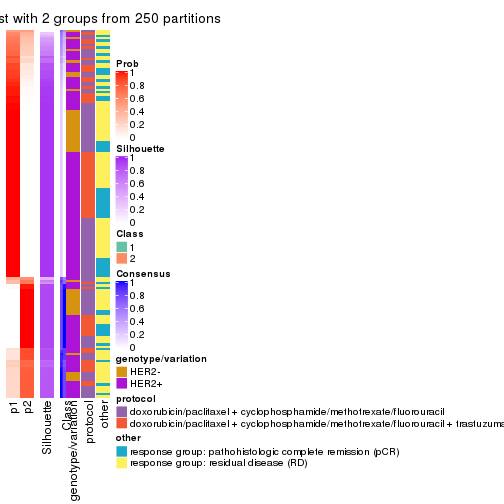</p>

</div>
<div id='tab-ATC-mclust-consensus-heatmap-2'>
<pre><code class="r">consensus_heatmap(res, k = 3)
</code></pre>

<p>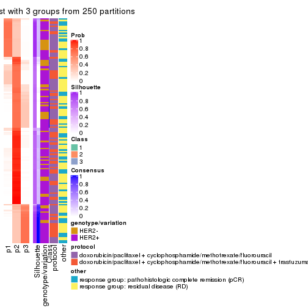</p>

</div>
<div id='tab-ATC-mclust-consensus-heatmap-3'>
<pre><code class="r">consensus_heatmap(res, k = 4)
</code></pre>

<p>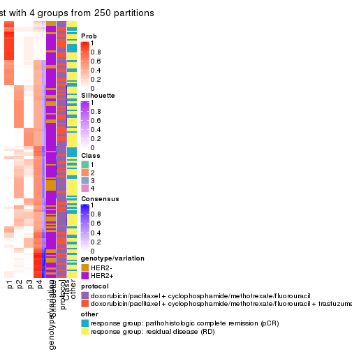</p>

</div>
<div id='tab-ATC-mclust-consensus-heatmap-4'>
<pre><code class="r">consensus_heatmap(res, k = 5)
</code></pre>

<p>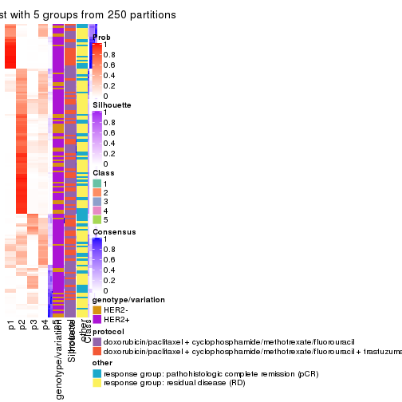</p>

</div>
<div id='tab-ATC-mclust-consensus-heatmap-5'>
<pre><code class="r">consensus_heatmap(res, k = 6)
</code></pre>

<p>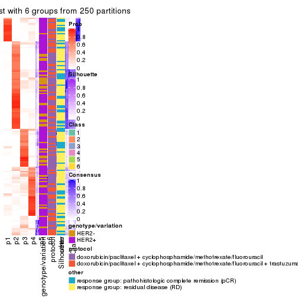</p>

</div>
</div>

Heatmaps for the membership of samples in all partitions to see how consistent they are:


<script>
$( function() {
	$( '#tabs-ATC-mclust-membership-heatmap' ).tabs();
} );
</script>
<div id='tabs-ATC-mclust-membership-heatmap'>
<ul>
<li><a href='#tab-ATC-mclust-membership-heatmap-1'>k = 2</a></li>
<li><a href='#tab-ATC-mclust-membership-heatmap-2'>k = 3</a></li>
<li><a href='#tab-ATC-mclust-membership-heatmap-3'>k = 4</a></li>
<li><a href='#tab-ATC-mclust-membership-heatmap-4'>k = 5</a></li>
<li><a href='#tab-ATC-mclust-membership-heatmap-5'>k = 6</a></li>
</ul>
<div id='tab-ATC-mclust-membership-heatmap-1'>
<pre><code class="r">membership_heatmap(res, k = 2)
</code></pre>

<p>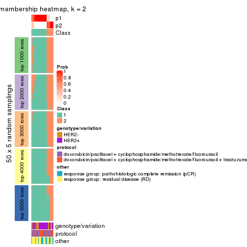</p>

</div>
<div id='tab-ATC-mclust-membership-heatmap-2'>
<pre><code class="r">membership_heatmap(res, k = 3)
</code></pre>

<p>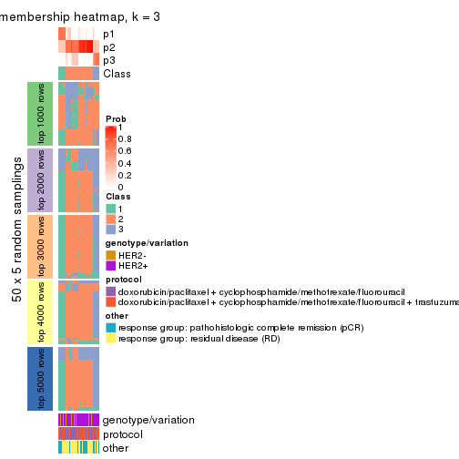</p>

</div>
<div id='tab-ATC-mclust-membership-heatmap-3'>
<pre><code class="r">membership_heatmap(res, k = 4)
</code></pre>

<p>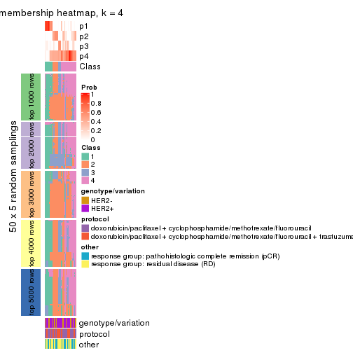</p>

</div>
<div id='tab-ATC-mclust-membership-heatmap-4'>
<pre><code class="r">membership_heatmap(res, k = 5)
</code></pre>

<p>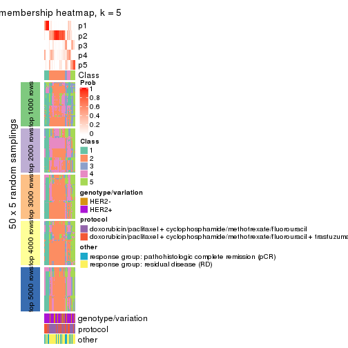</p>

</div>
<div id='tab-ATC-mclust-membership-heatmap-5'>
<pre><code class="r">membership_heatmap(res, k = 6)
</code></pre>

<p>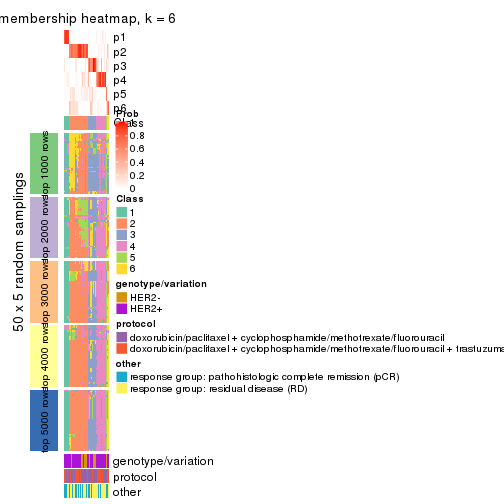</p>

</div>
</div>

As soon as we have had the classes for columns, we can look for signatures
which are significantly different between classes which can be candidate marks
for certain classes. Following are the heatmaps for signatures.


Signature heatmaps where rows are scaled:


<script>
$( function() {
	$( '#tabs-ATC-mclust-get-signatures' ).tabs();
} );
</script>
<div id='tabs-ATC-mclust-get-signatures'>
<ul>
<li><a href='#tab-ATC-mclust-get-signatures-1'>k = 2</a></li>
<li><a href='#tab-ATC-mclust-get-signatures-2'>k = 3</a></li>
<li><a href='#tab-ATC-mclust-get-signatures-3'>k = 4</a></li>
<li><a href='#tab-ATC-mclust-get-signatures-4'>k = 5</a></li>
<li><a href='#tab-ATC-mclust-get-signatures-5'>k = 6</a></li>
</ul>
<div id='tab-ATC-mclust-get-signatures-1'>
<pre><code class="r">get_signatures(res, k = 2)
</code></pre>

<pre><code>#&gt; Error: The width or height of the raster image is zero, maybe you forget to turn off the
#&gt; previous graphic device or it was corrupted. Run `dev.off()` to close it.
</code></pre>

<p></p>

</div>
<div id='tab-ATC-mclust-get-signatures-2'>
<pre><code class="r">get_signatures(res, k = 3)
</code></pre>

<pre><code>#&gt; Error: The width or height of the raster image is zero, maybe you forget to turn off the
#&gt; previous graphic device or it was corrupted. Run `dev.off()` to close it.
</code></pre>

<p></p>

</div>
<div id='tab-ATC-mclust-get-signatures-3'>
<pre><code class="r">get_signatures(res, k = 4)
</code></pre>

<pre><code>#&gt; Error: The width or height of the raster image is zero, maybe you forget to turn off the
#&gt; previous graphic device or it was corrupted. Run `dev.off()` to close it.
</code></pre>

<p></p>

</div>
<div id='tab-ATC-mclust-get-signatures-4'>
<pre><code class="r">get_signatures(res, k = 5)
</code></pre>

<pre><code>#&gt; Error: The width or height of the raster image is zero, maybe you forget to turn off the
#&gt; previous graphic device or it was corrupted. Run `dev.off()` to close it.
</code></pre>

<p></p>

</div>
<div id='tab-ATC-mclust-get-signatures-5'>
<pre><code class="r">get_signatures(res, k = 6)
</code></pre>

<pre><code>#&gt; Error: The width or height of the raster image is zero, maybe you forget to turn off the
#&gt; previous graphic device or it was corrupted. Run `dev.off()` to close it.
</code></pre>

<p></p>

</div>
</div>


Signature heatmaps where rows are not scaled:


<script>
$( function() {
	$( '#tabs-ATC-mclust-get-signatures-no-scale' ).tabs();
} );
</script>
<div id='tabs-ATC-mclust-get-signatures-no-scale'>
<ul>
<li><a href='#tab-ATC-mclust-get-signatures-no-scale-1'>k = 2</a></li>
<li><a href='#tab-ATC-mclust-get-signatures-no-scale-2'>k = 3</a></li>
<li><a href='#tab-ATC-mclust-get-signatures-no-scale-3'>k = 4</a></li>
<li><a href='#tab-ATC-mclust-get-signatures-no-scale-4'>k = 5</a></li>
<li><a href='#tab-ATC-mclust-get-signatures-no-scale-5'>k = 6</a></li>
</ul>
<div id='tab-ATC-mclust-get-signatures-no-scale-1'>
<pre><code class="r">get_signatures(res, k = 2, scale_rows = FALSE)
</code></pre>

<pre><code>#&gt; Error: The width or height of the raster image is zero, maybe you forget to turn off the
#&gt; previous graphic device or it was corrupted. Run `dev.off()` to close it.
</code></pre>

<p></p>

</div>
<div id='tab-ATC-mclust-get-signatures-no-scale-2'>
<pre><code class="r">get_signatures(res, k = 3, scale_rows = FALSE)
</code></pre>

<pre><code>#&gt; Error: The width or height of the raster image is zero, maybe you forget to turn off the
#&gt; previous graphic device or it was corrupted. Run `dev.off()` to close it.
</code></pre>

<p></p>

</div>
<div id='tab-ATC-mclust-get-signatures-no-scale-3'>
<pre><code class="r">get_signatures(res, k = 4, scale_rows = FALSE)
</code></pre>

<pre><code>#&gt; Error: The width or height of the raster image is zero, maybe you forget to turn off the
#&gt; previous graphic device or it was corrupted. Run `dev.off()` to close it.
</code></pre>

<p></p>

</div>
<div id='tab-ATC-mclust-get-signatures-no-scale-4'>
<pre><code class="r">get_signatures(res, k = 5, scale_rows = FALSE)
</code></pre>

<pre><code>#&gt; Error: The width or height of the raster image is zero, maybe you forget to turn off the
#&gt; previous graphic device or it was corrupted. Run `dev.off()` to close it.
</code></pre>

<p></p>

</div>
<div id='tab-ATC-mclust-get-signatures-no-scale-5'>
<pre><code class="r">get_signatures(res, k = 6, scale_rows = FALSE)
</code></pre>

<pre><code>#&gt; Error: The width or height of the raster image is zero, maybe you forget to turn off the
#&gt; previous graphic device or it was corrupted. Run `dev.off()` to close it.
</code></pre>

<p></p>

</div>
</div>


Compare the overlap of signatures from different k:

```r
compare_signatures(res)
```

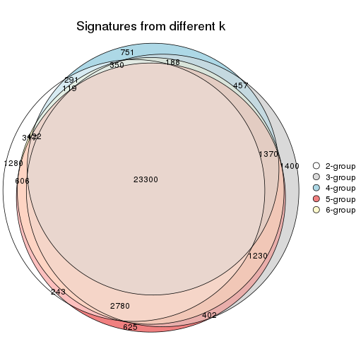

`get_signature()` returns a data frame invisibly. TO get the list of signatures, the function
call should be assigned to a variable explicitly. In following code, if `plot` argument is set
to `FALSE`, no heatmap is plotted while only the differential analysis is performed.

```r
# code only for demonstration
tb = get_signature(res, k = ..., plot = FALSE)
```

An example of the output of `tb` is:

```
#>   which_row         fdr    mean_1    mean_2 scaled_mean_1 scaled_mean_2 km
#> 1        38 0.042760348  8.373488  9.131774    -0.5533452     0.5164555  1
#> 2        40 0.018707592  7.106213  8.469186    -0.6173731     0.5762149  1
#> 3        55 0.019134737 10.221463 11.207825    -0.6159697     0.5749050  1
#> 4        59 0.006059896  5.921854  7.869574    -0.6899429     0.6439467  1
#> 5        60 0.018055526  8.928898 10.211722    -0.6204761     0.5791110  1
#> 6        98 0.009384629 15.714769 14.887706     0.6635654    -0.6193277  2
...
```

The columns in `tb` are:

1. `which_row`: row indices corresponding to the input matrix.
2. `fdr`: FDR for the differential test. 
3. `mean_x`: The mean value in group x.
4. `scaled_mean_x`: The mean value in group x after rows are scaled.
5. `km`: Row groups if k-means clustering is applied to rows.


UMAP plot which shows how samples are separated.


<script>
$( function() {
	$( '#tabs-ATC-mclust-dimension-reduction' ).tabs();
} );
</script>
<div id='tabs-ATC-mclust-dimension-reduction'>
<ul>
<li><a href='#tab-ATC-mclust-dimension-reduction-1'>k = 2</a></li>
<li><a href='#tab-ATC-mclust-dimension-reduction-2'>k = 3</a></li>
<li><a href='#tab-ATC-mclust-dimension-reduction-3'>k = 4</a></li>
<li><a href='#tab-ATC-mclust-dimension-reduction-4'>k = 5</a></li>
<li><a href='#tab-ATC-mclust-dimension-reduction-5'>k = 6</a></li>
</ul>
<div id='tab-ATC-mclust-dimension-reduction-1'>
<pre><code class="r">dimension_reduction(res, k = 2, method = &quot;UMAP&quot;)
</code></pre>

<p>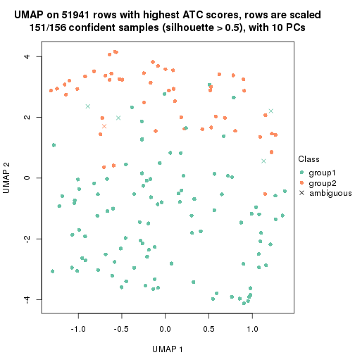</p>

</div>
<div id='tab-ATC-mclust-dimension-reduction-2'>
<pre><code class="r">dimension_reduction(res, k = 3, method = &quot;UMAP&quot;)
</code></pre>

<p>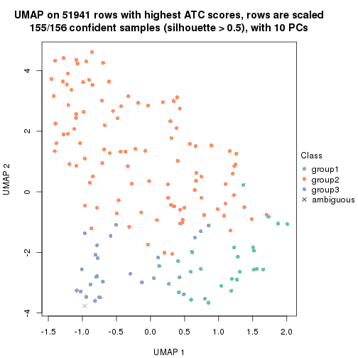</p>

</div>
<div id='tab-ATC-mclust-dimension-reduction-3'>
<pre><code class="r">dimension_reduction(res, k = 4, method = &quot;UMAP&quot;)
</code></pre>

<p>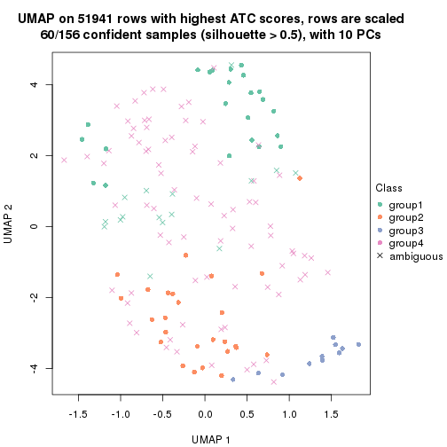</p>

</div>
<div id='tab-ATC-mclust-dimension-reduction-4'>
<pre><code class="r">dimension_reduction(res, k = 5, method = &quot;UMAP&quot;)
</code></pre>

<p>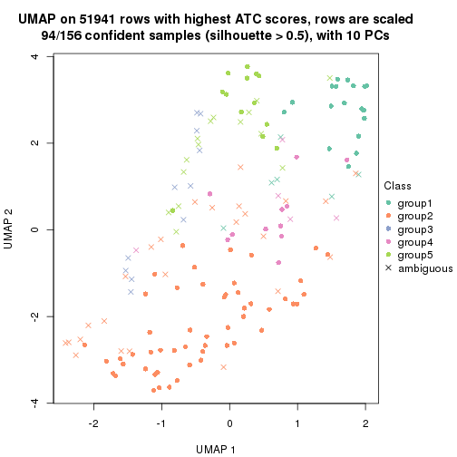</p>

</div>
<div id='tab-ATC-mclust-dimension-reduction-5'>
<pre><code class="r">dimension_reduction(res, k = 6, method = &quot;UMAP&quot;)
</code></pre>

<p>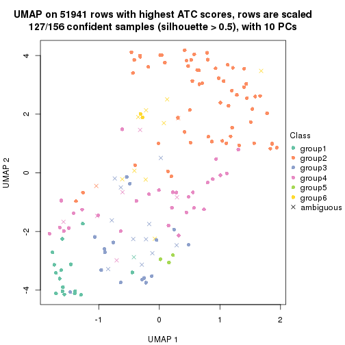</p>

</div>
</div>


Following heatmap shows how subgroups are split when increasing `k`:

```r
collect_classes(res)
```

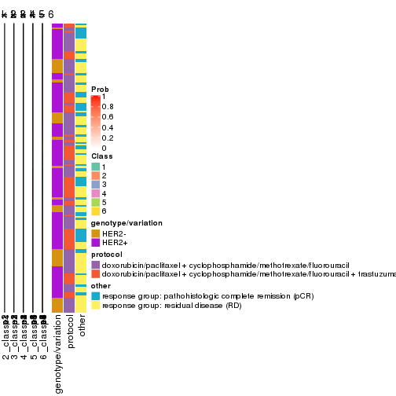


Test correlation between subgroups and known annotations. If the known
annotation is numeric, one-way ANOVA test is applied, and if the known
annotation is discrete, chi-squared contingency table test is applied.

```r
test_to_known_factors(res)
```

```
#>              n genotype/variation(p) protocol(p) other(p) k
#> ATC:mclust 151                0.2021      0.9916    0.323 2
#> ATC:mclust 155                0.5085      0.1854    0.724 3
#> ATC:mclust  60                0.0732      0.4778    0.197 4
#> ATC:mclust  94                0.0111      0.0499    0.263 5
#> ATC:mclust 127                0.0750      0.0363    0.437 6
```


If matrix rows can be associated to genes, consider to use `functional_enrichment(res,
...)` to perform function enrichment for the signature genes. See [this vignette](http://bioconductor.org/packages/devel/bioc/vignettes/cola/inst/doc/functional_enrichment.html) for more detailed explanations.


 

---------------------------------------------------


### ATC:NMF


The object with results only for a single top-value method and a single partition method 
can be extracted as:

```r
res = res_list["ATC", "NMF"]
# you can also extract it by
# res = res_list["ATC:NMF"]
```

A summary of `res` and all the functions that can be applied to it:

```r
res
```

```
#> A 'ConsensusPartition' object with k = 2, 3, 4, 5, 6.
#>   On a matrix with 51941 rows and 156 columns.
#>   Top rows (1000, 2000, 3000, 4000, 5000) are extracted by 'ATC' method.
#>   Subgroups are detected by 'NMF' method.
#>   Performed in total 1250 partitions by row resampling.
#>   Best k for subgroups seems to be 3.
#> 
#> Following methods can be applied to this 'ConsensusPartition' object:
#>  [1] "cola_report"             "collect_classes"         "collect_plots"          
#>  [4] "collect_stats"           "colnames"                "compare_signatures"     
#>  [7] "consensus_heatmap"       "dimension_reduction"     "functional_enrichment"  
#> [10] "get_anno_col"            "get_anno"                "get_classes"            
#> [13] "get_consensus"           "get_matrix"              "get_membership"         
#> [16] "get_param"               "get_signatures"          "get_stats"              
#> [19] "is_best_k"               "is_stable_k"             "membership_heatmap"     
#> [22] "ncol"                    "nrow"                    "plot_ecdf"              
#> [25] "rownames"                "select_partition_number" "show"                   
#> [28] "suggest_best_k"          "test_to_known_factors"
```

`collect_plots()` function collects all the plots made from `res` for all `k` (number of partitions)
into one single page to provide an easy and fast comparison between different `k`.

```r
collect_plots(res)
```

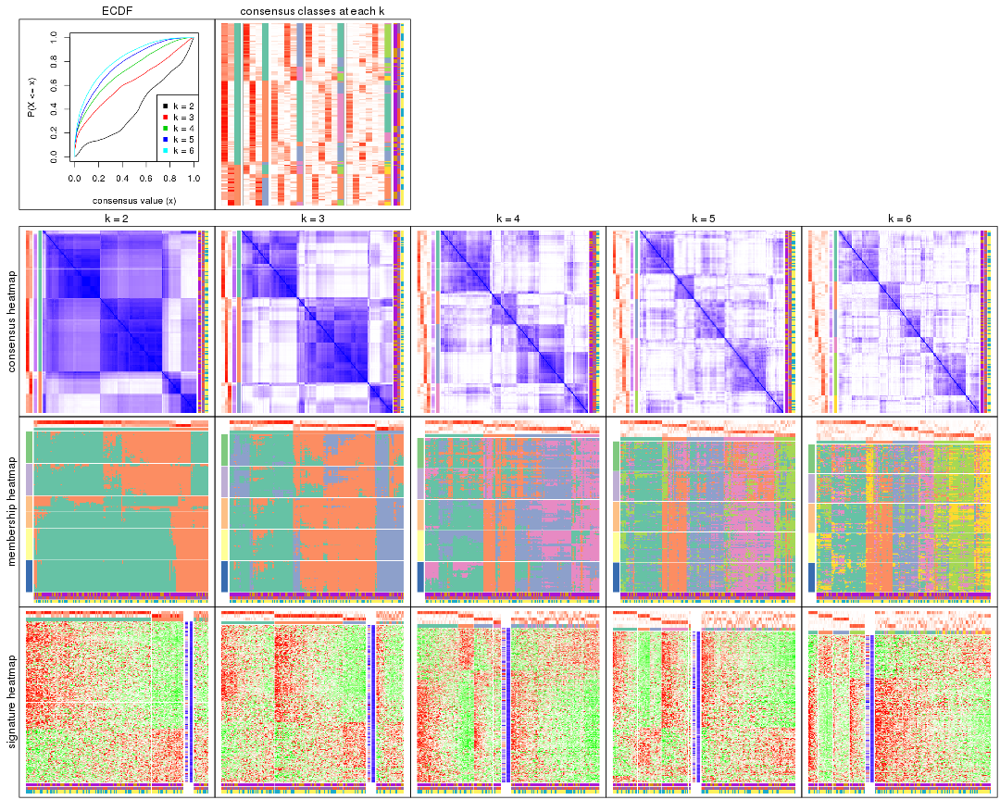

The plots are:

- The first row: a plot of the ECDF (empirical cumulative distribution
  function) curves of the consensus matrix for each `k` and the heatmap of
  predicted classes for each `k`.
- The second row: heatmaps of the consensus matrix for each `k`.
- The third row: heatmaps of the membership matrix for each `k`.
- The fouth row: heatmaps of the signatures for each `k`.

All the plots in panels can be made by individual functions and they are
plotted later in this section.

`select_partition_number()` produces several plots showing different
statistics for choosing "optimized" `k`. There are following statistics:

- ECDF curves of the consensus matrix for each `k`;
- 1-PAC. [The PAC
  score](https://en.wikipedia.org/wiki/Consensus_clustering#Over-interpretation_potential_of_consensus_clustering)
  measures the proportion of the ambiguous subgrouping.
- Mean silhouette score.
- Concordance. The mean probability of fiting the consensus class ids in all
  partitions.
- Area increased. Denote $A_k$ as the area under the ECDF curve for current
  `k`, the area increased is defined as $A_k - A_{k-1}$.
- Rand index. The percent of pairs of samples that are both in a same cluster
  or both are not in a same cluster in the partition of k and k-1.
- Jaccard index. The ratio of pairs of samples are both in a same cluster in
  the partition of k and k-1 and the pairs of samples are both in a same
  cluster in the partition k or k-1.

The detailed explanations of these statistics can be found in [the _cola_
vignette](http://bioconductor.org/packages/devel/bioc/vignettes/cola/inst/doc/cola.html#toc_13).

Generally speaking, lower PAC score, higher mean silhouette score or higher
concordance corresponds to better partition. Rand index and Jaccard index
measure how similar the current partition is compared to partition with `k-1`.
If they are too similar, we won't accept `k` is better than `k-1`.

```r
select_partition_number(res)
```

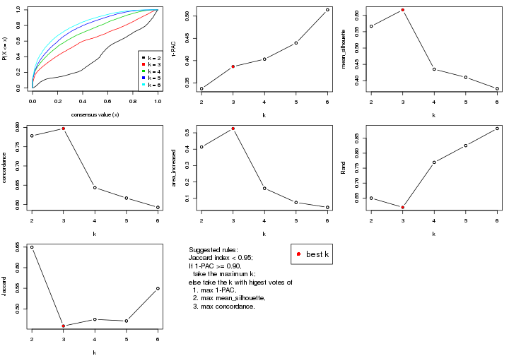

The numeric values for all these statistics can be obtained by `get_stats()`.

```r
get_stats(res)
```

```
#>   k 1-PAC mean_silhouette concordance area_increased  Rand Jaccard
#> 2 2 0.337           0.567       0.778         0.4135 0.650   0.650
#> 3 3 0.387           0.617       0.797         0.5262 0.619   0.458
#> 4 4 0.403           0.435       0.644         0.1613 0.769   0.474
#> 5 5 0.440           0.410       0.617         0.0750 0.825   0.471
#> 6 6 0.514           0.376       0.593         0.0454 0.882   0.549
```

`suggest_best_k()` suggests the best $k$ based on these statistics. The rules are as follows:

- All $k$ with Jaccard index larger than 0.95 are removed because increasing
  $k$ does not provide enough extra information. If all $k$ are removed, it is
  marked as no subgroup is detected.
- For all $k$ with 1-PAC score larger than 0.9, the maximal $k$ is taken as
  the best $k$, and other $k$ are marked as optional $k$.
- If it does not fit the second rule. The $k$ with the maximal vote of the
  highest 1-PAC score, highest mean silhouette, and highest concordance is
  taken as the best $k$.

```r
suggest_best_k(res)
```

```
#> [1] 3
```


Following shows the table of the partitions (You need to click the **show/hide
code output** link to see it). The membership matrix (columns with name `p*`)
is inferred by
[`clue::cl_consensus()`](https://www.rdocumentation.org/link/cl_consensus?package=clue)
function with the `SE` method. Basically the value in the membership matrix
represents the probability to belong to a certain group. The finall class
label for an item is determined with the group with highest probability it
belongs to.

In `get_classes()` function, the entropy is calculated from the membership
matrix and the silhouette score is calculated from the consensus matrix.


<script>
$( function() {
	$( '#tabs-ATC-NMF-get-classes' ).tabs();
} );
</script>
<div id='tabs-ATC-NMF-get-classes'>
<ul>
<li><a href='#tab-ATC-NMF-get-classes-1'>k = 2</a></li>
<li><a href='#tab-ATC-NMF-get-classes-2'>k = 3</a></li>
<li><a href='#tab-ATC-NMF-get-classes-3'>k = 4</a></li>
<li><a href='#tab-ATC-NMF-get-classes-4'>k = 5</a></li>
<li><a href='#tab-ATC-NMF-get-classes-5'>k = 6</a></li>
</ul>

<div id='tab-ATC-NMF-get-classes-1'>
<p><a id='tab-ATC-NMF-get-classes-1-a' style='color:#0366d6' href='#'>show/hide code output</a></p>
<pre><code class="r">cbind(get_classes(res, k = 2), get_membership(res, k = 2))
</code></pre>

<pre><code>#&gt;            class entropy silhouette    p1    p2
#&gt; GSM1232995     2  0.9866     0.5686 0.432 0.568
#&gt; GSM1233002     1  0.9286     0.6062 0.656 0.344
#&gt; GSM1233003     1  0.2043     0.6804 0.968 0.032
#&gt; GSM1233014     1  0.4690     0.6900 0.900 0.100
#&gt; GSM1233015     1  0.9933     0.5247 0.548 0.452
#&gt; GSM1233016     1  0.9922     0.5267 0.552 0.448
#&gt; GSM1233024     2  0.8861     0.0824 0.304 0.696
#&gt; GSM1233049     1  0.2423     0.6837 0.960 0.040
#&gt; GSM1233064     1  0.4161     0.6268 0.916 0.084
#&gt; GSM1233068     1  0.9933     0.5203 0.548 0.452
#&gt; GSM1233073     1  0.5946     0.6841 0.856 0.144
#&gt; GSM1233093     1  0.3879     0.6893 0.924 0.076
#&gt; GSM1233115     1  0.9460     0.5952 0.636 0.364
#&gt; GSM1232992     2  0.3114     0.6008 0.056 0.944
#&gt; GSM1232993     1  0.3733     0.6304 0.928 0.072
#&gt; GSM1233005     2  0.2043     0.5994 0.032 0.968
#&gt; GSM1233007     1  0.2603     0.6458 0.956 0.044
#&gt; GSM1233010     1  0.9754     0.5649 0.592 0.408
#&gt; GSM1233013     2  0.9552     0.5762 0.376 0.624
#&gt; GSM1233018     2  0.2423     0.6022 0.040 0.960
#&gt; GSM1233019     2  0.2236     0.6009 0.036 0.964
#&gt; GSM1233021     2  0.2043     0.5994 0.032 0.968
#&gt; GSM1233025     1  0.9754     0.5650 0.592 0.408
#&gt; GSM1233029     1  0.4815     0.6732 0.896 0.104
#&gt; GSM1233030     2  0.9983     0.5256 0.476 0.524
#&gt; GSM1233031     1  0.1843     0.6804 0.972 0.028
#&gt; GSM1233032     1  0.4939     0.6881 0.892 0.108
#&gt; GSM1233035     1  0.9944     0.5198 0.544 0.456
#&gt; GSM1233038     1  0.9850     0.5478 0.572 0.428
#&gt; GSM1233039     1  0.9933     0.5212 0.548 0.452
#&gt; GSM1233042     1  0.4815     0.6130 0.896 0.104
#&gt; GSM1233043     1  0.9661     0.5056 0.608 0.392
#&gt; GSM1233044     1  0.3733     0.6880 0.928 0.072
#&gt; GSM1233046     1  0.1414     0.6702 0.980 0.020
#&gt; GSM1233051     1  0.7376     0.6692 0.792 0.208
#&gt; GSM1233054     1  0.1633     0.6638 0.976 0.024
#&gt; GSM1233057     1  0.9988     0.4796 0.520 0.480
#&gt; GSM1233060     1  0.1843     0.6748 0.972 0.028
#&gt; GSM1233062     1  0.9775     0.5601 0.588 0.412
#&gt; GSM1233075     2  0.9933     0.5561 0.452 0.548
#&gt; GSM1233078     1  0.9896     0.5354 0.560 0.440
#&gt; GSM1233079     1  0.9881     0.5399 0.564 0.436
#&gt; GSM1233082     1  0.9881     0.5399 0.564 0.436
#&gt; GSM1233083     1  0.6887     0.6775 0.816 0.184
#&gt; GSM1233091     1  0.1843     0.6607 0.972 0.028
#&gt; GSM1233095     1  0.7528     0.6682 0.784 0.216
#&gt; GSM1233096     1  0.9881     0.5399 0.564 0.436
#&gt; GSM1233101     1  0.1184     0.6691 0.984 0.016
#&gt; GSM1233105     1  0.9896     0.5354 0.560 0.440
#&gt; GSM1233117     2  0.9933     0.5586 0.452 0.548
#&gt; GSM1233118     2  0.9922     0.5610 0.448 0.552
#&gt; GSM1233001     2  0.9850     0.5724 0.428 0.572
#&gt; GSM1233006     1  0.2236     0.6523 0.964 0.036
#&gt; GSM1233008     2  0.3114     0.5455 0.056 0.944
#&gt; GSM1233009     2  0.9795     0.5707 0.416 0.584
#&gt; GSM1233017     2  0.9988     0.5309 0.480 0.520
#&gt; GSM1233020     2  0.2423     0.6022 0.040 0.960
#&gt; GSM1233022     1  0.9922     0.5267 0.552 0.448
#&gt; GSM1233026     1  0.8016     0.6564 0.756 0.244
#&gt; GSM1233028     1  0.9661     0.5769 0.608 0.392
#&gt; GSM1233034     2  1.0000    -0.4619 0.496 0.504
#&gt; GSM1233040     1  0.1633     0.6790 0.976 0.024
#&gt; GSM1233048     1  0.1414     0.6665 0.980 0.020
#&gt; GSM1233056     1  0.5294     0.6880 0.880 0.120
#&gt; GSM1233058     1  0.2423     0.6689 0.960 0.040
#&gt; GSM1233059     1  0.3274     0.6877 0.940 0.060
#&gt; GSM1233066     1  0.9795     0.5558 0.584 0.416
#&gt; GSM1233071     1  0.9129     0.6155 0.672 0.328
#&gt; GSM1233074     2  0.8955     0.0566 0.312 0.688
#&gt; GSM1233076     1  0.1184     0.6705 0.984 0.016
#&gt; GSM1233080     1  0.7674     0.6642 0.776 0.224
#&gt; GSM1233088     1  0.1414     0.6706 0.980 0.020
#&gt; GSM1233090     1  0.1414     0.6792 0.980 0.020
#&gt; GSM1233092     1  0.2603     0.6596 0.956 0.044
#&gt; GSM1233094     1  0.2603     0.6458 0.956 0.044
#&gt; GSM1233097     1  0.4939     0.5846 0.892 0.108
#&gt; GSM1233100     1  0.7299     0.6679 0.796 0.204
#&gt; GSM1233104     1  0.8861     0.6270 0.696 0.304
#&gt; GSM1233106     1  0.9881     0.5399 0.564 0.436
#&gt; GSM1233111     1  0.9896     0.5354 0.560 0.440
#&gt; GSM1233122     2  0.9896     0.5662 0.440 0.560
#&gt; GSM1233146     1  0.9922     0.5267 0.552 0.448
#&gt; GSM1232994     2  0.1184     0.5903 0.016 0.984
#&gt; GSM1232996     2  0.0938     0.5888 0.012 0.988
#&gt; GSM1232997     2  0.9732    -0.2455 0.404 0.596
#&gt; GSM1232998     2  0.1184     0.5903 0.016 0.984
#&gt; GSM1232999     1  0.7602     0.6656 0.780 0.220
#&gt; GSM1233000     1  0.9944    -0.4276 0.544 0.456
#&gt; GSM1233004     1  0.0938     0.6751 0.988 0.012
#&gt; GSM1233011     1  0.9909     0.5309 0.556 0.444
#&gt; GSM1233012     1  0.9996     0.4691 0.512 0.488
#&gt; GSM1233023     2  0.8327     0.1900 0.264 0.736
#&gt; GSM1233027     2  0.2043     0.5610 0.032 0.968
#&gt; GSM1233033     1  0.9922     0.5267 0.552 0.448
#&gt; GSM1233036     1  0.9977     0.4931 0.528 0.472
#&gt; GSM1233037     1  0.9866     0.5428 0.568 0.432
#&gt; GSM1233041     1  0.9491     0.5918 0.632 0.368
#&gt; GSM1233045     1  0.7139     0.6254 0.804 0.196
#&gt; GSM1233047     1  0.1414     0.6665 0.980 0.020
#&gt; GSM1233050     1  0.0938     0.6755 0.988 0.012
#&gt; GSM1233052     1  0.1843     0.6607 0.972 0.028
#&gt; GSM1233053     1  0.1633     0.6691 0.976 0.024
#&gt; GSM1233055     1  0.0938     0.6714 0.988 0.012
#&gt; GSM1233061     1  0.1633     0.6638 0.976 0.024
#&gt; GSM1233063     1  0.9881     0.5399 0.564 0.436
#&gt; GSM1233065     2  0.3431     0.6047 0.064 0.936
#&gt; GSM1233070     1  0.2778     0.6362 0.952 0.048
#&gt; GSM1233077     1  0.1843     0.6734 0.972 0.028
#&gt; GSM1233081     1  0.9754     0.5645 0.592 0.408
#&gt; GSM1233084     1  0.9754     0.5652 0.592 0.408
#&gt; GSM1233087     1  0.9754     0.5624 0.592 0.408
#&gt; GSM1233089     2  0.3274     0.6044 0.060 0.940
#&gt; GSM1233099     1  0.2423     0.6494 0.960 0.040
#&gt; GSM1233112     1  0.2948     0.6871 0.948 0.052
#&gt; GSM1233085     1  0.0672     0.6733 0.992 0.008
#&gt; GSM1233098     1  0.9983    -0.4597 0.524 0.476
#&gt; GSM1233114     1  0.9909     0.5309 0.556 0.444
#&gt; GSM1233119     1  0.9881     0.5399 0.564 0.436
#&gt; GSM1233129     1  0.5946     0.4962 0.856 0.144
#&gt; GSM1233132     1  0.1843     0.6607 0.972 0.028
#&gt; GSM1233139     1  0.4161     0.6043 0.916 0.084
#&gt; GSM1233143     2  0.9427    -0.0998 0.360 0.640
#&gt; GSM1233145     1  0.9815     0.5549 0.580 0.420
#&gt; GSM1233067     2  0.9850     0.5703 0.428 0.572
#&gt; GSM1233069     1  0.4298     0.5985 0.912 0.088
#&gt; GSM1233072     2  0.9896     0.5631 0.440 0.560
#&gt; GSM1233086     1  0.3114     0.6877 0.944 0.056
#&gt; GSM1233102     1  0.9323     0.6038 0.652 0.348
#&gt; GSM1233103     1  0.2043     0.6572 0.968 0.032
#&gt; GSM1233107     1  0.9909     0.5309 0.556 0.444
#&gt; GSM1233108     1  0.9881     0.5399 0.564 0.436
#&gt; GSM1233109     1  0.6712     0.6784 0.824 0.176
#&gt; GSM1233110     1  0.2778     0.6843 0.952 0.048
#&gt; GSM1233113     2  0.9850     0.5709 0.428 0.572
#&gt; GSM1233116     2  0.9815     0.5749 0.420 0.580
#&gt; GSM1233120     1  0.1414     0.6665 0.980 0.020
#&gt; GSM1233121     1  0.1843     0.6633 0.972 0.028
#&gt; GSM1233123     1  0.2043     0.6560 0.968 0.032
#&gt; GSM1233124     1  0.1184     0.6705 0.984 0.016
#&gt; GSM1233125     1  0.8661     0.6360 0.712 0.288
#&gt; GSM1233126     1  0.2236     0.6657 0.964 0.036
#&gt; GSM1233127     1  0.9209     0.0357 0.664 0.336
#&gt; GSM1233128     1  0.9881     0.5399 0.564 0.436
#&gt; GSM1233130     1  0.5178     0.6879 0.884 0.116
#&gt; GSM1233131     1  0.3879     0.6895 0.924 0.076
#&gt; GSM1233133     1  0.0938     0.6768 0.988 0.012
#&gt; GSM1233134     1  0.8608     0.6326 0.716 0.284
#&gt; GSM1233135     1  0.8144     0.6528 0.748 0.252
#&gt; GSM1233136     1  0.1633     0.6711 0.976 0.024
#&gt; GSM1233137     1  0.0938     0.6714 0.988 0.012
#&gt; GSM1233138     1  0.5842     0.6846 0.860 0.140
#&gt; GSM1233140     1  0.9686     0.5728 0.604 0.396
#&gt; GSM1233141     2  0.9896     0.5662 0.440 0.560
#&gt; GSM1233142     2  0.9909     0.5655 0.444 0.556
#&gt; GSM1233144     1  0.4161     0.6888 0.916 0.084
#&gt; GSM1233147     1  0.2043     0.6756 0.968 0.032
</code></pre>

<script>
$('#tab-ATC-NMF-get-classes-1-a').parent().next().next().hide();
$('#tab-ATC-NMF-get-classes-1-a').click(function(){
  $('#tab-ATC-NMF-get-classes-1-a').parent().next().next().toggle();
  return(false);
});
</script>
</div>

<div id='tab-ATC-NMF-get-classes-2'>
<p><a id='tab-ATC-NMF-get-classes-2-a' style='color:#0366d6' href='#'>show/hide code output</a></p>
<pre><code class="r">cbind(get_classes(res, k = 3), get_membership(res, k = 3))
</code></pre>

<pre><code>#&gt;            class entropy silhouette    p1    p2    p3
#&gt; GSM1232995     3  0.5291     0.5815 0.000 0.268 0.732
#&gt; GSM1233002     1  0.5803     0.5899 0.736 0.248 0.016
#&gt; GSM1233003     2  0.3846     0.7359 0.108 0.876 0.016
#&gt; GSM1233014     2  0.4602     0.7119 0.152 0.832 0.016
#&gt; GSM1233015     1  0.4465     0.6920 0.820 0.004 0.176
#&gt; GSM1233016     1  0.1753     0.7462 0.952 0.000 0.048
#&gt; GSM1233024     1  0.4062     0.7039 0.836 0.000 0.164
#&gt; GSM1233049     2  0.1170     0.7771 0.016 0.976 0.008
#&gt; GSM1233064     2  0.4978     0.6671 0.004 0.780 0.216
#&gt; GSM1233068     1  0.5480     0.6325 0.732 0.004 0.264
#&gt; GSM1233073     2  0.4663     0.7224 0.156 0.828 0.016
#&gt; GSM1233093     2  0.3148     0.7766 0.048 0.916 0.036
#&gt; GSM1233115     1  0.9112     0.4914 0.524 0.168 0.308
#&gt; GSM1232992     3  0.7348     0.4027 0.348 0.044 0.608
#&gt; GSM1232993     2  0.5420     0.6353 0.008 0.752 0.240
#&gt; GSM1233005     3  0.2261     0.6223 0.068 0.000 0.932
#&gt; GSM1233007     2  0.2261     0.7663 0.000 0.932 0.068
#&gt; GSM1233010     1  0.4099     0.6964 0.852 0.140 0.008
#&gt; GSM1233013     3  0.7944     0.5923 0.088 0.296 0.616
#&gt; GSM1233018     3  0.1411     0.6359 0.036 0.000 0.964
#&gt; GSM1233019     3  0.1525     0.6376 0.032 0.004 0.964
#&gt; GSM1233021     3  0.1860     0.6313 0.052 0.000 0.948
#&gt; GSM1233025     1  0.2998     0.7279 0.916 0.068 0.016
#&gt; GSM1233029     2  0.5582     0.7232 0.088 0.812 0.100
#&gt; GSM1233030     2  0.8414    -0.0300 0.092 0.528 0.380
#&gt; GSM1233031     2  0.3846     0.7419 0.108 0.876 0.016
#&gt; GSM1233032     2  0.6161     0.5736 0.288 0.696 0.016
#&gt; GSM1233035     1  0.5024     0.6651 0.776 0.004 0.220
#&gt; GSM1233038     1  0.2651     0.7478 0.928 0.060 0.012
#&gt; GSM1233039     1  0.6297     0.5517 0.640 0.008 0.352
#&gt; GSM1233042     2  0.5958     0.5693 0.008 0.692 0.300
#&gt; GSM1233043     3  0.9767     0.0362 0.248 0.320 0.432
#&gt; GSM1233044     2  0.4782     0.7001 0.164 0.820 0.016
#&gt; GSM1233046     2  0.0661     0.7746 0.008 0.988 0.004
#&gt; GSM1233051     2  0.6777     0.4151 0.364 0.616 0.020
#&gt; GSM1233054     2  0.1860     0.7700 0.000 0.948 0.052
#&gt; GSM1233057     1  0.5873     0.5897 0.684 0.004 0.312
#&gt; GSM1233060     2  0.1399     0.7744 0.004 0.968 0.028
#&gt; GSM1233062     1  0.6738     0.5416 0.624 0.020 0.356
#&gt; GSM1233075     3  0.8025     0.3933 0.064 0.420 0.516
#&gt; GSM1233078     1  0.1905     0.7484 0.956 0.028 0.016
#&gt; GSM1233079     1  0.2651     0.7468 0.928 0.012 0.060
#&gt; GSM1233082     1  0.1129     0.7504 0.976 0.004 0.020
#&gt; GSM1233083     2  0.7319     0.6192 0.164 0.708 0.128
#&gt; GSM1233091     2  0.2959     0.7546 0.000 0.900 0.100
#&gt; GSM1233095     2  0.8569     0.4668 0.196 0.608 0.196
#&gt; GSM1233096     1  0.2229     0.7522 0.944 0.012 0.044
#&gt; GSM1233101     2  0.2066     0.7684 0.000 0.940 0.060
#&gt; GSM1233105     1  0.1267     0.7501 0.972 0.004 0.024
#&gt; GSM1233117     2  0.6553    -0.0586 0.008 0.580 0.412
#&gt; GSM1233118     3  0.6483     0.4223 0.004 0.452 0.544
#&gt; GSM1233001     3  0.8511     0.5811 0.152 0.244 0.604
#&gt; GSM1233006     2  0.1015     0.7724 0.012 0.980 0.008
#&gt; GSM1233008     1  0.4399     0.6894 0.812 0.000 0.188
#&gt; GSM1233009     3  0.8350     0.5770 0.120 0.280 0.600
#&gt; GSM1233017     2  0.7203    -0.1340 0.028 0.556 0.416
#&gt; GSM1233020     3  0.1015     0.6435 0.008 0.012 0.980
#&gt; GSM1233022     1  0.1482     0.7503 0.968 0.012 0.020
#&gt; GSM1233026     1  0.5639     0.6082 0.752 0.232 0.016
#&gt; GSM1233028     1  0.9054     0.4262 0.496 0.144 0.360
#&gt; GSM1233034     1  0.5404     0.6380 0.740 0.004 0.256
#&gt; GSM1233040     2  0.2116     0.7747 0.012 0.948 0.040
#&gt; GSM1233048     2  0.3267     0.7458 0.000 0.884 0.116
#&gt; GSM1233056     2  0.4390     0.7285 0.148 0.840 0.012
#&gt; GSM1233058     2  0.5335     0.6443 0.008 0.760 0.232
#&gt; GSM1233059     2  0.3690     0.7462 0.100 0.884 0.016
#&gt; GSM1233066     1  0.3009     0.7556 0.920 0.028 0.052
#&gt; GSM1233071     1  0.5803     0.5946 0.736 0.248 0.016
#&gt; GSM1233074     1  0.3551     0.7229 0.868 0.000 0.132
#&gt; GSM1233076     2  0.3445     0.7473 0.088 0.896 0.016
#&gt; GSM1233080     2  0.6925     0.1745 0.452 0.532 0.016
#&gt; GSM1233088     2  0.2031     0.7715 0.032 0.952 0.016
#&gt; GSM1233090     2  0.0848     0.7740 0.008 0.984 0.008
#&gt; GSM1233092     2  0.5237     0.7096 0.120 0.824 0.056
#&gt; GSM1233094     2  0.3551     0.7372 0.000 0.868 0.132
#&gt; GSM1233097     2  0.5864     0.5825 0.008 0.704 0.288
#&gt; GSM1233100     2  0.9021     0.3543 0.156 0.528 0.316
#&gt; GSM1233104     1  0.5939     0.6114 0.748 0.224 0.028
#&gt; GSM1233106     1  0.1765     0.7495 0.956 0.004 0.040
#&gt; GSM1233111     1  0.1860     0.7452 0.948 0.000 0.052
#&gt; GSM1233122     3  0.8258     0.5783 0.112 0.284 0.604
#&gt; GSM1233146     1  0.1031     0.7492 0.976 0.000 0.024
#&gt; GSM1232994     3  0.2711     0.6088 0.088 0.000 0.912
#&gt; GSM1232996     3  0.3619     0.5693 0.136 0.000 0.864
#&gt; GSM1232997     1  0.5722     0.6115 0.704 0.004 0.292
#&gt; GSM1232998     3  0.2625     0.6122 0.084 0.000 0.916
#&gt; GSM1232999     1  0.7533     0.2701 0.564 0.392 0.044
#&gt; GSM1233000     2  0.5882     0.2222 0.000 0.652 0.348
#&gt; GSM1233004     2  0.1289     0.7737 0.000 0.968 0.032
#&gt; GSM1233011     1  0.1170     0.7486 0.976 0.016 0.008
#&gt; GSM1233012     1  0.5610     0.5990 0.776 0.028 0.196
#&gt; GSM1233023     1  0.5690     0.6162 0.708 0.004 0.288
#&gt; GSM1233027     1  0.6062     0.4951 0.616 0.000 0.384
#&gt; GSM1233033     1  0.3573     0.7184 0.876 0.004 0.120
#&gt; GSM1233036     1  0.5623     0.6179 0.716 0.004 0.280
#&gt; GSM1233037     1  0.7997     0.5013 0.568 0.072 0.360
#&gt; GSM1233041     1  0.4390     0.6874 0.840 0.148 0.012
#&gt; GSM1233045     2  0.7640     0.4412 0.056 0.592 0.352
#&gt; GSM1233047     2  0.3619     0.7337 0.000 0.864 0.136
#&gt; GSM1233050     2  0.2496     0.7697 0.004 0.928 0.068
#&gt; GSM1233052     2  0.2066     0.7682 0.000 0.940 0.060
#&gt; GSM1233053     2  0.5536     0.6399 0.012 0.752 0.236
#&gt; GSM1233055     2  0.4634     0.7100 0.012 0.824 0.164
#&gt; GSM1233061     2  0.1964     0.7696 0.000 0.944 0.056
#&gt; GSM1233063     1  0.2339     0.7502 0.940 0.012 0.048
#&gt; GSM1233065     3  0.1411     0.6443 0.000 0.036 0.964
#&gt; GSM1233070     2  0.0661     0.7738 0.004 0.988 0.008
#&gt; GSM1233077     2  0.3587     0.7473 0.088 0.892 0.020
#&gt; GSM1233081     3  0.9982    -0.2284 0.348 0.304 0.348
#&gt; GSM1233084     1  0.3983     0.6961 0.852 0.144 0.004
#&gt; GSM1233087     1  0.5650     0.7308 0.808 0.108 0.084
#&gt; GSM1233089     3  0.1950     0.6415 0.040 0.008 0.952
#&gt; GSM1233099     2  0.3038     0.7541 0.000 0.896 0.104
#&gt; GSM1233112     2  0.5435     0.6845 0.024 0.784 0.192
#&gt; GSM1233085     2  0.2955     0.7638 0.008 0.912 0.080
#&gt; GSM1233098     2  0.7777     0.1099 0.060 0.576 0.364
#&gt; GSM1233114     1  0.1753     0.7463 0.952 0.000 0.048
#&gt; GSM1233119     1  0.1620     0.7466 0.964 0.024 0.012
#&gt; GSM1233129     2  0.2356     0.7652 0.000 0.928 0.072
#&gt; GSM1233132     2  0.4110     0.7202 0.004 0.844 0.152
#&gt; GSM1233139     2  0.3276     0.7536 0.068 0.908 0.024
#&gt; GSM1233143     1  0.6526     0.4708 0.704 0.036 0.260
#&gt; GSM1233145     1  0.5235     0.7043 0.812 0.152 0.036
#&gt; GSM1233067     3  0.4654     0.6092 0.000 0.208 0.792
#&gt; GSM1233069     2  0.2681     0.7617 0.040 0.932 0.028
#&gt; GSM1233072     3  0.5733     0.5579 0.000 0.324 0.676
#&gt; GSM1233086     2  0.2384     0.7696 0.056 0.936 0.008
#&gt; GSM1233102     1  0.5681     0.6039 0.748 0.236 0.016
#&gt; GSM1233103     2  0.0747     0.7737 0.000 0.984 0.016
#&gt; GSM1233107     1  0.1877     0.7402 0.956 0.032 0.012
#&gt; GSM1233108     1  0.1999     0.7385 0.952 0.036 0.012
#&gt; GSM1233109     1  0.6919     0.1523 0.536 0.448 0.016
#&gt; GSM1233110     2  0.5803     0.6185 0.248 0.736 0.016
#&gt; GSM1233113     3  0.6062     0.5447 0.000 0.384 0.616
#&gt; GSM1233116     3  0.8334     0.5912 0.136 0.248 0.616
#&gt; GSM1233120     2  0.2796     0.7600 0.000 0.908 0.092
#&gt; GSM1233121     2  0.3832     0.7402 0.100 0.880 0.020
#&gt; GSM1233123     2  0.0661     0.7733 0.008 0.988 0.004
#&gt; GSM1233124     2  0.3610     0.7431 0.096 0.888 0.016
#&gt; GSM1233125     1  0.6445     0.5066 0.672 0.308 0.020
#&gt; GSM1233126     2  0.4136     0.7476 0.020 0.864 0.116
#&gt; GSM1233127     2  0.9342    -0.1436 0.168 0.452 0.380
#&gt; GSM1233128     1  0.1315     0.7477 0.972 0.020 0.008
#&gt; GSM1233130     2  0.6090     0.6001 0.264 0.716 0.020
#&gt; GSM1233131     2  0.3678     0.7704 0.080 0.892 0.028
#&gt; GSM1233133     2  0.2116     0.7653 0.040 0.948 0.012
#&gt; GSM1233134     1  0.9613     0.0714 0.472 0.244 0.284
#&gt; GSM1233135     1  0.7922     0.1922 0.532 0.408 0.060
#&gt; GSM1233136     2  0.4418     0.7195 0.132 0.848 0.020
#&gt; GSM1233137     2  0.1399     0.7751 0.004 0.968 0.028
#&gt; GSM1233138     1  0.6704     0.3534 0.608 0.376 0.016
#&gt; GSM1233140     1  0.3445     0.7197 0.896 0.088 0.016
#&gt; GSM1233141     3  0.8262     0.5800 0.116 0.276 0.608
#&gt; GSM1233142     3  0.7470     0.5681 0.052 0.336 0.612
#&gt; GSM1233144     2  0.5414     0.6589 0.212 0.772 0.016
#&gt; GSM1233147     2  0.5253     0.6749 0.188 0.792 0.020
</code></pre>

<script>
$('#tab-ATC-NMF-get-classes-2-a').parent().next().next().hide();
$('#tab-ATC-NMF-get-classes-2-a').click(function(){
  $('#tab-ATC-NMF-get-classes-2-a').parent().next().next().toggle();
  return(false);
});
</script>
</div>

<div id='tab-ATC-NMF-get-classes-3'>
<p><a id='tab-ATC-NMF-get-classes-3-a' style='color:#0366d6' href='#'>show/hide code output</a></p>
<pre><code class="r">cbind(get_classes(res, k = 4), get_membership(res, k = 4))
</code></pre>

<pre><code>#&gt;            class entropy silhouette    p1    p2    p3    p4
#&gt; GSM1232995     2   0.622    0.50005 0.316 0.608 0.000 0.076
#&gt; GSM1233002     3   0.509    0.56647 0.040 0.128 0.792 0.040
#&gt; GSM1233003     1   0.586    0.06677 0.492 0.024 0.480 0.004
#&gt; GSM1233014     3   0.646    0.09635 0.412 0.072 0.516 0.000
#&gt; GSM1233015     4   0.480    0.45240 0.000 0.004 0.340 0.656
#&gt; GSM1233016     3   0.456    0.36192 0.000 0.004 0.700 0.296
#&gt; GSM1233024     4   0.700    0.34709 0.000 0.140 0.316 0.544
#&gt; GSM1233049     1   0.360    0.66414 0.876 0.024 0.032 0.068
#&gt; GSM1233064     1   0.588    0.54057 0.632 0.056 0.000 0.312
#&gt; GSM1233068     4   0.385    0.58027 0.000 0.012 0.180 0.808
#&gt; GSM1233073     1   0.681    0.57841 0.672 0.048 0.192 0.088
#&gt; GSM1233093     1   0.472    0.64870 0.804 0.016 0.048 0.132
#&gt; GSM1233115     4   0.709    0.43127 0.176 0.004 0.236 0.584
#&gt; GSM1232992     2   0.519    0.40378 0.000 0.616 0.372 0.012
#&gt; GSM1232993     1   0.484    0.52754 0.688 0.012 0.000 0.300
#&gt; GSM1233005     2   0.423    0.49730 0.004 0.776 0.008 0.212
#&gt; GSM1233007     1   0.293    0.65513 0.900 0.068 0.008 0.024
#&gt; GSM1233010     3   0.349    0.54564 0.028 0.004 0.864 0.104
#&gt; GSM1233013     2   0.643    0.59437 0.164 0.672 0.156 0.008
#&gt; GSM1233018     2   0.592    0.41837 0.040 0.608 0.004 0.348
#&gt; GSM1233019     2   0.623    0.41344 0.068 0.584 0.000 0.348
#&gt; GSM1233021     2   0.535    0.36772 0.004 0.616 0.012 0.368
#&gt; GSM1233025     3   0.247    0.56468 0.004 0.024 0.920 0.052
#&gt; GSM1233029     1   0.805    0.35078 0.564 0.192 0.188 0.056
#&gt; GSM1233030     2   0.722    0.33579 0.188 0.540 0.272 0.000
#&gt; GSM1233031     1   0.671    0.05971 0.464 0.088 0.448 0.000
#&gt; GSM1233032     3   0.594    0.44746 0.212 0.104 0.684 0.000
#&gt; GSM1233035     4   0.559    0.40763 0.012 0.012 0.364 0.612
#&gt; GSM1233038     3   0.493    0.40318 0.024 0.000 0.712 0.264
#&gt; GSM1233039     4   0.222    0.55738 0.020 0.020 0.024 0.936
#&gt; GSM1233042     1   0.693    0.29695 0.456 0.108 0.000 0.436
#&gt; GSM1233043     4   0.737    0.02965 0.268 0.212 0.000 0.520
#&gt; GSM1233044     3   0.680    0.29905 0.308 0.124 0.568 0.000
#&gt; GSM1233046     1   0.413    0.62330 0.840 0.044 0.104 0.012
#&gt; GSM1233051     1   0.737    0.02219 0.464 0.036 0.432 0.068
#&gt; GSM1233054     1   0.393    0.65802 0.856 0.084 0.016 0.044
#&gt; GSM1233057     4   0.314    0.57893 0.020 0.024 0.060 0.896
#&gt; GSM1233060     1   0.501    0.60438 0.780 0.152 0.056 0.012
#&gt; GSM1233062     4   0.658    0.44979 0.240 0.008 0.112 0.640
#&gt; GSM1233075     2   0.459    0.56578 0.068 0.812 0.112 0.008
#&gt; GSM1233078     3   0.658    0.44772 0.000 0.168 0.632 0.200
#&gt; GSM1233079     3   0.479    0.19971 0.000 0.000 0.620 0.380
#&gt; GSM1233082     3   0.425    0.39597 0.000 0.000 0.724 0.276
#&gt; GSM1233083     1   0.610    0.60889 0.672 0.028 0.040 0.260
#&gt; GSM1233091     1   0.391    0.65853 0.836 0.044 0.000 0.120
#&gt; GSM1233095     1   0.586    0.53298 0.632 0.020 0.020 0.328
#&gt; GSM1233096     3   0.443    0.39304 0.004 0.000 0.720 0.276
#&gt; GSM1233101     1   0.246    0.66118 0.912 0.008 0.004 0.076
#&gt; GSM1233105     3   0.477    0.37866 0.008 0.004 0.708 0.280
#&gt; GSM1233117     2   0.542    0.54509 0.240 0.704 0.056 0.000
#&gt; GSM1233118     2   0.394    0.61401 0.188 0.800 0.012 0.000
#&gt; GSM1233001     2   0.415    0.61757 0.056 0.824 0.120 0.000
#&gt; GSM1233006     1   0.745    0.29370 0.484 0.324 0.192 0.000
#&gt; GSM1233008     4   0.584    0.46286 0.000 0.060 0.292 0.648
#&gt; GSM1233009     2   0.612    0.60298 0.160 0.680 0.160 0.000
#&gt; GSM1233017     2   0.733    0.44755 0.368 0.504 0.116 0.012
#&gt; GSM1233020     2   0.552    0.43557 0.028 0.652 0.004 0.316
#&gt; GSM1233022     3   0.385    0.49593 0.000 0.012 0.808 0.180
#&gt; GSM1233026     3   0.344    0.57060 0.048 0.084 0.868 0.000
#&gt; GSM1233028     4   0.502    0.42175 0.220 0.012 0.024 0.744
#&gt; GSM1233034     4   0.438    0.49929 0.000 0.000 0.296 0.704
#&gt; GSM1233040     1   0.241    0.66369 0.920 0.004 0.016 0.060
#&gt; GSM1233048     1   0.409    0.64087 0.804 0.024 0.000 0.172
#&gt; GSM1233056     1   0.645    0.58973 0.704 0.060 0.172 0.064
#&gt; GSM1233058     1   0.493    0.54299 0.688 0.016 0.000 0.296
#&gt; GSM1233059     1   0.487    0.53096 0.736 0.032 0.232 0.000
#&gt; GSM1233066     3   0.645    0.32739 0.092 0.008 0.640 0.260
#&gt; GSM1233071     3   0.654    0.48766 0.044 0.252 0.656 0.048
#&gt; GSM1233074     4   0.773    0.18007 0.000 0.232 0.356 0.412
#&gt; GSM1233076     3   0.788    0.03044 0.328 0.292 0.380 0.000
#&gt; GSM1233080     3   0.788    0.13873 0.380 0.064 0.480 0.076
#&gt; GSM1233088     1   0.766    0.29028 0.488 0.296 0.212 0.004
#&gt; GSM1233090     1   0.333    0.61614 0.864 0.024 0.112 0.000
#&gt; GSM1233092     3   0.786    0.19671 0.200 0.356 0.436 0.008
#&gt; GSM1233094     1   0.343    0.64749 0.844 0.012 0.000 0.144
#&gt; GSM1233097     1   0.604    0.43027 0.560 0.048 0.000 0.392
#&gt; GSM1233100     1   0.579    0.38967 0.580 0.016 0.012 0.392
#&gt; GSM1233104     3   0.643    0.54811 0.076 0.180 0.700 0.044
#&gt; GSM1233106     3   0.465    0.33262 0.004 0.000 0.684 0.312
#&gt; GSM1233111     3   0.476    0.29643 0.004 0.000 0.664 0.332
#&gt; GSM1233122     2   0.430    0.63005 0.084 0.820 0.096 0.000
#&gt; GSM1233146     3   0.428    0.38778 0.000 0.000 0.720 0.280
#&gt; GSM1232994     4   0.594    0.00298 0.008 0.388 0.028 0.576
#&gt; GSM1232996     2   0.560    0.37652 0.000 0.632 0.036 0.332
#&gt; GSM1232997     4   0.420    0.58493 0.000 0.036 0.156 0.808
#&gt; GSM1232998     4   0.551    0.10216 0.004 0.384 0.016 0.596
#&gt; GSM1232999     3   0.453    0.53507 0.132 0.068 0.800 0.000
#&gt; GSM1233000     2   0.482    0.51829 0.236 0.740 0.016 0.008
#&gt; GSM1233004     1   0.577    0.56600 0.716 0.212 0.052 0.020
#&gt; GSM1233011     3   0.361    0.47786 0.000 0.000 0.800 0.200
#&gt; GSM1233012     3   0.526    0.49953 0.024 0.128 0.780 0.068
#&gt; GSM1233023     4   0.512    0.52820 0.000 0.044 0.232 0.724
#&gt; GSM1233027     4   0.585    0.53652 0.000 0.100 0.208 0.692
#&gt; GSM1233033     4   0.500    0.14334 0.000 0.000 0.492 0.508
#&gt; GSM1233036     4   0.399    0.57842 0.008 0.004 0.188 0.800
#&gt; GSM1233037     4   0.426    0.42819 0.188 0.012 0.008 0.792
#&gt; GSM1233041     3   0.427    0.51964 0.040 0.004 0.816 0.140
#&gt; GSM1233045     4   0.759   -0.19408 0.352 0.204 0.000 0.444
#&gt; GSM1233047     1   0.441    0.63688 0.780 0.028 0.000 0.192
#&gt; GSM1233050     1   0.501    0.65268 0.772 0.112 0.000 0.116
#&gt; GSM1233052     1   0.106    0.66144 0.972 0.012 0.000 0.016
#&gt; GSM1233053     1   0.430    0.54985 0.716 0.000 0.000 0.284
#&gt; GSM1233055     1   0.432    0.59860 0.760 0.012 0.000 0.228
#&gt; GSM1233061     1   0.239    0.65291 0.928 0.024 0.036 0.012
#&gt; GSM1233063     3   0.516    0.21187 0.012 0.000 0.624 0.364
#&gt; GSM1233065     4   0.662    0.08040 0.120 0.280 0.000 0.600
#&gt; GSM1233070     1   0.721    0.35652 0.540 0.276 0.184 0.000
#&gt; GSM1233077     2   0.806   -0.12067 0.296 0.352 0.348 0.004
#&gt; GSM1233081     4   0.618   -0.09969 0.424 0.000 0.052 0.524
#&gt; GSM1233084     3   0.416    0.54267 0.012 0.024 0.824 0.140
#&gt; GSM1233087     4   0.663    0.36440 0.048 0.024 0.348 0.580
#&gt; GSM1233089     2   0.538    0.43081 0.008 0.656 0.016 0.320
#&gt; GSM1233099     1   0.545    0.63561 0.736 0.108 0.000 0.156
#&gt; GSM1233112     1   0.425    0.59171 0.744 0.004 0.000 0.252
#&gt; GSM1233085     1   0.360    0.65164 0.848 0.008 0.012 0.132
#&gt; GSM1233098     2   0.582    0.46429 0.112 0.724 0.156 0.008
#&gt; GSM1233114     3   0.499    0.27275 0.004 0.004 0.648 0.344
#&gt; GSM1233119     3   0.345    0.50707 0.000 0.004 0.828 0.168
#&gt; GSM1233129     1   0.339    0.64843 0.880 0.080 0.024 0.016
#&gt; GSM1233132     1   0.450    0.62670 0.764 0.024 0.000 0.212
#&gt; GSM1233139     1   0.789    0.08536 0.372 0.340 0.288 0.000
#&gt; GSM1233143     3   0.253    0.55756 0.008 0.048 0.920 0.024
#&gt; GSM1233145     3   0.669    0.17341 0.072 0.008 0.544 0.376
#&gt; GSM1233067     2   0.665    0.47519 0.316 0.576 0.000 0.108
#&gt; GSM1233069     2   0.801   -0.08852 0.336 0.388 0.272 0.004
#&gt; GSM1233072     2   0.468    0.60181 0.176 0.776 0.000 0.048
#&gt; GSM1233086     1   0.582    0.45626 0.652 0.016 0.304 0.028
#&gt; GSM1233102     3   0.450    0.57085 0.040 0.088 0.832 0.040
#&gt; GSM1233103     1   0.532    0.50804 0.672 0.296 0.032 0.000
#&gt; GSM1233107     3   0.392    0.52707 0.028 0.008 0.840 0.124
#&gt; GSM1233108     3   0.463    0.51135 0.000 0.048 0.780 0.172
#&gt; GSM1233109     3   0.493    0.54435 0.168 0.028 0.780 0.024
#&gt; GSM1233110     3   0.633    0.42499 0.216 0.132 0.652 0.000
#&gt; GSM1233113     2   0.397    0.63173 0.164 0.816 0.004 0.016
#&gt; GSM1233116     2   0.641    0.58019 0.148 0.648 0.204 0.000
#&gt; GSM1233120     1   0.644    0.61298 0.648 0.184 0.000 0.168
#&gt; GSM1233121     3   0.807    0.01229 0.312 0.340 0.344 0.004
#&gt; GSM1233123     1   0.452    0.54321 0.768 0.028 0.204 0.000
#&gt; GSM1233124     1   0.639    0.10011 0.492 0.064 0.444 0.000
#&gt; GSM1233125     3   0.593    0.54772 0.040 0.188 0.724 0.048
#&gt; GSM1233126     1   0.668    0.57353 0.612 0.116 0.004 0.268
#&gt; GSM1233127     3   0.722   -0.01641 0.160 0.328 0.512 0.000
#&gt; GSM1233128     3   0.395    0.46116 0.000 0.004 0.780 0.216
#&gt; GSM1233130     3   0.749    0.27603 0.172 0.328 0.496 0.004
#&gt; GSM1233131     1   0.676    0.61048 0.684 0.176 0.064 0.076
#&gt; GSM1233133     1   0.615    0.42548 0.636 0.084 0.280 0.000
#&gt; GSM1233134     3   0.689    0.34262 0.152 0.192 0.640 0.016
#&gt; GSM1233135     3   0.605    0.45502 0.060 0.276 0.656 0.008
#&gt; GSM1233136     3   0.789    0.17118 0.232 0.348 0.416 0.004
#&gt; GSM1233137     1   0.464    0.61218 0.804 0.132 0.056 0.008
#&gt; GSM1233138     3   0.485    0.53925 0.072 0.152 0.776 0.000
#&gt; GSM1233140     3   0.236    0.56382 0.004 0.020 0.924 0.052
#&gt; GSM1233141     2   0.369    0.61850 0.064 0.856 0.080 0.000
#&gt; GSM1233142     2   0.630    0.57986 0.260 0.636 0.104 0.000
#&gt; GSM1233144     3   0.758    0.13472 0.336 0.208 0.456 0.000
#&gt; GSM1233147     3   0.647    0.34636 0.288 0.104 0.608 0.000
</code></pre>

<script>
$('#tab-ATC-NMF-get-classes-3-a').parent().next().next().hide();
$('#tab-ATC-NMF-get-classes-3-a').click(function(){
  $('#tab-ATC-NMF-get-classes-3-a').parent().next().next().toggle();
  return(false);
});
</script>
</div>

<div id='tab-ATC-NMF-get-classes-4'>
<p><a id='tab-ATC-NMF-get-classes-4-a' style='color:#0366d6' href='#'>show/hide code output</a></p>
<pre><code class="r">cbind(get_classes(res, k = 5), get_membership(res, k = 5))
</code></pre>

<pre><code>#&gt;            class entropy silhouette    p1    p2    p3    p4    p5
#&gt; GSM1232995     2   0.378    0.56555 0.000 0.752 0.000 0.236 0.012
#&gt; GSM1233002     3   0.614    0.21586 0.380 0.036 0.536 0.008 0.040
#&gt; GSM1233003     3   0.910    0.13354 0.256 0.068 0.312 0.276 0.088
#&gt; GSM1233014     3   0.793    0.49764 0.180 0.100 0.536 0.148 0.036
#&gt; GSM1233015     1   0.452    0.15510 0.600 0.012 0.000 0.000 0.388
#&gt; GSM1233016     1   0.308    0.63545 0.868 0.004 0.072 0.000 0.056
#&gt; GSM1233024     5   0.649    0.37928 0.276 0.016 0.160 0.000 0.548
#&gt; GSM1233049     4   0.533    0.59722 0.008 0.084 0.140 0.736 0.032
#&gt; GSM1233064     4   0.633    0.55436 0.000 0.112 0.056 0.632 0.200
#&gt; GSM1233068     5   0.445    0.33064 0.400 0.000 0.000 0.008 0.592
#&gt; GSM1233073     4   0.895    0.37645 0.064 0.228 0.192 0.404 0.112
#&gt; GSM1233093     4   0.637    0.60641 0.040 0.156 0.060 0.680 0.064
#&gt; GSM1233115     5   0.844    0.31914 0.272 0.088 0.084 0.096 0.460
#&gt; GSM1232992     2   0.544    0.43858 0.228 0.676 0.076 0.000 0.020
#&gt; GSM1232993     4   0.555    0.56490 0.040 0.080 0.024 0.740 0.116
#&gt; GSM1233005     5   0.710   -0.16103 0.008 0.388 0.192 0.012 0.400
#&gt; GSM1233007     4   0.439    0.56433 0.004 0.020 0.160 0.780 0.036
#&gt; GSM1233010     1   0.487    0.62421 0.776 0.056 0.104 0.004 0.060
#&gt; GSM1233013     2   0.219    0.61439 0.016 0.924 0.004 0.044 0.012
#&gt; GSM1233018     2   0.536    0.35087 0.032 0.600 0.000 0.020 0.348
#&gt; GSM1233019     2   0.644    0.36314 0.028 0.572 0.004 0.104 0.292
#&gt; GSM1233021     5   0.578   -0.16400 0.020 0.456 0.020 0.016 0.488
#&gt; GSM1233025     1   0.458    0.54124 0.716 0.012 0.244 0.000 0.028
#&gt; GSM1233029     4   0.935    0.05211 0.124 0.164 0.288 0.328 0.096
#&gt; GSM1233030     2   0.589    0.24359 0.012 0.600 0.320 0.048 0.020
#&gt; GSM1233031     3   0.885    0.35636 0.132 0.216 0.440 0.140 0.072
#&gt; GSM1233032     3   0.635    0.36771 0.300 0.056 0.592 0.020 0.032
#&gt; GSM1233035     1   0.624    0.32674 0.648 0.028 0.020 0.088 0.216
#&gt; GSM1233038     1   0.265    0.63296 0.904 0.008 0.024 0.012 0.052
#&gt; GSM1233039     5   0.560    0.51425 0.188 0.020 0.004 0.100 0.688
#&gt; GSM1233042     4   0.662    0.20743 0.000 0.020 0.132 0.480 0.368
#&gt; GSM1233043     5   0.679    0.20064 0.000 0.024 0.216 0.228 0.532
#&gt; GSM1233044     3   0.814    0.48983 0.164 0.208 0.504 0.076 0.048
#&gt; GSM1233046     4   0.839    0.44535 0.056 0.292 0.120 0.444 0.088
#&gt; GSM1233051     1   0.958   -0.20700 0.296 0.196 0.184 0.240 0.084
#&gt; GSM1233054     4   0.642    0.57209 0.000 0.200 0.148 0.612 0.040
#&gt; GSM1233057     5   0.566    0.52137 0.184 0.040 0.004 0.076 0.696
#&gt; GSM1233060     4   0.746    0.42268 0.004 0.224 0.260 0.468 0.044
#&gt; GSM1233062     4   0.824   -0.00160 0.348 0.048 0.044 0.380 0.180
#&gt; GSM1233075     3   0.537    0.23663 0.012 0.264 0.668 0.012 0.044
#&gt; GSM1233078     3   0.754    0.06379 0.348 0.036 0.384 0.004 0.228
#&gt; GSM1233079     1   0.477    0.52215 0.728 0.008 0.064 0.000 0.200
#&gt; GSM1233082     1   0.491    0.60194 0.764 0.040 0.096 0.000 0.100
#&gt; GSM1233083     4   0.768    0.55316 0.028 0.096 0.120 0.548 0.208
#&gt; GSM1233091     4   0.635    0.59273 0.000 0.136 0.128 0.652 0.084
#&gt; GSM1233095     4   0.815    0.46195 0.012 0.172 0.108 0.436 0.272
#&gt; GSM1233096     1   0.296    0.62756 0.884 0.020 0.020 0.004 0.072
#&gt; GSM1233101     4   0.561    0.60166 0.000 0.228 0.056 0.672 0.044
#&gt; GSM1233105     1   0.177    0.62818 0.932 0.016 0.000 0.000 0.052
#&gt; GSM1233117     2   0.502    0.59917 0.000 0.728 0.172 0.084 0.016
#&gt; GSM1233118     2   0.357    0.63609 0.000 0.836 0.092 0.068 0.004
#&gt; GSM1233001     2   0.388    0.61665 0.036 0.812 0.140 0.008 0.004
#&gt; GSM1233006     3   0.459    0.43532 0.000 0.032 0.752 0.188 0.028
#&gt; GSM1233008     5   0.538    0.25673 0.416 0.008 0.040 0.000 0.536
#&gt; GSM1233009     2   0.283    0.61493 0.020 0.896 0.020 0.056 0.008
#&gt; GSM1233017     4   0.919   -0.10313 0.188 0.292 0.088 0.336 0.096
#&gt; GSM1233020     2   0.550    0.36431 0.000 0.576 0.024 0.032 0.368
#&gt; GSM1233022     1   0.443    0.61926 0.772 0.020 0.172 0.004 0.032
#&gt; GSM1233026     1   0.634    0.22697 0.540 0.052 0.364 0.016 0.028
#&gt; GSM1233028     4   0.753    0.03867 0.192 0.040 0.012 0.468 0.288
#&gt; GSM1233034     1   0.482   -0.04893 0.540 0.004 0.004 0.008 0.444
#&gt; GSM1233040     4   0.435    0.58945 0.028 0.040 0.040 0.824 0.068
#&gt; GSM1233048     4   0.315    0.61842 0.000 0.044 0.052 0.876 0.028
#&gt; GSM1233056     4   0.859    0.35287 0.032 0.228 0.232 0.408 0.100
#&gt; GSM1233058     4   0.439    0.53635 0.012 0.040 0.028 0.804 0.116
#&gt; GSM1233059     4   0.837    0.39930 0.088 0.132 0.188 0.508 0.084
#&gt; GSM1233066     1   0.643    0.47153 0.676 0.040 0.040 0.120 0.124
#&gt; GSM1233071     3   0.512    0.42663 0.252 0.012 0.680 0.000 0.056
#&gt; GSM1233074     5   0.733    0.17373 0.308 0.028 0.260 0.000 0.404
#&gt; GSM1233076     3   0.384    0.57621 0.060 0.012 0.840 0.076 0.012
#&gt; GSM1233080     3   0.944    0.32610 0.212 0.180 0.360 0.144 0.104
#&gt; GSM1233088     3   0.628    0.37545 0.008 0.064 0.652 0.200 0.076
#&gt; GSM1233090     4   0.565    0.52608 0.024 0.032 0.192 0.704 0.048
#&gt; GSM1233092     3   0.395    0.55476 0.068 0.028 0.844 0.028 0.032
#&gt; GSM1233094     4   0.549    0.60663 0.004 0.244 0.024 0.672 0.056
#&gt; GSM1233097     4   0.574    0.44377 0.000 0.052 0.032 0.616 0.300
#&gt; GSM1233100     4   0.678    0.45032 0.020 0.168 0.004 0.532 0.276
#&gt; GSM1233104     3   0.916    0.26444 0.188 0.284 0.304 0.040 0.184
#&gt; GSM1233106     1   0.172    0.62785 0.936 0.004 0.008 0.000 0.052
#&gt; GSM1233111     1   0.306    0.59766 0.856 0.008 0.016 0.000 0.120
#&gt; GSM1233122     2   0.372    0.63116 0.016 0.824 0.128 0.032 0.000
#&gt; GSM1233146     1   0.478    0.59336 0.764 0.024 0.096 0.000 0.116
#&gt; GSM1232994     5   0.678    0.11735 0.120 0.372 0.008 0.020 0.480
#&gt; GSM1232996     2   0.556    0.28484 0.060 0.572 0.008 0.000 0.360
#&gt; GSM1232997     5   0.442    0.45447 0.296 0.024 0.000 0.000 0.680
#&gt; GSM1232998     5   0.489    0.36731 0.056 0.212 0.008 0.004 0.720
#&gt; GSM1232999     1   0.755    0.20946 0.520 0.096 0.284 0.032 0.068
#&gt; GSM1233000     2   0.593    0.51767 0.000 0.640 0.244 0.076 0.040
#&gt; GSM1233004     3   0.641   -0.03525 0.000 0.028 0.484 0.400 0.088
#&gt; GSM1233011     1   0.305    0.65212 0.868 0.024 0.096 0.000 0.012
#&gt; GSM1233012     1   0.513    0.57815 0.736 0.172 0.044 0.004 0.044
#&gt; GSM1233023     5   0.466    0.42844 0.324 0.012 0.012 0.000 0.652
#&gt; GSM1233027     5   0.559    0.24565 0.436 0.060 0.004 0.000 0.500
#&gt; GSM1233033     1   0.410    0.42687 0.724 0.004 0.012 0.000 0.260
#&gt; GSM1233036     1   0.676   -0.13576 0.468 0.028 0.012 0.088 0.404
#&gt; GSM1233037     5   0.683    0.17359 0.104 0.036 0.004 0.388 0.468
#&gt; GSM1233041     1   0.420    0.63616 0.832 0.036 0.068 0.028 0.036
#&gt; GSM1233045     5   0.714    0.04676 0.000 0.028 0.232 0.272 0.468
#&gt; GSM1233047     4   0.478    0.63001 0.000 0.104 0.052 0.776 0.068
#&gt; GSM1233050     4   0.456    0.58734 0.000 0.036 0.176 0.760 0.028
#&gt; GSM1233052     4   0.351    0.60626 0.000 0.040 0.068 0.856 0.036
#&gt; GSM1233053     4   0.484    0.60658 0.004 0.128 0.008 0.752 0.108
#&gt; GSM1233055     4   0.531    0.61871 0.004 0.204 0.020 0.704 0.068
#&gt; GSM1233061     4   0.771    0.51984 0.028 0.308 0.088 0.488 0.088
#&gt; GSM1233063     1   0.340    0.58194 0.844 0.024 0.008 0.004 0.120
#&gt; GSM1233065     5   0.651    0.25780 0.000 0.200 0.016 0.224 0.560
#&gt; GSM1233070     3   0.497    0.36279 0.000 0.020 0.684 0.264 0.032
#&gt; GSM1233077     3   0.482    0.53001 0.032 0.012 0.780 0.060 0.116
#&gt; GSM1233081     4   0.757    0.15813 0.136 0.052 0.016 0.448 0.348
#&gt; GSM1233084     1   0.531    0.55003 0.680 0.036 0.244 0.000 0.040
#&gt; GSM1233087     5   0.912    0.24079 0.220 0.160 0.132 0.084 0.404
#&gt; GSM1233089     2   0.479    0.38749 0.020 0.644 0.004 0.004 0.328
#&gt; GSM1233099     4   0.684    0.57622 0.000 0.160 0.128 0.604 0.108
#&gt; GSM1233112     4   0.614    0.60803 0.000 0.160 0.044 0.652 0.144
#&gt; GSM1233085     4   0.516    0.62362 0.004 0.184 0.036 0.728 0.048
#&gt; GSM1233098     3   0.458    0.51093 0.004 0.084 0.796 0.040 0.076
#&gt; GSM1233114     1   0.502    0.55063 0.736 0.028 0.068 0.000 0.168
#&gt; GSM1233119     1   0.397    0.61814 0.772 0.008 0.200 0.000 0.020
#&gt; GSM1233129     4   0.554    0.55241 0.008 0.052 0.160 0.720 0.060
#&gt; GSM1233132     4   0.407    0.62249 0.000 0.072 0.028 0.820 0.080
#&gt; GSM1233139     3   0.678    0.47972 0.040 0.156 0.640 0.124 0.040
#&gt; GSM1233143     1   0.574    0.56161 0.708 0.096 0.136 0.004 0.056
#&gt; GSM1233145     1   0.663    0.46209 0.632 0.064 0.068 0.024 0.212
#&gt; GSM1233067     2   0.577    0.46541 0.024 0.600 0.004 0.324 0.048
#&gt; GSM1233069     3   0.437    0.53523 0.008 0.040 0.812 0.088 0.052
#&gt; GSM1233072     2   0.711    0.46225 0.004 0.540 0.256 0.144 0.056
#&gt; GSM1233086     4   0.945    0.22046 0.208 0.184 0.140 0.360 0.108
#&gt; GSM1233102     3   0.633    0.12104 0.412 0.044 0.492 0.004 0.048
#&gt; GSM1233103     3   0.691   -0.01911 0.000 0.080 0.500 0.344 0.076
#&gt; GSM1233107     1   0.417    0.64257 0.824 0.072 0.052 0.004 0.048
#&gt; GSM1233108     1   0.557    0.54451 0.668 0.032 0.236 0.000 0.064
#&gt; GSM1233109     1   0.729    0.27052 0.544 0.060 0.288 0.056 0.052
#&gt; GSM1233110     3   0.787    0.41386 0.228 0.224 0.472 0.020 0.056
#&gt; GSM1233113     2   0.329    0.62635 0.000 0.868 0.044 0.060 0.028
#&gt; GSM1233116     2   0.659    0.54898 0.140 0.660 0.096 0.084 0.020
#&gt; GSM1233120     4   0.640    0.45234 0.000 0.032 0.264 0.584 0.120
#&gt; GSM1233121     3   0.626    0.52183 0.024 0.140 0.688 0.068 0.080
#&gt; GSM1233123     4   0.820    0.29817 0.096 0.068 0.228 0.508 0.100
#&gt; GSM1233124     2   0.949   -0.24092 0.148 0.320 0.264 0.172 0.096
#&gt; GSM1233125     3   0.452    0.30100 0.340 0.008 0.644 0.000 0.008
#&gt; GSM1233126     4   0.762    0.41447 0.084 0.040 0.172 0.572 0.132
#&gt; GSM1233127     1   0.865   -0.00534 0.364 0.316 0.200 0.060 0.060
#&gt; GSM1233128     1   0.267    0.63917 0.892 0.016 0.076 0.000 0.016
#&gt; GSM1233130     3   0.322    0.57140 0.104 0.012 0.860 0.004 0.020
#&gt; GSM1233131     4   0.760    0.35975 0.084 0.032 0.260 0.532 0.092
#&gt; GSM1233133     3   0.860   -0.00272 0.056 0.180 0.380 0.316 0.068
#&gt; GSM1233134     1   0.837    0.31802 0.520 0.100 0.100 0.164 0.116
#&gt; GSM1233135     3   0.381    0.52909 0.164 0.008 0.800 0.000 0.028
#&gt; GSM1233136     3   0.356    0.56967 0.048 0.008 0.860 0.024 0.060
#&gt; GSM1233137     4   0.748    0.41457 0.000 0.200 0.280 0.460 0.060
#&gt; GSM1233138     3   0.594    0.18797 0.388 0.012 0.540 0.016 0.044
#&gt; GSM1233140     1   0.469    0.47507 0.676 0.012 0.292 0.000 0.020
#&gt; GSM1233141     2   0.551    0.46853 0.028 0.584 0.364 0.016 0.008
#&gt; GSM1233142     2   0.313    0.61645 0.016 0.872 0.016 0.088 0.008
#&gt; GSM1233144     3   0.615    0.58109 0.108 0.096 0.700 0.076 0.020
#&gt; GSM1233147     3   0.775    0.40410 0.264 0.108 0.520 0.060 0.048
</code></pre>

<script>
$('#tab-ATC-NMF-get-classes-4-a').parent().next().next().hide();
$('#tab-ATC-NMF-get-classes-4-a').click(function(){
  $('#tab-ATC-NMF-get-classes-4-a').parent().next().next().toggle();
  return(false);
});
</script>
</div>

<div id='tab-ATC-NMF-get-classes-5'>
<p><a id='tab-ATC-NMF-get-classes-5-a' style='color:#0366d6' href='#'>show/hide code output</a></p>
<pre><code class="r">cbind(get_classes(res, k = 6), get_membership(res, k = 6))
</code></pre>

<pre><code>#&gt;            class entropy silhouette    p1    p2    p3    p4    p5    p6
#&gt; GSM1232995     2   0.412   0.612710 0.124 0.780 0.000 0.064 0.000 0.032
#&gt; GSM1233002     5   0.716   0.128116 0.040 0.060 0.352 0.028 0.464 0.056
#&gt; GSM1233003     4   0.731   0.317260 0.072 0.020 0.132 0.540 0.200 0.036
#&gt; GSM1233014     3   0.834   0.349408 0.080 0.060 0.428 0.192 0.204 0.036
#&gt; GSM1233015     5   0.451   0.098627 0.008 0.012 0.000 0.004 0.544 0.432
#&gt; GSM1233016     5   0.513   0.522543 0.000 0.000 0.072 0.100 0.708 0.120
#&gt; GSM1233024     6   0.696   0.397281 0.008 0.060 0.204 0.016 0.184 0.528
#&gt; GSM1233049     1   0.461   0.459991 0.756 0.008 0.060 0.140 0.004 0.032
#&gt; GSM1233064     1   0.563   0.421075 0.680 0.068 0.020 0.076 0.000 0.156
#&gt; GSM1233068     6   0.538   0.273998 0.008 0.016 0.004 0.048 0.360 0.564
#&gt; GSM1233073     1   0.718   0.487652 0.608 0.064 0.056 0.068 0.116 0.088
#&gt; GSM1233093     1   0.421   0.516710 0.800 0.056 0.000 0.088 0.032 0.024
#&gt; GSM1233115     1   0.755  -0.000669 0.332 0.076 0.004 0.012 0.276 0.300
#&gt; GSM1232992     2   0.444   0.498432 0.004 0.708 0.016 0.012 0.244 0.016
#&gt; GSM1232993     1   0.614   0.049731 0.464 0.040 0.000 0.412 0.016 0.068
#&gt; GSM1233005     2   0.644   0.243534 0.008 0.424 0.272 0.008 0.000 0.288
#&gt; GSM1233007     4   0.670   0.222444 0.320 0.028 0.116 0.492 0.000 0.044
#&gt; GSM1233010     5   0.475   0.532389 0.044 0.024 0.024 0.060 0.784 0.064
#&gt; GSM1233013     2   0.331   0.638553 0.088 0.848 0.004 0.004 0.040 0.016
#&gt; GSM1233018     2   0.495   0.483104 0.028 0.644 0.000 0.020 0.016 0.292
#&gt; GSM1233019     2   0.573   0.487997 0.012 0.600 0.004 0.108 0.012 0.264
#&gt; GSM1233021     2   0.523   0.217173 0.004 0.484 0.028 0.012 0.012 0.460
#&gt; GSM1233025     5   0.635   0.412142 0.000 0.024 0.208 0.192 0.556 0.020
#&gt; GSM1233029     4   0.676   0.402813 0.028 0.012 0.204 0.584 0.100 0.072
#&gt; GSM1233030     2   0.845   0.312762 0.172 0.468 0.128 0.088 0.076 0.068
#&gt; GSM1233031     1   0.937   0.044528 0.304 0.072 0.208 0.132 0.196 0.088
#&gt; GSM1233032     3   0.787   0.221792 0.068 0.048 0.424 0.072 0.332 0.056
#&gt; GSM1233035     5   0.601   0.260224 0.000 0.008 0.004 0.356 0.472 0.160
#&gt; GSM1233038     5   0.452   0.558767 0.020 0.004 0.008 0.092 0.764 0.112
#&gt; GSM1233039     6   0.530   0.491930 0.060 0.012 0.008 0.056 0.152 0.712
#&gt; GSM1233042     1   0.844  -0.058901 0.284 0.060 0.220 0.168 0.000 0.268
#&gt; GSM1233043     6   0.759   0.064872 0.212 0.056 0.324 0.044 0.000 0.364
#&gt; GSM1233044     1   0.937   0.041006 0.296 0.100 0.216 0.088 0.212 0.088
#&gt; GSM1233046     1   0.678   0.446664 0.612 0.112 0.004 0.116 0.068 0.088
#&gt; GSM1233051     1   0.826   0.311231 0.420 0.092 0.024 0.108 0.268 0.088
#&gt; GSM1233054     1   0.401   0.514759 0.812 0.084 0.056 0.024 0.000 0.024
#&gt; GSM1233057     6   0.623   0.412429 0.136 0.056 0.000 0.012 0.200 0.596
#&gt; GSM1233060     1   0.607   0.491238 0.668 0.100 0.132 0.052 0.008 0.040
#&gt; GSM1233062     4   0.470   0.480615 0.028 0.000 0.004 0.732 0.156 0.080
#&gt; GSM1233075     3   0.457   0.527979 0.016 0.212 0.724 0.004 0.020 0.024
#&gt; GSM1233078     5   0.839  -0.024550 0.072 0.084 0.316 0.016 0.332 0.180
#&gt; GSM1233079     5   0.476   0.427082 0.020 0.020 0.012 0.008 0.688 0.252
#&gt; GSM1233082     5   0.460   0.502198 0.020 0.028 0.016 0.016 0.752 0.168
#&gt; GSM1233083     1   0.640   0.456290 0.644 0.064 0.048 0.032 0.040 0.172
#&gt; GSM1233091     1   0.395   0.511222 0.824 0.044 0.044 0.052 0.000 0.036
#&gt; GSM1233095     1   0.622   0.483122 0.644 0.056 0.040 0.012 0.064 0.184
#&gt; GSM1233096     5   0.372   0.543206 0.012 0.016 0.004 0.020 0.808 0.140
#&gt; GSM1233101     1   0.307   0.517151 0.860 0.060 0.000 0.064 0.004 0.012
#&gt; GSM1233105     5   0.413   0.538814 0.008 0.012 0.000 0.076 0.780 0.124
#&gt; GSM1233117     2   0.516   0.634157 0.100 0.728 0.092 0.068 0.004 0.008
#&gt; GSM1233118     2   0.374   0.628609 0.128 0.808 0.044 0.012 0.004 0.004
#&gt; GSM1233001     2   0.487   0.637566 0.068 0.760 0.100 0.028 0.040 0.004
#&gt; GSM1233006     3   0.470   0.579484 0.088 0.056 0.764 0.076 0.000 0.016
#&gt; GSM1233008     6   0.582   0.341898 0.000 0.028 0.096 0.008 0.296 0.572
#&gt; GSM1233009     2   0.581   0.565375 0.168 0.680 0.012 0.060 0.036 0.044
#&gt; GSM1233017     4   0.569   0.397870 0.016 0.168 0.020 0.660 0.128 0.008
#&gt; GSM1233020     2   0.505   0.479616 0.016 0.636 0.024 0.020 0.004 0.300
#&gt; GSM1233022     5   0.637   0.385312 0.000 0.016 0.128 0.268 0.548 0.040
#&gt; GSM1233026     5   0.740   0.207708 0.016 0.060 0.288 0.132 0.472 0.032
#&gt; GSM1233028     4   0.639   0.354865 0.104 0.012 0.000 0.588 0.092 0.204
#&gt; GSM1233034     5   0.609  -0.099883 0.008 0.020 0.008 0.088 0.460 0.416
#&gt; GSM1233040     4   0.529   0.007171 0.444 0.004 0.020 0.496 0.008 0.028
#&gt; GSM1233048     1   0.546   0.236679 0.612 0.008 0.036 0.288 0.000 0.056
#&gt; GSM1233056     1   0.610   0.509159 0.696 0.044 0.052 0.056 0.092 0.060
#&gt; GSM1233058     4   0.641   0.200372 0.340 0.028 0.028 0.500 0.000 0.104
#&gt; GSM1233059     1   0.709   0.411018 0.576 0.032 0.024 0.176 0.112 0.080
#&gt; GSM1233066     5   0.592   0.218472 0.040 0.012 0.008 0.392 0.508 0.040
#&gt; GSM1233071     3   0.549   0.507672 0.000 0.012 0.684 0.100 0.152 0.052
#&gt; GSM1233074     6   0.687   0.242777 0.000 0.060 0.304 0.000 0.224 0.412
#&gt; GSM1233076     3   0.385   0.623877 0.028 0.024 0.828 0.080 0.036 0.004
#&gt; GSM1233080     1   0.832   0.263349 0.412 0.044 0.100 0.064 0.284 0.096
#&gt; GSM1233088     3   0.510   0.516543 0.208 0.036 0.696 0.008 0.008 0.044
#&gt; GSM1233090     1   0.628   0.241143 0.552 0.008 0.096 0.296 0.012 0.036
#&gt; GSM1233092     3   0.344   0.598984 0.000 0.008 0.844 0.076 0.032 0.040
#&gt; GSM1233094     1   0.403   0.515367 0.796 0.104 0.000 0.068 0.004 0.028
#&gt; GSM1233097     1   0.670   0.282808 0.548 0.060 0.028 0.124 0.000 0.240
#&gt; GSM1233100     1   0.597   0.462097 0.660 0.064 0.000 0.052 0.060 0.164
#&gt; GSM1233104     1   0.888   0.193091 0.312 0.172 0.048 0.040 0.260 0.168
#&gt; GSM1233106     5   0.374   0.547079 0.004 0.004 0.004 0.080 0.808 0.100
#&gt; GSM1233111     5   0.343   0.484770 0.008 0.008 0.000 0.004 0.780 0.200
#&gt; GSM1233122     2   0.453   0.642515 0.080 0.788 0.056 0.032 0.040 0.004
#&gt; GSM1233146     5   0.368   0.503866 0.004 0.016 0.016 0.000 0.780 0.184
#&gt; GSM1232994     6   0.598  -0.138937 0.004 0.408 0.000 0.064 0.052 0.472
#&gt; GSM1232996     2   0.489   0.347703 0.008 0.572 0.004 0.000 0.040 0.376
#&gt; GSM1232997     6   0.477   0.421234 0.024 0.044 0.000 0.000 0.272 0.660
#&gt; GSM1232998     6   0.530   0.332484 0.020 0.244 0.012 0.008 0.056 0.660
#&gt; GSM1232999     5   0.786   0.280295 0.012 0.228 0.084 0.144 0.468 0.064
#&gt; GSM1233000     2   0.555   0.541994 0.192 0.656 0.112 0.020 0.000 0.020
#&gt; GSM1233004     3   0.711   0.251513 0.288 0.064 0.496 0.084 0.000 0.068
#&gt; GSM1233011     5   0.492   0.552483 0.004 0.020 0.048 0.112 0.752 0.064
#&gt; GSM1233012     5   0.570   0.360680 0.004 0.308 0.012 0.080 0.580 0.016
#&gt; GSM1233023     6   0.509   0.443970 0.008 0.048 0.020 0.008 0.244 0.672
#&gt; GSM1233027     6   0.634   0.334381 0.000 0.092 0.020 0.044 0.316 0.528
#&gt; GSM1233033     5   0.444   0.321610 0.000 0.000 0.008 0.028 0.632 0.332
#&gt; GSM1233036     4   0.684  -0.147708 0.020 0.012 0.000 0.324 0.320 0.324
#&gt; GSM1233037     6   0.748   0.048635 0.188 0.044 0.004 0.284 0.048 0.432
#&gt; GSM1233041     5   0.371   0.571519 0.036 0.008 0.012 0.100 0.828 0.016
#&gt; GSM1233045     6   0.769   0.058272 0.272 0.060 0.288 0.040 0.000 0.340
#&gt; GSM1233047     1   0.429   0.461150 0.792 0.028 0.024 0.096 0.000 0.060
#&gt; GSM1233050     1   0.660   0.292537 0.564 0.020 0.148 0.216 0.004 0.048
#&gt; GSM1233052     1   0.553   0.041163 0.496 0.004 0.044 0.420 0.000 0.036
#&gt; GSM1233053     1   0.524   0.385398 0.668 0.032 0.000 0.212 0.004 0.084
#&gt; GSM1233055     1   0.366   0.510583 0.832 0.060 0.000 0.064 0.008 0.036
#&gt; GSM1233061     1   0.683   0.461109 0.616 0.132 0.012 0.076 0.076 0.088
#&gt; GSM1233063     5   0.449   0.498287 0.012 0.012 0.000 0.056 0.736 0.184
#&gt; GSM1233065     6   0.719   0.214859 0.200 0.212 0.020 0.084 0.000 0.484
#&gt; GSM1233070     3   0.503   0.559396 0.108 0.028 0.728 0.120 0.004 0.012
#&gt; GSM1233077     3   0.348   0.624172 0.040 0.024 0.856 0.016 0.012 0.052
#&gt; GSM1233081     1   0.711   0.303293 0.508 0.068 0.000 0.032 0.176 0.216
#&gt; GSM1233084     5   0.635   0.498756 0.020 0.020 0.188 0.044 0.624 0.104
#&gt; GSM1233087     1   0.774   0.022919 0.312 0.088 0.008 0.012 0.300 0.280
#&gt; GSM1233089     2   0.513   0.512971 0.032 0.672 0.028 0.000 0.028 0.240
#&gt; GSM1233099     1   0.488   0.492254 0.760 0.064 0.060 0.036 0.000 0.080
#&gt; GSM1233112     1   0.354   0.523302 0.848 0.024 0.008 0.032 0.016 0.072
#&gt; GSM1233085     1   0.369   0.501082 0.820 0.060 0.000 0.096 0.008 0.016
#&gt; GSM1233098     3   0.289   0.638052 0.036 0.052 0.880 0.000 0.012 0.020
#&gt; GSM1233114     5   0.486   0.421275 0.024 0.032 0.008 0.004 0.680 0.252
#&gt; GSM1233119     5   0.494   0.544290 0.000 0.008 0.148 0.104 0.716 0.024
#&gt; GSM1233129     4   0.658   0.341026 0.236 0.056 0.092 0.572 0.000 0.044
#&gt; GSM1233132     1   0.629   0.148775 0.524 0.036 0.028 0.332 0.000 0.080
#&gt; GSM1233139     3   0.846   0.194278 0.096 0.308 0.380 0.092 0.076 0.048
#&gt; GSM1233143     5   0.570   0.500415 0.000 0.136 0.040 0.076 0.688 0.060
#&gt; GSM1233145     5   0.689   0.270258 0.188 0.040 0.008 0.020 0.520 0.224
#&gt; GSM1233067     2   0.560   0.462532 0.092 0.596 0.000 0.276 0.000 0.036
#&gt; GSM1233069     3   0.353   0.629804 0.072 0.060 0.840 0.004 0.012 0.012
#&gt; GSM1233072     2   0.753   0.146836 0.040 0.380 0.212 0.324 0.008 0.036
#&gt; GSM1233086     1   0.838   0.184400 0.372 0.104 0.008 0.256 0.180 0.080
#&gt; GSM1233102     5   0.731   0.084078 0.040 0.060 0.364 0.028 0.440 0.068
#&gt; GSM1233103     3   0.631   0.091728 0.388 0.036 0.480 0.044 0.000 0.052
#&gt; GSM1233107     5   0.421   0.546129 0.016 0.060 0.012 0.060 0.812 0.040
#&gt; GSM1233108     5   0.510   0.516958 0.000 0.020 0.156 0.008 0.696 0.120
#&gt; GSM1233109     5   0.728   0.345350 0.036 0.012 0.176 0.212 0.512 0.052
#&gt; GSM1233110     1   0.934   0.088021 0.280 0.156 0.148 0.060 0.260 0.096
#&gt; GSM1233113     2   0.351   0.637610 0.144 0.812 0.024 0.000 0.012 0.008
#&gt; GSM1233116     2   0.577   0.569639 0.024 0.680 0.056 0.160 0.072 0.008
#&gt; GSM1233120     1   0.765   0.229821 0.464 0.064 0.244 0.112 0.000 0.116
#&gt; GSM1233121     3   0.711   0.443420 0.216 0.100 0.560 0.024 0.044 0.056
#&gt; GSM1233123     4   0.696   0.323413 0.224 0.040 0.056 0.576 0.064 0.040
#&gt; GSM1233124     1   0.888   0.302687 0.404 0.168 0.056 0.104 0.172 0.096
#&gt; GSM1233125     3   0.540   0.511490 0.000 0.012 0.676 0.100 0.180 0.032
#&gt; GSM1233126     4   0.544   0.514988 0.040 0.008 0.112 0.724 0.068 0.048
#&gt; GSM1233127     2   0.786   0.108343 0.012 0.376 0.084 0.216 0.288 0.024
#&gt; GSM1233128     5   0.553   0.453523 0.004 0.000 0.080 0.260 0.620 0.036
#&gt; GSM1233130     3   0.286   0.626691 0.000 0.008 0.880 0.040 0.052 0.020
#&gt; GSM1233131     4   0.654   0.433930 0.080 0.012 0.212 0.604 0.052 0.040
#&gt; GSM1233133     1   0.857   0.248837 0.404 0.040 0.200 0.200 0.088 0.068
#&gt; GSM1233134     4   0.692   0.174120 0.028 0.092 0.032 0.504 0.316 0.028
#&gt; GSM1233135     3   0.347   0.603861 0.000 0.008 0.832 0.028 0.108 0.024
#&gt; GSM1233136     3   0.187   0.638805 0.016 0.012 0.936 0.004 0.020 0.012
#&gt; GSM1233137     1   0.564   0.496465 0.692 0.056 0.156 0.048 0.004 0.044
#&gt; GSM1233138     3   0.677   0.189028 0.000 0.024 0.460 0.220 0.276 0.020
#&gt; GSM1233140     5   0.600   0.408646 0.000 0.020 0.236 0.152 0.580 0.012
#&gt; GSM1233141     2   0.541   0.504785 0.008 0.624 0.280 0.060 0.024 0.004
#&gt; GSM1233142     2   0.406   0.632515 0.128 0.792 0.004 0.048 0.024 0.004
#&gt; GSM1233144     3   0.681   0.539587 0.140 0.036 0.612 0.064 0.124 0.024
#&gt; GSM1233147     3   0.932   0.202829 0.100 0.140 0.300 0.136 0.256 0.068
</code></pre>

<script>
$('#tab-ATC-NMF-get-classes-5-a').parent().next().next().hide();
$('#tab-ATC-NMF-get-classes-5-a').click(function(){
  $('#tab-ATC-NMF-get-classes-5-a').parent().next().next().toggle();
  return(false);
});
</script>
</div>
</div>

Heatmaps for the consensus matrix. It visualizes the probability of two
samples to be in a same group.


<script>
$( function() {
	$( '#tabs-ATC-NMF-consensus-heatmap' ).tabs();
} );
</script>
<div id='tabs-ATC-NMF-consensus-heatmap'>
<ul>
<li><a href='#tab-ATC-NMF-consensus-heatmap-1'>k = 2</a></li>
<li><a href='#tab-ATC-NMF-consensus-heatmap-2'>k = 3</a></li>
<li><a href='#tab-ATC-NMF-consensus-heatmap-3'>k = 4</a></li>
<li><a href='#tab-ATC-NMF-consensus-heatmap-4'>k = 5</a></li>
<li><a href='#tab-ATC-NMF-consensus-heatmap-5'>k = 6</a></li>
</ul>
<div id='tab-ATC-NMF-consensus-heatmap-1'>
<pre><code class="r">consensus_heatmap(res, k = 2)
</code></pre>

<p>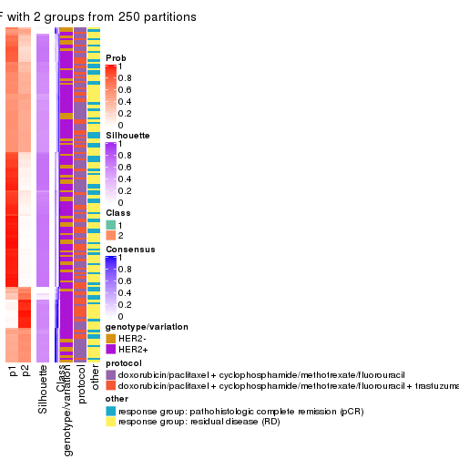</p>

</div>
<div id='tab-ATC-NMF-consensus-heatmap-2'>
<pre><code class="r">consensus_heatmap(res, k = 3)
</code></pre>

<p>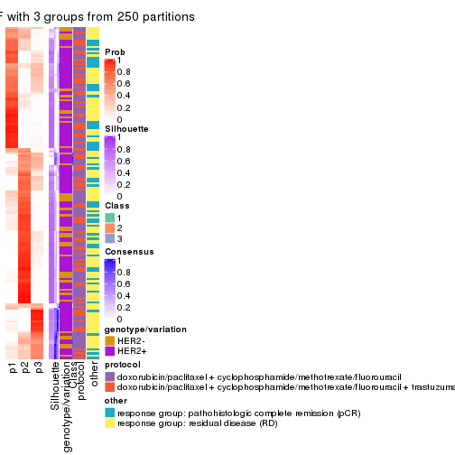</p>

</div>
<div id='tab-ATC-NMF-consensus-heatmap-3'>
<pre><code class="r">consensus_heatmap(res, k = 4)
</code></pre>

<p>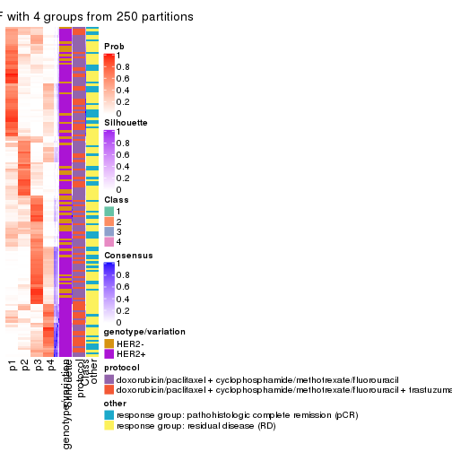</p>

</div>
<div id='tab-ATC-NMF-consensus-heatmap-4'>
<pre><code class="r">consensus_heatmap(res, k = 5)
</code></pre>

<p>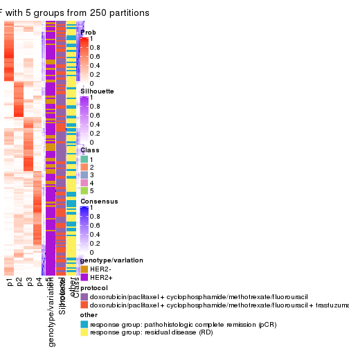</p>

</div>
<div id='tab-ATC-NMF-consensus-heatmap-5'>
<pre><code class="r">consensus_heatmap(res, k = 6)
</code></pre>

<p>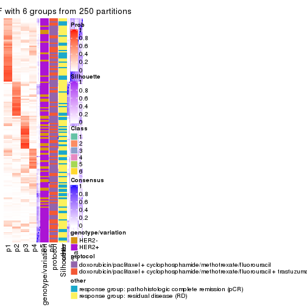</p>

</div>
</div>

Heatmaps for the membership of samples in all partitions to see how consistent they are:


<script>
$( function() {
	$( '#tabs-ATC-NMF-membership-heatmap' ).tabs();
} );
</script>
<div id='tabs-ATC-NMF-membership-heatmap'>
<ul>
<li><a href='#tab-ATC-NMF-membership-heatmap-1'>k = 2</a></li>
<li><a href='#tab-ATC-NMF-membership-heatmap-2'>k = 3</a></li>
<li><a href='#tab-ATC-NMF-membership-heatmap-3'>k = 4</a></li>
<li><a href='#tab-ATC-NMF-membership-heatmap-4'>k = 5</a></li>
<li><a href='#tab-ATC-NMF-membership-heatmap-5'>k = 6</a></li>
</ul>
<div id='tab-ATC-NMF-membership-heatmap-1'>
<pre><code class="r">membership_heatmap(res, k = 2)
</code></pre>

<p>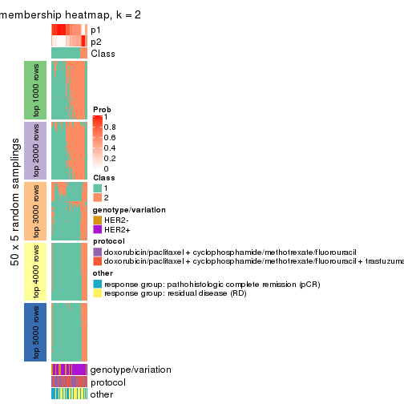</p>

</div>
<div id='tab-ATC-NMF-membership-heatmap-2'>
<pre><code class="r">membership_heatmap(res, k = 3)
</code></pre>

<p>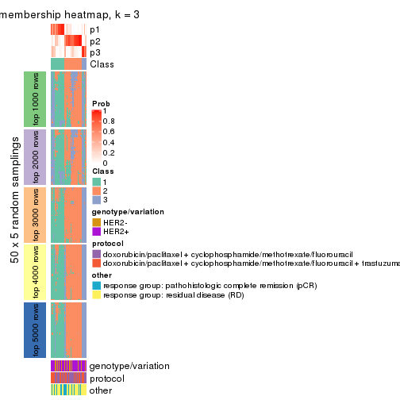</p>

</div>
<div id='tab-ATC-NMF-membership-heatmap-3'>
<pre><code class="r">membership_heatmap(res, k = 4)
</code></pre>

<p>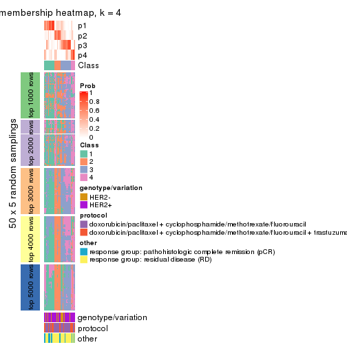</p>

</div>
<div id='tab-ATC-NMF-membership-heatmap-4'>
<pre><code class="r">membership_heatmap(res, k = 5)
</code></pre>

<p>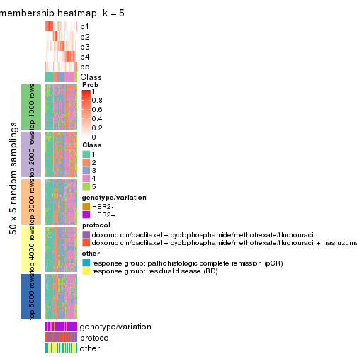</p>

</div>
<div id='tab-ATC-NMF-membership-heatmap-5'>
<pre><code class="r">membership_heatmap(res, k = 6)
</code></pre>

<p>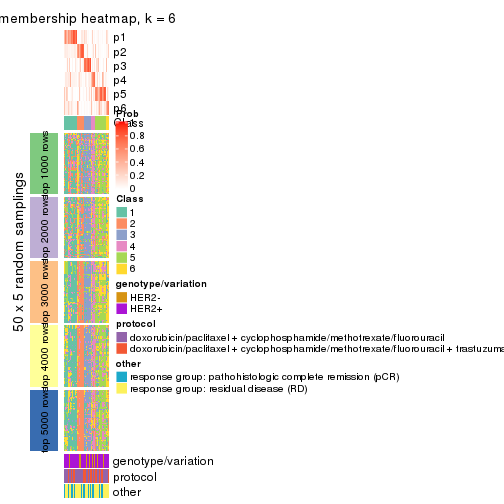</p>

</div>
</div>

As soon as we have had the classes for columns, we can look for signatures
which are significantly different between classes which can be candidate marks
for certain classes. Following are the heatmaps for signatures.


Signature heatmaps where rows are scaled:


<script>
$( function() {
	$( '#tabs-ATC-NMF-get-signatures' ).tabs();
} );
</script>
<div id='tabs-ATC-NMF-get-signatures'>
<ul>
<li><a href='#tab-ATC-NMF-get-signatures-1'>k = 2</a></li>
<li><a href='#tab-ATC-NMF-get-signatures-2'>k = 3</a></li>
<li><a href='#tab-ATC-NMF-get-signatures-3'>k = 4</a></li>
<li><a href='#tab-ATC-NMF-get-signatures-4'>k = 5</a></li>
<li><a href='#tab-ATC-NMF-get-signatures-5'>k = 6</a></li>
</ul>
<div id='tab-ATC-NMF-get-signatures-1'>
<pre><code class="r">get_signatures(res, k = 2)
</code></pre>

<pre><code>#&gt; Error: The width or height of the raster image is zero, maybe you forget to turn off the
#&gt; previous graphic device or it was corrupted. Run `dev.off()` to close it.
</code></pre>

<p></p>

</div>
<div id='tab-ATC-NMF-get-signatures-2'>
<pre><code class="r">get_signatures(res, k = 3)
</code></pre>

<pre><code>#&gt; Error: The width or height of the raster image is zero, maybe you forget to turn off the
#&gt; previous graphic device or it was corrupted. Run `dev.off()` to close it.
</code></pre>

<p></p>

</div>
<div id='tab-ATC-NMF-get-signatures-3'>
<pre><code class="r">get_signatures(res, k = 4)
</code></pre>

<pre><code>#&gt; Error: The width or height of the raster image is zero, maybe you forget to turn off the
#&gt; previous graphic device or it was corrupted. Run `dev.off()` to close it.
</code></pre>

<p></p>

</div>
<div id='tab-ATC-NMF-get-signatures-4'>
<pre><code class="r">get_signatures(res, k = 5)
</code></pre>

<pre><code>#&gt; Error: The width or height of the raster image is zero, maybe you forget to turn off the
#&gt; previous graphic device or it was corrupted. Run `dev.off()` to close it.
</code></pre>

<p></p>

</div>
<div id='tab-ATC-NMF-get-signatures-5'>
<pre><code class="r">get_signatures(res, k = 6)
</code></pre>

<pre><code>#&gt; Error: The width or height of the raster image is zero, maybe you forget to turn off the
#&gt; previous graphic device or it was corrupted. Run `dev.off()` to close it.
</code></pre>

<p></p>

</div>
</div>


Signature heatmaps where rows are not scaled:


<script>
$( function() {
	$( '#tabs-ATC-NMF-get-signatures-no-scale' ).tabs();
} );
</script>
<div id='tabs-ATC-NMF-get-signatures-no-scale'>
<ul>
<li><a href='#tab-ATC-NMF-get-signatures-no-scale-1'>k = 2</a></li>
<li><a href='#tab-ATC-NMF-get-signatures-no-scale-2'>k = 3</a></li>
<li><a href='#tab-ATC-NMF-get-signatures-no-scale-3'>k = 4</a></li>
<li><a href='#tab-ATC-NMF-get-signatures-no-scale-4'>k = 5</a></li>
<li><a href='#tab-ATC-NMF-get-signatures-no-scale-5'>k = 6</a></li>
</ul>
<div id='tab-ATC-NMF-get-signatures-no-scale-1'>
<pre><code class="r">get_signatures(res, k = 2, scale_rows = FALSE)
</code></pre>

<pre><code>#&gt; Error: The width or height of the raster image is zero, maybe you forget to turn off the
#&gt; previous graphic device or it was corrupted. Run `dev.off()` to close it.
</code></pre>

<p></p>

</div>
<div id='tab-ATC-NMF-get-signatures-no-scale-2'>
<pre><code class="r">get_signatures(res, k = 3, scale_rows = FALSE)
</code></pre>

<pre><code>#&gt; Error: The width or height of the raster image is zero, maybe you forget to turn off the
#&gt; previous graphic device or it was corrupted. Run `dev.off()` to close it.
</code></pre>

<p></p>

</div>
<div id='tab-ATC-NMF-get-signatures-no-scale-3'>
<pre><code class="r">get_signatures(res, k = 4, scale_rows = FALSE)
</code></pre>

<pre><code>#&gt; Error: The width or height of the raster image is zero, maybe you forget to turn off the
#&gt; previous graphic device or it was corrupted. Run `dev.off()` to close it.
</code></pre>

<p></p>

</div>
<div id='tab-ATC-NMF-get-signatures-no-scale-4'>
<pre><code class="r">get_signatures(res, k = 5, scale_rows = FALSE)
</code></pre>

<pre><code>#&gt; Error: The width or height of the raster image is zero, maybe you forget to turn off the
#&gt; previous graphic device or it was corrupted. Run `dev.off()` to close it.
</code></pre>

<p></p>

</div>
<div id='tab-ATC-NMF-get-signatures-no-scale-5'>
<pre><code class="r">get_signatures(res, k = 6, scale_rows = FALSE)
</code></pre>

<pre><code>#&gt; Error: The width or height of the raster image is zero, maybe you forget to turn off the
#&gt; previous graphic device or it was corrupted. Run `dev.off()` to close it.
</code></pre>

<p></p>

</div>
</div>


Compare the overlap of signatures from different k:

```r
compare_signatures(res)
```

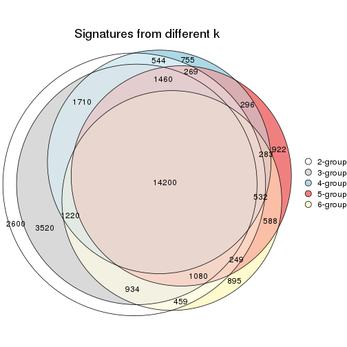

`get_signature()` returns a data frame invisibly. TO get the list of signatures, the function
call should be assigned to a variable explicitly. In following code, if `plot` argument is set
to `FALSE`, no heatmap is plotted while only the differential analysis is performed.

```r
# code only for demonstration
tb = get_signature(res, k = ..., plot = FALSE)
```

An example of the output of `tb` is:

```
#>   which_row         fdr    mean_1    mean_2 scaled_mean_1 scaled_mean_2 km
#> 1        38 0.042760348  8.373488  9.131774    -0.5533452     0.5164555  1
#> 2        40 0.018707592  7.106213  8.469186    -0.6173731     0.5762149  1
#> 3        55 0.019134737 10.221463 11.207825    -0.6159697     0.5749050  1
#> 4        59 0.006059896  5.921854  7.869574    -0.6899429     0.6439467  1
#> 5        60 0.018055526  8.928898 10.211722    -0.6204761     0.5791110  1
#> 6        98 0.009384629 15.714769 14.887706     0.6635654    -0.6193277  2
...
```

The columns in `tb` are:

1. `which_row`: row indices corresponding to the input matrix.
2. `fdr`: FDR for the differential test. 
3. `mean_x`: The mean value in group x.
4. `scaled_mean_x`: The mean value in group x after rows are scaled.
5. `km`: Row groups if k-means clustering is applied to rows.


UMAP plot which shows how samples are separated.


<script>
$( function() {
	$( '#tabs-ATC-NMF-dimension-reduction' ).tabs();
} );
</script>
<div id='tabs-ATC-NMF-dimension-reduction'>
<ul>
<li><a href='#tab-ATC-NMF-dimension-reduction-1'>k = 2</a></li>
<li><a href='#tab-ATC-NMF-dimension-reduction-2'>k = 3</a></li>
<li><a href='#tab-ATC-NMF-dimension-reduction-3'>k = 4</a></li>
<li><a href='#tab-ATC-NMF-dimension-reduction-4'>k = 5</a></li>
<li><a href='#tab-ATC-NMF-dimension-reduction-5'>k = 6</a></li>
</ul>
<div id='tab-ATC-NMF-dimension-reduction-1'>
<pre><code class="r">dimension_reduction(res, k = 2, method = &quot;UMAP&quot;)
</code></pre>

<p>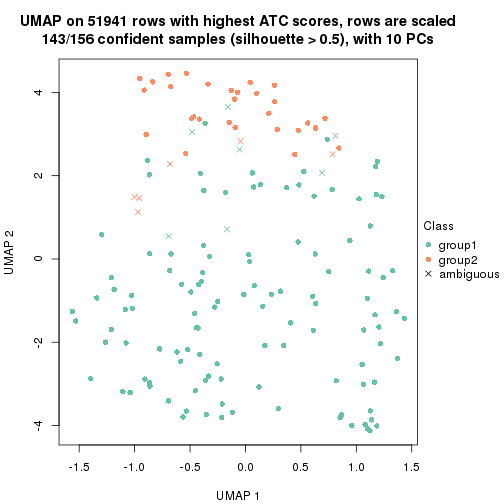</p>

</div>
<div id='tab-ATC-NMF-dimension-reduction-2'>
<pre><code class="r">dimension_reduction(res, k = 3, method = &quot;UMAP&quot;)
</code></pre>

<p>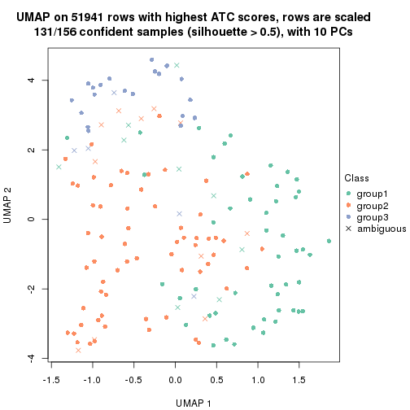</p>

</div>
<div id='tab-ATC-NMF-dimension-reduction-3'>
<pre><code class="r">dimension_reduction(res, k = 4, method = &quot;UMAP&quot;)
</code></pre>

<p>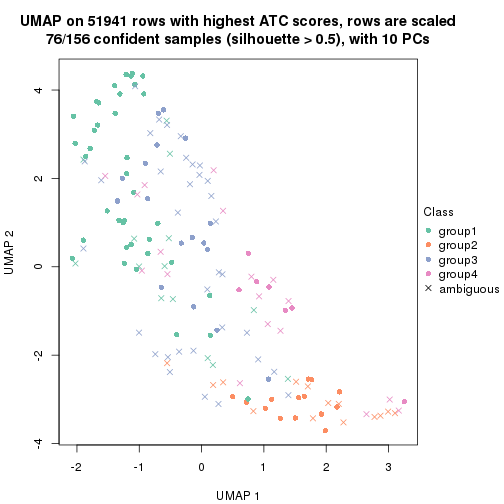</p>

</div>
<div id='tab-ATC-NMF-dimension-reduction-4'>
<pre><code class="r">dimension_reduction(res, k = 5, method = &quot;UMAP&quot;)
</code></pre>

<p>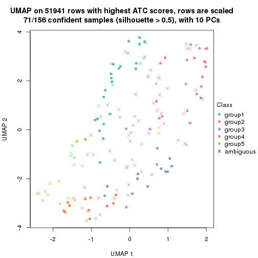</p>

</div>
<div id='tab-ATC-NMF-dimension-reduction-5'>
<pre><code class="r">dimension_reduction(res, k = 6, method = &quot;UMAP&quot;)
</code></pre>

<p>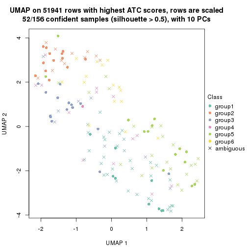</p>

</div>
</div>


Following heatmap shows how subgroups are split when increasing `k`:

```r
collect_classes(res)
```

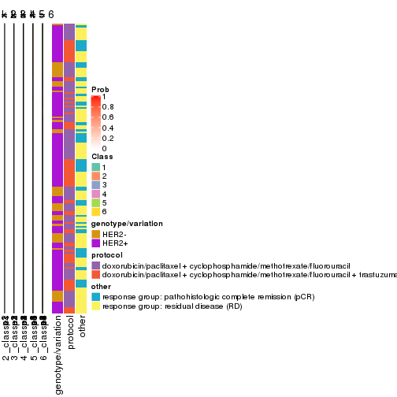


Test correlation between subgroups and known annotations. If the known
annotation is numeric, one-way ANOVA test is applied, and if the known
annotation is discrete, chi-squared contingency table test is applied.

```r
test_to_known_factors(res)
```

```
#>           n genotype/variation(p) protocol(p) other(p) k
#> ATC:NMF 143                0.5701       0.951    0.368 2
#> ATC:NMF 131                0.2773       0.644    0.449 3
#> ATC:NMF  76                0.0429       0.491    0.670 4
#> ATC:NMF  71                0.0110       0.513    0.742 5
#> ATC:NMF  52                0.2464       0.779    0.896 6
```


If matrix rows can be associated to genes, consider to use `functional_enrichment(res,
...)` to perform function enrichment for the signature genes. See [this vignette](http://bioconductor.org/packages/devel/bioc/vignettes/cola/inst/doc/functional_enrichment.html) for more detailed explanations.


 

## Session info


```r
sessionInfo()
```

```
#> R version 3.6.0 (2019-04-26)
#> Platform: x86_64-pc-linux-gnu (64-bit)
#> Running under: CentOS Linux 7 (Core)
#> 
#> Matrix products: default
#> BLAS:   /usr/lib64/libblas.so.3.4.2
#> LAPACK: /usr/lib64/liblapack.so.3.4.2
#> 
#> locale:
#>  [1] LC_CTYPE=en_GB.UTF-8       LC_NUMERIC=C               LC_TIME=en_GB.UTF-8       
#>  [4] LC_COLLATE=en_GB.UTF-8     LC_MONETARY=en_GB.UTF-8    LC_MESSAGES=en_GB.UTF-8   
#>  [7] LC_PAPER=en_GB.UTF-8       LC_NAME=C                  LC_ADDRESS=C              
#> [10] LC_TELEPHONE=C             LC_MEASUREMENT=en_GB.UTF-8 LC_IDENTIFICATION=C       
#> 
#> attached base packages:
#> [1] grid      stats     graphics  grDevices utils     datasets  methods   base     
#> 
#> other attached packages:
#> [1] genefilter_1.66.0    ComplexHeatmap_2.3.1 markdown_1.1         knitr_1.26          
#> [5] GetoptLong_0.1.7     cola_1.3.2          
#> 
#> loaded via a namespace (and not attached):
#>  [1] circlize_0.4.8       shape_1.4.4          xfun_0.11            slam_0.1-46         
#>  [5] lattice_0.20-38      splines_3.6.0        colorspace_1.4-1     vctrs_0.2.0         
#>  [9] stats4_3.6.0         blob_1.2.0           XML_3.98-1.20        survival_2.44-1.1   
#> [13] rlang_0.4.2          pillar_1.4.2         DBI_1.0.0            BiocGenerics_0.30.0 
#> [17] bit64_0.9-7          RColorBrewer_1.1-2   matrixStats_0.55.0   stringr_1.4.0       
#> [21] GlobalOptions_0.1.1  evaluate_0.14        memoise_1.1.0        Biobase_2.44.0      
#> [25] IRanges_2.18.3       parallel_3.6.0       AnnotationDbi_1.46.1 highr_0.8           
#> [29] Rcpp_1.0.3           xtable_1.8-4         backports_1.1.5      S4Vectors_0.22.1    
#> [33] annotate_1.62.0      skmeans_0.2-11       bit_1.1-14           microbenchmark_1.4-7
#> [37] brew_1.0-6           impute_1.58.0        rjson_0.2.20         png_0.1-7           
#> [41] digest_0.6.23        stringi_1.4.3        polyclip_1.10-0      clue_0.3-57         
#> [45] tools_3.6.0          bitops_1.0-6         magrittr_1.5         eulerr_6.0.0        
#> [49] RCurl_1.95-4.12      RSQLite_2.1.4        tibble_2.1.3         cluster_2.1.0       
#> [53] crayon_1.3.4         pkgconfig_2.0.3      zeallot_0.1.0        Matrix_1.2-17       
#> [57] xml2_1.2.2           httr_1.4.1           R6_2.4.1             mclust_5.4.5        
#> [61] compiler_3.6.0
```


